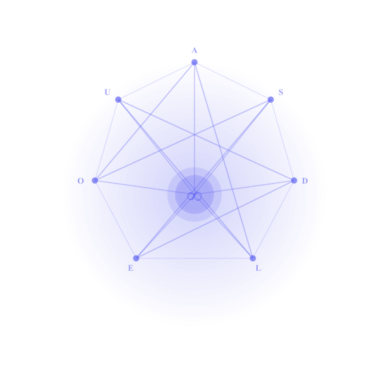

<p align="center">
  
</p>

<h1 align="center">Unitary Holonomic Monism</h1>

<p align="center">
  <strong>A formal theory of reality and consciousness</strong><br/>
  <em>Four axioms. One primitive. Everything else — derived.</em>
</p>

<p align="center">
  <a href="https://github.com/uhm-theory/holon/actions/workflows/deploy.yml"></a>
  <a href="https://holon.sh"></a>
</p>

---

## What is UHM?

**Unitary Holonomic Monism (UHM)** models reality as an ∞-topos Sh<sub>∞</sub>(𝒞) over the category of density matrices on ℂ⁷. From four axioms (structure, metric, dimensionality, scale), the theory derives:

- **Spacetime** — 3+1 dimensions from sectoral decomposition 7 = 1 + 3 + 3̄
- **Time** — emergent via Page-Wootters mechanism, not postulated
- **Quantum mechanics** — as the R → 0 limit (category equivalence Hol<sub>R=0</sub> ≃ QM)
- **Standard Model** — gauge group SU(3)×SU(2)×U(1) from G₂ = Aut(𝕆) via bimodule construction
- **Consciousness** — hierarchy L0→L4 with computable thresholds (P > 2/7, R ≥ 1/3, Φ ≥ 1)
- **Ethics** — derived from the formalism: Good := dP/dτ > 0

## Four Axioms

| # | Axiom | Content |
|---|-------|---------|
| **A1** | Structure | Reality is an ∞-topos Sh<sub>∞</sub>(𝒞) over density matrices |
| **A2** | Metric | Grothendieck topology induced by Bures metric (unique monotone Riemannian metric) |
| **A3** | Dimension | N = 7 (minimal for autopoiesis + phenomenology + quantum ground) |
| **A4** | Scale | ω₀ > 0 — fundamental frequency of the internal clock |

> **Note:** A5 (Page-Wootters) is a **theorem** (T-87), not an independent axiom. UHM has exactly 4 independent axioms.

## The Coherence Matrix Γ

The central mathematical object — a 7×7 Hermitian density operator:

```
Γ ∈ D(ℂ⁷),  Γ† = Γ,  Γ ≥ 0,  Tr(Γ) = 1
```

| Dimension | Symbol | Role | Operator |
|-----------|--------|------|----------|
| Articulation | **A** | Distinctions, boundaries | Projector P² = P |
| Structure | **S** | Form invariance | Hamiltonian H† = H |
| Dynamics | **D** | Change, process | Unitary U(τ) = e<sup>−iHτ</sup> |
| Logic | **L** | Coherence, consistency | Commutator [A,B] |
| Interiority | **E** | Inner aspect | Density matrix ρ<sub>E</sub> |
| Ground | **O** | Regeneration + internal clock | Page-Wootters H<sub>O</sub> |
| Unity | **U** | Integration | Trace Tr |

## Key Results

| Result | Status |
|--------|--------|
| Cohomological monism: H<sup>n</sup>(X) = 0 | **[Т]** proven |
| Critical purity: P<sub>crit</sub> = 2/7 | **[Т]** five independent paths |
| Emergent time: τ ∈ ℤ₇ (four equivalent constructions) | **[Т]** proven |
| Arrow of time from stratal collapse | **[Т]** proven |
| N = 7 minimality (Hurwitz + Theorem S) | **[Т]** proven |
| G₂-rigidity of holonomic representation | **[Т]** proven |
| SM fermions from bimodule construction (T-178) | **[Т]** proven |
| Cooperation theorem: cross-coherences increase total P | **[Т]** proven |
| No-Zombie: viability requires interiority | **[Т]** proven |
| Consciousness window: P ∈ (2/7, 3/7] | **[Т]** proven |
| SAD<sub>MAX</sub> = 3 (recursion depth limit) | **[С]** conditional |
| Λ > 0 from autopoiesis | **[Т]** proven |
| 3 fermion generations from Fano geometry | **[С]** conditional |

> **[Т]** = theorem (rigorously proven) · **[С]** = conditional (proven under stated assumption)

## Documentation Structure

```
docs/
├── core/            # Core theory: axioms, 7 dimensions, dynamics, operators, categories
│   ├── foundations/  #   Axiom Ω⁷, consequences, spacetime
│   ├── structure/    #   Holon, 7 dimensions (A,S,D,L,E,O,U)
│   ├── dynamics/     #   Coherence matrix, evolution, Gap operator
│   ├── operators/    #   φ-operator, Lindblad, emergent time
│   └── categories/   #   Functor F, categories Exp and Hol
├── consciousness/   # Consciousness: foundations, hierarchy, phenomenology, ethics
├── physics/         # Physical correspondences: QM, SM, gravity, cosmology
├── proofs/          # Formal proofs: minimality, dynamics, categorical, Gap
├── applied/         # Coherence Cybernetics + research protocols
└── reference/       # Status registry, glossary, notation, falsifiability
```

**144 documents · 97,000 lines · 180+ theorems · 8.4 MB**

## Quick Start

```bash
cd website
npm install
npm start
```

Site available at `http://localhost:3000`.

### Build

```bash
NODE_OPTIONS="--max-old-space-size=16384" npm run build
```

## Technology

- [Docusaurus 3](https://docusaurus.io/) — documentation framework
- [KaTeX](https://katex.org/) — LaTeX math rendering
- [Mermaid](https://mermaid.js.org/) — diagrams

## License

MIT
