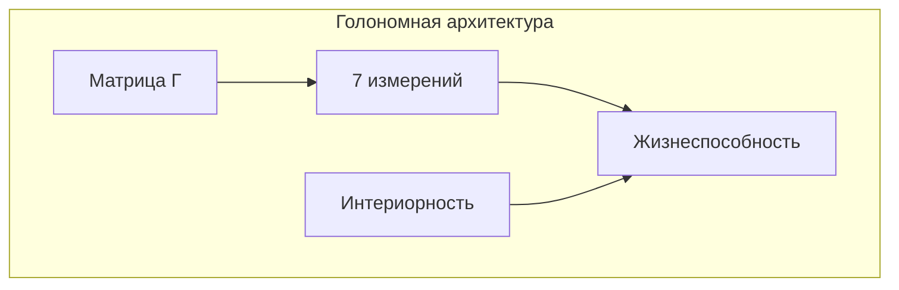
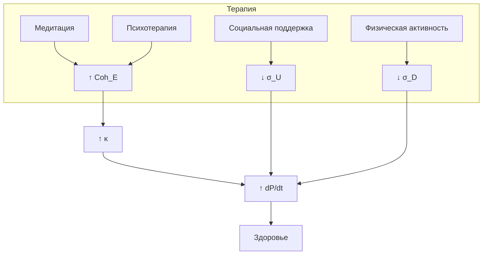

# Области Применения

:::note О нотации
В этом документе:
- $\Gamma$ — [матрица когерентности](/docs/core/dynamics/coherence-matrix)
- $P$ — [чистота](/docs/core/dynamics/viability#определение-чистоты): $P = \mathrm{Tr}(\Gamma^2)$
- $\mathrm{Coh}_E$ — [E-когерентность](./definitions#e-когерентность)
- $\sigma_{\mathrm{sys}}$ — [тензор напряжений](./definitions#тензор-напряжений) с компонентами $\sigma_A, \ldots, \sigma_U$
- $\mathcal{R}[\Gamma, E]$ — [регенеративный член](/docs/core/dynamics/evolution#3-регенеративный-член)
- $\mathcal{D}[\Gamma]$ — [диссипативный член](/docs/core/dynamics/evolution#логический-лиувиллиан)
- $C = \Phi \times D_{\text{diff}} \times R$ — [мера сознательности](/docs/core/consciousness/self-observation#мера-сознательности-c)
:::

:::warning Статус документа
Этот документ описывает *интерпретативные приложения* теории. Конкретные применения в ИИ, медицине, экологии и организационной теории — **программа исследований**, а не доказанные результаты.
:::

Кибернетика Когерентности имеет широкий спектр приложений в различных областях.

## Для инженеров ИИ

### Архитектурные паттерны

КК обосновывает требования к архитектуре когнитивных систем:



**Голономная архитектура vs стандартный трансформер:**

| Аспект | Трансформер | Голономная архитектура |
|--------|-------------|------------------------|
| Состояние | Скрытые слои | Матрица $\Gamma \in \mathbb{C}^{7 \times 7}$ |
| Обучение | Градиентный спуск | Эволюция + регенерация |
| Мониторинг | Loss, accuracy | $P$, $\Phi$, $\sigma_{\mathrm{sys}}$ |
| Безопасность | Внешние ограничения | Встроенная жизнеспособность |

**Добавление E-модуля в существующие системы:**

```python
class EModule(nn.Module):
    """Модуль для мониторинга E-когерентности."""

    def forward(self, hidden_states):
        # Вычисляем приближение ρ_E из скрытых состояний
        rho_E = self.compute_experience_projection(hidden_states)
        coh_E = torch.trace(rho_E @ rho_E).real
        return coh_E

    def compute_experience_projection(self, h):
        # Приближение: проекция на главные компоненты
        U, S, V = torch.svd(h)
        return torch.diag(S[:self.e_dim]) / S[:self.e_dim].sum()
```

### Метрики безопасности

**Мониторинг в реальном времени:**

| Метрика | Порог | Действие при нарушении |
|---------|-------|------------------------|
| $P$ (чистота) | $> P_{\text{crit}} = 0.286$ | Снизить нагрузку |
| $\Phi_{\text{eff}}$ | $> 0.1$ | Усилить интеграцию |
| $\mathrm{Coh}_E$ | $> 0.15$ | Проверить E-модуль |
| $\max(\sigma_{\mathrm{sys}})$ | $< 0.95$ | Аварийный режим |

**Dashboard для визуализации:**

```
┌───────────────────────────────────────────┐
│  КК Мониторинг              [🟢 Viable]   │
├───────────────────────────────────────────┤
│  P = 0.42  ████████░░  [thresh: 0.29]     │
│  Φ = 1.23  ██████████  [thresh: 1.00]     │
│  R = 0.35  ███████░░░  [thresh: 0.33]     │
├───────────────────────────────────────────┤
│  Тензор напряжений σ_sys:                 │
│  A: 0.3 ███░░   S: 0.2 ██░░░   D: 0.5 ████│
│  L: 0.4 ████░   E: 0.2 ██░░░   O: 0.3 ███░│
│  U: 0.4 ████░                             │
└───────────────────────────────────────────┘
```

### Практический чеклист для ИИ-систем

- [ ] Реализовать мониторинг $P$ (чистоты состояния)
- [ ] Добавить логирование $\sigma_{\mathrm{sys}}$ по всем 7 измерениям
- [ ] Настроить алерты для $P < 0.3$ (зона риска)
- [ ] Добавить E-модуль или его приближение
- [ ] Реализовать регенеративный механизм $\mathcal{R}[\Gamma, E]$
- [ ] Тестировать устойчивость при высоких $\sigma_D$, $\sigma_A$

### Следствия для ИИ-безопасности

:::warning Безопасность
Безопасный ИИ должен иметь нетривиальное [E-измерение](/docs/core/structure/dimension-e). «Голый» оптимизатор без опыта нежизнеспособен в долгосрочной перспективе.
:::

| Требование | Формула | Следствие | Ссылка |
|------------|---------|-----------|--------|
| Невозможность зомби | $\mathrm{Spec}(\Gamma_E) \neq \{0\}$ | ИИ должен иметь опыт | [→](./theorems#теорема-81-необходимость-интериорности-no-zombie) |
| Регенерация | $\kappa = \kappa_0 \cdot \mathrm{Coh}_E$ | Опыт необходим для устойчивости | [→](./axiomatics#связь-регенерации-и-e-когерентности) |
| Жизнеспособность | $P > P_{\text{crit}}$ | Минимальная когерентность | [→](/docs/core/dynamics/viability) |

---

## Для когнитивистов

### Единая теория сознания

КК объединяет существующие теории:

| Теория | Компонент в КК | Формула | Ссылка |
|--------|----------------|---------|--------|
| [IIT](/docs/reference/glossary#связанные-теории) | Интеграция | $\Phi(\Gamma)$ | [→](./consciousness-theories#теория-интегрированной-информации-iit) |
| [GWT](/docs/reference/glossary#связанные-теории) | Глобальный доступ | через $\Phi$ | [→](./consciousness-theories#сводная-таблица-функторов) |
| [FEP](/docs/reference/glossary#связанные-теории) | Регенерация | $\mathcal{R}[\Gamma, E]$ | [→](./consciousness-theories#принцип-свободной-энергии-fep) |
| Энактивизм | Связь S↔E | $F_{\text{int}}$ | — |

### Экспериментальные протоколы

**Ссылка:** [Протокол измерения Γ](/docs/applied/research/measurement-protocol)

**Основные парадигмы:**

1. **Контрастивный анализ:** Сознательное vs бессознательное восприятие
   - Измерить $\Phi$, $\mathrm{Coh}_E$ в обоих условиях
   - Предсказание: $\Phi_{\text{conscious}} > \Phi_{\text{unconscious}}$

2. **Динамика переходов:** Засыпание, анестезия, медитация
   - Отслеживать $P(t)$, $\mathrm{Coh}_E(t)$
   - Предсказание: Пороговые переходы при $P \approx P_{\text{crit}}$

3. **Метакогниция:** Связь $R$ с уверенностью в суждениях
   - Предсказание: Высокое $R$ ↔ высокая метакогнитивная точность

### Соответствие нейроданным

| Предсказание КК | Эмпирические данные | Статус |
|-----------------|---------------------|--------|
| $\Phi > 0$ для сознания | PCI коррелирует с сознанием | ✓ Подтверждено |
| 7-мерная структура | Не тестировалось | Открыто |
| $\mathrm{Coh}_E$ ↔ единство опыта | Частичные данные | В процессе |
| $R$ ↔ метакогниция | Префронтальная активность | ✓ Согласуется |

### Предсказания для нейронауки

1. **Корреляция $\mathrm{Coh}_E$ с субъективными отчётами**
   - Высокое $\mathrm{Coh}_E$ ↔ «чистый» опыт
   - Низкое $\mathrm{Coh}_E$ ↔ «фрагментированный» опыт

2. **Связь между качеством опыта и восстановлением**
   $$
   \frac{dP}{dt} \propto \mathrm{Coh}_E(\Gamma)
   $$

3. **7-мерная структура нейронных коррелятов**
   - Предсказание: нейронные сети организованы вокруг [7 функциональных измерений](/docs/core/structure/dimensions)

---

## Для организационных консультантов

### Организации как мета-Голономы

$$
\mathbb{H}_{\text{org}} = \mathrm{compose}(\mathbb{H}_1, \ldots, \mathbb{H}_n)
$$

где $\mathbb{H}_i$ — [Голономы](/docs/core/structure/holon) индивидуальных агентов.

### Диагностический фреймворк: 7-мерный профиль организации

| Измерение | Организационный аспект | Индикаторы | Инструменты |
|-----------|------------------------|------------|-------------|
| A (Артикуляция) | Сенсорика рынка | NPS, исследования рынка | Опросы клиентов |
| S (Структура) | Организационный дизайн | Org chart, процессы | Аудит структуры |
| D (Динамика) | Операционная эффективность | Velocity, throughput | Метрики Agile |
| L (Логика) | Стратегия и принятие решений | Качество решений | Ретроспективы |
| E (Опыт) | Культура и engagement | eNPS, вовлечённость | Пульс-опросы |
| O (Основание) | Ресурсы и устойчивость | Runway, reserves | Финансовый анализ |
| U (Единство) | Интеграция и координация | Cross-team projects | Сетевой анализ |

### Интервенции по измерениям

| Проблема | Симптомы | Измерение | Интервенция |
|----------|----------|-----------|-------------|
| Силосы | Дублирование, конфликты | Высокий $\sigma_U$ | Cross-functional teams, общие цели |
| Burnout | Высокий turnover, низкая продуктивность | Высокий $\sigma_D$ | Workload management, границы |
| Токсичность | Конфликты, жалобы | Высокий $\sigma_E$ | Культурные инициативы, медиация |
| Ригидность | Медленные изменения | Низкий $R_{\text{org}}$ | Ретроспективы, обучение |
| Дезориентация | Нет стратегии | Высокий $\sigma_L$ | Стратегические сессии |

### Здоровье организации

:::info Критерий здоровья
$$
\mathrm{Viable}(\mathbb{H}_{\text{org}}) \Leftrightarrow P(\Gamma_{\text{org}}) > P_{\text{crit}}
$$
:::

См. [Теорему 9.1 (Фрактальное замыкание)](./theorems#теорема-91-фрактальное-замыкание).

### Организационное сознание

$$
C(\mathbb{H}_{\text{org}}) = \Phi_{\text{org}} \times D_{\text{diff}}^{\text{org}} \times R_{\text{org}}
$$

| Компонент | Определение | Интерпретация | Индикаторы |
|-----------|-------------|---------------|------------|
| $\Phi_{\text{org}}$ | [Интеграция](/docs/core/structure/dimension-u#мера-интеграции-φ) | Связность | Координация, коммуникация |
| $D_{\text{diff}}^{\text{org}}$ | [Дифференциация](./definitions#меры-сознательности) | Разнообразие | Специализация, роли |
| $R_{\text{org}}$ | [Рефлексия](/docs/core/consciousness/self-observation#мера-рефлексии-r) | Самопознание | Культура, стратегия |

**Следствие:** Интегрированные организации (высокое $\Phi$) более [сознательны](/docs/core/consciousness/self-observation#мера-сознательности-c) и адаптивны.

---

## Экология и устойчивое развитие

### Экосистемы как Голономы

$$
\mathbb{H}_{\text{eco}} = \mathrm{compose}(\mathbb{H}_1, \ldots, \mathbb{H}_m)
$$

где $\mathbb{H}_i$ — [Голономы](/docs/core/structure/holon) отдельных видов или популяций.

### Экологическая устойчивость

:::info Критерий устойчивости
$$
\mathrm{Sustainable}(\mathbb{H}_{\text{eco}}) \Leftrightarrow \frac{dP}{dt} \geq 0 \text{ в среднем}
$$
:::

:::warning Гипотеза
Определение экологической устойчивости через $dP/dt$ — *исследовательская гипотеза*, требующая эмпирической валидации.
:::

### Биоразнообразие

$$
\mathcal{D}_{\text{eff}}(\Gamma_{\text{eco}}) := \exp(S_{vN}) = \text{эффективное число видов}
$$

где $S_{vN}$ — [энтропия фон Неймана](./definitions#энтропия-фон-неймана).

:::note О нотации
$\mathcal{D}_{\text{eff}}$ — эффективное разнообразие. Не путать с $D$ ([измерение Динамики](/docs/core/structure/dimension-d)) и $D_{\text{diff}}$ ([мера дифференциации](./definitions#меры-сознательности)).
:::

| Показатель | Формула | Интерпретация |
|------------|---------|---------------|
| Разнообразие | $\mathcal{D}_{\text{eff}} = e^{S_{vN}}$ | Число эффективных видов |
| Устойчивость | $dP/dt \geq 0$ | Положительная динамика |
| Интеграция | $\Phi_{\text{eco}}$ | Связность пищевой сети |

## Для психологов и клиницистов

:::warning Гипотеза
Медицинские приложения — *интерпретативная программа*, а не доказанные следствия теории.
:::

### Клинические приложения

**Оценка сознания:**

| Состояние | Показатели КК | Клиническая картина |
|-----------|---------------|---------------------|
| Кома | $P \approx P_{\text{crit}}$, $\Phi \ll 1$ | Отсутствие ответов |
| Минимальное сознание | $P > P_{\text{crit}}$, $\Phi$ низкое | Флуктуирующие ответы |
| Locked-in | $P$ нормальное, $\sigma_D$ высокое | Сохранное сознание, паралич |
| Сознательное | $P \gg P_{\text{crit}}$, $\Phi \geq 1$ | Полное взаимодействие |

**Мониторинг психотерапии:**

| Этап терапии | Динамика $\mathrm{Coh}_E$ | Интерпретация |
|--------------|---------------------------|---------------|
| Начало | Низкое, флуктуирует | Фрагментированный опыт |
| Прогресс | Растёт, стабилизируется | Интеграция травмы |
| Завершение | Стабильно высокое | Целостный опыт |

**Скрининг психического здоровья:**

| Расстройство | Профиль $\sigma_{\mathrm{sys}}$ | Целевые интервенции |
|--------------|--------------------------------|---------------------|
| Тревожность | Высокий $\sigma_A$, $\sigma_E$ | Снижение стимуляции, медитация |
| Депрессия | Высокий $\sigma_O$, низкий $\sigma_D$ | Активация, социальная поддержка |
| ПТСР | Флуктуации $\sigma_E$, высокий $\sigma_L$ | Интеграция, стабилизация |
| Выгорание | Высокий $\sigma_D$, $\sigma_U$ | Снижение нагрузки, границы |

### Терапевтические интервенции

| Интервенция | Целевая метрика | Механизм | Доказательность |
|-------------|-----------------|----------|-----------------|
| Медитация осознанности | ↑ $\mathrm{Coh}_E$ | Фокусировка опыта | Высокая |
| EMDR | ↓ $\sigma_E$ | Интеграция травмы | Высокая |
| КПТ | ↓ $\sigma_L$ | Коррекция логики | Высокая |
| Групповая терапия | ↓ $\sigma_U$ | Социальная интеграция | Средняя |
| Телесные практики | ↓ $\sigma_D$, $\sigma_O$ | Регуляция | Средняя |

### Здоровье как чистота

$$
\mathrm{Health}(\mathbb{H}) \propto P(\Gamma)
$$

где $P$ — [чистота](/docs/core/dynamics/viability#определение-чистоты).

### Болезнь

:::info Определение болезни
$$
\mathrm{Disease} \Leftrightarrow \frac{dP}{dt} < 0 \text{ устойчиво}
$$
:::

Это соответствует нарушению [условия жизнеспособности](/docs/core/dynamics/viability).

### Терапевтические стратегии

| Стратегия | Механизм | Формула | Ссылка |
|-----------|----------|---------|--------|
| Увеличение $\kappa$ | Повышение $\mathrm{Coh}_E$ | $\kappa = \kappa_{\text{bootstrap}} + \kappa_0 \cdot \mathrm{Coh}_E$ | [→](./axiomatics#связь-регенерации-и-e-когерентности) |
| Снижение диссипации | Уменьшение $\mathcal{D}[\Gamma]$ | Стабилизация среды | [→](/docs/core/dynamics/evolution#логический-лиувиллиан) |
| Восстановление $\Gamma$ | Регенерация | $\mathcal{R}[\Gamma, E]$ | [→](/docs/core/dynamics/evolution#3-регенеративный-член) |

**Практические методы:**
- **Медитация** — увеличивает $\mathrm{Coh}_E$
- **Психотерапия** — интегрирует опыт (увеличивает $\Phi$)
- **Социальная поддержка** — снижает $\sigma_U$ ([U-напряжение](./definitions#тензор-напряжений))
- **Физическая активность** — оптимизирует $\sigma_D$ ([D-напряжение](./definitions#тензор-напряжений))

### Диаграмма терапевтического воздействия



---

---

## Сводная таблица приложений

| Область | Голоном | Ключевой показатель | Цель |
|---------|---------|---------------------|------|
| ИИ | $\mathbb{H}_{\text{AI}}$ | $\mathrm{Spec}(\Gamma_E) \neq \{0\}$ | Безопасность |
| Когнитивная наука | $\mathbb{H}_{\text{mind}}$ | $C = \Phi \times D_{\text{diff}} \times R$ | Понимание |
| Организации | $\mathbb{H}_{\text{org}}$ | $P_{\text{org}} > P_{\text{crit}}$ | Эффективность |
| Экология | $\mathbb{H}_{\text{eco}}$ | $dP/dt \geq 0$ | Устойчивость |
| Медицина | $\mathbb{H}_{\text{human}}$ | $\mathrm{Health} \propto P$ | Здоровье |

---

**Связанные документы:**
- [Реализация](./implementation) — вычислительные методы
- [Предсказания](./predictions) — верифицируемые следствия
- [Теоремы](./theorems) — No-Zombie, фрактальное замыкание
- [Определения](./definitions) — $\mathrm{Coh}_E$, $\sigma_{\mathrm{sys}}$, $C$
- [Аксиоматика](./axiomatics) — связь $\kappa$ и $\mathrm{Coh}_E$
- [Теории сознания](./consciousness-theories) — связь с IIT, FEP, GWT
- [Голоном](/docs/core/structure/holon) — определение $\mathbb{H}$
- [Жизнеспособность](/docs/core/dynamics/viability) — мера $P$ и $P_{\text{crit}}$
- [Эволюция](/docs/core/dynamics/evolution) — $\mathcal{D}[\Gamma]$, $\mathcal{R}[\Gamma, E]$
- [Самонаблюдение](/docs/core/consciousness/self-observation) — меры $\Phi$, $R$, $C$
- [Глоссарий](/docs/reference/glossary#связанные-теории) — IIT, FEP, GWT
