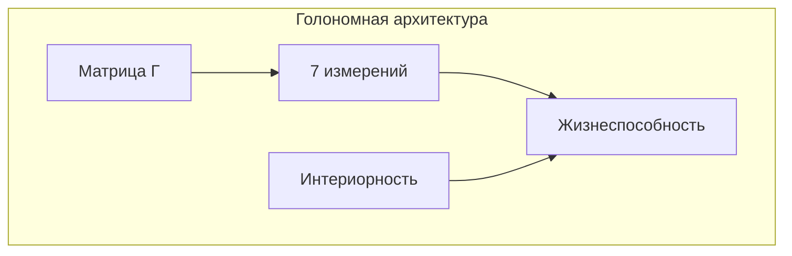
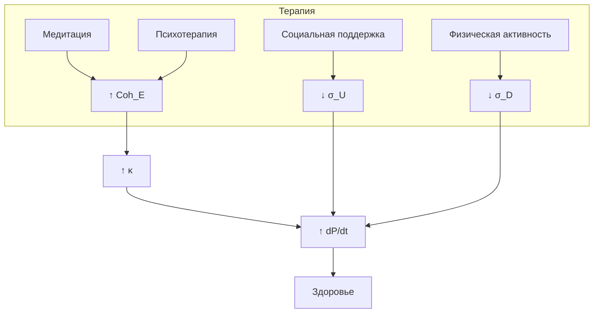

# Области Применения

:::note О нотации
В этом документе:
- $\Gamma$ — [матрица когерентности](/docs/core/dynamics/coherence-matrix)
- $P$ — [чистота](/docs/core/dynamics/viability#определение-чистоты): $P = \mathrm{Tr}(\Gamma^2)$
- $\mathrm{Coh}_E$ — [E-когерентность](./definitions#e-когерентность)
- $\sigma_{\mathrm{sys}}$ — [тензор напряжений](./definitions#тензор-напряжений) с компонентами $\sigma_A, \ldots, \sigma_U$
- $\mathcal{R}[\Gamma, E]$ — [регенеративный член](/docs/core/dynamics/evolution#3-регенеративный-член)
- $\mathcal{D}[\Gamma]$ — [диссипативный член](/docs/core/dynamics/evolution#2-диссипативный-член)
- $C = \Phi \times D_{\text{diff}} \times R$ — [мера сознательности](/docs/core/consciousness/self-observation#мера-сознательности-c)
:::

:::warning Статус документа
Этот документ описывает *интерпретативные приложения* теории. Конкретные применения в ИИ, медицине, экологии и организационной теории — **программа исследований**, а не доказанные результаты.
:::

Кибернетика Когерентности имеет широкий спектр приложений в различных областях.

## Искусственный интеллект

### Архитектура когнитивных систем

КК обосновывает требования к архитектуре когнитивных систем:

**Ключевые компоненты:**
- [7-компонентный тензор напряжений](./definitions#тензор-напряжений)
- Условие [жизнеспособности](/docs/core/dynamics/viability) через [чистоту](/docs/core/dynamics/viability#определение-чистоты)
- [Невозможность зомби-ИИ](./theorems#теорема-81-необходимость-интериорности-no-zombie)
- [Необходимость интериорности](/docs/proofs/interiority-hierarchy#уровень-0-интериорность-interiority) для устойчивости

### Следствия для ИИ-безопасности

:::warning Безопасность
Безопасный ИИ должен иметь нетривиальное [E-измерение](/docs/core/structure/dimension-e). «Голый» оптимизатор без опыта нежизнеспособен в долгосрочной перспективе.
:::

| Требование | Формула | Следствие | Ссылка |
|------------|---------|-----------|--------|
| Невозможность зомби | $\mathrm{Spec}(\Gamma_E) \neq \{0\}$ | ИИ должен иметь опыт | [→](./theorems#теорема-81-необходимость-интериорности-no-zombie) |
| Регенерация | $\kappa = \kappa_0 \cdot \mathrm{Coh}_E$ | Опыт необходим для устойчивости | [→](./axiomatics#связь-регенерации-и-e-когерентности) |
| Жизнеспособность | $P > P_{\text{critical}}$ | Минимальная когерентность | [→](/docs/core/dynamics/viability) |

## Когнитивная наука

### Единая теория сознания

КК объединяет существующие теории:

| Теория | Компонент в КК | Формула | Ссылка |
|--------|----------------|---------|--------|
| [IIT](/docs/reference/glossary#связанные-теории) | Интеграция | $\Phi(\Gamma)$ | [→](./hierarchy#теория-интегрированной-информации-iit) |
| [GWT](/docs/reference/glossary#связанные-теории) | Глобальный доступ | через $\Phi$ | [→](./hierarchy#сравнительная-таблица) |
| [FEP](/docs/reference/glossary#связанные-теории) | Регенерация | $\mathcal{R}[\Gamma, E]$ | [→](./hierarchy#принцип-свободной-энергии-fep) |
| Энактивизм | Связь S↔E | $F_{\text{int}}$ | — |

### Предсказания для нейронауки

1. **Корреляция $\mathrm{Coh}_E$ с субъективными отчётами**
   - Высокое $\mathrm{Coh}_E$ ↔ «чистый» опыт
   - Низкое $\mathrm{Coh}_E$ ↔ «фрагментированный» опыт

2. **Связь между качеством опыта и восстановлением**
   $$
   \frac{dP}{dt} \propto \mathrm{Coh}_E(\Gamma)
   $$

3. **7-мерная структура нейронных коррелятов**
   - Предсказание: нейронные сети организованы вокруг [7 функциональных измерений](/docs/core/structure/dimensions)

## Организационная теория

### Организации как мета-Голономы

$$
\mathbb{H}_{\text{org}} = \mathrm{compose}(\mathbb{H}_1, \ldots, \mathbb{H}_n)
$$

где $\mathbb{H}_i$ — [Голономы](/docs/core/structure/holon) индивидуальных агентов.

### Здоровье организации

:::info Критерий здоровья
$$
\mathrm{Viable}(\mathbb{H}_{\text{org}}) \Leftrightarrow P(\Gamma_{\text{org}}) > P_{\text{critical}}
$$
:::

См. [Теорему 9.1 (Фрактальное замыкание)](./theorems#теорема-91-фрактальное-замыкание).

### Организационное сознание

$$
C(\mathbb{H}_{\text{org}}) = \Phi_{\text{org}} \times D_{\text{diff}}^{\text{org}} \times R_{\text{org}}
$$

| Компонент | Определение | Интерпретация | Индикаторы |
|-----------|-------------|---------------|------------|
| $\Phi_{\text{org}}$ | [Интеграция](/docs/core/structure/dimension-u#мера-интеграции-φ) | Связность | Координация, коммуникация |
| $D_{\text{diff}}^{\text{org}}$ | [Дифференциация](./definitions#меры-сознательности) | Разнообразие | Специализация, роли |
| $R_{\text{org}}$ | [Рефлексия](/docs/core/consciousness/self-observation#мера-рефлексии-r) | Самопознание | Культура, стратегия |

**Следствие:** Интегрированные организации (высокое $\Phi$) более [сознательны](/docs/core/consciousness/self-observation#мера-сознательности-c) и адаптивны.

## Экология и устойчивое развитие

### Экосистемы как Голономы

$$
\mathbb{H}_{\text{eco}} = \mathrm{compose}(\mathbb{H}_1, \ldots, \mathbb{H}_m)
$$

где $\mathbb{H}_i$ — [Голономы](/docs/core/structure/holon) отдельных видов или популяций.

### Экологическая устойчивость

:::info Критерий устойчивости
$$
\mathrm{Sustainable}(\mathbb{H}_{\text{eco}}) \Leftrightarrow \frac{dP}{dt} \geq 0 \text{ в среднем}
$$
:::

:::warning Гипотеза
Определение экологической устойчивости через $dP/dt$ — *исследовательская гипотеза*, требующая эмпирической валидации.
:::

### Биоразнообразие

$$
\mathcal{D}_{\text{eff}}(\Gamma_{\text{eco}}) := \exp(S_{vN}) = \text{эффективное число видов}
$$

где $S_{vN}$ — [энтропия фон Неймана](./definitions#энтропия-фон-неймана).

:::note О нотации
$\mathcal{D}_{\text{eff}}$ — эффективное разнообразие. Не путать с $D$ ([измерение Динамики](/docs/core/structure/dimension-d)) и $D_{\text{diff}}$ ([мера дифференциации](./definitions#меры-сознательности)).
:::

| Показатель | Формула | Интерпретация |
|------------|---------|---------------|
| Разнообразие | $\mathcal{D}_{\text{eff}} = e^{S_{vN}}$ | Число эффективных видов |
| Устойчивость | $dP/dt \geq 0$ | Положительная динамика |
| Интеграция | $\Phi_{\text{eco}}$ | Связность пищевой сети |

## Медицина и здоровье

:::warning Гипотеза
Медицинские приложения — *интерпретативная программа*, а не доказанные следствия теории.
:::

### Здоровье как чистота

$$
\mathrm{Health}(\mathbb{H}) \propto P(\Gamma)
$$

где $P$ — [чистота](/docs/core/dynamics/viability#определение-чистоты).

### Болезнь

:::info Определение болезни
$$
\mathrm{Disease} \Leftrightarrow \frac{dP}{dt} < 0 \text{ устойчиво}
$$
:::

Это соответствует нарушению [условия жизнеспособности](/docs/core/dynamics/viability).

### Терапевтические стратегии

| Стратегия | Механизм | Формула | Ссылка |
|-----------|----------|---------|--------|
| Увеличение $\kappa$ | Повышение $\mathrm{Coh}_E$ | $\kappa = \kappa_0 \cdot \mathrm{Coh}_E$ | [→](./axiomatics#связь-регенерации-и-e-когерентности) |
| Снижение диссипации | Уменьшение $\mathcal{D}[\Gamma]$ | Стабилизация среды | [→](/docs/core/dynamics/evolution#2-диссипативный-член) |
| Восстановление $\Gamma$ | Регенерация | $\mathcal{R}[\Gamma, E]$ | [→](/docs/core/dynamics/evolution#3-регенеративный-член) |

**Практические методы:**
- **Медитация** — увеличивает $\mathrm{Coh}_E$
- **Психотерапия** — интегрирует опыт (увеличивает $\Phi$)
- **Социальная поддержка** — снижает $\sigma_U$ ([U-напряжение](./definitions#тензор-напряжений))
- **Физическая активность** — оптимизирует $\sigma_D$ ([D-напряжение](./definitions#тензор-напряжений))

### Диаграмма терапевтического воздействия

---

## Сводная таблица приложений

| Область | Голоном | Ключевой показатель | Цель |
|---------|---------|---------------------|------|
| ИИ | $\mathbb{H}_{\text{AI}}$ | $\mathrm{Spec}(\Gamma_E) \neq \{0\}$ | Безопасность |
| Когнитивная наука | $\mathbb{H}_{\text{mind}}$ | $C = \Phi \times D_{\text{diff}} \times R$ | Понимание |
| Организации | $\mathbb{H}_{\text{org}}$ | $P_{\text{org}} > P_{\text{critical}}$ | Эффективность |
| Экология | $\mathbb{H}_{\text{eco}}$ | $dP/dt \geq 0$ | Устойчивость |
| Медицина | $\mathbb{H}_{\text{human}}$ | $\mathrm{Health} \propto P$ | Здоровье |

---

**Связанные документы:**
- [Реализация](./implementation) — вычислительные методы
- [Предсказания](./predictions) — верифицируемые следствия
- [Теоремы](./theorems) — No-Zombie, фрактальное замыкание
- [Определения](./definitions) — $\mathrm{Coh}_E$, $\sigma_{\mathrm{sys}}$, $C$
- [Аксиоматика](./axiomatics) — связь $\kappa$ и $\mathrm{Coh}_E$
- [Иерархия](./hierarchy) — связь с IIT, FEP, GWT
- [Голоном](/docs/core/structure/holon) — определение $\mathbb{H}$
- [Жизнеспособность](/docs/core/dynamics/viability) — мера $P$ и $P_{\text{critical}}$
- [Эволюция](/docs/core/dynamics/evolution) — $\mathcal{D}[\Gamma]$, $\mathcal{R}[\Gamma, E]$
- [Самонаблюдение](/docs/core/consciousness/self-observation) — меры $\Phi$, $R$, $C$
- [Глоссарий](/docs/reference/glossary#связанные-теории) — IIT, FEP, GWT
