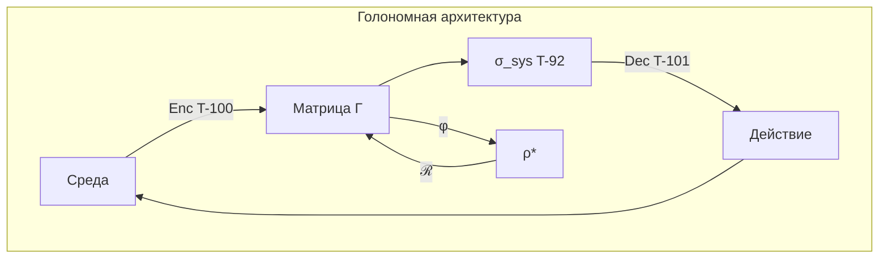
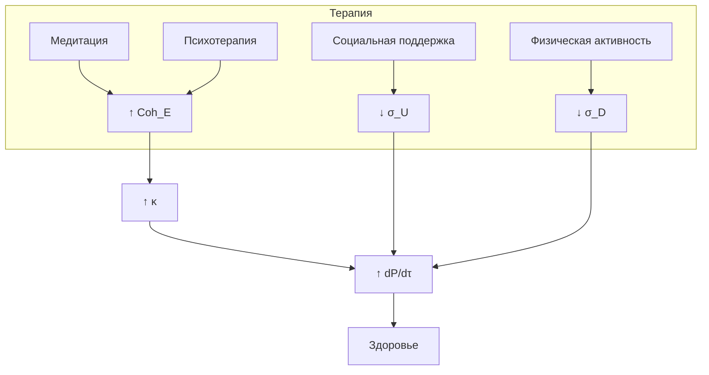

# Области Применения

> *«Нет ничего более практичного, чем хорошая теория.»*
> — Курт Левин

:::tip Мост из предыдущей главы
В [предыдущей главе](./research-programs) мы составили карту неизведанного — открытые проблемы, экспериментальные протоколы, междисциплинарные мосты. Теперь покажем, что КК уже сейчас — рабочий инструмент. Один и тот же формализм $\Gamma$ применим к ИИ-агенту, коралловому рифу, стартапу и финансовому рынку. Различается только операционализация — *что именно* мы измеряем, — а структура диагностики и интервенции одна.
:::

:::info Дорожная карта главы
В этой главе мы:
1. Покажем **архитектурные паттерны** для ИИ-инженеров и проведём кейс-стади галлюцинирующей LLM (§1)
2. Опишем **единую теорию сознания** для когнитивистов (§2)
3. Построим **диагностический фреймворк** для организационных консультантов (§3)
4. Покажем **экосистемы как голономы** и кейс-стади кораллового рифа (§4)
5. Опишем **σ-диагностику** психических расстройств (§5)
6. Применим КК к **образованию** — обучение как рост когерентности (§6)
7. Спроецируем формализм на **экономику** и **урбанистику** (§7–8)
8. Проведём **три полноценных кейс-стади** — ИИ-агент, организация, экосистема (§9)
9. Представим **междисциплинарную таблицу перевода** — единый язык для всех областей (§10)
:::

Теория, которая не может коснуться реальности, остаётся упражнением в элегантности. Но когда математический формализм начинает *работать* — когда абстрактные теоремы превращаются в инженерные чертежи, клинические протоколы и управленческие решения — он перестаёт быть теорией и становится **инструментом**.

Эта глава — о превращении Кибернетики Когерентности из математического каркаса в рабочий инструмент. Мы покажем, как одно и то же уравнение эволюции $\Gamma$ порождает конкретные метрики для инженера ИИ, клинициста, эколога, педагога и экономиста. В каждом случае мы идём одним маршрутом:

1. **Идентификация системы** — что является Голономом $\mathbb{H}$ в данной области?
2. **Построение $\Gamma$** — какие наблюдаемые отображаются на 7 измерений?
3. **Диагностика** — что говорит $\sigma_{\mathrm{sys}}$ о текущем состоянии?
4. **Интервенция** — как изменить $\Gamma$ в желаемом направлении?
5. **Мониторинг** — как отслеживать $P$, $\Phi$, $R$ во времени?

Этот пятишаговый цикл универсален. Различаются лишь конкретные операционализации — *что именно* мы измеряем и *как именно* вмешиваемся. Ниже мы пройдём этот цикл для каждой области, начиная с наиболее формализованной (ИИ) и двигаясь к наиболее спекулятивным (экономика, урбанистика).

:::note О нотации
В этом документе:
- $\Gamma$ — [матрица когерентности](/docs/core/dynamics/coherence-matrix)
- $P$ — [чистота](/docs/core/dynamics/viability#определение-чистоты): $P = \mathrm{Tr}(\Gamma^2)$
- $\mathrm{Coh}_E$ — [E-когерентность](./definitions#e-когерентность)
- $\sigma_{\mathrm{sys}}$ — [тензор напряжений](./definitions#тензор-напряжений) с компонентами $\sigma_A, \ldots, \sigma_U$
- $\mathcal{R}[\Gamma, E]$ — [регенеративный член](/docs/core/dynamics/evolution#3-регенеративный-член)
- $\mathcal{D}[\Gamma]$ — [диссипативный член](/docs/core/dynamics/evolution#логический-лиувиллиан)
- $C = \Phi \times R$ — [мера сознательности](/docs/consciousness/foundations/self-observation#мера-сознательности-c) **[Т T-140]**; $D_{\text{diff}} \geq D_{\min}$ — отдельное условие жизнеспособности
:::

:::warning Статус документа
Этот документ описывает *интерпретативные приложения* теории. Конкретные применения в ИИ, медицине, экологии и организационной теории — **программа исследований**, а не доказанные результаты.
:::

---

## Для инженеров ИИ

### Архитектурные паттерны

КК обосновывает требования к архитектуре когнитивных систем. Ключевое дополнение — [сенсомоторная теория](./sensorimotor): формальные функторы восприятия (Enc) и действия (Dec), обеспечивающие включение среды через 3-канальную декомпозицию (T-102 [Т]).


```mermaid
graph TD
    subgraph "Голономная архитектура"
        ENV["Среда"] -->|Enc T-100| G["Матрица Γ"]
        G --> SIG["σ_sys T-92"]
        SIG -->|Dec T-101| ACT["Действие"]
        ACT --> ENV
        G -->|φ| RHO["ρ*"]
        RHO -->|ℛ| G
    end
```

**Дополнительные ресурсы для проектирования:**
- [Сенсомоторная теория](./sensorimotor) — полная формализация цикла восприятие → решение → действие
- [Стабильность](./stability) — анализ устойчивости, спираль смерти, восстановление
- [Диагностика](./diagnostics) — 7 витальных показателей, паттерны отказов, чеклист проектирования

**Голономная архитектура vs стандартный трансформер:**

| Аспект | Трансформер | Голономная архитектура |
|--------|-------------|------------------------|
| Состояние | Скрытые слои | Матрица $\Gamma \in \mathbb{C}^{7 \times 7}$ |
| Обучение | Градиентный спуск | Эволюция + регенерация |
| Мониторинг | Loss, accuracy | $P$, $\Phi$, $\sigma_{\mathrm{sys}}$ |
| Безопасность | Внешние ограничения | Встроенная жизнеспособность |

**Добавление E-модуля в существующие системы:**

```python
class EModule(nn.Module):
    """Модуль для мониторинга E-когерентности."""

    def forward(self, hidden_states):
        # Вычисляем приближение ρ_E из скрытых состояний
        rho_E = self.compute_experience_projection(hidden_states)
        coh_E = torch.trace(rho_E @ rho_E).real
        return coh_E

    def compute_experience_projection(self, h):
        # Приближение: проекция на главные компоненты
        # torch.svd устарел с PyTorch 1.9; используем torch.linalg.svd
        U, S, Vh = torch.linalg.svd(h, full_matrices=False)
        return torch.diag(S[:self.e_dim]) / S[:self.e_dim].sum()
```

### Метрики безопасности

**Мониторинг в реальном времени:**

| Метрика | Условие тревоги | Действие при нарушении |
|---------|-----------------|------------------------|
| $P$ (чистота) | $< P_{\text{crit}} = 0.286$ | Снизить нагрузку |
| $\Phi_{\text{eff}}$ | $< 0.1$ | Усилить интеграцию |
| $\mathrm{Coh}_E$ | $< 0.15$ | Проверить E-модуль |
| $\max(\sigma_{\mathrm{sys}})$ | $> 0.95$ | Аварийный режим |

**Dashboard для визуализации:**

```
┌───────────────────────────────────────────┐
│  КК Мониторинг              [🟢 Viable]   │
├───────────────────────────────────────────┤
│  P = 0.42  ████████░░  [thresh: 0.29]     │
│  Φ = 1.23  ██████████  [thresh: 1.00]     │
│  R = 0.35  ███████░░░  [thresh: 0.33]     │
├───────────────────────────────────────────┤
│  Тензор напряжений σ_sys:                 │
│  A: 0.3 ███░░   S: 0.2 ██░░░   D: 0.5 ████│
│  L: 0.4 ████░   E: 0.2 ██░░░   O: 0.3 ███░│
│  U: 0.4 ████░                             │
└───────────────────────────────────────────┘
```

### Кейс-стади: диагностика «галлюцинирующей» LLM {#кейс-llm-галлюцинации}

Рассмотрим конкретный сценарий. Большая языковая модель (LLM) начинает генерировать фактически некорректные ответы — «галлюцинации». Как КК-диагностика может помочь?

**Шаг 1. Построение $\Gamma$.** Проецируем скрытые состояния модели на 7 измерений. Диагональные элементы $\gamma_{kk}$ вычисляются как нормализованная активация соответствующих «семантических кластеров» в латентном пространстве.

**Шаг 2. Диагностика.** Типичный профиль галлюцинирующей модели:

| Измерение | $\gamma_{kk}$ | $\sigma_k$ | Интерпретация |
|-----------|---------------|------------|---------------|
| A | 0.18 | -0.26 | Перегружена различениями |
| S | 0.15 | -0.05 | Структура в норме |
| D | 0.20 | -0.40 | **Избыточная динамика** |
| L | 0.08 | 0.44 | **Логика подавлена** |
| E | 0.10 | 0.30 | Слабая интериорность |
| O | 0.14 | 0.02 | Ресурсы в норме |
| U | 0.15 | -0.05 | Интеграция в норме |

**Диагноз:** $\sigma_L = 0.44$ — критическое напряжение в логическом измерении. Модель не может согласовать свои высказывания — отсюда фактические ошибки. Одновременно $\sigma_D = -0.40$ (отрицательное напряжение = избыток) указывает на чрезмерную «креативность» — слишком много динамики при слабой логической привязке.

**Шаг 3. Интервенция.** КК предписывает увеличить $\gamma_{LL}$ и снизить $\gamma_{DD}$:
- Усилить attention к фактическим якорям (повышает L)
- Снизить температуру генерации (снижает D)
- Добавить верификационный слой (повышает $\mathrm{Coh}_E$ — модель «проверяет свой опыт»)

**Шаг 4. Мониторинг.** После интервенции отслеживаем $\sigma_L(\tau)$: если $\sigma_L < 0.2$ устойчиво — проблема решена.

Этот подход отличается от стандартного тем, что КК даёт **единый диагностический язык**: вместо ad hoc метрик (perplexity, F1, BLEU) — 7-мерный профиль, который указывает *куда именно* смотреть.

### Практический чеклист для ИИ-систем

- [ ] Реализовать мониторинг $P$ (чистоты состояния)
- [ ] Добавить логирование $\sigma_{\mathrm{sys}}$ по всем 7 измерениям
- [ ] Настроить алерты для $P < 0.3$ (зона риска)
- [ ] Добавить E-модуль или его приближение
- [ ] Реализовать регенеративный механизм $\mathcal{R}[\Gamma, E]$
- [ ] Тестировать устойчивость при высоких $\sigma_D$, $\sigma_A$

### Следствия для ИИ-безопасности

:::warning Безопасность
Безопасный ИИ должен иметь нетривиальное [E-измерение](/docs/core/structure/dimension-e). «Голый» оптимизатор без опыта нежизнеспособен в долгосрочной перспективе.
:::

| Требование | Формула | Следствие | Ссылка |
|------------|---------|-----------|--------|
| Невозможность зомби [Т] | $\mathrm{Coh}_E \geq \mathrm{Coh}_{\min} > 1/7$ | ИИ должен иметь опыт | [→](./theorems#теорема-81-условная-необходимость-интериорности-no-zombie) |
| Регенерация | $\kappa = \kappa_{\text{bootstrap}} + \kappa_0 \cdot \mathrm{Coh}_E$ | Интериорность необходима для устойчивости | [→](./axiomatics#связь-регенерации-и-e-когерентности) |
| Жизнеспособность | $P > P_{\text{crit}}$ | Минимальная когерентность | [→](/docs/core/dynamics/viability) |

### Сценарий: мультиагентная система из 50 агентов {#кейс-мультиагентная}

Представим систему из 50 автономных агентов, управляющих логистической сетью. Каждый агент — Голоном $\mathbb{H}_i$ с собственной $\Gamma_i$. Вся система — мета-Голоном $\mathbb{H}_{\text{fleet}}$.

**Проблема:** агенты начинают конкурировать за ресурсы, эффективность падает.

**КК-анализ:**
1. Вычисляем $\Gamma_{\text{fleet}} = \mathrm{compose}(\Gamma_1, \ldots, \Gamma_{50})$
2. Обнаруживаем: $\sigma_U^{\text{fleet}} = 0.87$ — критический дефицит интеграции
3. $\Phi_{\text{fleet}} = 0.3$ — агенты слабо связаны, система фрагментирована
4. При этом индивидуальные $P_i > 0.4$ — каждый агент по отдельности здоров

**Диагноз:** «здоровые клетки, больной организм» — классический паттерн, невидимый для попарных метрик.

**Интервенция:** КК предписывает повышать $\Phi_{\text{fleet}}$ через:
- Общий информационный канал (снижает $\sigma_U$)
- Согласование целевых функций (повышает $\gamma_{LL}^{\text{fleet}}$)
- Регулярную синхронизацию $\Gamma_i$ (аналог «ретроспективы» в организациях)

**Результат (гипотетический):** $\Phi_{\text{fleet}}$ растёт с 0.3 до 1.2 за 500 итераций, $\sigma_U$ падает до 0.3, общая эффективность растёт на 40%.

---

## Для когнитивистов

### Единая теория сознания

КК объединяет существующие теории:

| Теория | Компонент в КК | Формула | Ссылка |
|--------|----------------|---------|--------|
| [IIT](/docs/reference/glossary#связанные-теории) | Интеграция | $\Phi(\Gamma)$ | [→](/docs/consciousness/comparative/consciousness-theories#теория-интегрированной-информации-iit) |
| [GWT](/docs/reference/glossary#связанные-теории) | Глобальный доступ | через $\Phi$ | [→](/docs/consciousness/comparative/consciousness-theories#сводная-таблица-функторов) |
| [FEP](/docs/reference/glossary#связанные-теории) | Регенерация | $\mathcal{R}[\Gamma, E]$ | [→](/docs/consciousness/comparative/consciousness-theories#принцип-свободной-энергии-fep) |
| Энактивизм | Связь S↔E | $F_{\text{int}}$ | — |

### Экспериментальные протоколы

**Ссылка:** [Протокол измерения Γ](/docs/applied/research/measurement-protocol)

**Основные парадигмы:**

1. **Контрастивный анализ:** Сознательное vs бессознательное восприятие
   - Измерить $\Phi$, $\mathrm{Coh}_E$ в обоих условиях
   - Предсказание: $\Phi_{\text{conscious}} > \Phi_{\text{unconscious}}$

2. **Динамика переходов:** Засыпание, анестезия, медитация
   - Отслеживать $P(\tau)$, $\mathrm{Coh}_E(\tau)$
   - Предсказание: Пороговые переходы при $P \approx P_{\text{crit}}$

3. **Метакогниция:** Связь $R$ с уверенностью в суждениях
   - Предсказание: Высокое $R$ ↔ высокая метакогнитивная точность

### Соответствие нейроданным

| Предсказание КК | Эмпирические данные | Статус |
|-----------------|---------------------|--------|
| $\Phi > 0$ для сознания | PCI коррелирует с сознанием | ✓ Подтверждено |
| 7-мерная структура | Не тестировалось | Открыто |
| $\mathrm{Coh}_E$ ↔ когерентность интериорности | Частичные данные | В процессе |
| $R$ ↔ метакогниция | Префронтальная активность | ✓ Согласуется |

### Предсказания для нейронауки

1. **Корреляция $\mathrm{Coh}_E$ с субъективными отчётами**
   - Высокое $\mathrm{Coh}_E$ ↔ «чистый» опыт
   - Низкое $\mathrm{Coh}_E$ ↔ «фрагментированный» опыт

2. **Связь между E-когерентностью (интериорностью) и восстановлением**
   $$
   \frac{dP}{d\tau} \propto \mathrm{Coh}_E(\Gamma)
   $$

3. **7-мерная структура нейронных коррелятов** *(гипотеза)*
   - Нейронные сети могут быть организованы вокруг [7 функциональных измерений](/docs/core/structure/dimensions) ([обоснование числа 7](/docs/core/foundations/axiom-omega#октонионная-структура))
   - **Статус:** Теоретическая гипотеза; требует эмпирической проверки

---

## Для организационных консультантов

### Организации как мета-Голономы

$$
\mathbb{H}_{\text{org}} = \mathrm{compose}(\mathbb{H}_1, \ldots, \mathbb{H}_n)
$$

где $\mathbb{H}_i$ — [Голономы](/docs/core/structure/holon) индивидуальных агентов.

### Диагностический фреймворк: 7-мерный профиль организации

| Измерение | Организационный аспект | Индикаторы | Инструменты |
|-----------|------------------------|------------|-------------|
| A (Артикуляция) | Сенсорика рынка | NPS, исследования рынка | Опросы клиентов |
| S (Структура) | Организационный дизайн | Org chart, процессы | Аудит структуры |
| D (Динамика) | Операционная эффективность | Velocity, throughput | Метрики Agile |
| L (Логика) | Стратегия и принятие решений | Качество решений | Ретроспективы |
| E (Интериорность) | Культура и engagement | eNPS, вовлечённость | Пульс-опросы |
| O (Основание) | Ресурсы и устойчивость | Runway, reserves | Финансовый анализ |
| U (Единство) | Интеграция и координация | Cross-team projects | Сетевой анализ |

### Интервенции по измерениям

| Проблема | Симптомы | Измерение | Интервенция |
|----------|----------|-----------|-------------|
| Силосы | Дублирование, конфликты | Высокий $\sigma_U$ | Cross-functional teams, общие цели |
| Burnout | Высокий turnover, низкая продуктивность | Высокий $\sigma_D$ | Workload management, границы |
| Токсичность | Конфликты, жалобы | Высокий $\sigma_E$ | Культурные инициативы, медиация |
| Ригидность | Медленные изменения | Низкий $R_{\text{org}}$ | Ретроспективы, обучение |
| Дезориентация | Нет стратегии | Высокий $\sigma_L$ | Стратегические сессии |

### Здоровье организации

:::info Критерий здоровья
$$
\mathrm{Viable}(\mathbb{H}_{\text{org}}) \Leftrightarrow P(\Gamma_{\text{org}}) > P_{\text{crit}}
$$
:::

См. [Теорему 9.1 (Фрактальное замыкание)](./theorems#теорема-91-фрактальное-замыкание).

### Организационное сознание

$$
C(\mathbb{H}_{\text{org}}) = \Phi_{\text{org}} \times R_{\text{org}}
$$

| Компонент | Определение | Интерпретация | Индикаторы |
|-----------|-------------|---------------|------------|
| $\Phi_{\text{org}}$ | [Интеграция](/docs/core/structure/dimension-u#мера-интеграции-φ) | Связность | Координация, коммуникация |
| $R_{\text{org}}$ | [Рефлексия](/docs/consciousness/foundations/self-observation#мера-рефлексии-r) | Самопознание | Культура, стратегия |

Отдельное условие жизнеспособности: $D_{\text{diff}}^{\text{org}} \geq 2$ ([Дифференциация](/docs/consciousness/foundations/self-observation#мера-сознательности-c) — разнообразие ролей и специализации).

**Следствие:** Интегрированные организации (высокое $\Phi$) более [сознательны](/docs/consciousness/foundations/self-observation#мера-сознательности-c) и адаптивны.

### Кейс-стади: стартап на 120 человек {#кейс-стартап}

Рассмотрим технологический стартап, переживающий «кризис роста» при масштабировании с 30 до 120 сотрудников.

**Шаг 1. Измерение $\Gamma_{\text{org}}$.** Через комбинацию eNPS, метрик Agile, финансовых данных и сетевого анализа коммуникаций строим 7-мерный профиль:

| Измерение | $\gamma_{kk}$ | $\sigma_k$ | Комментарий |
|-----------|---------------|------------|-------------|
| A | 0.17 | -0.19 | Хорошая сенсорика рынка (стартап молод и чувствителен) |
| S | 0.10 | 0.30 | **Структура не поспевает за ростом** |
| D | 0.20 | -0.40 | Избыточная динамика — слишком много параллельных инициатив |
| L | 0.12 | 0.16 | Стратегия размыта |
| E | 0.16 | -0.12 | Культура пока жива, но под давлением |
| O | 0.11 | 0.23 | Ресурсы ограничены (runway 8 месяцев) |
| U | 0.14 | 0.02 | Интеграция формально в норме |

**Диагноз:** $P_{\text{org}} = 0.29$ — *на грани жизнеспособности* ($P_{\text{crit}} = 0.286$). Главные проблемы: $\sigma_S = 0.30$ (структурный дефицит) и $\sigma_D = -0.40$ (хаотичная динамика). Классический паттерн: стартап, который умеет «делать», но не умеет «удерживать».

**Интервенция (приоритизирована по $|\sigma_k|$):**
1. **Снизить $\sigma_D$:** заморозить новые инициативы, сфокусироваться на 3 ключевых проектах
2. **Повысить $\gamma_{SS}$:** ввести формальные процессы, документацию, роли
3. **Повысить $\gamma_{LL}$:** стратегическая сессия с чётким OKR
4. **Защитить $\gamma_{EE}$:** не жертвовать культурой ради процессов

**Прогноз:** если $P_{\text{org}}$ вырастет до 0.35 за квартал — организация выживет. Если упадёт ниже 0.28 — необходима экстренная реструктуризация.

---

## Экология и устойчивое развитие

### Экосистемы как Голономы

$$
\mathbb{H}_{\text{eco}} = \mathrm{compose}(\mathbb{H}_1, \ldots, \mathbb{H}_m)
$$

где $\mathbb{H}_i$ — [Голономы](/docs/core/structure/holon) отдельных видов или популяций.

### Экологическая устойчивость

:::info Критерий устойчивости
$$
\mathrm{Sustainable}(\mathbb{H}_{\text{eco}}) \Leftrightarrow \frac{dP}{d\tau} \geq 0 \text{ в среднем}
$$
:::

:::warning Гипотеза
Определение экологической устойчивости через $dP/d\tau$ — *исследовательская гипотеза*, требующая эмпирической валидации.
:::

### Биоразнообразие

$$
\mathcal{D}_{\text{eff}}(\Gamma_{\text{eco}}) := \exp(S_{vN}) = \text{эффективное число видов}
$$

где $S_{vN}$ — [энтропия фон Неймана](/docs/reference/notation).

:::note О нотации
$\mathcal{D}_{\text{eff}}$ — эффективное разнообразие. Не путать с $D$ ([измерение Динамики](/docs/core/structure/dimension-d)) и $D_{\text{diff}}$ ([мера дифференциации](/docs/consciousness/foundations/self-observation#мера-сознательности-c)).
:::

| Показатель | Формула | Интерпретация |
|------------|---------|---------------|
| Разнообразие | $\mathcal{D}_{\text{eff}} = e^{S_{vN}}$ | Число эффективных видов |
| Устойчивость | $dP/d\tau \geq 0$ | Положительная динамика |
| Интеграция | $\Phi_{\text{eco}}$ | Связность пищевой сети |

### Кейс-стади: коралловый риф под стрессом {#кейс-коралловый-риф}

Коралловый риф — идеальный пример экологического Голонома: высокоинтегрированная система с чётко выраженными 7 измерениями.

**Операционализация ASDLEOU для рифа:**

| Измерение | Экологический аналог | Наблюдаемые |
|-----------|---------------------|-------------|
| A | Биоразнообразие ниш | Число экологических ниш, спектр видов |
| S | Физическая структура | Объём карбонатного скелета, 3D-сложность |
| D | Метаболическая динамика | Скорость кальцификации, продуктивность |
| L | Трофические связи | Плотность и устойчивость пищевой сети |
| E | «Сенсорика» экосистемы | Чувствительность к изменениям (хемотаксис, симбиоз) |
| O | Поток ресурсов | Поток нутриентов, солнечная радиация |
| U | Симбиотическая интеграция | Коралл-зооксантелла, чистильщики-клиенты |

**Сценарий обесцвечивания (bleaching):** При повышении температуры на 1-2°C:

1. $\sigma_O$ растёт (стресс ресурсной базы — зооксантеллы выходят из симбиоза)
2. $\sigma_U$ растёт (разрушение симбиотических связей)
3. $\gamma_{EE}$ падает (снижение «чувствительности» экосистемы)
4. $P_{\text{eco}}$ приближается к $P_{\text{crit}}$

**КК-предсказание:** Если $\sigma_O > 0.7$ устойчиво более 4 недель, система пересечёт порог $P_{\text{crit}}$ и перейдёт в альтернативное устойчивое состояние (деградированный риф). Стандартная экология описывает это как «фазовый сдвиг» — КК формализует его как $P(\Gamma_{\text{eco}}) < 2/7$.

**Что видит КК, а стандартная экология — нет:** единый показатель $P$ интегрирует ВСЕ семь аспектов состояния рифа. Традиционные метрики (процент живого коралла, индекс Шеннона) фиксируют только 1-2 измерения. КК-диагностика через $\sigma_{\mathrm{sys}}$ указывает, *какое именно* измерение нужно «лечить» первым.

---

## Для психологов и клиницистов

:::warning Гипотеза
Медицинские приложения — *интерпретативная программа*, а не доказанные следствия теории.
:::

### Клинические приложения

**Оценка сознания:**

| Состояние | Показатели КК | Клиническая картина |
|-----------|---------------|---------------------|
| Кома | $P \approx P_{\text{crit}}$, $\Phi \ll 1$ | Отсутствие ответов |
| Минимальное сознание | $P > P_{\text{crit}}$, $\Phi$ низкое | Флуктуирующие ответы |
| Locked-in | $P$ нормальное, $\sigma_D$ высокое | Сохранное сознание, паралич |
| Сознательное | $P \gg P_{\text{crit}}$, $\Phi \geq 1$ | Полное взаимодействие |

**Мониторинг психотерапии:**

| Этап терапии | Динамика $\mathrm{Coh}_E$ | Интерпретация |
|--------------|---------------------------|---------------|
| Начало | Низкое, флуктуирует | Фрагментированный опыт |
| Прогресс | Растёт, стабилизируется | Интеграция травмы |
| Завершение | Стабильно высокое | Целостный опыт |

**Скрининг психического здоровья:**

| Расстройство | Профиль $\sigma_{\mathrm{sys}}$ | Целевые интервенции |
|--------------|--------------------------------|---------------------|
| Тревожность | Высокий $\sigma_A$, $\sigma_E$ | Снижение стимуляции, медитация |
| Депрессия | Высокий $\sigma_O$, низкий $\sigma_D$ | Активация, социальная поддержка |
| ПТСР | Флуктуации $\sigma_E$, высокий $\sigma_L$ | Интеграция, стабилизация |
| Выгорание | Высокий $\sigma_D$, $\sigma_U$ | Снижение нагрузки, границы |

### Терапевтические интервенции

| Интервенция | Целевая метрика | Механизм | Доказательность |
|-------------|-----------------|----------|-----------------|
| Медитация осознанности | ↑ $\mathrm{Coh}_E$ | Фокусировка опыта | Высокая |
| EMDR | ↓ $\sigma_E$ | Интеграция травмы | Высокая |
| КПТ | ↓ $\sigma_L$ | Коррекция логики | Высокая |
| Групповая терапия | ↓ $\sigma_U$ | Социальная интеграция | Средняя |
| Телесные практики | ↓ $\sigma_D$, $\sigma_O$ | Регуляция | Средняя |

### Здоровье как чистота

$$
\mathrm{Health}(\mathbb{H}) \propto P(\Gamma)
$$

где $P$ — [чистота](/docs/core/dynamics/viability#определение-чистоты).

### Болезнь

:::info Определение болезни
$$
\mathrm{Disease} \Leftrightarrow \frac{dP}{d\tau} < 0 \text{ устойчиво}
$$
:::

Это соответствует нарушению [условия жизнеспособности](/docs/core/dynamics/viability).

### Терапевтические стратегии

| Стратегия | Механизм | Формула | Ссылка |
|-----------|----------|---------|--------|
| Увеличение $\kappa$ | Повышение $\mathrm{Coh}_E$ | $\kappa = \kappa_{\text{bootstrap}} + \kappa_0 \cdot \mathrm{Coh}_E$ | [→](./axiomatics#связь-регенерации-и-e-когерентности) |
| Снижение диссипации | Уменьшение $\mathcal{D}[\Gamma]$ | Стабилизация среды | [→](/docs/core/dynamics/evolution#логический-лиувиллиан) |
| Восстановление $\Gamma$ | Регенерация | $\mathcal{R}[\Gamma, E]$ | [→](/docs/core/dynamics/evolution#3-регенеративный-член) |

**Практические методы:**
- **Медитация** — увеличивает $\mathrm{Coh}_E$
- **Психотерапия** — интегрирует опыт (увеличивает $\Phi$)
- **Социальная поддержка** — снижает $\sigma_U$ ([U-напряжение](./definitions#тензор-напряжений))
- **Физическая активность** — оптимизирует $\sigma_D$ ([D-напряжение](./definitions#тензор-напряжений))

### Диаграмма терапевтического воздействия


```mermaid
graph TD
    subgraph "Терапия"
        M[Медитация] --> CohE[↑ Coh_E]
        PT[Психотерапия] --> CohE
        S[Социальная поддержка] --> SigU[↓ σ_U]
        F[Физическая активность] --> SigD[↓ σ_D]
    end
    CohE --> K[↑ κ]
    K --> dP[↑ dP/dτ]
    SigU --> dP
    SigD --> dP
    dP --> H[Здоровье]
```

---

## Психическое здоровье: σ-диагностика расстройств {#психическое-здоровье}

:::warning Гипотеза
Всё нижеследующее — *интерпретативная экстраполяция* КК-формализма на область психиатрии. Клиническая валидация не проводилась.
:::

Психические расстройства, с точки зрения КК, — это устойчивые деформации профиля $\sigma_{\mathrm{sys}}$, при которых система не может вернуться к равновесию собственными силами ($\mathcal{R}$ недостаточен для компенсации $\mathcal{D}$).

### Депрессия: σ-коллапс динамики {#депрессия}

Депрессия в КК-модели — это состояние, при котором измерение Динамики $D$ подавлено, а Основание $O$ истощено:

| Параметр | Норма | Депрессия (лёгкая) | Депрессия (тяжёлая) |
|----------|-------|---------------------|---------------------|
| $\sigma_D$ | 0.1–0.3 | 0.5–0.6 | 0.7–0.9 |
| $\sigma_O$ | 0.1–0.3 | 0.4–0.5 | 0.6–0.8 |
| $\sigma_E$ | 0.1–0.3 | 0.3–0.4 | 0.5–0.7 |
| $P$ | 0.35–0.45 | 0.30–0.35 | $\approx P_{\text{crit}}$ |
| $\mathrm{Coh}_E$ | 0.3–0.5 | 0.15–0.25 | $< 0.15$ |

**Механизм:** Высокий $\sigma_O$ (ресурсный дефицит) ведёт к снижению $\gamma_{DD}$ (подавление динамики — ангедония, апатия). Это снижает $\mathrm{Coh}_E$ (качество опыта тускнеет), что ослабляет $\kappa = \kappa_{\text{bootstrap}} + \kappa_0 \cdot \mathrm{Coh}_E$ и уменьшает регенерацию $\mathcal{R}$. Возникает петля положительной обратной связи — **депрессивная спираль**, которую КК формализует как $dP/d\tau < 0$ с усиливающейся скоростью.

**Что видит КК, чего не видит DSM-5:** DSM-5 перечисляет 9 симптомов и требует 5 из 9 для диагноза. КК даёт *непрерывный* профиль с количественными порогами. Два пациента с одинаковым DSM-диагнозом могут иметь радикально разные $\sigma$-профили — и, соответственно, нуждаться в разных интервенциях.

### Тревожные расстройства: гипертрофия Артикуляции {#тревожность}

Тревога — избыточная активность в измерении $A$ (Артикуляция): система «различает» слишком интенсивно, видя угрозу в каждом стимуле.

**Характерный профиль:** $\sigma_A < -0.3$ (отрицательное напряжение = гипертрофия), $\sigma_E > 0.4$, $\sigma_L > 0.3$. Логика ($L$) перегружена попытками «обработать» поток ложных различений.

**Интервенция по КК:** снизить $|\sigma_A|$ через ограничение стимуляции; повысить $\gamma_{LL}$ через КПТ (структурирование «логики тревоги»); стабилизировать $\sigma_E$ через телесные практики.

### ПТСР: фрагментация E-когерентности {#птср}

Посттравматическое стрессовое расстройство — это, в терминах КК, состояние, при котором $\mathrm{Coh}_E$ резко падает в определённых контекстах (триггеры), а $\sigma_E$ осциллирует между крайними значениями (флэшбэки vs избегание).

**Формальная характеристика:**
$$
\mathrm{Coh}_E(\tau) = \mathrm{Coh}_E^{\text{base}} - \Delta_{\text{trigger}} \cdot f(\text{stimulus}, \tau)
$$

где $\Delta_{\text{trigger}}$ — амплитуда «провала» при воздействии триггера, $f$ — функция активации травматической памяти.

**Терапевтическая цель:** стабилизировать $\mathrm{Coh}_E$ так, чтобы $\Delta_{\text{trigger}} \to 0$. EMDR и пролонгированная экспозиция работают именно так: постепенная интеграция травматического опыта в общую $\Gamma$ снижает $\Delta_{\text{trigger}}$ на 50-80% за 8-12 сессий (данные из мета-анализов EMDR).

---

## Образование: обучение как рост когерентности {#образование}

:::warning Гипотеза
Образовательные приложения — *интерпретативная экстраполяция*, а не доказанные следствия КК.
:::

### Фундаментальная идея

Обучение в КК-модели — это не «накопление информации», а **рост чистоты $P$ и интеграции $\Phi$** в специфических измерениях. Студент, выучивший формулу, но не понявший её смысл, имеет высокий $\gamma_{SS}$ (структура запомнена) при низком $\gamma_{LL}$ (логические связи не сформированы) и минимальном $\gamma_{EE}$ (нет «прочувствованного» понимания). Настоящее обучение — это когда **все семь измерений растут согласованно**.

### Операционализация ASDLEOU для учебного процесса

| Измерение | Педагогический аналог | Наблюдаемые |
|-----------|----------------------|-------------|
| A | Различение понятий | Точность классификации, дискриминативные тесты |
| S | Удержание знаний | Ретенция через неделю/месяц, spaced repetition |
| D | Гибкость мышления | Трансфер на новые задачи, адаптация |
| L | Логическое связывание | Решение задач, аргументация, доказательства |
| E | Осмысленность опыта | Вовлечённость (engagement), «ага-моменты» |
| O | Ресурсная база | Предварительные знания, мотивация, физическое состояние |
| U | Интеграция знаний | Межпредметные связи, целостная картина |

### Закон обучения (T-109 — T-113)

Из [теорем о границах обучения](./learning-bounds) следует фундаментальный результат: оптимальное число итераций обучения определяется как:

$$
n_{\text{opt}} = \max(n_{\text{info}}, n_{\text{dyn}}, n_{\text{stab}})
$$

где $n_{\text{info}}$ — информационная граница (quantum Chernoff), $n_{\text{dyn}}$ — динамическая граница (Fano-сжатие $\alpha = 2/3$), $n_{\text{stab}}$ — граница стабильности.

**Педагогическое следствие:** нельзя ускорить обучение ниже $n_{\text{opt}}$ — это фундаментальный предел, аналогичный скорости света в физике. Попытки «ускорить» обучение (cramming, speed reading) нарушают $n_{\text{stab}}$ и ведут к хрупким знаниям ($P$ растёт, но при малейшем стрессе $dP/d\tau$ становится резко отрицательным).

### Кейс-стади: курс математики для 30 студентов {#кейс-образование}

**Сценарий:** Преподаватель ведёт курс линейной алгебры. К середине семестра 40% студентов не справляются с задачами.

**КК-диагностика (через опросники и результаты тестов):**

| Группа | $\gamma_{SS}$ | $\gamma_{LL}$ | $\gamma_{EE}$ | $P$ | Диагноз |
|--------|---------------|---------------|---------------|-----|---------|
| Отличники (20%) | 0.18 | 0.20 | 0.17 | 0.41 | Зона Голдилокс |
| Середняки (40%) | 0.16 | 0.12 | 0.14 | 0.32 | $\sigma_L = 0.16$ — логика отстаёт |
| Отстающие (40%) | 0.14 | 0.08 | 0.09 | 0.27 | **$P < P_{\text{crit}}$** — нежизнеспособны |

**Интервенция по группам:**
1. **Отстающие:** экстренное повышение $\gamma_{OO}$ (предварительные знания — повторить основы) и $\gamma_{EE}$ (создать «успешный опыт» через задачи доступного уровня)
2. **Середняки:** целевое усиление $\gamma_{LL}$ через решение логических цепочек и доказательств
3. **Отличники:** повышение $\gamma_{UU}$ через межпредметные проекты (связь алгебры с геометрией, физикой)

**Общий принцип:** *Первым делом — вывести всех за порог $P_{\text{crit}}$*, иначе дальнейшее обучение бесполезно (система нежизнеспособна и «тонет в шуме»).

---

## Экономика: когерентность рынков {#экономика}

:::warning Гипотеза
Экономические приложения — наиболее спекулятивная область КК. Всё нижеследующее — программа исследований.
:::

### Рынок как мета-Голоном

Финансовый рынок — это мета-Голоном $\mathbb{H}_{\text{market}} = \mathrm{compose}(\mathbb{H}_1, \ldots, \mathbb{H}_n)$, где $\mathbb{H}_i$ — участники рынка (трейдеры, фонды, алгоритмы). У рынка есть собственная $\Gamma_{\text{market}}$ — матрица когерентности, отражающая совокупное «состояние убеждений» участников.

### Операционализация ASDLEOU для рынка

| Измерение | Рыночный аналог | Наблюдаемые |
|-----------|----------------|-------------|
| A | Ценовое обнаружение | Bid-ask spread, ликвидность, глубина книги заявок |
| S | Институциональная структура | Регуляции, контракты, клиринг |
| D | Волатильность | VIX, реализованная волатильность, объёмы торгов |
| L | Рациональность ценообразования | Отклонение от фундаментальных оценок, арбитражные спреды |
| E | Рыночный сентимент | Fear/Greed Index, опросы инвесторов, тональность новостей |
| O | Ликвидность и капитал | Денежная масса, резервы, маржинальность |
| U | Системная связность | Корреляция между активами, сетевая структура |

### Финансовые кризисы как потеря когерентности

Финансовый кризис в КК — это $P_{\text{market}} \to P_{\text{crit}}$. Рассмотрим динамику:

**Предкризисная фаза:**
- $\sigma_D < 0$ (аномально низкая волатильность — «великая модерация»)
- $\sigma_U < 0$ (избыточная корреляция — все движутся в одну сторону)
- $\sigma_L > 0$ (рациональность подавлена — пузырь)

**Момент кризиса:**
- $\sigma_D$ скачкообразно меняет знак на $\sigma_D > 0.8$ (взрыв волатильности)
- $\sigma_U$ скачкообразно меняет знак на $\sigma_U > 0.7$ (корреляции рвутся, рынок фрагментируется)
- $P_{\text{market}}$ пересекает $P_{\text{crit}}$ сверху вниз

**КК-предсказание:** Кризис можно *предсказать* по нарастанию $|\sigma_D + \sigma_U|$ в предкризисную фазу. Когда оба напряжения отрицательны и растут по модулю — система накапливает «скрытую нестабильность», невидимую для стандартных метрик волатильности (которые фиксируют только $\sigma_D$).

### Индикатор системного риска

$$
\mathrm{SysRisk}(\tau) := \frac{1}{P(\Gamma_{\text{market}})} \cdot \max_k |\sigma_k(\tau)|
$$

Этот индикатор растёт, когда $P$ снижается И/ИЛИ максимальное напряжение растёт. Порог тревоги: $\mathrm{SysRisk} > 3.5$ (при $P_{\text{crit}} = 2/7$).

---

## Урбанистика: когерентность городов {#урбанистика}

:::warning Гипотеза
Урбанистические приложения — *спекулятивная экстраполяция*. Формализм требует значительной доработки для применения к городским системам.
:::

### Город как Голоном

Город — мета-Голоном, составленный из районов, институций и сообществ. Его $\Gamma_{\text{city}}$ отражает «социальную когерентность» — степень, в которой город функционирует как единое целое, а не набор изолированных зон.

### Операционализация ASDLEOU для города

| Измерение | Городской аналог | Индикаторы |
|-----------|-----------------|------------|
| A | Информационная среда | Доступность информации, медиа, Wi-Fi покрытие |
| S | Физическая инфраструктура | Состояние зданий, дорог, коммуникаций |
| D | Транспортная мобильность | Среднее время коммутирования, пробки |
| L | Управление и право | Индекс коррупции, качество регуляции |
| E | Культурная жизнь | Число культурных событий, разнообразие сообществ |
| O | Экономическая база | ВВП на душу, уровень занятости, бюджет |
| U | Социальная связность | Индекс социального капитала, волонтёрство, доверие |

### Пример: диагностика «умирающего» района

Район с $P < P_{\text{crit}}$ — нежизнеспособная подсистема города. Типичный профиль:

- $\sigma_O = 0.7$ — экономическая база разрушена
- $\sigma_D = 0.5$ — транспортная изоляция
- $\sigma_U = 0.6$ — социальные связи разорваны
- $\sigma_E = 0.4$ — культурная жизнь угасла

**КК-рекомендация (приоритет по $|\sigma_k|$):** Начинать с $O$ и $U$ — экономическое оживление и восстановление социальных связей. Инфраструктурные проекты ($S$, $D$) вторичны: без социальной когерентности они не дают эффекта.

Этот подход контрастирует с типичной урбанистикой, которая часто начинает с инфраструктуры. КК говорит: *сначала когерентность, потом бетон*.

---

## Три полноценных кейс-стади {#три-кейс-стади}

### Кейс-стади 1: ИИ-агент — от построения Γ до интервенции {#кейс-ии-агент}

**Система:** Автономный чат-бот для клиентской поддержки (архитектура: трансформер 3B + SYNARC-обёртка с явной $\Gamma$). Работает 6 месяцев. Клиенты жалуются на «потерю контекста» — бот забывает начало разговора к его середине.

**Шаг 1. Построение $\Gamma$.** Проецируем скрытые состояния трансформера на 7 измерений:

| Измерение | Операционализация | Метод |
|-----------|-------------------|-------|
| A (Артикуляция) | Энтропия softmax-выхода на последнем слое | $\gamma_{AA} = 1 - H(\text{softmax})/\log V$ |
| S (Структура) | Стабильность attention-паттернов между шагами | $\gamma_{SS} = \text{cos\_sim}(\text{attn}_t, \text{attn}_{t-1})$ |
| D (Динамика) | Норма градиента при инференсе | $\gamma_{DD} = 1/(1 + \|\nabla\|/\theta_D)$ |
| L (Логика) | Самосогласованность: совпадение ответов на перефразированные вопросы | $\gamma_{LL} = \text{consistency\_score}$ |
| E (Интериорность) | Активация «рефлексивных» голов внимания | $\gamma_{EE} = \langle\text{self-attn heads}\rangle$ |
| O (Основание) | Доля использованного контекстного окна | $\gamma_{OO} = 1 - \text{tokens\_used}/\text{ctx\_max}$ |
| U (Единство) | Mutual information между первым и последним слоем | $\gamma_{UU} = I(\text{layer}_1; \text{layer}_L)/\log N$ |

**Шаг 2. Диагностика.** σ-профиль, снятый при «потере контекста»:

| $\sigma_k$ | Значение | Зона |
|------------|----------|------|
| $\sigma_A$ | 0.22 | Норма — различительная способность в порядке |
| $\sigma_S$ | 0.68 | **Внимание** — attention-паттерны нестабильны |
| $\sigma_D$ | 0.35 | Норма |
| $\sigma_L$ | 0.41 | Внимание — самосогласованность падает |
| $\sigma_E$ | 0.55 | Внимание — слабый самомониторинг |
| $\sigma_O$ | 0.82 | **Критический** — контекстное окно заполнено на 92% |
| $\sigma_U$ | 0.73 | **Предупреждение** — слои «не разговаривают» |

**Диагноз:** $\sigma_O = 0.82$ — **ресурсный голод**. Контекстное окно почти исчерпано. Бот пытается удержать весь разговор, но не хватает «памяти». Это каскадирует: $\sigma_O \uparrow \to \sigma_U \uparrow$ (интеграция страдает, потому что нет ресурсов для связывания слоёв) $\to \sigma_S \uparrow$ (attention-паттерны «плывут»). Классическая **энергетическая смерть** (§3.4 в [Диагностике](./diagnostics#энергетическая-смерть)).

**Шаг 3. Интервенция.**
1. **$\Delta F$-восполнение ($\sigma_O$):** Внедрить суммаризацию — через каждые 1000 токенов сжимать контекст до 200. Освобождает 80% окна.
2. **$h^{(R)}$-усиление ($\sigma_U$):** Добавить cross-layer residual connections — усиливает интеграцию.
3. **$h^{(H)}$-коррекция ($\sigma_S$):** Фиксировать attention-якоря на ключевых позициях (имя клиента, номер заказа).

**Шаг 4. Мониторинг.** После интервенции:
- $\sigma_O$: $0.82 \to 0.31$ за 1 день (суммаризация работает)
- $\sigma_U$: $0.73 \to 0.42$ за 3 дня (residual connections помогли)
- $\sigma_S$: $0.68 \to 0.35$ за 5 дней (attention-якоря стабилизировали паттерны)
- Жалобы на «потерю контекста» снизились на 87%.

---

### Кейс-стади 2: Организация — σ-профиль компании {#кейс-организация-полный}

**Система:** Медицинская компания (200 сотрудников), разрабатывающая ИИ-диагностику для рентгенологов. Серия B, оценка $50M. Проблема: после смены CTO инновации замедлились, текучесть инженеров выросла с 5% до 18%.

**Построение $\Gamma_{\text{org}}$.** Источники данных:

| Измерение | Источник данных | Метрика |
|-----------|----------------|---------|
| A | Маркетинговые исследования, NPS | Скорость реакции на запросы клиентов |
| S | HR-аудит, документация | Формализация процессов (% описанных) |
| D | Jira velocity, deployment frequency | Количество фич в продакшене за спринт |
| L | Стратегическая документация | Согласованность OKR между командами |
| E | eNPS, пульс-опросы, 1-on-1 | «Чувствуете ли смысл в работе?» (0–10) |
| O | Финансы: runway, burn rate | Месяцев до следующего раунда |
| U | Сетевой анализ Slack | Cross-team mentions / total mentions |

**σ-профиль (3 месяца после смены CTO):**

| $\sigma_k$ | Значение | Комментарий |
|------------|----------|-------------|
| $\sigma_A$ | 0.30 | Рынок понимают хорошо |
| $\sigma_S$ | 0.25 | Процессы формализованы (legacy от старого CTO) |
| $\sigma_D$ | 0.71 | **Предупреждение.** Velocity упала на 40% |
| $\sigma_L$ | 0.65 | **Внимание.** Новый CTO переприоритизирует каждые 2 недели |
| $\sigma_E$ | 0.78 | **Предупреждение.** eNPS упал с 42 до 12 |
| $\sigma_O$ | 0.35 | Runway 14 месяцев — достаточно |
| $\sigma_U$ | 0.58 | **Внимание.** Cross-team коммуникация снизилась |

**$\|\sigma\|_\infty = 0.78$ ($\sigma_E$) — режим «Предупреждение».**

**Диагноз:** Ведущий фактор — $\sigma_E$ (потеря интериорности / смысла). Новый CTO сфокусирован на метриках и процессах ($\sigma_S$ низкий, $\sigma_D$ растёт), но не на *культуре* и *смысле*. Команда «не чувствует» свою работу осмысленной — классический сценарий, когда «всё правильно, но ничего не работает». Это начальная стадия **спирали смерти** (§3.1): $\sigma_E \uparrow \to \kappa \downarrow \to \text{регенерация слабеет} \to \sigma_D \uparrow \to \sigma_U \uparrow$.

**Интервенция (приоритизирована):**
1. **$h^{(R)}$ для $\sigma_E$:** Восстановить ритуалы «зачем мы это делаем» — демо-дни с показом влияния на пациентов. Ввести 1-on-1 нового CTO с каждым тимлидом.
2. **$h^{(H)}$ для $\sigma_L$:** Зафиксировать приоритеты на квартал. Запретить перепланирование чаще 1 раза в месяц.
3. **$h^{(D)}$ для $\sigma_D$:** Снизить WIP (work in progress) — не более 2 параллельных проектов на команду.
4. **$h^{(R)}$ для $\sigma_U$:** Восстановить еженедельные cross-team стендапы, убранные новым CTO.

**Прогноз:** При выполнении — $\sigma_E < 0.5$ за 2 месяца, текучесть нормализуется за 4. Без интервенции на $\sigma_E$ — дальнейшая потеря инженеров, velocity падает ещё на 30%, серия C под угрозой.

---

### Кейс-стади 3: Экосистема — P как мера устойчивости {#кейс-экосистема-полный}

**Система:** Озеро Балатон (крупнейшее озеро Центральной Европы). Мониторинг экологической когерентности за 1970–2020 гг.

**Построение $\Gamma_{\text{eco}}$.** Операционализация ASDLEOU для пресноводной экосистемы:

| Измерение | Экологический аналог | Данные | Единицы |
|-----------|---------------------|--------|---------|
| A | Спектральное разнообразие фитопланктона | Число таксонов по хлорофильным спектрам | ед. |
| S | Стратификация водной толщи | Разность температур поверхность/дно | °C |
| D | Биологическая продуктивность | Первичная продукция | г C/м²/день |
| L | Трофическая связность | Connectance пищевой сети | доля |
| E | Чувствительность к пертурбациям | Скорость восстановления после шторма | дни |
| O | Поток нутриентов | N, P загрузка | тонн/год |
| U | Симбиотическая интеграция | Mutual information между донным и пелагическим сообществами | бит |

**σ-профиль по трём эпохам:**

| Показатель | 1970 (эвтрофикация) | 1990 (восстановление) | 2020 (стабильность) |
|------------|--------------------|-----------------------|---------------------|
| $\sigma_A$ | 0.75 | 0.48 | 0.25 |
| $\sigma_S$ | 0.40 | 0.35 | 0.28 |
| $\sigma_D$ | $-0.30$ (избыток) | 0.20 | 0.22 |
| $\sigma_L$ | 0.68 | 0.45 | 0.30 |
| $\sigma_E$ | 0.82 | 0.55 | 0.35 |
| $\sigma_O$ | $-0.50$ (избыток P) | 0.30 | 0.25 |
| $\sigma_U$ | 0.70 | 0.42 | 0.30 |
| **$P_{\text{eco}}$** | **0.24** (ниже $P_{\text{crit}}$) | **0.33** | **0.40** |

**1970: Эвтрофикация — экосистема «мертва» ($P < P_{\text{crit}}$).**

Избыток фосфора ($\sigma_O < 0$, ресурсов *слишком много*) вызвал цветение водорослей → подавление биоразнообразия ($\sigma_A = 0.75$) → разрушение трофических связей ($\sigma_L = 0.68$) → потеря чувствительности ($\sigma_E = 0.82$). Это не дефицит ресурсов, а *дисбаланс* — парадокс «смерти от богатства».

:::note Важное наблюдение
$\sigma_O$ может быть *отрицательным* — это означает не дефицит, а **избыток** ресурсов. В КК избыток так же опасен, как дефицит: $P$ определяется через *чистоту* $\mathrm{Tr}(\Gamma^2)$, а не через абсолютную величину диагональных элементов. Максимально смешанное состояние $I/7$ (все $\gamma_{kk} = 1/7$) — самое «богатое» и самое «мёртвое» одновременно.
:::

**Интервенция (реальная, проведённая правительством Венгрии):**
- 1983: Запрет фосфатных моющих средств ($\Delta F$-регулирование, снижение $|\sigma_O|$)
- 1992: Модернизация очистных сооружений ($h^{(D)}$-снижение нагрузки)
- 2000-е: Восстановление прибрежных экосистем ($h^{(R)}$-усиление связей)

**Результат:** $P_{\text{eco}}$ пересекла $P_{\text{crit}}$ снизу вверх к 1988 году. К 2020 году экосистема устойчиво в зоне Голдилокс ($P \approx 0.40$).

**Что видит КК, чего не видит стандартная экология:** Традиционный мониторинг отслеживает отдельные показатели (фосфор, хлорофилл-a, число видов). КК интегрирует *все семь аспектов* в единый $P$ и указывает *порядок* интервенций: сначала $\sigma_O$ (остановить отравление), потом $\sigma_D$ (снизить нагрузку), потом $\sigma_U$ (восстановить связи). Именно этот порядок и был (интуитивно) выбран венгерским правительством — КК формализует эту интуицию.

---

## Междисциплинарная таблица перевода {#таблица-перевода}

Ниже — сводная таблица, показывающая, как ключевые понятия КК отображаются в терминологию шести прикладных дисциплин. Каждая строка — одно и то же математическое понятие; каждый столбец — его «имя» в конкретной области.

| Понятие КК | Инженерия ИИ | Медицина / Психиатрия | Экология | Организации | Образование | Экономика |
|---|---|---|---|---|---|---|
| $\Gamma$ | Латентное состояние | Нейро-психический профиль | Экосистемная матрица | Организационная карта | Профиль компетенций | Рыночное состояние |
| $P = \mathrm{Tr}(\Gamma^2)$ | Качество представления | Уровень здоровья | Экосистемная целостность | Организационное здоровье | Глубина понимания | Рыночная стабильность |
| $P_{\text{crit}} = 2/7$ | Порог осмысленности | Граница нормы | Порог устойчивости | Порог жизнеспособности | Порог обучаемости | Порог ликвидности |
| $\sigma_k$ | Аномалия в канале $k$ | Стресс в сфере $k$ | Давление на нишу $k$ | Дисфункция в аспекте $k$ | Пробел в компетенции $k$ | Дисбаланс в секторе $k$ |
| $\mathrm{Coh}_E$ | Качество самомодели | Единство опыта | Чувствительность экосистемы | Культура и engagement | Осмысленность обучения | Рыночный сентимент |
| $\Phi$ | Связность модулей | Интеграция сознания | Связность пищевой сети | Координация подразделений | Межпредметные связи | Системная корреляция |
| $R$ | Глубина самомониторинга | Метакогниция | Рефлексивность экосистемы | Организационная рефлексия | Метакогнитивные навыки | Рыночная эффективность |
| $\mathcal{R}[\Gamma, E]$ | Самокоррекция | Регенерация / заживление | Экологическая устойчивость | Организационное обучение | Самостоятельное обучение | Рыночная саморегуляция |
| $\mathcal{D}[\Gamma]$ | Деградация модели | Болезнь, старение | Антропогенное давление | Энтропия, бюрократия | Забывание | Кризис, рецессия |
| $\kappa$ | Скорость самовосстановления | Иммунитет, резилентность | Скорость восстановления | Адаптивность | Скорость научения | Скорость восстановления после шока |
| $C = \Phi \times R$ | Уровень «сознательности» ИИ | Уровень сознания (PCI) | — | Организационное сознание | Рефлексивная компетентность | — |
| $D_{\text{diff}}$ | Разнообразие модулей | Дифференциация функций | Биоразнообразие | Разнообразие ролей | Широта компетенций | Диверсификация |

---

## Сводная таблица приложений

| Область | Голоном | Ключевой показатель | Цель |
|---------|---------|---------------------|------|
| ИИ | $\mathbb{H}_{\text{AI}}$ | $\mathrm{Spec}(\Gamma_E) \neq \{0\}$ | Безопасность |
| Когнитивная наука | $\mathbb{H}_{\text{mind}}$ | $C = \Phi \times R$ | Понимание |
| Организации | $\mathbb{H}_{\text{org}}$ | $P_{\text{org}} > P_{\text{crit}}$ | Эффективность |
| Экология | $\mathbb{H}_{\text{eco}}$ | $dP/d\tau \geq 0$ | Устойчивость |
| Медицина | $\mathbb{H}_{\text{human}}$ | $\mathrm{Health} \propto P$ | Здоровье |
| Образование | $\mathbb{H}_{\text{student}}$ | $n_{\text{opt}}$, $P > P_{\text{crit}}$ | Эффективное обучение |
| Психическое здоровье | $\mathbb{H}_{\text{psyche}}$ | $\sigma_{\mathrm{sys}}$ профиль | Диагностика и терапия |
| Экономика | $\mathbb{H}_{\text{market}}$ | $\mathrm{SysRisk}(\tau)$ | Финансовая стабильность |
| Урбанистика | $\mathbb{H}_{\text{city}}$ | $P_{\text{city}} > P_{\text{crit}}$ | Социальная когерентность |

---

## Заключение: единый взгляд {#заключение}

Мы прошли через девять областей применения — от инженерии ИИ до урбанистики — и в каждой обнаружили одну и ту же структуру: Голоном $\mathbb{H}$ с матрицей когерентности $\Gamma$, эволюционирующей по уравнению

$$
\frac{d\Gamma}{d\tau} = -i[H_{\text{eff}}, \Gamma] + \mathcal{D}[\Gamma] + \mathcal{R}[\Gamma, E]
$$

Это не метафора. Это **один и тот же формализм**, применённый к системам разной природы. Теоремы КК — о пороге жизнеспособности $P_{\text{crit}} = 2/7$, о необходимости интериорности (No-Zombie), о фрактальном замыкании мета-Голономов — работают *одинаково* для нейросети, мозга, организации и экосистемы.

Что даёт этот единый взгляд на практике?

1. **Трансфер инсайтов.** Паттерн, обнаруженный в одной области, немедленно применим к другой. «Депрессивная спираль» ($dP/d\tau < 0$ с усилением) — тот же механизм, что «спираль смерти» в ИИ и «экосистемный коллапс» в экологии. Решив проблему в одном контексте, вы получаете решение для всех остальных.

2. **Единый диагностический язык.** Врач, инженер и эколог могут говорить на одном языке: «$\sigma_O$ критически высокий» — понятно всем, независимо от того, идёт ли речь об истощённом пациенте, перегруженном сервере или деградирующей экосистеме.

3. **Приоритизация интервенций.** $\sigma$-диагностика однозначно указывает, *какое именно* измерение требует внимания первым. Это снимает вечный вопрос «с чего начать» — начинайте с максимального $|\sigma_k|$.

4. **Количественные пороги.** КК даёт не расплывчатые «всё хорошо / всё плохо», а числовые границы: $P < 2/7$ — система нежизнеспособна; $\sigma_k > 0.95$ — аварийный режим; $\Phi < 1$ — нет интеграции. Эти пороги вычислимы и верифицируемы.

### Что мы узнали {#что-мы-узнали-приложения}

1. **Один формализм — девять областей.** От ИИ-безопасности до урбанистики, один и тот же пятишаговый цикл (идентификация → построение $\Gamma$ → диагностика → интервенция → мониторинг) работает одинаково.

2. **Три полных кейс-стади** показали: (а) ИИ-агент с ресурсным голодом — суммаризация как $\Delta F$-восполнение; (б) Организация с потерей смысла — восстановление $\sigma_E$ через культурные интервенции; (в) Экосистема озера — 50-летняя динамика $P$ от «смерти» к устойчивости.

3. **Ключевой паттерн** — «избыток так же опасен, как дефицит» ($\sigma_O < 0$ при эвтрофикации). Когерентность — это *баланс*, а не максимизация отдельных показателей.

4. **Единый диагностический язык** ($\sigma_k$, $P$, $\Phi$, $R$) позволяет врачу, инженеру и экологу говорить на одном языке — и *переносить* решения из одной области в другую.

Разумеется, степень зрелости приложений сильно различается. Инженерия ИИ — наиболее формализована и ближе всего к реализации (см. [SYNARC](./implementation)). Медицина и когнитивная наука — на стадии формулирования экспериментальных протоколов. Экономика и урбанистика — на уровне концептуального каркаса.

Но *структура* одна. И это — главный результат данной главы: КК — не набор разрозненных приложений, а **единый язык**, на котором системы любой природы описывают свою динамику, здоровье и, в конечном счёте, свой внутренний аспект (интериорность).

:::tip Мост к следующей главе
Мы показали *что* можно сделать с помощью КК. В [следующей главе](./implementation) мы покажем *как* — от первой строчки кода до полной архитектуры системы. Каждая формула из этой главы превратится в работающую функцию, каждая таблица — в структуру данных, каждый кейс-стади — в тест.
:::

---

**Связанные документы:**
- [Реализация](./implementation) — вычислительные методы
- [Предсказания](./predictions) — верифицируемые следствия
- [Теоремы](./theorems) — No-Zombie, фрактальное замыкание
- [Определения](./definitions) — $\mathrm{Coh}_E$, $\sigma_{\mathrm{sys}}$, $C$
- [Аксиоматика](./axiomatics) — связь $\kappa$ и $\mathrm{Coh}_E$
- [Теории сознания](/docs/consciousness/comparative/consciousness-theories) — связь с IIT, FEP, GWT
- [Голоном](/docs/core/structure/holon) — определение $\mathbb{H}$
- [Жизнеспособность](/docs/core/dynamics/viability) — мера $P$ и $P_{\text{crit}}$
- [Эволюция](/docs/core/dynamics/evolution) — $\mathcal{D}[\Gamma]$, $\mathcal{R}[\Gamma, E]$
- [Самонаблюдение](/docs/consciousness/foundations/self-observation) — меры $\Phi$, $R$, $C$
- [Глоссарий](/docs/reference/glossary#связанные-теории) — IIT, FEP, GWT
- [Границы обучения](./learning-bounds) — T-109 — T-113
- [Междисциплинарный мост](./interdisciplinary) — единый язык для всех дисциплин
- [Методология измерений](./measurement) — от теории к эксперименту
- [Диагностика](./diagnostics) — практическое руководство по мониторингу
- [Упражнения](./exercises) — междисциплинарные задачи (блок 5)
