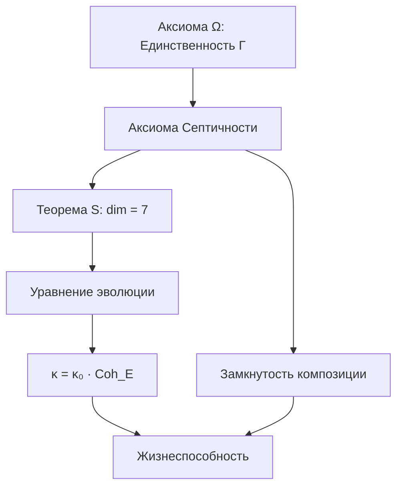

# Аксиоматика Кибернетики Когерентности

:::note О нотации
В этом документе:
- $\Gamma$ — [матрица когерентности](/docs/core/dynamics/coherence-matrix)
- $\mathcal{H} = \mathbb{C}^7$ — гильбертово пространство
- $\mathcal{D}[\Gamma]$ — [диссипативный член](/docs/core/dynamics/evolution#2-диссипативный-член)
- $\mathcal{R}[\Gamma, E]$ — [регенеративный член](/docs/core/dynamics/evolution#3-регенеративный-член)
- $\varphi$ — [оператор самомоделирования](/docs/proofs/formalization-phi)
:::

## Метатеоретический статус

**Кибернетика Когерентности (КК)** есть единственная полная кибернетика, строго выводимая из Унитарного Голономного Монизма (УГМ). Она не является ещё одной кибернетикой в ряду существующих — она есть **метатеория**, из которой все частные кибернетики выводятся как проекции.

:::info Ключевое утверждение
Любая корректная теория самоорганизующихся систем есть проекция КК на подмножество измерений или динамических режимов.
:::

## Примитивные понятия

### Единственный примитив

КК строится на **единственном примитиве** — Матрице Когерентности Γ. Все остальные понятия определяются через Γ.

**Примитив Π₁ (Матрица Когерентности):**

Γ есть математический объект, удовлетворяющий:

$$
\Gamma \in \mathcal{L}(\mathcal{H}), \quad \Gamma^\dagger = \Gamma, \quad \Gamma \geq 0, \quad \mathrm{Tr}(\Gamma) = 1
$$

### Онтологический статус

$\Gamma$ **не является**:
- Математической абстракцией ($\Gamma$ есть сама реальность)
- Описанием чего-то иного (нет «вещи в себе» за $\Gamma$)
- Конструкцией наблюдателя (наблюдатель — часть $\Gamma$)

$\Gamma$ **является**:
- Единственной субстанцией
- Собственной структурой
- Собственным процессом

## Аксиоматическая база

:::info Связь с УГМ
КК строится на двух аксиомах УГМ. Все остальные утверждения в этом разделе — **следствия** из этих аксиом, не независимые постулаты.
:::

### Аксиома Ω (Единственность субстанции)

$$
\exists! \, \Gamma : \text{Вся реальность} = \mathrm{Config}(\Gamma)
$$

**Формально:** Для любого сущего $X$ существует отображение $\iota: X \to \mathcal{L}(\mathcal{H})$ такое, что $X = \iota^{-1}(\Gamma_X)$.

**См.:** [Аксиома Ω](/docs/core/foundations/axiom-omega)

### Аксиома Септичности (AP+PH+QG)

[Голоном](/docs/core/structure/holon) $\mathbb{H}$ обладает:
- **(AP)** Автопоэзисом: $\exists\varphi: \Gamma \to \Gamma$ с [неподвижной точкой](/docs/core/consciousness/self-observation#теорема-о-неподвижной-точке) $\Gamma^* = \varphi(\Gamma^*)$
- **(PH)** Феноменологией: $\exists\rho_E$ с нетривиальной [интериорностью](/docs/proofs/interiority-hierarchy)
- **(QG)** Квантовым основанием: [эволюция](/docs/core/dynamics/evolution) по уравнению Линдблада с регенерацией

**См.:** [Полное описание](/docs/core/foundations/axiom-septicity)

## Следствия из аксиом

### Теорема S (Семимерность)

:::info Теорема (не аксиома!)
$\dim(\mathcal{H}) = 7$ — **минимальная** размерность для системы, удовлетворяющей (AP), (PH), (QG).

**См.:** [Доказательство минимальности](/docs/proofs/theorem-minimality-7)
:::

**Пространство состояний:**

$$
\mathcal{H} = \mathbb{C}^7 = \mathrm{span}\{|A\rangle, |S\rangle, |D\rangle, |L\rangle, |E\rangle, |O\rangle, |U\rangle\}
$$

См. [Семь измерений](/docs/core/structure/dimensions) для полного описания.

| Индекс | Символ | Измерение | Функция | Связанная структура |
|--------|--------|-----------|---------|---------------------|
| 1 | $A$ | [Артикуляция](/docs/core/structure/dimension-a) | Различать | Проекторы |
| 2 | $S$ | [Структура](/docs/core/structure/dimension-s) | Удерживать | Гамильтониан $H$ |
| 3 | $D$ | [Динамика](/docs/core/structure/dimension-d) | Изменяться | Унитарный $U(t)$ |
| 4 | $L$ | [Логика](/docs/core/structure/dimension-l) | Согласовывать | Коммутатор $[\cdot,\cdot]$ |
| 5 | $E$ | [Опыт](/docs/core/structure/dimension-e) | Переживать | Матрица плотности $\rho_E$ |
| 6 | $O$ | [Основание](/docs/core/structure/dimension-o) | Питать | Вакуум $|0\rangle$ |
| 7 | $U$ | [Единство](/docs/core/structure/dimension-u) | Интегрировать | След $\mathrm{Tr}$ |

### Уравнение эволюции (следствие из QG)

См. [Эволюция](/docs/core/dynamics/evolution) для полного описания.

$$
\frac{d\Gamma}{dt} = -i[H, \Gamma] + \mathcal{D}[\Gamma] + \mathcal{R}[\Gamma, E]
$$

**[Унитарный член](/docs/core/dynamics/evolution#1-унитарный-член)** (сохранение когерентности):
$$
-i[H, \Gamma] = -i(H\Gamma - \Gamma H)
$$

**[Диссипативный член](/docs/core/dynamics/evolution#2-диссипативный-член)** (потеря когерентности):
$$
\mathcal{D}[\Gamma] = \sum_k \gamma_k \left( L_k \Gamma L_k^\dagger - \frac{1}{2}\{L_k^\dagger L_k, \Gamma\} \right)
$$

**[Регенеративный член](/docs/core/dynamics/evolution#3-регенеративный-член)** (восстановление когерентности):
$$
\mathcal{R}[\Gamma, E] = \kappa(\Gamma) \cdot (\Gamma_{\text{target}} - \Gamma) \cdot \Theta(\Delta F)
$$

где:
- $\kappa(\Gamma)$ — скорость регенерации (см. ниже)
- $\Gamma_{\text{target}}$ — целевое состояние (аттрактор)
- $\Delta F$ — изменение свободной энергии
- $\Theta$ — функция Хевисайда (активация при $\Delta F > 0$)

### Связь регенерации и E-когерентности

$$
\kappa(\Gamma) = \kappa_0 \cdot \mathrm{Coh}_E(\Gamma)
$$

где:
- $\kappa_0 > 0$ — базовая скорость регенерации
- $\mathrm{Coh}_E(\Gamma) \in [0, 1]$ — когерентность измерения Опыта

**Онтологический смысл:** Способность системы к самовосстановлению пропорциональна интегрированности её субъективного опыта.

### Замкнутость композиции (следствие из AP)

$$
\mathrm{Viable}(\mathbb{H}_1) \land \mathrm{Viable}(\mathbb{H}_2) \land \Phi_{12} > \Phi_{\min} \Rightarrow \mathrm{Viable}(\mathbb{H}_{12})
$$

где:
- $\mathrm{Viable}(\mathbb{H}) := P(\Gamma) > P_{\text{critical}}$ — [условие жизнеспособности](/docs/core/dynamics/viability)
- $\Phi_{12}$ — [мера интеграции](/docs/core/structure/dimension-u#мера-интеграции-φ) композитной системы
- $\Phi_{\min}$ — минимальная интеграция для жизнеспособности композиции (точное значение — открытый вопрос, см. [теорему 9.1](./theorems#теорема-91-фрактальное-замыкание))

Композиция жизнеспособных Голономов при достаточной интеграции образует жизнеспособный Голоном.

### Необходимость каждого измерения

При $\dim(\mathcal{H}) < 7$ система теряет хотя бы одно из свойств (AP), (PH), (QG):

| Без измерения | Нарушение | Пояснение |
|---------------|-----------|-----------|
| $U$ (Единства) | (AP) | Нет интеграции частей |
| $E$ (Опыта) | (PH) | Нет интериорности |
| $O$ (Основания) | (QG) | Нет регенерации |
| $L$ (Логики) | (AP) | Нет замыкания операций |
| $D$ (Динамики) | (AP), (QG) | Нет эволюции |
| $S$ (Структуры) | (AP) | Нет сохранения идентичности |
| $A$ (Артикуляции) | все | Нет различений |

**См.:** [Доказательство минимальности](/docs/proofs/theorem-minimality-7)

### Связь с (M,R)-системами Розена

| Розен | КК | Функция |
|-------|-----|---------|
| M (метаболизм) | D (Динамика) | Преобразование |
| R (репарация) | A + L | Восстановление структуры |
| β (замыкание) | U (Единство) | Интеграция |
| — | E, O, S | Расширения для феноменологии |

## Структура теории

---

**Связанные документы:**
- [Определения](./definitions) — базовые определения КК
- [Теоремы](./theorems) — фундаментальные теоремы КК
- [Аксиома Ω](/docs/core/foundations/axiom-omega) — единственность $\Gamma$
- [Аксиома Септичности (AP+PH+QG)](/docs/core/foundations/axiom-septicity) — требования к Голоному
- [Теорема минимальности](/docs/proofs/theorem-minimality-7) — $\dim(\mathcal{H}) = 7$
- [Матрица когерентности](/docs/core/dynamics/coherence-matrix) — определение $\Gamma$
- [Эволюция](/docs/core/dynamics/evolution) — уравнение $d\Gamma/dt$
- [Жизнеспособность](/docs/core/dynamics/viability) — мера $P$ и $P_{\text{critical}}$
- [Семь измерений](/docs/core/structure/dimensions) — базис $\mathcal{H}$
- [Формализация оператора φ](/docs/proofs/formalization-phi) — CPTP-каналы
