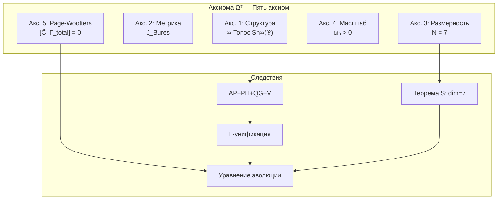
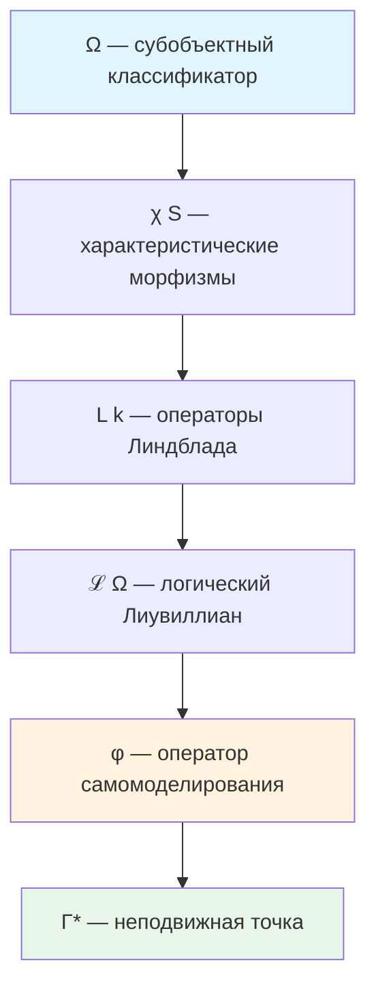

# Аксиоматика Кибернетики Когерентности

:::note О нотации
В этом документе:
- $\Gamma$ — [матрица когерентности](/docs/core/dynamics/coherence-matrix)
- $\mathcal{H} = \mathbb{C}^7$ — гильбертово пространство
- $\mathcal{D}[\Gamma]$ — [диссипативный член](/docs/core/dynamics/evolution#логический-лиувиллиан)
- $\mathcal{R}[\Gamma, E]$ — [регенеративный член](/docs/core/dynamics/evolution#3-регенеративный-член)
- $\varphi$ — [оператор самомоделирования](/docs/proofs/categorical/formalization-phi)
:::

## Метатеоретический статус

**Кибернетика Когерентности (КК)** есть единственная полная кибернетика, строго выводимая из Унитарного Голономного Монизма (УГМ). Она не является ещё одной кибернетикой в ряду существующих — она есть **метатеория**, из которой все частные кибернетики выводятся как проекции.

:::info Ключевое утверждение
Любая корректная теория самоорганизующихся систем есть проекция КК на подмножество измерений или динамических режимов.
:::

## Примитивные понятия

### Единственный примитив

КК строится на **единственном примитиве** — **категории 𝒞** с конечным числом объектов. Матрица когерентности Γ — **объект** этой категории.

**Примитив (Категория 𝒞):**

Малая категория 𝒞 с объектами — матрицами плотности:

$$
\text{Ob}(\mathcal{C}) \subset \mathcal{D}(\mathbb{C}^{42}), \quad \text{Mor}(\mathcal{C}) = \text{CPTP-каналы}
$$

### Онтологический статус

**Категория 𝒞** (не Γ) **является**:
- Единственной субстанцией
- Собственной структурой
- Собственным процессом

Из 𝒞 **выводятся**:
- Базовое пространство $X = |N(\mathcal{C})|$
- Монизм как теорема: $H^*(X) = 0$
- Время τ, метрика d_strat, стрела времени

## Аксиоматическая база (краткая справка)

:::tip DRY: Полная аксиоматика
Полное изложение пяти аксиом Ω⁷ — в [Аксиома Ω⁷](/docs/core/foundations/axiom-omega). Таблица семи измерений — в [Семь измерений](/docs/core/structure/dimensions). Полное уравнение эволюции — в [Эволюция](/docs/core/dynamics/evolution).
:::

КК строится на **Аксиоме Ω⁷** (пять аксиом с ∞-топосом $\mathrm{Sh}_\infty(\mathcal{C})$ как примитивом):

| № | Аксиома | Ключевое следствие |
|---|---------|-------------------|
| 1 | Структура (∞-Топос) | Единственность примитива |
| 2 | Метрика (Бюрес) | Информационная различимость |
| 3 | Размерность ($N = 7$) | [Семимерность](/docs/proofs/minimality/theorem-minimality-7) |
| 4 | Масштаб ($\omega_0 > 0$) | Связь внутреннего и физического времени |
| 5 | Page-Wootters | [Эмерджентное время τ](/docs/proofs/dynamics/emergent-time) |

**Визуальная карта:**

### Следствие: Септичность (AP+PH+QG+V)

[Голоном](/docs/core/structure/holon) $\mathbb{H}$ обладает:
- **(AP)** Автопоэзисом: $\exists\varphi: \Gamma \to \Gamma$ с [неподвижной точкой](/docs/consciousness/foundations/self-observation#теорема-о-неподвижной-точке) $\Gamma^* = \varphi(\Gamma^*)$
- **(PH)** Феноменологией: $\exists\rho_E$ с нетривиальной [интериорностью](/docs/proofs/consciousness/interiority-hierarchy)
- **(QG)** Квантовым основанием: [эволюция](/docs/core/dynamics/evolution) по уравнению Линдблада с регенерацией
- **(V)** Жизнеспособностью: $P > P_{\text{crit}} = 2/7$ — [чистота](/docs/core/dynamics/viability) выше критического порога

**См.:** [Полное описание](/docs/core/foundations/axiom-septicity)

### Уравнение эволюции (краткая форма)

$$
\frac{d\Gamma(\tau)}{d\tau} = -i[H_{\text{eff}}, \Gamma] + \mathcal{D}[\Gamma] + \mathcal{R}[\Gamma, E]
$$

Три члена: унитарный (сохранение когерентности), диссипативный (потеря), регенеративный (восстановление). Полный вывод и описание каждого члена: [Эволюция](/docs/core/dynamics/evolution).

## Специфика КК: Bootstrap-механизм и E-акцентуация

### L-унификация: вывод L_k из Ω

:::info Ключевая конструкция
Операторы Линдблада $L_k$ **выводятся** из субобъектного классификатора $\Omega$, а не постулируются. Это центральное достижение УГМ.
:::

**Цепочка вывода (см. [Аксиома Ω⁷](/docs/core/foundations/axiom-omega#внутренняя-логика)):**

$$
\Omega \xrightarrow{\text{атомы}} \{S_k\} \xrightarrow{\chi_{S_k}} \text{характеристические морфизмы} \xrightarrow{\sqrt{\cdot}} L_k = \sqrt{\chi_{S_k}}
$$

**Следствие:** Диссипация имеет **логическое происхождение** — она отражает взаимодействие системы с её собственной структурой различений.

### Связь регенерации и E-когерентности

$$
\kappa(\Gamma) = \kappa_{\text{bootstrap}} + \kappa_0 \cdot \mathrm{Coh}_E(\Gamma)
$$

где:
- $\kappa_{\text{bootstrap}}$ — **минимальная регенерация** из структуры сопряжения $\mathcal{D}_\Omega \dashv \mathcal{R}$
- $\kappa_0$ — базовая скорость регенерации, [категориальный вывод](/docs/core/foundations/axiom-septicity#структурный-анзац-kappa0): $\kappa_0 = \|\mathrm{Nat}(\mathcal{D}_\Omega, \mathcal{R})\|$
- $\mathrm{Coh}_E(\Gamma) \in [1/N, 1]$ — [когерентность измерения Интериорности](./definitions#e-когерентность)

:::info Bootstrap-механизм
Член $\kappa_{\text{bootstrap}} > 0$ **разрешает bootstrap-парадокс**: система с низким $\mathrm{Coh}_E$ всё равно имеет минимальную регенерацию, позволяющую выйти из низко-когерентного состояния.

**Категориальное обоснование:** $\kappa_{\text{bootstrap}} = \|\text{unit}(\mathcal{D}_\Omega \dashv \mathcal{R})\|$ — норма единицы сопряжения.

**Численная оценка:** $\kappa_{\text{bootstrap}} = \omega_0 / N = 1/7 \approx 0.143$ (при $\omega_0 = 1$)
:::

**Онтологический смысл:** Способность системы к самовосстановлению пропорциональна интегрированности её субъективного опыта, но существует **минимальный уровень** регенерации из самой структуры логического классификатора Ω.

### E-акцентуация: почему E особенное

:::info Теорема 2.2 (E-акцентуация из определения L2)
Акцентуация E-измерения ($w_E > 1/7$) **выводится** из определения L2-сознания, а не постулируется.

**Логика вывода:**
1. L2 требует $C = \Phi \times D_{\text{diff}} \times R \geq C_{th}$
2. $R = 1 - \|\Gamma - \varphi(\Gamma)\|_F^2 / \|\Gamma\|_F^2 \geq R_{th} = 1/3$
3. При равномерном распределении ($w_i = 1/7$): $R_{\max} \approx 0.14 < R_{th}$
4. **Следовательно:** $\exists i : w_i > 1/7$
5. По определению L2 (наличие рефлексивного доступа к опыту): этим измерением должно быть E
:::

**См.:** [Полное доказательство](/docs/proofs/categorical/formalization-phi#26-каноническая-форма-φ-для-угм)

### Связь с (M,R)-системами Розена

| Розен | КК | Функция |
|-------|-----|---------|
| M (метаболизм) | D (Динамика) | Преобразование |
| R (репарация) | A + L | Восстановление структуры |
| β (замыкание) | U (Единство) | Интеграция |
| — | E, O, S | Расширения для феноменологии |

## Структура теории

### Иерархия зависимостей

**См.:** [Полная иерархия зависимостей](/docs/core/foundations/axiom-omega#иерархия-зависимостей)

### Замкнутость композиции (следствие из AP) {#замкнутость-композиции-следствие-из-ap}

$$
\mathrm{Viable}(\mathbb{H}_1) \land \mathrm{Viable}(\mathbb{H}_2) \land \Phi_{12} > \Phi_{\min} \Rightarrow \mathrm{Viable}(\mathbb{H}_{12})
$$

Композиция жизнеспособных Голономов при достаточной интеграции образует жизнеспособный Голоном. **См.:** [Теорема 9.1](./theorems#теорема-91-фрактальное-замыкание)

---

**Связанные документы:**
- [Определения](./definitions) — базовые определения КК
- [Теоремы](./theorems) — фундаментальные теоремы КК
- [Аксиома Ω⁷](/docs/core/foundations/axiom-omega) — ∞-топос $\text{Sh}_\infty(\mathcal{C})$ как единственный примитив
- [Аксиома Септичности (AP+PH+QG+V)](/docs/core/foundations/axiom-septicity) — требования к Голоному
- [Эволюция](/docs/core/dynamics/evolution) — уравнение $d\Gamma(\tau)/d\tau$
- [Жизнеспособность](/docs/core/dynamics/viability) — мера $P$ и $P_{\text{crit}}$
- [Формализация оператора φ](/docs/proofs/categorical/formalization-phi) — CPTP-каналы
