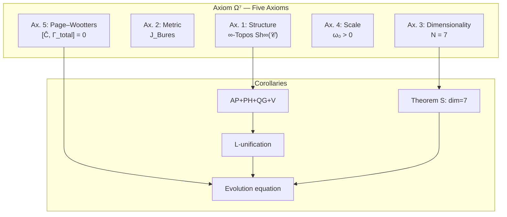
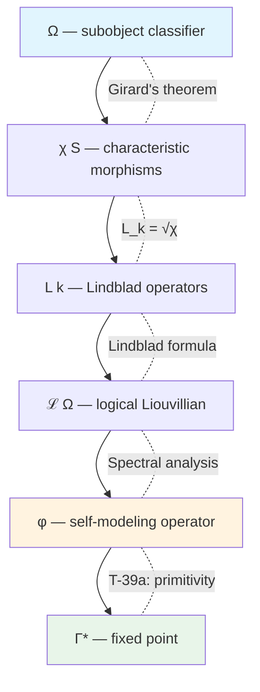
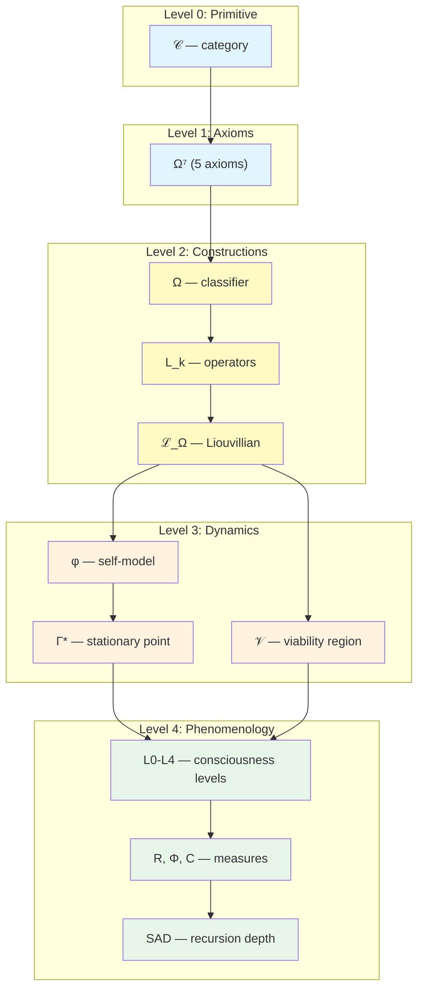

# Axiomatics of Coherence Cybernetics

:::info Bridge from the Previous Chapter
In the [previous chapter](./introduction) we learned *what* Coherence Cybernetics is: a unified formalism describing dynamics, structure, and interiority through the coherence matrix $\Gamma$. We saw the evolution equation, the seven dimensions, the viability thresholds, and the hierarchy of interiority. But where does all of this come from? Why are the formulas exactly as they are? Now we must look into the **foundation** — the axiomatic base from which all CC constructions are derived.
:::

:::tip Chapter Roadmap
In this chapter we:
1. **Understand why axiomatics is needed** — the lesson of Euclid, Kolmogorov, and Hilbert (section "Why Is Axiomatics Needed?")
2. **Examine three levels of rigor** in derivation: deductive, categorical, constructive (section "[What Does 'Strictly Derived' Mean?](#что-значит-строго-выводится)")
3. **Meet the single primitive** — the category $\mathcal{C}$ (section "[The Single Primitive](#единственный-примитив)")
4. **Walk through the five axioms** of Ω⁷ and understand why each is needed (section "[Axiomatic Base](#аксиоматическая-база-краткая-справка)")
5. **Trace the derivation chain** from $\Omega$ to the stationary state $\Gamma^*$ (section "[Derivation Chain](#цепочка-вывода)")
6. **See how the bootstrap paradox** of regeneration is resolved (section "[Bootstrap Paradox](#bootstrap-парадокс)")
7. **Understand why the E-dimension is special** — the E-accentuation theorem (section "[E-Accentuation](#e-акцентуация)")
:::

:::note On Notation
In this document:
- $\Gamma$ — [coherence matrix](/docs/core/dynamics/coherence-matrix)
- $\mathcal{H} = \mathbb{C}^7$ — Hilbert space
- $\mathcal{D}[\Gamma]$ — [dissipative term](/docs/core/dynamics/evolution#логический-лиувиллиан)
- $\mathcal{R}[\Gamma, E]$ — [regenerative term](/docs/core/dynamics/evolution#3-регенеративный-член)
- $\varphi$ — [self-modeling operator](/docs/proofs/categorical/formalization-phi)
:::

## Why Is Axiomatics Needed?

### The Lesson of Euclid

Two and a half thousand years ago, Euclid accomplished one of the greatest intellectual feats in history: he took geometry, which the Egyptians and Babylonians knew as a collection of practical recipes, and showed that all of it grows from **five** statements accepted without proof. Five postulates — and from them, like a tree from a seed, the whole of plane geometry grew.

This was not merely a systematization of knowledge. It was the first time humanity discovered **the power of the axiomatic method**: if the foundation is chosen correctly, all consequences are strictly necessary. Not "we think so" and not "this seems plausible," but **it cannot be otherwise**, as long as the axioms hold.

### Kolmogorov and Probability

In 1933 Kolmogorov did for probability theory what Euclid did for geometry. Before Kolmogorov, probability was a collection of intuitions: the frequency approach, geometric probability, Bayesian degree of belief. Kolmogorov proposed three axioms (a sigma-algebra of events, normalization, additivity) — and from them derived the whole of probability theory. All paradoxes evaporated. All schools unified within a single language.

Kolmogorov's lesson: **axiomatics does not constrain but liberates**. It allows one to separate substantive questions from terminological disputes.

### The Hilbert Program and Its Legacy

The Hilbert program (1920s) attempted to axiomatize all of mathematics. Gödel in 1931 showed that this was impossible in full: any sufficiently rich consistent system contains undecidable statements. But Hilbert's program was not in vain — it gave rise to the modern understanding of **what it means** to build a theory rigorously.

That understanding is as follows: a theory is considered rigorous if:
1. **Primitives** (undefined concepts) are named explicitly
2. **Axioms** (statements accepted without proof) are listed exhaustively
3. **Everything else** is derived from the axioms by the rules of logic
4. **There are no hidden assumptions** — every assumption is noted and labeled

### Why Does Coherence Cybernetics Need Axiomatics?

Cybernetics, unlike physics and mathematics, has largely remained a **pre-axiomatic** discipline to this day. Wiener's cybernetics, Ashby's cybernetics, von Foerster's second-order cybernetics — all of these are valuable conceptual frameworks, but none has a formal axiomatics from which all statements would be derived.

**Coherence Cybernetics (CC)** is the first attempt to build cybernetics to a level of rigor comparable to Kolmogorov's axiomatic probability theory. Every statement in CC is labeled with one of six statuses — **[T]** (theorem), **[C]** (conditional), **[H]** (hypothesis), **[I]** (interpretation), **[D]** (definition), **[P]** (postulate) — making explicit what is taken on faith and what is proven. The complete status system with descriptions: [Status Registry](/docs/reference/status-registry).

---

## What Does "Strictly Derived" Mean? {#что-значит-строго-выводится}

Before diving into the axioms, let us clarify the key concept. When we say that CC is "strictly derived" from UHM, what does that mean?

### Three Levels of "Derivation"

1. **Deductive derivation** (the most rigorous): Statement B follows from statement A if B cannot be denied without denying A. Example: from Peano's axioms it *follows* that $2 + 2 = 4$. This is precisely the sense in which most CC statements with status **[T]** work.

2. **Categorical derivation**: Construction B is uniquely determined by the structure of A up to a unique isomorphism. Example: from the fact that $\mathcal{C}$ is a small category with a Grothendieck topology, the subobject classifier $\Omega$ is uniquely determined. This is exactly how the Lindblad operators $L_k$ are derived from Axiom 1.

3. **Constructive derivation**: B is built from A by an explicit algorithm, verifiable step by step. This is how the entire chain $\Omega \to \{S_k\} \to \chi_{S_k} \to L_k \to \mathcal{L}_\Omega$ is structured.

All three types of derivation are used in CC, and for each theorem the type is specified.

### What Derivation Does NOT Mean

Derivation **does not mean** that the conclusion is "obvious" or "intuitively clear." Many CC theorems (for example, that $P_{\text{crit}} = 2/7$ is the only possible threshold of consciousness) are counterintuitive. They are true *despite* intuition, because they follow from the axioms.

Derivation also **does not mean** empirical truth. The axioms of CC are mathematical constructions. The question "do they describe reality?" is a separate, empirical question.

---

## Metatheoretical Status

**Coherence Cybernetics (CC)** is the unique complete cybernetics strictly derivable from Unitary Holonomic Monism (UHM). It is not yet another cybernetics in the line of existing ones — it is a **metatheory** from which all particular cybernetics are derived as projections.

What does this mean in practice? Imagine white light. Pass it through a prism — and you get red, orange, yellow... each of these colors is real and useful, but none of them is complete light. Wiener's cybernetics is the "red ray" of CC (feedback, information). Maturana and Varela's autopoiesis is the "green ray" (self-organization, boundary). Tononi's Integrated Information Theory is the "violet ray" (integration, $\Phi$). CC is the white light from which all of them are obtained by restriction to a subset of dimensions.

:::info Key Statement
Any correct theory of systems described by $\Gamma$ is a projection of CC onto a subset of dimensions or dynamic regimes.
:::

This statement is not a declaration but a **theorem** (more precisely, a family of theorems), proven for each specific theory by explicitly constructing the projection. For more detail: [Comparative Analysis of Consciousness Theories](/docs/consciousness/comparative/consciousness-theories).

---

## The Single Primitive: The Beauty of Minimalism {#единственный-примитив}

### Why Is One Primitive Enough?

Twentieth-century physics moved toward an ever-larger number of fundamental objects: particles, fields, strings, branes... CC goes in the opposite direction. Just as all of arithmetic is built from one concept (set) plus one operation (membership), CC is built from a **single primitive** — the category $\mathcal{C}$.

### Primitive Concepts

CC is built on a **single primitive** — **the category 𝒞** with a finite number of objects. The coherence matrix Γ is an **object** of this category.

**Primitive (Category 𝒞):**

A small category 𝒞 whose objects are density matrices:

$$
\text{Ob}(\mathcal{C}) \subset \mathcal{D}(\mathbb{C}^{42}), \quad \text{Mor}(\mathcal{C}) = \text{CPTP channels}
$$

### What Does "Single" Mean?

The uniqueness of the primitive is not merely an aesthetic requirement. It has a precise mathematical meaning: **everything else is derived**. Space, time, dynamics, dissipation, regeneration, consciousness — none of these are added "on top," but are generated by the internal structure of $\mathcal{C}$.

Analogy: in group theory it suffices to give a set and a binary operation satisfying three axioms. From this are derived: inverse elements, the order of an element, subgroups, cosets, quotient groups, representations... — an infinite hierarchy of structures from a single definition.

In CC, from the category $\mathcal{C}$ are derived:

| Construction | How obtained | Status |
|-------------|----------------|--------|
| Space $X = \|N(\mathcal{C})\|$ | Geometric realization of the nerve | [T] |
| Classifier $\Omega$ | Girard's theorem | [T] |
| Operators $L_k$ | From atoms of $\Omega$ | [T] |
| Dynamics $\mathcal{L}_\Omega$ | From $L_k$ via Lindblad formula | [T] |
| Time $\tau$ | Page–Wootters axiom | [T] |
| Self-modeling $\varphi$ | From $\mathcal{L}_\Omega$ | [T] |

### Ontological Status

**Category 𝒞** (not Γ) **is**:
- The single substance
- Its own structure
- Its own process

From 𝒞 **are derived**:
- Base space $X = |N(\mathcal{C})|$
- Monism as theorem: $H^*(X) = 0$
- Time τ, metric d_strat, arrow of time

### Why Not Γ?

Beginners often think that the primitive of CC is the coherence matrix $\Gamma$. This is like thinking that the primitive of arithmetic is the number 7. The number 7 is an important object, but it is *derived* from Peano's axioms. Likewise, $\Gamma$ is the most important object of CC, but it is *derived* as an object of the category $\mathcal{C}$.

The distinction is fundamental: if $\Gamma$ were the primitive, then its properties (dimensionality 7, Hermiticity, positive definiteness, unit trace) would have to be **postulated**. Within CC all these properties are **derived** from the fact that $\Gamma \in \text{Ob}(\mathcal{C}) \subset \mathcal{D}(\mathbb{C}^{42})$.

---

## Axiomatic Base (Brief Reference) {#аксиоматическая-база-краткая-справка}

:::tip DRY: Full Axiomatics
The complete presentation of the five axioms of Ω⁷ — in [Axiom Ω⁷](/docs/core/foundations/axiom-omega). The table of seven dimensions — in [Seven Dimensions](/docs/core/structure/dimensions). The complete evolution equation — in [Evolution](/docs/core/dynamics/evolution).
:::

CC is built on **Axiom Ω⁷** (five axioms with the ∞-topos $\mathrm{Sh}_\infty(\mathcal{C})$ as the primitive):

| No. | Axiom | Key Corollary |
|---|---------|-------------------|
| 1 | Structure (∞-Topos) | Uniqueness of the primitive |
| 2 | Metric (Bures) | Informational distinguishability |
| 3 | Dimensionality ($N = 7$) | [Seven-dimensionality](/docs/proofs/minimality/theorem-minimality-7) |
| 4 | Scale ($\omega_0 > 0$) | Link between internal and physical time |
| 5 | Page–Wootters | [Emergent time τ](/docs/proofs/dynamics/emergent-time) |

Let us examine each axiom in detail.

### Axiom 1: Structure — Reality Is an ∞-Topos

**In plain language:** The world is structured as a space of all possible states, where transitions between states are just as real as the states themselves.

**Why it is needed:** Without it there is no unified mathematical language. One cannot speak of "space," "logic," or "structure" — all of these are *defined* through the ∞-topos. Remove this axiom and CC falls apart into a set of unconnected formulas.

**Analogy:** Just as the grammar of a language is not yet another sentence but the rule by which *all* sentences are constructed, so the ∞-topos is not yet another mathematical object but the framework in which *all* CC objects live.

**Formally:** Reality is an ∞-topos $\mathbf{Sh}_\infty(\mathcal{C})$ over the category of density matrices $\mathcal{D}(\mathbb{C}^N)$.

**What follows from it:** The existence of a subobject classifier $\Omega$ (by Girard's theorem), from which the Lindblad operators are then derived.

### Axiom 2: Metric — Distinguishability Is Measured via Bures

**In plain language:** There is a unique "honest" way to measure how much two states differ from each other.

**Why it is needed:** Without a metric one cannot speak of "close" and "distant" states, of "continuity" and "convergence." Without it dynamics is undefined: the evolution equations require a topology on the state space.

**Analogy:** Just as in life it is impossible to compare two options without a criterion of comparison (price? quality? weight?), so in the space of density matrices it is impossible to define "distance" without a metric. The Bures metric is the unique one that respects the quantum nature of states.

**Formally:** The Grothendieck topology $J$ is induced by the Bures metric $d_B$.

**What follows from it:** The choice of metric is **unique** by the Chentsov–Petz theorem: the Bures metric is the unique monotone Riemannian metric on $\mathcal{D}(\mathcal{H})$. This is not an arbitrary choice — it is a mathematical necessity.

### Axiom 3: Dimensionality — N = 7

**In plain language:** The fundamental description of a Holon (the minimal unit of reality) requires exactly seven dimensions.

**Why it is needed:** Dimensionality determines the richness of structure. At $N = 1$ there is no dynamics at all (only one state). At $N = 2$ there is not enough structure for self-modeling. $N = 7$ is the minimum number at which *all* necessary structures are simultaneously possible.

**Analogy:** To describe rotations in three-dimensional space one needs exactly 3 Euler angles — not 2 and not 4. Likewise, to fully describe a coherent system one needs exactly 7 dimensions.

**Formally:** $N = 7$ — the dimensionality of the base space $\mathcal{H} = \mathbb{C}^7$.

**What follows from it:** Seven dimensions [A, S, D, L, E, O, U], each of which is necessary (proof of minimality — [Theorem S](/docs/proofs/minimality/theorem-minimality-7)). Remove any one — and some property (autopoiesis, phenomenology, quantum foundation, or viability) becomes impossible.

### Axiom 4: Scale — A Characteristic Frequency Exists

**In plain language:** Every Holon has its own "pace of life" — the rate at which its internal clock ticks.

**Why it is needed:** Without a scale the evolution equations are dimensionless and are not connected to observable time. $\omega_0$ is the bridge between mathematical time $\tau$ and physical time $t$.

**Analogy:** $\omega_0$ is the analogue of mass in physics. Mass is not a universal constant but a parameter of a specific body. Likewise, $\omega_0$ is a parameter of a specific Holon: a cell has one $\omega_0$, an organism has another, a social group has a third.

**Formally:** $\omega_0 > 0$ — the characteristic frequency of the system.

### Axiom 5: Page–Wootters — Time Is Emergent

**In plain language:** Time does not exist "outside" the system. It arises from correlations between subsystems.

**Why it is needed:** If external time is postulated, dualism results (system + external time = two primitives). The PW axiom derives time from the single primitive.

**Analogy:** Temperature does not exist for a single molecule — it arises as a statistical property of an ensemble. Likewise, time does not exist for an isolated state — it arises from the relationship between parts.

**Formally:** $[\hat{C}, \Gamma_{\text{total}}] = 0$ (the total system is stationary; time is the conditional dynamics relative to the clock subsystem).

**What follows from it:** [Emergent time τ](/docs/proofs/dynamics/emergent-time), the arrow of time, the evolution equation.

### Visual Map

```mermaid
graph TD
    subgraph "Axiom Ω⁷ — Five Axioms"
        AX1["Ax. 1: Structure<br/>∞-Topos Sh∞(𝒞)"]
        AX2["Ax. 2: Metric<br/>J_Bures"]
        AX3["Ax. 3: Dimensionality<br/>N = 7"]
        AX4["Ax. 4: Scale<br/>ω₀ > 0"]
        AX5["Ax. 5: Page–Wootters<br/>[Ĉ, Γ_total] = 0"]
    end
    subgraph "Corollaries"
        S["Theorem S: dim=7"]
        APQ["AP+PH+QG+V"]
        LU["L-unification"]
        EVOL["Evolution equation"]
    end
    AX1 --> APQ
    AX3 --> S
    AX5 --> EVOL
    APQ --> LU
    LU --> EVOL
    S --> EVOL
```

### Corollary: Septicity (AP+PH+QG+V)

A [Holon](/docs/core/structure/holon) $\mathbb{H}$ possesses:
- **(AP)** Autopoiesis: $\exists\varphi: \Gamma \to \Gamma$ with a [fixed point](/docs/consciousness/foundations/self-observation#теорема-о-неподвижной-точке) $\Gamma^* = \varphi(\Gamma^*)$
- **(PH)** Phenomenology: $\exists\rho_E$ with non-trivial [interiority](/docs/proofs/consciousness/interiority-hierarchy)
- **(QG)** Quantum foundation: [evolution](/docs/core/dynamics/evolution) via the Lindblad equation with regeneration
- **(V)** Viability: $P > P_{\text{crit}} = 2/7$ — [purity](/docs/core/dynamics/viability) above the critical threshold

Each of the four properties is **necessary**:
- Without (AP): the system cannot reproduce itself — no autopoiesis, no life
- Without (PH): the system has no "inner side" — a philosophical zombie
- Without (QG): evolution is undefined — no dynamics
- Without (V): the system degrades below the threshold and loses organization

**See:** [Full description](/docs/core/foundations/axiom-septicity)

---

## The Evolution Equation: The Heart of CC

### Compact Form

$$
\frac{d\Gamma(\tau)}{d\tau} = -i[H_{\text{eff}}, \Gamma] + \mathcal{D}[\Gamma] + \mathcal{R}[\Gamma, E]
$$

### Three Forces That Shape Life

The evolution equation is not merely a formula. It is a description of **three fundamental forces** acting on any coherent system:

**1. Unitary term: $-i[H_{\text{eff}}, \Gamma]$**

This is the system's "inertia" — free evolution preserving coherence. If only this term were active, the system would rotate forever, neither gaining nor losing organization. Like a planet in an ideal orbit: neither accelerating nor decelerating.

**2. Dissipative term: $\mathcal{D}[\Gamma]$**

This is "friction" — the loss of coherence due to the system's interaction with its own structure of distinctions. Without opposition, dissipation turns any state into the maximally mixed $I/N$ (heat death). Like a house without maintenance: it gradually deteriorates and crumbles.

**3. Regenerative term: $\mathcal{R}[\Gamma, E]$**

This is "repair" — the restoration of coherence. It is precisely this term that distinguishes the living from the non-living. A stone obeys only the first two terms. A cell, an organism, a society — add the third.

Complete derivation and description of each term: [Evolution](/docs/core/dynamics/evolution).

### Evolution in Metaphors

Imagine a fountain. Water (coherence) jets upward (regeneration), gravity pulls it down (dissipation), and the shape of the stream is determined by the geometry of the nozzle (unitary evolution). A living system is a fountain that **itself** builds its own nozzle and **itself** pumps the water. If the pressure drops below a critical level — the fountain runs dry (the system exits the viability region $\mathcal{V}$).

---

## CC Specifics: Bootstrap Mechanism and E-Accentuation

### L-Unification: Deriving L_k from Ω {#l-унификация-вывод-l_k-из-ω}

:::info Key Construction
The Lindblad operators $L_k$ are **derived** from the subobject classifier $\Omega$, not postulated. This is the central achievement of UHM.
:::

In standard quantum theory of open systems, the Lindblad operators $L_k$ are free parameters. A researcher chooses them "from the physics of the problem." This is like choosing the friction force "by eye" — it works, but does not explain.

In CC, dissipation is **not chosen but derived**. Here is the chain:

**Derivation chain (see [Axiom Ω⁷](/docs/core/foundations/axiom-omega#внутренняя-логика)):**

$$
\Omega \xrightarrow{\text{atoms}} \{S_k\} \xrightarrow{\chi_{S_k}} \text{characteristic morphisms} \xrightarrow{\sqrt{\cdot}} L_k = \sqrt{\chi_{S_k}}
$$

Let us examine each step:

**Step 1: $\Omega$ generates atoms $\{S_k\}$**

The subobject classifier $\Omega$ is the "truth object" of the category. In ordinary set theory $\Omega = \{0, 1\}$ (false/true). In an ∞-topos $\Omega$ is richer: it contains all "levels of truth." Its indecomposable elements (atoms) are the seven projectors $S_k = |k\rangle\langle k|$, one for each dimension.

**Step 2: Atoms define the characteristic morphisms $\chi_{S_k}$**

A characteristic morphism is the "indicator function" of a subobject. For each $S_k$ there exists a unique $\chi_{S_k}: \Gamma \to \Omega$, determining the "degree of membership" of state $\Gamma$ in the $k$-th dimension.

**Step 3: Lindblad operators are square roots**

$$L_k = \sqrt{\chi_{S_k}} = P_k = |k\rangle\langle k|$$

These are projectors onto the canonical basis — the simplest possible Lindblad operators.

**Corollary:** Dissipation has a **logical origin** — it reflects the system's interaction with its own structure of distinctions.

In other words: the system loses coherence **because it distinguishes**. Every act of distinction (projection onto one of the seven dimensions) destroys superposition with the others. This is not external "noise" — it is the internal price of distinction.

---

### Dependency Hierarchy {#иерархия-зависимостей}

To see the full chain at once, a dependency diagram is useful. Each node is obtained from the previous one by an explicit construction:

```mermaid
graph TD
    O["Ω — subobject classifier"] --> CHI["χ S — characteristic morphisms"]
    CHI --> LK["L k — Lindblad operators"]
    LK --> LO["ℒ Ω — logical Liouvillian"]
    LO --> PHI["φ — self-modeling operator"]
    PHI --> FP["Γ* — fixed point"]

    O -.- |"Girard's theorem"| CHI
    CHI -.- |"L_k = √χ"| LK
    LK -.- |"Lindblad formula"| LO
    LO -.- |"Spectral analysis"| PHI
    PHI -.- |"T-39a: primitivity"| FP

    style O fill:#e1f5fe
    style PHI fill:#fff3e0
    style FP fill:#e8f5e9
```

This chain is **complete**: to construct $\Gamma^*$ nothing is needed beyond $\Omega$ (and therefore the category $\mathcal{C}$). Not a single element is introduced "from outside."

**See:** [Full Dependency Hierarchy](/docs/core/foundations/axiom-omega#иерархия-зависимостей)

### Derivation Chain: from $\Omega$ to $\Gamma^*$ {#цепочка-вывода}

The full path from the single primitive to the stationary state of a conscious system is a chain of 9 steps, each of which is a theorem:

$$
\mathcal{C} \xrightarrow{\text{Ax. 1}} \mathbf{Sh}_\infty(\mathcal{C}) \xrightarrow{\text{Girard}} \Omega \xrightarrow{\text{atoms}} \{S_k\} \xrightarrow{\chi_{S_k}} L_k \xrightarrow{\text{Lindblad}} \mathcal{L}_\Omega \xrightarrow{\text{spectrum}} \varphi \xrightarrow{\text{T-39a}} \Gamma^*
$$

Each transition is a **theorem** [T], not a postulate. To construct $\Gamma^*$ nothing is needed beyond the category $\mathcal{C}$.

:::info Canonical Definition
Full table with formulas for each step: [Axiom Ω⁷ — Dependency Hierarchy](/docs/core/foundations/axiom-omega#иерархия-зависимостей).
:::

---

## Bootstrap Paradox and Its Resolution {#bootstrap-парадокс}

### The Problem: Baron Münchhausen

Here is a paradox that at first glance destroys the entire construction.

Regeneration $\mathcal{R}$ restores coherence. The regeneration rate $\kappa$ depends on E-coherence — on how integrated the system's subjective experience is. But E-coherence is a property of the state $\Gamma$, which is maintained by... regeneration.

A vicious circle results: to regenerate, coherence is needed; to have coherence, regeneration is needed. Baron Münchhausen pulling himself out of a swamp by his own hair.

### Connection Between Regeneration and E-Coherence {#связь-регенерации-и-e-когерентности}

$$
\kappa(\Gamma) = \kappa_{\text{bootstrap}} + \kappa_0 \cdot \mathrm{Coh}_E(\Gamma)
$$

where:
- $\kappa_{\text{bootstrap}}$ — **minimum regeneration** from the adjunction structure $\mathcal{D}_\Omega \dashv \mathcal{R}$
- $\kappa_0$ — base regeneration rate, [categorical derivation](/docs/core/foundations/axiom-septicity#структурный-анзац-kappa0): $\kappa_0 = \|\mathrm{Nat}(\mathcal{D}_\Omega, \mathcal{R})\|$
- $\mathrm{Coh}_E(\Gamma) \in [1/N, 1]$ — [coherence of the Interiority dimension](./definitions#e-когерентность)

### Resolution: $\kappa_{\text{bootstrap}}$ — Structural Minimum

The paradox is resolved by the second term: $\kappa_{\text{bootstrap}} > 0$. This is not a "fit" and not an ad hoc parameter — it is a **structural necessity** arising from the categorical construction.

:::info Bootstrap Mechanism
The term $\kappa_{\text{bootstrap}} > 0$ **resolves the bootstrap paradox**: a system with low $\mathrm{Coh}_E$ still has minimum regeneration, allowing it to exit the low-coherence state.

**Categorical justification:** $\kappa_{\text{bootstrap}} = \|\text{unit}(\mathcal{D}_\Omega \dashv \mathcal{R})\|$ — the norm of the adjunction unit.

**Numerical estimate:** $\kappa_{\text{bootstrap}} = \omega_0 / N = 1/7 \approx 0.143$ (at $\omega_0 = 1$)
:::

### Analogy: Ignition and Combustion

Imagine a campfire. For the wood to burn, heat is needed. For there to be heat, burning is needed. A paradox? No: there is a **match** — an external source of initial heat that starts the cycle.

In CC the "match" is $\kappa_{\text{bootstrap}}$. But unlike a real match, $\kappa_{\text{bootstrap}}$ is not an "external" source. It is built into the very structure of the adjunction $\mathcal{D}_\Omega \dashv \mathcal{R}$. It is as if the wood were structured so that minimal burning occurs *always* — simply by virtue of its structure.

Mathematically: the adjunction between the dissipator $\mathcal{D}_\Omega$ and the regenerator $\mathcal{R}$ has a unit, and the norm of this unit is nonzero. This is not a choice — it is a theorem about adjoint functors.

### Bootstrap Cycle Dynamics

Thanks to $\kappa_{\text{bootstrap}}$, the system passes through three phases:

1. **Inception:** $\mathrm{Coh}_E$ is small, $\kappa \approx \kappa_{\text{bootstrap}} = 1/7$. Minimum regeneration slowly raises coherence.
2. **Amplification:** Growing $\mathrm{Coh}_E$ increases $\kappa$, which accelerates the growth of $\mathrm{Coh}_E$. Positive feedback.
3. **Stabilization:** The system reaches the stationary point $\Gamma^*$, where regeneration and dissipation balance.

This scenario is not speculation. It follows from the analysis of the dynamical system and has been confirmed numerically in [model systems](/docs/applied/coherence-cybernetics/model-systems).

**Ontological meaning:** The system's capacity for self-restoration is proportional to the integration of its subjective experience, but there exists a **minimum level** of regeneration from the very structure of the logical classifier Ω.

---

## E-Accentuation: Why Interiority Is Special {#e-акцентуация}

### Seven Equal — But One "More Equal"?

The seven dimensions [A, S, D, L, E, O, U] enter the theory symmetrically: the permutation group $S_7$ acts on them. But a conscious system *breaks* this symmetry, singling out E (Interiority). This is not a postulate — it is a **theorem**.

### Theorem on E-Accentuation

:::info Theorem 2.2 (E-Accentuation from the Definition of L2)
Accentuation of the E-dimension ($w_E > 1/7$) is **derived** from the definition of L2-consciousness, not postulated.

**Derivation logic:**
1. L2 requires $C = \Phi \times R \geq C_{th} = 1/3$ **[T T-140]** (plus the separate condition $D_{\text{diff}} \geq D_{\min}$)
2. $R = 1/(7P) \geq R_{th} = 1/3$ (equivalent to $P \leq 3/7$; $\rho^*_{\mathrm{diss}} = I/7$)
3. Under uniform distribution ($w_i = 1/7$): $R_{\max} \approx 0.14 < R_{th}$
4. **Therefore:** $\exists i : w_i > 1/7$
5. By definition of L2 (presence of reflective access to experience): that dimension must be E
:::

### What Does This Mean?

The result is deep. It says: **consciousness is impossible without asymmetry**. A uniform distribution of resources across the seven dimensions ($w_i = 1/7$ for all $i$) does not allow sufficient reflection to be achieved. The system must "invest" in one of the dimensions more than in the others.

And which dimension exactly? The definition of L2-consciousness requires reflective access to *experience*. Experience is E (Interiority). Therefore, it is E that must receive the "extra share."

### Philosophical Context

E-accentuation answers an old question in the philosophy of mind: **why can consciousness not be "spread uniformly"?** Panpsychism assumes that consciousness is everywhere. CC specifies: minimal interiority (L0–L1) is indeed present *everywhere*, but full consciousness (L2+) requires *concentration* — the structural singling out of the E-dimension.

This is like light: background sky glow is everywhere, but to *see*, one needs a concentration of photons in a specific direction. Consciousness is not a property of any system, but a property of a system with *sufficient E-accentuation*.

**See:** [Full proof](/docs/proofs/categorical/formalization-phi#26-каноническая-форма-φ-для-угм)

---

## From Rosen to CC: The Evolution of (M,R)-Systems {#от-розена-к-кк}

### Rosen: Closure to Efficient Causes

In 1958 Robert Rosen proposed the formalism of (M,R)-systems for describing the living. Rosen's idea was revolutionary: a living system is one that is **closed with respect to efficient causes**. Every component of the system is produced by another component — there is no external "constructor."

Rosen identified three key components:
- **M (metabolism):** transformation of inputs into outputs
- **R (repair):** restoration of the metabolic machinery
- **β (closure):** production of the repair machinery

Rosen's problem: his formalism remained at the level of categories of sets and maps. It could not describe **interiority**, **integration**, or **the differentiation of levels of consciousness**.

### CC as an Extension of (M,R)-Systems

CC can be understood as an (M,R)-system extended in three ways:

1. **Quantum foundation:** instead of set maps — CPTP channels on density matrices. This allows superposition and entanglement to be described.

2. **Seven-dimensional structure:** instead of three components (M, R, β) — seven dimensions, each with a specific function.

3. **Subjecthood:** the component E, absent in Rosen, introduces "the one for whom" the system exists.

### Correspondence Table

| Rosen | CC | Function |
|-------|-----|---------|
| M (metabolism) | D (Dynamics) | Transformation |
| R (repair) | A + L | Structure restoration |
| β (closure) | U (Unity) | Integration |
| — | E, O, S | Extensions for phenomenology |

### What Does CC Add?

The three "extra" dimensions — E (Interiority), O (Observability), S (Stability) — are not random additions. They solve three problems unsolvable within (M,R)-systems:

- **E** solves the phenomenology problem: *for whom* does the system exist?
- **O** solves the observability problem: how does the system *manifest* for others?
- **S** solves the stability problem: how does the system *persist* in a changing environment?

Without these three dimensions, an (M,R)-system describes a "zombie" — functionally alive but devoid of subjecthood, observability, and stability. CC shows that a minimum of 7 dimensions is necessary for a **complete** description of a living coherent system.

---

## Theory Structure

### CC Architecture

The entire theory is organized like an "inverted pyramid": from a small number of axioms an ever richer structure unfolds.

```mermaid
graph TD
    subgraph "Level 0: Primitive"
        C["𝒞 — category"]
    end
    subgraph "Level 1: Axioms"
        AX["Ω⁷ (5 axioms)"]
    end
    subgraph "Level 2: Constructions"
        OM["Ω — classifier"]
        LK["L_k — operators"]
        EV["ℒ_Ω — Liouvillian"]
    end
    subgraph "Level 3: Dynamics"
        PHI["φ — self-model"]
        FP["Γ* — stationary point"]
        VIA["𝒱 — viability region"]
    end
    subgraph "Level 4: Phenomenology"
        CON["L0-L4 — consciousness levels"]
        REF["R, Φ, C — measures"]
        SAD["SAD — recursion depth"]
    end

    C --> AX
    AX --> OM
    OM --> LK
    LK --> EV
    EV --> PHI
    PHI --> FP
    EV --> VIA
    FP --> CON
    VIA --> CON
    CON --> REF
    REF --> SAD

    style C fill:#e1f5fe
    style AX fill:#e1f5fe
    style OM fill:#fff9c4
    style LK fill:#fff9c4
    style EV fill:#fff9c4
    style PHI fill:#fff3e0
    style FP fill:#fff3e0
    style VIA fill:#fff3e0
    style CON fill:#e8f5e9
    style REF fill:#e8f5e9
    style SAD fill:#e8f5e9
```

### Closure of Composition (Corollary from AP) {#замкнутость-композиции-следствие-из-ap}

$$
\mathrm{Viable}(\mathbb{H}_1) \land \mathrm{Viable}(\mathbb{H}_2) \land \Phi_{12} > \Phi_{\min} \Rightarrow \mathrm{Viable}(\mathbb{H}_{12})
$$

The composition of viable Holons with sufficient integration forms a viable Holon. **See:** [Theorem 9.1](./theorems#теорема-91-фрактальное-замыкание)

This theorem is not an abstraction. It describes how cells form tissues, tissues form organs, organs form organisms, organisms form social groups. Every level is a composition of Holons from the previous level, and every level is viable **if** the integration between components ($\Phi_{12}$) is sufficient.

The condition $\Phi_{12} > \Phi_{\min}$ is the mathematical formulation of the intuition that "the whole is greater than the sum of its parts" only when the parts are **sufficiently connected**. A pile of sand is not a Holon (the grains are not integrated). A brain is a Holon (neurons are integrated through synaptic connections).

---

## Overview of Axiomatic Results

Let us summarize: what exactly is *derived* in CC and from what.

| Result | Derived from | Status | Reference |
|-----------|-------------|--------|--------|
| $L_k = P_k$ | Axioms 1–2 | [T] | [L-Unification](#l-унификация-вывод-l_k-из-ω) |
| $P_{\text{crit}} = 2/7$ | Axioms 1–3 | [T] | [Critical purity](/docs/proofs/dynamics/theorem-purity-critical) |
| $R_{\text{th}} = 1/3$ | Axioms 1–3 | [T] | [Reflection measure](/docs/consciousness/foundations/self-observation#мера-рефлексии-r) |
| $\Phi_{\text{th}} = 1$ | $P_{\text{crit}} = 2/7$ | [T] | [Integration measure](/docs/core/structure/dimension-u#мера-интеграции-φ) |
| $w_E > 1/7$ | Definition of L2 | [T] | [E-Accentuation](#e-акцентуация) |
| $\kappa_{\text{bootstrap}} > 0$ | Adjunction $\mathcal{D} \dashv \mathcal{R}$ | [T] | [Bootstrap](#bootstrap-парадокс) |
| $N = 7$ | (AP)+(PH)+(QG) | [T] | [Theorem S](/docs/proofs/minimality/theorem-minimality-7) |
| Composition closure | (AP) | [T] | [Theorem 9.1](#замкнутость-композиции-следствие-из-ap) |

None of these results is postulated. Each is a consequence of the five axioms. This is both the strength and the vulnerability of the axiomatic approach: strength, because all consequences are **necessary**; vulnerability, because the refutation of *any* consequence refutes *at least one* axiom.

---

## What We Have Learned

Let us summarize this chapter. We have traveled from the philosophy of the axiomatic method to the concrete constructions of CC:

1. **The axiomatic method** is not a limitation but a liberation. It allows one to separate substantive questions from terminological disputes. CC is the first cybernetics built to a level of rigor comparable to Kolmogorov's axiomatic probability theory.

2. **The single primitive** — the category $\mathcal{C}$ with CPTP channels as morphisms. From it are derived space, time, dynamics, dissipation, regeneration, and consciousness. The matrix $\Gamma$ is not a primitive but an object of this category.

3. **The five axioms** of Ω⁷ — structure (∞-topos), metric (Bures), dimensionality ($N = 7$), scale ($\omega_0 > 0$), time (Page–Wootters). Each is necessary, and together they generate the complete theory.

4. **The derivation chain** $\Omega \to \{S_k\} \to \chi_{S_k} \to L_k \to \mathcal{L}_\Omega \to \varphi \to \Gamma^*$ — the complete path from the single primitive to the stationary state. Each step is a theorem, not a postulate.

5. **The bootstrap paradox** is resolved via $\kappa_{\text{bootstrap}} > 0$ — the minimum regeneration built into the adjunction structure $\mathcal{D}_\Omega \dashv \mathcal{R}$.

6. **E-accentuation** is a theorem, not a postulate: consciousness (L2) is impossible without the structural singling out of the E-dimension ($w_E > 1/7$).

7. **All eight key results** ($L_k = P_k$, $P_{\text{crit}} = 2/7$, $R_{\text{th}} = 1/3$, $\Phi_{\text{th}} = 1$, $w_E > 1/7$, $\kappa_{\text{bootstrap}} > 0$, $N = 7$, composition closure) are consequences of the five axioms; none is postulated.

:::info Bridge to the Next Chapter
Axiomatics gave us the foundation — the primitive, the axioms, and the derivation chain. But to *work* with the theory, precise definitions are needed: what exactly we measure, what measures we use, how we interpret numbers. In the [next chapter](./definitions) we will systematically define all key CC concepts — from the Holon and coherence measures to the stress tensor and the attractor hierarchy. These definitions will be the "bricks" from which the entire edifice will be constructed in the [chapter on theorems](./theorems).
:::

---

**Related documents:**
- [Definitions](./definitions) — basic definitions of CC
- [Theorems](./theorems) — fundamental theorems of CC
- [Axiom Ω⁷](/docs/core/foundations/axiom-omega) — ∞-topos $\text{Sh}_\infty(\mathcal{C})$ as the single primitive
- [Axiom of Septicity (AP+PH+QG+V)](/docs/core/foundations/axiom-septicity) — requirements for a Holon
- [Evolution](/docs/core/dynamics/evolution) — equation $d\Gamma(\tau)/d\tau$
- [Viability](/docs/core/dynamics/viability) — measure $P$ and $P_{\text{crit}}$
- [Formalization of operator φ](/docs/proofs/categorical/formalization-phi) — CPTP channels
- [Comparative Analysis of Consciousness Theories](/docs/consciousness/comparative/consciousness-theories) — CC in the context of IIT, GWT, AST
- [Model systems](/docs/applied/coherence-cybernetics/model-systems) — numerical verification of bootstrap dynamics
- [Philosophical foundations](./philosophy) — ontological status of the axioms
- [Comparison with alternatives](./comparison) — how CC axioms relate to IIT, FEP
- [Exercises](./exercises) — problems on axiomatics
