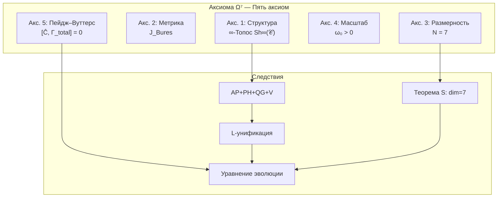
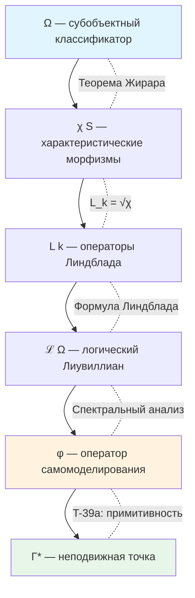
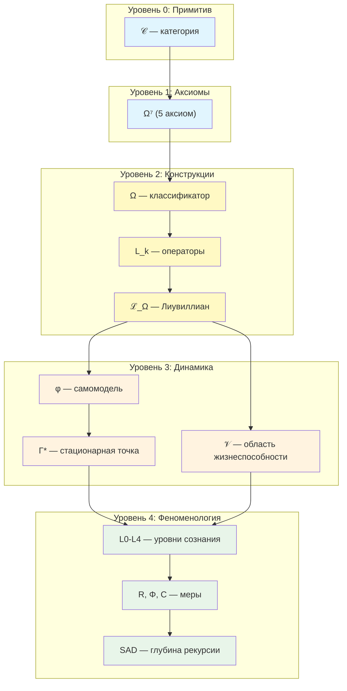

# Аксиоматика Кибернетики Когерентности

:::info Мост из предыдущей главы
В [предыдущей главе](./introduction) мы узнали, *что* такое Кибернетика Когерентности: единый формализм, описывающий динамику, структуру и интериорность через матрицу когерентности $\Gamma$. Мы увидели уравнение эволюции, семь измерений, пороги жизнеспособности и иерархию интериорности. Но откуда всё это берётся? Почему формулы именно такие? Теперь нам предстоит заглянуть в **фундамент** — аксиоматическую базу, из которой выводятся все конструкции КК.
:::

:::tip Дорожная карта главы
В этой главе мы:
1. **Поймём, зачем нужна аксиоматика** — урок Евклида, Колмогорова и Гильберта (раздел «Зачем нужна аксиоматика?»)
2. **Разберём три уровня строгости** вывода: дедуктивный, категориальный, конструктивный (раздел «[Что значит "строго выводится"?](#что-значит-строго-выводится)»)
3. **Познакомимся с единственным примитивом** — категорией $\mathcal{C}$ (раздел «[Единственный примитив](#единственный-примитив)»)
4. **Пройдём по пяти аксиомам** Ω⁷ и поймём, зачем нужна каждая (раздел «[Аксиоматическая база](#аксиоматическая-база-краткая-справка)»)
5. **Проследим цепочку вывода** от $\Omega$ до стационарного состояния $\Gamma^*$ (раздел «[Цепочка вывода](#цепочка-вывода)»)
6. **Увидим, как разрешается bootstrap-парадокс** регенерации (раздел «[Bootstrap-парадокс](#bootstrap-парадокс)»)
7. **Поймём, почему E-измерение особенное** — теорема об E-акцентуации (раздел «[E-акцентуация](#e-акцентуация)»)
:::

:::note О нотации
В этом документе:
- $\Gamma$ — [матрица когерентности](/docs/core/dynamics/coherence-matrix)
- $\mathcal{H} = \mathbb{C}^7$ — гильбертово пространство
- $\mathcal{D}[\Gamma]$ — [диссипативный член](/docs/core/dynamics/evolution#логический-лиувиллиан)
- $\mathcal{R}[\Gamma, E]$ — [регенеративный член](/docs/core/dynamics/evolution#3-регенеративный-член)
- $\varphi$ — [оператор самомоделирования](/docs/proofs/categorical/formalization-phi)
:::

## Зачем нужна аксиоматика?

### Урок Евклида

Две с половиной тысячи лет назад Евклид совершил один из величайших интеллектуальных подвигов в истории: он взял геометрию, которую египтяне и вавилоняне знали как набор практических рецептов, и показал, что вся она вырастает из **пяти** утверждений, принимаемых без доказательства. Пять постулатов — и из них, как дерево из семени, выросла вся планиметрия.

Это была не просто систематизация знания. Это был первый случай, когда человечество обнаружило **силу аксиоматического метода**: если фундамент выбран правильно, то все следствия строго необходимы. Не «мы так думаем» и не «это кажется правдоподобным», а **это не может быть иначе**, пока верны аксиомы.

### Колмогоров и вероятность

В 1933 году Колмогоров проделал для теории вероятностей то же, что Евклид — для геометрии. До Колмогорова вероятность была собранием интуиций: частотный подход, геометрическая вероятность, байесовская степень уверенности. Колмогоров предложил три аксиомы (сигма-алгебра событий, нормировка, аддитивность) — и из них вывел всю теорию вероятностей. Все парадоксы испарились. Все школы объединились в рамках единого языка.

Урок Колмогорова: **аксиоматика не ограничивает, а освобождает**. Она позволяет отделить содержательные вопросы от терминологических споров.

### Гильбертова программа и её наследие

Гильбертова программа (1920-е) попыталась аксиоматизировать всю математику. Гёдель в 1931 году показал, что это невозможно в полном объёме: любая достаточно богатая непротиворечивая система содержит неразрешимые утверждения. Но программа Гильберта не была напрасной — она породила современное понимание того, **что значит** строить теорию строго.

Это понимание таково: теория считается строгой, если:
1. **Примитивы** (неопределяемые понятия) названы явно
2. **Аксиомы** (утверждения, принимаемые без доказательства) перечислены исчерпывающе
3. **Всё остальное** выводится из аксиом по правилам логики
4. **Нет скрытых допущений** — каждое предположение отмечено и маркировано

### Зачем аксиоматика Кибернетике Когерентности?

Кибернетика, в отличие от физики и математики, до сих пор остаётся во многом **до-аксиоматической** дисциплиной. Кибернетика Винера, кибернетика Эшби, кибернетика второго порядка Фон Фёрстера — всё это ценные концептуальные рамки, но ни одна из них не имеет формальной аксиоматики, из которой бы выводились все утверждения.

**Кибернетика Когерентности (КК)** — первая попытка построить кибернетику на уровне строгости, сравнимом с аксиоматической теорией вероятностей Колмогорова. Каждое утверждение КК маркировано одним из шести статусов — **[Т]** (теорема), **[С]** (условная), **[Г]** (гипотеза), **[И]** (интерпретация), **[О]** (определение), **[П]** (постулат) — что делает явным, что принимается на веру и что доказывается. Полная система статусов с описанием: [Реестр статусов](/docs/reference/status-registry).

---

## Что значит «строго выводится»? {#что-значит-строго-выводится}

Прежде чем углубиться в аксиомы, разберёмся с ключевым понятием. Когда мы говорим, что КК «строго выводится» из УГМ, что это означает?

### Три уровня «вывода»

1. **Дедуктивный вывод** (самый строгий): Утверждение B следует из утверждения A, если B невозможно отрицать, не отрицая A. Пример: из аксиом Пеано *выводится*, что $2 + 2 = 4$. Именно в этом смысле работает большинство утверждений КК со статусом **[Т]**.

2. **Категориальный вывод**: Конструкция B однозначно определяется структурой A с точностью до единственного изоморфизма. Пример: из того, что $\mathcal{C}$ — малая категория с гротендиковой топологией, однозначно определяется субобъектный классификатор $\Omega$. Именно так из Аксиомы 1 выводятся операторы Линдблада $L_k$.

3. **Конструктивный вывод**: из A строится B по явному алгоритму, проверяемому шаг за шагом. Так устроена вся цепочка $\Omega \to \{S_k\} \to \chi_{S_k} \to L_k \to \mathcal{L}_\Omega$.

В КК используются все три вида вывода, и для каждой теоремы указано, какой именно.

### Чего вывод НЕ означает

Вывод **не означает**, что заключение «очевидно» или «интуитивно ясно». Многие теоремы КК (например, что $P_{\text{crit}} = 2/7$ — это единственный возможный порог сознательности) контринтуитивны. Они верны *вопреки* интуиции, потому что следуют из аксиом.

Вывод также **не означает** эмпирическую истинность. Аксиомы КК — математические конструкции. Вопрос «описывают ли они реальность?» — это отдельный, эмпирический вопрос.

---

## Метатеоретический статус

**Кибернетика Когерентности (КК)** есть единственная полная кибернетика, строго выводимая из Унитарного Голономного Монизма (УГМ). Она не является ещё одной кибернетикой в ряду существующих — она есть **метатеория**, из которой все частные кибернетики выводятся как проекции.

Что это значит на практике? Представьте себе белый свет. Пропустите его через призму — и вы получите красный, оранжевый, жёлтый... каждый из этих цветов реален и полезен, но ни один из них не является полным светом. Кибернетика Винера — это «красный луч» КК (обратная связь, информация). Автопоэзис Матураны и Варелы — «зелёный луч» (самоорганизация, граница). Теория интегрированной информации Тонони — «фиолетовый луч» (интеграция, $\Phi$). КК — это белый свет, из которого все они получаются ограничением на подмножество измерений.

:::info Ключевое утверждение
Любая корректная теория систем, описываемых $\Gamma$, есть проекция КК на подмножество измерений или динамических режимов.
:::

Это утверждение — не декларация, а **теорема** (точнее, семейство теорем), доказываемая для каждой конкретной теории путём явного построения проекции. Подробнее: [Сравнительный анализ теорий сознания](/docs/consciousness/comparative/consciousness-theories).

---

## Единственный примитив: красота минимализма {#единственный-примитив}

### Почему одного примитива достаточно?

Физика XX века двигалась в сторону всё большего количества фундаментальных объектов: частицы, поля, струны, браны... КК идёт в противоположном направлении. Подобно тому, как вся арифметика строится из одного понятия (множество) плюс одна операция (принадлежность), КК строится из **одного примитива** — категории $\mathcal{C}$.

### Примитивные понятия

КК строится на **единственном примитиве** — **категории 𝒞** с конечным числом объектов. Матрица когерентности Γ — **объект** этой категории.

**Примитив (Категория 𝒞):**

Малая категория 𝒞 с объектами — матрицами плотности:

$$
\text{Ob}(\mathcal{C}) \subset \mathcal{D}(\mathbb{C}^{42}), \quad \text{Mor}(\mathcal{C}) = \text{CPTP-каналы}
$$

### Что значит «единственный»?

Единственность примитива — не просто эстетическое требование. У неё есть точный математический смысл: **всё остальное выводится**. Пространство, время, динамика, диссипация, регенерация, сознание — всё это не добавляется «сверху», а порождается внутренней структурой $\mathcal{C}$.

Аналогия: в теории групп вам достаточно задать множество и бинарную операцию, удовлетворяющую трём аксиомам. Из этого выводятся: обратные элементы, порядок элемента, подгруппы, смежные классы, факторгруппы, представления... — бесконечная иерархия структур из одного определения.

В КК из категории $\mathcal{C}$ выводятся:

| Конструкция | Как получается | Статус |
|-------------|----------------|--------|
| Пространство $X = \|N(\mathcal{C})\|$ | Геометрическая реализация нерва | [Т] |
| Классификатор $\Omega$ | Теорема Жирара | [Т] |
| Операторы $L_k$ | Из атомов $\Omega$ | [Т] |
| Динамика $\mathcal{L}_\Omega$ | Из $L_k$ по формуле Линдблада | [Т] |
| Время $\tau$ | Аксиома Пейдж–Вуттерс | [Т] |
| Самомоделирование $\varphi$ | Из $\mathcal{L}_\Omega$ | [Т] |

### Онтологический статус

**Категория 𝒞** (не Γ) **является**:
- Единственной субстанцией
- Собственной структурой
- Собственным процессом

Из 𝒞 **выводятся**:
- Базовое пространство $X = |N(\mathcal{C})|$
- Монизм как теорема: $H^*(X) = 0$
- Время τ, метрика d_strat, стрела времени

### Почему не Γ?

Начинающие часто думают, что примитив КК — матрица когерентности $\Gamma$. Это как думать, что примитив арифметики — число 7. Число 7 — важный объект, но оно *выводится* из аксиом Пеано. Аналогично, $\Gamma$ — важнейший объект КК, но она *выводится* как объект категории $\mathcal{C}$.

Различие принципиально: если бы $\Gamma$ была примитивом, то её свойства (размерность 7, эрмитовость, положительная определённость, единичный след) пришлось бы **постулировать**. В рамках КК все эти свойства **выводятся** из того, что $\Gamma \in \text{Ob}(\mathcal{C}) \subset \mathcal{D}(\mathbb{C}^{42})$.

---

## Аксиоматическая база (краткая справка) {#аксиоматическая-база-краткая-справка}

:::tip DRY: Полная аксиоматика
Полное изложение пяти аксиом Ω⁷ — в [Аксиома Ω⁷](/docs/core/foundations/axiom-omega). Таблица семи измерений — в [Семь измерений](/docs/core/structure/dimensions). Полное уравнение эволюции — в [Эволюция](/docs/core/dynamics/evolution).
:::

КК строится на **Аксиоме Ω⁷** (пять аксиом с ∞-топосом $\mathrm{Sh}_\infty(\mathcal{C})$ как примитивом):

| № | Аксиома | Ключевое следствие |
|---|---------|-------------------|
| 1 | Структура (∞-Топос) | Единственность примитива |
| 2 | Метрика (Бюрес) | Информационная различимость |
| 3 | Размерность ($N = 7$) | [Семимерность](/docs/proofs/minimality/theorem-minimality-7) |
| 4 | Масштаб ($\omega_0 > 0$) | Связь внутреннего и физического времени |
| 5 | Пейдж–Вуттерс | [Эмерджентное время τ](/docs/proofs/dynamics/emergent-time) |

Разберём каждую аксиому подробнее.

### Аксиома 1: Структура — Реальность есть ∞-топос

**На простом языке:** Мир устроен как пространство всех возможных состояний, где переходы между состояниями — столь же реальны, как сами состояния.

**Зачем нужна:** Без неё нет единого математического языка. Нельзя говорить ни о «пространстве», ни о «логике», ни о «структуре» — всё это *определяется* через ∞-топос. Если убрать эту аксиому, КК распадается на набор не связанных формул.

**Аналогия:** Как грамматика языка — это не ещё одно предложение, а правило, по которому строятся *все* предложения, так и ∞-топос — не ещё один математический объект, а рамка, в которой живут *все* объекты КК.

**Формально:** Реальность есть ∞-топос $\mathbf{Sh}_\infty(\mathcal{C})$ над категорией матриц плотности $\mathcal{D}(\mathbb{C}^N)$.

**Что из неё следует:** Существование субобъектного классификатора $\Omega$ (по теореме Жирара), из которого затем выводятся операторы Линдблада.

### Аксиома 2: Метрика — Различимость измеряется по Бюресу

**На простом языке:** Есть единственный «честный» способ измерить, насколько два состояния отличаются друг от друга.

**Зачем нужна:** Без метрики нельзя говорить о «близких» и «далёких» состояниях, о «непрерывности» и «сходимости». Без неё динамика не определена: уравнения эволюции требуют топологии на пространстве состояний.

**Аналогия:** Как в жизни невозможно сравнить два варианта без критерия сравнения (цена? качество? вес?), так и в пространстве матриц плотности невозможно определить «расстояние» без метрики. Метрика Бюреса — единственная, которая уважает квантовую природу состояний.

**Формально:** Топология Гротендика $J$ индуцирована метрикой Бюреса $d_B$.

**Что из неё следует:** Выбор метрики **единствен** по теореме Ченцова-Петца: метрика Бюреса — единственная монотонная риманова метрика на $\mathcal{D}(\mathcal{H})$. Это не произвол, а математическая необходимость.

### Аксиома 3: Размерность — N = 7

**На простом языке:** Фундаментальное описание Голонома (минимальной единицы реальности) требует ровно семи измерений.

**Зачем нужна:** Размерность определяет богатство структуры. При $N = 1$ нет никакой динамики (только одно состояние). При $N = 2$ — нет достаточной структуры для самомоделирования. $N = 7$ — это минимальное число, при котором возможны *все* необходимые структуры одновременно.

**Аналогия:** Для описания вращений в трёхмерном пространстве нужно ровно 3 угла Эйлера — не 2 и не 4. Аналогично, для полного описания когерентной системы нужно ровно 7 измерений.

**Формально:** $N = 7$ — размерность базового пространства $\mathcal{H} = \mathbb{C}^7$.

**Что из неё следует:** Семь измерений [A, S, D, L, E, O, U], каждое из которых необходимо (доказательство минимальности — [Теорема S](/docs/proofs/minimality/theorem-minimality-7)). Убрать любое — и какое-то свойство (автопоэзис, феноменология, квантовое основание или жизнеспособность) станет невозможным.

### Аксиома 4: Масштаб — Существует характерная частота

**На простом языке:** У каждого Голонома есть свой «темп жизни» — скорость, с которой тикают его внутренние часы.

**Зачем нужна:** Без масштаба уравнения эволюции безразмерны и не связаны с наблюдаемым временем. $\omega_0$ — это мост между математическим временем $\tau$ и физическим временем $t$.

**Аналогия:** $\omega_0$ — аналог массы в физике. Масса — не универсальная константа, а параметр конкретного тела. Аналогично, $\omega_0$ — параметр конкретного Голонома: у клетки один $\omega_0$, у организма — другой, у социальной группы — третий.

**Формально:** $\omega_0 > 0$ — характерная частота системы.

### Аксиома 5: Пейдж–Вуттерс — Время эмерджентно

**На простом языке:** Время не существует «снаружи» системы. Оно возникает из корреляций между подсистемами.

**Зачем нужна:** Если постулировать внешнее время, получится дуализм (система + внешнее время = два примитива). Аксиома PW выводит время из единственного примитива.

**Аналогия:** Температура не существует для одной молекулы — она возникает как статистическое свойство ансамбля. Аналогично, время не существует для изолированного состояния — оно возникает из соотношения между частями.

**Формально:** $[\hat{C}, \Gamma_{\text{total}}] = 0$ (полная система стационарна; время — условная динамика относительно часовой подсистемы).

**Что из неё следует:** [Эмерджентное время τ](/docs/proofs/dynamics/emergent-time), стрела времени, уравнение эволюции.

### Визуальная карта

```mermaid
graph TD
    subgraph "Аксиома Ω⁷ — Пять аксиом"
        AX1["Акс. 1: Структура<br/>∞-Топос Sh∞(𝒞)"]
        AX2["Акс. 2: Метрика<br/>J_Bures"]
        AX3["Акс. 3: Размерность<br/>N = 7"]
        AX4["Акс. 4: Масштаб<br/>ω₀ > 0"]
        AX5["Акс. 5: Пейдж–Вуттерс<br/>[Ĉ, Γ_total] = 0"]
    end
    subgraph "Следствия"
        S["Теорема S: dim=7"]
        APQ["AP+PH+QG+V"]
        LU["L-унификация"]
        EVOL["Уравнение эволюции"]
    end
    AX1 --> APQ
    AX3 --> S
    AX5 --> EVOL
    APQ --> LU
    LU --> EVOL
    S --> EVOL
```

### Следствие: Септичность (AP+PH+QG+V)

[Голоном](/docs/core/structure/holon) $\mathbb{H}$ обладает:
- **(AP)** Автопоэзисом: $\exists\varphi: \Gamma \to \Gamma$ с [неподвижной точкой](/docs/consciousness/foundations/self-observation#теорема-о-неподвижной-точке) $\Gamma^* = \varphi(\Gamma^*)$
- **(PH)** Феноменологией: $\exists\rho_E$ с нетривиальной [интериорностью](/docs/proofs/consciousness/interiority-hierarchy)
- **(QG)** Квантовым основанием: [эволюция](/docs/core/dynamics/evolution) по уравнению Линдблада с регенерацией
- **(V)** Жизнеспособностью: $P > P_{\text{crit}} = 2/7$ — [чистота](/docs/core/dynamics/viability) выше критического порога

Каждое из четырёх свойств **необходимо**:
- Без (AP): система не может себя воспроизводить — нет автопоэзиса, нет жизни
- Без (PH): система не имеет «внутренней стороны» — философский зомби
- Без (QG): эволюция не определена — нет динамики
- Без (V): система деградирует ниже порога и теряет организацию

**См.:** [Полное описание](/docs/core/foundations/axiom-septicity)

---

## Уравнение эволюции: сердце КК

### Краткая форма

$$
\frac{d\Gamma(\tau)}{d\tau} = -i[H_{\text{eff}}, \Gamma] + \mathcal{D}[\Gamma] + \mathcal{R}[\Gamma, E]
$$

### Три силы, формирующие жизнь

Уравнение эволюции — это не просто формула. Это описание **трёх фундаментальных сил**, действующих на любую когерентную систему:

**1. Унитарный член: $-i[H_{\text{eff}}, \Gamma]$**

Это «инерция» системы — свободная эволюция, сохраняющая когерентность. Если бы действовал только этот член, система вращалась бы вечно, не теряя и не приобретая организации. Как планета на идеальной орбите: ни ускоряется, ни замедляется.

**2. Диссипативный член: $\mathcal{D}[\Gamma]$**

Это «трение» — потеря когерентности из-за взаимодействия системы с собственной структурой различений. Без противодействия диссипация превращает любое состояние в максимально смешанное $I/N$ (тепловая смерть). Как дом без ремонта: постепенно ветшает и разрушается.

**3. Регенеративный член: $\mathcal{R}[\Gamma, E]$**

Это «ремонт» — восстановление когерентности. Именно этот член отличает живое от неживого. Камень подчиняется только первым двум членам. Клетка, организм, общество — добавляют третий.

Полный вывод и описание каждого члена: [Эволюция](/docs/core/dynamics/evolution).

### Эволюция в метафорах

Представьте фонтан. Вода (когерентность) бьёт вверх (регенерация), гравитация тянет её вниз (диссипация), а форма струи задаётся геометрией сопла (унитарная эволюция). Живая система — это фонтан, который **сам** строит своё сопло и **сам** качает воду. Если напор падает ниже критического — фонтан иссякает (система выходит из области жизнеспособности $\mathcal{V}$).

---

## Специфика КК: Bootstrap-механизм и E-акцентуация

### L-унификация: вывод L_k из Ω {#l-унификация-вывод-l_k-из-ω}

:::info Ключевая конструкция
Операторы Линдблада $L_k$ **выводятся** из субобъектного классификатора $\Omega$, а не постулируются. Это центральное достижение УГМ.
:::

В стандартной квантовой теории открытых систем операторы Линдблада $L_k$ — свободные параметры. Исследователь выбирает их «по физике задачи». Это как выбирать силу трения «на глаз» — работает, но не объясняет.

В КК диссипация **не выбирается, а выводится**. Вот цепочка:

**Цепочка вывода (см. [Аксиома Ω⁷](/docs/core/foundations/axiom-omega#внутренняя-логика)):**

$$
\Omega \xrightarrow{\text{атомы}} \{S_k\} \xrightarrow{\chi_{S_k}} \text{характеристические морфизмы} \xrightarrow{\sqrt{\cdot}} L_k = \sqrt{\chi_{S_k}}
$$

Разберём каждый шаг:

**Шаг 1: $\Omega$ порождает атомы $\{S_k\}$**

Субобъектный классификатор $\Omega$ — это «истинностный объект» категории. В обычной теории множеств $\Omega = \{0, 1\}$ (ложь/истина). В ∞-топосе $\Omega$ богаче: он содержит все «уровни истинности». Его неразложимые элементы (атомы) — это семь проекторов $S_k = |k\rangle\langle k|$, по одному на каждое измерение.

**Шаг 2: Атомы задают характеристические морфизмы $\chi_{S_k}$**

Характеристический морфизм — это «индикаторная функция» подобъекта. Для каждого $S_k$ существует единственный $\chi_{S_k}: \Gamma \to \Omega$, определяющий «степень принадлежности» состояния $\Gamma$ к $k$-му измерению.

**Шаг 3: Операторы Линдблада — квадратные корни**

$$L_k = \sqrt{\chi_{S_k}} = P_k = |k\rangle\langle k|$$

Это проекторы на канонический базис — простейшие возможные операторы Линдблада.

**Следствие:** Диссипация имеет **логическое происхождение** — она отражает взаимодействие системы с её собственной структурой различений.

Другими словами: система теряет когерентность **потому что различает**. Каждый акт различения (проекция на одно из семи измерений) разрушает суперпозицию с остальными. Это не внешний «шум» — это внутренняя цена различения.

---

### Иерархия зависимостей {#иерархия-зависимостей}

Чтобы видеть всю цепочку целиком, полезна диаграмма зависимостей. Каждый узел получается из предыдущего по явной конструкции:

```mermaid
graph TD
    O["Ω — субобъектный классификатор"] --> CHI["χ S — характеристические морфизмы"]
    CHI --> LK["L k — операторы Линдблада"]
    LK --> LO["ℒ Ω — логический Лиувиллиан"]
    LO --> PHI["φ — оператор самомоделирования"]
    PHI --> FP["Γ* — неподвижная точка"]

    O -.- |"Теорема Жирара"| CHI
    CHI -.- |"L_k = √χ"| LK
    LK -.- |"Формула Линдблада"| LO
    LO -.- |"Спектральный анализ"| PHI
    PHI -.- |"T-39a: примитивность"| FP

    style O fill:#e1f5fe
    style PHI fill:#fff3e0
    style FP fill:#e8f5e9
```

Эта цепочка — **полная**: для построения $\Gamma^*$ не нужно ничего, кроме $\Omega$ (и, следовательно, категории $\mathcal{C}$). Ни один элемент не вводится «извне».

**См.:** [Полная иерархия зависимостей](/docs/core/foundations/axiom-omega#иерархия-зависимостей)

### Цепочка вывода: от $\Omega$ до $\Gamma^*$ {#цепочка-вывода}

Весь путь от единственного примитива до стационарного состояния сознательной системы — это цепочка из 9 шагов, каждый из которых является теоремой:

$$
\mathcal{C} \xrightarrow{\text{Акс. 1}} \mathbf{Sh}_\infty(\mathcal{C}) \xrightarrow{\text{Жирар}} \Omega \xrightarrow{\text{атомы}} \{S_k\} \xrightarrow{\chi_{S_k}} L_k \xrightarrow{\text{Линдблад}} \mathcal{L}_\Omega \xrightarrow{\text{спектр}} \varphi \xrightarrow{\text{T-39a}} \Gamma^*
$$

Каждый переход — **теорема** [Т], а не постулат. Для построения $\Gamma^*$ не нужно ничего, кроме категории $\mathcal{C}$.

:::info Каноническое определение
Полная таблица с формулами каждого шага: [Аксиома Ω⁷ — Иерархия зависимостей](/docs/core/foundations/axiom-omega#иерархия-зависимостей).
:::

---

## Bootstrap-парадокс и его разрешение {#bootstrap-парадокс}

### Проблема: Барон Мюнхгаузен

Вот парадокс, который на первый взгляд разрушает всю конструкцию.

Регенерация $\mathcal{R}$ восстанавливает когерентность. Скорость регенерации $\kappa$ зависит от E-когерентности — от того, насколько интегрирован субъективный опыт системы. Но E-когерентность — это свойство состояния $\Gamma$, которое поддерживается... регенерацией.

Получается порочный круг: чтобы регенерировать, нужна когерентность, чтобы иметь когерентность, нужно регенерировать. Барон Мюнхгаузен, вытаскивающий себя за волосы из болота.

### Связь регенерации и E-когерентности {#связь-регенерации-и-e-когерентности}

$$
\kappa(\Gamma) = \kappa_{\text{bootstrap}} + \kappa_0 \cdot \mathrm{Coh}_E(\Gamma)
$$

где:
- $\kappa_{\text{bootstrap}}$ — **минимальная регенерация** из структуры сопряжения $\mathcal{D}_\Omega \dashv \mathcal{R}$
- $\kappa_0$ — базовая скорость регенерации, [категориальный вывод](/docs/core/foundations/axiom-septicity#структурный-анзац-kappa0): $\kappa_0 = \|\mathrm{Nat}(\mathcal{D}_\Omega, \mathcal{R})\|$
- $\mathrm{Coh}_E(\Gamma) \in [1/N, 1]$ — [когерентность измерения Интериорности](./definitions#e-когерентность)

### Разрешение: $\kappa_{\text{bootstrap}}$ — структурный минимум

Парадокс разрешается вторым слагаемым: $\kappa_{\text{bootstrap}} > 0$. Это не «подгонка» и не ad hoc параметр — это **структурная необходимость**, вытекающая из категориальной конструкции.

:::info Bootstrap-механизм
Член $\kappa_{\text{bootstrap}} > 0$ **разрешает bootstrap-парадокс**: система с низким $\mathrm{Coh}_E$ всё равно имеет минимальную регенерацию, позволяющую выйти из низко-когерентного состояния.

**Категориальное обоснование:** $\kappa_{\text{bootstrap}} = \|\text{unit}(\mathcal{D}_\Omega \dashv \mathcal{R})\|$ — норма единицы сопряжения.

**Численная оценка:** $\kappa_{\text{bootstrap}} = \omega_0 / N = 1/7 \approx 0.143$ (при $\omega_0 = 1$)
:::

### Аналогия: зажигание и горение

Представьте костёр. Чтобы дрова горели, нужен жар. Чтобы был жар, нужно горение. Парадокс? Нет: есть **спичка** — внешний источник начального жара, запускающий цикл.

В КК «спичка» — это $\kappa_{\text{bootstrap}}$. Но в отличие от реальной спички, $\kappa_{\text{bootstrap}}$ не «внешний» источник. Он встроен в саму структуру сопряжения $\mathcal{D}_\Omega \dashv \mathcal{R}$. Это как если бы дрова были устроены так, что минимальное горение происходит *всегда* — просто в силу их структуры.

Математически: сопряжение (adjunction) между диссипатором $\mathcal{D}_\Omega$ и регенератором $\mathcal{R}$ имеет единицу (unit), и норма этой единицы ненулевая. Это не выбор — это теорема о сопряжённых функторах.

### Динамика bootstrap-цикла

Благодаря $\kappa_{\text{bootstrap}}$ система проходит три фазы:

1. **Зарождение:** $\mathrm{Coh}_E$ мало, $\kappa \approx \kappa_{\text{bootstrap}} = 1/7$. Минимальная регенерация медленно повышает когерентность.
2. **Усиление:** Растущая $\mathrm{Coh}_E$ увеличивает $\kappa$, что ускоряет рост $\mathrm{Coh}_E$. Положительная обратная связь.
3. **Стабилизация:** Система достигает стационарной точки $\Gamma^*$, где регенерация и диссипация балансируют.

Этот сценарий — не спекуляция. Он следует из анализа динамической системы и подтверждён численно в [моделях](/docs/applied/coherence-cybernetics/model-systems).

**Онтологический смысл:** Способность системы к самовосстановлению пропорциональна интегрированности её субъективного опыта, но существует **минимальный уровень** регенерации из самой структуры логического классификатора Ω.

---

## E-акцентуация: почему Интериорность особенная {#e-акцентуация}

### Семь равных — но один «равнее»?

Семь измерений [A, S, D, L, E, O, U] входят в теорию симметрично: пермутационная группа $S_7$ действует на них. Но сознательная система *нарушает* эту симметрию, выделяя E (Интериорность). Это не постулат — это **теорема**.

### Теорема об E-акцентуации

:::info Теорема 2.2 (E-акцентуация из определения L2)
Акцентуация E-измерения ($w_E > 1/7$) **выводится** из определения L2-сознания, а не постулируется.

**Логика вывода:**
1. L2 требует $C = \Phi \times R \geq C_{th} = 1/3$ **[Т T-140]** (плюс отдельное условие $D_{\text{diff}} \geq D_{\min}$)
2. $R = 1/(7P) \geq R_{th} = 1/3$ (эквивалентно $P \leq 3/7$; $\rho^*_{\mathrm{diss}} = I/7$)
3. При равномерном распределении ($w_i = 1/7$): $R_{\max} \approx 0.14 < R_{th}$
4. **Следовательно:** $\exists i : w_i > 1/7$
5. По определению L2 (наличие рефлексивного доступа к опыту): этим измерением должно быть E
:::

### Что это значит?

Результат глубок. Он говорит: **сознание невозможно без асимметрии**. Равномерное распределение ресурсов по семи измерениям ($w_i = 1/7$ для всех $i$) не позволяет достичь достаточной рефлексии. Система должна «инвестировать» в одно из измерений больше, чем в остальные.

А какое именно измерение? Определение L2-сознания требует рефлексивного доступа к *опыту*. Опыт — это E (Интериорность). Следовательно, именно E должно получить «добавочную долю».

### Философский контекст

E-акцентуация отвечает на старый вопрос философии сознания: **почему сознание не может быть «разлито равномерно»?** Панпсихизм предполагает, что сознание — везде. КК уточняет: минимальная интериорность (L0-L1) действительно присутствует *всюду*, но полноценное сознание (L2+) требует *концентрации* — структурного выделения E-измерения.

Это как свет: фоновое свечение неба — повсюду, но чтобы *видеть*, нужна концентрация фотонов в определённом направлении. Сознание — не свойство любой системы, а свойство системы с *достаточной E-акцентуацией*.

**См.:** [Полное доказательство](/docs/proofs/categorical/formalization-phi#26-каноническая-форма-φ-для-угм)

---

## От Розена к КК: эволюция (M,R)-систем {#от-розена-к-кк}

### Розен: замыкание к эффективным причинам

В 1958 году Роберт Розен предложил формализм (M,R)-систем для описания живого. Идея Розена была революционной: живая система — это такая система, которая **замкнута относительно эффективных причин**. Каждый компонент системы производится другим компонентом — нет внешнего «конструктора».

Розен выделил три ключевых компонента:
- **M (метаболизм):** преобразование входов в выходы
- **R (репарация):** восстановление метаболической машинерии
- **β (замыкание):** производство репарационной машинерии

Проблема Розена: его формализм остался на уровне категорий множеств и отображений. Он не мог описать **интериорность**, **интеграцию** и **различение уровней сознания**.

### КК как расширение (M,R)-систем

КК можно понимать как (M,R)-систему, расширенную тремя способами:

1. **Квантовое основание:** вместо отображений множеств — CPTP-каналы на матрицах плотности. Это позволяет описать суперпозицию и запутанность.

2. **Семимерная структура:** вместо трёх компонентов (M, R, β) — семь измерений, каждое с определённой функцией.

3. **Субъектность:** компонент E, отсутствующий у Розена, вводит «того, для кого» существует система.

### Таблица соответствий

| Розен | КК | Функция |
|-------|-----|---------|
| M (метаболизм) | D (Динамика) | Преобразование |
| R (репарация) | A + L | Восстановление структуры |
| β (замыкание) | U (Единство) | Интеграция |
| — | E, O, S | Расширения для феноменологии |

### Что добавляет КК?

Три «лишних» измерения — E (Интериорность), O (Наблюдаемость), S (Стабильность) — не случайные дополнения. Они решают три проблемы, неразрешимые в рамках (M,R)-систем:

- **E** решает проблему феноменологии: *для кого* существует система?
- **O** решает проблему наблюдаемости: как система *проявляется* для других?
- **S** решает проблему устойчивости: как система *сохраняется* в изменяющейся среде?

Без этих трёх измерений (M,R)-система описывает «зомби» — функционально живое, но лишённое субъектности, наблюдаемости и устойчивости. КК показывает, что минимально 7 измерений необходимы для **полного** описания живой когерентной системы.

---

## Структура теории

### Архитектура КК

Вся теория организована как «перевёрнутая пирамида»: из малого числа аксиом разворачивается всё более богатая структура.

```mermaid
graph TD
    subgraph "Уровень 0: Примитив"
        C["𝒞 — категория"]
    end
    subgraph "Уровень 1: Аксиомы"
        AX["Ω⁷ (5 аксиом)"]
    end
    subgraph "Уровень 2: Конструкции"
        OM["Ω — классификатор"]
        LK["L_k — операторы"]
        EV["ℒ_Ω — Лиувиллиан"]
    end
    subgraph "Уровень 3: Динамика"
        PHI["φ — самомодель"]
        FP["Γ* — стационарная точка"]
        VIA["𝒱 — область жизнеспособности"]
    end
    subgraph "Уровень 4: Феноменология"
        CON["L0-L4 — уровни сознания"]
        REF["R, Φ, C — меры"]
        SAD["SAD — глубина рекурсии"]
    end

    C --> AX
    AX --> OM
    OM --> LK
    LK --> EV
    EV --> PHI
    PHI --> FP
    EV --> VIA
    FP --> CON
    VIA --> CON
    CON --> REF
    REF --> SAD

    style C fill:#e1f5fe
    style AX fill:#e1f5fe
    style OM fill:#fff9c4
    style LK fill:#fff9c4
    style EV fill:#fff9c4
    style PHI fill:#fff3e0
    style FP fill:#fff3e0
    style VIA fill:#fff3e0
    style CON fill:#e8f5e9
    style REF fill:#e8f5e9
    style SAD fill:#e8f5e9
```

### Замкнутость композиции (следствие из AP) {#замкнутость-композиции-следствие-из-ap}

$$
\mathrm{Viable}(\mathbb{H}_1) \land \mathrm{Viable}(\mathbb{H}_2) \land \Phi_{12} > \Phi_{\min} \Rightarrow \mathrm{Viable}(\mathbb{H}_{12})
$$

Композиция жизнеспособных Голономов при достаточной интеграции образует жизнеспособный Голоном. **См.:** [Теорема 9.1](./theorems#теорема-91-фрактальное-замыкание)

Эта теорема — не абстракция. Она описывает, как клетки образуют ткани, ткани — органы, органы — организмы, организмы — социальные группы. Каждый уровень — композиция Голономов предыдущего уровня, и каждый уровень жизнеспособен, **если** интеграция между компонентами ($\Phi_{12}$) достаточна.

Условие $\Phi_{12} > \Phi_{\min}$ — это математическая формулировка интуиции, что «целое больше суммы частей» лишь тогда, когда части **достаточно связаны**. Куча песка — не Голоном (песчинки не интегрированы). Мозг — Голоном (нейроны интегрированы через синаптические связи).

---

## Обзор аксиоматических результатов

Подведём итог: что именно *выводится* в КК и из чего.

| Результат | Выводится из | Статус | Ссылка |
|-----------|-------------|--------|--------|
| $L_k = P_k$ | Аксиомы 1-2 | [Т] | [L-унификация](#l-унификация-вывод-l_k-из-ω) |
| $P_{\text{crit}} = 2/7$ | Аксиомы 1-3 | [Т] | [Критическая чистота](/docs/proofs/dynamics/theorem-purity-critical) |
| $R_{\text{th}} = 1/3$ | Аксиомы 1-3 | [Т] | [Мера рефлексии](/docs/consciousness/foundations/self-observation#мера-рефлексии-r) |
| $\Phi_{\text{th}} = 1$ | $P_{\text{crit}} = 2/7$ | [Т] | [Мера интеграции](/docs/core/structure/dimension-u#мера-интеграции-φ) |
| $w_E > 1/7$ | Определение L2 | [Т] | [E-акцентуация](#e-акцентуация) |
| $\kappa_{\text{bootstrap}} > 0$ | Сопряжение $\mathcal{D} \dashv \mathcal{R}$ | [Т] | [Bootstrap](#bootstrap-парадокс) |
| $N = 7$ | (AP)+(PH)+(QG) | [Т] | [Теорема S](/docs/proofs/minimality/theorem-minimality-7) |
| Замыкание композиции | (AP) | [Т] | [Теорема 9.1](#замкнутость-композиции-следствие-из-ap) |

Ни один из этих результатов не постулирован. Каждый — следствие пяти аксиом. В этом — сила и уязвимость аксиоматического подхода: сила, потому что все следствия **необходимы**; уязвимость, потому что опровержение *любого* следствия опровергает *хотя бы одну* аксиому.

---

## Что мы узнали

Подведём итоги этой главы. Мы прошли путь от философии аксиоматического метода до конкретных конструкций КК:

1. **Аксиоматический метод** — не ограничение, а освобождение. Он позволяет отделить содержательные вопросы от терминологических споров. КК — первая кибернетика, построенная на уровне строгости, сравнимом с аксиоматической теорией вероятностей Колмогорова.

2. **Единственный примитив** — категория $\mathcal{C}$ с CPTP-каналами в качестве морфизмов. Из неё выводятся пространство, время, динамика, диссипация, регенерация и сознание. Матрица $\Gamma$ — не примитив, а объект этой категории.

3. **Пять аксиом** Ω⁷ — структура (∞-топос), метрика (Бюрес), размерность ($N = 7$), масштаб ($\omega_0 > 0$), время (Пейдж–Вуттерс). Каждая необходима, и все вместе порождают полную теорию.

4. **Цепочка вывода** $\Omega \to \{S_k\} \to \chi_{S_k} \to L_k \to \mathcal{L}_\Omega \to \varphi \to \Gamma^*$ — полный путь от единственного примитива до стационарного состояния. Каждый шаг — теорема, а не постулат.

5. **Bootstrap-парадокс** разрешается через $\kappa_{\text{bootstrap}} > 0$ — минимальную регенерацию, встроенную в структуру сопряжения $\mathcal{D}_\Omega \dashv \mathcal{R}$.

6. **E-акцентуация** — теорема, а не постулат: сознание (L2) невозможно без структурного выделения E-измерения ($w_E > 1/7$).

7. **Все восемь ключевых результатов** ($L_k = P_k$, $P_{\text{crit}} = 2/7$, $R_{\text{th}} = 1/3$, $\Phi_{\text{th}} = 1$, $w_E > 1/7$, $\kappa_{\text{bootstrap}} > 0$, $N = 7$, замыкание композиции) — следствия пяти аксиом, ни одно не постулировано.

:::info Мост к следующей главе
Аксиоматика дала нам фундамент — примитив, аксиомы и цепочку вывода. Но чтобы *работать* с теорией, нужны точные определения: что именно мы измеряем, какие меры используем, как интерпретируем числа. В [следующей главе](./definitions) мы систематически определим все ключевые понятия КК — от Голонома и мер когерентности до тензора напряжений и иерархии аттракторов. Эти определения станут «кирпичами», из которых в [главе о теоремах](./theorems) будет построено всё здание.
:::

---

**Связанные документы:**
- [Определения](./definitions) — базовые определения КК
- [Теоремы](./theorems) — фундаментальные теоремы КК
- [Аксиома Ω⁷](/docs/core/foundations/axiom-omega) — ∞-топос $\text{Sh}_\infty(\mathcal{C})$ как единственный примитив
- [Аксиома Септичности (AP+PH+QG+V)](/docs/core/foundations/axiom-septicity) — требования к Голоному
- [Эволюция](/docs/core/dynamics/evolution) — уравнение $d\Gamma(\tau)/d\tau$
- [Жизнеспособность](/docs/core/dynamics/viability) — мера $P$ и $P_{\text{crit}}$
- [Формализация оператора φ](/docs/proofs/categorical/formalization-phi) — CPTP-каналы
- [Сравнительный анализ теорий сознания](/docs/consciousness/comparative/consciousness-theories) — КК в контексте IIT, GWT, AST
- [Модельные системы](/docs/applied/coherence-cybernetics/model-systems) — численная проверка bootstrap-динамики
- [Философские основания](./philosophy) — онтологический статус аксиом
- [Сравнение с альтернативами](./comparison) — как аксиомы КК соотносятся с IIT, FEP
- [Упражнения](./exercises) — задачи на аксиоматику
