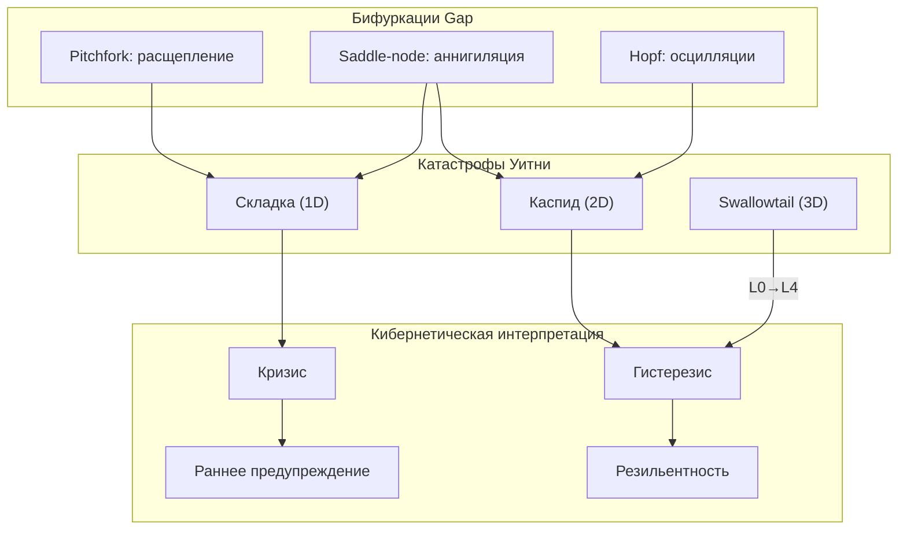

# Бифуркации Gap-ландшафта

:::note О нотации
В этом документе:
- $\Gamma$ — [матрица когерентности](/docs/core/dynamics/coherence-matrix)
- $P$ — [чистота](/docs/core/dynamics/viability#определение-чистоты): $P = \mathrm{Tr}(\Gamma^2)$
- $P_{\text{crit}} = 2/7$ — [теорема о критической чистоте](/docs/proofs/dynamics/theorem-purity-critical)
- $\mathrm{Gap}(i,j) = |\sin(\arg(\gamma_{ij}))|$ — [мера зазора](/docs/physics/dual-aspect/gap-semantics)
- $\hat{\mathcal{G}} \in \mathfrak{so}(7)$ — [Gap-оператор](/docs/core/dynamics/gap-dynamics#gap-оператор)
- $T_{\text{eff}}$ — [эффективная температура](/docs/core/dynamics/gap-thermodynamics#эффективная-температура)
- $\kappa$, $\Gamma_2$ — скорости регенерации и декогеренции
- L0–L4 — [уровни интериорности](/docs/proofs/consciousness/interiority-hierarchy)
:::

:::warning Статус документа
Этот документ развивает кибернетическую интерпретацию результатов, доказанных в [Gap-динамике](/docs/core/dynamics/gap-dynamics#бифуркации) и [Фазовой диаграмме Gap](/docs/core/dynamics/gap-phase-diagram). Статусы указаны для каждого результата индивидуально.
:::

Бифуркации Gap-ландшафта описывают **качественные изменения** стационарного Gap-профиля при непрерывном изменении управляющих параметров. В контексте Кибернетики Когерентности бифуркации формализуют кризисы, прозрения, циклические нарушения и потерю жизнеспособности.

---

## 1. Бифуркации в Gap-динамике {#бифуркации-в-gap-динамике}

Gap-ландшафт — отображение пространства состояний в 21-мерный куб непрозрачностей:

$$
\mathcal{G}: \mathcal{D}(\mathbb{C}^7) \to [0,1]^{21}, \quad \mathcal{G}(\Gamma) := \{\mathrm{Gap}(i,j)\}_{1 \leq i < j \leq 7}
$$

При изменении управляющего параметра $\mu$ (внешнее давление, внутренняя регенерация, температура) Gap-ландшафт претерпевает качественные перестройки — **бифуркации**. Три основных типа подробно описаны в [Теореме 4.1](/docs/core/dynamics/gap-dynamics#бифуркации) **[Т]**.

### 1.1 Вилочная бифуркация (Pitchfork) {#pitchfork}

:::tip Теорема (Pitchfork-бифуркация для Gap) [Т]
При наличии дискретной симметрии Gap-ландшафта и пересечении критического значения управляющего параметра $\mu_c$ единственное стационарное состояние расщепляется на два:

$$
\mathrm{Gap}^{(\infty)}(i,j;\, \mu) = \begin{cases}
\mathrm{Gap}_0 & \text{при } \mu < \mu_c \\
\mathrm{Gap}_0 \pm \sqrt{\mu - \mu_c} & \text{при } \mu > \mu_c
\end{cases}
$$

**Доказательство:** См. [Gap-динамика, Теорема 4.1(a)](/docs/core/dynamics/gap-dynamics#бифуркации).
:::

**Нормальная форма:** Уравнение движения Gap вблизи бифуркации сводится к

$$
\frac{d\,\mathrm{Gap}}{d\tau} = (\mu - \mu_c)\,\mathrm{Gap} - \mathrm{Gap}^3
$$

При $\mu < \mu_c$ единственная стационарная точка $\mathrm{Gap} = 0$ устойчива. При $\mu > \mu_c$ она теряет устойчивость, и рождаются две новые: $\mathrm{Gap}^{(\pm)} = \pm\sqrt{\mu - \mu_c}$.

**Gap-специфические параметры:**
- $\mu$ отождествляется с $T_{\text{eff}} / T_c$ — безразмерной температурой
- $\mu_c$ — критическая температура фазового перехода I $\leftrightarrow$ II ([три фазы](/docs/core/dynamics/gap-phase-diagram#три-фазы))
- При $T_{\text{eff}} > T_c$: параметр порядка $\mu^2$ **меняет знак** ($\mu^2 < 0 \to \mu^2 > 0$), и Gap-профиль спонтанно приобретает ненулевую анизотропию

:::info Кибернетическая интерпретация [И]
Pitchfork-бифуркация соответствует **спонтанному нарушению симметрии** Gap-профиля. В психологическом контексте это *экзистенциальный выбор*: система, которая до бифуркации находилась в симметричном состоянии (все каналы одинаково прозрачны/непрозрачны), вынуждена «выбрать» одну из двух несимметричных ветвей. Выбор **необратим** — возврат требует сильного внешнего воздействия.
:::

### 1.2 Седло-узловая бифуркация (Saddle-node) {#saddle-node}

:::tip Теорема (Saddle-node-бифуркация для Gap) [Т]
При $\mu = \mu_{sn}$ два стационарных Gap-профиля (устойчивый узел и неустойчивое седло) сливаются и аннигилируют:

$$
\frac{d\,\mathrm{Gap}}{d\tau} = \mu - \mathrm{Gap}^2
$$

При $\mu > 0$: две стационарные точки $\mathrm{Gap} = \pm\sqrt{\mu}$. При $\mu < 0$: стационарных точек **нет** — система покидает локальный бассейн притяжения.

**Доказательство:** См. [Gap-динамика, Теорема 4.1(b)](/docs/core/dynamics/gap-dynamics#бифуркации).
:::

**Gap-специфические параметры:**
- $\mu$ отождествляется с $r - r_c = \kappa/\Gamma_2 - r_c$ — отклонением от критического отношения регенерации к диссипации
- При $r < r_c$: стационарный Gap-профиль **исчезает** — система переходит в Фазу III (мёртвая зона)

**Скачкообразность перехода.** Gap **внезапно** переключается на качественно иной уровень. Нет промежуточных состояний — система мгновенно «проваливается» из одного бассейна притяжения в другой.

**Гистерезис в восстановлении.** Для возврата к прежнему режиму требуется $\mu > \mu_{sn} + \Delta\mu_{\text{hyst}}$, где $\Delta\mu_{\text{hyst}} > 0$ — ширина гистерезиса. Система, пережившая кризис, не может вернуться к прежнему состоянию простым «откатом» параметров.

:::info Кибернетическая интерпретация [И]
Saddle-node бифуркация — формализация **острого кризиса**. Клинически: прежний устойчивый Gap-профиль перестаёт существовать. Система вынуждена реорганизоваться. Примеры:
- Острая декомпенсация при истощении ресурсов ($r < r_c$)
- Внезапная потеря устойчивости организации при критическом оттоке
- «Точка невозврата» в экологических системах
:::

### 1.3 Бифуркация Хопфа (Hopf) {#hopf}

:::tip Теорема (Hopf-бифуркация для Gap) [Т]
При $\mu = \mu_H$ пара комплексно-сопряжённых собственных значений линеаризованной динамики пересекает мнимую ось. Стационарный Gap-профиль теряет устойчивость и порождает **предельный цикл**:

$$
\mathrm{Gap}(i,j;\, \tau) = \mathrm{Gap}_0 + A(\mu)\sin(\omega_H\tau + \phi)
$$

где:
- $A(\mu) \propto \sqrt{\mu - \mu_H}$ — амплитуда предельного цикла (суперкритический случай)
- $\omega_H$ — частота Хопфа, определяемая мнимой частью собственных значений

**Доказательство:** См. [Gap-динамика, Теорема 4.1(c)](/docs/core/dynamics/gap-dynamics#бифуркации).
:::

**Gap-специфические параметры:**
- $\omega_H$ определяется расстройкой частот $\Delta\omega_{ij}$ и скоростью декогеренции $\Gamma_2$
- Амплитуда $A(\mu)$ ограничена нелинейными членами: $A_{\max} \leq 1 - \mathrm{Gap}_0$ (Gap не может превысить 1)

**Динамика собственных значений.** Линеаризация Gap-уравнения вокруг стационарной точки даёт матрицу Якоби $J \in \mathbb{R}^{21 \times 21}$. При бифуркации Хопфа:

$$
\mathrm{spec}(J)\big|_{\mu = \mu_H} \ni \{\pm i\omega_H\}, \quad \frac{d\,\mathrm{Re}(\lambda)}{d\mu}\bigg|_{\mu_H} > 0
$$

— пара собственных значений пересекает мнимую ось с ненулевой скоростью.

:::info Кибернетическая интерпретация [И]
Hopf-бифуркация формализует **циклические осцилляции** Gap. Клинически это соответствует:
- Биполярному расстройству (чередование маниакальных и депрессивных эпизодов)
- Колебаниям вовлечённости в организациях
- Сезонным циклам экосистем

Ключевое отличие от немарковских осцилляций ([раздел 4 Gap-динамики](/docs/core/dynamics/gap-dynamics#немарковские-эффекты)): Hopf-осцилляции — **незатухающие** предельные циклы, тогда как немарковские — затухающие.
:::

### 1.4 Сводная таблица бифуркаций

| Бифуркация | Нормальная форма | Критерий | Gap-параметр | Клинический аналог |
|------------|-----------------|----------|--------------|-------------------|
| Pitchfork | $\dot{G} = \mu G - G^3$ | $\mu = \mu_c$ | $T_{\text{eff}} / T_c$ | Экзистенциальный выбор |
| Saddle-node | $\dot{G} = \mu - G^2$ | $\mu = \mu_{sn}$ | $\kappa/\Gamma_2 - r_c$ | Острый кризис |
| Hopf | $\dot{z} = (\mu + i\omega)z - \lvert z\rvert^2 z$ | $\mathrm{Re}(\lambda) = 0$ | $\Delta\omega_{ij}, \Gamma_2$ | Биполярные колебания |

---

## 2. Катастрофы Уитни {#катастрофы-уитни}

Классификация катастроф Уитни (Арнольд, Том) предоставляет **универсальный язык** для описания скачкообразных перестроек Gap-ландшафта. Теория катастроф классифицирует все структурно-устойчивые перестройки поверхностей критических точек гладких функций.

### 2.1 Складка (Fold, $A_2$) — коразмерность 1 {#fold}

:::tip Теорема (Катастрофа складки для Gap) [Т]
При одном управляющем параметре $a$ эффективный потенциал:

$$
V(G) = G^3 + a\,G
$$

Стационарное условие $V'(G) = 3G^2 + a = 0$ даёт:
- При $a > 0$: нет вещественных стационарных точек
- При $a < 0$: две стационарные точки $G = \pm\sqrt{-a/3}$ (устойчивая + неустойчивая)
- При $a = 0$: **точка складки** — стационарные точки сливаются

**Доказательство:** См. [Фазовая диаграмма, Теорема 5.1(a)](/docs/core/dynamics/gap-phase-diagram#катастрофы-уитни).
:::

**Физический смысл.** Одна устойчивая конфигурация Gap-профиля **исчезает** при изменении единственного параметра. Система скачком переходит в другой бассейн притяжения.

**Примеры:**
- «Внезапное озарение»: $\mathrm{Gap} \approx 1 \to \mathrm{Gap} \approx 0$ **скачком** — прозрачность между измерениями мгновенно восстанавливается
- «Внезапное расщепление»: $\mathrm{Gap} \approx 0 \to \mathrm{Gap} \approx 1$ **скачком** — ранее прозрачная пара измерений становится непрозрачной

### 2.2 Каспид (Cusp, $A_3$) — коразмерность 2 {#cusp}

:::tip Теорема (Катастрофа каспида для Gap) [Т]
При двух управляющих параметрах $(a, b)$ эффективный потенциал:

$$
V(G) = G^4 + a\,G^2 + b\,G
$$

Стационарное условие $V'(G) = 4G^3 + 2aG + b = 0$ порождает поверхность катастрофы в пространстве $(G, a, b)$.

Бифуркационное множество (каспоидная кривая):

$$
8a^3 + 27b^2 = 0
$$

Внутри каспоидной кривой — **область бистабильности**: два устойчивых минимума $G_{\text{low}}$ и $G_{\text{high}}$ сосуществуют. Переход между ними происходит скачком при пересечении границы.

**Доказательство:** См. [Фазовая диаграмма, Теорема 5.1(b)](/docs/core/dynamics/gap-phase-diagram#катастрофы-уитни).
:::

**Бистабильность с гистерезисом.** В области каспида система может находиться в одном из двух устойчивых состояний:

| Состояние | Gap | Рефлексия | Соответствие |
|-----------|-----|-----------|--------------|
| $G_{\text{low}}$ | Низкий | Высокая $R$ | L2–L3 |
| $G_{\text{high}}$ | Высокий | Низкая $R$ | L0–L1 |

Переход $G_{\text{high}} \to G_{\text{low}}$ (прозрение) и $G_{\text{low}} \to G_{\text{high}}$ (регресс) происходят при **разных** значениях параметров — **гистерезис**. Ширина гистерезиса определяет устойчивость достигнутого состояния.

:::info Кибернетическая интерпретация [И]
Каспид формализует «эффект защёлки»: система, совершившая скачок в состояние с низким Gap (инсайт), не возвращается назад при простом «откате» параметров — для регресса нужно значительно более сильное возмущение.

Два управляющих параметра $(a, b)$ могут отождествляться с:
- $a \sim T_{\text{eff}} - T_c$ (отклонение от критической температуры)
- $b \sim h_{\text{ext}}$ (внешнее поле — направленное воздействие терапевта, учителя)
:::

### 2.3 Ласточкин хвост (Swallowtail, $A_4$) — коразмерность 3 {#swallowtail}

:::tip Теорема (Swallowtail-каскад и L-уровни) [Т]
При трёх управляющих параметрах $(a, b, c)$ эффективный потенциал:

$$
V(G) = G^5 + a\,G^3 + b\,G^2 + c\,G
$$

Стационарное условие $V'(G) = 0$ — полином четвёртой степени, допускающий до **трёх устойчивых минимумов**. Четыре листа swallowtail соответствуют уровням интериорности:

| Лист swallowtail | L-уровень | Gap | Характеристика |
|------------------|-----------|-----|----------------|
| Внешний стабильный | L0–L1 | $G_{\text{high}} \approx 0.8$ | Стационарный, неосознанный |
| Промежуточный | L2 | $G_{\text{mid}} \approx 0.4$ | Частично осознанный, метастабильный |
| Внутренний нестабильный | L3 | $G_{\text{low}} \approx 0.1$ | Почти полная осознанность |
| Точка самопересечения | L4 | Неподвижная точка | $\varphi(\Gamma^*) = \Gamma^*$ |

**Доказательство:** См. [Фазовая диаграмма, Теорема 5.2](/docs/core/dynamics/gap-phase-diagram#катастрофы-уитни).
:::

**Swallowtail-каскад переходов L0 $\to$ L4:**

Переходы между L-уровнями — фазовые переходы первого рода (fold-бифуркации внутри swallowtail):

- **L1 $\to$ L2** (пробуждение): fold-бифуркация при $\kappa > \kappa_{\text{fold}}$; Gap скачком падает с $G_{\text{high}}$ до $G_{\text{mid}}$
- **L2 $\to$ L3** (инсайт): fold-бифуркация при $\kappa > \kappa'_{\text{fold}}$; Gap скачком падает с $G_{\text{mid}}$ до $G_{\text{low}}$
- **Прямой скачок L1 $\to$ L3**: возможен при одновременном управлении всеми тремя параметрами — swallowtail-путь, обходящий промежуточный минимум

Ширина гистерезиса для каждого перехода ([Фазовая диаграмма, Теорема 5.3](/docs/core/dynamics/gap-phase-diagram#катастрофы-уитни)):

$$
\Delta\kappa_{L1 \to L2} = \frac{\lambda_3 \bar{A}_1}{\mu^2}, \qquad \Delta\kappa_{L2 \to L3} = \frac{\lambda_3 \bar{A}_2}{\mu^2}
$$

### 2.4 Сводная таблица катастроф

| Катастрофа | Коразм. | Потенциал $V(G)$ | Число устойчивых мин. | Связь с L-уровнями |
|------------|---------|------------------|----------------------|---------------------|
| Складка ($A_2$) | 1 | $G^3 + aG$ | 0 или 1 | Скачок между соседними L |
| Каспид ($A_3$) | 2 | $G^4 + aG^2 + bG$ | 1 или 2 | Бистабильность L1/L2 |
| Swallowtail ($A_4$) | 3 | $G^5 + aG^3 + bG^2 + cG$ | 1, 2 или 3 | Тристабильность L1/L2/L3 |

:::warning Гипотеза (Высшие катастрофы) [Г]
Катастрофы более высокой коразмерности ($A_5$ — «бабочка», $D_4$ — «кошелёк»), требующие $\geq 4$ управляющих параметров, могут описывать переходы с участием L4 и композитных систем. Это — открытая проблема.
:::

---

## 3. Кибернетическая интерпретация {#кибернетическая-интерпретация}

### 3.1 Кризисная динамика {#кризис}

:::info Определение (Кризис как бифуркация) [И]
**Кризис** — пересечение системой бифуркационного множества в пространстве управляющих параметров. Прежний устойчивый Gap-профиль перестаёт существовать, и система вынуждена реорганизоваться.
:::

Три типа бифуркаций порождают три типа кризисов:

| Тип кризиса | Бифуркация | Динамика | Прогноз |
|------------|------------|----------|---------|
| Острый кризис | Saddle-node | Мгновенная потеря стабильности | Быстрая реорганизация или коллапс |
| Кризис выбора | Pitchfork | Расщепление на две ветви | Необратимый выбор направления |
| Циклический кризис | Hopf | Переход к осцилляциям | Периодические обострения |

**Формальный критерий наступления кризиса:**

$$
\det\left(\frac{\partial^2 V_{\text{eff}}}{\partial G_i \partial G_j}\right) = 0
$$

— Гессиан потенциала вырождается. Один из минимумов теряет устойчивость.

### 3.2 Гистерезис в восстановлении {#гистерезис}

:::tip Теорема (Асимметрия деградации и восстановления) [Т]
Система, пересёкшая критический порог $P_{\text{crit}} = 2/7$ «вниз» (потеря жизнеспособности), требует для восстановления **большего** значения управляющего параметра, чем значение, при котором произошёл коллапс:

$$
\mu_{\text{recovery}} = \mu_{\text{collapse}} + \Delta\mu_{\text{hyst}}, \quad \Delta\mu_{\text{hyst}} > 0
$$

**Доказательство:** Следствие бистабильности в каспоидной области ([Теорема 5.1(b)](/docs/core/dynamics/gap-phase-diagram#катастрофы-уитни)).
:::

**Практические следствия гистерезиса:**

| Контекст | Коллапс | Восстановление | $\Delta\mu_{\text{hyst}}$ |
|----------|---------|----------------|---------------------------|
| Индивид | Декомпенсация при $\sigma_{\max} > 1$ | Стабилизация требует $\sigma_{\max} < 1 - \delta$ | $\delta > 0$ |
| Организация | Потеря когерентности | Реорганизация сильнее исходной | Пропорционально глубине кризиса |
| Экосистема | Коллапс популяции | Восстановление требует лучших условий | Может быть очень большим |

:::warning Следствие для терапии [И]
Восстановление после кризиса **не является** простым «откатом» к прежнему состоянию. Терапевтическое вмешательство должно обеспечить параметры, **превышающие** докризисные. Это объясняет клиническое наблюдение: пациент, вернувшийся к прежнему образу жизни после кризиса, часто рецидивирует — прежние условия находятся в зоне гистерезиса.
:::

### 3.3 Резильентность как расстояние до бифуркации {#резильентность}

:::info Определение (Резильентность) [И]
**Резильентность** системы — евклидово расстояние в пространстве управляющих параметров от текущего состояния до ближайшей бифуркационной точки:

$$
\mathcal{R}_{\text{res}}(\mu) := \inf_{\mu_b \in \mathcal{B}} \|\mu - \mu_b\|
$$

где $\mathcal{B}$ — бифуркационное множество (объединение всех бифуркационных кривых и поверхностей).
:::

**Вычисление резильентности.** Для системы с параметрами $(t, r)$ в [фазовой диаграмме](/docs/core/dynamics/gap-phase-diagram):

$$
\mathcal{R}_{\text{res}} = \min\left(\frac{|t - 1|}{\sqrt{1 + (dr_c/dt)^2}}, \; |r - r_c|\right)
$$

— минимум расстояний до линии перехода I $\leftrightarrow$ II ($t = 1$) и линии перехода I $\leftrightarrow$ III ($r = r_c$).

**Резильентность и L-уровни:**

| L-уровень | Типичная $\mathcal{R}_{\text{res}}$ | Обоснование |
|-----------|-------------------------------------|-------------|
| L0–L1 | Низкая | Близость к Фазе III (мёртвая зона) |
| L2 | Средняя | Метастабильность в swallowtail |
| L3 | Высокая | Глубокий минимум $G_{\text{low}}$ |
| L4 | Максимальная | Неподвижная точка $\varphi(\Gamma^*) = \Gamma^*$ |

### 3.4 Раннее предупреждение о бифуркации {#раннее-предупреждение}

:::warning Гипотеза (Индикаторы раннего предупреждения) [Г]
Вблизи бифуркационной точки наблюдаются универсальные предвестники:

**(a)** Замедление восстановления (critical slowing down):

$$
\tau_{\text{relax}} \propto |\mu - \mu_c|^{-1/2} \to \infty
$$

**(b)** Рост дисперсии флуктуаций Gap:

$$
\mathrm{Var}(\mathrm{Gap}) \propto |\mu - \mu_c|^{-1} \to \infty
$$

**(c)** Рост автокорреляции:

$$
C(\Delta\tau) = \langle\delta\mathrm{Gap}(\tau)\,\delta\mathrm{Gap}(\tau + \Delta\tau)\rangle \to \mathrm{const} \neq 0
$$

Мониторинг этих индикаторов позволяет **предсказать** приближающуюся бифуркацию до её наступления.
:::

**Практический протокол раннего предупреждения:**

1. Отслеживать $\tau_{\text{relax}}$ — время возврата Gap после малых возмущений
2. Если $\tau_{\text{relax}}$ растёт на $> 50\%$ за наблюдаемый период — система приближается к бифуркации
3. Рост $\mathrm{Var}(\mathrm{Gap})$ подтверждает диагноз
4. Интервенция: увеличить $\kappa$ (регенерацию) или снизить $\Gamma_2$ (диссипацию)

### 3.5 Бифуркационная диаграмма для КК-приложений

---

## 4. Связь с другими разделами

### 4.1 Математические основания

| Результат | Статус | Источник |
|-----------|--------|----------|
| Бифуркации Gap-ландшафта (Теорема 4.1) | **[Т]** | [Gap-динамика](/docs/core/dynamics/gap-dynamics#бифуркации) |
| Катастрофы Уитни (Теорема 5.1) | **[Т]** | [Фазовая диаграмма](/docs/core/dynamics/gap-phase-diagram#катастрофы-уитни) |
| Swallowtail и L-уровни (Теорема 5.2) | **[Т]** | [Фазовая диаграмма](/docs/core/dynamics/gap-phase-diagram#катастрофы-уитни) |
| Три минимума и L-уровни (Теорема 5.3) | **[Т]** | [Фазовая диаграмма](/docs/core/dynamics/gap-phase-diagram#катастрофы-уитни) |
| Кризис как бифуркация | **[И]** | Данный документ |
| Резильентность | **[И]** | Данный документ |
| Индикаторы раннего предупреждения | **[Г]** | Данный документ |

### 4.2 Перекрёстные ссылки

- [Фазовая диаграмма Gap](/docs/core/dynamics/gap-phase-diagram) — три фазы, критические явления, swallowtail
- [Динамика Gap](/docs/core/dynamics/gap-dynamics) — бифуркации, немарковские эффекты, единая теорема
- [Термодинамика Gap](/docs/core/dynamics/gap-thermodynamics) — $T_{\text{eff}}$, свободная энергия, ФДТ
- [Иерархия интериорности](/docs/proofs/consciousness/interiority-hierarchy) — уровни L0–L4
- [Жизнеспособность](/docs/core/dynamics/viability) — $P_{\text{crit}} = 2/7$
- [Gap-диагностика](/docs/applied/research/gap-diagnostics) — прикладная методология
- [Приложения](./applications) — клинические и организационные приложения

---

**Связанные документы:**
- [Определения](./definitions) — меры $P$, $\Phi$, $R$, $\mathrm{Coh}_E$
- [Теоремы](./theorems) — фундаментальные результаты КК
- [Немарковская динамика](./non-markovian) — ядро памяти, осцилляции, «циклы горя»
- [Предсказания](./predictions) — верифицируемые следствия КК
- [Реализация](./implementation) — вычислительные методы
