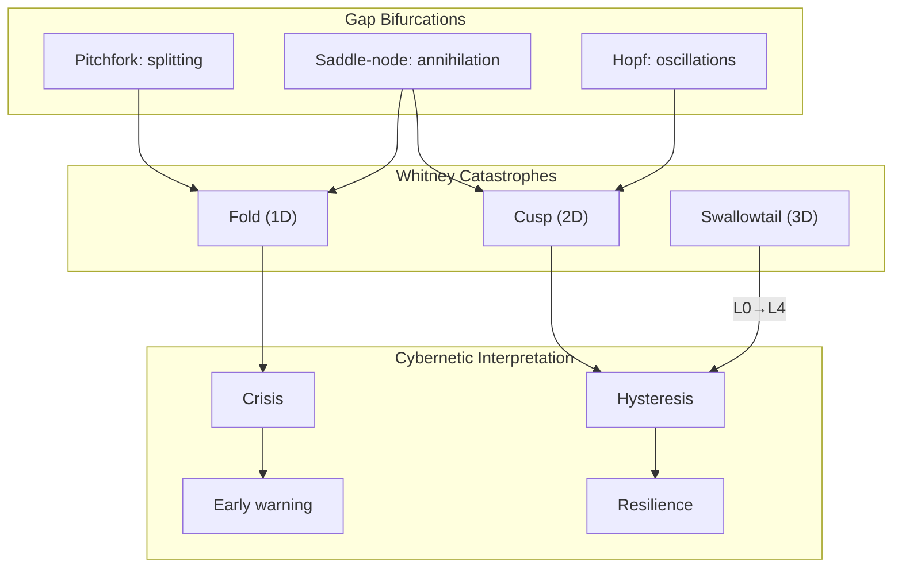

# Bifurcations of the Gap Landscape

:::info Bridge from the Previous Chapter
In the [previous chapter](./gap-algebra) we constructed the **algebra** of the Gap operator: its spectrum $\{0, \pm i\lambda_1, \pm i\lambda_2, \pm i\lambda_3\}$, the classification by opacity rank, and the connection with the Hamming code H(7,4). We saw a *static* picture — which opacity configurations are possible. Now we must study the **dynamics**: what happens when the system's parameters change smoothly but its state changes by a jump?
:::

### Chapter Roadmap

In this chapter we:

1. **Meet the three types of bifurcations** of the Gap landscape — pitchfork, saddle-node, and Hopf — and understand what life events lie behind them (section 1)
2. **Study Whitney catastrophes** — a universal language for describing discontinuous restructurings, from fold to swallowtail (section 2)
3. **Introduce the concepts of crisis, hysteresis, and resilience** — and see how bifurcation theory formalizes "points of no return" and "safety margins" (section 3)
4. **Apply the bifurcation approach to the clinic** — from depression as a saddle-node bifurcation to post-traumatic growth as a direct jump through the swallowtail (section 4)

---

:::note On Notation
In this document:
- $\Gamma$ — [coherence matrix](/docs/core/dynamics/coherence-matrix)
- $P$ — [purity](/docs/core/dynamics/viability#определение-чистоты): $P = \mathrm{Tr}(\Gamma^2)$
- $P_{\text{crit}} = 2/7$ — [theorem on critical purity](/docs/proofs/dynamics/theorem-purity-critical)
- $\mathrm{Gap}(i,j) = |\sin(\arg(\gamma_{ij}))|$ — [gap measure](/docs/physics/dual-aspect/gap-semantics)
- $\hat{\mathcal{G}} \in \mathfrak{so}(7)$ — [Gap operator](/docs/core/dynamics/gap-dynamics#gap-оператор)
- $T_{\text{eff}}$ — [effective temperature](/docs/core/dynamics/gap-thermodynamics#эффективная-температура)
- $\kappa$, $\Gamma_2$ — regeneration and decoherence rates
- L0–L4 — [interiority levels](/docs/proofs/consciousness/interiority-hierarchy)
:::

:::warning Document Status
This document develops the cybernetic interpretation of results proven in [Gap dynamics](/docs/core/dynamics/gap-dynamics#бифуркации) and the [Gap phase diagram](/docs/core/dynamics/gap-phase-diagram). Statuses are indicated for each result individually.
:::

---

## Points of No Return: Why Study Bifurcations {#точки-невозврата}

Water at 0°C does not simply "get a little colder." It **freezes** — jumping discontinuously into a qualitatively different state. A bridge under increasing load does not simply "bend more." At some moment it **collapses**. A person deprived of sleep for three days does not simply "feel a bit tired." They **fall** asleep — suddenly, uncontrollably, in the middle of a sentence.

All these phenomena share one thing: **disproportionality between cause and effect**. A small change in a parameter — temperature, load, waking time — causes a catastrophic change of state. The mathematics describing such transitions is called **bifurcation theory**.

The word "bifurcation" (from the Latin *bifurcus* — forked) literally means a "fork": as a parameter changes continuously, the system arrives at a point where its further behavior changes qualitatively. The road forks. The familiar path disappears.

For Coherence Cybernetics, bifurcations are not an abstraction. They describe the most dramatic events in the life of any coherent system:

- **The moment of insight** — when scattered knowledge suddenly falls into a coherent picture
- **A mental crisis** — when the habitual organization of the psyche ceases to function
- **Mood cycles** — when the system transitions from stability to oscillations
- **Loss of viability** — when coherence drops below the threshold $P_{\text{crit}} = 2/7$ and the system "goes dark"

In the Gap landscape, bifurcations acquire a special concreteness: 21 Gap variables form a potential energy landscape with valleys (stable states), passes (unstable states), and cliffs (stability loss points). Bifurcations are the moments when the relief of this landscape is restructured.

---

## Bifurcations in Nature {#бифуркации-в-природе}

Before turning to mathematics, it is worth realizing: bifurcations are not exotic. They are everywhere.

**Physics.** Phase transitions are the canonical example. Water freezes. Iron magnetizes. A superconductor loses resistance. Each of these transitions is a bifurcation: with a smooth change in temperature, the system's symmetry is suddenly broken, and a new order arises.

**Biology.** A progenitor cell "chooses" a specialization — becoming a neuron or a glial cell. This choice is irreversible and is described by a pitchfork bifurcation (Waddington's model). Cardiac arrhythmia is a Hopf bifurcation: normal rhythm transitions to chaotic oscillations. An epileptic seizure is a saddle-node bifurcation: the brain suddenly "falls" into a pathological state.

**Ecology.** A lake can absorb pollution for decades while maintaining clarity. But one day — after yet another seemingly negligible portion of phosphates — it blooms. The stable state of clear water **ceases to exist**. This is a classic saddle-node bifurcation, and restoring clarity is far more difficult than losing it — the phosphate content must be reduced far below the level at which the collapse occurred (hysteresis).

**Economics.** A bank run is a typical example of a self-fulfilling prophecy with a bifurcation nature. As long as trust is above the threshold — the system is stable. The slightest drop below the threshold — an avalanche of depositor withdrawals. Two stable states (trust/panic) coexist in the bistability region of a cusp.

**Psychology.** Insight is perhaps the most vivid example of a bifurcation in everyday life. You are painfully thinking over a problem, see no solution, and then — suddenly, in one jump — you see **everything**. The Gap between dimensions instantly drops from a high value to a low one. Transparency arises as a jump, not gradually.

In all these examples, there is one thing in common: **a small change in a parameter causes a qualitative change of state**. Bifurcation theory is the mathematical language for precisely describing such transitions.

---

## 1. Bifurcations in Gap Dynamics {#бифуркации-в-gap-динамике}

The Gap landscape is a mapping of the state space into the 21-dimensional cube of opacities:

$$
\mathcal{G}: \mathcal{D}(\mathbb{C}^7) \to [0,1]^{21}, \quad \mathcal{G}(\Gamma) := \{\mathrm{Gap}(i,j)\}_{1 \leq i < j \leq 7}
$$

When the control parameter $\mu$ changes (external pressure, internal regeneration, temperature), the Gap landscape undergoes qualitative restructurings — **bifurcations**. The three main types are described in detail in [Theorem 4.1](/docs/core/dynamics/gap-dynamics#бифуркации) **[T]**.

Each of the three bifurcations tells its own story. Together they form a complete grammar of qualitative changes — everything that can happen to the Gap landscape with a smooth change of parameters reduces to one of these three scenarios (or their combination).

### 1.1 Pitchfork Bifurcation: The Moment of Choice {#pitchfork}

Imagine a ball resting on the top of a hill with perfectly symmetric slopes. While the top is flat — the ball rests. But as soon as the hill sharpens its peak slightly — the ball **must** roll: left or right. Symmetry requires that both slopes be identical, but the ball can choose only one.

This is the pitchfork bifurcation — the moment when **the symmetry of the situation is broken by a choice**. The name "pitchfork" reflects the shape of the bifurcation diagram: one branch splits into three (two stable and one unstable between them).

The classical image is Buridan's ass, standing at exactly equal distance from two identical bundles of hay. Mathematics says: the symmetric position is unstable. The ass *must* choose. Any fluctuation — a gust of wind, a random movement of the head — will determine the choice. But the choice is **irreversible**: having arrived at one bundle, the ass will not return to the symmetric position.

In neurobiology, the pitchfork bifurcation describes brain lateralization. The left and right hemispheres are initially symmetric, but during development one of them "chooses" dominance in speech functions. Which one is determined by small fluctuations at early stages.

:::tip Theorem (Pitchfork Bifurcation for Gap) [T]
In the presence of a discrete symmetry of the Gap landscape and upon crossing the critical value of the control parameter $\mu_c$, the unique stationary state splits into two:

$$
\mathrm{Gap}^{(\infty)}(i,j;\, \mu) = \begin{cases}
\mathrm{Gap}_0 & \text{at } \mu < \mu_c \\
\mathrm{Gap}_0 \pm \sqrt{\mu - \mu_c} & \text{at } \mu > \mu_c
\end{cases}
$$

**Proof:** See [Gap dynamics, Theorem 4.1(a)](/docs/core/dynamics/gap-dynamics#бифуркации).
:::

**Normal form.** Near the bifurcation, the entire manifold of Gap dynamics is compressed into a single equation — the **normal form**:

$$
\frac{d\,\mathrm{Gap}}{d\tau} = (\mu - \mu_c)\,\mathrm{Gap} - \mathrm{Gap}^3
$$

This equation is the quintessence of the pitchfork bifurcation. The right-hand side contains two terms: the linear term $(\mu - \mu_c)\,\mathrm{Gap}$, which determines the stability of the zero state, and the cubic term $-\mathrm{Gap}^3$, which limits growth.

At $\mu < \mu_c$ the unique stationary point $\mathrm{Gap} = 0$ is stable. The linear term is negative — perturbations decay. The system "holds" the symmetric state.

At $\mu > \mu_c$ everything changes. The linear term becomes positive — the zero state repels. Two new stationary points are born: $\mathrm{Gap}^{(\pm)} = \pm\sqrt{\mu - \mu_c}$. Each of them is stable. The system **must** choose one of the two.

**Phase portrait.** Before the bifurcation ($\mu < \mu_c$): a unique attractor at the origin. All trajectories flow toward it. After the bifurcation ($\mu > \mu_c$): two attractors, separated by an unstable point at the origin. Space is divided into two basins of attraction. Which basin "catches" the system is determined by initial conditions and fluctuations.

**Gap-specific parameters:**
- $\mu$ is identified with $T_{\text{eff}} / T_c$ — the dimensionless temperature
- $\mu_c$ — the critical temperature of the Phase I $\leftrightarrow$ II transition ([three phases](/docs/core/dynamics/gap-phase-diagram#три-фазы))
- At $T_{\text{eff}} > T_c$: the order parameter $\mu^2$ **changes sign** ($\mu^2 < 0 \to \mu^2 > 0$), and the Gap profile spontaneously acquires nonzero anisotropy

:::info Cybernetic Interpretation [I]
The pitchfork bifurcation corresponds to **spontaneous symmetry breaking** of the Gap profile. In a psychological context this is an *existential choice*: a system that before the bifurcation was in a symmetric state (all channels equally transparent/opaque) is forced to "choose" one of two asymmetric branches. The choice is **irreversible** — returning requires a strong external intervention.
:::

**What CC adds.** In standard bifurcation theory, a pitchfork is a geometric fact. CC gives it *content*: the two attractors being born are not abstract points in phase space, but specific **coherence configurations** between the seven dimensions. The choice of branch is the choice of *which* connections between dimensions will become transparent and which will become opaque. This determines the character of the subject: which aspects of experience will be integrated and which will be dissociated.

### 1.2 Saddle-Node Bifurcation: The Last Straw {#saddle-node}

A camel has a back. Straws are placed on the back — one by one. The camel stands. One more. Still stands. And one more. At some point — one last straw — and the back **breaks**.

The saddle-node bifurcation is the mathematical formalization of the "last straw." A stable state (node) and an unstable state (saddle) exist side by side. As the parameter changes, they approach each other, merge, and **annihilate** — both cease to exist. The system is left without support and rapidly sweeps away into another region of phase space.

Unlike the pitchfork bifurcation, there is no choice here. There is **catastrophe**: that upon which the system stood disappears from under its feet.

:::tip Theorem (Saddle-Node Bifurcation for Gap) [T]
At $\mu = \mu_{sn}$ two stationary Gap profiles (stable node and unstable saddle) merge and annihilate:

$$
\frac{d\,\mathrm{Gap}}{d\tau} = \mu - \mathrm{Gap}^2
$$

At $\mu > 0$: two stationary points $\mathrm{Gap} = \pm\sqrt{\mu}$. At $\mu < 0$: **no** stationary points — the system leaves the local basin of attraction.

**Proof:** See [Gap dynamics, Theorem 4.1(b)](/docs/core/dynamics/gap-dynamics#бифуркации).
:::

**The normal form** of the saddle-node bifurcation is the simplest of all bifurcation equations:

$$
\frac{d\,\mathrm{Gap}}{d\tau} = \mu - \mathrm{Gap}^2
$$

The geometry is transparent: the parabola $\mathrm{Gap}^2$ intersects the horizontal line $\mu$. At $\mu > 0$ — two intersections (two stationary states). At $\mu = 0$ — tangency (merging). At $\mu < 0$ — no intersection. The stationary states have **evaporated**.

**Phase portrait.** At $\mu > 0$: the positive root $\mathrm{Gap} = +\sqrt{\mu}$ is stable (node), the negative root $\mathrm{Gap} = -\sqrt{\mu}$ is unstable (saddle). All trajectories in the neighborhood flow toward the node. At $\mu = 0$: node and saddle merge into a semi-stable point. At $\mu < 0$: no attractor. The system sweeps away — "falls through."

**Gap-specific parameters:**
- $\mu$ is identified with $r - r_c = \kappa/\Gamma_2 - r_c$ — the deviation from the critical regeneration-to-dissipation ratio
- At $r < r_c$: the stationary Gap profile **disappears** — the system transitions to Phase III (dead zone)

**Discontinuity of the transition.** Gap **suddenly** switches to a qualitatively different level. There are no intermediate states — the system instantly "falls" from one basin of attraction into another. This is a fundamental difference from gradual degradation: the system appears stable right up to the moment of catastrophe.

**Hysteresis in recovery.** To return to the former regime requires $\mu > \mu_{sn} + \Delta\mu_{\text{hyst}}$, where $\Delta\mu_{\text{hyst}} > 0$ is the hysteresis width. A system that has survived a crisis cannot return to its former state by simply "rolling back" the parameters. To understand why, recall the lake: it could be polluted for years, but to restore clarity the pollution level must be reduced **much** lower than the level at which the transition occurred. The old equilibrium has already been destroyed.

:::info Cybernetic Interpretation [I]
Saddle-node bifurcation is the formalization of an **acute crisis**. Clinically: the former stable Gap profile ceases to exist. The system is forced to reorganize. Examples:
- Acute decompensation with resource exhaustion ($r < r_c$)
- Sudden loss of stability in an organization under critical attrition
- "Point of no return" in ecological systems
:::

**What CC adds.** Standard theory says: "the stable state disappeared." CC says *more*: a specific **ratio of transparencies** between the seven dimensions disappeared. The system did not merely "destabilize" — it lost a certain *coherence pattern*. Which pattern will emerge after the crisis depends on which basin of attraction the system "falls into." This can be either a higher level of organization (post-traumatic growth) or a lower one (chronic decompensation).

### 1.3 Hopf Bifurcation: Birth of Rhythm {#hopf}

A clock pendulum hangs motionless — stable equilibrium. But connect a spring mechanism to it, and the pendulum begins to *swing* — a stable limit cycle arises. This is the Hopf bifurcation: a stationary state loses stability and gives birth to **oscillations**.

The Hopf bifurcation is perhaps the most fundamental of the three, because it explains the **origin of rhythms**. Why does the heart beat? Why do sleep and wakefulness alternate? Why does mood oscillate? Why does the economy go through cycles of boom and bust? In all these cases, a stationary state becomes unstable, and the system transitions to **self-sustaining oscillations**.

The key difference from simple damped oscillations: the Hopf limit cycle is an **attractor**. The system does not merely oscillate — it is *attracted* to a specific amplitude and frequency. Perturb it — and it will return to the same cycle. This is a stable rhythm, not a random vibration.

:::tip Theorem (Hopf Bifurcation for Gap) [T]
At $\mu = \mu_H$ a pair of complex-conjugate eigenvalues of the linearized dynamics crosses the imaginary axis. The stationary Gap profile loses stability and gives birth to a **limit cycle**:

$$
\mathrm{Gap}(i,j;\, \tau) = \mathrm{Gap}_0 + A(\mu)\sin(\omega_H\tau + \phi)
$$

where:
- $A(\mu) \propto \sqrt{\mu - \mu_H}$ — the amplitude of the limit cycle (supercritical case)
- $\omega_H$ — the Hopf frequency, determined by the imaginary part of the eigenvalues

**Proof:** See [Gap dynamics, Theorem 4.1(c)](/docs/core/dynamics/gap-dynamics#бифуркации).
:::

**The normal form** of the Hopf bifurcation is written in complex coordinates $z = \mathrm{Gap}_1 + i\,\mathrm{Gap}_2$:

$$
\frac{dz}{d\tau} = (\mu + i\omega_H)z - |z|^2 z
$$

The linear part $(\mu + i\omega_H)z$ describes rotation at frequency $\omega_H$ and growth/decay at rate $\mu$. At $\mu < 0$ — decay: oscillations die out, the system returns to the stationary state. At $\mu > 0$ — growth: the amplitude builds up until the nonlinear term $-|z|^2 z$ stops growth at the value $A = \sqrt{\mu}$.

**Gap-specific parameters:**
- $\omega_H$ is determined by the frequency detuning $\Delta\omega_{ij}$ and the decoherence rate $\Gamma_2$
- The amplitude $A(\mu)$ is limited by nonlinear terms: $A_{\max} \leq 1 - \mathrm{Gap}_0$ (Gap cannot exceed 1)

**Eigenvalue dynamics.** Linearizing the Gap equation around the stationary point gives the Jacobian matrix $J \in \mathbb{R}^{21 \times 21}$. At the Hopf bifurcation:

$$
\mathrm{spec}(J)\big|_{\mu = \mu_H} \ni \{\pm i\omega_H\}, \quad \frac{d\,\mathrm{Re}(\lambda)}{d\mu}\bigg|_{\mu_H} > 0
$$

— a pair of eigenvalues crosses the imaginary axis with nonzero speed. This transversality condition guarantees that the bifurcation is not a degenerate case but a structurally stable phenomenon.

**Supercritical vs subcritical Hopf.** The case described above is the supercritical case: the limit cycle is born with zero amplitude and grows smoothly. There is also a subcritical variant, where the limit cycle arises *as a jump* — with finite amplitude. Subcritical Hopf is more dangerous: the system can suddenly transition from rest to large-amplitude oscillations without intermediate stages.

:::info Cybernetic Interpretation [I]
Hopf bifurcation formalizes **cyclic oscillations** of Gap. Clinically this corresponds to:
- Bipolar disorder (alternation of manic and depressive episodes)
- Oscillations of engagement in organizations
- Seasonal cycles of ecosystems

The key difference from non-Markovian oscillations ([section 4 of Gap dynamics](/docs/core/dynamics/gap-dynamics#немарковские-эффекты)): Hopf oscillations are **non-decaying** limit cycles, whereas non-Markovian ones are decaying.
:::

**What CC adds.** Bipolar disorder in standard psychiatry is described phenomenologically: mania replaces depression "for unknown reasons." CC provides a *mechanism*: this is a Hopf bifurcation in Gap dynamics. The stationary Gap profile has become unstable — two pairs of dimensions periodically exchange transparency. In the manic phase, certain connections dominate (high Action-Emotion coherence), in the depressive phase — others (high Stillness-Unconscious coherence). The frequency $\omega_H$ and amplitude $A$ are measurable parameters, not metaphors.

Circadian rhythms are another example: sleep and wakefulness are not a "switching" but a limit cycle. The Gap between certain dimension pairs (primarily A-S and L-U) periodically oscillates at frequency $\omega_H \approx 2\pi/(24\,\text{h})$.

### 1.4 Summary Table of Bifurcations

| Bifurcation | Normal Form | Criterion | Gap Parameter | Clinical Analog |
|------------|-----------------|----------|--------------|-------------------|
| Pitchfork | $\dot{G} = \mu G - G^3$ | $\mu = \mu_c$ | $T_{\text{eff}} / T_c$ | Existential choice |
| Saddle-node | $\dot{G} = \mu - G^2$ | $\mu = \mu_{sn}$ | $\kappa/\Gamma_2 - r_c$ | Acute crisis |
| Hopf | $\dot{z} = (\mu + i\omega)z - \lvert z\rvert^2 z$ | $\mathrm{Re}(\lambda) = 0$ | $\Delta\omega_{ij}, \Gamma_2$ | Bipolar oscillations |

### 1.5 Interaction of Bifurcations {#взаимодействие-бифуркаций}

In real systems, bifurcations rarely occur in isolation. **Cascades** and **interactions** are more commonly observed:

- **Saddle-node + Hopf.** The system undergoes a crisis (saddle-node bifurcation), and instead of a new stable state enters a limit cycle (Hopf bifurcation). Clinically: an acute psychotic episode, after which the patient enters cyclic dynamics.

- **Pitchfork + saddle-node.** The system chooses one of two branches (pitchfork), and then the chosen branch disappears (saddle-node). Clinically: a specialization that turns out to be a dead end.

- **Cascade of pitchforks.** Each branch of the pitchfork bifurcation itself bifurcates, then each of the four — again, and so on. This is the famous **Feigenbaum route to chaos**. In Gap space, such a cascade can describe a gradual transition from ordered behavior to chaotic.

---

## 2. Whitney Catastrophes and Singularity Theory {#катастрофы-уитни}

### 2.0 What Are Catastrophes {#что-такое-катастрофы}

In the 1960s, French mathematician René Thom accomplished something remarkable: he proved that with a small number of control parameters, all possible discontinuous restructurings of smooth systems are exhausted by a **finite list** of standard forms. Vladimir Arnold systematized this list, and Erik Christopher Zeeman applied it to biology, psychology, and the social sciences.

The idea is simple and deep. Any smooth system with potential $V(x; a_1, \ldots, a_k)$, depending on state $x$ and parameters $a_i$, has stationary states at points $\partial V/\partial x = 0$. As parameters change, these stationary points move, merge, are born, and disappear. Thom's theorem states: **with $k \leq 4$ control parameters, all structurally stable restructurings of stationary points reduce to seven elementary catastrophes.**

The first three catastrophes — fold, cusp, and swallowtail — are governed by one state variable and 1, 2, 3 parameters respectively. It is precisely they that determine the architecture of the Gap landscape.

The Whitney catastrophe classification (Arnold, Thom) provides a **universal language** for describing discontinuous restructurings of the Gap landscape. Catastrophe theory classifies all structurally stable restructurings of surfaces of critical points of smooth functions.

The universality of catastrophes is the key property: whatever the specific physics of the system, the *shape* of the restructuring is determined only by the number of control parameters and the number of state variables. This means that the CC Gap landscape obeys the same restructuring laws as mountain terrain, the ocean surface, or the potential energy of a chemical reaction.

### 2.1 Fold ($A_2$) — Codimension 1: The Simplest Catastrophe {#fold}

The fold is the simplest of catastrophes and perhaps the most common. Imagine a fold in fabric: a smooth surface, folding over, creates a point where two layers merge. Exactly so in phase space: two stationary states approach each other, merge, and disappear.

The fold is the mathematical formalization of the **tipping point**. Malcolm Gladwell wrote a bestseller about it, but the mathematics was discovered a hundred years before him.

:::tip Theorem (Fold Catastrophe for Gap) [T]
With one control parameter $a$, the effective potential:

$$
V(G) = G^3 + a\,G
$$

The stationarity condition $V'(G) = 3G^2 + a = 0$ gives:
- At $a > 0$: no real stationary points
- At $a < 0$: two stationary points $G = \pm\sqrt{-a/3}$ (stable + unstable)
- At $a = 0$: **fold point** — stationary points merge

**Proof:** See [Phase diagram, Theorem 5.1(a)](/docs/core/dynamics/gap-phase-diagram#катастрофы-уитни).
:::

**Physical meaning.** One stable Gap profile configuration **disappears** with a change of a single parameter. The system jumps into another basin of attraction. The transition is instantaneous: there is no "half-jump," no intermediate state. The system was in a potential minimum, the minimum disappeared — the system rapidly "rolls" toward the nearest remaining minimum.

**Examples:**
- "Sudden insight": $\mathrm{Gap} \approx 1 \to \mathrm{Gap} \approx 0$ **as a jump** — transparency between dimensions is instantly restored
- "Sudden split": $\mathrm{Gap} \approx 0 \to \mathrm{Gap} \approx 1$ **as a jump** — a previously transparent pair of dimensions becomes opaque

### 2.2 Cusp ($A_3$) — Codimension 2: Bistability and Hysteresis {#cusp}

The cusp is the next in complexity catastrophe and probably the most practically important. Two control parameters create a situation in which **two stable states coexist**. The system can be in either of the two — and transitions between them **as a jump**, with the jump "there" and "back" occurring at **different** parameter values.

Zeeman used the cusp to describe aggression in dogs: simultaneous changes in fear and rage create a region of bistability where the dog can be either submissive or aggressive — and the transition between these states is discontinuous. The same mathematics describes switching between sleep and wakefulness, buy/sell decisions in financial markets, and — in CC — transitions between interiority levels.

:::tip Theorem (Cusp Catastrophe for Gap) [T]
With two control parameters $(a, b)$, the effective potential:

$$
V(G) = G^4 + a\,G^2 + b\,G
$$

The stationarity condition $V'(G) = 4G^3 + 2aG + b = 0$ generates the catastrophe surface in the space $(G, a, b)$.

Bifurcation set (cuspoid curve):

$$
8a^3 + 27b^2 = 0
$$

Inside the cuspoid curve — **bistability region**: two stable minima $G_{\text{low}}$ and $G_{\text{high}}$ coexist. The transition between them occurs as a jump upon crossing the boundary.

**Proof:** See [Phase diagram, Theorem 5.1(b)](/docs/core/dynamics/gap-phase-diagram#катастрофы-уитни).
:::

**Geometry of the cuspoid curve.** The equation $8a^3 + 27b^2 = 0$ defines a curve in the $(a, b)$ plane having the shape of a cusp at the point $(a, b) = (0, 0)$. Inside this curve (at $a < 0$) — two potential minima. Outside the curve — one. On the curve itself, the minimum and the inflection point merge — a fold occurs.

The cuspoid curve divides the parameter plane into three regions:
1. **Outside the cusp** ($a > 0$ or $|b|$ large): unique minimum, continuous parameter dependence
2. **Inside the cusp** ($a < 0$, $|b|$ small): two minima, bistability
3. **On the cusp boundary**: fold — one minimum disappears, a jump occurs

**Bistability with hysteresis.** In the cusp region, the system can be in one of two stable states:

| State | Gap | Reflection | Correspondence |
|-----------|-----|-----------|--------------|
| $G_{\text{low}}$ | Low | High $R$ | L2–L3 |
| $G_{\text{high}}$ | High | Low $R$ | L0–L1 |

The transition $G_{\text{high}} \to G_{\text{low}}$ (insight) and $G_{\text{low}} \to G_{\text{high}}$ (regression) occur at **different** parameter values — **hysteresis**. The hysteresis width determines the stability of the achieved state.

:::info Cybernetic Interpretation [I]
The cusp formalizes the "ratchet effect": a system that has jumped to a state with low Gap (insight) does not return upon a simple "rollback" of parameters — a significantly stronger perturbation is needed for regression.

The two control parameters $(a, b)$ can be identified with:
- $a \sim T_{\text{eff}} - T_c$ (deviation from the critical temperature)
- $b \sim h_{\text{ext}}$ (external field — a directed intervention by a therapist, teacher)
:::

### 2.3 Swallowtail ($A_4$) — Codimension 3: Architecture of Consciousness Levels {#swallowtail}

The swallowtail is a catastrophe with three control parameters. Its bifurcation set in three-dimensional parameter space has the characteristic shape of a forked swallow's tail — hence the name.

The significance of $A_4$ for CC can hardly be overstated: it is precisely this catastrophe that explains why there are **three** interiority levels (not counting L0 and L4). A fifth-degree potential admits up to three stable minima — and each of them corresponds to a specific coherence level.

:::tip Theorem (Swallowtail Cascade and L-levels) [T]
With three control parameters $(\kappa, \alpha, \Delta F)$, the effective potential:

$$
V(G) = G^5 + a\,G^3 + b\,G^2 + c\,G
$$

The stationarity condition $V'(G) = 0$ is a fourth-degree polynomial, admitting up to **three stable minima**. The four swallowtail sheets correspond to interiority levels:

| Swallowtail leaf | L-level | Gap | Characteristic |
|------------------|-----------|-----|----------------|
| Outer stable | L0–L1 | $G_{\text{high}} \approx 0.8$ | Stationary, unconscious |
| Intermediate | L2 | $G_{\text{mid}} \approx 0.4$ | Partially conscious, metastable |
| Inner unstable | L3 | $G_{\text{low}} \approx 0.1$ | Near-complete consciousness |
| Self-intersection point | L4 | Fixed point | $\varphi(\Gamma^*) = \Gamma^*$ |

**Proof:** Arnold's theorem (1972) at codimension 3 gives $A_4$-bifurcation; the approximate $\mathbb{Z}_2$-symmetry of purity selects $x^4$ as the leading term. See [$A_4$-bifurcation](/docs/consciousness/hierarchy/interiority-hierarchy#теорема-a4-бифуркация), [Phase diagram, Theorem 5.2](/docs/core/dynamics/gap-phase-diagram#катастрофы-уитни).
:::

**Tristability.** Three stable minima coexist simultaneously — this is a qualitatively new phenomenon compared to the cusp. The system can "remember" its past: depending on its history, it resides in one of three minima, even if the current parameters are identical. Three minima — three qualitatively distinct coherence levels, three operating regimes.

**Swallowtail cascade of transitions L0 $\to$ L4:**

Transitions between L-levels are first-order phase transitions (fold bifurcations inside the swallowtail):

- **L1 $\to$ L2** (awakening): fold bifurcation at $\kappa > \kappa_{\text{fold}}$; Gap jumps down from $G_{\text{high}}$ to $G_{\text{mid}}$
- **L2 $\to$ L3** (insight): fold bifurcation at $\kappa > \kappa'_{\text{fold}}$; Gap jumps down from $G_{\text{mid}}$ to $G_{\text{low}}$
- **Direct jump L1 $\to$ L3**: possible with simultaneous control of all three parameters — a swallowtail path bypassing the intermediate minimum

Hysteresis width for each transition ([Phase diagram, Theorem 5.3](/docs/core/dynamics/gap-phase-diagram#катастрофы-уитни)):

$$
\Delta\kappa_{L1 \to L2} = \frac{\lambda_3 \bar{A}_1}{\mu^2}, \qquad \Delta\kappa_{L2 \to L3} = \frac{\lambda_3 \bar{A}_2}{\mu^2}
$$

**Why exactly $A_4$, and not $A_5$ or $A_6$?** Codimension is determined by the number of essential control parameters. In Gap dynamics three parameters — $\kappa$ (regeneration), $\alpha$ (anisotropy), $\Delta F$ (free energy) — are necessary and sufficient to describe the transition structure. A fourth parameter does not add qualitatively new phenomena: the $A_5$-butterfly is retracted (see below).

### 2.4 Hierarchy of Catastrophes and the Evolution of Complexity {#иерархия-катастроф}

The sequence $A_2 \to A_3 \to A_4$ is not merely a list. It is a **hierarchy of increasing complexity**, in which each subsequent catastrophe contains the previous one as a special case:

- $A_2$ (fold): one parameter, one jump. The minimal possible restructuring.
- $A_3$ (cusp): two parameters, bistability, hysteresis. *Memory* appears — the system "remembers" which minimum it was in.
- $A_4$ (swallowtail): three parameters, tristability, transition cascades. *Architecture* appears — levels of organization.

This hierarchy mirrors the L-level hierarchy non-accidentally. Each L-level requires an *additional* control parameter for its existence as a separate minimum. L0–L1 — unique minimum (no control parameters). L2 — second minimum (one parameter, fold). L3 — third minimum (two parameters, cusp inside swallowtail). This is why Coherence Cybernetics predicts *exactly* three main levels of conscious coherence.

### 2.5 Summary Table of Catastrophes

| Catastrophe | Codim. | Potential $V(G)$ | Number of stable minima | Connection with L-levels |
|------------|---------|------------------|----------------------|---------------------|
| Fold ($A_2$) | 1 | $G^3 + aG$ | 0 or 1 | Jump between adjacent L |
| Cusp ($A_3$) | 2 | $G^4 + aG^2 + bG$ | 1 or 2 | Bistability L1/L2 |
| Swallowtail ($A_4$) | 3 | $G^5 + aG^3 + bG^2 + cG$ | 1, 2 or 3 | Tristability L1/L2/L3 |

:::info Corollary for the Number of Fermion Generations [T]
The swallowtail ($A_4$) restriction to three stable minima is used as the upper bound $N_{\text{gen}} \leq 3$ in the [proof of $N_{\text{gen}} = 3$](/docs/physics/particle-physics/fermion-generations#теорема-ровно-три-генерации) [T]. The lower bound $\geq 3$ follows from $(1,2,4) \subset \mathbb{Z}_7^*$, giving the exact value.
:::

:::danger Retraction: $A_5$-Butterfly [✗]
The L3→L4 transition **is not described** by a finite catastrophe. The butterfly $A_5$ **is retracted**: the transition is infinite-dimensional (Postnikov tower), no $A_k$ applies. L4 = $\mathrm{colim}_{n}\tau_{\leq n}(\mathbf{Exp}_\infty)$ — categorical inaccessibility [T] (T-86). See [the theorem](/docs/consciousness/hierarchy/interiority-hierarchy#теорема-l4-категориальная).
:::

---

## 3. Cybernetic Interpretation {#кибернетическая-интерпретация}

### 3.1 Crisis Dynamics {#кризис}

:::info Definition (Crisis as Bifurcation) [I]
A **crisis** is the crossing of the system through the bifurcation set in the space of control parameters. The former stable Gap profile ceases to exist, and the system is forced to reorganize.
:::

Crisis is a word that in everyday language carries a negative connotation. But etymologically (from the Greek *krisis* — decision, turning point) and mathematically, a crisis is a point of **qualitative change**, which can be either destructive or constructive. A saddle-node bifurcation that destroys a stationary state can lead the system either into Phase III (dead zone) or into a deeper minimum (L3).

Three types of bifurcations give rise to three types of crises:

| Crisis type | Bifurcation | Dynamics | Prognosis |
|------------|------------|----------|---------|
| Acute crisis | Saddle-node | Instantaneous stability loss | Rapid reorganization or collapse |
| Choice crisis | Pitchfork | Splitting into two branches | Irreversible choice of direction |
| Cyclic crisis | Hopf | Transition to oscillations | Periodic exacerbations |

**Formal criterion for crisis onset:**

$$
\det\left(\frac{\partial^2 V_{\text{eff}}}{\partial G_i \partial G_j}\right) = 0
$$

— the potential Hessian degenerates. One of the minima loses stability.

**Anatomy of a crisis.** A crisis passes through three phases:

1. **Approach.** Parameters slowly drift toward the bifurcation set. The system is still stable, but its resilience (distance to the bifurcation) decreases. This period can last years — and it is precisely in this period that early warning signals work (section 3.4).

2. **Transition.** Parameters cross the bifurcation set. The old minimum disappears (saddle-node) or becomes unstable (pitchfork, Hopf). The transition is rapid — its duration is determined by the speed of "rolling" along the potential landscape, not by the rate of parameter change.

3. **Reorganization.** The system finds itself in a new basin of attraction and relaxes toward the new attractor. This period can be painful (adaptation to the new state) or euphoric (if the new state is a deeper minimum with greater coherence).

### 3.2 Hysteresis in Recovery {#гистерезис}

:::tip Theorem (Asymmetry of Degradation and Recovery) [T]
A system that has crossed the critical threshold $P_{\text{crit}} = 2/7$ "downward" (loss of viability) requires for recovery a **greater** value of the control parameter than the value at which the collapse occurred:

$$
\mu_{\text{recovery}} = \mu_{\text{collapse}} + \Delta\mu_{\text{hyst}}, \quad \Delta\mu_{\text{hyst}} > 0
$$

**Proof:** Consequence of bistability in the cuspoid region ([Theorem 5.1(b)](/docs/core/dynamics/gap-phase-diagram#катастрофы-уитни)).
:::

Hysteresis is not a system defect but a fundamental consequence of nonlinearity. It explains many clinical and organizational observations that otherwise seem paradoxical.

**Practical consequences of hysteresis:**

| Context | Collapse | Recovery | $\Delta\mu_{\text{hyst}}$ |
|----------|---------|----------------|---------------------------|
| Individual | Decompensation at $\sigma_{\max} > 1$ | Stabilization requires $\sigma_{\max} < 1 - \delta$ | $\delta > 0$ |
| Organization | Loss of coherence | Reorganization stronger than original | Proportional to crisis depth |
| Ecosystem | Population collapse | Recovery requires better conditions | Can be very large |

**Asymmetry of "breaking vs. building."** Hysteresis mathematically explains the intuitively obvious observation: it is easier to destroy than to restore. To knock over a glass, a light push suffices. To glue it back together — effort many times exceeding the force of impact is required. In terms of the Gap landscape: "sliding" from minimum $G_{\text{low}}$ to $G_{\text{high}}$ is easy (any perturbation exceeding the barrier). Returning is difficult, because the return barrier is *higher* than the fall barrier.

:::warning Consequence for Therapy [I]
Recovery after a crisis **is not** a simple "rollback" to the former state. A therapeutic intervention must provide parameters that **exceed** the pre-crisis ones. This explains the clinical observation: a patient who has returned to their former way of life after a crisis often relapses — the former conditions lie in the hysteresis zone.
:::

### 3.3 Resilience as Distance to Bifurcation {#резильентность}

:::info Definition (Resilience) [I]
The **resilience** of a system is the Euclidean distance in the space of control parameters from the current state to the nearest bifurcation point:

$$
\mathcal{R}_{\text{res}}(\mu) := \inf_{\mu_b \in \mathcal{B}} \|\mu - \mu_b\|
$$

where $\mathcal{B}$ is the bifurcation set (the union of all bifurcation curves and surfaces).
:::

Resilience is one of the most practically valuable concepts of bifurcation theory. It answers the question: **how far is the system from catastrophe?** Not "how healthy is it" (that is $P$, purity), but "what safety margin remains before a qualitative change."

Two people with the same purity level $P$ can have radically different resilience: one is deep inside the basin of attraction, the other is on its boundary. Both are "healthy," but one of them is on the edge.

**Computing resilience.** For a system with parameters $(t, r)$ in the [phase diagram](/docs/core/dynamics/gap-phase-diagram):

$$
\mathcal{R}_{\text{res}} = \min\left(\frac{|t - 1|}{\sqrt{1 + (dr_c/dt)^2}}, \; |r - r_c|\right)
$$

— the minimum of distances to the Phase I $\leftrightarrow$ II transition line ($t = 1$) and the Phase I $\leftrightarrow$ III transition line ($r = r_c$).

**Resilience and L-levels:**

| L-level | Typical $\mathcal{R}_{\text{res}}$ | Justification |
|-----------|-------------------------------------|-------------|
| L0–L1 | Low | Proximity to Phase III (dead zone) |
| L2 | Medium | Metastability in swallowtail |
| L3 | High | Deep minimum $G_{\text{low}}$ |
| L4 | Maximum | Fixed point $\varphi(\Gamma^*) = \Gamma^*$ |

The monotonic growth of resilience with interiority level is not accidental but a consequence of deep structure: the deeper the minimum (the lower the Gap), the farther to the nearest saddle-node point, the harder it is to "knock out" the system.

### 3.4 Bifurcation Precursors: Early Warning {#раннее-предупреждение}

Bifurcation arrives suddenly — but its precursors appear *long before* the transition itself. This is one of the deepest consequences of the theory: **catastrophe can be predicted**.

The idea goes back to the theory of critical phenomena in physics: near a phase transition, fluctuations grow and the relaxation time increases (the so-called **critical slowing down**). The same patterns have been found in ecology (precursors of ecosystem collapse), medicine (precursors of epileptic seizure), finance (precursors of stock market crash), and psychology (precursors of psychotic episode).

CC provides a precise formalism for these precursors in terms of Gap dynamics.

:::tip Theorem (Early Warning Indicators) [T]
Near a bifurcation point, universal precursors are observed:

**(a)** Recovery slowdown (critical slowing down):

$$
\tau_{\text{relax}} \propto |\mu - \mu_c|^{-1/2} \to \infty
$$

**(b)** Growth of Gap fluctuation variance:

$$
\mathrm{Var}(\mathrm{Gap}) \propto |\mu - \mu_c|^{-1} \to \infty
$$

**(c)** Growth of autocorrelation:

$$
C(\Delta\tau) = \langle\delta\mathrm{Gap}(\tau)\,\delta\mathrm{Gap}(\tau + \Delta\tau)\rangle \to \mathrm{const} \neq 0
$$

Monitoring these indicators allows one to **predict** an approaching bifurcation before it occurs.

**Proof.** Follows from linear stability theory applied to Gap dynamics near the swallowtail bifurcation ([Theorem 1.2](#swallowtail) [T]).

**(a)** The Jacobian $J$ of the linearized Gap dynamics $d(\delta\mathrm{Gap})/d\tau = J \cdot \delta\mathrm{Gap}$ has a minimal eigenvalue $\lambda_{\min}(\mu)$ that vanishes at $\mu = \mu_c$ (definition of the bifurcation point). Relaxation time $\tau_{\text{relax}} = 1/|\lambda_{\min}| \to \infty$. The exponent $-1/2$ is standard for the swallowtail (normal form $A_4$: $\lambda_{\min} \sim |\mu - \mu_c|^{1/2}$).

**(b)** From the fluctuation-dissipation theorem [T-105](/docs/core/dynamics/gap-thermodynamics#эффективная-температура) [T]: $\mathrm{Var}(\mathrm{Gap}) = k_B T_{\text{eff}} / |\lambda_{\min}|$. With $\lambda_{\min} \sim |\mu - \mu_c|^{1/2}$ we get $\mathrm{Var} \propto |\mu - \mu_c|^{-1/2}$, and for saddle-node ($\lambda_{\min} \sim |\mu - \mu_c|$) — $\mathrm{Var} \propto |\mu - \mu_c|^{-1}$.

**(c)** The autocorrelation function $C(\Delta\tau) \sim e^{-\Delta\tau / \tau_{\text{relax}}}$. As $\tau_{\text{relax}} \to \infty$, the decay slows down, $C(\Delta\tau) \to \mathrm{const}$ for any finite $\Delta\tau$.

All three consequences are standard results of the theory of critical phenomena (Strogatz 2015, §8), applied to specific Gap dynamics with a known Jacobian. $\blacksquare$
:::

**Physical intuition.** Critical slowing down is the most reliable precursor. It can be understood through an analogy: imagine a ball in a shallow cup. If the ball is pushed, it quickly returns to the bottom. Now imagine the cup gradually flattening — the bottom becoming ever more flat. The ball still returns, but *ever more slowly*. At the moment when the cup becomes completely flat, the return time becomes infinite — the ball "forgets" where its equilibrium is.

The same happens with the Gap landscape: as a bifurcation approaches, the potential minimum becomes shallower, and the system returns ever more slowly to equilibrium after perturbations. This can be *measured* — hence the practical value of the theory.

**Practical early warning protocol:**

1. Track $\tau_{\text{relax}}$ — the Gap return time after small perturbations
2. If $\tau_{\text{relax}}$ grows by $> 50\%$ over the observed period — the system is approaching a bifurcation
3. Growth of $\mathrm{Var}(\mathrm{Gap})$ confirms the diagnosis
4. Intervention: increase $\kappa$ (regeneration) or decrease $\Gamma_2$ (dissipation)

**Flickering.** Another precursor is flickering: the system begins to briefly "jump" between two states before making the final transition. In the cusp region, near the bistability boundary, noise can throw the system over the decreasing barrier — and an observer sees chaotic switching between $G_{\text{low}}$ and $G_{\text{high}}$. This resembles the flickering of a light bulb before it burns out — or mood fluctuations before a psychotic episode.

---

## 4. Clinical Applications {#клинические-приложения}

The bifurcation approach to psychiatry is not a metaphor but a research program, and CC gives it rigorous mathematical content. Here is how the three types of bifurcations manifest in clinical practice.

### 4.1 Depression as a Saddle-Node Bifurcation {#депрессия}

Standard model: when neurotransmitter activity (serotonin, dopamine) falls below a critical level, the stable "normal" state disappears and the system "falls" into the depressive attractor.

In CC terms: the control parameter $\mu = \kappa / \Gamma_2$ (the regeneration-to-decoherence ratio) drops below $\mu_{sn}$. The stationary Gap profile with $G_{\text{mid}}$ (L2 level — normal reflexivity) annihilates. The system finds itself in the basin of attraction $G_{\text{high}}$ (L0–L1 — reduced reflexivity, loss of interiority).

**Hysteresis in treatment.** Antidepressants increase $\kappa$ (strengthen coherence regeneration). But to exit depression, $\kappa > \kappa_{\text{recovery}} > \kappa_{\text{collapse}}$ is necessary — simply returning to "normal" is insufficient. This explains why antidepressants are recommended to be continued *after* symptoms disappear: the parameters must exit the hysteresis zone before the former equilibrium becomes stable again.

### 4.2 Bipolar Disorder as a Hopf Bifurcation {#биполярное}

Bipolar disorder type I is characterized by alternating manic and depressive episodes. In CC this is a Hopf bifurcation: the stationary Gap profile loses stability and is replaced by a limit cycle.

**Frequency $\omega_H$.** For typical bipolar disorder, the cycle period is months — this determines $\omega_H$. For rapid cycling — weeks. Mood stabilizers (lithium, valproate) act by increasing dissipation $\Gamma_2$ — moving the system back into the region $\mu < \mu_H$, where the stationary state is stable.

**Amplitude.** The severity of episodes is determined by $A(\mu) = \sqrt{\mu - \mu_H}$: the farther the parameters from the bifurcation point (in the direction of instability), the greater the oscillation range.

### 4.3 Post-Traumatic Growth as a Direct Jump {#посттравматический-рост}

One of the most striking clinical observations: after severe trauma, some people do not merely recover — they reach a *higher* level of functioning than before the trauma. This is post-traumatic growth (Tedeschi, Calhoun).

In swallowtail terms: trauma is a saddle-node bifurcation that destroys the minimum $G_{\text{mid}}$ (L2). The system is "thrown out" of its habitual minimum. But where to? If the parameters $(\kappa, \alpha, \Delta F)$ are configured in a certain way — the system may end up not in $G_{\text{high}}$ (regression to L0–L1) but in $G_{\text{low}}$ (breakthrough to L3). Trauma as a catalyst: by destroying the old, insufficiently deep minimum, it opens access to a deeper one.

This is not a romanticization of suffering but a mathematical fact: in swallowtail geometry, the path through crisis can lead both upward and downward. The therapeutic task is to provide parameters under which the crisis resolves "downward" (toward $G_{\text{low}}$, higher coherence), not "upward" (toward $G_{\text{high}}$, regression).

### 4.4 Epilepsy: Subcritical Hopf and Critical Slowing Down {#эпилепсия}

An epileptic seizure is an example of a subcritical Hopf bifurcation: the brain suddenly, by a jump, transitions from normal activity to high-amplitude synchronous oscillations. Unlike the supercritical case (smooth amplitude buildup), the transition here is instantaneous.

Seizure precursors are the classical early warning indicators:
- Critical slowing down (increase of $\tau_{\text{relax}}$) in EEG: the brain returns ever more slowly to background activity after stimulation
- Growth of EEG signal variance ($\mathrm{Var}(\mathrm{Gap}) \to \infty$)
- Increase of autocorrelation

These indicators are already used in experimental seizure prediction systems — and CC provides them with a theoretical foundation.

---

## 5. Bifurcation Diagram for CC Applications {#бифуркационная-диаграмма}

```mermaid
graph TD
    subgraph BIF["Gap Bifurcations"]
        PF["Pitchfork: splitting"]
        SN["Saddle-node: annihilation"]
        HF["Hopf: oscillations"]
    end
    subgraph CAT["Whitney Catastrophes"]
        FOLD["Fold (1D)"]
        CUSP["Cusp (2D)"]
        SW["Swallowtail (3D)"]
    end
    subgraph APP["Cybernetic Interpretation"]
        CRISIS["Crisis"]
        HYST["Hysteresis"]
        RES["Resilience"]
        WARN["Early warning"]
    end

    PF --> FOLD
    SN --> FOLD
    SN --> CUSP
    HF --> CUSP
    FOLD --> CRISIS
    CUSP --> HYST
    SW --> |"L0→L4"| HYST
    CRISIS --> WARN
    HYST --> RES
```

---

## 6. Connections with Other Sections

### 6.1 Mathematical Foundations

| Result | Status | Source |
|-----------|--------|----------|
| Gap landscape bifurcations (Theorem 4.1) | **[T]** | [Gap dynamics](/docs/core/dynamics/gap-dynamics#бифуркации) |
| Whitney catastrophes (Theorem 5.1) | **[T]** | [Phase diagram](/docs/core/dynamics/gap-phase-diagram#катастрофы-уитни) |
| Swallowtail and L-levels (Theorem 5.2) | **[T]** | [Phase diagram](/docs/core/dynamics/gap-phase-diagram#катастрофы-уитни) |
| Three minima and L-levels (Theorem 5.3) | **[T]** | [Phase diagram](/docs/core/dynamics/gap-phase-diagram#катастрофы-уитни) |
| Crisis as bifurcation | **[I]** | This document |
| Resilience | **[I]** | This document |
| Early warning indicators | **[H]** | This document |

### 6.2 Cross-References

- [Gap Phase Diagram](/docs/core/dynamics/gap-phase-diagram) — three phases, critical phenomena, swallowtail
- [Gap Dynamics](/docs/core/dynamics/gap-dynamics) — bifurcations, non-Markovian effects, unified theorem
- [Gap Thermodynamics](/docs/core/dynamics/gap-thermodynamics) — $T_{\text{eff}}$, free energy, FDT
- [Interiority Hierarchy](/docs/proofs/consciousness/interiority-hierarchy) — levels L0–L4
- [Viability](/docs/core/dynamics/viability) — $P_{\text{crit}} = 2/7$
- [Gap Diagnostics](/docs/applied/research/gap-diagnostics) — applied methodology
- [Applications](./applications) — clinical and organizational applications

---

---

### What We Have Learned {#что-мы-узнали}

1. **Three types of bifurcations** exhaust the grammar of qualitative changes in the Gap landscape: pitchfork (choice), saddle-node (catastrophe), and Hopf (birth of rhythm). Each is described by a normal form — the simplest equation preserving the essence of the transition.

2. **Whitney catastrophes** ($A_2$, $A_3$, $A_4$) form a hierarchy of increasing complexity. The swallowtail ($A_4$) explains why there are exactly three levels of conscious coherence (L1, L2, L3) — a greater number would require more control parameters. The butterfly $A_5$ **is retracted**: the transition L3 $\to$ L4 is infinite-dimensional.

3. **Hysteresis** is a fundamental consequence of nonlinearity: it is easier to destroy than to restore. To return to the former state after a crisis, the parameters must **exceed** the pre-crisis values.

4. **Resilience** — the distance to the nearest bifurcation — grows with interiority level: L3-systems are more stable than L1-systems. This is not accidental but a consequence of the depth of the potential minimum.

5. **Early precursors** of bifurcation (critical slowing down, variance growth, autocorrelation growth) allow one to **predict** an approaching crisis before it occurs — and to intervene.

6. **Clinical applications**: depression is formalized as a saddle-node bifurcation, bipolar disorder as Hopf, and post-traumatic growth as a direct jump through the swallowtail to a deeper minimum.

:::tip Bridge to the Next Chapter
Bifurcations describe discontinuous transitions — but real systems have **memory**: the past influences the present, and that influence is not instantaneous. In the [next chapter](./non-markovian) we will introduce the **memory kernel** $K(\tau)$ and show how non-Markovian dynamics generates Gap oscillations — "grief waves" and "clarity flashes" — as well as therapeutic windows in which intervention is most effective.
:::

---

**Related documents:**
- [Definitions](./definitions) — measures $P$, $\Phi$, $R$, $\mathrm{Coh}_E$
- [Theorems](./theorems) — fundamental results of CC
- [Non-Markovian dynamics](./non-markovian) — memory kernel, oscillations, "grief cycles"
- [Predictions](./predictions) — verifiable consequences of CC
- [Implementation](./implementation) — computational methods
- [Philosophical foundations](./philosophy) — bifurcation and emergence
- [Exercises](./exercises) — problems on dynamics and phase transitions
