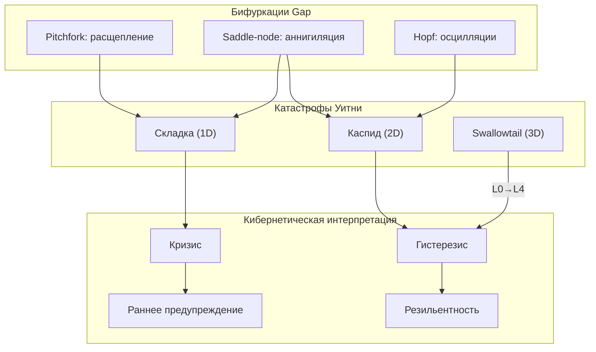

# Бифуркации Gap-ландшафта

:::info Мост из предыдущей главы
В [предыдущей главе](./gap-algebra) мы построили **алгебру** Gap-оператора: его спектр $\{0, \pm i\lambda_1, \pm i\lambda_2, \pm i\lambda_3\}$, классификацию по рангу непрозрачности и связь с кодом Хэмминга H(7,4). Мы увидели *статическую* картину — какие конфигурации непрозрачности возможны. Теперь нам предстоит изучить **динамику**: что происходит, когда параметры системы плавно меняются, а её состояние — скачком?
:::

### Дорожная карта главы

В этой главе мы:

1. **Познакомимся с тремя типами бифуркаций** Gap-ландшафта — вилочной, седло-узловой и Хопфа — и поймём, какие жизненные события за ними стоят (раздел 1)
2. **Изучим катастрофы Уитни** — универсальный язык для описания скачкообразных перестроек, от складки до ласточкиного хвоста (раздел 2)
3. **Введём понятия кризиса, гистерезиса и резильентности** — и увидим, как бифуркационная теория формализует «точки невозврата» и «запас прочности» (раздел 3)
4. **Применим бифуркационный подход к клинике** — от депрессии как седло-узловой бифуркации до посттравматического роста как прямого скачка через swallowtail (раздел 4)

---

:::note О нотации
В этом документе:
- $\Gamma$ — [матрица когерентности](/docs/core/dynamics/coherence-matrix)
- $P$ — [чистота](/docs/core/dynamics/viability#определение-чистоты): $P = \mathrm{Tr}(\Gamma^2)$
- $P_{\text{crit}} = 2/7$ — [теорема о критической чистоте](/docs/proofs/dynamics/theorem-purity-critical)
- $\mathrm{Gap}(i,j) = |\sin(\arg(\gamma_{ij}))|$ — [мера зазора](/docs/physics/dual-aspect/gap-semantics)
- $\hat{\mathcal{G}} \in \mathfrak{so}(7)$ — [Gap-оператор](/docs/core/dynamics/gap-dynamics#gap-оператор)
- $T_{\text{eff}}$ — [эффективная температура](/docs/core/dynamics/gap-thermodynamics#эффективная-температура)
- $\kappa$, $\Gamma_2$ — скорости регенерации и декогеренции
- L0–L4 — [уровни интериорности](/docs/proofs/consciousness/interiority-hierarchy)
:::

:::warning Статус документа
Этот документ развивает кибернетическую интерпретацию результатов, доказанных в [Gap-динамике](/docs/core/dynamics/gap-dynamics#бифуркации) и [Фазовой диаграмме Gap](/docs/core/dynamics/gap-phase-diagram). Статусы указаны для каждого результата индивидуально.
:::

---

## Точки невозврата: зачем изучать бифуркации {#точки-невозврата}

Вода при 0°C не просто «становится чуть холоднее». Она **замерзает** — скачком переходит в качественно иное состояние. Мост под нарастающей нагрузкой не просто «прогибается больше». В какой-то момент он **рушится**. Человек, лишённый сна трое суток, не просто «немного устал». Он **проваливается** в сон — внезапно, неконтролируемо, посреди предложения.

Все эти явления объединяет одно: **непропорциональность причины и следствия**. Малое изменение параметра — температуры, нагрузки, времени бодрствования — вызывает катастрофическое изменение состояния. Математика, описывающая такие переходы, называется **теорией бифуркаций**.

Слово «бифуркация» (от лат. *bifurcus* — раздвоенный) означает буквально «развилку»: при непрерывном изменении параметра система приходит к точке, где её дальнейшее поведение качественно меняется. Дорога раздваивается. Привычный путь исчезает.

Для Кибернетики Когерентности бифуркации — не абстракция. Они описывают самые драматические события в жизни любой когерентной системы:

- **Момент прозрения** — когда разрозненные знания внезапно складываются в целостную картину
- **Психический кризис** — когда привычная организация психики перестаёт работать
- **Цикличность настроений** — когда система переходит от стабильности к колебаниям
- **Потерю жизнеспособности** — когда когерентность падает ниже порога $P_{\text{crit}} = 2/7$ и система «гаснет»

В Gap-ландшафте бифуркации приобретают особую конкретность: 21 Gap-переменная образует ландшафт потенциальной энергии с долинами (устойчивые состояния), перевалами (неустойчивые состояния) и обрывами (точки потери устойчивости). Бифуркации — это моменты, когда рельеф этого ландшафта перестраивается.

---

## Бифуркации в природе {#бифуркации-в-природе}

Прежде чем перейти к математике, стоит осознать: бифуркации — не экзотика. Они повсюду.

**Физика.** Фазовые переходы — канонический пример. Вода замерзает. Железо намагничивается. Сверхпроводник теряет сопротивление. Каждый из этих переходов — бифуркация: при плавном изменении температуры симметрия системы внезапно нарушается, и возникает новый порядок.

**Биология.** Клетка-предшественник «выбирает» специализацию — становится нейроном или глиальной клеткой. Этот выбор необратим и описывается вилочной бифуркацией (модель Вэддингтона). Сердечная аритмия — бифуркация Хопфа: нормальный ритм переходит в хаотические колебания. Эпилептический припадок — седло-узловая бифуркация: мозг внезапно «проваливается» в патологическое состояние.

**Экология.** Озеро может десятилетиями поглощать загрязнения, сохраняя прозрачность. Но в один день — после очередной, казалось бы ничтожной порции фосфатов — оно зацветает. Устойчивое состояние прозрачной воды **перестаёт существовать**. Это классическая седло-узловая бифуркация, и восстановить прозрачность гораздо труднее, чем утратить — нужно снизить содержание фосфатов намного ниже того уровня, при котором произошёл коллапс (гистерезис).

**Экономика.** Банковская паника — типичный пример самоисполняющегося пророчества с бифуркационной природой. Пока доверие выше порога — система стабильна. Малейшее снижение ниже порога — лавинообразное бегство вкладчиков. Два устойчивых состояния (доверие/паника) сосуществуют в области бистабильности каспида.

**Психология.** Инсайт — пожалуй, самый яркий пример бифуркации в повседневной жизни. Вы мучительно размышляете над задачей, не видите решения, а затем — внезапно, одним скачком — видите **всё**. Gap между измерениями мгновенно падает с высокого значения до низкого. Прозрачность возникает скачком, не плавно.

Во всех этих примерах общее одно: **малое изменение параметра вызывает качественное изменение состояния**. Теория бифуркаций — математический язык для точного описания таких переходов.

---

## 1. Бифуркации в Gap-динамике {#бифуркации-в-gap-динамике}

Gap-ландшафт — отображение пространства состояний в 21-мерный куб непрозрачностей:

$$
\mathcal{G}: \mathcal{D}(\mathbb{C}^7) \to [0,1]^{21}, \quad \mathcal{G}(\Gamma) := \{\mathrm{Gap}(i,j)\}_{1 \leq i < j \leq 7}
$$

При изменении управляющего параметра $\mu$ (внешнее давление, внутренняя регенерация, температура) Gap-ландшафт претерпевает качественные перестройки — **бифуркации**. Три основных типа подробно описаны в [Теореме 4.1](/docs/core/dynamics/gap-dynamics#бифуркации) **[Т]**.

Каждая из трёх бифуркаций рассказывает свою историю. Вместе они образуют полную грамматику качественных изменений — всё, что может случиться с Gap-ландшафтом при плавном изменении параметров, сводится к одному из этих трёх сценариев (или их комбинации).

### 1.1 Вилочная бифуркация (Pitchfork): момент выбора {#pitchfork}

Представьте шарик, лежащий на вершине холма с идеально симметричными склонами. Пока вершина плоская — шарик покоится. Но стоит холму чуть заострить вершину — и шарик **обязан** скатиться: влево или вправо. Симметрия требует, чтобы оба склона были одинаковы, но шарик может выбрать только один.

Это и есть вилочная бифуркация — момент, когда **симметрия ситуации нарушается выбором**. Название «вилка» (pitchfork) отражает форму бифуркационной диаграммы: одна ветвь расщепляется на три (две устойчивые и одна неустойчивая между ними).

Классический образ — осёл Буриданов, стоящий на точно равном расстоянии от двух одинаковых охапок сена. Математика говорит: симметричное положение неустойчиво. Осёл *обязан* выбрать. Любая флуктуация — дуновение ветра, случайное движение головы — определит выбор. Но выбор **необратим**: оказавшись у одной охапки, осёл уже не вернётся к симметричной позиции.

В нейробиологии вилочная бифуркация описывает латерализацию мозга. Левое и правое полушария изначально симметричны, но в процессе развития одно из них «выбирает» доминирование в речевых функциях. Какое именно — определяется малыми флуктуациями на ранних стадиях.

:::tip Теорема (Pitchfork-бифуркация для Gap) [Т]
При наличии дискретной симметрии Gap-ландшафта и пересечении критического значения управляющего параметра $\mu_c$ единственное стационарное состояние расщепляется на два:

$$
\mathrm{Gap}^{(\infty)}(i,j;\, \mu) = \begin{cases}
\mathrm{Gap}_0 & \text{при } \mu < \mu_c \\
\mathrm{Gap}_0 \pm \sqrt{\mu - \mu_c} & \text{при } \mu > \mu_c
\end{cases}
$$

**Доказательство:** См. [Gap-динамика, Теорема 4.1(a)](/docs/core/dynamics/gap-dynamics#бифуркации).
:::

**Нормальная форма.** Вблизи бифуркации всё многообразие Gap-динамики сжимается до одного уравнения — **нормальной формы**:

$$
\frac{d\,\mathrm{Gap}}{d\tau} = (\mu - \mu_c)\,\mathrm{Gap} - \mathrm{Gap}^3
$$

Это уравнение — квинтэссенция вилочной бифуркации. Правая часть содержит два слагаемых: линейное $(\mu - \mu_c)\,\mathrm{Gap}$, которое определяет устойчивость нулевого состояния, и кубическое $-\mathrm{Gap}^3$, которое ограничивает рост.

При $\mu < \mu_c$ единственная стационарная точка $\mathrm{Gap} = 0$ устойчива. Линейный член отрицателен — возмущения затухают. Система «удерживает» симметричное состояние.

При $\mu > \mu_c$ всё меняется. Линейный член становится положительным — нулевое состояние отталкивает. Рождаются две новые стационарные точки: $\mathrm{Gap}^{(\pm)} = \pm\sqrt{\mu - \mu_c}$. Каждая из них устойчива. Система **обязана** выбрать одну из двух.

**Фазовый портрет.** До бифуркации ($\mu < \mu_c$): единственный аттрактор в начале координат. Все траектории стекаются к нему. После бифуркации ($\mu > \mu_c$): два аттрактора, разделённые неустойчивой точкой в начале координат. Пространство разделено на два бассейна притяжения. Какой именно бассейн «поймает» систему — определяется начальными условиями и флуктуациями.

**Gap-специфические параметры:**
- $\mu$ отождествляется с $T_{\text{eff}} / T_c$ — безразмерной температурой
- $\mu_c$ — критическая температура фазового перехода I $\leftrightarrow$ II ([три фазы](/docs/core/dynamics/gap-phase-diagram#три-фазы))
- При $T_{\text{eff}} > T_c$: параметр порядка $\mu^2$ **меняет знак** ($\mu^2 < 0 \to \mu^2 > 0$), и Gap-профиль спонтанно приобретает ненулевую анизотропию

:::info Кибернетическая интерпретация [И]
Pitchfork-бифуркация соответствует **спонтанному нарушению симметрии** Gap-профиля. В психологическом контексте это *экзистенциальный выбор*: система, которая до бифуркации находилась в симметричном состоянии (все каналы одинаково прозрачны/непрозрачны), вынуждена «выбрать» одну из двух несимметричных ветвей. Выбор **необратим** — возврат требует сильного внешнего воздействия.
:::

**Что КК добавляет.** В стандартной теории бифуркаций pitchfork — геометрический факт. КК придаёт ему *содержание*: два рождающихся аттрактора — не абстрактные точки в фазовом пространстве, а конкретные **конфигурации когерентности** между семью измерениями. Выбор ветви — это выбор того, *какие* связи между измерениями станут прозрачными, а какие — непрозрачными. Это определяет характер субъекта: какие аспекты опыта будут интегрированы, а какие — отщеплены.

### 1.2 Седло-узловая бифуркация (Saddle-node): последняя капля {#saddle-node}

У верблюда есть спина. На спину кладут соломинки — по одной. Верблюд стоит. Ещё одну. Стоит. И ещё. В какой-то момент — одна последняя соломинка — и спина **ломается**.

Седло-узловая бифуркация — математическая формализация «последней капли». Устойчивое состояние (узел) и неустойчивое состояние (седло) существуют бок о бок. При изменении параметра они сближаются, сливаются и **аннигилируют** — оба перестают существовать. Система остаётся без опоры и стремительно уносится в другую область фазового пространства.

В отличие от вилочной бифуркации, здесь нет выбора. Есть **катастрофа**: то, на чём система стояла, исчезает из-под ног.

:::tip Теорема (Saddle-node-бифуркация для Gap) [Т]
При $\mu = \mu_{sn}$ два стационарных Gap-профиля (устойчивый узел и неустойчивое седло) сливаются и аннигилируют:

$$
\frac{d\,\mathrm{Gap}}{d\tau} = \mu - \mathrm{Gap}^2
$$

При $\mu > 0$: две стационарные точки $\mathrm{Gap} = \pm\sqrt{\mu}$. При $\mu < 0$: стационарных точек **нет** — система покидает локальный бассейн притяжения.

**Доказательство:** См. [Gap-динамика, Теорема 4.1(b)](/docs/core/dynamics/gap-dynamics#бифуркации).
:::

**Нормальная форма** седло-узловой бифуркации — простейшее из всех бифуркационных уравнений:

$$
\frac{d\,\mathrm{Gap}}{d\tau} = \mu - \mathrm{Gap}^2
$$

Геометрия прозрачна: парабола $\mathrm{Gap}^2$ пересекает горизонтальную линию $\mu$. При $\mu > 0$ — два пересечения (два стационарных состояния). При $\mu = 0$ — касание (слияние). При $\mu < 0$ — ни одного пересечения. Стационарные состояния **испарились**.

**Фазовый портрет.** При $\mu > 0$: положительный корень $\mathrm{Gap} = +\sqrt{\mu}$ устойчив (узел), отрицательный $\mathrm{Gap} = -\sqrt{\mu}$ неустойчив (седло). Все траектории в окрестности стекаются к узлу. При $\mu = 0$: узел и седло сливаются в полуустойчивую точку. При $\mu < 0$: аттрактора нет. Система уносится прочь — «проваливается».

**Gap-специфические параметры:**
- $\mu$ отождествляется с $r - r_c = \kappa/\Gamma_2 - r_c$ — отклонением от критического отношения регенерации к диссипации
- При $r < r_c$: стационарный Gap-профиль **исчезает** — система переходит в Фазу III (мёртвая зона)

**Скачкообразность перехода.** Gap **внезапно** переключается на качественно иной уровень. Нет промежуточных состояний — система мгновенно «проваливается» из одного бассейна притяжения в другой. Это фундаментальное отличие от плавной деградации: система выглядит стабильной вплоть до самого момента катастрофы.

**Гистерезис в восстановлении.** Для возврата к прежнему режиму требуется $\mu > \mu_{sn} + \Delta\mu_{\text{hyst}}$, где $\Delta\mu_{\text{hyst}} > 0$ — ширина гистерезиса. Система, пережившая кризис, не может вернуться к прежнему состоянию простым «откатом» параметров. Чтобы понять почему, вспомните озеро: загрязнять его можно было годами, но для восстановления прозрачности нужно снизить уровень загрязнения **намного** ниже того, при котором произошёл переход. Старое равновесие уже уничтожено.

:::info Кибернетическая интерпретация [И]
Saddle-node бифуркация — формализация **острого кризиса**. Клинически: прежний устойчивый Gap-профиль перестаёт существовать. Система вынуждена реорганизоваться. Примеры:
- Острая декомпенсация при истощении ресурсов ($r < r_c$)
- Внезапная потеря устойчивости организации при критическом оттоке
- «Точка невозврата» в экологических системах
:::

**Что КК добавляет.** Стандартная теория говорит: «устойчивое состояние исчезло». КК говорит *больше*: исчезло конкретное **соотношение прозрачностей** между семью измерениями. Система не просто «дестабилизировалась» — она потеряла определённый *паттерн когерентности*. Какой именно паттерн возникнет после кризиса — зависит от того, в какой бассейн притяжения система «упадёт». Это может быть как более высокий уровень организации (посттравматический рост), так и более низкий (хроническая декомпенсация).

### 1.3 Бифуркация Хопфа (Hopf): рождение ритма {#hopf}

Маятник часов неподвижно висит — устойчивое равновесие. Но подключите к нему механизм с пружиной, и маятник начинает *качаться* — возникает устойчивый предельный цикл. Это бифуркация Хопфа: стационарное состояние теряет устойчивость и порождает **колебания**.

Бифуркация Хопфа — возможно, самая фундаментальная из трёх, потому что она объясняет **происхождение ритмов**. Почему бьётся сердце? Почему чередуются сон и бодрствование? Почему настроение колеблется? Почему экономика проходит циклы подъёма и спада? Во всех этих случаях стационарное состояние становится неустойчивым, и система переходит к **самоподдерживающимся колебаниям**.

Ключевое отличие от простых затухающих колебаний: предельный цикл Хопфа — **аттрактор**. Система не просто колеблется — она *притягивается* к определённой амплитуде и частоте. Возмутите её — и она вернётся к тому же циклу. Это устойчивый ритм, а не случайная вибрация.

:::tip Теорема (Hopf-бифуркация для Gap) [Т]
При $\mu = \mu_H$ пара комплексно-сопряжённых собственных значений линеаризованной динамики пересекает мнимую ось. Стационарный Gap-профиль теряет устойчивость и порождает **предельный цикл**:

$$
\mathrm{Gap}(i,j;\, \tau) = \mathrm{Gap}_0 + A(\mu)\sin(\omega_H\tau + \phi)
$$

где:
- $A(\mu) \propto \sqrt{\mu - \mu_H}$ — амплитуда предельного цикла (суперкритический случай)
- $\omega_H$ — частота Хопфа, определяемая мнимой частью собственных значений

**Доказательство:** См. [Gap-динамика, Теорема 4.1(c)](/docs/core/dynamics/gap-dynamics#бифуркации).
:::

**Нормальная форма** бифуркации Хопфа записывается в комплексных координатах $z = \mathrm{Gap}_1 + i\,\mathrm{Gap}_2$:

$$
\frac{dz}{d\tau} = (\mu + i\omega_H)z - |z|^2 z
$$

Линейная часть $(\mu + i\omega_H)z$ описывает вращение с частотой $\omega_H$ и рост/затухание с темпом $\mu$. При $\mu < 0$ — затухание: колебания гаснут, система возвращается к стационарному состоянию. При $\mu > 0$ — рост: амплитуда нарастает, пока нелинейный член $-|z|^2 z$ не остановит рост на значении $A = \sqrt{\mu}$.

**Gap-специфические параметры:**
- $\omega_H$ определяется расстройкой частот $\Delta\omega_{ij}$ и скоростью декогеренции $\Gamma_2$
- Амплитуда $A(\mu)$ ограничена нелинейными членами: $A_{\max} \leq 1 - \mathrm{Gap}_0$ (Gap не может превысить 1)

**Динамика собственных значений.** Линеаризация Gap-уравнения вокруг стационарной точки даёт матрицу Якоби $J \in \mathbb{R}^{21 \times 21}$. При бифуркации Хопфа:

$$
\mathrm{spec}(J)\big|_{\mu = \mu_H} \ni \{\pm i\omega_H\}, \quad \frac{d\,\mathrm{Re}(\lambda)}{d\mu}\bigg|_{\mu_H} > 0
$$

— пара собственных значений пересекает мнимую ось с ненулевой скоростью. Это условие трансверсальности гарантирует, что бифуркация — не вырожденный случай, а структурно устойчивое явление.

**Суперкритический vs субкритический Хопф.** Описанный выше — суперкритический случай: предельный цикл рождается с нулевой амплитудой и плавно растёт. Существует и субкритический вариант, где предельный цикл возникает *скачком* — с конечной амплитудой. Субкритический Хопф опаснее: система может внезапно перейти от покоя к колебаниям большой амплитуды без промежуточных стадий.

:::info Кибернетическая интерпретация [И]
Hopf-бифуркация формализует **циклические осцилляции** Gap. Клинически это соответствует:
- Биполярному расстройству (чередование маниакальных и депрессивных эпизодов)
- Колебаниям вовлечённости в организациях
- Сезонным циклам экосистем

Ключевое отличие от немарковских осцилляций ([раздел 4 Gap-динамики](/docs/core/dynamics/gap-dynamics#немарковские-эффекты)): Hopf-осцилляции — **незатухающие** предельные циклы, тогда как немарковские — затухающие.
:::

**Что КК добавляет.** Биполярное расстройство в стандартной психиатрии описывается феноменологически: мания сменяет депрессию «по неизвестным причинам». КК даёт *механизм*: это бифуркация Хопфа в Gap-динамике. Стационарный Gap-профиль стал неустойчивым — две пары измерений периодически обмениваются прозрачностью. В маниакальной фазе доминируют одни связи (высокая когерентность Action-Emotion), в депрессивной — другие (высокая когерентность Stillness-Unconscious). Частота $\omega_H$ и амплитуда $A$ — измеримые параметры, а не метафоры.

Циркадные ритмы — ещё один пример: сон и бодрствование — не «переключение», а предельный цикл. Gap между определёнными парами измерений (прежде всего A-S и L-U) периодически осциллирует с частотой $\omega_H \approx 2\pi/(24\,\text{ч})$.

### 1.4 Сводная таблица бифуркаций

| Бифуркация | Нормальная форма | Критерий | Gap-параметр | Клинический аналог |
|------------|-----------------|----------|--------------|-------------------|
| Pitchfork | $\dot{G} = \mu G - G^3$ | $\mu = \mu_c$ | $T_{\text{eff}} / T_c$ | Экзистенциальный выбор |
| Saddle-node | $\dot{G} = \mu - G^2$ | $\mu = \mu_{sn}$ | $\kappa/\Gamma_2 - r_c$ | Острый кризис |
| Hopf | $\dot{z} = (\mu + i\omega)z - \lvert z\rvert^2 z$ | $\mathrm{Re}(\lambda) = 0$ | $\Delta\omega_{ij}, \Gamma_2$ | Биполярные колебания |

### 1.5 Взаимодействие бифуркаций {#взаимодействие-бифуркаций}

В реальных системах бифуркации редко встречаются поодиночке. Чаще наблюдаются **каскады** и **взаимодействия**:

- **Седло-узел + Хопф.** Система переживает кризис (седло-узловая бифуркация), и вместо нового устойчивого состояния попадает в предельный цикл (бифуркация Хопфа). Клинически: острый психотический эпизод, после которого пациент входит в циклическую динамику.

- **Вилка + седло-узел.** Система выбирает одну из двух ветвей (вилка), а затем выбранная ветвь исчезает (седло-узел). Клинически: специализация, которая оказывается тупиковой.

- **Каскад вилок.** Каждая ветвь вилочной бифуркации сама раздваивается, затем каждая из четырёх — ещё раз, и т.д. Это знаменитый **путь Фейгенбаума к хаосу**. В Gap-пространстве такой каскад может описывать постепенный переход от упорядоченного поведения к хаотическому.

---

## 2. Катастрофы Уитни и теория особенностей {#катастрофы-уитни}

### 2.0 Что такое катастрофы {#что-такое-катастрофы}

В 1960-х годах французский математик Рене Том совершил нечто замечательное: он доказал, что при малом числе управляющих параметров все возможные скачкообразные перестройки гладких систем исчерпываются **конечным списком** стандартных форм. Владимир Арнольд систематизировал этот список, а Эрик Кристофер Зееман применил его к биологии, психологии и социальным наукам.

Идея проста и глубока. Любая гладкая система с потенциалом $V(x; a_1, \ldots, a_k)$, зависящим от состояния $x$ и параметров $a_i$, имеет стационарные состояния в точках $\partial V/\partial x = 0$. При изменении параметров эти стационарные точки двигаются, сливаются, рождаются и исчезают. Теорема Тома утверждает: **при $k \leq 4$ управляющих параметрах все структурно-устойчивые перестройки стационарных точек сводятся к семи элементарным катастрофам.**

Первые три катастрофы — складка, каспид и ласточкин хвост — управляются одной переменной состояния и 1, 2, 3 параметрами соответственно. Именно они определяют архитектуру Gap-ландшафта.

Классификация катастроф Уитни (Арнольд, Том) предоставляет **универсальный язык** для описания скачкообразных перестроек Gap-ландшафта. Теория катастроф классифицирует все структурно-устойчивые перестройки поверхностей критических точек гладких функций.

Универсальность катастроф — ключевое свойство: какова бы ни была конкретная физика системы, *форма* перестройки определяется лишь числом управляющих параметров и числом переменных состояния. Это означает, что Gap-ландшафт КК подчиняется тем же законам перестройки, что и горный рельеф, поверхность океана или потенциальная энергия химической реакции.

### 2.1 Складка (Fold, $A_2$) — коразмерность 1: простейшая катастрофа {#fold}

Складка — это простейшая из катастроф и, возможно, самая распространённая. Представьте складку на ткани: гладкая поверхность, перегнувшись, создаёт точку, где два слоя сливаются. Точно так же в фазовом пространстве: два стационарных состояния сближаются, сливаются и исчезают.

Складка — это математическая формализация **тipping point**, «точки опрокидывания». Малькольм Гладуэлл написал об этом бестселлер, но математика была открыта за сто лет до него.

:::tip Теорема (Катастрофа складки для Gap) [Т]
При одном управляющем параметре $a$ эффективный потенциал:

$$
V(G) = G^3 + a\,G
$$

Стационарное условие $V'(G) = 3G^2 + a = 0$ даёт:
- При $a > 0$: нет вещественных стационарных точек
- При $a < 0$: две стационарные точки $G = \pm\sqrt{-a/3}$ (устойчивая + неустойчивая)
- При $a = 0$: **точка складки** — стационарные точки сливаются

**Доказательство:** См. [Фазовая диаграмма, Теорема 5.1(a)](/docs/core/dynamics/gap-phase-diagram#катастрофы-уитни).
:::

**Физический смысл.** Одна устойчивая конфигурация Gap-профиля **исчезает** при изменении единственного параметра. Система скачком переходит в другой бассейн притяжения. Переход мгновенен: нет «полу-скачка», нет промежуточного состояния. Система находилась в минимуме потенциала, минимум исчез — система стремительно «скатывается» к ближайшему оставшемуся минимуму.

**Примеры:**
- «Внезапное озарение»: $\mathrm{Gap} \approx 1 \to \mathrm{Gap} \approx 0$ **скачком** — прозрачность между измерениями мгновенно восстанавливается
- «Внезапное расщепление»: $\mathrm{Gap} \approx 0 \to \mathrm{Gap} \approx 1$ **скачком** — ранее прозрачная пара измерений становится непрозрачной

### 2.2 Каспид (Cusp, $A_3$) — коразмерность 2: бистабильность и гистерезис {#cusp}

Каспид — следующая по сложности катастрофа и, вероятно, самая практически важная. Два управляющих параметра создают ситуацию, в которой **два устойчивых состояния сосуществуют**. Система может находиться в любом из двух — и переходит между ними **скачком**, причём скачок «туда» и «обратно» происходит при **разных** значениях параметров.

Зееман использовал каспид для описания агрессии у собак: одновременное изменение страха и ярости создаёт область бистабильности, где собака может быть либо покорной, либо агрессивной — и переход между этими состояниями скачкообразен. Та же математика описывает переключение между состояниями сна и бодрствования, решения о покупке/продаже на финансовых рынках, и — в КК — переходы между уровнями интериорности.

:::tip Теорема (Катастрофа каспида для Gap) [Т]
При двух управляющих параметрах $(a, b)$ эффективный потенциал:

$$
V(G) = G^4 + a\,G^2 + b\,G
$$

Стационарное условие $V'(G) = 4G^3 + 2aG + b = 0$ порождает поверхность катастрофы в пространстве $(G, a, b)$.

Бифуркационное множество (каспоидная кривая):

$$
8a^3 + 27b^2 = 0
$$

Внутри каспоидной кривой — **область бистабильности**: два устойчивых минимума $G_{\text{low}}$ и $G_{\text{high}}$ сосуществуют. Переход между ними происходит скачком при пересечении границы.

**Доказательство:** См. [Фазовая диаграмма, Теорема 5.1(b)](/docs/core/dynamics/gap-phase-diagram#катастрофы-уитни).
:::

**Геометрия каспоидной кривой.** Уравнение $8a^3 + 27b^2 = 0$ определяет кривую в плоскости $(a, b)$, имеющую форму острия (каспа) в точке $(a, b) = (0, 0)$. Внутри этой кривой (при $a < 0$) — два минимума потенциала. Вне кривой — один. На самой кривой минимум и перегиб сливаются — происходит складка.

Каспоидная кривая делит плоскость параметров на три области:
1. **Вне каспа** ($a > 0$ или $|b|$ велико): единственный минимум, непрерывная зависимость от параметров
2. **Внутри каспа** ($a < 0$, $|b|$ мало): два минимума, бистабильность
3. **На границе каспа**: складка — один минимум исчезает, происходит скачок

**Бистабильность с гистерезисом.** В области каспида система может находиться в одном из двух устойчивых состояний:

| Состояние | Gap | Рефлексия | Соответствие |
|-----------|-----|-----------|--------------|
| $G_{\text{low}}$ | Низкий | Высокая $R$ | L2–L3 |
| $G_{\text{high}}$ | Высокий | Низкая $R$ | L0–L1 |

Переход $G_{\text{high}} \to G_{\text{low}}$ (прозрение) и $G_{\text{low}} \to G_{\text{high}}$ (регресс) происходят при **разных** значениях параметров — **гистерезис**. Ширина гистерезиса определяет устойчивость достигнутого состояния.

:::info Кибернетическая интерпретация [И]
Каспид формализует «эффект защёлки»: система, совершившая скачок в состояние с низким Gap (инсайт), не возвращается назад при простом «откате» параметров — для регресса нужно значительно более сильное возмущение.

Два управляющих параметра $(a, b)$ могут отождествляться с:
- $a \sim T_{\text{eff}} - T_c$ (отклонение от критической температуры)
- $b \sim h_{\text{ext}}$ (внешнее поле — направленное воздействие терапевта, учителя)
:::

### 2.3 Ласточкин хвост (Swallowtail, $A_4$) — коразмерность 3: архитектура уровней сознания {#swallowtail}

Ласточкин хвост — катастрофа с тремя управляющими параметрами. Её бифуркационное множество в трёхмерном пространстве параметров имеет характерную форму раздвоенного хвоста ласточки — отсюда название.

Значение $A_4$ для КК трудно переоценить: именно эта катастрофа объясняет, почему уровней интериорности **три** (не считая L0 и L4). Потенциал пятой степени допускает до трёх устойчивых минимумов — и каждый из них соответствует определённому уровню когерентности.

:::tip Теорема (Swallowtail-каскад и L-уровни) [Т]
При трёх управляющих параметрах $(\kappa, \alpha, \Delta F)$ эффективный потенциал:

$$
V(G) = G^5 + a\,G^3 + b\,G^2 + c\,G
$$

Стационарное условие $V'(G) = 0$ — полином четвёртой степени, допускающий до **трёх устойчивых минимумов**. Четыре листа swallowtail соответствуют уровням интериорности:

| Лист swallowtail | L-уровень | Gap | Характеристика |
|------------------|-----------|-----|----------------|
| Внешний стабильный | L0–L1 | $G_{\text{high}} \approx 0.8$ | Стационарный, неосознанный |
| Промежуточный | L2 | $G_{\text{mid}} \approx 0.4$ | Частично осознанный, метастабильный |
| Внутренний нестабильный | L3 | $G_{\text{low}} \approx 0.1$ | Почти полная осознанность |
| Точка самопересечения | L4 | Неподвижная точка | $\varphi(\Gamma^*) = \Gamma^*$ |

**Доказательство:** Теорема Арнольда (1972) при кодимерности 3 даёт $A_4$-бифуркацию; приближённая $\mathbb{Z}_2$-симметрия пурити выбирает $x^4$ как ведущий член. См. [$A_4$-бифуркация](/docs/consciousness/hierarchy/interiority-hierarchy#теорема-a4-бифуркация), [Фазовая диаграмма, Теорема 5.2](/docs/core/dynamics/gap-phase-diagram#катастрофы-уитни).
:::

**Тристабильность.** Три устойчивых минимума сосуществуют одновременно — это качественно новое явление по сравнению с каспидом. Система может «помнить» своё прошлое: в зависимости от истории, она находится в одном из трёх минимумов, даже если текущие параметры одинаковы. Три минимума — три качественно различных уровня когерентности, три режима функционирования.

**Swallowtail-каскад переходов L0 $\to$ L4:**

Переходы между L-уровнями — фазовые переходы первого рода (fold-бифуркации внутри swallowtail):

- **L1 $\to$ L2** (пробуждение): fold-бифуркация при $\kappa > \kappa_{\text{fold}}$; Gap скачком падает с $G_{\text{high}}$ до $G_{\text{mid}}$
- **L2 $\to$ L3** (инсайт): fold-бифуркация при $\kappa > \kappa'_{\text{fold}}$; Gap скачком падает с $G_{\text{mid}}$ до $G_{\text{low}}$
- **Прямой скачок L1 $\to$ L3**: возможен при одновременном управлении всеми тремя параметрами — swallowtail-путь, обходящий промежуточный минимум

Ширина гистерезиса для каждого перехода ([Фазовая диаграмма, Теорема 5.3](/docs/core/dynamics/gap-phase-diagram#катастрофы-уитни)):

$$
\Delta\kappa_{L1 \to L2} = \frac{\lambda_3 \bar{A}_1}{\mu^2}, \qquad \Delta\kappa_{L2 \to L3} = \frac{\lambda_3 \bar{A}_2}{\mu^2}
$$

**Почему именно $A_4$, а не $A_5$ или $A_6$?** Коразмерность определяется числом существенных управляющих параметров. В Gap-динамике три параметра — $\kappa$ (регенерация), $\alpha$ (анизотропия), $\Delta F$ (свободная энергия) — необходимы и достаточны для описания структуры переходов. Четвёртый параметр не добавляет качественно новых явлений: $A_5$-бабочка ретрактирована (см. ниже).

### 2.4 Иерархия катастроф и эволюция сложности {#иерархия-катастроф}

Последовательность $A_2 \to A_3 \to A_4$ — это не просто список. Это **иерархия нарастающей сложности**, в которой каждая следующая катастрофа содержит предыдущую как частный случай:

- $A_2$ (складка): один параметр, один скачок. Минимально возможная перестройка.
- $A_3$ (каспид): два параметра, бистабильность, гистерезис. Появляется *память* — система «помнит», в каком минимуме она была.
- $A_4$ (swallowtail): три параметра, тристабильность, каскады переходов. Появляется *архитектура* — уровни организации.

Эта иерархия зеркалит иерархию L-уровней не случайно. Каждый L-уровень требует *дополнительного* управляющего параметра для своего существования как отдельного минимума. L0–L1 — единственный минимум (нет параметров управления). L2 — второй минимум (один параметр, складка). L3 — третий минимум (два параметра, каспид внутри swallowtail). Вот почему Кибернетика Когерентности предсказывает *ровно* три основных уровня сознательной когерентности.

### 2.5 Сводная таблица катастроф

| Катастрофа | Коразм. | Потенциал $V(G)$ | Число устойчивых мин. | Связь с L-уровнями |
|------------|---------|------------------|----------------------|---------------------|
| Складка ($A_2$) | 1 | $G^3 + aG$ | 0 или 1 | Скачок между соседними L |
| Каспид ($A_3$) | 2 | $G^4 + aG^2 + bG$ | 1 или 2 | Бистабильность L1/L2 |
| Swallowtail ($A_4$) | 3 | $G^5 + aG^3 + bG^2 + cG$ | 1, 2 или 3 | Тристабильность L1/L2/L3 |

:::info Следствие для числа поколений фермионов [Т]
Ограничение swallowtail ($A_4$) до трёх устойчивых минимумов используется как верхняя граница $N_{\text{gen}} \leq 3$ в [доказательстве $N_{\text{gen}} = 3$](/docs/physics/particle-physics/fermion-generations#теорема-ровно-три-генерации) [Т]. Нижняя граница $\geq 3$ следует из $(1,2,4) \subset \mathbb{Z}_7^*$, что даёт точное значение.
:::

:::danger Ретрактация: $A_5$-бабочка [✗] (Sol.64)
Переход L3→L4 **не описывается** конечной катастрофой. Бабочка $A_5$ **ретрактирована**: переход бесконечномерный (башня Постникова), ни одна $A_k$ не применима. L4 = $\mathrm{colim}_{n}\tau_{\leq n}(\mathbf{Exp}_\infty)$ — категориальная недостижимость [Т] (T-86). См. [теорему](/docs/consciousness/hierarchy/interiority-hierarchy#теорема-l4-категориальная).
:::

---

## 3. Кибернетическая интерпретация {#кибернетическая-интерпретация}

### 3.1 Кризисная динамика {#кризис}

:::info Определение (Кризис как бифуркация) [И]
**Кризис** — пересечение системой бифуркационного множества в пространстве управляющих параметров. Прежний устойчивый Gap-профиль перестаёт существовать, и система вынуждена реорганизоваться.
:::

Кризис — слово, которое в обыденном языке несёт негативную коннотацию. Но этимологически (от греч. *krisis* — решение, поворотный пункт) и математически кризис — это точка **качественного изменения**, которое может быть как деструктивным, так и конструктивным. Седло-узловая бифуркация, уничтожающая стационарное состояние, может привести систему как в Фазу III (мёртвая зона), так и в более глубокий минимум (L3).

Три типа бифуркаций порождают три типа кризисов:

| Тип кризиса | Бифуркация | Динамика | Прогноз |
|------------|------------|----------|---------|
| Острый кризис | Saddle-node | Мгновенная потеря стабильности | Быстрая реорганизация или коллапс |
| Кризис выбора | Pitchfork | Расщепление на две ветви | Необратимый выбор направления |
| Циклический кризис | Hopf | Переход к осцилляциям | Периодические обострения |

**Формальный критерий наступления кризиса:**

$$
\det\left(\frac{\partial^2 V_{\text{eff}}}{\partial G_i \partial G_j}\right) = 0
$$

— Гессиан потенциала вырождается. Один из минимумов теряет устойчивость.

**Анатомия кризиса.** Кризис проходит через три фазы:

1. **Приближение.** Параметры медленно дрейфуют к бифуркационному множеству. Система ещё стабильна, но её резильентность (расстояние до бифуркации) уменьшается. Этот период может длиться годы — и именно в нём работают ранние предупреждающие сигналы (раздел 3.4).

2. **Переход.** Параметры пересекают бифуркационное множество. Старый минимум исчезает (saddle-node) или становится неустойчивым (pitchfork, Hopf). Переход стремителен — его длительность определяется скоростью «скатывания» по потенциальному рельефу, а не скоростью изменения параметров.

3. **Реорганизация.** Система оказывается в новом бассейне притяжения и релаксирует к новому аттрактору. Этот период может быть болезненным (адаптация к новому состоянию) или эйфорическим (если новое состояние — более глубокий минимум с большей когерентностью).

### 3.2 Гистерезис в восстановлении {#гистерезис}

:::tip Теорема (Асимметрия деградации и восстановления) [Т]
Система, пересёкшая критический порог $P_{\text{crit}} = 2/7$ «вниз» (потеря жизнеспособности), требует для восстановления **большего** значения управляющего параметра, чем значение, при котором произошёл коллапс:

$$
\mu_{\text{recovery}} = \mu_{\text{collapse}} + \Delta\mu_{\text{hyst}}, \quad \Delta\mu_{\text{hyst}} > 0
$$

**Доказательство:** Следствие бистабильности в каспоидной области ([Теорема 5.1(b)](/docs/core/dynamics/gap-phase-diagram#катастрофы-уитни)).
:::

Гистерезис — не дефект системы, а фундаментальное следствие нелинейности. Он объясняет множество клинических и организационных наблюдений, которые иначе кажутся парадоксальными.

**Практические следствия гистерезиса:**

| Контекст | Коллапс | Восстановление | $\Delta\mu_{\text{hyst}}$ |
|----------|---------|----------------|---------------------------|
| Индивид | Декомпенсация при $\sigma_{\max} > 1$ | Стабилизация требует $\sigma_{\max} < 1 - \delta$ | $\delta > 0$ |
| Организация | Потеря когерентности | Реорганизация сильнее исходной | Пропорционально глубине кризиса |
| Экосистема | Коллапс популяции | Восстановление требует лучших условий | Может быть очень большим |

**Асимметрия «ломать — строить».** Гистерезис математически объясняет интуитивно очевидное наблюдение: разрушить легче, чем восстановить. Чтобы уронить стакан, достаточно лёгкого толчка. Чтобы склеить — нужно усилие, многократно превышающее силу удара. В терминах Gap-ландшафта: «скатиться» с минимума $G_{\text{low}}$ в $G_{\text{high}}$ легко (любое возмущение, превышающее барьер). Вернуться — трудно, потому что барьер возврата *выше* барьера падения.

:::warning Следствие для терапии [И]
Восстановление после кризиса **не является** простым «откатом» к прежнему состоянию. Терапевтическое вмешательство должно обеспечить параметры, **превышающие** докризисные. Это объясняет клиническое наблюдение: пациент, вернувшийся к прежнему образу жизни после кризиса, часто рецидивирует — прежние условия находятся в зоне гистерезиса.
:::

### 3.3 Резильентность как расстояние до бифуркации {#резильентность}

:::info Определение (Резильентность) [И]
**Резильентность** системы — евклидово расстояние в пространстве управляющих параметров от текущего состояния до ближайшей бифуркационной точки:

$$
\mathcal{R}_{\text{res}}(\mu) := \inf_{\mu_b \in \mathcal{B}} \|\mu - \mu_b\|
$$

где $\mathcal{B}$ — бифуркационное множество (объединение всех бифуркационных кривых и поверхностей).
:::

Резильентность — одно из самых практически ценных понятий бифуркационной теории. Оно отвечает на вопрос: **насколько система далека от катастрофы?** Не «насколько она здорова» (это $P$, чистота), а «какой запас прочности остался до качественного изменения».

Два человека с одинаковым уровнем чистоты $P$ могут иметь радикально различную резильентность: один находится глубоко внутри бассейна притяжения, другой — на его границе. Оба «здоровы», но один из них — на грани.

**Вычисление резильентности.** Для системы с параметрами $(t, r)$ в [фазовой диаграмме](/docs/core/dynamics/gap-phase-diagram):

$$
\mathcal{R}_{\text{res}} = \min\left(\frac{|t - 1|}{\sqrt{1 + (dr_c/dt)^2}}, \; |r - r_c|\right)
$$

— минимум расстояний до линии перехода I $\leftrightarrow$ II ($t = 1$) и линии перехода I $\leftrightarrow$ III ($r = r_c$).

**Резильентность и L-уровни:**

| L-уровень | Типичная $\mathcal{R}_{\text{res}}$ | Обоснование |
|-----------|-------------------------------------|-------------|
| L0–L1 | Низкая | Близость к Фазе III (мёртвая зона) |
| L2 | Средняя | Метастабильность в swallowtail |
| L3 | Высокая | Глубокий минимум $G_{\text{low}}$ |
| L4 | Максимальная | Неподвижная точка $\varphi(\Gamma^*) = \Gamma^*$ |

Монотонный рост резильентности с уровнем интериорности — не случайность, а следствие глубинной структуры: чем глубже минимум (чем ниже Gap), тем дальше до ближайшей седло-узловой точки, тем труднее систему «выбить».

### 3.4 Предвестники бифуркации: раннее предупреждение {#раннее-предупреждение}

Бифуркация наступает внезапно — но предвестники её приближения возникают *задолго до* самого перехода. Это — одно из глубочайших следствий теории: **катастрофу можно предсказать**.

Идея восходит к теории критических явлений в физике: вблизи фазового перехода флуктуации нарастают, а время релаксации возрастает (так называемое **критическое замедление**, critical slowing down). Те же закономерности обнаружены в экологии (предвестники коллапса экосистем), медицине (предвестники эпилептического приступа), финансах (предвестники биржевого краха) и психологии (предвестники психотического эпизода).

КК предоставляет точный формализм для этих предвестников в терминах Gap-динамики.

:::tip Теорема (Индикаторы раннего предупреждения) [Т]
Вблизи бифуркационной точки наблюдаются универсальные предвестники:

**(a)** Замедление восстановления (critical slowing down):

$$
\tau_{\text{relax}} \propto |\mu - \mu_c|^{-1/2} \to \infty
$$

**(b)** Рост дисперсии флуктуаций Gap:

$$
\mathrm{Var}(\mathrm{Gap}) \propto |\mu - \mu_c|^{-1} \to \infty
$$

**(c)** Рост автокорреляции:

$$
C(\Delta\tau) = \langle\delta\mathrm{Gap}(\tau)\,\delta\mathrm{Gap}(\tau + \Delta\tau)\rangle \to \mathrm{const} \neq 0
$$

Мониторинг этих индикаторов позволяет **предсказать** приближающуюся бифуркацию до её наступления.

**Доказательство.** Следует из линейной теории устойчивости, применённой к Gap-динамике вблизи swallowtail-бифуркации ([Теорема 1.2](#swallowtail) [Т]).

**(a)** Якобиан $J$ линеаризованной Gap-динамики $d(\delta\mathrm{Gap})/d\tau = J \cdot \delta\mathrm{Gap}$ имеет минимальное собственное значение $\lambda_{\min}(\mu)$, которое обращается в нуль при $\mu = \mu_c$ (определение бифуркационной точки). Время релаксации $\tau_{\text{relax}} = 1/|\lambda_{\min}| \to \infty$. Показатель $-1/2$ — стандартный для swallowtail (нормальная форма $A_4$: $\lambda_{\min} \sim |\mu - \mu_c|^{1/2}$).

**(b)** Из флуктуационно-диссипационной теоремы [T-105](/docs/core/dynamics/gap-thermodynamics#эффективная-температура) [Т]: $\mathrm{Var}(\mathrm{Gap}) = k_B T_{\text{eff}} / |\lambda_{\min}|$. При $\lambda_{\min} \sim |\mu - \mu_c|^{1/2}$ получаем $\mathrm{Var} \propto |\mu - \mu_c|^{-1/2}$, а при saddle-node ($\lambda_{\min} \sim |\mu - \mu_c|$) — $\mathrm{Var} \propto |\mu - \mu_c|^{-1}$.

**(c)** Автокорреляционная функция $C(\Delta\tau) \sim e^{-\Delta\tau / \tau_{\text{relax}}}$. При $\tau_{\text{relax}} \to \infty$ убывание замедляется, $C(\Delta\tau) \to \mathrm{const}$ для любого конечного $\Delta\tau$.

Все три следствия — стандартные результаты теории критических явлений (Strogatz 2015, §8), применённые к конкретной Gap-динамике с известным якобианом. $\blacksquare$
:::

**Физическая интуиция.** Критическое замедление — самый надёжный предвестник. Его можно понять через аналогию: представьте шарик в мелкой чашке. Если толкнуть шарик, он быстро вернётся на дно. Теперь представьте, что чашка постепенно сплющивается — дно становится всё более плоским. Шарик по-прежнему возвращается на место, но *всё медленнее*. В момент, когда чашка станет совершенно плоской, время возврата станет бесконечным — шарик «забывает», где его равновесие.

То же самое происходит с Gap-ландшафтом: при приближении к бифуркации минимум потенциала становится мельче, и система всё медленнее возвращается в равновесие после возмущений. Это можно *измерить* — отсюда практическая ценность теории.

**Практический протокол раннего предупреждения:**

1. Отслеживать $\tau_{\text{relax}}$ — время возврата Gap после малых возмущений
2. Если $\tau_{\text{relax}}$ растёт на $> 50\%$ за наблюдаемый период — система приближается к бифуркации
3. Рост $\mathrm{Var}(\mathrm{Gap})$ подтверждает диагноз
4. Интервенция: увеличить $\kappa$ (регенерацию) или снизить $\Gamma_2$ (диссипацию)

**Мерцание (flickering).** Ещё один предвестник — мерцание: система начинает ненадолго «перескакивать» между двумя состояниями, прежде чем совершить окончательный переход. В области каспида, вблизи границы бистабильности, шум может перебрасывать систему через понижающийся барьер — и наблюдатель видит хаотические переключения между $G_{\text{low}}$ и $G_{\text{high}}$. Это напоминает мерцание лампочки перед перегоранием — или колебания настроения перед психотическим эпизодом.

---

## 4. Клинические приложения {#клинические-приложения}

Бифуркационный подход к психиатрии — не метафора, а исследовательская программа, и КК придаёт ей строгое математическое содержание. Вот как три типа бифуркаций проявляются в клинической практике.

### 4.1 Депрессия как седло-узловая бифуркация {#депрессия}

Стандартная модель: при снижении нейротрансмиттерной активности (серотонин, дофамин) ниже критического уровня устойчивое «нормальное» состояние исчезает, и система «проваливается» в депрессивный аттрактор.

В терминах КК: управляющий параметр $\mu = \kappa / \Gamma_2$ (отношение регенерации к декогеренции) падает ниже $\mu_{sn}$. Стационарный Gap-профиль с $G_{\text{mid}}$ (уровень L2 — нормальная рефлексивность) аннигилирует. Система оказывается в бассейне притяжения $G_{\text{high}}$ (L0–L1 — сниженная рефлексивность, потеря интериорности).

**Гистерезис в лечении.** Антидепрессанты повышают $\kappa$ (усиливают регенерацию когерентности). Но для выхода из депрессии необходимо $\kappa > \kappa_{\text{recovery}} > \kappa_{\text{collapse}}$ — одного возврата к «норме» недостаточно. Это объясняет, почему рекомендуется продолжать приём антидепрессантов *после* исчезновения симптомов: параметры должны выйти из зоны гистерезиса, прежде чем прежнее равновесие снова станет устойчивым.

### 4.2 Биполярное расстройство как бифуркация Хопфа {#биполярное}

Биполярное расстройство типа I характеризуется чередованием маниакальных и депрессивных эпизодов. В КК это — бифуркация Хопфа: стационарный Gap-профиль теряет устойчивость и сменяется предельным циклом.

**Частота $\omega_H$.** Для типичного биполярного расстройства период цикла составляет месяцы — это определяет $\omega_H$. Для быстроциклического (rapid cycling) — недели. Стабилизаторы настроения (литий, вальпроат) действуют, увеличивая диссипацию $\Gamma_2$ — перемещая систему обратно в область $\mu < \mu_H$, где стационарное состояние устойчиво.

**Амплитуда.** Тяжесть эпизодов определяется $A(\mu) = \sqrt{\mu - \mu_H}$: чем дальше параметры от точки бифуркации (в сторону неустойчивости), тем больше размах колебаний.

### 4.3 Посттравматический рост как прямой скачок {#посттравматический-рост}

Одно из самых поразительных клинических наблюдений: после тяжёлой травмы некоторые люди не просто восстанавливаются — они достигают *более высокого* уровня функционирования, чем до травмы. Это — посттравматический рост (Tedeschi, Calhoun).

В терминах swallowtail: травма — седло-узловая бифуркация, уничтожающая минимум $G_{\text{mid}}$ (L2). Система «выбрасывается» из привычного минимума. Но куда? Если параметры $(\kappa, \alpha, \Delta F)$ настроены определённым образом — система может попасть не в $G_{\text{high}}$ (регресс к L0–L1), а в $G_{\text{low}}$ (прорыв к L3). Травма как катализатор: разрушив старый, недостаточно глубокий минимум, она открывает доступ к более глубокому.

Это не романтизация страданий, а математический факт: в swallowtail-геометрии путь через кризис может вести как вверх, так и вниз. Терапевтическая задача — обеспечить параметры, при которых кризис разрешится «вниз» (к $G_{\text{low}}$, более высокой когерентности), а не «вверх» (к $G_{\text{high}}$, регрессу).

### 4.4 Эпилепсия: субкритический Хопф и критическое замедление {#эпилепсия}

Эпилептический приступ — пример субкритической бифуркации Хопфа: мозг внезапно, скачком, переходит от нормальной активности к высокоамплитудным синхронным колебаниям. В отличие от суперкритического случая (плавное нарастание амплитуды), здесь переход — мгновенный.

Предвестники приступа — классические индикаторы раннего предупреждения:
- Критическое замедление (увеличение $\tau_{\text{relax}}$) на ЭЭГ: мозг всё медленнее возвращается к фоновой активности после стимуляции
- Рост дисперсии ЭЭГ-сигнала ($\mathrm{Var}(\mathrm{Gap}) \to \infty$)
- Увеличение автокорреляции

Эти индикаторы уже используются в экспериментальных системах прогнозирования приступов — и КК обеспечивает им теоретический фундамент.

---

## 5. Бифуркационная диаграмма для КК-приложений {#бифуркационная-диаграмма}

```mermaid
graph TD
    subgraph BIF["Бифуркации Gap"]
        PF["Pitchfork: расщепление"]
        SN["Saddle-node: аннигиляция"]
        HF["Hopf: осцилляции"]
    end
    subgraph CAT["Катастрофы Уитни"]
        FOLD["Складка (1D)"]
        CUSP["Каспид (2D)"]
        SW["Swallowtail (3D)"]
    end
    subgraph APP["Кибернетическая интерпретация"]
        CRISIS["Кризис"]
        HYST["Гистерезис"]
        RES["Резильентность"]
        WARN["Раннее предупреждение"]
    end

    PF --> FOLD
    SN --> FOLD
    SN --> CUSP
    HF --> CUSP
    FOLD --> CRISIS
    CUSP --> HYST
    SW --> |"L0→L4"| HYST
    CRISIS --> WARN
    HYST --> RES
```

---

## 6. Связь с другими разделами

### 6.1 Математические основания

| Результат | Статус | Источник |
|-----------|--------|----------|
| Бифуркации Gap-ландшафта (Теорема 4.1) | **[Т]** | [Gap-динамика](/docs/core/dynamics/gap-dynamics#бифуркации) |
| Катастрофы Уитни (Теорема 5.1) | **[Т]** | [Фазовая диаграмма](/docs/core/dynamics/gap-phase-diagram#катастрофы-уитни) |
| Swallowtail и L-уровни (Теорема 5.2) | **[Т]** | [Фазовая диаграмма](/docs/core/dynamics/gap-phase-diagram#катастрофы-уитни) |
| Три минимума и L-уровни (Теорема 5.3) | **[Т]** | [Фазовая диаграмма](/docs/core/dynamics/gap-phase-diagram#катастрофы-уитни) |
| Кризис как бифуркация | **[И]** | Данный документ |
| Резильентность | **[И]** | Данный документ |
| Индикаторы раннего предупреждения | **[Г]** | Данный документ |

### 6.2 Перекрёстные ссылки

- [Фазовая диаграмма Gap](/docs/core/dynamics/gap-phase-diagram) — три фазы, критические явления, swallowtail
- [Динамика Gap](/docs/core/dynamics/gap-dynamics) — бифуркации, немарковские эффекты, единая теорема
- [Термодинамика Gap](/docs/core/dynamics/gap-thermodynamics) — $T_{\text{eff}}$, свободная энергия, ФДТ
- [Иерархия интериорности](/docs/proofs/consciousness/interiority-hierarchy) — уровни L0–L4
- [Жизнеспособность](/docs/core/dynamics/viability) — $P_{\text{crit}} = 2/7$
- [Gap-диагностика](/docs/applied/research/gap-diagnostics) — прикладная методология
- [Приложения](./applications) — клинические и организационные приложения

---

---

### Что мы узнали {#что-мы-узнали}

1. **Три типа бифуркаций** исчерпывают грамматику качественных изменений Gap-ландшафта: вилочная (выбор), седло-узловая (катастрофа) и Хопфа (рождение ритма). Каждая описывается нормальной формой — простейшим уравнением, сохраняющим сущность перехода.

2. **Катастрофы Уитни** ($A_2$, $A_3$, $A_4$) образуют иерархию нарастающей сложности. Ласточкин хвост ($A_4$) объясняет, почему уровней сознательной когерентности ровно три (L1, L2, L3) — большее число потребовало бы большего числа управляющих параметров. Бабочка $A_5$ **ретрактирована**: переход L3 $\to$ L4 бесконечномерен.

3. **Гистерезис** — фундаментальное следствие нелинейности: разрушить легче, чем восстановить. Для возврата к прежнему состоянию после кризиса параметры должны **превысить** докризисные значения.

4. **Резильентность** — расстояние до ближайшей бифуркации — растёт с уровнем интериорности: L3-системы устойчивее L1-систем. Это не случайность, а следствие глубины минимума потенциала.

5. **Ранние предвестники** бифуркации (критическое замедление, рост дисперсии, рост автокорреляции) позволяют **предсказать** приближающийся кризис до его наступления — и вмешаться.

6. **Клинические приложения**: депрессия формализуется как седло-узловая бифуркация, биполярное расстройство — как Хопф, а посттравматический рост — как прямой скачок через swallowtail к более глубокому минимуму.

:::tip Мост к следующей главе
Бифуркации описывают скачкообразные переходы — но реальные системы обладают **памятью**: прошлое влияет на настоящее, и влияние это не мгновенно. В [следующей главе](./non-markovian) мы введём **ядро памяти** $K(\tau)$ и покажем, как немарковская динамика порождает осцилляции Gap — «волны горя» и «вспышки ясности», — а также терапевтические окна, в которые интервенция наиболее эффективна.
:::

---

**Связанные документы:**
- [Определения](./definitions) — меры $P$, $\Phi$, $R$, $\mathrm{Coh}_E$
- [Теоремы](./theorems) — фундаментальные результаты КК
- [Немарковская динамика](./non-markovian) — ядро памяти, осцилляции, «циклы горя»
- [Предсказания](./predictions) — верифицируемые следствия КК
- [Реализация](./implementation) — вычислительные методы
- [Философские основания](./philosophy) — бифуркация и эмерджентность
- [Упражнения](./exercises) — задачи на динамику и фазовые переходы
