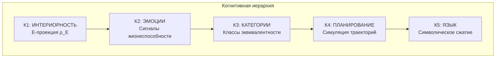
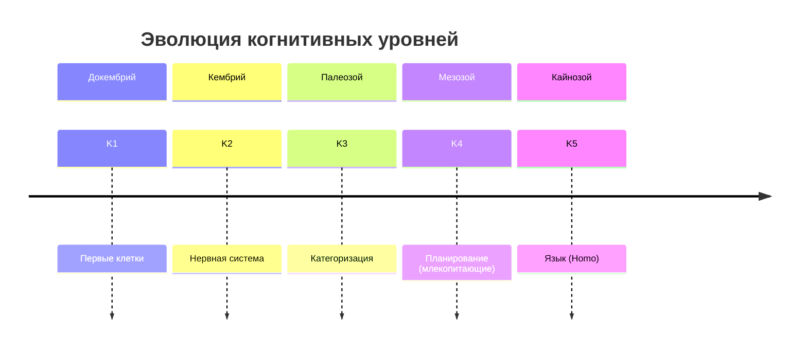

# Когнитивная Иерархия

:::note О нотации
В этом документе:
- $\Gamma$ — [матрица когерентности](/docs/core/dynamics/coherence-matrix)
- $P$ — [чистота](/docs/core/dynamics/viability#определение-чистоты): $P = \mathrm{Tr}(\Gamma^2)$
- $\rho_E$ — редуцированная матрица плотности [измерения Опыта](/docs/core/structure/dimension-e)
- $\mathcal{E}$ — оператор [эволюции](/docs/core/dynamics/evolution)
- L0, L1, L2 — [уровни интериорности](/docs/proofs/interiority-hierarchy)
- K1-K5 — когнитивные уровни (определены ниже)
:::

:::danger Программа исследований
Этот раздел описывает **программу исследований**. Когнитивные уровни (К1-К5) **не тождественны** [иерархии интериорности](/docs/proofs/interiority-hierarchy) (L0-L1-L2). Связь между ними требует формализации.
:::

## Связь с иерархией интериорности

| Иерархия интериорности | Когнитивная иерархия | Связь |
|------------------------|---------------------|-------|
| [L0 — Интериорность](/docs/proofs/interiority-hierarchy#уровень-0-интериорность-interiority) | К1 — Базовая интериорность | L0 ⊇ К1 |
| [L1 — Феноменальная геометрия](/docs/proofs/interiority-hierarchy#уровень-1-феноменальная-геометрия-phenomenal-geometry) | К2 — Эмоции | L1 ⊇ К2 |
| [L2 — Когнитивные квалиа](/docs/proofs/interiority-hierarchy#уровень-2-когнитивные-квалиа-cognitive-qualia) | К3-К5 — Категории, Планирование, Язык | L2 ⊇ К3-К5 |

### Детальная таблица соответствия K ↔ L

| Уровень K | Уровень L | Критерии K | Критерии L | Пример систем |
|-----------|-----------|------------|------------|---------------|
| К1 | L0 | $\rho_E \neq I_E/\dim(\mathcal{H}_E)$ | $\Gamma \neq I/7$ | Термостат, вирус |
| К2 | L1 | Сигналы жизнеспособности ($\nabla P$) | $\Phi > 0$, геометрия на $\mathbb{P}(\mathcal{H}_E)$ | Бактерия, насекомое |
| К3 | L2 | Классы эквивалентности | $R \geq 1/3$, $\Phi \geq 1$, $D_{\text{diff}} \geq 2$ | Рыба, птица |
| К4 | L2+ | Симуляция траекторий | L2 + планирование | Ворона, шимпанзе |
| К5 | L2++ | Символическое сжатие | L2 + язык | Человек, (AGI?) |

## Структура когнитивных уровней

---

## Формальные определения когнитивных уровней

### К1: Интериорность / E-проекция

$$
\mathrm{Interior}(\Gamma) := \rho_E = \mathrm{Tr}_{-E}(\Gamma), \quad \text{со спектром } \{\lambda_k, \vert q_k\rangle\}
$$

где $\mathrm{Tr}_{-E}$ — частичный след по всем измерениям кроме $E$.

**Критерий K1:** $\rho_E \neq I_E / \dim(\mathcal{H}_E)$

**Примеры:** Любая система с ненулевой «внутренней» структурой.

### К2: Эмоции

$$
\mathrm{Emotion}(\Gamma) := f(P(\Gamma), \nabla P(\Gamma), \partial^2 P/\partial t^2)
$$

| Эмоция | Сигнатура через [чистоту](/docs/core/dynamics/viability#определение-чистоты) $P$ |
|--------|-----------|
| Страх | $P \to P_{\text{crit}}$ (приближение к границе $\partial \mathcal{V}$) |
| Облегчение | $dP/dt > 0$ после угрозы |
| Удовлетворение | $P \gg P_{\text{crit}}$, $dP/dt \approx 0$ |
| Фрустрация | $P$ низкая, $\nabla_a P \approx 0$ (нет градиента действий) |

**Критерий K2:** Наличие функционального ответа на изменения $P$.

**Примеры:** Бактерии (хемотаксис), насекомые (паттерны избегания).

### К3: Категории

$$
s_1 \sim_P s_2 \Leftrightarrow \sup_{a,t} |P(s_1(t,a)) - P(s_2(t,a))| < \varepsilon_{\text{equiv}}
$$

Два состояния эквивалентны, если их влияние на жизнеспособность неразличимо при любых действиях.

**Критерий K3:** Формирование классов эквивалентности $[s]_P$.

**Примеры:** Рыбы (различение хищник/пища), птицы (категоризация объектов).

### К4: Планирование

$$
\mathrm{Plan}(s, [a_1,\ldots,a_n]) := [s, \mathcal{E}(s,a_1), \mathcal{E}(\mathcal{E}(s,a_1),a_2), \ldots]
$$

$$
\mathrm{Value}(\mathrm{plan}) := \int_0^T P(s(t)) \, dt
$$

где $\mathcal{E}$ — оператор [эволюции](/docs/core/dynamics/evolution).

**Критерий K4:** Способность симулировать последовательности действий и оценивать результат.

**Примеры:** Врановые (изготовление орудий), приматы (социальное планирование).

### К5: Язык

$$
\mathrm{Language} := \{\text{символические аттракторы в } \mathcal{H} \text{ с композиционной структурой}\}
$$

**Критерий K5:** Наличие символов с композиционной семантикой.

**Примеры:** Человек, (гипотетически) AGI с символьным мышлением.

---

## Практические тесты для определения уровня

| Уровень | Тест | Индикатор |
|---------|------|-----------|
| К1 | Наличие внутреннего состояния | $\rho_E \neq$ const |
| К2 | Реакция на угрозу жизнеспособности | Паттерн избегания при $P \to P_{\text{crit}}$ |
| К3 | Генерализация | Перенос поведения на новые стимулы в классе |
| К4 | Отложенное вознаграждение | Выбор меньшего сейчас ради большего потом |
| К5 | Символическая коммуникация | Использование произвольных знаков для передачи информации |

## Примеры систем по уровням

| Система | K1 | K2 | K3 | K4 | K5 | Примечание |
|---------|----|----|----|----|----|-----------|
| Термостат | ✓ | — | — | — | — | Только $\rho_E$ |
| Бактерия | ✓ | ✓ | — | — | — | Хемотаксис |
| Насекомое | ✓ | ✓ | ✓ | — | — | Категоризация без планирования |
| Рыба | ✓ | ✓ | ✓ | — | — | — |
| Птица | ✓ | ✓ | ✓ | ∼ | — | Частичное планирование |
| Ворона | ✓ | ✓ | ✓ | ✓ | — | Изготовление орудий |
| Шимпанзе | ✓ | ✓ | ✓ | ✓ | ∼ | Протоязык |
| Человек | ✓ | ✓ | ✓ | ✓ | ✓ | Полный язык |
| LLM (GPT-4) | ? | ? | ✓ | ∼ | ✓* | *Символы без $\rho_E$? |
| AGI (гипотет.) | ✓ | ✓ | ✓ | ✓ | ✓ | Если жизнеспособен |

---

## Гипотеза о доязыковом познании

:::info Гипотеза
$$
\exists \, \mathrm{Cognition}(\mathbb{H}) \text{ при } \mathrm{Language}(\mathbb{H}) = \varnothing
$$
Полноценное познание (уровни К1-К4) возможно без языка (К5).
:::

**Обоснование:**
Уровни К1-К4 определены без отсылки к символическим структурам. Эмпирические данные: врановые демонстрируют планирование, все высшие животные — категоризацию, все позвоночные — эмоциональные реакции.

**Следствия:**
1. Язык — **надстройка**, а не фундамент познания
2. AGI может быть когнитивно полноценным без человеческого языка
3. Оценка сознания животных не должна опираться на лингвистические тесты

---

## Связь K-иерархии с мерами КК

| Уровень | Необходимые меры | Достаточные меры |
|---------|------------------|------------------|
| K1 | $\rho_E \neq$ const | — |
| K2 | $\partial P / \partial t$ детектируется | Функциональный ответ на $\nabla P$ |
| K3 | $\Phi > 0$ | Стабильные классы эквивалентности |
| K4 | $R \geq R_{\min}$ | Симуляция $\mathcal{E}^n(s, a_{1..n})$ |
| K5 | $\Phi \geq \Phi_{\text{th}}$, $R \geq R_{\text{th}}$ | Композиционные символы |

---

## Эволюционная перспектива

---

**Связанные документы:**
- [Иерархия интериорности](/docs/proofs/interiority-hierarchy) — уровни L0→L1→L2
- [Предсказания](./predictions) — предсказание 4: доязыковое познание
- [Теории сознания](./consciousness-theories) — IIT, FEP, автопоэзис
- [Панпсихизм](./panpsychism-analysis) — панинтериоризм vs панпсихизм
- [Программы исследований](./research-programs) — открытые вопросы
- [Жизнеспособность](/docs/core/dynamics/viability) — мера $P$ и $P_{\text{crit}}$
- [Самонаблюдение](/docs/core/consciousness/self-observation) — меры $R$, $\Phi$, $C$
