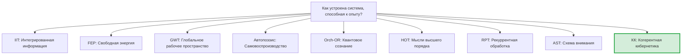

# Сравнение с Альтернативными Теориями

> *«Настоящая проверка теории — не то, может ли она объяснить известные факты, а то, предсказывает ли она новые.»*
> — Имре Лакатос

:::info Для кого эта глава
Систематическое сравнение КК с девятью конкурирующими теориями сознания: IIT, FEP, GWT, автопоэзис, Orch-OR, HOT, RPT и AST.
:::

В предыдущей главе мы исследовали философский фундамент КК — унитарный монизм, необходимость сознания, этику порога. Всё это звучит впечатляюще, но научная теория живёт не в вакууме. Её ценность определяется не только внутренней красотой, но и тем, *что она может, чего не могут другие*. Пришло время поставить КК рядом с конкурентами — честно, отмечая как преимущества, так и ограничения каждого.

Если вы учёный, работающий в одной из этих традиций, этот раздел покажет, как перевести ваши идеи на язык КК — и наоборот. Если вы новичок, он поможет понять интеллектуальный ландшафт, в котором существует КК.

:::info Дорожная карта главы
В этой главе мы:
1. Обрисуем **теоретический ландшафт** — мастер-таблица 9 теорий (раздел 1)
2. Покажем **мосты КК — каждая теория** с компактными сравнениями (раздел 2). Развёрнутый анализ всех 35 теорий: [Теории сознания](/docs/consciousness/comparative/consciousness-theories)
3. Сведём всё в **таблицу предсказаний** (раздел 3) и честно оценим **ограничения КК** (раздел 4)
:::

---

## 1. Обзор теоретического ландшафта {#обзор}

### 1.1 Девять теорий за одним столом

Представим, что за круглым столом сидят девять теорий. Каждая из них пытается ответить на вопрос: «Как устроена система, способная к опыту?»

Эти теории можно разделить на три семейства:

- **Информационные:** IIT, GWT, RPT — фокусируются на обработке и интеграции информации
- **Биологические:** FEP, автопоэзис — фокусируются на выживании и самоорганизации
- **Когнитивные:** HOT, AST — фокусируются на репрезентациях и внимании
- **Физические:** Orch-OR — привязывает сознание к квантовой гравитации
- **КК** — претендует на объединение всех четырёх перспектив

### 1.2 Мастер-таблица сравнения

| Характеристика | IIT (Тонони) | FEP (Фристон) | GWT (Баарс) | Автопоэзис (Матурана) | Orch-OR (Пенроуз) | HOT (Розенталь) | RPT (Ламме) | AST (Грациано) | **КК** |
|---|---|---|---|---|---|---|---|---|---|
| **Центральный объект** | Структура $\Phi$ | Модель $q(\theta)$ | Раб. простр. | Живая клетка | Микротрубочки | Мысль 2-го порядка | Рекуррентные петли | Модель внимания | **$\Gamma$** |
| **Мера сознания** | $\Phi_{\text{IIT}}$ | Нет явной | Доступ к GW | Нет кол. | Объект. редукция | Нет кол. | Нет кол. | Нет кол. | **$C = \Phi \times R$** |
| **Динамика** | Нет | Вар. вывод | Нет | Качест. | Кв. гравитация | Нет | Нет | Нет | **$\mathcal{L}_\Omega$ (полная)** |
| **Порог** | $\Phi > 0$ | Нет | Доступ | Автопоэзис | OR-событие | HOT о HOT | Рек. петля | Модель | **$P{>}2/7 \land R{\geq}1/3 \land \Phi{\geq}1$** |
| **Фальсифицируемость** | Слабая | Слабая | Умеренная | Слабая | Слабая | Умеренная | Умеренная | Умеренная | **Сильная** |
| **Вычислимость** | NP-hard | Аппрокс. | Нет | Нет | Неясно | Нет | Нет | Нет | **$O(N^3)$, $N{=}7$** |

---

## 2. Детальное сравнение с каждой теорией {#детальное-сравнение}

:::info Подробный анализ
Полный анализ 35 теорий сознания (включая 8 ниже) с историей, формализмом и критикой: [Теории сознания → 35 теорий](/docs/consciousness/comparative/consciousness-theories). Здесь — **только мосты** между каждой теорией и КК.
:::

### 2.1 IIT (Тонони) {#iit}

**Мост:** $\Phi_{\text{IIT}} \approx \Phi_{\text{КК}}$ при $P \to 1$. При $P \to 2/7$ расхождение растёт. PCI в лаборатории — прокси для $P$ ([Методология измерений](./measurement#измерение-чистоты)).

| Аспект | IIT | КК |
|---|---|---|
| **Мера** | $\Phi_{\text{IIT}}$ (NP-hard) | $\Phi_{\text{КК}}$ ($O(N^2)$) |
| **Порог** | $\Phi > 0$ | $P > 2/7 \land R \geq 1/3 \land \Phi \geq 1$ |
| **Динамика** | Нет | Полная ($\mathcal{L}_\Omega$) |
| **Преимущество IIT** | Экспериментальная база (PCI) | — |

---

### 2.2 FEP (Фристон) {#fep}

FEP (Фристон, 2010) утверждает, что любая устойчивая система минимизирует вариационную свободную энергию $F$. КК разделяет идею активного самоподдержания и использует марковское одеяло (Enc-функтор). Каноническое $\Delta F$ голонома ([определение](/docs/core/dynamics/evolution#каноническое-delta-f) [Т]) — аналог свободной энергии Фристона.

**Мост:** FEP — частный случай КК при двух упрощениях: (1) игнорируется E-измерение, (2) регенерация $\mathcal{R}$ поглощается в вариационный вывод. Подробнее — [Вариационная формулировка](./variational).

| Аспект | FEP | КК |
|---|---|---|
| **Сознание** | Не объясняется | Явные меры: $C$, $R$, $\Phi$, $\mathrm{Coh}_E$ |
| **Область** | Любая устойчивая система (включая камни) | $\Gamma \in \mathcal{D}(\mathbb{C}^7)$, порог $P > 2/7$ |
| **Обучение** | Нет нижних границ | T-109--T-113: точные нижние границы |
| **Преимущество FEP** | Масштабируемость, сотни экспериментов, predictive coding | — |

:::info Подробное сравнение
Развёрнутый анализ FEP (формализм, active inference, марковское одеяло): [Теории сознания — FEP](/docs/consciousness/comparative/consciousness-theories#fep).
:::

---

### 2.3 GWT (Баарс, Деан) {#gwt}

GWT (Баарс, 1988; GNWT — Деан, Шанжё, 2001) связывает сознание с глобальной трансляцией информации («театр сознания»). В КК это соответствует высокой $\Phi$ (информация доступна всем 7 измерениям). КК формализует метафору: $\Gamma$, $\mathcal{L}_\Omega$, непрерывные меры вместо бинарного «на сцене / за кулисами». GWT превосходит КК в нейронной специфичности (GNWT: «зажигание», P300) и клиническом применении.

:::info Подробное сравнение
[Теории сознания — GWT](/docs/consciousness/comparative/consciousness-theories#gwt).
:::

---

### 2.4 Автопоэзис (Матурана, Варела) {#autopoeisis}

Автопоэзис (1972) — **необходимое, но не достаточное** условие для сознания в КК: $\varphi(\Gamma^*) = \Gamma^*$ ([аксиома AP](/docs/core/foundations/axiom-septicity)). Бактерия автопоэтична, но бессознательна ($R < 1/3$). КК наследует операциональную замкнутость, структурное сопряжение (Enc-функтор T-100) и различение организации/структуры ($\rho_*$ vs. $\Gamma(\tau)$). Автопоэзис превосходит КК в биологической конкретности и социальной теории (Луманн, энактивизм Варелы).

:::info Подробное сравнение
[Теории сознания — Автопоэзис](/docs/consciousness/comparative/consciousness-theories#автопоэзис).
:::

---

### 2.5 Orch-OR (Пенроуз, Хамерофф) {#orch-or}

Orch-OR (1996) привязывает сознание к квантовой гравитации в микротрубочках. КК использует квантовый формализм ($\Gamma$ — матрица плотности), но не привязывает его к субстрату: мультиреализуемость, вычислимость $O(N^3)$, проверяемость через макро-наблюдаемые. Orch-OR превосходит КК в физической укоренённости и связи с квантовой гравитацией.

:::info Подробное сравнение
[Теории сознания — Orch-OR](/docs/consciousness/comparative/consciousness-theories#orch-or).
:::

---

### 2.6 HOT (Розенталь) {#hot}

HOT (1986) — прямой предшественник концепции рефлексии $R$ и глубины самонаблюдения SAD. Порядки мысли в HOT точно соответствуют уровням SAD (1-й порядок = SAD 0, 2-й = SAD 1, 3-й = SAD 2). КК формализует HOT количественно ($R \in [0,1]$, порог $R \geq 1/3$) и доказывает потолок $\text{SAD}_{\max} = 3$ ([Pred 12](./predictions#предсказание-12)). HOT превосходит КК в 40-летней философской проработке и связи с метакогницией.

:::info Подробное сравнение
[Теории сознания — HOT](/docs/consciousness/comparative/consciousness-theories#hot).
:::

---

### 2.7 RPT (Ламме) {#rpt}

RPT (Ламме, 2003) отождествляет сознание с рекуррентной обработкой. В КК рекуррентность соответствует формированию внедиагональных $\gamma_{ij}$ (когерентностей), определяющих $P$ и $\Phi$. КК универсальнее (любая система, не только зрение) и даёт точный порог ($P > 2/7$). RPT превосходит КК в временных предсказаниях (прямой проход ~100 мс, рекурсия ~200+ мс) и нейронной конкретности (V1→V4→IT→PFC→V1).

:::info Подробное сравнение
[Теории сознания — RPT](/docs/consciousness/comparative/consciousness-theories#rpt).
:::

---

### 2.8 AST (Грациано) {#ast}

AST (2013) предполагает, что сознание — модель собственного внимания. Это замечательно перекликается с самомоделью $\varphi(\Gamma)$ в КК, где $R$ — точность модели. КК делает самомодель *необходимой* (No-Zombie), количественной ($R \in [0,1]$), и охватывает все 7 измерений (не только внимание). AST превосходит КК в объяснении иллюзий сознания и theory of mind.

:::info Подробное сравнение
[Теории сознания — AST](/docs/consciousness/comparative/consciousness-theories#ast).
:::

---

## 3. Сводная таблица предсказаний {#сводная-таблица}

Что предсказывает каждая теория и что — нет? Это ключевая таблица: теория ценна ровно настолько, насколько конкретны её предсказания.

| Предсказание | IIT | FEP | GWT | Автопоэзис | Orch-OR | HOT | RPT | AST | **КК** |
|---|:---:|:---:|:---:|:---:|:---:|:---:|:---:|:---:|:---:|
| Невозможность зомби | ? | Нет | Нет | Нет | Да | Нет | Нет | Нет | **Да [Т]** |
| Точный порог сознания | ~Да | Нет | Нет | Нет | Нет | Нет | Нет | Нет | **Да [Т]** |
| Семимерная классификация стресса | Нет | Нет | Нет | Нет | Нет | Нет | Нет | Нет | **Да [Т]** |
| Связь опыта и регенерации | Нет | Нет | Нет | Нет | Нет | Нет | Нет | Нет | **Да [Т]** |
| Потолок SAD = 3 | Нет | Нет | Нет | Нет | Нет | Нет | Нет | Нет | **Да [С]** |
| Доязыковое познание | Да | Да | Нет | Да | ? | Нет | Да | Нет | **Да [И]** |
| Нейроосцилляции из щели | Нет | Нет | Нет | Нет | ? | Нет | Нет | Нет | **Да [Г]** |
| Оптимальность N=7 для обучения | Нет | Нет | Нет | Нет | Нет | Нет | Нет | Нет | **Да [Т]** |
| Верхняя граница P=3/7 | Нет | Нет | Нет | Нет | Нет | Нет | Нет | Нет | **Да [Т]** |
| Время рекуррентной обработки ~200 мс | Нет | Нет | ~Да | Нет | Нет | Нет | **Да** | Нет | Нет |
| Теория сознания других (Theory of Mind) | Нет | Частично | Нет | Нет | Нет | Частично | Нет | **Да** | Нет |
| Нейронная реализация (конкретные пути) | Нет | **Да** | **Да** | Нет | **Да** | Нет | **Да** | Частично | Нет |

:::tip Как читать эту таблицу
- **Да [Т]** = КК доказывает это как теорему
- **Да [С]** = КК доказывает при условии
- **Да [Г]** = КК выдвигает как гипотезу
- **Да [И]** = КК интерпретирует
- **Да** (без маркера) = теория предсказывает
- **~Да** = теория предсказывает, но с оговорками
- **Нет** = теория не адресует этот вопрос
:::

---

## 4. Честная оценка ограничений КК {#ограничения}

Ни одна теория не совершенна. Вот что КК пока **не может**:

1. **Эмпирическая проверка.** Главная слабость — отсутствие экспериментальных подтверждений. КК генерирует предсказания, но ни одно из них пока не проверено в лаборатории. IIT, FEP, GWT и RPT значительно опережают КК в этом отношении.

2. **Калибровка.** Формулы содержат параметры (пороги $\theta_i$ для [диагностики](./diagnostics)), которые требуют эмпирической калибровки для конкретных систем. Перевод «EEG-когерентность → элемент $\Gamma$» — нерешённая задача.

3. **Масштабирование.** Композиция голономов теоретически описана, но практическая работа с большими системами (общество из миллионов агентов) вычислительно сложна.

4. **Феноменологическая адекватность.** Вопрос, *адекватно* ли 7 измерений описывают реальный субъективный опыт, остаётся открытым [С]. Возможно, реальная феноменология богаче — и 7 измерений лишь грубое приближение.

5. **Нейронный субстрат.** КК не предлагает конкретных нейронных механизмов — это и сила (мультиреализуемость), и слабость (трудно проверить в нейронауке).

6. **Social cognition.** КК не развита в направлении социального познания, теории сознания других (theory of mind), эмпатии — областей, где AST и FEP имеют интересные результаты.

Эти ограничения — не фатальные дефекты, а **открытые проблемы**, определяющие программу исследований (см. [Программы исследований](./research-programs)).

:::note Честность как принцип
Этот раздел написан с намеренной честностью. КК — молодая теория, и было бы нечестно скрывать её слабости. Но обратите внимание: *каждая* из конкурирующих теорий имеет *свои* фатальные ограничения. IIT невычислима. FEP нефальсифицируема. GWT неформализована. Автопоэзис некванититативен. Orch-OR непроверяем. Идеальной теории сознания пока не существует — и КК, при всех её ограничениях, имеет наименьшее число фатальных дефектов.
:::

---

## 5. Заключение: КК как метатеория {#заключение}

Современная наука о сознании и самоорганизации напоминает вавилонскую башню: множество языков, мало взаимопонимания. IIT говорит на языке информации, FEP — на языке байесовского вывода, GWT — на языке когнитивной архитектуры, автопоэзис — на языке биологической организации, HOT — на языке репрезентаций.

КК претендует на роль **единого языка** — не потому, что все остальные ошибаются, а потому, что все они описывают разные проекции одного и того же формализма:

| Теория | Проекция КК |
|--------|-------------|
| IIT | $\Phi$-компонента |
| FEP | $\Delta F$ (вариационная формулировка) |
| GWT | Глобальная доступность ($\Phi \geq 1$) |
| Автопоэзис | $\varphi(\Gamma^*) = \Gamma^*$ |
| HOT | $R$ и SAD |
| RPT | Формирование $\gamma_{ij}$ (когерентностей) |
| AST | $\varphi(\Gamma)$ (самомодель) |

Это амбициозное притязание. Но оно фальсифицируемо: если найдётся теория, которая делает все предсказания КК плюс ещё что-то, значит, КК — не метатеория. Пока что таких конкурентов нет.

### Что мы узнали {#итоги}

1. Мы сравнили КК с **8 альтернативными теориями** — от IIT до AST.
2. КК **наследует** ключевые идеи каждой: интеграцию (IIT), активное самоподдержание (FEP), глобальную доступность (GWT), самопроизводство (автопоэзис), рефлексию (HOT), рекуррентность (RPT), самомодель (AST).
3. КК **превосходит** каждую в конкретных аспектах: формализация, вычислимость, фальсифицируемость, полнота.
4. Каждая теория **превосходит** КК в своих сильных сторонах: экспериментальная база, нейронная конкретность, философская проработка.
5. КК — **метатеория**: она включает другие как частные случаи или проекции.

---

В следующей главе мы перейдём от теории к практике: [Методология измерений](./measurement) покажет, *как* перевести формулы КК в конкретные эксперименты, тесты и аудиты.

---

**Дальнейшее чтение:**
- [Уникальные предсказания](./predictions) — полный перечень фальсифицируемых предсказаний
- [Философские основания](./philosophy) — онтологический статус КК
- [Сравнение теорий сознания](/docs/consciousness/comparative/consciousness-theories) — подробный анализ
- [Панпсихизм: критический анализ](/docs/consciousness/comparative/panpsychism-analysis) — почему КК ≠ панпсихизм
- [Вариационная формулировка](./variational) — мост КК — FEP

---

**Связанные документы:**
- [Философские основания](/docs/applied/coherence-cybernetics/philosophy)
- [Уникальные предсказания КК](/docs/applied/coherence-cybernetics/predictions)
- [Методология измерений](/docs/applied/coherence-cybernetics/measurement)
- [Введение в КК](/docs/applied/coherence-cybernetics/introduction)
