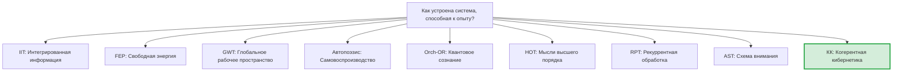

# Сравнение с Альтернативными Теориями

> *«Настоящая проверка теории — не то, может ли она объяснить известные факты, а то, предсказывает ли она новые.»*
> — Имре Лакатос

В предыдущей главе мы исследовали философский фундамент КК — унитарный монизм, необходимость сознания, этику порога. Всё это звучит впечатляюще, но научная теория живёт не в вакууме. Её ценность определяется не только внутренней красотой, но и тем, *что она может, чего не могут другие*. Пришло время поставить КК рядом с конкурентами — честно, отмечая как преимущества, так и ограничения каждого.

Если вы учёный, работающий в одной из этих традиций, этот раздел покажет, как перевести ваши идеи на язык КК — и наоборот. Если вы новичок, он поможет понять интеллектуальный ландшафт, в котором существует КК.

:::info Дорожная карта главы
В этой главе мы:
1. Обрисуем **теоретический ландшафт** — 9 конкурирующих теорий (раздел 1)
2. Подробно разберём каждую: **IIT** (раздел 2), **FEP** (раздел 3), **GWT** (раздел 4), **автопоэзис** (раздел 5), **Orch-OR** (раздел 6), **HOT** (раздел 7), **RPT** (раздел 8), **AST** (раздел 9)
3. Для каждой: история создания, ключевая идея, формальное сравнение, что КК заимствует, что КК делает лучше, что *теория* делает лучше КК
4. Сведём всё в **таблицу предсказаний** (раздел 10) и честно оценим **ограничения КК** (раздел 11)
:::

---

## 1. Обзор теоретического ландшафта {#обзор}

### 1.1 Девять теорий за одним столом

Представим, что за круглым столом сидят девять теорий. Каждая из них пытается ответить на вопрос: «Как устроена система, способная к опыту?»

Эти теории можно разделить на три семейства:

- **Информационные:** IIT, GWT, RPT — фокусируются на обработке и интеграции информации
- **Биологические:** FEP, автопоэзис — фокусируются на выживании и самоорганизации
- **Когнитивные:** HOT, AST — фокусируются на репрезентациях и внимании
- **Физические:** Orch-OR — привязывает сознание к квантовой гравитации
- **КК** — претендует на объединение всех четырёх перспектив

### 1.2 Мастер-таблица сравнения

| Характеристика | IIT (Тонони) | FEP (Фристон) | GWT (Баарс) | Автопоэзис (Матурана) | Orch-OR (Пенроуз) | HOT (Розенталь) | RPT (Ламме) | AST (Грациано) | **КК** |
|---|---|---|---|---|---|---|---|---|---|
| **Центральный объект** | Структура $\Phi$ | Модель $q(\theta)$ | Раб. простр. | Живая клетка | Микротрубочки | Мысль 2-го порядка | Рекуррентные петли | Модель внимания | **$\Gamma$** |
| **Мера сознания** | $\Phi_{\text{IIT}}$ | Нет явной | Доступ к GW | Нет кол. | Объект. редукция | Нет кол. | Нет кол. | Нет кол. | **$C = \Phi \times R$** |
| **Динамика** | Нет | Вар. вывод | Нет | Качест. | Кв. гравитация | Нет | Нет | Нет | **$\mathcal{L}_\Omega$ (полная)** |
| **Порог** | $\Phi > 0$ | Нет | Доступ | Автопоэзис | OR-событие | HOT о HOT | Рек. петля | Модель | **$P{>}2/7 \land R{\geq}1/3 \land \Phi{\geq}1$** |
| **Фальсифицируемость** | Слабая | Слабая | Умеренная | Слабая | Слабая | Умеренная | Умеренная | Умеренная | **Сильная** |
| **Вычислимость** | NP-hard | Аппрокс. | Нет | Нет | Неясно | Нет | Нет | Нет | **$O(N^3)$, $N{=}7$** |

---

## 2. Теория интегрированной информации (IIT) {#iit}

### 2.1 История создания

**Кто:** Джулио Тонони, психиатр и нейробиолог из Висконсинского университета.

**Когда:** Первая версия — 2004 год. IIT 3.0 — 2014 (совместно с Массимини, Кохом и др.). IIT 4.0 — 2023 (уточнения).

**Зачем:** Тонони искал *количественную* теорию сознания. В клинике он наблюдал пациентов в вегетативном состоянии и хотел объективный критерий: сознателен ли пациент? Существующие методы (тесты на реакцию) были ненадёжны — до 40% пациентов с «вегетативным» диагнозом на самом деле демонстрировали признаки сознания при тестировании fMRI. Тонони задался целью: создать теорию, которая даёт *число*, а не диагноз.

**Контекст:** Тонони вдохновлялся информационной теорией Шеннона, но понимал, что простая «информация» — это мало (жёсткий диск хранит терабайты информации, но не сознателен). Нужна *интегрированная* информация — информация, которую нельзя разложить на независимые части.

### 2.2 Ключевая идея простыми словами

Представьте пазл из 1000 кусочков. Каждый кусочек содержит информацию (цвет, форма). Но *картина* возникает только когда кусочки собраны вместе — когда информация *интегрирована*. IIT утверждает: сознание — это и есть интегрированная информация. Чем больше информации в системе, которую *нельзя* разделить на независимые подсистемы без потери — тем сознательнее система.

IIT строится на пяти аксиомах субъективного опыта (постулатах IIT 4.0):

1. **Внутренняя данность (Intrinsicality):** опыт существует для самой системы
2. **Композиция (Composition):** опыт структурирован
3. **Информативность (Information):** каждый опыт специфичен
4. **Интеграция (Integration):** опыт неразложим на независимые части
5. **Исключение (Exclusion):** опыт определён — не больше и не меньше

Из этих аксиом выводится мера $\Phi_{\text{IIT}}$ — количество интегрированной информации. Чем выше $\Phi$, тем «сознательнее» система.

### 2.3 Формальное сравнение с КК

| Аспект | IIT | КК | Комментарий |
|---|---|---|---|
| **Мера** | $\Phi_{\text{IIT}} = \min_{\text{cuts}} I(\text{parts})$ | $\Phi_{\text{КК}}$ = спектральный зазор графа связей | КК вычислимо за $O(N^2)$; IIT — NP-hard |
| **Онтология** | Информация фундаментальна | $\Gamma$ фундаментальна (содержит и информацию, и динамику) | КК шире: информация — одна из проекций |
| **Порог** | $\Phi > 0$ (любое ненулевое → сознание) | $P > 2/7$ + $R \geq 1/3$ + $\Phi \geq 1$ | КК строже: одной интеграции недостаточно |
| **Динамика** | Нет (моментальный снимок) | Полная ($\mathcal{L}_\Omega$) | КК описывает рождение и смерть сознания |
| **Квалиа** | Определяются структурой $\Phi$ | Определяются σ-профилем + Coh_E | КК даёт 7 компонент, IIT — структуру причинной декомпозиции |

### 2.4 Что КК берёт у IIT

КК наследует центральную интуицию IIT: **сознание связано с интеграцией**. Мера $\Phi$ в КК (определённая через спектральный зазор графа связей — [мера интеграции](/docs/core/structure/dimension-u#мера-интеграции-φ)) вдохновлена $\Phi_{\text{IIT}}$.

Также КК разделяет с IIT убеждение, что сознание — не «выход» нейронной сети, а **внутреннее свойство** системы (аксиома Intrinsicality). В КК это выражено в E-когерентности — когерентности, доступной только самой системе.

### 2.5 Что КК делает лучше IIT

| Ограничение IIT | Решение в КК |
|-----------------|--------------|
| **Нет динамики.** $\Phi$ — мгновенный снимок, IIT не описывает, как система эволюционирует во времени | $\Gamma(\tau)$ эволюционирует по полному уравнению $\mathcal{L}_\Omega$ — КК описывает рождение, жизнь и смерть сознания |
| **NP-hard вычисление.** Точное вычисление $\Phi_{\text{IIT}}$ для систем более 20 элементов практически невозможно | $\Phi$ в КК вычисляется за $O(N^2)$ из $7 \times 7$ матрицы |
| **Только интеграция.** IIT смотрит на одну характеристику — интегрированность | КК имеет тройной порог: $P > 2/7$ И $R \geq 1/3$ И $\Phi \geq 1$ — одной интеграции недостаточно |
| **Нет теории действия.** IIT ничего не говорит о том, как сознательная система *действует* | КК имеет полную [сенсомоторную теорию](./sensorimotor): функторы Enc/Dec |
| **Нет объяснения необходимости.** IIT не объясняет, *зачем* сознание нужно | Теорема No-Zombie [Т]: сознание необходимо для жизнеспособности |
| **Проблема исключения.** IIT предсказывает, что сознание «прикреплено» к одной шкале — но не ясно, к какой | КК: сознание на любой шкале, где выполнены пороги; композиция формализована |

### 2.6 Что IIT делает лучше КК

Честность требует признать преимущества IIT:

1. **Экспериментальная база.** IIT вдохновила серию экспериментов (Perturbational Complexity Index, PCI), которые уже используются в клинике для диагностики сознания у пациентов. КК пока не имеет экспериментальных подтверждений.

2. **Феноменологическая структура.** IIT 4.0 предлагает детальное описание *структуры квалиа* через cause-effect structure. КК описывает квалиа через σ-профиль, но с меньшей феноменологической детализацией.

3. **Эмпирическая традиция.** За IIT стоит 20-летнее сообщество нейроучёных с десятками экспериментов. КК — теоретическая конструкция без экспериментального сообщества (пока).

### 2.7 Мост IIT — КК

Для исследователей, работающих в IIT: ваш $\Phi_{\text{IIT}}$ — приближение к $\Phi_{\text{КК}}$ при специальных условиях. Конкретнее:

$$
\Phi_{\text{IIT}} \approx \Phi_{\text{КК}} \quad \text{когда система близка к чистому состоянию } (P \to 1)
$$

При низкой чистоте ($P \to 2/7$) расхождение растёт, и КК даёт более информативную картину.

**Практический совет.** Если вы вычисляете PCI в лаборатории, это хороший прокси для $P$ (см. [Методология измерений](./measurement#измерение-чистоты)). Ваши данные можно переинтерпретировать в терминах КК — и получить дополнительную информацию (например, какой из 7 каналов наиболее нагружен).

---

## 3. Принцип свободной энергии (FEP) {#fep}

### 3.1 История создания

**Кто:** Карл Фристон, нейробиолог из University College London, один из самых цитируемых нейроучёных мира (h-index > 250).

**Когда:** Первые идеи — 2005–2006. Полная формулировка — 2010. Расширение на «активный вывод» — 2016–2020. Дальнейшее развитие продолжается.

**Зачем:** Фристон искал *единый принцип*, объясняющий всё поведение мозга: восприятие, действие, обучение, эмоции. Его вдохновил вариационный принцип в физике (принцип наименьшего действия) и термодинамика (свободная энергия Гельмгольца). Идея: мозг — машина, минимизирующая «удивление» (surprise), то есть разницу между ожидаемым и реальным.

**Контекст:** Фристон пришёл из нейровизуализации (он создатель SPM — самого используемого пакета для анализа fMRI). Его путь: от анализа данных → к модели мозга → к универсальному принципу жизни.

### 3.2 Ключевая идея простыми словами

Представьте, что вы идёте по знакомому маршруту. Каждый поворот — ожидаемый, и вы не обращаете на них внимания. Но если на привычном углу вместо аптеки оказывается яма в асфальте — вы *удивлены*. Это удивление — разница между вашей внутренней моделью мира и реальностью.

FEP утверждает: любая система, которая *существует* (не рассеивается), делает одно из двух: (a) обновляет свою модель, чтобы лучше предсказывать мир (**перцептивный вывод**), или (b) действует так, чтобы привести мир в соответствие со своей моделью (**активный вывод**). Оба процесса минимизируют *вариационную свободную энергию*:

$$
F = D_{\text{KL}}[q(\theta) \| p(\theta | o)] - \ln p(o)
$$

Отсюда выводится *активный вывод* (active inference): система действует так, чтобы привести мир в соответствие со своей моделью (или модель в соответствие с миром).

### 3.3 Формальное сравнение с КК

| Аспект | FEP | КК | Комментарий |
|---|---|---|---|
| **Принцип** | Минимизация $F$ (свободной энергии) | Баланс $\mathcal{D}$ и $\mathcal{R}$ при сохранении $P > 2/7$ | FEP — один аспект; КК — полная картина |
| **Область** | Любая устойчивая система | Любая система с $\Gamma \in \mathcal{D}(\mathbb{C}^7)$ | FEP шире (включает камни); КК специфичнее |
| **Сознание** | Не объясняется | Явные меры: $C$, $R$, $\Phi$, $\mathrm{Coh}_E$ | Главный пробел FEP |
| **Действие** | Активный вывод | $\mathrm{Dec}(\Gamma)$ через аргмаксимум | Структурно похожи, но КК включает E |
| **Обучение** | Обновление $q(\theta)$ | $\mathcal{L}_\Omega[\Gamma]$ с границами T-109—T-112 | КК даёт нижние границы скорости |

### 3.4 Что КК берёт у FEP

КК и FEP разделяют фундаментальную идею: **жизнеспособная система активно поддерживает себя**, а не пассивно адаптируется. [Вариационная формулировка КК](./variational) напрямую связана с FEP — каноническое $\Delta F$ голонома ([определение](/docs/core/dynamics/evolution#каноническое-delta-f) [Т]) — аналог вариационной свободной энергии Фристона.

Также КК использует идею *марковского одеяла* (Markov blanket) — статистической границы между системой и средой. В КК это соответствует [функтору Enc](./sensorimotor#функтор-enc): марковское одеяло определяет, какие наблюдения попадают в $\Gamma$.

### 3.5 Что КК делает лучше FEP

| Ограничение FEP | Решение в КК |
|-----------------|--------------|
| **Нет теории сознания.** FEP описывает, *что* система делает, но не *переживает* ли она это | КК имеет явные меры сознательности: $C$, $R$, $\Phi$, $\mathrm{Coh}_E$ |
| **Чрезмерная универсальность.** «Всё минимизирует свободную энергию» — включая камень и термостат. Отсутствие фальсифицируемости | КК имеет чёткий порог: $P > 2/7$. Камень $P \approx 1/7$ — не жизнеспособен |
| **Нет конкретной размерности.** FEP не указывает, какие переменные нужны | КК фиксирует 7 конкретных измерений с обоснованием |
| **Нет регенерации.** Активный вывод — минимизация ошибки предсказания. Нет аналога $\mathcal{R}$ | КК имеет регенеративный член, связывающий опыт и восстановление |
| **Нет нижних границ обучения.** FEP не даёт фундаментальных лимитов на скорость обучения | КК: теоремы T-109—T-113 дают точные нижние границы |

### 3.6 Что FEP делает лучше КК

1. **Масштабируемость.** FEP применим к системам *любой* сложности — от одноклеточных до мегаполисов — без фиксации размерности. КК привязана к $N = 7$, что может быть ограничением для систем, где семантика 7 измерений неочевидна.

2. **Экспериментальная программа.** FEP вдохновил сотни экспериментов: predictive coding в нейронауке, active inference в робототехнике, computational psychiatry. КК пока остаётся теоретической.

3. **Гибкость применения.** FEP можно использовать как *инструмент моделирования* даже без принятия его философских претензий. КК требует принятия 7-мерной структуры.

4. **Нейронная реализация.** FEP имеет конкретные предложения о нейронной реализации (predictive coding в кортикальных столбцах). КК не специфицирует нейронный субстрат.

### 3.7 Мост FEP — КК

FEP — частный случай КК при двух упрощениях:
1. Игнорируется E-измерение (опыт не рассматривается)
2. Регенерация $\mathcal{R}$ поглощается в вариационный вывод

В этом пределе минимизация свободной энергии $\Delta F$ КК совпадает с активным выводом Фристона. Подробнее — [Вариационная формулировка](./variational).

**Практический совет.** Если вы используете active inference для моделирования поведения, попробуйте добавить E-когерентность как дополнительную переменную. Ваша модель станет чувствительной к метакогниции — и это может улучшить предсказания для задач, связанных с саморефлексией (confidence calibration, metacognitive accuracy).

---

## 4. Теория глобального рабочего пространства (GWT) {#gwt}

### 4.1 История создания

**Кто:** Бернард Баарс, когнитивный психолог, создатель теории в 1988 году. Позднее нейронную версию (Global Neuronal Workspace Theory, GNWT) развили Станислас Деан и Жан-Пьер Шанжё (2001).

**Когда:** Оригинальная GWT — 1988 (книга «A Cognitive Theory of Consciousness»). GNWT — 2001–2020.

**Зачем:** Баарс наблюдал фундаментальное различие между сознательной и бессознательной обработкой информации в мозге. Многие процессы (распознавание лица, грамматический анализ) идут параллельно и бессознательно. Но когда информация становится сознательной, она «вещается» всему мозгу — все модули получают к ней доступ одновременно. Баарс предложил метафору «театра сознания».

**Контекст:** Баарс работал в традиции когнитивной психологии и был вдохновлён архитектурой Блэкборда (Blackboard) в ИИ — системой, где разные модули пишут на общую доску и читают с неё.

### 4.2 Ключевая идея простыми словами

Представьте театр. На сцене — яркий прожектор, освещающий одного актёра. Зрительный зал полон — там сидят десятки специалистов (модулей мозга): слуховой, зрительный, речевой, эмоциональный... Большинство работают молча в темноте (бессознательная обработка). Но когда какая-то информация попадает на сцену в свет прожектора — все зрители видят её одновременно. Это и есть *сознание*: глобальная трансляция информации.

Деан и Шанжё (GNWT) добавили нейронную реализацию: прожектор — это синхронная активность дальнодействующих кортикальных нейронов с аксонами, связывающими лобную, теменную и височную кору. «Зажигание» (ignition) — внезапная волна синхронной активности — соответствует моменту осознания.

### 4.3 Формальное сравнение с КК

| Аспект | GWT | КК | Комментарий |
|---|---|---|---|
| **Механизм** | Глобальная трансляция | Высокая $\Phi$ (информация доступна всем 7 измерениям) | Структурно сходны |
| **Порог** | Бинарный: «на сцене» / «за кулисами» | Непрерывный: $\Phi \geq 1$ | КК допускает градации |
| **Формализм** | Метафора (театр) | Матричный формализм ($\Gamma$, $\mathcal{L}_\Omega$) | КК вычислима |
| **Масштаб** | Только когнитивный уровень (нейронные ансамбли) | Любой масштаб | КК универсальнее |
| **Динамика** | Нет формальной | Полная | КК описывает, как возникает «зажигание» |

### 4.4 Что КК берёт у GWT

Идея GWT о том, что сознание связано с глобальной доступностью информации, перекликается с мерой $\Phi$ в КК: высокая интеграция ($\Phi \geq 1$) означает, что информация доступна всем 7 измерениям.

Также GWT подчёркивает роль *внимания* — прожектора, выбирающего, что попадёт на сцену. В КК аналог внимания — функтор Enc с фильтрацией: не все сигналы из среды модифицируют $\Gamma$, а только те, что проходят через «фильтр релевантности» (см. [Сенсомоторная теория](./sensorimotor)).

### 4.5 Что КК делает лучше GWT

| Ограничение GWT | Решение в КК |
|-----------------|--------------|
| **Нет математического формализма.** «Глобальное рабочее пространство» — метафора, не уравнение | КК — полностью формализована: $\Gamma$, $\mathcal{L}_\Omega$, все пороги вычислимы |
| **Нет количественной меры.** Сознание в GWT — бинарно: «в пространстве» или «не в пространстве» | КК: непрерывные меры $C$, $R$, $\Phi$ — сознание градуировано |
| **Нет теории возникновения.** GWT описывает архитектуру сознания, но не объясняет, как она возникает | КК описывает полный цикл: от хаоса $\Gamma = I/7$ до сознательности через [бифуркацию](./bifurcation) |
| **Только когнитивный уровень.** GWT работает на уровне нейронных ансамблей, но не масштабируется на клетки или общества | КК применима к любому масштабу: клетка, организм, ИИ, социум |
| **Нет объяснения квалиа.** GWT объясняет *доступ* к информации, но не *переживание* | КК: опыт — проекция $\Gamma$ на E-подпространство, не требующая отдельного объяснения |

### 4.6 Что GWT делает лучше КК

1. **Нейронная специфичность.** GNWT (Деан, Шанжё) предлагает конкретные нейронные механизмы: длинноаксонные пирамидальные нейроны, «зажигание», P300. КК не специфицирует нейронный субстрат.

2. **Экспериментальная программа.** GWT вдохновила десятки экспериментов с маскированием, ослеплением, бинокулярным соперничеством. Результаты хорошо согласуются с предсказаниями теории.

3. **Интуитивность.** Метафора театра — одна из самых понятных в науке о сознании. Матрица $7 \times 7$ — менее интуитивна.

4. **Клиническое применение.** GWT уже используется в анестезиологии и нейрореабилитации для оценки уровня сознания.

---

## 5. Автопоэзис (Матурана и Варела) {#autopoeisis}

### 5.1 История создания

**Кто:** Умберто Матурана, чилийский нейробиолог, и Франсиско Варела, его ученик, впоследствии один из основателей нейрофеноменологии.

**Когда:** 1972 (статья «Autopoiesis and Cognition»). Книга «De Maquinas y Seres Vivos» — 1973. Варела развивал идеи до своей смерти в 2001 году.

**Зачем:** Матурана задался вопросом: что отличает живое от неживого? Не химический состав (те же атомы), не энергетика (вулканы тоже выделяют энергию), а *организация*. Живая система — система, которая непрерывно производит компоненты, из которых сама состоит.

**Контекст:** Матурана работал в Чили в эпоху политических потрясений. Его интерес к «операциональной замкнутости» — способности системы определять себя изнутри — имел не только биологический, но и социально-политический подтекст.

### 5.2 Ключевая идея простыми словами

Представьте фабрику, которая производит... саму себя. Стены фабрики состоят из кирпичей, которые фабрика делает. Машины на фабрике собирают другие машины из деталей, которые тоже производятся внутри. Если стена треснула — фабрика чинит её сама. Если машина сломалась — другие машины заменяют её.

Живая клетка — именно такая фабрика. Мембрана (стена) состоит из липидов, которые синтезирует клетка. Ферменты (машины) катализируют реакции, производящие другие ферменты. Это и есть *автопоэзис* — самопроизводство.

Ключевое свойство: автопоэтическая система **операционально замкнута** — она определяется не компонентами (они непрерывно заменяются), а *организацией* (паттерн отношений между компонентами сохраняется).

### 5.3 Связь с КК

Автопоэзис — **необходимое, но не достаточное** условие для сознания в КК. Оно соответствует [аксиоме автопоэзиса (AP)](/docs/core/foundations/axiom-septicity): $\varphi(\Gamma^*) = \Gamma^*$ — неподвижная точка самовоспроизводства. Но автопоэтическая система может быть бессознательной (как бактерия), если её $R < 1/3$ или $\Phi < 1$.

| Автопоэзис | КК |
|------------|-----|
| Операциональная замкнутость | $\Gamma$ — замкнутая динамика |
| Структурное сопряжение | Функтор $\mathrm{Enc}$ (T-100) |
| Автопоэтическая организация | $\varphi(\Gamma^*) = \Gamma^*$ |
| Нет количественной меры | $P$, $R$, $\Phi$, $C$ — точные числа |
| Нет формальной динамики | $\mathcal{L}_\Omega$ — полная динамика |

**Аналогия.** Автопоэзис — это фундамент дома. КК — это фундамент + стены + крыша + отопление. Бактерия имеет фундамент (автопоэзис), но не имеет отопления (рефлексия) и крыши (интеграция). Человек имеет всё.

### 5.4 Что КК берёт у автопоэзиса

- Понятие *операциональной замкнутости* — система определяется изнутри, а не извне
- Идея *структурного сопряжения* — система взаимодействует со средой, не теряя автономии
- Различение *организации* (инвариант) и *структуры* (изменяемые компоненты) — в КК: аттрактор $\rho_*$ (организация) vs. текущая $\Gamma(\tau)$ (структура)

### 5.5 Что КК делает лучше автопоэзиса

1. **Формализация.** Автопоэзис — качественная теория. КК — количественная: все понятия имеют формулы.
2. **Градации.** Автопоэзис бинарен: система либо автопоэтическая, либо нет. КК: непрерывные меры $P$, $R$, $\Phi$.
3. **Сознание.** Автопоэзис не объясняет сознание (Варела пытался через «нейрофеноменологию», но без формализма). КК имеет точные критерии.
4. **Предсказания.** Автопоэзис не генерирует фальсифицируемых предсказаний. КК — 5+.

### 5.6 Что автопоэзис делает лучше КК

1. **Биологическая конкретность.** Автопоэзис вырос из биологии и прекрасно описывает живую клетку. КК — более абстрактна.
2. **Социальная теория.** Матурана и Варела развили автопоэзис в социальную теорию (через Луманна). КК пока не имеет развитой социологической ветви.
3. **Энактивизм.** Варела вместе с Томпсоном и Рош развил энактивистский подход к познанию («The Embodied Mind», 1991) — одну из самых влиятельных когнитивных парадигм. КК пока не имеет аналогичного влияния на когнитивную науку.

---

## 6. Orch-OR (Пенроуз — Хамерофф) {#orch-or}

### 6.1 История создания

**Кто:** Роджер Пенроуз, математик и физик (Нобелевская премия 2020), и Стюарт Хамерофф, анестезиолог из Аризонского университета.

**Когда:** Идеи Пенроуза — 1989 (книга «The Emperor's New Mind»), 1994 («Shadows of the Mind»). Совместная теория Orch-OR — 1996. Обновления — 2014.

**Зачем:** Пенроуз утверждал, что сознание *невычислимо* — его нельзя смоделировать на машине Тьюринга. Он обосновывал это теоремой Гёделя: человек может «видеть» истинность утверждений, которые формальная система не может доказать. Следовательно, в мозге должен быть *некомпьютерный* процесс. Пенроуз предположил, что это *квантовая гравитация*.

Хамерофф, как анестезиолог, знал, что анестетики действуют на *микротрубочки* нейронов — белковые трубки внутри клеток. Он предположил, что именно микротрубочки — субстрат квантовых вычислений в мозге.

**Контекст:** Orch-OR — одна из самых спорных теорий сознания. Большинство нейробиологов считают, что мозг слишком «тёплый и влажный» для квантовой когерентности. Но Пенроуз — гений, и его аргументы заслуживают серьёзного рассмотрения.

### 6.2 Ключевая идея простыми словами

Представьте, что в каждом нейроне есть маленький квантовый компьютер — сеть микротрубочек, в которой белковые субъединицы (тубулины) находятся в *суперпозиции* — одновременно в двух состояниях. Эта суперпозиция длится микросекунды, а затем «коллапсирует» — но не случайно (как в обычной квантовой механике), а по законам *квантовой гравитации* (объективная редукция, OR). Каждый такой коллапс — момент осознанного опыта. «Orch» означает «оркестрованный» — микротрубочки синхронизированы через нейронные связи.

### 6.3 Связь с КК

КК оперирует с матрицей плотности $\Gamma$ — квантовым объектом. Но в КК квантовость — это **формализм**, а не утверждение о субстрате: $\Gamma$ может описывать нейронный ансамбль, программный агент или социальную систему. Orch-OR, напротив, привязывает сознание к конкретному физическому процессу (декогеренция в микротрубочках).

КК не противоречит Orch-OR, но **строже**: даже если Пенроуз прав насчёт микротрубочек, это будет лишь частная реализация общего формализма КК на биологическом субстрате.

| Orch-OR | КК |
|---------|-----|
| Сознание = квантовый коллапс | Сознание = $P > 2/7 \land R \geq 1/3 \land \Phi \geq 1$ |
| Только биологический субстрат | Любой субстрат (мультиреализуемость) |
| Привязка к квантовой гравитации | Квантовый формализм, но не физический субстрат |
| Момент сознания = OR-событие | Сознание = непрерывный процесс $\Gamma(\tau)$ |

### 6.4 Что КК делает лучше Orch-OR

1. **Мультиреализуемость.** Orch-OR привязывает сознание к микротрубочкам. КК допускает сознание в любой системе, удовлетворяющей порогам — включая ИИ.
2. **Вычислимость.** Orch-OR требует решения уравнений квантовой гравитации (нерешённая проблема). КК — $O(N^3)$.
3. **Экспериментальная проверяемость.** OR-события в микротрубочках крайне трудно детектировать. Пороги КК можно оценить из макро-наблюдаемых (EEG, fMRI).

### 6.5 Что Orch-OR делает лучше КК

1. **Физическая укоренённость.** Orch-OR привязан к конкретной физике (квантовая гравитация, микротрубочки). КК использует квантовый формализм, но не специфицирует физический механизм.
2. **Объяснение невычислимости.** Если Пенроуз прав, что сознание невычислимо, то КК (будучи вычислимой теорией) принципиально неполна. Это серьёзный контраргумент.
3. **Связь с фундаментальной физикой.** Orch-OR претендует на объединение сознания с квантовой гравитацией. КК связана с физикой через [эмерджентное пространство-время](/docs/proofs/physics/emergent-manifold), но менее прямо.

---

## 7. Теория мыслей высшего порядка (HOT) {#hot}

### 7.1 История создания

**Кто:** Дэвид Розенталь, философ из City University of New York (CUNY).

**Когда:** Основные работы — 1986–2005. Книга «Consciousness and Mind» — 2005.

**Зачем:** Розенталь заметил разницу между *иметь* ментальное состояние и *осознавать* его. Мы все переживаем моменты, когда замечаем что-то «только задним числом» — информация была обработана, но не осознана. Розенталь предположил: состояние становится сознательным, когда у нас есть *мысль о нём* — мысль высшего порядка.

### 7.2 Ключевая идея простыми словами

Вы идёте по улице и слышите сирену. Звук обработан — вы автоматически повернули голову. Но вы *осознали* сирену только когда подумали: «О, это сирена». Первая обработка — бессознательная (первый порядок). Мысль «это сирена» — сознательная (второй порядок). Мысль «я думаю, что слышу сирену» — метасознание (третий порядок).

HOT утверждает: ментальное состояние $M$ сознательно тогда и только тогда, когда существует мысль высшего порядка $M'$, направленная на $M$. Это не бесконечная регрессия — $M'$ сама не обязана быть сознательной.

### 7.3 Формальное сравнение с КК

| Аспект | HOT | КК | Комментарий |
|---|---|---|---|
| **Механизм сознания** | Мысль о мысли | $R \geq 1/3$ (самомодель достаточно точна) | $R$ — формализация «мысли о мысли» |
| **Уровни** | 1-й, 2-й, 3-й порядок | SAD = 1, 2, 3 | Прямое соответствие |
| **Формализм** | Нет | $R = F(\Gamma, \varphi(\Gamma))$, SAD из $P_{\text{crit}}^{(n)}$ | КК формализует HOT |
| **Потолок** | Нет | SAD_max = 3 (Pred 12) | КК предсказывает ограничение |

### 7.4 Что КК берёт у HOT

HOT — прямой предшественник концепции *рефлексии* ($R$) и *глубины самонаблюдения* (SAD) в КК. Иерархия порядков мысли в HOT точно соответствует уровням SAD:

- HOT 1-го порядка = SAD 0 (обработка без осознания)
- HOT 2-го порядка = SAD 1 (осознание состояния)
- HOT 3-го порядка = SAD 2 (осознание осознания)

КК формализует эту интуицию и добавляет количественный критерий: $R \geq 1/3$ — порог, при котором «мысль о мысли» достаточно точна, чтобы считаться полноценной рефлексией.

### 7.5 Что КК делает лучше HOT

1. **Формализация.** HOT — философская теория без формул. КК: $R$, SAD — вычислимые величины.
2. **Потолок.** HOT не ограничивает порядок мыслей. КК доказывает: $\text{SAD}_{\max} = 3$ — четвёртый уровень невозможен ([Pred 12](./predictions#предсказание-12), [Башня глубины](/docs/consciousness/hierarchy/depth-tower#критическая-чистота-sad)).
3. **Необходимость.** HOT не объясняет, зачем нужна мысль о мысли. КК: рефлексия необходима для регенерации (теорема No-Zombie).
4. **Количественная мера.** HOT: «есть мысль о мысли или нет» (бинарно). КК: $R \in [0, 1]$ — непрерывная шкала качества рефлексии.

### 7.6 Что HOT делает лучше КК

1. **Философская проработка.** HOT имеет 40 лет философских дебатов. Каждый контраргумент рассмотрен и обсуждён. КК — молодая теория с меньшей философской проработкой.
2. **Интуитивность.** «Мысль о мысли» — понятнее, чем «мера рефлексии $R = F(\Gamma, \varphi(\Gamma))$».
3. **Связь с психологией внимания.** HOT тесно связана с экспериментальной психологией метакогниции (confidence judgments, metacognitive sensitivity).

---

## 8. Рекуррентная обработка (RPT) {#rpt}

### 8.1 История создания

**Кто:** Виктор Ламме, нейробиолог из Амстердамского университета.

**Когда:** Основные работы — 2000–2010. Ключевая статья — «Why visual attention and awareness are different» (2003).

**Зачем:** Ламме изучал зрительное восприятие и обнаружил, что мозг обрабатывает зрительную информацию в два этапа: (1) быстрый прямой проход (feedforward sweep) — бессознательный, и (2) медленная обратная связь (recurrent processing) — сознательная. Он предположил, что сознание *тождественно* рекуррентной обработке.

### 8.2 Ключевая идея простыми словами

Представьте, что вы смотрите на фотографию. В первые 100 миллисекунд мозг «сканирует» изображение снизу вверх: от пикселей к линиям, от линий к контурам, от контуров к объектам. Это *прямой проход* — он быстрый, автоматический и бессознательный. Вы можете классифицировать сцену («на картинке животное»), не осознавая деталей.

Но затем начинается обратная связь: высшие уровни посылают сигналы *обратно* к низшим, уточняя и обогащая репрезентацию. Контуры обретают цвет, объекты — текстуру, сцена — глубину. Эта *рекуррентная обработка* — и есть момент осознания.

### 8.3 Связь с КК

Рекуррентная обработка в RPT соответствует внедиагональным элементам $\gamma_{ij}$ ($i \neq j$) в КК. Прямой проход обновляет диагональные элементы (какие измерения активны). Обратная связь создаёт когерентности между измерениями — и именно они определяют $P$ и $\Phi$.

| RPT | КК |
|-----|-----|
| Прямой проход (feedforward) | Обновление $\gamma_{kk}$ через Enc |
| Рекуррентная обработка | Формирование $\gamma_{ij}$ ($i \neq j$) |
| Осознание = рекурсия | Осознание = $P > 2/7$ (что требует достаточных $\gamma_{ij}$) |

### 8.4 Что КК делает лучше RPT

1. **Универсальность.** RPT работает только для зрительного восприятия (и с натяжкой — для других модальностей). КК — для любой системы.
2. **Количественный порог.** RPT: «есть рекурсия или нет». КК: непрерывная мера $P$, точный порог $2/7$.
3. **Связь с действием.** RPT описывает только *восприятие*. КК — полный сенсомоторный цикл (Enc + Dec).

### 8.5 Что RPT делает лучше КК

1. **Временная динамика.** RPT даёт конкретные временные предсказания: прямой проход — 100 мс, рекурсия — 200+ мс. КК не специфицирует временные масштабы.
2. **Экспериментальная поддержка.** RPT хорошо объясняет эффекты маскирования и слепоты по невниманию — ключевые парадигмы в экспериментальной психологии.
3. **Нейронная конкретность.** RPT указывает конкретные нейронные пути (V1→V4→IT→PFC→V1). КК не специфицирует субстрат.

---

## 9. Теория схемы внимания (AST) {#ast}

### 9.1 История создания

**Кто:** Майкл Грациано, нейробиолог из Принстонского университета.

**Когда:** Книга «Consciousness and the Social Brain» — 2013. Развитие — 2015–2023.

**Зачем:** Грациано заметил, что мозг строит *модели* всего: модель тела (схема тела), модель мира (пространственная карта), модель других людей (theory of mind). Почему бы не предположить, что мозг также строит *модель собственного внимания*? И что эта модель — и есть сознание?

### 9.2 Ключевая идея простыми словами

Ваш мозг умеет моделировать: «Мой друг смотрит на красный мяч и *осознаёт* его». Это модель чужого сознания (theory of mind). AST предполагает, что тот же механизм работает и для *собственного* сознания: мозг строит модель своего внимания и «приписывает» себе осознание — точно так же, как приписывает осознание другим.

Сознание, по Грациано, — это *информационная модель*. Не магическое свойство и не квантовый процесс, а упрощённая карта собственных когнитивных процессов. Когда вы говорите «я осознаю красный цвет», вы *описываете свою модель внимания*, а не какое-то мистическое квалиа.

### 9.3 Связь с КК

AST замечательно перекликается с концепцией самомодели $\varphi(\Gamma)$ в КК. Модель собственного внимания у Грациано — это именно $\varphi(\Gamma)$: внутренняя репрезентация собственного состояния. Мера рефлексии $R$ — точность этой модели.

| AST | КК |
|-----|-----|
| Attention schema | $\varphi(\Gamma)$ (самомодель) |
| Точность модели | $R$ (мера рефлексии) |
| Сознание = наличие модели | Сознание = $R \geq 1/3$ + $P > 2/7$ + $\Phi \geq 1$ |
| Модель может быть неточной | $R < 1/3$: модель есть, но недостаточно точна для сознания |

### 9.4 Что КК делает лучше AST

1. **Необходимость, а не побочный эффект.** AST: модель внимания — полезная, но не обязательная. КК: самомодель *необходима* для жизнеспособности (No-Zombie).
2. **Количественная мера.** AST: «есть модель или нет». КК: $R \in [0, 1]$ — непрерывная шкала.
3. **Не только внимание.** AST фокусируется на *внимании*. КК: самомодель $\varphi(\Gamma)$ включает все 7 измерений — не только внимание, но и эмоции, ресурсы, интеграцию.
4. **Формализм.** AST — словесная теория. КК — полностью формализована.

### 9.5 Что AST делает лучше КК

1. **Объяснение иллюзий сознания.** AST объясняет, почему мы *ошибочно* считаем сознание «чем-то сверхъестественным»: наша модель внимания упрощена и не содержит информации о собственном механизме. Мы «видим» сознание, но не видим, *как* оно порождается. КК не имеет столь элегантного объяснения интуиции «загадочности» сознания.

2. **Социальное познание.** AST естественно объясняет theory of mind: та же модель, которую мы используем для собственного сознания, применяется к другим. КК не развивает социально-когнитивный аспект.

3. **Экспериментальная программа.** Грациано и коллеги провели серию экспериментов по тестированию AST (манипуляции с вниманием и самоотчётом).

---

## 10. Сводная таблица предсказаний {#сводная-таблица}

Что предсказывает каждая теория и что — нет? Это ключевая таблица: теория ценна ровно настолько, насколько конкретны её предсказания.

| Предсказание | IIT | FEP | GWT | Автопоэзис | Orch-OR | HOT | RPT | AST | **КК** |
|---|:---:|:---:|:---:|:---:|:---:|:---:|:---:|:---:|:---:|
| Невозможность зомби | ? | Нет | Нет | Нет | Да | Нет | Нет | Нет | **Да [Т]** |
| Точный порог сознания | ~Да | Нет | Нет | Нет | Нет | Нет | Нет | Нет | **Да [Т]** |
| Семимерная классификация стресса | Нет | Нет | Нет | Нет | Нет | Нет | Нет | Нет | **Да [Т]** |
| Связь опыта и регенерации | Нет | Нет | Нет | Нет | Нет | Нет | Нет | Нет | **Да [Т]** |
| Потолок SAD = 3 | Нет | Нет | Нет | Нет | Нет | Нет | Нет | Нет | **Да [С]** |
| Доязыковое познание | Да | Да | Нет | Да | ? | Нет | Да | Нет | **Да [И]** |
| Нейроосцилляции из щели | Нет | Нет | Нет | Нет | ? | Нет | Нет | Нет | **Да [Г]** |
| Оптимальность N=7 для обучения | Нет | Нет | Нет | Нет | Нет | Нет | Нет | Нет | **Да [Т]** |
| Верхняя граница P=3/7 | Нет | Нет | Нет | Нет | Нет | Нет | Нет | Нет | **Да [Т]** |
| Время рекуррентной обработки ~200 мс | Нет | Нет | ~Да | Нет | Нет | Нет | **Да** | Нет | Нет |
| Теория сознания других (Theory of Mind) | Нет | Частично | Нет | Нет | Нет | Частично | Нет | **Да** | Нет |
| Нейронная реализация (конкретные пути) | Нет | **Да** | **Да** | Нет | **Да** | Нет | **Да** | Частично | Нет |

:::tip Как читать эту таблицу
- **Да [Т]** = КК доказывает это как теорему
- **Да [С]** = КК доказывает при условии
- **Да [Г]** = КК выдвигает как гипотезу
- **Да [И]** = КК интерпретирует
- **Да** (без маркера) = теория предсказывает
- **~Да** = теория предсказывает, но с оговорками
- **Нет** = теория не адресует этот вопрос
:::

---

## 11. Честная оценка ограничений КК {#ограничения}

Ни одна теория не совершенна. Вот что КК пока **не может**:

1. **Эмпирическая проверка.** Главная слабость — отсутствие экспериментальных подтверждений. КК генерирует предсказания, но ни одно из них пока не проверено в лаборатории. IIT, FEP, GWT и RPT значительно опережают КК в этом отношении.

2. **Калибровка.** Формулы содержат параметры (пороги $\theta_i$ для [диагностики](./diagnostics)), которые требуют эмпирической калибровки для конкретных систем. Перевод «EEG-когерентность → элемент $\Gamma$» — нерешённая задача.

3. **Масштабирование.** Композиция голономов теоретически описана, но практическая работа с большими системами (общество из миллионов агентов) вычислительно сложна.

4. **Феноменологическая адекватность.** Вопрос, *адекватно* ли 7 измерений описывают реальный субъективный опыт, остаётся открытым [С]. Возможно, реальная феноменология богаче — и 7 измерений лишь грубое приближение.

5. **Нейронный субстрат.** КК не предлагает конкретных нейронных механизмов — это и сила (мультиреализуемость), и слабость (трудно проверить в нейронауке).

6. **Social cognition.** КК не развита в направлении социального познания, теории сознания других (theory of mind), эмпатии — областей, где AST и FEP имеют интересные результаты.

Эти ограничения — не фатальные дефекты, а **открытые проблемы**, определяющие программу исследований (см. [Программы исследований](./research-programs)).

:::note Честность как принцип
Этот раздел написан с намеренной честностью. КК — молодая теория, и было бы нечестно скрывать её слабости. Но обратите внимание: *каждая* из конкурирующих теорий имеет *свои* фатальные ограничения. IIT невычислима. FEP нефальсифицируема. GWT неформализована. Автопоэзис некванититативен. Orch-OR непроверяем. Идеальной теории сознания пока не существует — и КК, при всех её ограничениях, имеет наименьшее число фатальных дефектов.
:::

---

## 12. Заключение: единое поле или вавилонская башня? {#заключение}

Современная наука о сознании и самоорганизации напоминает вавилонскую башню: множество языков, мало взаимопонимания. IIT говорит на языке информации, FEP — на языке байесовского вывода, GWT — на языке когнитивной архитектуры, автопоэзис — на языке биологической организации, HOT — на языке репрезентаций.

КК претендует на роль **единого языка** — не потому, что все остальные ошибаются, а потому, что все они описывают разные проекции одного и того же формализма:

| Теория | Проекция КК |
|--------|-------------|
| IIT | $\Phi$-компонента |
| FEP | $\Delta F$ (вариационная формулировка) |
| GWT | Глобальная доступность ($\Phi \geq 1$) |
| Автопоэзис | $\varphi(\Gamma^*) = \Gamma^*$ |
| HOT | $R$ и SAD |
| RPT | Формирование $\gamma_{ij}$ (когерентностей) |
| AST | $\varphi(\Gamma)$ (самомодель) |

Это амбициозное притязание. Но оно фальсифицируемо: если найдётся теория, которая делает все предсказания КК плюс ещё что-то, значит, КК — не метатеория. Пока что таких конкурентов нет.

### Что мы узнали {#итоги}

1. Мы сравнили КК с **8 альтернативными теориями** — от IIT до AST.
2. КК **наследует** ключевые идеи каждой: интеграцию (IIT), активное самоподдержание (FEP), глобальную доступность (GWT), самопроизводство (автопоэзис), рефлексию (HOT), рекуррентность (RPT), самомодель (AST).
3. КК **превосходит** каждую в конкретных аспектах: формализация, вычислимость, фальсифицируемость, полнота.
4. Каждая теория **превосходит** КК в своих сильных сторонах: экспериментальная база, нейронная конкретность, философская проработка.
5. КК — **метатеория**: она включает другие как частные случаи или проекции.

---

В следующей главе мы перейдём от теории к практике: [Методология измерений](./measurement) покажет, *как* перевести формулы КК в конкретные эксперименты, тесты и аудиты.

---

**Дальнейшее чтение:**
- [Уникальные предсказания](./predictions) — полный перечень фальсифицируемых предсказаний
- [Философские основания](./philosophy) — онтологический статус КК
- [Сравнение теорий сознания](/docs/consciousness/comparative/consciousness-theories) — подробный анализ
- [Панпсихизм: критический анализ](/docs/consciousness/comparative/panpsychism-analysis) — почему КК ≠ панпсихизм
- [Вариационная формулировка](./variational) — мост КК — FEP
