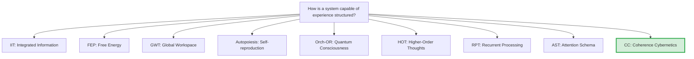

# Comparison with Alternative Theories

> *"The real test of a theory is not whether it can explain known facts, but whether it predicts new ones."*
> — Imre Lakatos

:::info Who This Chapter Is For
A systematic comparison of CC with nine competing theories of consciousness: IIT, FEP, GWT, autopoiesis, Orch-OR, HOT, RPT, and AST.
:::

In the previous chapter we explored the philosophical foundation of CC — unitary monism, the necessity of consciousness, the ethics of the threshold. All of this sounds impressive, but a scientific theory does not live in a vacuum. Its value is determined not only by internal beauty, but by *what it can do that others cannot*. It is time to place CC alongside its competitors — honestly, noting both the advantages and the limitations of each.

If you are a scientist working in one of these traditions, this section will show how to translate your ideas into the language of CC — and vice versa. If you are a newcomer, it will help you understand the intellectual landscape in which CC exists.

:::info Chapter Roadmap
In this chapter we:
1. Sketch the **theoretical landscape** — a master table of 9 theories (section 1)
2. Show **CC bridges to each theory** with compact comparisons (section 2). Extended analysis of all 36 theories: [Theories of Consciousness](/docs/consciousness/comparative/consciousness-theories)
3. Consolidate everything into a **predictions table** (section 3) and honestly assess the **limitations of CC** (section 4)
:::

---

## 1. Overview of the Theoretical Landscape {#обзор}

### 1.1 Nine Theories at One Table

Imagine nine theories seated around a round table. Each of them tries to answer the question: "How is a system capable of experience structured?"

These theories can be divided into three families:

- **Informational:** IIT, GWT, RPT — focus on information processing and integration
- **Biological:** FEP, autopoiesis — focus on survival and self-organization
- **Cognitive:** HOT, AST — focus on representations and attention
- **Physical:** Orch-OR — ties consciousness to quantum gravity
- **CC** — claims to unite all four perspectives

### 1.2 Master Comparison Table

| Characteristic | IIT (Tononi) | FEP (Friston) | GWT (Baars) | Autopoiesis (Maturana) | Orch-OR (Penrose) | HOT (Rosenthal) | RPT (Lamme) | AST (Graziano) | **CC** |
|---|---|---|---|---|---|---|---|---|---|
| **Central object** | Structure $\Phi$ | Model $q(\theta)$ | Workspace | Living cell | Microtubules | 2nd-order thought | Recurrent loops | Attention model | **$\Gamma$** |
| **Measure of consciousness** | $\Phi_{\text{IIT}}$ | None explicit | GW access | None quant. | Objective reduction | None quant. | None quant. | None quant. | **$C = \Phi \times R$** |
| **Dynamics** | None | Var. inference | None | Qualitative | Quantum gravity | None | None | None | **$\mathcal{L}_\Omega$ (full)** |
| **Threshold** | $\Phi > 0$ | None | Access | Autopoiesis | OR-event | HOT of HOT | Rec. loop | Model | **$P{>}2/7 \land R{\geq}1/3 \land \Phi{\geq}1$** |
| **Falsifiability** | Weak | Weak | Moderate | Weak | Weak | Moderate | Moderate | Moderate | **Strong** |
| **Computability** | NP-hard | Approx. | None | None | Unclear | None | None | None | **$O(N^3)$, $N{=}7$** |

---

## 2. Detailed Comparison with Each Theory {#детальное-сравнение}

:::info Detailed Analysis
Full analysis of 36 theories of consciousness (including the 8 below) with history, formalism, and critique: [Theories of Consciousness → 36 theories](/docs/consciousness/comparative/consciousness-theories). Here — **only the bridges** between each theory and CC.
:::

### 2.1 IIT (Tononi) {#iit}

**Bridge:** $\Phi_{\text{IIT}} \approx \Phi_{\text{CC}}$ at $P \to 1$. At $P \to 2/7$ the divergence grows. PCI in the laboratory is a proxy for $P$ ([Measurement Methodology](./measurement#измерение-чистоты)).

| Aspect | IIT | CC |
|---|---|---|
| **Measure** | $\Phi_{\text{IIT}}$ (NP-hard) | $\Phi_{\text{CC}}$ ($O(N^2)$) |
| **Threshold** | $\Phi > 0$ | $P > 2/7 \land R \geq 1/3 \land \Phi \geq 1$ |
| **Dynamics** | None | Full ($\mathcal{L}_\Omega$) |
| **IIT advantage** | Experimental base (PCI) | — |

---

### 2.2 FEP (Friston) {#fep}

FEP (Friston, 2010) asserts that any stable system minimizes variational free energy $F$. CC shares the idea of active self-maintenance and uses the Markov blanket (Enc-functor). The canonical $\Delta F$ of the holon ([definition](/docs/core/dynamics/evolution#каноническое-delta-f) [T]) is the analog of Friston's free energy.

**Bridge:** FEP is a special case of CC under two simplifications: (1) the E-dimension is ignored, (2) regeneration $\mathcal{R}$ is absorbed into variational inference. More details — [Variational Formulation](./variational).

| Aspect | FEP | CC |
|---|---|---|
| **Consciousness** | Not explained | Explicit measures: $C$, $R$, $\Phi$, $\mathrm{Coh}_E$ |
| **Scope** | Any stable system (including rocks) | $\Gamma \in \mathcal{D}(\mathbb{C}^7)$, threshold $P > 2/7$ |
| **Learning** | No lower bounds | T-109--T-113: exact lower bounds |
| **FEP advantage** | Scalability, hundreds of experiments, predictive coding | — |

:::info Detailed Comparison
Extended analysis of FEP (formalism, active inference, Markov blanket): [Theories of Consciousness — FEP](/docs/consciousness/comparative/consciousness-theories#fep).
:::

---

### 2.3 GWT (Baars, Dehaene) {#gwt}

GWT (Baars, 1988; GNWT — Dehaene, Changeux, 2001) ties consciousness to global broadcasting of information ("theatre of consciousness"). In CC this corresponds to high $\Phi$ (information accessible to all 7 dimensions). CC formalizes the metaphor: $\Gamma$, $\mathcal{L}_\Omega$, continuous measures instead of binary "on stage / backstage." GWT surpasses CC in neural specificity (GNWT: "ignition," P300) and clinical application.

:::info Detailed Comparison
[Theories of Consciousness — GWT](/docs/consciousness/comparative/consciousness-theories#gwt).
:::

---

### 2.4 Autopoiesis (Maturana, Varela) {#autopoeisis}

Autopoiesis (1972) is a **necessary but not sufficient** condition for consciousness in CC: $\varphi(\Gamma^*) = \Gamma^*$ ([axiom AP](/docs/core/foundations/axiom-septicity)). A bacterium is autopoietic but unconscious ($R < 1/3$). CC inherits operational closure, structural coupling (Enc-functor T-100), and the organization/structure distinction ($\rho_*$ vs. $\Gamma(\tau)$). Autopoiesis surpasses CC in biological concreteness and social theory (Luhmann, Varela's enactivism).

:::info Detailed Comparison
[Theories of Consciousness — Autopoiesis](/docs/consciousness/comparative/consciousness-theories#автопоэзис).
:::

---

### 2.5 Orch-OR (Penrose, Hameroff) {#orch-or}

Orch-OR (1996) ties consciousness to quantum gravity in microtubules. CC uses quantum formalism ($\Gamma$ — density matrix) but does not bind it to a substrate: multi-realizability, computability $O(N^3)$, verifiability through macro-observables. Orch-OR surpasses CC in physical groundedness and connection to quantum gravity.

:::info Detailed Comparison
[Theories of Consciousness — Orch-OR](/docs/consciousness/comparative/consciousness-theories#orch-or).
:::

---

### 2.6 HOT (Rosenthal) {#hot}

HOT (1986) is the direct precursor of the concept of reflection $R$ and self-observation depth SAD. Orders of thought in HOT correspond precisely to SAD levels (1st order = SAD 0, 2nd = SAD 1, 3rd = SAD 2). CC formalizes HOT quantitatively ($R \in [0,1]$, threshold $R \geq 1/3$) and proves the ceiling $\text{SAD}_{\max} = 3$ ([Pred 12](./predictions#предсказание-12)). HOT surpasses CC in 40 years of philosophical development and connection to metacognition.

:::info Detailed Comparison
[Theories of Consciousness — HOT](/docs/consciousness/comparative/consciousness-theories#hot).
:::

---

### 2.7 RPT (Lamme) {#rpt}

RPT (Lamme, 2003) identifies consciousness with recurrent processing. In CC recurrence corresponds to the formation of off-diagonal $\gamma_{ij}$ (coherences), determining $P$ and $\Phi$. CC is more universal (any system, not only vision) and gives an exact threshold ($P > 2/7$). RPT surpasses CC in temporal predictions (feedforward ~100 ms, recurrence ~200+ ms) and neural concreteness (V1→V4→IT→PFC→V1).

:::info Detailed Comparison
[Theories of Consciousness — RPT](/docs/consciousness/comparative/consciousness-theories#rpt).
:::

---

### 2.8 AST (Graziano) {#ast}

AST (2013) proposes that consciousness is a model of one's own attention. This remarkably resonates with the self-model $\varphi(\Gamma)$ in CC, where $R$ is the accuracy of the model. CC makes the self-model *necessary* (No-Zombie), quantitative ($R \in [0,1]$), and covers all 7 dimensions (not only attention). AST surpasses CC in explaining consciousness illusions and theory of mind.

:::info Detailed Comparison
[Theories of Consciousness — AST](/docs/consciousness/comparative/consciousness-theories#ast).
:::

---

## 3. Summary Predictions Table {#сводная-таблица}

What does each theory predict and what does it not? This is the key table: a theory is valuable precisely to the extent that its predictions are concrete.

| Prediction | IIT | FEP | GWT | Autopoiesis | Orch-OR | HOT | RPT | AST | **CC** |
|---|:---:|:---:|:---:|:---:|:---:|:---:|:---:|:---:|:---:|
| Impossibility of zombies | ? | No | No | No | Yes | No | No | No | **Yes [T]** |
| Exact consciousness threshold | ~Yes | No | No | No | No | No | No | No | **Yes [T]** |
| Seven-dimensional stress classification | No | No | No | No | No | No | No | No | **Yes [T]** |
| Experience–regeneration link | No | No | No | No | No | No | No | No | **Yes [T]** |
| SAD ceiling = 3 | No | No | No | No | No | No | No | No | **Yes [C]** |
| Pre-linguistic cognition | Yes | Yes | No | Yes | ? | No | Yes | No | **Yes [I]** |
| Neural oscillations from gap | No | No | No | No | ? | No | No | No | **Yes [H]** |
| Optimality N=7 for learning | No | No | No | No | No | No | No | No | **Yes [T]** |
| Upper bound P=3/7 | No | No | No | No | No | No | No | No | **Yes [T]** |
| Recurrent processing time ~200 ms | No | No | ~Yes | No | No | No | **Yes** | No | No |
| Theory of mind | No | Partially | No | No | No | Partially | No | **Yes** | No |
| Neural implementation (specific pathways) | No | **Yes** | **Yes** | No | **Yes** | No | **Yes** | Partially | No |

:::tip How to Read This Table
- **Yes [T]** = CC proves this as a theorem
- **Yes [C]** = CC proves conditionally
- **Yes [H]** = CC proposes as a hypothesis
- **Yes [I]** = CC interprets
- **Yes** (no marker) = the theory predicts
- **~Yes** = the theory predicts, but with caveats
- **No** = the theory does not address this question
:::

---

## 4. Honest Assessment of CC's Limitations {#ограничения}

No theory is perfect. Here is what CC currently **cannot** do:

1. **Empirical verification.** The main weakness is the absence of experimental confirmation. CC generates predictions, but none of them have yet been tested in the laboratory. IIT, FEP, GWT, and RPT are significantly ahead of CC in this respect.

2. **Calibration.** The formulas contain parameters (thresholds $\theta_i$ for [diagnostics](./diagnostics)) that require empirical calibration for specific systems. Translating "EEG coherence → element $\Gamma$" is an unsolved problem.

3. **Scaling.** The composition of holons is theoretically described, but practical work with large systems (a society of millions of agents) is computationally complex.

4. **Phenomenological adequacy.** Whether 7 dimensions *adequately* describe real subjective experience remains an open question [C]. Real phenomenology may be richer — and 7 dimensions merely a rough approximation.

5. **Neural substrate.** CC does not propose specific neural mechanisms — this is both a strength (multi-realizability) and a weakness (difficult to test in neuroscience).

6. **Social cognition.** CC is not developed in the direction of social cognition, theory of mind, empathy — domains where AST and FEP have interesting results.

These limitations are not fatal defects, but **open problems** defining the research program (see [Research Programs](./research-programs)).

:::note Honesty as a Principle
This section is written with deliberate honesty. CC is a young theory, and it would be dishonest to hide its weaknesses. But note: *every* competing theory has *its own* fatal limitations. IIT is incomputable. FEP is non-falsifiable. GWT is non-formalized. Autopoiesis is non-quantitative. Orch-OR is untestable. A perfect theory of consciousness does not yet exist — and CC, for all its limitations, has the fewest fatal defects.
:::

---

## 5. Conclusion: CC as a Metatheory {#заключение}

Modern science of consciousness and self-organization resembles the Tower of Babel: many languages, little mutual understanding. IIT speaks the language of information, FEP — the language of Bayesian inference, GWT — the language of cognitive architecture, autopoiesis — the language of biological organization, HOT — the language of representations.

CC claims the role of a **common language** — not because all the others are wrong, but because they all describe different projections of the same formalism:

| Theory | CC Projection |
|--------|---------------|
| IIT | $\Phi$-component |
| FEP | $\Delta F$ (variational formulation) |
| GWT | Global accessibility ($\Phi \geq 1$) |
| Autopoiesis | $\varphi(\Gamma^*) = \Gamma^*$ |
| HOT | $R$ and SAD |
| RPT | Formation of $\gamma_{ij}$ (coherences) |
| AST | $\varphi(\Gamma)$ (self-model) |

This is an ambitious claim. But it is falsifiable: if a theory is found that makes all of CC's predictions plus something more, then CC is not a metatheory. So far no such competitors exist.

### What We Have Learned {#итоги}

1. We compared CC with **8 alternative theories** — from IIT to AST.
2. CC **inherits** the key ideas of each: integration (IIT), active self-maintenance (FEP), global accessibility (GWT), self-production (autopoiesis), reflection (HOT), recurrence (RPT), self-model (AST).
3. CC **surpasses** each in specific aspects: formalization, computability, falsifiability, completeness.
4. Each theory **surpasses** CC in its own strengths: experimental base, neural concreteness, philosophical development.
5. CC is a **metatheory**: it includes the others as special cases or projections.

---

In the next chapter we move from theory to practice: [Measurement Methodology](./measurement) will show *how* to translate CC formulas into concrete experiments, tests, and audits.

---

**Further Reading:**
- [Unique Predictions](./predictions) — the complete list of falsifiable predictions
- [Philosophical Foundations](./philosophy) — the ontological status of CC
- [Comparison of Theories of Consciousness](/docs/consciousness/comparative/consciousness-theories) — detailed analysis
- [Panpsychism: A Critical Analysis](/docs/consciousness/comparative/panpsychism-analysis) — why CC ≠ panpsychism
- [Variational Formulation](./variational) — the CC — FEP bridge

---

**Related documents:**
- [Philosophical Foundations](/docs/applied/coherence-cybernetics/philosophy)
- [Unique Predictions of CC](/docs/applied/coherence-cybernetics/predictions)
- [Measurement Methodology](/docs/applied/coherence-cybernetics/measurement)
- [Introduction to CC](/docs/applied/coherence-cybernetics/introduction)
