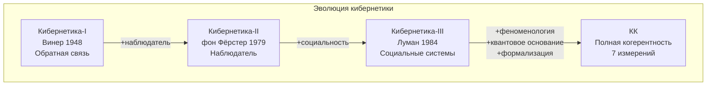

# История Кибернетики

:::note О нотации
В этом документе:
- $\Gamma$ — [матрица когерентности](/docs/core/dynamics/coherence-matrix)
- $\varphi$ — [оператор самомоделирования](/docs/proofs/formalization-phi)
- $\mathbb{H}$ — [Голоном](/docs/core/structure/holon)
- ASDLEOU — [семь измерений](/docs/core/structure/dimensions)
:::

## Общая структура

:::info Концептуальное включение (не формальное)
КК **инкорпорирует концепции** из каждой кибернетической традиции:

- **Кибернетика-I:** управление и обратная связь → измерение $D$
- **Кибернетика-II:** наблюдатель → оператор $\varphi$
- **Кибернетика-III:** социальные системы → композиция Голономов

Это **концептуальное соответствие**, не строгое теоретико-множественное включение. Каждая традиция имеет собственные онтологические и методологические допущения.
:::

## Сравнительная таблица

| Теория | Фокус | Отображение в КК | Охват |
|--------|-------|------------------|-------|
| Кибернетика-I | Обратная связь | Управляющие воздействия | $D$ |
| Кибернетика-II | Наблюдатель | $\varphi(\Gamma) \approx \Gamma$ | $D$, $L$ |
| Кибернетика-III | Социальные системы | $\mathbb{H}_{1 \otimes \ldots \otimes n}$ | $D$, $L$, $U$ |
| [Автопоэзис](/docs/reference/glossary#связанные-теории) | Самопроизводство | [(AP)](/docs/core/foundations/axiom-septicity): $\varphi(\Gamma^*) = \Gamma^*$ | $A$, $S$, $D$, $L$ |
| [IIT](/docs/reference/glossary#связанные-теории) | Интегрированная информация | [$\Phi(\Gamma)$](/docs/core/structure/dimension-u#мера-интеграции-φ) | $U$, $E$ |
| [FEP](/docs/reference/glossary#связанные-теории) | Свободная энергия | [Жизнеспособность](/docs/core/dynamics/viability) | $D$, $O$, $S$ |
| [Панпсихизм](./panpsychism-analysis) | Ментальное как базовое | [Варианты](./panpsychism-analysis#варианты-панпсихизма): L0 (прото-), $(H, \rho_E)$ (Рассел) | $E$, $S$ |
| [Сознательный реализм](./panpsychism-analysis#сознательный-реализм-хоффмана) | Сознательные агенты | L2-Голоном (гипотеза) | $A$, $S$, $D$, $L$, $E$ |
| **КК** | Полная когерентность | [Все 7 измерений](/docs/core/structure/dimensions) | $A$, $S$, $D$, $L$, $E$, $O$, $U$ |

## Кибернетика первого порядка (Винер)

**Фокус:** Обратная связь, управление, гомеостаз.

**Источник:** Wiener N. «Cybernetics: Or Control and Communication in the Animal and the Machine» (1948).

**Ключевые понятия:**
- **Обратная связь** — использование выходных данных для коррекции входных
- **Гомеостаз** — поддержание устойчивого состояния
- **Негэнтропия** — упорядоченность как мера организации

**Отображение в КК:**

| Винер | КК |
|-------|-----|
| $u(t) = f(e(t), y(t))$ | Управление через [измерение $D$](/docs/core/structure/dimension-d) |
| Ошибка $e(t)$ | Отклонение от [жизнеспособности](/docs/core/dynamics/viability) |

**Что теряется:**
- [Самореференция](/docs/proofs/formalization-phi) ($\varphi$)
- Феноменология ([E-измерение](/docs/core/structure/dimension-e))
- Регенерация ($\mathcal{R}[\Gamma, E]$)
- 6 из 7 измерений

## Кибернетика второго порядка (фон Фёрстер)

**Фокус:** Наблюдатель, включённый в систему.

**Источник:** von Foerster H. «Observing Systems» (1981); «Cybernetics of Cybernetics» (1979).

**Ключевые понятия:**
- **Наблюдатель второго порядка** — наблюдение за наблюдением
- **Эпистемическое замыкание** — знание порождается внутри системы
- **Рекурсия** — самоприменение операций

**Отображение в КК:**

| фон Фёрстер | КК |
|-------------|-----|
| Наблюдатель $\in$ Система | $\varphi(\Gamma) \approx \Gamma$ |
| Эпистемическое замыкание | [Неподвижная точка](/docs/core/consciousness/self-observation#теорема-о-неподвижной-точке) $\Gamma^* = \varphi(\Gamma^*)$ |

**Добавляется:**
- [Рефлексия](/docs/core/consciousness/self-observation#мера-рефлексии-r) (мера $R$)
- Эпистемическое замыкание через [измерение $L$](/docs/core/structure/dimension-l)

**Что теряется:**
- Феноменология ([E-измерение](/docs/core/structure/dimension-e))
- Регенерация ([O-измерение](/docs/core/structure/dimension-o))
- Квантовое основание [(QG)](/docs/core/foundations/axiom-septicity)

## Кибернетика третьего порядка

**Фокус:** Социальные системы, коммуникация, смысл.

**Источник:** Luhmann N. «Social Systems» (1984); концепция развивалась также в работах Морена, Гюнтера.

**Ключевые понятия:**
- **Социальные системы** — коммуникация как базовая операция
- **Аутопоэзис социальных систем** — самовоспроизводство через коммуникацию
- **Смысл** — как среда социальных систем

**Отображение в КК:**

| Кибернетика-III | КК |
|-----------------|-----|
| Социальные системы | Композитный Голоном $\mathbb{H}_{1 \otimes \ldots \otimes n}$ |
| Коммуникация | Взаимодействие через общую компоненту $\Gamma_{ij}$ |
| Смысл | [U-измерение](/docs/core/structure/dimension-u) — интеграция |

**Добавляется:**
- Многоагентная динамика
- Эмерджентные социальные феномены

**Что теряется:**
- Феноменология ([E-измерение](/docs/core/structure/dimension-e) как фундаментальное)
- Квантовое основание [(QG)](/docs/core/foundations/axiom-septicity)
- Формальная математическая структура

## Диаграмма эволюции кибернетики

## Ключевые различия КК

| Аспект | Кибернетика I-II-III | КК |
|--------|---------------------|-----|
| Онтология | Информация/коммуникация | Когерентность $\Gamma$ |
| Субъективность | Игнорируется | [E-измерение](/docs/core/structure/dimension-e) — фундаментальное |
| Динамика | Описательная | [Уравнение эволюции](/docs/core/dynamics/evolution) |
| Основание | Классическое | Квантовое [(QG)](/docs/core/foundations/axiom-septicity) |
| Формализм | Неформальный / частичный | Полный (категорный) |
| Жизнеспособность | Интуитивная | [Формальный критерий](/docs/core/dynamics/viability) $P > P_{\text{crit}}$ |

---

**Связанные документы:**
- [Теории сознания](./consciousness-theories) — IIT, FEP, автопоэзис в контексте КК
- [Панпсихизм](./panpsychism-analysis) — категорный анализ вариантов панпсихизма
- [Аксиоматика](./axiomatics) — формальные основания КК
- [Теоремы](./theorems) — ключевые результаты
- [Голоном](/docs/core/structure/holon) — определение $\mathbb{H}$
- [Семь измерений](/docs/core/structure/dimensions) — базис $\mathcal{H}$
