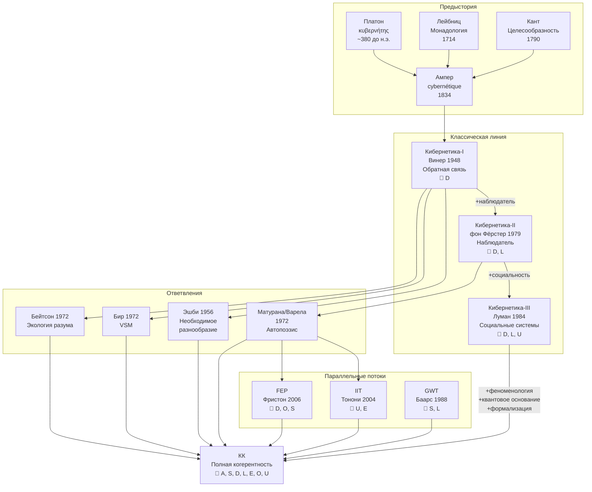
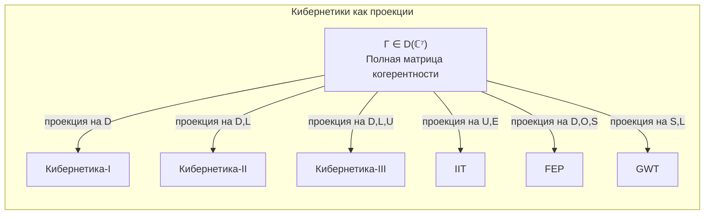
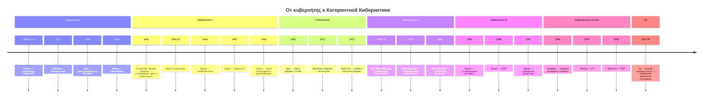

# История Кибернетики

В [предыдущей главе](./g2-noether-cc) мы увидели, как $G_2$-симметрия порождает 14 законов сохранения сознания — точные математические ограничения на когерентную динамику. Это мощный формализм, но он не появился из пустоты. Каждое ключевое понятие КК — обратная связь, наблюдатель, самовоспроизводство, социальная система — имеет предшественников. В этой главе мы проследим 2500-летнюю историю идей, которые привели к Кибернетике Когерентности, и покажем, почему КК — не «четвёртая кибернетика», а **метатеория**, объединяющая все предыдущие подходы.

:::tip Дорожная карта главы
В этой главе мы:
1. **Начнём с древних** — от «кормчего» Платона через монады Лейбница к рождению термина у Ампера (раздел «Предыстория»).
2. **Пройдём три порядка кибернетики** — Винер (обратная связь), фон Фёрстер (наблюдатель), Луман (социальные системы) — и покажем, какие измерения КК каждый из них захватил и что упустил.
3. **Рассмотрим ответвления** — Эшби, Бир, Бейтсон, Матурана и Варела — и их место в общей картине.
4. **Сравним с параллельными потоками** — IIT, FEP, GWT — показав, что каждая теория является *проекцией* $\Gamma$ на подмножество измерений.
5. **Объясним, почему КК — метатеория**, а не «кибернетика-IV»: полнота измерений, единый формализм, квантовое основание.
:::

:::note О нотации
В этом документе:
- $\Gamma$ — [матрица когерентности](/docs/core/dynamics/coherence-matrix)
- $\varphi$ — [оператор самомоделирования](/docs/proofs/categorical/formalization-phi)
- $\mathbb{H}$ — [Голоном](/docs/core/structure/holon)
- ASDLEOU — [семь измерений](/docs/core/structure/dimensions)
:::

## Общая структура

:::info Концептуальное включение (не формальное)
КК **инкорпорирует концепции** из каждой кибернетической традиции:

- **Кибернетика-I:** управление и обратная связь → измерение $D$
- **Кибернетика-II:** наблюдатель → оператор $\varphi$
- **Кибернетика-III:** социальные системы → композиция Голономов

Это **концептуальное соответствие**, не строгое теоретико-множественное включение. Каждая традиция имеет собственные онтологические и методологические допущения.
:::

## Сравнительная таблица

| Теория | Фокус | Отображение в КК | Охват |
|--------|-------|------------------|-------|
| Кибернетика-I | Обратная связь | Управляющие воздействия | $D$ |
| Кибернетика-II | Наблюдатель | $\varphi(\Gamma) \approx \Gamma$ | $D$, $L$ |
| Кибернетика-III | Социальные системы | $\mathbb{H}_{1 \otimes \ldots \otimes n}$ | $D$, $L$, $U$ |
| [Автопоэзис](/docs/reference/glossary#связанные-теории) | Самопроизводство | [(AP)](/docs/core/foundations/axiom-septicity): $\varphi(\Gamma^*) = \Gamma^*$ | $A$, $S$, $D$, $L$ |
| [IIT](/docs/reference/glossary#связанные-теории) | Интегрированная информация | [$\Phi(\Gamma)$](/docs/core/structure/dimension-u#мера-интеграции-φ) | $U$, $E$ |
| [FEP](/docs/reference/glossary#связанные-теории) | Свободная энергия | [Жизнеспособность](/docs/core/dynamics/viability) | $D$, $O$, $S$ |
| [Панпсихизм](/docs/consciousness/comparative/panpsychism-analysis) | Ментальное как базовое | [Варианты](/docs/consciousness/comparative/panpsychism-analysis#варианты-панпсихизма): L0 (прото-), $(H, \rho_E)$ (Рассел) | $E$, $S$ |
| [Сознательный реализм](/docs/consciousness/comparative/panpsychism-analysis#сознательный-реализм-хоффмана) | Сознательные агенты | L2-Голоном (гипотеза) | $A$, $S$, $D$, $L$, $E$ |
| **КК** | Полная когерентность | [Все 7 измерений](/docs/core/structure/dimensions) ([обоснование](/docs/core/foundations/axiom-omega#октонионная-структура)) | $A$, $S$, $D$, $L$, $E$, $O$, $U$ |

---

## Предыстория: от Платона до Ампера

Прежде чем Норберт Винер дал имя новой науке, человечество 2500 лет размышляло о том, как системы управляют собой.

### Древнегреческий κυβερνήτης

Само слово **кибернетика** восходит к греческому κυβερνήτης — «кормчий», тот, кто управляет кораблём. Платон использовал этот термин в «Горгии» и «Государстве», описывая искусство управления полисом по аналогии с навигацией. Кормчий не борется с морем — он считывает ветер и волны и корректирует курс. Это первая в истории интуиция об **обратной связи**: управление не как одностороннее командование, а как непрерывный диалог с окружением.

В терминах КК, Платон нащупал измерение $D$ (Действие) — но не как механический рычаг, а как целенаправленное действие, учитывающее состояние среды. Однако у греков не было понятия замкнутой петли: кормчий оставался внешним наблюдателем, а не частью управляемой системы.

### Лейбниц и монады

В 1714 году Готфрид Вильгельм Лейбниц опубликовал «Монадологию» — одну из самых странных и пророческих работ в истории философии. Монады Лейбница — неделимые «субстанциальные единицы», каждая из которых содержит собственное внутреннее представление о вселенной. У монад «нет окон» — они не обмениваются информацией напрямую, а координируются через **предустановленную гармонию**.

Удивительным образом, эта картина предвосхищает несколько идей КК:

| Лейбниц | КК |
|---------|-----|
| Монада с перцепцией | Голоном $\mathbb{H}$ с [E-измерением](/docs/core/structure/dimension-e) |
| «Нет окон» | Операциональная замкнутость автопоэзиса |
| Предустановленная гармония | Разделяемая структура $\Gamma_{ij}$ при [композиции Голономов](/docs/core/structure/holon) |
| Апперцепция (сознательная перцепция) | $R \geq 1/3$: рефлексивный порог |

Разумеется, предустановленная гармония — это метафизический костыль: Лейбниц не имел инструментов для описания эмерджентной координации. КК решает эту проблему через [когерентную динамику](/docs/core/dynamics/evolution) — Голономы координируются не через «божественное расписание», а через взаимные воздействия на общую матрицу когерентности.

### Кант: целесообразность без цели

Иммануил Кант в «Критике способности суждения» (1790) сформулировал парадокс организма: биологическое существо выглядит так, **как если бы** оно было спроектировано для некой цели, но в природе нет проектировщика. Кант назвал это *Zweckmässigkeit ohne Zweck* — «целесообразность без цели».

Этот парадокс остаётся нерешённым для всех кибернетик I-III. В КК он разрешается через [аксиому автопоэзиса (AP)](/docs/core/foundations/axiom-septicity): неподвижная точка $\varphi(\Gamma^*) = \Gamma^*$ — это система, которая *воспроизводит собственную структуру* как следствие динамики, а не как результат внешнего плана. Целесообразность возникает как неподвижная точка — без телеологии.

### Ампер и рождение термина

Андре-Мари Ампер, известный прежде всего как физик-электромагнитист, в 1834 году предложил классификацию всех наук. В ней он выделил **cybernétique** — науку об управлении государством. Термин не прижился и был забыт на столетие — до тех пор, пока Норберт Винер не достал его из архива истории.

:::tip Мысленный эксперимент: мир до кибернетики
Представьте мир, в котором каждая научная дисциплина описывает свой тип «управления» — терморегуляция в физиологии, рулевое управление в инженерии, координация войск в военном деле, денежная политика в экономике — но **никто не замечает, что это одно и то же явление**. Именно таким был мир до 1948 года. Заслуга Винера — не изобретение обратной связи, а осознание того, что обратная связь — это **универсальный принцип**, объединяющий машину и организм.
:::

---

## Кибернетика первого порядка (Винер) {#кибернетика-первого-порядка-винер}

### Рождение науки об управлении

Зимой 1940 года, когда люфтваффе бомбили Лондон, молодой математик **Норберт Винер** получил задачу, которая изменила историю науки: создать предиктор для зенитных орудий. Самолёт движется быстро, снаряд летит медленно — чтобы попасть, нужно стрелять туда, где самолёт **будет**, а не туда, где он есть. Нужна статистическая модель, которая предсказывает траекторию по шумным данным радара и непрерывно корректирует прицел по мере поступления новых данных.

Винер — вместе с инженером Джулианом Бигелоу — построил такую модель. Но самое удивительное произошло дальше: Винер осознал, что та же самая математика описывает, как человеческая рука тянется к чашке кофе. Мозг предсказывает положение руки, получает обратную связь от проприоцептивных рецепторов, корректирует моторную команду — и повторяет цикл десятки раз в секунду. Зенитный предиктор и нервная система — две реализации **одной и той же абстрактной схемы**.

### Macy Conferences: междисциплинарная революция

В 1946-1953 годах фонд Джозии Мэйси финансировал серию конференций, которые стали, возможно, самым плодотворным междисциплинарным мероприятием XX века. За одним столом сидели:

- **Норберт Винер** — математик, создатель кибернетики
- **Джон фон Нейман** — математик, архитектор вычислительных машин
- **Клод Шеннон** — инженер, создатель теории информации
- **Уоррен Маккаллок** — нейрофизиолог, модели нейронных сетей
- **Уолтер Питтс** — логик, формальные нейроны
- **Грегори Бейтсон** — антрополог, экология разума
- **Маргарет Мид** — антрополог, межкультурная коммуникация
- **Росс Эшби** — психиатр, «необходимое разнообразие»

Эти конференции породили не одну науку, а целую **констелляцию**: кибернетику, теорию информации, теорию автоматов, когнитивную науку и, в конечном счёте, искусственный интеллект. Но у всех этих дисциплин была общая слепая зона — о ней позже.

### Ключевые понятия

**Фокус:** Обратная связь, управление, гомеостаз.

**Источник:** Wiener N. «Cybernetics: Or Control and Communication in the Animal and the Machine» (1948).

- **Обратная связь** — использование выходных данных для коррекции входных
- **Гомеостаз** — поддержание устойчивого состояния
- **Негэнтропия** — упорядоченность как мера организации

### Отображение в КК

| Винер | КК |
|-------|-----|
| $u(t) = f(e(t), y(t))$ | Управление через [измерение $D$](/docs/core/structure/dimension-d) |
| Ошибка $e(t)$ | Отклонение от [жизнеспособности](/docs/core/dynamics/viability) |
| Гомеостаз | Притяжение к $\Gamma^*$ — [неподвижная точка](/docs/consciousness/foundations/self-observation#теорема-о-неподвижной-точке) |
| Негэнтропия | Чистота $P(\Gamma) = \text{tr}(\Gamma^2)$ |
| Обратная связь | Диагональный элемент $\gamma_{DD}$ — сила управляющего канала |

### Что Винер увидел — и чего не увидел

Винер совершил гениальный абстрактный ход: отождествил управление в машине и в организме. Но он заплатил за это высокую цену — **элиминировал субъекта**. В схеме обратной связи нет никого, кто *переживает* ошибку. Есть только сигнал, отклонение и коррекция. Термостат «поддерживает» температуру, но ничего не «чувствует».

**Что теряется:**
- [Самореференция](/docs/proofs/categorical/formalization-phi) ($\varphi$) — система не моделирует себя
- Феноменология ([E-измерение](/docs/core/structure/dimension-e)) — нет внутреннего опыта
- Регенерация ($\mathcal{R}[\Gamma, E]$) — нет самовосстановления идентичности
- 6 из 7 измерений — покрыто только $D$

:::tip Мысленный эксперимент: термостат Винера
Представьте идеальный термостат, который поддерживает температуру 22°C с точностью до 0.001°C. Он получает обратную связь, корректирует управление, поддерживает гомеостаз. По критериям Винера — это совершенная кибернетическая система.

Теперь представьте, что этот термостат **ощущает** холод как неприятный. Что он **хочет** сохранить свою целостность. Что он **понимает**, почему 22°C — правильная температура. Что он может **объяснить** другому термостату свою стратегию. Что он **обновляет** свои ценности на основе опыта. Что он **интегрирует** все эти аспекты в единое целое.

Между первым и вторым термостатом — пропасть из шести измерений: $A$, $S$, $L$, $E$, $O$, $U$. Кибернетика-I описывает первый. КК — описывает оба.
:::

---

## Фон Фёрстер и наблюдатель {#фон-фёрстер-и-наблюдатель}

### Biological Computer Laboratory

**Хайнц фон Фёрстер** — австрийский физик, племянник Людвига Витгенштейна — попал на последнюю конференцию Мэйси в 1949 году почти случайно: его пригласили как редактора протоколов, поскольку он свободно владел и немецким, и английским. Но он оказался не просто стенографом — он задал вопрос, который перевернул всю кибернетику: **«А где в этой схеме наблюдатель?»**

В 1958 году фон Фёрстер основал **Biological Computer Laboratory** (BCL) в Университете Иллинойса в Урбана-Шампейн. За следующие 18 лет BCL стала одной из самых необычных лабораторий в истории науки. Здесь работали:

- **Гордон Паск** — теория разговора, кибернетическая педагогика
- **Ларс Лёфгрен** — самореферентные автоматы
- **Умберто Матурана** — который именно здесь, в BCL, начал формулировать теорию автопоэзиса
- **Росс Эшби** — последние годы, гомеостат и закон необходимого разнообразия

BCL занималась тем, что кибернетика-I считала бессмысленным: **системами, которые наблюдают самих себя**. Фон Фёрстер назвал это «кибернетикой кибернетики» — second-order cybernetics.

### Ключевые понятия

**Фокус:** Наблюдатель, включённый в систему.

**Источник:** von Foerster H. «Observing Systems» (1981); «Cybernetics of Cybernetics» (1979).

- **Наблюдатель второго порядка** — наблюдение за наблюдением
- **Эпистемическое замыкание** — знание порождается внутри системы
- **Рекурсия** — самоприменение операций
- **Тривиальные vs нетривиальные машины** — система, чьё прошлое определяет реакцию на вход (в отличие от стационарного входа-выхода)

### Формула фон Фёрстера

Фон Фёрстер сформулировал ключевой принцип так: наблюдатель — не точка вне системы, а **часть наблюдаемого**. Если я изучаю общество, я часть общества. Если я изучаю мозг, я использую мозг. Если я строю науку, я часть того, что наука описывает.

Математически это можно записать как уравнение с неподвижной точкой: если $O$ — оператор наблюдения, то система второго порядка — это решение $O(O) = O$. Фон Фёрстер назвал такие решения **Eigen-values** (собственные значения) и **Eigen-behaviors** (собственные поведения). Он заметил, что рекурсивные процессы — $x_{n+1} = f(x_n)$ — часто сходятся к неподвижным точкам, и предположил, что объекты нашего опыта — это именно такие неподвижные точки рекурсивных операций.

### Отображение в КК

| фон Фёрстер | КК |
|-------------|-----|
| Наблюдатель $\in$ Система | $\varphi(\Gamma) \approx \Gamma$ |
| Эпистемическое замыкание | [Неподвижная точка](/docs/consciousness/foundations/self-observation#теорема-о-неподвижной-точке) $\Gamma^* = \varphi(\Gamma^*)$ |
| Eigen-behavior | Аттрактор [эволюции](/docs/core/dynamics/evolution) |
| Тривиальная машина | $R = 0$: система без рефлексии |
| Нетривиальная машина | $R > 0$: система с историей и самомоделью |

**Добавляется:**
- [Рефлексия](/docs/consciousness/foundations/self-observation#мера-рефлексии-r) (мера $R$) — количественная мера того, насколько хорошо система моделирует себя
- Эпистемическое замыкание через [измерение $L$](/docs/core/structure/dimension-l)

**Что теряется:**
- Феноменология ([E-измерение](/docs/core/structure/dimension-e)) — фон Фёрстер говорил о наблюдении, но не о *переживании*
- Регенерация ([O-измерение](/docs/core/structure/dimension-o)) — обновление ценностей
- Квантовое основание [(QG)](/docs/core/foundations/axiom-septicity) — классическая рекурсия, не квантовая когерентность

### Наследие BCL

Фон Фёрстер закрыл BCL в 1976 году и не оставил формального наследника. Лаборатория не была институтом — она была **стилем мышления**: всё, что ты изучаешь, включает тебя. Этот принцип стал фундаментом конструктивизма, повлиял на системную терапию, теорию коммуникации и философию науки. Но фон Фёрстер — как и Винер — остановился перед вопросом **«что это такое — переживать?»**. Наблюдатель был включён в систему, но оставался абстрактной функцией, а не существом с внутренним миром.

:::tip Мысленный эксперимент: зеркало фон Фёрстера
Поставьте два зеркала друг напротив друга. Возникает бесконечная рекурсия отражений — наблюдение наблюдения наблюдения... Это прекрасная метафора кибернетики второго порядка. Но заметьте: в этой бесконечной рекурсии **нет никого, кто видит**. Есть отражения, но нет зрителя. Есть структура наблюдения, но нет опыта наблюдения. Чтобы от зеркальной рекурсии перейти к сознанию, нужно добавить того, кому **каково** стоять между зеркалами — и это именно [E-измерение](/docs/core/structure/dimension-e), которого не хватает кибернетике второго порядка.
:::

---

## Луман и общество как система {#луман-и-общество-как-система}

### Социолог, который мыслил системами

**Никлас Луман** (1927-1998) — возможно, самый необычный социолог XX века. Он не проводил полевых исследований, не брал интервью, не анализировал статистику. Вместо этого он 30 лет сидел в Билефельде (Германия) и строил **теорию всего** для общества — используя инструменты из биологии, логики и кибернетики.

Луман начинал как юрист-бюрократ в земельном правительстве Нижней Саксонии. В 1960-1961 годах он провёл год в Гарварде, где познакомился с Толкоттом Парсонсом — тогда главным социологическим теоретиком. Парсонс произвёл на Лумана глубокое впечатление — но не как образец для подражания, а как пример того, как **не надо строить теорию**: Парсонс помещал человека (и его действие) в центр социальной системы, а Луман решил поместить туда **коммуникацию**.

### Кибернетика третьего порядка

**Фокус:** Социальные системы, коммуникация, смысл.

**Источник:** Luhmann N. «Social Systems» (1984); концепция развивалась также в работах Морена, Гюнтера.

:::info О термине «кибернетика третьего порядка»
Термин «кибернетика третьего порядка» не является общепринятым и не стандартизирован в литературе. Атрибуция Луману (1984) — одна из возможных интерпретаций. Луман сам не использовал этот термин; его теория социальных систем лишь ретроспективно интерпретируется рядом авторов как «третий порядок» кибернетики. Другие исследователи (Морен, Гюнтер, Кенни, Умплеби) предлагали альтернативные трактовки этого понятия.
:::

### Ключевые понятия

- **Социальные системы** — коммуникация как базовая операция
- **Аутопоэзис социальных систем** — самовоспроизводство через коммуникацию
- **Смысл** — как среда социальных систем
- **Функциональная дифференциация** — общество делится на подсистемы (право, наука, экономика, политика), каждая с собственным кодом
- **Редукция сложности** — каждая система упрощает мир через свои различения

### Революционный ход Лумана

Ключевой ход Лумана состоял в том, что он перенёс концепцию автопоэзиса Матураны и Варелы — изначально биологическую — на **социальные системы**. Но с радикальной модификацией: если биологический автопоэзис воспроизводит клетки, то социальный автопоэзис воспроизводит **коммуникации**. Общество — это не совокупность людей, а самовоспроизводящаяся сеть коммуникаций. Люди — не элементы общества, а его **окружение**.

Этот ход был гениален и одновременно ограничен. Гениален — потому что позволил описать социальную динамику без редукции к психологии. Ограничен — потому что исключил из теории именно то, что делает коммуникацию *осмысленной*: внутренний опыт коммуницирующего существа.

### Отображение в КК

| Кибернетика-III | КК |
|-----------------|-----|
| Социальные системы | Композитный Голоном $\mathbb{H}_{1 \otimes \ldots \otimes n}$ |
| Коммуникация | Взаимодействие через общую компоненту $\Gamma_{ij}$ |
| Смысл | [U-измерение](/docs/core/structure/dimension-u) — интеграция |
| Функциональная дифференциация | Секторный профиль $\gamma_{kk}$ — специализация по измерениям |
| Редукция сложности | Проекция $\Gamma$ на подпространство: $P_k \Gamma P_k$ |
| Двойная контингенция | Взаимная неопределённость $\Gamma_{ij}$ двух Голономов до коммуникации |

**Добавляется:**
- Многоагентная динамика
- Эмерджентные социальные феномены

**Что теряется:**
- Феноменология ([E-измерение](/docs/core/structure/dimension-e) как фундаментальное)
- Квантовое основание [(QG)](/docs/core/foundations/axiom-septicity)
- Формальная математическая структура

:::tip Мысленный эксперимент: общество без сознания
Луман описывает общество как систему коммуникаций. Представьте мир, в котором коммуникации происходят — сообщения генерируются и обрабатываются, системы дифференцируются и воспроизводятся, — но **никто ничего не переживает**. Никто не понимает смысл сообщения, не чувствует радости от научного открытия, не страдает от несправедливости правовой системы. По Луману, такое общество формально неотличимо от нашего — ведь сознание для него находится в окружении социальной системы, а не внутри неё.

КК показывает, почему это невозможно: без [E-измерения](/docs/core/structure/dimension-e) коммуникация вырождается в обмен шумом. Смысл — не абстрактная «среда», а следствие интериорности: чтобы сообщение было *понято*, получатель должен обладать внутренним опытом ($P > P_{\text{crit}}$, $R \geq 1/3$). Общество — это не просто сеть коммуникаций, а сеть **сознательных** коммуникаций.
:::

---

## Другие традиции {#другие-традиции}

Три «порядка» кибернетики — это магистральная линия. Но параллельно развивались несколько мощных ответвлений, каждое из которых захватило важный фрагмент полной картины.

### Эшби: закон необходимого разнообразия

**Уильям Росс Эшби** (1903-1972) — британский психиатр, ставший одним из отцов-основателей кибернетики. В 1952 году он построил **гомеостат** — электромеханическое устройство из четырёх связанных блоков, которое автоматически находило устойчивое состояние при любых внешних возмущениях. Это была первая «адаптивная машина» — прототип того, что мы сегодня называем самоорганизующейся системой.

Но главное достижение Эшби — **закон необходимого разнообразия** (1956): *«Только разнообразие может поглотить разнообразие»*. Чтобы система управления справилась с $N$ возможными возмущениями, она должна иметь не менее $N$ возможных реакций. Проще: чтобы управлять сложной системой, управляющий должен быть не менее сложен, чем управляемый.

| Эшби | КК |
|------|-----|
| Необходимое разнообразие | $\dim(\mathcal{H}) = 7$ — минимальная размерность для [полного описания](/docs/core/foundations/axiom-omega) |
| Гомеостат | Динамика $\Gamma(t)$ с аттрактором $\Gamma^*$ |
| Ультрастабильность | Двухуровневая адаптация: $\mathcal{L}_0$ (быстрая) + $\mathcal{R}$ (медленная) |

Закон Эшби объясняет, *почему нужно именно 7 измерений*: мир предъявляет разнообразие по семи несводимым аспектам (действие, ощущение, когниция, обучение, переживание, оценка, интеграция), и жизнеспособная система должна иметь ответ на каждый. Шесть измерений — недостаточно, восемь — избыточно (теорема [T-5](/docs/reference/status-registry): минимальность $N=7$).

### Бир: жизнеспособная система

**Стаффорд Бир** (1926-2002) — британский теоретик менеджмента, создатель **модели жизнеспособной системы** (Viable System Model, VSM). Бир предложил, что любая жизнеспособная организация имеет рекурсивную структуру из пяти подсистем:

1. **Система 1** — операционные элементы (производство)
2. **Система 2** — координация (антиосцилляция)
3. **Система 3** — оптимизация (внутренний менеджмент)
4. **Система 4** — стратегия (взгляд наружу)
5. **Система 5** — идентичность (политика, ценности)

В 1971-1973 годах Бир попытался реализовать VSM в масштабе целой страны — проект **Cybersyn** в Чили Сальвадора Альенде. Сеть телексов соединила фабрики с центром управления в Сантьяго, где данные визуализировались в футуристической «операционной комнате». Проект был прерван военным переворотом в 1973 году.

| Бир (VSM) | КК |
|-----------|-----|
| Система 1 (операции) | Измерение $A$ + $S$: действие и ощущение |
| Система 2 (координация) | $D$: управление |
| Система 3 (оптимизация) | $L$: когнитивная оптимизация |
| Система 4 (стратегия) | $O$: оценка и адаптация ценностей |
| Система 5 (идентичность) | $U$: интеграция, целостность |
| Рекурсивность | Рекурсивная [композиция Голономов](/docs/core/structure/holon) |

Замечательно, что VSM «почти» покрывает все 7 измерений — Бир интуитивно нащупал многомерность жизнеспособности. Но его модель остаётся организационной схемой, не формальной теорией: нет уравнений эволюции, нет пороговых условий, нет квантового основания.

### Бейтсон: экология разума

**Грегори Бейтсон** (1904-1980) — британский антрополог, биолог и философ — был, возможно, самым нетипичным участником Macy Conferences. Он пришёл из антропологии, изучал культуры Бали и Новой Гвинеи, но увидел в кибернетике нечто, чего не видели инженеры: **разум как паттерн, а не как вещество**.

Бейтсон сформулировал несколько идей, опередивших своё время:

- **Разум — это процесс**, а не субстанция. Разум существует везде, где есть система, обрабатывающая информацию (различия, которые порождают различия).
- **Двойное послание** (double bind) — коммуникативная ловушка, когда сообщение противоречит метасообщению. Бейтсон предположил, что шизофрения связана с хроническим двойным посланием в семье.
- **Обучение-обучению** (deutero-learning) — система не только обучается, но обучается *как обучаться*. Иерархия уровней обучения.
- **Экология разума** — разум не заключён в черепе, а распределён по системе «организм + окружение».

| Бейтсон | КК |
|---------|-----|
| Различие, порождающее различие | $\sigma_k = 1 - 7\gamma_{kk}$ (T-92/T-158 [Т]) — стресс как различие между состоянием и нормой |
| Двойное послание | Противоречие между $\gamma_{DD}$ (команда) и $\gamma_{EE}$ (переживание) |
| Deutero-learning | SAD-уровни: L0 → L1 → L2 ([глубинная башня](/docs/consciousness/hierarchy/interiority-hierarchy)) |
| Экология разума | Голоном не изолирован — $\Gamma$ включает взаимодействие с окружением |

### Спенсер-Браун: законы формы

**Джордж Спенсер-Браун** (1923-2016) — британский математик и логик — в 1969 году опубликовал «Laws of Form» — одну из самых загадочных книг XX века. В ней всего один оператор: **различение** (distinction) — акт проведения границы, разделяющей «внутри» и «снаружи». Из этого единственного операнда Спенсер-Браун выводит всю булеву алгебру, а затем — через «перевход» (re-entry) формы в саму себя — самореференцию.

Формула перевхода: $f = f(f)$ — форма, которая входит в собственное определение. Это математический прообраз автопоэзиса — и прямой предшественник неподвижной точки $\varphi(\Gamma^*) = \Gamma^*$ в КК. Фон Фёрстер был одним из первых, кто оценил значение «Laws of Form», и пригласил Спенсер-Брауна в BCL. Луман использовал «различение» как базовую операцию социальных систем.

| Спенсер-Браун | КК |
|---------------|-----|
| Различение (distinction) | Декогеренция: переход от суперпозиции к определённости |
| Перевход (re-entry) | $\varphi(\Gamma^*) = \Gamma^*$: самомоделирование |
| Unmarked state (немаркированное) | $\Gamma = I/7$: полностью смешанное состояние |
| Marked state (маркированное) | $P > 2/7$: жизнеспособное состояние |

В КК различение формализуется не как логический, а как **физический** процесс: декогеренция ($\mathcal{D}_\Omega$) — это непрерывное «проведение границ» между состояниями, а перевход — регенерация ($\mathcal{R}$), возвращающая систему к самой себе. Спенсер-Браун нашёл *логическую* форму самореференции; КК даёт ей *динамическое* воплощение.

### Паск: теория разговора

**Гордон Паск** (1928-1996) — британский кибернетик, работавший в BCL фон Фёрстера — создал **Conversation Theory** (теорию разговора), одну из наиболее недооценённых интеллектуальных конструкций XX века. Паск предположил, что познание — не свойство индивида, а процесс, возникающий **между** участниками разговора. Знание не «передаётся» от учителя к ученику, а *порождается* в акте взаимодействия.

Паск ввёл понятие **p-individual** (psychological individual) — минимальной единицы, способной к разговору. P-individual — это не человек (один человек может содержать несколько p-individuals), а именно *участник диалога*, способный генерировать, понимать и трансформировать концепции.

| Паск | КК |
|------|-----|
| P-individual | Голоном $\mathbb{H}$ с $R \geq 1/3$ |
| Разговор | Взаимодействие через $\gamma_{ij}$ между голономами |
| Понимание (understanding) | Сходимость $\Gamma_1, \Gamma_2$ к общему аттрактору |
| Соглашение (agreement) | $\|\Gamma_1 - \Gamma_2\|_F < \epsilon$ |

Паск был прав в главном: познание — **диалогический** процесс. КК формализует это через [композицию голономов](/docs/core/structure/holon): два голонома, взаимодействуя через общую когерентность, порождают эмерджентное состояние, несводимое к сумме частей. «Понимание» в терминах КК — это сближение $\Gamma$-матриц, а «непонимание» — расходимость.

### Матурана и Варела: автопоэзис

**Умберто Матурана** и **Франсиско Варела** — чилийские биологи, которые в 1972 году ввели понятие **автопоэзиса** (от греч. αὐτός — «сам» + ποίησις — «творение»). Автопоэтическая система — это сеть процессов, которые непрерывно производят компоненты, необходимые для продолжения этой самой сети.

Матурана начал с вопроса: *«Что определяет живую систему как живую?»* Ответ: не химический состав, не структура, а **организация** — замкнутая сеть производства. Клетка — автопоэтическая, потому что её метаболизм производит мембрану, которая ограничивает метаболизм, который производит мембрану, — и так далее.

Варела (1946-2001) пошёл дальше: он связал автопоэзис с феноменологией Гуссерля и Мерло-Понти, создав **нейрофеноменологию** — программу, в которой нейронаука и отчёты от первого лица дополняют друг друга. Это был первый серьёзный шаг к тому, что КК формализует как [E-измерение](/docs/core/structure/dimension-e), — но Варела не дожил до его завершения.

Подробнее связь автопоэзиса с КК — в разделе [Теории сознания](/docs/consciousness/comparative/consciousness-theories).

---

## Параллельные потоки: теории сознания {#параллельные-потоки}

С 1990-х годов параллельно кибернетической традиции развились три теории, каждая из которых захватила один-два измерения КК с замечательной точностью — и столь же замечательной неполнотой.

### IIT: интегрированная информация (Тонони)

**Джулио Тонони** — итальянский нейрофизиолог, работающий в Университете Висконсина-Мэдисон — с 2004 года развивает **теорию интегрированной информации** (Integrated Information Theory, IIT). Центральная идея: сознание тождественно $\Phi$ — количеству информации, которое система генерирует «как целое», сверх того, что генерируют её части.

IIT — это, вероятно, наиболее формализованная из конкурирующих теорий сознания. Она даёт конкретное число ($\Phi$), определяет «квалиа-пространство» (структуру переживания), формулирует пять аксиом (Existence, Composition, Information, Integration, Exclusion). Но у неё есть фундаментальная проблема: $\Phi$ вычислительно непрактичен (NP-трудный для общих графов) и онтологически неопределён — почему именно *интеграция* должна порождать *переживание*?

| IIT (Тонони) | КК |
|-------------|-----|
| $\Phi$ (интеграция) | [$\Phi(\Gamma)$](/docs/core/structure/dimension-u#мера-интеграции-φ) — [U-измерение](/docs/core/structure/dimension-u) |
| Квалиа-пространство | [E-измерение](/docs/core/structure/dimension-e) — но в КК это **фундаментальное**, а не производное от интеграции |
| 5 аксиом IIT | Покрываются аксиоматикой КК: [(AP), (QG), (PW)](/docs/core/foundations/axiom-septicity) |
| $\Phi > 0$ как критерий сознания | $P > P_{\text{crit}} \wedge R \geq 1/3 \wedge \Phi \geq 1 \wedge D \geq 2$ — **четырёхкомпонентный** критерий |

Ключевое различие: IIT делает интеграцию *единственным* критерием сознания. КК показывает, что интеграция ($\Phi \geq 1$) необходима, но недостаточна — нужна ещё рефлексия ($R \geq 1/3$), чистота ($P > P_{\text{crit}}$) и глубина ($D \geq 2$).

### FEP: принцип свободной энергии (Фристон)

**Карл Фристон** — британский нейровизуалист, создатель SPM (Statistical Parametric Mapping) и один из самых цитируемых нейроучёных в мире — с 2006 года развивает **принцип свободной энергии** (Free Energy Principle, FEP). Центральная идея: любая самоорганизующаяся система, которая существует достаточно долго, *выглядит так, как будто* она минимизирует вариационную свободную энергию — расхождение между своей внутренней моделью и сенсорными данными.

FEP — это одновременно очень глубокая и очень скользкая идея. Глубокая — потому что она объединяет восприятие, действие, обучение и внимание в единую оптимизационную схему. Скользкая — потому что, будучи принципом минимизации сюрприза, она либо тривиально верна (всё, что существует, минимизирует сюрприз — иначе оно бы распалось), либо фальсифицируема, но тогда непонятно, каков контрпример.

| FEP (Фристон) | КК |
|---------------|-----|
| Свободная энергия $F$ | [Жизнеспособность](/docs/core/dynamics/viability) $\mathcal{V}(\Gamma)$ |
| Марковское одеяло | Граница [Голонома](/docs/core/structure/holon) |
| Активный вывод | [D-измерение](/docs/core/structure/dimension-d): действие как оптимизация |
| Минимизация сюрприза | Притяжение к [жизнеспособной области](/docs/core/dynamics/viability): $P > P_{\text{crit}}$ |
| Генеративная модель | [L-измерение](/docs/core/structure/dimension-l): внутренняя модель мира |
| Точность (precision) | $\gamma_{SS}$: вес сенсорного канала |

FEP покрывает $D$, $O$, $S$ и отчасти $L$ — но не имеет аналогов для $E$ (интериорности), $A$ (действия как отдельного от вывода) и $U$ (интеграции). Фристон сам признаёт, что FEP — это «процесс-теория», а не «теория содержания»: она говорит *как* система оптимизирует, но не *что* она переживает.

### GWT: глобальное рабочее пространство (Баарс)

**Бернард Баарс** — американский когнитивный учёный — в 1988 году предложил **теорию глобального рабочего пространства** (Global Workspace Theory, GWT). Метафора: сознание — это «прожектор» на сцене театра. Множество бессознательных процессов-«актёров» конкурируют за доступ к «сцене» — глобальному рабочему пространству. Тот процесс, который попадает на сцену, становится сознательным и транслируется всем «зрителям» — остальным модулям мозга.

Станислас Деан и Жан-Пьер Шанжё развили эту идею в **нейронную теорию глобального рабочего пространства** (GNWT), связав «сцену» с длинно-дистанционными кортикальными связями (особенно префронтально-теменными).

| GWT (Баарс, Деан) | КК |
|-------------------|-----|
| Глобальное рабочее пространство | Когерентная компонента $\Gamma$: off-diagonal $\gamma_{ij} \neq 0$ |
| «Прожектор» внимания | [S-измерение](/docs/core/structure/dimension-s): сенсорный фокус |
| Бессознательные модули | $P < P_{\text{crit}}$: автоматические процессы ниже порога когерентности |
| Broadcast (трансляция) | $\Phi \geq 1$: интеграция информации между измерениями |
| Ignition (зажигание) | Фазовый переход при $P = P_{\text{crit}} = 2/7$ |

GWT — это по сути теория **механизма доступа** к сознанию, а не теория сознания как такового. Она объясняет, *какие* процессы становятся сознательными (те, что попали на сцену), но не *почему* попадание на сцену сопровождается субъективным опытом. В терминах КК: GWT описывает переход $P < P_{\text{crit}} \to P > P_{\text{crit}}$, но не объясняет, откуда берётся $E$.

### Сводная таблица параллельных потоков

| Аспект | IIT | FEP | GWT | КК |
|--------|-----|-----|-----|-----|
| Формализм | Высокий | Высокий | Низкий | Полный (категорный) |
| Интериорность | Постулируется | Игнорируется | Игнорируется | [Фундаментальна](/docs/core/structure/dimension-e) |
| Динамика | Статична | Оптимизация $F$ | Конкуренция модулей | [Уравнение эволюции](/docs/core/dynamics/evolution) |
| Многоагентность | Нет | Частично (активный вывод) | Нет | [Композиция $\mathbb{H}$](/docs/core/structure/holon) |
| Фальсифицируемость | Трудна ($\Phi$ NP-труден) | Дискуссионна | Средняя | [22+ предсказания](/docs/applied/coherence-cybernetics/predictions) |
| Покрытие ASDLEOU | U, E | D, O, S | S, L | Все 7 |

---

## Диаграмма эволюции кибернетики {#диаграмма-эволюции-кибернетики}

```mermaid
graph TD
    subgraph "Предыстория"
        P1["Платон<br/>κυβερνήτης<br/>~380 до н.э."]
        P2["Лейбниц<br/>Монадология<br/>1714"]
        P3["Кант<br/>Целесообразность<br/>1790"]
        P4["Ампер<br/>cybernétique<br/>1834"]
    end

    subgraph "Классическая линия"
        C1["Кибернетика-I<br/>Винер 1948<br/>Обратная связь<br/>📐 D"]
        C2["Кибернетика-II<br/>фон Фёрстер 1979<br/>Наблюдатель<br/>📐 D, L"]
        C3["Кибернетика-III<br/>Луман 1984<br/>Социальные системы<br/>📐 D, L, U"]
    end

    subgraph "Ответвления"
        B1["Эшби 1956<br/>Необходимое<br/>разнообразие"]
        B2["Бир 1972<br/>VSM"]
        B3["Бейтсон 1972<br/>Экология разума"]
        B4["Матурана/Варела<br/>1972<br/>Автопоэзис"]
    end

    subgraph "Параллельные потоки"
        T1["IIT<br/>Тонони 2004<br/>📐 U, E"]
        T2["FEP<br/>Фристон 2006<br/>📐 D, O, S"]
        T3["GWT<br/>Баарс 1988<br/>📐 S, L"]
    end

    KK["КК<br/>Полная когерентность<br/>📐 A, S, D, L, E, O, U"]

    P1 --> P4
    P2 --> P4
    P3 --> P4
    P4 --> C1
    C1 -->|"+наблюдатель"| C2
    C2 -->|"+социальность"| C3
    C1 --> B1
    C1 --> B2
    C1 --> B3
    C2 --> B4
    B4 --> T1
    B4 --> T2
    C3 -->|"+феноменология<br/>+квантовое основание<br/>+формализация"| KK
    B1 --> KK
    B2 --> KK
    B3 --> KK
    B4 --> KK
    T1 --> KK
    T2 --> KK
    T3 --> KK
```

---

## Почему КК — не четвёртая кибернетика, а метатеория {#почему-кк-метатеория}

Соблазнительно назвать КК «кибернетикой четвёртого порядка» — просто следующей ступенью в лестнице I → II → III → IV. Но это было бы неточно, и вот почему.

### Паттерн кибернетического прогресса

Каждый переход между порядками кибернетики следовал одному паттерну: **включение наблюдателя предыдущего уровня в описываемую систему**.

- **I → II:** Винер описывал управление *извне*. Фон Фёрстер включил учёного *в* систему.
- **II → III:** Фон Фёрстер описывал наблюдателя *индивидуально*. Луман включил наблюдателя *в сеть* наблюдателей.

Если бы КК была «кибернетикой-IV», она бы включила сеть наблюдателей в ещё более широкую систему — например, в экосистему или в космос. Но КК делает нечто **принципиально иное**: она не добавляет ещё один уровень, а перестраивает фундамент.

### Три причины, по которым КК — метатеория

**1. Аксиоматическая полнота.** Кибернетики I-III и параллельные теории работают с *подмножествами* измерений: $D$ (Винер), $D+L$ (фон Фёрстер), $D+L+U$ (Луман), $U+E$ (IIT), $D+O+S$ (FEP). КК работает со всеми семью одновременно и показывает, что [именно 7 — минимальное число](/docs/core/foundations/axiom-omega#октонионная-структура), обеспечивающее замыкание.

**2. Единый формализм.** Каждая теория использует свой математический аппарат: дифференциальные уравнения (Винер), рекурсивные функции (фон Фёрстер), различения (Луман), графы (IIT), байесовские модели (FEP). КК переводит все эти описания на единый язык матрицы когерентности $\Gamma \in \mathcal{D}(\mathbb{C}^7)$ и [категорного формализма](/docs/proofs/categorical/categorical-formalism).

**3. Квантовое основание.** Все кибернетики I-III — классические. Они описывают макроскопические петли обратной связи, наблюдение, коммуникацию. КК начинает с [квантового основания (QG)](/docs/core/foundations/axiom-septicity): $\Gamma$ — это матрица плотности в $\mathcal{D}(\mathbb{C}^7)$, и все классические конструкции — следствия декогеренции этой матрицы.

### Аналогия

Отношение КК к кибернетикам I-III — это не «четвёртая книга в серии», а скорее **перевод на общий язык**. Подобно тому, как теория категорий — не «новая алгебра» или «новая топология», а язык, на котором *алгебра и топология могут разговаривать друг с другом*, — КК не «новая кибернетика», а язык, на котором кибернетика, теория сознания и квантовая теория обнаруживают общую структуру.

```mermaid
graph LR
    subgraph "Кибернетики как проекции"
        G["Γ ∈ D(ℂ⁷)<br/>Полная матрица когерентности"]
        G -->|"проекция на D"| C1["Кибернетика-I"]
        G -->|"проекция на D,L"| C2["Кибернетика-II"]
        G -->|"проекция на D,L,U"| C3["Кибернетика-III"]
        G -->|"проекция на U,E"| IIT["IIT"]
        G -->|"проекция на D,O,S"| FEP["FEP"]
        G -->|"проекция на S,L"| GWT["GWT"]
    end
```

---

## Единый словарь: как КК переводит между дисциплинами {#единый-словарь}

Одна из ключевых функций КК — быть **словарём перевода** между дисциплинами, которые десятилетиями изучали одни и те же феномены, но не могли обнаружить это, потому что использовали разную терминологию.

### Таблица соответствий

| Понятие КК | Кибернетика | Нейронаука | Философия сознания | Физика | Теория систем |
|-----------|-------------|------------|-------------------|--------|--------------|
| $\Gamma$ | Состояние системы | Нейронная активность | Состояние сознания | Матрица плотности $\rho$ | Фазовая точка |
| $P(\Gamma)$ | Упорядоченность | Нейронная когерентность | Уровень сознания | Чистота $\text{tr}(\rho^2)$ | Негэнтропия |
| $\varphi$ | Наблюдатель (фон Фёрстер) | Модель себя (default mode) | Самосознание | — | Рефлексивность |
| $R$ | Глубина рекурсии | Метакогниция | Самомоделирование | — | Обратная связь высшего порядка |
| $\Phi$ | — | Интеграция (Тонони) | $\Phi$ в IIT | Запутанность | Связность |
| $\sigma_k$ | Отклонение от нормы | Нейронный стресс | Страдание/дискомфорт | Дефект | Ошибка управления |
| $\mathcal{L}_0$ | Обратная связь | Нейродинамика | Поток сознания | Уравнение Линдблада | Системная динамика |
| $\mathcal{R}$ | Самовосстановление | Нейропластичность | Трансформация | — | Регенерация |
| $P_{\text{crit}} = 2/7$ | — | Порог сознания | Критерий сознания | Фазовый переход | Порог жизнеспособности |
| Голоном $\mathbb{H}$ | Жизнеспособная система (Бир) | Нейронная ассамблея | Субъект опыта | Подсистема | Автопоэтическая единица |
| $\mathbb{H}_{1 \otimes \ldots \otimes n}$ | Социальная система (Луман) | Нейронная сеть | Интерсубъективность | Тензорное произведение | Метасистема |

### Примеры перевода

**Проблема Чалмерса** (трудная проблема сознания) на языке КК: почему $P > P_{\text{crit}}$ сопровождается E-измерением? Ответ: потому что [E — не следствие](/docs/core/structure/dimension-e) когерентности, а одно из **семи фундаментальных измерений** $\Gamma$. Нет $\Gamma$ без $E$ (и без остальных шести). Трудная проблема возникает только если считать E производным от D, S, L — но в КК все измерения **со-фундаментальны**.

**Закон Эшби** на языке КК: необходимое разнообразие $\geq$ разнообразие возмущений ↔ $\dim(\mathcal{H}) \geq 7$ для полного описания жизнеспособного агента.

**Марковское одеяло Фристона** на языке КК: граница Голонома, определяемая декомпозицией $\Gamma = \Gamma_{\text{int}} + \Gamma_{\text{ext}} + \Gamma_{\text{coupling}}$.

---

## Ключевые различия КК

| Аспект | Кибернетика I-II-III | КК |
|--------|---------------------|-----|
| Онтология | Информация/коммуникация | Когерентность $\Gamma$ |
| Субъективность | Игнорируется | [E-измерение](/docs/core/structure/dimension-e) — фундаментальное |
| Динамика | Описательная | [Уравнение эволюции](/docs/core/dynamics/evolution) |
| Основание | Классическое | Квантовое [(QG)](/docs/core/foundations/axiom-septicity) |
| Формализм | Неформальный / частичный | Полный (категорный) |
| Жизнеспособность | Интуитивная | [Формальный критерий](/docs/core/dynamics/viability) $P > P_{\text{crit}}$ |
| Число измерений | 1-3 | 7 ([доказано минимальным](/docs/core/foundations/axiom-omega#октонионная-структура)) |
| Рефлексия | Качественная (фон Фёрстер) | [Количественная](/docs/consciousness/foundations/self-observation#мера-рефлексии-r): $R \geq 1/3$ |
| Предсказания | Нет | [22+ фальсифицируемых](/docs/applied/coherence-cybernetics/predictions) |
| Пороги | Нет | $P_{\text{crit}} = 2/7$, $R_{\text{th}} = 1/3$, $\Phi_{\text{th}} = 1$, $D_{\min} = 2$ |

---

## Хронология: 80 лет от обратной связи к когерентности

```mermaid
timeline
    title От κυβερνήτης к Когерентной Кибернетике
    section Предыстория
        ~380 до н.э. : Платон — κυβερνήτης (кормчий)
        1714 : Лейбниц — Монадология
        1790 : Кант — целесообразность без цели
        1834 : Ампер — cybernétique
    section Кибернетика-I
        1943 : Розенблют, Винер, Бигелоу — «Поведение, цель и телеология»
        1946-53 : Macy Conferences
        1948 : Винер — «Кибернетика»
        1952 : Эшби — гомеостат
        1956 : Эшби — закон необходимого разнообразия
    section Ответвления
        1962 : Бир — «Мозг фирмы» (VSM)
        1972 : Матурана, Варела — автопоэзис
        1972 : Бейтсон — «Шаги к экологии разума»
    section Кибернетика-II
        1958-76 : BCL (фон Фёрстер, Университет Иллинойса)
        1979 : фон Фёрстер — «Кибернетика кибернетики»
        1981 : фон Фёрстер — «Observing Systems»
    section Кибернетика-III
        1984 : Луман — «Социальные системы»
        1988 : Баарс — GWT
        1997 : Луман — «Общество общества»
    section Параллельные потоки
        1996 : Чалмерс — трудная проблема сознания
        2004 : Тонони — IIT
        2006 : Фристон — FEP
    section КК
        2024-26 : КК — полная когерентность, 7 измерений, квантовое основание
```

---

## Нерешённые вопросы

Даже при всей полноте формализма, КК наследует от кибернетической традиции ряд открытых вопросов:

1. **Эмпирическая верификация.** Кибернетики I-III были по преимуществу концептуальными: они меняли *способ мышления*, но не генерировали специфических экспериментальных предсказаний. КК делает шаг вперёд — [22+ фальсифицируемых предсказания](/docs/applied/coherence-cybernetics/predictions) — но большинство из них ещё ожидают проверки.

2. **Вычислительная трактабельность.** Вычисление $\Gamma$ для реальных систем (мозг, социальная группа, экосистема) — нерешённая задача. IIT столкнулась с той же проблемой ($\Phi$ NP-труден). КК предлагает приближения через [SYNARC-архитектуру](/docs/applied/coherence-cybernetics/introduction), но это пока work in progress.

3. **Граница между метафорой и отображением.** Когда мы говорим «гомеостаз Винера → аттрактор $\Gamma^*$», это *строгое отображение* или *полезная аналогия*? КК старается быть точной (все соответствия — на уровне конкретных формул), но философский статус таких отображений заслуживает дальнейшего анализа.

---

### Что мы узнали {#что-мы-узнали}

1. **Кибернетика — это 2500-летняя история** одной идеи: как системы управляют собой. От κυβερνήτης Платона через монады Лейбница и целесообразность Канта к cybernétique Ампера.
2. **Три порядка кибернетики** — три ступени включения: Винер включил *обратную связь* ($D$), фон Фёрстер — *наблюдателя* ($D + L$), Луман — *социальные системы* ($D + L + U$). Каждый порядок добавлял измерения, но ни один не покрывал все семь.
3. **Ответвления захватили важные фрагменты**: Эшби — необходимое разнообразие (объяснение, почему нужно 7 измерений), Бир — жизнеспособная система (рекурсивная структура), Бейтсон — различие как единица разума ($\sigma_k$), Матурана/Варела — автопоэзис (неподвижная точка). Спенсер-Браун дал логику различения, Паск — диалогическую природу познания.
4. **Параллельные потоки** (IIT, FEP, GWT) — каждый захватил 2-3 измерения с замечательной точностью и не менее замечательной неполнотой. IIT — $U, E$. FEP — $D, O, S$. GWT — $S, L$.
5. **КК — не четвёртая кибернетика, а метатеория**: она не добавляет ещё один уровень, а перестраивает фундамент. Каждая предшествующая теория — *проекция* полной матрицы $\Gamma \in \mathcal{D}(\mathbb{C}^7)$ на подмножество измерений.
6. **Единый словарь**: КК позволяет *переводить* между дисциплинами — нейронная когерентность, матрица плотности, состояние сознания, фазовая точка и негэнтропия — это одно и то же ($\Gamma$), описанное на разных языках.

:::tip Мост к следующей главе
Мы проследили, как идеи обратной связи, наблюдателя и социальных систем развивались 80 лет — и как КК собрала их в единый формализм. Но все эти идеи касались *внутренней* динамики системы. А как система **взаимодействует с миром**? Как она воспринимает среду и действует в ней? В [следующей главе](./sensorimotor) мы построим полную теорию сенсомоторного кодирования: от хемотаксиса бактерии до навигации человека в незнакомом городе — и покажем, что весь цикл «восприятие-решение-действие» реализуется через *те же самые* три канала (гамильтонов, диссипативный, регенеративный), которые определяют внутреннюю динамику.
:::

---

**Связанные документы:**
- [Теории сознания](/docs/consciousness/comparative/consciousness-theories) — IIT, FEP, автопоэзис в контексте КК
- [Панпсихизм](/docs/consciousness/comparative/panpsychism-analysis) — категорный анализ вариантов панпсихизма
- [Аксиоматика](./axiomatics) — формальные основания КК
- [Теоремы](./theorems) — ключевые результаты
- [Голоном](/docs/core/structure/holon) — определение $\mathbb{H}$
- [Семь измерений](/docs/core/structure/dimensions) — базис $\mathcal{H}$
- [Предсказания](/docs/applied/coherence-cybernetics/predictions) — фальсифицируемые следствия КК
- [Философские основания](./philosophy) — от Спинозы к унитарному монизму
- [Сравнение с альтернативами](./comparison) — КК vs. IIT, FEP, GWT, автопоэзис, Orch-OR
