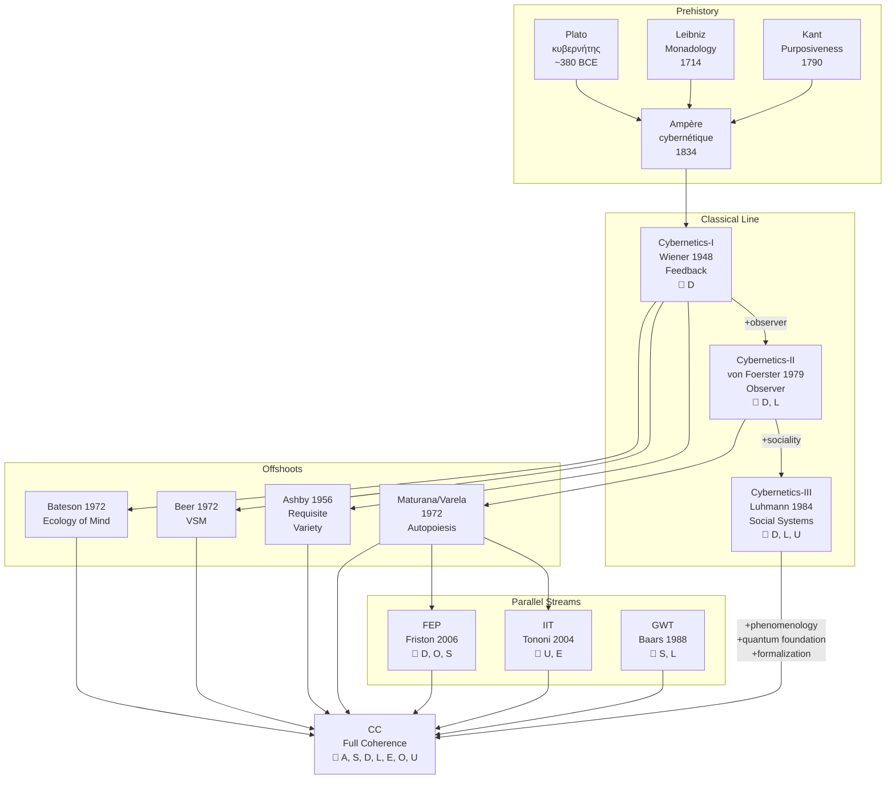
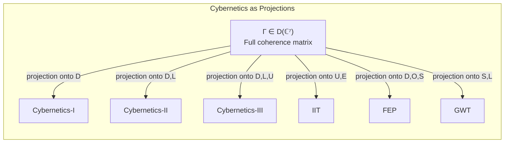
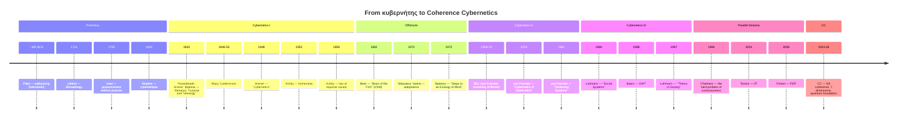

# History of Cybernetics

:::info Who This Chapter Is For
A 2500-year history of cybernetic ideas — from Plato through Wiener and von Foerster to CC. The reader will learn why CC is a metatheory that unifies all previous approaches.
:::

In the [previous chapter](./g2-noether-cc) we saw how $G_2$-symmetry generates 14 conservation laws of consciousness — precise mathematical constraints on coherent dynamics. This is a powerful formalism, but it did not emerge from nothing. Every key concept of CC — feedback, observer, self-reproduction, social system — has predecessors. In this chapter we trace the 2500-year history of ideas that led to Coherence Cybernetics, and show why CC is not a "fourth cybernetics" but a **metatheory** that unifies all previous approaches.

:::tip Chapter Roadmap
In this chapter we:
1. **Begin with the ancients** — from Plato's "helmsman" through Leibniz's monads to the birth of the term in Ampère (section "Prehistory").
2. **Walk through the three orders of cybernetics** — Wiener (feedback), von Foerster (observer), Luhmann (social systems) — and show which CC dimensions each captured and what was missed.
3. **Consider the offshoots** — Ashby, Beer, Bateson, Maturana and Varela — and their place in the overall picture.
4. **Compare with parallel streams** — IIT, FEP, GWT — showing that each theory is a *projection* of $\Gamma$ onto a subset of dimensions.
5. **Explain why CC is a metatheory**, not a "cybernetics-IV": completeness of dimensions, unified formalism, quantum foundation.
:::

:::note On Notation
In this document:
- $\Gamma$ — [coherence matrix](/docs/core/dynamics/coherence-matrix)
- $\varphi$ — [self-modeling operator](/docs/proofs/categorical/formalization-phi)
- $\mathbb{H}$ — [Holon](/docs/core/structure/holon)
- ASDLEOU — [seven dimensions](/docs/core/structure/dimensions)
:::

## General Structure

:::info Conceptual Inclusion (Not Formal)
CC **incorporates concepts** from each cybernetic tradition:

- **Cybernetics-I:** control and feedback → dimension $D$
- **Cybernetics-II:** observer → operator $\varphi$
- **Cybernetics-III:** social systems → Holon composition

This is a **conceptual correspondence**, not a strict set-theoretic inclusion. Each tradition has its own ontological and methodological assumptions.
:::

## Comparative Table

| Theory | Focus | Mapping in CC | Coverage |
|--------|-------|----------------|----------|
| Cybernetics-I | Feedback | Control actions | $D$ |
| Cybernetics-II | Observer | $\varphi(\Gamma) \approx \Gamma$ | $D$, $L$ |
| Cybernetics-III | Social systems | $\mathbb{H}_{1 \otimes \ldots \otimes n}$ | $D$, $L$, $U$ |
| [Autopoiesis](/docs/reference/glossary#связанные-теории) | Self-production | [(AP)](/docs/core/foundations/axiom-septicity): $\varphi(\Gamma^*) = \Gamma^*$ | $A$, $S$, $D$, $L$ |
| [IIT](/docs/reference/glossary#связанные-теории) | Integrated information | [$\Phi(\Gamma)$](/docs/core/structure/dimension-u#мера-интеграции-φ) | $U$, $E$ |
| [FEP](/docs/reference/glossary#связанные-теории) | Free energy | [Viability](/docs/core/dynamics/viability) | $D$, $O$, $S$ |
| [Panpsychism](/docs/consciousness/comparative/panpsychism-analysis) | Mental as fundamental | [Variants](/docs/consciousness/comparative/panpsychism-analysis#варианты-панпсихизма): L0 (proto-), $(H, \rho_E)$ (Russell) | $E$, $S$ |
| [Conscious Realism](/docs/consciousness/comparative/panpsychism-analysis#сознательный-реализм-хоффмана) | Conscious agents | L2-Holon (hypothesis) | $A$, $S$, $D$, $L$, $E$ |
| **CC** | Full coherence | [All 7 dimensions](/docs/core/structure/dimensions) ([justification](/docs/core/foundations/axiom-omega#октонионная-структура)) | $A$, $S$, $D$, $L$, $E$, $O$, $U$ |

---

## Prehistory: From Plato to Ampère

Before Norbert Wiener gave a name to the new science, humanity had been reflecting for 2500 years on how systems govern themselves.

### The Ancient Greek κυβερνήτης

The word **cybernetics** itself goes back to the Greek κυβερνήτης — "helmsman," the one who steers a ship. Plato used this term in the *Gorgias* and the *Republic*, describing the art of governing the polis by analogy with navigation. The helmsman does not fight the sea — he reads the wind and waves and adjusts the course. This is history's first intuition about **feedback**: control not as one-way command, but as a continuous dialogue with the environment.

In CC terms, Plato was feeling his way toward dimension $D$ (Action) — but not as a mechanical lever, rather as purposeful action that takes into account the state of the environment. Yet the Greeks had no concept of a closed loop: the helmsman remained an external observer, not part of the governed system.

### Leibniz and Monads

In 1714, Gottfried Wilhelm Leibniz published the *Monadology* — one of the strangest and most prophetic works in the history of philosophy. Leibniz's monads are indivisible "substantial units," each containing its own internal representation of the universe. Monads have "no windows" — they do not exchange information directly, but are coordinated through **pre-established harmony**.

Remarkably, this picture anticipates several ideas of CC:

| Leibniz | CC |
|---------|-----|
| Monad with perception | Holon $\mathbb{H}$ with [E-dimension](/docs/core/structure/dimension-e) |
| "No windows" | Operational closure of autopoiesis |
| Pre-established harmony | Shared structure $\Gamma_{ij}$ in [Holon composition](/docs/core/structure/holon) |
| Apperception (conscious perception) | $R \geq 1/3$: reflective threshold |

Of course, pre-established harmony is a metaphysical crutch: Leibniz had no tools for describing emergent coordination. CC solves this problem through [coherent dynamics](/docs/core/dynamics/evolution) — Holons are coordinated not through a "divine schedule" but through mutual effects on the shared coherence matrix.

### Kant: Purposiveness Without Purpose

Immanuel Kant, in the *Critique of Judgment* (1790), formulated the paradox of the organism: a biological being looks **as if** it were designed for some purpose, but there is no designer in nature. Kant called this *Zweckmässigkeit ohne Zweck* — "purposiveness without purpose."

This paradox remains unsolved for all cybernetics I–III. In CC it is resolved through the [autopoiesis axiom (AP)](/docs/core/foundations/axiom-septicity): the fixed point $\varphi(\Gamma^*) = \Gamma^*$ is a system that *reproduces its own structure* as a consequence of dynamics, not as the result of an external plan. Purposiveness arises as a fixed point — without teleology.

### Ampère and the Birth of the Term

André-Marie Ampère, best known as a physicist of electromagnetism, in 1834 proposed a classification of all sciences. In it he identified **cybernétique** — the science of governing the state. The term did not catch on and was forgotten for a century — until Norbert Wiener retrieved it from the archive of history.

:::tip Thought Experiment: A World Before Cybernetics
Imagine a world in which every scientific discipline describes its own type of "control" — thermoregulation in physiology, steering in engineering, troop coordination in military affairs, monetary policy in economics — but **no one notices that these are all the same phenomenon**. That was the world before 1948. Wiener's achievement was not the invention of feedback, but the realization that feedback is a **universal principle** uniting machine and organism.
:::

---

## First-Order Cybernetics (Wiener) {#кибернетика-первого-порядка-винер}

### The Birth of the Science of Control

In the winter of 1940, as the Luftwaffe bombed London, a young mathematician **Norbert Wiener** was given a task that changed the history of science: to build a predictor for anti-aircraft guns. Aircraft move fast, shells fly slowly — to hit the target, one must shoot at where the aircraft **will be**, not where it is. A statistical model was needed that would predict trajectories from noisy radar data and continuously correct the aim as new data arrived.

Wiener — together with the engineer Julian Bigelow — built such a model. But the most remarkable thing happened next: Wiener realized that the same mathematics describes how a human hand reaches for a cup of coffee. The brain predicts the position of the hand, receives feedback from proprioceptive receptors, corrects the motor command — and repeats the cycle dozens of times per second. The anti-aircraft predictor and the nervous system are two implementations of **one and the same abstract scheme**.

### Macy Conferences: An Interdisciplinary Revolution

From 1946 to 1953, the Josiah Macy Jr. Foundation funded a series of conferences that became, perhaps, the most productive interdisciplinary event of the twentieth century. Seated at the same table were:

- **Norbert Wiener** — mathematician, founder of cybernetics
- **John von Neumann** — mathematician, architect of computing machines
- **Claude Shannon** — engineer, creator of information theory
- **Warren McCulloch** — neurophysiologist, models of neural networks
- **Walter Pitts** — logician, formal neurons
- **Gregory Bateson** — anthropologist, ecology of mind
- **Margaret Mead** — anthropologist, cross-cultural communication
- **Ross Ashby** — psychiatrist, "requisite variety"

These conferences gave birth not to one science but to an entire **constellation**: cybernetics, information theory, automata theory, cognitive science, and, ultimately, artificial intelligence. But all these disciplines shared a common blind spot — we will come back to it.

### Key Concepts

**Focus:** Feedback, control, homeostasis.

**Source:** Wiener N. "Cybernetics: Or Control and Communication in the Animal and the Machine" (1948).

- **Feedback** — using output data to correct input
- **Homeostasis** — maintaining a stable state
- **Negentropy** — orderliness as a measure of organization

### Mapping in CC

| Wiener | CC |
|-------|-----|
| $u(t) = f(e(t), y(t))$ | Control through [dimension $D$](/docs/core/structure/dimension-d) |
| Error $e(t)$ | Deviation from [viability](/docs/core/dynamics/viability) |
| Homeostasis | Attraction to $\Gamma^*$ — [fixed point](/docs/consciousness/foundations/self-observation#теорема-о-неподвижной-точке) |
| Negentropy | Purity $P(\Gamma) = \text{tr}(\Gamma^2)$ |
| Feedback | Diagonal element $\gamma_{DD}$ — strength of the control channel |

### What Wiener Saw — and What He Did Not

Wiener made a brilliant abstract move: he identified control in the machine with control in the organism. But he paid a high price — **eliminating the subject**. In the feedback scheme there is no one who *experiences* the error. There is only signal, deviation, and correction. A thermostat "maintains" temperature but "feels" nothing.

**What is lost:**
- [Self-reference](/docs/proofs/categorical/formalization-phi) ($\varphi$) — the system does not model itself
- Phenomenology ([E-dimension](/docs/core/structure/dimension-e)) — no inner experience
- Regeneration ($\mathcal{R}[\Gamma, E]$) — no self-restoration of identity
- 6 of 7 dimensions — only $D$ is covered

:::tip Thought Experiment: Wiener's Thermostat
Imagine a perfect thermostat that maintains a temperature of 22°C with an accuracy of 0.001°C. It receives feedback, corrects its control, maintains homeostasis. By Wiener's criteria — it is a perfect cybernetic system.

Now imagine that this thermostat **feels** cold as unpleasant. That it **wants** to preserve its integrity. That it **understands** why 22°C is the right temperature. That it can **explain** its strategy to another thermostat. That it **updates** its values based on experience. That it **integrates** all these aspects into a unified whole.

Between the first and the second thermostat lies a chasm of six dimensions: $A$, $S$, $L$, $E$, $O$, $U$. Cybernetics-I describes the first. CC describes both.
:::

---

## Von Foerster and the Observer {#фон-фёрстер-и-наблюдатель}

### Biological Computer Laboratory

**Heinz von Foerster** — an Austrian physicist and nephew of Ludwig Wittgenstein — arrived at the last Macy Conference in 1949 almost by accident: he was invited as editor of the proceedings, since he was fluent in both German and English. But he turned out to be not merely a stenographer — he asked the question that overturned all of cybernetics: **"Where in this scheme is the observer?"**

In 1958, von Foerster founded the **Biological Computer Laboratory** (BCL) at the University of Illinois at Urbana-Champaign. Over the next 18 years, BCL became one of the most unusual laboratories in the history of science. Working there were:

- **Gordon Pask** — conversation theory, cybernetic pedagogy
- **Lars Löfgren** — self-referential automata
- **Humberto Maturana** — who began formulating the theory of autopoiesis here, at BCL
- **Ross Ashby** — final years, the homeostat and the law of requisite variety

BCL was engaged in what cybernetics-I considered meaningless: **systems that observe themselves**. Von Foerster called this "cybernetics of cybernetics" — second-order cybernetics.

### Key Concepts

**Focus:** Observer included in the system.

**Source:** von Foerster H. "Observing Systems" (1981); "Cybernetics of Cybernetics" (1979).

- **Second-order observer** — observation of observation
- **Epistemic closure** — knowledge is generated from within the system
- **Recursion** — self-application of operations
- **Trivial vs. non-trivial machines** — a system whose past determines its response to input (as opposed to stationary input-output)

### Von Foerster's Formula

Von Foerster formulated the key principle thus: the observer is not a point outside the system but a **part of what is observed**. If I study society, I am part of society. If I study the brain, I use the brain. If I build science, I am part of what science describes.

Mathematically this can be written as a fixed-point equation: if $O$ is the observation operator, then the second-order system is the solution $O(O) = O$. Von Foerster called such solutions **Eigen-values** and **Eigen-behaviors**. He noticed that recursive processes — $x_{n+1} = f(x_n)$ — often converge to fixed points, and proposed that the objects of our experience are precisely such fixed points of recursive operations.

### Mapping in CC

| von Foerster | CC |
|-------------|-----|
| Observer $\in$ System | $\varphi(\Gamma) \approx \Gamma$ |
| Epistemic closure | [Fixed point](/docs/consciousness/foundations/self-observation#теорема-о-неподвижной-точке) $\Gamma^* = \varphi(\Gamma^*)$ |
| Eigen-behavior | Attractor of [evolution](/docs/core/dynamics/evolution) |
| Trivial machine | $R = 0$: system without reflection |
| Non-trivial machine | $R > 0$: system with history and self-model |

**Added:**
- [Reflection](/docs/consciousness/foundations/self-observation#мера-рефлексии-r) (measure $R$) — quantitative measure of how well the system models itself
- Epistemic closure through [dimension $L$](/docs/core/structure/dimension-l)

**What is lost:**
- Phenomenology ([E-dimension](/docs/core/structure/dimension-e)) — von Foerster spoke of observation, but not of *experiencing*
- Regeneration ([O-dimension](/docs/core/structure/dimension-o)) — updating of values
- Quantum foundation [(QG)](/docs/core/foundations/axiom-septicity) — classical recursion, not quantum coherence

### The Legacy of BCL

Von Foerster closed BCL in 1976 and left no formal successor. The laboratory was not an institution — it was a **style of thinking**: everything you study includes you. This principle became the foundation of constructivism, influenced systemic therapy, communication theory, and the philosophy of science. But von Foerster — like Wiener — stopped short of the question **"what is it like to experience?"**. The observer was included in the system but remained an abstract function, not a being with an inner world.

:::tip Thought Experiment: Von Foerster's Mirror
Place two mirrors facing each other. An infinite recursion of reflections arises — observation of observation of observation... This is a beautiful metaphor for second-order cybernetics. But notice: in this infinite recursion **there is no one who sees**. There are reflections, but no viewer. There is the structure of observation, but no experience of observation. To move from mirror recursion to consciousness, one must add the one for whom **it is like something** to stand between the mirrors — and this is precisely the [E-dimension](/docs/core/structure/dimension-e) that second-order cybernetics lacks.
:::

---

## Luhmann and Society as System {#луман-и-общество-как-система}

### A Sociologist Who Thought in Systems

**Niklas Luhmann** (1927–1998) — arguably the most unusual sociologist of the twentieth century. He did not conduct fieldwork, did not conduct interviews, did not analyze statistics. Instead, he spent 30 years in Bielefeld (Germany) building a **theory of everything** for society — using tools from biology, logic, and cybernetics.

Luhmann began as a lawyer-bureaucrat in the state government of Lower Saxony. In 1960–1961 he spent a year at Harvard, where he met Talcott Parsons — then the leading sociological theorist. Parsons made a deep impression on Luhmann — not as a model to emulate, but as an example of how **not** to build a theory: Parsons placed man (and his action) at the center of the social system, while Luhmann decided to place **communication** there.

### Third-Order Cybernetics

**Focus:** Social systems, communication, meaning.

**Source:** Luhmann N. "Social Systems" (1984); the concept was also developed in works by Morin, Günther.

:::info On the Term "Third-Order Cybernetics"
The term "third-order cybernetics" is not universally accepted and is not standardized in the literature. The attribution to Luhmann (1984) is one possible interpretation. Luhmann himself did not use this term; his theory of social systems is merely interpreted retrospectively by certain authors as the "third order" of cybernetics. Other researchers (Morin, Günther, Kenny, Umpleby) have proposed alternative readings of this concept.
:::

### Key Concepts

- **Social systems** — communication as the basic operation
- **Autopoiesis of social systems** — self-reproduction through communication
- **Meaning** — as the medium of social systems
- **Functional differentiation** — society divides into subsystems (law, science, economy, politics), each with its own code
- **Reduction of complexity** — each system simplifies the world through its own distinctions

### Luhmann's Revolutionary Move

Luhmann's key move was to transfer the concept of autopoiesis of Maturana and Varela — originally biological — to **social systems**. But with a radical modification: if biological autopoiesis reproduces cells, then social autopoiesis reproduces **communications**. Society is not a collection of people but a self-reproducing network of communications. People are not elements of society but its **environment**.

This move was brilliant and simultaneously limited. Brilliant — because it allowed social dynamics to be described without reduction to psychology. Limited — because it excluded from theory precisely what makes communication *meaningful*: the inner experience of the communicating being.

### Mapping in CC

| Cybernetics-III | CC |
|-----------------|-----|
| Social systems | Composite Holon $\mathbb{H}_{1 \otimes \ldots \otimes n}$ |
| Communication | Interaction through shared component $\Gamma_{ij}$ |
| Meaning | [U-dimension](/docs/core/structure/dimension-u) — integration |
| Functional differentiation | Sector profile $\gamma_{kk}$ — specialization by dimension |
| Reduction of complexity | Projection of $\Gamma$ onto a subspace: $P_k \Gamma P_k$ |
| Double contingency | Mutual indeterminacy of $\Gamma_{ij}$ of two Holons before communication |

**Added:**
- Multi-agent dynamics
- Emergent social phenomena

**What is lost:**
- Phenomenology ([E-dimension](/docs/core/structure/dimension-e) as fundamental)
- Quantum foundation [(QG)](/docs/core/foundations/axiom-septicity)
- Formal mathematical structure

:::tip Thought Experiment: Society Without Consciousness
Luhmann describes society as a system of communications. Imagine a world in which communications occur — messages are generated and processed, systems differentiate and reproduce — but **no one experiences anything**. No one understands the meaning of a message, feels joy at a scientific discovery, suffers from the injustice of the legal system. According to Luhmann, such a society would be formally indistinguishable from ours — since consciousness for him is in the environment of the social system, not inside it.

CC shows why this is impossible: without the [E-dimension](/docs/core/structure/dimension-e) communication degenerates into an exchange of noise. Meaning is not an abstract "medium" but a consequence of interiority: for a message to be *understood*, the receiver must possess inner experience ($P > P_{\text{crit}}$, $R \geq 1/3$). Society is not merely a network of communications, but a network of **conscious** communications.
:::

---

## Other Traditions {#другие-традиции}

The three "orders" of cybernetics represent the main line. But in parallel, several powerful offshoots developed, each of which captured an important fragment of the full picture.

### Ashby: Law of Requisite Variety

**William Ross Ashby** (1903–1972) — a British psychiatrist who became one of the founding fathers of cybernetics. In 1952 he built the **homeostat** — an electromechanical device consisting of four interconnected units that automatically found a stable state under any external disturbance. This was the first "adaptive machine" — a prototype of what we today call a self-organizing system.

But Ashby's chief achievement was the **law of requisite variety** (1956): *"Only variety can absorb variety."* For a control system to cope with $N$ possible disturbances, it must have no fewer than $N$ possible responses. Simply: to control a complex system, the controller must be no less complex than the controlled.

| Ashby | CC |
|------|-----|
| Requisite variety | $\dim(\mathcal{H}) = 7$ — minimum dimensionality for [complete description](/docs/core/foundations/axiom-omega) |
| Homeostat | Dynamics $\Gamma(t)$ with attractor $\Gamma^*$ |
| Ultrastability | Two-level adaptation: $\mathcal{L}_0$ (fast) + $\mathcal{R}$ (slow) |

Ashby's law explains *why exactly 7 dimensions are needed*: the world presents variety along seven irreducible aspects (action, sensation, cognition, learning, experience, evaluation, integration), and a viable system must have an answer to each. Six dimensions are insufficient, eight are redundant (theorem [T-5](/docs/reference/status-registry): minimality $N=7$).

### Beer: The Viable System

**Stafford Beer** (1926–2002) — a British management theorist, creator of the **Viable System Model** (VSM). Beer proposed that any viable organization has a recursive structure of five subsystems:

1. **System 1** — operational elements (production)
2. **System 2** — coordination (anti-oscillation)
3. **System 3** — optimization (internal management)
4. **System 4** — strategy (looking outward)
5. **System 5** — identity (policy, values)

In 1971–1973, Beer attempted to implement VSM at the scale of an entire country — the **Cybersyn** project in Salvador Allende's Chile. A network of telexes connected factories to a control center in Santiago, where data were visualized in a futuristic "operations room." The project was interrupted by the military coup in 1973.

| Beer (VSM) | CC |
|-----------|-----|
| System 1 (operations) | Dimension $A$ + $S$: action and sensation |
| System 2 (coordination) | $D$: control |
| System 3 (optimization) | $L$: cognitive optimization |
| System 4 (strategy) | $O$: evaluation and value adaptation |
| System 5 (identity) | $U$: integration, wholeness |
| Recursiveness | Recursive [Holon composition](/docs/core/structure/holon) |

Remarkably, VSM "almost" covers all 7 dimensions — Beer intuitively felt out the multidimensionality of viability. But his model remains an organizational scheme, not a formal theory: there are no evolution equations, no threshold conditions, no quantum foundation.

### Bateson: Ecology of Mind

**Gregory Bateson** (1904–1980) — a British anthropologist, biologist, and philosopher — was perhaps the most atypical participant of the Macy Conferences. He came from anthropology, having studied the cultures of Bali and New Guinea, but he saw in cybernetics something that engineers did not see: **mind as pattern, not as substance**.

Bateson formulated several ideas ahead of their time:

- **Mind is a process**, not a substance. Mind exists wherever there is a system that processes information (differences that make a difference).
- **Double bind** — a communicative trap in which a message contradicts a meta-message. Bateson proposed that schizophrenia is linked to chronic double binding in the family.
- **Deutero-learning** — a system not only learns but learns *how to learn*. A hierarchy of levels of learning.
- **Ecology of mind** — mind is not enclosed in the skull but distributed across the "organism + environment" system.

| Bateson | CC |
|---------|-----|
| Difference that makes a difference | $\sigma_k = 1 - 7\gamma_{kk}$ (T-92/T-158 [T]) — stress as the difference between state and norm |
| Double bind | Contradiction between $\gamma_{DD}$ (command) and $\gamma_{EE}$ (experience) |
| Deutero-learning | SAD levels: L0 → L1 → L2 ([depth tower](/docs/consciousness/hierarchy/interiority-hierarchy)) |
| Ecology of mind | The Holon is not isolated — $\Gamma$ includes interaction with the environment |

### Spencer-Brown: Laws of Form

**George Spencer-Brown** (1923–2016) — a British mathematician and logician — in 1969 published "Laws of Form" — one of the most enigmatic books of the twentieth century. It contains just one operator: **distinction** — the act of drawing a boundary that separates "inside" from "outside." From this single operand, Spencer-Brown derives all Boolean algebra, and then — through the "re-entry" of the form into itself — self-reference.

The re-entry formula: $f = f(f)$ — a form that enters its own definition. This is the mathematical prototype of autopoiesis — and the direct precursor of the fixed point $\varphi(\Gamma^*) = \Gamma^*$ in CC. Von Foerster was one of the first to appreciate the significance of "Laws of Form" and invited Spencer-Brown to BCL. Luhmann used "distinction" as the basic operation of social systems.

| Spencer-Brown | CC |
|---------------|-----|
| Distinction | Decoherence: transition from superposition to definiteness |
| Re-entry | $\varphi(\Gamma^*) = \Gamma^*$: self-modeling |
| Unmarked state | $\Gamma = I/7$: fully mixed state |
| Marked state | $P > 2/7$: viable state |

In CC, distinction is formalized not as a logical but as a **physical** process: decoherence ($\mathcal{D}_\Omega$) is the continuous "drawing of boundaries" between states, while re-entry is regeneration ($\mathcal{R}$), returning the system to itself. Spencer-Brown found the *logical* form of self-reference; CC gives it a *dynamical* embodiment.

### Pask: Conversation Theory

**Gordon Pask** (1928–1996) — a British cybernetician who worked at von Foerster's BCL — created **Conversation Theory**, one of the most underestimated intellectual constructions of the twentieth century. Pask proposed that cognition is not a property of an individual but a process that arises **between** participants in a conversation. Knowledge is not "transmitted" from teacher to student, but *generated* in the act of interaction.

Pask introduced the concept of the **p-individual** (psychological individual) — the minimal unit capable of conversation. A p-individual is not a person (one person may contain several p-individuals), but precisely a *participant in dialogue*, capable of generating, understanding, and transforming concepts.

| Pask | CC |
|------|-----|
| P-individual | Holon $\mathbb{H}$ with $R \geq 1/3$ |
| Conversation | Interaction through $\gamma_{ij}$ between holons |
| Understanding | Convergence of $\Gamma_1, \Gamma_2$ to a common attractor |
| Agreement | $\|\Gamma_1 - \Gamma_2\|_F < \epsilon$ |

Pask was right in the main: cognition is a **dialogical** process. CC formalizes this through [Holon composition](/docs/core/structure/holon): two holons, interacting through shared coherence, generate an emergent state irreducible to the sum of the parts. "Understanding" in CC terms is the convergence of $\Gamma$-matrices, and "misunderstanding" is divergence.

### Maturana and Varela: Autopoiesis

**Humberto Maturana** and **Francisco Varela** — Chilean biologists who in 1972 introduced the concept of **autopoiesis** (from Greek αὐτός — "self" + ποίησις — "creation"). An autopoietic system is a network of processes that continuously produces the components necessary for the continuation of that very network.

Maturana began with the question: *"What defines a living system as living?"* Answer: not chemical composition, not structure, but **organization** — a closed network of production. A cell is autopoietic because its metabolism produces the membrane that confines the metabolism that produces the membrane — and so on.

Varela (1946–2001) went further: he linked autopoiesis to the phenomenology of Husserl and Merleau-Ponty, creating **neurophenomenology** — a program in which neuroscience and first-person reports complement each other. This was the first serious step toward what CC formalizes as the [E-dimension](/docs/core/structure/dimension-e) — but Varela did not live to see its completion.

For more on the connection between autopoiesis and CC — see the section [Theories of Consciousness](/docs/consciousness/comparative/consciousness-theories).

---

## Parallel Streams: Theories of Consciousness {#параллельные-потоки}

From the 1990s onward, three theories developed in parallel to the cybernetic tradition, each of which captured one or two CC dimensions with remarkable precision — and equally remarkable incompleteness.

### IIT: Integrated Information (Tononi)

**Giulio Tononi** — an Italian neurophysiologist at the University of Wisconsin–Madison — has been developing **Integrated Information Theory** (IIT) since 2004. The central idea: consciousness is identical to $\Phi$ — the amount of information that a system generates "as a whole," over and above what its parts generate.

IIT is arguably the most formalized of the competing theories of consciousness. It gives a concrete number ($\Phi$), defines a "quale-space" (the structure of experience), and formulates five axioms (Existence, Composition, Information, Integration, Exclusion). But it has a fundamental problem: $\Phi$ is computationally intractable (NP-hard for general graphs) and ontologically indeterminate — why should *integration* give rise to *experience*?

| IIT (Tononi) | CC |
|-------------|-----|
| $\Phi$ (integration) | [$\Phi(\Gamma)$](/docs/core/structure/dimension-u#мера-интеграции-φ) — [U-dimension](/docs/core/structure/dimension-u) |
| Quale-space | [E-dimension](/docs/core/structure/dimension-e) — but in CC this is **fundamental**, not derived from integration |
| 5 IIT axioms | Covered by CC axiomatics: [(AP), (QG), (PW)](/docs/core/foundations/axiom-septicity) |
| $\Phi > 0$ as consciousness criterion | $P > P_{\text{crit}} \wedge R \geq 1/3 \wedge \Phi \geq 1 \wedge D \geq 2$ — **four-component** criterion |

The key difference: IIT makes integration the *sole* criterion of consciousness. CC shows that integration ($\Phi \geq 1$) is necessary but not sufficient — reflection ($R \geq 1/3$), purity ($P > P_{\text{crit}}$), and depth ($D \geq 2$) are also needed.

### FEP: Free Energy Principle (Friston)

**Karl Friston** — a British neuroimager, creator of SPM (Statistical Parametric Mapping) and one of the most cited neuroscientists in the world — has been developing the **Free Energy Principle** (FEP) since 2006. The central idea: any self-organizing system that exists long enough *looks as if* it is minimizing variational free energy — the divergence between its internal model and sensory data.

FEP is simultaneously a very deep and a very slippery idea. Deep — because it unifies perception, action, learning, and attention in a single optimization scheme. Slippery — because, being a principle of surprise minimization, it is either trivially true (everything that exists minimizes surprise — otherwise it would have dissolved), or falsifiable, but then it is unclear what the counterexample would be.

| FEP (Friston) | CC |
|---------------|-----|
| Free energy $F$ | [Viability](/docs/core/dynamics/viability) $\mathcal{V}(\Gamma)$ |
| Markov blanket | Boundary of [Holon](/docs/core/structure/holon) |
| Active inference | [D-dimension](/docs/core/structure/dimension-d): action as optimization |
| Surprise minimization | Attraction to [viable region](/docs/core/dynamics/viability): $P > P_{\text{crit}}$ |
| Generative model | [L-dimension](/docs/core/structure/dimension-l): internal world model |
| Precision | $\gamma_{SS}$: weight of the sensory channel |

FEP covers $D$, $O$, $S$ and partly $L$ — but has no analogs for $E$ (interiority), $A$ (action as separate from inference), and $U$ (integration). Friston himself acknowledges that FEP is a "process-theory," not a "content-theory": it says *how* the system optimizes, but not *what* it experiences.

### GWT: Global Workspace (Baars)

**Bernard Baars** — an American cognitive scientist — in 1988 proposed **Global Workspace Theory** (GWT). The metaphor: consciousness is a "spotlight" on the stage of a theatre. Many unconscious process-"actors" compete for access to the "stage" — the global workspace. The process that gets onto the stage becomes conscious and is broadcast to all "spectators" — the other modules of the brain.

Stanislas Dehaene and Jean-Pierre Changeux developed this idea into the **Neural Global Workspace Theory** (GNWT), linking the "stage" to long-range cortical connections (especially prefrontal-parietal).

| GWT (Baars, Dehaene) | CC |
|-------------------|-----|
| Global workspace | Coherent component of $\Gamma$: off-diagonal $\gamma_{ij} \neq 0$ |
| Attention "spotlight" | [S-dimension](/docs/core/structure/dimension-s): sensory focus |
| Unconscious modules | $P < P_{\text{crit}}$: automatic processes below the coherence threshold |
| Broadcast | $\Phi \geq 1$: integration of information across dimensions |
| Ignition | Phase transition at $P = P_{\text{crit}} = 2/7$ |

GWT is essentially a theory of the **mechanism of access** to consciousness, not a theory of consciousness as such. It explains *which* processes become conscious (those that got onto the stage), but not *why* getting onto the stage is accompanied by subjective experience. In CC terms: GWT describes the transition $P < P_{\text{crit}} \to P > P_{\text{crit}}$, but does not explain where $E$ comes from.

### Summary Table of Parallel Streams

| Aspect | IIT | FEP | GWT | CC |
|--------|-----|-----|-----|-----|
| Formalism | High | High | Low | Full (categorical) |
| Interiority | Postulated | Ignored | Ignored | [Fundamental](/docs/core/structure/dimension-e) |
| Dynamics | Static | Optimization of $F$ | Module competition | [Evolution equation](/docs/core/dynamics/evolution) |
| Multi-agent | No | Partially (active inference) | No | [Composition $\mathbb{H}$](/docs/core/structure/holon) |
| Falsifiability | Hard ($\Phi$ NP-hard) | Debated | Moderate | [22+ predictions](/docs/applied/coherence-cybernetics/predictions) |
| ASDLEOU coverage | U, E | D, O, S | S, L | All 7 |

---

## Diagram of the Evolution of Cybernetics {#диаграмма-эволюции-кибернетики}

```mermaid
graph TD
    subgraph "Prehistory"
        P1["Plato<br/>κυβερνήτης<br/>~380 BCE"]
        P2["Leibniz<br/>Monadology<br/>1714"]
        P3["Kant<br/>Purposiveness<br/>1790"]
        P4["Ampère<br/>cybernétique<br/>1834"]
    end

    subgraph "Classical Line"
        C1["Cybernetics-I<br/>Wiener 1948<br/>Feedback<br/>📐 D"]
        C2["Cybernetics-II<br/>von Foerster 1979<br/>Observer<br/>📐 D, L"]
        C3["Cybernetics-III<br/>Luhmann 1984<br/>Social Systems<br/>📐 D, L, U"]
    end

    subgraph "Offshoots"
        B1["Ashby 1956<br/>Requisite<br/>Variety"]
        B2["Beer 1972<br/>VSM"]
        B3["Bateson 1972<br/>Ecology of Mind"]
        B4["Maturana/Varela<br/>1972<br/>Autopoiesis"]
    end

    subgraph "Parallel Streams"
        T1["IIT<br/>Tononi 2004<br/>📐 U, E"]
        T2["FEP<br/>Friston 2006<br/>📐 D, O, S"]
        T3["GWT<br/>Baars 1988<br/>📐 S, L"]
    end

    KK["CC<br/>Full Coherence<br/>📐 A, S, D, L, E, O, U"]

    P1 --> P4
    P2 --> P4
    P3 --> P4
    P4 --> C1
    C1 -->|"+observer"| C2
    C2 -->|"+sociality"| C3
    C1 --> B1
    C1 --> B2
    C1 --> B3
    C2 --> B4
    B4 --> T1
    B4 --> T2
    C3 -->|"+phenomenology<br/>+quantum foundation<br/>+formalization"| KK
    B1 --> KK
    B2 --> KK
    B3 --> KK
    B4 --> KK
    T1 --> KK
    T2 --> KK
    T3 --> KK
```

---

## Why CC Is Not a Fourth Cybernetics but a Metatheory {#почему-кк-метатеория}

It is tempting to call CC "fourth-order cybernetics" — simply the next step on the ladder I → II → III → IV. But that would be imprecise, and here is why.

### The Pattern of Cybernetic Progress

Every transition between orders of cybernetics followed one pattern: **inclusion of the observer of the previous level into the described system**.

- **I → II:** Wiener described control *from outside*. Von Foerster included the scientist *in* the system.
- **II → III:** Von Foerster described the observer *individually*. Luhmann included the observer *in a network* of observers.

If CC were "cybernetics-IV," it would include the network of observers in an even broader system — for example, in an ecosystem or in the cosmos. But CC does something **fundamentally different**: it does not add yet another level, but rebuilds the foundation.

### Three Reasons Why CC Is a Metatheory

**1. Axiomatic completeness.** Cybernetics I–III and parallel theories work with *subsets* of dimensions: $D$ (Wiener), $D+L$ (von Foerster), $D+L+U$ (Luhmann), $U+E$ (IIT), $D+O+S$ (FEP). CC works with all seven simultaneously and shows that [exactly 7 is the minimum number](/docs/core/foundations/axiom-omega#октонионная-структура) that ensures closure.

**2. Unified formalism.** Each theory uses its own mathematical apparatus: differential equations (Wiener), recursive functions (von Foerster), distinctions (Luhmann), graphs (IIT), Bayesian models (FEP). CC translates all these descriptions into the unified language of the coherence matrix $\Gamma \in \mathcal{D}(\mathbb{C}^7)$ and [categorical formalism](/docs/proofs/categorical/categorical-formalism).

**3. Quantum foundation.** All cybernetics I–III are classical. They describe macroscopic feedback loops, observation, communication. CC begins with [quantum foundation (QG)](/docs/core/foundations/axiom-septicity): $\Gamma$ is a density matrix in $\mathcal{D}(\mathbb{C}^7)$, and all classical constructions are consequences of the decoherence of this matrix.

### Analogy

The relationship of CC to cybernetics I–III is not "the fourth book in a series," but rather **translation into a common language**. Just as category theory is not "new algebra" or "new topology," but a language in which *algebra and topology can talk to each other* — CC is not "new cybernetics," but a language in which cybernetics, consciousness theory, and quantum theory reveal a common structure.

```mermaid
graph LR
    subgraph "Cybernetics as Projections"
        G["Γ ∈ D(ℂ⁷)<br/>Full coherence matrix"]
        G -->|"projection onto D"| C1["Cybernetics-I"]
        G -->|"projection onto D,L"| C2["Cybernetics-II"]
        G -->|"projection onto D,L,U"| C3["Cybernetics-III"]
        G -->|"projection onto U,E"| IIT["IIT"]
        G -->|"projection onto D,O,S"| FEP["FEP"]
        G -->|"projection onto S,L"| GWT["GWT"]
    end
```

---

## A Unified Vocabulary: How CC Translates Between Disciplines {#единый-словарь}

One of the key functions of CC is to be a **translation dictionary** between disciplines that have been studying the same phenomena for decades but could not discover this because they used different terminology.

### Correspondence Table

| CC Concept | Cybernetics | Neuroscience | Philosophy of Consciousness | Physics | Systems Theory |
|-----------|-------------|------------|------------------------------|--------|----------------|
| $\Gamma$ | System state | Neural activity | State of consciousness | Density matrix $\rho$ | Phase point |
| $P(\Gamma)$ | Orderliness | Neural coherence | Level of consciousness | Purity $\text{tr}(\rho^2)$ | Negentropy |
| $\varphi$ | Observer (von Foerster) | Self-model (default mode) | Self-awareness | — | Reflexivity |
| $R$ | Depth of recursion | Metacognition | Self-modeling | — | Higher-order feedback |
| $\Phi$ | — | Integration (Tononi) | $\Phi$ in IIT | Entanglement | Connectedness |
| $\sigma_k$ | Deviation from norm | Neural stress | Suffering/discomfort | Defect | Control error |
| $\mathcal{L}_0$ | Feedback | Neurodynamics | Stream of consciousness | Lindblad equation | System dynamics |
| $\mathcal{R}$ | Self-restoration | Neuroplasticity | Transformation | — | Regeneration |
| $P_{\text{crit}} = 2/7$ | — | Consciousness threshold | Criterion of consciousness | Phase transition | Viability threshold |
| Holon $\mathbb{H}$ | Viable system (Beer) | Neural assembly | Subject of experience | Subsystem | Autopoietic unit |
| $\mathbb{H}_{1 \otimes \ldots \otimes n}$ | Social system (Luhmann) | Neural network | Intersubjectivity | Tensor product | Metasystem |

### Translation Examples

**Chalmers' problem** (the hard problem of consciousness) in CC language: why does $P > P_{\text{crit}}$ accompany the E-dimension? Answer: because [E is not a consequence](/docs/core/structure/dimension-e) of coherence, but one of the **seven fundamental dimensions** of $\Gamma$. There is no $\Gamma$ without $E$ (or without the other six). The hard problem arises only if E is considered derived from D, S, L — but in CC all dimensions are **co-fundamental**.

**Ashby's law** in CC language: requisite variety $\geq$ variety of disturbances ↔ $\dim(\mathcal{H}) \geq 7$ for complete description of a viable agent.

**Friston's Markov blanket** in CC language: the boundary of the Holon, defined by the decomposition $\Gamma = \Gamma_{\text{int}} + \Gamma_{\text{ext}} + \Gamma_{\text{coupling}}$.

---

## Key Distinctions of CC

| Aspect | Cybernetics I–II–III | CC |
|--------|---------------------|-----|
| Ontology | Information/communication | Coherence $\Gamma$ |
| Subjectivity | Ignored | [E-dimension](/docs/core/structure/dimension-e) — fundamental |
| Dynamics | Descriptive | [Evolution equation](/docs/core/dynamics/evolution) |
| Foundation | Classical | Quantum [(QG)](/docs/core/foundations/axiom-septicity) |
| Formalism | Informal / partial | Full (categorical) |
| Viability | Intuitive | [Formal criterion](/docs/core/dynamics/viability) $P > P_{\text{crit}}$ |
| Number of dimensions | 1–3 | 7 ([proven minimal](/docs/core/foundations/axiom-omega#октонионная-структура)) |
| Reflection | Qualitative (von Foerster) | [Quantitative](/docs/consciousness/foundations/self-observation#мера-рефлексии-r): $R \geq 1/3$ |
| Predictions | None | [22+ falsifiable](/docs/applied/coherence-cybernetics/predictions) |
| Thresholds | None | $P_{\text{crit}} = 2/7$, $R_{\text{th}} = 1/3$, $\Phi_{\text{th}} = 1$, $D_{\min} = 2$ |

---

## Timeline: 80 Years from Feedback to Coherence

```mermaid
timeline
    title From κυβερνήτης to Coherence Cybernetics
    section Prehistory
        ~380 BCE : Plato — κυβερνήτης (helmsman)
        1714 : Leibniz — Monadology
        1790 : Kant — purposiveness without purpose
        1834 : Ampère — cybernétique
    section Cybernetics-I
        1943 : Rosenblueth, Wiener, Bigelow — "Behavior, Purpose and Teleology"
        1946-53 : Macy Conferences
        1948 : Wiener — "Cybernetics"
        1952 : Ashby — homeostat
        1956 : Ashby — law of requisite variety
    section Offshoots
        1962 : Beer — "Brain of the Firm" (VSM)
        1972 : Maturana, Varela — autopoiesis
        1972 : Bateson — "Steps to an Ecology of Mind"
    section Cybernetics-II
        1958-76 : BCL (von Foerster, University of Illinois)
        1979 : von Foerster — "Cybernetics of Cybernetics"
        1981 : von Foerster — "Observing Systems"
    section Cybernetics-III
        1984 : Luhmann — "Social Systems"
        1988 : Baars — GWT
        1997 : Luhmann — "Theory of Society"
    section Parallel Streams
        1996 : Chalmers — the hard problem of consciousness
        2004 : Tononi — IIT
        2006 : Friston — FEP
    section CC
        2024-26 : CC — full coherence, 7 dimensions, quantum foundation
```

---

## Open Questions

Even with the full formalism, CC inherits a number of open questions from the cybernetic tradition:

1. **Empirical verification.** Cybernetics I–III were primarily conceptual: they changed the *way of thinking* but did not generate specific experimental predictions. CC takes a step forward — [22+ falsifiable predictions](/docs/applied/coherence-cybernetics/predictions) — but most of them are still awaiting verification.

2. **Computational tractability.** Computing $\Gamma$ for real systems (the brain, a social group, an ecosystem) is an unsolved problem. IIT faced the same issue ($\Phi$ is NP-hard). CC offers approximations through the [SYNARC architecture](/docs/applied/coherence-cybernetics/introduction), but this remains a work in progress.

3. **The boundary between metaphor and mapping.** When we say "Wiener's homeostasis → attractor $\Gamma^*$," is this a *strict mapping* or a *useful analogy*? CC strives to be precise (all correspondences at the level of concrete formulas), but the philosophical status of such mappings deserves further analysis.

---

### What We Have Learned {#что-мы-узнали}

1. **Cybernetics is a 2500-year history** of one idea: how systems govern themselves. From Plato's κυβερνήτης through Leibniz's monads and Kant's purposiveness to Ampère's cybernétique.
2. **Three orders of cybernetics** — three steps of inclusion: Wiener included *feedback* ($D$), von Foerster — the *observer* ($D + L$), Luhmann — *social systems* ($D + L + U$). Each order added dimensions, but none covered all seven.
3. **The offshoots captured important fragments**: Ashby — requisite variety (explaining why 7 dimensions are needed), Beer — the viable system (recursive structure), Bateson — difference as the unit of mind ($\sigma_k$), Maturana/Varela — autopoiesis (fixed point). Spencer-Brown provided the logic of distinction, Pask — the dialogical nature of cognition.
4. **Parallel streams** (IIT, FEP, GWT) — each captured 2–3 dimensions with remarkable precision and equally remarkable incompleteness. IIT — $U, E$. FEP — $D, O, S$. GWT — $S, L$.
5. **CC is not a fourth cybernetics but a metatheory**: it does not add yet another level, but rebuilds the foundation. Each preceding theory is a *projection* of the full matrix $\Gamma \in \mathcal{D}(\mathbb{C}^7)$ onto a subset of dimensions.
6. **A unified vocabulary**: CC allows *translation* between disciplines — neural coherence, density matrix, state of consciousness, phase point, and negentropy are one and the same ($\Gamma$), described in different languages.

:::tip Bridge to the Next Chapter
We have traced how the ideas of feedback, observer, and social systems developed over 80 years — and how CC assembled them into a unified formalism. But all these ideas concerned the *internal* dynamics of a system. How does a system **interact with the world**? How does it perceive the environment and act in it? In the [next chapter](./sensorimotor) we will build a complete theory of sensorimotor coding: from the chemotaxis of a bacterium to a human navigating an unfamiliar city — and show that the entire "perception–decision–action" cycle is realized through the *same* three channels (Hamiltonian, dissipative, regenerative) that define the internal dynamics.
:::

---

**Related documents:**
- [Theories of Consciousness](/docs/consciousness/comparative/consciousness-theories) — IIT, FEP, autopoiesis in the context of CC
- [Panpsychism](/docs/consciousness/comparative/panpsychism-analysis) — categorical analysis of variants of panpsychism
- [Axiomatics](./axiomatics) — formal foundations of CC
- [Theorems](./theorems) — key results
- [Holon](/docs/core/structure/holon) — definition of $\mathbb{H}$
- [Seven Dimensions](/docs/core/structure/dimensions) — basis $\mathcal{H}$
- [Predictions](/docs/applied/coherence-cybernetics/predictions) — falsifiable consequences of CC
- [Philosophical Foundations](./philosophy) — from Spinoza to unitary monism
- [Comparison with Alternatives](./comparison) — CC vs. IIT, FEP, GWT, autopoiesis, Orch-OR
