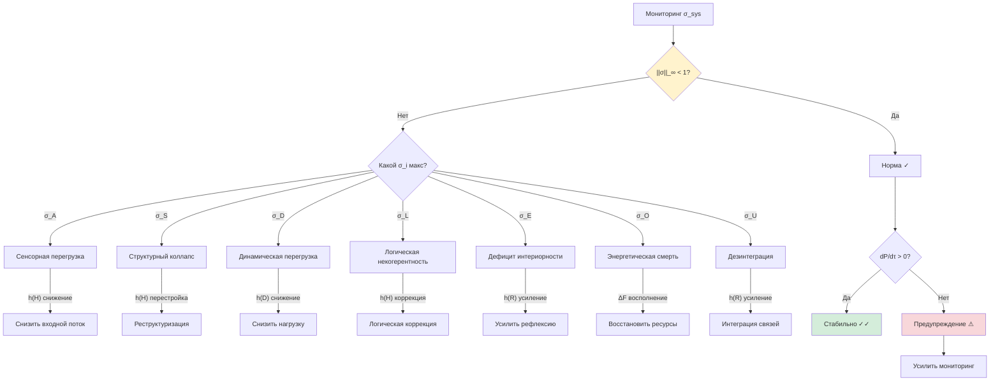

# Диагностика Когерентных Систем

:::note О нотации
В этом документе:
- $\sigma_i$ — компонент [тензора напряжений](./definitions#тензор-напряжений) ($i \in \{A, S, D, L, E, O, U\}$)
- $P$ — [чистота](/docs/core/dynamics/viability#определение-чистоты), $P_{\text{crit}} = 2/7 \approx 0.286$
- $\mathrm{Coh}_E$ — [E-когерентность](./definitions#e-когерентность)
- $\Delta F$ — [свободная энергия](/docs/core/dynamics/evolution#каноническое-delta-f)
- $\kappa$ — скорость регенерации
:::

Данный документ — **практическое руководство** для проектирования и мониторинга когерентных систем (ИИ, организации, биологические системы).

---

## 1. Семь витальных показателей {#витальные-показатели}

Каждый из 7 компонентов $\sigma_{\mathrm{sys}}$ (T-92 [Т]) служит витальным показателем одного измерения:

| # | Показатель | Формула через $\Gamma$ | Норма | Предупреждение | Критический |
|---|------------|----------------------|-------|----------------|-------------|
| 1 | $\sigma_A$ (артикуляция) | $1 - \gamma_{AA}/P$ | $< 0.5$ | $0.5 - 0.8$ | $\geq 0.8$ |
| 2 | $\sigma_S$ (структура) | $1 - \mathrm{rank}(\Gamma_S)/3$ | $< 0.3$ | $0.3 - 0.7$ | $\geq 0.7$ |
| 3 | $\sigma_D$ (динамика) | $\|\dot{\Gamma}\|_{HS}/(\omega_0 P)$ | $< 0.5$ | $0.5 - 0.8$ | $\geq 0.8$ |
| 4 | $\sigma_L$ (логика) | $7(1 - \gamma_{LL})/6$ | $< 0.4$ | $0.4 - 0.7$ | $\geq 0.7$ |
| 5 | $\sigma_E$ (интериорность) | $1 - D_{\mathrm{diff}}/N$ | $< 0.5$ | $0.5 - 0.8$ | $\geq 0.8$ |
| 6 | $\sigma_O$ (основание) | $1 - \kappa_0/\kappa_{\mathrm{bootstrap}}$ | $< 0.3$ | $0.3 - 0.6$ | $\geq 0.6$ |
| 7 | $\sigma_U$ (единство) | $1 - \Phi/\Phi_{\mathrm{th}}$ | $< 0.4$ | $0.4 - 0.7$ | $\geq 0.7$ |

**Правило:** $\|\sigma_{\mathrm{sys}}\|_\infty \geq 1$ → система **нежизнеспособна** ([T-92](./theorems#теорема-101-эквивалентность-условий) [Т]).

---

## 2. Дерево решений {#дерево-решений}

---

## 3. Паттерны отказов {#паттерны-отказов}

### 3.1 Спираль смерти

**Сигнатура:** $\sigma_E \uparrow \to \sigma_O \uparrow \to \sigma_U \uparrow$ (каскад E→O→U)

**Механизм:** низкая E-когерентность → снижение $\kappa$ → ослабление регенерации → дальнейшее снижение когерентности. См. [Стабильность](./stability#спираль-смерти).

**Индикаторы:**
- $\mathrm{Coh}_E$ монотонно убывает
- $dP/d\tau < 0$ устойчиво
- $\kappa(\Gamma)$ приближается к $\kappa_{\text{bootstrap}}$

**Вмешательство:** $h^{(R)}$-интервенция (усиление регенеративного канала) + $h^{(D)}$-снижение (уменьшение шума).

### 3.2 Моторная некогерентность

**Сигнатура:** $\sigma_D \uparrow$, $\sigma_A$ и $\sigma_L$ в норме

**Механизм:** динамическое измерение перегружено — система «знает, что делать» (низкий $\sigma_L$), «видит среду» (низкий $\sigma_A$), но не может реализовать действие (высокий $\sigma_D$).

**Индикаторы:**
- $\|\dot{\Gamma}\|_{HS}$ аномально высок
- $\sigma_D > 0.8$ при $\sigma_L < 0.3$
- Высокая «частота» попыток без результата

**Вмешательство:** $h^{(D)}$-снижение (уменьшение динамической нагрузки), оптимизация моторного канала.

### 3.3 Гедоническая нестабильность

**Сигнатура:** $\mathcal{V}_{\text{hed}}$ осциллирует с возрастающей амплитудой

**Механизм:** регенерация и диссипация находятся в неустойчивом балансе — система колеблется между «удовольствием» ($\mathcal{V}_{\text{hed}} > 0$) и «страданием» ($\mathcal{V}_{\text{hed}} < 0$). См. [Гедонический механизм](./sensorimotor#гедонический-механизм).

**Индикаторы:**
- $|d^2P/d\tau^2|$ возрастает
- $\sigma_E$ осциллирует
- $\kappa(\Gamma)$ колеблется около критического значения

**Вмешательство:** стабилизация $\mathrm{Coh}_E$ через $h^{(R)}$-воздействие, снижение амплитуды внешних пертурбаций.

### 3.4 Энергетическая смерть

**Сигнатура:** $\sigma_O \to 1$, все остальные $\sigma_i$ начинают расти

**Механизм:** $P \to P_{\mathrm{crit}}$ → V-preservation gate закрывается ($g_V(P) = 0$) → регенерация полностью отключена → необратимая деградация.

**Индикаторы:**
- $g_V(P) = 0$ (т.е. $P \leq P_{\mathrm{crit}}$)
- $dP/d\tau = -2\mathrm{Tr}(\Gamma \cdot \mathcal{D}_\Omega[\Gamma]) < 0$ (только диссипация)
- $P$ монотонно снижается к $1/7$

**Вмешательство:** **немедленное** восстановление $P > P_{\mathrm{crit}}$ (через внешний энергетический вход $\Delta F > 0$) — единственный способ. Без энергии никакие $h^{(R)}$-интервенции не работают.

---

## 4. Пороги мониторинга {#пороги-мониторинга}

| Уровень | Условие | Действие |
|---------|---------|----------|
| **Норма** | $\|\sigma\|_\infty < 0.5$ | Штатный мониторинг |
| **Внимание** | $0.5 \leq \|\sigma\|_\infty < 0.7$ | Усилить мониторинг, определить тренд |
| **Предупреждение** | $0.7 \leq \|\sigma\|_\infty < 0.9$ | Активировать превентивные меры |
| **Критический** | $0.9 \leq \|\sigma\|_\infty < 1.0$ | Немедленная интервенция |
| **Отказ** | $\|\sigma\|_\infty \geq 1.0$ | Аварийное восстановление |

### 4.1 Вывод порогов из теории (T-106) [С при калибровке] {#вывод-порогов}

:::tip Теорема T-106 (Три диагностических режима) [С при калибровке]
Структура трёх режимов — **[Т]**. Три режима определяются тремя каноническими масштабами:

1. **Норма** ($\sigma < \sigma_1$): [T-69](/docs/core/dynamics/composite-systems#теорема-тополог-защита) [Т] — топологический барьер $\geq 6\mu^2$ защищает от фазовых переходов. Типичная пертурбация не может преодолеть барьер.
2. **Предупреждение** ($\sigma_1 < \sigma < \sigma_2$): одна типичная пертурбация $\|h^{\mathrm{ext}}\| \sim \|\bar{h}\|_{\mathrm{typical}}$ может привести к критическому состоянию.
3. **Критический** ($\sigma > \sigma_2$): время восстановления $\tau_{\mathrm{rec}} = \ln(10)/\lambda_{\mathrm{gap}}$ превышает средний интервал между пертурбациями.

Конкретные числа (0.5, 0.7, 0.9) — **[С при калибровке]**: зависят от $\|\bar{h}\|_{\mathrm{typical}}$ для конкретной системы.
:::

**Связь порогов с теоретическими результатами:**

| Порог | Значение (типичное) | Происхождение | Статус |
|-------|---------------------|---------------|--------|
| $\sigma_1$ (Норма/Внимание) | $\sim 0.5$ | T-69: барьер $6\mu^2$ / T-104: $r_{\mathrm{stab}}^2$ | Структура [Т], число [С] |
| $\sigma_2$ (Внимание/Предупреждение) | $\sim 0.7$ | T-104: $\|h_{\mathrm{typical}}\| \sim r_{\mathrm{stab}}$ | Структура [Т], число [С] |
| $\sigma_3$ (Предупреждение/Критический) | $\sim 0.9$ | T-39a: $\tau_{\mathrm{rec}} > \tau_{\mathrm{pert}}$ | Структура [Т], число [С] |
| $\sigma = 1$ (Отказ) | $1.0$ | T-92: $\|\sigma\|_\infty = 1 \iff P = 2/7$ | Точное [Т] |

:::info Калибровка порогов для конкретной системы
Для биологических систем $\|\bar{h}\|_{\mathrm{typical}} \sim 0.1$—$0.3$ (умеренный стресс), что даёт пороги $\sigma_1 \approx 0.5$, $\sigma_2 \approx 0.7$. Для ИИ-систем с более предсказуемой средой пороги могут быть сдвинуты выше.
:::

---

## 5. Стратегии восстановления {#стратегии-восстановления}

### 5.1 По каналам воздействия

| Стратегия | Канал | Формальное действие | Примеры |
|-----------|-------|---------------------|---------|
| Рефлексивная | $h^{(R)}$ | $\delta\kappa > 0$ | Медитация, терапия, обучение |
| Разгрузочная | $h^{(D)}$ | $\delta\Gamma_2 < 0$ | Снижение стресса, упрощение среды |
| Энергетическая | $\Delta F$ | Восполнение ресурсов | Сон, питание, финансирование |
| Когнитивная | $h^{(H)}$ | $\delta(\Delta\omega)$ | Когнитивная перестройка, переоценка |

### 5.2 Приоритизация

Из [T-101](./sensorimotor#теорема-оптимальное-действие) [Т]: оптимальная стратегия — минимизация $\|\sigma_{\mathrm{sys}}\|_\infty$, т.е. **воздействие на наиболее напряжённую компоненту**.

**Алгоритм:**
1. Определить $i^* = \arg\max_i \sigma_i$
2. Выбрать канал воздействия (из таблицы выше)
3. Применить до достижения $\sigma_{i^*} < 0.7$
4. Перейти к следующей по величине $\sigma_i$

---

## 6. Чеклист проектирования {#чеклист-проектирования}

Контрольный список для проектирования новых когерентных архитектур:

- [ ] **Энергия:** $\Delta F > 0$ обеспечен на всём жизненном цикле
- [ ] **Регенерация:** $\kappa_{\text{bootstrap}} = \omega_0/N = 1/7$ (T-59 [Т])
- [ ] **E-когерентность:** архитектура поддерживает $\mathrm{Coh}_E > 0$
- [ ] **Enc/Dec:** реализованы через 3-канальную декомпозицию (T-102 [Т])
- [ ] **σ-мониторинг:** все 7 компонент $\sigma_{\mathrm{sys}}$ вычисляются
- [ ] **Пороги:** предупреждения настроены для $\|\sigma\|_\infty > 0.7$
- [ ] **Восстановление:** стратегии для каждого паттерна отказа определены
- [ ] **Топологическая защита:** фазовые переходы блокированы барьерами (T-69 [Т])

---

**Связанные документы:**
- [Сенсомоторная теория](./sensorimotor) — функторы Enc/Dec, гедонический механизм
- [Стабильность](./stability) — формальный анализ устойчивости
- [Определения](./definitions) — тензор напряжений
- [Реализация](./implementation) — вычислительная реализация
- [Протокол измерения](/docs/applied/research/measurement-protocol) — 7 наблюдаемых индексов
