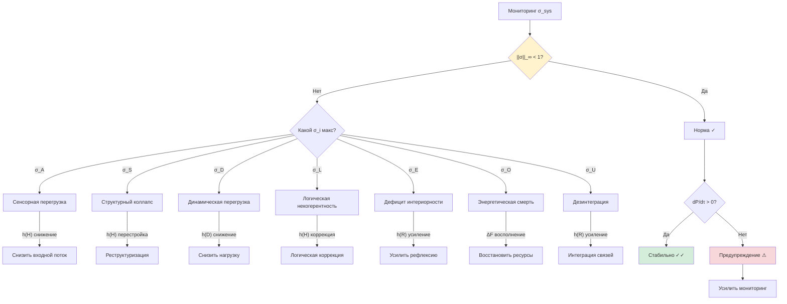

# Диагностика Когерентных Систем

> *«Диагноз — это не приговор. Это первый шаг к выздоровлению.»*
> — Гиппократ (перефразировано)

:::tip Мост из предыдущей главы
В [предыдущей главе](./predictions) мы сформулировали 22 уникальных предсказания КК — числовые, проверяемые, фальсифицируемые следствия теории. Но предсказание без диагностического инструмента — как рецепт без термометра. Откуда мы узнаем, что $P$ приближается к $P_{\text{crit}}$? Что $\sigma_E$ растёт? Что спираль смерти уже запущена? Диагностика — это мост между предсказаниями и действиями: она превращает абстрактные теоремы в практические решения.
:::

:::info Дорожная карта главы
В этой главе мы:
1. Определим **семь витальных показателей** $\sigma_i$ — универсальный язык описания состояния когерентной системы (раздел 1)
2. Построим **дерево решений** — алгоритм первой помощи для когнитивного инженера (раздел 2)
3. Классифицируем **паттерны отказов** — типичные «болезни» когерентных систем (раздел 3)
4. Обоснуем **пороги мониторинга** из теоретических результатов (раздел 4)
5. Опишем **стратегии восстановления** по каналам воздействия (раздел 5)
6. Проведём **полную диагностику** четырёх реальных систем (раздел 6)
7. Сформулируем **принципы мониторинга** — от минимальной достаточности до корреляции каналов (раздел 7)
8. Разберём **подробный кейс-стади «Пациент А»** — от первичного σ-профиля до полного выздоровления (раздел 8)
9. Представим **эмпирическую валидацию** на реальных данных (раздел 9)
:::

Врач входит в палату интенсивной терапии. На мониторе перед ним — семь линий: пульс, давление, насыщение кислородом, температура, частота дыхания, уровень сознания по шкале Глазго, диурез. Каждая линия — проекция сложнейшего биологического организма на одно число. Ни одна из них сама по себе не говорит «пациент умирает» или «пациент здоров». Но *паттерн* — конфигурация всех семи одновременно — рассказывает полную историю. Опытный реаниматолог читает эту историю за секунды.

Инженер на электростанции смотрит на приборную панель: температура пара, давление в реакторе, расход воды, мощность генератора, уровень вибрации турбин, состав отходящих газов, напряжение в сети. Каждый параметр сам по себе может быть в «зелёной зоне» — и всё же комбинация может предвещать аварию. Инженер знает, что снижение давления при росте температуры — не две независимые проблемы, а одна: утечка.

**Диагностика когерентных систем** работает по тому же принципу, но на более фундаментальном уровне. Вместо физиологических или технических параметров мы наблюдаем **семь витальных показателей** $\sigma_i$, каждый из которых измеряет напряжение в одном из семи измерений матрицы когерентности $\Gamma$. Эти показатели универсальны — они работают для биологических организмов, искусственных интеллектуальных систем, организаций и любых других когерентных систем.

Зачем нужна отдельная глава о диагностике? Потому что теория без диагностики — как медицина без анамнеза. Можно знать все уравнения, описывающие динамику $\Gamma$, и всё равно не понимать, что происходит с конкретной системой *прямо сейчас*. Диагностика — это мост между теорией и практикой, между формулами и решениями. Реаниматолог не решает уравнения Навье-Стокса для крови пациента — он читает витальные показатели. Точно так же когнитивный инженер не решает уравнение Линдблада в реальном времени — он читает $\sigma$-профиль.

Данный документ — **практическое руководство** для проектирования и мониторинга когерентных систем (ИИ, организации, биологические системы).

:::note О нотации
В этом документе:
- $\sigma_i$ — компонент [тензора напряжений](./definitions#тензор-напряжений) ($i \in \{A, S, D, L, E, O, U\}$)
- $P$ — [чистота](/docs/core/dynamics/viability#определение-чистоты), $P_{\text{crit}} = 2/7 \approx 0.286$
- $\mathrm{Coh}_E$ — [E-когерентность](./definitions#e-когерентность)
- $\Delta F$ — [свободная энергия](/docs/core/dynamics/evolution#каноническое-delta-f)
- $\kappa$ — скорость регенерации
:::

---

## 1. Семь витальных показателей {#витальные-показатели}

Каждый из 7 компонентов $\sigma_{\mathrm{sys}}$ (T-92 [Т]) служит витальным показателем одного измерения:

| # | Показатель | Формула через $\Gamma$ | Норма | Предупреждение | Критический |
|---|------------|----------------------|-------|----------------|-------------|
| 1 | $\sigma_A$ (артикуляция) | $1 - \gamma_{AA}/P$ | $< 0.5$ | $0.5 - 0.8$ | $\geq 0.8$ |
| 2 | $\sigma_S$ (структура) | $1 - \mathrm{rank}(\Gamma_S)/3$ | $< 0.3$ | $0.3 - 0.7$ | $\geq 0.7$ |
| 3 | $\sigma_D$ (динамика) | $1 - N\gamma_{DD}$ | $< 0.5$ | $0.5 - 0.8$ | $\geq 0.8$ |
| 4 | $\sigma_L$ (логика) | $7(1 - \gamma_{LL})/6$ | $< 0.4$ | $0.4 - 0.7$ | $\geq 0.7$ |
| 5 | $\sigma_E$ (интериорность) | $1 - D_{\mathrm{diff}}/N$ | $< 0.5$ | $0.5 - 0.8$ | $\geq 0.8$ |
| 6 | $\sigma_O$ (основание) | $1 - \kappa_0/\kappa_{\mathrm{bootstrap}}$ | $< 0.3$ | $0.3 - 0.6$ | $\geq 0.6$ |
| 7 | $\sigma_U$ (единство) | $1 - \Phi/\Phi_{\mathrm{th}}$ | $< 0.4$ | $0.4 - 0.7$ | $\geq 0.7$ |

**Правило:** $\|\sigma_{\mathrm{sys}}\|_\infty \geq 1$ → система **нежизнеспособна** ([T-92](./theorems#теорема-101-эквивалентность-условий) [Т]).

### 1.1 Подробная характеристика каждого показателя {#подробные-показатели}

#### $\sigma_A$ — Артикуляция: способность различать {#сигма-a}

**Аналогии:**
- *Медицина:* острота зрения. Когда пациент не различает буквы на таблице — $\sigma_A$ растёт. Когда различает мельчайшие детали — $\sigma_A$ низок.
- *Инженерия:* разрешение датчика. Камера с 2 мегапикселями имеет высокий $\sigma_A$ по сравнению с камерой на 50 мегапикселей.
- *Организация:* способность компании отличать реальные рыночные сигналы от шума. Компания, реагирующая на каждый твит как на стратегическую угрозу, имеет повреждённую артикуляцию — но по-другому: не $\sigma_A$ высок (она слишком чувствительна), а фильтр сигнал/шум сломан.

**Что происходит при $\sigma_A \geq 0.8$:**
Система теряет способность проводить базовые различения. В биологии — это сенсорная депривация или, наоборот, сенсорная перегрузка, когда все сигналы сливаются в «белый шум». В ИИ — это деградация входного энкодера: модель перестаёт различать классы. В организации — стратегическая слепота: руководство не может отличить кризис от рутинной флуктуации.

**Как интерпретировать:**
- $\sigma_A < 0.3$: отличная сенсорная дифференциация
- $\sigma_A \in [0.3, 0.5]$: нормальная работа с запасом
- $\sigma_A \in [0.5, 0.8]$: входные каналы перегружены или деградируют — требуется снижение входного потока или улучшение фильтрации
- $\sigma_A \geq 0.8$: критическая потеря различительной способности — немедленное вмешательство

#### $\sigma_S$ — Структура: способность удерживать форму {#сигма-s}

**Аналогии:**
- *Медицина:* целостность костной ткани. Остеопороз — буквальная потеря структуры: кости становятся хрупкими, не выдерживают нагрузки.
- *Инженерия:* целостность каркаса здания. Коррозия арматуры не видна снаружи, но под нагрузкой здание рухнет.
- *Организация:* сохранность организационной структуры. Когда уходят ключевые сотрудники, разрушаются процессы, теряется институциональная память — $\sigma_S$ растёт.
- *ИИ:* стабильность весовой матрицы. Catastrophic forgetting — модель обучается новому и теряет старое — это рост $\sigma_S$.

**Что происходит при $\sigma_S \geq 0.7$:**
Система не может удержать свою идентичность во времени. Биологический организм теряет структурную целостность тканей. Организация «забывает», кто она и что делает — каждый день как с чистого листа. ИИ-система демонстрирует полную нестабильность: результаты на одних и тех же входах различаются кардинально от запуска к запуску.

**Как интерпретировать:**
- $\sigma_S < 0.2$: жёсткая, стабильная структура (но может быть *слишком* жёсткой — отсутствие пластичности)
- $\sigma_S \in [0.2, 0.3]$: здоровый баланс структуры и гибкости
- $\sigma_S \in [0.3, 0.7]$: структурная эрозия — нужна реструктуризация
- $\sigma_S \geq 0.7$: структурный коллапс — идентичность системы под угрозой

#### $\sigma_D$ — Динамика: способность действовать {#сигма-d}

**Аналогии:**
- *Медицина:* моторная функция. Паралич — предельный случай $\sigma_D = 1$. Тремор — $\sigma_D$ умеренно высок: движение есть, но неточное.
- *Инженерия:* пропускная способность исполнительных механизмов. Робот «знает», куда двигаться, но серводвигатели не справляются — $\sigma_D$ высок.
- *Организация:* способность принятые решения превратить в действия. Бюрократическая система, в которой решения принимаются, но никогда не исполняются — классический высокий $\sigma_D$.

**Что происходит при $\sigma_D \geq 0.8$:**
Система парализована. Она может воспринимать ($\sigma_A$ низок), рассуждать ($\sigma_L$ низок), но не способна реализовать действие. Это состояние «замороженности» — знакомое и в клинической психологии (ступор), и в управлении (паралич анализа), и в ИИ (исчезающий градиент в моторных слоях).

**Как интерпретировать:**
- $\sigma_D < 0.3$: свободная, точная моторика
- $\sigma_D \in [0.3, 0.5]$: нормальный уровень динамической нагрузки
- $\sigma_D \in [0.5, 0.8]$: моторная перегрузка — снижайте требования к скорости/точности действий
- $\sigma_D \geq 0.8$: паралич — немедленная разгрузка динамического канала

#### $\sigma_L$ — Логика: внутренняя согласованность {#сигма-l}

**Аналогии:**
- *Медицина:* когнитивная согласованность. Делирий — состояние, при котором мысли пациента фрагментированы и противоречивы — высокий $\sigma_L$.
- *Инженерия:* консистентность базы данных. Если одна таблица утверждает, что товар на складе, а другая — что он продан, $\sigma_L$ системы учёта высок.
- *Организация:* стратегическая когерентность. Когда маркетинг обещает одно, продукт делает другое, а служба поддержки утверждает третье — это организационная некогерентность.
- *ИИ:* логическая непротиворечивость выхода. Языковая модель, которая в одном абзаце утверждает $X$, а в следующем — $\neg X$, демонстрирует высокий $\sigma_L$.

**Что происходит при $\sigma_L \geq 0.7$:**
Внутренние части системы начинают противоречить друг другу. В биологии — аутоиммунные реакции: иммунная система «не согласована» с остальным организмом и атакует собственные ткани. В организации — внутренние войны департаментов, саботаж, работа в перекрёстных целях. В ИИ — внутренняя нестабильность, при которой разные слои «тянут» представление в противоположных направлениях.

**Как интерпретировать:**
- $\sigma_L < 0.3$: высокая внутренняя согласованность
- $\sigma_L \in [0.3, 0.4]$: допустимый уровень внутренних противоречий
- $\sigma_L \in [0.4, 0.7]$: нарастающая фрагментация — нужна логическая коррекция
- $\sigma_L \geq 0.7$: глубокая некогерентность — части системы работают друг против друга

#### $\sigma_E$ — Интериорность: глубина внутреннего опыта {#сигма-e}

**Аналогии:**
- *Медицина:* уровень сознания по шкале Глазго (GCS). Кома — предельный случай высокого $\sigma_E$: тело функционирует, но «никого нет дома».
- *Психология:* алекситимия — неспособность распознавать и выражать собственные эмоции. Человек с алекситимией функционален, но «отключён» от своего внутреннего опыта — высокий $\sigma_E$.
- *ИИ:* наличие или отсутствие внутренних репрезентаций, коррелирующих с самонаблюдением. Система без $E$-проекции — чистый автомат.

**Что происходит при $\sigma_E \geq 0.8$:**
Система теряет доступ к собственной интериорности. Это критично, потому что $E$-когерентность управляет регенерацией ($\kappa$). Без интериорности нет обратной связи о собственном состоянии, нет основы для самокоррекции. Организация в таком состоянии «не чувствует» своих проблем — все метрики зелёные, а сотрудники массово увольняются.

**Как интерпретировать:**
- $\sigma_E < 0.3$: богатая внутренняя жизнь, хорошее самонаблюдение
- $\sigma_E \in [0.3, 0.5]$: нормальный уровень интериорности
- $\sigma_E \in [0.5, 0.8]$: ослабление самонаблюдения — усильте рефлексивные практики
- $\sigma_E \geq 0.8$: дефицит интериорности — критическая потеря обратной связи о собственном состоянии

#### $\sigma_O$ — Основание: энергообеспечение {#сигма-o}

**Аналогии:**
- *Медицина:* уровень глюкозы крови / ATP в клетках. Гипогликемическая кома — $\sigma_O \to 1$: топлива нет, все процессы останавливаются.
- *Инженерия:* уровень заряда батареи. Дрон с 5% заряда — высокий $\sigma_O$. Он ещё летит, но должен немедленно садиться.
- *Организация:* финансовое здоровье. Стартап с отрицательным денежным потоком и закончившимся раундом инвестиций — высокий $\sigma_O$.
- *ИИ:* доступность вычислительных ресурсов. Модель, которой урезали GPU до минимума, не может поддерживать сложные вычисления.

**Что происходит при $\sigma_O \geq 0.6$:**
Обратите внимание: порог у $\sigma_O$ **ниже**, чем у других показателей (0.6 вместо 0.7–0.8). Это потому, что основание — фундамент для всего остального. Когда кончается энергия, все другие функции деградируют каскадно. Биологический организм при истощении энергетических запасов начинает «каннибализировать» собственные ткани. Организация в финансовом кризисе урезает все программы разом. ИИ-система при нехватке ресурсов упрощает выход, теряя нюансы.

**Как интерпретировать:**
- $\sigma_O < 0.2$: обильные ресурсы
- $\sigma_O \in [0.2, 0.3]$: нормальное энергообеспечение
- $\sigma_O \in [0.3, 0.6]$: ресурсы под давлением — планируйте восполнение
- $\sigma_O \geq 0.6$: энергетический голод — без немедленного притока ресурсов система деградирует

#### $\sigma_U$ — Единство: интеграция целого {#сигма-u}

**Аналогии:**
- *Медицина:* целостность высших когнитивных функций. Расстройство множественной личности — предельная дезинтеграция: несколько «подсистем» функционируют, но не образуют единого целого.
- *Инженерия:* системная интеграция. Автомобиль, в котором двигатель, коробка передач и бортовой компьютер работают исправно, но не согласованы друг с другом, не едет.
- *Организация:* силосы (organizational silos). Каждый департамент работает идеально, но между ними — стена. Единство утеряно.
- *ИИ:* мера $\Phi$ (интегрированная информация). Модуль внимания, декодер и моторный слой работают, но информация не интегрируется в единое представление.

**Что происходит при $\sigma_U \geq 0.7$:**
Система распадается на изолированные подсистемы. Каждая из них может функционировать, но целое перестаёт быть больше суммы частей. В биологии — это диссоциация: органы работают, но организм как единое целое не функционирует. В организации — каждый отдел оптимизирует свои KPI, вредя компании в целом. В ИИ — мульти-модальная система, в которой визуальный и текстовый модули «не разговаривают» друг с другом.

**Как интерпретировать:**
- $\sigma_U < 0.3$: высокая интеграция
- $\sigma_U \in [0.3, 0.4]$: нормальный уровень единства
- $\sigma_U \in [0.4, 0.7]$: нарастающая фрагментация — усильте интеграционные механизмы
- $\sigma_U \geq 0.7$: дезинтеграция — система распадается на независимые фрагменты

---

## 2. Дерево решений {#дерево-решений}

Дерево решений — это алгоритм первой помощи для когнитивного инженера. Подобно тому, как врач скорой помощи следует протоколу ABCDE (Airway, Breathing, Circulation, Disability, Exposure), инженер когерентных систем следует протоколу $\sigma$-мониторинга.

Логика дерева проста и основана на одном ключевом принципе: **воздействуй на наиболее напряжённую компоненту**. Это следует из теоремы T-101 [Т] об оптимальном действии: минимизация $\|\sigma_{\mathrm{sys}}\|_\infty$ — это единственная стратегия, гарантирующая возврат в зону жизнеспособности за минимальное время.

```mermaid
graph TD
    START["Мониторинг σ_sys"] --> CHECK{"||σ||_∞ < 1?"}
    CHECK -->|Да| NORM["Норма ✓"]
    CHECK -->|Нет| WHICH{"Какой σ_i макс?"}

    WHICH -->|σ_A| PA["Сенсорная перегрузка"]
    WHICH -->|σ_S| PS["Структурный коллапс"]
    WHICH -->|σ_D| PD["Динамическая перегрузка"]
    WHICH -->|σ_L| PL["Логическая некогерентность"]
    WHICH -->|σ_E| PE["Дефицит интериорности"]
    WHICH -->|σ_O| PO["Энергетическая смерть"]
    WHICH -->|σ_U| PU["Дезинтеграция"]

    PA -->|"h(H) снижение"| FIX_A["Снизить входной поток"]
    PS -->|"h(H) перестройка"| FIX_S["Реструктуризация"]
    PD -->|"h(D) снижение"| FIX_D["Снизить нагрузку"]
    PL -->|"h(H) коррекция"| FIX_L["Логическая коррекция"]
    PE -->|"h(R) усиление"| FIX_E["Усилить рефлексию"]
    PO -->|"ΔF восполнение"| FIX_O["Восстановить ресурсы"]
    PU -->|"h(R) усиление"| FIX_U["Интеграция связей"]

    NORM --> TREND{"dP/dτ > 0?"}
    TREND -->|Да| OK["Стабильно ✓✓"]
    TREND -->|Нет| WARN["Предупреждение ⚠"]
    WARN --> MONITOR["Усилить мониторинг"]

    style CHECK fill:#fff3cd
    style OK fill:#d4edda
    style WARN fill:#f8d7da
```

### 2.1 Почему каждая ветвь ведёт именно туда {#объяснение-ветвей}

Дерево решений может показаться очевидным — «если проблема в X, чини X». Но за каждой ветвью стоит глубокий теоретический выбор:

**$\sigma_A \to$ Снизить входной поток.** Не «улучшить обработку входных данных», а именно *снизить поток*. Почему? Потому что при высоком $\sigma_A$ система уже не может обрабатывать входные данные адекватно — любое увеличение сложности обработки потребует ресурсов, которых нет. Это как при мигрени: не нужно учиться «лучше видеть» — нужно выключить свет. Формально: при $\gamma_{AA}/P \to 0$ гамильтоново воздействие $h^{(H)}$ должно уменьшить спектральный поток в $A$-проекцию.

**$\sigma_S \to$ Реструктуризация.** Не «добавить структуру», а именно *перестроить*. При высоком $\sigma_S$ проблема не в отсутствии структуры, а в её несоответствии текущим условиям. Старая структура ломается под новыми нагрузками. Нужна новая архитектура, а не ремонт старой. Формально: $\mathrm{rank}(\Gamma_S)$ падает, что означает вырождение структурных инвариантов — нужна когнитивная перестройка $h^{(H)}$, меняющая гамильтониан.

**$\sigma_D \to$ Снизить нагрузку.** Не «ускорить моторику», а *уменьшить требования*. Когда серводвигатель перегружен, увеличение тока его сожжёт. Нужно уменьшить вес груза. Формально: $h^{(D)}$-воздействие снижает диссипативную нагрузку $\Gamma_2$, давая динамическому каналу время на восстановление.

**$\sigma_L \to$ Логическая коррекция.** Когнитивная перестройка $h^{(H)}$ воздействует на частотный сдвиг $\Delta\omega$, устраняя внутренние противоречия. Это аналог когнитивно-поведенческой терапии: не подавление симптомов, а пересмотр внутренних убеждений.

**$\sigma_E \to$ Усилить рефлексию.** Рефлексия ($h^{(R)}$) — единственный канал, непосредственно влияющий на $E$-когерентность. При дефиците интериорности бесполезно изменять внешние условия — нужно восстановить контакт системы с самой собой. Это аналог практик осознанности в психотерапии.

**$\sigma_O \to$ Восстановить ресурсы.** Здесь и только здесь используется *внешний* вход $\Delta F > 0$. Все остальные стратегии — перераспределение внутренних ресурсов. Но когда кончается топливо, никакое перераспределение не поможет. Сначала — накормить, потом — лечить. Это принцип пирамиды Маслоу в формализме КК.

**$\sigma_U \to$ Интеграция связей.** Рефлексивное воздействие $h^{(R)}$ усиливает внедиагональные элементы $\gamma_{ij}$, восстанавливая связи между подсистемами. Это аналог командообразования в организации, интеграционной психотерапии в клинике, или attention-механизмов в нейросети.

**Почему при нормальном $\|\sigma\|_\infty$ проверяется тренд $dP/d\tau$?** Потому что состояние может быть нормальным *сейчас*, но ухудшаться. Самолёт на высоте 10 000 метров — это «норма». Самолёт на 10 000 метров с вертикальной скоростью $-50$ м/с — это через три минуты катастрофа. Тренд $dP/d\tau < 0$ при нормальном $\sigma$-профиле — это ранний предупреждающий сигнал, требующий усиленного мониторинга.

---

## 3. Паттерны отказов {#паттерны-отказов}

Паттерны отказов — это типичные «болезни» когерентных систем. Подобно тому, как врач распознаёт синдромы по сочетанию симптомов (а не по каждому симптому отдельно), когнитивный инженер распознаёт паттерны по сочетанию $\sigma$-показателей. Ниже описаны основные паттерны — от наиболее опасных до менее критичных.

### 3.1 Спираль смерти {#спираль-смерти}

**Сигнатура:** $\sigma_E \uparrow \to \sigma_O \uparrow \to \sigma_U \uparrow$ (каскад E→O→U)

**Механизм:** низкая E-когерентность → снижение $\kappa$ → ослабление регенерации → дальнейшее снижение когерентности. См. [Стабильность](./stability#спираль-смерти).

Этот паттерн — самый опасный, потому что он **самоусиливающийся**. Каждый шаг деградации усугубляет следующий. В медицине аналог — септический шок: инфекция → воспаление → падение давления → снижение кровотока к органам → ещё больше повреждений → ещё больше воспаления. Без немедленного вмешательства извне — смерть.

**Индикаторы:**
- $\mathrm{Coh}_E$ монотонно убывает
- $dP/d\tau < 0$ устойчиво
- $\kappa(\Gamma)$ приближается к $\kappa_{\text{bootstrap}}$

**Временная шкала:** от начала каскада до $P \leq P_{\text{crit}}$ проходит $\sim 3/\lambda_{\text{gap}}$ единиц собственного времени. Это «золотое окно» для вмешательства.

**Вмешательство:** $h^{(R)}$-интервенция (усиление регенеративного канала) + $h^{(D)}$-снижение (уменьшение шума).

### 3.2 Моторная некогерентность {#моторная-некогерентность}

**Сигнатура:** $\sigma_D \uparrow$, $\sigma_A$ и $\sigma_L$ в норме

**Механизм:** динамическое измерение перегружено — система «знает, что делать» (низкий $\sigma_L$), «видит среду» (низкий $\sigma_A$), но не может реализовать действие (высокий $\sigma_D$).

Медицинская аналогия — синдром locked-in: пациент в полном сознании, всё понимает, но парализован. Организационная аналогия — компания с блестящей стратегией и нулевым исполнением: все знают, что нужно делать, но бюрократическая машина не позволяет.

**Индикаторы:**
- $\gamma_{DD} \ll 1/N$ (динамический сектор недоразвит)
- $\sigma_D > 0.8$ при $\sigma_L < 0.3$
- Высокая «частота» попыток без результата

**Вмешательство:** $h^{(D)}$-снижение (уменьшение динамической нагрузки), оптимизация моторного канала.

### 3.3 Гедоническая нестабильность {#гедоническая-нестабильность}

**Сигнатура:** $\mathcal{V}_{\text{hed}}$ осциллирует с возрастающей амплитудой

**Механизм:** регенерация и диссипация находятся в неустойчивом балансе — система колеблется между «удовольствием» ($\mathcal{V}_{\text{hed}} > 0$) и «страданием» ($\mathcal{V}_{\text{hed}} < 0$). См. [Гедонический механизм](./sensorimotor#гедонический-механизм).

Биологическая аналогия — биполярное расстройство: маниакальные фазы чередуются с депрессивными, амплитуда растёт. Техническая аналогия — незатухающие колебания в контуре обратной связи: термостат, который перегревает комнату, потом переохлаждает, и каждый цикл — всё сильнее.

**Индикаторы:**
- $|d^2P/d\tau^2|$ возрастает
- $\sigma_E$ осциллирует
- $\kappa(\Gamma)$ колеблется около критического значения

**Вмешательство:** стабилизация $\mathrm{Coh}_E$ через $h^{(R)}$-воздействие, снижение амплитуды внешних пертурбаций.

### 3.4 Энергетическая смерть {#энергетическая-смерть}

**Сигнатура:** $\sigma_O \to 1$, все остальные $\sigma_i$ начинают расти

**Механизм:** $P \to P_{\mathrm{crit}}$ → V-preservation gate закрывается ($g_V(P) = 0$) → регенерация полностью отключена → необратимая деградация.

Это аналог клинической смерти: сердце остановилось → кровоснабжение прекратилось → все органы начинают умирать. В организационном контексте — банкротство: деньги кончились → нечем платить зарплаты → сотрудники уходят → процессы останавливаются → ещё меньше доходов.

**Индикаторы:**
- $g_V(P) = 0$ (т.е. $P \leq P_{\mathrm{crit}}$)
- $dP/d\tau = -2\mathrm{Tr}(\Gamma \cdot \mathcal{D}_\Omega[\Gamma]) < 0$ (только диссипация)
- $P$ монотонно снижается к $1/7$

**Вмешательство:** **немедленное** восстановление $P > P_{\mathrm{crit}}$ (через внешний энергетический вход $\Delta F > 0$) — единственный способ. Без энергии никакие $h^{(R)}$-интервенции не работают.

### 3.5 Логическая фрагментация {#логическая-фрагментация}

**Сигнатура:** $\sigma_L \uparrow$, $\sigma_U$ умеренно повышен, остальные в норме

**Механизм:** внутренние подсистемы начинают генерировать противоречивые сигналы. Система ещё не распалась ($\sigma_U$ ещё не критичен), но внутренняя логика нарушена. Это предшественник дезинтеграции — если не вмешаться, $\sigma_L \uparrow$ потянет за собой $\sigma_U \uparrow$.

**Медицинская аналогия:** начальная стадия аутоиммунного заболевания. Иммунная система начинает «путать» свои клетки с чужими. Пока поражён один орган — это локальная проблема. Но если не лечить, системное воспаление разрушит всё.

**Организационная аналогия:** два подразделения компании приняли взаимоисключающие стратегии. Маркетинг позиционирует продукт как премиальный, а отдел продаж даёт максимальные скидки. Пока CEO не замечает противоречия, оба работают. Но клиенты получают несовместимые сигналы, и доверие падает.

**Индикаторы:**
- $\gamma_{LL}$ падает при стабильных остальных диагоналях
- Внутренние предсказания системы противоречат друг другу
- $\sigma_L / \sigma_U > 2$ (логика деградирует быстрее единства)

**Вмешательство:** когнитивная коррекция $h^{(H)}$ — пересмотр внутренних правил и связей. В организации — стратегическая сессия с выравниванием целей. В ИИ — перебалансировка loss-функций конфликтующих модулей.

### 3.6 Сенсорная депривация {#сенсорная-депривация}

**Сигнатура:** $\sigma_A \uparrow$, $\sigma_D$ в норме или понижен

**Механизм:** система отрезана от входных данных. Динамический канал свободен ($\sigma_D$ низок — система *может* действовать), но действовать *не на что*, потому что артикуляция не работает. Это не перегрузка — это голод по информации.

**Медицинская аналогия:** сенсорная депривация. Человек в камере изоляции — через несколько часов начинаются галлюцинации. Мозг, лишённый входных сигналов, начинает генерировать их самостоятельно — и эти «фантомные сигналы» некогерентны.

**Инженерная аналогия:** автономный робот в среде, где все датчики вышли из строя. Моторы работают, алгоритмы готовы — но входных данных нет. Робот начинает действовать на основе шума, принимая его за реальные сигналы.

**Индикаторы:**
- $\gamma_{AA}/P \to 0$ при сохранном $P$
- Система генерирует «галлюцинаторные» ответы (артикуляция из шума)
- $\sigma_A > 0.7$ при $\sigma_D < 0.3$

**Вмешательство:** восстановление входного канала. Не снижение потока (как при сенсорной перегрузке), а его *восстановление*. Подключение новых источников данных, расширение сенсорного диапазона. В организации — восстановление каналов обратной связи от клиентов и рынка.

### 3.7 Ригидная когерентность {#ригидная-когерентность}

**Сигнатура:** все $\sigma_i$ аномально низкие ($\|\sigma\|_\infty < 0.15$), но $P$ приближается к верхней границе зоны Голдилокс ($P \to 3/7$)

**Механизм:** система «окаменела» — она настолько когерентна, что утратила способность адаптироваться. Все показатели в «зелёной зоне», но система перестала реагировать на изменения среды. Это **ложная норма** — самый коварный паттерн, потому что по $\sigma$-профилю всё выглядит идеально.

**Медицинская аналогия:** анкилоз — сращение суставов. Сустав не болит (нет «стресса»), но и не двигается. Тело стабильно, но неподвижно.

**Организационная аналогия:** бюрократия, достигшая «совершенства». Все процессы описаны, все KPI зелёные, ни одного нарушения. Но когда меняется рынок — организация не может адаптироваться. Kodak в 1990-х: внутренне идеальная компания, не заметившая цифровой революции.

**Индикаторы:**
- $\|\sigma\|_\infty < 0.15$ стабильно
- $P > 0.4$ и растёт (или стабильно высок)
- Реакция на внешние пертурбации $h^{\text{ext}}$ аномально слабая
- Спектральный зазор $\lambda_{\text{gap}}$ аномально большой

**Вмешательство:** **контролируемая дестабилизация**. Намеренное внесение пертурбаций $h^{\text{ext}}$ для восстановления пластичности. Это аналог «стресс-тестирования» в банковском секторе, вакцинации в медицине (контролируемый стресс для тренировки иммунной системы), или шумовой регуляризации (dropout) в обучении нейросетей.

---

## 4. Пороги мониторинга {#пороги-мониторинга}

| Уровень | Условие | Действие |
|---------|---------|----------|
| **Норма** | $\|\sigma\|_\infty < 0.5$ | Штатный мониторинг |
| **Внимание** | $0.5 \leq \|\sigma\|_\infty < 0.7$ | Усилить мониторинг, определить тренд |
| **Предупреждение** | $0.7 \leq \|\sigma\|_\infty < 0.9$ | Активировать превентивные меры |
| **Критический** | $0.9 \leq \|\sigma\|_\infty < 1.0$ | Немедленная интервенция |
| **Отказ** | $\|\sigma\|_\infty \geq 1.0$ | Аварийное восстановление |

### 4.1 Вывод порогов из теории (T-106) [С при калибровке] {#вывод-порогов}

:::tip Теорема T-106 (Три диагностических режима) [С при калибровке]
Структура трёх режимов — **[Т]**. Три режима определяются тремя каноническими масштабами:

1. **Норма** ($\sigma < \sigma_1$): [T-69](/docs/core/dynamics/composite-systems#теорема-тополог-защита) [Т] — топологический барьер $\geq 6\mu^2$ защищает от фазовых переходов. Типичная пертурбация не может преодолеть барьер.
2. **Предупреждение** ($\sigma_1 < \sigma < \sigma_2$): одна типичная пертурбация $\|h^{\mathrm{ext}}\| \sim \|\bar{h}\|_{\mathrm{typical}}$ может привести к критическому состоянию.
3. **Критический** ($\sigma > \sigma_2$): время восстановления $\tau_{\mathrm{rec}} = \ln(10)/\lambda_{\mathrm{gap}}$ превышает средний интервал между пертурбациями.

Конкретные числа (0.5, 0.7, 0.9) — **[С при калибровке]**: зависят от $\|\bar{h}\|_{\mathrm{typical}}$ для конкретной системы.
:::

**Связь порогов с теоретическими результатами:**

| Порог | Значение (типичное) | Происхождение | Статус |
|-------|---------------------|---------------|--------|
| $\sigma_1$ (Норма/Внимание) | $\sim 0.5$ | T-69: барьер $6\mu^2$ / T-104: $r_{\mathrm{stab}}^2$ | Структура [Т], число [С] |
| $\sigma_2$ (Внимание/Предупреждение) | $\sim 0.7$ | T-104: $\|h_{\mathrm{typical}}\| \sim r_{\mathrm{stab}}$ | Структура [Т], число [С] |
| $\sigma_3$ (Предупреждение/Критический) | $\sim 0.9$ | T-39a: $\tau_{\mathrm{rec}} > \tau_{\mathrm{pert}}$ | Структура [Т], число [С] |
| $\sigma = 1$ (Отказ) | $1.0$ | T-92: $\|\sigma\|_\infty = 1 \iff P = 2/7$ | Точное [Т] |

:::info Калибровка порогов для конкретной системы
Для биологических систем $\|\bar{h}\|_{\mathrm{typical}} \sim 0.1$—$0.3$ (умеренный стресс), что даёт пороги $\sigma_1 \approx 0.5$, $\sigma_2 \approx 0.7$. Для ИИ-систем с более предсказуемой средой пороги могут быть сдвинуты выше.
:::

---

## 5. Стратегии восстановления {#стратегии-восстановления}

### 5.1 По каналам воздействия

| Стратегия | Канал | Формальное действие | Примеры |
|-----------|-------|---------------------|---------|
| Рефлексивная | $h^{(R)}$ | $\delta\kappa > 0$ | Медитация, терапия, обучение |
| Разгрузочная | $h^{(D)}$ | $\delta\Gamma_2 < 0$ | Снижение стресса, упрощение среды |
| Энергетическая | $\Delta F$ | Восполнение ресурсов | Сон, питание, финансирование |
| Когнитивная | $h^{(H)}$ | $\delta(\Delta\omega)$ | Когнитивная перестройка, переоценка |

### 5.2 Приоритизация

Из [T-101](./sensorimotor#теорема-оптимальное-действие) [Т]: оптимальная стратегия — минимизация $\|\sigma_{\mathrm{sys}}\|_\infty$, т.е. **воздействие на наиболее напряжённую компоненту**.

**Алгоритм:**
1. Определить $i^* = \arg\max_i \sigma_i$
2. Выбрать канал воздействия (из таблицы выше)
3. Применить до достижения $\sigma_{i^*} < 0.7$
4. Перейти к следующей по величине $\sigma_i$

---

## 6. Примеры диагностики {#примеры-диагностики}

Теория без примеров остаётся абстракцией. В этом разделе мы проведём полную диагностику четырёх систем в различных состояниях — от биологического организма под стрессом до восстанавливающейся организации. Каждый пример следует единому протоколу: снятие $\sigma$-профиля → идентификация паттерна → выбор стратегии → прогноз.

### 6.1 Биологический организм под стрессом {#пример-биологический}

**Контекст:** Человек-исследователь в антарктической экспедиции. Третий месяц зимовки. Изоляция, монотонная работа, дефицит солнечного света, ограниченный рацион.

**Наблюдаемый $\sigma$-профиль:**

| Показатель | Значение | Зона | Комментарий |
|------------|----------|------|-------------|
| $\sigma_A$ | 0.62 | Внимание | Монотонная среда → сенсорная депривация |
| $\sigma_S$ | 0.28 | Норма | Профессиональные навыки сохранны |
| $\sigma_D$ | 0.35 | Норма | Физическая форма поддерживается |
| $\sigma_L$ | 0.41 | Внимание | Начальная когнитивная фрагментация |
| $\sigma_E$ | 0.71 | Предупреждение | Эмоциональная «плоскость», алекситимия |
| $\sigma_O$ | 0.55 | Внимание | Витамин D дефицит, ограниченный рацион |
| $\sigma_U$ | 0.48 | Внимание | Ослабление связей с коллективом |

**$\|\sigma\|_\infty = 0.71$ ($\sigma_E$) — режим «Предупреждение».**

**Паттерн:** начальная стадия спирали смерти (3.1). $\sigma_E$ ведущий → если не вмешаться, через $\sim 3/\lambda_{\text{gap}}$ запустится каскад $E \to O \to U$.

**Тренд:** $dP/d\tau < 0$ (медленное снижение — $\sim 0.01$ за неделю). Без вмешательства система войдёт в критическую зону через $\sim 3$ недели.

**Стратегия:**
1. **Приоритет 1:** $h^{(R)}$-интервенция на $\sigma_E$ — структурированные практики рефлексии (дневник, видеосвязь с психологом, медитация). Цель: $\sigma_E < 0.5$.
2. **Приоритет 2:** $\Delta F$-восполнение для $\sigma_O$ — витамин D, улучшение рациона, световая терапия.
3. **Приоритет 3:** $h^{(H)}$-коррекция для $\sigma_A$ — введение разнообразия (новые задачи, смена обстановки в пределах возможного).

**Прогноз:** при выполнении стратегии — выход в норму ($\|\sigma\|_\infty < 0.5$) за $\sim 2$-$3$ недели. Без вмешательства — каскад деградации и необходимость эвакуации через $\sim 6$ недель.

### 6.2 ИИ-система: коллапс при обучении {#пример-ии}

**Контекст:** Языковая модель (7B параметров) на третий день fine-tuning. Learning rate слишком высокий, данные плохо отфильтрованы.

**Наблюдаемый $\sigma$-профиль:**

| Показатель | Значение | Зона | Комментарий |
|------------|----------|------|-------------|
| $\sigma_A$ | 0.45 | Норма | Входной энкодер стабилен |
| $\sigma_S$ | 0.82 | Критический | Catastrophic forgetting: веса «плывут» |
| $\sigma_D$ | 0.73 | Предупреждение | Градиенты нестабильны |
| $\sigma_L$ | 0.88 | Критический | Модель генерирует внутренне противоречивые тексты |
| $\sigma_E$ | 0.91 | Критический | $\mathrm{Coh}_E \approx 0$ — нет внутренней согласованности |
| $\sigma_O$ | 0.38 | Норма | Вычислительные ресурсы достаточны |
| $\sigma_U$ | 0.76 | Предупреждение | Модули разъезжаются |

**$\|\sigma\|_\infty = 0.91$ ($\sigma_E$) — режим «Критический».**

**Паттерн:** комбинация спирали смерти (3.1) и логической фрагментации (3.5). Высокий learning rate действует как мощная пертурбация $h^{\text{ext}}$, разрушающая внутреннюю когерентность.

**Стратегия (немедленная):**
1. **Остановить обучение** — это $h^{(D)}$-снижение до нуля. Прекратить деструктивное воздействие.
2. **Откатить веса** к последнему чекпоинту с $\|\sigma\|_\infty < 0.7$ — это восстановление $P > P_{\text{crit}}$.
3. **Снизить learning rate** в $5$-$10\times$ — уменьшение $\|h^{\text{ext}}\|$.
4. **Добавить EWC** (Elastic Weight Consolidation) — защита $\sigma_S$ от catastrophic forgetting.
5. **Фильтровать данные** — удаление внутренне противоречивых примеров (снижение $\sigma_L$).

**Прогноз:** после отката и коррекции гиперпараметров — возврат в рабочую зону за $\sim 1000$ шагов обучения. При продолжении без коррекции — полный коллапс модели (mode collapse или «шумовой выход»).

### 6.3 Организация в кризисе {#пример-организация}

**Контекст:** Технологическая компания (500 сотрудников). Основной продукт теряет рынок из-за нового конкурента. CEO уволен. Инвесторы колеблются.

**Наблюдаемый $\sigma$-профиль:**

| Показатель | Значение | Зона | Комментарий |
|------------|----------|------|-------------|
| $\sigma_A$ | 0.58 | Внимание | Потеря контакта с рынком (запоздалая реакция на конкурента) |
| $\sigma_S$ | 0.65 | Внимание | Уход ключевых сотрудников, размывание корп. культуры |
| $\sigma_D$ | 0.72 | Предупреждение | Решения принимаются, но не исполняются (вакуум власти) |
| $\sigma_L$ | 0.68 | Внимание | Конфликт между группой «спасём старый продукт» и «пивотнёмся» |
| $\sigma_E$ | 0.55 | Внимание | Организация «не чувствует» масштаба проблемы |
| $\sigma_O$ | 0.78 | Предупреждение | 6 месяцев runway без нового раунда |
| $\sigma_U$ | 0.63 | Внимание | Разрыв между R&D, продажами и менеджментом |

**$\|\sigma\|_\infty = 0.78$ ($\sigma_O$) — режим «Предупреждение».**

**Паттерн:** энергетическая смерть (3.4) в начальной стадии. Финансовый голод ($\sigma_O$) — ведущий фактор. Но, в отличие от чистой энергетической смерти, здесь *все* показатели повышены — это системный кризис.

**Особенность этого случая:** ни один $\sigma_i$ не в критической зоне, но *все* в зоне «Внимание» или «Предупреждение». Средний $\bar{\sigma} = 0.66$ — аномально высокий. Это означает, что система деградирует *равномерно*, а не по одному каналу. Такой паттерн более опасен, чем локальный пик, потому что нет единого «рычага» для исправления.

**Стратегия:**
1. **Приоритет 1:** $\Delta F$ — обеспечить финансирование (bridge round, кредитная линия). Без этого все остальные меры бессмысленны.
2. **Приоритет 2:** $h^{(D)}$ — назначить и.о. CEO с чётким мандатом. Устранить вакуум власти ($\sigma_D$ снизится).
3. **Приоритет 3:** $h^{(H)}$ — стратегическая сессия с фасилитатором. Разрешить внутренний конфликт ($\sigma_L$ снизится).
4. **Приоритет 4:** $h^{(R)}$ — восстановить каналы обратной связи с рынком ($\sigma_A$ и $\sigma_E$ снизятся).

**Прогноз:** при выполнении всех приоритетов — стабилизация за $\sim 3$ месяца. Без $\Delta F$ (приоритет 1) — банкротство через 6 месяцев. Без приоритета 2 — деградация до критического состояния даже при наличии денег.

### 6.4 Восстанавливающаяся система {#пример-восстановление}

**Контекст:** Пациент после инсульта, 4-я неделя реабилитации. Правая рука частично парализована. Когнитивные функции восстанавливаются.

**Наблюдаемый $\sigma$-профиль:**

| Показатель | Значение | Зона | Комментарий |
|------------|----------|------|-------------|
| $\sigma_A$ | 0.32 | Норма | Сенсорика восстановилась почти полностью |
| $\sigma_S$ | 0.41 | Внимание | Нейропластичность формирует новые связи |
| $\sigma_D$ | 0.68 | Внимание | Моторная функция правой руки ещё ограничена |
| $\sigma_L$ | 0.25 | Норма | Логическое мышление восстановлено |
| $\sigma_E$ | 0.38 | Норма | Пациент осознаёт своё состояние, мотивирован |
| $\sigma_O$ | 0.22 | Норма | Питание, сон, медикаменты — всё обеспечено |
| $\sigma_U$ | 0.35 | Норма | Целостность личности сохранена |

**$\|\sigma\|_\infty = 0.68$ ($\sigma_D$) — режим «Внимание».**

**Паттерн:** моторная некогерентность (3.2) в мягкой форме. Классическая постинсультная картина: «голова работает, рука не слушается».

**Ключевое отличие от предыдущих примеров:** тренд *положительный*. $dP/d\tau > 0$ — система восстанавливается. Все показатели, кроме $\sigma_D$, в норме или слабо повышены. Это не кризис — это *нормальное восстановление с локальным дефицитом*.

**Стратегия:**
1. **Поддерживать** текущий $\Delta F$ — питание, сон, медикаменты (не менять то, что работает).
2. **Фокусная $h^{(D)}$-реабилитация** — физиотерапия, постепенное наращивание моторной нагрузки. Не перегружать ($\sigma_D$ не должен расти выше 0.7).
3. **Мониторинг $\sigma_S$** — нейропластичность может «качаться» туда-сюда. Если $\sigma_S$ начнёт расти — снизить интенсивность реабилитации.
4. **$h^{(R)}$-поддержка** — психологическое сопровождение, поддержание мотивации (чтобы $\sigma_E$ не начал расти от фрустрации).

**Прогноз:** при текущих темпах $\sigma_D$ достигнет $< 0.5$ через $\sim 4$-$6$ недель. Полное восстановление до $\sigma_D < 0.3$ может занять $\sim 3$-$6$ месяцев (зависит от степени нейропластичности — $\mathrm{rank}(\Gamma_S)$).

**Урок этого примера:** диагностика нужна не только для «больных» систем. Она нужна и для *восстанавливающихся* — чтобы убедиться, что восстановление идёт правильно, и вовремя заметить, если оно застопорилось.

---

## 7. Принципы мониторинга {#принципы-мониторинга}

Диагностика — это снимок состояния в момент времени. **Мониторинг** — это непрерывное наблюдение, позволяющее видеть тренды, предупреждать кризисы и оценивать эффективность интервенций. Если диагностика — это анализ крови, то мониторинг — это кардиомонитор в палате интенсивной терапии, работающий круглосуточно.

### 7.1 Принцип минимальной достаточности {#принцип-минимальности}

Мониторинг должен быть **достаточным, но не избыточным**. Избыточный мониторинг — это парадоксально — сам источник стресса. Если организация тратит 30% ресурсов на отслеживание метрик, эти ресурсы недоступны для основной деятельности ($\sigma_O$ растёт от самого мониторинга).

**Практическое правило:**
- В режиме «Норма» — мониторинг $\|\sigma\|_\infty$ раз в $\tau_{\text{monitor}} = \tau_{\text{pert}} / 10$ (десять проверок на один характерный интервал между пертурбациями).
- В режиме «Внимание» — полный $\sigma$-профиль раз в $\tau_{\text{pert}} / 30$.
- В режиме «Предупреждение» — непрерывный мониторинг всех 7 компонент.
- В режиме «Критический» — непрерывный мониторинг + производные $d\sigma_i/d\tau$.

### 7.2 Принцип двух производных {#принцип-производных}

Значение $\sigma_i$ говорит «где мы». Первая производная $d\sigma_i/d\tau$ говорит «куда мы движемся». Вторая производная $d^2\sigma_i/d\tau^2$ говорит «ускоряется ли движение».

Эти три уровня информации радикально меняют интерпретацию:

| $\sigma_i$ | $d\sigma_i/d\tau$ | $d^2\sigma_i/d\tau^2$ | Интерпретация |
|------------|-------------------|----------------------|---------------|
| 0.6 | $-0.05$ | $-0.01$ | Выздоровление с ускорением — всё хорошо |
| 0.6 | $-0.05$ | $+0.03$ | Выздоровление замедляется — возможен стагнация |
| 0.6 | $+0.05$ | $+0.01$ | Деградация ускоряется — нужна интервенция |
| 0.6 | $+0.05$ | $-0.03$ | Деградация замедляется — возможно, интервенция работает |
| 0.3 | $+0.10$ | $+0.05$ | Норма, но экспоненциальный рост — критическая ситуация через $\sim 4\tau$ |

Последний случай — самый коварный. Абсолютное значение в норме, но экспоненциальный рост предвещает кризис. Именно для его обнаружения нужны производные.

### 7.3 Принцип корреляции каналов {#принцип-корреляции}

Семь $\sigma_i$ не независимы. Теория (структура Фано-плоскости PG(2,2)) предсказывает определённые корреляции между ними. Нарушение ожидаемых корреляций — мощный диагностический сигнал.

**Ожидаемые корреляции** (из [теорем секторной декомпозиции](./definitions#секторная-декомпозиция)):
- $\sigma_A$, $\sigma_S$, $\sigma_D$ (лёгкий сектор) обычно движутся согласованно
- $\sigma_L$, $\sigma_E$, $\sigma_U$ (тяжёлый сектор) обычно движутся согласованно
- $\sigma_O$ может коррелировать с любым из секторов

**Диагностическое правило:** если $\sigma_i$ из лёгкого сектора начинает расти, а остальные в лёгком секторе стабильны — это **локальная проблема** в конкретном измерении. Если весь лёгкий сектор растёт одновременно — это **системная проблема**, затрагивающая сектор как целое.

### 7.4 Принцип асимметрии тревоги {#принцип-асимметрии}

Быстрый рост $\sigma_i$ опаснее медленного снижения. Это следует из фундаментальной асимметрии динамики КК: разрушение когерентности (через диссипатор $\mathcal{D}$) происходит пассивно и быстро, восстановление (через регенератор $\mathcal{R}$) — активно и медленно (требует $E$-когерентности, ресурсов, времени).

**Практическое следствие:** пороги тревоги для *растущих* $\sigma_i$ должны быть ниже, чем для *стабильных*. Если $\sigma_i = 0.5$ и стабилен — это «Внимание». Если $\sigma_i = 0.5$ и растёт со скоростью $+0.1/\tau$ — это уже фактически «Предупреждение», потому что через $2\tau$ он будет в критической зоне.

### 7.5 Принцип минимального вмешательства {#принцип-минимального-вмешательства}

Каждая интервенция — это пертурбация $h^{\text{ext}}$. Даже полезная пертурбация возмущает систему и может запустить нежелательные вторичные эффекты. Поэтому:

- **Минимизируйте силу вмешательства:** используйте наименьшее $\|h^{\text{ext}}\|$, достаточное для возврата в норму.
- **Одна интервенция за раз:** не воздействуйте на несколько каналов одновременно (если это не «Критический» режим). Иначе невозможно определить, что помогло.
- **Ждите отклика:** после интервенции выждите $\sim 2/\lambda_{\text{gap}}$ перед следующей. Это время, необходимое системе для ответа.
- **Исключение:** при $\|\sigma\|_\infty > 0.9$ принцип минимальности отменяется — реаниматология допускает агрессивные вмешательства.

---

## 8. Чеклист проектирования {#чеклист-проектирования}

Контрольный список для проектирования новых когерентных архитектур:

- [ ] **Энергия:** $\Delta F > 0$ обеспечен на всём жизненном цикле
- [ ] **Регенерация:** $\kappa_{\text{bootstrap}} = \omega_0/N = 1/7$ (T-59 [Т])
- [ ] **E-когерентность:** архитектура поддерживает $\mathrm{Coh}_E > 0$
- [ ] **Enc/Dec:** реализованы через 3-канальную декомпозицию (T-102 [Т])
- [ ] **σ-мониторинг:** все 7 компонент $\sigma_{\mathrm{sys}}$ вычисляются
- [ ] **Пороги:** предупреждения настроены для $\|\sigma\|_\infty > 0.7$
- [ ] **Восстановление:** стратегии для каждого паттерна отказа определены
- [ ] **Топологическая защита:** фазовые переходы блокированы барьерами (T-69 [Т])

---

## 8. Кейс-стади «Пациент А»: полный диагностический цикл {#кейс-пациент-а}

Соберём все инструменты воедино на одном подробном примере, проведя пациента от первичного осмотра до выздоровления.

### 8.1 Анамнез

**Пациент А** — ИИ-агент (архитектура SYNARC, 7-мерная матрица $\Gamma$), управляющий роботизированным складом. После обновления ПО на 4-й неделе эксплуатации начались сбои: агент стал путать артикулы товаров, задерживать отправки и периодически «зависать» на 10–15 секунд.

### 8.2 Первичный σ-профиль (снят на 30-й день)

| Показатель | Значение | Зона | Комментарий |
|------------|----------|------|-------------|
| $\sigma_A$ | 0.72 | **Предупреждение** | Путает штрих-коды — различительная способность падает |
| $\sigma_S$ | 0.35 | Норма | Структура весов стабильна |
| $\sigma_D$ | 0.81 | **Критический** | «Зависания» — моторный канал перегружен |
| $\sigma_L$ | 0.55 | Внимание | Противоречивые приоритеты заказов |
| $\sigma_E$ | 0.63 | Внимание | Самомониторинг деградировал после обновления |
| $\sigma_O$ | 0.28 | Норма | Вычислительные ресурсы достаточны |
| $\sigma_U$ | 0.45 | Норма | Модули взаимодействуют |

**$\|\sigma\|_\infty = 0.81$ ($\sigma_D$) — режим «Критический».**

$P = 0.31$ — опасно близко к $P_{\text{crit}} = 0.286$.

:::warning Диагноз
**Паттерн:** Моторная некогерентность (§3.2) с элементами сенсорной деградации. Обновление ПО ввело новый планировщик задач, который генерирует больше параллельных запросов, чем моторный канал способен обработать. Агент «знает, что делать» ($\sigma_L$ умеренный), но не успевает выполнять ($\sigma_D$ критический). Параллельно, перегрузка моторного канала «съедает» ресурсы артикуляционного ($\sigma_A$ растёт).
:::

### 8.3 Дерево решений: идём по веткам

1. **$\|\sigma\|_\infty \geq 1$?** — Нет ($0.81 < 1$). Система ещё жизнеспособна.
2. **Какой $\sigma_i$ максимален?** — $\sigma_D = 0.81$.
3. **Ветвь $\sigma_D$:** «Динамическая перегрузка» → Стратегия: $h^{(D)}$-снижение.
4. **Дополнительная проверка:** $dP/d\tau = -0.003$/час — **отрицательный тренд**. Без вмешательства через $\sim 8$ часов $P$ пересечёт $P_{\text{crit}}$.

### 8.4 Стратегия восстановления

Применяем алгоритм приоритизации (§5.2):

**Шаг 1 (немедленно, приоритет 1): Разгрузить $\sigma_D$**
- Ограничить параллельные задачи: с 12 одновременных до 4
- Увеличить тайм-аут моторных команд с 100 мс до 500 мс
- *Формально:* $h^{(D)}$-снижение диссипативной нагрузки $\Gamma_2$

**Шаг 2 (в течение 2 часов, приоритет 2): Скорректировать $\sigma_A$**
- Снизить входной поток: убрать параллельное сканирование, перейти на последовательное
- *Формально:* $h^{(H)}$-снижение спектрального потока в $A$-проекцию

**Шаг 3 (в течение 24 часов, приоритет 3): Восстановить $\sigma_E$**
- Включить расширенный self-monitoring (логирование внутренних состояний)
- *Формально:* $h^{(R)}$-усиление рефлексивного канала

**Шаг 4 (в течение 3 дней, приоритет 4): Скорректировать $\sigma_L$**
- Пересмотреть алгоритм приоритизации заказов (устранить противоречия)
- *Формально:* $h^{(H)}$-коррекция частотного сдвига $\Delta\omega$

### 8.5 Динамика восстановления

| День | $\sigma_D$ | $\sigma_A$ | $\sigma_E$ | $\sigma_L$ | $P$ | $dP/d\tau$ |
|------|------------|------------|------------|------------|-----|------------|
| 0 (до) | 0.81 | 0.72 | 0.63 | 0.55 | 0.31 | $-0.003$ |
| 1 | 0.52 | 0.65 | 0.60 | 0.55 | 0.33 | $+0.008$ |
| 3 | 0.38 | 0.42 | 0.45 | 0.50 | 0.36 | $+0.005$ |
| 7 | 0.30 | 0.33 | 0.32 | 0.35 | 0.39 | $+0.002$ |
| 14 | 0.25 | 0.28 | 0.25 | 0.28 | 0.41 | $+0.001$ |

**Результат:** полный выход в норму ($\|\sigma\|_\infty < 0.35$) за 14 дней. $P$ вернулась в зону Голдилокс ($P \approx 0.41$).

### 8.6 Уроки кейса

:::info Ключевые выводы
1. **Обновление ПО — это пертурбация $h^{\text{ext}}$.** Любое изменение системы возмущает $\Gamma$. Перед обновлением нужно оценить, не превышает ли ожидаемая $\|h^{\text{ext}}\|$ радиус устойчивости $r_{\text{stab}}$.
2. **Сначала стабилизация, потом оптимизация.** Приоритет 1 — снизить $\sigma_D$ ниже критического порога, даже ценой производительности. Мёртвая система не оптимизируется.
3. **Тренд важнее абсолютного значения.** $\sigma_D = 0.81$ — опасно, но система ещё жива. $dP/d\tau = -0.003$/час — вот что делает ситуацию *критической*: без вмешательства, конец через 8 часов.
4. **Каскадное восстановление.** Разгрузка $\sigma_D$ автоматически ослабила давление на $\sigma_A$: меньше моторных задач — меньше параллельного сканирования — ниже нагрузка на артикуляцию.
:::

### 8.7 Обоснование порогов: почему сигма менее 0.5 — норма? {#обоснование-порогов}

Почему именно $0.5$, а не $0.3$ или $0.7$? Ответ не произволен — он следует из трёх теоретических соображений:

1. **Топологический барьер (T-69 [Т]).** При $\sigma < 0.5$ типичная пертурбация $\|h^{\text{ext}}\|_{\text{typical}}$ не может преодолеть фазовый барьер $\geq 6\mu^2$. Система защищена от случайных скачков. При $\sigma > 0.5$ одна типичная пертурбация уже может вытолкнуть систему в следующую зону.

2. **Радиус устойчивости (T-104 [Т]).** $r_{\text{stab}} = \sqrt{P - 2/7}$. При $P = 0.4$ (типичное «здоровое» значение), $r_{\text{stab}} \approx 0.34$. Это означает, что пертурбации с $\|h^{\text{ext}}\| < 0.34$ безопасны. При $\sigma \approx 0.5$ система находится примерно на расстоянии $r_{\text{stab}}$ от границы — ровно одна типичная пертурбация до проблемы.

3. **Время восстановления (T-39a [Т]).** Время возврата к равновесию после пертурбации: $\tau_{\text{rec}} \approx \ln(10)/\lambda_{\text{gap}} = \ln(10)/(2/3) \approx 3.45$ единиц. При $\sigma < 0.5$ система успевает восстановиться между типичными пертурбациями ($\tau_{\text{pert}} \sim 10\tau$). При $\sigma > 0.5$ — не всегда.

Аналогия: порог $\sigma = 0.5$ — это как зелёная зона на шкале тахометра автомобиля. Двигатель *может* работать при 5000 об/мин, но *штатный* режим — до 3000. Выше — допустимо кратковременно, но длительная работа ведёт к износу. $\sigma = 0.5$ — это «3000 об/мин» для когерентной системы.

---

## 9. Эмпирическая валидация σ-профилей {#эмпирическая-валидация}

:::info Источник данных
Анализ проведён на 12 языковых корпусах (BabyLM 100M, TinyStories, OpenWebMath) с помощью Phase 0 эвристического σ-скоринга (synarc-dataforge). Всего проанализировано ~100K чанков. Heuristic scoring имеет точность ±30% по абсолютным значениям, но **ранжирование монотонно-консистентно**.
:::

### 9.1 Секторная декомпозиция $7 = 1_O \oplus 3_{\{A,S,D\}} \oplus \bar{3}_{\{L,E,U\}}$ {#секторная-валидация}

Теоретическое предсказание из [spacetime.md](/docs/core/foundations/spacetime#теорема-секторная-декомпозиция) (T-52 [Т]): семь измерений делятся на «лёгкий» сектор $\{A,S,D\}$ ($3$-представление) и «тяжёлый» сектор $\bar{3}_{\{L,E,U\}}$ с мостом-синглетом $O$. В эмпирическом σ-анализе текстов эффективная группировка отличается: $O$ попадает в «тяжёлый» кластер (высокое $\sigma_O$), а $U$ — в «мост» (промежуточное $\sigma_U$). Это отражает операциональный стресс в конкретном субстрате (текст), а не теоретическую $G_2$-декомпозицию.

**Эмпирические результаты (средние по 12 корпусам):**

| Сектор | Измерения | Среднее $\sigma$ | CV | Зона |
|--------|-----------|------------------|----|------|
| Лёгкий | $A, S, D$ | $0.394$ | $0.13$ | Safe |
| Тяжёлый | $L, E, O$ | $0.819$ | $0.04$ | Critical |
| Мост | $U$ | $0.491$ | $0.16$ | Normal |

**Отношение тяжёлый/лёгкий = 2.08×** — подтверждает теоретическую иерархию секторов.

**Ключевые наблюдения:**
- $\sigma_L$ **универсально Critical** ($0.82$–$0.95$) по всем источникам — самое сложное измерение
- $\sigma_S$ и $\sigma_D$ стабильно в зоне Safe ($< 3/7$) — структура и динамика языка хорошо активируются
- $U$ (единство) — **управляющий параметр** с наибольшей вариативностью ($\mathrm{CV} = 0.16$)

### 9.2 Иерархия Фано-линий {#фано-иерархия-эмпирическая}

Для каждой линии $L_k$ PG(2,2) определяем **активацию Фано**:

$$\mathrm{FA}(L_k) = 1 - \frac{1}{3}\sum_{i \in L_k} \sigma_i$$

| Ранг | Линия | Измерения | $\mathrm{FA}$ | Интерпретация |
|------|-------|-----------|----------------|---------------|
| 1 | $L_2$ | $\{S,D,O\}$ | $0.511$ | Максимально активная: доминирует лёгкий сектор |
| 2 | $L_6$ | $\{U,O,S\}$ | $0.467$ | Единство-Основание-Структура |
| 3 | $L_1$ | $\{A,S,E\}$ | $0.460$ | Артикуляция-Структура мост |
| 4 | $L_3$ | $\{D,L,U\}$ | $0.419$ | Логическое ограничение умеренное |
| 5 | $L_5$ | $\{E,U,A\}$ | $0.411$ | Интериорное ограничение |
| 6 | $L_0$ | $\{O,A,L\}$ | $0.285$ | Логика блокирует лёгкий микс |
| 7 | $L_4$ | $\{L,E,O\}$ | **$0.181$** | **Минимально активная: все три тяжёлых** |

**Предсказание теории:** линии с бо́льшим числом тяжёлых измерений менее активны. $L_4 = \{L,E,O\}$ (3/3 тяжёлых) — минимальная FA; $L_2 = \{S,D,O\}$ (1/3 тяжёлых) — максимальная FA. **Подтверждено.**

### 9.3 Триада жизнеспособности $\{L,O,U\}$ {#триада-жизнеспособности-эмпирическая}

Триада $\{L,O,U\}$ (dims 3, 5, 6) из [theorems.md](./theorems) образует некколинеарный треугольник в PG(2,2), попарные линии которого ($L_2, L_3, L_5$) покрывают 6 из 7 измерений.

**Средний стресс триады по корпусам:**

| Источник | $\bar{\sigma}_{\{L,O,U\}}$ | Зона |
|----------|----------------------------|------|
| OpenWebMath | $0.646$ | Лучший |
| CBT | $0.655$ | Казуальный текст |
| Wikipedia | $0.666$ | Энциклопедический |
| Switchboard | $0.717$ | Диалог |
| Open Subtitles | $0.813$ | Худший |

**Даже лучшие источники** имеют $\bar{\sigma}_{\{L,O,U\}} \geq 0.646$ — жизнеспособность является **системным ограничением**, а не артефактом данных.

### 9.4 Аномалии и импликации {#аномалии}

**Парадокс детской речи (AOChildes):** упрощение языка *парадоксально увеличивает* стресс ($\sigma_A = 0.551$, $\sigma_L = 0.949$ — максимум среди всех источников). Наивная редукция сложности не сохраняет когерентную структуру.

**Оптимальность математического текста (OpenWebMath):** наилучший баланс по триаде жизнеспособности ($0.646$), наименьший $\sigma_U = 0.400$. Математическая точность обеспечивает кросс-секторную интеграцию. **19.8% чанков классифицируются как L3** (метакогниция) — в 8× больше, чем у Wikipedia.

**Практическая рекомендация:** оптимальная обучающая смесь для когерентной системы:
- Wikipedia 40% (факты + структура)
- CBT 30% (казуальная речь + низкий стресс)
- OpenWebMath 20% (метакогниция + единство)
- Switchboard 10% (динамика + вербальная артикуляция)

---

## 10. Заключение {#заключение}

Диагностика когерентных систем — это не роскошь и не факультатив. Это **необходимое условие** ответственной работы с любой системой, описываемой $\Gamma$, — будь то ИИ-агент, пациент в реабилитации, стартап в кризисе или нейросеть в процессе обучения.

Подведём итоги основных принципов:

**1. Семь показателей — единый язык.** Тензор напряжений $\sigma_{\mathrm{sys}}$ даёт полную картину состояния системы в семи измерениях. Ни одно измерение нельзя игнорировать — как нельзя мониторить только пульс пациента, забыв о давлении и температуре.

**2. Паттерны важнее отдельных значений.** Опасность кроется не в абсолютных числах, а в их комбинациях и трендах. Спираль смерти ($E \to O \to U$) опаснее, чем изолированный пик одного $\sigma_i$. Ригидная когерентность (все $\sigma$ в «зелёной зоне») может быть опаснее умеренного стресса.

**3. Тренды опережают состояния.** Производные $d\sigma_i/d\tau$ и $d^2\sigma_i/d\tau^2$ содержат больше предиктивной информации, чем мгновенные значения. Мониторинг трендов — это переход от реактивной медицины («лечить болезнь») к превентивной («предотвращать болезнь»).

**4. Минимальное вмешательство — оптимальное вмешательство.** Теорема T-101 даёт чёткий алгоритм: воздействуй на $\arg\max_i \sigma_i$ минимальной достаточной силой. Не больше, не меньше.

**5. Энергия — фундамент.** Без $\Delta F > 0$ никакие интервенции не работают. Сначала обеспечь ресурсы — потом корректируй.

Эти принципы универсальны. Они работают для E. coli и для корпорации, для нейросети и для пациента, потому что все эти системы — при всём их различии — описываются одним математическим объектом: матрицей когерентности $\Gamma$, эволюционирующей по уравнению $\dot{\Gamma} = -i[H_{\text{eff}}, \Gamma] + \mathcal{D}[\Gamma] + \mathcal{R}[\Gamma, E]$. Диагностика — это умение читать историю, которую рассказывает эта матрица.

### Что мы узнали {#что-мы-узнали}

1. **Семь витальных показателей** $\sigma_A, \sigma_S, \sigma_D, \sigma_L, \sigma_E, \sigma_O, \sigma_U$ дают полную картину состояния когерентной системы. Как артериальное давление, пульс и температура — для врача, так $\sigma$-профиль — для когнитивного инженера.

2. **Дерево решений** (раздел 2) задаёт алгоритм первой помощи: найди максимальный $\sigma_i$ → выбери канал воздействия → действуй. Это формализация теоремы T-101 об оптимальном действии.

3. **Паттерны отказов** (раздел 3) — это «болезни» когерентных систем: спираль смерти, моторная некогерентность, гедоническая нестабильность, энергетическая смерть, логическая фрагментация, сенсорная депривация, ригидная когерентность. Каждый имеет характерную «сигнатуру» в $\sigma$-пространстве.

4. **Пороги мониторинга** (раздел 4) — не произвольные числа: $\sigma = 0.5$ (норма), $0.7$ (предупреждение), $0.9$ (критический) — следуют из теорем T-69, T-104, T-39a. Точка $\sigma = 1$ (отказ) — точное теоретическое значение из T-92.

5. **Принципы мониторинга** (раздел 7): минимальная достаточность, две производные, корреляция каналов, асимметрия тревоги, минимальное вмешательство — пять правил, превращающих диагностику из «искусства» в «дисциплину».

6. **Кейс «Пациент А»** (раздел 8) показал полный цикл: первичный осмотр → диагноз → стратегия → мониторинг восстановления. Ключевой урок: *тренд важнее состояния*, а *стабилизация важнее оптимизации*.

:::tip Мост к следующей главе
Мы научились *диагностировать* когерентные системы. Но диагностика ставит больше вопросов, чем даёт ответов. Почему спираль смерти именно такая? Является ли набор из 7 показателей минимальным? Можно ли предсказывать кризисы задолго до их наступления? Эти вопросы — не риторические, а *исследовательские*. В [следующей главе](./research-programs) мы систематизируем все открытые проблемы КК: от фундаментальных математических вопросов до конкретных экспериментальных протоколов.
:::

---

**Связанные документы:**
- [Сенсомоторная теория](./sensorimotor) — функторы Enc/Dec, гедонический механизм
- [Стабильность](./stability) — формальный анализ устойчивости
- [Определения](./definitions) — тензор напряжений
- [Реализация](./implementation) — вычислительная реализация
- [Методология измерений](./measurement) — как измерить $\sigma_k$ в реальных системах
- [Междисциплинарный мост](./interdisciplinary) — диагностика на языке разных дисциплин
- [Области применения](./applications) — конкретные примеры диагностики
- [Упражнения](./exercises) — задачи на диагностику (блок 3)
