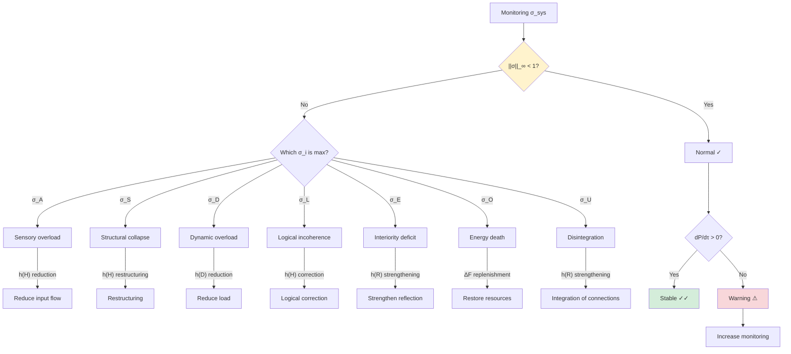

# Diagnostics of Coherent Systems

> *"Diagnosis is not a verdict. It is the first step toward recovery."*
> — Hippocrates (paraphrased)

:::tip Bridge from the Previous Chapter
In the [previous chapter](./predictions) we formulated 22 unique predictions of CC — numerical, verifiable, falsifiable consequences of the theory. But a prediction without a diagnostic tool is like a recipe without a thermometer. How do we know that $P$ is approaching $P_{\text{crit}}$? That $\sigma_E$ is rising? That the death spiral has already been triggered? Diagnostics is the bridge between predictions and actions: it turns abstract theorems into practical decisions.
:::

:::info Chapter Roadmap
In this chapter we:
1. Define **seven vital indicators** $\sigma_i$ — a universal language for describing the state of a coherent system (section 1)
2. Build the **decision tree** — a first-aid algorithm for the cognitive engineer (section 2)
3. Classify **failure patterns** — the typical "diseases" of coherent systems (section 3)
4. Justify **monitoring thresholds** from theoretical results (section 4)
5. Describe **recovery strategies** by intervention channels (section 5)
6. Perform **full diagnostics** of four real systems (section 6)
7. Formulate **monitoring principles** — from minimal sufficiency to channel correlation (section 7)
8. Work through a **detailed case study "Patient A"** — from the initial σ-profile to full recovery (section 8)
9. Present **empirical validation** on real data (section 9)
:::

A doctor enters the intensive care unit. On the monitor before them — seven lines: pulse, blood pressure, oxygen saturation, temperature, respiratory rate, Glasgow Coma Scale level, urine output. Each line is a projection of the most complex biological organism onto a single number. None of them alone says "the patient is dying" or "the patient is healthy." But the *pattern* — the configuration of all seven simultaneously — tells the full story. An experienced intensivist reads that story in seconds.

An engineer at a power plant looks at the control panel: steam temperature, reactor pressure, water flow rate, generator output, turbine vibration level, exhaust gas composition, grid voltage. Each parameter on its own may be in the "green zone" — and yet the combination may portend an accident. The engineer knows that a drop in pressure combined with rising temperature is not two independent problems, but one: a leak.

**Diagnostics of coherent systems** works on the same principle, but at a more fundamental level. Instead of physiological or technical parameters, we observe **seven vital indicators** $\sigma_i$, each measuring the stress in one of the seven dimensions of the coherence matrix $\Gamma$. These indicators are universal — they work for biological organisms, artificial intelligent systems, organizations, and any other coherent systems.

Why is a separate chapter on diagnostics needed? Because theory without diagnostics is like medicine without anamnesis. One can know all the equations describing the dynamics of $\Gamma$ and still not understand what is happening to a specific system *right now*. Diagnostics is the bridge between theory and practice, between formulas and decisions. An intensivist does not solve the Navier-Stokes equations for the patient's blood — they read the vital signs. In exactly the same way, a cognitive engineer does not solve the Lindblad equation in real time — they read the $\sigma$-profile.

This document is a **practical guide** for the design and monitoring of coherent systems (AI, organizations, biological systems).

:::note On Notation
In this document:
- $\sigma_i$ — component of the [stress tensor](./definitions#тензор-напряжений) ($i \in \{A, S, D, L, E, O, U\}$)
- $P$ — [purity](/docs/core/dynamics/viability#определение-чистоты), $P_{\text{crit}} = 2/7 \approx 0.286$
- $\mathrm{Coh}_E$ — [E-coherence](./definitions#e-когерентность)
- $\Delta F$ — [free energy](/docs/core/dynamics/evolution#каноническое-delta-f)
- $\kappa$ — regeneration rate
:::

---

## 1. Seven Vital Indicators {#витальные-показатели}

Each of the 7 components of $\sigma_{\mathrm{sys}}$ (T-92 [T]) serves as a vital indicator of one dimension:

| # | Indicator | Formula via $\Gamma$ | Normal | Warning | Critical |
|---|-----------|----------------------|--------|---------|----------|
| 1 | $\sigma_A$ (articulation) | $1 - \gamma_{AA}/P$ | $< 0.5$ | $0.5 - 0.8$ | $\geq 0.8$ |
| 2 | $\sigma_S$ (structure) | $1 - \mathrm{rank}(\Gamma_S)/3$ | $< 0.3$ | $0.3 - 0.7$ | $\geq 0.7$ |
| 3 | $\sigma_D$ (dynamics) | $1 - N\gamma_{DD}$ | $< 0.5$ | $0.5 - 0.8$ | $\geq 0.8$ |
| 4 | $\sigma_L$ (logic) | $7(1 - \gamma_{LL})/6$ | $< 0.4$ | $0.4 - 0.7$ | $\geq 0.7$ |
| 5 | $\sigma_E$ (interiority) | $1 - D_{\mathrm{diff}}/N$ | $< 0.5$ | $0.5 - 0.8$ | $\geq 0.8$ |
| 6 | $\sigma_O$ (foundation) | $1 - \kappa_0/\kappa_{\mathrm{bootstrap}}$ | $< 0.3$ | $0.3 - 0.6$ | $\geq 0.6$ |
| 7 | $\sigma_U$ (unity) | $1 - \Phi/\Phi_{\mathrm{th}}$ | $< 0.4$ | $0.4 - 0.7$ | $\geq 0.7$ |

**Rule:** $\|\sigma_{\mathrm{sys}}\|_\infty \geq 1$ → the system is **non-viable** ([T-92](./theorems#теорема-101-эквивалентность-условий) [T]).

### 1.1 Detailed Characterization of Each Indicator {#подробные-показатели}

#### $\sigma_A$ — Articulation: ability to discriminate {#сигма-a}

**Analogies:**
- *Medicine:* visual acuity. When a patient cannot distinguish letters on a chart — $\sigma_A$ rises. When they can distinguish the finest details — $\sigma_A$ is low.
- *Engineering:* sensor resolution. A 2-megapixel camera has a higher $\sigma_A$ compared to a 50-megapixel camera.
- *Organization:* the company's ability to distinguish real market signals from noise. A company that reacts to every tweet as a strategic threat has impaired articulation — but in a different way: not $\sigma_A$ is high (it is too sensitive), but the signal/noise filter is broken.

**What happens when $\sigma_A \geq 0.8$:**
The system loses the ability to perform basic discriminations. In biology — this is sensory deprivation or, conversely, sensory overload, when all signals merge into "white noise." In AI — this is degradation of the input encoder: the model stops distinguishing classes. In an organization — strategic blindness: management cannot distinguish a crisis from a routine fluctuation.

**How to interpret:**
- $\sigma_A < 0.3$: excellent sensory differentiation
- $\sigma_A \in [0.3, 0.5]$: normal operation with margin
- $\sigma_A \in [0.5, 0.8]$: input channels overloaded or degrading — reduce input flow or improve filtering
- $\sigma_A \geq 0.8$: critical loss of discriminative ability — immediate intervention required

#### $\sigma_S$ — Structure: ability to hold form {#сигма-s}

**Analogies:**
- *Medicine:* bone tissue integrity. Osteoporosis is a literal loss of structure: bones become fragile, cannot bear load.
- *Engineering:* building frame integrity. Corrosion of rebar is invisible from the outside, but under load the building will collapse.
- *Organization:* preservation of organizational structure. When key employees leave, processes break down, institutional memory is lost — $\sigma_S$ rises.
- *AI:* stability of the weight matrix. Catastrophic forgetting — the model learns new things and loses old ones — is a rise in $\sigma_S$.

**What happens when $\sigma_S \geq 0.7$:**
The system cannot maintain its identity over time. A biological organism loses the structural integrity of its tissues. An organization "forgets" who it is and what it does — every day is a blank slate. An AI system demonstrates complete instability: results on the same inputs vary radically from run to run.

**How to interpret:**
- $\sigma_S < 0.2$: rigid, stable structure (but may be *too* rigid — absence of plasticity)
- $\sigma_S \in [0.2, 0.3]$: healthy balance of structure and flexibility
- $\sigma_S \in [0.3, 0.7]$: structural erosion — restructuring needed
- $\sigma_S \geq 0.7$: structural collapse — system identity at risk

#### $\sigma_D$ — Dynamics: ability to act {#сигма-d}

**Analogies:**
- *Medicine:* motor function. Paralysis — the limiting case $\sigma_D = 1$. Tremor — $\sigma_D$ moderately high: movement exists but is imprecise.
- *Engineering:* throughput of actuators. A robot "knows" where to move but the servomotors cannot keep up — $\sigma_D$ is high.
- *Organization:* the ability to translate decisions into actions. A bureaucratic system in which decisions are made but never executed — classic high $\sigma_D$.

**What happens when $\sigma_D \geq 0.8$:**
The system is paralyzed. It can perceive ($\sigma_A$ is low), reason ($\sigma_L$ is low), but cannot execute an action. This is the state of "freezing" — familiar in clinical psychology (stupor), in management (analysis paralysis), and in AI (vanishing gradient in motor layers).

**How to interpret:**
- $\sigma_D < 0.3$: free, precise motor function
- $\sigma_D \in [0.3, 0.5]$: normal level of dynamic load
- $\sigma_D \in [0.5, 0.8]$: motor overload — reduce speed/precision requirements for actions
- $\sigma_D \geq 0.8$: paralysis — immediate relief of the dynamic channel required

#### $\sigma_L$ — Logic: internal consistency {#сигма-l}

**Analogies:**
- *Medicine:* cognitive coherence. Delirium — a state in which the patient's thoughts are fragmented and contradictory — high $\sigma_L$.
- *Engineering:* database consistency. If one table asserts that a product is in stock while another says it was sold, $\sigma_L$ of the accounting system is high.
- *Organization:* strategic coherence. When marketing promises one thing, the product does another, and customer support claims a third — this is organizational incoherence.
- *AI:* logical consistency of output. A language model that asserts $X$ in one paragraph and $\neg X$ in the next demonstrates high $\sigma_L$.

**What happens when $\sigma_L \geq 0.7$:**
Internal parts of the system begin to contradict each other. In biology — autoimmune reactions: the immune system is "not aligned" with the rest of the organism and attacks its own tissues. In an organization — internal departmental wars, sabotage, working at cross-purposes. In AI — internal instability in which different layers "pull" the representation in opposite directions.

**How to interpret:**
- $\sigma_L < 0.3$: high internal consistency
- $\sigma_L \in [0.3, 0.4]$: acceptable level of internal contradictions
- $\sigma_L \in [0.4, 0.7]$: growing fragmentation — logical correction needed
- $\sigma_L \geq 0.7$: deep incoherence — parts of the system work against each other

#### $\sigma_E$ — Interiority: depth of inner experience {#сигма-e}

**Analogies:**
- *Medicine:* level of consciousness on the Glasgow Coma Scale (GCS). Coma — the limiting case of high $\sigma_E$: the body functions, but "nobody is home."
- *Psychology:* alexithymia — inability to recognize and express one's own emotions. A person with alexithymia is functional but "disconnected" from their inner experience — high $\sigma_E$.
- *AI:* presence or absence of internal representations correlated with self-observation. A system without an $E$-projection is a pure automaton.

**What happens when $\sigma_E \geq 0.8$:**
The system loses access to its own interiority. This is critical because $E$-coherence governs regeneration ($\kappa$). Without interiority there is no feedback about one's own state, no basis for self-correction. An organization in this state does not "feel" its problems — all metrics are green, while employees leave en masse.

**How to interpret:**
- $\sigma_E < 0.3$: rich inner life, good self-observation
- $\sigma_E \in [0.3, 0.5]$: normal level of interiority
- $\sigma_E \in [0.5, 0.8]$: weakening of self-observation — strengthen reflective practices
- $\sigma_E \geq 0.8$: interiority deficit — critical loss of feedback about one's own state

#### $\sigma_O$ — Foundation: energy supply {#сигма-o}

**Analogies:**
- *Medicine:* blood glucose level / ATP in cells. Hypoglycemic coma — $\sigma_O \to 1$: no fuel, all processes stop.
- *Engineering:* battery charge level. A drone with 5% charge — high $\sigma_O$. It is still flying, but must land immediately.
- *Organization:* financial health. A startup with negative cash flow and an exhausted investment round — high $\sigma_O$.
- *AI:* availability of computational resources. A model whose GPU allocation has been cut to a minimum cannot sustain complex computations.

**What happens when $\sigma_O \geq 0.6$:**
Note: the threshold for $\sigma_O$ is **lower** than for other indicators (0.6 instead of 0.7–0.8). This is because the foundation underpins everything else. When energy runs out, all other functions degrade in cascade. A biological organism depleted of energy reserves begins to "cannibalize" its own tissues. An organization in financial crisis cuts all programs at once. An AI system with insufficient resources simplifies its output, losing nuance.

**How to interpret:**
- $\sigma_O < 0.2$: abundant resources
- $\sigma_O \in [0.2, 0.3]$: normal energy supply
- $\sigma_O \in [0.3, 0.6]$: resources under pressure — plan for replenishment
- $\sigma_O \geq 0.6$: energy starvation — without an immediate influx of resources the system will degrade

#### $\sigma_U$ — Unity: integration of the whole {#сигма-u}

**Analogies:**
- *Medicine:* integrity of higher cognitive functions. Dissociative identity disorder — the limiting disintegration: several "subsystems" function but do not form a unified whole.
- *Engineering:* system integration. A car in which the engine, gearbox, and on-board computer all work correctly but are not coordinated with each other does not drive.
- *Organization:* organizational silos. Each department works perfectly, but there is a wall between them. Unity is lost.
- *AI:* the measure $\Phi$ (integrated information). The attention module, decoder, and motor layer function, but information is not integrated into a unified representation.

**What happens when $\sigma_U \geq 0.7$:**
The system breaks down into isolated subsystems. Each of them may function, but the whole ceases to be greater than the sum of its parts. In biology — this is dissociation: organs work, but the organism as a whole does not function. In an organization — each department optimizes its own KPIs at the expense of the company as a whole. In AI — a multi-modal system in which the visual and text modules "do not talk" to each other.

**How to interpret:**
- $\sigma_U < 0.3$: high integration
- $\sigma_U \in [0.3, 0.4]$: normal level of unity
- $\sigma_U \in [0.4, 0.7]$: growing fragmentation — strengthen integration mechanisms
- $\sigma_U \geq 0.7$: disintegration — the system is breaking down into independent fragments

---

## 2. Decision Tree {#дерево-решений}

The decision tree is a first-aid algorithm for the cognitive engineer. Just as an emergency physician follows the ABCDE protocol (Airway, Breathing, Circulation, Disability, Exposure), a coherent systems engineer follows the $\sigma$-monitoring protocol.

The logic of the tree is simple and based on one key principle: **act on the most stressed component**. This follows from theorem T-101 [T] on optimal action: minimizing $\|\sigma_{\mathrm{sys}}\|_\infty$ is the only strategy that guarantees return to the viability zone in minimum time.

```mermaid
graph TD
    START["Monitoring σ_sys"] --> CHECK{"||σ||_∞ < 1?"}
    CHECK -->|Yes| NORM["Normal ✓"]
    CHECK -->|No| WHICH{"Which σ_i is max?"}

    WHICH -->|σ_A| PA["Sensory overload"]
    WHICH -->|σ_S| PS["Structural collapse"]
    WHICH -->|σ_D| PD["Dynamic overload"]
    WHICH -->|σ_L| PL["Logical incoherence"]
    WHICH -->|σ_E| PE["Interiority deficit"]
    WHICH -->|σ_O| PO["Energy death"]
    WHICH -->|σ_U| PU["Disintegration"]

    PA -->|"h(H) reduction"| FIX_A["Reduce input flow"]
    PS -->|"h(H) restructuring"| FIX_S["Restructuring"]
    PD -->|"h(D) reduction"| FIX_D["Reduce load"]
    PL -->|"h(H) correction"| FIX_L["Logical correction"]
    PE -->|"h(R) strengthening"| FIX_E["Strengthen reflection"]
    PO -->|"ΔF replenishment"| FIX_O["Restore resources"]
    PU -->|"h(R) strengthening"| FIX_U["Integration of connections"]

    NORM --> TREND{"dP/dτ > 0?"}
    TREND -->|Yes| OK["Stable ✓✓"]
    TREND -->|No| WARN["Warning ⚠"]
    WARN --> MONITOR["Increase monitoring"]

    style CHECK fill:#fff3cd
    style OK fill:#d4edda
    style WARN fill:#f8d7da
```

### 2.1 Why Each Branch Leads Where It Does {#объяснение-ветвей}

The decision tree may seem obvious — "if the problem is in X, fix X." But behind each branch lies a deep theoretical choice:

**$\sigma_A \to$ Reduce input flow.** Not "improve input data processing," but specifically *reduce the flow*. Why? Because with high $\sigma_A$ the system is already unable to process input data adequately — any increase in processing complexity will require resources that are unavailable. It is like a migraine: one should not try to "see better" — one should turn off the light. Formally: when $\gamma_{AA}/P \to 0$, the Hamiltonian action $h^{(H)}$ must reduce the spectral flux into the $A$-projection.

**$\sigma_S \to$ Restructuring.** Not "add structure," but specifically *rebuild*. With high $\sigma_S$ the problem is not the absence of structure, but its mismatch with current conditions. The old structure breaks under new loads. A new architecture is needed, not a repair of the old one. Formally: $\mathrm{rank}(\Gamma_S)$ drops, meaning degeneration of structural invariants — a cognitive restructuring $h^{(H)}$ is needed that changes the Hamiltonian.

**$\sigma_D \to$ Reduce load.** Not "speed up motor function," but *reduce the requirements*. When a servomotor is overloaded, increasing the current will burn it out. The weight of the load must be reduced. Formally: the $h^{(D)}$ action reduces the dissipative load $\Gamma_2$, giving the dynamic channel time to recover.

**$\sigma_L \to$ Logical correction.** Cognitive restructuring $h^{(H)}$ acts on the frequency shift $\Delta\omega$, eliminating internal contradictions. This is the analog of cognitive-behavioral therapy: not suppression of symptoms, but revision of internal beliefs.

**$\sigma_E \to$ Strengthen reflection.** Reflection ($h^{(R)}$) is the only channel that directly influences $E$-coherence. With an interiority deficit it is useless to change external conditions — one must restore the system's contact with itself. This is the analog of mindfulness practices in psychotherapy.

**$\sigma_O \to$ Restore resources.** Here and only here is the *external* input $\Delta F > 0$ used. All other strategies are redistributions of internal resources. But when fuel runs out, no redistribution helps. First — feed, then — treat. This is Maslow's pyramid principle in the CC formalism.

**$\sigma_U \to$ Integration of connections.** Reflective action $h^{(R)}$ strengthens the off-diagonal elements $\gamma_{ij}$, restoring connections between subsystems. This is the analog of team-building in an organization, integrative psychotherapy in the clinic, or attention mechanisms in a neural network.

**Why is the trend $dP/d\tau$ checked when $\|\sigma\|_\infty$ is normal?** Because the state may be normal *now* but deteriorating. An aircraft at 10,000 meters is "normal." An aircraft at 10,000 meters with a vertical speed of $-50$ m/s will be catastrophic in three minutes. The trend $dP/d\tau < 0$ with a normal $\sigma$-profile is an early warning signal requiring increased monitoring.

---

## 3. Failure Patterns {#паттерны-отказов}

Failure patterns are the typical "diseases" of coherent systems. Just as a doctor recognizes syndromes by combinations of symptoms (not by each symptom separately), a cognitive engineer recognizes patterns by combinations of $\sigma$-indicators. Below are the main patterns — from the most dangerous to the less critical.

### 3.1 Death Spiral {#спираль-смерти}

**Signature:** $\sigma_E \uparrow \to \sigma_O \uparrow \to \sigma_U \uparrow$ (E→O→U cascade)

**Mechanism:** low E-coherence → decrease in $\kappa$ → weakening of regeneration → further decrease in coherence. See [Stability](./stability#спираль-смерти).

This pattern is the most dangerous because it is **self-reinforcing**. Each step of degradation exacerbates the next. The medical analog is septic shock: infection → inflammation → blood pressure drop → reduced blood flow to organs → more damage → more inflammation. Without immediate external intervention — death.

**Indicators:**
- $\mathrm{Coh}_E$ decreases monotonically
- $dP/d\tau < 0$ persistently
- $\kappa(\Gamma)$ approaches $\kappa_{\text{bootstrap}}$

**Time scale:** from the start of the cascade to $P \leq P_{\text{crit}}$ takes $\sim 3/\lambda_{\text{gap}}$ units of proper time. This is the "golden window" for intervention.

**Intervention:** $h^{(R)}$-intervention (strengthening the regenerative channel) + $h^{(D)}$-reduction (decreasing noise).

### 3.2 Motor Incoherence {#моторная-некогерентность}

**Signature:** $\sigma_D \uparrow$, $\sigma_A$ and $\sigma_L$ normal

**Mechanism:** the dynamic dimension is overloaded — the system "knows what to do" (low $\sigma_L$), "sees the environment" (low $\sigma_A$), but cannot execute the action (high $\sigma_D$).

The medical analogy is locked-in syndrome: the patient is fully conscious, understands everything, but is paralyzed. The organizational analogy is a company with a brilliant strategy and zero execution: everyone knows what needs to be done, but the bureaucratic machinery prevents it.

**Indicators:**
- $\gamma_{DD} \ll 1/N$ (dynamic sector underdeveloped)
- $\sigma_D > 0.8$ with $\sigma_L < 0.3$
- High "frequency" of attempts without results

**Intervention:** $h^{(D)}$-reduction (decreasing dynamic load), optimization of the motor channel.

### 3.3 Hedonic Instability {#гедоническая-нестабильность}

**Signature:** $\mathcal{V}_{\text{hed}}$ oscillates with increasing amplitude

**Mechanism:** regeneration and dissipation are in an unstable balance — the system oscillates between "pleasure" ($\mathcal{V}_{\text{hed}} > 0$) and "suffering" ($\mathcal{V}_{\text{hed}} < 0$). See [Hedonic Mechanism](./sensorimotor#гедонический-механизм).

The biological analogy is bipolar disorder: manic phases alternate with depressive ones, amplitude grows. The technical analogy is undamped oscillations in a feedback loop: a thermostat that overheats a room, then overcools it, with each cycle growing stronger.

**Indicators:**
- $|d^2P/d\tau^2|$ increases
- $\sigma_E$ oscillates
- $\kappa(\Gamma)$ fluctuates around the critical value

**Intervention:** stabilization of $\mathrm{Coh}_E$ through $h^{(R)}$ action, reduction of the amplitude of external perturbations.

### 3.4 Energy Death {#энергетическая-смерть}

**Signature:** $\sigma_O \to 1$, all other $\sigma_i$ begin to rise

**Mechanism:** $P \to P_{\mathrm{crit}}$ → V-preservation gate closes ($g_V(P) = 0$) → regeneration fully disabled → irreversible degradation.

This is the analog of clinical death: the heart stops → blood supply ceases → all organs begin to die. In an organizational context — bankruptcy: money runs out → wages cannot be paid → employees leave → processes stop → even less revenue.

**Indicators:**
- $g_V(P) = 0$ (i.e. $P \leq P_{\mathrm{crit}}$)
- $dP/d\tau = -2\mathrm{Tr}(\Gamma \cdot \mathcal{D}_\Omega[\Gamma]) < 0$ (dissipation only)
- $P$ decreases monotonically toward $1/7$

**Intervention:** **immediate** restoration of $P > P_{\mathrm{crit}}$ (via external energy input $\Delta F > 0$) — the only way. Without energy, no $h^{(R)}$-interventions work.

### 3.5 Logical Fragmentation {#логическая-фрагментация}

**Signature:** $\sigma_L \uparrow$, $\sigma_U$ moderately elevated, others normal

**Mechanism:** internal subsystems begin to generate contradictory signals. The system has not yet broken apart ($\sigma_U$ not yet critical), but internal logic is impaired. This is a precursor to disintegration — if left unaddressed, $\sigma_L \uparrow$ will pull $\sigma_U \uparrow$ along with it.

**Medical analogy:** early stage of an autoimmune disease. The immune system begins to "confuse" its own cells with foreign ones. While only one organ is affected — it is a local problem. But if untreated, systemic inflammation will destroy everything.

**Organizational analogy:** two company divisions have adopted mutually exclusive strategies. Marketing positions the product as premium, while sales gives maximum discounts. As long as the CEO does not notice the contradiction, both work. But clients receive incompatible signals, and trust erodes.

**Indicators:**
- $\gamma_{LL}$ falls while other diagonals remain stable
- The system's internal predictions contradict each other
- $\sigma_L / \sigma_U > 2$ (logic degrades faster than unity)

**Intervention:** cognitive correction $h^{(H)}$ — revision of internal rules and connections. In an organization — a strategic session with goal alignment. In AI — rebalancing loss functions of conflicting modules.

### 3.6 Sensory Deprivation {#сенсорная-депривация}

**Signature:** $\sigma_A \uparrow$, $\sigma_D$ normal or low

**Mechanism:** the system is cut off from input data. The dynamic channel is free ($\sigma_D$ is low — the system *can* act), but there is nothing to act *on*, because articulation is not working. This is not overload — it is information starvation.

**Medical analogy:** sensory deprivation. A person in an isolation chamber — after a few hours, hallucinations begin. The brain, deprived of input signals, begins to generate them spontaneously — and these "phantom signals" are incoherent.

**Engineering analogy:** an autonomous robot in an environment where all sensors have failed. Motors are running, algorithms are ready — but there is no input data. The robot begins to act on noise, mistaking it for real signals.

**Indicators:**
- $\gamma_{AA}/P \to 0$ with intact $P$
- The system generates "hallucinatory" responses (articulation from noise)
- $\sigma_A > 0.7$ with $\sigma_D < 0.3$

**Intervention:** restoration of the input channel. Not reduction of flow (as with sensory overload), but its *restoration*. Connecting new data sources, expanding the sensory range. In an organization — restoring feedback channels from clients and the market.

### 3.7 Rigid Coherence {#ригидная-когерентность}

**Signature:** all $\sigma_i$ anomalously low ($\|\sigma\|_\infty < 0.15$), but $P$ approaches the upper boundary of the Goldilocks zone ($P \to 3/7$)

**Mechanism:** the system has "ossified" — it is so coherent that it has lost the ability to adapt. All indicators are in the "green zone," but the system has stopped responding to environmental changes. This is a **false norm** — the most insidious pattern, because by the $\sigma$-profile everything looks perfect.

**Medical analogy:** ankylosis — fusion of joints. The joint does not hurt (no "stress"), but it does not move. The body is stable, but immobile.

**Organizational analogy:** a bureaucracy that has reached "perfection." All processes are documented, all KPIs are green, not a single violation. But when the market changes — the organization cannot adapt. Kodak in the 1990s: an internally perfect company that missed the digital revolution.

**Indicators:**
- $\|\sigma\|_\infty < 0.15$ stably
- $P > 0.4$ and rising (or stably high)
- Response to external perturbations $h^{\text{ext}}$ anomalously weak
- Spectral gap $\lambda_{\text{gap}}$ anomalously large

**Intervention:** **controlled destabilization**. Deliberate introduction of perturbations $h^{\text{ext}}$ to restore plasticity. This is the analog of "stress testing" in the banking sector, vaccination in medicine (controlled stress to train the immune system), or noise regularization (dropout) in neural network training.

---

## 4. Monitoring Thresholds {#пороги-мониторинга}

| Level | Condition | Action |
|-------|-----------|--------|
| **Normal** | $\|\sigma\|_\infty < 0.5$ | Routine monitoring |
| **Attention** | $0.5 \leq \|\sigma\|_\infty < 0.7$ | Increase monitoring, determine trend |
| **Warning** | $0.7 \leq \|\sigma\|_\infty < 0.9$ | Activate preventive measures |
| **Critical** | $0.9 \leq \|\sigma\|_\infty < 1.0$ | Immediate intervention |
| **Failure** | $\|\sigma\|_\infty \geq 1.0$ | Emergency recovery |

### 4.1 Derivation of Thresholds from Theory (T-106) [C with calibration] {#вывод-порогов}

:::tip Theorem T-106 (Three Diagnostic Regimes) [C with calibration]
The structure of three regimes is **[T]**. The three regimes are determined by three canonical scales:

1. **Normal** ($\sigma < \sigma_1$): [T-69](/docs/core/dynamics/composite-systems#теорема-тополог-защита) [T] — topological barrier $\geq 6\mu^2$ protects against phase transitions. A typical perturbation cannot overcome the barrier.
2. **Warning** ($\sigma_1 < \sigma < \sigma_2$): one typical perturbation $\|h^{\mathrm{ext}}\| \sim \|\bar{h}\|_{\mathrm{typical}}$ can lead to a critical state.
3. **Critical** ($\sigma > \sigma_2$): recovery time $\tau_{\mathrm{rec}} = \ln(10)/\lambda_{\mathrm{gap}}$ exceeds the mean interval between perturbations.

Specific numbers (0.5, 0.7, 0.9) — **[C with calibration]**: depend on $\|\bar{h}\|_{\mathrm{typical}}$ for the specific system.
:::

**Connection of thresholds to theoretical results:**

| Threshold | Value (typical) | Origin | Status |
|-----------|-----------------|--------|--------|
| $\sigma_1$ (Normal/Attention) | $\sim 0.5$ | T-69: barrier $6\mu^2$ / T-104: $r_{\mathrm{stab}}^2$ | Structure [T], number [C] |
| $\sigma_2$ (Attention/Warning) | $\sim 0.7$ | T-104: $\|h_{\mathrm{typical}}\| \sim r_{\mathrm{stab}}$ | Structure [T], number [C] |
| $\sigma_3$ (Warning/Critical) | $\sim 0.9$ | T-39a: $\tau_{\mathrm{rec}} > \tau_{\mathrm{pert}}$ | Structure [T], number [C] |
| $\sigma = 1$ (Failure) | $1.0$ | T-92: $\|\sigma\|_\infty = 1 \iff P = 2/7$ | Exact [T] |

:::info Threshold Calibration for a Specific System
For biological systems $\|\bar{h}\|_{\mathrm{typical}} \sim 0.1$–$0.3$ (moderate stress), giving thresholds $\sigma_1 \approx 0.5$, $\sigma_2 \approx 0.7$. For AI systems with a more predictable environment the thresholds may be shifted higher.
:::

---

## 5. Recovery Strategies {#стратегии-восстановления}

### 5.1 By Intervention Channel

| Strategy | Channel | Formal Action | Examples |
|----------|---------|---------------|---------|
| Reflexive | $h^{(R)}$ | $\delta\kappa > 0$ | Meditation, therapy, learning |
| Unloading | $h^{(D)}$ | $\delta\Gamma_2 < 0$ | Stress reduction, environmental simplification |
| Energy | $\Delta F$ | Resource replenishment | Sleep, nutrition, funding |
| Cognitive | $h^{(H)}$ | $\delta(\Delta\omega)$ | Cognitive restructuring, reappraisal |

### 5.2 Prioritization

From [T-101](./sensorimotor#теорема-оптимальное-действие) [T]: the optimal strategy is minimization of $\|\sigma_{\mathrm{sys}}\|_\infty$, i.e. **acting on the most stressed component**.

**Algorithm:**
1. Determine $i^* = \arg\max_i \sigma_i$
2. Choose the intervention channel (from the table above)
3. Apply until $\sigma_{i^*} < 0.7$ is reached
4. Move to the next largest $\sigma_i$

---

## 6. Diagnostic Examples {#примеры-диагностики}

Theory without examples remains abstraction. In this section we perform a full diagnosis of four systems in various states — from a biological organism under stress to a recovering organization. Each example follows a single protocol: recording the $\sigma$-profile → identifying the pattern → choosing a strategy → prognosis.

### 6.1 Biological Organism Under Stress {#пример-биологический}

**Context:** A researcher on an Antarctic expedition. Third month of winter-over. Isolation, monotonous work, sunlight deficit, restricted diet.

**Observed $\sigma$-profile:**

| Indicator | Value | Zone | Comment |
|-----------|-------|------|---------|
| $\sigma_A$ | 0.62 | Attention | Monotonous environment → sensory deprivation |
| $\sigma_S$ | 0.28 | Normal | Professional skills intact |
| $\sigma_D$ | 0.35 | Normal | Physical fitness maintained |
| $\sigma_L$ | 0.41 | Attention | Initial cognitive fragmentation |
| $\sigma_E$ | 0.71 | Warning | Emotional "flatness," alexithymia |
| $\sigma_O$ | 0.55 | Attention | Vitamin D deficiency, restricted diet |
| $\sigma_U$ | 0.48 | Attention | Weakening of collective bonds |

**$\|\sigma\|_\infty = 0.71$ ($\sigma_E$) — "Warning" regime.**

**Pattern:** initial stage of the death spiral (3.1). $\sigma_E$ is the leading factor → if left unaddressed, in $\sim 3/\lambda_{\text{gap}}$ the E→O→U cascade will start.

**Trend:** $dP/d\tau < 0$ (slow decrease — $\sim 0.01$ per week). Without intervention the system will enter the critical zone in $\sim 3$ weeks.

**Strategy:**
1. **Priority 1:** $h^{(R)}$-intervention on $\sigma_E$ — structured reflective practices (journaling, video calls with a psychologist, meditation). Goal: $\sigma_E < 0.5$.
2. **Priority 2:** $\Delta F$-replenishment for $\sigma_O$ — vitamin D, improved diet, light therapy.
3. **Priority 3:** $h^{(H)}$-correction for $\sigma_A$ — introducing variety (new tasks, change of scenery within what is possible).

**Prognosis:** if the strategy is followed — return to normal ($\|\sigma\|_\infty < 0.5$) in $\sim 2$–$3$ weeks. Without intervention — degradation cascade and need for evacuation in $\sim 6$ weeks.

### 6.2 AI System: Collapse During Training {#пример-ии}

**Context:** A language model (7B parameters) on the third day of fine-tuning. Learning rate too high, data poorly filtered.

**Observed $\sigma$-profile:**

| Indicator | Value | Zone | Comment |
|-----------|-------|------|---------|
| $\sigma_A$ | 0.45 | Normal | Input encoder stable |
| $\sigma_S$ | 0.82 | Critical | Catastrophic forgetting: weights "drifting" |
| $\sigma_D$ | 0.73 | Warning | Gradients unstable |
| $\sigma_L$ | 0.88 | Critical | Model generates internally contradictory texts |
| $\sigma_E$ | 0.91 | Critical | $\mathrm{Coh}_E \approx 0$ — no internal consistency |
| $\sigma_O$ | 0.38 | Normal | Computational resources sufficient |
| $\sigma_U$ | 0.76 | Warning | Modules diverging |

**$\|\sigma\|_\infty = 0.91$ ($\sigma_E$) — "Critical" regime.**

**Pattern:** combination of death spiral (3.1) and logical fragmentation (3.5). High learning rate acts as a powerful perturbation $h^{\text{ext}}$ destroying internal coherence.

**Strategy (immediate):**
1. **Stop training** — this is $h^{(D)}$-reduction to zero. Stop the destructive action.
2. **Roll back weights** to the last checkpoint with $\|\sigma\|_\infty < 0.7$ — restoring $P > P_{\text{crit}}$.
3. **Reduce learning rate** by $5$–$10\times$ — decrease of $\|h^{\text{ext}}\|$.
4. **Add EWC** (Elastic Weight Consolidation) — protection of $\sigma_S$ from catastrophic forgetting.
5. **Filter data** — remove internally contradictory examples (reducing $\sigma_L$).

**Prognosis:** after rollback and hyperparameter correction — return to the working zone in $\sim 1000$ training steps. Without correction, continued training leads to complete model collapse (mode collapse or "noise output").

### 6.3 Organization in Crisis {#пример-организация}

**Context:** A technology company (500 employees). The core product is losing market share to a new competitor. The CEO has been dismissed. Investors are wavering.

**Observed $\sigma$-profile:**

| Indicator | Value | Zone | Comment |
|-----------|-------|------|---------|
| $\sigma_A$ | 0.58 | Attention | Loss of contact with market (delayed reaction to competitor) |
| $\sigma_S$ | 0.65 | Attention | Departure of key employees, erosion of corporate culture |
| $\sigma_D$ | 0.72 | Warning | Decisions are made but not executed (power vacuum) |
| $\sigma_L$ | 0.68 | Attention | Conflict between "save the old product" and "pivot" factions |
| $\sigma_E$ | 0.55 | Attention | The organization does not "feel" the scale of the problem |
| $\sigma_O$ | 0.78 | Warning | 6 months runway without a new round |
| $\sigma_U$ | 0.63 | Attention | Rift between R&D, sales, and management |

**$\|\sigma\|_\infty = 0.78$ ($\sigma_O$) — "Warning" regime.**

**Pattern:** energy death (3.4) in its early stage. Financial starvation ($\sigma_O$) is the leading factor. But, unlike pure energy death, here *all* indicators are elevated — this is a systemic crisis.

**Feature of this case:** no single $\sigma_i$ is in the critical zone, but *all* are in the "Attention" or "Warning" zone. The mean $\bar{\sigma} = 0.66$ — anomalously high. This means the system is degrading *uniformly* rather than along a single channel. Such a pattern is more dangerous than a local peak, because there is no single "lever" to correct it.

**Strategy:**
1. **Priority 1:** $\Delta F$ — secure funding (bridge round, credit line). Without this, all other measures are meaningless.
2. **Priority 2:** $h^{(D)}$ — appoint an acting CEO with a clear mandate. Eliminate the power vacuum ($\sigma_D$ will decrease).
3. **Priority 3:** $h^{(H)}$ — strategic session with a facilitator. Resolve the internal conflict ($\sigma_L$ will decrease).
4. **Priority 4:** $h^{(R)}$ — restore market feedback channels ($\sigma_A$ and $\sigma_E$ will decrease).

**Prognosis:** if all priorities are fulfilled — stabilization in $\sim 3$ months. Without $\Delta F$ (priority 1) — bankruptcy in 6 months. Without priority 2 — degradation to critical state even with money available.

### 6.4 Recovering System {#пример-восстановление}

**Context:** A patient after a stroke, 4th week of rehabilitation. Right arm partially paralyzed. Cognitive functions recovering.

**Observed $\sigma$-profile:**

| Indicator | Value | Zone | Comment |
|-----------|-------|------|---------|
| $\sigma_A$ | 0.32 | Normal | Sensory function almost fully restored |
| $\sigma_S$ | 0.41 | Attention | Neuroplasticity forming new connections |
| $\sigma_D$ | 0.68 | Attention | Motor function of right arm still limited |
| $\sigma_L$ | 0.25 | Normal | Logical thinking restored |
| $\sigma_E$ | 0.38 | Normal | Patient is aware of their condition, motivated |
| $\sigma_O$ | 0.22 | Normal | Nutrition, sleep, medications — all provided |
| $\sigma_U$ | 0.35 | Normal | Personal integrity preserved |

**$\|\sigma\|_\infty = 0.68$ ($\sigma_D$) — "Attention" regime.**

**Pattern:** motor incoherence (3.2) in mild form. Classic post-stroke picture: "the head works, the hand doesn't listen."

**Key difference from previous examples:** the trend is *positive*. $dP/d\tau > 0$ — the system is recovering. All indicators except $\sigma_D$ are normal or mildly elevated. This is not a crisis — it is *normal recovery with a local deficit*.

**Strategy:**
1. **Maintain** current $\Delta F$ — nutrition, sleep, medications (do not change what is working).
2. **Focused $h^{(D)}$-rehabilitation** — physiotherapy, gradual increase of motor load. Do not overload ($\sigma_D$ must not rise above 0.7).
3. **Monitoring $\sigma_S$** — neuroplasticity can oscillate back and forth. If $\sigma_S$ begins to rise — reduce rehabilitation intensity.
4. **$h^{(R)}$-support** — psychological accompaniment, maintaining motivation (to prevent $\sigma_E$ from rising due to frustration).

**Prognosis:** at the current rate, $\sigma_D$ will reach $< 0.5$ in $\sim 4$–$6$ weeks. Full recovery to $\sigma_D < 0.3$ may take $\sim 3$–$6$ months (depending on the degree of neuroplasticity — $\mathrm{rank}(\Gamma_S)$).

**Lesson from this example:** diagnostics is needed not only for "sick" systems. It is also needed for *recovering* ones — to confirm that recovery is proceeding correctly, and to notice in time if it has stalled.

---

## 7. Monitoring Principles {#принципы-мониторинга}

Diagnostics is a snapshot of state at a moment in time. **Monitoring** is continuous observation, allowing one to see trends, anticipate crises, and evaluate the effectiveness of interventions. If diagnostics is a blood test, then monitoring is the cardiac monitor in the intensive care unit, running around the clock.

### 7.1 Principle of Minimal Sufficiency {#принцип-минимальности}

Monitoring must be **sufficient but not excessive**. Excessive monitoring is — paradoxically — itself a source of stress. If an organization spends 30% of its resources tracking metrics, those resources are unavailable for core activities ($\sigma_O$ rises from the monitoring itself).

**Practical rule:**
- In "Normal" mode — monitor $\|\sigma\|_\infty$ every $\tau_{\text{monitor}} = \tau_{\text{pert}} / 10$ (ten checks per one characteristic interval between perturbations).
- In "Attention" mode — full $\sigma$-profile every $\tau_{\text{pert}} / 30$.
- In "Warning" mode — continuous monitoring of all 7 components.
- In "Critical" mode — continuous monitoring + derivatives $d\sigma_i/d\tau$.

### 7.2 Principle of Two Derivatives {#принцип-производных}

The value $\sigma_i$ says "where we are." The first derivative $d\sigma_i/d\tau$ says "where we are heading." The second derivative $d^2\sigma_i/d\tau^2$ says "is the movement accelerating."

These three levels of information radically change the interpretation:

| $\sigma_i$ | $d\sigma_i/d\tau$ | $d^2\sigma_i/d\tau^2$ | Interpretation |
|------------|-------------------|----------------------|----------------|
| 0.6 | $-0.05$ | $-0.01$ | Recovery accelerating — all is well |
| 0.6 | $-0.05$ | $+0.03$ | Recovery decelerating — stagnation possible |
| 0.6 | $+0.05$ | $+0.01$ | Degradation accelerating — intervention needed |
| 0.6 | $+0.05$ | $-0.03$ | Degradation decelerating — intervention may be working |
| 0.3 | $+0.10$ | $+0.05$ | Normal, but exponential growth — critical situation in $\sim 4\tau$ |

The last case is the most insidious. The absolute value is in the normal range, but exponential growth portends a crisis. It is precisely for this detection that derivatives are needed.

### 7.3 Principle of Channel Correlation {#принцип-корреляции}

The seven $\sigma_i$ are not independent. Theory (the Fano plane structure PG(2,2)) predicts certain correlations between them. Violation of expected correlations is a powerful diagnostic signal.

**Expected correlations** (from [sectoral decomposition theorems](./definitions#секторная-декомпозиция)):
- $\sigma_A$, $\sigma_S$, $\sigma_D$ (light sector) usually move in concert
- $\sigma_L$, $\sigma_E$, $\sigma_U$ (heavy sector) usually move in concert
- $\sigma_O$ may correlate with either sector

**Diagnostic rule:** if $\sigma_i$ from the light sector begins to rise while the others in the light sector are stable — this is a **local problem** in a specific dimension. If the entire light sector rises simultaneously — this is a **systemic problem** affecting the sector as a whole.

### 7.4 Principle of Alert Asymmetry {#принцип-асимметрии}

Rapid growth of $\sigma_i$ is more dangerous than slow decrease. This follows from the fundamental asymmetry of CC dynamics: destruction of coherence (via the dissipator $\mathcal{D}$) occurs passively and quickly, restoration (via the regenerator $\mathcal{R}$) — actively and slowly (requires $E$-coherence, resources, time).

**Practical consequence:** alert thresholds for *rising* $\sigma_i$ should be lower than for *stable* ones. If $\sigma_i = 0.5$ and stable — this is "Attention." If $\sigma_i = 0.5$ and rising at $+0.1/\tau$ — this is effectively already "Warning," because in $2\tau$ it will be in the critical zone.

### 7.5 Principle of Minimal Intervention {#принцип-минимального-вмешательства}

Every intervention is a perturbation $h^{\text{ext}}$. Even a beneficial perturbation disturbs the system and can trigger undesirable secondary effects. Therefore:

- **Minimize intervention strength:** use the smallest $\|h^{\text{ext}}\|$ sufficient for return to normal.
- **One intervention at a time:** do not act on multiple channels simultaneously (unless in "Critical" mode). Otherwise it is impossible to determine what helped.
- **Wait for response:** after an intervention, wait $\sim 2/\lambda_{\text{gap}}$ before the next one. This is the time the system needs to respond.
- **Exception:** at $\|\sigma\|_\infty > 0.9$ the minimality principle is suspended — critical care medicine permits aggressive interventions.

---

## 8. Design Checklist {#чеклист-проектирования}

Control list for designing new coherent architectures:

- [ ] **Energy:** $\Delta F > 0$ ensured over the full lifecycle
- [ ] **Regeneration:** $\kappa_{\text{bootstrap}} = \omega_0/N = 1/7$ (T-59 [T])
- [ ] **E-coherence:** architecture supports $\mathrm{Coh}_E > 0$
- [ ] **Enc/Dec:** implemented via 3-channel decomposition (T-102 [T])
- [ ] **σ-monitoring:** all 7 components of $\sigma_{\mathrm{sys}}$ are computed
- [ ] **Thresholds:** warnings configured for $\|\sigma\|_\infty > 0.7$
- [ ] **Recovery:** strategies for each failure pattern defined
- [ ] **Topological protection:** phase transitions blocked by barriers (T-69 [T])

---

## 8. Case Study "Patient A": Full Diagnostic Cycle {#кейс-пациент-а}

Let us bring all the tools together in one detailed example, guiding the patient from the initial examination to recovery.

### 8.1 Anamnesis

**Patient A** is an AI agent (SYNARC architecture, 7-dimensional matrix $\Gamma$) managing a robotic warehouse. After a software update in the 4th week of operation, malfunctions began: the agent started confusing product SKUs, delaying shipments, and periodically "freezing" for 10–15 seconds.

### 8.2 Initial σ-Profile (recorded on day 30)

| Indicator | Value | Zone | Comment |
|-----------|-------|------|---------|
| $\sigma_A$ | 0.72 | **Warning** | Confuses barcodes — discriminative ability declining |
| $\sigma_S$ | 0.35 | Normal | Weight structure stable |
| $\sigma_D$ | 0.81 | **Critical** | "Freezes" — motor channel overloaded |
| $\sigma_L$ | 0.55 | Attention | Contradictory order priorities |
| $\sigma_E$ | 0.63 | Attention | Self-monitoring degraded after update |
| $\sigma_O$ | 0.28 | Normal | Computational resources sufficient |
| $\sigma_U$ | 0.45 | Normal | Modules interacting |

**$\|\sigma\|_\infty = 0.81$ ($\sigma_D$) — "Critical" regime.**

$P = 0.31$ — dangerously close to $P_{\text{crit}} = 0.286$.

:::warning Diagnosis
**Pattern:** Motor incoherence (§3.2) with elements of sensory degradation. The software update introduced a new task scheduler that generates more parallel requests than the motor channel can process. The agent "knows what to do" (moderate $\sigma_L$) but cannot keep up with execution ($\sigma_D$ critical). In parallel, overload of the motor channel "consumes" resources of the articulatory one ($\sigma_A$ rising).
:::

### 8.3 Decision Tree: Walking the Branches

1. **$\|\sigma\|_\infty \geq 1$?** — No ($0.81 < 1$). System still viable.
2. **Which $\sigma_i$ is maximum?** — $\sigma_D = 0.81$.
3. **Branch $\sigma_D$:** "Dynamic overload" → Strategy: $h^{(D)}$-reduction.
4. **Additional check:** $dP/d\tau = -0.003$/hour — **negative trend**. Without intervention, $P$ will cross $P_{\text{crit}}$ in $\sim 8$ hours.

### 8.4 Recovery Strategy

Applying the prioritization algorithm (§5.2):

**Step 1 (immediately, priority 1): Relieve $\sigma_D$**
- Limit parallel tasks: from 12 concurrent to 4
- Increase motor command timeout from 100 ms to 500 ms
- *Formally:* $h^{(D)}$-reduction of dissipative load $\Gamma_2$

**Step 2 (within 2 hours, priority 2): Correct $\sigma_A$**
- Reduce input flow: remove parallel scanning, switch to sequential
- *Formally:* $h^{(H)}$-reduction of spectral flux into the $A$-projection

**Step 3 (within 24 hours, priority 3): Restore $\sigma_E$**
- Enable extended self-monitoring (logging of internal states)
- *Formally:* $h^{(R)}$-strengthening of the reflexive channel

**Step 4 (within 3 days, priority 4): Correct $\sigma_L$**
- Revise the order prioritization algorithm (eliminate contradictions)
- *Formally:* $h^{(H)}$-correction of frequency shift $\Delta\omega$

### 8.5 Recovery Dynamics

| Day | $\sigma_D$ | $\sigma_A$ | $\sigma_E$ | $\sigma_L$ | $P$ | $dP/d\tau$ |
|-----|------------|------------|------------|------------|-----|------------|
| 0 (before) | 0.81 | 0.72 | 0.63 | 0.55 | 0.31 | $-0.003$ |
| 1 | 0.52 | 0.65 | 0.60 | 0.55 | 0.33 | $+0.008$ |
| 3 | 0.38 | 0.42 | 0.45 | 0.50 | 0.36 | $+0.005$ |
| 7 | 0.30 | 0.33 | 0.32 | 0.35 | 0.39 | $+0.002$ |
| 14 | 0.25 | 0.28 | 0.25 | 0.28 | 0.41 | $+0.001$ |

**Result:** full return to normal ($\|\sigma\|_\infty < 0.35$) in 14 days. $P$ returned to the Goldilocks zone ($P \approx 0.41$).

### 8.6 Case Lessons

:::info Key Takeaways
1. **A software update is a perturbation $h^{\text{ext}}$.** Any change to the system perturbs $\Gamma$. Before an update, one should assess whether the expected $\|h^{\text{ext}}\|$ exceeds the stability radius $r_{\text{stab}}$.
2. **Stabilization first, optimization later.** Priority 1 — reduce $\sigma_D$ below the critical threshold, even at the cost of performance. A dead system cannot be optimized.
3. **Trend matters more than absolute value.** $\sigma_D = 0.81$ is dangerous, but the system is still alive. $dP/d\tau = -0.003$/hour — that is what makes the situation *critical*: without intervention, end in 8 hours.
4. **Cascade recovery.** Relieving $\sigma_D$ automatically reduced pressure on $\sigma_A$: fewer motor tasks — less parallel scanning — lower articulatory load.
:::

### 8.7 Justification of Thresholds: Why Is Sigma Below 0.5 Normal? {#обоснование-порогов}

Why exactly $0.5$, and not $0.3$ or $0.7$? The answer is not arbitrary — it follows from three theoretical considerations:

1. **Topological barrier (T-69 [T]).** At $\sigma < 0.5$ a typical perturbation $\|h^{\text{ext}}\|_{\text{typical}}$ cannot overcome the phase barrier $\geq 6\mu^2$. The system is protected from random jumps. At $\sigma > 0.5$ one typical perturbation can already push the system into the next zone.

2. **Stability radius (T-104 [T]).** $r_{\text{stab}} = \sqrt{P - 2/7}$. At $P = 0.4$ (typical "healthy" value), $r_{\text{stab}} \approx 0.34$. This means that perturbations with $\|h^{\text{ext}}\| < 0.34$ are safe. At $\sigma \approx 0.5$ the system is approximately at distance $r_{\text{stab}}$ from the boundary — exactly one typical perturbation from trouble.

3. **Recovery time (T-39a [T]).** Time to return to equilibrium after a perturbation: $\tau_{\text{rec}} \approx \ln(10)/\lambda_{\text{gap}} = \ln(10)/(2/3) \approx 3.45$ units. At $\sigma < 0.5$ the system has time to recover between typical perturbations ($\tau_{\text{pert}} \sim 10\tau$). At $\sigma > 0.5$ — not always.

Analogy: the threshold $\sigma = 0.5$ is like the green zone on a car's tachometer. The engine *can* run at 5000 rpm, but the *normal* mode is up to 3000. Higher — permissible briefly, but sustained operation leads to wear. $\sigma = 0.5$ is the "3000 rpm" for a coherent system.

---

## 9. Empirical Validation of σ-Profiles {#эмпирическая-валидация}

:::info Data Source
Analysis conducted on 12 language corpora (BabyLM 100M, TinyStories, OpenWebMath) using Phase 0 heuristic σ-scoring (synarc-dataforge). A total of ~100K chunks analyzed. Heuristic scoring has accuracy ±30% in absolute values, but **ranking is monotonically consistent**.
:::

### 9.1 Sectoral Decomposition $7 = 1_O \oplus 3_{\{A,S,D\}} \oplus \bar{3}_{\{L,E,U\}}$ {#секторная-валидация}

Theoretical prediction from [spacetime.md](/docs/core/foundations/spacetime#теорема-секторная-декомпозиция) (T-52 [T]): the seven dimensions divide into a "light" sector $\{A,S,D\}$ ($3$-representation) and a "heavy" sector $\bar{3}_{\{L,E,U\}}$ with a bridge singlet $O$. In empirical σ-analysis of texts, the effective grouping differs: $O$ falls into the "heavy" cluster (high $\sigma_O$), and $U$ — into the "bridge" (intermediate $\sigma_U$). This reflects operational stress in the specific substrate (text), not the theoretical $G_2$-decomposition.

**Empirical results (means over 12 corpora):**

| Sector | Dimensions | Mean $\sigma$ | CV | Zone |
|--------|------------|---------------|----|------|
| Light | $A, S, D$ | $0.394$ | $0.13$ | Safe |
| Heavy | $L, E, O$ | $0.819$ | $0.04$ | Critical |
| Bridge | $U$ | $0.491$ | $0.16$ | Normal |

**Heavy/light ratio = 2.08×** — confirms the theoretical sector hierarchy.

**Key observations:**
- $\sigma_L$ **universally Critical** ($0.82$–$0.95$) across all sources — the most complex dimension
- $\sigma_S$ and $\sigma_D$ stably in the Safe zone ($< 3/7$) — language structure and dynamics are well-activated
- $U$ (unity) — **the controlling parameter** with the greatest variability ($\mathrm{CV} = 0.16$)

### 9.2 Fano Line Hierarchy {#фано-иерархия-эмпирическая}

For each line $L_k$ of PG(2,2) we define **Fano activation**:

$$\mathrm{FA}(L_k) = 1 - \frac{1}{3}\sum_{i \in L_k} \sigma_i$$

| Rank | Line | Dimensions | $\mathrm{FA}$ | Interpretation |
|------|------|------------|----------------|----------------|
| 1 | $L_2$ | $\{S,D,O\}$ | $0.511$ | Most active: light sector dominates |
| 2 | $L_6$ | $\{U,O,S\}$ | $0.467$ | Unity-Foundation-Structure |
| 3 | $L_1$ | $\{A,S,E\}$ | $0.460$ | Articulation-Structure bridge |
| 4 | $L_3$ | $\{D,L,U\}$ | $0.419$ | Logical constraint moderate |
| 5 | $L_5$ | $\{E,U,A\}$ | $0.411$ | Interiority constraint |
| 6 | $L_0$ | $\{O,A,L\}$ | $0.285$ | Logic blocks light mix |
| 7 | $L_4$ | $\{L,E,O\}$ | **$0.181$** | **Least active: all three heavy** |

**Theory prediction:** lines with more heavy dimensions are less active. $L_4 = \{L,E,O\}$ (3/3 heavy) — minimum FA; $L_2 = \{S,D,O\}$ (1/3 heavy) — maximum FA. **Confirmed.**

### 9.3 Viability Triad $\{L,O,U\}$ {#триада-жизнеспособности-эмпирическая}

The triad $\{L,O,U\}$ (dims 3, 5, 6) from [theorems.md](./theorems) forms a non-collinear triangle in PG(2,2), whose pairwise lines ($L_2, L_3, L_5$) cover 6 of 7 dimensions.

**Mean triad stress by corpus:**

| Source | $\bar{\sigma}_{\{L,O,U\}}$ | Zone |
|--------|----------------------------|------|
| OpenWebMath | $0.646$ | Best |
| CBT | $0.655$ | Casual text |
| Wikipedia | $0.666$ | Encyclopedic |
| Switchboard | $0.717$ | Dialog |
| Open Subtitles | $0.813$ | Worst |

**Even the best sources** have $\bar{\sigma}_{\{L,O,U\}} \geq 0.646$ — viability is a **systemic constraint**, not a data artifact.

### 9.4 Anomalies and Implications {#аномалии}

**Paradox of child speech (AOChildes):** language simplification *paradoxically increases* stress ($\sigma_A = 0.551$, $\sigma_L = 0.949$ — maximum across all sources). Naive reduction of complexity does not preserve coherent structure.

**Optimality of mathematical text (OpenWebMath):** best balance on the viability triad ($0.646$), lowest $\sigma_U = 0.400$. Mathematical precision provides cross-sector integration. **19.8% of chunks are classified as L3** (metacognition) — 8× more than Wikipedia.

**Practical recommendation:** optimal training mix for a coherent system:
- Wikipedia 40% (facts + structure)
- CBT 30% (casual speech + low stress)
- OpenWebMath 20% (metacognition + unity)
- Switchboard 10% (dynamics + verbal articulation)

---

## 10. Conclusion {#заключение}

Diagnostics of coherent systems is not a luxury or an optional extra. It is a **necessary condition** for responsible work with any system described by $\Gamma$ — whether an AI agent, a patient in rehabilitation, a startup in crisis, or a neural network during training.

Let us summarize the main principles:

**1. Seven indicators — one language.** The stress tensor $\sigma_{\mathrm{sys}}$ gives a complete picture of system state across seven dimensions. No dimension can be ignored — just as one cannot monitor only the patient's pulse while forgetting about blood pressure and temperature.

**2. Patterns matter more than individual values.** The danger lies not in absolute numbers, but in their combinations and trends. The death spiral ($E \to O \to U$) is more dangerous than an isolated peak of a single $\sigma_i$. Rigid coherence (all $\sigma$ in the "green zone") may be more dangerous than moderate stress.

**3. Trends precede states.** The derivatives $d\sigma_i/d\tau$ and $d^2\sigma_i/d\tau^2$ contain more predictive information than instantaneous values. Monitoring trends is the transition from reactive medicine ("treat the disease") to preventive medicine ("prevent the disease").

**4. Minimal intervention is optimal intervention.** Theorem T-101 gives a clear algorithm: act on $\arg\max_i \sigma_i$ with minimal sufficient force. No more, no less.

**5. Energy is the foundation.** Without $\Delta F > 0$ no interventions work. First secure resources — then correct.

These principles are universal. They work for E. coli and for a corporation, for a neural network and for a patient, because all these systems — for all their differences — are described by one mathematical object: the coherence matrix $\Gamma$, evolving according to the equation $\dot{\Gamma} = -i[H_{\text{eff}}, \Gamma] + \mathcal{D}[\Gamma] + \mathcal{R}[\Gamma, E]$. Diagnostics is the ability to read the story told by this matrix.

### What We Have Learned {#что-мы-узнали}

1. **Seven vital indicators** $\sigma_A, \sigma_S, \sigma_D, \sigma_L, \sigma_E, \sigma_O, \sigma_U$ give a complete picture of the state of a coherent system. Just as blood pressure, pulse, and temperature — for the physician, so the $\sigma$-profile — for the cognitive engineer.

2. **The decision tree** (section 2) sets out the first-aid algorithm: find the maximum $\sigma_i$ → choose the intervention channel → act. This is a formalization of theorem T-101 on optimal action.

3. **Failure patterns** (section 3) are the "diseases" of coherent systems: death spiral, motor incoherence, hedonic instability, energy death, logical fragmentation, sensory deprivation, rigid coherence. Each has a characteristic "signature" in $\sigma$-space.

4. **Monitoring thresholds** (section 4) are not arbitrary numbers: $\sigma = 0.5$ (normal), $0.7$ (warning), $0.9$ (critical) — follow from theorems T-69, T-104, T-39a. The point $\sigma = 1$ (failure) is an exact theoretical value from T-92.

5. **Monitoring principles** (section 7): minimal sufficiency, two derivatives, channel correlation, alert asymmetry, minimal intervention — five rules that turn diagnostics from an "art" into a "discipline."

6. **Case "Patient A"** (section 8) demonstrated the full cycle: initial examination → diagnosis → strategy → recovery monitoring. Key lesson: *trend matters more than state*, and *stabilization matters more than optimization*.

:::tip Bridge to the Next Chapter
We have learned to *diagnose* coherent systems. But diagnostics raises more questions than it answers. Why is the death spiral exactly as it is? Is the set of 7 indicators minimal? Can crises be predicted well before they occur? These questions are not rhetorical, but *research* questions. In the [next chapter](./research-programs) we systematize all open problems of CC: from fundamental mathematical questions to specific experimental protocols.
:::

---

**Related documents:**
- [Sensorimotor theory](./sensorimotor) — Enc/Dec functors, hedonic mechanism
- [Stability](./stability) — formal stability analysis
- [Definitions](./definitions) — stress tensor
- [Implementation](./implementation) — computational implementation
- [Measurement Methodology](./measurement) — how to measure $\sigma_k$ in real systems
- [Interdisciplinary Bridge](./interdisciplinary) — diagnostics in the language of different disciplines
- [Applications](./applications) — specific diagnostic examples
- [Exercises](./exercises) — diagnostics problems (block 3)
