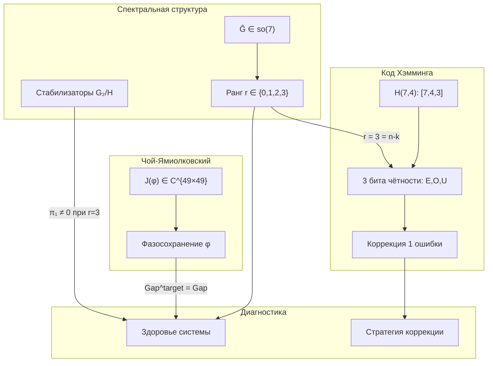

# Алгебра Gap-оператора

Данный документ представляет **кибернетическую перспективу** на алгебраическую структуру [Gap-оператора](/docs/core/dynamics/gap-operator), организуя материал вокруг трёх взаимосвязанных конструкций:

1. **Представление Чоя-Ямиолковского** — полное описание канала $\varphi$ как состояния в $\mathbb{C}^{49 \times 49}$
2. **Спектральная структура рангов** — классификация Gap-конфигураций по рангу непрозрачности
3. **Код Хэмминга H(7,4)** — информационно-теоретическая интерпретация 7-мерной структуры

Все три конструкции сходятся к единому числу **3**: три пары спектральных параметров, три контрольных измерения, три проверочных бита.

---

## 1. Представление Чоя-Ямиолковского для $\varphi$ {#чой-ямиолковский}

### 1.1 Состояние Чой $J(\varphi)$

Для CPTP-канала $\varphi: \mathcal{D}(\mathbb{C}^7) \to \mathcal{D}(\mathbb{C}^7)$ **состояние Чой** полностью описывает действие канала:

$$
J(\varphi) := (\varphi \otimes \mathrm{id})(|\Omega\rangle\langle\Omega|) \in \mathbb{C}^{49 \times 49}
$$

где $|\Omega\rangle = \frac{1}{\sqrt{7}} \sum_{i=1}^{7} |i\rangle \otimes |i\rangle$ — максимально запутанное состояние.

:::tip Теорема 1.1 (Свойства матрицы Чой для канонического $\varphi$) [Т]
**(a)** Матрица Чой $J(\varphi) \in \mathbb{C}^{49 \times 49}$ — эрмитова положительно полуопределённая матрица с $\mathrm{Tr}_1(J(\varphi)) = I/7$.

**(b)** Реконструкция канала из состояния Чой:

$$
\varphi(\Gamma) = 7 \cdot \mathrm{Tr}_2\left(J(\varphi) \cdot (\Gamma^T \otimes I)\right)
$$

**(c)** Полная положительность $\varphi$ эквивалентна $J(\varphi) \geq 0$ (теорема Чоя).
:::

**Доказательство.** (a) Эрмитовость: $J(\varphi)^\dagger = [(\varphi \otimes \mathrm{id})(|\Omega\rangle\langle\Omega|)]^\dagger = (\varphi \otimes \mathrm{id})(|\Omega\rangle\langle\Omega|) = J(\varphi)$, поскольку $\varphi$ сохраняет эрмитовость. Положительность: $J(\varphi) \geq 0 \Leftrightarrow \varphi$ полностью положителен (стандартная теорема Чоя). CPTP-условие: $\mathrm{Tr}_1(J(\varphi)) = I/7$ эквивалентно сохранению следа. (b) Прямое вычисление через матричные элементы. $\square$

### 1.2 Блочная структура $J(\varphi)$ для канонического $\varphi$

Каноническое когерентно-сохраняющее $\varphi_{\text{coh}}$ ([определение](/docs/proofs/gap/fano-channel#phi-coh)) имеет специфическую блочную структуру:

$$
J(\varphi_{\text{coh}}) = \alpha \cdot J(\mathcal{P}_{\text{base}}) + (1 - \alpha) \cdot J(\mathcal{P}_{\text{Fano}})
$$

:::tip Теорема 1.2 (Блочная структура матрицы Чой) [Т]
**(a)** Матрица Чой **атомарного канала** $\mathcal{P}_{\text{base}}(\Gamma) = \mathrm{diag}(\Gamma)$:

$$
J(\mathcal{P}_{\text{base}})_{(ij),(kl)} = \frac{1}{7}\,\delta_{ij}\,\delta_{kl}\,\delta_{ik}
$$

— диагональная матрица размера $49 \times 49$ с 7 ненулевыми элементами. Ранг 7.

**(b)** Матрица Чой **Фано-канала** $\mathcal{P}_{\text{Fano}}(\Gamma) = \frac{1}{3}\sum_{p=1}^{7}\Pi_p\,\Gamma\,\Pi_p$:

$$
J(\mathcal{P}_{\text{Fano}})_{(ij),(kl)} = \frac{1}{21}\sum_{p=1}^{7} [\Pi_p]_{ik}\,[\Pi_p]_{jl}
$$

— имеет ранг 28, отражая 7 Фано-проекторов по $\binom{3}{1}^2 = 9$ ненулевых блоков на каждый (с вычетом пересечений).

**(c)** Матрица Чой **канонического** $\varphi_{\text{coh}}$:

$$
J(\varphi_{\text{coh}}) = \frac{k}{7}\left[\alpha\,J_{\text{base}} + (1-\alpha)\,J_{\text{Fano}}\right] + (1-k)\,J_{\text{anchor}}
$$

где $J_{\text{anchor}}$ — вклад якорного состояния $\Gamma_{\text{anchor}}$.
:::

### 1.3 Фазовые свойства: как матрица Чой кодирует Gap

Ключевое свойство матрицы Чой: **фазы блочных элементов** $J_{(ij),(kl)}$ при $i \neq j$ или $k \neq l$ непосредственно кодируют Gap-структуру канала.

:::tip Теорема 1.3 (Фазовое кодирование Gap в матрице Чой) [Т]
**(a)** Для Фано-канала: все ненулевые элементы $J(\mathcal{P}_{\text{Fano}})$ **вещественны и положительны** — Фано-канал не вносит фазового сдвига.

**(b)** Для атомарного канала: $J(\mathcal{P}_{\text{base}})$ — диагональна с вещественными элементами — атомарный канал также не вносит фазового сдвига.

**(c)** Следовательно, каноническое $\varphi_{\text{coh}}$ **сохраняет фазы когерентностей**:

$$
\arg([\varphi_{\text{coh}}(\Gamma)]_{ij}) = \arg(\gamma_{ij})
$$

и целевой Gap совпадает с текущим: $\mathrm{Gap}^{\text{target}}(i,j) = \mathrm{Gap}(i,j)$.
:::

**Следствие.** Стационарный Gap определяется не каналом $\varphi$ (который фазосохраняющий), а конкуренцией между унитарной прецессией ($\Delta\omega_{ij}$) и диссипативным затуханием ($\Gamma_2 + \kappa$):

$$
\mathrm{Gap}^{(\infty)}(i,j) = \left|\sin\left(\theta_{ij} - \arctan\frac{\Delta\omega_{ij}}{\Gamma_2 + \kappa}\right)\right|
$$

Подробности: [Динамика Gap](/docs/core/dynamics/gap-dynamics#единая-теорема).

---

## 2. Структура рангов Gap-оператора {#структура-рангов}

### 2.1 Gap-оператор как элемент $\mathfrak{so}(7)$

Gap-оператор $\hat{\mathcal{G}} = \mathrm{Im}(\Gamma) \in \mathfrak{so}(7)$ — вещественная антисимметричная $7 \times 7$ матрица (полное определение: [Gap-оператор](/docs/core/dynamics/gap-operator#определение)).

### 2.2 Спектральная структура

:::tip Теорема 2.1 (Собственный спектр Gap-оператора) [Т]
Спектр $\hat{\mathcal{G}}$ для $N = 7$ (нечётная размерность):

$$
\mathrm{spec}(\hat{\mathcal{G}}) = \{0, \pm i\lambda_1, \pm i\lambda_2, \pm i\lambda_3\}, \quad \lambda_k \in \mathbb{R}_{\geq 0}
$$

**(a)** Нулевое собственное значение **гарантировано** нечётной размерностью ($\det(\hat{\mathcal{G}}) = \det(-\hat{\mathcal{G}}^T) = (-1)^7 \det(\hat{\mathcal{G}}) = -\det(\hat{\mathcal{G}}) \Rightarrow \det(\hat{\mathcal{G}}) = 0$).

**(b)** Попарная структура $\pm i\lambda_k$ следует из антисимметрии: если $v$ — собственный вектор с собственным значением $i\lambda$, то $v^*$ — собственный вектор с собственным значением $-i\lambda$.

**(c)** Полный Gap через спектральные параметры:

$$
\mathcal{G}_{\text{total}} = \|\hat{\mathcal{G}}\|_F^2 = 2(\lambda_1^2 + \lambda_2^2 + \lambda_3^2)
$$
:::

**Доказательство.** (a) Для вещественной антисимметричной матрицы: $\hat{\mathcal{G}}^T = -\hat{\mathcal{G}}$, следовательно $\det(\hat{\mathcal{G}}) = \det(\hat{\mathcal{G}}^T) = \det(-\hat{\mathcal{G}}) = (-1)^7 \det(\hat{\mathcal{G}}) = -\det(\hat{\mathcal{G}})$, откуда $\det(\hat{\mathcal{G}}) = 0$. (b) Стандартное свойство антисимметричных матриц. (c) $\|\hat{\mathcal{G}}\|_F^2 = \mathrm{Tr}(\hat{\mathcal{G}}^T \hat{\mathcal{G}}) = -\mathrm{Tr}(\hat{\mathcal{G}}^2) = -\sum_k \mu_k^2$, где $\mu_k$ — собственные значения; для спектра $\{0, \pm i\lambda_1, \pm i\lambda_2, \pm i\lambda_3\}$ имеем $\sum \mu_k^2 = -2\sum \lambda_k^2$. $\square$

### 2.3 Классификация по рангу непрозрачности

**Ранг непрозрачности** $r \in \{0, 1, 2, 3\}$ — число ненулевых спектральных параметров $\lambda_k$.

:::tip Теорема 2.2 (Классификация рангов с группами стабилизаторов) [Т]
Для Gap-оператора $\hat{\mathcal{G}}$ с фиксированным спектром стабилизатор $H_{\hat{\mathcal{G}}} = \{g \in G_2 : g\hat{\mathcal{G}}g^{-1} = \hat{\mathcal{G}}\}$ определяет геометрию пространства допустимых конфигураций:

| Ранг $r$ | Спектр $(\lambda_1, \lambda_2, \lambda_3)$ | Стабилизатор $H$ | $\dim(H)$ | Пространство $G_2/H$ | $\pi_1(G_2/H)$ |
|----------|:------------------------------------------:|:----------------:|:---------:|:---------------------:|:---------------:|
| 0 | $(0, 0, 0)$ | $G_2$ | 14 | $\{\text{pt}\}$ | 0 |
| 1 | $(\lambda, 0, 0)$ | $\mathrm{SU}(3)$ | 8 | $S^6$ | 0 |
| 2 | $(\lambda_1, \lambda_2, 0)$ | $\mathrm{SU}(2) \times \mathrm{U}(1)$ | 4 | 10-мерн. | 0 |
| 3 (общий) | $(\lambda_1, \lambda_2, \lambda_3)$ | $T^2$ | 2 | 12-мерн. | $\mathbb{Z}^2$ |
| 3 (вырожд.) | $(\lambda, \lambda, \lambda)$ | $\mathrm{SU}(2)$ | 3 | 11-мерн. | 0 |
:::

### 2.4 Интерпретация рангов

| Ранг | Непрозрачность | Физическая интерпретация | Кибернетический смысл |
|------|:--------------:|--------------------------|------------------------|
| 0 | Отсутствует | Все когерентности вещественны | Полная самотранспарентность; система без «теней» |
| 1 | Одномерная | Один «тёмный канал» между парой измерений | Локальный дефект самопонимания (напр., алекситимия) |
| 2 | Двумерная | Два независимых канала разрыва | Комплексное нарушение; множественная диссоциация |
| 3 | Полная | Все три плоскости вращения задействованы | Глобальный кризис когерентности |

:::info Интерпретация (Топологическая защита) [И]
Только ранг 3 с общим (невырожденным) спектром обладает **нетривиальной фундаментальной группой** $\pi_1(G_2/T^2) \cong \mathbb{Z}^2$. Это означает, что полностью непрозрачные конфигурации **топологически защищены**: невозможно непрерывно деформировать Gap-профиль ранга 3 в тривиальный ($r = 0$) без прохождения через сингулярность. В кибернетических терминах: глубокий кризис когерентности не разрешается «постепенным улучшением» — требуется структурная реорганизация (топологический переход).
:::

### 2.5 Связь с чистотой

:::tip Теорема 2.3 (Разложение чистоты через ранг) [Т]
Чистота голонома разлагается на вклады симметричной и антисимметричной частей матрицы когерентности:

$$
P = \mathrm{Tr}(\Gamma^2) = P_{\text{sym}} + \mathcal{G}_{\text{total}} = P_{\text{sym}} + 2(\lambda_1^2 + \lambda_2^2 + \lambda_3^2)
$$

где $P_{\text{sym}} = \mathrm{Tr}(\mathrm{Re}(\Gamma)^2)$.
:::

**Следствие.** При фиксированной симметричной чистоте $P_{\text{sym}}$ увеличение ранга непрозрачности **увеличивает** полную чистоту $P$. Парадокс: Gap (непрозрачность) *повышает* чистоту. Разрешение: антисимметричные когерентности вносят положительный вклад в $\mathrm{Tr}(\Gamma^2)$ (подробное доказательство: [Gap-оператор](/docs/core/dynamics/gap-operator#связь-чистота)).

---

## 3. Код Хэмминга H(7,4) {#код-хэмминга}

### 3.1 Структура кода

Код Хэмминга H(7,4) — линейный блочный код с параметрами $[n, k, d] = [7, 4, 3]$:

- **$n = 7$** — длина кодового слова (= число [измерений](/docs/core/structure/dimensions) голонома)
- **$k = 4$** — число информационных битов
- **$d = 3$** — минимальное расстояние Хэмминга

:::tip Теорема 3.1 (Параметры H(7,4)) [Т]
**(a)** Код H(7,4) содержит $2^4 = 16$ кодовых слов длины 7.

**(b)** Минимальное расстояние $d = 3$ обеспечивает:
- **Обнаружение** до $d - 1 = 2$ ошибок
- **Исправление** $\lfloor(d-1)/2\rfloor = 1$ ошибки

**(c)** Код **совершенный**: граница Хэмминга $\sum_{j=0}^{t}\binom{n}{j} = 1 + 7 = 8 = 2^{n-k} = 2^3$ достигается с равенством.
:::

### 3.2 Информационные и контрольные измерения

В контексте УГМ семь измерений голонома разделяются на две группы:

| Роль | Измерения | Число | Характер |
|------|:---------:|:-----:|----------|
| **Информационные** | A (артикуляция), S (структура), D (динамика), L (логика) | 4 | Несут «содержание» самомодели |
| **Контрольные** | E (опыт), O (основание), U (единство) | 3 | Обеспечивают целостность и коррекцию |

:::info Интерпретация (Информационная архитектура) [И]
Четыре структурных измерения (A, S, D, L) описывают, **что** система собой представляет — её артикуляцию с миром, внутреннюю структуру, динамику и логику. Три метаструктурных измерения (E, O, U) описывают, **как** система интериорно представляет, основывает и объединяет эти содержания. Аналогия с H(7,4): содержательные биты требуют проверочных битов для защиты от ошибок.
:::

### 3.3 Проверочная матрица и плоскость Фано

Проверочная матрица $H$ кода H(7,4):

$$
H = \begin{pmatrix}
1 & 0 & 1 & 0 & 1 & 0 & 1 \\
0 & 1 & 1 & 0 & 0 & 1 & 1 \\
0 & 0 & 0 & 1 & 1 & 1 & 1
\end{pmatrix}
$$

:::tip Теорема 3.2 (Связь $H$ с плоскостью Фано PG(2,2)) [Т]
**(a)** Столбцы проверочной матрицы $H$ — двоичные представления чисел от 1 до 7, что совпадает с **координатами точек** проективной плоскости $\mathrm{PG}(2, \mathbb{F}_2)$.

**(b)** Каждая из 7 строк порождающей матрицы $G$ (в систематической форме) соответствует одной из 7 точек Фано-плоскости.

**(c)** Условие $Hx^T = 0$ (принадлежность к коду) эквивалентно выполнению **трёх проверок чётности**, каждая из которых соответствует одной линии Фано-плоскости, проходящей через контрольное измерение.
:::

**Доказательство.** (a) Столбцы $H$: $(001), (010), (011), (100), (101), (110), (111)$ — все ненулевые элементы $\mathbb{F}_2^3$, что является стандартной параметризацией $\mathrm{PG}(2, \mathbb{F}_2)$. (b) и (c) следуют из дуальности $G \cdot H^T = 0$ и инцидентностной структуры проективной плоскости. $\square$

:::info Замечание (Фано-плоскость в УГМ)
В [формализме Фано-правил отбора](/docs/physics/gauge-symmetry/fano-selection-rules) те же 7 точек отождествляются с 7 измерениями голонома, а 7 линий — с 7 Фано-триплетами, определяющими октонионное умножение. Проверочная матрица $H$ кодирует ту же инцидентностную структуру, что и Фано-структурированные [операторы Линдблада](/docs/core/operators/lindblad-operators).
:::

### 3.4 Минимальное расстояние и минимальная непрозрачность

:::tip Теорема 3.3 (Минимальная непрозрачность из $d = 3$)
**(a)** Минимальное расстояние $d = 3$ кода H(7,4) означает, что любые два различных кодовых слова различаются **минимум в 3 позициях**. **[Т]**

**(b)** В терминах когерентностей: минимум **3 из 21** пар когерентностей обязаны иметь ненулевой Gap: **[И]**

$$
|\{(i,j) : \mathrm{Gap}(i,j) > 0\}| \geq 3
$$

**(c)** Эти 3 «обязательных» канала непрозрачности соответствуют 3 контрольным измерениям (E, O, U) — каждое порождает минимум один непрозрачный канал. **[И]**
:::

:::info Интерпретация (Квантовая граница Хэмминга для Gap) [И]
Совершенность кода H(7,4) транслируется в **точное равенство** границы Хэмминга:

$$
\sum_{j=0}^{1}\binom{7}{j} = 1 + 7 = 8 = 2^3
$$

Из 21 канала когерентности минимум 3 обязаны быть непрозрачными — совпадение с числом проверочных битов и максимальным рангом непрозрачности Gap-оператора (раздел 2.3). Полная «самотранспарентность» ($r = 0$) алгебраически достижима, но кибернетически нестабильна.
:::

### 3.5 Коррекция ошибок когерентности

:::info Теорема 3.4 (Аналогия: коррекция когерентностей через H(7,4)) [И]
**(a)** **Обнаружение:** $d - 1 = 2$ нарушения когерентностей обнаруживаются посредством «проверок чётности» — мониторинга E-, O-, U-когерентностей.

**(b)** **Коррекция:** $t = 1$ нарушение когерентности может быть **автоматически исправлено** регенеративным оператором $\mathcal{R}$, аналогично декодированию синдрома $s = Hx^T$ и инверсии соответствующего бита.

**(c)** **Синдром ошибки:**

$$
s = (s_E, s_O, s_U) \in \mathbb{F}_2^3
$$

— три бита синдрома соответствуют сигналам от трёх контрольных измерений. Ненулевой синдром $s \neq 0$ идентифицирует дефектное измерение; нулевой синдром $s = 0$ означает отсутствие однократных ошибок.
:::

**Таблица синдромов (кибернетическая интерпретация):**

| Синдром $(s_E, s_O, s_U)$ | Дефектное измерение | Тип нарушения |
|:--------------------------:|:-------------------:|---------------|
| $(0, 0, 0)$ | Нет | Когерентность в норме |
| $(0, 0, 1)$ | L | Логическая дезинтеграция |
| $(0, 1, 0)$ | D | Динамическая дисфункция |
| $(0, 1, 1)$ | S | Структурный распад |
| $(1, 0, 0)$ | A | Артикуляционный сбой |
| $(1, 0, 1)$ | E | Дефицит интериорной связности |
| $(1, 1, 0)$ | O | Потеря основания |
| $(1, 1, 1)$ | U | Разрушение единства |

:::warning Ограничения аналогии [И]
Аналогия с H(7,4) носит **мотивационный** характер. Формальное отождествление динамики когерентностей с блочным кодом **не установлено**, поскольку:

1. Когерентности — непрерывные комплексные числа, а не биты
2. «Ошибки» когерентности непрерывно параметризованы (Gap $\in [0,1]$), а не дискретны
3. Регенеративный оператор $\mathcal{R}$ действует непрерывно, а не через побитовую инверсию

Тем не менее, структурное совпадение $\mathrm{PG}(2,2) \leftrightarrow H(7,4) \leftrightarrow \mathbb{O}$ является точным и алгебрически строгим. Подробный анализ: [Фано-канал](/docs/proofs/gap/fano-channel).
:::

---

## 4. Кибернетическая интерпретация {#кибернетическая-интерпретация}

### 4.1 Ранг Gap как диагностика системного здоровья

Три конструкции — спектральный ранг, код Хэмминга, Фано-геометрия — сходятся к единой **диагностической модели**:

:::tip Теорема 4.1 (Диагностическая триада) [Т]
Для голонома $\mathbb{H}$ с Gap-оператором $\hat{\mathcal{G}}$ ранга $r$:

**(a)** $r$ совпадает с числом **независимых каналов непрозрачности** в спектральном разложении $\hat{\mathcal{G}}$.

**(b)** $r \leq 3$, и верхняя граница определяется числом контрольных измерений (E, O, U) = числом проверочных битов H(7,4) = $\lfloor 7/2 \rfloor = 3$.

**(c)** Переход $r \to r + 1$ соответствует **качественному изменению** характера непрозрачности: появлению нового независимого канала разрыва, невыразимого через существующие.
:::

### 4.2 E, O, U как «биты чётности»

Три контрольных измерения выполняют функцию **мониторинга и коррекции** информационных каналов:

| Измерение | Что мониторит | Тип ошибки при дефекте | Механизм коррекции |
|:---------:|---------------|------------------------|--------------------|
| **E** (опыт) | Субъективная когерентность A$\leftrightarrow$S, A$\leftrightarrow$L | Алекситимия, деперсонализация | Телесно-ориентированная терапия |
| **O** (основание) | Темпоральная когерентность S$\leftrightarrow$D, D$\leftrightarrow$L | Диссоциация, потеря реальности | Заземление, mindfulness |
| **U** (единство) | Интегративная когерентность A$\leftrightarrow$D, S$\leftrightarrow$L | Фрагментация, расщепление | Интегративные практики, IFS |

:::info Интерпретация (Иерархия коррекции) [И]
Порядок восстановления при кризисе когерентности следует **обратному** порядку синдромного декодирования:

1. **U** (единство) — первичная стабилизация: восстановить минимальную целостность
2. **O** (основание) — заземление: восстановить связь с реальностью
3. **E** (опыт) — проработка: интегрировать субъективный опыт

Это соответствует клинической практике кризисной интервенции: сначала безопасность и стабилизация, затем заземление, затем переработка травматического материала.
:::

### 4.3 Практические следствия для диагностики

**Протокол диагностики по Gap-рангу:**

| Шаг | Метрика | Метод | Интерпретация |
|:---:|---------|-------|---------------|
| 1 | $\mathcal{G}_{\text{total}} = \|\hat{\mathcal{G}}\|_F^2$ | Суммарная непрозрачность | Общий уровень дисфункции |
| 2 | Ранг $r$ | Число ненулевых $\lambda_k$ | Сложность нарушения |
| 3 | $\lambda_{\max}$ | Максимальный спектральный параметр | Доминантный канал разрыва |
| 4 | $G_2$-проекция: $\hat{\mathcal{G}}_{G_2}$ vs $\hat{\mathcal{G}}_\perp$ | Разложение [по G₂](/docs/core/dynamics/gap-operator#g2-разложение) | Тип Gap: когерентный vs декогерентный |
| 5 | Синдром $(s_E, s_O, s_U)$ | Мониторинг E-, O-, U-когерентностей | Идентификация дефектного измерения |

:::tip Пример: Модель алекситимии [Т]
Для модели алекситимии ($\gamma_{SE} = |\gamma|\,e^{i\pi/2}$, все остальные $\gamma_{ij} \in \mathbb{R}$):

**(a)** $\hat{\mathcal{G}}$ имеет единственный ненулевой элемент $\hat{\mathcal{G}}_{SE} = |\gamma_{SE}|$, $r = 1$.

**(b)** Спектр: $(\lambda_1, 0, 0)$ с $\lambda_1 = |\gamma_{SE}|$ — одномерная непрозрачность.

**(c)** Синдром: $s_E = 1$ (E-измерение затронуто, S-когерентность нарушена), что корректно идентифицирует алекситимию как нарушение связи тело$\leftrightarrow$переживание.

**(d)** По теореме 3.4: одиночное нарушение **корректируемо** — предсказание о возможности терапевтического восстановления.
:::

### 4.4 Сводка трёх перспектив

---

## 5. Сводка статусов {#статусы}

| Результат | Статус | Раздел |
|-----------|:------:|:------:|
| Свойства матрицы Чой для канонического $\varphi$ | **[Т]** | [1.1](#чой-ямиолковский) |
| Блочная структура $J(\varphi_{\text{coh}})$ | **[Т]** | [1.2](#чой-ямиолковский) |
| Фазовое кодирование Gap в матрице Чой | **[Т]** | [1.3](#чой-ямиолковский) |
| Собственный спектр Gap-оператора | **[Т]** | [2.2](#структура-рангов) |
| Классификация рангов с группами стабилизаторов | **[Т]** | [2.3](#структура-рангов) |
| Разложение чистоты через ранг | **[Т]** | [2.5](#структура-рангов) |
| Параметры H(7,4) | **[Т]** | [3.1](#код-хэмминга) |
| Связь $H$ с плоскостью Фано $\mathrm{PG}(2,2)$ | **[Т]** | [3.3](#код-хэмминга) |
| Минимальная непрозрачность из $d = 3$: (a) [Т], (b,c) [И] | **[Т]/[И]** | [3.4](#код-хэмминга) |
| Коррекция когерентностей через H(7,4) | **[И]** | [3.5](#код-хэмминга) |
| Квантовая граница Хэмминга для Gap | **[И]** | [3.4](#код-хэмминга) |
| Диагностическая триада | **[Т]** | [4.1](#кибернетическая-интерпретация) |
| E, O, U как «биты чётности» | **[И]** | [4.2](#кибернетическая-интерпретация) |
| Топологическая защита при $r = 3$ | **[И]** | [2.4](#структура-рангов) |

---

:::warning Вычислительная сложность
Вычислительное масштабирование алгоритмов, описанных в данном документе, **не проанализировано**. В частности:
- Вычисление матрицы Чой $J(\varphi) \in \mathbb{C}^{49 \times 49}$ требует $O(N^4)$ операций для $N = 7$, но масштабирование для композитных систем ($N = 7^k$) неизвестно.
- Спектральное разложение Gap-оператора $\hat{\mathcal{G}} \in \mathfrak{so}(7)$ — $O(N^3)$, но для больших $N$ может потребоваться приближённая спектрография.
- Синдромное декодирование (раздел 3.5) для $N > 7$ не определено.
:::

## Связанные документы

- [Gap-оператор](/docs/core/dynamics/gap-operator) — определение $\hat{\mathcal{G}}$, спектр, G₂-разложение, стабилизаторы
- [Динамика Gap](/docs/core/dynamics/gap-dynamics) — Чой-Ямиолковский, бифуркации, немарковские эффекты, модельные системы
- [Фано-канал и Gap-теоремы](/docs/proofs/gap/fano-channel) — строгие доказательства: Фано-канал, $G_2$-ковариантность, $\varphi_{\text{coh}}$
- [Правила отбора Фано](/docs/physics/gauge-symmetry/fano-selection-rules) — плоскость Фано $\mathrm{PG}(2,2)$, Юкавская текстура
- [G₂-структура](/docs/physics/gauge-symmetry/g2-structure) — $G_2 = \mathrm{Aut}(\mathbb{O})$, калибровочная редукция
- [Определения КК](./definitions) — базовые определения Кибернетики Когерентности
- [Теоремы КК](./theorems) — фундаментальные теоремы
- [Реестр статусов](/docs/reference/status-registry) — классификация всех результатов
