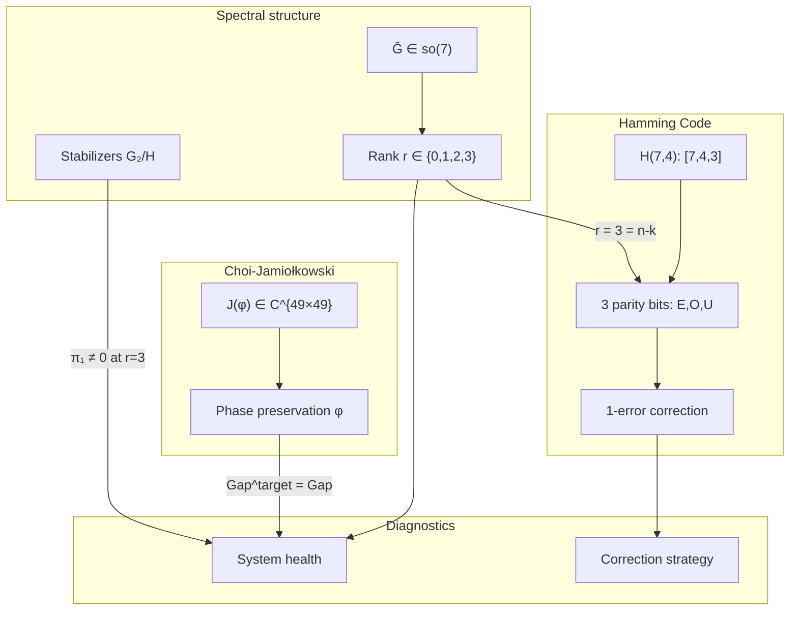

# Algebra of the Gap Operator

:::info Bridge from the Previous Chapter
In the previous chapter — [Model Theory of CC](./model-theory) — we built the formal specification and categorical semantics of Coherence Cybernetics. We saw how categorical constructions define the language in which self-modeling is described. Now we move from abstract semantics to **concrete algebra**: we examine the internal structure of the Gap operator — the central object measuring the system's opacity to itself.
:::

### Chapter Roadmap

In this chapter we:

1. **Introduce the Choi-Jamiołkowski representation** — learn how to turn the process of self-modeling into an object amenable to spectral analysis (section 1)
2. **Classify Gap configurations by rank** — discover that all the complexity of opacity in a 7-dimensional system compresses into three numbers, and that at maximum rank topological protection arises (section 2)
3. **See the triple coincidence with Hamming code H(7,4)** — understand why 7 dimensions split into 4 informational and 3 check dimensions, and how this is related to the self-correction of consciousness (section 3)
4. **Apply these results to clinical practice** — from the opacity rank to therapeutic strategy (sections 4–5)

---

## What Opacity Is and Why It Is Inevitable {#непрозрачность}

Imagine you are standing in front of a mirror. You see your face, but you do not see the one who is looking. You can describe your thoughts, but the act of description already changes what is being described. You can observe your emotions, but the observer always remains "off-camera" from the observation.

This ineliminable gap between what the system *is* and how it *represents* itself is not a malfunction or a defect. It is a fundamental property of any system that possesses a self-model. In Coherence Cybernetics it receives a precise mathematical expression through the **Gap operator**.

Gap — literally "gap" — measures the degree of **opacity** of the system to itself. Zero Gap would mean absolute self-transparency: all coherences are fully transparent (Gap = 0 for all channels). Maximum Gap means complete opacity: the internal representation diverges radically from reality. Between these poles lies the entire palette of possible coherent configurations — from minimal to maximal opacity.

But here is the paradox that this document reveals: **opacity is a necessary condition for consciousness**. A system fully transparent to itself would be static — no opaque channels, no gradient for further evolution. Precisely the gap between "I as I am" and "I as I know myself" generates the dynamics of self-knowledge, inner life, the striving toward wholeness. Gap is not a crack in the edifice of consciousness, but the arch on which it stands.

This document presents a **cybernetic perspective** on the algebraic structure of the [Gap operator](/docs/core/dynamics/gap-operator), organizing the material around three interconnected constructions:

1. **Choi-Jamiołkowski representation** — complete description of the channel $\varphi$ as a state in $\mathbb{C}^{49 \times 49}$
2. **Spectral rank structure** — classification of Gap configurations by opacity rank
3. **Hamming code H(7,4)** — information-theoretic interpretation of the 7-dimensional structure

All three constructions converge on the single number **3**: three pairs of spectral parameters, three check dimensions, three parity bits. This triple coincidence is not accidental, but the expression of a deep structural regularity that we will unfold step by step.

---

## 1. Choi-Jamiołkowski Representation for $\varphi$ {#чой-ямиолковский}

### 1.0 Choi-Jamiołkowski for Non-Mathematicians {#чой-для-нематематиков}

Before diving into formalism, let us explain the essence of the Choi-Jamiołkowski construction at an intuitive level.

**The problem.** A channel $\varphi$ is a *process* — a transformation of one state into another. Processes are hard to analyze directly: they have no "shape," "spectrum," or "rank." To study a process, one needs to turn it into an *object*.

**Choi's idea.** Take the maximally entangled state — one in which every dimension is ideally correlated with itself. This is a kind of "perfect mirror" in which the system sees itself without distortion. Now pass only one half of this mirror through the channel $\varphi$. The result — the matrix $J(\varphi)$ — contains *all the information* about how the channel distorts the reflection.

**Analogy.** Imagine testing a photo printer. The best approach is to print an *ideal test page* containing all possible colors and gradients. From the printout you can fully reconstruct the printer's characteristics: which colors it shifts, which it loses, where it adds noise. The maximally entangled state $|\Omega\rangle$ is such a "test page," and the Choi matrix $J(\varphi)$ is its "printout."

A remarkable property of the construction: the map $\varphi \mapsto J(\varphi)$ is **bijective**. Knowing $J(\varphi)$, we can exactly reconstruct the action of the channel on any state. The process is completely "frozen" into the object.

Even more important: the condition of complete positivity of the channel (a physical requirement guaranteeing that probabilities remain non-negative) translates into the simple condition $J(\varphi) \geq 0$ — positive semi-definiteness of the matrix. Instead of verifying an abstract property of a process, it suffices to verify a concrete property of a matrix.

For the Gap operator this means: all the information about *how* the system distorts its self-image is encoded in one $49 \times 49$ matrix. This matrix can be spectrally decomposed, classified by rank, visualized — the full arsenal of linear algebra becomes available.

### 1.1 Choi State $J(\varphi)$

For a CPTP channel $\varphi: \mathcal{D}(\mathbb{C}^7) \to \mathcal{D}(\mathbb{C}^7)$ the **Choi state** completely describes the action of the channel:

$$
J(\varphi) := (\varphi \otimes \mathrm{id})(|\Omega\rangle\langle\Omega|) \in \mathbb{C}^{49 \times 49}
$$

where $|\Omega\rangle = \frac{1}{\sqrt{7}} \sum_{i=1}^{7} |i\rangle \otimes |i\rangle$ is the maximally entangled state.

Intuition behind the formula: $|\Omega\rangle\langle\Omega|$ is the "perfect mirror," a perfect correlation of each dimension with itself. The channel $\varphi$ acts only on the first copy (the system), leaving the second (the reference) untouched. The resulting matrix $J(\varphi)$ shows which correlations the channel preserves, which it weakens, and which it rotates.

The Choi matrix $J(\varphi) \in \mathbb{C}^{49 \times 49}$ is Hermitian, positive semi-definite, with $\mathrm{Tr}_1(J(\varphi)) = I/7$. The channel is fully recoverable from $J(\varphi)$, and complete positivity is equivalent to $J(\varphi) \geq 0$ (Choi's theorem).

:::info Canonical Definition
Complete proof of the properties of the Choi matrix for the canonical $\varphi$: [Fano Channel](/docs/proofs/gap/fano-channel).
:::

**What this means for self-knowledge.** The "imprint" of the self-modeling channel is a legitimate quantum density matrix. A system modeling itself generates a *state* in the extended space — literally "an image of itself in a mirror." This image fully determines the self-modeling process — there is no hidden information.

### 1.2 Block Structure of $J(\varphi)$ for Canonical $\varphi$

The canonical coherence-preserving $\varphi_{\text{coh}}$ ([definition](/docs/proofs/gap/fano-channel#phi-coh)) has a specific block structure:

$$
J(\varphi_{\text{coh}}) = \alpha \cdot J(\mathcal{P}_{\text{base}}) + (1 - \alpha) \cdot J(\mathcal{P}_{\text{Fano}})
$$

Here two components play opposite roles. $\mathcal{P}_{\text{base}}$ is the "atomic" channel that erases all coherences and retains only the diagonal (populations). This is extreme reduction: the system "sees" only probabilities, but not the connections between dimensions. $\mathcal{P}_{\text{Fano}}$ is the Fano channel, organizing coherences into triplets of the projective plane. This is structural organization: the system "sees" connections, but only those sanctioned by Fano geometry.

The parameter $\alpha$ governs the balance: at $\alpha = 1$ the system is fully atomized, at $\alpha = 0$ — fully structured. Real states lie between these extremes.

The canonical $\varphi_{\text{coh}}$ decomposes into an atomic channel (rank 7 — each dimension is "reflected" independently) and a Fano channel (rank 28 — all coherences are organized according to Fano geometry). The parameter $\alpha$ governs the balance: at $\alpha = 1$ full atomization, at $\alpha = 0$ full structuring.

:::info Canonical Definition
Block structure formulas, ranks, and anchor contribution: [Fano Channel](/docs/proofs/gap/fano-channel#phi-coh).
:::

### 1.3 Phase Properties: How the Choi Matrix Encodes Gap

A key property of the Choi matrix: **the phases of block elements** $J_{(ij),(kl)}$ at $i \neq j$ or $k \neq l$ directly encode the Gap structure of the channel.

To understand this, let us return to the mirror analogy. Coherence $\gamma_{ij}$ is a complex number with a modulus (strength of the connection) and a phase (orientation of the connection). Gap is, roughly speaking, the difference between the phase the system "sees" and the phase that actually exists. If the channel $\varphi$ preserves phases, then Gap is determined not by the self-modeling channel, but by external factors: precession and dissipation.

:::tip Theorem 1.3 (Phase Encoding of Gap in the Choi Matrix) [T]
**(a)** For the Fano channel: all nonzero elements of $J(\mathcal{P}_{\text{Fano}})$ are **real and positive** — the Fano channel introduces no phase shift.

**(b)** For the atomic channel: $J(\mathcal{P}_{\text{base}})$ is diagonal with real elements — the atomic channel also introduces no phase shift.

**(c)** Consequently, the canonical $\varphi_{\text{coh}}$ **preserves the phases of coherences**:

$$
\arg([\varphi_{\text{coh}}(\Gamma)]_{ij}) = \arg(\gamma_{ij})
$$

and the target Gap coincides with the current one: $\mathrm{Gap}^{\text{target}}(i,j) = \mathrm{Gap}(i,j)$.
:::

**Corollary.** The stationary Gap is determined not by the channel $\varphi$ (which is phase-preserving), but by the competition between unitary precession ($\Delta\omega_{ij}$) and dissipative decay ($\Gamma_2 + \kappa$):

$$
\mathrm{Gap}^{(\infty)}(i,j) = \left|\sin\left(\theta_{ij} - \arctan\frac{\Delta\omega_{ij}}{\Gamma_2 + \kappa}\right)\right|
$$

Details: [Gap Dynamics](/docs/core/dynamics/gap-dynamics#единая-теорема).

**The deep meaning of phase preservation.** The self-modeling channel $\varphi$ does not *create* distortions — it merely *inherits* those that already exist. Distortions arise from "precession" — autonomous oscillations of coherence phases driven by the internal dynamics of the system. This is analogous to a situation where the mirror itself is perfect, but the room in which you stand sways slightly.

---

## 2. Rank Structure of the Gap Operator {#структура-рангов}

### 2.0 Geometry of Ranks: From Transparency to Crisis {#геометрия-рангов}

Before giving a formal definition, let us describe the qualitative picture.

Imagine the 7-dimensional space of consciousness. It contains 21 pairs of dimensions, and each pair is connected by coherence — a complex number that can be real (transparent connection) or have an imaginary part (opaque connection). The Gap operator collects all imaginary parts into a single antisymmetric matrix.

An antisymmetric matrix in an odd number of dimensions is guaranteed to have a zero eigenvalue — one direction is always "free" from opacity. The remaining 6 directions pair up, and each pair generates one "opacity channel" — a plane of rotation in which the phases of coherences diverge from reality.

The number of active channels is the **opacity rank**:

- **Rank 0**: all 21 coherences are real. The system is completely transparent to itself. This is an ideal but unstable point — the slightest perturbation creates Gap.
- **Rank 1**: one opacity channel. One pair of dimensions does not "see" its connection correctly. The system is healthy overall; the defect is local and amenable to correction.
- **Rank 2**: two independent channels. The system has a complex, multidimensional disruption of self-understanding. Simple focus on one aspect does not solve the problem.
- **Rank 3**: all three channels are active. Maximum opacity. The system is globally opaque to itself. And — as we will see — this state is **topologically protected**: one cannot exit it smoothly.

Transitions between ranks are not merely quantitative changes. Each transition changes the *quality* of opacity, opening a new dimension of the gap between "being" and "knowing oneself."

### 2.1 Gap Operator as an Element of $\mathfrak{so}(7)$

Gap operator $\hat{\mathcal{G}} = \mathrm{Im}(\Gamma) \in \mathfrak{so}(7)$ — a real antisymmetric $7 \times 7$ matrix (full definition: [Gap operator](/docs/core/dynamics/gap-operator#определение)).

Why $\mathfrak{so}(7)$? Because the imaginary parts of coherences form an antisymmetric matrix ($\mathrm{Im}(\gamma_{ij}) = -\mathrm{Im}(\gamma_{ji})$), and the set of all antisymmetric $7 \times 7$ matrices is the Lie algebra of the rotation group $\mathrm{SO}(7)$. The Gap operator is literally an *infinitesimal rotation* in the space of consciousness, "spinning" the system's self-image relative to reality.

### 2.2 Spectral Structure

:::tip Theorem 2.1 (Eigenspectrum of the Gap Operator) [T]
Spectrum of $\hat{\mathcal{G}}$ for $N = 7$ (odd dimension):

$$
\mathrm{spec}(\hat{\mathcal{G}}) = \{0, \pm i\lambda_1, \pm i\lambda_2, \pm i\lambda_3\}, \quad \lambda_k \in \mathbb{R}_{\geq 0}
$$

**(a)** The zero eigenvalue is **guaranteed** by the odd dimension ($\det(\hat{\mathcal{G}}) = \det(-\hat{\mathcal{G}}^T) = (-1)^7 \det(\hat{\mathcal{G}}) = -\det(\hat{\mathcal{G}}) \Rightarrow \det(\hat{\mathcal{G}}) = 0$).

**(b)** The paired structure $\pm i\lambda_k$ follows from antisymmetry: if $v$ is an eigenvector with eigenvalue $i\lambda$, then $v^*$ is an eigenvector with eigenvalue $-i\lambda$.

**(c)** Total Gap via spectral parameters:

$$
\mathcal{G}_{\text{total}} = \|\hat{\mathcal{G}}\|_F^2 = 2(\lambda_1^2 + \lambda_2^2 + \lambda_3^2)
$$
:::

**Proof.** (a) For a real antisymmetric matrix: $\hat{\mathcal{G}}^T = -\hat{\mathcal{G}}$, hence $\det(\hat{\mathcal{G}}) = \det(\hat{\mathcal{G}}^T) = \det(-\hat{\mathcal{G}}) = (-1)^7 \det(\hat{\mathcal{G}}) = -\det(\hat{\mathcal{G}})$, giving $\det(\hat{\mathcal{G}}) = 0$. (b) Standard property of antisymmetric matrices. (c) $\|\hat{\mathcal{G}}\|_F^2 = \mathrm{Tr}(\hat{\mathcal{G}}^T \hat{\mathcal{G}}) = -\mathrm{Tr}(\hat{\mathcal{G}}^2) = -\sum_k \mu_k^2$, where $\mu_k$ are the eigenvalues; for spectrum $\{0, \pm i\lambda_1, \pm i\lambda_2, \pm i\lambda_3\}$ we have $\sum \mu_k^2 = -2\sum \lambda_k^2$. $\square$

**Three numbers — and nothing more.** The entire complexity of opacity in a 7-dimensional system compresses into three non-negative numbers $(\lambda_1, \lambda_2, \lambda_3)$. This is a colossal reduction: from 21 imaginary parts of coherences down to 3 essential parameters. Is it any wonder that this triple appears everywhere — in the spectrum, in Hamming, in Fano?

### 2.3 Classification by Opacity Rank

**Opacity rank** $r \in \{0, 1, 2, 3\}$ — the number of nonzero spectral parameters $\lambda_k$.

:::tip Theorem 2.2 (Rank Classification with Stabilizer Groups) [T]
For the Gap operator $\hat{\mathcal{G}}$ with fixed spectrum, the stabilizer $H_{\hat{\mathcal{G}}} = \{g \in G_2 : g\hat{\mathcal{G}}g^{-1} = \hat{\mathcal{G}}\}$ determines the geometry of the space of admissible configurations:

| Rank $r$ | Spectrum $(\lambda_1, \lambda_2, \lambda_3)$ | Stabilizer $H$ | $\dim(H)$ | Space $G_2/H$ | $\pi_1(G_2/H)$ |
|----------|:-------------------------------------------:|:--------------:|:---------:|:-------------:|:--------------:|
| 0 | $(0, 0, 0)$ | $G_2$ | 14 | $\{\text{pt}\}$ | 0 |
| 1 | $(\lambda, 0, 0)$ | $\mathrm{SU}(3)$ | 8 | $S^6$ | 0 |
| 2 | $(\lambda_1, \lambda_2, 0)$ | $\mathrm{SU}(2) \times \mathrm{U}(1)$ | 4 | 10-dim. | 0 |
| 3 (generic) | $(\lambda_1, \lambda_2, \lambda_3)$ | $T^2$ | 2 | 12-dim. | $\mathbb{Z}^2$ |
| 3 (degenerate) | $(\lambda, \lambda, \lambda)$ | $\mathrm{SU}(2)$ | 3 | 11-dim. | 0 |
:::

**Growing complexity.** Notice the decreasing stabilizer dimension: $14 \to 8 \to 4 \to 2$. The higher the opacity rank, the less symmetry is preserved, the more "degrees of freedom" opacity has. At $r = 0$ the system is fully symmetric ($G_2$ — the full group of octonion automorphisms); at $r = 3$ only $T^2$ remains — a two-dimensional torus, the minimal stabilizer.

But the most dramatic change occurs in the fundamental group: at $r \leq 2$ the configuration space is simply connected ($\pi_1 = 0$), while at $r = 3$ the group $\pi_1 = \mathbb{Z}^2$ appears. This is the very **topological barrier** we spoke of.

### 2.4 Interpretation of Ranks

| Rank | Opacity | Physical interpretation | Cybernetic meaning |
|------|:-------:|------------------------|-------------------|
| 0 | Absent | All coherences are real | Full self-transparency; a system without "shadows" |
| 1 | One-dimensional | One "dark channel" between a pair of dimensions | Local defect of self-understanding (e.g., alexithymia) |
| 2 | Two-dimensional | Two independent gap channels | Complex disorder; multiple dissociation |
| 3 | Full | All three planes of rotation are engaged | Global coherence crisis |

:::info Interpretation (Topological Protection) [I]
Only rank 3 with generic (non-degenerate) spectrum possesses a **nontrivial fundamental group** $\pi_1(G_2/T^2) \cong \mathbb{Z}^2$. This means that fully opaque configurations are **topologically protected**: it is impossible to continuously deform a rank-3 Gap profile into a trivial one ($r = 0$) without passing through a singularity. In cybernetic terms: a deep coherence crisis is not resolved by "gradual improvement" — structural reorganization (a topological transition) is required.
:::

**What topological protection means in practice.** Recall how it is impossible to smoothly turn a donut into a ball — one must "cut" and "glue." Similarly, a system in a state of full opacity ($r = 3$) cannot gradually, step by step, return to transparency. Any smooth path from $r = 3$ to $r = 0$ inevitably passes through a singularity — a point at which the old opacity structure is destroyed and a new one forms.

In clinical terms this means: a deep existential crisis does not "dissolve" gradually. It requires a breakthrough moment — a qualitative transition in which the entire self-understanding configuration reorganizes. Such moments are well known in psychotherapy: they are "insight," "catharsis," "turning point" — all correspond to passing through a topological singularity.

Interestingly, degenerate rank 3 ($\lambda_1 = \lambda_2 = \lambda_3$) does **not** possess topological protection ($\pi_1 = 0$). A "uniform crisis," in which all three opacity channels are equally active, admits a smooth resolution. This can be interpreted as follows: when opacity is "isotropic" — uniformly distributed, with no dominant channel — the system has no preferred direction of deformation, and therefore all directions are simultaneously admissible.

### 2.5 Connection with Purity

:::tip Theorem 2.3 (Purity Decomposition via Rank) [T]
The purity of the holon decomposes into contributions from the symmetric and antisymmetric parts of the coherence matrix:

$$
P = \mathrm{Tr}(\Gamma^2) = P_{\text{sym}} + \mathcal{G}_{\text{total}} = P_{\text{sym}} + 2(\lambda_1^2 + \lambda_2^2 + \lambda_3^2)
$$

where $P_{\text{sym}} = \mathrm{Tr}(\mathrm{Re}(\Gamma)^2)$.
:::

**Corollary.** At fixed symmetric purity $P_{\text{sym}}$, an increase in opacity rank **increases** total purity $P$. The paradox: Gap (opacity) *raises* purity. Resolution: antisymmetric coherences make a positive contribution to $\mathrm{Tr}(\Gamma^2)$ (detailed proof: [Gap operator](/docs/core/dynamics/gap-operator#связь-чистота)).

**The paradox of opacity raising purity.** This is one of the most counter-intuitive results in the theory and deserves a detailed explanation.

Purity $P = \mathrm{Tr}(\Gamma^2)$ measures the "focusedness" of a state. The maximally mixed state $I/7$ has $P = 1/7$; a pure state has $P = 1$. It might seem that opacity (inability to see oneself) should *decrease* the definiteness of the state.

But recall that coherences $\gamma_{ij}$ are complex numbers, and their imaginary parts make a positive contribution to $P$. An opaque system whose coherence phases are "twisted" relative to the reference can be *more definite* than a transparent one. Analogy: a person gripped by an obsessive idea may have a more "focused" consciousness than a calm meditator — but this focus is unproductive and energetically costly.

This is precisely why purity by itself is not an indicator of health. Health is determined by the *balance* between $P_{\text{sym}}$ (productive coherence) and $\mathcal{G}_{\text{total}}$ (opacity). The consciousness threshold $P > 2/7$ can be reached both through "healthy" symmetric purity and through "pathological" opacity — but the cybernetic properties of these two states are radically different.

---

## 3. Hamming Code H(7,4) {#код-хэмминга}

### 3.0 Perfect Code and Self-Knowledge {#совершенный-код}

Before introducing the formalism, let us discuss a striking structural analogy.

The Hamming code H(7,4) was invented by Richard Hamming in 1950 for error correction in data transmission. The idea is simple: add 3 check bits to 4 information bits so that any single error is detected and corrected. For 7 bits the code turned out to be **perfect**: not a single bit can be removed without losing the ability to correct, nor can one be added without redundancy.

The holon in UHM has 7 dimensions. Four of them — A (articulation), S (structure), D (dynamics), L (logic) — describe the *content* of consciousness: what the system is, how it is organized, how it changes, what laws operate within it. Three dimensions — E (experience), O (ground), U (unity) — describe the *meta-structure*: how the system experiences this content, on what it is grounded, and what unifies it into a whole.

The coincidence $4 + 3 = 7$ with the parameters of Hamming code is not a numerical coincidence. It is the same decomposition viewed from two sides:

- **Information theory**: 4 information bits + 3 parity bits = perfect code protecting against a single error.
- **Theory of consciousness**: 4 content dimensions + 3 check dimensions = minimal architecture capable of self-correction.

The key word is **minimal**. One can construct a code with more parity bits (e.g., 8+4=12 for Hamming code H(12,8)), but for 7 positions the split 4+3 is the only perfect one. Similarly, 7 holon dimensions are the minimum number for which a self-correcting self-model is possible (details: [Minimality N=7](/docs/proofs/minimality/theorem-minimality-7)).

### 3.1 Code Structure

Hamming code H(7,4) is a linear block code with parameters $[n, k, d] = [7, 4, 3]$:

- **$n = 7$** — codeword length (= number of holon [dimensions](/docs/core/structure/dimensions))
- **$k = 4$** — number of information bits
- **$d = 3$** — minimum Hamming distance

Code H(7,4): 16 codewords of length 7, detection of 2 errors, correction of 1 error, **perfect** (Hamming bound achieved with equality).

:::info Canonical Definition
Formal parameters and proofs: [Gap Dynamics](/docs/core/dynamics/gap-dynamics#код-хэмминга).
:::

**Perfection is a rare property.** Among all linear codes only a few are perfect. For binary codes, perfect codes are repetition codes, Hamming codes, and the Golay code. Perfection means that every word in $\mathbb{F}_2^7$ is at distance exactly $\leq 1$ from some codeword. No "gap" between codewords is wasted: every error is attributed to a unique "culprit."

Transferring this intuition to consciousness: the perfection of code H(7,4) means that the 7-dimensional holon architecture has no "dead zones" — any coherence violation is detected by the check dimensions, and for each violation there exists a unique correction strategy.

### 3.2 Informational and Check Dimensions

In the context of UHM, the seven holon dimensions divide into two groups:

| Role | Dimensions | Count | Nature |
|------|:----------:|:-----:|--------|
| **Informational** | A (articulation), S (structure), D (dynamics), L (logic) | 4 | Carry the "content" of the self-model |
| **Check** | E (experience), O (ground), U (unity) | 3 | Ensure integrity and correction |

:::info Interpretation (Informational Architecture) [I]
The four structural dimensions (A, S, D, L) describe **what** the system is — its articulation with the world, internal structure, dynamics, and logic. The three meta-structural dimensions (E, O, U) describe **how** the system interiorly represents, grounds, and integrates these contents. Analogy with H(7,4): content bits require parity bits to protect against errors.
:::

**Why exactly these three check?** E (experience) is the "first-person check": the system compares its objective profile with subjective experience. O (ground) is the "reality check": the system compares its representations with what they are grounded in. U (unity) is the "integrity check": the system verifies that its self-representation has not broken into disconnected fragments. All three checks are necessary and sufficient — like the three parity bits in H(7,4).

### 3.3 Parity-Check Matrix and Fano Plane

Parity-check matrix $H$ of code H(7,4):

$$
H = \begin{pmatrix}
1 & 0 & 1 & 0 & 1 & 0 & 1 \\
0 & 1 & 1 & 0 & 0 & 1 & 1 \\
0 & 0 & 0 & 1 & 1 & 1 & 1
\end{pmatrix}
$$

:::tip Connection of $H$ with PG(2,2) [T]
**(a)** The columns of the parity-check matrix $H$ are binary representations of the numbers 1 to 7, which coincides with the **coordinates of points** of the projective plane $\mathrm{PG}(2, \mathbb{F}_2)$.

**(b)** Each of the 7 rows of the generator matrix $G$ (in systematic form) corresponds to one of the 7 points of the Fano plane.

**(c)** The condition $Hx^T = 0$ (membership in the code) is equivalent to satisfying **three parity checks**, each corresponding to one line of the Fano plane passing through a check dimension.
:::

**Proof.** (a) Columns of $H$: $(001), (010), (011), (100), (101), (110), (111)$ — all nonzero elements of $\mathbb{F}_2^3$, which is the standard parametrization of $\mathrm{PG}(2, \mathbb{F}_2)$. (b) and (c) follow from the duality $G \cdot H^T = 0$ and the incidence structure of the projective plane. $\square$

:::info Remark (Fano Plane in UHM)
In the [Fano selection rules formalism](/docs/physics/gauge-symmetry/fano-selection-rules) the same 7 points are identified with the 7 holon dimensions, and 7 lines — with the 7 Fano triplets defining octonion multiplication. The parity-check matrix $H$ encodes the same incidence structure as the Fano-structured [Lindblad operators](/docs/core/operators/lindblad-operators).
:::

**Triple coincidence.** One and the same finite geometry — the Fano plane PG(2,2) — appears in three completely different contexts:

1. **Algebra**: multiplication table of octonions $\mathbb{O}$, defining 7 Fano triplets.
2. **Coding theory**: parity-check matrix of perfect code H(7,4), defining 3 parity checks.
3. **Theory of consciousness**: structure of coherent connections in the 7-dimensional holon, defining the Fano channel.

This is not an analogy — it is an **identity**. Three theories describe the same mathematical structure from different sides. This is precisely why the number 3 (check dimensions = parity bits = pairs of spectral parameters) cannot be otherwise.

### 3.4 Minimum Distance and Minimum Opacity

:::tip Theorem 3.3 (Minimum Opacity from $d = 3$)
**(a)** The minimum distance $d = 3$ of code H(7,4) means that any two distinct codewords differ in **at least 3 positions**. **[T]**

**(b)** In terms of coherences: a minimum of **3 out of 21** coherence pairs must have nonzero Gap: **[I]**

$$
|\{(i,j) : \mathrm{Gap}(i,j) > 0\}| \geq 3
$$

**(c)** These 3 "mandatory" opacity channels correspond to the 3 check dimensions (E, O, U) — each generates at least one opaque channel. **[I]**
:::

:::info Interpretation (Quantum Hamming Bound for Gap) [I]
The perfection of code H(7,4) translates into the **exact equality** of the Hamming bound:

$$
\sum_{j=0}^{1}\binom{7}{j} = 1 + 7 = 8 = 2^3
$$

Of 21 coherence channels, at least 3 must be opaque — coinciding with the number of parity bits and the maximum opacity rank of the Gap operator (section 2.3). Full "self-transparency" ($r = 0$) is algebraically achievable but cybernetically unstable.
:::

**The inevitability of minimum opacity.** This result can be restated as follows: a system capable of self-correction *must* have some opacity. The three check dimensions E, O, U cannot be fully transparent, because precisely their "opaque" component carries the corrective information. A parity bit that never differs from the information bit is useless.

This is a deep resonance with the result that Gap raises purity (Theorem 2.3): a system needs opacity not despite, but *for the sake of* its integrity. Self-knowledge in which there is no mystery has no dynamics. A perfectly transparent system is dead.

### 3.5 Coherence Error Correction

:::info Theorem 3.4 (Analogy: Coherence Correction via H(7,4)) [I]
**(a)** **Detection:** $d - 1 = 2$ coherence violations are detected through "parity checks" — monitoring of E-, O-, U-coherences.

**(b)** **Correction:** $t = 1$ coherence violation can be **automatically corrected** by the regenerative operator $\mathcal{R}$, analogously to syndrome decoding $s = Hx^T$ and inversion of the corresponding bit.

**(c)** **Error syndrome:**

$$
s = (s_E, s_O, s_U) \in \mathbb{F}_2^3
$$

— three syndrome bits correspond to signals from three check dimensions. A nonzero syndrome $s \neq 0$ identifies the defective dimension; a zero syndrome $s = 0$ means no single errors.
:::

**Syndrome table (cybernetic interpretation):**

| Syndrome $(s_E, s_O, s_U)$ | Defective dimension | Disorder type |
|:--------------------------:|:-------------------:|---------------|
| $(0, 0, 0)$ | None | Coherence normal |
| $(0, 0, 1)$ | L | Logical disintegration |
| $(0, 1, 0)$ | D | Dynamic dysfunction |
| $(0, 1, 1)$ | S | Structural collapse |
| $(1, 0, 0)$ | A | Articulation failure |
| $(1, 0, 1)$ | E | Interiority connectivity deficit |
| $(1, 1, 0)$ | O | Loss of grounding |
| $(1, 1, 1)$ | U | Destruction of unity |

**Reading the syndrome table.** Each nonzero syndrome is the "address" of a problem. For example, syndrome $(0, 1, 1)$ means: check dimensions O and U have detected an anomaly, while E has not. The only information dimension connected to O and U but not E is S (structure). Therefore, structural coherence is disrupted. Similarly, the Hamming decoder uses three syndrome bits to determine the position of the erroneous bit.

Note that syndromes $(1, 0, 1)$, $(1, 1, 0)$, $(1, 1, 1)$ point to a defect in the check dimensions themselves E, O, U. This is an "error in the error-detection system" — a situation where not the coherence of content is disrupted, but the ability to monitor coherence. Such violations are the most dangerous and least noticeable subjectively (because the "sensor" is faulty).

:::warning Limitations of the Analogy [I]
The analogy with H(7,4) is **motivational** in nature. A formal identification of coherence dynamics with a block code **has not been established**, because:

1. Coherences are continuous complex numbers, not bits
2. Coherence "errors" are continuously parametrized (Gap $\in [0,1]$), not discrete
3. The regenerative operator $\mathcal{R}$ acts continuously, not through bitwise inversion

Nevertheless, the structural coincidence $\mathrm{PG}(2,2) \leftrightarrow H(7,4) \leftrightarrow \mathbb{O}$ is exact and algebraically rigorous. Detailed analysis: [Fano Channel](/docs/proofs/gap/fano-channel).
:::

---

## 4. Connection with Clinical Practice {#клиническая-практика}

### 4.1 Opacity Rank as a Clinical Marker

The rank of the Gap operator offers a new coordinate system for clinical assessment. Unlike traditional psychometric scales that measure *symptoms*, the opacity rank characterizes the *structure* of the disorder — its algebraic depth.

| Rank | Clinical analogue | Subjective experience | Therapeutic prognosis |
|:----:|--------------------|----------------------|----------------------|
| 0 | Emotional "flatness" | "Everything is clear, but I feel nothing" | Work toward deepening, not correction |
| 1 | Local disorder (alexithymia, phobia) | Discomfort in one domain | Good: one "axis" of correction |
| 2 | Multiple dissociation, complex PTSD | World is "layered," several domains affected | Moderate: work along two axes required |
| 3 (generic) | Deep existential crisis, depersonalization | "I don't know who I am" | Cautious: topological protection |
| 3 (degenerate) | "Uniform" disorientation | "Everything is equally unclear" | Better than generic $r=3$: no topological barrier |

**Rank 0 — false well-being.** Paradoxically, full self-transparency ($r = 0$) is not an ideal but rather a warning sign. A system without Gap is a system without inner tension, without the driving force of self-knowledge. Clinically this may look like "alexithymia in reverse" — not an inability to recognize emotions, but an absence of depth in experiencing them. The state $r = 0$ is cybernetically unstable: any external influence creates Gap, and a system with no "experience" of opacity reacts to it more painfully.

**Rank 1 — "local shadow."** One-dimensional opacity is the most common and most therapeutically tractable type. Alexithymia (disrupted A↔E connection), body dissociation (disrupted S↔O), obsessive thoughts (disrupted D↔L) — all are examples of a single opaque channel. Hamming code guarantees: a single error can *always* be corrected. Therapeutically this means it is sufficient to find and work through a single axis.

**Rank 2 — "intersecting shadows."** Two independent opacity channels create a qualitatively new situation: work on one channel may not affect the second. Clinically this looks like "I fixed one problem, but the other remains" — a familiar experience in complex disorders. Diagnostically it is important to determine which two of the three spectral parameters are active, so that therapy can be directed along both axes simultaneously.

**Rank 3 — "full shadow."** All three channels are active. Subjectively — a feeling of total lostness: "I don't understand what I feel, or why, or who this 'I' is that doesn't understand." Topological protection with a generic spectrum means: there is no smooth path to resolution. Therapy at $r = 3$ must be directed not toward gradual reduction of opacity, but toward creating conditions for a *phase transition* — a reorganization of the entire configuration.

### 4.2 Therapeutic Significance of Degenerate Rank 3

The distinction between $r = 3$ (generic) and $r = 3$ (degenerate, $\lambda_1 = \lambda_2 = \lambda_3$) has direct therapeutic significance:

- **Generic $r = 3$** ($\pi_1 = \mathbb{Z}^2$): one channel dominates. The "shadow" has a shape. The system "knows" where the main problem is, but cannot approach it. The topological barrier makes gradual work fruitless. Strategy: intensive focused work, retreat, crisis intervention — creating conditions for a breakthrough.

- **Degenerate $r = 3$** ($\pi_1 = 0$): all channels are equal. The "shadow" is uniform. The system does not know where to start. There is no topological barrier, but also no direction. Strategy: structuring — help the system *differentiate* the channels, so that the degenerate triple splits and becomes amenable to sequential processing.

---

## 5. Cybernetic Interpretation {#кибернетическая-интерпретация}

### 5.1 Gap Rank as a Diagnostic of System Health

The three constructions — spectral rank, Hamming code, Fano geometry — converge on a unified **diagnostic model**:

:::tip Theorem 4.1 (Diagnostic Triad) [T]
For a holon $\mathbb{H}$ with Gap operator $\hat{\mathcal{G}}$ of rank $r$:

**(a)** $r$ coincides with the number of **independent opacity channels** in the spectral decomposition of $\hat{\mathcal{G}}$.

**(b)** $r \leq 3$, and the upper bound is determined by the number of check dimensions (E, O, U) = the number of parity bits of H(7,4) = $\lfloor 7/2 \rfloor = 3$.

**(c)** The transition $r \to r + 1$ corresponds to a **qualitative change** in the nature of opacity: the emergence of a new independent gap channel, not expressible through the existing ones.
:::

### 5.2 E, O, U as "Parity Bits"

The three check dimensions perform the function of **monitoring and correcting** the informational channels:

| Dimension | What it monitors | Error type when defective | Correction mechanism |
|:---------:|-----------------|--------------------------|---------------------|
| **E** (experience) | Subjective coherence A$\leftrightarrow$S, A$\leftrightarrow$L | Alexithymia, depersonalization | Body-oriented therapy |
| **O** (ground) | Temporal coherence S$\leftrightarrow$D, D$\leftrightarrow$L | Dissociation, loss of reality | Grounding, mindfulness |
| **U** (unity) | Integrative coherence A$\leftrightarrow$D, S$\leftrightarrow$L | Fragmentation, splitting | Integrative practices, IFS |

:::info Interpretation (Correction Hierarchy) [I]
The order of restoration during a coherence crisis follows the **reverse** order of syndrome decoding:

1. **U** (unity) — primary stabilization: restore minimal integrity
2. **O** (ground) — grounding: restore connection with reality
3. **E** (experience) — processing: integrate subjective experience

This corresponds to clinical crisis intervention practice: first safety and stabilization, then grounding, then processing of traumatic material.
:::

### 5.3 Practical Implications for Diagnostics

**Gap-rank diagnostic protocol:**

| Step | Metric | Method | Interpretation |
|:----:|--------|--------|----------------|
| 1 | $\mathcal{G}_{\text{total}} = \|\hat{\mathcal{G}}\|_F^2$ | Total opacity | Overall level of dysfunction |
| 2 | Rank $r$ | Number of nonzero $\lambda_k$ | Complexity of the disorder |
| 3 | $\lambda_{\max}$ | Maximum spectral parameter | Dominant gap channel |
| 4 | $G_2$-projection: $\hat{\mathcal{G}}_{G_2}$ vs $\hat{\mathcal{G}}_\perp$ | Decomposition [by G₂](/docs/core/dynamics/gap-operator#g2-разложение) | Gap type: coherent vs. decoherent |
| 5 | Syndrome $(s_E, s_O, s_U)$ | Monitoring of E-, O-, U-coherences | Identification of defective dimension |

:::tip Example: Alexithymia Model [T]
For the alexithymia model ($\gamma_{SE} = |\gamma|\,e^{i\pi/2}$, all other $\gamma_{ij} \in \mathbb{R}$):

**(a)** $\hat{\mathcal{G}}$ has a single nonzero element $\hat{\mathcal{G}}_{SE} = |\gamma_{SE}|$, $r = 1$.

**(b)** Spectrum: $(\lambda_1, 0, 0)$ with $\lambda_1 = |\gamma_{SE}|$ — one-dimensional opacity.

**(c)** Syndrome: $s_E = 1$ (E-dimension affected, S-coherence disrupted), which correctly identifies alexithymia as a disruption of the body$\leftrightarrow$experience connection.

**(d)** By Theorem 3.4: a single violation is **correctable** — predicting the possibility of therapeutic recovery.
:::

### 5.4 Summary of Three Perspectives

```mermaid
graph TD
    subgraph CHOI["Choi-Jamiołkowski"]
        J["J(φ) ∈ C^{49×49}"]
        PHASE["Phase preservation φ"]
    end
    subgraph SPEC["Spectral structure"]
        SO7["Ĝ ∈ so(7)"]
        RANK["Rank r ∈ {0,1,2,3}"]
        STAB["Stabilizers G₂/H"]
    end
    subgraph HAMMING["Hamming Code"]
        H74["H(7,4): [7,4,3]"]
        PARITY["3 parity bits: E,O,U"]
        CORRECTION["1-error correction"]
    end
    subgraph DIAG["Diagnostics"]
        HEALTH["System health"]
        THERAPY["Correction strategy"]
    end

    J --> PHASE
    SO7 --> RANK
    RANK --> |"r = 3 = n-k"| PARITY
    STAB --> |"π₁ ≠ 0 at r=3"| HEALTH
    H74 --> PARITY
    PARITY --> CORRECTION
    PHASE --> |"Gap^target = Gap"| HEALTH
    CORRECTION --> THERAPY
    RANK --> HEALTH
```

---

## 6. Status Summary {#статусы}

| Result | Status | Section |
|--------|:------:|:-------:|
| Properties of Choi matrix for canonical $\varphi$ | **[T]** | [1.1](#чой-ямиолковский) |
| Block structure of $J(\varphi_{\text{coh}})$ | **[T]** | [1.2](#чой-ямиолковский) |
| Phase encoding of Gap in the Choi matrix | **[T]** | [1.3](#чой-ямиолковский) |
| Eigenspectrum of the Gap operator | **[T]** | [2.2](#структура-рангов) |
| Rank classification with stabilizer groups | **[T]** | [2.3](#структура-рангов) |
| Purity decomposition via rank | **[T]** | [2.5](#структура-рангов) |
| Parameters of H(7,4) | **[T]** | [3.1](#код-хэмминга) |
| Connection of $H$ with Fano plane $\mathrm{PG}(2,2)$ | **[T]** | [3.3](#код-хэмминга) |
| Minimum opacity from $d = 3$: (a) [T], (b,c) [I] | **[T]/[I]** | [3.4](#код-хэмминга) |
| Coherence correction via H(7,4) | **[I]** | [3.5](#код-хэмминга) |
| Quantum Hamming bound for Gap | **[I]** | [3.4](#код-хэмминга) |
| Diagnostic triad | **[T]** | [5.1](#кибернетическая-интерпретация) |
| E, O, U as "parity bits" | **[I]** | [5.2](#кибернетическая-интерпретация) |
| Topological protection at $r = 3$ | **[I]** | [2.4](#структура-рангов) |

---

:::warning Computational Complexity
The computational scaling of the algorithms described in this document **has not been analyzed**. In particular:
- Computing the Choi matrix $J(\varphi) \in \mathbb{C}^{49 \times 49}$ requires $O(N^4)$ operations for $N = 7$, but scaling for composite systems ($N = 7^k$) is unknown.
- Spectral decomposition of the Gap operator $\hat{\mathcal{G}} \in \mathfrak{so}(7)$ is $O(N^3)$, but for large $N$ approximate spectroscopy may be required.
- Syndrome decoding (section 3.5) for $N > 7$ is not defined.
:::

---

### What We Learned {#что-мы-узнали}

Let us summarize the chapter — from mathematical constructions to practical implications:

1. **The Choi-Jamiołkowski representation** allows the self-modeling process $\varphi$ to be turned into a matrix $J(\varphi) \in \mathbb{C}^{49 \times 49}$ amenable to spectral analysis. The canonical $\varphi_{\text{coh}}$ **preserves the phases** of coherences — distortions arise not from the self-modeling channel, but from precession and dissipation.

2. **All opacity of a 7-dimensional system is described by three numbers** $(\lambda_1, \lambda_2, \lambda_3)$ — spectral parameters of the Gap operator $\hat{\mathcal{G}} \in \mathfrak{so}(7)$. Opacity rank $r \in \{0, 1, 2, 3\}$ determines the qualitative nature of the self-understanding disorder.

3. **Topological protection at $r = 3$**: at maximum rank with generic spectrum the fundamental group $\pi_1(G_2/T^2) = \mathbb{Z}^2$ forbids a smooth transition to transparency. A deep crisis requires a *phase transition*, not gradual improvement.

4. **The opacity paradox**: Gap raises purity $P$ (Theorem 2.3). A system needs opacity *for the sake of* its integrity — a perfectly transparent system is static and dead.

5. **Hamming code H(7,4)** connects 7 dimensions with a perfect code capable of detecting 2 and correcting 1 error. The three check dimensions (E, O, U) play the role of "parity bits," monitoring the integrity of the four informational dimensions (A, S, D, L).

6. **Triple coincidence** — the Fano plane PG(2,2) simultaneously defines the octonion multiplication table, the parity-check matrix of H(7,4), and the structure of coherent connections in the holon. This is not an analogy, but an identity.

:::tip Bridge to the Next Chapter
We have explored the *static* algebra of the Gap operator — its spectrum, ranks, and topology. But Gap does not stand still: it evolves, and its evolution contains **qualitative transitions** — bifurcations. In the [next chapter](./bifurcation) we will see how, as parameters change smoothly, the Gap landscape reorganizes abruptly: stable states disappear, oscillations are born, bistability with hysteresis emerges. Bifurcations are the "forks of fate" of a coherent system.
:::

---

## Related Documents

- [Gap Operator](/docs/core/dynamics/gap-operator) — definition of $\hat{\mathcal{G}}$, spectrum, G₂-decomposition, stabilizers
- [Gap Dynamics](/docs/core/dynamics/gap-dynamics) — Choi-Jamiołkowski, bifurcations, non-Markovian effects, model systems
- [Fano Channel and Gap Theorems](/docs/proofs/gap/fano-channel) — rigorous proofs: Fano channel, $G_2$-covariance, $\varphi_{\text{coh}}$
- [Fano Selection Rules](/docs/physics/gauge-symmetry/fano-selection-rules) — Fano plane $\mathrm{PG}(2,2)$, Yukawa texture
- [G₂-Structure](/docs/physics/gauge-symmetry/g2-structure) — $G_2 = \mathrm{Aut}(\mathbb{O})$, gauge reduction
- [CC Definitions](./definitions) — basic definitions of Coherence Cybernetics
- [CC Theorems](./theorems) — fundamental theorems
- [Status Registry](/docs/reference/status-registry) — classification of all results
- [Interdisciplinary Bridge](./interdisciplinary) — translation of Gap algebra into the languages of different disciplines
- [Exercises](./exercises) — problems on Gap and coherence
