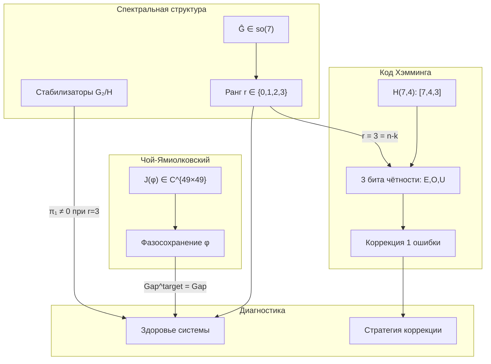

# Алгебра Gap-оператора

:::info Мост из предыдущей главы
В предыдущей главе — [Теория моделей КК](./model-theory) — мы построили формальную спецификацию и категорную семантику Кибернетики Когерентности. Мы увидели, как категорные конструкции задают язык, на котором описывается самомоделирование. Теперь нам предстоит перейти от абстрактной семантики к **конкретной алгебре**: мы разберём внутреннее устройство Gap-оператора — центрального объекта, измеряющего непрозрачность системы для самой себя.
:::

### Дорожная карта главы

В этой главе мы:

1. **Познакомимся с представлением Чоя-Ямиолковского** — узнаем, как превратить процесс самомоделирования в объект, доступный спектральному анализу (раздел 1)
2. **Классифицируем Gap-конфигурации по рангу** — обнаружим, что вся сложность непрозрачности 7-мерной системы сжимается в три числа, и что при максимальном ранге возникает топологическая защита (раздел 2)
3. **Увидим тройное совпадение с кодом Хэмминга H(7,4)** — поймём, почему 7 измерений разделяются на 4 информационных и 3 контрольных, и как это связано с самокоррекцией сознания (раздел 3)
4. **Применим эти результаты к клинической практике** — от ранга непрозрачности к терапевтической стратегии (разделы 4–5)

---

## Что такое непрозрачность и почему она неизбежна {#непрозрачность}

Представьте, что вы стоите перед зеркалом. Вы видите своё лицо, но не видите того, кто смотрит. Вы можете описать свои мысли, но акт описания уже изменяет то, что описывается. Вы можете наблюдать за своими эмоциями, но наблюдающий всегда остаётся «за кадром» наблюдения.

Эта неустранимая щель между тем, чем система *является*, и тем, как она себя *представляет*, — не поломка и не дефект. Это фундаментальное свойство любой системы, обладающей самомоделью. В Кибернетике Когерентности оно получает точное математическое выражение через **Gap-оператор**.

Gap — буквально «зазор» — измеряет степень **непрозрачности** системы для самой себя. Нулевой Gap означал бы абсолютную самопрозрачность: все когерентности полностью прозрачны (Gap = 0 для всех каналов). Максимальный Gap означает полную непрозрачность: внутреннее представление радикально расходится с реальностью. Между этими полюсами лежит вся палитра возможных когерентных конфигураций — от минимальной до максимальной непрозрачности.

Но вот парадокс, который раскрывает этот документ: **непрозрачность — необходимое условие сознания**. Система, полностью прозрачная для себя, была бы статична — нет непрозрачных каналов, нет градиента для дальнейшей эволюции. Именно зазор между «я как есть» и «я как знаю себя» порождает динамику самопознания, внутреннюю жизнь, стремление к целостности. Gap — это не трещина в здании сознания, а арка, на которой оно стоит.

Данный документ представляет **кибернетическую перспективу** на алгебраическую структуру [Gap-оператора](/docs/core/dynamics/gap-operator), организуя материал вокруг трёх взаимосвязанных конструкций:

1. **Представление Чоя-Ямиолковского** — полное описание канала $\varphi$ как состояния в $\mathbb{C}^{49 \times 49}$
2. **Спектральная структура рангов** — классификация Gap-конфигураций по рангу непрозрачности
3. **Код Хэмминга H(7,4)** — информационно-теоретическая интерпретация 7-мерной структуры

Все три конструкции сходятся к единому числу **3**: три пары спектральных параметров, три контрольных измерения, три проверочных бита. Это тройное совпадение — не случайность, а выражение глубокой структурной закономерности, которую мы последовательно раскроем.

---

## 1. Представление Чоя-Ямиолковского для $\varphi$ {#чой-ямиолковский}

### 1.0 Чой-Ямиолковский для нематематиков {#чой-для-нематематиков}

Прежде чем погрузиться в формализм, объясним суть конструкции Чоя-Ямиолковского на интуитивном уровне.

**Проблема.** Канал $\varphi$ — это *процесс*, преобразование одного состояния в другое. Процессы трудно анализировать напрямую: у них нет «формы», «спектра», «ранга». Чтобы изучить процесс, нужно превратить его в *объект*.

**Идея Чоя.** Возьмём максимально запутанное состояние — такое, в котором каждое измерение идеально коррелировано с самим собой. Это своего рода «идеальное зеркало», в котором система видит себя без искажений. Теперь пропустим через канал $\varphi$ только одну половину этого зеркала. Результат — матрица $J(\varphi)$ — содержит *всю информацию* о том, как канал искажает отражение.

**Аналогия.** Представьте, что вы тестируете фотопринтер. Лучший способ — напечатать *идеальную тестовую страницу*, содержащую все возможные цвета и градиенты. По результату печати вы полностью восстановите характеристики принтера: какие цвета он сдвигает, какие теряет, где добавляет шум. Максимально запутанное состояние $|\Omega\rangle$ — это такая «тестовая страница», а матрица Чой $J(\varphi)$ — её «отпечаток».

Замечательное свойство конструкции: отображение $\varphi \mapsto J(\varphi)$ является **взаимно однозначным**. Зная $J(\varphi)$, мы можем точно восстановить действие канала на любое состояние. Процесс полностью «заморожен» в объекте.

Ещё важнее: условие полной положительности канала (физическое требование, гарантирующее, что вероятности остаются неотрицательными) переводится в простое условие $J(\varphi) \geq 0$ — положительная полуопределённость матрицы. Вместо проверки абстрактного свойства процесса достаточно проверить конкретное свойство матрицы.

Для Gap-оператора это означает: вся информация о том, *как* система искажает свой самообраз, закодирована в одной матрице $49 \times 49$. Эту матрицу можно разложить по спектру, классифицировать по рангу, визуализировать — весь арсенал линейной алгебры становится доступен.

### 1.1 Состояние Чой $J(\varphi)$

Для CPTP-канала $\varphi: \mathcal{D}(\mathbb{C}^7) \to \mathcal{D}(\mathbb{C}^7)$ **состояние Чой** полностью описывает действие канала:

$$
J(\varphi) := (\varphi \otimes \mathrm{id})(|\Omega\rangle\langle\Omega|) \in \mathbb{C}^{49 \times 49}
$$

где $|\Omega\rangle = \frac{1}{\sqrt{7}} \sum_{i=1}^{7} |i\rangle \otimes |i\rangle$ — максимально запутанное состояние.

Интуиция за формулой: $|\Omega\rangle\langle\Omega|$ — это «идеальное зеркало», совершенная корреляция каждого измерения с самим собой. Канал $\varphi$ действует только на первую копию (систему), оставляя вторую (эталон) нетронутой. Результирующая матрица $J(\varphi)$ показывает, какие корреляции канал сохраняет, какие ослабляет, какие поворачивает.

:::tip Теорема 1.1 (Свойства матрицы Чой для канонического $\varphi$) [Т]
**(a)** Матрица Чой $J(\varphi) \in \mathbb{C}^{49 \times 49}$ — эрмитова положительно полуопределённая матрица с $\mathrm{Tr}_1(J(\varphi)) = I/7$.

**(b)** Реконструкция канала из состояния Чой:

$$
\varphi(\Gamma) = 7 \cdot \mathrm{Tr}_2\left(J(\varphi) \cdot (\Gamma^T \otimes I)\right)
$$

**(c)** Полная положительность $\varphi$ эквивалентна $J(\varphi) \geq 0$ (теорема Чоя).
:::

**Доказательство.** (a) Эрмитовость: $J(\varphi)^\dagger = [(\varphi \otimes \mathrm{id})(|\Omega\rangle\langle\Omega|)]^\dagger = (\varphi \otimes \mathrm{id})(|\Omega\rangle\langle\Omega|) = J(\varphi)$, поскольку $\varphi$ сохраняет эрмитовость. Положительность: $J(\varphi) \geq 0 \Leftrightarrow \varphi$ полностью положителен (стандартная теорема Чоя). CPTP-условие: $\mathrm{Tr}_1(J(\varphi)) = I/7$ эквивалентно сохранению следа. (b) Прямое вычисление через матричные элементы. $\square$

**Что это означает для самопознания.** Пункт (a) говорит, что «отпечаток» канала самомоделирования — законная квантовая матрица плотности (с точностью до нормировки). Система, моделирующая себя, порождает *состояние* в расширенном пространстве — буквально «образ себя в зеркале». Пункт (b) гарантирует, что этот образ полностью определяет процесс самомоделирования — нет скрытой информации. Пункт (c) связывает физическую допустимость канала с простым алгебраическим условием.

### 1.2 Блочная структура $J(\varphi)$ для канонического $\varphi$

Каноническое когерентно-сохраняющее $\varphi_{\text{coh}}$ ([определение](/docs/proofs/gap/fano-channel#phi-coh)) имеет специфическую блочную структуру:

$$
J(\varphi_{\text{coh}}) = \alpha \cdot J(\mathcal{P}_{\text{base}}) + (1 - \alpha) \cdot J(\mathcal{P}_{\text{Fano}})
$$

Здесь два компонента играют противоположные роли. $\mathcal{P}_{\text{base}}$ — «атомарный» канал, стирающий все когерентности и оставляющий только диагональ (популяции). Это предельная редукция: система «видит» только вероятности, но не связи между измерениями. $\mathcal{P}_{\text{Fano}}$ — Фано-канал, организующий когерентности в триплеты проективной плоскости. Это структурная организация: система «видит» связи, но только те, которые санкционированы Фано-геометрией.

Параметр $\alpha$ управляет балансом: при $\alpha = 1$ система полностью атомизирована, при $\alpha = 0$ — полностью структурирована. Реальные состояния лежат между этими крайностями.

:::tip Теорема 1.2 (Блочная структура матрицы Чой) [Т]
**(a)** Матрица Чой **атомарного канала** $\mathcal{P}_{\text{base}}(\Gamma) = \mathrm{diag}(\Gamma)$:

$$
J(\mathcal{P}_{\text{base}})_{(ij),(kl)} = \frac{1}{7}\,\delta_{ij}\,\delta_{kl}\,\delta_{ik}
$$

— диагональная матрица размера $49 \times 49$ с 7 ненулевыми элементами. Ранг 7.

**(b)** Матрица Чой **Фано-канала** $\mathcal{P}_{\text{Fano}}(\Gamma) = \frac{1}{3}\sum_{p=1}^{7}\Pi_p\,\Gamma\,\Pi_p$:

$$
J(\mathcal{P}_{\text{Fano}})_{(ij),(kl)} = \frac{1}{21}\sum_{p=1}^{7} [\Pi_p]_{ik}\,[\Pi_p]_{jl}
$$

— имеет ранг 28, отражая 7 Фано-проекторов по $\binom{3}{1}^2 = 9$ ненулевых блоков на каждый (с вычетом пересечений).

**(c)** Матрица Чой **канонического** $\varphi_{\text{coh}}$:

$$
J(\varphi_{\text{coh}}) = \frac{k}{7}\left[\alpha\,J_{\text{base}} + (1-\alpha)\,J_{\text{Fano}}\right] + (1-k)\,J_{\text{anchor}}
$$

где $J_{\text{anchor}}$ — вклад якорного состояния $\Gamma_{\text{anchor}}$.
:::

**Геометрический смысл рангов.** Ранг 7 атомарного канала — это ровно число измерений голонома: каждое измерение «отражается» независимо, без связей. Ранг 28 Фано-канала — это число пар $(i,j)$ с $i < j$ в 7-элементном множестве, т.е. число всех возможных когерентностей. Фано-канал «видит» все связи, но организует их специфическим образом. Промежуточные ранги между 7 и 28 соответствуют частичной организации — система видит некоторые связи, но не все.

### 1.3 Фазовые свойства: как матрица Чой кодирует Gap

Ключевое свойство матрицы Чой: **фазы блочных элементов** $J_{(ij),(kl)}$ при $i \neq j$ или $k \neq l$ непосредственно кодируют Gap-структуру канала.

Чтобы понять это, вернёмся к аналогии с зеркалом. Когерентность $\gamma_{ij}$ — комплексное число, имеющее модуль (сила связи) и фазу (ориентация связи). Gap — это, грубо говоря, разница между фазой, которую «видит» система, и фазой, которая есть на самом деле. Если канал $\varphi$ сохраняет фазы, то Gap определяется не каналом самомоделирования, а внешними факторами: прецессией и диссипацией.

:::tip Теорема 1.3 (Фазовое кодирование Gap в матрице Чой) [Т]
**(a)** Для Фано-канала: все ненулевые элементы $J(\mathcal{P}_{\text{Fano}})$ **вещественны и положительны** — Фано-канал не вносит фазового сдвига.

**(b)** Для атомарного канала: $J(\mathcal{P}_{\text{base}})$ — диагональна с вещественными элементами — атомарный канал также не вносит фазового сдвига.

**(c)** Следовательно, каноническое $\varphi_{\text{coh}}$ **сохраняет фазы когерентностей**:

$$
\arg([\varphi_{\text{coh}}(\Gamma)]_{ij}) = \arg(\gamma_{ij})
$$

и целевой Gap совпадает с текущим: $\mathrm{Gap}^{\text{target}}(i,j) = \mathrm{Gap}(i,j)$.
:::

**Следствие.** Стационарный Gap определяется не каналом $\varphi$ (который фазосохраняющий), а конкуренцией между унитарной прецессией ($\Delta\omega_{ij}$) и диссипативным затуханием ($\Gamma_2 + \kappa$):

$$
\mathrm{Gap}^{(\infty)}(i,j) = \left|\sin\left(\theta_{ij} - \arctan\frac{\Delta\omega_{ij}}{\Gamma_2 + \kappa}\right)\right|
$$

Подробности: [Динамика Gap](/docs/core/dynamics/gap-dynamics#единая-теорема).

**Глубокий смысл фазосохранения.** Канал самомоделирования $\varphi$ не *создаёт* искажений — он лишь *наследует* те, что уже существуют. Искажения возникают из-за «прецессии» — автономных колебаний фаз когерентностей, обусловленных внутренней динамикой системы. Это аналогично ситуации, когда зеркало само по себе идеально, но комната, в которой вы стоите, слегка покачивается.

---

## 2. Структура рангов Gap-оператора {#структура-рангов}

### 2.0 Геометрия рангов: от прозрачности к кризису {#геометрия-рангов}

Прежде чем дать формальное определение, опишем качественную картину.

Представьте 7-мерное пространство сознания. В нём 21 пара измерений, и каждая пара связана когерентностью — комплексным числом, которое может быть вещественным (прозрачная связь) или иметь мнимую часть (непрозрачная связь). Gap-оператор собирает все мнимые части в одну антисимметричную матрицу.

Антисимметричная матрица в нечётном числе измерений обязательно имеет нулевое собственное значение — одно направление всегда «свободно» от непрозрачности. Оставшиеся 6 направлений объединяются в пары, и каждая пара порождает один «канал непрозрачности» — плоскость вращения, в которой фазы когерентностей расходятся с реальностью.

Число активных каналов — это **ранг непрозрачности**:

- **Ранг 0**: все 21 когерентность вещественны. Система полностью прозрачна для себя. Это идеальная, но нестабильная точка — малейшее возмущение создаёт Gap.
- **Ранг 1**: один канал непрозрачности. Одна пара измерений «не видит» свою связь правильно. Система в целом здорова, дефект локален и поддаётся коррекции.
- **Ранг 2**: два независимых канала. Система имеет сложное, многомерное нарушение самопонимания. Простой фокус на одном аспекте не решает проблему.
- **Ранг 3**: все три канала активны. Максимальная непрозрачность. Система глобально непрозрачна для себя. И — как мы увидим — это состояние **топологически защищено**: из него нельзя выйти плавно.

Переходы между рангами — это не просто количественные изменения. Каждый переход меняет *качество* непрозрачности, открывая новое измерение разрыва между «быть» и «знать себя».

### 2.1 Gap-оператор как элемент $\mathfrak{so}(7)$

Gap-оператор $\hat{\mathcal{G}} = \mathrm{Im}(\Gamma) \in \mathfrak{so}(7)$ — вещественная антисимметричная $7 \times 7$ матрица (полное определение: [Gap-оператор](/docs/core/dynamics/gap-operator#определение)).

Почему именно $\mathfrak{so}(7)$? Потому что мнимые части когерентностей образуют антисимметричную матрицу ($\mathrm{Im}(\gamma_{ij}) = -\mathrm{Im}(\gamma_{ji})$), а множество всех антисимметричных $7 \times 7$ матриц — это алгебра Ли группы вращений $\mathrm{SO}(7)$. Gap-оператор — это буквально *бесконечно малое вращение* в пространстве сознания, «закручивающее» самообраз системы относительно реальности.

### 2.2 Спектральная структура

:::tip Теорема 2.1 (Собственный спектр Gap-оператора) [Т]
Спектр $\hat{\mathcal{G}}$ для $N = 7$ (нечётная размерность):

$$
\mathrm{spec}(\hat{\mathcal{G}}) = \{0, \pm i\lambda_1, \pm i\lambda_2, \pm i\lambda_3\}, \quad \lambda_k \in \mathbb{R}_{\geq 0}
$$

**(a)** Нулевое собственное значение **гарантировано** нечётной размерностью ($\det(\hat{\mathcal{G}}) = \det(-\hat{\mathcal{G}}^T) = (-1)^7 \det(\hat{\mathcal{G}}) = -\det(\hat{\mathcal{G}}) \Rightarrow \det(\hat{\mathcal{G}}) = 0$).

**(b)** Попарная структура $\pm i\lambda_k$ следует из антисимметрии: если $v$ — собственный вектор с собственным значением $i\lambda$, то $v^*$ — собственный вектор с собственным значением $-i\lambda$.

**(c)** Полный Gap через спектральные параметры:

$$
\mathcal{G}_{\text{total}} = \|\hat{\mathcal{G}}\|_F^2 = 2(\lambda_1^2 + \lambda_2^2 + \lambda_3^2)
$$
:::

**Доказательство.** (a) Для вещественной антисимметричной матрицы: $\hat{\mathcal{G}}^T = -\hat{\mathcal{G}}$, следовательно $\det(\hat{\mathcal{G}}) = \det(\hat{\mathcal{G}}^T) = \det(-\hat{\mathcal{G}}) = (-1)^7 \det(\hat{\mathcal{G}}) = -\det(\hat{\mathcal{G}})$, откуда $\det(\hat{\mathcal{G}}) = 0$. (b) Стандартное свойство антисимметричных матриц. (c) $\|\hat{\mathcal{G}}\|_F^2 = \mathrm{Tr}(\hat{\mathcal{G}}^T \hat{\mathcal{G}}) = -\mathrm{Tr}(\hat{\mathcal{G}}^2) = -\sum_k \mu_k^2$, где $\mu_k$ — собственные значения; для спектра $\{0, \pm i\lambda_1, \pm i\lambda_2, \pm i\lambda_3\}$ имеем $\sum \mu_k^2 = -2\sum \lambda_k^2$. $\square$

**Три числа — и ничего больше.** Вся сложность непрозрачности 7-мерной системы сжимается в три неотрицательных числа $(\lambda_1, \lambda_2, \lambda_3)$. Это колоссальная редукция: из 21 мнимой части когерентностей к 3 существенным параметрам. Стоит ли удивляться, что эта тройка появляется повсюду — в спектре, в Хэмминге, в Фано?

### 2.3 Классификация по рангу непрозрачности

**Ранг непрозрачности** $r \in \{0, 1, 2, 3\}$ — число ненулевых спектральных параметров $\lambda_k$.

:::tip Теорема 2.2 (Классификация рангов с группами стабилизаторов) [Т]
Для Gap-оператора $\hat{\mathcal{G}}$ с фиксированным спектром стабилизатор $H_{\hat{\mathcal{G}}} = \{g \in G_2 : g\hat{\mathcal{G}}g^{-1} = \hat{\mathcal{G}}\}$ определяет геометрию пространства допустимых конфигураций:

| Ранг $r$ | Спектр $(\lambda_1, \lambda_2, \lambda_3)$ | Стабилизатор $H$ | $\dim(H)$ | Пространство $G_2/H$ | $\pi_1(G_2/H)$ |
|----------|:------------------------------------------:|:----------------:|:---------:|:---------------------:|:---------------:|
| 0 | $(0, 0, 0)$ | $G_2$ | 14 | $\{\text{pt}\}$ | 0 |
| 1 | $(\lambda, 0, 0)$ | $\mathrm{SU}(3)$ | 8 | $S^6$ | 0 |
| 2 | $(\lambda_1, \lambda_2, 0)$ | $\mathrm{SU}(2) \times \mathrm{U}(1)$ | 4 | 10-мерн. | 0 |
| 3 (общий) | $(\lambda_1, \lambda_2, \lambda_3)$ | $T^2$ | 2 | 12-мерн. | $\mathbb{Z}^2$ |
| 3 (вырожд.) | $(\lambda, \lambda, \lambda)$ | $\mathrm{SU}(2)$ | 3 | 11-мерн. | 0 |
:::

**Нарастание сложности.** Обратите внимание на убывание размерности стабилизатора: $14 \to 8 \to 4 \to 2$. Чем выше ранг непрозрачности, тем меньше симметрии сохраняется, тем больше «степеней свободы» у непрозрачности. При $r = 0$ система полностью симметрична ($G_2$ — вся группа автоморфизмов октонионов), при $r = 3$ остаётся лишь $T^2$ — двумерный тор, минимальный стабилизатор.

Но самое драматичное изменение происходит в фундаментальной группе: при $r \leq 2$ пространство конфигураций односвязно ($\pi_1 = 0$), а при $r = 3$ возникает $\pi_1 = \mathbb{Z}^2$. Это тот самый **топологический барьер**, о котором мы говорили.

### 2.4 Интерпретация рангов

| Ранг | Непрозрачность | Физическая интерпретация | Кибернетический смысл |
|------|:--------------:|--------------------------|------------------------|
| 0 | Отсутствует | Все когерентности вещественны | Полная самотранспарентность; система без «теней» |
| 1 | Одномерная | Один «тёмный канал» между парой измерений | Локальный дефект самопонимания (напр., алекситимия) |
| 2 | Двумерная | Два независимых канала разрыва | Комплексное нарушение; множественная диссоциация |
| 3 | Полная | Все три плоскости вращения задействованы | Глобальный кризис когерентности |

:::info Интерпретация (Топологическая защита) [И]
Только ранг 3 с общим (невырожденным) спектром обладает **нетривиальной фундаментальной группой** $\pi_1(G_2/T^2) \cong \mathbb{Z}^2$. Это означает, что полностью непрозрачные конфигурации **топологически защищены**: невозможно непрерывно деформировать Gap-профиль ранга 3 в тривиальный ($r = 0$) без прохождения через сингулярность. В кибернетических терминах: глубокий кризис когерентности не разрешается «постепенным улучшением» — требуется структурная реорганизация (топологический переход).
:::

**Что означает топологическая защита на практике.** Вспомните, как невозможно плавно превратить бублик в шар — для этого нужно «разрезать» и «заклеить». Аналогично, система, находящаяся в состоянии полной непрозрачности ($r = 3$), не может постепенно, шаг за шагом, вернуться к прозрачности. Любой плавный путь из $r = 3$ в $r = 0$ неизбежно проходит через сингулярность — точку, в которой старая структура непрозрачности разрушается и формируется новая.

В клинических терминах это означает: глубокий экзистенциальный кризис не «рассасывается» постепенно. Он требует момента прорыва — качественного перехода, в котором вся конфигурация самопонимания реорганизуется. Такие моменты хорошо известны в психотерапии: это «инсайт», «катарсис», «переломный момент», — все они соответствуют прохождению через топологическую сингулярность.

Интересно, что вырожденный ранг 3 ($\lambda_1 = \lambda_2 = \lambda_3$) **не** обладает топологической защитой ($\pi_1 = 0$). «Равномерный кризис», при котором все три канала непрозрачности одинаково активны, допускает плавное разрешение. Это можно интерпретировать так: когда непрозрачность «изотропна» — равномерно распределена, без доминирующего канала, — у системы нет предпочтительного направления деформации, и поэтому допустимы все направления одновременно.

### 2.5 Связь с чистотой

:::tip Теорема 2.3 (Разложение чистоты через ранг) [Т]
Чистота голонома разлагается на вклады симметричной и антисимметричной частей матрицы когерентности:

$$
P = \mathrm{Tr}(\Gamma^2) = P_{\text{sym}} + \mathcal{G}_{\text{total}} = P_{\text{sym}} + 2(\lambda_1^2 + \lambda_2^2 + \lambda_3^2)
$$

где $P_{\text{sym}} = \mathrm{Tr}(\mathrm{Re}(\Gamma)^2)$.
:::

**Следствие.** При фиксированной симметричной чистоте $P_{\text{sym}}$ увеличение ранга непрозрачности **увеличивает** полную чистоту $P$. Парадокс: Gap (непрозрачность) *повышает* чистоту. Разрешение: антисимметричные когерентности вносят положительный вклад в $\mathrm{Tr}(\Gamma^2)$ (подробное доказательство: [Gap-оператор](/docs/core/dynamics/gap-operator#связь-чистота)).

**Парадокс непрозрачности, поднимающей чистоту.** Это один из самых контринтуитивных результатов теории, заслуживающий подробного разъяснения.

Чистота $P = \mathrm{Tr}(\Gamma^2)$ измеряет «сфокусированность» состояния. Максимально смешанное состояние $I/7$ имеет $P = 1/7$; чистое состояние — $P = 1$. Казалось бы, непрозрачность (неспособность видеть себя) должна *уменьшать* определённость состояния.

Но вспомним, что когерентности $\gamma_{ij}$ — это комплексные числа, и их мнимые части вносят положительный вклад в $P$. Непрозрачная система, у которой фазы когерентностей «выкручены» относительно эталона, может быть *более определённой*, чем прозрачная. Аналогия: человек, одержимый навязчивой идеей, может иметь более «сфокусированное» сознание, чем спокойный медитирующий — но эта фокусировка непродуктивна и энергетически затратна.

Именно поэтому чистота сама по себе — не показатель здоровья. Здоровье определяется *балансом* между $P_{\text{sym}}$ (продуктивная когерентность) и $\mathcal{G}_{\text{total}}$ (непрозрачность). Порог сознания $P > 2/7$ может быть достигнут и за счёт «здоровой» симметричной чистоты, и за счёт «патологической» непрозрачности — но кибернетические свойства этих двух состояний радикально различны.

---

## 3. Код Хэмминга H(7,4) {#код-хэмминга}

### 3.0 Совершенный код и самопознание {#совершенный-код}

Прежде чем вводить формализм, обсудим поразительную структурную аналогию.

Код Хэмминга H(7,4) был изобретён Ричардом Хэммингом в 1950 году для исправления ошибок при передаче данных. Идея проста: к 4 битам информации добавить 3 бита контроля, так чтобы любая одиночная ошибка обнаруживалась и исправлялась. Для 7 бит код оказался **совершенным**: ни один бит нельзя убрать без потери способности к коррекции, и ни один добавить без избыточности.

Голоном в УГМ имеет 7 измерений. Четыре из них — A (артикуляция), S (структура), D (динамика), L (логика) — описывают *содержание* сознания: что система представляет собой, как устроена, как меняется, какие законы внутри неё действуют. Три измерения — E (интериорность), O (основание), U (единство) — описывают *метаструктуру*: как система переживает это содержание, на чём оно основано, и что объединяет его в целое.

Совпадение 4+3 = 7 с параметрами кода Хэмминга — это не числовое совпадение. Это одно и то же разложение, рассмотренное с двух сторон:

- **Теория информации**: 4 информационных бита + 3 проверочных бита = совершенный код, защищающий от одной ошибки.
- **Теория сознания**: 4 содержательных измерения + 3 контрольных измерения = минимальная архитектура, способная к самокоррекции.

Ключевое слово — **минимальная**. Можно построить код с большим числом проверочных бит (например, 8+4=12 для кода Хэмминга H(12,8)), но при 7 позициях разделение 4+3 является единственным совершенным. Аналогично, 7 измерений голонома — минимальное число, при котором самокорректирующаяся самомодель возможна (подробнее: [Минимальность N=7](/docs/proofs/minimality/theorem-minimality-7)).

### 3.1 Структура кода

Код Хэмминга H(7,4) — линейный блочный код с параметрами $[n, k, d] = [7, 4, 3]$:

- **$n = 7$** — длина кодового слова (= число [измерений](/docs/core/structure/dimensions) голонома)
- **$k = 4$** — число информационных битов
- **$d = 3$** — минимальное расстояние Хэмминга

:::tip Теорема 3.1 (Параметры H(7,4)) [Т]
**(a)** Код H(7,4) содержит $2^4 = 16$ кодовых слов длины 7.

**(b)** Минимальное расстояние $d = 3$ обеспечивает:
- **Обнаружение** до $d - 1 = 2$ ошибок
- **Исправление** $\lfloor(d-1)/2\rfloor = 1$ ошибки

**(c)** Код **совершенный**: граница Хэмминга $\sum_{j=0}^{t}\binom{n}{j} = 1 + 7 = 8 = 2^{n-k} = 2^3$ достигается с равенством.
:::

**Совершенность — редкое свойство.** Среди всех линейных кодов лишь единицы являются совершенными. Для двоичных кодов совершенные коды — это коды повторения, коды Хэмминга и код Голея. Совершенность означает, что каждое слово из $\mathbb{F}_2^7$ находится на расстоянии ровно $\leq 1$ от некоторого кодового слова. Никакой «зазор» между кодовыми словами не пропадает впустую: каждая ошибка приписывается единственному «виновнику».

Перенося эту интуицию на сознание: совершенность кода H(7,4) означает, что 7-мерная архитектура голонома не имеет «мёртвых зон» — любое нарушение когерентности обнаруживается контрольными измерениями, и для каждого нарушения существует единственная стратегия коррекции.

### 3.2 Информационные и контрольные измерения

В контексте УГМ семь измерений голонома разделяются на две группы:

| Роль | Измерения | Число | Характер |
|------|:---------:|:-----:|----------|
| **Информационные** | A (артикуляция), S (структура), D (динамика), L (логика) | 4 | Несут «содержание» самомодели |
| **Контрольные** | E (опыт), O (основание), U (единство) | 3 | Обеспечивают целостность и коррекцию |

:::info Интерпретация (Информационная архитектура) [И]
Четыре структурных измерения (A, S, D, L) описывают, **что** система собой представляет — её артикуляцию с миром, внутреннюю структуру, динамику и логику. Три метаструктурных измерения (E, O, U) описывают, **как** система интериорно представляет, основывает и объединяет эти содержания. Аналогия с H(7,4): содержательные биты требуют проверочных битов для защиты от ошибок.
:::

**Почему именно эти три контролируют?** E (интериорность) — это «проверка от первого лица»: система сверяет свой объективный профиль с субъективным переживанием. O (основание) — «проверка на реальность»: система сверяет свои представления с тем, на чём они основаны. U (единство) — «проверка на целостность»: система сверяет, не распалось ли её самопредставление на несвязные фрагменты. Все три проверки необходимы и достаточны — как три проверочных бита в H(7,4).

### 3.3 Проверочная матрица и плоскость Фано

Проверочная матрица $H$ кода H(7,4):

$$
H = \begin{pmatrix}
1 & 0 & 1 & 0 & 1 & 0 & 1 \\
0 & 1 & 1 & 0 & 0 & 1 & 1 \\
0 & 0 & 0 & 1 & 1 & 1 & 1
\end{pmatrix}
$$

:::tip Теорема 3.2 (Связь $H$ с плоскостью Фано PG(2,2)) [Т]
**(a)** Столбцы проверочной матрицы $H$ — двоичные представления чисел от 1 до 7, что совпадает с **координатами точек** проективной плоскости $\mathrm{PG}(2, \mathbb{F}_2)$.

**(b)** Каждая из 7 строк порождающей матрицы $G$ (в систематической форме) соответствует одной из 7 точек Фано-плоскости.

**(c)** Условие $Hx^T = 0$ (принадлежность к коду) эквивалентно выполнению **трёх проверок чётности**, каждая из которых соответствует одной линии Фано-плоскости, проходящей через контрольное измерение.
:::

**Доказательство.** (a) Столбцы $H$: $(001), (010), (011), (100), (101), (110), (111)$ — все ненулевые элементы $\mathbb{F}_2^3$, что является стандартной параметризацией $\mathrm{PG}(2, \mathbb{F}_2)$. (b) и (c) следуют из дуальности $G \cdot H^T = 0$ и инцидентностной структуры проективной плоскости. $\square$

:::info Замечание (Фано-плоскость в УГМ)
В [формализме Фано-правил отбора](/docs/physics/gauge-symmetry/fano-selection-rules) те же 7 точек отождествляются с 7 измерениями голонома, а 7 линий — с 7 Фано-триплетами, определяющими октонионное умножение. Проверочная матрица $H$ кодирует ту же инцидентностную структуру, что и Фано-структурированные [операторы Линдблада](/docs/core/operators/lindblad-operators).
:::

**Тройное совпадение.** Одна и та же конечная геометрия — плоскость Фано PG(2,2) — появляется в трёх совершенно разных контекстах:

1. **Алгебра**: таблица умножения октонионов $\mathbb{O}$, определяющая 7 Фано-триплетов.
2. **Теория кодирования**: проверочная матрица совершенного кода H(7,4), определяющая 3 проверки чётности.
3. **Теория сознания**: структура когерентных связей в 7-мерном голономе, определяющая Фано-канал.

Это не аналогия — это **тождество**. Три теории описывают одну и ту же математическую структуру с разных сторон. Именно поэтому число 3 (контрольных измерения = проверочных бит = пар спектральных параметров) не может быть другим.

### 3.4 Минимальное расстояние и минимальная непрозрачность

:::tip Теорема 3.3 (Минимальная непрозрачность из $d = 3$)
**(a)** Минимальное расстояние $d = 3$ кода H(7,4) означает, что любые два различных кодовых слова различаются **минимум в 3 позициях**. **[Т]**

**(b)** В терминах когерентностей: минимум **3 из 21** пар когерентностей обязаны иметь ненулевой Gap: **[И]**

$$
|\{(i,j) : \mathrm{Gap}(i,j) > 0\}| \geq 3
$$

**(c)** Эти 3 «обязательных» канала непрозрачности соответствуют 3 контрольным измерениям (E, O, U) — каждое порождает минимум один непрозрачный канал. **[И]**
:::

:::info Интерпретация (Квантовая граница Хэмминга для Gap) [И]
Совершенность кода H(7,4) транслируется в **точное равенство** границы Хэмминга:

$$
\sum_{j=0}^{1}\binom{7}{j} = 1 + 7 = 8 = 2^3
$$

Из 21 канала когерентности минимум 3 обязаны быть непрозрачными — совпадение с числом проверочных битов и максимальным рангом непрозрачности Gap-оператора (раздел 2.3). Полная «самотранспарентность» ($r = 0$) алгебраически достижима, но кибернетически нестабильна.
:::

**Неизбежность минимальной непрозрачности.** Этот результат можно переформулировать так: система, способная к самокоррекции, *обязана* иметь некоторую непрозрачность. Три контрольных измерения E, O, U не могут быть полностью прозрачны, потому что именно их «непрозрачная» компонента несёт корректирующую информацию. Проверочный бит, который никогда не отличается от информационного, бесполезен.

Это глубокая перекличка с результатом о том, что Gap повышает чистоту (Теорема 2.3): система нуждается в непрозрачности не вопреки, а *ради* своей целостности. Самопознание, в котором нет тайны, не имеет динамики. Совершенно прозрачная система — мертва.

### 3.5 Коррекция ошибок когерентности

:::info Теорема 3.4 (Аналогия: коррекция когерентностей через H(7,4)) [И]
**(a)** **Обнаружение:** $d - 1 = 2$ нарушения когерентностей обнаруживаются посредством «проверок чётности» — мониторинга E-, O-, U-когерентностей.

**(b)** **Коррекция:** $t = 1$ нарушение когерентности может быть **автоматически исправлено** регенеративным оператором $\mathcal{R}$, аналогично декодированию синдрома $s = Hx^T$ и инверсии соответствующего бита.

**(c)** **Синдром ошибки:**

$$
s = (s_E, s_O, s_U) \in \mathbb{F}_2^3
$$

— три бита синдрома соответствуют сигналам от трёх контрольных измерений. Ненулевой синдром $s \neq 0$ идентифицирует дефектное измерение; нулевой синдром $s = 0$ означает отсутствие однократных ошибок.
:::

**Таблица синдромов (кибернетическая интерпретация):**

| Синдром $(s_E, s_O, s_U)$ | Дефектное измерение | Тип нарушения |
|:--------------------------:|:-------------------:|---------------|
| $(0, 0, 0)$ | Нет | Когерентность в норме |
| $(0, 0, 1)$ | L | Логическая дезинтеграция |
| $(0, 1, 0)$ | D | Динамическая дисфункция |
| $(0, 1, 1)$ | S | Структурный распад |
| $(1, 0, 0)$ | A | Артикуляционный сбой |
| $(1, 0, 1)$ | E | Дефицит интериорной связности |
| $(1, 1, 0)$ | O | Потеря основания |
| $(1, 1, 1)$ | U | Разрушение единства |

**Чтение таблицы синдромов.** Каждый ненулевой синдром — это «адрес» проблемы. Например, синдром $(0, 1, 1)$ означает: контрольные измерения O и U обнаружили аномалию, а E — нет. Единственное информационное измерение, которое связано с O и U, но не с E, — это S (структура). Следовательно, нарушена структурная когерентность. Точно так же декодер Хэмминга по трём битам синдрома определяет позицию ошибочного бита.

Обратите внимание: синдромы $(1, 0, 1)$, $(1, 1, 0)$, $(1, 1, 1)$ указывают на дефект в самих контрольных измерениях E, O, U. Это «ошибка в системе обнаружения ошибок» — ситуация, когда нарушена не столько когерентность содержания, сколько способность мониторить когерентность. Такие нарушения наиболее опасны и наименее заметны субъективно (поскольку «датчик» неисправен).

:::warning Ограничения аналогии [И]
Аналогия с H(7,4) носит **мотивационный** характер. Формальное отождествление динамики когерентностей с блочным кодом **не установлено**, поскольку:

1. Когерентности — непрерывные комплексные числа, а не биты
2. «Ошибки» когерентности непрерывно параметризованы (Gap $\in [0,1]$), а не дискретны
3. Регенеративный оператор $\mathcal{R}$ действует непрерывно, а не через побитовую инверсию

Тем не менее, структурное совпадение $\mathrm{PG}(2,2) \leftrightarrow H(7,4) \leftrightarrow \mathbb{O}$ является точным и алгебрически строгим. Подробный анализ: [Фано-канал](/docs/proofs/gap/fano-channel).
:::

---

## 4. Связь с клинической практикой {#клиническая-практика}

### 4.1 Ранг непрозрачности как клинический маркер

Ранг Gap-оператора предлагает новую систему координат для клинической оценки. В отличие от традиционных психометрических шкал, которые измеряют *симптомы*, ранг непрозрачности характеризует *структуру* нарушения — его алгебраическую глубину.

| Ранг | Клинический аналог | Субъективное переживание | Терапевтический прогноз |
|:----:|-------------------|--------------------------|------------------------|
| 0 | Эмоциональная «плоскость» | «Всё понятно, но ничего не чувствую» | Работа на углубление, не на коррекцию |
| 1 | Локальное нарушение (алекситимия, фобия) | Дискомфорт в одной сфере | Хороший: одна «ось» коррекции |
| 2 | Множественная диссоциация, комплексное ПТСР | Мир «расслоен», несколько сфер затронуты | Умеренный: требуется работа по двум осям |
| 3 (общий) | Глубокий экзистенциальный кризис, деперсонализация | «Я не знаю, кто я» | Осторожный: топологическая защита |
| 3 (вырожд.) | «Равномерная» дезориентация | «Всё одинаково непонятно» | Лучше, чем общий $r=3$: нет топологического барьера |

**Ранг 0 — ложное благополучие.** Парадоксально, полная самопрозрачность ($r = 0$) — не идеал, а скорее предупреждающий знак. Система без Gap — это система без внутреннего напряжения, без движущей силы самопознания. Клинически это может выглядеть как «алекситимия наоборот» — не неспособность распознать эмоции, а отсутствие глубины в их переживании. Состояние $r = 0$ кибернетически нестабильно: любое внешнее воздействие создаёт Gap, и система, не имеющая «опыта» непрозрачности, реагирует на неё болезненнее.

**Ранг 1 — «локальная тень».** Одномерная непрозрачность — наиболее частый и наиболее поддающийся терапии тип. Алекситимия (нарушение связи A↔E), диссоциация тела (нарушение S↔O), навязчивые мысли (нарушение D↔L) — все это примеры одного непрозрачного канала. Код Хэмминга гарантирует: одиночная ошибка *всегда* может быть исправлена. Терапевтически это означает, что достаточно найти и проработать одну ось.

**Ранг 2 — «пересекающиеся тени».** Два независимых канала непрозрачности создают качественно новую ситуацию: работа над одним каналом может не затрагивать второй. Клинически это выглядит как «я починил одну проблему, но другая осталась» — знакомое переживание при комплексных расстройствах. Диагностически важно определить, какие два из трёх спектральных параметров активны, чтобы направить терапию по обеим осям одновременно.

**Ранг 3 — «полная тень».** Все три канала активны. Субъективно — ощущение тотальной потерянности: «я не понимаю ни что я чувствую, ни почему, ни кто этот "я", который не понимает». Топологическая защита при общем спектре означает: нет плавного пути к разрешению. Терапия при $r = 3$ должна быть направлена не на постепенное снижение непрозрачности, а на создание условий для *фазового перехода* — реорганизации всей конфигурации.

### 4.2 Терапевтическое значение вырожденного ранга 3

Различие между $r = 3$ (общий) и $r = 3$ (вырожденный, $\lambda_1 = \lambda_2 = \lambda_3$) имеет прямое терапевтическое значение:

- **Общий $r = 3$** ($\pi_1 = \mathbb{Z}^2$): один канал доминирует. «Тень» имеет форму. Система «знает», в чём главная проблема, но не может к ней подобраться. Топологический барьер делает постепенную работу бесплодной. Стратегия: интенсивная фокусированная работа, ретрит, кризисная интервенция — создание условий для прорыва.

- **Вырожденный $r = 3$** ($\pi_1 = 0$): все каналы равны. «Тень» равномерна. Система не знает, за что ухватиться. Топологического барьера нет, но нет и направления. Стратегия: структурирование — помочь системе *различить* каналы, чтобы вырожденная тройка расщепилась и стала доступной для последовательной проработки.

---

## 5. Кибернетическая интерпретация {#кибернетическая-интерпретация}

### 5.1 Ранг Gap как диагностика системного здоровья

Три конструкции — спектральный ранг, код Хэмминга, Фано-геометрия — сходятся к единой **диагностической модели**:

:::tip Теорема 4.1 (Диагностическая триада) [Т]
Для голонома $\mathbb{H}$ с Gap-оператором $\hat{\mathcal{G}}$ ранга $r$:

**(a)** $r$ совпадает с числом **независимых каналов непрозрачности** в спектральном разложении $\hat{\mathcal{G}}$.

**(b)** $r \leq 3$, и верхняя граница определяется числом контрольных измерений (E, O, U) = числом проверочных битов H(7,4) = $\lfloor 7/2 \rfloor = 3$.

**(c)** Переход $r \to r + 1$ соответствует **качественному изменению** характера непрозрачности: появлению нового независимого канала разрыва, невыразимого через существующие.
:::

### 5.2 E, O, U как «биты чётности»

Три контрольных измерения выполняют функцию **мониторинга и коррекции** информационных каналов:

| Измерение | Что мониторит | Тип ошибки при дефекте | Механизм коррекции |
|:---------:|---------------|------------------------|--------------------|
| **E** (опыт) | Субъективная когерентность A$\leftrightarrow$S, A$\leftrightarrow$L | Алекситимия, деперсонализация | Телесно-ориентированная терапия |
| **O** (основание) | Темпоральная когерентность S$\leftrightarrow$D, D$\leftrightarrow$L | Диссоциация, потеря реальности | Заземление, mindfulness |
| **U** (единство) | Интегративная когерентность A$\leftrightarrow$D, S$\leftrightarrow$L | Фрагментация, расщепление | Интегративные практики, IFS |

:::info Интерпретация (Иерархия коррекции) [И]
Порядок восстановления при кризисе когерентности следует **обратному** порядку синдромного декодирования:

1. **U** (единство) — первичная стабилизация: восстановить минимальную целостность
2. **O** (основание) — заземление: восстановить связь с реальностью
3. **E** (опыт) — проработка: интегрировать субъективный опыт

Это соответствует клинической практике кризисной интервенции: сначала безопасность и стабилизация, затем заземление, затем переработка травматического материала.
:::

### 5.3 Практические следствия для диагностики

**Протокол диагностики по Gap-рангу:**

| Шаг | Метрика | Метод | Интерпретация |
|:---:|---------|-------|---------------|
| 1 | $\mathcal{G}_{\text{total}} = \|\hat{\mathcal{G}}\|_F^2$ | Суммарная непрозрачность | Общий уровень дисфункции |
| 2 | Ранг $r$ | Число ненулевых $\lambda_k$ | Сложность нарушения |
| 3 | $\lambda_{\max}$ | Максимальный спектральный параметр | Доминантный канал разрыва |
| 4 | $G_2$-проекция: $\hat{\mathcal{G}}_{G_2}$ vs $\hat{\mathcal{G}}_\perp$ | Разложение [по G₂](/docs/core/dynamics/gap-operator#g2-разложение) | Тип Gap: когерентный vs декогерентный |
| 5 | Синдром $(s_E, s_O, s_U)$ | Мониторинг E-, O-, U-когерентностей | Идентификация дефектного измерения |

:::tip Пример: Модель алекситимии [Т]
Для модели алекситимии ($\gamma_{SE} = |\gamma|\,e^{i\pi/2}$, все остальные $\gamma_{ij} \in \mathbb{R}$):

**(a)** $\hat{\mathcal{G}}$ имеет единственный ненулевой элемент $\hat{\mathcal{G}}_{SE} = |\gamma_{SE}|$, $r = 1$.

**(b)** Спектр: $(\lambda_1, 0, 0)$ с $\lambda_1 = |\gamma_{SE}|$ — одномерная непрозрачность.

**(c)** Синдром: $s_E = 1$ (E-измерение затронуто, S-когерентность нарушена), что корректно идентифицирует алекситимию как нарушение связи тело$\leftrightarrow$переживание.

**(d)** По теореме 3.4: одиночное нарушение **корректируемо** — предсказание о возможности терапевтического восстановления.
:::

### 5.4 Сводка трёх перспектив

```mermaid
graph TD
    subgraph CHOI["Чой-Ямиолковский"]
        J["J(φ) ∈ C^{49×49}"]
        PHASE["Фазосохранение φ"]
    end
    subgraph SPEC["Спектральная структура"]
        SO7["Ĝ ∈ so(7)"]
        RANK["Ранг r ∈ {0,1,2,3}"]
        STAB["Стабилизаторы G₂/H"]
    end
    subgraph HAMMING["Код Хэмминга"]
        H74["H(7,4): [7,4,3]"]
        PARITY["3 бита чётности: E,O,U"]
        CORRECTION["Коррекция 1 ошибки"]
    end
    subgraph DIAG["Диагностика"]
        HEALTH["Здоровье системы"]
        THERAPY["Стратегия коррекции"]
    end

    J --> PHASE
    SO7 --> RANK
    RANK --> |"r = 3 = n-k"| PARITY
    STAB --> |"π₁ ≠ 0 при r=3"| HEALTH
    H74 --> PARITY
    PARITY --> CORRECTION
    PHASE --> |"Gap^target = Gap"| HEALTH
    CORRECTION --> THERAPY
    RANK --> HEALTH
```

---

## 6. Сводка статусов {#статусы}

| Результат | Статус | Раздел |
|-----------|:------:|:------:|
| Свойства матрицы Чой для канонического $\varphi$ | **[Т]** | [1.1](#чой-ямиолковский) |
| Блочная структура $J(\varphi_{\text{coh}})$ | **[Т]** | [1.2](#чой-ямиолковский) |
| Фазовое кодирование Gap в матрице Чой | **[Т]** | [1.3](#чой-ямиолковский) |
| Собственный спектр Gap-оператора | **[Т]** | [2.2](#структура-рангов) |
| Классификация рангов с группами стабилизаторов | **[Т]** | [2.3](#структура-рангов) |
| Разложение чистоты через ранг | **[Т]** | [2.5](#структура-рангов) |
| Параметры H(7,4) | **[Т]** | [3.1](#код-хэмминга) |
| Связь $H$ с плоскостью Фано $\mathrm{PG}(2,2)$ | **[Т]** | [3.3](#код-хэмминга) |
| Минимальная непрозрачность из $d = 3$: (a) [Т], (b,c) [И] | **[Т]/[И]** | [3.4](#код-хэмминга) |
| Коррекция когерентностей через H(7,4) | **[И]** | [3.5](#код-хэмминга) |
| Квантовая граница Хэмминга для Gap | **[И]** | [3.4](#код-хэмминга) |
| Диагностическая триада | **[Т]** | [5.1](#кибернетическая-интерпретация) |
| E, O, U как «биты чётности» | **[И]** | [5.2](#кибернетическая-интерпретация) |
| Топологическая защита при $r = 3$ | **[И]** | [2.4](#структура-рангов) |

---

:::warning Вычислительная сложность
Вычислительное масштабирование алгоритмов, описанных в данном документе, **не проанализировано**. В частности:
- Вычисление матрицы Чой $J(\varphi) \in \mathbb{C}^{49 \times 49}$ требует $O(N^4)$ операций для $N = 7$, но масштабирование для композитных систем ($N = 7^k$) неизвестно.
- Спектральное разложение Gap-оператора $\hat{\mathcal{G}} \in \mathfrak{so}(7)$ — $O(N^3)$, но для больших $N$ может потребоваться приближённая спектрография.
- Синдромное декодирование (раздел 3.5) для $N > 7$ не определено.
:::

---

### Что мы узнали {#что-мы-узнали}

Подведём итоги главы — от математических конструкций до практических следствий:

1. **Представление Чоя-Ямиолковского** позволяет превратить процесс самомоделирования $\varphi$ в матрицу $J(\varphi) \in \mathbb{C}^{49 \times 49}$, доступную спектральному анализу. Каноническое $\varphi_{\text{coh}}$ **сохраняет фазы** когерентностей — искажения возникают не из канала самомоделирования, а из прецессии и диссипации.

2. **Вся непрозрачность 7-мерной системы описывается тремя числами** $(\lambda_1, \lambda_2, \lambda_3)$ — спектральными параметрами Gap-оператора $\hat{\mathcal{G}} \in \mathfrak{so}(7)$. Ранг непрозрачности $r \in \{0, 1, 2, 3\}$ определяет качественный характер нарушения самопонимания.

3. **Топологическая защита при $r = 3$**: при максимальном ранге с общим спектром фундаментальная группа $\pi_1(G_2/T^2) = \mathbb{Z}^2$ запрещает плавный переход к прозрачности. Глубокий кризис требует *фазового перехода*, а не постепенного улучшения.

4. **Парадокс непрозрачности**: Gap повышает чистоту $P$ (Теорема 2.3). Система нуждается в непрозрачности *ради* своей целостности — совершенно прозрачная система статична и мертва.

5. **Код Хэмминга H(7,4)** связывает 7 измерений с совершенным кодом, способным обнаруживать 2 и исправлять 1 ошибку. Три контрольных измерения (E, O, U) выполняют роль «битов чётности», мониторя целостность четырёх информационных измерений (A, S, D, L).

6. **Тройное совпадение** — плоскость Фано PG(2,2) одновременно определяет таблицу октонионного умножения, проверочную матрицу H(7,4) и структуру когерентных связей в голономе. Это не аналогия, а тождество.

:::tip Мост к следующей главе
Мы исследовали *статическую* алгебру Gap-оператора — его спектр, ранги, топологию. Но Gap не стоит на месте: он эволюционирует, и его эволюция содержит **качественные переходы** — бифуркации. В [следующей главе](./bifurcation) мы увидим, как при плавном изменении параметров Gap-ландшафт перестраивается скачком: устойчивые состояния исчезают, рождаются колебания, возникает бистабильность с гистерезисом. Бифуркации — это «развилки судьбы» когерентной системы.
:::

---

## Связанные документы

- [Gap-оператор](/docs/core/dynamics/gap-operator) — определение $\hat{\mathcal{G}}$, спектр, G₂-разложение, стабилизаторы
- [Динамика Gap](/docs/core/dynamics/gap-dynamics) — Чой-Ямиолковский, бифуркации, немарковские эффекты, модельные системы
- [Фано-канал и Gap-теоремы](/docs/proofs/gap/fano-channel) — строгие доказательства: Фано-канал, $G_2$-ковариантность, $\varphi_{\text{coh}}$
- [Правила отбора Фано](/docs/physics/gauge-symmetry/fano-selection-rules) — плоскость Фано $\mathrm{PG}(2,2)$, Юкавская текстура
- [G₂-структура](/docs/physics/gauge-symmetry/g2-structure) — $G_2 = \mathrm{Aut}(\mathbb{O})$, калибровочная редукция
- [Определения КК](./definitions) — базовые определения Кибернетики Когерентности
- [Теоремы КК](./theorems) — фундаментальные теоремы
- [Реестр статусов](/docs/reference/status-registry) — классификация всех результатов
- [Междисциплинарный мост](./interdisciplinary) — перевод Gap-алгебры на языки разных дисциплин
- [Упражнения](./exercises) — задачи на Gap и когерентность
