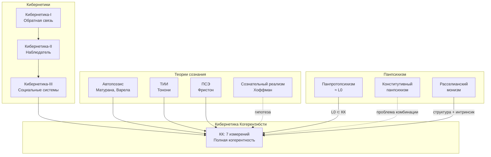
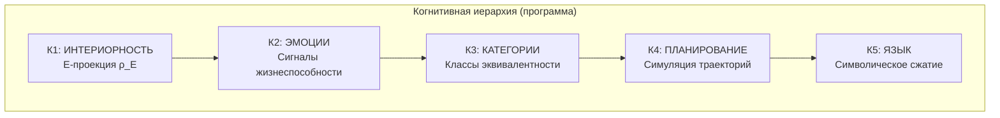

# Иерархия Кибернетик

:::note О нотации
В этом документе:
- $\Gamma$ — [матрица когерентности](/docs/core/dynamics/coherence-matrix)
- $\varphi$ — [оператор самомоделирования](/docs/proofs/formalization-phi)
- $\Phi$ — [мера интеграции](/docs/core/structure/dimension-u#мера-интеграции-φ)
- $\mathcal{R}[\Gamma, E]$ — [регенеративный член](/docs/core/dynamics/evolution#3-регенеративный-член)
- $\rho_E$ — редуцированная матрица плотности [измерения Опыта](/docs/core/structure/dimension-e)
- $\mathrm{Coh}_E$ — [E-когерентность](./definitions#e-когерентность)
:::

:::warning Статус разделов документа
- **Иерархия включения теорий** — концептуальная схема, демонстрирующая отношения между теориями
- **Иерархия инвариантов (P1-P4, F1-F10)** — **программа исследований**, не выведенная из аксиом УГМ
- **Когнитивная иерархия (Уровни 1-5)** — **программа исследований**, связь с [иерархией интериорности](/docs/proofs/interiority-hierarchy) (L0-L1-L2) требует формализации
:::

## Общая структура

:::info Утверждение (Иерархия включения)
$$
\mathrm{Cybernetics\text{-}I} \subset \mathrm{Cybernetics\text{-}II} \subset \mathrm{Cybernetics\text{-}III} \subset \mathrm{КК}
$$
:::

Каждая последующая кибернетика расширяет предыдущую. КК — максимальное расширение, включающее все [7 измерений](/docs/core/structure/dimensions).

## Сравнительная таблица

| Теория | Фокус | Отображение в КК | Охват |
|--------|-------|------------------|-------|
| Кибернетика-I | Обратная связь | Управляющие воздействия | $D$ |
| Кибернетика-II | Наблюдатель | $\varphi(\Gamma) \approx \Gamma$ | $D$, $L$ |
| Кибернетика-III | Социальные системы | $\mathbb{H}_{1 \otimes \ldots \otimes n}$ | $D$, $L$, $U$ |
| [Автопоэзис](/docs/reference/glossary#связанные-теории) | Самопроизводство | [(AP)](/docs/core/foundations/axiom-septicity): $\varphi(\Gamma^*) = \Gamma^*$ | $A$, $S$, $D$, $L$ |
| [IIT](/docs/reference/glossary#связанные-теории) | Интегрированная информация | [$\Phi(\Gamma)$](/docs/core/structure/dimension-u#мера-интеграции-φ) | $U$, $E$ |
| [FEP](/docs/reference/glossary#связанные-теории) | Свободная энергия | [Жизнеспособность](/docs/core/dynamics/viability) | $D$, $O$, $S$ |
| [Панпсихизм](#панпсихизм-категорный-анализ) | Ментальное как базовое | [Варианты](#варианты-панпсихизма): L0 (прото-), $(H, \rho_E)$ (Рассел) | $E$, $S$ |
| [Сознательный реализм](#сознательный-реализм-хоффмана-категорный-анализ) | Сознательные агенты | L2-Голоном (гипотеза) | $A$, $S$, $D$, $L$, $E$ |
| **КК** | Полная когерентность | [Все 7 измерений](/docs/core/structure/dimensions) | $A$, $S$, $D$, $L$, $E$, $O$, $U$ |

## Кибернетика первого порядка (Винер)

**Фокус:** Обратная связь, управление, гомеостаз.

**Источник:** Wiener N. «Cybernetics: Or Control and Communication in the Animal and the Machine» (1948).

**Ключевые понятия:**
- **Обратная связь** — использование выходных данных для коррекции входных
- **Гомеостаз** — поддержание устойчивого состояния
- **Негэнтропия** — упорядоченность как мера организации

**Отображение в КК:**

| Винер | КК |
|-------|-----|
| $u(t) = f(e(t), y(t))$ | Управление через [измерение $D$](/docs/core/structure/dimension-d) |
| Ошибка $e(t)$ | Отклонение от [жизнеспособности](/docs/core/dynamics/viability) |

**Что теряется:**
- [Самореференция](/docs/proofs/formalization-phi) ($\varphi$)
- Феноменология ([E-измерение](/docs/core/structure/dimension-e))
- Регенерация ($\mathcal{R}[\Gamma, E]$)
- 6 из 7 измерений

## Кибернетика второго порядка (фон Фёрстер)

**Фокус:** Наблюдатель, включённый в систему.

**Источник:** von Foerster H. «Observing Systems» (1981); «Cybernetics of Cybernetics» (1979).

**Ключевые понятия:**
- **Наблюдатель второго порядка** — наблюдение за наблюдением
- **Эпистемическое замыкание** — знание порождается внутри системы
- **Рекурсия** — самоприменение операций

**Отображение в КК:**

| фон Фёрстер | КК |
|-------------|-----|
| Наблюдатель $\in$ Система | $\varphi(\Gamma) \approx \Gamma$ |
| Эпистемическое замыкание | [Неподвижная точка](/docs/core/consciousness/self-observation#теорема-о-неподвижной-точке) $\Gamma^* = \varphi(\Gamma^*)$ |

**Добавляется:**
- [Рефлексия](/docs/core/consciousness/self-observation#мера-рефлексии-r) (мера $R$)
- Эпистемическое замыкание через [измерение $L$](/docs/core/structure/dimension-l)

**Что теряется:**
- Феноменология ([E-измерение](/docs/core/structure/dimension-e))
- Регенерация ([O-измерение](/docs/core/structure/dimension-o))
- Квантовое основание [(QG)](/docs/core/foundations/axiom-septicity)

## Кибернетика третьего порядка

**Фокус:** Социальные системы, коммуникация, смысл.

**Источник:** Luhmann N. «Social Systems» (1984); концепция развивалась также в работах Морена, Гюнтера.

**Ключевые понятия:**
- **Социальные системы** — коммуникация как базовая операция
- **Аутопоэзис социальных систем** — самовоспроизводство через коммуникацию
- **Смысл** — как среда социальных систем

**Отображение в КК:**

| Кибернетика-III | КК |
|-----------------|-----|
| Социальные системы | Композитный Голоном $\mathbb{H}_{1 \otimes \ldots \otimes n}$ |
| Коммуникация | Взаимодействие через общую компоненту $\Gamma_{ij}$ |
| Смысл | [U-измерение](/docs/core/structure/dimension-u) — интеграция |

**Добавляется:**
- Многоагентная динамика
- Эмерджентные социальные феномены

**Что теряется:**
- Феноменология ([E-измерение](/docs/core/structure/dimension-e) как фундаментальное)
- Квантовое основание [(QG)](/docs/core/foundations/axiom-septicity)
- Формальная математическая структура

## Автопоэзис (Матурана, Варела)

**Фокус:** Самопроизводство, операциональное замыкание.

**Источник:** Maturana H., Varela F. «Autopoiesis and Cognition» (1980).

**Ключевые понятия:**
- **Автопоэтическая организация** — сеть процессов, производящих компоненты, которые воспроизводят эту сеть
- **Операциональное замыкание** — система определяется через свои внутренние операции
- **Структурное сопряжение** — взаимодействие с окружением при сохранении идентичности

**Отображение в КК:**

| Автопоэзис (Матурана, Варела) | КК |
|-------------------------------|-----|
| Автопоэтическая организация | [(AP)](/docs/core/foundations/axiom-septicity): $\varphi(\Gamma^*) = \Gamma^*$ |
| Компоненты сети | Измерения $A$, $S$, $D$, $L$ |
| Структурное сопряжение | Взаимодействие Голонома с окружением $E$ |
| Операциональное замыкание | Инвариантность структуры при [жизнеспособности](/docs/core/dynamics/viability) |

**Добавляется:**
- Операциональное замыкание (неподвижная точка $\varphi$)
- Различение организация/структура

**Что теряется:**
- Феноменология ([E-измерение](/docs/core/structure/dimension-e) как фундаментальное)
- Квантовое основание [(QG)](/docs/core/foundations/axiom-septicity)
- Формальная динамика (нет аналога уравнения эволюции)

## Теория интегрированной информации (IIT)

**Фокус:** Интеграция информации как мера сознания.

**Источник:** Tononi G. «Integrated Information Theory» (IIT 3.0: 2014, IIT 4.0: 2023).

**Ключевые понятия:**
- **$\Phi^{\mathrm{IIT}}$** — интегрированная информация системы
- **Постулаты IIT** — существование, композиция, информация, интеграция, исключение
- **Q-shape** (квалиа-пространство) — геометрия опыта

**Отображение в КК:**

| IIT (Тонони) | КК |
|--------------|-----|
| $\Phi^{\mathrm{IIT}}$ (интегрированная информация) | [$\Phi(\Gamma)$](/docs/core/structure/dimension-u#мера-интеграции-φ) = $\dfrac{\sum_{i \neq j} \vert\gamma_{ij}\vert^2}{\sum_i \gamma_{ii}^2}$ |
| Механизмы и состояния | [Голоном](/docs/core/structure/holon) $\mathbb{H}$ |
| Q-shape | [Феноменальная геометрия](/docs/proofs/interiority-hierarchy#уровень-1-феноменальная-геометрия-phenomenal-geometry) на $\mathbb{P}(\mathcal{H}_E)$ |
| Постулат интеграции | [U-измерение](/docs/core/structure/dimension-u) |
| Постулат исключения | Единственность [неподвижной точки](/docs/core/consciousness/self-observation#теорема-о-неподвижной-точке) $\Gamma^*$ |

**Добавляется:**
- Формальная [мера интеграции](/docs/core/structure/dimension-u#мера-интеграции-φ)
- Связь с [сознательностью](/docs/core/consciousness/self-observation#мера-сознательности-c)
- Аксиомы, связывающие структуру и опыт

**Что теряется:**
- [Динамика](/docs/core/dynamics/evolution) (унитарный, диссипативный, регенеративный члены)
- [Жизнеспособность](/docs/core/dynamics/viability)
- [Самомоделирование](/docs/proofs/formalization-phi) ($\varphi$)
- Квантовое основание [(QG)](/docs/core/foundations/axiom-septicity)

## Принцип свободной энергии (FEP)

**Фокус:** Минимизация вариационной свободной энергии.

**Источник:** Friston K. «The free-energy principle: a unified brain theory?» (2010); «Active inference and learning» (2016).

**Ключевые понятия:**
- **Вариационная свободная энергия** $F$ — верхняя граница сюрприза
- **Марковское одеяло** — статистическая граница, отделяющая внутренние от внешних состояний
- **Активный вывод** — действия как минимизация ожидаемой свободной энергии

**Отображение в КК:**

| FEP (Фристон) | КК |
|---------------|-----|
| Свободная энергия $F = E_q[\ln q - \ln p]$ | Обратная к [жизнеспособности](/docs/core/dynamics/viability): $F \sim 1/P$ |
| Марковское одеяло | Граница [Голонома](/docs/core/structure/holon) — [измерение A](/docs/core/structure/dimension-a) |
| Внутренние состояния | Матрица когерентности $\Gamma$ |
| Активный вывод | [Регенеративный член](/docs/core/dynamics/evolution#3-регенеративный-член) $\mathcal{R}[\Gamma, E]$ |
| Генеративная модель | [Оператор самомоделирования](/docs/proofs/formalization-phi) $\varphi$ |
| Сенсорные состояния | Взаимодействие с окружением через [O-измерение](/docs/core/structure/dimension-o) |

**Добавляется:**
- Термодинамическое обоснование
- Байесовский вывод
- Активный вывод
- Связь с градиентным потоком

**Что теряется:**
- [Экспериенциальное содержание](/docs/proofs/categorical-formalism#2-категория-exp) (E-измерение как фундаментальное)
- [7-мерная структура](/docs/core/structure/dimensions)
- [Рефлексивное замыкание](/docs/core/consciousness/self-observation#мера-рефлексии-r)
- [Иерархия интериорности](/docs/proofs/interiority-hierarchy) (L0→L1→L2)

## Категорный мета-анализ теорий сознания

:::info Формализованный раздел
Этот раздел содержит **строгие категорные определения** для сравнения теорий сознания. Все утверждения математически обоснованы.
:::

### Мета-категория теорий сознания

**Определение (Мета-категория $\mathbf{ConsTheory}$).**

$$
\mathrm{Ob}(\mathbf{ConsTheory}) := \{\text{теории сознания как категории}\}
$$

$$
\mathrm{Mor}(\mathcal{T}_1, \mathcal{T}_2) := \{F: \mathcal{T}_1 \to \mathcal{T}_2 \mid F \text{ — функтор}\}
$$

Морфизмы — **функторы-проекции**, показывающие, как одна теория «вкладывается» в другую.

### Классификация по охвату

Для каждой теории $\mathcal{T}$ определим **функтор вложения**:

$$
\iota_\mathcal{T}: \mathcal{T} \hookrightarrow \mathbf{Hol}
$$

где $\mathbf{Hol}$ — [категория Голономов](/docs/proofs/categorical-formalism) с CPTP-морфизмами.

**Полнота теории:**

$$
\mathrm{Completeness}(\mathcal{T}) := \frac{|\mathrm{Im}(\iota_\mathcal{T})|}{|\mathrm{Ob}(\mathbf{Hol})|}
$$

---

## Панпсихизм: категорный анализ

### Определение панпсихизма

**Панпсихизм** — метафизическая позиция:

$$
\forall X \in \mathrm{Ob}(\mathbf{Phys}) : \mathrm{Consciousness}(X) \neq \varnothing
$$

где $\mathbf{Phys}$ — категория физических объектов.

### Варианты панпсихизма

#### 1. Элиминативный панпсихизм (Strawson)

**Утверждение:** Всё обладает сознанием в полном смысле (L2).

**Категория $\mathbf{Pan}_{\mathrm{elim}}$:**

$$
\mathrm{Ob}(\mathbf{Pan}_{\mathrm{elim}}) := \{X \mid C(X) > 0\}
$$

где $C$ — [мера сознательности](/docs/core/consciousness/self-observation#мера-сознательности-c).

**Критика из УГМ:**

$$
\exists X : \Gamma_X = I/7 \Rightarrow C(X) = 0
$$

Максимально смешанное состояние имеет нулевую сознательность. **Противоречие.**

#### 2. Конститутивный панпсихизм (Goff, Chalmers)

**Утверждение:** Микро-субъекты комбинируются в макро-сознание.

**Категория $\mathbf{Pan}_{\mathrm{const}}$:**

$$
\mathrm{Ob}(\mathbf{Pan}_{\mathrm{const}}) := \{(\{X_i\}, \oplus) \mid X_i \text{ — микро-субъект}, \oplus \text{ — операция комбинации}\}
$$

**Проблема комбинации (combination problem):**

Нет определения $\oplus$ такого, что:

$$
C(X_1 \oplus X_2) = f(C(X_1), C(X_2))
$$

для какой-либо функции $f$.

**Решение в УГМ:**

$$
\mathbb{H}_{1 \otimes 2} := (\Gamma_1 \otimes \Gamma_2, \varphi_{12})
$$

Операция — **тензорное произведение** с условием достаточной [интеграции](/docs/core/structure/dimension-u#мера-интеграции-φ):

$$
\Phi_{12} > \Phi_{\min} \Rightarrow C(\mathbb{H}_{12}) \neq f(C(\mathbb{H}_1), C(\mathbb{H}_2))
$$

[Эмерджентность](./theorems#теорема-93-эмерджентность) — следствие нелинейности.

#### 3. Панпротопсихизм (Chalmers)

**Утверждение:** Всё обладает «прото-ментальными» свойствами, не достигающими сознания.

**Категория $\mathbf{Pan}_{\mathrm{proto}}$:**

$$
\mathrm{Ob}(\mathbf{Pan}_{\mathrm{proto}}) := \{X \mid \mathrm{Int}(X) \neq \varnothing, C(X) = 0\}
$$

**Соответствие в УГМ — уровень L0:**

$$
\mathrm{L0}(\Gamma) := \Gamma \neq I/7 \quad \text{(интериорность)}
$$

$$
\mathbf{Pan}_{\mathrm{proto}} \cong \mathrm{L0} \setminus \mathrm{L2}
$$

#### 4. Расселианский монизм (Russell, Strawson)

**Утверждение:** Физика описывает структуру, а внутренняя природа материи — ментальна.

**Категория Рассела ($\mathbf{Russell}$):**

$$
\mathrm{Ob}(\mathbf{Russell}) := \{(S_{\mathrm{ext}}, I_{\mathrm{int}}) \mid S \text{ — структура}, I \text{ — интринсик}\}
$$

**Соответствие в УГМ:**

| Рассел | УГМ |
|--------|-----|
| $S_{\mathrm{ext}}$ | Гамильтониан $H$, операторы Линдблада $\{L_k\}$ |
| $I_{\mathrm{int}}$ | [E-проекция](/docs/core/structure/dimension-e) $\rho_E$ |

**Функтор:**

$$
F_{\mathrm{Russell}}: \mathbf{Russell} \to \mathbf{Hol}, \quad (S, I) \mapsto (\Gamma, \varphi)
$$

где $\Gamma$ конструируется из $S$ и $I$.

### Позиция УГМ: Панинтериоризм

:::warning Ключевое различие
УГМ утверждает **панинтериоризм**, а не панпсихизм:

$$
\forall \Gamma \neq I/7 : \mathrm{L0}(\Gamma) = \mathrm{true}
$$

Но **не**:

$$
\forall \Gamma : \mathrm{L2}(\Gamma) = \mathrm{true}
$$
:::

**Теорема (Панинтериоризм ≠ Панпсихизм):**

$$
\mathrm{L0}(\Gamma) \not\Rightarrow \mathrm{L2}(\Gamma)
$$

**Доказательство:**

L2 требует $R \geq R_{\text{th}} = 1/3$ и $\Phi \geq \Phi_{\text{th}} = 1$ ([теоремы](/docs/core/foundations/axiom-septicity#пороги-l2-геометрическая-мотивация)).

Для [суб-Голонома](/docs/reference/glossary#таксономия-конфигураций-γ) (например, электрона):

$$
R(\Gamma_e) \approx 0, \quad \Phi(\Gamma_e) \ll 1
$$

Следовательно, $\mathrm{L0}(\Gamma_e) = \mathrm{true}$, но $\mathrm{L2}(\Gamma_e) = \mathrm{false}$. ∎

---

## Сознательный реализм Хоффмана: категорный анализ

### Теория сознательных агентов (Хоффман, Пракаш)

**Основная идея:** Сознательные агенты (СА) — фундаментальные сущности. Пространство-время и физические объекты — **интерфейс**, а не реальность.

### Категория сознательных агентов

**Определение (Категория $\mathbf{ConsAgents}$).**

$$
\mathrm{Ob}(\mathbf{ConsAgents}) := \{(X, G, P, D, A, W) \mid \text{структура CA}\}
$$

где согласно Хоффману и Пракашу (2014):
- $X$ — пространство опытов
- $G$ — пространство действий
- $P: W \times X \to X$ — функция восприятия
- $D: X \times G \to G$ — функция решения
- $A: G \times W \to W$ — функция действия
- $W$ — мир

**Композиция агентов:**

$$
\mathrm{CA}_1 \otimes \mathrm{CA}_2 := \text{(новый агент)}
$$

**Морфизмы:**

$$
\mathrm{Mor}(\mathrm{CA}_1, \mathrm{CA}_2) := \{f: X_1 \to X_2 \mid f \text{ сохраняет структуру}\}
$$

### Интерфейсная теория восприятия (ITP)

**Теорема Хоффмана («Приспособленность побеждает истину»):**

Эволюция не оптимизирует восприятие истины, а оптимизирует приспособленность.

**Формализация:**

$$
P: W \to X \quad \text{не изоморфизм}
$$

$$
\mathrm{Fitness}(P) > \mathrm{Fitness}(P_{\text{veridical}})
$$

### Функтор из УГМ в сознательный реализм

**Теорема (соответствие Хоффман-Голоном):**

Существует функтор:

$$
F_{\mathrm{Hoffman}}: \mathbf{Hol}_{\mathrm{L2}} \to \mathbf{ConsAgents}
$$

**Конструкция:**

| Компонент CA | Соответствие в УГМ |
|--------------|-------------------|
| $X$ (опыт) | $\mathrm{Ob}(\mathbf{Exp})$ — [экспериенциальное пространство](/docs/proofs/categorical-formalism#2-категория-exp) |
| $G$ (действия) | Пространство CPTP-каналов $\{\Psi\}$ |
| $P$ (восприятие) | [Функтор $F$](/docs/proofs/categorical-formalism#3-функтор-f-на-объектах): $\mathbf{DensityMat} \to \mathbf{Exp}$ |
| $D$ (решение) | [Оператор $\varphi$](/docs/proofs/formalization-phi) |
| $A$ (действие) | [Регенеративный член](/docs/core/dynamics/evolution#3-регенеративный-член) $\mathcal{R}[\Gamma, E]$ |
| $W$ (мир) | Окружение $E$ в $\mathbb{H}$ |

**Явная формула:**

$$
F_{\mathrm{Hoffman}}(\mathbb{H}) := (F(\rho_E), \mathrm{CPTP}(\mathcal{H}), F, \varphi, \mathcal{R}, E)
$$

### Ключевые отличия

| Аспект | Хоффман | УГМ |
|--------|---------|-----|
| Фундаментальная сущность | CA (абстрактный) | [Голоном](/docs/core/structure/holon) $\mathbb{H}$ (конкретный) |
| Мир $W$ | Строится из CA | [Окружение](/docs/core/dynamics/evolution) $E$ — часть $\mathbb{H}$ |
| Пространство-время | Интерфейс | [Эмерджентно](/docs/core/cosmology/spacetime) из $\Gamma$ |
| Композиция | Не полностью формализована | $\mathbb{H}_1 \otimes \mathbb{H}_2$ с [теоремой 9.1](./theorems#теорема-91-фрактальное-замыкание) |
| Динамика | Цикл P-D-A | [Уравнение эволюции](/docs/core/dynamics/evolution) |

### Теорема об эквивалентности (гипотеза)

:::info Гипотеза (требует доказательства)
$$
\mathbf{Hol}_{\mathrm{L2}} \simeq \mathbf{ConsAgents}
$$
Категория L2-Голономов эквивалентна категории сознательных агентов Хоффмана.
:::

**Необходимые условия для доказательства:**

1. $F_{\mathrm{Hoffman}}$ полон и верен
2. Каждый CA реализуем как L2-Голоном
3. Композиция CA соответствует тензорному произведению Голономов

**Статус:** Программа исследований.

---

## Расширенная диаграмма теорий

---

## Теорема о полноте

:::warning Утверждение
КК есть **единственная полная** кибернетика, удовлетворяющая:
1. [Аксиомам Ω и (AP+PH+QG)](/docs/applied/coherence-cybernetics/axiomatics#аксиоматическая-база)
2. [Условию жизнеспособности](/docs/core/dynamics/viability)
3. [Условию феноменологической полноты](/docs/proofs/interiority-hierarchy)
:::

**Обоснование:** Следует из [теоремы о минимальности 7 измерений](/docs/proofs/theorem-minimality-7) — любая меньшая размерность теряет хотя бы одно из свойств (AP), (PH), (QG). ∎

### Сводная таблица функторов

| Теория | Функтор | Полнота | Верность | Статус |
|--------|---------|---------|----------|--------|
| Кибернетика-I | $F_{\mathrm{Wiener}}: \mathbf{Control} \to \mathbf{Hol}$ | Нет | Да | Проекция |
| Кибернетика-II | $F_{\mathrm{vF}}: \mathbf{Observer} \to \mathbf{Hol}$ | Нет | Да | Проекция |
| Кибернетика-III | $F_{\mathrm{Luhmann}}: \mathbf{Social} \to \mathbf{Hol}$ | Нет | Да | Проекция |
| Автопоэзис | $F_{\mathrm{MV}}: \mathbf{Autopoiesis} \to \mathbf{Hol}$ | Нет | Да | Проекция |
| IIT | $F_{\mathrm{IIT}}: \mathbf{IIT} \to \mathbf{Hol}$ | Нет | Да | Проекция |
| FEP | $F_{\mathrm{FEP}}: \mathbf{FEP} \to \mathbf{Hol}$ | Нет | Да | Проекция |
| Панпсихизм: панпротопсихизм | $\iota_{\mathrm{L0}}: \mathbf{Pan}_{\mathrm{proto}} \hookrightarrow \mathbf{Hol}$ | Да (на L0) | Да | Вложение |
| Панпсихизм: расселианский монизм | $F_{\mathrm{Russell}}: \mathbf{Russell} \to \mathbf{Hol}$ | Нет | Да | Проекция |
| Сознательный реализм | $F_{\mathrm{Hoffman}}: \mathbf{Hol}_{\mathrm{L2}} \to \mathbf{ConsAgents}$ | ? | ? | Гипотеза |

## Практические следствия

| Теория | Применение | Ограничение |
|--------|------------|-------------|
| Кибернетика-I | Инженерные системы управления | Нет самореференции, нет феноменологии |
| Кибернетика-II | Эпистемология, рефлексивные системы | Нет феноменологии, нет квантового основания |
| Кибернетика-III | Социальные системы, организации | Нет формальной математики |
| Автопоэзис | Биология, когнитивистика | Нет формальной динамики |
| IIT | Оценка сознания, нейронауки | Нет динамики, нет жизнеспособности |
| FEP | Нейронауки, ИИ, робототехника | Нет E-измерения как фундаментального |
| **КК** | **Полные живые системы** | **—** |

---

## Иерархия инвариантов

:::danger Программа исследований
Этот раздел описывает **программу исследований**, а не формализованную часть УГМ. Ограничения P1-P4 и F1-F10 **не выведены** из [аксиом УГМ](/docs/applied/coherence-cybernetics/axiomatics#аксиоматическая-база). Формализация связи с теорией УГМ — открытая задача.
:::

### Трёхуровневая структура (гипотеза)

КК предлагает организовать ограничения в иерархию с отношениями подчинения:

#### Уровень 0: Физические законы (P1-P4)

Встроены в динамику, не могут быть нарушены:

| Закон | Формула | Область |
|-------|---------|---------|
| P1 Ландауэра | $\Delta S \geq k_B \ln(2) \cdot n_{\mathrm{bits}}$ | Термодинамика |
| P2 Флуктуационно-диссипативная теорема | $\sigma^2 = 2 T_{\mathrm{eff}} \gamma$ | Термодинамика |
| P3 Информация-Энергия | $\dot{S} \geq (k_B T / E) \cdot (dI/dt)$ | Термодинамика |
| P4 Иммунитет знаний | $\Delta\mathrm{Core} = 0$ при атаке | Безопасность |

#### Уровень 1: Фундаментальные ограничения (F1-F10)

Минимальный достаточный набор (гипотетический):

| Ограничение | Формула | Связь с УГМ |
|-------------|---------|-------------|
| F1 Компактность | $\lVert\Gamma\rVert_F \leq R_{\max}$ | $\mathrm{Tr}(\Gamma) = 1$ |
| F2 Диссипативность | $\dot{W} \leq -\alpha W + \gamma(\lVert e\rVert)$ | [$\mathcal{D}[\Gamma]$](/docs/core/dynamics/evolution#2-диссипативный-член) |
| F3 Невырожденность | $\lambda_{\min}(\Gamma) \geq \varepsilon$ | [Жизнеспособность](/docs/core/dynamics/viability) |
| F4 Рефлексивное сжатие | $\lVert\varphi(\Gamma_1) - \varphi(\Gamma_2)\rVert_F \leq k \lVert\Gamma_1 - \Gamma_2\rVert_F$, $k < 1$ | [Теорема 7.2](./theorems#теорема-72-неподвижная-точка-рефлексии) |
| F5-F9 | ... | Требуют формализации |
| F10 E-когерентность | $\kappa = \kappa_0 \cdot \mathrm{Coh}_E(\Gamma)$ | [Аксиоматика](./axiomatics#связь-регенерации-и-e-когерентности) |

#### Уровень 2: Производные ограничения

Ограничения, выводимые из Уровня 1. Точное число и структура — открытый вопрос.

### Гипотеза о подчинении инвариантов

:::info Гипотеза (не теорема)
Каждое ограничение Уровня 2 может быть выведено из ограничений Уровня 1.
:::

**Примеры предполагаемых выводов:**

$$
\begin{aligned}
\mathrm{F1} + \mathrm{F2} &\Rightarrow \text{Существование глобального аттрактора} \\
\mathrm{F2} + \mathrm{F3} &\Rightarrow P(\Gamma) \text{ есть функция Ляпунова} \\
\mathrm{F4} &\Rightarrow R(\Gamma) \geq 1 - k \text{ (минимум рефлексии)}
\end{aligned}
$$

---

## Когнитивная иерархия

:::danger Программа исследований
Этот раздел описывает **программу исследований**. Когнитивные уровни (К1-К5) **не тождественны** [иерархии интериорности](/docs/proofs/interiority-hierarchy) (L0-L1-L2). Связь между ними требует формализации.
:::

### Связь с иерархией интериорности

| Иерархия интериорности | Когнитивная иерархия | Связь |
|------------------------|---------------------|-------|
| [L0 — Интериорность](/docs/proofs/interiority-hierarchy#уровень-0-интериорность-interiority) | К1 — Базовая интериорность | L0 ⊇ К1 |
| [L1 — Феноменальная геометрия](/docs/proofs/interiority-hierarchy#уровень-1-феноменальная-геометрия-phenomenal-geometry) | К2 — Эмоции | L1 ⊇ К2 |
| [L2 — Когнитивные квалиа](/docs/proofs/interiority-hierarchy#уровень-2-когнитивные-квалиа-cognitive-qualia) | К3-К5 — Категории, Планирование, Язык | L2 ⊇ К3-К5 |

### Структура когнитивных уровней

### Формальные определения когнитивных уровней

**К1 (Интериорность / E-проекция):**
$$
\mathrm{Interior}(\Gamma) := \rho_E = \mathrm{Tr}_{-E}(\Gamma), \quad \text{со спектром } \{\lambda_k, \vert q_k\rangle\}
$$

где $\mathrm{Tr}_{-E}$ — частичный след по всем измерениям кроме $E$.

**К2 (Эмоции):**
$$
\mathrm{Emotion}(\Gamma) := f(P(\Gamma), \nabla P(\Gamma), \partial^2 P/\partial t^2)
$$

| Эмоция | Сигнатура через [чистоту](/docs/core/dynamics/viability#определение-чистоты) $P$ |
|--------|-----------|
| Страх | $P \to P_{\text{critical}}$ (приближение к границе $\partial \mathcal{V}$) |
| Облегчение | $dP/dt > 0$ после угрозы |
| Удовлетворение | $P \gg P_{\text{critical}}$, $dP/dt \approx 0$ |
| Фрустрация | $P$ низкая, $\nabla_a P \approx 0$ (нет градиента действий) |

**К3 (Категории):**
$$
s_1 \sim_P s_2 \Leftrightarrow \sup_{a,t} |P(s_1(t,a)) - P(s_2(t,a))| < \varepsilon_{\text{equiv}}
$$

**К4 (Планирование):**
$$
\mathrm{Plan}(s, [a_1,\ldots,a_n]) := [s, \mathcal{E}(s,a_1), \mathcal{E}(\mathcal{E}(s,a_1),a_2), \ldots]
$$
$$
\mathrm{Value}(\mathrm{plan}) := \int_0^T P(s(t)) \, dt
$$

где $\mathcal{E}$ — оператор [эволюции](/docs/core/dynamics/evolution).

**К5 (Язык):**
$$
\mathrm{Language} := \{\text{символические аттракторы в } \mathcal{H} \text{ с композиционной структурой}\}
$$

### Гипотеза о доязыковом познании

:::info Гипотеза
$$
\exists \, \mathrm{Cognition}(\mathbb{H}) \text{ при } \mathrm{Language}(\mathbb{H}) = \varnothing
$$
Полноценное познание (уровни К1-К4) возможно без языка (К5).
:::

**Обоснование:**
Уровни К1-К4 определены без отсылки к символическим структурам. Эмпирические данные: врановые демонстрируют планирование, все высшие животные — категоризацию, все позвоночные — эмоциональные реакции.

---

**Связанные документы:**
- [Аксиоматика](./axiomatics) — аксиомы Ω и Септичности
- [Определения](./definitions) — базовые определения КК
- [Теоремы](./theorems) — формальные результаты
- [Реализация](./implementation) — практическое применение
- [Категорный формализм](/docs/proofs/categorical-formalism) — функтор $F: \mathbf{DensityMat} \to \mathbf{Exp}$
- [Семь измерений](/docs/core/structure/dimensions) — структура $\mathcal{H} = \mathbb{C}^7$
- [Голоном](/docs/core/structure/holon) — определение $\mathbb{H}$
- [Иерархия интериорности](/docs/proofs/interiority-hierarchy) — уровни L0→L1→L2
- [Измерение Опыта](/docs/core/structure/dimension-e) — $\rho_E$ и экспериенциальное содержание
- [Жизнеспособность](/docs/core/dynamics/viability) — чистота $P$ и $P_{\text{critical}}$
- [Эволюция](/docs/core/dynamics/evolution) — динамика $d\Gamma/dt$
- [Формализация оператора φ](/docs/proofs/formalization-phi) — CPTP-каналы
- [Самонаблюдение](/docs/core/consciousness/self-observation) — меры $R$, $\Phi$, $C$
- [Глоссарий](/docs/reference/glossary#связанные-теории) — IIT, FEP, GWT, сознательный реализм
- [Теорема минимальности](/docs/proofs/theorem-minimality-7) — доказательство $\dim(\mathcal{H}) = 7$
