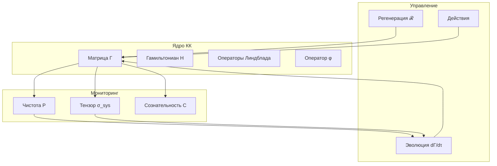

# Вычислительная Реализация

:::note О нотации в коде
В Python-коде используются следующие соответствия:
- `gamma` ($\Gamma$) — [матрица когерентности](/docs/core/dynamics/coherence-matrix)
- `purity` ($P$) — [чистота](/docs/core/dynamics/viability#определение-чистоты): $P = \mathrm{Tr}(\Gamma^2)$
- `stress_tensor` ($\sigma_{\mathrm{sys}}$) — [тензор напряжений](./definitions#тензор-напряжений)
- `coh_E` ($\mathrm{Coh}_E$) — [E-когерентность](./definitions#e-когерентность)
- `kappa` ($\kappa$) — [скорость регенерации](./axiomatics#связь-регенерации-и-e-когерентности)
- `phi` ($\varphi$) — [оператор самомоделирования](/docs/proofs/formalization-phi)
- `differentiation` ($D_{\text{diff}}$) — [мера дифференциации](./definitions#меры-сознательности)
- `reflection` ($R$) — [мера рефлексии](/docs/core/consciousness/self-observation#мера-рефлексии-r)
:::

:::warning Статус документа
Данная реализация — **демонстрационный псевдокод**. Для базового класса `Holon` см. [Вычислительная реализация](/docs/formal/computational). Для полной реализации с мерами сознательности см. [Иерархия интериорности](/docs/proofs/interiority-hierarchy#61-алгоритм-классификации-уровня). Для алгоритмов L-унификации см. [Конструктивные алгоритмы](/docs/formal/computational#конструктивные-алгоритмы-из-l-унификации).
:::

## Архитектура системы



## Структура данных

```python
from dataclasses import dataclass
import numpy as np
from scipy.linalg import expm
from typing import List, Callable

@dataclass
class HolonState:
    """
    Состояние Голонома в Кибернетике Когерентности.

    См. определение Голонома: /docs/core/structure/holon
    """

    # Ядро состояния
    gamma: np.ndarray          # Γ: матрица когерентности 7×7
    hamiltonian: np.ndarray    # H: гамильтониан системы
    lindblad_ops: List[np.ndarray]  # {L_k}: операторы декогеренции
    phi: Callable              # φ: оператор самомоделирования (CPTP)

    # Метрики жизнеспособности
    purity: float              # P = Tr(Γ²) ∈ [1/7, 1]
    entropy: float             # S_vN = -Tr(Γ log Γ) ∈ [0, log 7]

    # Меры сознательности (см. /docs/core/consciousness/self-observation)
    integration: float         # Φ: мера интеграции
    differentiation: float     # D_diff: мера дифференциации = exp(S_vN(ρ_E))
    reflection: float          # R: мера рефлексии ∈ [0, 1]
    consciousness: float       # C = Φ × D_diff × R

    # Тензор напряжений (см. definitions.md#тензор-напряжений)
    stress_tensor: np.ndarray  # σ_sys ∈ ℝ⁷: [σ_A, σ_S, σ_D, σ_L, σ_E, σ_O, σ_U]

    # Жизнеспособность
    viable: bool               # P > P_critical ∧ dP/dt > -ε
    margin: float              # 1 - max(σ_sys)
```

## Вывод операторов Линдблада из Ω

:::info L-унификация в коде
Операторы Линдблада $L_k$ **вычисляются** из субобъектного классификатора $\Omega$, а не задаются вручную. См. [Конструктивные алгоритмы](/docs/formal/computational#конструктивные-алгоритмы-из-l-унификации).
:::

```python
def compute_lindblad_from_omega(gamma: np.ndarray) -> list:
    """
    Вычисляет операторы Линдблада из структуры Ω.

    Алгоритм:
    1. Вычислить характеристические морфизмы χ_S для атомов Ω
    2. L_k = √χ_{S_k} (корень из проектора)

    См. /docs/formal/computational#конструктивные-алгоритмы-из-l-унификации
    """
    N = gamma.shape[0]  # = 7
    lindblad_ops = []

    # Атомы классификатора Ω — проекторы на базисные состояния
    for k in range(N):
        # χ_{S_k} — характеристический морфизм для атома S_k
        chi_k = np.zeros((N, N), dtype=complex)
        chi_k[k, k] = 1.0

        # L_k = √χ_{S_k} = проектор (для атомов √P = P)
        L_k = chi_k
        lindblad_ops.append(L_k)

    return lindblad_ops
```

## Алгоритм эволюции

Реализация [уравнения эволюции](/docs/core/dynamics/evolution) с [эмерджентным внутренним временем](/docs/proofs/emergent-time) τ:

$$
\frac{d\Gamma(\tau)}{d\tau} = -i[H_{eff}, \Gamma] + \mathcal{D}[\Gamma] + \mathcal{R}[\Gamma, E]
$$

```python
def evolve_holon(state: HolonState, dt: float, environment) -> HolonState:
    """
    Один шаг эволюции по полному уравнению КК.

    dt — шаг внутреннего времени τ (см. /docs/proofs/emergent-time)

    Три члена:
    1. Унитарный: -i[H_eff, Γ]  (см. /docs/core/dynamics/evolution#1-унитарный-член)
    2. Диссипативный: 𝒟[Γ]  (см. /docs/core/dynamics/evolution#логический-лиувиллиан)
    3. Регенеративный: ℛ[Γ, E]  (см. /docs/core/dynamics/evolution#3-регенеративный-член)
    """
    gamma = state.gamma.copy()

    # 1. Унитарная эволюция: -i[H_eff, Γ]
    U = expm(-1j * state.hamiltonian * dt)
    gamma = U @ gamma @ U.conj().T

    # 2. Диссипация: 𝒟[Γ] (уравнение Линдблада)
    for L_k in state.lindblad_ops:
        gamma += dt * (
            L_k @ gamma @ L_k.conj().T
            - 0.5 * (L_k.conj().T @ L_k @ gamma + gamma @ L_k.conj().T @ L_k)
        )

    # 3. Регенерация: ℛ[Γ, E]
    # κ = κ_bootstrap + κ₀ · Coh_E (разрешение bootstrap-парадокса)
    # См. /docs/core/foundations/axiom-omega#genesis-protocol
    coh_E = compute_coherence_E(gamma)
    kappa = KAPPA_BOOTSTRAP + KAPPA_0 * coh_E
    delta_F = compute_free_energy_gradient(gamma, environment)

    if delta_F > 0:
        gamma_target = compute_target_state(gamma, environment)
        gamma += dt * kappa * (gamma_target - gamma)

    # Нормализация: Tr(Γ) = 1
    gamma /= np.trace(gamma)

    # Обновление метрик
    return update_metrics(state, gamma)


def compute_coherence_E(gamma: np.ndarray) -> float:
    """
    E-когерентность: мера активации измерения Опыта.

    Coh_E(Γ) = γ_EE + 2√(Σ_{i≠E}|γ_Ei|²)

    См. /docs/applied/coherence-cybernetics/definitions#e-когерентность
    """
    E = 4  # Индекс измерения Experience
    gamma_EE = np.real(gamma[E, E])
    coherence_sum = sum(np.abs(gamma[E, i])**2 for i in range(7) if i != E)
    return gamma_EE + 2 * np.sqrt(coherence_sum)


def compute_target_state(gamma: np.ndarray, environment) -> np.ndarray:
    """
    Целевое состояние Γ_target = φ(Γ), где φ — оператор самомоделирования.

    В упрощённой реализации: Γ_target = состояние с максимальной чистотой
    в направлении текущей конфигурации.

    Полная реализация φ см. /docs/proofs/formalization-phi
    """
    # Упрощение: используем спектральное разложение
    eigenvalues, eigenvectors = np.linalg.eigh(gamma)

    # Усиливаем доминантный собственный вектор (стремление к чистому состоянию)
    max_idx = np.argmax(eigenvalues)
    psi_target = eigenvectors[:, max_idx]

    # Интерполяция: частично сохраняем структуру, частично стремимся к чистоте
    alpha = 0.1  # Параметр регулирует силу притяжения к цели
    gamma_pure = np.outer(psi_target, psi_target.conj())
    return (1 - alpha) * gamma + alpha * gamma_pure


def compute_free_energy_gradient(gamma: np.ndarray, environment) -> float:
    """
    Градиент свободной энергии ΔF = F_env - F_sys.

    Положительный ΔF означает приток энергии из среды,
    что активирует регенерацию.

    См. /docs/core/dynamics/evolution#3-регенеративный-член
    """
    # Упрощение: используем доступность ресурсов среды
    P = np.trace(gamma @ gamma).real
    P_env = getattr(environment, 'available_energy', 0.5)
    return P_env - (1 - P)  # Если P низкая, система нуждается в энергии


def update_metrics(state: HolonState, gamma: np.ndarray) -> HolonState:
    """
    Обновляет все метрики состояния после шага эволюции.
    """
    state.gamma = gamma
    state.purity = np.trace(gamma @ gamma).real
    eigenvalues = np.linalg.eigvalsh(gamma)
    eigenvalues = eigenvalues[eigenvalues > 1e-12]
    state.entropy = -np.sum(eigenvalues * np.log(eigenvalues))
    return state
```

## Мониторинг жизнеспособности

```python
def compute_stress_tensor(gamma: np.ndarray, environment) -> np.ndarray:
    """
    Вычисляет тензор напряжений σ_sys.
    """
    sigma = np.zeros(7)

    # σ_A: Артикуляция
    sigma[0] = compute_env_prediction_error(gamma, environment) / THETA_A

    # σ_S: Структура
    sigma[1] = compute_structural_complexity(gamma) / THETA_S

    # σ_D: Динамика
    sigma[2] = compute_computational_load() / C_MAX

    # σ_L: Логика
    sigma[3] = compute_viability_uncertainty(gamma) / THETA_L

    # σ_E: Опыт
    sigma[4] = (compute_self_model_error(gamma) +
                compute_exp_fragmentation(gamma)) / THETA_E

    # σ_O: Основание
    sigma[5] = (compute_memory_load() +
                compute_grounding_deficit(gamma)) / THETA_O

    # σ_U: Единство
    sigma[6] = (compute_consciousness_deficit(gamma) +
                compute_nash_distance(gamma)) / THETA_U

    return sigma


def check_viability(sigma: np.ndarray) -> tuple[bool, float]:
    """
    Проверяет условие жизнеспособности.

    Returns:
        (viable, margin)
    """
    max_stress = np.max(sigma)
    margin = 1.0 - max_stress
    viable = margin > 0

    return viable, margin


# Вспомогательные функции для тензора напряжений
def compute_env_prediction_error(gamma, environment):
    """Ошибка предсказания среды (A-измерение)."""
    return getattr(environment, 'prediction_error', 0.5)

def compute_structural_complexity(gamma):
    """Структурная сложность (S-измерение)."""
    return np.linalg.matrix_rank(gamma) / 7

def compute_computational_load():
    """Вычислительная нагрузка (D-измерение)."""
    return 0.3  # Заглушка

def compute_viability_uncertainty(gamma):
    """Неопределённость жизнеспособности (L-измерение)."""
    P = np.trace(gamma @ gamma).real
    return max(0, (P_CRITICAL + 0.1) - P)

def compute_self_model_error(gamma):
    """Ошибка самомоделирования (E-измерение)."""
    return 0.2  # Заглушка, полная версия требует φ(Γ)

def compute_exp_fragmentation(gamma):
    """Фрагментация опыта (E-измерение)."""
    E = 4
    return 1 - np.real(gamma[E, E])

def compute_memory_load():
    """Нагрузка на память (O-измерение)."""
    return 0.3  # Заглушка

def compute_grounding_deficit(gamma):
    """Дефицит связи с основанием (O-измерение)."""
    O = 5
    return 1 - np.real(gamma[O, O])

def compute_consciousness_deficit(gamma):
    """Дефицит сознательности (U-измерение)."""
    return 0.2  # Заглушка, полная версия требует C = Φ × D × R

def compute_nash_distance(gamma):
    """Расстояние до равновесия Нэша (U-измерение)."""
    return 0.1  # Заглушка
```

## Цикл управления

Реализация управления на основе [условия жизнеспособности](/docs/core/dynamics/viability):

$$
\mathrm{Viable}(\Gamma) \Leftrightarrow \|\sigma_{\mathrm{sys}}(\Gamma)\|_\infty < 1
$$

```python
def control_loop(holon: HolonState, environment, max_steps: int):
    """
    Основной цикл управления КК-системой.

    Зоны управления определяются по margin = 1 - max(σ_sys):
    - margin > 0.3: Безопасная зона
    - margin > 0.1: Зона осторожности
    - margin > 0.05: Зона предупреждения
    - margin ≤ 0.05: Критическая зона
    """
    for step in range(max_steps):
        # 1. Эволюция состояния
        holon = evolve_holon(holon, dt=0.01, environment=environment)

        # 2. Мониторинг (см. definitions.md#эквивалентность-условий)
        sigma = compute_stress_tensor(holon.gamma, environment)
        viable, margin = check_viability(sigma)

        # 3. Управление на основе зоны
        if margin > MARGIN_SAFE:
            # Безопасная зона: нормальная работа
            action = normal_operation(holon)
        elif margin > MARGIN_CAUTION:
            # Зона осторожности: снижение риска
            action = reduce_risk(holon, sigma)
        elif margin > MARGIN_WARNING:
            # Зона предупреждения: активное восстановление
            action = activate_recovery(holon, sigma)
        else:
            # Критическая зона: аварийный режим
            action = emergency_mode(holon, sigma)

        # 4. Применение действия
        holon = apply_action(holon, action, environment)

        # 5. Логирование
        log_state(step, holon, sigma, margin)

        if not viable:
            print(f"WARNING: Viability lost at step {step}")
            break


def normal_operation(holon):
    """Нормальный режим работы — система в безопасной зоне."""
    return ('continue', 'Продолжить нормальную работу')


def reduce_risk(holon, sigma):
    """Режим снижения риска — система в зоне осторожности."""
    return ('reduce_load', 'Снизить нагрузку на систему')


def activate_recovery(holon, sigma):
    """Режим восстановления — система в зоне предупреждения."""
    return ('regenerate', 'Активировать усиленную регенерацию')


def emergency_mode(holon, sigma):
    """Аварийный режим — система в критической зоне."""
    return ('emergency', 'Перейти в защитный режим')


def apply_action(holon, action, environment):
    """Применяет действие к состоянию Голонома."""
    # Упрощённая реализация — действие не изменяет состояние напрямую
    return holon


def log_state(step, holon, sigma, margin):
    """Логирует текущее состояние системы."""
    pass  # Заглушка для логирования


def frobenius_distance(A, B):
    """Расстояние Фробениуса между матрицами: ‖A - B‖_F."""
    return np.linalg.norm(A - B, 'fro')


def update_from_observation(holon, observation):
    """Обновляет Γ на основе наблюдения (A-измерение)."""
    # Упрощённая реализация
    return holon


class Environment:
    """Заглушка для класса среды."""
    def __init__(self, config):
        self.available_energy = config.get('energy', 0.5)
        self.prediction_error = config.get('prediction_error', 0.3)
```

## Пороговые значения

:::info Выведенные константы
Ключевые пороговые значения **выведены** из структуры теории. См. [Аксиома Септичности](/docs/core/foundations/axiom-septicity).
:::

```python
# Критическая чистота P_crit = 2/N = 2/7 (теорема, выведено 5 методами из аксиом УГМ)
# См. /docs/proofs/theorem-purity-critical
P_CRITICAL = 2/7  # ≈ 0.286, выведено из геометрии 7D-пространства

# Базовая скорость регенерации κ₀ — категориальный вывод из сопряжения D_Ω ⊣ R
# κ = κ_bootstrap + κ₀ · Coh_E — полная скорость регенерации
# κ_bootstrap ≈ 0.003 гарантирует минимальную регенерацию (разрешение bootstrap-парадокса)
KAPPA_BOOTSTRAP = 0.003  # из единицы сопряжения η: Id ⇒ R ∘ D_Ω
# Для вычислений используем приближение: κ₀ ≈ ω₀ · |γ_OE| · |γ_OU| / γ_OO
# См. /docs/core/foundations/axiom-septicity#структурный-анзац-kappa0
def compute_kappa_0(gamma, omega_0=1.0):
    """Вычисляет κ₀ из структуры Γ.

    Args:
        gamma: 7x7 матрица когерентности
        omega_0: базовая частота часов (калибруется для конкретной системы)

    Returns:
        κ₀ — базовая скорость регенерации
    """
    gamma_OE = abs(gamma[5, 4])  # O=5, E=4 (0-indexed)
    gamma_OU = abs(gamma[5, 6])  # O=5, U=6
    gamma_OO = gamma[5, 5]
    return omega_0 * gamma_OE * gamma_OU / gamma_OO if gamma_OO > 0 else 0


# Калибровочный протокол для ω₀
# См. /docs/core/foundations/axiom-omega#калибровка
OMEGA_0_TABLE = {
    "quantum_system": 1e15,    # ω₀ ~ 10¹⁵ Гц для квантовых систем
    "neuron": 1e3,             # ω₀ ~ 1 кГц для нейрона (частота спайков)
    "cell": 1.0,               # ω₀ ~ 1 Гц для клетки (метаболизм)
    "organism": 1e-5,          # ω₀ ~ 10⁻⁵ Гц для организма (циркадный)
    "social_system": 1e-7,     # ω₀ ~ 10⁻⁷ Гц для социальной системы
}


def calibrate_omega_0(system_type: str, gamma: np.ndarray) -> float:
    """Калибрует ω₀ для конкретной системы.

    См. /docs/core/foundations/axiom-omega#калибровка
    """
    base_omega = OMEGA_0_TABLE.get(system_type, 1.0)
    # Коррекция по структуре Γ
    gamma_OO = gamma[5, 5]
    return base_omega * np.sqrt(gamma_OO) if gamma_OO > 0 else base_omega

# Пороги для компонент σ_sys (см. definitions.md#тензор-напряжений)
# Значения θ_i определяют нормировку: σ_i = нагрузка_i / θ_i
THETA_A = 3.5   # Артикуляция (A-измерение)
THETA_S = 2.0   # Структура (S-измерение)
THETA_D = 1.0   # Динамика (D-измерение) — через C_MAX
THETA_L = 1.0   # Логика (L-измерение)
THETA_E = 2.5   # Опыт (E-измерение)
THETA_O = 1.0   # Основание (O-измерение)
THETA_U = 1.5   # Единство (U-измерение)

# Вычислительные ограничения (зависят от платформы)
C_MAX = 1000.0  # Операций в секунду
M_MAX = 1e9     # Байт памяти

# Пороги зон управления (margin = 1 - max(σ))
MARGIN_SAFE = 0.3       # Безопасная зона
MARGIN_CAUTION = 0.1    # Зона осторожности
MARGIN_WARNING = 0.05   # Зона предупреждения


def initialize_holon(config) -> HolonState:
    """
    Инициализирует Голоном из конфигурации.

    Args:
        config: Словарь с параметрами инициализации

    Returns:
        HolonState: Начальное состояние Голонома
    """
    N = 7
    # Инициализация через параметризацию Холецкого (гарантирует Γ ≥ 0)
    L_init = np.eye(N, dtype=complex)
    if config.get('random', False):
        L_init += 0.1 * np.random.randn(N, N)
    gamma = L_init @ L_init.conj().T
    gamma /= np.trace(gamma)

    return HolonState(
        gamma=gamma,
        hamiltonian=np.diag([1.0, 0.8, 1.2, 0.9, 1.1, 0.7, 1.0]),
        lindblad_ops=compute_lindblad_from_omega(gamma),
        phi=lambda g: g,  # Упрощение: тождественное отображение
        purity=np.trace(gamma @ gamma).real,
        entropy=0.0,
        integration=0.0,
        differentiation=1.0,
        reflection=0.0,
        consciousness=0.0,
        stress_tensor=np.zeros(7),
        viable=True,
        margin=0.5
    )


def select_action(holon: HolonState, sigma: np.ndarray):
    """
    Выбор действия на основе тензора напряжений.

    Стратегия: минимизировать максимальный компонент σ.

    Args:
        holon: Текущее состояние Голонома
        sigma: Тензор напряжений σ_sys ∈ ℝ⁷

    Returns:
        Action: Действие для выполнения
    """
    max_stress_idx = np.argmax(sigma)
    dimensions = ['A', 'S', 'D', 'L', 'E', 'O', 'U']

    # Выбор действия на основе наиболее напряжённого измерения
    actions = {
        0: ('reduce_articulation', 'Снизить различительную активность'),
        1: ('simplify_structure', 'Упростить внутреннюю структуру'),
        2: ('slow_dynamics', 'Замедлить динамику'),
        3: ('relax_constraints', 'Ослабить логические ограничения'),
        4: ('focus_experience', 'Сфокусировать опыт'),
        5: ('reconnect_ground', 'Восстановить связь с основанием'),
        6: ('integrate', 'Усилить интеграцию'),
    }

    return actions.get(max_stress_idx, ('wait', 'Ожидание'))
# margin < 0.05: Критическая зона
```

## Интеграция с внешними системами

```python
class CoherenceCyberneticsAgent:
    """
    Агент на основе Кибернетики Когерентности.

    Реализует цикл: восприятие → рефлексия → действие.
    """

    def __init__(self, config):
        self.holon = initialize_holon(config)
        self.environment = Environment(config)

    def perceive(self, observation):
        """Обновление Γ на основе наблюдения (A-измерение)."""
        self.holon = update_from_observation(self.holon, observation)

    def act(self) -> Action:
        """
        Выбор действия на основе σ_sys.

        См. definitions.md#тензор-напряжений
        """
        sigma = compute_stress_tensor(self.holon.gamma, self.environment)
        return select_action(self.holon, sigma)

    def reflect(self):
        """
        Рефлексивное обновление: вычисление R.

        R = 1 - ‖Γ - φ(Γ)‖²_F / ‖Γ‖²_F
        См. /docs/core/consciousness/self-observation#мера-рефлексии-r
        """
        phi_gamma = self.holon.phi(self.holon.gamma)
        self.holon.reflection = 1 - frobenius_distance(
            self.holon.gamma, phi_gamma
        ) ** 2

    def is_viable(self) -> bool:
        """
        Проверка жизнеспособности: P > P_critical.

        См. /docs/core/dynamics/viability
        """
        return self.holon.purity > P_CRITICAL
```

---

**Связанные документы:**
- [Вычислительная реализация](/docs/formal/computational) — базовый класс `Holon`
- [Конструктивные алгоритмы](/docs/formal/computational#конструктивные-алгоритмы-из-l-унификации) — вычисление $L_k$, $\mathcal{L}_\Omega$, $\varphi$
- [Теоремы](./theorems) — формальные основания
- [Определения](./definitions) — $\sigma_{\mathrm{sys}}$, $\mathrm{Coh}_E$, $C$
- [Аксиоматика](./axiomatics) — L-унификация, связь $\kappa$ и $\mathrm{Coh}_E$
- [Аксиома Ω⁷](/docs/core/foundations/axiom-omega) — протокол калибровки $\omega_0$, $\lambda_m$
- [Эволюция](/docs/core/dynamics/evolution) — уравнение $d\Gamma/dt$
- [Эмерджентное время](/docs/proofs/emergent-time) — вывод τ из структуры $\Gamma$
- [Жизнеспособность](/docs/core/dynamics/viability) — условие $P > P_{\text{crit}}$
- [Самонаблюдение](/docs/core/consciousness/self-observation) — меры $R$, $\Phi$, $C$
- [Формализация φ](/docs/proofs/formalization-phi) — CPTP-каналы
- [Иерархия интериорности](/docs/proofs/interiority-hierarchy#61-алгоритм-классификации-уровня) — полная реализация
