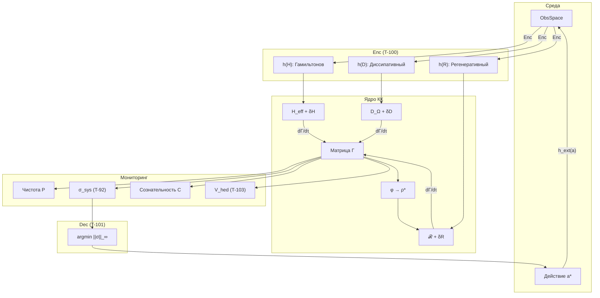

# Вычислительная Реализация

:::note О нотации в коде
В Python-коде используются следующие соответствия:
- `gamma` ($\Gamma$) — [матрица когерентности](/docs/core/dynamics/coherence-matrix)
- `purity` ($P$) — [чистота](/docs/core/dynamics/viability#определение-чистоты): $P = \mathrm{Tr}(\Gamma^2)$
- `stress_tensor` ($\sigma_{\mathrm{sys}}$) — [тензор напряжений](./definitions#тензор-напряжений)
- `coh_E` ($\mathrm{Coh}_E$) — [E-когерентность](./definitions#e-когерентность)
- `kappa` ($\kappa$) — [скорость регенерации](./axiomatics#связь-регенерации-и-e-когерентности)
- `phi` ($\varphi$) — [оператор самомоделирования](/docs/proofs/categorical/formalization-phi)
- `differentiation` ($D_{\text{diff}}$) — [мера дифференциации](/docs/consciousness/foundations/self-observation#мера-сознательности-c)
- `reflection` ($R$) — [мера рефлексии](/docs/consciousness/foundations/self-observation#мера-рефлексии-r)
:::

:::warning Статус документа
Данная реализация — **демонстрационный псевдокод**. Для базового класса `Holon` см. [Вычислительная реализация](/docs/reference/computational). Для полной реализации с мерами сознательности см. [Иерархия интериорности](/docs/proofs/consciousness/interiority-hierarchy#61-алгоритм-классификации-уровня). Для алгоритмов L-унификации см. [Конструктивные алгоритмы](/docs/reference/computational#конструктивные-алгоритмы-из-l-унификации).
:::

## Быстрый старт

### Установка

```bash
# Гипотетический пакет (в разработке)
pip install coherence-cybernetics

# Зависимости для текущего псевдокода
pip install numpy scipy
```

### Минимальный пример (10 строк)

```python
import numpy as np
from scipy.linalg import expm

# Создаём случайный Голоном (демонстрация)
N = 7
# 0.1 * noise — небольшое возмущение для инициализации
L = np.eye(N) + 0.1 * np.random.randn(N, N)
gamma = L @ L.T.conj()
gamma /= np.trace(gamma)

# Эволюция (демонстрационные параметры)
# H — гамильтониан. Принципиально: H = I (симметрия). Здесь показана вариация.
H = np.diag([1.0, 0.8, 1.2, 0.9, 1.1, 0.7, 1.0])
for step in range(100):
    # dt = 0.01 — шаг дискретизации времени (малый для стабильности)
    U = expm(-1j * H * 0.01)
    gamma = U @ gamma @ U.T.conj()
    gamma /= np.trace(gamma)
    P = np.trace(gamma @ gamma).real
    coh_E = (gamma[4, 4].real**2 + 2 * sum(abs(gamma[4, i])**2 for i in range(7) if i != 4)) / P
    print(f"Step {step}: P={P:.3f}, Coh_E={coh_E:.3f}")
```

### Проверка жизнеспособности

```python
P_CRIT = 2/7  # ≈ 0.286

def is_viable(gamma):
    P = np.trace(gamma @ gamma).real
    return P > P_CRIT

# Использование
if not is_viable(gamma):
    print("⚠️ Система нежизнеспособна!")
```

---

## Сложность алгоритмов

| Операция | Сложность | Примечание |
|----------|-----------|------------|
| Вычисление $P = \mathrm{Tr}(\Gamma^2)$ | $O(N^2)$ | $N = 7$ |
| Унитарная эволюция | $O(N^3)$ | Экспонента матрицы |
| Диссипация (Линдблад) | $O(m \cdot N^2)$ | $m$ операторов |
| $\Phi_{\text{eff}}$ | $O(n \cdot k)$ | Лапласиан графа |
| Вычисление $R$ | $O(N^3)$ | Требует $\varphi(\Gamma)$ |
| Полный шаг эволюции | $O(N^3 + m \cdot N^2)$ | — |

### Масштабируемость

| Размер системы | $N$ | Время шага | Память |
|----------------|-----|------------|--------|
| Минимальный Голоном | 7 | ~1 мс | ~1 KB |
| Композиция 2 Голономов | 49 | ~10 мс | ~20 KB |
| Композиция 10 Голономов | 7^10 ≈ 2.8×10^8 | Неприменимо | — |

:::warning Экспоненциальный рост
Полное тензорное произведение быстро становится неприменимым. Для больших систем используйте аппроксимации (MPS, mean-field).
:::

---

## Оптимизации

### GPU-ускорение через JAX

```python
import jax.numpy as jnp
from jax import jit
from jax.scipy.linalg import expm

@jit
def evolve_step_gpu(gamma, H, dt):
    U = expm(-1j * H * dt)
    gamma_new = U @ gamma @ U.T.conj()
    return gamma_new / jnp.trace(gamma_new)
```

### Sparse матрицы для больших систем

```python
from scipy.sparse import csr_matrix
from scipy.sparse.linalg import expm_multiply

# Для разреженного H
H_sparse = csr_matrix(H)
gamma_evolved = expm_multiply(-1j * H_sparse * dt, gamma.flatten())
```

### Параллелизация Monte-Carlo

```python
from multiprocessing import Pool

def run_trajectory(seed):
    np.random.seed(seed)
    holon = initialize_holon({'random': True})
    env = Environment({})
    for _ in range(1000):
        holon = evolve_holon(holon, dt=0.01, environment=env)
    return {'purity': holon.purity, 'entropy': holon.entropy}

with Pool(8) as p:
    results = p.map(run_trajectory, range(100))
```

---

## Примеры тестов

```python
import pytest
import numpy as np

def _create_random_gamma(N=7):
    """Вспомогательная функция: создаёт случайную Γ (для тестов)."""
    L = np.eye(N, dtype=complex) + 0.1 * np.random.randn(N, N)
    gamma = L @ L.conj().T
    gamma /= np.trace(gamma)
    return gamma

def _evolve_one_step(gamma, dt=0.01):
    """Вспомогательная функция: один шаг эволюции (для тестов)."""
    state = initialize_holon({'random': False})
    state.gamma = gamma.copy()
    env = Environment({})
    new_state = evolve_holon(state, dt, env)
    return new_state.gamma

def test_purity_bounds():
    """P ∈ [1/7, 1] для любого Γ."""
    gamma = _create_random_gamma()
    P = np.trace(gamma @ gamma).real
    assert 1/7 - 1e-10 <= P <= 1 + 1e-10

def test_trace_preservation():
    """Tr(Γ) = 1 после эволюции."""
    gamma = _create_random_gamma()
    gamma_evolved = _evolve_one_step(gamma)
    assert abs(np.trace(gamma_evolved) - 1) < 1e-10

def test_hermiticity_preservation():
    """Γ остаётся эрмитовой."""
    gamma = _create_random_gamma()
    gamma_evolved = _evolve_one_step(gamma)
    assert np.allclose(gamma_evolved, gamma_evolved.T.conj())

def test_positivity_preservation():
    """Γ остаётся положительно полуопределённой."""
    gamma = _create_random_gamma()
    gamma_evolved = _evolve_one_step(gamma)
    eigenvalues = np.linalg.eigvalsh(gamma_evolved)
    assert all(eigenvalues >= -1e-10)

def test_viability_threshold():
    """P_crit = 2/7."""
    assert abs(P_CRITICAL - 2/7) < 1e-10

def test_coh_e_bounds():
    """Coh_E ∈ [1/N, 1]."""
    gamma = _create_random_gamma()
    coh_E = compute_coherence_E(gamma)
    assert 1/7 - 1e-10 <= coh_E <= 1 + 1e-10
```

---

## Архитектура системы



## Структура данных

```python
from dataclasses import dataclass
import numpy as np
from scipy.linalg import expm
from typing import List, Callable

@dataclass
class HolonState:
    """
    Состояние Голонома в Кибернетике Когерентности.

    См. определение Голонома: /docs/core/structure/holon
    """

    # Ядро состояния
    gamma: np.ndarray          # Γ: матрица когерентности 7×7
    hamiltonian: np.ndarray    # H: гамильтониан системы
    lindblad_ops: List[np.ndarray]  # {L_k}: операторы декогеренции
    phi: Callable              # φ: оператор самомоделирования (CPTP)

    # Метрики жизнеспособности
    purity: float              # P = Tr(Γ²) ∈ [1/7, 1]
    entropy: float             # S_vN = -Tr(Γ log Γ) ∈ [0, log 7]

    # Меры сознательности (см. /docs/consciousness/foundations/self-observation)
    integration: float         # Φ: мера интеграции
    differentiation: float     # D_diff: мера дифференциации = exp(S_vN(ρ_E)) — требует тензорной структуры!
    reflection: float          # R: мера рефлексии ∈ [0, 1]
    consciousness: float       # C = Φ × D_diff × R (или C_min = Φ × R в 7D-формализме)

    # Тензор напряжений (см. definitions.md#тензор-напряжений)
    stress_tensor: np.ndarray  # σ_sys ∈ ℝ⁷: [σ_A, σ_S, σ_D, σ_L, σ_E, σ_O, σ_U]

    # Жизнеспособность
    viable: bool               # P > P_critical ∧ dP/dτ > -ε
    margin: float              # 1 - max(σ_sys)
```

## Вывод операторов Линдблада из Ω

:::info L-унификация в коде
Операторы Линдблада $L_k$ **вычисляются** из субобъектного классификатора $\Omega$, а не задаются вручную. См. [Конструктивные алгоритмы](/docs/reference/computational#конструктивные-алгоритмы-из-l-унификации).
:::

:::note Упрощённые операторы Линдблада
В данной реализации операторы Линдблада — **диагональные проекторы** $L_k = |k\rangle\langle k|$ (стандартная декогеренция в базисе измерений). Это **не** $G_2$-структурированные операторы из [Фано-канала](/docs/proofs/gap/fano-channel). Полная реализация с $G_2$-совместимыми операторами Линдблада (проекторы на Фано-триплеты) см. в [Конструктивных алгоритмах](/docs/reference/computational#конструктивные-алгоритмы-из-l-унификации).
:::

```python
def compute_lindblad_from_omega(gamma: np.ndarray) -> list:
    """
    Вычисляет операторы Линдблада из структуры Ω.

    УПРОЩЕНИЕ: Возвращает диагональные проекторы L_k = |k><k|.
    Полная G₂-реализация использует Фано-линии (см. /docs/proofs/gap/fano-channel).

    Алгоритм:
    1. Вычислить характеристические морфизмы χ_S для атомов Ω
    2. L_k = √χ_{S_k} (корень из проектора)

    См. /docs/reference/computational#конструктивные-алгоритмы-из-l-унификации
    """
    N = gamma.shape[0]  # = 7
    lindblad_ops = []

    # Атомы классификатора Ω — проекторы на базисные состояния
    for k in range(N):
        # χ_{S_k} — характеристический морфизм для атома S_k
        chi_k = np.zeros((N, N), dtype=complex)
        chi_k[k, k] = 1.0

        # L_k = √χ_{S_k} = проектор (для атомов √P = P)
        L_k = chi_k
        lindblad_ops.append(L_k)

    return lindblad_ops
```

## Алгоритм эволюции

Реализация [уравнения эволюции](/docs/core/dynamics/evolution) с [эмерджентным внутренним временем](/docs/proofs/dynamics/emergent-time) τ:

$$
\frac{d\Gamma(\tau)}{d\tau} = -i[H_{eff}, \Gamma] + \mathcal{D}[\Gamma] + \mathcal{R}[\Gamma, E]
$$

:::warning Расщепление Ли-Троттера и положительность
Эволюция реализована через **последовательное** применение унитарного, диссипативного и регенеративного членов (расщепление Ли-Троттера). При конечном шаге $dt$ это расщепление **не гарантирует** сохранение положительной полуопределённости $\Gamma \geq 0$. Для малых $dt$ ошибка порядка $O(dt^2)$. При больших шагах рекомендуется: (1) уменьшить $dt$, (2) добавить проекцию на конус $\Gamma \geq 0$ после каждого шага, или (3) использовать методы типа Рунге-Кутты для открытых квантовых систем.
:::

```python
def evolve_holon(state: HolonState, dt: float, environment) -> HolonState:
    """
    Один шаг эволюции по полному уравнению КК.

    dt — шаг внутреннего времени τ (см. /docs/proofs/dynamics/emergent-time)

    Три члена:
    1. Унитарный: -i[H_eff, Γ]  (см. /docs/core/dynamics/evolution#1-унитарный-член)
    2. Диссипативный: 𝒟[Γ]  (см. /docs/core/dynamics/evolution#логический-лиувиллиан)
    3. Регенеративный: ℛ[Γ, E]  (см. /docs/core/dynamics/evolution#3-регенеративный-член)
    """
    gamma = state.gamma.copy()

    # 1. Унитарная эволюция: -i[H_eff, Γ]
    U = expm(-1j * state.hamiltonian * dt)
    gamma = U @ gamma @ U.conj().T

    # 2. Диссипация: 𝒟[Γ] (уравнение Линдблада)
    for L_k in state.lindblad_ops:
        gamma += dt * (
            L_k @ gamma @ L_k.conj().T
            - 0.5 * (L_k.conj().T @ L_k @ gamma + gamma @ L_k.conj().T @ L_k)
        )

    # 3. Регенерация: ℛ[Γ, E]
    # κ = κ_bootstrap + κ₀ · Coh_E (разрешение bootstrap-парадокса)
    # См. /docs/core/foundations/axiom-omega#genesis-protocol
    coh_E = compute_coherence_E(gamma)
    kappa = KAPPA_BOOTSTRAP + KAPPA_0 * coh_E
    delta_F = compute_free_energy_gradient(gamma, environment)

    if delta_F > 0:
        gamma_target = compute_target_state(gamma, environment)
        gamma += dt * kappa * (gamma_target - gamma)

    # Нормализация: Tr(Γ) = 1
    gamma /= np.trace(gamma)

    # Обновление метрик
    return update_metrics(state, gamma)


def compute_coherence_E(gamma: np.ndarray) -> float:
    """
    E-когерентность (HS-проекция π_E, [Т]): Coh_E(Γ) = ‖π_E(Γ)‖²_HS / ‖Γ‖²_HS = (γ_EE² + 2·Σ_{i≠E}|γ_Ei|²) / Tr(Γ²).

    Мастер-определение: Coh_E := Tr(ρ_E²), где ρ_E = Tr_{-E}(Γ).
    Множитель 2 — из эрмитовой симметрии: |γ_Ei|² = |γ_iE|².
    Нормализация на Tr(Γ²) гарантирует Coh_E ∈ [1/7, 1].

    См. /docs/applied/coherence-cybernetics/definitions#e-когерентность
    """
    E = 4  # Индекс измерения Experience
    gamma_EE_sq = np.real(gamma[E, E])**2
    coherence_sum = sum(np.abs(gamma[E, i])**2 for i in range(7) if i != E)
    purity = np.real(np.trace(gamma @ gamma))
    if purity < 1e-12:
        return 1/7
    return np.clip((gamma_EE_sq + 2 * coherence_sum) / purity, 1/7, 1.0)


def compute_target_state(gamma: np.ndarray, environment) -> np.ndarray:
    """
    Целевое состояние Γ_target = φ(Γ), где φ — оператор самомоделирования.

    В упрощённой реализации: Γ_target = состояние с максимальной чистотой
    в направлении текущей конфигурации.

    Полная реализация φ см. /docs/proofs/categorical/formalization-phi
    """
    # Упрощение: используем спектральное разложение
    eigenvalues, eigenvectors = np.linalg.eigh(gamma)

    # Усиливаем доминантный собственный вектор (стремление к чистому состоянию)
    max_idx = np.argmax(eigenvalues)
    psi_target = eigenvectors[:, max_idx]

    # Интерполяция: частично сохраняем структуру, частично стремимся к чистоте
    # alpha — скорость сходимости к целевому состоянию
    # Рекомендуемый диапазон: 0.01-0.1 (малые значения для стабильности)
    # При α=0 система не регенерирует; при α→1 резкий скачок к чистому состоянию
    alpha = 0.1  # Гиперпараметр: скорость притяжения к цели
    gamma_pure = np.outer(psi_target, psi_target.conj())
    return (1 - alpha) * gamma + alpha * gamma_pure


def compute_free_energy_gradient(gamma: np.ndarray, environment) -> float:
    """
    Градиент свободной энергии ΔF = F_env - F_sys.

    Положительный ΔF означает приток энергии из среды,
    что активирует регенерацию.

    Args:
        gamma: Матрица когерентности Γ ∈ ℂ^{7×7}
        environment: Объект среды с атрибутом available_energy

    Returns:
        ΔF: Градиент свободной энергии. ΔF > 0 → приток, ΔF < 0 → отток.

    Note:
        P_env по умолчанию 0.5 (нейтральная среда). В реальной реализации
        available_energy должен отражать фактическую доступность ресурсов.

    См. /docs/core/dynamics/evolution#3-регенеративный-член
    """
    P = np.trace(gamma @ gamma).real
    # available_energy ∈ [0, 1]: доля доступных ресурсов среды
    P_env = getattr(environment, 'available_energy', 0.5)  # Нейтральное значение
    return P_env - (1 - P)  # ΔF > 0 если среда богата ресурсами


def update_metrics(state: HolonState, gamma: np.ndarray) -> HolonState:
    """
    Обновляет все метрики состояния после шага эволюции.
    """
    state.gamma = gamma
    state.purity = np.trace(gamma @ gamma).real
    eigenvalues = np.linalg.eigvalsh(gamma)
    eigenvalues = eigenvalues[eigenvalues > 1e-12]
    state.entropy = -np.sum(eigenvalues * np.log(eigenvalues))
    return state
```

## Каноническая декомпозиция F_ext {#каноническая-декомпозиция-f-ext}

:::warning Критическое исправление (T-102 [Т])
По [T-102 (полнота 3-членного уравнения)](./sensorimotor#теорема-полнота-трёх-членов) [Т], `F_ext` — **не 4-й член** уравнения эволюции, а модификация трёх существующих каналов. Четвёртый тип CPTP-генератора не существует (LGKS, T-57 [Т]).
:::

### Алгоритм декомпозиции

```python
def decompose_f_ext(observation, gamma: np.ndarray) -> tuple:
    """
    Декомпозирует внешнее воздействие в 3 канала (T-102 [Т]).

    Вместо: dΓ = H + D + R + F_ext  (некорректно!)
    Используем: dΓ = (H + δH) + (D + δD) + (R + δR)  (корректно)

    Args:
        observation: наблюдение среды
        gamma: текущая матрица когерентности

    Returns:
        (delta_H, delta_D, delta_R) — три канала пертурбации

    См. /docs/applied/coherence-cybernetics/sensorimotor#среда-через-3-канала
    """
    delta_H = np.zeros((7, 7), dtype=complex)  # Гамильтонов: δ(Δω_ij)
    delta_D = np.zeros((7, 7), dtype=complex)  # Диссипативный: δΓ₂
    delta_R = np.zeros((7, 7), dtype=complex)  # Регенеративный: δκ

    # Распределение по каналам (из таблицы индексов):
    # h(H): информационные — A, S, L (изменяют энергетический ландшафт)
    # h(D): нагрузочные — D, O (усиливают/ослабляют декогеренцию)
    # h(R): интегративные — E, U (модулируют регенерацию)

    if hasattr(observation, 'sensory_input'):
        for key, idx in [('I_A', 0), ('I_S', 1), ('I_L', 3)]:
            val = observation.sensory_input.get(key, 0)
            delta_H[idx, idx] = val

    if hasattr(observation, 'noise_level'):
        for key, idx in [('I_D', 2), ('I_O', 5)]:
            val = observation.noise_level.get(key, 0)
            delta_D[idx, idx] = val

    if hasattr(observation, 'integration_signal'):
        for key, idx in [('I_E', 4), ('I_U', 6)]:
            val = observation.integration_signal.get(key, 0)
            delta_R[idx, idx] = val

    return delta_H, delta_D, delta_R
```

### Обновлённый evolve_holon (без F_ext)

```python
def evolve_holon_canonical(state: HolonState, dt: float,
                           delta_H=None, delta_D=None, delta_R=None) -> HolonState:
    """
    Каноническая эволюция: 3 модифицированных канала (T-102 [Т]).

    НЕ используется отдельный F_ext — среда входит через δH, δD, δR.
    """
    gamma = state.gamma.copy()
    H_total = state.hamiltonian + (delta_H if delta_H is not None else 0)

    # 1. Модифицированная унитарная эволюция
    U = expm(-1j * H_total * dt)
    gamma = U @ gamma @ U.conj().T

    # 2. Модифицированная диссипация
    gamma_2_factor = 1.0  # базовый
    if delta_D is not None:
        gamma_2_factor += np.max(np.abs(np.diag(delta_D)))
    for L_k in state.lindblad_ops:
        gamma += dt * gamma_2_factor * (
            L_k @ gamma @ L_k.conj().T
            - 0.5 * (L_k.conj().T @ L_k @ gamma + gamma @ L_k.conj().T @ L_k)
        )

    # 3. Модифицированная регенерация
    coh_E = compute_coherence_E(gamma)
    kappa = KAPPA_BOOTSTRAP + compute_kappa_0(gamma) * coh_E
    if delta_R is not None:
        kappa += np.max(np.abs(np.diag(delta_R)))

    delta_F = compute_free_energy_gradient(gamma, None)
    if delta_F > 0:
        gamma_target = compute_target_state(gamma, None)
        gamma += dt * kappa * (gamma_target - gamma)

    gamma /= np.trace(gamma)
    return update_metrics(state, gamma)
```

### Bootstrap-разрешение chicken-egg проблемы {#bootstrap-разрешение}

Проблема: $R$ зависит от $\varphi(\Gamma)$, но $\varphi$ требует $R$ для определения целевого состояния.

**Разрешение** ([T-59](/docs/core/foundations/axiom-omega#теорема-kappa-bootstrap-bound) [Т]):

1. $\kappa_{\mathrm{bootstrap}} = \omega_0/N = 1/7$ — минимальная регенерация **без** знания $\rho^*$ (T-59 [Т])
2. При инициализации: $\rho^{(0)}_* = I/7$ (тривиальная самомодель)
3. Итерация: $\rho^{(n+1)}_* = \varphi(\Gamma^{(n)})$ — экспоненциальная сходимость ([T-72](./theorems#теорема-72-условная-неподвижная-точка-рефлексии) [Т])

```python
# Bootstrap-протокол (из T-59 [Т])
rho_star = np.eye(7) / 7  # I/7: начальная тривиальная самомодель
for iteration in range(MAX_BOOTSTRAP_ITERATIONS):
    gamma = evolve_holon_canonical(state, dt)
    rho_star_new = compute_phi(gamma)  # φ(Γ)
    if np.linalg.norm(rho_star_new - rho_star, 'fro') < EPSILON:
        break
    rho_star = rho_star_new
```

---

## Мониторинг жизнеспособности

```python
def compute_stress_tensor(gamma: np.ndarray, environment) -> np.ndarray:
    """
    Вычисляет тензор напряжений σ_sys.
    """
    sigma = np.zeros(7)

    # σ_A: Артикуляция
    sigma[0] = compute_env_prediction_error(gamma, environment) / THETA_A

    # σ_S: Структура
    sigma[1] = compute_structural_complexity(gamma) / THETA_S

    # σ_D: Динамика
    sigma[2] = compute_computational_load() / C_MAX

    # σ_L: Логика
    sigma[3] = compute_viability_uncertainty(gamma) / THETA_L

    # σ_E: Интериорность
    sigma[4] = (compute_self_model_error(gamma) +
                compute_exp_fragmentation(gamma)) / THETA_E

    # σ_O: Основание
    sigma[5] = (compute_memory_load() +
                compute_grounding_deficit(gamma)) / THETA_O

    # σ_U: Единство
    sigma[6] = (compute_consciousness_deficit(gamma) +
                compute_nash_distance(gamma)) / THETA_U

    return sigma


def check_viability(sigma: np.ndarray) -> tuple[bool, float]:
    """
    Проверяет условие жизнеспособности.

    Returns:
        (viable, margin)
    """
    max_stress = np.max(sigma)
    margin = 1.0 - max_stress
    viable = margin > 0

    return viable, margin


# =============================================================================
# Вспомогательные функции для тензора напряжений
# =============================================================================
# ПРИМЕЧАНИЕ: Некоторые функции являются заглушками (STUB) и возвращают
# фиксированные значения. При полной реализации они должны вычислять
# соответствующие метрики на основе состояния системы.
#
# Заглушки помечены комментарием "STUB" и возвращают значения в [0, 1].
# Рекомендуемые значения заглушек: 0.3 (умеренное напряжение), 0.2 (низкое).

def compute_env_prediction_error(gamma, environment):
    """
    Ошибка предсказания среды (A-измерение).

    Returns:
        ∈ [0, 1]: 0 = идеальное предсказание, 1 = полная неопределённость
    """
    return getattr(environment, 'prediction_error', 0.5)

def compute_structural_complexity(gamma):
    """
    Структурная сложность (S-измерение).

    Returns:
        rank(Γ)/N ∈ [1/7, 1]: нормализованный ранг матрицы
    """
    return np.linalg.matrix_rank(gamma) / 7

def compute_computational_load():
    """
    Вычислительная нагрузка (D-измерение).

    STUB: Должен возвращать (текущая нагрузка) / C_MAX.

    Returns:
        ∈ [0, 1]: доля использованных вычислительных ресурсов
    """
    return 0.3  # STUB: умеренная нагрузка

def compute_viability_uncertainty(gamma):
    """
    Неопределённость жизнеспособности (L-измерение).

    Измеряет насколько близко P к критическому порогу P_crit.

    Returns:
        ∈ [0, ~0.4]: 0 если P > P_crit + 0.1, растёт при приближении к P_crit
    """
    P = np.trace(gamma @ gamma).real
    # 0.1 — буферная зона для раннего предупреждения
    return max(0, (P_CRITICAL + 0.1) - P)

def compute_self_model_error(gamma):
    """
    Ошибка самомоделирования (E-измерение).

    Формула: ε = ‖Γ - φ(Γ)‖_F / ‖Γ‖_F

    С приближением φ(Γ) ≈ diag(Γ):
    ε = ‖off_diag(Γ)‖_F / ‖Γ‖_F

    Returns:
        ∈ [0, 1]: 0 = идеальная самомодель (классическое), 1 = нет самомоделирования
    """
    gamma_norm = np.linalg.norm(gamma, 'fro')
    if gamma_norm < 1e-12:
        return 1.0
    # φ(Γ) ≈ diag(Γ), поэтому Γ - φ(Γ) ≈ off_diag(Γ)
    off_diag = gamma - np.diag(np.diag(gamma))
    off_diag_norm = np.linalg.norm(off_diag, 'fro')
    return float(off_diag_norm / gamma_norm)

def compute_exp_fragmentation(gamma):
    """
    Фрагментация опыта (E-измерение).

    Использует диагональный элемент γ_EE как меру интегрированности опыта.

    Returns:
        1 - γ_EE ∈ [0, 1]: 0 = полностью интегрирован, 1 = полностью фрагментирован
    """
    E = 4  # Индекс E-измерения
    return 1 - np.real(gamma[E, E])

def compute_memory_load():
    """
    Нагрузка на память (O-измерение).

    STUB: Должен возвращать (используемая память) / M_MAX.

    Returns:
        ∈ [0, 1]: доля использованной памяти
    """
    return 0.3  # STUB: умеренная нагрузка

def compute_grounding_deficit(gamma):
    """
    Дефицит связи с основанием (O-измерение).

    Использует γ_OO как меру укоренённости системы.

    Returns:
        1 - γ_OO ∈ [0, 1]: 0 = полностью укоренён, 1 = нет связи с основанием
    """
    O = 5  # Индекс O-измерения
    return 1 - np.real(gamma[O, O])

def compute_consciousness_deficit(gamma):
    """
    Дефицит сознательности (U-измерение).

    STUB: Должен вычислять 1 - C где C = Φ × D × R (мера сознания).
    Требует полной реализации интеграции (Φ), дифференциации (D)
    и рефлексии (R).

    Returns:
        ∈ [0, 1]: 0 = максимальное сознание, 1 = нет сознания
    """
    return 0.2  # STUB: предполагается умеренное сознание

def compute_nash_distance(gamma):
    """
    Расстояние до равновесия Нэша (U-измерение).

    STUB: Должен вычислять расстояние текущей стратегии до равновесия
    в социальном контексте. Релевантно только для агентов в среде
    с другими агентами.

    Returns:
        ∈ [0, 1]: 0 = в равновесии, 1 = максимально далеко от равновесия
    """
    return 0.1  # STUB: близко к равновесию
```

## Цикл управления

Реализация управления на основе [условия жизнеспособности](/docs/core/dynamics/viability):

$$
\mathrm{Viable}(\Gamma) \Leftrightarrow \|\sigma_{\mathrm{sys}}(\Gamma)\|_\infty < 1
$$

```python
def control_loop(holon: HolonState, environment, max_steps: int):
    """
    Основной цикл управления КК-системой.

    Зоны управления определяются по margin = 1 - max(σ_sys):
    - margin > 0.3: Безопасная зона
    - margin > 0.1: Зона осторожности
    - margin > 0.05: Зона предупреждения
    - margin ≤ 0.05: Критическая зона
    """
    for step in range(max_steps):
        # 1. Эволюция состояния
        holon = evolve_holon(holon, dt=0.01, environment=environment)

        # 2. Мониторинг (см. definitions.md#эквивалентность-условий)
        sigma = compute_stress_tensor(holon.gamma, environment)
        viable, margin = check_viability(sigma)

        # 3. Управление на основе зоны
        if margin > MARGIN_SAFE:
            # Безопасная зона: нормальная работа
            action = normal_operation(holon)
        elif margin > MARGIN_CAUTION:
            # Зона осторожности: снижение риска
            action = reduce_risk(holon, sigma)
        elif margin > MARGIN_WARNING:
            # Зона предупреждения: активное восстановление
            action = activate_recovery(holon, sigma)
        else:
            # Критическая зона: аварийный режим
            action = emergency_mode(holon, sigma)

        # 4. Применение действия
        holon = apply_action(holon, action, environment)

        # 5. Логирование
        log_state(step, holon, sigma, margin)

        if not viable:
            print(f"WARNING: Viability lost at step {step}")
            break


def normal_operation(holon):
    """Нормальный режим работы — система в безопасной зоне."""
    return ('continue', 'Продолжить нормальную работу')


def reduce_risk(holon, sigma):
    """Режим снижения риска — система в зоне осторожности."""
    return ('reduce_load', 'Снизить нагрузку на систему')


def activate_recovery(holon, sigma):
    """Режим восстановления — система в зоне предупреждения."""
    return ('regenerate', 'Активировать усиленную регенерацию')


def emergency_mode(holon, sigma):
    """Аварийный режим — система в критической зоне."""
    return ('emergency', 'Перейти в защитный режим')


def apply_action(holon, action, environment):
    """Применяет действие к состоянию Голонома."""
    # Упрощённая реализация — действие не изменяет состояние напрямую
    return holon


def log_state(step, holon, sigma, margin):
    """Логирует текущее состояние системы."""
    pass  # Заглушка для логирования


def frobenius_distance(A, B):
    """Расстояние Фробениуса между матрицами: ‖A - B‖_F."""
    return np.linalg.norm(A - B, 'fro')


def encode_environment(observation, gamma):
    """
    Enc: ObsSpace → End(D(C^7)) — функтор восприятия (T-100 [Т]).

    Раскладывает наблюдение среды на 3 канала внешнего воздействия:
    h_ext = h(H) + h(D) + h(R)  (T-102 [Т])

    Четвёртый канал невозможен (T-57, LGKS [Т]).

    См. /docs/applied/coherence-cybernetics/sensorimotor#функтор-enc
    """
    h_H = np.zeros((7, 7), dtype=complex)  # Гамильтонов канал
    h_D = np.zeros((7, 7), dtype=complex)  # Диссипативный канал
    h_R = np.zeros((7, 7), dtype=complex)  # Регенеративный канал

    # Индексы измерений: A=0, S=1, D=2, L=3, E=4, O=5, U=6
    if hasattr(observation, 'sensory_input'):
        # h(H): информационные индексы → энергетический ландшафт
        h_H[0, 0] = observation.sensory_input.get('I_A', 0)  # Артикуляция
        h_H[1, 1] = observation.sensory_input.get('I_S', 0)  # Структура
        h_H[3, 3] = observation.sensory_input.get('I_L', 0)  # Логика

    if hasattr(observation, 'noise_level'):
        # h(D): нагрузочные индексы → модификация декогеренции
        h_D[2, 2] = observation.noise_level.get('I_D', 0)    # Динамика
        h_D[5, 5] = observation.noise_level.get('I_O', 0)    # Основание

    if hasattr(observation, 'integration_signal'):
        # h(R): интегративные индексы → модуляция регенерации
        h_R[4, 4] = observation.integration_signal.get('I_E', 0)  # Интериорность
        h_R[6, 6] = observation.integration_signal.get('I_U', 0)  # Единство

    return h_H, h_D, h_R


def update_from_observation(holon, observation):
    """
    Обновляет Γ на основе наблюдения через Enc (T-100 [Т]).

    Среда модифицирует 3 канала, а не добавляет 4-й (T-102 [Т]).
    См. /docs/applied/coherence-cybernetics/sensorimotor#среда-через-3-канала
    """
    h_H, h_D, h_R = encode_environment(observation, holon.gamma)

    # Модификация Гамильтониана: H_eff → H_eff + δH
    holon.hamiltonian = holon.hamiltonian + h_H

    # Модификация диссипации и регенерации происходит
    # при следующем вызове evolve_holon через h_D и h_R
    holon._h_D_pending = h_D
    holon._h_R_pending = h_R

    return holon


class Environment:
    """
    Заглушка для класса среды.

    Параметры по умолчанию:
    - available_energy = 0.5: Нейтральное значение (среднее между 0 и 1).
      При реализации должно отражать реальную доступность ресурсов.
    - prediction_error = 0.3: Умеренная ошибка предсказания.
      Значение < 0.5 означает, что система в целом предсказывает среду.

    Эти значения — заглушки. В реальной системе Environment должен
    подключаться к реальным сенсорам и актуаторам.
    """
    def __init__(self, config):
        self.available_energy = config.get('energy', 0.5)
        self.prediction_error = config.get('prediction_error', 0.3)
```

## Пороговые значения

:::info Выведенные константы
Ключевые пороговые значения **выведены** из структуры теории. См. [Аксиома Септичности](/docs/core/foundations/axiom-septicity).
:::

```python
# Критическая чистота P_crit = 2/N = 2/7 (теорема, выведено 5 методами из аксиом УГМ)
# См. /docs/proofs/dynamics/theorem-purity-critical
P_CRITICAL = 2/7  # ≈ 0.286, выведено из геометрии 7D-пространства

# Базовая скорость регенерации κ₀ — категориальный вывод из сопряжения D_Ω ⊣ R
# κ = κ_bootstrap + κ₀ · Coh_E — полная скорость регенерации
# κ_bootstrap = ω₀/N — минимальная регенерация из теоремы
# Категориальный вывод: /docs/core/foundations/axiom-septicity#теорема-kappa-bootstrap
# Теоретическое значение при ω₀=1, N=7: κ_bootstrap = 1/7 ≈ 0.143
KAPPA_BOOTSTRAP = 1/7  # ≈ 0.143 (согласовано с теоремой)
# Для вычислений используем приближение: κ₀ ≈ ω₀ · |γ_OE| · |γ_OU| / γ_OO
# См. /docs/core/foundations/axiom-septicity#структурный-анзац-kappa0
def compute_kappa_0(gamma, omega_0=1.0):
    """Вычисляет κ₀ из структуры Γ.

    Args:
        gamma: 7x7 матрица когерентности
        omega_0: базовая частота часов (калибруется для конкретной системы)

    Returns:
        κ₀ — базовая скорость регенерации
    """
    gamma_OE = abs(gamma[5, 4])  # O=5, E=4 (0-indexed)
    gamma_OU = abs(gamma[5, 6])  # O=5, U=6
    gamma_OO = gamma[5, 5]
    return omega_0 * gamma_OE * gamma_OU / gamma_OO if gamma_OO > 0 else 0


# Калибровочный протокол для ω₀
# См. /docs/core/foundations/axiom-omega#калибровка
OMEGA_0_TABLE = {
    "quantum_system": 1e15,    # ω₀ ~ 10¹⁵ Гц для квантовых систем
    "neuron": 1e3,             # ω₀ ~ 1 кГц для нейрона (частота спайков)
    "cell": 1.0,               # ω₀ ~ 1 Гц для клетки (метаболизм)
    "organism": 1e-5,          # ω₀ ~ 10⁻⁵ Гц для организма (циркадный)
    "social_system": 1e-7,     # ω₀ ~ 10⁻⁷ Гц для социальной системы
}


def calibrate_omega_0(system_type: str, gamma: np.ndarray) -> float:
    """Калибрует ω₀ для конкретной системы.

    См. /docs/core/foundations/axiom-omega#калибровка
    """
    base_omega = OMEGA_0_TABLE.get(system_type, 1.0)
    # Коррекция по структуре Γ
    gamma_OO = gamma[5, 5]
    return base_omega * np.sqrt(gamma_OO) if gamma_OO > 0 else base_omega

# Пороги для компонент σ_sys (см. definitions.md#тензор-напряжений)
# Значения θ_i определяют нормировку: σ_i = нагрузка_i / θ_i
#
# ПРИМЕЧАНИЕ К ВЫБОРУ ЗНАЧЕНИЙ:
# Принципиально обоснованный выбор — равные веса θ_k = 1 (симметрия U(7)).
# Текущие значения — операционные гиперпараметры для настройки системы.
# При отсутствии эмпирической калибровки рекомендуется начинать с θ_k = 1.
#
# Неравные веса допустимы если:
# - Есть эмпирические данные о различной чувствительности измерений
# - Конкретное приложение требует приоритизации определённых измерений
#
# Текущие значения (гиперпараметры, требуют калибровки):
THETA_A = 3.5   # Артикуляция — повышенный порог (допускает больше различий)
THETA_S = 2.0   # Структура — умеренный порог
THETA_D = 1.0   # Динамика — базовый порог (через C_MAX)
THETA_L = 1.0   # Логика — базовый порог
THETA_E = 2.5   # Интериорность — повышенный порог (допускает интенсивность опыта)
THETA_O = 1.0   # Основание — базовый порог
THETA_U = 1.5   # Единство — умеренный порог

# Вычислительные ограничения (зависят от платформы)
C_MAX = 1000.0  # Операций в секунду
M_MAX = 1e9     # Байт памяти

# Пороги зон управления (margin = 1 - max(σ))
#
# Связь с P_crit: При P < P_crit ≈ 0.286, система теряет жизнеспособность.
# Margin измеряет запас до потери жизнеспособности в терминах σ.
# Значения выбраны для обеспечения раннего предупреждения:
# - SAFE: комфортная работа (margin > 0.3)
# - CAUTION: требует внимания (0.1 < margin ≤ 0.3)
# - WARNING: критическое состояние (margin ≤ 0.1)
#
MARGIN_SAFE = 0.3       # Безопасная зона: max(σ) < 0.7
MARGIN_CAUTION = 0.1    # Зона осторожности: max(σ) < 0.9
MARGIN_WARNING = 0.05   # Зона предупреждения: max(σ) < 0.95


def initialize_holon(config) -> HolonState:
    """
    Инициализирует Голоном из конфигурации.

    Args:
        config: Словарь с параметрами инициализации

    Returns:
        HolonState: Начальное состояние Голонома
    """
    N = 7
    # Инициализация через параметризацию Холецкого (гарантирует Γ ≥ 0)
    L_init = np.eye(N, dtype=complex)
    if config.get('random', False):
        L_init += 0.1 * np.random.randn(N, N)
    gamma = L_init @ L_init.conj().T
    gamma /= np.trace(gamma)

    # Гамильтониан: диагональные элементы — собственные частоты измерений.
    # Принципиально обоснованный выбор — единичная матрица H = I (симметрия).
    # Текущие значения — примерная вариация для демонстрации.
    # В реальных приложениях H должен выводиться из физики системы.
    default_hamiltonian = np.diag([1.0, 0.8, 1.2, 0.9, 1.1, 0.7, 1.0])

    return HolonState(
        gamma=gamma,
        hamiltonian=config.get('hamiltonian', default_hamiltonian),
        lindblad_ops=compute_lindblad_from_omega(gamma),
        # φ: оператор самомоделирования.
        # Полная реализация — спектральная формула (/docs/proofs/categorical/formalization-phi).
        # Приближение: φ проецирует на диагональ (стабильные моды).
        phi=lambda g: np.diag(np.diag(g)),
        purity=np.trace(gamma @ gamma).real,
        entropy=0.0,
        integration=0.0,
        differentiation=1.0,
        reflection=0.0,
        consciousness=0.0,
        stress_tensor=np.zeros(7),
        viable=True,
        margin=0.5
    )


def select_action(holon: HolonState, sigma: np.ndarray):
    """
    Dec: (Γ, σ_sys) → a* — функтор действия (T-101 [Т]).

    Оптимальное действие: a* = argmin ||σ_sys(Γ(τ+δτ|a))||_∞

    Практическая реализация: воздействие на наиболее напряжённую
    компоненту через соответствующий канал h_ext.
    Каждое действие раскладывается в h(H) + h(D) + h(R) (T-102 [Т]).

    См. /docs/applied/coherence-cybernetics/sensorimotor#функтор-dec
    """
    max_stress_idx = np.argmax(sigma)

    # Действие определяется каналом воздействия:
    # h(H) — Гамильтонов (энергетическая перестройка)
    # h(D) — Диссипативный (снижение нагрузки)
    # h(R) — Регенеративный (усиление восстановления)
    actions = {
        0: ('reduce_articulation', 'h(D): Снизить входной поток'),
        1: ('simplify_structure', 'h(H): Реструктуризация'),
        2: ('slow_dynamics', 'h(D): Снизить вычислительную нагрузку'),
        3: ('relax_constraints', 'h(H): Когнитивная коррекция'),
        4: ('focus_experience', 'h(R): Усилить рефлексию'),
        5: ('reconnect_ground', 'h(R)+ΔF: Восстановить ресурсы'),
        6: ('integrate', 'h(R): Усилить интеграцию'),
    }

    return actions.get(max_stress_idx, ('wait', 'Ожидание'))
```

## Интеграция с внешними системами

```python
class CoherenceCyberneticsAgent:
    """
    Агент на основе Кибернетики Когерентности.

    Реализует цикл: восприятие → рефлексия → действие.
    """

    def __init__(self, config):
        self.holon = initialize_holon(config)
        self.environment = Environment(config)

    def perceive(self, observation):
        """Обновление Γ на основе наблюдения (A-измерение)."""
        self.holon = update_from_observation(self.holon, observation)

    def act(self) -> tuple:
        """
        Выбор действия на основе σ_sys.

        См. definitions.md#тензор-напряжений
        """
        sigma = compute_stress_tensor(self.holon.gamma, self.environment)
        return select_action(self.holon, sigma)

    def reflect(self):
        """
        Рефлексивное обновление: вычисление R.

        R = 1 - ‖Γ - φ(Γ)‖²_F / ‖Γ‖²_F
        См. /docs/consciousness/foundations/self-observation#мера-рефлексии-r
        """
        phi_gamma = self.holon.phi(self.holon.gamma)
        gamma_norm_sq = np.linalg.norm(self.holon.gamma, 'fro') ** 2
        self.holon.reflection = 1 - frobenius_distance(
            self.holon.gamma, phi_gamma
        ) ** 2 / gamma_norm_sq

    def is_viable(self) -> bool:
        """
        Проверка жизнеспособности: P > P_critical.

        См. /docs/core/dynamics/viability
        """
        return self.holon.purity > P_CRITICAL
```

---

**Связанные документы:**
- [Сенсомоторная теория](./sensorimotor) — функторы Enc/Dec, полнота 3-членного уравнения (T-100–T-103)
- [Стабильность](./stability) — анализ устойчивости, спираль смерти, восстановление
- [Диагностика](./diagnostics) — практическое руководство, паттерны отказов
- [Вычислительная реализация](/docs/reference/computational) — базовый класс `Holon`
- [Конструктивные алгоритмы](/docs/reference/computational#конструктивные-алгоритмы-из-l-унификации) — вычисление $L_k$, $\mathcal{L}_\Omega$, $\varphi$
- [Теоремы](./theorems) — формальные основания
- [Определения](./definitions) — $\sigma_{\mathrm{sys}}$, $\mathrm{Coh}_E$, $C$, Enc, Dec
- [Аксиоматика](./axiomatics) — L-унификация, связь $\kappa$ и $\mathrm{Coh}_E$
- [Аксиома Ω⁷](/docs/core/foundations/axiom-omega) — протокол калибровки $\omega_0$, $\lambda_m$
- [Эволюция](/docs/core/dynamics/evolution) — уравнение $d\Gamma/d\tau$
- [Эмерджентное время](/docs/proofs/dynamics/emergent-time) — вывод τ из структуры $\Gamma$
- [Жизнеспособность](/docs/core/dynamics/viability) — условие $P > P_{\text{crit}}$
- [Самонаблюдение](/docs/consciousness/foundations/self-observation) — меры $R$, $\Phi$, $C$
- [Формализация φ](/docs/proofs/categorical/formalization-phi) — CPTP-каналы
- [Иерархия интериорности](/docs/proofs/consciousness/interiority-hierarchy#61-алгоритм-классификации-уровня) — полная реализация
