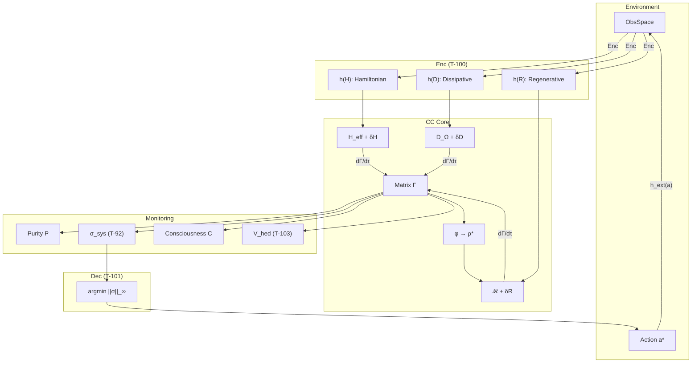

# Computational Implementation

> *"Theory without practice is dead, practice without theory is blind."*
> — Immanuel Kant

:::tip Bridge from the Previous Chapter
In the [previous chapter](./applications) we showed nine application domains of CC — from AI to ecology — and three detailed case studies. In each of them formulas appeared: $P = \mathrm{Tr}(\Gamma^2)$, $\sigma_k = \mathrm{clamp}(1 - 7\gamma_{kk}, 0, 1)$, $\kappa = \kappa_{\text{bootstrap}} + \kappa_0 \cdot \mathrm{Coh}_E$. But a formula on paper and a formula in a computer are two different objects. A paper formula operates with ideal numbers; a computer — with floating-point numbers, limited precision, and finite memory. This chapter is the bridge between them.
:::

:::info Chapter Roadmap
In this chapter we:
1. Run a **minimal example** in 10 lines (§1)
2. Show the **five-step protocol** for translating a formula into code: identify → write → protect → test → optimise (§2)
3. Build the complete **system architecture** — from `HolonState` to `control_loop` (§3–7)
4. Implement the **canonical decomposition** of $F_{\text{ext}}$ via three channels (§8)
5. Go through **typical pitfalls** and create a debugging checklist (§9)
6. Discuss **optimisations**: GPU, sparse matrices, Monte Carlo (§10)
:::

A physicist wrote the evolution equation $d\Gamma/d\tau$. A mathematician proved the theorem on critical purity. A philosopher reflected on why $E$-coherence links experience and stability. Now the moment of truth arrives: **can this be run?**

The computational implementation of Coherence Cybernetics is the bridge between formulas and a working system. It plays a role analogous to a laboratory practical in physics: this is where abstract constructs take on flesh — in the form of matrices, loops, and numerical results that can be verified and reproduced.

This chapter is structured as a **laboratory guide**. We begin with a minimal ten-line example — so that the reader can immediately run something on their own computer and see how purity $P$ changes over time. We then gradually unfold the full architecture: data structures, the evolution algorithm, viability monitoring, the control loop. Every code block is preceded by an explanation — *what* it does, *why*, and *how* it connects to the theoretical results of the preceding chapters.

The path from formula to code is non-trivial. The coherence matrix $\Gamma$ on paper is an ideal object: infinite precision, continuous time, guaranteed positive semidefiniteness. In a computer everything is different: finite arithmetic generates rounding errors, time discretisation violates the CPTP-channel property, and numerical instability can turn a positive-semidefinite matrix into a non-physical one in a single step. We discuss these pitfalls and show how to deal with them.

:::note On notation in the code
The Python code uses the following correspondences:
- `gamma` ($\Gamma$) — [coherence matrix](/docs/core/dynamics/coherence-matrix)
- `purity` ($P$) — [purity](/docs/core/dynamics/viability#определение-чистоты): $P = \mathrm{Tr}(\Gamma^2)$
- `stress_tensor` ($\sigma_{\mathrm{sys}}$) — [stress tensor](./definitions#тензор-напряжений)
- `coh_E` ($\mathrm{Coh}_E$) — [E-coherence](./definitions#e-когерентность)
- `kappa` ($\kappa$) — [regeneration rate](./axiomatics#связь-регенерации-и-e-когерентности)
- `phi` ($\varphi$) — [self-modelling operator](/docs/proofs/categorical/formalization-phi)
- `differentiation` ($D_{\text{diff}}$) — [differentiation measure](/docs/consciousness/foundations/self-observation#мера-сознательности-c)
- `reflection` ($R$) — [reflection measure](/docs/consciousness/foundations/self-observation#мера-рефлексии-r)
:::

:::warning Document status
This implementation is **demonstration pseudocode**. For the base class `Holon` see [Computational Implementation](/docs/reference/computational). For the full implementation with consciousness measures see [Interiority Hierarchy](/docs/proofs/consciousness/interiority-hierarchy#61-алгоритм-классификации-уровня). For L-unification algorithms see [Constructive Algorithms](/docs/reference/computational#конструктивные-алгоритмы-из-l-унификации).
:::

## Quick Start

### Installation

Before diving into theory, let's make sure the code runs. Working with coherence matrices requires only two standard packages — NumPy for linear algebra and SciPy for the matrix exponential.

```bash
# Hypothetical package (in development)
pip install coherence-cybernetics

# Dependencies for the current pseudocode
pip install numpy scipy
```

### Minimal Example (10 lines)

This example is the shortest path from zero to a working CC system. We create a random coherence matrix $\Gamma$, define a Hamiltonian, and run 100 steps of unitary evolution. At each step purity $P$ and $E$-coherence $\mathrm{Coh}_E$ are computed — the two key metrics characterising the viability and coherence of the system's interiority.

Note the initialisation: $\Gamma = LL^\dagger / \mathrm{Tr}(LL^\dagger)$, where $L = I + 0.1 \cdot \text{noise}$. This is the *Cholesky parametrisation* — a standard technique guaranteeing that $\Gamma$ is positive semidefinite and has unit trace. Without this guarantee, all further computations are meaningless.

```python
import numpy as np
from scipy.linalg import expm

# Create a random Holonom (demonstration)
N = 7
# 0.1 * noise — a small perturbation for initialisation
L = np.eye(N) + 0.1 * np.random.randn(N, N)
gamma = L @ L.T.conj()
gamma /= np.trace(gamma)

# Evolution (demonstration parameters)
# H — Hamiltonian. Principled choice: H = I (symmetry). A variation is shown here.
H = np.diag([1.0, 0.8, 1.2, 0.9, 1.1, 0.7, 1.0])
for step in range(100):
    # dt = 0.01 — time discretisation step (small for stability)
    U = expm(-1j * H * 0.01)
    gamma = U @ gamma @ U.T.conj()
    gamma /= np.trace(gamma)
    P = np.trace(gamma @ gamma).real
    coh_E = (gamma[4, 4].real**2 + 2 * sum(abs(gamma[4, i])**2 for i in range(7) if i != 4)) / P
    print(f"Step {step}: P={P:.3f}, Coh_E={coh_E:.3f}")
```

When run, you will see that purity $P$ remains constant under purely unitary evolution — this is expected, since $U\Gamma U^\dagger$ preserves the spectrum. But $\mathrm{Coh}_E$ will oscillate: the Hamiltonian "mixes" coherence between dimensions, and the projection onto the $E$-subspace fluctuates.

### Viability Check

The simplest check: is the system alive or not. The threshold $P_{\text{crit}} = 2/7$ is not a tuneable parameter, but a **consequence of a theorem** on distinguishability in 7-dimensional space. If purity falls below this value, the matrix $\Gamma$ becomes indistinguishable from the maximally mixed state $I/7$ by Frobenius norm — the system literally loses its identity.

```python
P_CRIT = 2/7  # ≈ 0.286

def is_viable(gamma):
    P = np.trace(gamma @ gamma).real
    return P > P_CRIT

# Usage
if not is_viable(gamma):
    print("⚠️ System is non-viable!")
```

---

## From Formula to Code {#from-formula-to-code}

Translating a mathematical theorem into working code is one of the subtlest stages of implementation. A formula on paper operates with ideal objects: exact real numbers, continuous time, infinite precision. Code works with floating-point numbers, discrete steps, and finite memory. This section is a step-by-step guide to bridging the gap.

### Step 1: Identify the Mathematical Object

Every CC theorem operates on the coherence matrix $\Gamma \in D(\mathbb{C}^7)$ — the set of positive-semidefinite Hermitian $7 \times 7$ matrices with unit trace. In code this is an `np.ndarray` of shape `(7, 7)` with dtype `complex128`. The three invariants — Hermiticity, positive semidefiniteness, and unit trace — must be verified after every operation.

```python
def validate_gamma(gamma: np.ndarray, label: str = "") -> bool:
    """Checks the three fundamental invariants of Γ.

    Call after every operation that modifies gamma.
    In production code this can be disabled via a DEBUG flag.
    """
    prefix = f"[{label}] " if label else ""
    ok = True

    # Invariant 1: Hermiticity — Γ = Γ†
    if not np.allclose(gamma, gamma.T.conj(), atol=1e-10):
        print(f"{prefix}Hermiticity VIOLATED: max|Γ - Γ†| = "
              f"{np.max(np.abs(gamma - gamma.T.conj())):.2e}")
        ok = False

    # Invariant 2: Unit trace — Tr(Γ) = 1
    tr = np.trace(gamma).real
    if abs(tr - 1.0) > 1e-10:
        print(f"{prefix}Trace VIOLATED: Tr(Γ) = {tr:.12f}")
        ok = False

    # Invariant 3: Positive semidefiniteness — λ_min ≥ 0
    eigs = np.linalg.eigvalsh(gamma)
    if eigs[0] < -1e-10:
        print(f"{prefix}Positivity VIOLATED: λ_min = {eigs[0]:.2e}")
        ok = False

    return ok
```

### Step 2: Write the Formula Literally

Take $E$-coherence as an example (T-128 [T]):

$$
\mathrm{Coh}_E(\Gamma) = \frac{\gamma_{EE}^2 + 2\sum_{i \neq E} |\gamma_{Ei}|^2}{\mathrm{Tr}(\Gamma^2)}
$$

A direct Python transcription looks like this:

```python
def coh_e_literal(gamma):
    """Literal translation of the Coh_E formula.

    The factor 2 comes from Hermitian symmetry: |γ_Ei|² = |γ_iE|²,
    so the sum over row E and column E is doubled.
    """
    E = 4  # Index of the Experience dimension (0-indexed: A=0,S=1,D=2,L=3,E=4,O=5,U=6)
    numerator = gamma[E, E].real**2 + 2 * sum(
        abs(gamma[E, i])**2 for i in range(7) if i != E
    )
    denominator = np.trace(gamma @ gamma).real
    return numerator / denominator if denominator > 1e-12 else 1/7
```

### Step 3: Add Numerical Protection

The formula assumes $\mathrm{Tr}(\Gamma^2) > 0$, but in computations the denominator can become vanishingly small. Every division needs protection. Every `np.clip` needs a justification for its range. The theorem guarantees $\mathrm{Coh}_E \in [1/7, 1]$, so `np.clip` at the end is not a hack but **encoding a mathematical constraint**.

### Step 4: Write a Test for the Analytic Case

The best test is a case where the answer is known analytically:

```python
def test_coh_e_pure_E_state():
    """For a pure |E⟩ state, Coh_E = 1."""
    gamma = np.zeros((7, 7), dtype=complex)
    gamma[4, 4] = 1.0  # Pure |E⟩ state
    assert abs(coh_e_literal(gamma) - 1.0) < 1e-10

def test_coh_e_maximally_mixed():
    """For I/7, Coh_E = 1/7."""
    gamma = np.eye(7, dtype=complex) / 7
    assert abs(coh_e_literal(gamma) - 1/7) < 1e-10
```

### Step 5: Optimise (Only If Needed)

The generator `sum(... for i in ...)` runs in $O(N)$, but for $N = 7$ this is not a bottleneck. Optimisation via NumPy vectorisation is justified only when called repeatedly in a hot loop:

```python
def coh_e_vectorized(gamma):
    """Vectorised version (for hot loops)."""
    E = 4
    row_E = gamma[E, :]
    numerator = gamma[E, E].real**2 + 2 * (np.sum(np.abs(row_E)**2) - np.abs(row_E[E])**2)
    denominator = np.real(np.trace(gamma @ gamma))
    return np.clip(numerator / max(denominator, 1e-12), 1/7, 1.0)
```

This five-step protocol — **identify, write, protect, test, optimise** — applies to any CC formula.

---

## Algorithm Complexity

Before building a large system, it is useful to understand how many computational resources each operation requires. Since $N = 7$ is fixed axiomatically, all matrix operations are technically $O(1)$ — but the coefficients matter when simulating thousands of interacting holonoms.

| Operation | Complexity | Note |
|-----------|-----------|------|
| Computing $P = \mathrm{Tr}(\Gamma^2)$ | $O(N^2)$ | $N = 7$ |
| Unitary evolution | $O(N^3)$ | Matrix exponential |
| Dissipation (Lindblad) | $O(m \cdot N^2)$ | $m$ operators |
| $\Phi_{\text{eff}}$ | $O(n \cdot k)$ | Graph Laplacian |
| Computing $R$ | $O(N^3)$ | Requires $\varphi(\Gamma)$ |
| Full evolution step | $O(N^3 + m \cdot N^2)$ | — |

### Scalability

| System size | $N$ | Step time | Memory |
|-------------|-----|-----------|--------|
| Minimal Holonom | 7 | ~1 ms | ~1 KB |
| Composition of 2 Holonoms | 49 | ~10 ms | ~20 KB |
| Composition of 10 Holonoms | 7^10 ≈ 2.8×10^8 | Not applicable | — |

:::warning Exponential growth
The full tensor product quickly becomes infeasible. For large systems use approximations (MPS, mean-field).
:::

---

## Optimisations

For a single $7 \times 7$ holonom optimisation is unnecessary — all operations fit within microseconds. But when simulating ensembles (populations of agents, neural networks of holonoms) performance becomes critical. The three approaches below cover the main scenarios.

### GPU Acceleration via JAX

JAX allows Python code to be automatically compiled into GPU kernels via the `@jit` decorator. For mass simulations (e.g., 10,000 holonoms in parallel) this gives a 100–1000× speedup.

```python
import jax.numpy as jnp
from jax import jit
from jax.scipy.linalg import expm

@jit
def evolve_step_gpu(gamma, H, dt):
    U = expm(-1j * H * dt)
    gamma_new = U @ gamma @ U.T.conj()
    return gamma_new / jnp.trace(gamma_new)
```

### Sparse Matrices for Large Systems

When composing holonoms, the tensor product generates sparse matrices. Instead of storing the full $49 \times 49$ matrix, one can work only with non-zero elements.

```python
from scipy.sparse import csr_matrix
from scipy.sparse.linalg import expm_multiply

# For sparse H
H_sparse = csr_matrix(H)
gamma_evolved = expm_multiply(-1j * H_sparse * dt, gamma.flatten())
```

### Monte Carlo Parallelisation

Statistical properties of CC systems (distribution of $P$ in an ensemble, average $\mathrm{Coh}_E$) are estimated via Monte Carlo. Each trajectory is independent — an ideal case for parallelisation.

```python
from multiprocessing import Pool

def run_trajectory(seed):
    np.random.seed(seed)
    holon = initialize_holon({'random': True})
    env = Environment({})
    for _ in range(1000):
        holon = evolve_holon(holon, dt=0.01, environment=env)
    return {'purity': holon.purity, 'entropy': holon.entropy}

with Pool(8) as p:
    results = p.map(run_trajectory, range(100))
```

---

## Test Examples

Tests in CC play the role of **experimental verification**. Each test encodes a mathematical theorem: if the test passes, the implementation is consistent with the theory. If it does not pass — either there is a bug in the code, or (more interestingly) the formula has been translated incorrectly. The suite below covers the fundamental invariants: purity bounds, trace preservation, Hermiticity, positivity, and threshold values.

```python
import pytest
import numpy as np

def _create_random_gamma(N=7):
    """Helper function: creates a random Γ (for tests)."""
    L = np.eye(N, dtype=complex) + 0.1 * np.random.randn(N, N)
    gamma = L @ L.conj().T
    gamma /= np.trace(gamma)
    return gamma

def _evolve_one_step(gamma, dt=0.01):
    """Helper function: one evolution step (for tests)."""
    state = initialize_holon({'random': False})
    state.gamma = gamma.copy()
    env = Environment({})
    new_state = evolve_holon(state, dt, env)
    return new_state.gamma

def test_purity_bounds():
    """P ∈ [1/7, 1] for any Γ."""
    gamma = _create_random_gamma()
    P = np.trace(gamma @ gamma).real
    assert 1/7 - 1e-10 <= P <= 1 + 1e-10

def test_trace_preservation():
    """Tr(Γ) = 1 after evolution."""
    gamma = _create_random_gamma()
    gamma_evolved = _evolve_one_step(gamma)
    assert abs(np.trace(gamma_evolved) - 1) < 1e-10

def test_hermiticity_preservation():
    """Γ remains Hermitian."""
    gamma = _create_random_gamma()
    gamma_evolved = _evolve_one_step(gamma)
    assert np.allclose(gamma_evolved, gamma_evolved.T.conj())

def test_positivity_preservation():
    """Γ remains positive semidefinite."""
    gamma = _create_random_gamma()
    gamma_evolved = _evolve_one_step(gamma)
    eigenvalues = np.linalg.eigvalsh(gamma_evolved)
    assert all(eigenvalues >= -1e-10)

def test_viability_threshold():
    """P_crit = 2/7."""
    assert abs(P_CRITICAL - 2/7) < 1e-10

def test_coh_e_bounds():
    """Coh_E ∈ [1/N, 1]."""
    gamma = _create_random_gamma()
    coh_E = compute_coherence_E(gamma)
    assert 1/7 - 1e-10 <= coh_E <= 1 + 1e-10
```

---

## System Architecture

The diagram below shows the full data flow in a CC system. The environment (ObsSpace) passes through the perception functor Enc (T-100), which decomposes the observation into three influence channels. The CC core evolves the matrix $\Gamma$ according to the three-term equation. Monitoring computes viability metrics. The action functor Dec (T-101) selects the optimal action — the one that minimises the maximum stress $\|\sigma_{\mathrm{sys}}\|_\infty$.


```mermaid
graph TD
    subgraph "Environment"
        ENV["ObsSpace"]
        ACT_OUT["Action a*"]
    end
    subgraph "Enc (T-100)"
        ENC_H["h(H): Hamiltonian"]
        ENC_D["h(D): Dissipative"]
        ENC_R["h(R): Regenerative"]
    end
    subgraph "CC Core"
        G["Matrix Γ"]
        H["H_eff + δH"]
        L["D_Ω + δD"]
        REG["ℛ + δR"]
        PHI["φ → ρ*"]
    end
    subgraph "Monitoring"
        P["Purity P"]
        SIG["σ_sys (T-92)"]
        C["Consciousness C"]
        VAL["V_hed (T-103)"]
    end
    subgraph "Dec (T-101)"
        DEC["argmin ||σ||_∞"]
    end

    ENV -->|"Enc"| ENC_H & ENC_D & ENC_R
    ENC_H --> H
    ENC_D --> L
    ENC_R --> REG
    H & L & REG -->|"dΓ/dτ"| G
    G --> P & SIG & C & VAL
    SIG --> DEC
    DEC --> ACT_OUT
    ACT_OUT -->|"h_ext(a)"| ENV
    G --> PHI
    PHI --> REG
```

## Data Structure

The central data structure — `HolonState` — is the programmatic reflection of the mathematical object "holonom in state $\Gamma$". Each field corresponds to a specific theoretical construct. Note that we store not only the matrix $\Gamma$ but all derived metrics: this avoids redundant computation in the hot loop.

```python
from dataclasses import dataclass
import numpy as np
from scipy.linalg import expm
from typing import List, Callable

@dataclass
class HolonState:
    """
    State of a Holonom in Coherence Cybernetics.

    See the Holonom definition: /docs/core/structure/holon
    """

    # State core
    gamma: np.ndarray          # Γ: 7×7 coherence matrix
    hamiltonian: np.ndarray    # H: system Hamiltonian
    lindblad_ops: List[np.ndarray]  # {L_k}: decoherence operators
    phi: Callable              # φ: self-modelling operator (CPTP)

    # Viability metrics
    purity: float              # P = Tr(Γ²) ∈ [1/7, 1]
    entropy: float             # S_vN = -Tr(Γ log Γ) ∈ [0, log 7]

    # Consciousness measures (see /docs/consciousness/foundations/self-observation)
    integration: float         # Φ: integration measure
    differentiation: float     # D_diff = 1 + Coh_E · (N−1) [T-128 [T]]
    reflection: float          # R: reflection measure ∈ [0, 1]
    consciousness: float       # C = Φ × R [T-140 [T]]; D_diff — separate condition V

    # Stress tensor (see definitions.md#тензор-напряжений)
    stress_tensor: np.ndarray  # σ_sys ∈ ℝ⁷: [σ_A, σ_S, σ_D, σ_L, σ_E, σ_O, σ_U]

    # Viability
    viable: bool               # P > P_critical ∧ dP/dτ > -ε
    margin: float              # 1 - max(σ_sys)
```

## Deriving Lindblad Operators from Ω

Lindblad operators are the mathematical tool for describing decoherence. In CC they are not specified manually, but **derived** from the structure of the subobject classifier $\Omega$. This is a fundamental point: decoherence is not an external parameter, but a consequence of the system's internal logic.

:::info L-unification in code
Lindblad operators $L_k$ are **computed** from the subobject classifier $\Omega$, not specified manually. See [Constructive Algorithms](/docs/reference/computational#конструктивные-алгоритмы-из-l-унификации).
:::

:::note Simplified Lindblad operators
In this implementation the Lindblad operators are **diagonal projectors** $L_k = |k\rangle\langle k|$ (standard decoherence in the basis of dimensions). These are **not** the $G_2$-structured operators from the [Fano channel](/docs/proofs/gap/fano-channel). For the full implementation with $G_2$-compatible Lindblad operators (projectors onto Fano triplets) see [Constructive Algorithms](/docs/reference/computational#конструктивные-алгоритмы-из-l-унификации).
:::

In the simplified implementation each Lindblad operator is a projector onto one of the seven basis states. This corresponds to decoherence that "erases" superpositions between dimensions, leaving only diagonal elements. The full $G_2$-compatible implementation uses projectors onto Fano triplets and preserves a finer coherence structure.

```python
def compute_lindblad_from_omega(gamma: np.ndarray) -> list:
    """
    Computes Lindblad operators from the Ω structure.

    SIMPLIFICATION: Returns diagonal projectors L_k = |k><k|.
    The full G₂ implementation uses Fano lines (see /docs/proofs/gap/fano-channel).

    Algorithm:
    1. Compute characteristic morphisms χ_S for the atoms of Ω
    2. L_k = √χ_{S_k} (square root of the projector)

    See /docs/reference/computational#конструктивные-алгоритмы-из-l-унификации
    """
    N = gamma.shape[0]  # = 7
    lindblad_ops = []

    # Atoms of classifier Ω — projectors onto basis states
    for k in range(N):
        # χ_{S_k} — characteristic morphism for atom S_k
        chi_k = np.zeros((N, N), dtype=complex)
        chi_k[k, k] = 1.0

        # L_k = √χ_{S_k} = projector (for atoms √P = P)
        L_k = chi_k
        lindblad_ops.append(L_k)

    return lindblad_ops
```

## Evolution Algorithm

Implementation of the [evolution equation](/docs/core/dynamics/evolution) with [emergent internal time](/docs/proofs/dynamics/emergent-time) τ:

$$
\frac{d\Gamma(\tau)}{d\tau} = -i[H_{eff}, \Gamma] + \mathcal{D}[\Gamma] + \mathcal{R}[\Gamma, E]
$$

This is the heart of the entire implementation — the function that advances the system state by one step. The three terms of the equation are applied sequentially: first unitary evolution (reversible, spectrum-preserving), then dissipation (irreversible, destroying coherence), and regeneration (restoring coherence via the $E$-link).

:::warning Lie–Trotter splitting and positivity
The evolution is implemented via **sequential** application of the unitary, dissipative, and regenerative terms (Lie–Trotter splitting). For finite step $dt$ this splitting does **not guarantee** preservation of positive semidefiniteness $\Gamma \geq 0$. For small $dt$ the error is of order $O(dt^2)$. For large steps it is recommended to: (1) reduce $dt$, (2) add projection onto the cone $\Gamma \geq 0$ after each step, or (3) use Runge–Kutta methods for open quantum systems.
:::

```python
def evolve_holon(state: HolonState, dt: float, environment) -> HolonState:
    """
    One evolution step according to the full CC equation.

    dt — internal time τ step (see /docs/proofs/dynamics/emergent-time)

    Three terms:
    1. Unitary: -i[H_eff, Γ]  (see /docs/core/dynamics/evolution#1-унитарный-член)
    2. Dissipative: 𝒟[Γ]  (see /docs/core/dynamics/evolution#логический-лиувиллиан)
    3. Regenerative: ℛ[Γ, E]  (see /docs/core/dynamics/evolution#3-регенеративный-член)
    """
    gamma = state.gamma.copy()

    # 1. Unitary evolution: -i[H_eff, Γ]
    U = expm(-1j * state.hamiltonian * dt)
    gamma = U @ gamma @ U.conj().T

    # 2. Dissipation: 𝒟[Γ] (Lindblad equation)
    for L_k in state.lindblad_ops:
        gamma += dt * (
            L_k @ gamma @ L_k.conj().T
            - 0.5 * (L_k.conj().T @ L_k @ gamma + gamma @ L_k.conj().T @ L_k)
        )

    # 3. Regeneration: ℛ[Γ, E]
    # κ = κ_bootstrap + κ₀ · Coh_E (resolution of the bootstrap paradox)
    # See /docs/core/foundations/axiom-omega#genesis-protocol
    coh_E = compute_coherence_E(gamma)
    kappa = KAPPA_BOOTSTRAP + KAPPA_0 * coh_E
    delta_F = compute_free_energy_gradient(gamma, environment)

    if delta_F > 0:
        gamma_target = compute_target_state(gamma, environment)
        gamma += dt * kappa * (gamma_target - gamma)

    # Normalisation: Tr(Γ) = 1
    gamma /= np.trace(gamma)

    # Update metrics
    return update_metrics(state, gamma)


def compute_coherence_E(gamma: np.ndarray) -> float:
    """
    E-coherence (HS-projection π_E, [T]): Coh_E(Γ) = ‖π_E(Γ)‖²_HS / ‖Γ‖²_HS = (γ_EE² + 2·Σ_{i≠E}|γ_Ei|²) / Tr(Γ²).

    Master definition: Coh_E := Tr(ρ_E²), where ρ_E = Tr_{-E}(Γ).
    Factor 2 — from Hermitian symmetry: |γ_Ei|² = |γ_iE|².
    Normalisation by Tr(Γ²) guarantees Coh_E ∈ [1/7, 1].

    See /docs/applied/coherence-cybernetics/definitions#e-когерентность
    """
    E = 4  # Index of the Experience dimension
    gamma_EE_sq = np.real(gamma[E, E])**2
    coherence_sum = sum(np.abs(gamma[E, i])**2 for i in range(7) if i != E)
    purity = np.real(np.trace(gamma @ gamma))
    if purity < 1e-12:
        return 1/7
    return np.clip((gamma_EE_sq + 2 * coherence_sum) / purity, 1/7, 1.0)


def compute_target_state(gamma: np.ndarray, environment) -> np.ndarray:
    """
    Target state Γ_target = φ(Γ), where φ is the self-modelling operator.

    In the simplified implementation: Γ_target = the state with maximum purity
    in the direction of the current configuration.

    Full implementation of φ: see /docs/proofs/categorical/formalization-phi
    """
    # Simplification: use spectral decomposition
    eigenvalues, eigenvectors = np.linalg.eigh(gamma)

    # Amplify the dominant eigenvector (tendency toward a pure state)
    max_idx = np.argmax(eigenvalues)
    psi_target = eigenvectors[:, max_idx]

    # Interpolation: partially preserve structure, partially tend toward purity
    # alpha — convergence rate toward the target state
    # Recommended range: 0.01-0.1 (small values for stability)
    # At α=0 the system does not regenerate; at α→1 a sharp jump to a pure state
    alpha = 0.1  # Hyperparameter: attraction rate toward the target
    gamma_pure = np.outer(psi_target, psi_target.conj())
    return (1 - alpha) * gamma + alpha * gamma_pure


def compute_free_energy_gradient(gamma: np.ndarray, environment) -> float:
    """
    Free energy gradient ΔF = F_env - F_sys.

    Positive ΔF means energy inflow from the environment,
    which activates regeneration.

    Args:
        gamma: Coherence matrix Γ ∈ ℂ^{7×7}
        environment: Environment object with attribute available_energy

    Returns:
        ΔF: Free energy gradient. ΔF > 0 → inflow, ΔF < 0 → outflow.

    Note:
        P_env defaults to 0.5 (neutral environment). In a real implementation
        available_energy should reflect actual resource availability.

    See /docs/core/dynamics/evolution#3-регенеративный-член
    """
    P = np.trace(gamma @ gamma).real
    # available_energy ∈ [0, 1]: fraction of available environmental resources
    P_env = getattr(environment, 'available_energy', 0.5)  # Neutral value
    return P_env - (1 - P)  # ΔF > 0 if the environment is resource-rich


def update_metrics(state: HolonState, gamma: np.ndarray) -> HolonState:
    """
    Updates all state metrics after an evolution step.
    """
    state.gamma = gamma
    state.purity = np.trace(gamma @ gamma).real
    eigenvalues = np.linalg.eigvalsh(gamma)
    eigenvalues = eigenvalues[eigenvalues > 1e-12]
    state.entropy = -np.sum(eigenvalues * np.log(eigenvalues))
    return state
```

## Pitfalls: Typical Implementation Errors {#pitfalls}

:::danger Pitfall 1: Forgetting Hermitian conjugation
**Problem:** You use `gamma.T` instead of `gamma.conj().T`. For real matrices there is no difference, but $\Gamma$ is a *complex* matrix. The error does not manifest immediately: $\Gamma$ slowly loses Hermiticity, and after 1000 steps the eigenvalues become complex — all metrics turn into NaN.

**Solution:** Use `gamma.conj().T` (or `.T.conj()`) everywhere. Add `assert np.allclose(gamma, gamma.conj().T)` in the hot loop (in debug mode).
:::

:::danger Pitfall 2: Large time step dt
**Problem:** $dt = 0.1$ seems "normal." But the Lie–Trotter splitting introduces an error $O(dt^2)$ *at each step*. After 1000 steps the error is of order $1000 \cdot dt^2 = 10$. The matrix ceases to be positive semidefinite, $P > 1$ (impossible for a legitimate $\Gamma$).

**Solution:** $dt \leq 0.01$ for demonstrations, $dt \leq 0.001$ for quantitative results. Or use Runge–Kutta methods for open quantum systems.
:::

:::danger Pitfall 3: Division by zero in Coh_E
**Problem:** The formula $\mathrm{Coh}_E = (\gamma_{EE}^2 + 2\sum|\gamma_{Ei}|^2)/\mathrm{Tr}(\Gamma^2)$. If $\Gamma \to 0$ (impossible for a normalised matrix, but possible due to rounding errors), the denominator $\mathrm{Tr}(\Gamma^2) \to 0$.

**Solution:** Always check the denominator: `max(denominator, 1e-12)`. The theorem guarantees $\mathrm{Coh}_E \in [1/7, 1]$, so `np.clip(..., 1/7, 1.0)` is not a hack but the encoding of a mathematical constraint.
:::

:::danger Pitfall 4: F_ext as a fourth term
**Problem:** Adding `gamma += dt * F_ext` is the "obvious" way to model environmental influence. But by T-102 [T], a fourth type of CPTP-generator does not exist (LGKS, T-57 [T]). Adding a 4th term violates the CPTP property of the evolution — $\Gamma$ may cease to be a density matrix.

**Solution:** The environment enters *only* through modifications of the three existing channels: $\delta H$, $\delta D$, $\delta R$. See `decompose_f_ext()` below.
:::

:::danger Pitfall 5: Regeneration without bootstrap
**Problem:** $\kappa = \kappa_0 \cdot \mathrm{Coh}_E$ — the formula from early versions of the theory. When $\mathrm{Coh}_E = 0$ (initial state), $\kappa = 0$ — no regeneration, $\mathrm{Coh}_E$ cannot grow, $\kappa$ is zero forever. The chicken-and-egg problem.

**Solution:** Full formula: $\kappa = \kappa_{\text{bootstrap}} + \kappa_0 \cdot \mathrm{Coh}_E$ (T-59 [T]). The term $\kappa_{\text{bootstrap}} = 1/7$ ensures minimal regeneration even when $\mathrm{Coh}_E = 0$.
:::

---

## Canonical Decomposition of F_ext {#canonical-decomposition-f-ext}

How does the environment interact with the holonom? The naive approach is to add a fourth term $F_{\text{ext}}$ to the evolution equation. But theorem T-102 [T] forbids this: by the LGKS theorem (T-57 [T]) exactly three types of CPTP-generators exist. Therefore any external influence is **decomposed** into modifications of the three existing channels: $\delta H$, $\delta D$, $\delta R$.

:::warning Critical correction (T-102 [T])
By [T-102 (completeness of the three-term equation)](./sensorimotor#теорема-полнота-трёх-членов) [T], `F_ext` is **not a 4th term** of the evolution equation, but a modification of the three existing channels. A fourth type of CPTP-generator does not exist (LGKS, T-57 [T]).
:::

### Decomposition Algorithm

Each sensory signal is classified by its type of influence: informational signals (A, S, L) modify the energy landscape via $\delta H$; load signals (D, O) strengthen or weaken decoherence via $\delta D$; integrative signals (E, U) modulate regeneration via $\delta R$. This classification is not arbitrary — it follows from the structure of the seven dimensions.

```python
def decompose_f_ext(observation, gamma: np.ndarray) -> tuple:
    """
    Decomposes external influence into 3 channels (T-102 [T]).

    Instead of: dΓ = H + D + R + F_ext  (incorrect!)
    We use:     dΓ = (H + δH) + (D + δD) + (R + δR)  (correct)

    Args:
        observation: environmental observation
        gamma: current coherence matrix

    Returns:
        (delta_H, delta_D, delta_R) — three perturbation channels

    See /docs/applied/coherence-cybernetics/sensorimotor#среда-через-3-канала
    """
    delta_H = np.zeros((7, 7), dtype=complex)  # Hamiltonian: δ(Δω_ij)
    delta_D = np.zeros((7, 7), dtype=complex)  # Dissipative: δΓ₂
    delta_R = np.zeros((7, 7), dtype=complex)  # Regenerative: δκ

    # Channel assignment (from dimension index table):
    # h(H): informational — A, S, L (modify the energy landscape)
    # h(D): load — D, O (strengthen/weaken decoherence)
    # h(R): integrative — E, U (modulate regeneration)

    if hasattr(observation, 'sensory_input'):
        for key, idx in [('I_A', 0), ('I_S', 1), ('I_L', 3)]:
            val = observation.sensory_input.get(key, 0)
            delta_H[idx, idx] = val

    if hasattr(observation, 'noise_level'):
        for key, idx in [('I_D', 2), ('I_O', 5)]:
            val = observation.noise_level.get(key, 0)
            delta_D[idx, idx] = val

    if hasattr(observation, 'integration_signal'):
        for key, idx in [('I_E', 4), ('I_U', 6)]:
            val = observation.integration_signal.get(key, 0)
            delta_R[idx, idx] = val

    return delta_H, delta_D, delta_R
```

### Updated evolve_holon (without F_ext)

The canonical version of evolution takes three channel modifications as input instead of an abstract "external influence." This is not merely a stylistic difference — it is **correct physics**: any interaction with the external world occurs through one of the three existing mechanisms, not through a mythical fourth channel.

```python
def evolve_holon_canonical(state: HolonState, dt: float,
                           delta_H=None, delta_D=None, delta_R=None) -> HolonState:
    """
    Canonical evolution: 3 modified channels (T-102 [T]).

    F_ext is NOT used as a separate term — the environment enters via δH, δD, δR.
    """
    gamma = state.gamma.copy()
    H_total = state.hamiltonian + (delta_H if delta_H is not None else 0)

    # 1. Modified unitary evolution
    U = expm(-1j * H_total * dt)
    gamma = U @ gamma @ U.conj().T

    # 2. Modified dissipation
    gamma_2_factor = 1.0  # base
    if delta_D is not None:
        gamma_2_factor += np.max(np.abs(np.diag(delta_D)))
    for L_k in state.lindblad_ops:
        gamma += dt * gamma_2_factor * (
            L_k @ gamma @ L_k.conj().T
            - 0.5 * (L_k.conj().T @ L_k @ gamma + gamma @ L_k.conj().T @ L_k)
        )

    # 3. Modified regeneration
    coh_E = compute_coherence_E(gamma)
    kappa = KAPPA_BOOTSTRAP + compute_kappa_0(gamma) * coh_E
    if delta_R is not None:
        kappa += np.max(np.abs(np.diag(delta_R)))

    delta_F = compute_free_energy_gradient(gamma, None)
    if delta_F > 0:
        gamma_target = compute_target_state(gamma, None)
        gamma += dt * kappa * (gamma_target - gamma)

    gamma /= np.trace(gamma)
    return update_metrics(state, gamma)
```

### Bootstrap Resolution of the Chicken-and-Egg Problem {#bootstrap-resolution}

The problem: $R$ depends on $\varphi(\Gamma)$, but $\varphi$ requires $R$ to define the target state.

**Resolution** ([T-59](/docs/core/foundations/axiom-omega#теорема-kappa-bootstrap-bound) [T]):

1. $\kappa_{\mathrm{bootstrap}} = \omega_0/N = 1/7$ — minimal regeneration **without** knowledge of $\rho^*$ (T-59 [T])
2. At initialisation: $\rho^{(0)}_* = I/7$ (trivial self-model)
3. Iteration: $\rho^{(n+1)}_* = \varphi(\Gamma^{(n)})$ — exponential convergence ([T-72](./theorems#теорема-72-условная-неподвижная-точка-рефлексии) [T])

This protocol is analogous to the **boot sequence** of an operating system: a minimal bootloader (BIOS) starts the kernel, the kernel starts the drivers, the drivers activate full functionality. Similarly, $\kappa_{\text{bootstrap}}$ starts minimal regeneration, which gradually "spins up" the full self-modelling cycle.

```python
# Bootstrap protocol (from T-59 [T])
rho_star = np.eye(7) / 7  # I/7: initial trivial self-model
for iteration in range(MAX_BOOTSTRAP_ITERATIONS):
    gamma = evolve_holon_canonical(state, dt)
    rho_star_new = compute_phi(gamma)  # φ(Γ)
    if np.linalg.norm(rho_star_new - rho_star, 'fro') < EPSILON:
        break
    rho_star = rho_star_new
```

---

## Viability Monitoring

Monitoring is the "dashboard" of a CC system. The stress tensor $\sigma_{\mathrm{sys}} \in \mathbb{R}^7$ shows how much each of the seven dimensions is deviated from the norm. If even one component reaches unity, the system loses viability. This is a direct analogue of vital-signs monitoring in medicine: not all indicators need to be bad — one critical one suffices.

The canonical formula for the $D$-component (T-92/T-158 [T]) — `clamp(1 - N * gamma_DD, 0, 1)` — is especially elegant: the dynamics stress is determined by a single diagonal element of the coherence matrix. The other components have a more complex structure, including external estimates (environment prediction error, computational load, etc.).

```python
def compute_stress_tensor(gamma: np.ndarray, environment) -> np.ndarray:
    """
    Computes the stress tensor σ_sys.
    """
    sigma = np.zeros(7)

    # σ_A: Articulation
    sigma[0] = compute_env_prediction_error(gamma, environment) / THETA_A

    # σ_S: Structure
    sigma[1] = compute_structural_complexity(gamma) / THETA_S

    # σ_D: Dynamics (canonical formula T-92/T-158: clamp(1 − N·γ_DD, 0, 1))
    sigma[2] = np.clip(1.0 - N * gamma[2, 2], 0.0, 1.0)

    # σ_L: Logic
    sigma[3] = compute_viability_uncertainty(gamma) / THETA_L

    # σ_E: Interiority
    sigma[4] = (compute_self_model_error(gamma) +
                compute_exp_fragmentation(gamma)) / THETA_E

    # σ_O: Grounding
    sigma[5] = (compute_memory_load() +
                compute_grounding_deficit(gamma)) / THETA_O

    # σ_U: Unity
    sigma[6] = (compute_consciousness_deficit(gamma) +
                compute_nash_distance(gamma)) / THETA_U

    return sigma


def check_viability(sigma: np.ndarray) -> tuple[bool, float]:
    """
    Checks the viability condition.

    Returns:
        (viable, margin)
    """
    max_stress = np.max(sigma)
    margin = 1.0 - max_stress
    viable = margin > 0

    return viable, margin


# =============================================================================
# Helper functions for the stress tensor
# =============================================================================
# NOTE: Some functions are stubs (STUB) and return fixed values.
# In a full implementation they must compute the corresponding metrics
# based on the system state.
#
# Stubs are marked with the comment "STUB" and return values in [0, 1].
# Recommended stub values: 0.3 (moderate stress), 0.2 (low stress).

def compute_env_prediction_error(gamma, environment):
    """
    Environment prediction error (A-dimension).

    Returns:
        ∈ [0, 1]: 0 = perfect prediction, 1 = complete uncertainty
    """
    return getattr(environment, 'prediction_error', 0.5)

def compute_structural_complexity(gamma):
    """
    Structural complexity (S-dimension).

    Returns:
        rank(Γ)/N ∈ [1/7, 1]: normalised matrix rank
    """
    return np.linalg.matrix_rank(gamma) / 7

def compute_computational_load():
    """
    Computational load (D-dimension).

    STUB: Must return (current load) / C_MAX.

    Returns:
        ∈ [0, 1]: fraction of used computational resources
    """
    return 0.3  # STUB: moderate load

def compute_viability_uncertainty(gamma):
    """
    Viability uncertainty (L-dimension).

    Measures how close P is to the critical threshold P_crit.

    Returns:
        ∈ [0, ~0.4]: 0 if P > P_crit + 0.1, grows as P approaches P_crit
    """
    P = np.trace(gamma @ gamma).real
    # 0.1 — buffer zone for early warning
    return max(0, (P_CRITICAL + 0.1) - P)

def compute_self_model_error(gamma):
    """
    Self-modelling error (E-dimension).

    Formula: ε = ‖Γ - φ(Γ)‖_F / ‖Γ‖_F

    With the approximation φ(Γ) ≈ diag(Γ):
    ε = ‖off_diag(Γ)‖_F / ‖Γ‖_F

    Returns:
        ∈ [0, 1]: 0 = perfect self-model (classical), 1 = no self-modelling
    """
    gamma_norm = np.linalg.norm(gamma, 'fro')
    if gamma_norm < 1e-12:
        return 1.0
    # φ(Γ) ≈ diag(Γ), so Γ - φ(Γ) ≈ off_diag(Γ)
    off_diag = gamma - np.diag(np.diag(gamma))
    off_diag_norm = np.linalg.norm(off_diag, 'fro')
    return float(off_diag_norm / gamma_norm)

def compute_exp_fragmentation(gamma):
    """
    Experience fragmentation (E-dimension).

    Uses the diagonal element γ_EE as a measure of experience integration.

    Returns:
        1 - γ_EE ∈ [0, 1]: 0 = fully integrated, 1 = fully fragmented
    """
    E = 4  # Index of the E-dimension
    return 1 - np.real(gamma[E, E])

def compute_memory_load():
    """
    Memory load (O-dimension).

    STUB: Must return (used memory) / M_MAX.

    Returns:
        ∈ [0, 1]: fraction of used memory
    """
    return 0.3  # STUB: moderate load

def compute_grounding_deficit(gamma):
    """
    Grounding deficit (O-dimension).

    Uses γ_OO as a measure of system rootedness.

    Returns:
        1 - γ_OO ∈ [0, 1]: 0 = fully grounded, 1 = no grounding connection
    """
    O = 5  # Index of the O-dimension
    return 1 - np.real(gamma[O, O])

def compute_consciousness_deficit(gamma):
    """
    Consciousness deficit (U-dimension).

    STUB: Must compute 1 - C where C = Φ × R [T-140 [T]] (consciousness measure).
    D_diff ≥ 2 — separate viability condition [T-151 [T]].
    Requires full implementation of integration (Φ) and reflection (R).

    Returns:
        ∈ [0, 1]: 0 = maximum consciousness, 1 = no consciousness
    """
    return 0.2  # STUB: moderate consciousness assumed

def compute_nash_distance(gamma):
    """
    Distance to Nash equilibrium (U-dimension).

    STUB: Must compute the distance of the current strategy from equilibrium
    in a social context. Relevant only for agents in an environment
    with other agents.

    Returns:
        ∈ [0, 1]: 0 = at equilibrium, 1 = maximally far from equilibrium
    """
    return 0.1  # STUB: close to equilibrium
```

## Control Loop

Implementation of control based on the [viability condition](/docs/core/dynamics/viability):

$$
\mathrm{Viable}(\Gamma) \Leftrightarrow \|\sigma_{\mathrm{sys}}(\Gamma)\|_\infty < 1
$$

The control loop is the outer shell that at each step: (1) evolves the state, (2) computes the stress tensor, (3) determines the control zone, (4) selects and applies an action. Four zones — from safe to critical — form **layered protection**, analogous to alert levels in aviation.

```python
def control_loop(holon: HolonState, environment, max_steps: int):
    """
    Main control loop for a CC system.

    Control zones are determined by margin = 1 - max(σ_sys):
    - margin > 0.3: Safe zone
    - margin > 0.1: Caution zone
    - margin > 0.05: Warning zone
    - margin ≤ 0.05: Critical zone
    """
    for step in range(max_steps):
        # 1. State evolution
        holon = evolve_holon(holon, dt=0.01, environment=environment)

        # 2. Monitoring (see definitions.md#эквивалентность-условий)
        sigma = compute_stress_tensor(holon.gamma, environment)
        viable, margin = check_viability(sigma)

        # 3. Zone-based control
        if margin > MARGIN_SAFE:
            # Safe zone: normal operation
            action = normal_operation(holon)
        elif margin > MARGIN_CAUTION:
            # Caution zone: risk reduction
            action = reduce_risk(holon, sigma)
        elif margin > MARGIN_WARNING:
            # Warning zone: active recovery
            action = activate_recovery(holon, sigma)
        else:
            # Critical zone: emergency mode
            action = emergency_mode(holon, sigma)

        # 4. Action application
        holon = apply_action(holon, action, environment)

        # 5. Logging
        log_state(step, holon, sigma, margin)

        if not viable:
            print(f"WARNING: Viability lost at step {step}")
            break


def normal_operation(holon):
    """Normal operation mode — system in the safe zone."""
    return ('continue', 'Continue normal operation')


def reduce_risk(holon, sigma):
    """Risk reduction mode — system in the caution zone."""
    return ('reduce_load', 'Reduce system load')


def activate_recovery(holon, sigma):
    """Recovery mode — system in the warning zone."""
    return ('regenerate', 'Activate enhanced regeneration')


def emergency_mode(holon, sigma):
    """Emergency mode — system in the critical zone."""
    return ('emergency', 'Switch to protective mode')


def apply_action(holon, action, environment):
    """Applies an action to the Holonom state."""
    # Simplified implementation — action does not modify state directly
    return holon


def log_state(step, holon, sigma, margin):
    """Logs the current system state."""
    pass  # Stub for logging


def frobenius_distance(A, B):
    """Frobenius distance between matrices: ‖A - B‖_F."""
    return np.linalg.norm(A - B, 'fro')


def encode_environment(observation, gamma):
    """
    Enc: ObsSpace → End(D(C^7)) — perception functor (T-100 [T]).

    Decomposes the environmental observation into 3 external influence channels:
    h_ext = h(H) + h(D) + h(R)  (T-102 [T])

    A fourth channel is impossible (T-57, LGKS [T]).

    See /docs/applied/coherence-cybernetics/sensorimotor#функтор-enc
    """
    h_H = np.zeros((7, 7), dtype=complex)  # Hamiltonian channel
    h_D = np.zeros((7, 7), dtype=complex)  # Dissipative channel
    h_R = np.zeros((7, 7), dtype=complex)  # Regenerative channel

    # Dimension indices: A=0, S=1, D=2, L=3, E=4, O=5, U=6
    if hasattr(observation, 'sensory_input'):
        # h(H): informational indices → energy landscape
        h_H[0, 0] = observation.sensory_input.get('I_A', 0)  # Articulation
        h_H[1, 1] = observation.sensory_input.get('I_S', 0)  # Structure
        h_H[3, 3] = observation.sensory_input.get('I_L', 0)  # Logic

    if hasattr(observation, 'noise_level'):
        # h(D): load indices → decoherence modification
        h_D[2, 2] = observation.noise_level.get('I_D', 0)    # Dynamics
        h_D[5, 5] = observation.noise_level.get('I_O', 0)    # Grounding

    if hasattr(observation, 'integration_signal'):
        # h(R): integrative indices → regeneration modulation
        h_R[4, 4] = observation.integration_signal.get('I_E', 0)  # Interiority
        h_R[6, 6] = observation.integration_signal.get('I_U', 0)  # Unity

    return h_H, h_D, h_R


def update_from_observation(holon, observation):
    """
    Updates Γ based on an observation via Enc (T-100 [T]).

    The environment modifies 3 channels, not adding a 4th (T-102 [T]).
    See /docs/applied/coherence-cybernetics/sensorimotor#среда-через-3-канала
    """
    h_H, h_D, h_R = encode_environment(observation, holon.gamma)

    # Hamiltonian modification: H_eff → H_eff + δH
    holon.hamiltonian = holon.hamiltonian + h_H

    # Dissipation and regeneration modifications occur
    # at the next call to evolve_holon via h_D and h_R
    holon._h_D_pending = h_D
    holon._h_R_pending = h_R

    return holon


class Environment:
    """
    Stub for the environment class.

    Default parameters:
    - available_energy = 0.5: Neutral value (midpoint between 0 and 1).
      In an implementation must reflect actual resource availability.
    - prediction_error = 0.3: Moderate prediction error.
      A value < 0.5 means the system broadly predicts the environment.

    These values are stubs. In a real system Environment must
    connect to real sensors and actuators.
    """
    def __init__(self, config):
        self.available_energy = config.get('energy', 0.5)
        self.prediction_error = config.get('prediction_error', 0.3)
```

## Threshold Values

CC threshold values are not arbitrary hyperparameters, but **consequences of theorems**. $P_{\text{crit}} = 2/7$ is derived from the Frobenius norm in 7-dimensional space. $\kappa_{\text{bootstrap}} = 1/7$ follows from the structure of the axiom $\Omega^7$. The calibration table $\omega_0$ links abstract internal time to the physical frequencies of specific systems — from quantum ($10^{15}$ Hz) to social ($10^{-7}$ Hz).

:::info Derived constants
The key threshold values are **derived** from the structure of the theory. See [Axiom of Septicity](/docs/core/foundations/axiom-septicity).
:::

```python
# Critical purity P_crit = 2/N = 2/7 (theorem, derived by 5 methods from UHM axioms)
# See /docs/proofs/dynamics/theorem-purity-critical
P_CRITICAL = 2/7  # ≈ 0.286, derived from the geometry of 7D space

# Base regeneration rate κ₀ — categorical derivation from the adjunction D_Ω ⊣ R
# κ = κ_bootstrap + κ₀ · Coh_E — full regeneration rate
# κ_bootstrap = ω₀/N — minimal regeneration from the theorem
# Categorical derivation: /docs/core/foundations/axiom-septicity#теорема-kappa-bootstrap
# Theoretical value at ω₀=1, N=7: κ_bootstrap = 1/7 ≈ 0.143
KAPPA_BOOTSTRAP = 1/7  # ≈ 0.143 (consistent with the theorem)
# For computations we use the approximation: κ₀ ≈ ω₀ · |γ_OE| · |γ_OU| / γ_OO
# See /docs/core/foundations/axiom-septicity#структурный-анзац-kappa0
def compute_kappa_0(gamma, omega_0=1.0):
    """Computes κ₀ from the structure of Γ.

    Args:
        gamma: 7x7 coherence matrix
        omega_0: base clock frequency (calibrated for the specific system)

    Returns:
        κ₀ — base regeneration rate
    """
    gamma_OE = abs(gamma[5, 4])  # O=5, E=4 (0-indexed)
    gamma_OU = abs(gamma[5, 6])  # O=5, U=6
    gamma_OO = gamma[5, 5]
    return omega_0 * gamma_OE * gamma_OU / gamma_OO if gamma_OO > 0 else 0


# Calibration protocol for ω₀
# See /docs/core/foundations/axiom-omega#калибровка
OMEGA_0_TABLE = {
    "quantum_system": 1e15,    # ω₀ ~ 10¹⁵ Hz for quantum systems
    "neuron": 1e3,             # ω₀ ~ 1 kHz for a neuron (spike frequency)
    "cell": 1.0,               # ω₀ ~ 1 Hz for a cell (metabolism)
    "organism": 1e-5,          # ω₀ ~ 10⁻⁵ Hz for an organism (circadian)
    "social_system": 1e-7,     # ω₀ ~ 10⁻⁷ Hz for a social system
}


def calibrate_omega_0(system_type: str, gamma: np.ndarray) -> float:
    """Calibrates ω₀ for a specific system.

    See /docs/core/foundations/axiom-omega#калибровка
    """
    base_omega = OMEGA_0_TABLE.get(system_type, 1.0)
    # Correction by Γ structure
    gamma_OO = gamma[5, 5]
    return base_omega * np.sqrt(gamma_OO) if gamma_OO > 0 else base_omega

# Thresholds for σ_sys components (see definitions.md#тензор-напряжений)
# Values θ_i define normalisation: σ_i = load_i / θ_i
#
# NOTE ON VALUE CHOICES:
# The principled choice is equal weights θ_k = 1 (U(7) symmetry).
# Current values are operational hyperparameters for tuning the system.
# In the absence of empirical calibration, starting with θ_k = 1 is recommended.
#
# Unequal weights are admissible if:
# - Empirical data indicate different sensitivities of dimensions
# - A specific application requires prioritising certain dimensions
#
# Current values (hyperparameters, require calibration):
THETA_A = 3.5   # Articulation — elevated threshold (tolerates more variation)
THETA_S = 2.0   # Structure — moderate threshold
THETA_D = 1.0   # Dynamics — base threshold (via C_MAX)
THETA_L = 1.0   # Logic — base threshold
THETA_E = 2.5   # Interiority — elevated threshold (tolerates experience intensity)
THETA_O = 1.0   # Grounding — base threshold
THETA_U = 1.5   # Unity — moderate threshold

# Computational limits (platform-dependent)
C_MAX = 1000.0  # Operations per second
M_MAX = 1e9     # Bytes of memory

# Control zone thresholds (margin = 1 - max(σ))
#
# Relation to P_crit: When P < P_crit ≈ 0.286, the system loses viability.
# Margin measures the reserve until viability is lost in terms of σ.
# Values chosen to ensure early warning:
# - SAFE: comfortable operation (margin > 0.3)
# - CAUTION: requires attention (0.1 < margin ≤ 0.3)
# - WARNING: critical state (margin ≤ 0.1)
#
MARGIN_SAFE = 0.3       # Safe zone: max(σ) < 0.7
MARGIN_CAUTION = 0.1    # Caution zone: max(σ) < 0.9
MARGIN_WARNING = 0.05   # Warning zone: max(σ) < 0.95


def initialize_holon(config) -> HolonState:
    """
    Initialises a Holonom from a configuration.

    Args:
        config: Dictionary with initialisation parameters

    Returns:
        HolonState: Initial Holonom state
    """
    N = 7
    # Initialisation via Cholesky parametrisation (guarantees Γ ≥ 0)
    L_init = np.eye(N, dtype=complex)
    if config.get('random', False):
        L_init += 0.1 * np.random.randn(N, N)
    gamma = L_init @ L_init.conj().T
    gamma /= np.trace(gamma)

    # Hamiltonian: diagonal elements — natural frequencies of dimensions.
    # Principled choice — identity matrix H = I (symmetry).
    # Current values — an approximate variation for demonstration.
    # In real applications H must be derived from the physics of the system.
    default_hamiltonian = np.diag([1.0, 0.8, 1.2, 0.9, 1.1, 0.7, 1.0])

    return HolonState(
        gamma=gamma,
        hamiltonian=config.get('hamiltonian', default_hamiltonian),
        lindblad_ops=compute_lindblad_from_omega(gamma),
        # φ: self-modelling operator.
        # Full implementation — spectral formula (/docs/proofs/categorical/formalization-phi).
        # Approximation: φ projects onto the diagonal (stable modes).
        phi=lambda g: np.diag(np.diag(g)),
        purity=np.trace(gamma @ gamma).real,
        entropy=0.0,
        integration=0.0,
        differentiation=1.0,
        reflection=0.0,
        consciousness=0.0,
        stress_tensor=np.zeros(7),
        viable=True,
        margin=0.5
    )


def select_action(holon: HolonState, sigma: np.ndarray):
    """
    Dec: (Γ, σ_sys) → a* — action functor (T-101 [T]).

    Optimal action: a* = argmin ||σ_sys(Γ(τ+δτ|a))||_∞

    Practical implementation: act on the most stressed component
    via the corresponding channel h_ext.
    Each action is decomposed into h(H) + h(D) + h(R) (T-102 [T]).

    See /docs/applied/coherence-cybernetics/sensorimotor#функтор-dec
    """
    max_stress_idx = np.argmax(sigma)

    # Action determined by the influence channel:
    # h(H) — Hamiltonian (energy restructuring)
    # h(D) — Dissipative (load reduction)
    # h(R) — Regenerative (recovery enhancement)
    actions = {
        0: ('reduce_articulation', 'h(D): Reduce input flow'),
        1: ('simplify_structure', 'h(H): Restructure'),
        2: ('slow_dynamics', 'h(D): Reduce computational load'),
        3: ('relax_constraints', 'h(H): Cognitive correction'),
        4: ('focus_experience', 'h(R): Strengthen reflection'),
        5: ('reconnect_ground', 'h(R)+ΔF: Restore resources'),
        6: ('integrate', 'h(R): Strengthen integration'),
    }

    return actions.get(max_stress_idx, ('wait', 'Wait'))
```

## Integration with External Systems

The class `CoherenceCyberneticsAgent` is a façade that unifies all components into a single **perception — reflection — action** cycle. This is the minimal interface sufficient for connecting CC to any external environment: a robotics platform, a simulation, a dialogue system. The three methods (`perceive`, `reflect`, `act`) correspond to the three phases of the cognitive cycle, and the method `is_viable` serves as a "viability detector" that can trigger emergency protocols.

```python
class CoherenceCyberneticsAgent:
    """
    Agent based on Coherence Cybernetics.

    Implements the cycle: perception → reflection → action.
    """

    def __init__(self, config):
        self.holon = initialize_holon(config)
        self.environment = Environment(config)

    def perceive(self, observation):
        """Update Γ based on an observation (A-dimension)."""
        self.holon = update_from_observation(self.holon, observation)

    def act(self) -> tuple:
        """
        Select action based on σ_sys.

        See definitions.md#тензор-напряжений
        """
        sigma = compute_stress_tensor(self.holon.gamma, self.environment)
        return select_action(self.holon, sigma)

    def reflect(self):
        """
        Reflective update: computing R.

        R = 1 - ‖Γ - φ(Γ)‖²_F / ‖Γ‖²_F
        See /docs/consciousness/foundations/self-observation#мера-рефлексии-r
        """
        phi_gamma = self.holon.phi(self.holon.gamma)
        gamma_norm_sq = np.linalg.norm(self.holon.gamma, 'fro') ** 2
        self.holon.reflection = 1 - frobenius_distance(
            self.holon.gamma, phi_gamma
        ) ** 2 / gamma_norm_sq

    def is_viable(self) -> bool:
        """
        Viability check: P > P_critical.

        See /docs/core/dynamics/viability
        """
        return self.holon.purity > P_CRITICAL
```

---

## Debugging Coherent Systems {#debugging-coherent-systems}

Debugging a CC system differs qualitatively from debugging ordinary software. Errors here often manifest not as exceptions or crashes, but as **silent violations of physical invariants**: the matrix ceases to be positive semidefinite, the trace drifts away from unity, purity goes outside the theoretical bounds. Such errors can accumulate for thousands of steps before becoming noticeable.

### Typical Problems and Their Solutions

**Problem 1: Negative eigenvalues of $\Gamma$**

The most common error. Occurs due to a too-large step $dt$ in the Lie–Trotter splitting. The dissipative term is second order in $dt$, and at $dt > 0.1$ it can "throw" the matrix out of the positive-semidefinite cone.

*Symptoms:* $P > 1$ (impossible for a legitimate $\Gamma$); NaN in $\mathrm{Coh}_E$.

*Solution:* Reduce $dt$. If this is not possible — add projection onto the cone $\Gamma \geq 0$ after each step:

```python
def project_to_positive_cone(gamma):
    """Projects Γ onto the cone of positive-semidefinite matrices.

    Method: zeroes out negative eigenvalues.
    This is the nearest (by Frobenius norm) PSD matrix.
    """
    eigenvalues, eigenvectors = np.linalg.eigh(gamma)
    eigenvalues = np.maximum(eigenvalues, 0)  # Zero out negative values
    gamma_fixed = eigenvectors @ np.diag(eigenvalues) @ eigenvectors.conj().T
    return gamma_fixed / np.trace(gamma_fixed)  # Renormalise
```

**Problem 2: $P$ "freezing" near $1/7$**

Purity monotonically decreases to $1/7$ and stays there. The system is effectively dead — this is the maximally mixed state.

*Cause:* Regeneration ($\mathcal{R}$) is not activating. Either $\Delta F \leq 0$ (the environment provides no resources), or $\kappa \approx 0$ (no $E$-coherence to amplify regeneration).

*Solution:* Check that `environment.available_energy` is sufficiently large. Check $\mathrm{Coh}_E$ — if it is also near $1/7$, the system has fallen into a trap: no experience to regenerate with, and no regeneration to acquire experience. This is precisely why $\kappa_{\text{bootstrap}}$ exists.

**Problem 3: Oscillations of $P$ without convergence**

Purity oscillates around $P_{\text{crit}}$: the system is alternately alive and dead, indefinitely.

*Cause:* Conflict between dissipation and regeneration — they are balanced, but unstably.

*Solution:* This may be **correct behaviour** near a bifurcation. Ensure that $\Delta F$ is not oscillating synchronously with $P$, creating positive feedback. If it is — add damping to $\kappa$ (e.g., use a rolling average of $\mathrm{Coh}_E$).

**Problem 4: Hermiticity violation**

$\Gamma$ ceases to be Hermitian: $\Gamma \neq \Gamma^\dagger$. Usually a bug in matrix operations.

*Cause:* The typical error is confusing `.T` (transposition) with `.conj().T` (Hermitian conjugation). For real matrices there is no difference, but $\Gamma$ is complex.

*Solution:* After each step: `gamma = (gamma + gamma.conj().T) / 2` — projection onto Hermitian matrices.

### Debugging Checklist

When a problem arises, check in the following order:

1. $\mathrm{Tr}(\Gamma) = 1$? If not — problem in normalisation.
2. $\Gamma = \Gamma^\dagger$? If not — problem in conjugation.
3. $\lambda_{\min}(\Gamma) \geq 0$? If not — problem in step $dt$.
4. $P \in [1/7, 1]$? If not — problem in positivity.
5. $\mathrm{Coh}_E \in [1/7, 1]$? If not — problem in the formula.
6. $\kappa > 0$? If not — bootstrap is not working.
7. $\Delta F \gtrless 0$? Determines whether regeneration is active.

---

## Conclusion {#conclusion}

The computational implementation of CC is not simply "translating formulas into Python." It is an independent discipline that uncovers subtle questions hidden behind the mathematical smoothness of the theory: the problem of invariant preservation under discretisation, the bootstrap chicken-and-egg paradox, the conflict between numerical stability and physical accuracy.

Key lessons from this chapter:

1. **Three invariants — that is all.** If $\Gamma$ is Hermitian, positive semidefinite, and has unit trace — the system is correct. All other metrics ($P$, $\mathrm{Coh}_E$, $R$, $\sigma$) are derived quantities.

2. **$dt$ determines accuracy.** Lie–Trotter splitting with step $dt$ introduces an error $O(dt^2)$ at each step. For long simulations this can accumulate. Rule of thumb: $dt \leq 0.01$ for demonstrations, $dt \leq 0.001$ for quantitative results.

3. **Tests encode theorems.** Each `assert` in the test suite is a programmatic verification of a mathematical statement. If a test fails after a code change — a theorem has been violated.

4. **Bootstrap is necessary.** Without $\kappa_{\text{bootstrap}}$ the system cannot start — the self-model requires regeneration, and regeneration requires the self-model. The sequential approximation protocol (T-59 [T]) resolves this paradox.

5. **The environment enters through three channels, not a fourth.** The decomposition $F_{\text{ext}} = \delta H + \delta D + \delta R$ (T-102 [T]) is not a technical detail, but a consequence of the fundamental LGKS theorem. A fourth type of CPTP-generator does not exist.

The demonstration pseudocode presented in this chapter is a starting point. The full implementation includes $G_2$-compatible Lindblad operators, the spectral formula for $\varphi$, and constructive algorithms from L-unification. But even the simplified version is sufficient to observe the core CC phenomena: the viability threshold, regeneration via $E$-coherence, bootstrap of self-modelling.

### What We Learned {#what-we-learned-implementation}

1. **Three invariants** — Hermiticity, positive semidefiniteness, unit trace — are all that needs to be checked. If they hold, the system is correct.

2. **Five-step protocol** (identify → write → protect → test → optimise) — a universal method for translating any CC formula into code.

3. **Five pitfalls** — forgotten Hermitian conjugation, large $dt$, division by zero, the fourth term, regeneration without bootstrap — cover 90% of errors in a first implementation.

4. **The environment enters through three channels** ($\delta H$, $\delta D$, $\delta R$), not through a mythical fourth. This is not an engineering decision — it is a consequence of the LGKS theorem.

5. **Bootstrap is necessary** — $\kappa_{\text{bootstrap}} = 1/7$ resolves the chicken-and-egg paradox, analogously to a BIOS booting the operating system.

:::tip Bridge to the Next Chapter
We have learned to *implement* CC in code. But code is a *tool*, not an *answer*. How many observations does an agent need in order to learn? Do absolute lower bounds on learning speed exist? In the [next chapter](./learning-bounds) we prove that such bounds exist — an information bound, a dynamical bound, and a stabilisation bound — and that $N = 7$ is the minimal architecture capable of learning through regeneration.
:::

---

## Further Reading {#further-reading}

### Theoretical Foundations

- [Introduction to CC](./introduction) — motivation, central concepts, and section map
- [Axiomatics](./axiomatics) — L-unification, relation between $\kappa$ and $\mathrm{Coh}_E$, derivation of thresholds
- [Theorems](./theorems) — formal statements on which the code is based
- [Definitions](./definitions) — precise definitions of $\sigma_{\mathrm{sys}}$, $\mathrm{Coh}_E$, $C$, Enc, Dec

### Dynamics and Stability

- [Sensorimotor Theory](./sensorimotor) — Enc/Dec functors, completeness of the three-term equation (T-100 — T-103)
- [Stability](./stability) — stability analysis, death spiral, recovery
- [Diagnostics](./diagnostics) — practical guide, failure patterns
- [Bifurcation](./bifurcation) — phase transitions, critical points

### Mathematical Apparatus

- [Evolution](/docs/core/dynamics/evolution) — equation $d\Gamma/d\tau$
- [Emergent Time](/docs/proofs/dynamics/emergent-time) — derivation of $\tau$ from the structure of $\Gamma$
- [Viability](/docs/core/dynamics/viability) — condition $P > P_{\text{crit}}$
- [Formalisation of $\varphi$](/docs/proofs/categorical/formalization-phi) — CPTP channels
- [Axiom $\Omega^7$](/docs/core/foundations/axiom-omega) — calibration protocol for $\omega_0$, $\lambda_m$

### Implementation

- [Computational Implementation](/docs/reference/computational) — base class `Holon`
- [Constructive Algorithms](/docs/reference/computational#конструктивные-алгоритмы-из-l-унификации) — computing $L_k$, $\mathcal{L}_\Omega$, $\varphi$
- [Interiority Hierarchy](/docs/proofs/consciousness/interiority-hierarchy#61-алгоритм-классификации-уровня) — full implementation with consciousness measures

### Consciousness and Self-Observation

- [Self-Observation](/docs/consciousness/foundations/self-observation) — measures $R$, $\Phi$, $C$
- [Interiority Hierarchy](/docs/proofs/consciousness/interiority-hierarchy) — levels L0 — L4
- [Coherence Matrix](/docs/core/dynamics/coherence-matrix) — the central object of the theory

### Measurement and Practice

- [Measurement Methodology](./measurement) — from code to experiment
- [Interdisciplinary Bridge](./interdisciplinary) — how code relates to real systems
- [Exercises](./exercises) — practical tasks using the code


---

**Related documents:**
- [Definitions](/docs/applied/coherence-cybernetics/definitions)
- [Axiomatics](/docs/applied/coherence-cybernetics/axiomatics)
- [Theorems](/docs/applied/coherence-cybernetics/theorems)
- [Engineering Insights](/docs/applied/research/engineering-insights)
