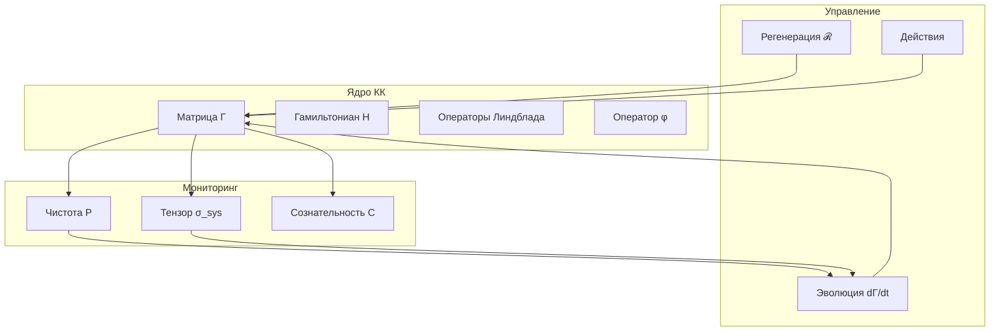

# Вычислительная Реализация

:::note О нотации в коде
В Python-коде используются следующие соответствия:
- `gamma` ($\Gamma$) — [матрица когерентности](/docs/core/dynamics/coherence-matrix)
- `purity` ($P$) — [чистота](/docs/core/dynamics/viability#определение-чистоты): $P = \mathrm{Tr}(\Gamma^2)$
- `stress_tensor` ($\sigma_{\mathrm{sys}}$) — [тензор напряжений](./definitions#тензор-напряжений)
- `coh_E` ($\mathrm{Coh}_E$) — [E-когерентность](./definitions#e-когерентность)
- `kappa` ($\kappa$) — [скорость регенерации](./axiomatics#связь-регенерации-и-e-когерентности)
- `phi` ($\varphi$) — [оператор самомоделирования](/docs/proofs/formalization-phi)
- `differentiation` ($D_{\text{diff}}$) — [мера дифференциации](./definitions#меры-сознательности)
- `reflection` ($R$) — [мера рефлексии](/docs/core/consciousness/self-observation#мера-рефлексии-r)
:::

:::warning Статус документа
Данная реализация — **демонстрационный псевдокод**. Для базового класса `Holon` см. [Вычислительная реализация](/docs/formal/computational). Для полной реализации с мерами сознательности см. [Иерархия интериорности](/docs/proofs/interiority-hierarchy#61-алгоритм-классификации-уровня).
:::

## Архитектура системы


```mermaid
graph TD
    subgraph "Ядро КК"
        G[Матрица Γ]
        H[Гамильтониан H]
        L[Операторы Линдблада]
        PHI[Оператор φ]
    end
    subgraph "Мониторинг"
        P[Чистота P]
        SIG[Тензор σ_sys]
        C[Сознательность C]
    end
    subgraph "Управление"
        EVOL[Эволюция dΓ/dt]
        REG[Регенерация ℛ]
        ACT[Действия]
    end
    G --> P
    G --> SIG
    G --> C
    P --> EVOL
    SIG --> EVOL
    EVOL --> G
    REG --> G
    ACT --> G
```

## Структура данных

```python
from dataclasses import dataclass
import numpy as np
from typing import List, Callable

@dataclass
class HolonState:
    """
    Состояние Голонома в Кибернетике Когерентности.

    См. определение Голонома: /docs/core/structure/holon
    """

    # Ядро состояния
    gamma: np.ndarray          # Γ: матрица когерентности 7×7
    hamiltonian: np.ndarray    # H: гамильтониан системы
    lindblad_ops: List[np.ndarray]  # {L_k}: операторы декогеренции
    phi: Callable              # φ: оператор самомоделирования (CPTP)

    # Метрики жизнеспособности
    purity: float              # P = Tr(Γ²) ∈ [1/7, 1]
    entropy: float             # S_vN = -Tr(Γ log Γ) ∈ [0, log 7]

    # Меры сознательности (см. /docs/core/consciousness/self-observation)
    integration: float         # Φ: мера интеграции
    differentiation: float     # D_diff: мера дифференциации = exp(S_vN(ρ_E))
    reflection: float          # R: мера рефлексии ∈ [0, 1]
    consciousness: float       # C = Φ × D_diff × R

    # Тензор напряжений (см. definitions.md#тензор-напряжений)
    stress_tensor: np.ndarray  # σ_sys ∈ ℝ⁷: [σ_A, σ_S, σ_D, σ_L, σ_E, σ_O, σ_U]

    # Жизнеспособность
    viable: bool               # P > P_critical ∧ dP/dt > -ε
    margin: float              # 1 - max(σ_sys)
```

## Алгоритм эволюции

Реализация [уравнения эволюции](/docs/core/dynamics/evolution):

$$
\frac{d\Gamma}{dt} = -i[H, \Gamma] + \mathcal{D}[\Gamma] + \mathcal{R}[\Gamma, E]
$$

```python
def evolve_holon(state: HolonState, dt: float, environment) -> HolonState:
    """
    Один шаг эволюции по полному уравнению КК.

    Три члена:
    1. Унитарный: -i[H, Γ]  (см. /docs/core/dynamics/evolution#1-унитарный-член)
    2. Диссипативный: 𝒟[Γ]  (см. /docs/core/dynamics/evolution#2-диссипативный-член)
    3. Регенеративный: ℛ[Γ, E]  (см. /docs/core/dynamics/evolution#3-регенеративный-член)
    """
    gamma = state.gamma.copy()

    # 1. Унитарная эволюция: -i[H, Γ]
    U = expm(-1j * state.hamiltonian * dt)
    gamma = U @ gamma @ U.conj().T

    # 2. Диссипация: 𝒟[Γ] (уравнение Линдблада)
    for L_k in state.lindblad_ops:
        gamma += dt * (
            L_k @ gamma @ L_k.conj().T
            - 0.5 * (L_k.conj().T @ L_k @ gamma + gamma @ L_k.conj().T @ L_k)
        )

    # 3. Регенерация: ℛ[Γ, E]
    # κ = κ₀ · Coh_E (см. axiomatics.md#связь-регенерации-и-e-когерентности)
    coh_E = compute_coherence_E(gamma)
    kappa = KAPPA_0 * coh_E
    delta_F = compute_free_energy_gradient(gamma, environment)

    if delta_F > 0:
        gamma_target = compute_target_state(gamma, environment)
        gamma += dt * kappa * (gamma_target - gamma)

    # Нормализация: Tr(Γ) = 1
    gamma /= np.trace(gamma)

    # Обновление метрик
    return update_metrics(state, gamma)
```

## Мониторинг жизнеспособности

```python
def compute_stress_tensor(gamma: np.ndarray, environment) -> np.ndarray:
    """
    Вычисляет тензор напряжений σ_sys.
    """
    sigma = np.zeros(7)

    # σ_A: Артикуляция
    sigma[0] = compute_env_prediction_error(gamma, environment) / THETA_A

    # σ_S: Структура
    sigma[1] = compute_structural_complexity(gamma) / THETA_S

    # σ_D: Динамика
    sigma[2] = compute_computational_load() / C_MAX

    # σ_L: Логика
    sigma[3] = compute_viability_uncertainty(gamma) / THETA_L

    # σ_E: Опыт
    sigma[4] = (compute_self_model_error(gamma) +
                compute_exp_fragmentation(gamma)) / THETA_E

    # σ_O: Основание
    sigma[5] = (compute_memory_load() +
                compute_grounding_deficit(gamma)) / THETA_O

    # σ_U: Единство
    sigma[6] = (compute_consciousness_deficit(gamma) +
                compute_nash_distance(gamma)) / THETA_U

    return sigma


def check_viability(sigma: np.ndarray) -> tuple[bool, float]:
    """
    Проверяет условие жизнеспособности.

    Returns:
        (viable, margin)
    """
    max_stress = np.max(sigma)
    margin = 1.0 - max_stress
    viable = margin > 0

    return viable, margin
```

## Цикл управления

Реализация управления на основе [условия жизнеспособности](/docs/core/dynamics/viability):

$$
\mathrm{Viable}(\Gamma) \Leftrightarrow \|\sigma_{\mathrm{sys}}(\Gamma)\|_\infty < 1
$$

```python
def control_loop(holon: HolonState, environment, max_steps: int):
    """
    Основной цикл управления КК-системой.

    Зоны управления определяются по margin = 1 - max(σ_sys):
    - margin > 0.3: Безопасная зона
    - margin > 0.1: Зона осторожности
    - margin > 0.05: Зона предупреждения
    - margin ≤ 0.05: Критическая зона
    """
    for step in range(max_steps):
        # 1. Эволюция состояния
        holon = evolve_holon(holon, dt=0.01, environment=environment)

        # 2. Мониторинг (см. definitions.md#эквивалентность-условий)
        sigma = compute_stress_tensor(holon.gamma, environment)
        viable, margin = check_viability(sigma)

        # 3. Управление на основе зоны
        if margin > MARGIN_SAFE:
            # Безопасная зона: нормальная работа
            action = normal_operation(holon)
        elif margin > MARGIN_CAUTION:
            # Зона осторожности: снижение риска
            action = reduce_risk(holon, sigma)
        elif margin > MARGIN_WARNING:
            # Зона предупреждения: активное восстановление
            action = activate_recovery(holon, sigma)
        else:
            # Критическая зона: аварийный режим
            action = emergency_mode(holon, sigma)

        # 4. Применение действия
        holon = apply_action(holon, action, environment)

        # 5. Логирование
        log_state(step, holon, sigma, margin)

        if not viable:
            print(f"WARNING: Viability lost at step {step}")
            break
```

## Пороговые значения

:::info Выведенные константы
Ключевые пороговые значения **выведены** из структуры теории. См. [Аксиома Септичности](/docs/core/foundations/axiom-septicity).
:::

```python
# Критическая чистота P_crit = 2/N = 2/7 (теорема)
# См. /docs/core/foundations/axiom-septicity#критическая-чистота-геометрический-критерий
P_CRITICAL = 2/7  # ≈ 0.286, выведено из геометрии 7D-пространства

# Базовая скорость регенерации κ₀ = |γ_OE| · |γ_OU| / γ_OO (теорема)
# κ = κ₀ · Coh_E — зависит от состояния Γ
# См. /docs/core/foundations/axiom-septicity#структурный-анзац-kappa0
def compute_kappa_0(gamma):
    """Вычисляет κ₀ из структуры Γ."""
    gamma_OE = abs(gamma[5, 4])  # O=5, E=4 (0-indexed)
    gamma_OU = abs(gamma[5, 6])  # O=5, U=6
    gamma_OO = gamma[5, 5]
    return gamma_OE * gamma_OU / gamma_OO if gamma_OO > 0 else 0

# Пороги для компонент σ_sys (см. definitions.md#тензор-напряжений)
# Значения θ_i определяют нормировку: σ_i = нагрузка_i / θ_i
THETA_A = 3.5   # Артикуляция (A-измерение)
THETA_S = 2.0   # Структура (S-измерение)
THETA_D = 1.0   # Динамика (D-измерение) — через C_MAX
THETA_L = 1.0   # Логика (L-измерение)
THETA_E = 2.5   # Опыт (E-измерение)
THETA_O = 1.0   # Основание (O-измерение)
THETA_U = 1.5   # Единство (U-измерение)

# Вычислительные ограничения (зависят от платформы)
C_MAX = 1000.0  # Операций в секунду
M_MAX = 1e9     # Байт памяти

# Пороги зон управления (margin = 1 - max(σ))
MARGIN_SAFE = 0.3       # Безопасная зона
MARGIN_CAUTION = 0.1    # Зона осторожности
MARGIN_WARNING = 0.05   # Зона предупреждения
# margin < 0.05: Критическая зона
```

## Интеграция с внешними системами

```python
class CoherenceCyberneticsAgent:
    """
    Агент на основе Кибернетики Когерентности.

    Реализует цикл: восприятие → рефлексия → действие.
    """

    def __init__(self, config):
        self.holon = initialize_holon(config)
        self.environment = Environment(config)

    def perceive(self, observation):
        """Обновление Γ на основе наблюдения (A-измерение)."""
        self.holon = update_from_observation(self.holon, observation)

    def act(self) -> Action:
        """
        Выбор действия на основе σ_sys.

        См. definitions.md#тензор-напряжений
        """
        sigma = compute_stress_tensor(self.holon.gamma, self.environment)
        return select_action(self.holon, sigma)

    def reflect(self):
        """
        Рефлексивное обновление: вычисление R.

        R = 1 - ‖Γ - φ(Γ)‖²_F / ‖Γ‖²_F
        См. /docs/core/consciousness/self-observation#мера-рефлексии-r
        """
        phi_gamma = self.holon.phi(self.holon.gamma)
        self.holon.reflection = 1 - frobenius_distance(
            self.holon.gamma, phi_gamma
        ) ** 2

    def is_viable(self) -> bool:
        """
        Проверка жизнеспособности: P > P_critical.

        См. /docs/core/dynamics/viability
        """
        return self.holon.purity > P_CRITICAL
```

---

**Связанные документы:**
- [Вычислительная реализация](/docs/formal/computational) — базовый класс `Holon`
- [Теоремы](./theorems) — формальные основания
- [Определения](./definitions) — $\sigma_{\mathrm{sys}}$, $\mathrm{Coh}_E$, $C$
- [Аксиоматика](./axiomatics) — связь $\kappa$ и $\mathrm{Coh}_E$
- [Эволюция](/docs/core/dynamics/evolution) — уравнение $d\Gamma/dt$
- [Жизнеспособность](/docs/core/dynamics/viability) — условие $P > P_{\text{critical}}$
- [Самонаблюдение](/docs/core/consciousness/self-observation) — меры $R$, $\Phi$, $C$
- [Формализация φ](/docs/proofs/formalization-phi) — CPTP-каналы
- [Иерархия интериорности](/docs/proofs/interiority-hierarchy#61-алгоритм-классификации-уровня) — полная реализация
