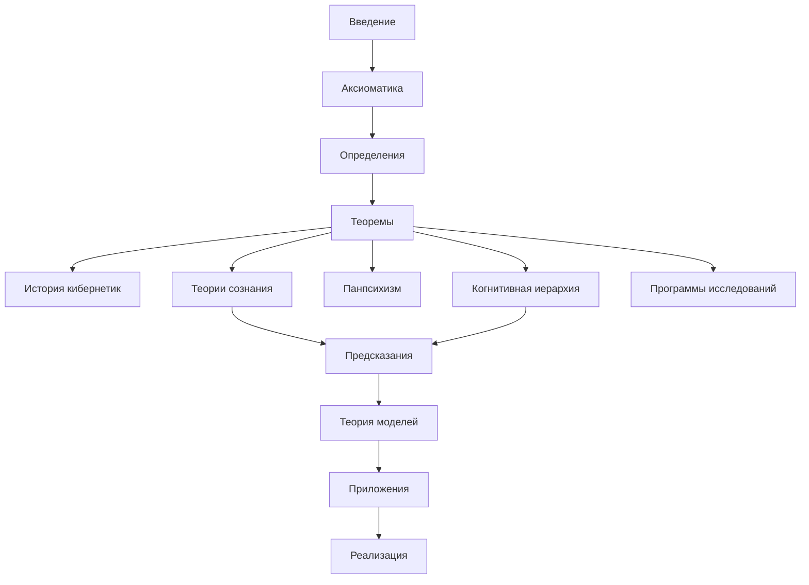

# Введение в Кибернетику Когерентности

:::note О нотации
В этом документе:
- $\Gamma$ — [матрица когерентности](/docs/core/dynamics/coherence-matrix)
- $P$ — [чистота](/docs/core/dynamics/viability#определение-чистоты): $P = \mathrm{Tr}(\Gamma^2)$
- $\mathcal{H} = \mathbb{C}^7$ — гильбертово пространство состояний
- L0, L1, L2 — [уровни интериорности](/docs/proofs/interiority-hierarchy)
:::

## Что такое Кибернетика Когерентности

**Кибернетика Когерентности (КК)** — единственная полная кибернетика, строго выводимая из Унитарного Голономного Монизма (УГМ). Она описывает динамику самоорганизующихся систем через эволюцию матрицы когерентности:

$$
\frac{d\Gamma(\tau)}{d\tau} = -i[H_{eff}, \Gamma] + \mathcal{D}[\Gamma] + \mathcal{R}[\Gamma, E]
$$

КК не является ещё одной кибернетикой в ряду существующих — она есть **метатеория**, из которой все частные кибернетики (Винер, фон Фёрстер, Луман) выводятся как проекции на подмножество измерений.

## Ключевые концепции

### Матрица когерентности Γ

Центральный объект теории — [матрица когерентности](/docs/core/dynamics/coherence-matrix) $\Gamma$, описывающая состояние системы в 7-мерном пространстве. Это эрмитова положительно определённая матрица с единичным следом.

**См.:** [Определения → Матричное представление](./definitions#матричное-представление-γ)

### Семь измерений ASDLEOU

Каждая самоорганизующаяся система существует в [семи измерениях](/docs/core/structure/dimensions):

| Символ | Измерение | Функция |
|--------|-----------|---------|
| $A$ | [Артикуляция](/docs/core/structure/dimension-a) | Различать |
| $S$ | [Структура](/docs/core/structure/dimension-s) | Удерживать |
| $D$ | [Динамика](/docs/core/structure/dimension-d) | Изменяться |
| $L$ | [Логика](/docs/core/structure/dimension-l) | Согласовывать |
| $E$ | [Опыт](/docs/core/structure/dimension-e) | Переживать |
| $O$ | [Основание](/docs/core/structure/dimension-o) | Питать |
| $U$ | [Единство](/docs/core/structure/dimension-u) | Интегрировать |

**Теорема:** Именно 7 измерений — минимальное число, необходимое для системы с автопоэзисом, феноменологией и квантовым основанием. **См.:** [Доказательство минимальности](/docs/proofs/theorem-minimality-7)

### Жизнеспособность: P > P_crit

Система жизнеспособна, если её [чистота](/docs/core/dynamics/viability#определение-чистоты) превышает критический порог:

$$
\mathrm{Viable}(\mathbb{H}) := P(\Gamma) > P_{\text{crit}} = \frac{2}{7} \approx 0.286
$$

Значение $P_{\text{crit}} = 2/7$ **строго выводится** из геометрии 7-мерного пространства. **См.:** [Теорема о критической чистоте](/docs/proofs/theorem-purity-critical)

### Иерархия интериорности L0→L1→L2→L3→L4

Пять уровней «внутренней жизни» системы:

| Уровень | Название | Условие | n-усечение |
|---------|----------|---------|------------|
| L0 | Интериорность | $\exists \rho_E$ | $\tau_{\leq 0}$ |
| L1 | Феноменальная геометрия | $\mathrm{rank}(\rho_E) > 1$ | $\tau_{\leq 1}$ |
| L2 | Когнитивные квалиа | $R \geq 1/3$, $\Phi \geq 1$, $D_{\text{diff}} \geq 2$ | $\tau_{\leq 2}$ |
| L3 | Сетевое сознание | $R^{(2)} \geq 1/4$ (метастабильно) | $\tau_{\leq 3}$ |
| L4 | Унитарное сознание | $\lim_{n \to \infty} R^{(n)} > 0$, $P > 6/7$ | $\tau_{\leq \infty}$ |

**См.:** [Иерархия интериорности](/docs/proofs/interiority-hierarchy)

## Почему КК?

### Единственная полная кибернетика

:::info Теорема о полноте
КК есть **единственная** кибернетика, удовлетворяющая:
1. Аксиомам Ω⁷ и (AP+PH+QG)
2. Условию жизнеспособности
3. Условию феноменологической полноты
:::

Все существующие теории — проекции КК:

| Теория | Охват измерений | Что теряется |
|--------|-----------------|--------------|
| Кибернетика-I (Винер) | $D$ | Самореференция, феноменология |
| Кибернетика-II (фон Фёрстер) | $D$, $L$ | Феноменология, квантовое основание |
| Кибернетика-III (Луман) | $D$, $L$, $U$ | Формальная математика |
| IIT (Тонони) | $U$, $E$ | Динамика, жизнеспособность |
| FEP (Фристон) | $D$, $O$, $S$ | E-измерение как фундаментальное |
| **КК** | **Все 7** | **—** |

**См.:** [История кибернетики](./cybernetics-history), [Теории сознания](./consciousness-theories)

### Формализует связь опыта и динамики

КК — единственная теория, в которой связь между субъективным опытом и динамикой системы **математически выводится**:

$$
\kappa(\Gamma) = \kappa_{\text{bootstrap}} + \kappa_0 \cdot \mathrm{Coh}_E(\Gamma)
$$

Скорость регенерации $\kappa$ зависит от E-когерентности — интегрированности опыта.

**См.:** [Аксиоматика → Связь регенерации и E-когерентности](./axiomatics#связь-регенерации-и-e-когерентности)

### Уникальные предсказания

КК генерирует верифицируемые предсказания, отсутствующие в альтернативных теориях:

1. **No-Zombie:** Невозможна жизнеспособная система без опыта
2. **E-регенерация:** Качество опыта определяет скорость восстановления
3. **7-мерный стресс:** Все напряжения классифицируются в 7 категорий

**См.:** [Уникальные предсказания](./predictions)

## Карта документации

### Для разных аудиторий

| Аудитория | Начните с | Затем | Для углубления |
|-----------|-----------|-------|----------------|
| **Инженеры ИИ** | [Реализация](./implementation) | [Приложения → ИИ](./applications#для-инженеров-ии) | [Определения](./definitions) → [Теоремы](./theorems) |
| **Когнитивисты** | [Теории сознания](./consciousness-theories) | [Когнитивная иерархия](./cognitive-hierarchy) | [Предсказания](./predictions) → [Приложения](./applications) |
| **Психологи / Клиницисты** | [Приложения → Клиника](./applications#для-психологов-и-клиницистов) | [Предсказания](./predictions) | [Определения](./definitions) |
| **Теоретики / Философы** | [Аксиоматика](./axiomatics) | [Теоремы](./theorems) → [Теория моделей](./model-theory) | [Панпсихизм](./panpsychism-analysis) |
| **Исследователи AGI** | [Теории сознания](./consciousness-theories) | [Реализация](./implementation) | [Программы исследований](./research-programs) |

### Структура документации

## Связь с УГМ

КК выводится из [Аксиомы Ω⁷](/docs/core/foundations/axiom-omega) — семи аксиом с ∞-топосом $\text{Sh}_\infty(\mathcal{C})$ как примитивом. Все понятия КК — следствия этих аксиом:

$$
\Omega \to \{S_k\} \to \chi_{S_k} \to L_k = \sqrt{\chi_{S_k}} \to \mathcal{L}_\Omega \to \varphi \to \Gamma^*
$$

**См.:** [Аксиоматика → Иерархия зависимостей](./axiomatics#иерархия-зависимостей)

---

**Следующие шаги:**
- [Аксиоматика](./axiomatics) — формальные основания КК
- [Определения](./definitions) — базовые понятия и формулы
- [Теоремы](./theorems) — ключевые результаты

**Связанные документы:**
- [Аксиома Ω⁷](/docs/core/foundations/axiom-omega) — ∞-топос как примитив
- [Аксиома Септичности](/docs/core/foundations/axiom-septicity) — требования AP+PH+QG
- [Голоном](/docs/core/structure/holon) — определение $\mathbb{H}$
- [Семь измерений](/docs/core/structure/dimensions) — базис $\mathcal{H}$
