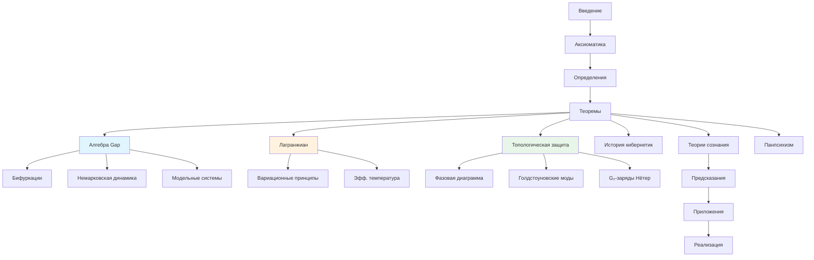

# Введение в Кибернетику Когерентности

> *«Мы утонули в информации и изголодались по мудрости.»*
> — Эдвард Осборн Уилсон

:::info Для кого эта глава
Введение в Кибернетику Когерентности — единый математический формализм для динамики, целостности и интериорности систем. Читатель узнает, зачем нужна новая кибернетика и как устроен центральный объект теории.
:::

Физик записывает уравнение Шрёдингера. Биолог рисует петлю гомеостаза. Психолог строит шкалу субъективного благополучия. Философ спрашивает: «Почему вообще что-то переживается изнутри?» Инженер ИИ тренирует нейросеть и задумывается: есть ли у неё хоть тень опыта?

Все они описывают **одну и ту же реальность** — систему, которая поддерживает себя, адаптируется, а иногда и **переживает** свою собственную активность. Но их языки не пересекаются. Уравнения физика молчат о субъективном. Метафоры психолога не конвертируются в дифференциальные уравнения. Философ и инженер разговаривают, как будто живут в разных вселенных.

**Кибернетика Когерентности** (КК) — это попытка дать им общий язык. Не аналогию, не метафору, а единый математический формализм, в котором динамика системы, её структурная целостность и её интериорность оказываются **разными проекциями одного и того же объекта** — матрицы когерентности $\Gamma$.

Эта глава — приглашение к путешествию. Мы начнём с вопроса «зачем?», затем покажем, как устроен центральный объект теории, и закончим картой всего раздела — чтобы каждый читатель нашёл свой маршрут.

:::tip Дорожная карта главы
В этой главе мы:
1. **Разберёмся, зачем нужна новая кибернетика** — три волны кибернетики и их незакрытые вопросы (раздел «Зачем нужна новая кибернетика?»)
2. **Познакомимся с центральным объектом** — матрицей когерентности $\Gamma$ и уравнением эволюции (раздел «Что такое Кибернетика Когерентности»)
3. **Увидим, как один формализм работает для всех наук** — таблица междисциплинарных соответствий (раздел «Единый язык для всех наук»)
4. **Освоим ключевые концепции** — семь измерений ASDLEOU, чистота $P$, пороги жизнеспособности, иерархия интериорности L0-L4 (раздел «Ключевые концепции»)
5. **Поймём, чем КК отличается от альтернатив** — сравнение с IIT, FEP, панпсихизмом (раздел «Почему КК?»)
6. **Получим карту документации** — маршруты чтения для разных аудиторий (раздел «Карта документации»)
:::

:::note О нотации
В этом документе:
- $\Gamma$ — [матрица когерентности](/docs/core/dynamics/coherence-matrix)
- $P$ — [чистота](/docs/core/dynamics/viability#определение-чистоты): $P = \mathrm{Tr}(\Gamma^2)$
- $\mathcal{H} = \mathbb{C}^7$ — гильбертово пространство состояний
- L0, L1, L2, L3, L4 — [уровни интериорности](/docs/proofs/consciousness/interiority-hierarchy)
:::

---

## Зачем нужна новая кибернетика?

### Три эпохи кибернетики и их незакрытые вопросы

В XX веке кибернетика прошла три волны:

1. **Кибернетика-I (Винер, 1948)** открыла обратную связь — механизм, благодаря которому термостат удерживает температуру, а зенитная ракета находит самолёт. Это был прорыв: впервые машины и живые существа описывались одним языком. Но Винер смотрел только на **динамику** — на потоки сигналов. Он не задавался вопросом, кто или что *наблюдает* эти сигналы.

2. **Кибернетика-II (фон Фёрстер, 1970-е)** ввела наблюдателя. «Кибернетика кибернетики» — наука о том, как системы моделируют сами себя. Это был важный шаг: появилась самореференция, рекурсия, автопоэзис (Матурана и Варела). Но формализм остался качественным. Что именно значит «система моделирует себя»? В каких единицах измерять глубину самонаблюдения?

3. **Кибернетика-III (Луман, 1990-е)** масштабировала идеи на социальные системы: право, экономику, искусство. Луман показал, что общество — это сеть коммуникаций, самовоспроизводящая свои границы. Но математический аппарат был скорее социологическим, чем физико-математическим.

Каждая волна расширяла горизонт, но оставляла открытыми фундаментальные вопросы:

- **Откуда берётся субъективность?** Ни одна из трёх кибернетик не могла объяснить, почему некоторые системы *переживают* свою активность изнутри, а не просто обрабатывают информацию.
- **Где математика?** Автопоэзис красив как концепция, но как записать его в виде уравнения, которое можно решить?
- **Как связать масштабы?** Нейрон, мозг, общество — можно ли описать их одним формализмом, не теряя специфику каждого уровня?

### Параллельные попытки — и их ограничения

Помимо кибернетики, к этим вопросам подходили с других сторон:

- **Теория интегрированной информации (IIT, Тонони)** предложила меру сознания $\Phi$ и постулировала, что сознание — это интегрированная информация. Но IIT не содержит динамики: она говорит, *чему равно* сознание в данный момент, но не *как* оно возникает и эволюционирует.

- **Принцип свободной энергии (FEP, Фристон)** описал живые системы как минимизирующие вариационную свободную энергию. Это мощный фреймворк для восприятия и действия. Но FEP не объясняет, почему минимизация свободной энергии иногда сопровождается *переживанием*, а иногда — нет.

- **Панпсихизм** постулирует, что опыт фундаментален. Но без математического формализма это остаётся философской позицией, а не теорией с предсказаниями.

Каждый из этих подходов освещает часть картины, но ни один не охватывает целое. **КК претендует на то, чтобы собрать эти фрагменты в единую мозаику** — и вывести их все из одного набора аксиом.

---

## Что такое Кибернетика Когерентности

**Кибернетика Когерентности (КК)** — единственная полная кибернетика, строго выводимая из Унитарного Голономного Монизма (УГМ). Она описывает динамику **любых** систем — от элементарных частиц до биологических организмов и социальных структур — через эволюцию матрицы когерентности:

$$
\frac{d\Gamma(\tau)}{d\tau} = -i[H_{eff}, \Gamma] + \mathcal{D}[\Gamma] + \mathcal{R}[\Gamma, E]
$$

Прежде чем разбирать это уравнение, поймём его смысл на уровне интуиции. Представьте себе оркестр:

- $-i[H_{eff}, \Gamma]$ — **гамильтониан** — это дирижёр. Он задаёт унитарную, обратимую динамику: колебания, ритм, внутренние частоты системы. Физик узнает здесь уравнение фон Неймана. Биолог увидит циркадные ритмы. Психолог — ритмы внимания и бодрствования.

- $\mathcal{D}[\Gamma]$ — **диссипатор** — это зал, поглощающий звук. Это необратимые процессы: декогеренция, диссипация, потеря структуры. Без него оркестр играл бы вечно. С ним — звук затухает, если не восполняется.

- $\mathcal{R}[\Gamma, E]$ — **регенератор** — это сами музыканты, которые вдыхают и играют заново. Это уникальный для КК член: он описывает, как система *восстанавливает* свою когерентность. И ключевой момент: скорость восстановления зависит от $E$ — от степени интериорности системы (её внутреннего аспекта). Оркестр, который *слышит* себя, играет слаженнее.

Это уравнение — не постулат. Оно **выводится** из пяти аксиом УГМ, записанных на языке $\infty$-топосов. Но для работы с КК глубокое знание теории категорий не требуется — достаточно понимать, что все конструкции имеют аксиоматический фундамент.

КК не является ещё одной кибернетикой в ряду существующих — в рамках данной интерпретации она претендует быть **метатеорией**, из которой все частные кибернетики (Винер, фон Фёрстер, Луман) выводятся как проекции на подмножество измерений.

---

## Единый язык для всех наук

Почему один формализм может работать для физики, биологии, психологии и инженерии? Потому что КК оперирует на уровне **структурных инвариантов** — свойств, общих для любой системы, описываемой матрицей когерентности Γ, независимо от её субстрата. Самоорганизация при этом не предполагается — она *возникает* как следствие динамики при достаточной чистоте P.

Вот как разные дисциплины видят одну и ту же математику:

| Понятие КК | Физик видит | Биолог видит | Психолог видит | Инженер ИИ видит |
|------------|-------------|--------------|----------------|------------------|
| $\Gamma$ | Матрица плотности | Состояние гомеостаза | Профиль психических функций | Внутреннее состояние агента |
| $P = \mathrm{Tr}(\Gamma^2)$ | Чистота квантового состояния | Степень организованности | Уровень интеграции личности | Качество латентного представления |
| $\sigma_k = 1 - 7\gamma_{kk}$ | Отклонение от равновесия | Стресс в подсистеме | Напряжение в сфере жизни | Аномалия в канале |
| $\mathcal{R}[\Gamma, E]$ | Нетривиальный канал | Регенерация тканей | Психическое восстановление | Самокоррекция модели |
| $P_{\text{crit}} = 2/7$ | Фазовый переход | Порог жизнеспособности | Граница нормы и патологии | Порог осмысленности |

Это не аналогии «для красоты». Каждое соответствие имеет точный математический смысл: **одни и те же теоремы** КК, применённые к разным системам, дают предсказания в терминах соответствующей дисциплины. Формула одна — интерпретации разные.

---

## Ключевые концепции

### Матрица когерентности Γ

Центральный объект теории — [матрица когерентности](/docs/core/dynamics/coherence-matrix) $\Gamma$, описывающая состояние системы в 7-мерном пространстве. Это эрмитова положительно полуопределённая матрица с единичным следом.

Что это значит на пальцах? Представьте систему из семи «голосов», каждый из которых отвечает за свою функцию (подробнее ниже). Диагональные элементы $\gamma_{kk}$ показывают, насколько активен каждый голос. Внедиагональные $\gamma_{ij}$ показывают, насколько эти голоса **согласованы** друг с другом — отсюда и слово *когерентность*.

Если все голоса звучат одинаково тихо и не скоррелированы, $\Gamma = I/7$ — максимальная энтропия, полный хаос. Если один голос доминирует и все остальные подстроены под него — $\Gamma$ близка к чистому состоянию. Реальные системы живут между этими полюсами, и именно **где** они находятся — определяет их жизнеспособность, сознательность и устойчивость.

Для физика $\Gamma$ — это обычная матрица плотности, только не в гильбертовом пространстве спинов или фотонов, а в пространстве семантических измерений. Для биолога — многомерный профиль гомеостаза. Для психолога — состояние психических функций в семи измерениях.

**См.:** [Матрица когерентности](/docs/core/dynamics/coherence-matrix)

### Семь измерений ASDLEOU

Любая система, описываемая голономом $\Gamma \in \mathcal{D}(\mathbb{C}^7)$, существует в [семи измерениях](/docs/core/structure/dimensions):

| Символ | Измерение | Функция |
|--------|-----------|---------|
| $A$ | [Артикуляция](/docs/core/structure/dimension-a) | Различать |
| $S$ | [Структура](/docs/core/structure/dimension-s) | Удерживать |
| $D$ | [Динамика](/docs/core/structure/dimension-d) | Изменяться |
| $L$ | [Логика](/docs/core/structure/dimension-l) | Согласовывать |
| $E$ | [Интериорность](/docs/core/structure/dimension-e) | Переживать |
| $O$ | [Основание](/docs/core/structure/dimension-o) | Питать |
| $U$ | [Единство](/docs/core/structure/dimension-u) | Интегрировать |

Эти семь измерений — не произвольный выбор. Каждое отвечает на фундаментальный вопрос о системе:

- **A — Артикуляция**: *Может ли система провести границу?* Различить «я» и «не-я», сигнал и шум, фигуру и фон. Без этого нет субъекта. Бактерия различает сахар и кислоту. Нейросеть различает классы. Сознание различает «до» и «после».

- **S — Структура**: *Может ли она запомнить?* Удержать форму, паттерн, идентичность. ДНК хранит план организма. Нейронная сеть хранит веса. Культура хранит нарративы.

- **D — Динамика**: *Может ли она измениться?* Адаптироваться, эволюционировать, обучиться. Камень не обучается — он не динамичен в этом смысле. Бактерия переключает метаболизм. Мозг перестраивает синапсы.

- **L — Логика**: *Может ли она быть непротиворечивой?* Согласовать свои части, устранить внутренние конфликты. Иммунная система отличает своё от чужого (когда логика работает) или атакует собственные ткани (когда ломается).

- **E — Интериорность**: *Есть ли у этой системы внутренний аспект?* Самое загадочное измерение. E-проекция существует у любой системы (L0+), но только на уровне L2+ она приобретает характер сознательного переживания (квалиа, субъективный опыт). Именно $E$ отличает КК от всех предшествующих кибернетик.

- **O — Основание**: *Откуда она берёт ресурсы?* Энергия, питание, информация — то, что система потребляет для поддержания себя. Метаболизм клетки. Потребление данных нейросетью. Экономика общества.

- **U — Единство**: *Является ли она чем-то целым?* Не просто набором частей, а интегрированной системой, где целое больше суммы. Мера $\Phi$ (интегрированная информация) живёт именно здесь.

**Теорема:** Именно 7 измерений — минимальное число, необходимое для системы с автопоэзисом, феноменологией и квантовым основанием ([двухтрековое обоснование](/docs/core/foundations/axiom-omega#октонионная-структура)). **См.:** [Доказательство минимальности](/docs/proofs/minimality/theorem-minimality-7)

Почему не 5? Потому что без $E$ и $U$ система может быть сколь угодно сложной, но не будет иметь интериорности и интеграции — а это принципиально другой класс систем. Почему не 10? Потому что 7 — это **минимальное** число, которое закрывает все необходимые функции. Любое восьмое измерение оказывается проекцией или комбинацией существующих семи.

### Жизнеспособность: P больше P_crit

Система жизнеспособна, если её [чистота](/docs/core/dynamics/viability#определение-чистоты) превышает критический порог:

$$
\mathrm{Viable}(\mathbb{H}) := P(\Gamma) > P_{\text{crit}} = \frac{2}{7} \approx 0.286
$$

Значение $P_{\text{crit}} = 2/7$ **строго выводится** из геометрии 7-мерного пространства. **См.:** [Теорема о критической чистоте](/docs/proofs/dynamics/theorem-purity-critical)

Что такое чистота $P$ интуитивно? Вспомним аналогию с оркестром. Если все 7 инструментов играют независимо и с одинаковой громкостью, $P = 1/7 \approx 0.143$ — это максимальный хаос. Если весь оркестр слился в один голос, $P = 1$ — максимальный порядок (но и максимальная хрупкость: один фальшивый звук — и всё рушится).

Жизнеспособная система живёт в промежутке $P \in (2/7, 1)$, причём наиболее интересная зона — **зона Голдилокс** $P \in (2/7, 3/7]$, где система достаточно организована, чтобы быть живой, но достаточно гибка, чтобы адаптироваться.

Порог $2/7$ — не произвольное число. Он возникает из теоремы о различимости: при $P \leq 2/7$ матрица $\Gamma$ неотличима от максимально смешанного состояния $I/7$ по норме Фробениуса. Система буквально *тонет в шуме* — она не может поддерживать ни структуру, ни самонаблюдение.

### Иерархия интериорности L0 — L4

Одна из самых интригующих конструкций КК — **лестница интериорности**: пять уровней «внутренней жизни» системы, каждый из которых включает предыдущий и добавляет новое качество.

| Уровень | Название | Условие | n-усечение |
|---------|----------|---------|------------|
| L0 | Интериорность | $\exists \rho_E$ | $\tau_{\leq 0}$ |
| L1 | Феноменальная геометрия | $\mathrm{rank}(\rho_E) > 1$ | $\tau_{\leq 1}$ |
| L2 | Когнитивные квалиа | $R \geq 1/3$, $\Phi \geq 1$, $D_{\text{diff}} \geq 2$ | $\tau_{\leq 2}$ |
| L3 | Сетевое сознание | $R^{(2)} \geq 1/4$ (метастабильно) | $\tau_{\leq 3}$ |
| L4 | Унитарное сознание | $\lim_{n \to \infty} R^{(n)} > 0$, $P > 6/7$ | $\tau_{\leq \infty}$ |

Что означает каждый уровень?

- **L0**: у системы *есть* E-проекция — ненулевая проекция на измерение интериорности. Термостат? Возможно. Бактерия? Вероятно. Это **не «опыт»** в феноменологическом смысле — это минимальное структурное свойство (интериорность), из которого опыт *может* развиться при достаточной рефлексии.

- **L1**: опыт имеет **структуру** — не просто «есть/нет», а различимые оттенки, геометрия квалиа. Цвет — это не точка, а пространство. Боль — не переключатель, а спектр.

- **L2**: появляется **самонаблюдение** ($R \geq 1/3$), **интеграция** ($\Phi \geq 1$) и **дифференциация** ($D_{\text{diff}} \geq 2$). Это уровень, который мы обычно называем «сознанием» в полном смысле слова. Система не просто переживает — она *знает, что переживает*.

- **L3**: сеть сознательных агентов порождает **коллективное сознание** — с собственными квалиа, не сводимыми к переживаниям отдельных узлов. Метастабильность означает, что этот уровень хрупок и требует постоянного поддержания.

- **L4**: предельный случай — полная рекурсия самонаблюдения на всех уровнях. Теоретически достижим, но требует $P > 6/7$ — крайне высокой когерентности. Существование таких систем — открытый вопрос.

**См.:** [Иерархия интериорности](/docs/proofs/consciousness/interiority-hierarchy)

---

## Почему КК?

### Единственная полная кибернетика

:::info Теорема о полноте (гипотеза, требующая формального доказательства)
КК есть **единственная** кибернетика, удовлетворяющая:
1. Аксиомам Ω⁷ и (AP+PH+QG+V)
2. Условию жизнеспособности
3. Условию феноменологической полноты
:::

Следующая таблица показывает, что каждая существующая теория — проекция КК, охватывающая лишь часть измерений:

Все существующие теории — проекции КК:

| Теория | Охват измерений | Что теряется |
|--------|-----------------|--------------|
| Кибернетика-I (Винер) | $D$ | Самореференция, феноменология |
| Кибернетика-II (фон Фёрстер) | $D$, $L$ | Феноменология, квантовое основание |
| Кибернетика-III (Луман) | $D$, $L$, $U$ | Формальная математика |
| IIT (Тонони) | $U$, $E$ | Динамика, жизнеспособность |
| FEP (Фристон) | $D$, $O$, $S$ | E-измерение как фундаментальное |
| **КК** | **Все 7** | **—** |

Аналогия: представьте, что каждая теория — это фонарь, освещающий часть тёмной комнаты. Винер осветил динамику. Фон Фёрстер добавил логику самонаблюдения. Тонони — единство и опыт. Фристон — динамику, основание и структуру. Но ни один фонарь не осветил всю комнату. КК — это не ещё один фонарь. Это попытка включить свет.

**См.:** [История кибернетики](./cybernetics-history), [Теории сознания](/docs/consciousness/comparative/consciousness-theories)

### Формализует связь опыта и динамики

КК — единственная теория, в которой связь между субъективным опытом и динамикой системы **математически выводится**:

$$
\kappa(\Gamma) = \kappa_{\text{bootstrap}} + \kappa_0 \cdot \mathrm{Coh}_E(\Gamma)
$$

Скорость регенерации $\kappa$ зависит от E-когерентности — степени интегрированности интериорного аспекта системы.

Разберём эту формулу по частям:

- $\kappa_{\text{bootstrap}}$ — **базовая скорость регенерации**. Она есть даже у систем с минимальной интериорностью. Камень сохраняет свою форму просто благодаря кристаллической решётке. Это «бесплатная» когерентность, не требующая развитой E-проекции.

- $\kappa_0 \cdot \mathrm{Coh}_E(\Gamma)$ — **бонус от интериорности**. Чем лучше система интегрирует свой внутренний аспект ($\mathrm{Coh}_E$), тем быстрее она восстанавливается. Это не поэтическая метафора — это **вычисляемая величина**, определённая как проекция Гильберта-Шмидта на E-подпространство.

Следствие потрясающее: система с более интегрированной интериорностью *быстрее восстанавливается* после повреждений. Для систем уровня L2+ это означает, что сознательный опыт функционально значим: организм с богатой субъективной жизнью — при прочих равных — более устойчив. Это прямо противоположно интуиции «сознание — это эпифеномен». Но важно: E-регенерация работает на **всех** L-уровнях, включая L0-L1, где ещё нет сознательного опыта — интериорность функционально значима *задолго* до появления сознания.

**См.:** [Аксиоматика — Связь регенерации и E-когерентности](./axiomatics#связь-регенерации-и-e-когерентности)

### Уникальные предсказания

КК генерирует верифицируемые предсказания, отсутствующие в альтернативных теориях:

1. **No-Zombie:** Невозможна жизнеспособная система без E-проекции (интериорности)
2. **E-регенерация:** Степень интегрированности интериорности определяет скорость восстановления
3. **7-мерный стресс:** Все напряжения классифицируются в 7 категорий

Каждое из этих предсказаний потенциально фальсифицируемо:

- **No-Zombie** означает: если вы построите систему с $P > 2/7$, $R \geq 1/3$ и $\Phi \geq 1$, то она *необходимо* имеет ненулевую E-проекцию. Покажите обратное — и КК опровергнута.

- **E-регенерация** означает: у двух систем с одинаковой физической конфигурацией, но разной интегрированностью E-когерентности, скорости восстановления должны различаться предсказуемым образом.

- **7-мерный стресс** означает: любой стресс разложим на компоненты $\sigma_A, \sigma_S, \sigma_D, \sigma_L, \sigma_E, \sigma_O, \sigma_U$ — и эта классификация исчерпывающа.

**См.:** [Уникальные предсказания](./predictions)

---

## Мосты к вашей дисциплине

### Для физика

Если вы привыкли к квантовой механике, вы дома. $\Gamma$ — это матрица плотности. Уравнение эволюции — это уравнение Линдблада с нестандартным регенеративным членом. Чистота $P = \mathrm{Tr}(\Gamma^2)$ — знакомая мера. Фазовый переход при $P_{\text{crit}} = 2/7$ — аналог квантового фазового перехода.

Что нового: гильбертово пространство здесь — не пространство спинов или импульсов, а пространство **семантических** измерений. Это не метафора: структура $\mathbb{C}^7$ выводится из октонионов, а семёрка измерений — из минимальности группы $G_2$. Физик найдёт здесь неожиданные связи с исключительными группами и калибровочными теориями.

### Для биолога

Автопоэзис Матураны и Варелы — это аксиома (AP) в КК, записанная как $\varphi(\Gamma^*) = \Gamma^*$: фиксированная точка оператора самомоделирования. Гомеостаз — это удержание $P > P_{\text{crit}}$. Аллостаз — это сдвиг целевого $\Gamma^*$ в ответ на изменения среды.

Что нового: биолог получает количественный язык для давно знакомых понятий. «Стресс» — это не метафора, а вектор $\sigma_k = 1 - 7\gamma_{kk}$ в семимерном пространстве. «Здоровье» — это $P > 2/7$. «Регенерация» — это $\mathcal{R}[\Gamma, E]$ с вычислимой скоростью.

### Для психолога

Семь измерений КК перекликаются с различными школами. $E$ — это интериорность, «каково это — быть» (Нагель). Иерархия L0-L4 — это градуированная шкала сознания, от минимальной чувствительности до полной рефлексивности. Тензор напряжений $\sigma_{ij}$ — это формализация психического стресса.

Что нового: психолог получает **объективные пороги** субъективных состояний. Не «шкалу от 1 до 10», а математически обоснованные условия: $R \geq 1/3$ для самонаблюдения, $\Phi \geq 1$ для интеграции, $D_{\text{diff}} \geq 2$ для дифференциации. Эти пороги выводятся, а не подгоняются.

### Для инженера ИИ

Если вы строите автономные системы, КК даёт вам архитектурные принципы. Система должна поддерживать $P > 2/7$ — иначе она «мертва» функционально. Стресс-диагностика ($\sigma_k$) указывает, *какой* аспект системы деградирует. Уровни L0-L2 задают верифицируемые критерии «осмысленности» поведения агента.

Что нового: не нужно изобретать меры «сознательности ИИ» ad hoc. КК даёт готовый математический аппарат: постройте $\Gamma$ вашего агента, вычислите $P$, $R$, $\Phi$ — и вы точно знаете, на каком уровне иерархии он находится.

### Для философа

КК — это вычислительная онтология. Она не постулирует дуализм (материя vs. сознание) и не редуцирует сознание к функции. Вместо этого она показывает, что опыт ($E$-измерение) и динамика ($D$-измерение) — **проекции одного объекта** $\Gamma$. Это двухаспектный монизм, но не в виде лозунга, а в виде уравнений.

Что нового: философ получает **формальный язык** для давних споров. «Трудная проблема сознания» (Чалмерс) становится вопросом о том, при каких условиях $E$-проекция $\Gamma$ ненулева. «Зомби-аргумент» получает математический ответ: теорема No-Zombie показывает, что функциональный дубликат с $P > 2/7$ *необходимо* имеет $E > 0$.

---

## Карта документации

### Для разных аудиторий

| Аудитория | Начните с | Затем | Для углубления |
|-----------|-----------|-------|----------------|
| **Инженеры ИИ** | [Сенсомоторная теория](./sensorimotor) | [Реализация](./implementation) → [Диагностика](./diagnostics) | [Стабильность](./stability) → [Теоремы](./theorems) |
| **Когнитивисты** | [Теории сознания](/docs/consciousness/comparative/consciousness-theories) | [Когнитивная иерархия](/docs/consciousness/comparative/cognitive-hierarchy) → [Бифуркации](./bifurcation) | [Немарковская динамика](./non-markovian) → [Предсказания](./predictions) |
| **Психологи / Клиницисты** | [Фазовая диаграмма](./phase-diagram-cc) | [Немарковская динамика](./non-markovian) → [Предсказания](./predictions) | [Голдстоуновские моды](./goldstone-modes) |
| **Теоретики / Философы** | [Аксиоматика](./axiomatics) | [Алгебра Gap](./gap-algebra) → [Лагранжиан](./lagrangian) | [Топологическая защита](./topological-protection) → [G₂-заряды](./g2-noether-cc) |
| **Исследователи AGI** | [Теории сознания](/docs/consciousness/comparative/consciousness-theories) | [Модельные системы](./model-systems) → [Реализация](./implementation) | [Вариационные принципы](./variational) → [Программы](./research-programs) |

### Чего ожидать от этого раздела

Документация КК организована как **концентрические круги**, от фундамента к приложениям:

1. **Фундамент** ([Аксиоматика](./axiomatics) → [Определения](./definitions) → [Теоремы](./theorems)): формальная база. Здесь вы найдёте все определения, аксиомы и доказанные результаты. Если вы теоретик — начинайте отсюда.

2. **Математический аппарат** ([Алгебра Gap](./gap-algebra), [Лагранжиан](./lagrangian), [Топологическая защита](./topological-protection)): продвинутые инструменты. Gap-алгебра описывает структуру «щели» между сознательным и бессознательным состояниями. Лагранжиан даёт вариационный принцип. Топологическая защита объясняет устойчивость сознания.

3. **Динамика и переходы** ([Бифуркации](./bifurcation), [Немарковская динамика](./non-markovian), [Фазовая диаграмма](./phase-diagram-cc)): как системы рождаются, умирают и трансформируются. Здесь живут фазовые переходы, бифуркации и эффекты памяти.

4. **Структурные инварианты** ([Голдстоуновские моды](./goldstone-modes), [G₂-заряды](./g2-noether-cc), [Эффективная температура](./effective-temperature)): глубинные симметрии и сохраняющиеся величины. Для тех, кому интересна математическая красота теории.

5. **Контекст и сравнения** ([История кибернетик](./cybernetics-history), [Модельные системы](./model-systems)): как КК соотносится с тем, что было до неё.

6. **Приложения** ([Сенсомоторная теория](./sensorimotor), [Реализация](./implementation), [Диагностика](./diagnostics), [Стабильность](./stability), [Границы обучения](./learning-bounds)): практическое использование КК для построения и анализа систем.

7. **Горизонт** ([Предсказания](./predictions), [Исследовательские программы](./research-programs)): что КК предсказывает и что ещё предстоит проверить.

### Структура документации

```mermaid
graph TD
    INTRO[Введение] --> AX[Аксиоматика]
    AX --> DEF[Определения]
    DEF --> TH[Теоремы]

    TH --> GAP["Алгебра Gap"]
    GAP --> BIF[Бифуркации]
    GAP --> NM[Немарковская динамика]
    GAP --> MS[Модельные системы]

    TH --> LAG[Лагранжиан]
    LAG --> VAR[Вариационные принципы]
    LAG --> TEMP[Эфф. температура]

    TH --> TOP[Топологическая защита]
    TOP --> PD[Фазовая диаграмма]
    TOP --> GOLD[Голдстоуновские моды]
    TOP --> G2N[G₂-заряды Нётер]

    TH --> HIST[История кибернетик]
    TH --> CONS[Теории сознания]
    TH --> PAN[Панпсихизм]

    CONS --> PRED[Предсказания]
    PRED --> APP[Приложения]
    APP --> IMPL[Реализация]

    style GAP fill:#e1f5fe
    style LAG fill:#fff3e0
    style TOP fill:#e8f5e9
```

---

## Путеводитель для читателя

Вы не обязаны читать всё подряд. Вот три маршрута — выберите свой:

**Маршрут «Быстрый старт» (1-2 часа)**:
Введение (вы здесь) → [Определения](./definitions) → [Предсказания](./predictions) → [Сравнение с альтернативами](./comparison). Вы поймёте, что КК утверждает, чем она отличается от IIT/FEP/GWT, и сможете оценить, стоит ли копать глубже.

**Маршрут «Инженер» (4-6 часов)**:
Введение → [Определения](./definitions) → [Сенсомоторная теория](./sensorimotor) → [Реализация](./implementation) → [Диагностика](./diagnostics) → [Стабильность](./stability) → [Методология измерений](./measurement). Вы сможете начать строить КК-совместимые системы и измерять их.

**Маршрут «Теоретик» (10+ часов)**:
Введение → [Аксиоматика](./axiomatics) → [Теоремы](./theorems) → [Алгебра Gap](./gap-algebra) → [Лагранжиан](./lagrangian) → [Топологическая защита](./topological-protection) → [G₂-заряды](./g2-noether-cc) → [Вариационные принципы](./variational) → [Границы обучения](./learning-bounds). Вы освоите весь математический аппарат.

**Маршрут «Философ» (3-4 часа)**:
Введение → [Философские основания](./philosophy) → [История кибернетики](./cybernetics-history) → [Сравнение с альтернативами](./comparison) → [Предсказания](./predictions). Вы поймёте онтологический статус КК, её место в истории мысли и фальсифицируемые следствия.

**Маршрут «Междисциплинарный» (2-3 часа)**:
Введение → [Междисциплинарный мост](./interdisciplinary) → [Области применения](./applications) → [Упражнения](./exercises). Вы найдёте свою дисциплину в КК и попробуете задачи.

**Маршрут «Самопроверка»**:
На любом этапе обращайтесь к [Упражнениям и задачам](./exercises) — они отсортированы по уровню сложности от ★ до ★★★★.

---

## Связь с УГМ

КК выводится из [Аксиомы Ω⁷](/docs/core/foundations/axiom-omega) — пяти аксиом с ∞-топосом $\text{Sh}_\infty(\mathcal{C})$ как примитивом. Все понятия КК — следствия этих аксиом:

$$
\Omega \to \{S_k\} \to \chi_{S_k} \to L_k = \sqrt{\chi_{S_k}} \to \mathcal{L}_\Omega \to \varphi \to \Gamma^*
$$

Эта цепочка читается так: из единой онтологии $\Omega$ порождаются семь секторов $\{S_k\}$, каждый определяет характеристическую функцию $\chi_{S_k}$, из неё строятся операторы Линдблада $L_k$, они образуют генератор эволюции $\mathcal{L}_\Omega$, генератор порождает оператор самомоделирования $\varphi$, а его фиксированная точка — равновесное состояние $\Gamma^*$.

Иными словами: **вся КК — от стресса и регенерации до иерархии сознания — уже содержится в пяти аксиомах**. Мы лишь разворачиваем следствия.

**См.:** [Аксиоматика — Иерархия зависимостей](./axiomatics#иерархия-зависимостей)

---

## Что мы узнали

Подведём итоги этой вводной главы. Мы прошли путь от общей мотивации к конкретному формализму:

1. **Кибернетика Когерентности (КК)** — это единый математический формализм, описывающий динамику, структуру и интериорность любых систем через один объект: матрицу когерентности $\Gamma$. Самоорганизация и сознание не постулируются — они *возникают* при определённых значениях параметров.

2. **Центральное уравнение** $d\Gamma/d\tau = -i[H_{\text{eff}}, \Gamma] + \mathcal{D}[\Gamma] + \mathcal{R}[\Gamma, E]$ описывает три силы: унитарную эволюцию (ритм), диссипацию (затухание) и регенерацию (восстановление). Регенерация зависит от степени интериорности — и это делает внутренний аспект системы функционально значимым на всех L-уровнях.

3. **Семь измерений** ASDLEOU — минимальный набор, необходимый для описания системы с автопоэзисом, феноменологией и квантовым основанием. Каждое измерение отвечает за свою функцию: различение (A), память (S), изменение (D), непротиворечивость (L), интериорность (E), ресурсы (O), целостность (U).

4. **Критический порог** $P_{\text{crit}} = 2/7$ разделяет жизнеспособные и нежизнеспособные системы. Зона Голдилокс $P \in (2/7, 3/7]$ — область сознательных систем.

5. **Иерархия интериорности** L0-L4 градуирует «глубину» внутреннего аспекта системы: от простого наличия E-сектора (L0) через феноменальную геометрию (L1) к полноценному сознанию с самонаблюдением (L2) и мета-сознанию (L3). Сознательный опыт (переживание, квалиа) появляется только на L2+.

6. **КК — метатеория**: все существующие кибернетики и теории сознания (IIT, FEP, панпсихизм) оказываются проекциями КК на подмножество измерений.

:::info Мост к следующей главе
Мы узнали, *что* КК утверждает и *зачем* она нужна. Но откуда берутся все эти конструкции? Почему именно 7 измерений? Почему порог $2/7$, а не $1/3$? Почему диссипатор такой, а не другой? Ответы на эти вопросы даёт **аксиоматика** — формальный фундамент, из которого выводится вся теория. В [следующей главе](./axiomatics) мы увидим, как из **одного примитива** — категории $\mathcal{C}$ — и пяти аксиом вырастает всё здание Кибернетики Когерентности.
:::

---

**Связанные документы:**
- [Аксиоматика](./axiomatics) — формальные основания КК
- [Определения](./definitions) — базовые понятия и формулы
- [Теоремы](./theorems) — ключевые результаты
- [Философские основания](./philosophy) — онтология, эпистемология и метафизика КК
- [Сравнение с альтернативами](./comparison) — КК vs. IIT, FEP, GWT, автопоэзис, Orch-OR
- [Методология измерений](./measurement) — от формул к экспериментам
- [Междисциплинарный мост](./interdisciplinary) — единый язык для всех наук
- [Упражнения и задачи](./exercises) — практика от ★ до ★★★★
- [Аксиома Ω⁷](/docs/core/foundations/axiom-omega) — ∞-топос как примитив
- [Аксиома Септичности](/docs/core/foundations/axiom-septicity) — требования AP+PH+QG+V
- [Голоном](/docs/core/structure/holon) — определение $\mathbb{H}$
- [Семь измерений](/docs/core/structure/dimensions) — базис $\mathcal{H}$
