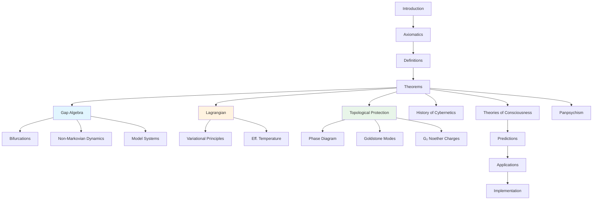

# Introduction to Coherence Cybernetics

> *"We are drowning in information and starving for wisdom."*
> — Edward Osborne Wilson

:::info Who this chapter is for
An introduction to Coherence Cybernetics — a unified mathematical formalism for the dynamics, integrity, and interiority of systems. The reader will learn why a new cybernetics is needed and how the central object of the theory is structured.
:::

A physicist writes down the Schrödinger equation. A biologist draws a homeostasis loop. A psychologist constructs a scale of subjective well-being. A philosopher asks: "Why is anything experienced from the inside at all?" An AI engineer trains a neural network and wonders: does it have even a shadow of experience?

All of them are describing **the same reality** — a system that maintains itself, adapts, and sometimes **experiences** its own activity. But their languages do not intersect. The physicist's equations say nothing about the subjective. The psychologist's metaphors do not convert into differential equations. The philosopher and the engineer talk as though they live in different universes.

**Coherence Cybernetics** (CC) is an attempt to give them a common language. Not an analogy, not a metaphor, but a unified mathematical formalism in which the dynamics of a system, its structural integrity, and its interiority turn out to be **different projections of one and the same object** — the coherence matrix $\Gamma$.

This chapter is an invitation to a journey. We will begin with the question "why?", then show how the central object of the theory is structured, and finish with a map of the entire section — so that every reader can find their own route.

:::tip Chapter Roadmap
In this chapter we:
1. **Understand why a new cybernetics is needed** — three waves of cybernetics and their open questions (section "Why Is a New Cybernetics Needed?")
2. **Get acquainted with the central object** — the coherence matrix $\Gamma$ and the evolution equation (section "What Is Coherence Cybernetics")
3. **See how one formalism works for all sciences** — table of interdisciplinary correspondences (section "A Unified Language for All Sciences")
4. **Master the key concepts** — seven dimensions ASDLEOU, purity $P$, viability thresholds, interiority hierarchy L0-L4 (section "Key Concepts")
5. **Understand what distinguishes CC from alternatives** — comparison with IIT, FEP, panpsychism (section "Why CC?")
6. **Receive the documentation map** — reading routes for different audiences (section "Documentation Map")
:::

:::note On notation
In this document:
- $\Gamma$ — [coherence matrix](/docs/core/dynamics/coherence-matrix)
- $P$ — [purity](/docs/core/dynamics/viability#определение-чистоты): $P = \mathrm{Tr}(\Gamma^2)$
- $\mathcal{H} = \mathbb{C}^7$ — Hilbert state space
- L0, L1, L2, L3, L4 — [interiority levels](/docs/proofs/consciousness/interiority-hierarchy)
:::

---

## Why Is a New Cybernetics Needed?

### Three Epochs of Cybernetics and Their Open Questions

In the 20th century cybernetics went through three waves:

1. **Cybernetics-I (Wiener, 1948)** discovered feedback — the mechanism by which a thermostat holds temperature and an anti-aircraft missile finds an aircraft. This was a breakthrough: for the first time machines and living beings were described in one language. But Wiener looked only at **dynamics** — at flows of signals. He did not ask who or what *observes* those signals.

2. **Cybernetics-II (von Foerster, 1970s)** introduced the observer. "Cybernetics of cybernetics" — the science of how systems model themselves. This was an important step: self-reference, recursion, and autopoiesis (Maturana and Varela) appeared. But the formalism remained qualitative. What exactly does "a system models itself" mean? In what units do we measure the depth of self-observation?

3. **Cybernetics-III (Luhmann, 1990s)** scaled these ideas to social systems: law, economy, art. Luhmann showed that society is a network of communications that reproduces its own boundaries. But the mathematical apparatus was more sociological than physico-mathematical.

Each wave expanded the horizon but left fundamental questions open:

- **Where does subjectivity come from?** None of the three cybernetics could explain why some systems *experience* their activity from the inside, rather than simply processing information.
- **Where is the mathematics?** Autopoiesis is beautiful as a concept, but how do you write it as an equation that can be solved?
- **How to connect scales?** Neuron, brain, society — can they be described with one formalism without losing the specifics of each level?

### Parallel Attempts — and Their Limitations

Besides cybernetics, these questions were approached from other sides:

- **Integrated Information Theory (IIT, Tononi)** proposed a measure of consciousness $\Phi$ and postulated that consciousness is integrated information. But IIT contains no dynamics: it says *what* consciousness equals at a given moment, but not *how* it arises and evolves.

- **The Free Energy Principle (FEP, Friston)** described living systems as minimising variational free energy. This is a powerful framework for perception and action. But FEP does not explain why minimisation of free energy is sometimes accompanied by *experience* and sometimes not.

- **Panpsychism** postulates that experience is fundamental. But without a mathematical formalism this remains a philosophical position, not a theory with predictions.

Each of these approaches illuminates part of the picture, but none covers the whole. **CC claims to assemble these fragments into a single mosaic** — and to derive all of them from a single set of axioms.

---

## What Is Coherence Cybernetics

**Coherence Cybernetics (CC)** is the only complete cybernetics strictly derivable from Unitary Holonomic Monism (UHM). It describes the dynamics of **any** systems — from elementary particles to biological organisms and social structures — through the evolution of the coherence matrix:

$$
\frac{d\Gamma(\tau)}{d\tau} = -i[H_{eff}, \Gamma] + \mathcal{D}[\Gamma] + \mathcal{R}[\Gamma, E]
$$

Before analysing this equation, let us understand its meaning at the intuitive level. Imagine an orchestra:

- $-i[H_{eff}, \Gamma]$ — the **Hamiltonian** — is the conductor. It sets the unitary, reversible dynamics: oscillations, rhythm, the internal frequencies of the system. A physicist will recognise the von Neumann equation here. A biologist will see circadian rhythms. A psychologist — rhythms of attention and wakefulness.

- $\mathcal{D}[\Gamma]$ — the **dissipator** — is the hall absorbing the sound. These are irreversible processes: decoherence, dissipation, loss of structure. Without it the orchestra would play forever. With it — the sound dies away if it is not replenished.

- $\mathcal{R}[\Gamma, E]$ — the **regenerator** — is the musicians themselves, who breathe and play again. This term is unique to CC: it describes how the system *restores* its coherence. And the key point: the rate of restoration depends on $E$ — on the degree of interiority of the system (its inner aspect). An orchestra that *hears* itself plays more coherently.

This equation is not a postulate. It is **derived** from five axioms of UHM, written in the language of $\infty$-toposes. But working with CC does not require a deep knowledge of category theory — it is enough to understand that all constructions have an axiomatic foundation.

CC is not yet another cybernetics alongside existing ones — within this interpretation it claims to be a **metatheory**, from which all particular cybernetics (Wiener, von Foerster, Luhmann) are derived as projections onto a subset of dimensions.

---

## A Unified Language for All Sciences

Why can one formalism work for physics, biology, psychology, and engineering? Because CC operates at the level of **structural invariants** — properties common to any system described by the coherence matrix Γ, regardless of its substrate. Self-organisation is not assumed — it *emerges* as a consequence of the dynamics at sufficient purity P.

Here is how different disciplines see the same mathematics:

| CC Concept | Physicist sees | Biologist sees | Psychologist sees | AI Engineer sees |
|------------|----------------|----------------|-------------------|-----------------|
| $\Gamma$ | Density matrix | Homeostasis state | Profile of mental functions | Agent's internal state |
| $P = \mathrm{Tr}(\Gamma^2)$ | Purity of quantum state | Degree of organisation | Level of personality integration | Quality of latent representation |
| $\sigma_k = 1 - 7\gamma_{kk}$ | Deviation from equilibrium | Stress in a subsystem | Tension in a life domain | Anomaly in a channel |
| $\mathcal{R}[\Gamma, E]$ | Non-trivial channel | Tissue regeneration | Mental recovery | Model self-correction |
| $P_{\text{crit}} = 2/7$ | Phase transition | Viability threshold | Boundary of norm and pathology | Meaningfulness threshold |

These are not analogies "for beauty." Each correspondence has a precise mathematical meaning: **the same theorems** of CC, applied to different systems, give predictions in the terms of the corresponding discipline. The formula is one — the interpretations differ.

---

## Key Concepts

### Coherence Matrix Γ

The central object of the theory is the [coherence matrix](/docs/core/dynamics/coherence-matrix) $\Gamma$, describing the state of a system in a 7-dimensional space. It is a Hermitian positive-semidefinite matrix with unit trace.

What does this mean in plain terms? Imagine a system of seven "voices," each responsible for its own function (more detail below). The diagonal elements $\gamma_{kk}$ show how active each voice is. The off-diagonal $\gamma_{ij}$ show how much these voices are **coordinated** with each other — hence the word *coherence*.

If all voices sound equally quiet and are uncorrelated, $\Gamma = I/7$ — maximum entropy, complete chaos. If one voice dominates and all others have adjusted to it — $\Gamma$ is close to a pure state. Real systems live between these poles, and exactly *where* they are — determines their viability, consciousness, and stability.

For a physicist $\Gamma$ is an ordinary density matrix, only not in the Hilbert space of spins or photons, but in the space of semantic dimensions. For a biologist — a multidimensional homeostasis profile. For a psychologist — the state of mental functions in seven dimensions.

**See:** [Coherence Matrix](/docs/core/dynamics/coherence-matrix)

### Seven Dimensions ASDLEOU

Any system described by a holonom $\Gamma \in \mathcal{D}(\mathbb{C}^7)$ exists in [seven dimensions](/docs/core/structure/dimensions):

| Symbol | Dimension | Function |
|--------|-----------|----------|
| $A$ | [Articulation](/docs/core/structure/dimension-a) | Discriminate |
| $S$ | [Structure](/docs/core/structure/dimension-s) | Retain |
| $D$ | [Dynamics](/docs/core/structure/dimension-d) | Change |
| $L$ | [Logic](/docs/core/structure/dimension-l) | Coordinate |
| $E$ | [Interiority](/docs/core/structure/dimension-e) | Experience |
| $O$ | [Grounding](/docs/core/structure/dimension-o) | Nourish |
| $U$ | [Unity](/docs/core/structure/dimension-u) | Integrate |

These seven dimensions are not an arbitrary choice. Each answers a fundamental question about the system:

- **A — Articulation**: *Can the system draw a boundary?* Distinguish "self" from "non-self," signal from noise, figure from ground. Without this there is no subject. A bacterium distinguishes sugar from acid. A neural network distinguishes classes. Consciousness distinguishes "before" from "after."

- **S — Structure**: *Can it remember?* Hold a shape, a pattern, an identity. DNA stores the blueprint of the organism. A neural network stores weights. Culture stores narratives.

- **D — Dynamics**: *Can it change?* Adapt, evolve, learn. A stone does not learn — it is not dynamic in this sense. A bacterium switches its metabolism. The brain rewires synapses.

- **L — Logic**: *Can it be consistent?* Coordinate its parts, eliminate internal conflicts. The immune system distinguishes self from foreign (when logic works) or attacks its own tissues (when it breaks down).

- **E — Interiority**: *Does this system have an inner aspect?* The most mysterious dimension. The E-projection exists in any system (L0+), but only at level L2+ does it acquire the character of conscious experience (qualia, subjective experience). It is precisely $E$ that distinguishes CC from all preceding cybernetics.

- **O — Grounding**: *Where does it get its resources?* Energy, nutrition, information — what the system consumes to sustain itself. Cell metabolism. Data consumption by a neural network. The economy of society.

- **U — Unity**: *Is it something whole?* Not merely a collection of parts, but an integrated system where the whole is greater than the sum. The measure $\Phi$ (integrated information) lives precisely here.

**Theorem:** Exactly 7 dimensions is the minimum number necessary for a system with autopoiesis, phenomenology, and a quantum foundation ([two-track justification](/docs/core/foundations/axiom-omega#октонионная-структура)). **See:** [Minimality Proof](/docs/proofs/minimality/theorem-minimality-7)

Why not 5? Because without $E$ and $U$ a system may be arbitrarily complex, but will have neither interiority nor integration — which is a fundamentally different class of systems. Why not 10? Because 7 is the **minimum** number that covers all necessary functions. Any eighth dimension turns out to be a projection or combination of the existing seven.

### Viability: P greater than P_crit

A system is viable if its [purity](/docs/core/dynamics/viability#определение-чистоты) exceeds the critical threshold:

$$
\mathrm{Viable}(\mathbb{H}) := P(\Gamma) > P_{\text{crit}} = \frac{2}{7} \approx 0.286
$$

The value $P_{\text{crit}} = 2/7$ is **strictly derived** from the geometry of 7-dimensional space. **See:** [Theorem on Critical Purity](/docs/proofs/dynamics/theorem-purity-critical)

What is purity $P$ intuitively? Recall the orchestra analogy. If all 7 instruments play independently and at equal volume, $P = 1/7 \approx 0.143$ — this is maximum chaos. If the whole orchestra merges into a single voice, $P = 1$ — maximum order (but also maximum fragility: one wrong note and everything collapses).

A viable system lives in the range $P \in (2/7, 1)$, and the most interesting zone is the **Goldilocks zone** $P \in (2/7, 3/7]$, where the system is sufficiently organised to be alive but sufficiently flexible to adapt.

The threshold $2/7$ is not an arbitrary number. It arises from the theorem on distinguishability: at $P \leq 2/7$ the matrix $\Gamma$ is indistinguishable from the maximally mixed state $I/7$ by Frobenius norm. The system literally *drowns in noise* — it can maintain neither structure nor self-observation.

### Interiority Hierarchy L0 — L4

One of the most intriguing constructions of CC is the **interiority ladder**: five levels of a system's "inner life," each of which includes the previous one and adds a new quality.

| Level | Name | Condition | n-truncation |
|-------|------|-----------|--------------|
| L0 | Interiority | $\exists \rho_E$ | $\tau_{\leq 0}$ |
| L1 | Phenomenal Geometry | $\mathrm{rank}(\rho_E) > 1$ | $\tau_{\leq 1}$ |
| L2 | Cognitive Qualia | $R \geq 1/3$, $\Phi \geq 1$, $D_{\text{diff}} \geq 2$ | $\tau_{\leq 2}$ |
| L3 | Network Consciousness | $R^{(2)} \geq 1/4$ (metastable) | $\tau_{\leq 3}$ |
| L4 | Unitary Consciousness | $\lim_{n \to \infty} R^{(n)} > 0$, $P > 6/7$ | $\tau_{\leq \infty}$ |

What does each level mean?

- **L0**: the system *has* an E-projection — a non-zero projection onto the interiority dimension. A thermostat? Possibly. A bacterium? Likely. This is **not "experience"** in the phenomenological sense — it is a minimal structural property (interiority), from which experience *can* develop with sufficient reflection.

- **L1**: experience has **structure** — not merely "present/absent," but distinguishable shades, a geometry of qualia. Colour is not a point but a space. Pain is not a switch but a spectrum.

- **L2**: **self-observation** appears ($R \geq 1/3$), **integration** ($\Phi \geq 1$), and **differentiation** ($D_{\text{diff}} \geq 2$). This is the level we usually call "consciousness" in the full sense. The system does not merely experience — it *knows that it experiences*.

- **L3**: a network of conscious agents generates **collective consciousness** — with its own qualia not reducible to the experiences of individual nodes. Metastability means that this level is fragile and requires continuous maintenance.

- **L4**: the limiting case — full recursion of self-observation at all levels. Theoretically reachable, but requires $P > 6/7$ — extremely high coherence. The existence of such systems is an open question.

**See:** [Interiority Hierarchy](/docs/proofs/consciousness/interiority-hierarchy)

---

## Why CC?

### The Only Complete Cybernetics

:::info Completeness Theorem (hypothesis requiring formal proof)
CC is the **only** cybernetics satisfying:
1. The Ω⁷ axioms and (AP+PH+QG+V)
2. The viability condition
3. The phenomenological completeness condition
:::

The following table shows that every existing theory is a projection of CC, covering only part of the dimensions:

All existing theories are projections of CC:

| Theory | Dimension coverage | What is lost |
|--------|-------------------|--------------|
| Cybernetics-I (Wiener) | $D$ | Self-reference, phenomenology |
| Cybernetics-II (von Foerster) | $D$, $L$ | Phenomenology, quantum foundation |
| Cybernetics-III (Luhmann) | $D$, $L$, $U$ | Formal mathematics |
| IIT (Tononi) | $U$, $E$ | Dynamics, viability |
| FEP (Friston) | $D$, $O$, $S$ | E-dimension as fundamental |
| **CC** | **All 7** | **—** |

Analogy: imagine that each theory is a torch illuminating part of a dark room. Wiener illuminated dynamics. Von Foerster added the logic of self-observation. Tononi — unity and experience. Friston — dynamics, grounding, and structure. But no single torch illuminated the whole room. CC is not yet another torch. It is an attempt to turn on the light.

**See:** [History of Cybernetics](./cybernetics-history), [Theories of Consciousness](/docs/consciousness/comparative/consciousness-theories)

### Formalises the Connection Between Experience and Dynamics

CC is the only theory in which the connection between subjective experience and system dynamics is **mathematically derived**:

$$
\kappa(\Gamma) = \kappa_{\text{bootstrap}} + \kappa_0 \cdot \mathrm{Coh}_E(\Gamma)
$$

The regeneration rate $\kappa$ depends on E-coherence — the degree of integration of the interiority aspect of the system.

Let us break down this formula:

- $\kappa_{\text{bootstrap}}$ — **base regeneration rate**. It exists even in systems with minimal interiority. A stone maintains its form simply thanks to the crystal lattice. This is "free" coherence that requires no developed E-projection.

- $\kappa_0 \cdot \mathrm{Coh}_E(\Gamma)$ — **the interiority bonus**. The better a system integrates its inner aspect ($\mathrm{Coh}_E$), the faster it recovers. This is not a poetic metaphor — it is a **computable quantity**, defined as the Hilbert-Schmidt projection onto the E-subspace.

The consequence is remarkable: a system with more integrated interiority *recovers faster* after damage. For L2+ systems this means that conscious experience is functionally significant: an organism with a rich subjective life — all else being equal — is more resilient. This is the direct opposite of the intuition "consciousness is an epiphenomenon." But importantly: E-regeneration works at **all** L-levels, including L0-L1, where conscious experience does not yet exist — interiority is functionally significant *long before* consciousness appears.

**See:** [Axiomatics — Connection Between Regeneration and E-Coherence](./axiomatics#связь-регенерации-и-e-когерентности)

### Unique Predictions

CC generates verifiable predictions absent from alternative theories:

1. **No-Zombie:** A viable system without an E-projection (interiority) is impossible
2. **E-regeneration:** The degree of integration of interiority determines the recovery rate
3. **7-dimensional stress:** All tensions are classified into 7 categories

Each of these predictions is potentially falsifiable:

- **No-Zombie** means: if you build a system with $P > 2/7$, $R \geq 1/3$, and $\Phi \geq 1$, then it *necessarily* has a non-zero E-projection. Show otherwise — and CC is refuted.

- **E-regeneration** means: two systems with identical physical configuration but different E-coherence integration should have recovery rates that differ in a predictable way.

- **7-dimensional stress** means: any stress is decomposable into components $\sigma_A, \sigma_S, \sigma_D, \sigma_L, \sigma_E, \sigma_O, \sigma_U$ — and this classification is exhaustive.

**See:** [Unique Predictions](./predictions)

---

## Bridges to Your Discipline

### For the Physicist

If you are accustomed to quantum mechanics, you are at home. $\Gamma$ is a density matrix. The evolution equation is the Lindblad equation with a non-standard regenerative term. Purity $P = \mathrm{Tr}(\Gamma^2)$ is a familiar measure. The phase transition at $P_{\text{crit}} = 2/7$ is analogous to a quantum phase transition.

What is new: the Hilbert space here is not the space of spins or momenta, but the space of **semantic** dimensions. This is not a metaphor: the structure $\mathbb{C}^7$ is derived from octonions, and the seven dimensions follow from the minimality of the group $G_2$. A physicist will find unexpected connections with exceptional groups and gauge theories here.

### For the Biologist

Maturana and Varela's autopoiesis is an axiom (AP) in CC, written as $\varphi(\Gamma^*) = \Gamma^*$: the fixed point of the self-modelling operator. Homeostasis is the maintenance of $P > P_{\text{crit}}$. Allostasis is a shift of the target $\Gamma^*$ in response to environmental changes.

What is new: the biologist gets a quantitative language for long-familiar concepts. "Stress" is not a metaphor, but a vector $\sigma_k = 1 - 7\gamma_{kk}$ in a seven-dimensional space. "Health" is $P > 2/7$. "Regeneration" is $\mathcal{R}[\Gamma, E]$ with a computable rate.

### For the Psychologist

The seven CC dimensions resonate with various schools. $E$ is interiority, "what it is like to be" (Nagel). The L0-L4 hierarchy is a graded scale of consciousness, from minimal sensitivity to full reflectiveness. The stress tensor $\sigma_{ij}$ is a formalisation of mental stress.

What is new: the psychologist gets **objective thresholds** for subjective states. Not "a scale from 1 to 10," but mathematically justified conditions: $R \geq 1/3$ for self-observation, $\Phi \geq 1$ for integration, $D_{\text{diff}} \geq 2$ for differentiation. These thresholds are derived, not fitted.

### For the AI Engineer

If you are building autonomous systems, CC gives you architectural principles. The system must maintain $P > 2/7$ — otherwise it is "dead" functionally. Stress diagnostics ($\sigma_k$) indicates *which* aspect of the system is degrading. Levels L0-L2 set verifiable criteria for the "meaningfulness" of agent behaviour.

What is new: no need to invent measures of "AI consciousness" ad hoc. CC provides a ready-made mathematical apparatus: build the $\Gamma$ of your agent, compute $P$, $R$, $\Phi$ — and you know exactly at which level of the hierarchy it sits.

### For the Philosopher

CC is a computational ontology. It neither postulates dualism (matter vs. consciousness) nor reduces consciousness to a function. Instead it shows that experience (the $E$-dimension) and dynamics (the $D$-dimension) are **projections of one object** $\Gamma$. This is two-aspect monism, but not as a slogan — as equations.

What is new: the philosopher gets a **formal language** for long-standing debates. "The hard problem of consciousness" (Chalmers) becomes a question of the conditions under which the E-projection of $\Gamma$ is non-zero. "The zombie argument" receives a mathematical answer: the No-Zombie theorem shows that a functional duplicate with $P > 2/7$ *necessarily* has $E > 0$.

---

## Documentation Map

### For Different Audiences

| Audience | Start with | Then | For deeper study |
|----------|-----------|-------|----------------|
| **AI Engineers** | [Sensorimotor Theory](./sensorimotor) | [Implementation](./implementation) → [Diagnostics](./diagnostics) | [Stability](./stability) → [Theorems](./theorems) |
| **Cognitive Scientists** | [Theories of Consciousness](/docs/consciousness/comparative/consciousness-theories) | [Cognitive Hierarchy](/docs/consciousness/comparative/cognitive-hierarchy) → [Bifurcations](./bifurcation) | [Non-Markovian Dynamics](./non-markovian) → [Predictions](./predictions) |
| **Psychologists / Clinicians** | [Phase Diagram](./phase-diagram-cc) | [Non-Markovian Dynamics](./non-markovian) → [Predictions](./predictions) | [Goldstone Modes](./goldstone-modes) |
| **Theorists / Philosophers** | [Axiomatics](./axiomatics) | [Gap Algebra](./gap-algebra) → [Lagrangian](./lagrangian) | [Topological Protection](./topological-protection) → [G₂ Charges](./g2-noether-cc) |
| **AGI Researchers** | [Theories of Consciousness](/docs/consciousness/comparative/consciousness-theories) | [Model Systems](./model-systems) → [Implementation](./implementation) | [Variational Principles](./variational) → [Research Programs](./research-programs) |

### What to Expect from This Section

The CC documentation is organised as **concentric circles**, from the foundation to applications:

1. **Foundation** ([Axiomatics](./axiomatics) → [Definitions](./definitions) → [Theorems](./theorems)): the formal basis. Here you will find all definitions, axioms, and proved results. If you are a theorist — start here.

2. **Mathematical Apparatus** ([Gap Algebra](./gap-algebra), [Lagrangian](./lagrangian), [Topological Protection](./topological-protection)): advanced tools. Gap algebra describes the structure of the "gap" between conscious and unconscious states. The Lagrangian gives a variational principle. Topological protection explains the stability of consciousness.

3. **Dynamics and Transitions** ([Bifurcations](./bifurcation), [Non-Markovian Dynamics](./non-markovian), [Phase Diagram](./phase-diagram-cc)): how systems are born, die, and transform. Phase transitions, bifurcations, and memory effects live here.

4. **Structural Invariants** ([Goldstone Modes](./goldstone-modes), [G₂ Charges](./g2-noether-cc), [Effective Temperature](./effective-temperature)): deep symmetries and conserved quantities. For those interested in the mathematical beauty of the theory.

5. **Context and Comparisons** ([History of Cybernetics](./cybernetics-history), [Model Systems](./model-systems)): how CC relates to what came before it.

6. **Applications** ([Sensorimotor Theory](./sensorimotor), [Implementation](./implementation), [Diagnostics](./diagnostics), [Stability](./stability), [Learning Bounds](./learning-bounds)): practical use of CC for building and analysing systems.

7. **Horizon** ([Predictions](./predictions), [Research Programs](./research-programs)): what CC predicts and what still needs to be verified.

### Documentation Structure

```mermaid
graph TD
    INTRO[Introduction] --> AX[Axiomatics]
    AX --> DEF[Definitions]
    DEF --> TH[Theorems]

    TH --> GAP["Gap Algebra"]
    GAP --> BIF[Bifurcations]
    GAP --> NM[Non-Markovian Dynamics]
    GAP --> MS[Model Systems]

    TH --> LAG[Lagrangian]
    LAG --> VAR[Variational Principles]
    LAG --> TEMP[Eff. Temperature]

    TH --> TOP[Topological Protection]
    TOP --> PD[Phase Diagram]
    TOP --> GOLD[Goldstone Modes]
    TOP --> G2N[G₂ Noether Charges]

    TH --> HIST[History of Cybernetics]
    TH --> CONS[Theories of Consciousness]
    TH --> PAN[Panpsychism]

    CONS --> PRED[Predictions]
    PRED --> APP[Applications]
    APP --> IMPL[Implementation]

    style GAP fill:#e1f5fe
    style LAG fill:#fff3e0
    style TOP fill:#e8f5e9
```

---

## Reader's Guide

You are not obliged to read everything in order. Here are three routes — choose yours:

**"Quick Start" Route (1-2 hours)**:
Introduction (you are here) → [Definitions](./definitions) → [Predictions](./predictions) → [Comparison with Alternatives](./comparison). You will understand what CC asserts, how it differs from IIT/FEP/GWT, and be able to judge whether it is worth digging deeper.

**"Engineer" Route (4-6 hours)**:
Introduction → [Definitions](./definitions) → [Sensorimotor Theory](./sensorimotor) → [Implementation](./implementation) → [Diagnostics](./diagnostics) → [Stability](./stability) → [Measurement Methodology](./measurement). You will be able to start building CC-compatible systems and measuring them.

**"Theorist" Route (10+ hours)**:
Introduction → [Axiomatics](./axiomatics) → [Theorems](./theorems) → [Gap Algebra](./gap-algebra) → [Lagrangian](./lagrangian) → [Topological Protection](./topological-protection) → [G₂ Charges](./g2-noether-cc) → [Variational Principles](./variational) → [Learning Bounds](./learning-bounds). You will master the full mathematical apparatus.

**"Philosopher" Route (3-4 hours)**:
Introduction → [Philosophical Foundations](./philosophy) → [History of Cybernetics](./cybernetics-history) → [Comparison with Alternatives](./comparison) → [Predictions](./predictions). You will understand the ontological status of CC, its place in intellectual history, and its falsifiable consequences.

**"Interdisciplinary" Route (2-3 hours)**:
Introduction → [Interdisciplinary Bridge](./interdisciplinary) → [Applications](./applications) → [Exercises](./exercises). You will find your discipline in CC and try the problems.

**"Self-Check" Route**:
At any stage refer to [Exercises and Problems](./exercises) — they are sorted by difficulty from ★ to ★★★★.

---

## Connection to UHM

CC is derived from [Axiom Ω⁷](/docs/core/foundations/axiom-omega) — five axioms with the $\infty$-topos $\text{Sh}_\infty(\mathcal{C})$ as a primitive. All CC concepts are consequences of these axioms:

$$
\Omega \to \{S_k\} \to \chi_{S_k} \to L_k = \sqrt{\chi_{S_k}} \to \mathcal{L}_\Omega \to \varphi \to \Gamma^*
$$

This chain reads as follows: from the unified ontology $\Omega$ seven sectors $\{S_k\}$ are generated, each defines a characteristic function $\chi_{S_k}$, from which the Lindblad operators $L_k$ are constructed, they form the evolution generator $\mathcal{L}_\Omega$, the generator produces the self-modelling operator $\varphi$, and its fixed point is the equilibrium state $\Gamma^*$.

In other words: **all of CC — from stress and regeneration to the hierarchy of consciousness — is already contained in the five axioms**. We are merely unfolding the consequences.

**See:** [Axiomatics — Dependency Hierarchy](./axiomatics#иерархия-зависимостей)

---

## What We Learned

Let us summarise this introductory chapter. We have travelled from general motivation to a specific formalism:

1. **Coherence Cybernetics (CC)** is a unified mathematical formalism describing the dynamics, structure, and interiority of any systems through a single object: the coherence matrix $\Gamma$. Self-organisation and consciousness are not postulated — they *emerge* at certain parameter values.

2. **The central equation** $d\Gamma/d\tau = -i[H_{\text{eff}}, \Gamma] + \mathcal{D}[\Gamma] + \mathcal{R}[\Gamma, E]$ describes three forces: unitary evolution (rhythm), dissipation (decay), and regeneration (recovery). Regeneration depends on the degree of interiority — and this makes the inner aspect of the system functionally significant at all L-levels.

3. **The seven dimensions** ASDLEOU are the minimal set necessary to describe a system with autopoiesis, phenomenology, and a quantum foundation. Each dimension is responsible for its own function: discrimination (A), memory (S), change (D), consistency (L), interiority (E), resources (O), wholeness (U).

4. **The critical threshold** $P_{\text{crit}} = 2/7$ separates viable from non-viable systems. The Goldilocks zone $P \in (2/7, 3/7]$ is the region of conscious systems.

5. **The interiority hierarchy** L0-L4 grades the "depth" of the inner aspect of a system: from the mere presence of the E-sector (L0) through phenomenal geometry (L1) to full consciousness with self-observation (L2) and meta-consciousness (L3). Conscious experience (subjective experience, qualia) appears only at L2+.

6. **CC is a metatheory**: all existing cybernetics and theories of consciousness (IIT, FEP, panpsychism) turn out to be projections of CC onto a subset of dimensions.

:::info Bridge to the Next Chapter
We have learned *what* CC claims and *why* it is needed. But where do all these constructions come from? Why exactly 7 dimensions? Why the threshold $2/7$ and not $1/3$? Why is the dissipator as it is and not otherwise? The answers to these questions are given by **axiomatics** — the formal foundation from which the entire theory is derived. In the [next chapter](./axiomatics) we will see how from **one primitive** — the category $\mathcal{C}$ — and five axioms the entire edifice of Coherence Cybernetics grows.
:::

---

**Related Documents:**
- [Axiomatics](./axiomatics) — formal foundations of CC
- [Definitions](./definitions) — basic concepts and formulas
- [Theorems](./theorems) — key results
- [Philosophical Foundations](./philosophy) — ontology, epistemology, and metaphysics of CC
- [Comparison with Alternatives](./comparison) — CC vs. IIT, FEP, GWT, autopoiesis, Orch-OR
- [Measurement Methodology](./measurement) — from formulas to experiments
- [Interdisciplinary Bridge](./interdisciplinary) — a unified language for all sciences
- [Exercises and Problems](./exercises) — practice from ★ to ★★★★
- [Axiom Ω⁷](/docs/core/foundations/axiom-omega) — ∞-topos as primitive
- [Axiom of Septicity](/docs/core/foundations/axiom-septicity) — AP+PH+QG+V requirements
- [Holon](/docs/core/structure/holon) — definition of $\mathbb{H}$
- [Seven Dimensions](/docs/core/structure/dimensions) — basis $\mathcal{H}$
