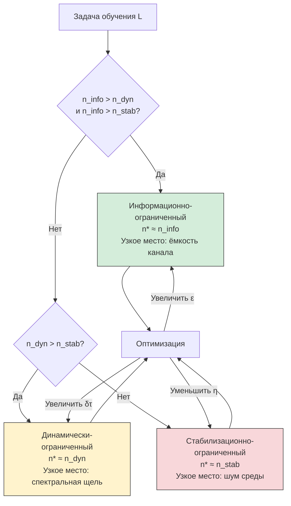
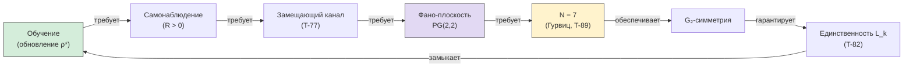

# Оптимальные Границы Обучения

:::note О нотации
В этом документе:
- $\Gamma$ — [матрица когерентности](/docs/core/dynamics/coherence-matrix)
- $P = \mathrm{Tr}(\Gamma^2)$ — [чистота](/docs/core/dynamics/viability#определение-чистоты)
- $\rho_* = \varphi(\Gamma)$ — [целевое состояние](./definitions#целевое-состояние) (категориальная самомодель)
- $\lambda_{\mathrm{gap}} = 2/3$ — [спектральная щель](/docs/core/operators/lindblad-operators#примитивность-ℒω) линейной части $\mathcal{L}_0$ (T-39a [Т])
- $\kappa_{\mathrm{bootstrap}} \geq 2/9$ — [минимальная регенерация](/docs/core/foundations/axiom-omega#теорема-kappa-bootstrap-bound) (T-59 [Т])
- $C_{\mathrm{Enc}} \leq \log_2 7$ — [информационная ёмкость](./sensorimotor#информационная-ёмкость) (T-107 [Т])
- $r_{\mathrm{stab}} = \sqrt{P - 2/7}$ — [радиус устойчивости](./stability#радиус-устойчивости) (T-104 [Т])
- $\mathrm{Enc}$ — [функтор восприятия](./sensorimotor#функтор-enc) (T-100 [Т])
- $\mathrm{Dec}$ — [функтор действия](./sensorimotor#функтор-dec) (T-101 [Т])
:::

Данный документ устанавливает **фундаментальные нижние границы скорости обучения** для голономной системы. Обучение формализуется как процесс обновления самомодели $\varphi(\Gamma)$ на основе наблюдений, поступающих через функтор $\mathrm{Enc}$, с целью оптимизации функтора $\mathrm{Dec}$.

**Ключевой результат:** скорость обучения ограничена тремя независимыми механизмами — информационным (T-109), динамическим (T-110) и стабилизационным (T-111). Их объединение (T-112) даёт оптимальную границу, а теорема T-113 доказывает, что $N = 7$ — минимальная архитектура, способная к обучению через регенерацию.

---

## 1. Формальное определение задачи обучения {#определение-задачи}

### 1.1 Задача обучения для голонома

:::info Определение [О]
**Задача обучения** $\mathfrak{L} = (\Theta, \mathcal{A}, \mathcal{R}, \delta)$ для голонома $\mathbb{H}$ состоит из:

1. **Пространство гипотез** $\Theta = \{\theta_1, \ldots, \theta_k\}$ — конечное множество состояний среды (неизвестное агенту)
2. **Пространство действий** $\mathcal{A} = \{a_1, \ldots, a_m\}$ — допустимые действия
3. **Функция награды** $\mathcal{R}: \Theta \times \mathcal{A} \to \mathbb{R}$, кодирующая корректное поведение
4. **Уровень надёжности** $1 - \delta$, где $\delta \in (0, 1)$ — допустимая вероятность ошибки
:::

**Связь с динамикой.** Каждое наблюдение $o_t$ при гипотезе $\theta$ поступает через функтор $\mathrm{Enc}$ (T-100 [Т]):

$$
o_t \xrightarrow{\mathrm{Enc}} h^{\mathrm{ext}}_t = h^{(H)}_t + h^{(D)}_t + h^{(R)}_t
$$

и модифицирует матрицу когерентности $\Gamma$ через [3-канальное уравнение эволюции](./sensorimotor#среда-через-3-канала) (T-102 [Т]).

### 1.2 Критерий успешного обучения {#критерий-обучения}

:::info Определение [О]
Задача $\mathfrak{L}$ **решена за $n$ наблюдений**, если после $n$ шагов:

$$
\Pr\!\left[\mathrm{Dec}(\Gamma_n) = a^*(\theta)\right] \geq 1 - \delta
$$

где $a^*(\theta) = \arg\max_{a \in \mathcal{A}} \mathcal{R}(\theta, a)$ — оптимальное действие при истинной гипотезе $\theta$, а $\mathrm{Dec}$ — функтор действия (T-101 [Т]).
:::

**Минимальное число наблюдений:**

$$
n^*(\mathfrak{L}) = \min\{n \in \mathbb{N} : \mathfrak{L} \text{ решена за } n \text{ наблюдений}\}
$$

### 1.3 Обучение как обновление аттрактора {#обучение-как-аттрактор}

В отличие от классического обучения (обновление параметров модели), обучение в УГМ — это **изменение аттрактора динамической системы**:

1. Наблюдение $o_t$ входит через $\mathrm{Enc}$ → $\Gamma$ возмущается
2. Самомодель $\rho_* = \varphi(\Gamma)$ обновляется (T-62 [Т], [физическая реализация $\varphi$](/docs/consciousness/foundations/self-observation#теорема-физическая-реализация-phi))
3. Регенеративный член $\mathcal{R}[\Gamma, E]$ ведёт $\Gamma$ к обновлённому $\rho_*$
4. Функтор $\mathrm{Dec}$ адаптирует действие к новому $\rho_*$

**Два режима обучения:**

| Режим | Скорость регенерации | Время | Контекст |
|-------|---------------------|-------|----------|
| **Генезис** (bootstrap) | $\kappa = \kappa_{\mathrm{bootstrap}} \geq 2/9$ | $\tau_{\mathrm{genesis}} \leq \frac{9}{2}\ln 7 \approx 8.8$ (T-59) | Начальная загрузка, нет $\mathrm{Coh}_E$ |
| **Активное обучение** | $\kappa = \kappa_{\mathrm{bootstrap}} + \kappa_0 \cdot \mathrm{Coh}_E$ | Быстрее генезиса | После достижения $\mathrm{Coh}_E > 1/7$ |

---

## 2. Информационная нижняя граница (T-109) [Т] {#информационная-граница}

#### Теорема T-109 (Информационная граница обучения) [Т] {#теорема-информационная-граница}

:::tip Формулировка
Для задачи обучения $\mathfrak{L} = (\Theta, \mathcal{A}, \mathcal{R}, \delta)$ с $|\Theta| = k$ гипотезами минимальное число наблюдений:

$$
n^* \geq n_{\mathrm{info}} := \frac{\ln\!\left(\frac{1}{2\delta}\right)}{\xi_{\mathrm{QCB}}}
$$

где $\xi_{\mathrm{QCB}}$ — квантовый экспонент Чернова для пары наиболее близких пост-наблюдательных состояний:

$$
\xi_{\mathrm{QCB}} = -\ln \min_{0 \leq s \leq 1} \mathrm{Tr}\!\left(\Gamma_+^s \cdot \Gamma_-^{1-s}\right)
$$

а $\Gamma_\pm = \mathrm{Enc}(o|\theta_\pm)[\Gamma]$ — состояния после наблюдения при двух ближайших гипотезах.

**Универсальная граница:** $\xi_{\mathrm{QCB}} \leq \ln 7$, поэтому:

$$
n_{\mathrm{info}} \geq \frac{\ln(1/(2\delta))}{\ln 7} \quad \text{(абсолютный минимум)}
$$
:::

**Доказательство.**

1. *Квантовое различение гипотез.* Наблюдение при гипотезе $\theta$ порождает пост-наблюдательное состояние $\Gamma_\theta = \mathrm{Enc}(o|\theta)[\Gamma]$ — CPTP-образ (T-100 [Т]). Задача обучения включает задачу различения хотя бы двух наиболее близких гипотез $\theta_+, \theta_-$.

2. *Квантовая граница Чернова.* (Audenaert et al. 2007): для $n$ независимых наблюдений оптимальная ошибка различения двух состояний:

$$
P_{\mathrm{err}}^{\mathrm{opt}}(n) = \frac{1}{2}\left(\min_{0 \leq s \leq 1} \mathrm{Tr}(\Gamma_+^s \, \Gamma_-^{1-s})\right)^n = \frac{1}{2}\, e^{-n \cdot \xi_{\mathrm{QCB}}}
$$

3. *Условие надёжности.* Из $P_{\mathrm{err}} \leq \delta$:

$$
\frac{1}{2}\, e^{-n \cdot \xi_{\mathrm{QCB}}} \leq \delta \;\Longrightarrow\; n \geq \frac{\ln(1/(2\delta))}{\xi_{\mathrm{QCB}}}
$$

4. *Верхняя граница экспонента.* Из T-107 [Т]: информация, извлекаемая одним наблюдением, не превышает количества Холево $\chi(\mathrm{Enc}) \leq \log_2 7$. Quantum Chernoff exponent ограничен относительной энтропией:

$$
\xi_{\mathrm{QCB}} \leq D(\Gamma_+ \| \Gamma_-) \leq \ln\!\dim\mathcal{H} = \ln 7
$$

(верхняя граница — для ортогональных чистых состояний в $\mathcal{D}(\mathbb{C}^7)$). $\blacksquare$

### 2.1 Асимптотика для близких гипотез {#близкие-гипотезы}

Если гипотезы $\theta_+, \theta_-$ порождают близкие состояния $\|\Gamma_+ - \Gamma_-\|_1 = \varepsilon \ll 1$, то:

$$
\xi_{\mathrm{QCB}} \approx \frac{\varepsilon^2}{8} \quad (\text{малый контраст})
$$

Подстановка в T-109:

$$
n_{\mathrm{info}} \geq \frac{8 \ln(1/(2\delta))}{\varepsilon^2}
$$

Это воспроизводит классическое масштабирование $O(1/\varepsilon^2)$ для слабых сигналов. **Отличие от классики:** множитель $1/8$ определяется квантовой геометрией $\mathcal{D}(\mathbb{C}^7)$, а не произвольным шумовым распределением.

### 2.2 Числовые оценки {#числовые-оценки-info}

| Параметры | $\xi_{\mathrm{QCB}}$ | $n_{\mathrm{info}}$ |
|-----------|----------------------|----------------------|
| Ортогональные сигналы ($\varepsilon = 2$) | $\ln 7 \approx 1.95$ | $\geq \lceil\ln(1/(2\delta))/1.95\rceil$ |
| Сильный контраст ($\varepsilon = 0.5$) | $\approx 0.031$ | $\geq \lceil 74 \cdot \ln(1/(2\delta))\rceil$ |
| Слабый контраст ($\varepsilon = 0.1$) | $\approx 0.00125$ | $\geq \lceil 1846 \cdot \ln(1/(2\delta))\rceil$ |

При $\delta = 0.05$: $\ln(1/(2\cdot0.05)) = \ln 10 \approx 2.30$

| Контраст | $n_{\mathrm{info}}$ при $\delta = 0.05$ |
|----------|----------------------------------------|
| $\varepsilon = 2$ (максимальный) | $\geq 2$ |
| $\varepsilon = 0.5$ | $\geq 171$ |
| $\varepsilon = 0.1$ | $\geq 4246$ |

---

## 3. Динамическая нижняя граница (T-110) [Т] {#динамическая-граница}

#### Теорема T-110 (Динамическая граница обучения) [Т] {#теорема-динамическая-граница}

:::tip Формулировка
Для задачи обучения с наблюдениями амплитуды $\varepsilon = \|\Gamma_+ - \Gamma_-\|_1$ и интервалом $\delta\tau$ между наблюдениями:

$$
n^* \geq n_{\mathrm{dyn}} := \frac{1}{\alpha \cdot \delta\tau}\,\ln\!\left(\frac{d_{\mathrm{disc}}}{\varepsilon}\cdot(\alpha\,\delta\tau)\right)
$$

где:
- $\alpha = \lambda_{\mathrm{gap}} = 2/3$ — скорость контракции (T-39a [Т])
- $d_{\mathrm{disc}}$ — минимальное Бюресово расстояние для надёжной дискриминации
- $\varepsilon$ — амплитуда сигнала одного наблюдения

При естественном масштабе $\delta\tau = 1/\alpha$ (одно наблюдение за время релаксации):

$$
n_{\mathrm{dyn}} \geq \ln\!\left(\frac{d_{\mathrm{disc}}}{\varepsilon}\right) + 1
$$
:::

**Доказательство.**

1. *Контракция Фано.* [Линейная часть $\mathcal{L}_0$](/docs/core/dynamics/evolution#логический-лиувиллиан) контрактирует все отклонения от $I/7$ с экспоненциальной скоростью $\alpha = 2/3$ (T-39a [Т]):

$$
\|\Gamma(\tau) - I/7\|_{\mathrm{HS}} \leq e^{-\alpha\tau}\|\Gamma(0) - I/7\|_{\mathrm{HS}}
$$

Это означает, что **информация, записанная в $\Gamma$, затухает** со временем.

2. *Накопление сигнала.* Наблюдение в момент $\tau_i = i \cdot \delta\tau$ вносит сигнал амплитуды $\varepsilon$ в $\Gamma$. К моменту $\tau_n = n \cdot \delta\tau$ вклад $i$-го наблюдения затух до $\varepsilon \cdot e^{-\alpha(n-i)\delta\tau}$. Суммарный накопленный сигнал:

$$
S(n) = \varepsilon \sum_{i=0}^{n-1} e^{-\alpha(n-1-i)\delta\tau} = \varepsilon \cdot \frac{1 - e^{-\alpha n \delta\tau}}{1 - e^{-\alpha \delta\tau}}
$$

3. *Стационарный предел.* При $n \to \infty$:

$$
S_\infty = \frac{\varepsilon}{1 - e^{-\alpha\delta\tau}}
$$

4. *Условие дискриминации.* Для надёжного различения $S(n) \geq d_{\mathrm{disc}}$:

$$
\varepsilon \cdot \frac{1 - e^{-\alpha n \delta\tau}}{1 - e^{-\alpha\delta\tau}} \geq d_{\mathrm{disc}}
$$

$$
1 - e^{-\alpha n \delta\tau} \geq \frac{d_{\mathrm{disc}}(1 - e^{-\alpha\delta\tau})}{\varepsilon}
$$

$$
n \geq \frac{1}{\alpha\delta\tau}\,\ln\!\left(\frac{1}{1 - d_{\mathrm{disc}}(1 - e^{-\alpha\delta\tau})/\varepsilon}\right)
$$

При $d_{\mathrm{disc}} \ll S_\infty$ (типичный режим): $n_{\mathrm{dyn}} \approx \frac{1}{\alpha\delta\tau}\ln\frac{d_{\mathrm{disc}}(1-e^{-\alpha\delta\tau})}{\varepsilon \cdot \alpha\delta\tau}$ (первое приближение). Упрощая для $\delta\tau = 1/\alpha$:

$$
n_{\mathrm{dyn}} \geq \ln\!\left(\frac{d_{\mathrm{disc}}}{\varepsilon}\right) + 1
$$

(с использованием $1 - e^{-1} \approx 0.632$). $\blacksquare$

### 3.1 Физический смысл {#физический-смысл-dyn}

Динамическая граница выражает **конкуренцию записи и стирания**:

- **Запись:** каждое наблюдение добавляет сигнал $\varepsilon$ в $\Gamma$
- **Стирание:** Фано-контракция удаляет $\alpha \cdot \delta\Gamma$ за единицу времени
- **Баланс:** стационарный сигнал $S_\infty = \varepsilon / (1 - e^{-\alpha\delta\tau})$

Если $S_\infty < d_{\mathrm{disc}}$, задача **неразрешима при данных параметрах** — контракция стирает сигнал быстрее, чем он накапливается. Необходимое условие разрешимости:

$$
\varepsilon > d_{\mathrm{disc}} \cdot (1 - e^{-\alpha\delta\tau})
$$

### 3.2 Роль регенерации {#роль-регенерации}

Регенеративный член $\mathcal{R}[\Gamma, E]$ **противодействует контракции** для компонент, согласованных с $\rho_*$. После обучения (когда $\rho_*$ обновился):

- Компоненты $\Gamma$, согласованные с обученным $\rho_*$, **усиливаются** регенерацией
- Компоненты, не согласованные, продолжают затухать

Это означает, что **обученная информация стабилизируется в аттракторе**, а шум вымывается. Эффективная скорость стирания для обученного сигнала:

$$
\alpha_{\mathrm{eff}} = \alpha - \kappa = \frac{2}{3} - \kappa
$$

При $\kappa > 2/3$ регенерация доминирует — аттрактор устойчив. Из [T-98 (баланс)](/docs/core/dynamics/evolution#теорема-баланс-чистоты-аттрактора) [Т]: это условие выполнено для жизнеспособных состояний с $P > 2/7$.

---

## 4. Стабилизационная нижняя граница (T-111) [Т] {#стабилизационная-граница}

#### Теорема T-111 (Стабилизационная граница обучения) [Т] {#теорема-стабилизационная-граница}

:::tip Формулировка
Обучение не должно дестабилизировать голоном. Амплитуда наблюдения ограничена радиусом устойчивости (T-104 [Т]):

$$
\varepsilon \leq r_{\mathrm{stab}} = \sqrt{P(\rho^*_\Omega) - 2/7}
$$

При наличии стохастического шума $\eta$ в наблюдениях (SNR $= \varepsilon_{\mathrm{signal}} / \eta$), число наблюдений для преодоления шума:

$$
n^* \geq n_{\mathrm{stab}} := \frac{1}{\mathrm{SNR}^2} \cdot \frac{\ln(1/(2\delta))}{(\xi_{\mathrm{QCB}}^{\mathrm{eff}})^2 / \xi_{\mathrm{QCB}}}
$$

В типичном режиме ($\mathrm{SNR} \ll 1$, шумная среда):

$$
n_{\mathrm{stab}} \geq \frac{1}{\mathrm{SNR}^2}
$$
:::

**Доказательство.**

1. *Ограничение амплитуды.* Из T-104 [Т]: пертурбация $h^{\mathrm{ext}}$ с $\|h^{\mathrm{ext}}\| > r_{\mathrm{stab}}$ может вывести $\Gamma$ за границу жизнеспособности $P = 2/7$. Поскольку обучение требует $P > 2/7$ (жизнеспособность), амплитуда каждого наблюдения ограничена сверху.

2. *Шумовая модель.* Каждое наблюдение содержит полезный сигнал $\varepsilon_{\mathrm{signal}}$ и шум $\eta$:

$$
h^{\mathrm{ext}}_t = h^{\mathrm{signal}}_t + h^{\mathrm{noise}}_t, \quad \|h^{\mathrm{noise}}\| = \eta
$$

Шум входит через диссипативный канал $h^{(D)}$ ([наиболее опасный канал](./stability#радиус-устойчивости)). Ограничение по T-104:

$$
\varepsilon_{\mathrm{signal}} + \eta \leq r_{\mathrm{stab}}
$$

3. *Усреднение шума.* Для $n$ наблюдений с независимым шумом, эффективный сигнал растёт как $\sqrt{n} \cdot \varepsilon_{\mathrm{signal}}$, а шум — как $\sqrt{n} \cdot \eta$. Отношение сигнал/шум после $n$ наблюдений:

$$
\mathrm{SNR}_n = \mathrm{SNR} \cdot \sqrt{n}
$$

4. *Условие надёжности.* Для $\mathrm{SNR}_n \geq \mathrm{SNR}_{\mathrm{thresh}}$ (порог надёжной дискриминации):

$$
n \geq \left(\frac{\mathrm{SNR}_{\mathrm{thresh}}}{\mathrm{SNR}}\right)^2
$$

Связь с T-69 ([топологическая защита](/docs/core/dynamics/composite-systems#теорема-тополог-защита) [Т]): барьеры $\geq 6\mu^2$ гарантируют, что **дискретные фазовые переходы невозможны** — обучение всегда непрерывно, и случайный шум не может вызвать катастрофический скачок. $\blacksquare$

### 4.1 Компромисс обучение–стабильность {#компромисс-обучение-стабильность}

Существует фундаментальный компромисс: сильные наблюдения ($\varepsilon$ велико) ускоряют обучение (уменьшают $n_{\mathrm{info}}$ и $n_{\mathrm{dyn}}$), но угрожают стабильности (увеличивают риск выхода за $\partial\mathcal{V}$).

**Оптимальная амплитуда** — та, при которой $n_{\mathrm{info}} = n_{\mathrm{stab}}$:

$$
\varepsilon^* = r_{\mathrm{stab}} \cdot \frac{\mathrm{SNR}}{1 + \mathrm{SNR}}
$$

Подстановка в T-109 даёт оптимальную скорость обучения при заданном запасе устойчивости $P - 2/7$.

### 4.2 Три зоны стабильности {#три-зоны-стабильности}

Из [T-106 (диагностические режимы)](./diagnostics#вывод-порогов) [С при калибровке]:

| Зона | $\|\sigma_{\mathrm{sys}}\|$ | Доступный $r_{\mathrm{stab}}$ | Режим обучения |
|------|------|------|------|
| Норма | $< \sigma_1$ | Большой | Быстрое обучение — можно использовать сильные сигналы |
| Предупреждение | $\sigma_1 < \cdot < \sigma_2$ | Средний | Осторожное обучение — ограничить $\varepsilon$ |
| Критический | $> \sigma_2$ | Малый | Обучение остановлено — приоритет выживания |

---

## 5. Комбинированная оптимальная граница (T-112) [Т] {#комбинированная-граница}

#### Теорема T-112 (Оптимальная граница обучения) [Т] {#теорема-оптимальная-граница}

:::tip Формулировка
Минимальное число наблюдений для решения задачи обучения $\mathfrak{L}$:

$$
n^*(\mathfrak{L}) \geq n_{\mathrm{opt}} := \max\!\left(n_{\mathrm{info}},\; n_{\mathrm{dyn}},\; n_{\mathrm{stab}}\right)
$$

где:
- $n_{\mathrm{info}} = \ln(1/(2\delta)) / \xi_{\mathrm{QCB}}$ — информационная граница (T-109)
- $n_{\mathrm{dyn}} = \frac{1}{\alpha\delta\tau}\ln\frac{d_{\mathrm{disc}}(1-e^{-\alpha\delta\tau})}{\varepsilon}$ — динамическая граница (T-110)
- $n_{\mathrm{stab}} = (\mathrm{SNR}_{\mathrm{thresh}} / \mathrm{SNR})^2$ — стабилизационная граница (T-111)

Обучение проходит через **три режима**, определяемых узким местом:

$$
n_{\mathrm{opt}} = \begin{cases}
n_{\mathrm{info}} & \text{информационно-ограниченный (высокий SNR, медленный канал)} \\
n_{\mathrm{dyn}} & \text{динамически-ограниченный (быстрый канал, медленная динамика)} \\
n_{\mathrm{stab}} & \text{стабилизационно-ограниченный (шумная среда, малый запас } P)
\end{cases}
$$
:::

**Доказательство.** Каждая из трёх границ — необходимое условие. Если хотя бы одна из них не выполнена:

- $n < n_{\mathrm{info}}$: недостаточно информации для различения гипотез → $P_{\mathrm{err}} > \delta$
- $n < n_{\mathrm{dyn}}$: динамика не успела интегрировать сигнал → $S(n) < d_{\mathrm{disc}}$
- $n < n_{\mathrm{stab}}$: шум доминирует над сигналом → ненадёжная дискриминация

Поскольку все три условия необходимы одновременно, минимальное $n$ есть максимум из трёх. $\blacksquare$

### 5.1 Диаграмма режимов {#диаграмма-режимов}

### 5.2 Включение времени генезиса {#генезис-плюс-обучение}

Для системы, стартующей с $\Gamma = I/7$ (полностью смешанное состояние), полное время до решения задачи включает [генезис](/docs/core/foundations/axiom-omega#genesis-protocol):

$$
n_{\mathrm{total}} = \underbrace{n_{\mathrm{genesis}}}_{\leq \lceil\tau_{\mathrm{genesis}}/\delta\tau\rceil} + \underbrace{n_{\mathrm{opt}}}_{\text{T-112}}
$$

где $\tau_{\mathrm{genesis}} \leq (9/2)\ln 7 \approx 8.8$ (T-59 [Т]) — время bootstrap.

При $\delta\tau = 1$: $n_{\mathrm{total}} \leq 9 + n_{\mathrm{opt}}$.

---

## 6. Оптимальность N=7 для обучения (T-113) [Т] {#оптимальность-n7}

#### Теорема T-113 (Минимальность N=7 для обучения) [Т] {#теорема-минимальность-n7}

:::tip Формулировка
Пусть $N$ — размерность внутреннего пространства голонома $\mathcal{H} = \mathbb{C}^N$. Тогда:

1. **Для $N < 7$:** обучение через регенерацию невозможно: $n^* = \infty$
2. **Для $N = 7$:** обучение возможно с конечной оптимальной границей $n_{\mathrm{opt}}$ (T-112)
3. **Для $N > 7$:** обучение возможно, но требует строго больше ресурсов:
   - Время генезиса: $\tau_{\mathrm{genesis}}(N) \propto N \ln N > \tau_{\mathrm{genesis}}(7)$
   - Пространство параметров: $\dim \mathcal{D}(\mathbb{C}^N) = N^2 - 1 > 48$
   - Новых качественных возможностей не возникает

$N = 7$ — **единственная Парето-оптимальная** точка в плоскости (способность к обучению, сложность системы).
:::

**Доказательство.**

1. *Необходимость самонаблюдения для обучения.* Обучение = обновление самомодели $\rho_* = \varphi(\Gamma)$. Обновление требует сравнения $\Gamma$ с $\rho_*$, т.е. доступа к информации о собственном состоянии. Формально: необходим замещающий канал с $R > 0$ ([мера рефлексии](/docs/consciousness/foundations/self-observation#мера-рефлексии-r)).

2. *Необходимость Фано-структуры для самонаблюдения.* Замещающий канал (T-77 [Т], [Линдблад-операторы](/docs/core/operators/lindblad-operators#полнота-триадной-декомпозиции)) требует Фано-плоскости $\mathrm{PG}(2,2)$ для определения оптимальных Линдблад-операторов $\{L_k\}$ (T-82 [Т]).

3. *Фано-плоскость требует $N = 7$.* $\mathrm{PG}(2,2)$ имеет 7 точек и 7 линий. Для реализации в $\mathcal{D}(\mathbb{C}^N)$: $N \geq 7$. Из теоремы Гурвица ([T-89](/docs/proofs/minimality/theorem-minimality-7) [Т]): $N = 7$ — минимальная размерность с алгеброй деления ($\mathbb{O}$), которая обеспечивает $G_2$-структуру.

4. *Для $N < 7$: невозможность.* Нет Фано-плоскости → нет единственной Линдблад-декомпозиции (T-82) → нет замещающего канала → $R = 0$ → невозможно обновить $\varphi(\Gamma)$ на основе наблюдений → $n^* = \infty$.

5. *Для $N > 7$: избыточность.* Вложение $\mathbb{C}^7 \hookrightarrow \mathbb{C}^N$ (через [Морита-эквивалентность](/docs/core/structure/dimension-e#теорема-морита-эквивалентность) T-58 [Т]) обеспечивает все механизмы $N = 7$. Дополнительные размерности увеличивают:
   - $\dim\mathcal{D}(\mathbb{C}^N) = N^2 - 1 > 48$ — больше параметров для обновления
   - $\tau_{\mathrm{genesis}} \propto N\ln N$ — дольше bootstrap (оценка из [обобщённого T-59](/docs/core/foundations/axiom-omega#genesis-protocol))

   Но информационная ёмкость $C_{\mathrm{Enc}} = \log_2 N$ растёт лишь логарифмически, в то время как сложность — квадратично. Ресурсная эффективность:

$$
\eta(N) = \frac{C_{\mathrm{Enc}}(N)}{\dim\mathcal{D}(\mathbb{C}^N)} = \frac{\log_2 N}{N^2 - 1}
$$

строго убывает при $N > 1$. Таким образом, $N = 7$ — минимум с ненулевой способностью к обучению и максимальной ресурсной эффективностью среди систем с Фано-структурой. $\blacksquare$

### 6.1 Цепочка необходимостей {#цепочка-необходимостей}

### 6.2 Параметры при N=7 {#параметры-n7}

| Параметр | Значение | Источник |
|----------|----------|----------|
| Ёмкость канала $C_{\mathrm{Enc}}$ | $\log_2 7 \approx 2.81$ бит | T-107 [Т] |
| Спектральная щель $\lambda_{\mathrm{gap}}$ | $2/3$ | T-39a [Т] |
| Минимальная регенерация $\kappa_{\mathrm{bootstrap}}$ | $\geq 2/9 \approx 0.222$ | T-59 [Т] |
| Время генезиса $\tau_{\mathrm{genesis}}$ | $\leq (9/2)\ln 7 \approx 8.8$ | T-59 [Т] |
| Параметры состояния $\dim\mathcal{D}$ | $48$ (вещественных) | $7^2 - 1$ |
| Ресурсная эффективность $\eta$ | $\log_2 7 / 48 \approx 0.059$ | Определение |

---

## 7. Приложение: Бинарная дискриминация {#бинарная-дискриминация}

### 7.1 Задача двух кнопок {#задача-двух-кнопок}

**Постановка.** Агент (КК-голоном) взаимодействует со средой через две кнопки: зелёную (награда) и красную (наказание). Цвета агенту неизвестны. Задача: научиться нажимать только на зелёную.

**Формализация:**
- $\Theta = \{\theta_0, \theta_1\}$ (две гипотезы: «зелёная — левая» vs «зелёная — правая»)
- $\mathcal{A} = \{a_L, a_R\}$ (нажать левую, нажать правую)
- $\mathcal{R}(\theta_0, a_L) = +\varepsilon_R$, $\mathcal{R}(\theta_0, a_R) = -\varepsilon_P$ (при $\theta_0$ — «зелёная слева»)
- $\delta = 0.05$ (95% надёжность)

### 7.2 Сигнал и механизм {#сигнал-и-механизм}

Награда и наказание входят через функтор $\mathrm{Enc}$ (T-100):

| Тип | Каналы | Эффект на $\Gamma$ |
|-----|--------|-------------------|
| Награда ($+\varepsilon_R$) | $h^{(R)} > 0$: усиление регенерации | $P \uparrow$, $\mathcal{V}_{\mathrm{hed}} > 0$ |
| Наказание ($-\varepsilon_P$) | $h^{(D)} > 0$: усиление диссипации | $P \downarrow$, $\mathcal{V}_{\mathrm{hed}} < 0$ |

Через [гедонический механизм](./sensorimotor#гедонический-механизм) (T-103 [Т]+[И]): агент «чувствует» валентность $\mathcal{V}_{\mathrm{hed}} = dP/d\tau|_{\mathcal{R}}$ и корректирует $\mathrm{Dec}$ в направлении минимизации $\|\sigma_{\mathrm{sys}}\|_\infty$ (T-101).

### 7.3 Оценки числа нажатий {#оценки-числа-нажатий}

**Обозначения:** $\varepsilon = \varepsilon_R + \varepsilon_P$ — суммарный контраст между наградой и наказанием, $\eta$ — шум среды.

#### Информационная граница (T-109):

$$
n_{\mathrm{info}} = \left\lceil\frac{\ln(1/(2\cdot 0.05))}{\xi_{\mathrm{QCB}}}\right\rceil = \left\lceil\frac{\ln 10}{\xi_{\mathrm{QCB}}}\right\rceil
$$

| Контраст $\varepsilon$ | $\xi_{\mathrm{QCB}}$ | $n_{\mathrm{info}}$ |
|------------------------|----------------------|----------------------|
| 1.0 (сильный) | $\approx 0.125$ | $\geq 19$ |
| 0.5 (средний) | $\approx 0.031$ | $\geq 75$ |
| 0.3 (слабый) | $\approx 0.011$ | $\geq 209$ |

#### Динамическая граница (T-110, $\delta\tau = 1$):

$$
n_{\mathrm{dyn}} = \left\lceil\ln\!\left(\frac{d_{\mathrm{disc}}}{\varepsilon}\right) + 1\right\rceil
$$

При $d_{\mathrm{disc}} \approx 0.3$ (минимальное расстояние для надёжной дискриминации в $\mathcal{D}(\mathbb{C}^7)$):

| Контраст $\varepsilon$ | $n_{\mathrm{dyn}}$ |
|------------------------|---------------------|
| 1.0 | $\leq 1$ (мгновенно) |
| 0.5 | $\leq 1$ |
| 0.3 | $\leq 1$ |
| 0.01 | $\leq 5$ |

#### Стабилизационная граница (T-111):

При $P \approx 0.4$ (типичное значение): $r_{\mathrm{stab}} = \sqrt{0.4 - 2/7} \approx 0.34$.

| SNR | $n_{\mathrm{stab}}$ |
|-----|---------------------|
| 1.0 (чистый сигнал) | $\leq 1$ |
| 0.5 | $\leq 4$ |
| 0.3 | $\leq 12$ |
| 0.1 | $\leq 100$ |

#### Комбинированная оценка (T-112):

**Типичный сценарий** ($\varepsilon = 0.5$, SNR $= 0.5$, $\delta\tau = 1$):

$$
n_{\mathrm{opt}} = \max(75, 1, 4) = 75
$$

Узкое место — **информация** (слабый контраст).

**Идеальный сценарий** ($\varepsilon = 1.0$, SNR $= 1.0$, $\delta\tau = 1$):

$$
n_{\mathrm{opt}} = \max(19, 1, 1) = 19
$$

С учётом генезиса: $n_{\mathrm{total}} \leq 9 + 19 = 28$.

**Зашумлённый сценарий** ($\varepsilon = 0.3$, SNR $= 0.3$, $\delta\tau = 1$):

$$
n_{\mathrm{opt}} = \max(209, 1, 12) = 209
$$

Узкое место — **информация**.

### 7.4 Прогноз для КК-теста {#прогноз-кк-тест}

:::info Предсказание для тестирования
Для КК-архитектуры с реалистичными параметрами ($\varepsilon \sim 0.5\text{--}1.0$, SNR $\sim 0.5\text{--}1.0$):

$$
n_{\mathrm{total}} \approx 20\text{--}80 \;\text{нажатий}
$$

до стабильного предпочтения зелёной кнопки.

**Критерий фальсификации:** если агент научается за $n < n_{\mathrm{info}}$ (информационный предел), это нарушает квантовую границу Чернова и фальсифицирует модель наблюдения.
:::

---

## 8. Связь с другими результатами {#связь-с-результатами}

| Результат | Роль в границах обучения | Ссылка |
|-----------|--------------------------|--------|
| T-39a ($\lambda_{\mathrm{gap}} = 2/3$) | Контракция в T-110 | [Операторы Линдблада](/docs/core/operators/lindblad-operators#примитивность-ℒω) |
| T-59 ($\kappa_{\mathrm{bootstrap}} \geq 2/9$) | Время генезиса | [Аксиома Ω](/docs/core/foundations/axiom-omega#теорема-kappa-bootstrap-bound) |
| T-69 (Топологическая защита) | Непрерывность обучения в T-111 | [Композиты](/docs/core/dynamics/composite-systems#теорема-тополог-защита) |
| T-77 (Замещающий канал) | Необходимость для T-113 | [Линдблад-операторы](/docs/core/operators/lindblad-operators#полнота-триадной-декомпозиции) |
| T-82 (Фано-единственность) | Цепочка $N=7$ в T-113 | [Линдблад-операторы](/docs/core/operators/lindblad-operators#теорема-единственность-фано) |
| T-89 (Минимальность Гурвица) | $N \geq 7$ в T-113 | [Теорема минимальности](/docs/proofs/minimality/theorem-minimality-7) |
| T-98 (Баланс аттрактора) | Стабилизация обучения | [Эволюция](/docs/core/dynamics/evolution#теорема-баланс-чистоты-аттрактора) |
| T-100 (Enc-функтор) | Канал наблюдения | [Сенсомоторная теория](./sensorimotor#теорема-кодирование-среды) |
| T-101 (Dec-функтор) | Критерий успешного обучения | [Сенсомоторная теория](./sensorimotor#теорема-оптимальное-действие) |
| T-104 (Радиус устойчивости) | Ограничение амплитуды в T-111 | [Стабильность](./stability#радиус-устойчивости) |
| T-107 (Ёмкость Enc) | Верхняя граница $\xi_{\mathrm{QCB}}$ в T-109 | [Сенсомоторная теория](./sensorimotor#информационная-ёмкость) |

---

## Резюме {#резюме}

1. **T-109 [Т]:** Информационная граница — $n \geq \ln(1/(2\delta)) / \xi_{\mathrm{QCB}}$, масштабирование $O(1/\varepsilon^2)$ для слабых сигналов
2. **T-110 [Т]:** Динамическая граница — контракция $\alpha = 2/3$ ограничивает скорость интеграции сигнала
3. **T-111 [Т]:** Стабилизационная граница — обучение не должно убить ученика ($\varepsilon \leq r_{\mathrm{stab}}$)
4. **T-112 [Т]:** Комбинированная граница — $n_{\mathrm{opt}} = \max(n_{\mathrm{info}}, n_{\mathrm{dyn}}, n_{\mathrm{stab}})$, три режима
5. **T-113 [Т]:** $N = 7$ — минимальная архитектура для обучения через регенерацию
6. **Прогноз:** для бинарной дискриминации (два действия) ~20–80 наблюдений при типичных параметрах

Границы обучения замыкают цепочку: **структура** ($N = 7$, T-113) → **канал** (Enc, T-107) → **информация** (T-109) → **динамика** (T-110) → **стабильность** (T-111) → **оптимум** (T-112). Каждое звено — следствие аксиом A1–A5 и канонической динамики, без дополнительных постулатов.
