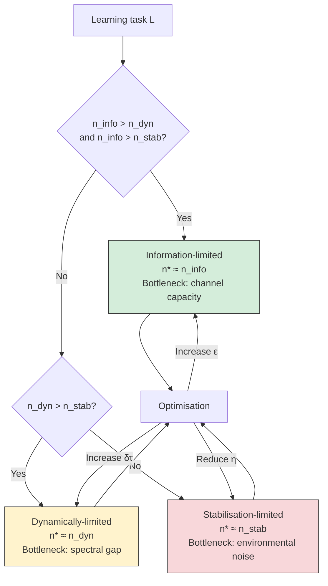
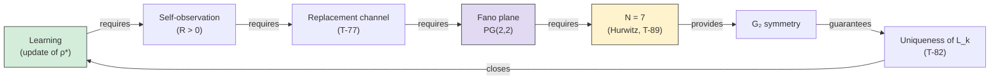

# Optimal Learning Bounds

> *"Nature does not hurry, yet everything is accomplished."*
> — Laozi

:::tip Bridge from the Previous Chapter
In the [previous chapter](./implementation) we learned how to implement CC in code: from initialisation of $\Gamma$ to a complete control cycle. But code, however fast it runs, cannot circumvent fundamental constraints. How many examples are *truly needed* to learn? Shannon, Valiant, and Landauer each asked this question — in their own language. CC unites all three answers for the first time in a single theorem.
:::

:::info Chapter Roadmap
In this chapter we:
1. Formalise the **learning task** for the holon (§1)
2. Prove the **information bound** T-109: how many observations are *needed* (§2)
3. Prove the **dynamical bound** T-110: how many observations the system will *manage to integrate* (§3)
4. Prove the **stabilisation bound** T-111: will learning kill the learner? (§4)
5. Combine the three bounds into the **optimal** T-112 (§5)
6. Prove **minimality N=7** for learning T-113 (§6)
7. Carry out a **numerical calculation** for binary discrimination (§7)
8. Compare with **classical learning theory** — PAC, VC, Shannon, Landauer (§8)
9. Extract **practical implications** for AI, education, and therapy (§9)
:::

A child picks up a hot cup and pulls away their fingers. How many times must they be burned to *understand*? Once — if the signal is strong enough. Ten times — if the cup is only slightly warm. And if the child is playing, tired, and distracted — even more. Behind this everyday intuition lies a fundamental question: **do absolute lower bounds on the learning rate exist** — limits that cannot be overcome by improving the algorithm or increasing computational power?

In the twentieth century this question was answered three times — and each answer opened a new horizon:

1. **Claude Shannon (1948)** showed that the channel capacity is limited — no encoding allows transmitting more than $C$ bits per second through a noisy channel. This was an *information-theoretic* bound.

2. **Leslie Valiant (1984)** created PAC-learning and proved that the number of examples required for learning grows at least logarithmically in the number of hypotheses and inversely proportionally to the square of accuracy. This was a *statistical* bound.

3. **Rolf Landauer (1961)** established that erasing one bit of information inevitably releases energy $kT\ln 2$. This was a *thermodynamic* bound.

:::info Historical Parallels in Detail

**Shannon and channel capacity.** In 1948 Claude Shannon, working at Bell Labs, proved a theorem that transformed engineering: there exists a limit $C = B\log_2(1 + \text{SNR})$ bits/s, above which *no* encoding allows error-free transmission. Before Shannon, engineers sought the "ideal code"; after him, they understood that the ideal is *mathematically defined* and *achievable*. The information bound T-109 inherits this spirit: $\xi_{\text{QCB}}$ is the quantum analogue of Shannon channel capacity, and the number of observations $n_{\text{info}} \geq \ln(1/(2\delta))/\xi_{\text{QCB}}$ is the quantum analogue of the Shannon limit.

**Valiant and learning complexity.** In 1984 Leslie Valiant (future Turing Award laureate) formalised the concept of "learnability" — PAC-learning (Probably Approximately Correct). His key result: the number of examples for learning is proportional to $\ln|\mathcal{H}|/\varepsilon$, where $|\mathcal{H}|$ is the number of hypotheses, $\varepsilon$ is accuracy. This is a statistical bound: it does not depend on *who* is learning — a human, a computer, or a bacterium. The dynamical bound T-110 adds what Valiant lacks: *time*. A PAC-learner has no inertia; a CC-holon does (Fano contraction $\alpha = 2/3$).

**Landauer and the cost of erasure.** Landauer showed that information is not an abstraction, but a physical object. Erasing one bit *inevitably* releases $kT\ln 2 \approx 2.9 \times 10^{-21}$ J at room temperature. In 2012 the Bérut group confirmed this experimentally. For CC this means: Fano contraction (T-110) is not a mathematical abstraction, but a *thermodynamic process*. Every step in which $\mathcal{L}_0$ erases $\alpha \cdot \delta\Gamma$ of coherence is a physical event requiring energy dissipation.
:::

Each of these bounds works in its own domain. But none of them accounts for the specificity of the **living learner** — a system that simultaneously receives information, integrates it into its dynamics, and must *remain alive* while doing so. A child burning their fingers is not an abstract PAC-learner, not a Shannon channel, and not a thermodynamic machine. They are a coherent system with limited perceptual bandwidth, finite speed of internal dynamics, and a finite reserve of stability.

Coherence Cybernetics unites all three constraints for the first time in a single theorem. The information bound (T-109) inherits the spirit of Shannon, but operates on quantum states. The dynamical bound (T-110) adds time — the rate at which the system can *integrate* the received information without losing it to the internal contraction flow. The stabilisation bound (T-111) adds fragility — a constraint on the strength of influences the system can withstand without breaking. Together (T-112) they form a **triple lock**, all three bolts of which must be opened for successful learning.

And theorem T-113 closes the circle: $N = 7$ is the minimal architecture in which all three locks *exist* at all. A system of smaller dimension is incapable of learning through regeneration — not because it lacks data, but because it lacks *self-observation*.

:::note On Notation
In this document:
- $\Gamma$ — [coherence matrix](/docs/core/dynamics/coherence-matrix)
- $P = \mathrm{Tr}(\Gamma^2)$ — [purity](/docs/core/dynamics/viability#определение-чистоты)
- $\rho_* = \varphi(\Gamma)$ — [target state](./definitions#целевое-состояние) (categorical self-model)
- $\lambda_{\mathrm{gap}} = 2/3$ — [spectral gap](/docs/core/operators/lindblad-operators#примитивность-ℒω) of the linear part $\mathcal{L}_0$ (T-39a [T])
- $\kappa_{\mathrm{bootstrap}} = \omega_0/N = 1/7$ — [minimal regeneration](/docs/core/foundations/axiom-omega#теорема-kappa-bootstrap-bound) (T-59 [T])
- $C_{\mathrm{Enc}} \leq \log_2 7$ — [information capacity](./sensorimotor#информационная-ёмкость) (T-107 [T])
- $r_{\mathrm{stab}} = \sqrt{P - 2/7}$ — [stability radius](./stability#радиус-устойчивости) (T-104 [T])
- $\mathrm{Enc}$ — [perception functor](./sensorimotor#функтор-enc) (T-100 [T])
- $\mathrm{Dec}$ — [action functor](./sensorimotor#функтор-dec) (T-101 [T])
:::

This document establishes **fundamental lower bounds on the learning rate** for a holonomic system. Learning is formalised as the process of updating the self-model $\varphi(\Gamma)$ on the basis of observations arriving through the functor $\mathrm{Enc}$, with the goal of optimising the functor $\mathrm{Dec}$.

**Key result:** the learning rate is bounded by three independent mechanisms — informational (T-109), dynamical (T-110), and stabilisation (T-111). Their combination (T-112) gives the optimal bound, and theorem T-113 proves that $N = 7$ is the minimal architecture capable of learning through regeneration.

---

## 1. Formal Definition of the Learning Task {#определение-задачи}

### 1.1 Learning Task for the Holon

:::info Definition [D]
**Learning task** $\mathfrak{L} = (\Theta, \mathcal{A}, \mathcal{R}, \delta)$ for the holon $\mathbb{H}$ consists of:

1. **Hypothesis space** $\Theta = \{\theta_1, \ldots, \theta_k\}$ — finite set of environmental states (unknown to the agent)
2. **Action space** $\mathcal{A} = \{a_1, \ldots, a_m\}$ — admissible actions
3. **Reward function** $\mathcal{R}: \Theta \times \mathcal{A} \to \mathbb{R}$, encoding correct behaviour
4. **Reliability level** $1 - \delta$, where $\delta \in (0, 1)$ — admissible error probability
:::

**Connection with dynamics.** Each observation $o_t$ under hypothesis $\theta$ arrives through the functor $\mathrm{Enc}$ (T-100 [T]):

$$
o_t \xrightarrow{\mathrm{Enc}} h^{\mathrm{ext}}_t = h^{(H)}_t + h^{(D)}_t + h^{(R)}_t
$$

and modifies the coherence matrix $\Gamma$ via the [3-channel evolution equation](./sensorimotor#среда-через-3-канала) (T-102 [T]).

### 1.2 Criterion for Successful Learning {#критерий-обучения}

:::info Definition [D]
Task $\mathfrak{L}$ is **solved in $n$ observations** if after $n$ steps:

$$
\Pr\!\left[\mathrm{Dec}(\Gamma_n) = a^*(\theta)\right] \geq 1 - \delta
$$

where $a^*(\theta) = \arg\max_{a \in \mathcal{A}} \mathcal{R}(\theta, a)$ is the optimal action under the true hypothesis $\theta$, and $\mathrm{Dec}$ is the action functor (T-101 [T]).
:::

**Minimum number of observations:**

$$
n^*(\mathfrak{L}) = \min\{n \in \mathbb{N} : \mathfrak{L} \text{ is solved in } n \text{ observations}\}
$$

### 1.3 Learning as Attractor Update {#обучение-как-аттрактор}

Unlike classical learning (updating model parameters), learning in UHM is a **change of the attractor of the dynamical system**:

1. Observation $o_t$ enters through $\mathrm{Enc}$ → $\Gamma$ is perturbed
2. Self-model $\rho_* = \varphi(\Gamma)$ is updated (T-62 [T], [physical realisation of $\varphi$](/docs/consciousness/foundations/self-observation#теорема-физическая-реализация-phi))
3. Regenerative term $\mathcal{R}[\Gamma, E]$ drives $\Gamma$ toward the updated $\rho_*$
4. Functor $\mathrm{Dec}$ adapts the action to the new $\rho_*$

Analogy: learning in classical machine learning is adjusting knobs on the dashboard (updating weights). Learning in CC is changing the very shape of the river along which water flows: the new attractor draws the system toward new behaviour *from within*, without an external controller.

**Two learning modes:**

| Mode | Regeneration rate | Time | Context |
|------|-------------------|-------|---------|
| **Genesis** (bootstrap) | $\kappa = \kappa_{\mathrm{bootstrap}} = 1/7$ | $\tau_{\mathrm{genesis}} \leq 7\ln 7 \approx 13.6$ (T-59) | Initial bootstrap, no $\mathrm{Coh}_E$ |
| **Active learning** | $\kappa = \kappa_{\mathrm{bootstrap}} + \kappa_0 \cdot \mathrm{Coh}_E$ | Faster than genesis | After reaching $\mathrm{Coh}_E > 1/7$ |

---

## 2. Information Lower Bound (T-109) [T] {#информационная-граница}

### Intuition: Why Information Limits Learning

Imagine you are trying to determine which of two coins in front of you is fair (50/50) or slightly biased (51/49). Even with perfect eyesight and unlimited time to think, you will need to *toss the coin many times* to distinguish one from the other. The closer the coins are in their properties, the more tosses are needed. This is the information limit: it is determined not by your analytical abilities, but by the amount of information each observation contains.

In classical statistics this limit is given by the Cramér-Rao inequality and the Chernoff exponent. In CC an observation is a quantum channel $\mathrm{Enc}$ mapping an external signal to a deformation of the matrix $\Gamma$. Therefore the role of the classical exponent is played by the **quantum Chernoff exponent** $\xi_{\mathrm{QCB}}$ — a measure of the distinguishability of two quantum states.

Analogy with language learning: every sentence heard is an "observation." If two languages differ strongly (Russian and Chinese), a few phrases suffice for their distinction. If they differ little (two closely related dialects), hundreds of examples are needed. The information bound T-109 says: *however brilliant the learner, one sentence will not suffice to distinguish closely related dialects* — this is not a matter of intelligence, but of the physics of information.

#### Theorem T-109 (Information Bound on Learning) [T] {#теорема-информационная-граница}

:::tip Statement
For a learning task $\mathfrak{L} = (\Theta, \mathcal{A}, \mathcal{R}, \delta)$ with $|\Theta| = k$ hypotheses, the minimum number of observations:

$$
n^* \geq n_{\mathrm{info}} := \frac{\ln\!\left(\frac{1}{2\delta}\right)}{\xi_{\mathrm{QCB}}}
$$

where $\xi_{\mathrm{QCB}}$ is the quantum Chernoff exponent for the pair of closest post-observation states:

$$
\xi_{\mathrm{QCB}} = -\ln \min_{0 \leq s \leq 1} \mathrm{Tr}\!\left(\Gamma_+^s \cdot \Gamma_-^{1-s}\right)
$$

and $\Gamma_\pm = \mathrm{Enc}(o|\theta_\pm)[\Gamma]$ are the states after observation under the two closest hypotheses.

**Universal bound:** $\xi_{\mathrm{QCB}} \leq \ln 7$, therefore:

$$
n_{\mathrm{info}} \geq \frac{\ln(1/(2\delta))}{\ln 7} \quad \text{(absolute minimum)}
$$
:::

**Why this bound is tight.** The absolute minimum $n_{\mathrm{info}} = \ln(1/(2\delta))/\ln 7$ is achieved when two observations lead to orthogonal pure states in $\mathcal{D}(\mathbb{C}^7)$ — maximally distinguishable configurations of $\Gamma$. This is the ideal case: "hot" and "cold" are completely unlike. In reality hypotheses generate close states, and the bound grows as $O(1/\varepsilon^2)$.

**Proof.**

1. *Quantum hypothesis discrimination.* Observation under hypothesis $\theta$ generates a post-observation state $\Gamma_\theta = \mathrm{Enc}(o|\theta)[\Gamma]$ — a CPTP image (T-100 [T]). The learning task includes the task of distinguishing at least two closest hypotheses $\theta_+, \theta_-$.

2. *Quantum Chernoff bound.* (Audenaert et al. 2007): for $n$ independent observations the optimal error of distinguishing two states:

$$
P_{\mathrm{err}}^{\mathrm{opt}}(n) = \frac{1}{2}\left(\min_{0 \leq s \leq 1} \mathrm{Tr}(\Gamma_+^s \, \Gamma_-^{1-s})\right)^n = \frac{1}{2}\, e^{-n \cdot \xi_{\mathrm{QCB}}}
$$

3. *Reliability condition.* From $P_{\mathrm{err}} \leq \delta$:

$$
\frac{1}{2}\, e^{-n \cdot \xi_{\mathrm{QCB}}} \leq \delta \;\Longrightarrow\; n \geq \frac{\ln(1/(2\delta))}{\xi_{\mathrm{QCB}}}
$$

4. *Upper bound on the exponent.* From T-107 [T]: the information extractable from one observation does not exceed the Holevo quantity $\chi(\mathrm{Enc}) \leq \log_2 7$. The quantum Chernoff exponent is bounded by the relative entropy:

$$
\xi_{\mathrm{QCB}} \leq D(\Gamma_+ \| \Gamma_-) \leq \ln\!\dim\mathcal{H} = \ln 7
$$

(upper bound — for orthogonal pure states in $\mathcal{D}(\mathbb{C}^7)$). $\blacksquare$

### 2.1 Asymptotics for Close Hypotheses {#близкие-гипотезы}

If hypotheses $\theta_+, \theta_-$ generate close states $\|\Gamma_+ - \Gamma_-\|_1 = \varepsilon \ll 1$, then:

$$
\xi_{\mathrm{QCB}} \approx \frac{\varepsilon^2}{8} \quad (\text{small contrast})
$$

Substituting into T-109:

$$
n_{\mathrm{info}} \geq \frac{8 \ln(1/(2\delta))}{\varepsilon^2}
$$

This reproduces the classical scaling $O(1/\varepsilon^2)$ for weak signals. **Difference from classical:** the factor $1/8$ is determined by the quantum geometry of $\mathcal{D}(\mathbb{C}^7)$, not by an arbitrary noise distribution.

### 2.2 Numerical Estimates {#числовые-оценки-info}

| Parameters | $\xi_{\mathrm{QCB}}$ | $n_{\mathrm{info}}$ |
|-----------|----------------------|----------------------|
| Orthogonal signals ($\varepsilon = 2$) | $\ln 7 \approx 1.95$ | $\geq \lceil\ln(1/(2\delta))/1.95\rceil$ |
| Strong contrast ($\varepsilon = 0.5$) | $\approx 0.031$ | $\geq \lceil 74 \cdot \ln(1/(2\delta))\rceil$ |
| Weak contrast ($\varepsilon = 0.1$) | $\approx 0.00125$ | $\geq \lceil 1846 \cdot \ln(1/(2\delta))\rceil$ |

At $\delta = 0.05$: $\ln(1/(2\cdot0.05)) = \ln 10 \approx 2.30$

| Contrast | $n_{\mathrm{info}}$ at $\delta = 0.05$ |
|----------|----------------------------------------|
| $\varepsilon = 2$ (maximum) | $\geq 2$ |
| $\varepsilon = 0.5$ | $\geq 171$ |
| $\varepsilon = 0.1$ | $\geq 4246$ |

---

## 3. Dynamical Lower Bound (T-110) [T] {#динамическая-граница}

### Intuition: Why Dynamics Limits Learning

The information bound says how many observations are *needed*. The dynamical bound says how many observations the system will *manage to integrate*. The difference is fundamental.

Imagine a student at a lecture. The professor speaks at 150 words per minute — enough information. But if the student takes notes slowly, part of the information is lost before it can be comprehended. Moreover, early notes *are erased from short-term memory* while the student is processing new ones. This is a competition between two processes: recording (each observation adds signal) and erasure (internal dynamics blurs the old signal).

In CC erasure has a precise name: **Fano contraction** with parameter $\alpha = 2/3$ (T-39a). The linear part $\mathcal{L}_0$ of the Lindbladian exponentially drives $\Gamma$ toward the maximally mixed state $I/7$. Each observation is a "recording" of amplitude $\varepsilon$, but previous recordings decay at rate $e^{-\alpha\tau}$. The stationary limit determines whether it is *possible at all* to accumulate sufficient signal.

Analogy from neuroscience: short-term memory decays in 15–30 seconds (Peterson's law). To transfer information to long-term memory, *consolidation* is required — and it takes time. The dynamical bound T-110 is the formal expression of this neuropsychological fact in the language of the coherence matrix.

#### Theorem T-110 (Dynamical Bound on Learning) [T] {#теорема-динамическая-граница}

:::tip Statement
For a learning task with observations of amplitude $\varepsilon = \|\Gamma_+ - \Gamma_-\|_1$ and interval $\delta\tau$ between observations:

$$
n^* \geq n_{\mathrm{dyn}} := \frac{1}{\alpha \cdot \delta\tau}\,\ln\!\left(\frac{d_{\mathrm{disc}}}{\varepsilon}\cdot(\alpha\,\delta\tau)\right)
$$

where:
- $\alpha = \lambda_{\mathrm{gap}} = 2/3$ — contraction rate (T-39a [T])
- $d_{\mathrm{disc}}$ — minimum Bures distance for reliable discrimination
- $\varepsilon$ — signal amplitude of one observation

At the natural scale $\delta\tau = 1/\alpha$ (one observation per relaxation time):

$$
n_{\mathrm{dyn}} \geq \ln\!\left(\frac{d_{\mathrm{disc}}}{\varepsilon}\right) + 1
$$
:::

**What happens at the limit.** If $\varepsilon \to 0$ at fixed $d_{\mathrm{disc}}$, the dynamical bound diverges logarithmically — signals that are too weak are erased faster than they accumulate. If $\delta\tau \to 0$ (observations too frequent), each new signal arrives before the previous one has had time to affect $\Gamma$, and the effective learning rate does not increase. There exists an optimal observation rate $\delta\tau^* \sim 1/\alpha$ at which the dynamical bound is minimal.

**Proof.**

1. *Fano contraction.* [Linear part $\mathcal{L}_0$](/docs/core/dynamics/evolution#логический-лиувиллиан) contracts all deviations from $I/7$ at exponential rate $\alpha = 2/3$ (T-39a [T]):

$$
\|\Gamma(\tau) - I/7\|_{\mathrm{HS}} \leq e^{-\alpha\tau}\|\Gamma(0) - I/7\|_{\mathrm{HS}}
$$

This means that **information recorded in $\Gamma$ decays** over time.

2. *Signal accumulation.* Observation at moment $\tau_i = i \cdot \delta\tau$ contributes signal of amplitude $\varepsilon$ to $\Gamma$. By moment $\tau_n = n \cdot \delta\tau$ the contribution of the $i$-th observation has decayed to $\varepsilon \cdot e^{-\alpha(n-i)\delta\tau}$. Total accumulated signal:

$$
S(n) = \varepsilon \sum_{i=0}^{n-1} e^{-\alpha(n-1-i)\delta\tau} = \varepsilon \cdot \frac{1 - e^{-\alpha n \delta\tau}}{1 - e^{-\alpha \delta\tau}}
$$

3. *Stationary limit.* As $n \to \infty$:

$$
S_\infty = \frac{\varepsilon}{1 - e^{-\alpha\delta\tau}}
$$

4. *Discrimination condition.* For reliable distinction $S(n) \geq d_{\mathrm{disc}}$:

$$
\varepsilon \cdot \frac{1 - e^{-\alpha n \delta\tau}}{1 - e^{-\alpha\delta\tau}} \geq d_{\mathrm{disc}}
$$

$$
1 - e^{-\alpha n \delta\tau} \geq \frac{d_{\mathrm{disc}}(1 - e^{-\alpha\delta\tau})}{\varepsilon}
$$

$$
n \geq \frac{1}{\alpha\delta\tau}\,\ln\!\left(\frac{1}{1 - d_{\mathrm{disc}}(1 - e^{-\alpha\delta\tau})/\varepsilon}\right)
$$

At $d_{\mathrm{disc}} \ll S_\infty$ (typical regime): $n_{\mathrm{dyn}} \approx \frac{1}{\alpha\delta\tau}\ln\frac{d_{\mathrm{disc}}(1-e^{-\alpha\delta\tau})}{\varepsilon \cdot \alpha\delta\tau}$ (first approximation). Simplifying for $\delta\tau = 1/\alpha$:

$$
n_{\mathrm{dyn}} \geq \ln\!\left(\frac{d_{\mathrm{disc}}}{\varepsilon}\right) + 1
$$

(using $1 - e^{-1} \approx 0.632$). $\blacksquare$

### 3.1 Physical Meaning {#физический-смысл-dyn}

The dynamical bound expresses the **competition between recording and erasure**:

- **Recording:** each observation adds signal $\varepsilon$ to $\Gamma$
- **Erasure:** Fano contraction removes $\alpha \cdot \delta\Gamma$ per unit time
- **Balance:** stationary signal $S_\infty = \varepsilon / (1 - e^{-\alpha\delta\tau})$

If $S_\infty < d_{\mathrm{disc}}$, the task is **unsolvable at the given parameters** — contraction erases the signal faster than it accumulates. Necessary condition for solvability:

$$
\varepsilon > d_{\mathrm{disc}} \cdot (1 - e^{-\alpha\delta\tau})
$$

### 3.2 Role of Regeneration {#роль-регенерации}

The regenerative term $\mathcal{R}[\Gamma, E]$ **counteracts contraction** for components aligned with $\rho_*$. After learning (when $\rho_*$ has been updated):

- Components of $\Gamma$ aligned with the learned $\rho_*$ are **strengthened** by regeneration
- Components not aligned continue to decay

This means that **learned information is stabilised in the attractor**, while noise is washed out. Effective erasure rate for the learned signal:

$$
\alpha_{\mathrm{eff}} = \alpha - \kappa = \frac{2}{3} - \kappa
$$

At $\kappa > 2/3$ regeneration dominates — the attractor is stable. From [T-98 (balance)](/docs/core/dynamics/evolution#теорема-баланс-чистоты-аттрактора) [T]: this condition is satisfied for viable states with $P > 2/7$.

---

## 4. Stabilisation Lower Bound (T-111) [T] {#стабилизационная-граница}

### Intuition: Why Stability Limits Learning

The first two bounds describe whether *enough* information exists and whether the system *manages* to process it. The third bound adds a question that classical learning theory usually ignores: **will learning kill the learner?**

This is not a metaphor. In CC the system is viable at $P > P_{\mathrm{crit}} = 2/7$. Each observation is a perturbation that pushes $\Gamma$ away from the current attractor. Too strong a perturbation pushes $P$ below the viability threshold. A system that learns too fast risks destabilising itself.

The biological parallel is clear: traumatic experience can be informative (once — and for life), but too strong a stress causes PTSD or even death. A therapist knows that *dosage* matters more than *content*: the right information, delivered too quickly, destroys rather than heals.

In the context of neural network training the stabilisation bound corresponds to the intuition about choosing a learning rate: too large — and training diverges; too small — and training fails to converge. But in CC this is not merely an engineering heuristic, but a **theorem**: the maximum observation amplitude $\varepsilon$ is bounded by the stability radius $r_{\mathrm{stab}}$, which is strictly computed from the current state $\Gamma$.

#### Theorem T-111 (Stabilisation Bound on Learning) [T] {#теорема-стабилизационная-граница}

:::tip Statement
Learning must not destabilise the holon. The observation amplitude is bounded by the stability radius (T-104 [T]):

$$
\varepsilon \leq r_{\mathrm{stab}} = \sqrt{P(\rho^*_\Omega) - 2/7}
$$

In the presence of stochastic noise $\eta$ in observations (SNR $= \varepsilon_{\mathrm{signal}} / \eta$), the number of observations required to overcome noise:

$$
n^* \geq n_{\mathrm{stab}} := \frac{1}{\mathrm{SNR}^2} \cdot \frac{\ln(1/(2\delta))}{(\xi_{\mathrm{QCB}}^{\mathrm{eff}})^2 / \xi_{\mathrm{QCB}}}
$$

In the typical regime ($\mathrm{SNR} \ll 1$, noisy environment):

$$
n_{\mathrm{stab}} \geq \frac{1}{\mathrm{SNR}^2}
$$
:::

**What happens at the limit.** Consider limiting cases:
- At $P \to 2/7$ (system at the viability boundary): $r_{\mathrm{stab}} \to 0$, and *any* non-trivial observation is dangerous. The system is "frozen" — it cannot learn until it has restored its purity reserve. This is the CC analogue of the clinical state: a patient in severe depression does not absorb therapeutic interventions, because their resources are exhausted.
- At $\mathrm{SNR} \to 0$ (pure noise): $n_{\mathrm{stab}} \to \infty$ — learning is impossible, not because there is no information, but because every useful signal drowns in the noise, while the noise destabilises the system.

**Proof.**

1. *Amplitude constraint.* From T-104 [T]: a perturbation $h^{\mathrm{ext}}$ with $\|h^{\mathrm{ext}}\| > r_{\mathrm{stab}}$ can drive $\Gamma$ beyond the viability boundary $P = 2/7$. Since learning requires $P > 2/7$ (viability), the amplitude of each observation is bounded from above.

2. *Noise model.* Each observation contains useful signal $\varepsilon_{\mathrm{signal}}$ and noise $\eta$:

$$
h^{\mathrm{ext}}_t = h^{\mathrm{signal}}_t + h^{\mathrm{noise}}_t, \quad \|h^{\mathrm{noise}}\| = \eta
$$

Noise enters through the dissipative channel $h^{(D)}$ ([most dangerous channel](./stability#радиус-устойчивости)). Constraint from T-104:

$$
\varepsilon_{\mathrm{signal}} + \eta \leq r_{\mathrm{stab}}
$$

3. *Noise averaging.* For $n$ observations with independent noise, effective signal grows as $\sqrt{n} \cdot \varepsilon_{\mathrm{signal}}$, and noise — as $\sqrt{n} \cdot \eta$. Signal-to-noise ratio after $n$ observations:

$$
\mathrm{SNR}_n = \mathrm{SNR} \cdot \sqrt{n}
$$

4. *Reliability condition.* For $\mathrm{SNR}_n \geq \mathrm{SNR}_{\mathrm{thresh}}$ (reliable discrimination threshold):

$$
n \geq \left(\frac{\mathrm{SNR}_{\mathrm{thresh}}}{\mathrm{SNR}}\right)^2
$$

Connection with T-69 ([topological protection](/docs/core/dynamics/composite-systems#теорема-тополог-защита) [T]): barriers $\geq 6\mu^2$ guarantee that **discrete phase transitions are impossible** — learning is always continuous, and random noise cannot cause a catastrophic jump. $\blacksquare$

### 4.1 Learning-Stability Trade-off {#компромисс-обучение-стабильность}

There exists a fundamental trade-off: strong observations (large $\varepsilon$) accelerate learning (reduce $n_{\mathrm{info}}$ and $n_{\mathrm{dyn}}$), but threaten stability (increase the risk of crossing $\partial\mathcal{V}$).

**Optimal amplitude** — the one at which $n_{\mathrm{info}} = n_{\mathrm{stab}}$:

$$
\varepsilon^* = r_{\mathrm{stab}} \cdot \frac{\mathrm{SNR}}{1 + \mathrm{SNR}}
$$

Substituting into T-109 gives the optimal learning rate at a given stability reserve $P - 2/7$.

### 4.2 Three Stability Zones {#три-зоны-стабильности}

From [T-106 (diagnostic regimes)](./diagnostics#вывод-порогов) [C under calibration]:

| Zone | $\|\sigma_{\mathrm{sys}}\|$ | Available $r_{\mathrm{stab}}$ | Learning mode |
|------|------|------|------|
| Normal | $< \sigma_1$ | Large | Fast learning — strong signals can be used |
| Warning | $\sigma_1 < \cdot < \sigma_2$ | Medium | Careful learning — limit $\varepsilon$ |
| Critical | $> \sigma_2$ | Small | Learning halted — survival priority |

---

## 5. Combined Optimal Bound (T-112) [T] {#комбинированная-граница}

### Intuition: Three Locks on One Door

Each of the three bounds is a necessary condition, but none of them is sufficient. They describe three *different* mechanisms limiting learning:

- **T-109** (information): "is there enough data?" — constraint on the *quantity* of observations
- **T-110** (dynamics): "can the system keep up?" — constraint on the *rate* of integration
- **T-111** (stability): "will the system hold?" — constraint on the *strength* of influences

Like three locks on one door, all three must be opened simultaneously. The bottleneck is determined by the slowest of the three — the strongest lock.

Neural network training provides a good illustration. At the start of training, when the model is far from the optimum, the bottleneck is usually information (one simply needs more data). In the middle — dynamics (the model slowly restructures its weights). Toward the end — stability (each training step risks worsening what has already been achieved). An optimal learning rate scheduler intuitively switches between these regimes — CC makes this switching a *theorem*.

#### Theorem T-112 (Optimal Learning Bound) [T] {#теорема-оптимальная-граница}

:::tip Statement
Minimum number of observations for solving learning task $\mathfrak{L}$:

$$
n^*(\mathfrak{L}) \geq n_{\mathrm{opt}} := \max\!\left(n_{\mathrm{info}},\; n_{\mathrm{dyn}},\; n_{\mathrm{stab}}\right)
$$

where:
- $n_{\mathrm{info}} = \ln(1/(2\delta)) / \xi_{\mathrm{QCB}}$ — information bound (T-109)
- $n_{\mathrm{dyn}} = \frac{1}{\alpha\delta\tau}\ln\frac{d_{\mathrm{disc}}(1-e^{-\alpha\delta\tau})}{\varepsilon}$ — dynamical bound (T-110)
- $n_{\mathrm{stab}} = (\mathrm{SNR}_{\mathrm{thresh}} / \mathrm{SNR})^2$ — stabilisation bound (T-111)

Learning passes through **three regimes**, determined by the bottleneck:

$$
n_{\mathrm{opt}} = \begin{cases}
n_{\mathrm{info}} & \text{information-limited (high SNR, slow channel)} \\
n_{\mathrm{dyn}} & \text{dynamically-limited (fast channel, slow dynamics)} \\
n_{\mathrm{stab}} & \text{stabilisation-limited (noisy environment, small } P \text{ reserve)}
\end{cases}
$$
:::

**Proof.** Each of the three bounds is a necessary condition. If at least one of them is not satisfied:

- $n < n_{\mathrm{info}}$: insufficient information to distinguish hypotheses → $P_{\mathrm{err}} > \delta$
- $n < n_{\mathrm{dyn}}$: dynamics has not managed to integrate the signal → $S(n) < d_{\mathrm{disc}}$
- $n < n_{\mathrm{stab}}$: noise dominates over signal → unreliable discrimination

Since all three conditions are simultaneously necessary, the minimum $n$ is the maximum of the three. $\blacksquare$

### 5.1 Regime Diagram {#диаграмма-режимов}

```mermaid
graph TD
    START["Learning task L"] --> CHECK_INFO{"n_info > n_dyn<br/>and n_info > n_stab?"}
    CHECK_INFO -->|Yes| INFO["Information-limited<br/>n* ≈ n_info<br/>Bottleneck: channel capacity"]
    CHECK_INFO -->|No| CHECK_DYN{"n_dyn > n_stab?"}
    CHECK_DYN -->|Yes| DYN["Dynamically-limited<br/>n* ≈ n_dyn<br/>Bottleneck: spectral gap"]
    CHECK_DYN -->|No| STAB["Stabilisation-limited<br/>n* ≈ n_stab<br/>Bottleneck: environmental noise"]

    INFO --> OPT["Optimisation"]
    DYN --> OPT
    STAB --> OPT

    OPT -->|"Increase ε"| INFO
    OPT -->|"Increase δτ"| DYN
    OPT -->|"Reduce η"| STAB

    style INFO fill:#d4edda,stroke:#333
    style DYN fill:#fff3cd,stroke:#333
    style STAB fill:#f8d7da,stroke:#333
```

### 5.2 Including Genesis Time {#генезис-плюс-обучение}

For a system starting from $\Gamma = I/7$ (fully mixed state), total time to solving the task includes [genesis](/docs/core/foundations/axiom-omega#genesis-protocol):

$$
n_{\mathrm{total}} = \underbrace{n_{\mathrm{genesis}}}_{\leq \lceil\tau_{\mathrm{genesis}}/\delta\tau\rceil} + \underbrace{n_{\mathrm{opt}}}_{\text{T-112}}
$$

where $\tau_{\mathrm{genesis}} \leq 7\ln 7 \approx 13.6$ (T-59 [T]) — bootstrap time (at $\kappa_{\mathrm{bootstrap}} = 1/7$).

At $\delta\tau = 1$: $n_{\mathrm{total}} \leq 14 + n_{\mathrm{opt}}$.

---

## 6. Optimality of N=7 for Learning (T-113) [T] {#оптимальность-n7}

### Intuition: Why Learning Requires a Specific Architecture

So far we have derived learning bounds for the fixed architecture $N = 7$. Theorem T-113 poses a deeper question: what is the *minimal* architecture capable of learning through regeneration?

The answer is surprisingly precise: $N = 7$ — neither more nor less. Systems with $N < 7$ are incapable of learning *in principle*, while systems with $N > 7$ can learn, but do so less efficiently.

The key link is **self-observation**. Learning in CC is the update of the self-model $\rho_*$. Updating requires *comparing* the current state with the model, i.e., $R > 0$ (non-zero reflection). And reflection, in turn, requires a replacement channel that relies on the Fano plane PG(2,2). And the Fano plane exists only at $N = 7$.

Analogy with child development: a newborn does not "learn" in the strict sense — they do not yet have a self-model that can be updated. Learning begins when the child *perceives the gap* between expectation and reality — and this requires self-observation. Theorem T-113 makes this pedagogical intuition rigorous: without reflection ($R = 0$) there is no learning ($n^* = \infty$), and reflection requires Fano structure ($N = 7$).

#### Theorem T-113 (Minimality of N=7 for Learning) [T] {#теорема-минимальность-n7}

:::tip Statement
Let $N$ be the dimension of the internal space of the holon $\mathcal{H} = \mathbb{C}^N$. Then:

1. **For $N < 7$:** learning through regeneration is impossible: $n^* = \infty$
2. **For $N = 7$:** learning is possible with finite optimal bound $n_{\mathrm{opt}}$ (T-112)
3. **For $N > 7$:** learning is possible, but requires strictly more resources:
   - Genesis time: $\tau_{\mathrm{genesis}}(N) \propto N \ln N > \tau_{\mathrm{genesis}}(7)$
   - Parameter space: $\dim \mathcal{D}(\mathbb{C}^N) = N^2 - 1 > 48$
   - No new qualitative capabilities arise

$N = 7$ is the **only Pareto-optimal** point in the plane (learning capacity, system complexity).
:::

**Proof.**

1. *Necessity of self-observation for learning.* Learning = update of self-model $\rho_* = \varphi(\Gamma)$. Updating requires comparing $\Gamma$ with $\rho_*$, i.e., access to information about one's own state. Formally: a replacement channel with $R > 0$ is required ([reflection measure](/docs/consciousness/foundations/self-observation#мера-рефлексии-r)).

2. *Necessity of Fano structure for self-observation.* The replacement channel (T-77 [T], [Lindblad operators](/docs/core/operators/lindblad-operators#полнота-триадной-декомпозиции)) requires the Fano plane $\mathrm{PG}(2,2)$ for the definition of optimal Lindblad operators $\{L_k\}$ (T-82 [T]).

3. *Fano plane requires $N = 7$.* $\mathrm{PG}(2,2)$ has 7 points and 7 lines. For realisation in $\mathcal{D}(\mathbb{C}^N)$: $N \geq 7$. From Hurwitz's theorem ([T-89](/docs/proofs/minimality/theorem-minimality-7) [T]): $N = 7$ is the minimum dimension with a division algebra ($\mathbb{O}$), which ensures the $G_2$-structure.

4. *For $N < 7$: impossibility.* No Fano plane → no unique Lindblad decomposition (T-82) → no replacement channel → $R = 0$ → impossible to update $\varphi(\Gamma)$ on the basis of observations → $n^* = \infty$.

5. *For $N > 7$: redundancy.* Embedding $\mathbb{C}^7 \hookrightarrow \mathbb{C}^N$ (via [Morita equivalence](/docs/core/structure/dimension-e#теорема-морита-эквивалентность) T-58 [T]) provides all mechanisms of $N = 7$. Additional dimensions increase:
   - $\dim\mathcal{D}(\mathbb{C}^N) = N^2 - 1 > 48$ — more parameters to update
   - $\tau_{\mathrm{genesis}} \propto N\ln N$ — longer bootstrap (estimate from [generalised T-59](/docs/core/foundations/axiom-omega#genesis-protocol))

   But information capacity $C_{\mathrm{Enc}} = \log_2 N$ grows only logarithmically, while complexity grows quadratically. Resource efficiency:

$$
\eta(N) = \frac{C_{\mathrm{Enc}}(N)}{\dim\mathcal{D}(\mathbb{C}^N)} = \frac{\log_2 N}{N^2 - 1}
$$

strictly decreases for $N > 1$. Thus, $N = 7$ is the minimum with non-zero learning capacity and maximum resource efficiency among systems with Fano structure. $\blacksquare$

### 6.1 Chain of Necessities {#цепочка-необходимостей}

```mermaid
graph LR
    LEARN["Learning<br/>(update of ρ*)"] -->|requires| SELF["Self-observation<br/>(R > 0)"]
    SELF -->|requires| REPL["Replacement channel<br/>(T-77)"]
    REPL -->|requires| FANO["Fano plane<br/>PG(2,2)"]
    FANO -->|requires| DIM7["N = 7<br/>(Hurwitz, T-89)"]
    DIM7 -->|provides| G2["G₂ symmetry"]
    G2 -->|guarantees| UNIQUE["Uniqueness of L_k<br/>(T-82)"]
    UNIQUE -->|closes| LEARN

    style LEARN fill:#d4edda,stroke:#333
    style DIM7 fill:#fff3cd,stroke:#333
    style FANO fill:#e2d9f3,stroke:#333
```

### 6.2 Parameters at N=7 {#параметры-n7}

| Parameter | Value | Source |
|----------|----------|----------|
| Channel capacity $C_{\mathrm{Enc}}$ | $\log_2 7 \approx 2.81$ bits | T-107 [T] |
| Spectral gap $\lambda_{\mathrm{gap}}$ | $2/3$ | T-39a [T] |
| Minimal regeneration $\kappa_{\mathrm{bootstrap}}$ | $= \omega_0/N = 1/7 \approx 0.143$ | T-59 [T] |
| Genesis time $\tau_{\mathrm{genesis}}$ | $\leq 7\ln 7 \approx 13.6$ | T-59 [T] |
| State parameters $\dim\mathcal{D}$ | $48$ (real) | $7^2 - 1$ |
| Resource efficiency $\eta$ | $\log_2 7 / 48 \approx 0.059$ | Definition |

---

## 7. Application: Binary Discrimination {#бинарная-дискриминация}

### 7.1 The Two-Button Task {#задача-двух-кнопок}

**Setup.** An agent (CC-holon) interacts with the environment through two buttons: green (reward) and red (punishment). The colours are unknown to the agent. Task: learn to press only the green button.

**Formalisation:**
- $\Theta = \{\theta_0, \theta_1\}$ (two hypotheses: "green is on the left" vs "green is on the right")
- $\mathcal{A} = \{a_L, a_R\}$ (press left, press right)
- $\mathcal{R}(\theta_0, a_L) = +\varepsilon_R$, $\mathcal{R}(\theta_0, a_R) = -\varepsilon_P$ (under $\theta_0$ — "green is on the left")
- $\delta = 0.05$ (95% reliability)

### 7.2 Signal and Mechanism {#сигнал-и-механизм}

Reward and punishment enter through the functor $\mathrm{Enc}$ (T-100):

| Type | Channels | Effect on $\Gamma$ |
|-----|--------|-------------------|
| Reward ($+\varepsilon_R$) | $h^{(R)} > 0$: regeneration strengthening | $P \uparrow$, $\mathcal{V}_{\mathrm{hed}} > 0$ |
| Punishment ($-\varepsilon_P$) | $h^{(D)} > 0$: dissipation strengthening | $P \downarrow$, $\mathcal{V}_{\mathrm{hed}} < 0$ |

Through the [hedonic mechanism](./sensorimotor#гедонический-механизм) (T-103 [T]+[I]): the agent "feels" the valence $\mathcal{V}_{\mathrm{hed}} = dP/d\tau|_{\mathcal{R}}$ and adjusts $\mathrm{Dec}$ in the direction of minimising $\|\sigma_{\mathrm{sys}}\|_\infty$ (T-101).

### 7.3 Estimates of the Number of Presses {#оценки-числа-нажатий}

**Notation:** $\varepsilon = \varepsilon_R + \varepsilon_P$ — total contrast between reward and punishment, $\eta$ — environmental noise.

#### Information bound (T-109):

$$
n_{\mathrm{info}} = \left\lceil\frac{\ln(1/(2\cdot 0.05))}{\xi_{\mathrm{QCB}}}\right\rceil = \left\lceil\frac{\ln 10}{\xi_{\mathrm{QCB}}}\right\rceil
$$

| Contrast $\varepsilon$ | $\xi_{\mathrm{QCB}}$ | $n_{\mathrm{info}}$ |
|------------------------|----------------------|----------------------|
| 1.0 (strong) | $\approx 0.125$ | $\geq 19$ |
| 0.5 (medium) | $\approx 0.031$ | $\geq 75$ |
| 0.3 (weak) | $\approx 0.011$ | $\geq 209$ |

#### Dynamical bound (T-110, $\delta\tau = 1$):

$$
n_{\mathrm{dyn}} = \left\lceil\ln\!\left(\frac{d_{\mathrm{disc}}}{\varepsilon}\right) + 1\right\rceil
$$

At $d_{\mathrm{disc}} \approx 0.3$ (minimum distance for reliable discrimination in $\mathcal{D}(\mathbb{C}^7)$):

| Contrast $\varepsilon$ | $n_{\mathrm{dyn}}$ |
|------------------------|---------------------|
| 1.0 | $\leq 1$ (instant) |
| 0.5 | $\leq 1$ |
| 0.3 | $\leq 1$ |
| 0.01 | $\leq 5$ |

#### Stabilisation bound (T-111):

At $P \approx 0.4$ (typical value): $r_{\mathrm{stab}} = \sqrt{0.4 - 2/7} \approx 0.34$.

| SNR | $n_{\mathrm{stab}}$ |
|-----|---------------------|
| 1.0 (clean signal) | $\leq 1$ |
| 0.5 | $\leq 4$ |
| 0.3 | $\leq 12$ |
| 0.1 | $\leq 100$ |

#### Combined estimate (T-112):

**Typical scenario** ($\varepsilon = 0.5$, SNR $= 0.5$, $\delta\tau = 1$):

$$
n_{\mathrm{opt}} = \max(75, 1, 4) = 75
$$

Bottleneck — **information** (weak contrast).

**Ideal scenario** ($\varepsilon = 1.0$, SNR $= 1.0$, $\delta\tau = 1$):

$$
n_{\mathrm{opt}} = \max(19, 1, 1) = 19
$$

Including genesis ($n_{\mathrm{genesis}} \leq \lceil 7\ln 7 \rceil = 14$): $n_{\mathrm{total}} \leq 14 + 19 = 33$.

**Noisy scenario** ($\varepsilon = 0.3$, SNR $= 0.3$, $\delta\tau = 1$):

$$
n_{\mathrm{opt}} = \max(209, 1, 12) = 209
$$

Bottleneck — **information**.

### 7.3a Numerical Example: Computing $n_{\text{opt}}$ for a Specific Holon {#числовой-пример-nopt}

Let us carry out a full computation for the holon from the [case study "Patient A"](./diagnostics#кейс-пациент-а) — an AI agent of a warehouse robot that must learn to distinguish two types of packaging (standard vs fragile).

**Given data:**
- $P = 0.39$ (after stabilisation, day 7)
- $\mathrm{Coh}_E = 0.28$ (moderate self-model)
- Contrast between packaging types: $\varepsilon = 0.4$ (medium — visually distinguishable, but not trivially)
- Environmental noise: $\eta = 0.15$ (lighting changes, camera occasionally produces glare)
- SNR $= \varepsilon / \eta = 0.4 / 0.15 \approx 2.67$
- Reliability: $\delta = 0.05$ (95%)
- Observation interval: $\delta\tau = 1$ (one observation per $\sim 1.5$ seconds)

**Step 1: Information bound (T-109).**

$$
\xi_{\text{QCB}} \approx \frac{\varepsilon^2}{8} = \frac{0.4^2}{8} = 0.02
$$

$$
n_{\text{info}} = \left\lceil \frac{\ln(1/(2 \cdot 0.05))}{0.02} \right\rceil = \left\lceil \frac{\ln 10}{0.02} \right\rceil = \left\lceil \frac{2.30}{0.02} \right\rceil = 115
$$

**Step 2: Dynamical bound (T-110).**

At $\delta\tau = 1 = 1/\alpha \cdot (2/3) \cdot 3/2$, using the simplified formula:

$$
n_{\text{dyn}} = \left\lceil \ln\left(\frac{d_{\text{disc}}}{\varepsilon}\right) + 1 \right\rceil
$$

With $d_{\text{disc}} \approx 0.3$:

$$
n_{\text{dyn}} = \left\lceil \ln\left(\frac{0.3}{0.4}\right) + 1 \right\rceil = \lceil -0.29 + 1 \rceil = 1
$$

Dynamics is *not* the bottleneck — the contrast is strong enough.

**Step 3: Stabilisation bound (T-111).**

$$
r_{\text{stab}} = \sqrt{P - 2/7} = \sqrt{0.39 - 0.286} = \sqrt{0.104} \approx 0.323
$$

Check: $\varepsilon = 0.4 > r_{\text{stab}} = 0.323$. **Problem!** The signal is too strong — each observation risks destabilising the system.

:::warning Stabilisation constraint triggered
At $\varepsilon = 0.4 > r_{\text{stab}} = 0.323$, direct learning is dangerous. Solution: **attenuation** — reduce the effective amplitude to $\varepsilon_{\text{eff}} = 0.8 \cdot r_{\text{stab}} = 0.258$ (20% margin). This is equivalent to a learning rate schedule.
:::

With attenuated amplitude $\varepsilon_{\text{eff}} = 0.258$:
- SNR$_{\text{eff}} = 0.258 / 0.15 = 1.72$
- $n_{\text{stab}} = \lceil (1/1.72)^2 \rceil = \lceil 0.34 \rceil = 1$

Recomputing the information bound with $\varepsilon_{\text{eff}}$:
$$
\xi_{\text{QCB}}^{\text{eff}} \approx \frac{0.258^2}{8} = 0.0083
$$
$$
n_{\text{info}}^{\text{eff}} = \left\lceil \frac{2.30}{0.0083} \right\rceil = 277
$$

**Step 4: Combined bound (T-112).**

$$
n_{\text{opt}} = \max(277, 1, 1) = 277
$$

Including genesis (the system is already running, $n_{\text{genesis}} = 0$):

$$
\boxed{n_{\text{total}} = 277 \text{ observations} \approx 7 \text{ minutes at 1.5 s/observation}}
$$

**Bottleneck:** information (weak attenuated contrast). Optimisation strategy: improve the camera (reduce $\eta$ → increase SNR → can increase $\varepsilon_{\text{eff}}$ → reduce $n_{\text{info}}$).

:::note Lesson: stability constrains even strong signals
Without attenuation ($\varepsilon = 0.4$) only $n_{\text{info}} = 115$ observations would be needed, but every fifth one would risk destabilising the agent. With attenuation — $n_{\text{info}} = 277$, but *safely*. The T-111 trade-off: safety costs 2.4× in time. This is not an engineering constraint, but a **physical law**.
:::

---

### 7.4 Prediction for the CC Test {#прогноз-кк-тест}

:::info Prediction for testing
For a CC-architecture with realistic parameters ($\varepsilon \sim 0.5\text{--}1.0$, SNR $\sim 0.5\text{--}1.0$):

$$
n_{\mathrm{total}} \approx 20\text{--}80 \;\text{presses}
$$

until a stable preference for the green button.

**Falsification criterion:** if the agent learns in $n < n_{\mathrm{info}}$ (information limit), this violates the quantum Chernoff bound and falsifies the observation model.
:::

---

## 8. Comparison with Classical Learning Theory {#сравнение-с-классикой}

The CC learning bounds did not arise in a vacuum — they inherit and generalise a number of classical results. This section provides a systematic comparison.

### 8.1 PAC-Learning and VC-Dimension

In classical PAC-learning (Valiant, 1984), for learning with accuracy $\varepsilon$ and reliability $1-\delta$:

$$
n_{\mathrm{PAC}} \geq \frac{1}{\varepsilon}\left(\ln|\mathcal{H}| + \ln\frac{1}{\delta}\right)
$$

where $|\mathcal{H}|$ is the cardinality of the hypothesis space. For infinite hypothesis classes the VC-dimension $d_{\mathrm{VC}}$ is used:

$$
n_{\mathrm{PAC}} = \Omega\!\left(\frac{d_{\mathrm{VC}} + \ln(1/\delta)}{\varepsilon}\right)
$$

| Aspect | PAC-learning | CC bounds |
|--------|-------------|------------|
| **Substrate** | Abstract algorithm | Physical dynamical system |
| **Information bound** | $\ln|\mathcal{H}|/\varepsilon$ | $\ln(1/(2\delta))/\xi_{\mathrm{QCB}}$ |
| **Dynamics** | Not accounted for | $n_{\mathrm{dyn}}$ — key constraint |
| **Stability** | Not accounted for | $n_{\mathrm{stab}}$ — learning must not kill the learner |
| **Scaling for weak signals** | $O(1/\varepsilon)$ | $O(1/\varepsilon^2)$ (quantum limit) |
| **Minimal architecture** | Arbitrary | $N = 7$ (T-113) |

Key distinction: PAC-learning describes an **algorithm**, CC describes a **physical system**. An algorithm has no inertia and does not risk dying. A living learner does.

### 8.2 Rademacher Complexity and Generalisation

Rademacher complexity $\mathfrak{R}_n$ measures the ability of a function class to "fit" random noise. Classical generalisation bound:

$$
\mathrm{err}(\hat{f}) \leq \hat{\mathrm{err}}(\hat{f}) + 2\mathfrak{R}_n + \sqrt{\frac{\ln(1/\delta)}{2n}}
$$

In CC the analogue of Rademacher complexity is **channel capacity** $C_{\mathrm{Enc}} \leq \log_2 7$ (T-107). The constraint on channel capacity *automatically* controls overfitting: a system with fixed capacity $\log_2 7 \approx 2.81$ bits per observation cannot "memorise" an arbitrarily complex pattern. This is a built-in regularisation arising not from an engineering decision, but from an architectural constraint.

### 8.3 Shannon Limit and Quantum Chernoff Exponent

The classical Shannon theorem (1948) states: for reliable transmission through a channel with capacity $C$, one needs $n \geq H(\Theta)/C$ observations, where $H(\Theta)$ is the entropy of the hypothesis distribution.

T-109 generalises this result to a quantum channel:

$$
n_{\mathrm{info}} = \frac{\ln(1/(2\delta))}{\xi_{\mathrm{QCB}}} \geq \frac{\ln(1/(2\delta))}{\ln 7}
$$

The quantum Chernoff exponent $\xi_{\mathrm{QCB}}$ is the quantum analogue of $C$, but for the task of *discrimination*, not transmission. Here $\xi_{\mathrm{QCB}} \leq \ln 7 \approx 1.95$ — the absolute maximum, determined by the dimension of $\mathcal{H}$. The classical Shannon limit is recovered when $\Gamma_\pm$ commute (classical states).

### 8.4 Thermodynamic Bounds on Learning

The Landauer limit ($kT\ln 2$ per bit of erasure) is connected to T-110 as follows: Fano contraction is *inevitable* dissipation, analogous to thermodynamic erasure. Each learning step requires erasing old information ($\alpha \cdot \delta\Gamma$) and recording new information ($\varepsilon$). Minimum "thermodynamic cost" of learning:

$$
W_{\mathrm{learn}} \geq n_{\mathrm{opt}} \cdot kT\ln 2 \cdot \Delta S_{\mathrm{step}}
$$

where $\Delta S_{\mathrm{step}}$ is the change in von Neumann entropy per step. This connects the CC learning bounds with the physical energy of cognitive processes.

---

## 9. Practical Implications {#практические-следствия}

Theorems T-109 — T-113 are not abstract mathematical results. They have direct implications for three key areas: AI design, education, and therapy.

### 9.1 Implications for AI and Machine Learning

**Architecture.** T-113 states that $N = 7$ is the minimal architecture for learning through regeneration. For an AI engineer this means: if you are building a system with an internal self-model (not merely an optimiser), you need at least 7 internal "channels" with Fano-structured connections between them.

**Learning rate.** T-111 provides *theoretical justification* for adaptive learning rate: maximum update amplitude $\varepsilon \leq r_{\mathrm{stab}} = \sqrt{P - 2/7}$. Systems with low purity (unstable models) should learn more slowly. Systems with high purity (stable models) can afford more aggressive training.

**Curriculum design.** T-112 explains why curriculum learning works: in the early stages the bottleneck is information (simple examples provide larger $\varepsilon$), in the later stages — stability (complex examples should not destabilise what has already been learned). Optimal strategy: begin with strong, simple signals and gradually transition to weak, subtle ones.

### 9.2 Implications for Education

**Information dosing.** T-111 formalises the pedagogical principle of "not overloading the student": each lesson is a perturbation of $\Gamma$, and excessively intense learning can drive the student out of the viability zone ($P < 2/7$). An overloaded student does not merely "fail to absorb" — they are *destabilised*.

**Spaced repetition.** T-110 provides theoretical grounding for the spacing effect (spaced repetition, Ebbinghaus, 1885): each repetition adds signal $\varepsilon$, and between repetitions contraction erases it. The optimal interval $\delta\tau \sim 1/\alpha$ ensures maximum signal accumulation.

**Zone of proximal development.** Vygotsky's concept is formalised through the T-111 / §4.1 trade-off: tasks in the "zone of proximal development" are those for which $\varepsilon < r_{\mathrm{stab}}$ (non-destabilising), but $\varepsilon$ is large enough for $n_{\mathrm{info}}$ to be finite. Tasks that are too complex ($\varepsilon > r_{\mathrm{stab}}$) are beyond the zone: learning is impossible without first strengthening $P$.

### 9.3 Implications for Therapy

**Therapeutic window.** The three stability zones (§4.2) directly correspond to clinical practice:
- **Normal** ($\|\sigma_{\mathrm{sys}}\| < \sigma_1$): patient in a resourced state — full-power therapeutic interventions.
- **Warning** ($\sigma_1 < \|\sigma_{\mathrm{sys}}\| < \sigma_2$): patient is vulnerable — gentle interventions, supportive therapy.
- **Critical** ($\|\sigma_{\mathrm{sys}}\| > \sigma_2$): patient in crisis — *learning halted*, stabilisation priority.

This principle is known to clinicians empirically (Siegel's "window of tolerance" model). CC derives it from first principles.

**Trauma and PTSD.** Traumatic experience is an observation with $\varepsilon > r_{\mathrm{stab}}$. It is not merely "strong" — it pushes the system beyond the viability boundary. Trauma therapy (EMDR, exposure therapy) works through *titrated* re-presentation with $\varepsilon < r_{\mathrm{stab}}$, gradually integrating traumatic experience without destabilisation.

---

## 10. Connection with Other Results {#связь-с-результатами}

| Result | Role in learning bounds | Reference |
|-----------|--------------------------|--------|
| T-39a ($\lambda_{\mathrm{gap}} = 2/3$) | Contraction in T-110 | [Lindblad Operators](/docs/core/operators/lindblad-operators#примитивность-ℒω) |
| T-59 ($\kappa_{\mathrm{bootstrap}} = 1/7$) | Genesis time | [Axiom Ω](/docs/core/foundations/axiom-omega#теорема-kappa-bootstrap-bound) |
| T-69 (Topological protection) | Continuity of learning in T-111 | [Composites](/docs/core/dynamics/composite-systems#теорема-тополог-защита) |
| T-77 (Replacement channel) | Necessity for T-113 | [Lindblad Operators](/docs/core/operators/lindblad-operators#полнота-триадной-декомпозиции) |
| T-82 (Fano uniqueness) | Chain $N=7$ in T-113 | [Lindblad Operators](/docs/core/operators/lindblad-operators#теорема-единственность-фано) |
| T-89 (Hurwitz minimality) | $N \geq 7$ in T-113 | [Minimality Theorem](/docs/proofs/minimality/theorem-minimality-7) |
| T-98 (Attractor balance) | Stabilisation of learning | [Evolution](/docs/core/dynamics/evolution#теорема-баланс-чистоты-аттрактора) |
| T-100 (Enc functor) | Observation channel | [Sensorimotor Theory](./sensorimotor#теорема-кодирование-среды) |
| T-101 (Dec functor) | Criterion for successful learning | [Sensorimotor Theory](./sensorimotor#теорема-оптимальное-действие) |
| T-104 (Stability radius) | Amplitude constraint in T-111 | [Stability](./stability#радиус-устойчивости) |
| T-107 (Enc capacity) | Upper bound on $\xi_{\mathrm{QCB}}$ in T-109 | [Sensorimotor Theory](./sensorimotor#информационная-ёмкость) |
| SAD_MAX = 3 | Fano contraction $\to$ $P_\text{crit}^{(n)}$ $\to$ SAD_MAX | [Depth Tower](/docs/consciousness/hierarchy/depth-tower#критическая-чистота-sad) |

---

## 11. Conclusion {#заключение}

Learning is one of the most fundamental processes in the universe. From RNA replication to language learning, from species evolution to neural network training — everywhere a system interacts with an environment and *changes itself* on the basis of received experience. Coherence Cybernetics shows that this process is subject to three absolute constraints, arising from the mathematics of 7-dimensional coherent space.

**Three bounds — three questions:**

1. **Information bound (T-109):** *Is there enough data?* — the number of observations cannot be less than $\ln(1/(2\delta))/\xi_{\mathrm{QCB}}$. For weak signals the scaling $O(1/\varepsilon^2)$ is the quantum limit, which cannot be improved.

2. **Dynamical bound (T-110):** *Can the system keep up?* — Fano contraction ($\alpha = 2/3$) erases information faster than it is recorded. Learning is a race between recording and erasure, and the stationary limit determines whether the task is *solvable in principle*.

3. **Stabilisation bound (T-111):** *Will the learner hold?* — learning must not kill the one who is learning. The amplitude $\varepsilon \leq r_{\mathrm{stab}}$ is not an engineering constraint, but a physical law.

**Combined bound (T-112)** — the maximum of the three — determines the true bottleneck of learning. In different situations different mechanisms dominate: information in clean environments, dynamics with fast signals, stability under noise and stress.

**Minimality $N = 7$ (T-113)** closes the chain: learning through regeneration requires self-observation, self-observation requires Fano structure, Fano structure requires $N = 7$. This is not a compromise — it is the *only point* on the Pareto boundary.

The learning bounds close the chain: **structure** ($N = 7$, T-113) → **channel** (Enc, T-107) → **information** (T-109) → **dynamics** (T-110) → **stability** (T-111) → **optimum** (T-112). Every link is a consequence of axioms A1–A5 and canonical dynamics, without additional postulates.

---

## Summary {#резюме}

1. **T-109 [T]:** Information bound — $n \geq \ln(1/(2\delta)) / \xi_{\mathrm{QCB}}$, scaling $O(1/\varepsilon^2)$ for weak signals
2. **T-110 [T]:** Dynamical bound — contraction $\alpha = 2/3$ limits the signal integration rate
3. **T-111 [T]:** Stabilisation bound — learning must not kill the learner ($\varepsilon \leq r_{\mathrm{stab}}$)
4. **T-112 [T]:** Combined bound — $n_{\mathrm{opt}} = \max(n_{\mathrm{info}}, n_{\mathrm{dyn}}, n_{\mathrm{stab}})$, three regimes
5. **T-113 [T]:** $N = 7$ — minimal architecture for learning through regeneration
6. **Prediction:** for binary discrimination (two actions) ~20–80 observations at typical parameters

### What We Learned {#что-мы-узнали-обучение}

1. **Three learning bounds** — information (T-109: is there enough data?), dynamical (T-110: can the system keep up?), stabilisation (T-111: will the learner hold?) — form a "triple lock," all three bolts of which must be opened.

2. **Combined bound** (T-112): $n_{\text{opt}} = \max(n_{\text{info}}, n_{\text{dyn}}, n_{\text{stab}})$ — the bottleneck is determined by the slowest mechanism. In clean environments information dominates; in noisy ones — stability.

3. **$N = 7$ is the minimal architecture** for learning through regeneration (T-113). Learning requires self-observation, self-observation requires the Fano plane, the Fano plane requires $N = 7$. This is not a compromise — it is the only point on the Pareto boundary.

4. **Numerical example** (§7.3a): for a warehouse robot with $P = 0.39$ and contrast $\varepsilon = 0.4$, the stabilisation constraint requires attenuation, increasing training time by 2.4×. Safety costs time — this is a physical law, not an engineering choice.

5. **Historical roots**: Shannon (information), Valiant (statistics), Landauer (thermodynamics) — three facets of one constraint. CC unites them for the first time in a single theorem for a *living learner*.

:::tip Bridge to the Next Chapter
We have traveled the full path from axioms to learning bounds — from $\Omega^7$ to $n_{\text{opt}} = \max(n_{\text{info}}, n_{\text{dyn}}, n_{\text{stab}})$. But behind the formulas and theorems a question remains: *what does all of this mean?* What is the ontology of CC — what is real and what is instrumental? Is the matrix $\Gamma$ a *description* of consciousness or consciousness *itself*? In the [next chapter](./philosophy) we will turn to the philosophical foundations of Coherence Cybernetics — from neutral monism to the ethics of coherent systems.
:::

---

**Related Documents:**
- [Sensorimotor Theory](./sensorimotor) — Enc/Dec functors, information capacity T-107
- [Stability](./stability) — stability radius T-104, formula T-98
- [Definitions](./definitions) — key measures ($P$, $\Phi$, $R$, $\mathrm{Coh}_E$)
- [Model Systems](./model-systems) — computational verification of bounds
- [Predictions](./predictions) — predictions 9-10 (learning bounds)
- [Applications](./applications) — practical implications for AI and education
- [Comparison with Alternatives](./comparison) — CC vs. PAC learning, VC-dimension
- [Measurement Methodology](./measurement) — how to measure the learning rate experimentally
- [Exercises](./exercises) — problems on learning bounds (block 4)
