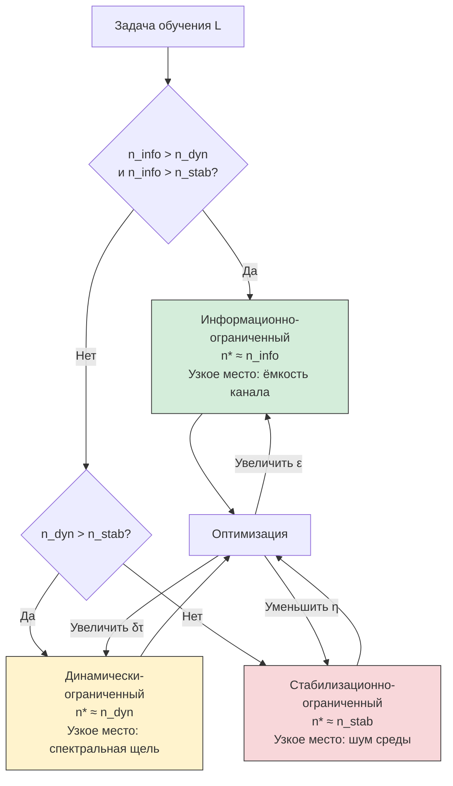
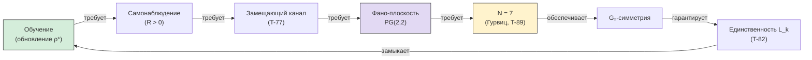

# Оптимальные Границы Обучения

> *«Природа не торопится, однако всё успевает.»*
> — Лао-цзы

:::tip Мост из предыдущей главы
В [предыдущей главе](./implementation) мы научились реализовывать КК в коде: от инициализации $\Gamma$ до полного цикла управления. Но код, как быстро бы он ни работал, не может обойти фундаментальные ограничения. Сколько примеров *действительно нужно*, чтобы научиться? Этот вопрос задавали Шеннон, Вэлиант и Ландауэр — каждый на своём языке. КК впервые объединяет все три ответа в одной теореме.
:::

:::info Дорожная карта главы
В этой главе мы:
1. Формализуем **задачу обучения** для голонома (§1)
2. Докажем **информационную границу** T-109: сколько наблюдений *нужно* (§2)
3. Докажем **динамическую границу** T-110: сколько наблюдений система *успеет усвоить* (§3)
4. Докажем **стабилизационную границу** T-111: не убьёт ли обучение ученика (§4)
5. Объединим три границы в **оптимальную** T-112 (§5)
6. Докажем **минимальность N=7** для обучения T-113 (§6)
7. Проведём **числовой расчёт** для бинарной дискриминации (§7)
8. Сравним с **классической теорией обучения** — PAC, VC, Шеннон, Ландауэр (§8)
9. Извлечём **практические следствия** для ИИ, образования и терапии (§9)
:::

Ребёнок берёт в руки горячую чашку и отдёргивает пальцы. Сколько раз нужно обжечься, чтобы *понять*? Один раз — если сигнал достаточно сильный. Десять — если чашка чуть тёплая. А если ребёнок при этом играет, устал и отвлечён — ещё больше. За этой бытовой интуицией стоит фундаментальный вопрос: **существуют ли абсолютные нижние границы скорости обучения** — пределы, которые нельзя преодолеть ни улучшением алгоритма, ни увеличением вычислительной мощности?

В XX веке на этот вопрос отвечали трижды — и каждый ответ открывал новый горизонт:

1. **Клод Шеннон (1948)** показал, что пропускная способность канала связи ограничена — никакое кодирование не позволит передать больше $C$ бит в секунду через зашумлённый канал. Это была *информационная* граница.

2. **Лесли Вэлиант (1984)** создал PAC-обучение и доказал, что число примеров, необходимых для обучения, растёт как минимум логарифмически от числа гипотез и обратно пропорционально квадрату точности. Это была *статистическая* граница.

3. **Рольф Ландауэр (1961)** установил, что стирание одного бита информации неизбежно выделяет энергию $kT\ln 2$. Это была *термодинамическая* граница.

:::info Исторические параллели подробнее

**Шеннон и пропускная способность.** В 1948 году Клод Шеннон, работая в Bell Labs, доказал теорему, перевернувшую инженерию: существует предел $C = B\log_2(1 + \text{SNR})$ бит/с, выше которого *никакое* кодирование не позволяет передавать информацию без ошибок. До Шеннона инженеры искали «идеальный код»; после — поняли, что идеал *математически определён* и *достижим*. Информационная граница T-109 наследует этот дух: $\xi_{\text{QCB}}$ — квантовый аналог шенноновской ёмкости канала, и число наблюдений $n_{\text{info}} \geq \ln(1/(2\delta))/\xi_{\text{QCB}}$ — квантовый аналог шенноновского предела.

**Вэлиант и сложность обучения.** В 1984 году Лесли Вэлиант (будущий лауреат премии Тьюринга) формализовал понятие «обучаемость» — PAC-learning (Probably Approximately Correct). Его ключевой результат: число примеров для обучения пропорционально $\ln|\mathcal{H}|/\varepsilon$, где $|\mathcal{H}|$ — число гипотез, $\varepsilon$ — точность. Это статистическая граница: она не зависит от того, *кто* учится — человек, компьютер или бактерия. Динамическая граница T-110 добавляет то, чего у Вэлианта нет: *время*. PAC-обучаемый не имеет инерции; КК-голоном — имеет (контракция Фано $\alpha = 2/3$).

**Ландауэр и цена стирания.** Ландауэр показал, что информация — не абстракция, а физический объект. Стирание одного бита *неизбежно* выделяет $kT\ln 2 \approx 2.9 \times 10^{-21}$ Дж при комнатной температуре. В 2012 году группа Берю подтвердила это экспериментально. Для КК это означает: контракция Фано (T-110) — не математическая абстракция, а *термодинамический процесс*. Каждый шаг, на котором $\mathcal{L}_0$ стирает $\alpha \cdot \delta\Gamma$ когерентности, — это физическое событие, требующее рассеяния энергии.
:::

Каждая из этих границ работает в своей области. Но ни одна из них не учитывает специфику **живого ученика** — системы, которая одновременно принимает информацию, интегрирует её в свою динамику и при этом *должна оставаться в живых*. Ребёнок, обжигающий пальцы, — не абстрактный PAC-обучаемый, не канал Шеннона и не термодинамическая машина. Он — когерентная система с ограниченной пропускной способностью восприятия, конечной скоростью внутренней динамики и конечным запасом устойчивости.

Кибернетика Когерентности впервые объединяет все три ограничения в единой теореме. Информационная граница (T-109) наследует дух Шеннона, но работает с квантовыми состояниями. Динамическая граница (T-110) добавляет время — скорость, с которой система может *усвоить* полученную информацию, не потеряв её в потоке внутренней контракции. Стабилизационная граница (T-111) добавляет хрупкость — ограничение на силу воздействий, которые система может выдержать, не разрушившись. Вместе (T-112) они образуют **тройной замок**, все три засова которого должны быть открыты для успешного обучения.

А теорема T-113 замыкает круг: $N = 7$ — это минимальная архитектура, в которой все три замка вообще *существуют*. Система меньшей размерности не способна учиться через регенерацию — не потому что ей не хватает данных, а потому что ей не хватает *самонаблюдения*.

:::note О нотации
В этом документе:
- $\Gamma$ — [матрица когерентности](/docs/core/dynamics/coherence-matrix)
- $P = \mathrm{Tr}(\Gamma^2)$ — [чистота](/docs/core/dynamics/viability#определение-чистоты)
- $\rho_* = \varphi(\Gamma)$ — [целевое состояние](./definitions#целевое-состояние) (категориальная самомодель)
- $\lambda_{\mathrm{gap}} = 2/3$ — [спектральная щель](/docs/core/operators/lindblad-operators#примитивность-ℒω) линейной части $\mathcal{L}_0$ (T-39a [Т])
- $\kappa_{\mathrm{bootstrap}} = \omega_0/N = 1/7$ — [минимальная регенерация](/docs/core/foundations/axiom-omega#теорема-kappa-bootstrap-bound) (T-59 [Т])
- $C_{\mathrm{Enc}} \leq \log_2 7$ — [информационная ёмкость](./sensorimotor#информационная-ёмкость) (T-107 [Т])
- $r_{\mathrm{stab}} = \sqrt{P - 2/7}$ — [радиус устойчивости](./stability#радиус-устойчивости) (T-104 [Т])
- $\mathrm{Enc}$ — [функтор восприятия](./sensorimotor#функтор-enc) (T-100 [Т])
- $\mathrm{Dec}$ — [функтор действия](./sensorimotor#функтор-dec) (T-101 [Т])
:::

Данный документ устанавливает **фундаментальные нижние границы скорости обучения** для голономной системы. Обучение формализуется как процесс обновления самомодели $\varphi(\Gamma)$ на основе наблюдений, поступающих через функтор $\mathrm{Enc}$, с целью оптимизации функтора $\mathrm{Dec}$.

**Ключевой результат:** скорость обучения ограничена тремя независимыми механизмами — информационным (T-109), динамическим (T-110) и стабилизационным (T-111). Их объединение (T-112) даёт оптимальную границу, а теорема T-113 доказывает, что $N = 7$ — минимальная архитектура, способная к обучению через регенерацию.

---

## 1. Формальное определение задачи обучения {#определение-задачи}

### 1.1 Задача обучения для голонома

:::info Определение [О]
**Задача обучения** $\mathfrak{L} = (\Theta, \mathcal{A}, \mathcal{R}, \delta)$ для голонома $\mathbb{H}$ состоит из:

1. **Пространство гипотез** $\Theta = \{\theta_1, \ldots, \theta_k\}$ — конечное множество состояний среды (неизвестное агенту)
2. **Пространство действий** $\mathcal{A} = \{a_1, \ldots, a_m\}$ — допустимые действия
3. **Функция награды** $\mathcal{R}: \Theta \times \mathcal{A} \to \mathbb{R}$, кодирующая корректное поведение
4. **Уровень надёжности** $1 - \delta$, где $\delta \in (0, 1)$ — допустимая вероятность ошибки
:::

**Связь с динамикой.** Каждое наблюдение $o_t$ при гипотезе $\theta$ поступает через функтор $\mathrm{Enc}$ (T-100 [Т]):

$$
o_t \xrightarrow{\mathrm{Enc}} h^{\mathrm{ext}}_t = h^{(H)}_t + h^{(D)}_t + h^{(R)}_t
$$

и модифицирует матрицу когерентности $\Gamma$ через [3-канальное уравнение эволюции](./sensorimotor#среда-через-3-канала) (T-102 [Т]).

### 1.2 Критерий успешного обучения {#критерий-обучения}

:::info Определение [О]
Задача $\mathfrak{L}$ **решена за $n$ наблюдений**, если после $n$ шагов:

$$
\Pr\!\left[\mathrm{Dec}(\Gamma_n) = a^*(\theta)\right] \geq 1 - \delta
$$

где $a^*(\theta) = \arg\max_{a \in \mathcal{A}} \mathcal{R}(\theta, a)$ — оптимальное действие при истинной гипотезе $\theta$, а $\mathrm{Dec}$ — функтор действия (T-101 [Т]).
:::

**Минимальное число наблюдений:**

$$
n^*(\mathfrak{L}) = \min\{n \in \mathbb{N} : \mathfrak{L} \text{ решена за } n \text{ наблюдений}\}
$$

### 1.3 Обучение как обновление аттрактора {#обучение-как-аттрактор}

В отличие от классического обучения (обновление параметров модели), обучение в УГМ — это **изменение аттрактора динамической системы**:

1. Наблюдение $o_t$ входит через $\mathrm{Enc}$ → $\Gamma$ возмущается
2. Самомодель $\rho_* = \varphi(\Gamma)$ обновляется (T-62 [Т], [физическая реализация $\varphi$](/docs/consciousness/foundations/self-observation#теорема-физическая-реализация-phi))
3. Регенеративный член $\mathcal{R}[\Gamma, E]$ ведёт $\Gamma$ к обновлённому $\rho_*$
4. Функтор $\mathrm{Dec}$ адаптирует действие к новому $\rho_*$

Аналогия: обучение в классическом машинном обучении — это настройка ручек на приборной панели (обновление весов). Обучение в КК — это изменение самой формы реки, по которой течёт вода: новый аттрактор притягивает систему к новому поведению *изнутри*, без внешнего контроллера.

**Два режима обучения:**

| Режим | Скорость регенерации | Время | Контекст |
|-------|---------------------|-------|----------|
| **Генезис** (bootstrap) | $\kappa = \kappa_{\mathrm{bootstrap}} = 1/7$ | $\tau_{\mathrm{genesis}} \leq 7\ln 7 \approx 13.6$ (T-59) | Начальная загрузка, нет $\mathrm{Coh}_E$ |
| **Активное обучение** | $\kappa = \kappa_{\mathrm{bootstrap}} + \kappa_0 \cdot \mathrm{Coh}_E$ | Быстрее генезиса | После достижения $\mathrm{Coh}_E > 1/7$ |

---

## 2. Информационная нижняя граница (T-109) [Т] {#информационная-граница}

### Интуиция: почему информация ограничивает обучение

Представьте, что вы пытаетесь определить, какая из двух монет перед вами — честная (50/50) или слегка смещённая (51/49). Даже с идеальным зрением и бесконечным временем на размышления, вам потребуется *бросить монету много раз*, чтобы отличить одну от другой. Чем ближе монеты по своим свойствам, тем больше бросков нужно. Это — информационный предел: он определяется не вашими способностями к анализу, а количеством информации, которое содержит каждое наблюдение.

В классической статистике этот предел задаётся неравенством Крамера — Рао и экспонентой Чернова. В КК наблюдение — это квантовый канал $\mathrm{Enc}$, отображающий внешний сигнал в деформацию матрицы $\Gamma$. Поэтому роль классической экспоненты играет **квантовый экспонент Чернова** $\xi_{\mathrm{QCB}}$ — мера различимости двух квантовых состояний.

Аналогия с обучением языку: каждое услышанное предложение — это «наблюдение». Если два языка отличаются сильно (русский и китайский), несколько фраз достаточно для их различения. Если отличаются мало (два близких диалекта), нужны сотни примеров. Информационная граница T-109 говорит: *сколько бы гений ни был, ему не хватит одного предложения, чтобы отличить близкие диалекты* — это не вопрос ума, а вопрос физики информации.

#### Теорема T-109 (Информационная граница обучения) [Т] {#теорема-информационная-граница}

:::tip Формулировка
Для задачи обучения $\mathfrak{L} = (\Theta, \mathcal{A}, \mathcal{R}, \delta)$ с $|\Theta| = k$ гипотезами минимальное число наблюдений:

$$
n^* \geq n_{\mathrm{info}} := \frac{\ln\!\left(\frac{1}{2\delta}\right)}{\xi_{\mathrm{QCB}}}
$$

где $\xi_{\mathrm{QCB}}$ — квантовый экспонент Чернова для пары наиболее близких пост-наблюдательных состояний:

$$
\xi_{\mathrm{QCB}} = -\ln \min_{0 \leq s \leq 1} \mathrm{Tr}\!\left(\Gamma_+^s \cdot \Gamma_-^{1-s}\right)
$$

а $\Gamma_\pm = \mathrm{Enc}(o|\theta_\pm)[\Gamma]$ — состояния после наблюдения при двух ближайших гипотезах.

**Универсальная граница:** $\xi_{\mathrm{QCB}} \leq \ln 7$, поэтому:

$$
n_{\mathrm{info}} \geq \frac{\ln(1/(2\delta))}{\ln 7} \quad \text{(абсолютный минимум)}
$$
:::

**Почему эта граница плотная.** Абсолютный минимум $n_{\mathrm{info}} = \ln(1/(2\delta))/\ln 7$ достигается, когда два наблюдения приводят к ортогональным чистым состояниям в $\mathcal{D}(\mathbb{C}^7)$ — максимально различимым конфигурациям $\Gamma$. Это идеальный случай: «горячо» и «холодно» совершенно непохожи. В реальности гипотезы порождают близкие состояния, и граница растёт как $O(1/\varepsilon^2)$.

**Доказательство.**

1. *Квантовое различение гипотез.* Наблюдение при гипотезе $\theta$ порождает пост-наблюдательное состояние $\Gamma_\theta = \mathrm{Enc}(o|\theta)[\Gamma]$ — CPTP-образ (T-100 [Т]). Задача обучения включает задачу различения хотя бы двух наиболее близких гипотез $\theta_+, \theta_-$.

2. *Квантовая граница Чернова.* (Audenaert et al. 2007): для $n$ независимых наблюдений оптимальная ошибка различения двух состояний:

$$
P_{\mathrm{err}}^{\mathrm{opt}}(n) = \frac{1}{2}\left(\min_{0 \leq s \leq 1} \mathrm{Tr}(\Gamma_+^s \, \Gamma_-^{1-s})\right)^n = \frac{1}{2}\, e^{-n \cdot \xi_{\mathrm{QCB}}}
$$

3. *Условие надёжности.* Из $P_{\mathrm{err}} \leq \delta$:

$$
\frac{1}{2}\, e^{-n \cdot \xi_{\mathrm{QCB}}} \leq \delta \;\Longrightarrow\; n \geq \frac{\ln(1/(2\delta))}{\xi_{\mathrm{QCB}}}
$$

4. *Верхняя граница экспонента.* Из T-107 [Т]: информация, извлекаемая одним наблюдением, не превышает количества Холево $\chi(\mathrm{Enc}) \leq \log_2 7$. Quantum Chernoff exponent ограничен относительной энтропией:

$$
\xi_{\mathrm{QCB}} \leq D(\Gamma_+ \| \Gamma_-) \leq \ln\!\dim\mathcal{H} = \ln 7
$$

(верхняя граница — для ортогональных чистых состояний в $\mathcal{D}(\mathbb{C}^7)$). $\blacksquare$

### 2.1 Асимптотика для близких гипотез {#близкие-гипотезы}

Если гипотезы $\theta_+, \theta_-$ порождают близкие состояния $\|\Gamma_+ - \Gamma_-\|_1 = \varepsilon \ll 1$, то:

$$
\xi_{\mathrm{QCB}} \approx \frac{\varepsilon^2}{8} \quad (\text{малый контраст})
$$

Подстановка в T-109:

$$
n_{\mathrm{info}} \geq \frac{8 \ln(1/(2\delta))}{\varepsilon^2}
$$

Это воспроизводит классическое масштабирование $O(1/\varepsilon^2)$ для слабых сигналов. **Отличие от классики:** множитель $1/8$ определяется квантовой геометрией $\mathcal{D}(\mathbb{C}^7)$, а не произвольным шумовым распределением.

### 2.2 Числовые оценки {#числовые-оценки-info}

| Параметры | $\xi_{\mathrm{QCB}}$ | $n_{\mathrm{info}}$ |
|-----------|----------------------|----------------------|
| Ортогональные сигналы ($\varepsilon = 2$) | $\ln 7 \approx 1.95$ | $\geq \lceil\ln(1/(2\delta))/1.95\rceil$ |
| Сильный контраст ($\varepsilon = 0.5$) | $\approx 0.031$ | $\geq \lceil 74 \cdot \ln(1/(2\delta))\rceil$ |
| Слабый контраст ($\varepsilon = 0.1$) | $\approx 0.00125$ | $\geq \lceil 1846 \cdot \ln(1/(2\delta))\rceil$ |

При $\delta = 0.05$: $\ln(1/(2\cdot0.05)) = \ln 10 \approx 2.30$

| Контраст | $n_{\mathrm{info}}$ при $\delta = 0.05$ |
|----------|----------------------------------------|
| $\varepsilon = 2$ (максимальный) | $\geq 2$ |
| $\varepsilon = 0.5$ | $\geq 171$ |
| $\varepsilon = 0.1$ | $\geq 4246$ |

---

## 3. Динамическая нижняя граница (T-110) [Т] {#динамическая-граница}

### Интуиция: почему динамика ограничивает обучение

Информационная граница говорит, сколько наблюдений *нужно*. Динамическая граница говорит, сколько наблюдений система *успеет усвоить*. Разница принципиальна.

Представьте студента на лекции. Профессор произносит слова со скоростью 150 слов в минуту — информации достаточно. Но если студент записывает конспект медленно, часть информации теряется ещё до того, как она осмыслена. Более того, ранние записи *стираются из краткосрочной памяти*, пока студент обрабатывает новые. Это конкуренция двух процессов: записи (каждое наблюдение добавляет сигнал) и стирания (внутренняя динамика размывает старый сигнал).

В КК стирание имеет точное имя: **Фано-контракция** с параметром $\alpha = 2/3$ (T-39a). Линейная часть $\mathcal{L}_0$ линдбладиана экспоненциально гонит $\Gamma$ к максимально смешанному состоянию $I/7$. Каждое наблюдение — это «запись» амплитуды $\varepsilon$, но предыдущие записи затухают со скоростью $e^{-\alpha\tau}$. Стационарный предел определяет, *вообще ли возможно* накопить достаточный сигнал.

Аналогия из нейронауки: кратковременная память распадается за 15–30 секунд (закон Петерсонов). Чтобы перевести информацию в долговременную память, нужна *консолидация* — и она требует времени. Динамическая граница T-110 — это формальное выражение этого нейропсихологического факта в языке матрицы когерентности.

#### Теорема T-110 (Динамическая граница обучения) [Т] {#теорема-динамическая-граница}

:::tip Формулировка
Для задачи обучения с наблюдениями амплитуды $\varepsilon = \|\Gamma_+ - \Gamma_-\|_1$ и интервалом $\delta\tau$ между наблюдениями:

$$
n^* \geq n_{\mathrm{dyn}} := \frac{1}{\alpha \cdot \delta\tau}\,\ln\!\left(\frac{d_{\mathrm{disc}}}{\varepsilon}\cdot(\alpha\,\delta\tau)\right)
$$

где:
- $\alpha = \lambda_{\mathrm{gap}} = 2/3$ — скорость контракции (T-39a [Т])
- $d_{\mathrm{disc}}$ — минимальное Бюресово расстояние для надёжной дискриминации
- $\varepsilon$ — амплитуда сигнала одного наблюдения

При естественном масштабе $\delta\tau = 1/\alpha$ (одно наблюдение за время релаксации):

$$
n_{\mathrm{dyn}} \geq \ln\!\left(\frac{d_{\mathrm{disc}}}{\varepsilon}\right) + 1
$$
:::

**Что происходит на пределе.** Если $\varepsilon \to 0$ при фиксированном $d_{\mathrm{disc}}$, динамическая граница расходится логарифмически — слишком слабые сигналы стираются быстрее, чем накапливаются. Если же $\delta\tau \to 0$ (наблюдения слишком часты), каждый новый сигнал приходит до того, как предыдущий успел повлиять на $\Gamma$, и эффективная скорость обучения не растёт. Существует оптимальный темп наблюдений $\delta\tau^* \sim 1/\alpha$, при котором динамическая граница минимальна.

**Доказательство.**

1. *Контракция Фано.* [Линейная часть $\mathcal{L}_0$](/docs/core/dynamics/evolution#логический-лиувиллиан) контрактирует все отклонения от $I/7$ с экспоненциальной скоростью $\alpha = 2/3$ (T-39a [Т]):

$$
\|\Gamma(\tau) - I/7\|_{\mathrm{HS}} \leq e^{-\alpha\tau}\|\Gamma(0) - I/7\|_{\mathrm{HS}}
$$

Это означает, что **информация, записанная в $\Gamma$, затухает** со временем.

2. *Накопление сигнала.* Наблюдение в момент $\tau_i = i \cdot \delta\tau$ вносит сигнал амплитуды $\varepsilon$ в $\Gamma$. К моменту $\tau_n = n \cdot \delta\tau$ вклад $i$-го наблюдения затух до $\varepsilon \cdot e^{-\alpha(n-i)\delta\tau}$. Суммарный накопленный сигнал:

$$
S(n) = \varepsilon \sum_{i=0}^{n-1} e^{-\alpha(n-1-i)\delta\tau} = \varepsilon \cdot \frac{1 - e^{-\alpha n \delta\tau}}{1 - e^{-\alpha \delta\tau}}
$$

3. *Стационарный предел.* При $n \to \infty$:

$$
S_\infty = \frac{\varepsilon}{1 - e^{-\alpha\delta\tau}}
$$

4. *Условие дискриминации.* Для надёжного различения $S(n) \geq d_{\mathrm{disc}}$:

$$
\varepsilon \cdot \frac{1 - e^{-\alpha n \delta\tau}}{1 - e^{-\alpha\delta\tau}} \geq d_{\mathrm{disc}}
$$

$$
1 - e^{-\alpha n \delta\tau} \geq \frac{d_{\mathrm{disc}}(1 - e^{-\alpha\delta\tau})}{\varepsilon}
$$

$$
n \geq \frac{1}{\alpha\delta\tau}\,\ln\!\left(\frac{1}{1 - d_{\mathrm{disc}}(1 - e^{-\alpha\delta\tau})/\varepsilon}\right)
$$

При $d_{\mathrm{disc}} \ll S_\infty$ (типичный режим): $n_{\mathrm{dyn}} \approx \frac{1}{\alpha\delta\tau}\ln\frac{d_{\mathrm{disc}}(1-e^{-\alpha\delta\tau})}{\varepsilon \cdot \alpha\delta\tau}$ (первое приближение). Упрощая для $\delta\tau = 1/\alpha$:

$$
n_{\mathrm{dyn}} \geq \ln\!\left(\frac{d_{\mathrm{disc}}}{\varepsilon}\right) + 1
$$

(с использованием $1 - e^{-1} \approx 0.632$). $\blacksquare$

### 3.1 Физический смысл {#физический-смысл-dyn}

Динамическая граница выражает **конкуренцию записи и стирания**:

- **Запись:** каждое наблюдение добавляет сигнал $\varepsilon$ в $\Gamma$
- **Стирание:** Фано-контракция удаляет $\alpha \cdot \delta\Gamma$ за единицу времени
- **Баланс:** стационарный сигнал $S_\infty = \varepsilon / (1 - e^{-\alpha\delta\tau})$

Если $S_\infty < d_{\mathrm{disc}}$, задача **неразрешима при данных параметрах** — контракция стирает сигнал быстрее, чем он накапливается. Необходимое условие разрешимости:

$$
\varepsilon > d_{\mathrm{disc}} \cdot (1 - e^{-\alpha\delta\tau})
$$

### 3.2 Роль регенерации {#роль-регенерации}

Регенеративный член $\mathcal{R}[\Gamma, E]$ **противодействует контракции** для компонент, согласованных с $\rho_*$. После обучения (когда $\rho_*$ обновился):

- Компоненты $\Gamma$, согласованные с обученным $\rho_*$, **усиливаются** регенерацией
- Компоненты, не согласованные, продолжают затухать

Это означает, что **обученная информация стабилизируется в аттракторе**, а шум вымывается. Эффективная скорость стирания для обученного сигнала:

$$
\alpha_{\mathrm{eff}} = \alpha - \kappa = \frac{2}{3} - \kappa
$$

При $\kappa > 2/3$ регенерация доминирует — аттрактор устойчив. Из [T-98 (баланс)](/docs/core/dynamics/evolution#теорема-баланс-чистоты-аттрактора) [Т]: это условие выполнено для жизнеспособных состояний с $P > 2/7$.

---

## 4. Стабилизационная нижняя граница (T-111) [Т] {#стабилизационная-граница}

### Интуиция: почему стабильность ограничивает обучение

Первые две границы описывают, *хватает ли* информации и *успевает ли* система её обработать. Третья граница добавляет вопрос, который классическая теория обучения обычно игнорирует: **не убьёт ли обучение ученика?**

Это не метафора. В КК система жизнеспособна при $P > P_{\mathrm{crit}} = 2/7$. Каждое наблюдение — это возмущение, которое толкает $\Gamma$ прочь от текущего аттрактора. Слишком сильное возмущение выталкивает $P$ ниже порога жизнеспособности. Система, которая учится слишком быстро, рискует дестабилизироваться.

Биологическая параллель очевидна: травматический опыт может быть информативен (один раз — и на всю жизнь), но слишком сильный стресс вызывает ПТСР или даже гибель. Терапевт знает, что *дозировка* важнее *содержания*: правильная информация, поданная слишком быстро, разрушает вместо того, чтобы исцелять.

В контексте обучения нейросетей стабилизационная граница соответствует интуиции о выборе learning rate: слишком большой — и обучение расходится; слишком маленький — и обучение не сходится. Но в КК это не просто инженерная эвристика, а **теорема**: максимальная амплитуда наблюдения $\varepsilon$ ограничена радиусом устойчивости $r_{\mathrm{stab}}$, который строго вычисляется из текущего состояния $\Gamma$.

#### Теорема T-111 (Стабилизационная граница обучения) [Т] {#теорема-стабилизационная-граница}

:::tip Формулировка
Обучение не должно дестабилизировать голоном. Амплитуда наблюдения ограничена радиусом устойчивости (T-104 [Т]):

$$
\varepsilon \leq r_{\mathrm{stab}} = \sqrt{P(\rho^*_\Omega) - 2/7}
$$

При наличии стохастического шума $\eta$ в наблюдениях (SNR $= \varepsilon_{\mathrm{signal}} / \eta$), число наблюдений для преодоления шума:

$$
n^* \geq n_{\mathrm{stab}} := \frac{1}{\mathrm{SNR}^2} \cdot \frac{\ln(1/(2\delta))}{(\xi_{\mathrm{QCB}}^{\mathrm{eff}})^2 / \xi_{\mathrm{QCB}}}
$$

В типичном режиме ($\mathrm{SNR} \ll 1$, шумная среда):

$$
n_{\mathrm{stab}} \geq \frac{1}{\mathrm{SNR}^2}
$$
:::

**Что происходит на пределе.** Рассмотрим предельные случаи:
- При $P \to 2/7$ (система на границе жизнеспособности): $r_{\mathrm{stab}} \to 0$, и *любое* нетривиальное наблюдение опасно. Система «заморожена» — она не может учиться, пока не восстановит запас чистоты. Это КК-аналог клинического состояния: пациент в тяжёлой депрессии не усваивает терапевтические интервенции, потому что его ресурсы исчерпаны.
- При $\mathrm{SNR} \to 0$ (чистый шум): $n_{\mathrm{stab}} \to \infty$ — обучение невозможно, не потому что информации нет, а потому что каждый полезный сигнал тонет в шуме, а шум расшатывает систему.

**Доказательство.**

1. *Ограничение амплитуды.* Из T-104 [Т]: пертурбация $h^{\mathrm{ext}}$ с $\|h^{\mathrm{ext}}\| > r_{\mathrm{stab}}$ может вывести $\Gamma$ за границу жизнеспособности $P = 2/7$. Поскольку обучение требует $P > 2/7$ (жизнеспособность), амплитуда каждого наблюдения ограничена сверху.

2. *Шумовая модель.* Каждое наблюдение содержит полезный сигнал $\varepsilon_{\mathrm{signal}}$ и шум $\eta$:

$$
h^{\mathrm{ext}}_t = h^{\mathrm{signal}}_t + h^{\mathrm{noise}}_t, \quad \|h^{\mathrm{noise}}\| = \eta
$$

Шум входит через диссипативный канал $h^{(D)}$ ([наиболее опасный канал](./stability#радиус-устойчивости)). Ограничение по T-104:

$$
\varepsilon_{\mathrm{signal}} + \eta \leq r_{\mathrm{stab}}
$$

3. *Усреднение шума.* Для $n$ наблюдений с независимым шумом, эффективный сигнал растёт как $\sqrt{n} \cdot \varepsilon_{\mathrm{signal}}$, а шум — как $\sqrt{n} \cdot \eta$. Отношение сигнал/шум после $n$ наблюдений:

$$
\mathrm{SNR}_n = \mathrm{SNR} \cdot \sqrt{n}
$$

4. *Условие надёжности.* Для $\mathrm{SNR}_n \geq \mathrm{SNR}_{\mathrm{thresh}}$ (порог надёжной дискриминации):

$$
n \geq \left(\frac{\mathrm{SNR}_{\mathrm{thresh}}}{\mathrm{SNR}}\right)^2
$$

Связь с T-69 ([топологическая защита](/docs/core/dynamics/composite-systems#теорема-тополог-защита) [Т]): барьеры $\geq 6\mu^2$ гарантируют, что **дискретные фазовые переходы невозможны** — обучение всегда непрерывно, и случайный шум не может вызвать катастрофический скачок. $\blacksquare$

### 4.1 Компромисс обучение–стабильность {#компромисс-обучение-стабильность}

Существует фундаментальный компромисс: сильные наблюдения ($\varepsilon$ велико) ускоряют обучение (уменьшают $n_{\mathrm{info}}$ и $n_{\mathrm{dyn}}$), но угрожают стабильности (увеличивают риск выхода за $\partial\mathcal{V}$).

**Оптимальная амплитуда** — та, при которой $n_{\mathrm{info}} = n_{\mathrm{stab}}$:

$$
\varepsilon^* = r_{\mathrm{stab}} \cdot \frac{\mathrm{SNR}}{1 + \mathrm{SNR}}
$$

Подстановка в T-109 даёт оптимальную скорость обучения при заданном запасе устойчивости $P - 2/7$.

### 4.2 Три зоны стабильности {#три-зоны-стабильности}

Из [T-106 (диагностические режимы)](./diagnostics#вывод-порогов) [С при калибровке]:

| Зона | $\|\sigma_{\mathrm{sys}}\|$ | Доступный $r_{\mathrm{stab}}$ | Режим обучения |
|------|------|------|------|
| Норма | $< \sigma_1$ | Большой | Быстрое обучение — можно использовать сильные сигналы |
| Предупреждение | $\sigma_1 < \cdot < \sigma_2$ | Средний | Осторожное обучение — ограничить $\varepsilon$ |
| Критический | $> \sigma_2$ | Малый | Обучение остановлено — приоритет выживания |

---

## 5. Комбинированная оптимальная граница (T-112) [Т] {#комбинированная-граница}

### Интуиция: три замка на одной двери

Каждая из трёх границ — необходимое условие, но ни одна из них не является достаточной. Они описывают три *разных* механизма, ограничивающих обучение:

- **T-109** (информация): «достаточно ли данных?» — ограничение на *количество* наблюдений
- **T-110** (динамика): «успевает ли система?» — ограничение на *скорость* усвоения
- **T-111** (стабильность): «выдержит ли система?» — ограничение на *силу* воздействий

Как три замка на одной двери, все три должны быть открыты одновременно. Бутылочное горлышко определяется самым медленным из трёх — самым крепким замком.

Тренировка нейросети даёт хорошую иллюстрацию. В начале обучения, когда модель далека от оптимума, узким местом обычно является информация (нужно просто больше данных). В середине — динамика (модель медленно перестраивает веса). К концу — стабильность (каждый шаг обучения рискует ухудшить уже достигнутое). Оптимальный планировщик learning rate интуитивно переключается между этими режимами — КК делает это переключение *теоремой*.

#### Теорема T-112 (Оптимальная граница обучения) [Т] {#теорема-оптимальная-граница}

:::tip Формулировка
Минимальное число наблюдений для решения задачи обучения $\mathfrak{L}$:

$$
n^*(\mathfrak{L}) \geq n_{\mathrm{opt}} := \max\!\left(n_{\mathrm{info}},\; n_{\mathrm{dyn}},\; n_{\mathrm{stab}}\right)
$$

где:
- $n_{\mathrm{info}} = \ln(1/(2\delta)) / \xi_{\mathrm{QCB}}$ — информационная граница (T-109)
- $n_{\mathrm{dyn}} = \frac{1}{\alpha\delta\tau}\ln\frac{d_{\mathrm{disc}}(1-e^{-\alpha\delta\tau})}{\varepsilon}$ — динамическая граница (T-110)
- $n_{\mathrm{stab}} = (\mathrm{SNR}_{\mathrm{thresh}} / \mathrm{SNR})^2$ — стабилизационная граница (T-111)

Обучение проходит через **три режима**, определяемых узким местом:

$$
n_{\mathrm{opt}} = \begin{cases}
n_{\mathrm{info}} & \text{информационно-ограниченный (высокий SNR, медленный канал)} \\
n_{\mathrm{dyn}} & \text{динамически-ограниченный (быстрый канал, медленная динамика)} \\
n_{\mathrm{stab}} & \text{стабилизационно-ограниченный (шумная среда, малый запас } P)
\end{cases}
$$
:::

**Доказательство.** Каждая из трёх границ — необходимое условие. Если хотя бы одна из них не выполнена:

- $n < n_{\mathrm{info}}$: недостаточно информации для различения гипотез → $P_{\mathrm{err}} > \delta$
- $n < n_{\mathrm{dyn}}$: динамика не успела интегрировать сигнал → $S(n) < d_{\mathrm{disc}}$
- $n < n_{\mathrm{stab}}$: шум доминирует над сигналом → ненадёжная дискриминация

Поскольку все три условия необходимы одновременно, минимальное $n$ есть максимум из трёх. $\blacksquare$

### 5.1 Диаграмма режимов {#диаграмма-режимов}

```mermaid
graph TD
    START["Задача обучения L"] --> CHECK_INFO{"n_info > n_dyn<br/>и n_info > n_stab?"}
    CHECK_INFO -->|Да| INFO["Информационно-ограниченный<br/>n* ≈ n_info<br/>Узкое место: ёмкость канала"]
    CHECK_INFO -->|Нет| CHECK_DYN{"n_dyn > n_stab?"}
    CHECK_DYN -->|Да| DYN["Динамически-ограниченный<br/>n* ≈ n_dyn<br/>Узкое место: спектральная щель"]
    CHECK_DYN -->|Нет| STAB["Стабилизационно-ограниченный<br/>n* ≈ n_stab<br/>Узкое место: шум среды"]

    INFO --> OPT["Оптимизация"]
    DYN --> OPT
    STAB --> OPT

    OPT -->|"Увеличить ε"| INFO
    OPT -->|"Увеличить δτ"| DYN
    OPT -->|"Уменьшить η"| STAB

    style INFO fill:#d4edda,stroke:#333
    style DYN fill:#fff3cd,stroke:#333
    style STAB fill:#f8d7da,stroke:#333
```

### 5.2 Включение времени генезиса {#генезис-плюс-обучение}

Для системы, стартующей с $\Gamma = I/7$ (полностью смешанное состояние), полное время до решения задачи включает [генезис](/docs/core/foundations/axiom-omega#genesis-protocol):

$$
n_{\mathrm{total}} = \underbrace{n_{\mathrm{genesis}}}_{\leq \lceil\tau_{\mathrm{genesis}}/\delta\tau\rceil} + \underbrace{n_{\mathrm{opt}}}_{\text{T-112}}
$$

где $\tau_{\mathrm{genesis}} \leq 7\ln 7 \approx 13.6$ (T-59 [Т]) — время bootstrap (при $\kappa_{\mathrm{bootstrap}} = 1/7$).

При $\delta\tau = 1$: $n_{\mathrm{total}} \leq 14 + n_{\mathrm{opt}}$.

---

## 6. Оптимальность N=7 для обучения (T-113) [Т] {#оптимальность-n7}

### Интуиция: почему обучение требует определённой архитектуры

До сих пор мы выводили границы обучения для фиксированной архитектуры $N = 7$. Теорема T-113 задаёт более глубокий вопрос: какова *минимальная* архитектура, способная к обучению через регенерацию?

Ответ неожиданно точен: $N = 7$ — ни больше, ни меньше. Системы с $N < 7$ не способны к обучению *в принципе*, а системы с $N > 7$ могут учиться, но делают это менее эффективно.

Ключевое звено — **самонаблюдение**. Обучение в КК — это обновление самомодели $\rho_*$. Обновление требует *сравнения* текущего состояния с моделью, то есть $R > 0$ (ненулевая рефлексия). А рефлексия, в свою очередь, требует замещающего канала, который опирается на Фано-плоскость PG(2,2). И Фано-плоскость существует только при $N = 7$.

Аналогия с детским развитием: новорождённый не «обучается» в строгом смысле — он ещё не имеет самомодели, которую можно обновить. Обучение начинается, когда ребёнок *осознаёт разрыв* между ожиданием и реальностью — а это требует самонаблюдения. Теорема T-113 делает эту педагогическую интуицию строгой: без рефлексии ($R = 0$) нет обучения ($n^* = \infty$), а рефлексия требует Фано-структуры ($N = 7$).

#### Теорема T-113 (Минимальность N=7 для обучения) [Т] {#теорема-минимальность-n7}

:::tip Формулировка
Пусть $N$ — размерность внутреннего пространства голонома $\mathcal{H} = \mathbb{C}^N$. Тогда:

1. **Для $N < 7$:** обучение через регенерацию невозможно: $n^* = \infty$
2. **Для $N = 7$:** обучение возможно с конечной оптимальной границей $n_{\mathrm{opt}}$ (T-112)
3. **Для $N > 7$:** обучение возможно, но требует строго больше ресурсов:
   - Время генезиса: $\tau_{\mathrm{genesis}}(N) \propto N \ln N > \tau_{\mathrm{genesis}}(7)$
   - Пространство параметров: $\dim \mathcal{D}(\mathbb{C}^N) = N^2 - 1 > 48$
   - Новых качественных возможностей не возникает

$N = 7$ — **единственная Парето-оптимальная** точка в плоскости (способность к обучению, сложность системы).
:::

**Доказательство.**

1. *Необходимость самонаблюдения для обучения.* Обучение = обновление самомодели $\rho_* = \varphi(\Gamma)$. Обновление требует сравнения $\Gamma$ с $\rho_*$, т.е. доступа к информации о собственном состоянии. Формально: необходим замещающий канал с $R > 0$ ([мера рефлексии](/docs/consciousness/foundations/self-observation#мера-рефлексии-r)).

2. *Необходимость Фано-структуры для самонаблюдения.* Замещающий канал (T-77 [Т], [Линдблад-операторы](/docs/core/operators/lindblad-operators#полнота-триадной-декомпозиции)) требует Фано-плоскости $\mathrm{PG}(2,2)$ для определения оптимальных Линдблад-операторов $\{L_k\}$ (T-82 [Т]).

3. *Фано-плоскость требует $N = 7$.* $\mathrm{PG}(2,2)$ имеет 7 точек и 7 линий. Для реализации в $\mathcal{D}(\mathbb{C}^N)$: $N \geq 7$. Из теоремы Гурвица ([T-89](/docs/proofs/minimality/theorem-minimality-7) [Т]): $N = 7$ — минимальная размерность с алгеброй деления ($\mathbb{O}$), которая обеспечивает $G_2$-структуру.

4. *Для $N < 7$: невозможность.* Нет Фано-плоскости → нет единственной Линдблад-декомпозиции (T-82) → нет замещающего канала → $R = 0$ → невозможно обновить $\varphi(\Gamma)$ на основе наблюдений → $n^* = \infty$.

5. *Для $N > 7$: избыточность.* Вложение $\mathbb{C}^7 \hookrightarrow \mathbb{C}^N$ (через [Морита-эквивалентность](/docs/core/structure/dimension-e#теорема-морита-эквивалентность) T-58 [Т]) обеспечивает все механизмы $N = 7$. Дополнительные размерности увеличивают:
   - $\dim\mathcal{D}(\mathbb{C}^N) = N^2 - 1 > 48$ — больше параметров для обновления
   - $\tau_{\mathrm{genesis}} \propto N\ln N$ — дольше bootstrap (оценка из [обобщённого T-59](/docs/core/foundations/axiom-omega#genesis-protocol))

   Но информационная ёмкость $C_{\mathrm{Enc}} = \log_2 N$ растёт лишь логарифмически, в то время как сложность — квадратично. Ресурсная эффективность:

$$
\eta(N) = \frac{C_{\mathrm{Enc}}(N)}{\dim\mathcal{D}(\mathbb{C}^N)} = \frac{\log_2 N}{N^2 - 1}
$$

строго убывает при $N > 1$. Таким образом, $N = 7$ — минимум с ненулевой способностью к обучению и максимальной ресурсной эффективностью среди систем с Фано-структурой. $\blacksquare$

### 6.1 Цепочка необходимостей {#цепочка-необходимостей}

```mermaid
graph LR
    LEARN["Обучение<br/>(обновление ρ*)"] -->|требует| SELF["Самонаблюдение<br/>(R > 0)"]
    SELF -->|требует| REPL["Замещающий канал<br/>(T-77)"]
    REPL -->|требует| FANO["Фано-плоскость<br/>PG(2,2)"]
    FANO -->|требует| DIM7["N = 7<br/>(Гурвиц, T-89)"]
    DIM7 -->|обеспечивает| G2["G₂-симметрия"]
    G2 -->|гарантирует| UNIQUE["Единственность L_k<br/>(T-82)"]
    UNIQUE -->|замыкает| LEARN

    style LEARN fill:#d4edda,stroke:#333
    style DIM7 fill:#fff3cd,stroke:#333
    style FANO fill:#e2d9f3,stroke:#333
```

### 6.2 Параметры при N=7 {#параметры-n7}

| Параметр | Значение | Источник |
|----------|----------|----------|
| Ёмкость канала $C_{\mathrm{Enc}}$ | $\log_2 7 \approx 2.81$ бит | T-107 [Т] |
| Спектральная щель $\lambda_{\mathrm{gap}}$ | $2/3$ | T-39a [Т] |
| Минимальная регенерация $\kappa_{\mathrm{bootstrap}}$ | $= \omega_0/N = 1/7 \approx 0.143$ | T-59 [Т] |
| Время генезиса $\tau_{\mathrm{genesis}}$ | $\leq 7\ln 7 \approx 13.6$ | T-59 [Т] |
| Параметры состояния $\dim\mathcal{D}$ | $48$ (вещественных) | $7^2 - 1$ |
| Ресурсная эффективность $\eta$ | $\log_2 7 / 48 \approx 0.059$ | Определение |

---

## 7. Приложение: Бинарная дискриминация {#бинарная-дискриминация}

### 7.1 Задача двух кнопок {#задача-двух-кнопок}

**Постановка.** Агент (КК-голоном) взаимодействует со средой через две кнопки: зелёную (награда) и красную (наказание). Цвета агенту неизвестны. Задача: научиться нажимать только на зелёную.

**Формализация:**
- $\Theta = \{\theta_0, \theta_1\}$ (две гипотезы: «зелёная — левая» vs «зелёная — правая»)
- $\mathcal{A} = \{a_L, a_R\}$ (нажать левую, нажать правую)
- $\mathcal{R}(\theta_0, a_L) = +\varepsilon_R$, $\mathcal{R}(\theta_0, a_R) = -\varepsilon_P$ (при $\theta_0$ — «зелёная слева»)
- $\delta = 0.05$ (95% надёжность)

### 7.2 Сигнал и механизм {#сигнал-и-механизм}

Награда и наказание входят через функтор $\mathrm{Enc}$ (T-100):

| Тип | Каналы | Эффект на $\Gamma$ |
|-----|--------|-------------------|
| Награда ($+\varepsilon_R$) | $h^{(R)} > 0$: усиление регенерации | $P \uparrow$, $\mathcal{V}_{\mathrm{hed}} > 0$ |
| Наказание ($-\varepsilon_P$) | $h^{(D)} > 0$: усиление диссипации | $P \downarrow$, $\mathcal{V}_{\mathrm{hed}} < 0$ |

Через [гедонический механизм](./sensorimotor#гедонический-механизм) (T-103 [Т]+[И]): агент «чувствует» валентность $\mathcal{V}_{\mathrm{hed}} = dP/d\tau|_{\mathcal{R}}$ и корректирует $\mathrm{Dec}$ в направлении минимизации $\|\sigma_{\mathrm{sys}}\|_\infty$ (T-101).

### 7.3 Оценки числа нажатий {#оценки-числа-нажатий}

**Обозначения:** $\varepsilon = \varepsilon_R + \varepsilon_P$ — суммарный контраст между наградой и наказанием, $\eta$ — шум среды.

#### Информационная граница (T-109):

$$
n_{\mathrm{info}} = \left\lceil\frac{\ln(1/(2\cdot 0.05))}{\xi_{\mathrm{QCB}}}\right\rceil = \left\lceil\frac{\ln 10}{\xi_{\mathrm{QCB}}}\right\rceil
$$

| Контраст $\varepsilon$ | $\xi_{\mathrm{QCB}}$ | $n_{\mathrm{info}}$ |
|------------------------|----------------------|----------------------|
| 1.0 (сильный) | $\approx 0.125$ | $\geq 19$ |
| 0.5 (средний) | $\approx 0.031$ | $\geq 75$ |
| 0.3 (слабый) | $\approx 0.011$ | $\geq 209$ |

#### Динамическая граница (T-110, $\delta\tau = 1$):

$$
n_{\mathrm{dyn}} = \left\lceil\ln\!\left(\frac{d_{\mathrm{disc}}}{\varepsilon}\right) + 1\right\rceil
$$

При $d_{\mathrm{disc}} \approx 0.3$ (минимальное расстояние для надёжной дискриминации в $\mathcal{D}(\mathbb{C}^7)$):

| Контраст $\varepsilon$ | $n_{\mathrm{dyn}}$ |
|------------------------|---------------------|
| 1.0 | $\leq 1$ (мгновенно) |
| 0.5 | $\leq 1$ |
| 0.3 | $\leq 1$ |
| 0.01 | $\leq 5$ |

#### Стабилизационная граница (T-111):

При $P \approx 0.4$ (типичное значение): $r_{\mathrm{stab}} = \sqrt{0.4 - 2/7} \approx 0.34$.

| SNR | $n_{\mathrm{stab}}$ |
|-----|---------------------|
| 1.0 (чистый сигнал) | $\leq 1$ |
| 0.5 | $\leq 4$ |
| 0.3 | $\leq 12$ |
| 0.1 | $\leq 100$ |

#### Комбинированная оценка (T-112):

**Типичный сценарий** ($\varepsilon = 0.5$, SNR $= 0.5$, $\delta\tau = 1$):

$$
n_{\mathrm{opt}} = \max(75, 1, 4) = 75
$$

Узкое место — **информация** (слабый контраст).

**Идеальный сценарий** ($\varepsilon = 1.0$, SNR $= 1.0$, $\delta\tau = 1$):

$$
n_{\mathrm{opt}} = \max(19, 1, 1) = 19
$$

С учётом генезиса ($n_{\mathrm{genesis}} \leq \lceil 7\ln 7 \rceil = 14$): $n_{\mathrm{total}} \leq 14 + 19 = 33$.

**Зашумлённый сценарий** ($\varepsilon = 0.3$, SNR $= 0.3$, $\delta\tau = 1$):

$$
n_{\mathrm{opt}} = \max(209, 1, 12) = 209
$$

Узкое место — **информация**.

### 7.3a Числовой пример: расчёт $n_{\text{opt}}$ для конкретного голонома {#числовой-пример-nopt}

Проведём полный расчёт для голонома из [кейс-стади «Пациент А»](./diagnostics#кейс-пациент-а) — ИИ-агента складского робота, который должен научиться различать два типа упаковки (стандартная vs хрупкая).

**Исходные данные:**
- $P = 0.39$ (после стабилизации, день 7)
- $\mathrm{Coh}_E = 0.28$ (умеренная самомодель)
- Контраст между упаковками: $\varepsilon = 0.4$ (средний — визуально отличимы, но не тривиально)
- Шум среды: $\eta = 0.15$ (освещение меняется, камера иногда даёт блики)
- SNR $= \varepsilon / \eta = 0.4 / 0.15 \approx 2.67$
- Надёжность: $\delta = 0.05$ (95%)
- Интервал наблюдений: $\delta\tau = 1$ (одно наблюдение за $\sim 1.5$ секунды)

**Шаг 1: Информационная граница (T-109).**

$$
\xi_{\text{QCB}} \approx \frac{\varepsilon^2}{8} = \frac{0.4^2}{8} = 0.02
$$

$$
n_{\text{info}} = \left\lceil \frac{\ln(1/(2 \cdot 0.05))}{0.02} \right\rceil = \left\lceil \frac{\ln 10}{0.02} \right\rceil = \left\lceil \frac{2.30}{0.02} \right\rceil = 115
$$

**Шаг 2: Динамическая граница (T-110).**

При $\delta\tau = 1 = 1/\alpha \cdot (2/3) \cdot 3/2$, используем упрощённую формулу:

$$
n_{\text{dyn}} = \left\lceil \ln\left(\frac{d_{\text{disc}}}{\varepsilon}\right) + 1 \right\rceil
$$

С $d_{\text{disc}} \approx 0.3$:

$$
n_{\text{dyn}} = \left\lceil \ln\left(\frac{0.3}{0.4}\right) + 1 \right\rceil = \lceil -0.29 + 1 \rceil = 1
$$

Динамика *не* является узким местом — контраст достаточно сильный.

**Шаг 3: Стабилизационная граница (T-111).**

$$
r_{\text{stab}} = \sqrt{P - 2/7} = \sqrt{0.39 - 0.286} = \sqrt{0.104} \approx 0.323
$$

Проверяем: $\varepsilon = 0.4 > r_{\text{stab}} = 0.323$. **Проблема!** Сигнал слишком сильный — каждое наблюдение рискует дестабилизировать систему.

:::warning Стабилизационное ограничение сработало
При $\varepsilon = 0.4 > r_{\text{stab}} = 0.323$, прямое обучение опасно. Решение: **аттенюация** — снижаем эффективную амплитуду до $\varepsilon_{\text{eff}} = 0.8 \cdot r_{\text{stab}} = 0.258$ (запас 20%). Это эквивалентно learning rate schedule.
:::

С аттенюированной амплитудой $\varepsilon_{\text{eff}} = 0.258$:
- SNR$_{\text{eff}} = 0.258 / 0.15 = 1.72$
- $n_{\text{stab}} = \lceil (1/1.72)^2 \rceil = \lceil 0.34 \rceil = 1$

Пересчитываем информационную границу с $\varepsilon_{\text{eff}}$:
$$
\xi_{\text{QCB}}^{\text{eff}} \approx \frac{0.258^2}{8} = 0.0083
$$
$$
n_{\text{info}}^{\text{eff}} = \left\lceil \frac{2.30}{0.0083} \right\rceil = 277
$$

**Шаг 4: Комбинированная граница (T-112).**

$$
n_{\text{opt}} = \max(277, 1, 1) = 277
$$

С учётом генезиса (система уже работает, $n_{\text{genesis}} = 0$):

$$
\boxed{n_{\text{total}} = 277 \text{ наблюдений} \approx 7 \text{ минут при 1.5 с/наблюдение}}
$$

**Узкое место:** информация (слабый аттенюированный контраст). Стратегия оптимизации: улучшить камеру (снизить $\eta$ → повысить SNR → можно увеличить $\varepsilon_{\text{eff}}$ → уменьшить $n_{\text{info}}$).

:::note Урок: стабильность ограничивает даже сильные сигналы
Без аттенюации ($\varepsilon = 0.4$) понадобилось бы $n_{\text{info}} = 115$ наблюдений, но каждое пятое рисковало бы дестабилизировать агента. С аттенюацией — $n_{\text{info}} = 277$, но *безопасно*. Компромисс T-111: безопасность стоит 2.4× по времени. Это не инженерное ограничение, а **физический закон**.
:::

---

### 7.4 Прогноз для КК-теста {#прогноз-кк-тест}

:::info Предсказание для тестирования
Для КК-архитектуры с реалистичными параметрами ($\varepsilon \sim 0.5\text{--}1.0$, SNR $\sim 0.5\text{--}1.0$):

$$
n_{\mathrm{total}} \approx 20\text{--}80 \;\text{нажатий}
$$

до стабильного предпочтения зелёной кнопки.

**Критерий фальсификации:** если агент научается за $n < n_{\mathrm{info}}$ (информационный предел), это нарушает квантовую границу Чернова и фальсифицирует модель наблюдения.
:::

---

## 8. Сравнение с классической теорией обучения {#сравнение-с-классикой}

Границы обучения КК не возникли в вакууме — они наследуют и обобщают ряд классических результатов. Эта секция проводит систематическое сравнение.

### 8.1 PAC-обучение и VC-размерность

В классическом PAC-обучении (Вэлиант, 1984) для обучения с точностью $\varepsilon$ и надёжностью $1-\delta$ необходимо:

$$
n_{\mathrm{PAC}} \geq \frac{1}{\varepsilon}\left(\ln|\mathcal{H}| + \ln\frac{1}{\delta}\right)
$$

где $|\mathcal{H}|$ — мощность пространства гипотез. Для бесконечных классов гипотез используется VC-размерность $d_{\mathrm{VC}}$:

$$
n_{\mathrm{PAC}} = \Omega\!\left(\frac{d_{\mathrm{VC}} + \ln(1/\delta)}{\varepsilon}\right)
$$

| Аспект | PAC-обучение | КК-границы |
|--------|-------------|------------|
| **Субстрат** | Абстрактный алгоритм | Физическая динамическая система |
| **Информационная граница** | $\ln|\mathcal{H}|/\varepsilon$ | $\ln(1/(2\delta))/\xi_{\mathrm{QCB}}$ |
| **Динамика** | Не учитывается | $n_{\mathrm{dyn}}$ — ключевое ограничение |
| **Стабильность** | Не учитывается | $n_{\mathrm{stab}}$ — обучение не должно убить ученика |
| **Масштабирование для слабых сигналов** | $O(1/\varepsilon)$ | $O(1/\varepsilon^2)$ (квантовый предел) |
| **Минимальная архитектура** | Произвольная | $N = 7$ (T-113) |

Ключевое различие: PAC-обучение описывает **алгоритм**, КК — **физическую систему**. Алгоритм не имеет инерции и не рискует погибнуть. Живой ученик — имеет.

### 8.2 Радемахерова сложность и обобщение

Радемахерова сложность $\mathfrak{R}_n$ измеряет способность класса функций «подстраиваться» под случайный шум. Классическая граница обобщения:

$$
\mathrm{err}(\hat{f}) \leq \hat{\mathrm{err}}(\hat{f}) + 2\mathfrak{R}_n + \sqrt{\frac{\ln(1/\delta)}{2n}}
$$

В КК аналогом Радемахеровой сложности является **ёмкость канала** $C_{\mathrm{Enc}} \leq \log_2 7$ (T-107). Ограничение на ёмкость канала *автоматически* контролирует переобучение: система с фиксированной ёмкостью $\log_2 7 \approx 2.81$ бит за наблюдение не может «заучить» произвольно сложный паттерн. Это встроенная регуляризация, возникающая не из инженерного решения, а из архитектурного ограничения.

### 8.3 Шенноновский предел и квантовый экспонент Чернова

Классическая теорема Шеннона (1948) утверждает: для надёжной передачи через канал с пропускной способностью $C$ необходимо $n \geq H(\Theta)/C$ наблюдений, где $H(\Theta)$ — энтропия распределения гипотез.

T-109 обобщает этот результат на квантовый канал:

$$
n_{\mathrm{info}} = \frac{\ln(1/(2\delta))}{\xi_{\mathrm{QCB}}} \geq \frac{\ln(1/(2\delta))}{\ln 7}
$$

Квантовый экспонент Чернова $\xi_{\mathrm{QCB}}$ — это квантовый аналог $C$, но для задачи *различения*, а не передачи. При этом $\xi_{\mathrm{QCB}} \leq \ln 7 \approx 1.95$ — абсолютный максимум, определяемый размерностью $\mathcal{H}$. Классический предел Шеннона восстанавливается при $\Gamma_\pm$ коммутирующих (классические состояния).

### 8.4 Термодинамические границы обучения

Предел Ландауэра ($kT\ln 2$ на бит стирания) связан с T-110 следующим образом: контракция Фано — это *неизбежная* диссипация, аналогичная термодинамическому стиранию. Каждый шаг обучения требует стирания старой информации ($\alpha \cdot \delta\Gamma$) и записи новой ($\varepsilon$). Минимальная «термодинамическая стоимость» обучения:

$$
W_{\mathrm{learn}} \geq n_{\mathrm{opt}} \cdot kT\ln 2 \cdot \Delta S_{\mathrm{step}}
$$

где $\Delta S_{\mathrm{step}}$ — изменение энтропии фон Неймана за один шаг. Это связывает границы обучения КК с физической энергетикой когнитивных процессов.

---

## 9. Практические следствия {#практические-следствия}

Теоремы T-109 — T-113 — не абстрактные математические результаты. Они имеют прямые следствия для трёх ключевых областей: проектирования ИИ, образования и терапии.

### 9.1 Следствия для ИИ и машинного обучения

**Архитектура.** T-113 утверждает, что $N = 7$ — минимальная архитектура для обучения через регенерацию. Для инженера ИИ это означает: если вы строите систему с внутренней самомоделью (а не просто оптимизатор), вам нужно минимум 7 внутренних «каналов» с Фано-структурой связей между ними.

**Learning rate.** T-111 даёт *теоретическое обоснование* для адаптивного learning rate: максимальная амплитуда обновления $\varepsilon \leq r_{\mathrm{stab}} = \sqrt{P - 2/7}$. Системы с низкой чистотой (неустойчивые модели) должны учиться медленнее. Системы с высокой чистотой (устойчивые модели) могут позволить себе более агрессивное обучение.

**Curriculum design.** T-112 объясняет, почему curriculum learning работает: на ранних этапах узким местом является информация (простые примеры дают больший $\varepsilon$), на поздних — стабильность (сложные примеры не должны дестабилизировать уже выученное). Оптимальная стратегия: начинать с сильных, простых сигналов и постепенно переходить к слабым, тонким.

### 9.2 Следствия для образования

**Дозирование информации.** T-111 формализует педагогический принцип «не перегружать ученика»: каждый урок — это возмущение $\Gamma$, и слишком интенсивное обучение может вывести ученика из зоны жизнеспособности ($P < 2/7$). Перегруженный студент не просто «не усваивает» — он *дестабилизируется*.

**Интервальное повторение.** T-110 даёт теоретическое основание для эффекта spacing (интервального повторения, Эббингауз, 1885): каждое повторение добавляет сигнал $\varepsilon$, а между повторениями контракция стирает его. Оптимальный интервал $\delta\tau \sim 1/\alpha$ обеспечивает максимальное накопление сигнала.

**Зона ближайшего развития.** Понятие Выготского формализуется через компромисс T-111 / §4.1: задачи в «зоне ближайшего развития» — это те, для которых $\varepsilon < r_{\mathrm{stab}}$ (не дестабилизируют), но $\varepsilon$ достаточно велико, чтобы $n_{\mathrm{info}}$ было конечным. Задачи слишком сложные ($\varepsilon > r_{\mathrm{stab}}$) — за пределами зоны: обучение невозможно без предварительного укрепления $P$.

### 9.3 Следствия для терапии

**Терапевтическое окно.** Три зоны стабильности (§4.2) напрямую соответствуют клинической практике:
- **Норма** ($\|\sigma_{\mathrm{sys}}\| < \sigma_1$): пациент в ресурсном состоянии — терапевтические интервенции полной мощности.
- **Предупреждение** ($\sigma_1 < \|\sigma_{\mathrm{sys}}\| < \sigma_2$): пациент уязвим — мягкие интервенции, поддерживающая терапия.
- **Критический** ($\|\sigma_{\mathrm{sys}}\| > \sigma_2$): пациент в кризисе — *обучение остановлено*, приоритет стабилизации.

Этот принцип известен клиницистам эмпирически (модель «окна толерантности» Сигела). КК выводит его из первых принципов.

**Травма и ПТСР.** Травматический опыт — это наблюдение с $\varepsilon > r_{\mathrm{stab}}$. Оно не просто «сильное» — оно выбивает систему за границу жизнеспособности. Терапия травмы (EMDR, экспозиционная терапия) работает через *титрованное* повторное предъявление с $\varepsilon < r_{\mathrm{stab}}$, постепенно интегрируя травматический опыт без дестабилизации.

---

## 10. Связь с другими результатами {#связь-с-результатами}

| Результат | Роль в границах обучения | Ссылка |
|-----------|--------------------------|--------|
| T-39a ($\lambda_{\mathrm{gap}} = 2/3$) | Контракция в T-110 | [Операторы Линдблада](/docs/core/operators/lindblad-operators#примитивность-ℒω) |
| T-59 ($\kappa_{\mathrm{bootstrap}} = 1/7$) | Время генезиса | [Аксиома Ω](/docs/core/foundations/axiom-omega#теорема-kappa-bootstrap-bound) |
| T-69 (Топологическая защита) | Непрерывность обучения в T-111 | [Композиты](/docs/core/dynamics/composite-systems#теорема-тополог-защита) |
| T-77 (Замещающий канал) | Необходимость для T-113 | [Линдблад-операторы](/docs/core/operators/lindblad-operators#полнота-триадной-декомпозиции) |
| T-82 (Фано-единственность) | Цепочка $N=7$ в T-113 | [Линдблад-операторы](/docs/core/operators/lindblad-operators#теорема-единственность-фано) |
| T-89 (Минимальность Гурвица) | $N \geq 7$ в T-113 | [Теорема минимальности](/docs/proofs/minimality/theorem-minimality-7) |
| T-98 (Баланс аттрактора) | Стабилизация обучения | [Эволюция](/docs/core/dynamics/evolution#теорема-баланс-чистоты-аттрактора) |
| T-100 (Enc-функтор) | Канал наблюдения | [Сенсомоторная теория](./sensorimotor#теорема-кодирование-среды) |
| T-101 (Dec-функтор) | Критерий успешного обучения | [Сенсомоторная теория](./sensorimotor#теорема-оптимальное-действие) |
| T-104 (Радиус устойчивости) | Ограничение амплитуды в T-111 | [Стабильность](./stability#радиус-устойчивости) |
| T-107 (Ёмкость Enc) | Верхняя граница $\xi_{\mathrm{QCB}}$ в T-109 | [Сенсомоторная теория](./sensorimotor#информационная-ёмкость) |
| SAD_MAX = 3 | Fano contraction $\to$ $P_\text{crit}^{(n)}$ $\to$ SAD_MAX | [Башня глубины](/docs/consciousness/hierarchy/depth-tower#критическая-чистота-sad) |

---

## 11. Заключение {#заключение}

Обучение — один из самых фундаментальных процессов во вселенной. От репликации РНК до обучения языку, от эволюции видов до тренировки нейросетей — всюду система взаимодействует со средой и *меняет себя* на основе полученного опыта. Кибернетика Когерентности показывает, что этот процесс подчиняется трём абсолютным ограничениям, вытекающим из математики 7-мерного когерентного пространства.

**Три границы — три вопроса:**

1. **Информационная граница (T-109):** *Хватает ли данных?* — число наблюдений не может быть меньше $\ln(1/(2\delta))/\xi_{\mathrm{QCB}}$. Для слабых сигналов масштабирование $O(1/\varepsilon^2)$ — квантовый предел, улучшить который невозможно.

2. **Динамическая граница (T-110):** *Успевает ли система?* — контракция Фано ($\alpha = 2/3$) стирает информацию быстрее, чем она записывается. Обучение — это гонка между записью и стиранием, и стационарный предел определяет, *разрешима ли задача в принципе*.

3. **Стабилизационная граница (T-111):** *Выдержит ли ученик?* — обучение не должно убить того, кто учится. Амплитуда $\varepsilon \leq r_{\mathrm{stab}}$ — это не инженерное ограничение, а физический закон.

**Комбинированная граница (T-112)** — максимум из трёх — определяет истинное узкое место обучения. В разных ситуациях доминируют разные механизмы: информация в чистых средах, динамика при быстрых сигналах, стабильность при шуме и стрессе.

**Минимальность $N = 7$ (T-113)** замыкает цепочку: обучение через регенерацию требует самонаблюдения, самонаблюдение требует Фано-структуры, Фано-структура требует $N = 7$. Это не компромисс — это *единственная точка* на границе Парето.

Границы обучения замыкают цепочку: **структура** ($N = 7$, T-113) → **канал** (Enc, T-107) → **информация** (T-109) → **динамика** (T-110) → **стабильность** (T-111) → **оптимум** (T-112). Каждое звено — следствие аксиом A1–A5 и канонической динамики, без дополнительных постулатов.

---

## Резюме {#резюме}

1. **T-109 [Т]:** Информационная граница — $n \geq \ln(1/(2\delta)) / \xi_{\mathrm{QCB}}$, масштабирование $O(1/\varepsilon^2)$ для слабых сигналов
2. **T-110 [Т]:** Динамическая граница — контракция $\alpha = 2/3$ ограничивает скорость интеграции сигнала
3. **T-111 [Т]:** Стабилизационная граница — обучение не должно убить ученика ($\varepsilon \leq r_{\mathrm{stab}}$)
4. **T-112 [Т]:** Комбинированная граница — $n_{\mathrm{opt}} = \max(n_{\mathrm{info}}, n_{\mathrm{dyn}}, n_{\mathrm{stab}})$, три режима
5. **T-113 [Т]:** $N = 7$ — минимальная архитектура для обучения через регенерацию
6. **Прогноз:** для бинарной дискриминации (два действия) ~20–80 наблюдений при типичных параметрах

### Что мы узнали {#что-мы-узнали-обучение}

1. **Три границы обучения** — информационная (T-109: хватает ли данных?), динамическая (T-110: успевает ли система?), стабилизационная (T-111: выдержит ли ученик?) — образуют «тройной замок», все три засова которого должны быть открыты.

2. **Комбинированная граница** (T-112): $n_{\text{opt}} = \max(n_{\text{info}}, n_{\text{dyn}}, n_{\text{stab}})$ — бутылочное горлышко определяется самым медленным механизмом. В чистых средах доминирует информация; в шумных — стабильность.

3. **$N = 7$ — минимальная архитектура** для обучения через регенерацию (T-113). Обучение требует самонаблюдения, самонаблюдение требует Фано-плоскости, Фано-плоскость требует $N = 7$. Это не компромисс — это единственная точка на границе Парето.

4. **Числовой пример** (§7.3a): для складского робота с $P = 0.39$ и контрастом $\varepsilon = 0.4$ стабилизационное ограничение требует аттенюации, увеличивая время обучения в 2.4 раза. Безопасность стоит времени — это физический закон, а не инженерный выбор.

5. **Исторические корни**: Шеннон (информация), Вэлиант (статистика), Ландауэр (термодинамика) — три грани одного ограничения. КК впервые объединяет их в единой теореме для *живого ученика*.

:::tip Мост к следующей главе
Мы прошли весь путь от аксиом до границ обучения — от $\Omega^7$ до $n_{\text{opt}} = \max(n_{\text{info}}, n_{\text{dyn}}, n_{\text{stab}})$. Но за формулами и теоремами остаётся вопрос: *что всё это значит?* Какова онтология КК — что реально, а что инструментально? Является ли матрица $\Gamma$ *описанием* сознания или *самим* сознанием? В [следующей главе](./philosophy) мы обратимся к философским основаниям Кибернетики Когерентности — от нейтрального монизма до этики когерентных систем.
:::

---

**Связанные документы:**
- [Сенсомоторная теория](./sensorimotor) — функторы Enc/Dec, информационная ёмкость T-107
- [Стабильность](./stability) — радиус устойчивости T-104, формула T-98
- [Определения](./definitions) — ключевые меры ($P$, $\Phi$, $R$, $\mathrm{Coh}_E$)
- [Модельные системы](./model-systems) — вычислительная проверка границ
- [Предсказания](./predictions) — предсказания 9-10 (границы обучения)
- [Области применения](./applications) — практические следствия для ИИ и образования
- [Сравнение с альтернативами](./comparison) — КК vs. PAC learning, VC-размерность
- [Методология измерений](./measurement) — как измерить скорость обучения в эксперименте
- [Упражнения](./exercises) — задачи на границы обучения (блок 4)
