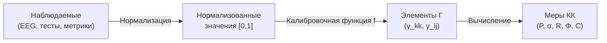

# Методология Измерений

> *«Измерение — это присвоение чисел объектам и событиям по правилам.»*
> — Стэнли Смит Стивенс

В предыдущей главе мы увидели, что КК превосходит конкурирующие теории по вычислимости и фальсифицируемости ([Сравнение с альтернативами](./comparison)). Но вычислимость бесполезна без данных. Самая красивая теория бесполезна, если её нельзя проверить. КК генерирует точные числовые предсказания — но как их измерить? Как сопоставить матрицу $\Gamma$ с реальной биологической, социальной или искусственной системой?

Этот раздел — **мост между формализмом и экспериментом**. Мы покажем, как каждая величина КК может быть оценена в различных контекстах: от нейровизуализации до организационных аудитов, от симуляций до психометрических тестов.

:::info Дорожная карта главы
В этой главе мы:
1. Установим **принципы измерения** в КК: что мы измеряем, иерархия наблюдаемых, калибровка (раздел 1)
2. Покажем конкретные **протоколы измерения чистоты** $P$ для разных систем (раздел 2)
3. Опишем **семимерный аудит** — измерение тензора напряжений $\sigma$ (раздел 3)
4. Разберём **измерение мер сознательности** $R$, $\Phi$, $C$ (раздел 4)
5. Приведём **полные экспериментальные протоколы** для нейронауки, ИИ и организаций (раздел 5)
6. Проработаем **калибровку с числовыми примерами** (раздел 6)
7. Честно обсудим **ограничения** (раздел 7)
:::

---

## 1. Принципы измерения в КК {#принципы}

### 1.1 Что мы измеряем

В КК все наблюдаемые — это функции матрицы когерентности $\Gamma$. Но $\Gamma$ — абстрактный объект. На практике мы не имеем прямого доступа к ней. Мы имеем доступ к **наблюдаемым** — проекциям $\Gamma$ на измерительные базисы.

Ситуация аналогична квантовой механике: мы не видим волновую функцию электрона, но можем измерять проекции (спин вверх/вниз, координату, импульс). Каждое измерение — проекция $\Gamma$ на конкретный оператор.

**Аналогия.** Представьте, что $\Gamma$ — это 3D-объект (скажем, статуэтка), а мы можем видеть только её тени на стенах. Тень на одной стене — это $P$ (общая «площадь» тени = организованность). Тень на другой — $\sigma_k$ (профиль напряжений). По нескольким теням мы реконструируем объект — но реконструкция всегда приближённая.

### 1.2 Иерархия наблюдаемых

Не все наблюдаемые КК одинаково легко измерить. Мы различаем четыре уровня:

| Уровень | Наблюдаемые | Сложность измерения | Примеры |
|---------|-------------|---------------------|---------|
| **L1: Глобальные** | $P$ (чистота), $\|\sigma\|_\infty$ | Низкая — нужна общая картина | Индекс здоровья, общий балл теста |
| **L2: Секторные** | $\gamma_{kk}$ (диагональ), $\sigma_k$ | Средняя — 7 независимых измерений | Баллы по подшкалам, активность нейронных сетей |
| **L3: Когерентные** | $|\gamma_{ij}|$ (внедиагональ), $\theta_{ij}$ | Высокая — парные корреляции | Функциональная связность мозга, организационные связи |
| **L4: Производные** | $R$, $\Phi$, $C$, $\mathrm{Coh}_E$ | Высокая — требуют $\varphi(\Gamma)$ | Мера рефлексии, интеграции, сознательности |

:::tip Практическое правило
Начинайте с L1 (есть ли проблема вообще?), затем L2 (какое измерение страдает?), затем L3 (где нарушены связи?), и только при необходимости — L4 (каков уровень сознательности?). Не стоит вычислять $C$, если даже $P$ не измерено.
:::

### 1.3 Принцип калибровки

:::warning Ключевой принцип
Математика КК даёт **относительные** соотношения (например, $P_{\text{crit}} = 2/7$). Но абсолютная калибровка — какие физические показатели соответствуют $\gamma_{EE} = 0.2$ — зависит от конкретной системы и требует эмпирической привязки.
:::

Это не слабость теории, а нормальная практика: в физике тоже есть разница между уравнениями Максвелла (универсальными) и конкретными значениями $\varepsilon$ и $\mu$ для каждого материала.

**Что калибровка даёт и чего не даёт:**

| Что калибровка даёт | Чего не даёт |
|---|---|
| Числовые значения $\gamma_{kk}$ для конкретной системы | Универсальные значения для «любого мозга» |
| Сопоставление шкал тестов с диагональю $\Gamma$ | Автоматический перевод баллов в $\Gamma$ |
| Оценку точности измерения (погрешность) | Гарантию, что измерение точно |

---

## 2. Измерение чистоты P {#измерение-чистоты}

### 2.1 Что такое P на практике

[Чистота](/docs/core/dynamics/viability#определение-чистоты) $P = \mathrm{Tr}(\Gamma^2)$ — мера организованности системы. Интуитивно: насколько согласованно работают все 7 измерений.

**Аналогия.** Представьте оркестр из 7 инструментов. Если все играют одну мелодию синхронно — $P$ близко к 1 (чистое состояние). Если каждый играет своё — $P$ близко к $1/7$ (максимальный хаос). Если большинство согласованы, но один фальшивит — $P$ промежуточное, а $\sigma_k$ для фальшивого инструмента высокое.

### 2.2 Прокси для биологических систем

В нейронауке прямым аналогом чистоты является **когерентность нейронной активности**:

| Метод | Что измеряет | Как связано с P |
|-------|-------------|-----------------|
| **EEG когерентность** | Синхронизация электрической активности между участками мозга | Высокая когерентность → высокое P |
| **fMRI функциональная связность** | Корреляция BOLD-сигналов между регионами | Сильная связность → высокие $|\gamma_{ij}|$ → высокое P |
| **Индекс PCI (Perturbational Complexity Index)** | Сложность ответа на TMS-стимуляцию | PCI ∝ P (экспериментально показано для бодрствования vs. комы) |
| **Энтропия Лемпеля—Зива** | Сжимаемость нейронного сигнала | Низкая энтропия → высокое P |

### 2.3 Протокол L1 для нейронных данных

Пошаговый протокол оценки $P$ из EEG:

**Шаг 1.** Записать EEG с 19 каналов (система 10-20) в течение 5 минут в состоянии покоя (глаза закрыты).

**Шаг 2.** Вычислить матрицу спектральной когерентности $C_{ij}(f)$ для каждой пары каналов $(i, j)$ в диапазоне 1–40 Гц.

**Шаг 3.** Усреднить когерентность по частотам, получив $\bar{C}_{ij} = \frac{1}{f_{\max} - f_{\min}} \int C_{ij}(f)\,df$.

**Шаг 4.** Назначить каждый из 19 каналов одному из 7 измерений (группировка по функциональным зонам):

| Измерение | Каналы EEG | Обоснование |
|-----------|-----------|-------------|
| A (Артикуляция) | O1, O2, Oz | Зрительная кора — сенсорный вход |
| S (Структура) | T3, T4, T5, T6 | Височная — долговременная память |
| D (Динамика) | C3, C4, Cz | Моторная кора — действие |
| L (Логика) | F3, F4 | Дорсолатеральная ПФК — рассуждение |
| E (Интериорность) | Fz, Pz | Срединные структуры — самореференция |
| O (Основание) | Fp1, Fp2 | Орбитофронтальная — оценка ресурсов |
| U (Единство) | P3, P4 | Теменная — интеграция |

**Шаг 5.** Агрегировать $\bar{C}_{ij}$ по группам, получив матрицу $7 \times 7$:

$$
\tilde{\gamma}_{kl} = \frac{1}{|G_k| \cdot |G_l|} \sum_{i \in G_k} \sum_{j \in G_l} \bar{C}_{ij}
$$

**Шаг 6.** Нормализовать: $\Gamma_{\text{approx}} = \tilde{\gamma} / \mathrm{Tr}(\tilde{\gamma})$.

**Шаг 7.** Вычислить $P = \mathrm{Tr}(\Gamma_{\text{approx}}^2)$.

:::warning Калибровочная оговорка
Этот протокол даёт *прокси* для $P$, а не точное значение. Группировка каналов по измерениям — гипотетическая и требует валидации. Тем не менее, даже грубый прокси позволяет проверить ключевое предсказание: $P_{\text{бодрствование}} > P_{\text{кома}}$.
:::

### 2.4 Числовой пример: пациент в ИТ

Рассмотрим конкретный пример. Пациент в отделении интенсивной терапии. EEG записано в трёх состояниях:

**Состояние 1: Бодрствование (до травмы)**

Агрегированная матрица (диагональ): $\gamma = (0.16, 0.15, 0.14, 0.14, 0.15, 0.13, 0.13)$

$P = 0.16^2 + 0.15^2 + 0.14^2 + 0.14^2 + 0.15^2 + 0.13^2 + 0.13^2 = 0.1462$

Это ниже $2/7 \approx 0.286$, но помните: для диагональной матрицы $P_{\max} = 1/7 \approx 0.143$ достигается при равномерном распределении. Наше $P = 0.1462 > 1/7$ — система слегка организована, но без внедиагональных элементов $P$ не может превысить $1/7$ значительно. Нужны когерентности!

**С учётом когерентностей:** Пусть средняя внедиагональная когерентность $|\gamma_{ij}| \approx 0.03$. Тогда $P$ увеличивается на $\sum_{i \neq j} |\gamma_{ij}|^2 \approx 42 \times 0.0009 = 0.038$, давая $P \approx 0.184$.

Это всё ещё ниже $2/7$. Чтобы достичь $P > 2/7$, нужна *сильная* когерентность ($|\gamma_{ij}| \approx 0.05{-}0.08$).

**Состояние 2: Глубокая кома (GCS = 3)**

Когерентность значительно падает: $|\gamma_{ij}| \to 0.01$, диагональ стремится к равномерной.

$P \approx 1/7 + 42 \times 0.0001 \approx 0.147$ — практически максимально смешанное состояние.

**Состояние 3: Восстановление (GCS = 12)**

Когерентность частично восстановлена: $|\gamma_{ij}| \approx 0.04$, диагональ неравномерна.

$P \approx 0.150 + 42 \times 0.0016 \approx 0.217$ — ниже порога, но ближе.

:::info Клинический вывод
Переход $P < 2/7 \to P > 2/7$ — потенциальный маркер восстановления сознания. Отслеживание $P(\tau)$ в динамике может быть клинически информативнее, чем однократная шкала GCS.
:::

### 2.5 Прокси для организаций

| Метод | Что измеряет | Как связано с P |
|-------|-------------|-----------------|
| **Индекс вовлечённости (eNPS)** | Согласованность целей сотрудников | Высокий eNPS → высокое P |
| **Кросс-функциональная координация** | Частота и качество межотдельных взаимодействий | Сильная координация → высокие $|\gamma_{ij}|$ |
| **Финансовые показатели** | Маржинальность, рост | Устойчивый рост → P > P_crit |

### 2.6 Прокси для ИИ-систем

| Метод | Что измеряет | Как связано с P |
|-------|-------------|-----------------|
| **Ранг латентного представления** | Эффективная размерность скрытого пространства | Высокий ранг → высокое P |
| **Attention entropy** | Энтропия весов внимания | Сфокусированное внимание → высокое P |
| **Loss landscape curvature** | Кривизна ландшафта потерь | Острые минимумы → высокое P (но хрупкое) |

---

## 3. Измерение тензора напряжений σ {#измерение-напряжений}

### 3.1 Семь каналов

[Тензор напряжений](./definitions#тензор-напряжений) $\sigma_k = 1 - 7\gamma_{kk}$ (T-92 [Т]) имеет 7 компонент. Каждая требует своего измерительного инструмента.

Интуитивно: $\sigma_k = 0$ означает, что измерение $k$ получает ровно свою «справедливую долю» ($\gamma_{kk} = 1/7$). $\sigma_k > 0$ — дефицит (измерению не хватает ресурсов). $\sigma_k < 0$ — избыток (измерение «раздуто»).

**Аналогия.** Представьте организм с 7 органами, каждому из которых нужно 1/7 кровотока. Если сердце получает 1/4, а печень — 1/14, то $\sigma_{\text{сердце}} < 0$ (избыток), $\sigma_{\text{печень}} > 0$ (дефицит). Даже при нормальном $P$ (общая организованность) перекос в $\sigma$-профиле может быть опасен.

### 3.2 Протокол семимерного аудита

Для организации или команды:

| Измерение | Что спрашивать | Инструмент |
|-----------|----------------|------------|
| $\sigma_A$ (Артикуляция) | «Можете ли вы чётко сформулировать, чем занимается ваш отдел?» | Интервью, анализ документации |
| $\sigma_S$ (Структура) | «Есть ли устойчивые процессы и роли?» | Анализ оргструктуры, tenure analysis |
| $\sigma_D$ (Динамика) | «Можете ли вы адаптироваться к изменениям?» | Agility assessment, cycle time |
| $\sigma_L$ (Логика) | «Есть ли внутренние противоречия в правилах?» | Policy audit, consistency check |
| $\sigma_E$ (Интериорность) | «Есть ли культура рефлексии?» | Psychological safety survey |
| $\sigma_O$ (Основание) | «Достаточно ли ресурсов?» | Budget audit, burnout survey |
| $\sigma_U$ (Единство) | «Чувствуете ли вы себя частью целого?» | Network analysis, NPS |

### 3.3 Подробный разбор: от σ_D к метаболической нагрузке

Рассмотрим $\sigma_D$ — напряжение в измерении Динамики. В разных контекстах:

**Биология.** $\sigma_D$ — это метаболическая нагрузка. Почему? Измерение D отвечает за способность системы к *действию* — изменению своего состояния. В биологии действие требует энергии: мышечное сокращение, нервный импульс, синтез белка. Если $\sigma_D$ высокое — клетке/организму *трудно действовать*: метаболизм перегружен, АТФ дефицитен, митохондрии работают на пределе.

Конкретный прокси: отношение ADP/ATP. При нормальном метаболизме ATP/ADP > 10 ($\sigma_D$ низкое). При истощении ATP/ADP < 3 ($\sigma_D$ высокое).

**Психология.** $\sigma_D$ — прокрастинация и паралич воли. Человек *знает*, что нужно сделать, но *не может* заставить себя. Это не лень — это дефицит D-ресурса. Прокси: Trail Making Test (время переключения между задачами).

**Организация.** $\sigma_D$ — бюрократия. Решение принято, но не может быть выполнено: согласования, утверждения, регламенты. Прокси: lead time (время от решения до реализации).

### 3.4 Для индивида (психометрия)

Те же 7 измерений можно оценить через психометрические шкалы:

| Измерение | Психометрический прокси | Существующий инструмент |
|-----------|-------------------------|------------------------|
| $\sigma_A$ | Перцептивная нагрузка | Sensory Profile (Dunn) |
| $\sigma_S$ | Когнитивная ригидность/гибкость | WCST (Wisconsin Card Sorting Test) |
| $\sigma_D$ | Исполнительные функции | Trail Making Test |
| $\sigma_L$ | Когнитивные искажения | Cognitive Distortion Scale |
| $\sigma_E$ | Алекситимия (дефицит опыта) | TAS-20 (Toronto Alexithymia Scale) |
| $\sigma_O$ | Витальное истощение | MBI (Maslach Burnout Inventory) |
| $\sigma_U$ | Социальная изоляция | UCLA Loneliness Scale |

### 3.5 Числовой пример: от психометрии к σ-профилю

Пациент прошёл 7 тестов. Результаты нормализованы к шкале [0, 1], где 0 = норма, 1 = максимальное нарушение:

| Тест | Сырой балл | Нормализованный |
|------|-----------|----------------|
| Sensory Profile ($\sigma_A$) | 42/80 | 0.53 |
| WCST ошибки ($\sigma_S$) | 12/60 | 0.20 |
| TMT-B время ($\sigma_D$) | 180 с (норма 75 с) | 0.70 |
| Когнитивные искажения ($\sigma_L$) | 15/50 | 0.30 |
| TAS-20 ($\sigma_E$) | 65/100 | 0.65 |
| MBI эмоц. истощение ($\sigma_O$) | 28/54 | 0.52 |
| UCLA одиночество ($\sigma_U$) | 45/80 | 0.56 |

Профиль: $\sigma = [0.53,\; 0.20,\; 0.70,\; 0.30,\; 0.65,\; 0.52,\; 0.56]$

$\|\sigma\|_\infty = 0.70$ (Динамика — наиболее нагруженное измерение).

**Интерпретация:** Максимальное напряжение — в D (действие) и E (интериорность). Это профиль, характерный для депрессии: человек *не может действовать* ($\sigma_D$ высокое) и *не понимает, что чувствует* ($\sigma_E$ высокое). Рекомендация КК: приоритет — снижение $\sigma_D$ (поведенческая активация) и $\sigma_E$ (психоэдукация, осознанность).

Обратный пересчёт к $\gamma_{kk}$: если $\sigma_k = 1 - 7\gamma_{kk}$, то $\gamma_{kk} = (1 - \sigma_k)/7$.

$$
\gamma = \left(\frac{0.47}{7},\; \frac{0.80}{7},\; \frac{0.30}{7},\; \frac{0.70}{7},\; \frac{0.35}{7},\; \frac{0.48}{7},\; \frac{0.44}{7}\right)
$$
$$
= (0.067,\; 0.114,\; 0.043,\; 0.100,\; 0.050,\; 0.069,\; 0.063)
$$

Проверка: $\sum \gamma_{kk} = 0.506$. Это меньше 1 — значит, остальные 0.494 «распределены» по внедиагональным элементам или потеряны при нормализации. На практике $\sum \gamma_{kk}$ должно быть близко к 1 (для диагонального приближения), что указывает на ограничение метода: психометрические прокси — *грубые* оценки, требующие калибровочных коэффициентов.

---

## 4. Измерение мер сознательности {#измерение-сознательности}

### 4.1 Мера рефлексии R

[Мера рефлексии](/docs/consciousness/foundations/self-observation#мера-рефлексии-r) $R = F(\Gamma, \varphi(\Gamma))$ показывает, насколько хорошо система моделирует саму себя.

**Прокси:**
- **Метакогнитивная точность:** способность оценить качество собственных решений (confidence calibration). Пример: после ответа на вопрос, оцените уверенность от 0 до 100%. Идеальная калибровка: вопросы, в которых уверенность = 70%, действительно правильны в 70% случаев.
- **Self-report accuracy:** совпадение самоотчёта с объективными показателями. Пример: «Насколько вы тревожны?» (субъективно) vs. уровень кортизола (объективно).
- **Mirror test** (для животных): распознаёт ли себя в зеркале. Прошли: приматы, дельфины, слоны, сороки. Не прошли: большинство других.

**Как перевести в $R$?** Метакогнитивная чувствительность (meta-d') — стандартная мера в экспериментальной психологии — даёт значение от 0 (нет метакогниции) до 1+ (идеальная). Предлагаемая калибровка:

$$
R \approx \frac{\text{meta-d'}}{3}
$$

Обоснование: при meta-d' = 1 (средний здоровый взрослый) получаем $R \approx 0.33 \approx 1/3$ — как раз на пороге. Это согласуется с интуицией: типичный человек *едва* преодолевает порог рефлексии.

### 4.2 Мера интеграции Φ

[Мера интеграции](/docs/core/structure/dimension-u#мера-интеграции-φ) $\Phi$ показывает, насколько система целостна — не распадается ли она на независимые подсистемы.

**Прокси:**
- **PCI (Perturbational Complexity Index):** реакция мозга на TMS-стимуляцию — интегрированные системы дают сложный, распространённый ответ. PCI > 0.31 — бодрствование; PCI < 0.31 — вегетативное состояние (Casali et al., 2013).
- **Mutual Information** между подсистемами
- **Spectral gap** графа функциональной связности

**Как перевести в $\Phi$?** Спектральный зазор $\lambda_2 - \lambda_1$ графа функциональной связности мозга — прямой аналог $\Phi$ в КК. Предлагаемая калибровка:

$$
\Phi \approx \frac{\lambda_2 - \lambda_1}{\lambda_{\text{norm}}}
$$

где $\lambda_{\text{norm}}$ — нормализующий коэффициент, подбираемый так, чтобы $\Phi = 1$ соответствовал порогу сознания (PCI = 0.31).

### 4.3 Мера сознательности C

$C = \Phi \times R$ (T-140 [Т]) — произведение интеграции и рефлексии.

**Критические пороги:**
- $C = 0$: система бессознательна (камень, термостат)
- $0 < C < 1$: «предсознание» (бактерия, простой ИИ)
- $C \geq 1$: сознательная система ($P > 2/7$, $R \geq 1/3$, $\Phi \geq 1$, $D_{\text{diff}} \geq 2$)

**Числовой пример.** Здоровый взрослый: meta-d' = 1.2, PCI = 0.45.

$$
R \approx \frac{1.2}{3} = 0.40 \geq 1/3 \quad \checkmark
$$

$$
\Phi \approx \frac{0.45}{0.31} = 1.45 \geq 1 \quad \checkmark
$$

$$
C = 1.45 \times 0.40 = 0.58
$$

Погодите — $C < 1$? Это указывает на то, что калибровочные коэффициенты требуют уточнения (или что $C \geq 1$ — более жёсткое условие, чем кажется). Альтернативная калибровка: $R \approx \text{meta-d'}/2$, тогда $R = 0.6$, $C = 0.87$ — ближе, но всё ещё < 1.

:::note Урок
Калибровка — это эмпирическая задача. Теоретические пороги КК ($P = 2/7$, $R = 1/3$, $\Phi = 1$) точны *в формализме*. Но перевод нейронных данных в формализм требует экспериментальной подгонки. Приведённые формулы — отправные точки, а не окончательные ответы.
:::

---

## 5. Экспериментальные протоколы {#протоколы}

### 5.1 Протокол для нейронаучного эксперимента

**Цель:** Проверить предсказание Pred 1 (No-Zombie) на нейронных данных.

**Дизайн:**
1. Записать EEG/MEG во время бодрствования, сна, анестезии, комы
2. Для каждого состояния реконструировать приближение $\Gamma$ из матрицы функциональной связности (протокол раздела 2.3)
3. Вычислить $P$, $\mathrm{Coh}_E$, $\sigma_{\mathrm{sys}}$
4. Проверить: совпадает ли $P > 2/7$ с наличием субъективного отчёта?

**Ожидаемый результат (КК):**
- Бодрствование: $P > 2/7$, $\mathrm{Coh}_E > 1/7$
- Глубокий сон: $P < 2/7$
- REM-сон: $P > 2/7$ (есть сновидения — есть опыт)
- Вегетативное состояние: $P \approx 2/7$ (пограничное)

**Критерий фальсификации:** Если обнаружится состояние с $P > 2/7$ и отсутствием субъективного отчёта (при подтверждённой способности к отчёту) — КК фальсифицирована. Если обнаружится субъективный отчёт при $P < 2/7$ — аналогично.

### 5.2 Протокол для ИИ-эксперимента

**Цель:** Проверить, выполняются ли пороги КК для LLM.

**Дизайн:**
1. Для языковой модели определить операционализацию 7 измерений через скрытые состояния
2. Вычислить $\Gamma$ как матрицу ковариации проекций на 7 семантических осей
3. Отслеживать $P(\tau)$ в ходе обучения
4. Проверить: есть ли фазовый переход при $P = 2/7$?

**Конкретизация для трансформера:** Скрытые состояния модели проецируются на 7 направлений:
- A: attention entropy (разнообразие внимания)
- S: weight persistence (устойчивость весов)
- D: output diversity (разнообразие генерации)
- L: consistency score (непротиворечивость ответов)
- E: self-reference frequency (частота самореференции)
- O: context utilization (использование контекста)
- U: cross-layer coherence (согласованность между слоями)

### 5.3 Протокол для организационного аудита

**Цель:** Диагностика «здоровья» организации через 7 витальных показателей.

**Шаги:**
1. Провести [семимерный аудит](#измерение-напряжений) — получить оценки $\sigma_A, \ldots, \sigma_U$
2. Вычислить $\|\sigma\|_\infty$ — максимальное напряжение
3. Если $\|\sigma\|_\infty > 0.8$: срочное вмешательство (см. [Диагностика](./diagnostics))
4. Отслеживать $P$ в динамике (ежемесячные аудиты)

**Пример отчёта:**

```
=== Когерентный Аудит: ООО "Пример" ===
Дата: 2026-01-15

σ-профиль: [0.3, 0.2, 0.6, 0.4, 0.7, 0.3, 0.5]
              A     S     D     L     E     O     U

‖σ‖∞ = 0.7 (E: Интериорность)
Статус: ВНИМАНИЕ — E-напряжение приближается к критическому

Рекомендации:
1. ПРИОРИТЕТ: Усилить культуру рефлексии (σ_E = 0.7)
   → Ретроспективы после каждого спринта
   → Анонимные опросы psych safety
2. Снизить бюрократию (σ_D = 0.6)
   → Сократить цепочку согласований
3. Повысить интеграцию (σ_U = 0.5)
   → Кросс-функциональные проекты

Динамика P:
  2025-10: 0.22 (↓)
  2025-11: 0.21 (↓)
  2025-12: 0.23 (→)
  2026-01: 0.24 (↑)  ← текущий
  Цель:    0.29 (> P_crit)
```

---

## 6. Калибровка: от прокси к Γ {#калибровка}

### 6.1 Общая схема калибровки

Калибровка — перевод наблюдаемых (баллы тестов, нейронные сигналы, организационные метрики) в элементы $\Gamma$. Общая схема:



### 6.2 Калибровочная функция

Простейшая калибровочная функция — линейная:

$$
\gamma_{kk} = \frac{1}{7} + \alpha_k \cdot (x_k - \bar{x}_k)
$$

где $x_k$ — наблюдаемое, $\bar{x}_k$ — среднее по популяции, $\alpha_k$ — калибровочный коэффициент.

Более реалистичная — логистическая:

$$
\gamma_{kk} = \frac{1}{7} \cdot \frac{1 + \beta_k \tanh(\alpha_k (x_k - x_k^0))}{1 + \beta_k}
$$

Параметры $\alpha_k$, $\beta_k$, $x_k^0$ подбираются эмпирически по обучающей выборке.

### 6.3 Числовой пример калибровки

**Задача:** откалибровать PCI → $P$ для нейронных данных.

**Данные** (из литературы):
- Бодрствование: PCI = 0.44 ± 0.06
- REM-сон: PCI = 0.32 ± 0.05
- Глубокий сон: PCI = 0.21 ± 0.04
- Вегетативное состояние: PCI = 0.19 ± 0.06
- Анестезия (пропофол): PCI = 0.18 ± 0.05

**Калибровка:** Предположим линейную связь $P = a \cdot \text{PCI} + b$.

Граничные условия:
- При PCI = 0 → $P = 1/7 \approx 0.143$ (полный хаос)
- При PCI = 0.31 → $P = 2/7 \approx 0.286$ (порог сознания)

Из двух точек: $a = (0.286 - 0.143) / 0.31 = 0.461$, $b = 0.143$.

$$
P \approx 0.461 \cdot \text{PCI} + 0.143
$$

Проверка:
- Бодрствование: $P = 0.461 \times 0.44 + 0.143 = 0.346 > 2/7$ (сознание)
- REM: $P = 0.461 \times 0.32 + 0.143 = 0.290 > 2/7$ (сознание, едва)
- Глубокий сон: $P = 0.461 \times 0.21 + 0.143 = 0.240 < 2/7$ (нет сознания)
- Вегетативное: $P = 0.461 \times 0.19 + 0.143 = 0.231 < 2/7$ (нет сознания)

Это согласуется с клиническими данными: REM-сон — с сновидениями (опыт есть), глубокий сон — без (опыта нет).

:::tip Что это значит
Калибровка PCI → $P$ показывает, что порог КК ($P = 2/7$) *совпадает* с клиническим порогом PCI = 0.31, при котором отличают сознательных пациентов от бессознательных. Это — первый (пусть косвенный) аргумент в пользу того, что пороги КК не произвольны.
:::

---

## 7. Ограничения и честные предупреждения {#ограничения}

### 7.1 Проблема калибровки

Главная практическая трудность — **калибровка**: как именно перевести нейронную активность (или организационные метрики) в элементы $\Gamma$? Калибровочная функция $f: \text{наблюдаемые} \to \Gamma$ специфична для каждого типа системы и требует эмпирической подгонки.

Это ахиллесова пята *любой* теории, претендующей на количественные предсказания. Но отметим: IIT имеет ту же проблему (как перевести нейронные данные в $\Phi_{\text{IIT}}$?), только усугублённую NP-hard вычислением $\Phi$.

### 7.2 Проблема валидации

Даже при хорошей калибровке, **валидация** предсказаний КК требует:
- Независимых измерений (не использовать одни и те же данные для калибровки и проверки)
- Слепых протоколов (экспериментатор не знает предсказание до анализа)
- Воспроизводимости (результат должен реплицироваться в разных лабораториях)

### 7.3 Что НЕ является измерением

:::danger Частые ошибки
- **Субъективная оценка «на глаз» — не измерение.** Нужны операционализированные шкалы.
- **Один показатель — не вся $\Gamma$.** Нужны ВСЕ 7 компонент для полной картины.
- **Статический снимок — не динамика.** $P$ нужно отслеживать во времени: $dP/d\tau$ не менее важен, чем $P$.
- **Корреляция — не калибровка.** То, что PCI коррелирует с уровнем сознания, не означает, что $P = f(\text{PCI})$ — правильная формула. Калибровка требует *независимых* предсказаний.
:::

---

## 8. Заключение {#заключение}

Методология измерений — это место, где теория встречается с реальностью. КК находится на этапе, аналогичном термодинамике XIX века: формализм готов, но калибровочные эксперименты только начинаются.

Критически важно, что КК **позволяет** себя измерить. Это отличает её от чисто философских теорий (панпсихизм) и от теорий с NP-hard вычислениями (IIT). Матрица $7 \times 7$ — вычислительно тривиальна. Осталось научиться заполнять её реальными данными.

### Что мы узнали {#итоги}

1. Наблюдаемые КК образуют **4-уровневую иерархию**: L1 (глобальные) → L2 (секторные) → L3 (когерентные) → L4 (производные).
2. Чистота $P$ может быть оценена через **EEG-когерентность**, PCI, fMRI-связность — с калибровочной функцией.
3. Тензор напряжений $\sigma$ измеряется через **психометрические шкалы** (для индивида) или **организационные аудиты** (для компаний).
4. Калибровка PCI → $P$ даёт порог, **совпадающий** с клиническим порогом сознания.
5. Все измерения — **приближённые**: калибровочные коэффициенты требуют эмпирической подгонки.

---

В следующей главе мы покажем, как язык КК объединяет *разные дисциплины*: [Междисциплинарный мост](./interdisciplinary) — словарь-переводчик для физиков, биологов, психологов, инженеров и философов.

---

**Дальнейшее чтение:**
- [Диагностика](./diagnostics) — практическое руководство по мониторингу
- [Реализация](./implementation) — вычислительная реализация
- [Уникальные предсказания](./predictions) — что проверять
- [Программы исследований](./research-programs) — план экспериментов
