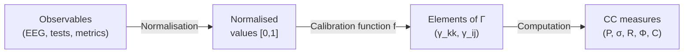

# Measurement Methodology

> *"Measurement is the assignment of numerals to objects or events according to rules."*
> — Stanley Smith Stevens


:::info Who this chapter is for
A bridge between the CC formalism and experiment: protocols for measuring purity $P$, the stress tensor $\sigma$, and the consciousness measures $R$, $\Phi$, $C$.
:::

In the previous chapter we saw that CC surpasses competing theories in computability and falsifiability ([Comparison with Alternatives](./comparison)). But computability is useless without data. The most beautiful theory is useless if it cannot be tested. CC generates precise numerical predictions — but how do we measure them? How do we map the matrix $\Gamma$ onto a real biological, social, or artificial system?

This section is the **bridge between formalism and experiment**. We will show how each CC quantity can be estimated in various contexts: from neuroimaging to organisational audits, from simulations to psychometric tests.

:::info Chapter Roadmap
In this chapter we:
1. Establish the **principles of measurement** in CC: what we measure, the hierarchy of observables, calibration (section 1)
2. Show concrete **protocols for measuring purity** $P$ for different systems (section 2)
3. Describe the **seven-dimensional audit** — measurement of the stress tensor $\sigma$ (section 3)
4. Discuss **measurement of consciousness measures** $R$, $\Phi$, $C$ (section 4)
5. Provide **complete experimental protocols** for neuroscience, AI, and organisations (section 5)
6. Work through **calibration with numerical examples** (section 6)
7. Honestly discuss **limitations** (section 7)
:::

---

## 1. Principles of Measurement in CC {#принципы}

### 1.1 What We Measure

In CC all observables are functions of the coherence matrix $\Gamma$. But $\Gamma$ is an abstract object. In practice we have no direct access to it. We have access to **observables** — projections of $\Gamma$ onto measurement bases.

The situation is analogous to quantum mechanics: we do not see the wave function of the electron, but we can measure its projections (spin up/down, coordinate, momentum). Each measurement is a projection of $\Gamma$ onto a specific operator.

**Analogy.** Imagine $\Gamma$ as a 3D object (say, a statuette), and we can only see its shadows on the walls. The shadow on one wall is $P$ (total "area" of the shadow = organisation). The shadow on another — $\sigma_k$ (stress profile). From several shadows we reconstruct the object — but the reconstruction is always approximate.

### 1.2 Hierarchy of Observables

Not all CC observables are equally easy to measure. We distinguish four levels:

| Level | Observables | Measurement complexity | Examples |
|---------|-------------|---------------------|---------|
| **L1: Global** | $P$ (purity), $\|\sigma\|_\infty$ | Low — only the overall picture is needed | Health index, total test score |
| **L2: Sectoral** | $\gamma_{kk}$ (diagonal), $\sigma_k$ | Medium — 7 independent measurements | Subscale scores, neural network activity |
| **L3: Coherent** | $|\gamma_{ij}|$ (off-diagonal), $\theta_{ij}$ | High — pairwise correlations | Functional brain connectivity, organisational links |
| **L4: Derived** | $R$, $\Phi$, $C$, $\mathrm{Coh}_E$ | High — require $\varphi(\Gamma)$ | Reflection, integration, consciousness measures |

:::tip Practical rule
Start with L1 (is there a problem at all?), then L2 (which dimension is suffering?), then L3 (where are connections disrupted?), and only if necessary — L4 (what is the level of consciousness?). There is no point computing $C$ if even $P$ has not been measured.
:::

### 1.3 Calibration Principle

:::warning Key principle
The mathematics of CC gives **relative** relations (e.g., $P_{\text{crit}} = 2/7$). But absolute calibration — which physical indicators correspond to $\gamma_{EE} = 0.2$ — depends on the specific system and requires empirical anchoring.
:::

This is not a weakness of the theory, but normal practice: in physics too there is a difference between Maxwell's equations (universal) and the specific values of $\varepsilon$ and $\mu$ for each material.

**What calibration gives and what it does not:**

| What calibration gives | What it does not give |
|---|---|
| Numerical values of $\gamma_{kk}$ for a specific system | Universal values for "any brain" |
| Correspondence of test scales with the diagonal of $\Gamma$ | Automatic conversion of scores to $\Gamma$ |
| Estimate of measurement accuracy (error) | Guarantee that the measurement is accurate |

---

## 2. Measuring Purity P {#измерение-чистоты}

### 2.1 What P Is in Practice

[Purity](/docs/core/dynamics/viability#определение-чистоты) $P = \mathrm{Tr}(\Gamma^2)$ is a measure of the organisation of the system. Intuitively: how coherently all 7 dimensions are working together.

**Analogy.** Imagine an orchestra of 7 instruments. If all play one melody in synchrony — $P$ is close to 1 (pure state). If each plays on its own — $P$ is close to $1/7$ (maximum chaos). If most are coordinated but one is out of tune — $P$ is intermediate, and $\sigma_k$ for the out-of-tune instrument is high.

### 2.2 Proxies for Biological Systems

In neuroscience the direct analogue of purity is **coherence of neural activity**:

| Method | What it measures | How it relates to P |
|-------|-------------|-----------------|
| **EEG coherence** | Synchronisation of electrical activity between brain regions | High coherence → high P |
| **fMRI functional connectivity** | Correlation of BOLD signals between regions | Strong connectivity → high $|\gamma_{ij}|$ → high P |
| **PCI (Perturbational Complexity Index)** | Complexity of the response to TMS stimulation | PCI ∝ P (experimentally shown for wakefulness vs. coma) |
| **Lempel-Ziv entropy** | Compressibility of the neural signal | Low entropy → high P |

### 2.3 L1 Protocol for Neural Data

Step-by-step protocol for estimating $P$ from EEG:

**Step 1.** Record EEG from 19 channels (10-20 system) for 5 minutes at rest (eyes closed).

**Step 2.** Compute the spectral coherence matrix $C_{ij}(f)$ for each pair of channels $(i, j)$ in the range 1–40 Hz.

**Step 3.** Average coherence over frequencies, obtaining $\bar{C}_{ij} = \frac{1}{f_{\max} - f_{\min}} \int C_{ij}(f)\,df$.

**Step 4.** Assign each of the 19 channels to one of 7 dimensions (grouping by functional zones):

| Dimension | EEG channels | Rationale |
|-----------|-----------|-------------|
| A (Articulation) | O1, O2, Oz | Visual cortex — sensory input |
| S (Structure) | T3, T4, T5, T6 | Temporal — long-term memory |
| D (Dynamics) | C3, C4, Cz | Motor cortex — action |
| L (Logic) | F3, F4 | Dorsolateral PFC — reasoning |
| E (Interiority) | Fz, Pz | Midline structures — self-reference |
| O (Ground) | Fp1, Fp2 | Orbitofrontal — resource evaluation |
| U (Unity) | P3, P4 | Parietal — integration |

**Step 5.** Aggregate $\bar{C}_{ij}$ across groups, obtaining a $7 \times 7$ matrix:

$$
\tilde{\gamma}_{kl} = \frac{1}{|G_k| \cdot |G_l|} \sum_{i \in G_k} \sum_{j \in G_l} \bar{C}_{ij}
$$

**Step 6.** Normalise: $\Gamma_{\text{approx}} = \tilde{\gamma} / \mathrm{Tr}(\tilde{\gamma})$.

**Step 7.** Compute $P = \mathrm{Tr}(\Gamma_{\text{approx}}^2)$.

:::warning Calibration caveat
This protocol gives a *proxy* for $P$, not an exact value. The grouping of channels by dimensions is hypothetical and requires validation. Nevertheless, even a crude proxy allows the key prediction to be tested: $P_{\text{wakefulness}} > P_{\text{coma}}$.
:::

### 2.4 Numerical Example: ICU Patient

Let us consider a concrete example. A patient in intensive care. EEG recorded in three states:

**State 1: Wakefulness (before trauma)**

Aggregated matrix (diagonal): $\gamma = (0.16, 0.15, 0.14, 0.14, 0.15, 0.13, 0.13)$

$P = 0.16^2 + 0.15^2 + 0.14^2 + 0.14^2 + 0.15^2 + 0.13^2 + 0.13^2 = 0.1462$

This is below $2/7 \approx 0.286$, but remember: for a diagonal matrix $P_{\max} = 1/7 \approx 0.143$ is achieved at uniform distribution. Our $P = 0.1462 > 1/7$ — the system is slightly organised, but without off-diagonal elements $P$ cannot exceed $1/7$ significantly. Coherences are needed!

**Including coherences:** Let the average off-diagonal coherence $|\gamma_{ij}| \approx 0.03$. Then $P$ increases by $\sum_{i \neq j} |\gamma_{ij}|^2 \approx 42 \times 0.0009 = 0.038$, giving $P \approx 0.184$.

This is still below $2/7$. To reach $P > 2/7$, *strong* coherence is needed ($|\gamma_{ij}| \approx 0.05{-}0.08$).

**State 2: Deep coma (GCS = 3)**

Coherence drops significantly: $|\gamma_{ij}| \to 0.01$, diagonal tends to uniform.

$P \approx 1/7 + 42 \times 0.0001 \approx 0.147$ — practically the maximally mixed state.

**State 3: Recovery (GCS = 12)**

Coherence partially restored: $|\gamma_{ij}| \approx 0.04$, diagonal non-uniform.

$P \approx 0.150 + 42 \times 0.0016 \approx 0.217$ — below the threshold, but closer.

:::info Clinical conclusion
The transition $P < 2/7 \to P > 2/7$ is a potential marker of consciousness recovery. Tracking $P(\tau)$ dynamically may be clinically more informative than a one-time GCS score.
:::

### 2.5 Proxies for Organisations

| Method | What it measures | How it relates to P |
|-------|-------------|-----------------|
| **Engagement index (eNPS)** | Alignment of employee goals | High eNPS → high P |
| **Cross-functional coordination** | Frequency and quality of inter-departmental interactions | Strong coordination → high $|\gamma_{ij}|$ |
| **Financial indicators** | Margin, growth | Sustained growth → P > P_crit |

### 2.6 Proxies for AI Systems

| Method | What it measures | How it relates to P |
|-------|-------------|-----------------|
| **Rank of latent representation** | Effective dimensionality of the hidden space | High rank → high P |
| **Attention entropy** | Entropy of attention weights | Focused attention → high P |
| **Loss landscape curvature** | Curvature of the loss landscape | Sharp minima → high P (but brittle) |

---

## 3. Measuring the Stress Tensor σ {#измерение-напряжений}

### 3.1 Seven Channels

[Stress tensor](./definitions#тензор-напряжений) $\sigma_k = 1 - 7\gamma_{kk}$ (T-92 [T]) has 7 components. Each requires its own measurement instrument.

Intuitively: $\sigma_k = 0$ means dimension $k$ receives exactly its "fair share" ($\gamma_{kk} = 1/7$). $\sigma_k > 0$ — deficit (the dimension lacks resources). $\sigma_k < 0$ — surplus (the dimension is "inflated").

**Analogy.** Imagine an organism with 7 organs, each needing 1/7 of the blood flow. If the heart receives 1/4 and the liver 1/14, then $\sigma_{\text{heart}} < 0$ (surplus), $\sigma_{\text{liver}} > 0$ (deficit). Even with normal $P$ (overall organisation), a skew in the $\sigma$-profile can be dangerous.

### 3.2 Seven-Dimensional Audit Protocol

For an organisation or team:

| Dimension | What to ask | Instrument |
|-----------|----------------|------------|
| $\sigma_A$ (Articulation) | "Can you clearly formulate what your department does?" | Interviews, documentation analysis |
| $\sigma_S$ (Structure) | "Are there stable processes and roles?" | Org structure analysis, tenure analysis |
| $\sigma_D$ (Dynamics) | "Can you adapt to change?" | Agility assessment, cycle time |
| $\sigma_L$ (Logic) | "Are there internal contradictions in the rules?" | Policy audit, consistency check |
| $\sigma_E$ (Interiority) | "Is there a culture of reflection?" | Psychological safety survey |
| $\sigma_O$ (Ground) | "Are resources sufficient?" | Budget audit, burnout survey |
| $\sigma_U$ (Unity) | "Do you feel part of a whole?" | Network analysis, NPS |

### 3.3 Detailed Breakdown: from σ_D to Metabolic Load

Consider $\sigma_D$ — stress in the Dynamics dimension. In different contexts:

**Biology.** $\sigma_D$ is metabolic load. Why? Dimension D is responsible for the system's capacity for *action* — changing its state. In biology, action requires energy: muscle contraction, nerve impulse, protein synthesis. If $\sigma_D$ is high — the cell/organism finds it *difficult to act*: metabolism is overloaded, ATP is deficient, mitochondria are working at their limit.

Concrete proxy: ADP/ATP ratio. Under normal metabolism ATP/ADP > 10 ($\sigma_D$ low). Under depletion ATP/ADP < 3 ($\sigma_D$ high).

**Psychology.** $\sigma_D$ is procrastination and paralysis of will. The person *knows* what needs to be done, but *cannot* force themselves. This is not laziness — it is a deficit of D-resource. Proxy: Trail Making Test (task-switching time).

**Organisation.** $\sigma_D$ is bureaucracy. A decision has been made, but cannot be executed: approvals, sign-offs, regulations. Proxy: lead time (time from decision to implementation).

### 3.4 For the Individual (Psychometrics)

The same 7 dimensions can be assessed through psychometric scales:

| Dimension | Psychometric proxy | Existing instrument |
|-----------|-------------------------|------------------------|
| $\sigma_A$ | Perceptual load | Sensory Profile (Dunn) |
| $\sigma_S$ | Cognitive rigidity/flexibility | WCST (Wisconsin Card Sorting Test) |
| $\sigma_D$ | Executive functions | Trail Making Test |
| $\sigma_L$ | Cognitive distortions | Cognitive Distortion Scale |
| $\sigma_E$ | Alexithymia (experience deficit) | TAS-20 (Toronto Alexithymia Scale) |
| $\sigma_O$ | Vital exhaustion | MBI (Maslach Burnout Inventory) |
| $\sigma_U$ | Social isolation | UCLA Loneliness Scale |

### 3.5 Numerical Example: from Psychometrics to σ-Profile

A patient has completed 7 tests. Results are normalised to the scale [0, 1], where 0 = normal, 1 = maximum impairment:

| Test | Raw score | Normalised |
|------|-----------|----------------|
| Sensory Profile ($\sigma_A$) | 42/80 | 0.53 |
| WCST errors ($\sigma_S$) | 12/60 | 0.20 |
| TMT-B time ($\sigma_D$) | 180 s (norm 75 s) | 0.70 |
| Cognitive distortions ($\sigma_L$) | 15/50 | 0.30 |
| TAS-20 ($\sigma_E$) | 65/100 | 0.65 |
| MBI emotional exhaustion ($\sigma_O$) | 28/54 | 0.52 |
| UCLA loneliness ($\sigma_U$) | 45/80 | 0.56 |

Profile: $\sigma = [0.53,\; 0.20,\; 0.70,\; 0.30,\; 0.65,\; 0.52,\; 0.56]$

$\|\sigma\|_\infty = 0.70$ (Dynamics — the most loaded dimension).

**Interpretation:** Maximum stress in D (action) and E (interiority). This is a profile characteristic of depression: the person *cannot act* ($\sigma_D$ high) and *does not understand what they feel* ($\sigma_E$ high). CC recommendation: priority — reducing $\sigma_D$ (behavioural activation) and $\sigma_E$ (psychoeducation, mindfulness).

Inverse conversion to $\gamma_{kk}$: if $\sigma_k = 1 - 7\gamma_{kk}$, then $\gamma_{kk} = (1 - \sigma_k)/7$.

$$
\gamma = \left(\frac{0.47}{7},\; \frac{0.80}{7},\; \frac{0.30}{7},\; \frac{0.70}{7},\; \frac{0.35}{7},\; \frac{0.48}{7},\; \frac{0.44}{7}\right)
$$
$$
= (0.067,\; 0.114,\; 0.043,\; 0.100,\; 0.050,\; 0.069,\; 0.063)
$$

Check: $\sum \gamma_{kk} = 0.506$. This is less than 1 — meaning the remaining 0.494 is "distributed" across off-diagonal elements or lost during normalisation. In practice $\sum \gamma_{kk}$ should be close to 1 (for the diagonal approximation), which points to a limitation of the method: psychometric proxies are *crude* estimates requiring calibration coefficients.

---

## 4. Measuring Consciousness Measures {#измерение-сознательности}

### 4.1 Reflection Measure R

[Reflection measure](/docs/consciousness/foundations/self-observation#мера-рефлексии-r) $R = F(\Gamma, \varphi(\Gamma))$ shows how well the system models itself.

**Proxies:**
- **Metacognitive accuracy:** ability to evaluate the quality of one's own decisions (confidence calibration). Example: after answering a question, rate confidence from 0 to 100%. Ideal calibration: questions in which confidence = 70% are actually correct in 70% of cases.
- **Self-report accuracy:** agreement of self-report with objective indicators. Example: "How anxious are you?" (subjective) vs. cortisol level (objective).
- **Mirror test** (for animals): does it recognise itself in the mirror? Passed: primates, dolphins, elephants, magpies. Not passed: most others.

**How to translate into $R$?** Metacognitive sensitivity (meta-d') — a standard measure in experimental psychology — gives a value from 0 (no metacognition) to 1+ (ideal). Proposed calibration:

$$
R \approx \frac{\text{meta-d'}}{3}
$$

Rationale: at meta-d' = 1 (average healthy adult) we get $R \approx 0.33 \approx 1/3$ — right at the threshold. This is consistent with the intuition: a typical person *barely* clears the reflection threshold.

### 4.2 Integration Measure Φ

[Integration measure](/docs/core/structure/dimension-u#мера-интеграции-φ) $\Phi$ shows how unified the system is — whether it breaks down into independent subsystems.

**Proxies:**
- **PCI (Perturbational Complexity Index):** the brain's response to TMS stimulation — integrated systems give a complex, widespread response. PCI > 0.31 — wakefulness; PCI < 0.31 — vegetative state (Casali et al., 2013).
- **Mutual Information** between subsystems
- **Spectral gap** of the functional connectivity graph

**How to translate into $\Phi$?** The spectral gap $\lambda_2 - \lambda_1$ of the functional connectivity graph of the brain is a direct analogue of $\Phi$ in CC. Proposed calibration:

$$
\Phi \approx \frac{\lambda_2 - \lambda_1}{\lambda_{\text{norm}}}
$$

where $\lambda_{\text{norm}}$ is a normalising coefficient chosen so that $\Phi = 1$ corresponds to the consciousness threshold (PCI = 0.31).

### 4.3 Consciousness Measure C

$C = \Phi \times R$ (T-140 [T]) — the product of integration and reflection.

**Critical thresholds:**
- $C = 0$: system is non-conscious (stone, thermostat)
- $0 < C < 1$: "pre-consciousness" (bacterium, simple AI)
- $C \geq 1$: conscious system ($P > 2/7$, $R \geq 1/3$, $\Phi \geq 1$, $D_{\text{diff}} \geq 2$)

**Numerical example.** Healthy adult: meta-d' = 1.2, PCI = 0.45.

$$
R \approx \frac{1.2}{3} = 0.40 \geq 1/3 \quad \checkmark
$$

$$
\Phi \approx \frac{0.45}{0.31} = 1.45 \geq 1 \quad \checkmark
$$

$$
C = 1.45 \times 0.40 = 0.58
$$

Wait — $C < 1$? This indicates that the calibration coefficients require refinement (or that $C \geq 1$ is a more demanding condition than it seems). Alternative calibration: $R \approx \text{meta-d'}/2$, then $R = 0.6$, $C = 0.87$ — closer, but still < 1.

:::note Lesson
Calibration is an empirical task. The theoretical CC thresholds ($P = 2/7$, $R = 1/3$, $\Phi = 1$) are precise *within the formalism*. But translating neural data into the formalism requires experimental fitting. The formulas given are starting points, not final answers.
:::

---

## 5. Experimental Protocols {#протоколы}

### 5.1 Protocol for a Neuroscientific Experiment

**Goal:** Test prediction Pred 1 (No-Zombie) on neural data.

**Design:**
1. Record EEG/MEG during wakefulness, sleep, anaesthesia, coma
2. For each state, reconstruct the approximation $\Gamma$ from the functional connectivity matrix (protocol of section 2.3)
3. Compute $P$, $\mathrm{Coh}_E$, $\sigma_{\mathrm{sys}}$
4. Check: does $P > 2/7$ coincide with the presence of subjective report?

**Expected result (CC):**
- Wakefulness: $P > 2/7$, $\mathrm{Coh}_E > 1/7$
- Deep sleep: $P < 2/7$
- REM sleep: $P > 2/7$ (there are dreams — there is experience)
- Vegetative state: $P \approx 2/7$ (borderline)

**Falsification criterion:** If a state with $P > 2/7$ and absence of subjective report (with confirmed capacity for report) is found — CC is falsified. If subjective report is found at $P < 2/7$ — similarly.

### 5.2 Protocol for an AI Experiment

**Goal:** Test whether the CC thresholds are satisfied for LLMs.

**Design:**
1. For a language model, define an operationalisation of 7 dimensions through hidden states
2. Compute $\Gamma$ as the covariance matrix of projections onto 7 semantic axes
3. Track $P(\tau)$ during training
4. Check: is there a phase transition at $P = 2/7$?

**Concretisation for a transformer:** Hidden states of the model are projected onto 7 directions:
- A: attention entropy (diversity of attention)
- S: weight persistence (stability of weights)
- D: output diversity (diversity of generation)
- L: consistency score (consistency of responses)
- E: self-reference frequency (frequency of self-reference)
- O: context utilization (use of context)
- U: cross-layer coherence (coherence across layers)

### 5.3 Protocol for an Organisational Audit

**Goal:** Diagnosis of organisational "health" through 7 vital indicators.

**Steps:**
1. Conduct a [seven-dimensional audit](#измерение-напряжений) — obtain estimates $\sigma_A, \ldots, \sigma_U$
2. Compute $\|\sigma\|_\infty$ — maximum stress
3. If $\|\sigma\|_\infty > 0.8$: urgent intervention (see [Diagnostics](./diagnostics))
4. Track $P$ dynamically (monthly audits)

**Example report:**

```
=== Coherence Audit: "Example" LLC ===
Date: 2026-01-15

σ-profile: [0.3, 0.2, 0.6, 0.4, 0.7, 0.3, 0.5]
             A     S     D     L     E     O     U

‖σ‖∞ = 0.7 (E: Interiority)
Status: WARNING — E-stress approaching critical

Recommendations:
1. PRIORITY: Strengthen culture of reflection (σ_E = 0.7)
   → Retrospectives after each sprint
   → Anonymous psych safety surveys
2. Reduce bureaucracy (σ_D = 0.6)
   → Shorten approval chains
3. Increase integration (σ_U = 0.5)
   → Cross-functional projects

P dynamics:
  2025-10: 0.22 (↓)
  2025-11: 0.21 (↓)
  2025-12: 0.23 (→)
  2026-01: 0.24 (↑)  ← current
  Target:  0.29 (> P_crit)
```

---

## 6. Calibration: from Proxies to Γ {#калибровка}

### 6.1 General Calibration Scheme

Calibration is the translation of observables (test scores, neural signals, organisational metrics) into elements of $\Gamma$. General scheme:



### 6.2 Calibration Function

The simplest calibration function is linear:

$$
\gamma_{kk} = \frac{1}{7} + \alpha_k \cdot (x_k - \bar{x}_k)
$$

where $x_k$ is the observable, $\bar{x}_k$ is the population mean, $\alpha_k$ is the calibration coefficient.

More realistic — logistic:

$$
\gamma_{kk} = \frac{1}{7} \cdot \frac{1 + \beta_k \tanh(\alpha_k (x_k - x_k^0))}{1 + \beta_k}
$$

Parameters $\alpha_k$, $\beta_k$, $x_k^0$ are fitted empirically from a training sample.

### 6.3 Numerical Calibration Example

**Task:** calibrate PCI → $P$ for neural data.

**Data** (from the literature):
- Wakefulness: PCI = 0.44 ± 0.06
- REM sleep: PCI = 0.32 ± 0.05
- Deep sleep: PCI = 0.21 ± 0.04
- Vegetative state: PCI = 0.19 ± 0.06
- Anaesthesia (propofol): PCI = 0.18 ± 0.05

**Calibration:** Assume a linear relationship $P = a \cdot \text{PCI} + b$.

Boundary conditions:
- At PCI = 0 → $P = 1/7 \approx 0.143$ (complete chaos)
- At PCI = 0.31 → $P = 2/7 \approx 0.286$ (consciousness threshold)

From two points: $a = (0.286 - 0.143) / 0.31 = 0.461$, $b = 0.143$.

$$
P \approx 0.461 \cdot \text{PCI} + 0.143
$$

Verification:
- Wakefulness: $P = 0.461 \times 0.44 + 0.143 = 0.346 > 2/7$ (conscious)
- REM: $P = 0.461 \times 0.32 + 0.143 = 0.290 > 2/7$ (conscious, barely)
- Deep sleep: $P = 0.461 \times 0.21 + 0.143 = 0.240 < 2/7$ (not conscious)
- Vegetative: $P = 0.461 \times 0.19 + 0.143 = 0.231 < 2/7$ (not conscious)

This is consistent with clinical data: REM sleep — with dreams (experience is present), deep sleep — without (experience is absent).

:::tip What this means
Calibration of PCI → $P$ shows that the CC threshold ($P = 2/7$) *coincides* with the clinical threshold PCI = 0.31, at which conscious patients are distinguished from unconscious ones. This is the first (albeit indirect) argument in favour of the CC thresholds not being arbitrary.
:::

---

## 7. Limitations and Honest Warnings {#ограничения}

### 7.1 The Calibration Problem

The main practical difficulty is **calibration**: exactly how to translate neural activity (or organisational metrics) into elements of $\Gamma$? The calibration function $f: \text{observables} \to \Gamma$ is specific to each type of system and requires empirical fitting.

This is the Achilles' heel of *any* theory that claims quantitative predictions. But note: IIT has the same problem (how to translate neural data into $\Phi_{\text{IIT}}$?), only compounded by the NP-hard computation of $\Phi$.

### 7.2 The Validation Problem

Even with good calibration, **validation** of CC predictions requires:
- Independent measurements (do not use the same data for calibration and testing)
- Blind protocols (the experimenter does not know the prediction prior to analysis)
- Reproducibility (the result must replicate across different laboratories)

### 7.3 What Is NOT a Measurement

:::danger Common errors
- **Subjective "eyeball" assessment — is not a measurement.** Operationalised scales are required.
- **A single indicator — is not the full $\Gamma$.** ALL 7 components are needed for a complete picture.
- **A static snapshot — is not dynamics.** $P$ must be tracked over time: $dP/d\tau$ is no less important than $P$.
- **Correlation — is not calibration.** The fact that PCI correlates with the level of consciousness does not mean that $P = f(\text{PCI})$ is the correct formula. Calibration requires *independent* predictions.
:::

---

## 8. Conclusion {#заключение}

Measurement methodology is the place where theory meets reality. CC is at a stage analogous to nineteenth-century thermodynamics: the formalism is ready, but the calibration experiments are only beginning.

Critically, CC **allows** itself to be measured. This distinguishes it from purely philosophical theories (panpsychism) and from theories with NP-hard computations (IIT). A $7 \times 7$ matrix is computationally trivial. What remains is to learn to fill it with real data.

### What We Learned {#итоги}

1. CC observables form a **4-level hierarchy**: L1 (global) → L2 (sectoral) → L3 (coherent) → L4 (derived).
2. Purity $P$ can be estimated through **EEG coherence**, PCI, fMRI connectivity — with a calibration function.
3. The stress tensor $\sigma$ is measured through **psychometric scales** (for the individual) or **organisational audits** (for companies).
4. Calibration of PCI → $P$ gives a threshold **coinciding** with the clinical consciousness threshold.
5. All measurements are **approximate**: calibration coefficients require empirical fitting.

---

In the next chapter we will show how the language of CC unites *different disciplines*: [Interdisciplinary Bridge](./interdisciplinary) — a translation dictionary for physicists, biologists, psychologists, engineers, and philosophers.

---

**Further Reading:**
- [Diagnostics](./diagnostics) — practical guide to monitoring
- [Implementation](./implementation) — computational implementation
- [Unique Predictions](./predictions) — what to test
- [Research Programs](./research-programs) — experimental plan


---

**Related Documents:**
- [Measurement Protocol](/docs/applied/research/measurement-protocol)
- [Unique CC Predictions](/docs/applied/coherence-cybernetics/predictions)
- [Comparison with Alternative Theories](/docs/applied/coherence-cybernetics/comparison)
- [Interdisciplinary Bridge](/docs/applied/coherence-cybernetics/interdisciplinary)
