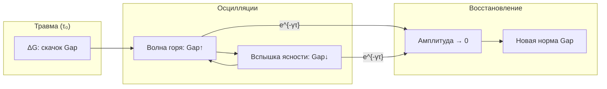

# Немарковская динамика

:::note О нотации
В этом документе:
- $\Gamma$ — [матрица когерентности](/docs/core/dynamics/coherence-matrix)
- $\gamma_{ij}$ — элементы $\Gamma$ (когерентности)
- $\mathrm{Gap}(i,j) = |\sin(\arg(\gamma_{ij}))|$ — [мера зазора](/docs/physics/dual-aspect/gap-semantics)
- $\Gamma_2$ — скорость декогеренции (диссипативная константа)
- $\kappa$ — скорость регенерации
- $\omega_c$ — частота обрезания ядра памяти (обратная длительность памяти: $\tau_{\text{mem}} = 1/\omega_c$)
- $\Delta\omega_{ij} = \omega_i - \omega_j$ — расстройка частот между измерениями $i$ и $j$
- $\mathcal{R}_{ij}$ — [регенеративный член](/docs/core/dynamics/evolution#3-регенеративный-член) для пары $(i,j)$
:::

:::warning Статус документа
Математические результаты о немарковской динамике Gap доказаны в [Gap-динамике](/docs/core/dynamics/gap-dynamics#немарковские-эффекты) **[Т]**. Кибернетическая и клиническая интерпретация имеет статус **[И]**. Предсказания о связи с терапевтическими данными — **[Г]**.
:::

Немарковская динамика описывает Gap-эволюцию с **памятью**: текущая скорость изменения когерентностей зависит не только от текущего состояния, но и от всей предшествующей истории. Это принципиально отличается от марковского приближения, где декогеренция мгновенна.

---

## 1. Ядро памяти $K(\tau)$ {#ядро-памяти}

### 1.1 Обобщённое уравнение движения

В марковском приближении декогеренция описывается дельта-функцией: $K(\tau) = -\Gamma_2 \delta(\tau)$, что даёт стандартное экспоненциальное затухание. При конечном времени памяти ядро $K(\tau) \neq \delta(\tau)$, и уравнение движения для когерентности $\gamma_{ij}$ принимает интегро-дифференциальную форму:

:::tip Определение (Немарковская динамика когерентностей) [Т]
$$
\frac{d\gamma_{ij}}{d\tau} = -i\Delta\omega_{ij}\,\gamma_{ij}(\tau) + \int_0^\tau K_{ij}(\tau - s)\, \gamma_{ij}(s)\, ds + \mathcal{R}_{ij}
$$

где:
- Первый член: унитарное вращение (свободная прецессия фазы)
- Второй член: **немарковская диссипация** с ядром памяти $K_{ij}(\tau)$
- Третий член: регенерация ($\propto \kappa \cdot \mathrm{Coh}_E$)

**Источник:** [Gap-динамика, раздел 4.1](/docs/core/dynamics/gap-dynamics#немарковские-эффекты).
:::

Свёрточная структура второго члена означает, что диссипация в момент $\tau$ определяется **интегралом по всей предшествующей истории** когерентности, взвешенной ядром $K_{ij}(\tau - s)$.

### 1.2 Экспоненциальное ядро {#экспоненциальное-ядро}

Простейшее немарковское ядро — экспоненциальное затухание памяти:

$$
K(\tau) = -\Gamma_2\,\omega_c \cdot e^{-\omega_c\,\tau}
$$

**Параметры:**
- $\Gamma_2$ — интегральная сила декогеренции
- $\omega_c = 1/\tau_{\text{mem}}$ — частота обрезания (обратное время памяти)
- $\tau_{\text{mem}}$ — характерное время памяти системы

**Предельные режимы:**
- $\omega_c \to \infty$ (мгновенная память): $K(\tau) \to -\Gamma_2\,\delta(\tau)$ — марковский предел
- $\omega_c \to 0$ (бесконечная память): $K(\tau) \to 0$ — диссипация исчезает (замороженная система)

**Спектральная плотность.** Фурье-образ экспоненциального ядра даёт **лоренциан**:

$$
\widetilde{K}(\omega) = \int_0^\infty K(\tau)\,e^{i\omega\tau}\,d\tau = \frac{-\Gamma_2\,\omega_c}{\omega_c - i\omega}
$$

Спектр мощности $|\widetilde{K}(\omega)|^2 \propto 1/(\omega_c^2 + \omega^2)$ — лоренцева форма с шириной $\omega_c$.

### 1.3 Осцилляторное ядро {#осцилляторное-ядро}

Более реалистичное ядро включает осцилляторную компоненту:

$$
K(\tau) = -\Gamma_2\,\omega_c \cdot e^{-\omega_c\,\tau} \cdot \cos(\omega_{\text{mem}}\,\tau)
$$

Здесь $\omega_{\text{mem}}$ — частота осцилляций памяти. Это соответствует среде с выделенной частотой (резонатор, осцилляторная ванна).

**Спектральная плотность** — сумма двух смещённых лоренцианов:

$$
|\widetilde{K}(\omega)|^2 \propto \frac{1}{\omega_c^2 + (\omega - \omega_{\text{mem}})^2} + \frac{1}{\omega_c^2 + (\omega + \omega_{\text{mem}})^2}
$$

Пики при $\omega = \pm\omega_{\text{mem}}$ — среда преимущественно «помнит» осцилляции на частоте $\omega_{\text{mem}}$.

### 1.4 Сводная таблица ядер

| Ядро | $K(\tau)$ | Спектр | Поведение Gap |
|------|-----------|--------|---------------|
| Марковское | $-\Gamma_2\,\delta(\tau)$ | Белый шум | Монотонная релаксация |
| Экспоненциальное | $-\Gamma_2\omega_c\,e^{-\omega_c\tau}$ | Лоренциан | Затухающие осцилляции |
| Осцилляторное | $-\Gamma_2\omega_c\,e^{-\omega_c\tau}\cos(\omega_{\text{mem}}\tau)$ | Двойной лоренциан | Резонансные осцилляции |
| Степенное | $-\Gamma_2\,(\tau/\tau_0)^{-\alpha}$ | $1/f^{1-\alpha}$ | Степенная релаксация |

---

## 2. Осцилляторная когеренция {#осцилляторная-когеренция}

### 2.1 Немарковские осцилляции Gap

:::tip Теорема (Немарковские осцилляции Gap) [Т]
При экспоненциальном ядре памяти $K(\tau) = -\Gamma_2\omega_c \cdot e^{-\omega_c\tau}$:

**(a)** Марковский предел ($\omega_c \to \infty$): стандартная экспоненциальная декогеренция

$$
\gamma_{ij}(\tau) \propto e^{-\Gamma_2\tau}
$$

**(b)** Немарковский режим ($\omega_c$ конечная): Gap **осциллирует**

$$
\mathrm{Gap}(i,j;\,\tau) = \mathrm{Gap}^{(\infty)} + C \cdot e^{-\gamma\tau}\cos(\omega_r\tau)
$$

где $\omega_r = \sqrt{\omega_c\Gamma_2 - \gamma^2}$ — частота затухающих осцилляций, $\gamma$ — скорость затухания.

**(c)** При $\omega_c < \Gamma_2/4$: **передемпфированный** режим — осцилляции отсутствуют, чисто экспоненциальная (но замедленная) релаксация к стационарному состоянию.

**Доказательство:** См. [Gap-динамика, Теорема 5.1](/docs/core/dynamics/gap-dynamics#немарковские-эффекты).
:::

**Физический механизм.** Немарковские осцилляции возникают из-за **обратного потока информации** из окружения в систему. В марковском режиме информация, потерянная в среду, не возвращается. В немарковском — среда «запоминает» когерентность и возвращает её обратно с задержкой $\sim \tau_{\text{mem}}$.

### 2.2 Три режима Gap-релаксации

| Режим | Условие | Динамика Gap | Характерная шкала |
|-------|---------|-------------|-------------------|
| Марковский | $\omega_c \gg \Gamma_2$ | $e^{-\Gamma_2\tau}$ (монотонно) | $\tau_{\text{relax}} = 1/\Gamma_2$ |
| Осциллирующий | $\omega_c \sim \Gamma_2$ | $e^{-\gamma\tau}\cos(\omega_r\tau)$ | $\tau_{\text{relax}} = 1/\gamma$, $T_{\text{osc}} = 2\pi/\omega_r$ |
| Передемпфированный | $\omega_c < \Gamma_2/4$ | $e^{-\gamma_{\pm}\tau}$ (двойная экспонента) | $\tau_{\text{relax}} = 1/\gamma_-$ (медленная) |

**Критерий осцилляций:**

$$
\omega_c\Gamma_2 > \gamma^2 \quad \Longleftrightarrow \quad \tau_{\text{mem}} < \frac{4}{\Gamma_2}
$$

Осцилляции Gap возникают, когда время памяти среды **достаточно короткое** (но не нулевое). Парадоксально: слишком длинная память ($\tau_{\text{mem}} \gg 4/\Gamma_2$) **подавляет** осцилляции.

### 2.3 Мера немарковости BLP {#мера-blp}

:::info Определение (Мера немарковости Breuer-Laine-Piilo) [Т]
$$
\mathcal{N} := \int_{\sigma > 0} \sigma(t,\, \rho_1,\, \rho_2)\, dt
$$

где $\sigma(t, \rho_1, \rho_2) = \frac{d}{dt}\|\rho_1(t) - \rho_2(t)\|_1$ — скорость изменения различимости пары состояний.

В марковской динамике $\sigma \leq 0$ всегда (различимость только убывает). В немарковской $\sigma > 0$ на некоторых интервалах — **обратный поток информации**.
:::

**Связь с Gap-осцилляциями.** Каждый полупериод осцилляции Gap, в котором $\mathrm{Gap}$ уменьшается (когерентность возвращается из среды), соответствует $\sigma > 0$ — ненулевой вклад в меру немарковости $\mathcal{N}$.

$$
\mathcal{N} \propto \sum_{k=1}^{N_{\text{osc}}} |\Delta\mathrm{Gap}_k| \cdot e^{-\gamma\,\tau_k}
$$

где суммирование идёт по всем полупериодам с убывающим Gap, $|\Delta\mathrm{Gap}_k|$ — амплитуда $k$-й осцилляции.

### 2.4 Связь с бифуркацией Хопфа

Немарковские осцилляции Gap следует отличать от осцилляций, порождённых [бифуркацией Хопфа](./bifurcation#hopf):

| Свойство | Немарковские осцилляции | Hopf-осцилляции |
|----------|------------------------|-----------------|
| Причина | Память среды | Потеря устойчивости |
| Затухание | Всегда затухают ($\gamma > 0$) | Незатухающий предельный цикл |
| Амплитуда | Убывает экспоненциально | Постоянная $A(\mu)$ |
| Управление | Через $\omega_c$ (ядро памяти) | Через $\mu$ (управляющий параметр) |
| Исчезновение | При $\omega_c \to \infty$ или $\omega_c < \Gamma_2/4$ | При $\mu < \mu_H$ |

В реальных системах оба механизма могут действовать одновременно: немарковские осцилляции **модулируют** амплитуду Hopf-предельного цикла.

---

## 3. «Циклы горя» — формализация через немарковскую память {#циклы-горя}

:::info Статус [И]
Формализация «циклов горя» через немарковскую Gap-динамику — **интерпретация**. Математический аппарат (Теорема 5.1 [Т]) строг; отождествление с клиническими феноменами требует эмпирической валидации.
:::

### 3.1 Травма как скачок стационарного значения

**Модель.** Травматическое событие в момент $\tau_0$ вызывает мгновенное изменение стационарного Gap-профиля:

$$
\mathrm{Gap}^{(\infty)}(S,E) : \quad G_0 \xrightarrow{\tau = \tau_0} G_0 + \Delta G
$$

где $\Delta G > 0$ — величина скачка (увеличение непрозрачности между телом и переживанием для канала $S \leftrightarrow E$, или между другими парами измерений).

**Динамика после скачка.** Система стремится к новому стационарному значению, но делает это **осциллирующим** образом:

$$
\mathrm{Gap}(S,E;\,\tau) = (G_0 + \Delta G) + C \cdot e^{-\gamma(\tau - \tau_0)} \cos\bigl(\omega_r(\tau - \tau_0)\bigr)
$$

### 3.2 Фазы горевания как фазы осцилляции

| Фаза осцилляции | Динамика Gap | Клиническое проявление |
|----------------|-------------|----------------------|
| $\cos(\omega_r\tau) > 0$ | Gap убывает | «Вспышка ясности» — кратковременное возвращение когерентности |
| $\cos(\omega_r\tau) < 0$ | Gap возрастает | «Волна горя» — усиление непрозрачности |
| $e^{-\gamma\tau} \to 0$ | Амплитуда $\to 0$ | Постепенное принятие — установление нового стационарного значения |
| $\tau \to \infty$ | $\mathrm{Gap} \to G_0 + \Delta G$ | Новая норма (может быть выше или ниже прежней) |

### 3.3 «Вспышки ясности» — конструктивная интерференция

:::info Интерпретация (Вспышки ясности) [И]
«Вспышки ясности» при горевании (моменты, когда человек внезапно «видит ясно» посреди кризиса) формализуются как **конструктивная интерференция** возвращающейся когерентности.

В немарковской динамике когерентность, «поглощённая» средой, возвращается через время $\sim \tau_{\text{mem}}$. Если несколько каналов синхронизируются ($\omega_r^{(ij)} \approx \omega_r^{(kl)}$), возникает усиленный эффект: одновременное кратковременное снижение Gap по нескольким парам измерений.
:::

**Условие синхронизации вспышек:**

$$
\left|\omega_r^{(ij)} - \omega_r^{(kl)}\right| < \gamma_{\min}
$$

где $\gamma_{\min}$ — минимальная скорость затухания. Когда разность частот осцилляций для разных каналов мала по сравнению со скоростью затухания, «вспышки ясности» по этим каналам совпадают.

### 3.4 Длительность горевания

**Время восстановления** определяется параметрами немарковского ядра:

$$
\tau_{\text{recovery}} \approx \frac{3}{\gamma} = \frac{3}{\text{Re}\left(\frac{\omega_c + \Gamma_2}{2} - \sqrt{\left(\frac{\omega_c - \Gamma_2}{2}\right)^2 - \omega_c\Gamma_2}\right)}
$$

(время, за которое амплитуда осцилляций снижается до $\sim 5\%$).

**Зависимость от $\tau_{\text{mem}} = 1/\omega_c$:**

| $\tau_{\text{mem}}$ | $\tau_{\text{recovery}}$ | Клиническая интерпретация |
|---------------------|--------------------------|--------------------------|
| Короткая ($\ll 1/\Gamma_2$) | $\sim 3/\Gamma_2$ | Быстрое восстановление (марковский режим) |
| Средняя ($\sim 1/\Gamma_2$) | $\sim 6/\Gamma_2$ | Осцилляторное горевание (немарковский режим) |
| Длинная ($\gg 1/\Gamma_2$) | $\gg 1/\Gamma_2$ | Затяжное горевание (передемпфированный режим) |

:::warning Терапевтическое следствие [И]
Из немарковской ФДТ ([Фазовая диаграмма, раздел 6.1](/docs/core/dynamics/gap-phase-diagram#немарковские-осцилляции)):

$$
\chi_{ij}(\omega) \propto \frac{1 + \omega^2\tau_M^2}{T_{\text{eff}}\,\Gamma_2^2\,\tau_M}
$$

При $\omega\tau_M \gg 1$: $\chi \propto \omega^2$ — **антирезонанс**. Система с длинной памятью сильнее реагирует на высокочастотные возмущения. Это объясняет бо&#769;льшую эффективность частых коротких терапевтических сессий по сравнению с редкими длительными.
:::

### 3.5 Диаграмма динамики горевания

---

## 4. Связь с Gap-диагностикой {#связь-с-диагностикой}

### 4.1 Немарковские сигнатуры в клинических данных

:::warning Гипотеза (Немарковские сигнатуры) [Г]
Немарковская динамика Gap порождает наблюдаемые сигнатуры, которые можно обнаружить в клинических данных:

**(a)** Частота осцилляций Gap: $f_{\text{osc}} = \omega_r / (2\pi)$ — может быть измерена через временной ряд самоотчётов или физиологических маркеров.

**(b)** Скорость затухания $\gamma$ — определяет огибающую амплитуды осцилляций.

**(c)** Мера немарковости $\mathcal{N}$ — коррелирует с «глубиной памяти» о травматическом событии.
:::

**Протокол обнаружения немарковских сигнатур:**

1. Собрать временной ряд субъективных отчётов по шкале Gap($S$,$E$) (или другому каналу) с частотой $\geq 2$ раза в неделю
2. Вычислить автокорреляционную функцию $C(\Delta\tau)$
3. Если $C(\Delta\tau)$ меняет знак — признак осцилляций (немарковский режим)
4. Подогнать модель $C(\Delta\tau) = C_0\,e^{-\gamma\Delta\tau}\cos(\omega_r\Delta\tau)$
5. Извлечь параметры: $\tau_{\text{mem}} \approx 2\pi / \omega_r$, $\tau_{\text{recovery}} \approx 3/\gamma$

### 4.2 Предсказания для терапии

:::warning Гипотеза (Измеримые предсказания) [Г]
**(a)** Частота осцилляций Gap пропорциональна обратному времени памяти:

$$
f_{\text{osc}} \sim \frac{1}{\tau_{\text{mem}}}
$$

Пациенты с «глубокой памятью» ($\tau_{\text{mem}}$ велико) демонстрируют **медленные** осцилляции Gap (длинные циклы горя). Пациенты с «короткой памятью» — **быстрые** осцилляции и более быстрое восстановление.

**(b)** Мера немарковости $\mathcal{N}$ положительно коррелирует с субъективной глубиной переживания травмы.

**(c)** Оптимальная частота терапевтических сессий $\sim \omega_r / \pi$ — резонанс с возвращающейся когерентностью.
:::

### 4.3 Связь с Gap-картой прозрачности

Немарковская динамика модифицирует [карту прозрачности](/docs/applied/research/gap-diagnostics#карта-прозрачности): стационарные значения Gap зависят от параметров ядра памяти.

| Параметр ядра | Влияние на Gap-карту | Диагностическое значение |
|---------------|---------------------|-------------------------|
| $\tau_{\text{mem}}$ (время памяти) | Период осцилляций Gap | Длительность «циклов горя» |
| $\Gamma_2$ (сила декогеренции) | Стационарное $\mathrm{Gap}^{(\infty)}$ | Глубина непрозрачности |
| $\omega_{\text{mem}}$ (частота памяти) | Резонансные пики | Выделенные каналы с усиленными осцилляциями |
| $\mathcal{N}$ (мера немарковости) | Наличие осцилляций | Немарковская vs марковская динамика |

### 4.4 Немарковская коррекция диагностических паттернов

Стандартные [диагностические паттерны](/docs/applied/research/gap-diagnostics#паттерны) (алекситимия, невроз расщепления и др.) приобретают временну&#769;ю структуру при немарковском рассмотрении:

| Паттерн | Марковская динамика | Немарковская динамика |
|---------|--------------------|-----------------------|
| Алекситимия ($S \leftrightarrow E$) | $\mathrm{Gap}(S,E) \to 1$ монотонно | Осцилляции с «вспышками» телесного осознавания |
| Невроз расщепления ($L \leftrightarrow E$) | $\mathrm{Gap}(L,E) \to 1$ монотонно | Периодические моменты «настоящего понимания» |
| Импульсивность ($D \leftrightarrow L$) | $\mathrm{Gap}(D,L) \to 1$ монотонно | Чередование импульсивности и контроля |

:::info Терапевтическое значение [И]
Немарковские «вспышки» — это **терапевтические окна**, в которых интервенция наиболее эффективна. Если терапевт может идентифицировать фазу осцилляции (через мониторинг субъективных отчётов), интервенция во время $\cos(\omega_r\tau) > 0$ (Gap убывает) значительно эффективнее, чем во время $\cos(\omega_r\tau) < 0$ (Gap возрастает).
:::

---

## 5. Формальная структура {#формальная-структура}

### 5.1 Интегро-дифференциальное уравнение в частотном пространстве

Фурье-преобразование немарковского уравнения:

$$
(-i\omega + i\Delta\omega_{ij})\,\tilde{\gamma}_{ij}(\omega) = \widetilde{K}_{ij}(\omega)\,\tilde{\gamma}_{ij}(\omega) + \tilde{\mathcal{R}}_{ij}(\omega)
$$

Решение:

$$
\tilde{\gamma}_{ij}(\omega) = \frac{\tilde{\mathcal{R}}_{ij}(\omega)}{-i(\omega - \Delta\omega_{ij}) - \widetilde{K}_{ij}(\omega)}
$$

Полюса знаменателя определяют частоты осцилляций и скорости затухания.

### 5.2 Полюса для экспоненциального ядра

Для $\widetilde{K}(\omega) = -\Gamma_2\omega_c / (\omega_c - i\omega)$:

$$
-i(\omega - \Delta\omega_{ij}) + \frac{\Gamma_2\omega_c}{\omega_c - i\omega} = 0
$$

Приводит к квадратному уравнению на $\omega$:

$$
\omega^2 + i(\omega_c + \Gamma_2)\omega - (\omega_c\Delta\omega_{ij} + i\omega_c\Gamma_2) = 0
$$

Два полюса $\omega_{\pm} = -i\gamma \pm \omega_r$ дают затухание $\gamma$ и частоту осцилляций $\omega_r$ из [Теоремы 5.1](/docs/core/dynamics/gap-dynamics#немарковские-эффекты).

### 5.3 Сводка статусов

| Результат | Статус | Источник |
|-----------|--------|----------|
| Немарковское уравнение движения (определение) | **[Т]** | [Gap-динамика](/docs/core/dynamics/gap-dynamics#немарковские-эффекты) |
| Немарковские осцилляции Gap (Теорема 5.1) | **[Т]** | [Gap-динамика](/docs/core/dynamics/gap-dynamics#немарковские-эффекты) |
| Немарковская ФДТ для Gap | **[Т]** | [Фазовая диаграмма](/docs/core/dynamics/gap-phase-diagram#немарковские-осцилляции) |
| Мера немарковости BLP (определение) | **[Т]** | Breuer, Laine, Piilo (2009) |
| «Циклы горя» как немарковская динамика | **[И]** | Данный документ |
| «Вспышки ясности» как конструктивная интерференция | **[И]** | Данный документ |
| Немарковские сигнатуры в клинических данных | **[Г]** | Данный документ |
| Связь $f_{\text{osc}} \sim 1/\tau_{\text{mem}}$ | **[Г]** | Данный документ |
| Оптимальная частота терапевтических сессий | **[Г]** | Данный документ |

---

**Связанные документы:**
- [Динамика Gap](/docs/core/dynamics/gap-dynamics) — немарковские эффекты, бифуркации, единая теорема
- [Фазовая диаграмма Gap](/docs/core/dynamics/gap-phase-diagram) — немарковские осцилляции, ФДТ
- [Gap-диагностика](/docs/applied/research/gap-diagnostics) — карта прозрачности, диагностические паттерны
- [Бифуркации Gap-ландшафта](./bifurcation) — pitchfork, saddle-node, Hopf, катастрофы Уитни
- [Определения](./definitions) — меры $P$, $\Phi$, $R$, $\mathrm{Coh}_E$
- [Приложения](./applications) — клинические и организационные приложения
- [Эволюция Γ](/docs/core/dynamics/evolution) — полное уравнение движения
- [Предсказания](./predictions) — верифицируемые следствия КК
