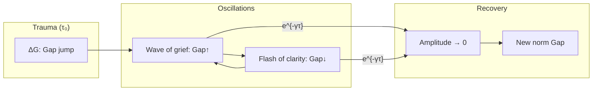

# Non-Markovian Dynamics

:::info Bridge from the Previous Chapter
In the [previous chapter](./bifurcation) we studied **bifurcations** of the Gap landscape — qualitative restructurings in which stable states disappear, oscillations are born, and hysteresis arises. But bifurcation analysis assumed that the system's future is determined solely by its present. But what if the **past** does not let go? What if a trauma from ten years ago continues to shape today's dynamics? That is precisely the subject of this chapter.
:::

### Chapter Roadmap

In this chapter we:

1. **Understand the difference between Markovian and non-Markovian dynamics** — and see why consciousness fundamentally cannot be "memoryless" (Introduction, section "Two Views on Time")
2. **Introduce the memory kernel $K(\tau)$** — the mathematical object describing how the past influences the present — and classify its forms: exponential [T], oscillatory [H], power-law [H] (section 1)
3. **Show how non-Markovianity generates Gap oscillations** — damped waves distinct from undamped Hopf oscillations — and introduce the BLP non-Markovianity measure (section 2)
4. **Formalise "grief cycles"** — as a mathematical model of grieving, including post-traumatic growth and complicated grief (section 3)
5. **Define therapeutic windows** — time intervals of heightened plasticity created by non-Markovian oscillations (section 4)
6. **Connect the formalism to neuroscience** — memory reconsolidation, theta rhythm, EMDR, pharmacology (sections 5–6)
7. **Discuss philosophical significance**: non-Markovianity as a condition for personal identity (section 7)

> *We are not what we are now. We are what we were, and what we may still become. The past does not leave: it is woven into the fabric of the present.*

:::note A Note on Notation
In this document:
- $\Gamma$ — [coherence matrix](/docs/core/dynamics/coherence-matrix)
- $\gamma_{ij}$ — elements of $\Gamma$ (coherences)
- $\mathrm{Gap}(i,j) = |\sin(\arg(\gamma_{ij}))|$ — [gap measure](/docs/physics/dual-aspect/gap-semantics)
- $\Gamma_2$ — decoherence rate (dissipative constant)
- $\kappa$ — regeneration rate
- $\omega_c$ — memory kernel cut-off frequency (inverse memory duration: $\tau_{\text{mem}} = 1/\omega_c$)
- $\Delta\omega_{ij} = \omega_i - \omega_j$ — frequency detuning between dimensions $i$ and $j$
- $\mathcal{R}_{ij}$ — [regenerative term](/docs/core/dynamics/evolution#3-регенеративный-член) for pair $(i,j)$
:::

:::warning Document status
Mathematical results on non-Markovian Gap dynamics are proved in [Gap dynamics](/docs/core/dynamics/gap-dynamics#немарковские-эффекты) **[T]**. The cybernetic and clinical interpretation has status **[I]**. Predictions about connections to therapeutic data — **[H]**.
:::

---

## Why the Past Does Not Let Go: the Non-Markovian Nature of Consciousness {#введение-память}

Close your eyes and recall the first day you felt truly alive. Perhaps it was the smell of the sea in childhood, or the touch of a loved one's hand, or the moment when you suddenly understood something about the world that changed everything. This memory is not merely a record in an archive. It *shapes you right now*: your body responds to it with microtensions, your breathing shifts slightly, your emotional background changes. The past is not sitting on a shelf somewhere. It lives in you, modulating every moment of the present.

This chapter is about how mathematics describes this fundamental fact.

Most physical models work in the **Markovian** approximation: the future depends only on the present. Roll a die — the result does not depend on previous throws. A gas molecule collides with another — its future trajectory is determined only by its current velocity and position, not by where it came from a minute ago. This is a beautiful abstraction, but it is *fundamentally unsuitable* for describing consciousness.

Consciousness is not a die or a gas molecule. Consciousness is a system in which:

- **The loss** of a loved one can send waves of grief for years after the event
- **Trauma** does not "erase" once the danger has passed — it restructures the entire perceptual apparatus
- **Learning** changes not only what we know, but also *how we are able to know*
- **Love** transforms not a single emotion, but the entire architecture of experience

All of this is a manifestation of **non-Markovian dynamics**: a process in which the system's history is inseparable from its current state. Coherence Cybernetics (CC) provides a precise formalism for describing these phenomena — not metaphorically, but through rigorous mathematical structures.

---

## Markovianity and Non-Markovianity: Two Views on Time {#два-взгляда-на-время}

To understand how non-Markovian dynamics differs from Markovian, imagine two types of lakes.

**Markovian lake.** Throw a stone — ripples spread across the water. But the water "does not remember" the stone: a minute later the surface is smooth, and the next stone will create exactly the same ripples, regardless of the history of previous throws. Each moment is a clean slate. Formally: the future state $\rho(t + dt)$ depends only on the current state $\rho(t)$, and on nothing else.

**Non-Markovian lake.** Now imagine a lake with a viscous bottom. A stone that fell yesterday created a funnel in the silt. Today's stone falls into an altered bottom landscape — and the ripples behave differently. Moreover: yesterday's funnel gradually fills in, and the bottom "returns" part of the absorbed energy — delayed disturbances appear on the surface, an echo of the past stone. Formally: $\rho(t + dt)$ depends on the entire history $\{\rho(s) : 0 \leq s \leq t\}$.

In the context of the coherence matrix $\Gamma$ this distinction is critically important:

| Property | Markovian dynamics | Non-Markovian dynamics |
|----------|--------------------|------------------------|
| Dependence | Only on $\Gamma(\tau)$ | On entire history $\{\Gamma(s)\}_{s \leq \tau}$ |
| Decoherence | Instantaneous, monotone | With delay, can oscillate |
| Information flow | Only "from system into environment" | Bidirectional: environment returns coherence |
| Mathematics | ODE: $d\gamma/d\tau = f(\gamma)$ | Integro-differential equation with convolution |
| Analogy | Amnesia: each moment begins afresh | Living memory: the past is woven into the present |

It is precisely non-Markovian dynamics that makes possible what we intuitively feel: the past *is present* in the present. Not as a picture-memory, but as a structural influence on the current evolution of coherences.

---

## 1. Memory Kernel $K(\tau)$ {#ядро-памяти}

### Memory Kernel: How to Formalise the Influence of the Past {#формализация-ядра}

The central object of non-Markovian theory is the **memory kernel** $K(\tau)$. This is a function that describes *how strongly* the past influences the present, and *how quickly* this influence decays.

The intuition is simple. If you burned your hand five seconds ago, the pain is still very strong — the memory kernel is large. If it was yesterday — only a trace remains, and the kernel is small. If it was in childhood but the burn was severe — the memory kernel may be infinitesimal in amplitude, but not zero: the hand still flinches from fire.

Mathematically, the memory kernel is a weight function in a temporal convolution: it determines how each past moment contributes to the current rate of change of coherence.

### 1.1 Generalised Equation of Motion

In the Markovian approximation decoherence is described by a delta function: $K(\tau) = -\Gamma_2 \delta(\tau)$, giving standard exponential decay. For a finite memory time the kernel $K(\tau) \neq \delta(\tau)$, and the equation of motion for coherence $\gamma_{ij}$ takes the integro-differential form:

:::tip Definition (Non-Markovian coherence dynamics) [T]
$$
\frac{d\gamma_{ij}}{d\tau} = -i\Delta\omega_{ij}\,\gamma_{ij}(\tau) + \int_0^\tau K_{ij}(\tau - s)\, \gamma_{ij}(s)\, ds + \mathcal{R}_{ij}
$$

where:
- First term: unitary rotation (free phase precession)
- Second term: **non-Markovian dissipation** with memory kernel $K_{ij}(\tau)$
- Third term: regeneration ($\propto \kappa \cdot \mathrm{Coh}_E$)

**Source:** [Gap dynamics, section 4.1](/docs/core/dynamics/gap-dynamics#немарковские-эффекты).
:::

The convolution structure of the second term means that dissipation at moment $\tau$ is determined by the **integral over the entire preceding history** of the coherence, weighted by the kernel $K_{ij}(\tau - s)$.

Note the depth of this formula. The integral $\int_0^\tau K(\tau - s)\, \gamma(s)\, ds$ is not merely a technical complication. It is a statement about the nature of reality: *the current rate of change of the state is determined by the superposition of all past states*, each weighted by how long ago it occurred. This is precisely how living memory works: the recent is vivid, the distant is faint, but does not vanish completely.

### 1.2 Exponential Kernel [T] (T-94) {#экспоненциальное-ядро}

The simplest non-Markovian kernel is exponential memory decay. The exponential form is **proved** from the compactness of the state space ([T-94](/docs/core/dynamics/gap-dynamics#теорема-ядро-экспоненциальное) [T]):

$$
K(\tau) = -\Gamma_2\,\omega_c \cdot e^{-\omega_c\,\tau}
$$

**Parameters:**
- $\Gamma_2$ — integral decoherence strength
- $\omega_c = 1/\tau_{\text{mem}}$ — cut-off frequency (inverse memory time)
- $\tau_{\text{mem}}$ — characteristic memory time of the system

**Limiting regimes:**
- $\omega_c \to \infty$ (instantaneous memory): $K(\tau) \to -\Gamma_2\,\delta(\tau)$ — Markovian limit
- $\omega_c \to 0$ (infinite memory): $K(\tau) \to 0$ — dissipation vanishes (frozen system)

These limiting regimes are remarkable. At one pole — complete amnesia: the environment instantly "forgets" everything it absorbed, and coherence is lost irreversibly. At the other — absolute memory: the environment remembers everything indefinitely and dissipates nothing, but the system *freezes*, because the kernel tends to zero. Living systems exist between these extremes — in a zone where memory is finite but real.

**Spectral density.** The Fourier transform of the exponential kernel gives a **Lorentzian**:

$$
\widetilde{K}(\omega) = \int_0^\infty K(\tau)\,e^{i\omega\tau}\,d\tau = \frac{-\Gamma_2\,\omega_c}{\omega_c - i\omega}
$$

Power spectrum $|\widetilde{K}(\omega)|^2 \propto 1/(\omega_c^2 + \omega^2)$ — Lorentzian shape with width $\omega_c$.

A Lorentzian spectrum means that memory has no "privileged frequency" — it acts as a broad-band filter, attenuating all components above the cut-off frequency $\omega_c$. In terms of lived experience: events occurring faster than the characteristic memory time $\tau_{\text{mem}}$ "pass by" and leave no trace. Only what lasts long enough is recorded in the system's memory.

### 1.3 Oscillatory Kernel [H] {#осцилляторное-ядро}

A more realistic kernel includes an oscillatory component [H] (not proved from axioms, but compatible with the exponential form T-94):

$$
K(\tau) = -\Gamma_2\,\omega_c \cdot e^{-\omega_c\,\tau} \cdot \cos(\omega_{\text{mem}}\,\tau)
$$

Here $\omega_{\text{mem}}$ is the frequency of memory oscillations. This corresponds to an environment with a distinguished frequency (resonator, oscillator bath).

The oscillatory kernel is especially interesting for modelling **cyclic** processes in consciousness. When the environment (neural network, social surroundings, bodily rhythms) has its own characteristic frequency, memory acquires a rhythmic structure. This is the mathematical reflection of what everyone knows: grief returns in waves, creative insights come in cycles, seasonal rhythms modulate mood.

**Spectral density** — sum of two shifted Lorentzians:

$$
|\widetilde{K}(\omega)|^2 \propto \frac{1}{\omega_c^2 + (\omega - \omega_{\text{mem}})^2} + \frac{1}{\omega_c^2 + (\omega + \omega_{\text{mem}})^2}
$$

Peaks at $\omega = \pm\omega_{\text{mem}}$ — the environment preferentially "remembers" oscillations at frequency $\omega_{\text{mem}}$.

### 1.4 Summary Table of Kernels

| Kernel | $K(\tau)$ | Spectrum | Gap behaviour | Status |
|--------|-----------|----------|---------------|--------|
| Markovian | $-\Gamma_2\,\delta(\tau)$ | White noise | Monotone relaxation | [T] (T-94 limit) |
| Exponential | $-\Gamma_2\omega_c\,e^{-\omega_c\tau}$ | Lorentzian | Damped oscillations | **[T]** (T-94) |
| Oscillatory | $-\Gamma_2\omega_c\,e^{-\omega_c\tau}\cos(\omega_{\text{mem}}\tau)$ | Double Lorentzian | Resonant oscillations | **[H]** |
| Power-law | $-\Gamma_2\,(\tau/\tau_0)^{-\alpha}$ | $1/f^{1-\alpha}$ | Power-law relaxation | **[H]** |

:::info Connection to Gap space
The structure of the 7-dimensional Gap space is determined by the isomorphism $\mathrm{PG}(2,2) \cong H(7,4)$ ([T-93](/docs/core/dynamics/gap-dynamics#теорема-h74-формальная) [T]). The Hamming code H(7,4) defines distances between Gap configurations and, consequently, correlations of the kernel $K_{ij}(\tau)$ between different dimension pairs.
:::

### 1.5 Physiology of the Memory Kernel {#физиология-ядра}

The memory kernel $K(\tau)$ is not an abstraction. It has direct neurophysiological correlates:

**Short-term memory** ($\tau_{\text{mem}} \sim$ seconds). At the neural-network level: stable activity patterns in the prefrontal cortex. Kernel: exponential, $\omega_c \sim 0.1\text{–}1$ Hz.

**Working memory** ($\tau_{\text{mem}} \sim$ minutes). Hippocampal theta-rhythm oscillations (4–8 Hz) modulate information retention. Kernel: *oscillatory*, with $\omega_{\text{mem}}$ in the theta range.

**Long-term memory** ($\tau_{\text{mem}} \sim$ years). Consolidation through synaptic plasticity and neurogenesis. Kernel: *power-law* ($\alpha \approx 0.5\text{–}1$), consistent with the classical Ebbinghaus forgetting curve $R(t) \propto t^{-\alpha}$.

**Traumatic memory** — a special case. Kernel with anomalously small $\omega_c$ (slow decay) and a possible oscillatory component. This formalises the clinical observation: traumatic memories "do not fade" like ordinary ones — they retain emotional intensity far longer than the standard exponential forgetting model predicts.

---

## 2. Oscillatory Coherence {#осцилляторная-когеренция}

### 2.1 Non-Markovian Gap Oscillations

:::tip Theorem (Non-Markovian Gap oscillations) [T]
For exponential memory kernel $K(\tau) = -\Gamma_2\omega_c \cdot e^{-\omega_c\tau}$:

**(a)** Markovian limit ($\omega_c \to \infty$): standard exponential decoherence

$$
\gamma_{ij}(\tau) \propto e^{-\Gamma_2\tau}
$$

**(b)** Non-Markovian regime (finite $\omega_c$): Gap **oscillates**

$$
\mathrm{Gap}(i,j;\,\tau) = \mathrm{Gap}^{(\infty)} + C \cdot e^{-\gamma\tau}\cos(\omega_r\tau)
$$

where $\omega_r = \sqrt{\omega_c\Gamma_2 - \gamma^2}$ is the frequency of damped oscillations, $\gamma$ is the decay rate.

**(c)** For $\omega_c < \Gamma_2/4$: **overdamped** regime — no oscillations, purely exponential (but slowed) relaxation to the stationary state.

**Proof:** See [Gap dynamics, Theorem 5.1](/docs/core/dynamics/gap-dynamics#немарковские-эффекты).
:::

**Physical mechanism.** Non-Markovian oscillations arise from the **backflow of information** from the environment into the system. In the Markovian regime, information lost to the environment does not return. In the non-Markovian regime — the environment "remembers" coherence and returns it with delay $\sim \tau_{\text{mem}}$.

This is one of the most striking results of the theory. We usually think of decoherence as a one-way process: order → chaos, coherence → noise, clarity → muddiness. But non-Markovian dynamics says: **the environment can return what it has taken**. Coherence that "dissolved" into the surroundings returns after time $\tau_{\text{mem}}$ — weakened, but real. In terms of human experience: clarity lost in a crisis can return — not because we "work on ourselves", but because *that is the dynamics of the system*. The environment — body, social surroundings, neural network — carries the imprint of lost coherence and returns it in waves.

### 2.2 Three Gap-Relaxation Regimes

| Regime | Condition | Gap dynamics | Characteristic scale |
|--------|-----------|-------------|----------------------|
| Markovian | $\omega_c \gg \Gamma_2$ | $e^{-\Gamma_2\tau}$ (monotone) | $\tau_{\text{relax}} = 1/\Gamma_2$ |
| Oscillating | $\omega_c \sim \Gamma_2$ | $e^{-\gamma\tau}\cos(\omega_r\tau)$ | $\tau_{\text{relax}} = 1/\gamma$, $T_{\text{osc}} = 2\pi/\omega_r$ |
| Overdamped | $\omega_c < \Gamma_2/4$ | $e^{-\gamma_{\pm}\tau}$ (double exponential) | $\tau_{\text{relax}} = 1/\gamma_-$ (slow) |

**Criterion for oscillations:**

$$
\omega_c\Gamma_2 > \gamma^2 \quad \Longleftrightarrow \quad \tau_{\text{mem}} < \frac{4}{\Gamma_2}
$$

Gap oscillations arise when the environment's memory time is **short enough** (but not zero). Paradoxically: excessively long memory ($\tau_{\text{mem}} \gg 4/\Gamma_2$) **suppresses** oscillations.

This paradox deserves separate discussion. One might think: the longer the memory, the more "material" for return, hence the more pronounced the oscillations. But mathematics says the opposite: for very long memory ($\omega_c \to 0$) the system enters the overdamped regime, where there are no oscillations. The reason: when the environment remembers *too much*, the returning information flow is spread over a long time interval and becomes so weak at each moment that it cannot overcome the current dissipation. This resembles a clinical observation: a patient "stuck" in chronic grief does not pass through oscillatory phases — they are in a state of constant but blunted suffering.

### 2.3 Non-Markovianity Measure BLP {#мера-blp}

:::info Definition (Breuer–Laine–Piilo non-Markovianity measure) [T]
$$
\mathcal{N} := \int_{\sigma > 0} \sigma(t,\, \rho_1,\, \rho_2)\, dt
$$

where $\sigma(t, \rho_1, \rho_2) = \frac{d}{dt}\|\rho_1(t) - \rho_2(t)\|_1$ is the rate of change of the distinguishability of a pair of states.

In Markovian dynamics $\sigma \leq 0$ always (distinguishability only decreases). In non-Markovian dynamics $\sigma > 0$ on some intervals — **information backflow**.
:::

**Connection to Gap oscillations.** Each half-period of Gap oscillation in which $\mathrm{Gap}$ decreases (coherence returning from the environment) corresponds to $\sigma > 0$ — a non-zero contribution to the non-Markovianity measure $\mathcal{N}$.

$$
\mathcal{N} \propto \sum_{k=1}^{N_{\text{osc}}} |\Delta\mathrm{Gap}_k| \cdot e^{-\gamma\,\tau_k}
$$

where the sum runs over all half-periods with decreasing Gap, $|\Delta\mathrm{Gap}_k|$ is the amplitude of the $k$-th oscillation.

### 2.4 Measuring Non-Markovianity: a Quantitative Approach {#количественный-подход}

The BLP measure is not the only way to quantify non-Markovianity. Quantum information theory has developed a range of alternative measures, each revealing a different aspect of information backflow:

**RHP measure** (Rivas, Huelga, Plenio). Based on violation of the **divisibility** property of the dynamical map. A Markovian process is divisible: $\Lambda(t+s, 0) = \Lambda(t+s, s) \cdot \Lambda(s, 0)$, and the intermediate map $\Lambda(t+s, s)$ is completely positive. Non-Markovianity manifests as loss of complete positivity of the intermediate map.

**Mutual information.** Non-Markovianity can be measured by the growth of mutual information $I(S:E)$ between the system and the environment. In Markovian dynamics $I(S:E)$ grows monotonically (information flows into the environment). Non-Markovian backflow gives a temporary *decrease* of $I(S:E)$.

**Consistency of measures.** For the exponential kernel T-94, all non-Markovianity measures are **consistent**: if one is non-zero, all are non-zero, and all vanish simultaneously in the Markovian limit $\omega_c \to \infty$.

For Coherence Cybernetics the most practical is the BLP measure, since it is directly connected to the observable Gap oscillations.

### 2.5 Connection to Hopf Bifurcation

Non-Markovian Gap oscillations must be distinguished from oscillations generated by a [Hopf bifurcation](./bifurcation#hopf):

| Property | Non-Markovian oscillations | Hopf oscillations |
|----------|---------------------------|-------------------|
| Cause | Environmental memory | Loss of stability |
| Damping | Always damped ($\gamma > 0$) | Undamped limit cycle |
| Amplitude | Decreases exponentially | Constant $A(\mu)$ |
| Control | Through $\omega_c$ (memory kernel) | Through $\mu$ (control parameter) |
| Disappearance | As $\omega_c \to \infty$ or $\omega_c < \Gamma_2/4$ | As $\mu < \mu_H$ |

In real systems both mechanisms can operate simultaneously: non-Markovian oscillations **modulate** the amplitude of the Hopf limit cycle.

This distinction has deep clinical significance. Non-Markovian oscillations are the *response of a healthy system to a shock*: they decay, and the system gradually reaches a new equilibrium. Hopf oscillations are a *structural change of dynamics*: the system loses stability and transitions to an undamped cyclic regime. The former is normal grieving. The latter is a chronic disorder in which cycles of pain and relief do not dampen but sustain themselves.

---

## 3. "Grief Cycles" — Formalisation through Non-Markovian Memory {#циклы-горя}

:::info Status [I]
The formalisation of "grief cycles" through non-Markovian Gap dynamics is an **interpretation**. The mathematical apparatus (Theorem 5.1 [T]) is rigorous; the identification with clinical phenomena requires empirical validation.
:::

### Grief Cycles and Post-Traumatic Growth {#горе-и-рост}

Grieving is one of the deepest and most universal human experiences. Every culture knows its phases: numbness, waves of acute pain, slow acceptance. Elisabeth Kübler-Ross described "five stages of grief" — denial, anger, bargaining, depression, acceptance. But clinical observations show that grieving is not a linear sequence of stages. It is an **oscillatory process**: waves of grief alternate with moments of clarity, and the amplitude of these waves gradually diminishes.

Non-Markovian Gap dynamics provides an exact mathematical model of this process. And not only a model — it makes quantitative predictions about the duration of grieving, the frequency of oscillations, and the conditions under which grieving transitions to chronic form.

### 3.1 Trauma as a Jump in Stationary Value

**Model.** A traumatic event at moment $\tau_0$ causes an instantaneous change in the stationary Gap profile:

$$
\mathrm{Gap}^{(\infty)}(S,E) : \quad G_0 \xrightarrow{\tau = \tau_0} G_0 + \Delta G
$$

where $\Delta G > 0$ is the magnitude of the jump (increase in opacity between body and experience for channel $S \leftrightarrow E$, or between other dimension pairs).

What does this jump mean in terms of experience? $\mathrm{Gap}(S,E)$ is the measure of opacity between Sensation and Emotion, between embodiment and experience. The jump $\Delta G$ is a sudden loss of connection: the body stops "hearing" the emotions, or the emotions stop "reaching" the body. Clinically this manifests as numbness, depersonalisation, a "cotton wool" feeling — well-known reactions to acute trauma.

**Dynamics after the jump.** The system tends toward the new stationary value, but does so in an **oscillatory** manner:

$$
\mathrm{Gap}(S,E;\,\tau) = (G_0 + \Delta G) + C \cdot e^{-\gamma(\tau - \tau_0)} \cos\bigl(\omega_r(\tau - \tau_0)\bigr)
$$

### 3.2 Phases of Grieving as Phases of Oscillation

| Oscillation phase | Gap dynamics | Clinical manifestation |
|-------------------|-------------|------------------------|
| $\cos(\omega_r\tau) > 0$ | Gap decreasing | "Flash of clarity" — brief return of coherence |
| $\cos(\omega_r\tau) < 0$ | Gap increasing | "Wave of grief" — intensification of opacity |
| $e^{-\gamma\tau} \to 0$ | Amplitude $\to 0$ | Gradual acceptance — settling to new stationary value |
| $\tau \to \infty$ | $\mathrm{Gap} \to G_0 + \Delta G$ | New norm (may be higher or lower than before) |

Note that the "new norm" $G_0 + \Delta G$ can be either *higher* or *lower* than the original value $G_0$. The case $\Delta G < 0$ (Gap *decreases* after the shock) is the phenomenon of **post-traumatic growth**: a trauma, once lived through, paradoxically *increases* the connectivity of dimensions. Coherence Cybernetics predicts that this is possible when the regenerative term $\mathcal{R}_{ij}$ is strong enough to "reassemble" coherence at a higher level. Condition:

$$
\kappa \cdot \mathrm{Coh}_E > \Gamma_2 \cdot (G_0 + |\Delta G|) \quad \Longrightarrow \quad \text{post-traumatic growth is possible}
$$

This is the mathematical reflection of the clinical observation: growth after trauma is possible when regenerative resources (internal and external) exceed the strength of decoherence.

### 3.3 "Flashes of Clarity" — Constructive Interference

:::info Interpretation (Flashes of clarity) [I]
"Flashes of clarity" during grieving (moments when a person suddenly "sees clearly" in the midst of a crisis) are formalised as **constructive interference** of returning coherence.

In non-Markovian dynamics, coherence "absorbed" by the environment returns after time $\sim \tau_{\text{mem}}$. If several channels synchronise ($\omega_r^{(ij)} \approx \omega_r^{(kl)}$), an amplified effect arises: simultaneous brief reduction of Gap across several dimension pairs.
:::

Everyone who has been through grief knows these moments. Amid the fog and pain, crystal clarity suddenly arrives: the world for a moment becomes as sharp and full as it may not have been even before the loss. This is not an illusion or a defence mechanism. In terms of non-Markovian dynamics — it is a real physical process: the environment that absorbed coherence at the moment of trauma synchronously returns it across several channels simultaneously.

**Synchronisation condition for flashes:**

$$
\left|\omega_r^{(ij)} - \omega_r^{(kl)}\right| < \gamma_{\min}
$$

where $\gamma_{\min}$ is the minimum decay rate. When the difference in oscillation frequencies for different channels is small compared to the decay rate, "flashes of clarity" in those channels coincide.

**Multi-channel interference.** In a 7-dimensional system with $\binom{7}{2} = 21$ coherence pairs, "flashes of clarity" can be extraordinarily complex. A full "flash" (simultaneous reduction of Gap across many channels) arises when the synchronisation condition is satisfied for a cluster of channels. The structure of these clusters is determined by the Hamming code $H(7,4)$, which gives non-trivial predictions about correlations between different aspects of "clarity".

### 3.4 Duration of Grieving

**Recovery time** is determined by the parameters of the non-Markovian kernel:

$$
\tau_{\text{recovery}} \approx \frac{3}{\gamma} = \frac{3}{\text{Re}\left(\frac{\omega_c + \Gamma_2}{2} - \sqrt{\left(\frac{\omega_c - \Gamma_2}{2}\right)^2 - \omega_c\Gamma_2}\right)}
$$

(time for oscillation amplitude to drop to $\sim 5\%$).

**Dependence on $\tau_{\text{mem}} = 1/\omega_c$:**

| $\tau_{\text{mem}}$ | $\tau_{\text{recovery}}$ | Clinical interpretation |
|---------------------|--------------------------|------------------------|
| Short ($\ll 1/\Gamma_2$) | $\sim 3/\Gamma_2$ | Fast recovery (Markovian regime) |
| Moderate ($\sim 1/\Gamma_2$) | $\sim 6/\Gamma_2$ | Oscillatory grieving (non-Markovian regime) |
| Long ($\gg 1/\Gamma_2$) | $\gg 1/\Gamma_2$ | Prolonged grieving (overdamped regime) |

:::warning Therapeutic corollary [I]
From non-Markovian FDT ([Phase diagram, section 6.1](/docs/core/dynamics/gap-phase-diagram#немарковские-осцилляции)):

$$
\chi_{ij}(\omega) \propto \frac{1 + \omega^2\tau_M^2}{T_{\text{eff}}\,\Gamma_2^2\,\tau_M}
$$

For $\omega\tau_M \gg 1$: $\chi \propto \omega^2$ — **anti-resonance**. A system with long memory responds more strongly to high-frequency perturbations. This explains the greater effectiveness of frequent short therapeutic sessions compared to infrequent lengthy ones.
:::

### 3.5 Diagram of Grief Dynamics

```mermaid
graph LR
    subgraph TRAUMA["Trauma (τ₀)"]
        T["ΔG: Gap jump"]
    end
    subgraph OSC["Oscillations"]
        W["Wave of grief: Gap↑"]
        C["Flash of clarity: Gap↓"]
    end
    subgraph REC["Recovery"]
        A["Amplitude → 0"]
        N["New norm Gap"]
    end

    T --> W
    W --> C
    C --> W
    W --> |"e^{-γτ}"| A
    C --> |"e^{-γτ}"| A
    A --> N
```

### 3.6 Complicated Grief: Transition to Chronic Regime {#осложнённое-горевание}

Not all grieving passes through the oscillatory phase to acceptance. Clinicians distinguish **complicated grief** (prolonged grief disorder) — a state in which the process "gets stuck". Non-Markovian dynamics offers two models of this transition:

**Model 1: Overdamping.** If the memory time $\tau_{\text{mem}}$ is anomalously large ($\tau_{\text{mem}} \gg 4/\Gamma_2$), the system enters the overdamped regime. There are no oscillations — neither "waves of grief" nor "flashes of clarity". Instead — a prolonged, monotone, but very slow approach to the stationary state. This corresponds to the clinical picture of "frozen grief": the person does not cry, does not get angry, does not pass through phases — they simply "cannot get out of it".

**Model 2: Hopf bifurcation.** If the trauma is strong enough for the system's parameters to cross the Hopf bifurcation threshold ($\mu > \mu_H$), the damped oscillations *transition into a self-sustaining limit cycle*. This is chronic grief with undamped waves of pain and relief. Formally:

$$
\mathrm{Gap}(S,E;\,\tau) \to \mathrm{Gap}^{(\infty)} + A(\mu) \cdot \cos(\omega_H\tau + \phi_0) \quad (\tau \to \infty)
$$

Amplitude $A(\mu) > 0$ — waves of grief do not decay. This is qualitatively different dynamics, and it requires qualitatively different therapeutic interventions: not waiting for natural decay, but *changing the control parameter* $\mu$ to suppress the bifurcation.

---

## 4. Flashes of Clarity: Non-Markovian Windows and Therapy {#терапевтические-окна}

### 4.1 Anatomy of a Therapeutic Window

Non-Markovian oscillations create **temporary windows of heightened plasticity** — moments when intervention is particularly effective. These windows have precise characteristics:

**Opening time.** A window opens when $\cos(\omega_r\tau) > 0$ and the oscillation amplitude is still large enough: $C \cdot e^{-\gamma\tau} > \varepsilon_{\text{th}}$ (sensitivity threshold). This gives a finite number of windows:

$$
N_{\text{windows}} \approx \frac{1}{\pi} \cdot \frac{\omega_r}{\gamma} \cdot \ln\frac{C}{\varepsilon_{\text{th}}}
$$

**Window duration.** Each window lasts approximately a half-period of oscillation:

$$
\Delta\tau_{\text{window}} \approx \frac{\pi}{\omega_r}
$$

**Window depth** (how much Gap decreases) decays exponentially with index:

$$
\delta G_k = C \cdot e^{-\gamma \cdot k\pi/\omega_r}, \quad k = 1, 2, 3, \ldots
$$

The first window is the widest and deepest. Each subsequent one is weaker.

### 4.2 Therapeutic Intervention Strategy [I]

From the structure of non-Markovian windows a clear therapeutic strategy follows:

1. **First window** (first days–weeks after trauma): maximum receptivity. Intervention here is most effective — but also most risky, since the oscillation amplitude is maximal.

2. **Phase monitoring**: tracking subjective reports at sufficient frequency (no less than $2\omega_r / (2\pi)$, according to the Nyquist theorem) allows one to determine whether the patient is in a "flash of clarity" phase ($\cos > 0$) or a "wave of grief" ($\cos < 0$).

3. **Session synchronisation**: a therapeutic session during a "flash of clarity" (Gap decreasing) is significantly more effective than during a "wave of grief" (Gap increasing). Formally: susceptibility $\chi$ in phase $\cos > 0$ is $(1 + \omega^2\tau_M^2)$ times higher.

4. **Resonant frequency**: the optimal session frequency $\sim \omega_r / \pi$ ensures *resonance* with the returning coherence. Too infrequent sessions miss windows; too frequent ones — do not have time to "utilise" the accumulated returned coherence.

---

## 5. Connection to Gap Diagnostics {#связь-с-диагностикой}

### 5.1 Non-Markovian Signatures in Clinical Data

:::warning Hypothesis (Non-Markovian signatures) [H]
Non-Markovian Gap dynamics produces observable signatures that can be detected in clinical data:

**(a)** Gap oscillation frequency: $f_{\text{osc}} = \omega_r / (2\pi)$ — can be measured through a time series of self-reports or physiological markers.

**(b)** Decay rate $\gamma$ — determines the envelope of oscillation amplitudes.

**(c)** Non-Markovianity measure $\mathcal{N}$ — correlates with the "depth of memory" of the traumatic event.
:::

**Protocol for detecting non-Markovian signatures:**

1. Collect a time series of subjective reports on the Gap($S$,$E$) scale (or another channel) at frequency $\geq 2$ times per week
2. Compute the autocorrelation function $C(\Delta\tau)$
3. If $C(\Delta\tau)$ changes sign — a sign of oscillations (non-Markovian regime)
4. Fit model $C(\Delta\tau) = C_0\,e^{-\gamma\Delta\tau}\cos(\omega_r\Delta\tau)$
5. Extract parameters: $\tau_{\text{mem}} \approx 2\pi / \omega_r$, $\tau_{\text{recovery}} \approx 3/\gamma$

### 5.2 Predictions for Therapy

:::warning Hypothesis (Measurable predictions) [H]
**(a)** Gap oscillation frequency is proportional to the inverse memory time:

$$
f_{\text{osc}} \sim \frac{1}{\tau_{\text{mem}}}
$$

Patients with "deep memory" (large $\tau_{\text{mem}}$) show **slow** Gap oscillations (long grief cycles). Patients with "short memory" — **fast** oscillations and faster recovery.

**(b)** Non-Markovianity measure $\mathcal{N}$ positively correlates with the subjective depth of trauma experience.

**(c)** Optimal therapeutic session frequency $\sim \omega_r / \pi$ — resonance with returning coherence.
:::

### 5.3 Connection to the Gap Transparency Map

Non-Markovian dynamics modifies the [transparency map](/docs/applied/research/gap-diagnostics#карта-прозрачности): stationary Gap values depend on the memory kernel parameters.

| Kernel parameter | Influence on Gap map | Diagnostic value |
|-----------------|---------------------|-----------------|
| $\tau_{\text{mem}}$ (memory time) | Period of Gap oscillations | Duration of "grief cycles" |
| $\Gamma_2$ (decoherence strength) | Stationary $\mathrm{Gap}^{(\infty)}$ | Depth of opacity |
| $\omega_{\text{mem}}$ (memory frequency) | Resonance peaks | Distinguished channels with enhanced oscillations |
| $\mathcal{N}$ (non-Markovianity measure) | Presence of oscillations | Non-Markovian vs Markovian dynamics |

### 5.4 Non-Markovian Correction of Diagnostic Patterns

Standard [diagnostic patterns](/docs/applied/research/gap-diagnostics#паттерны) (alexithymia, split neurosis, etc.) acquire temporal structure under non-Markovian treatment:

| Pattern | Markovian dynamics | Non-Markovian dynamics |
|---------|--------------------|------------------------|
| Alexithymia ($S \leftrightarrow E$) | $\mathrm{Gap}(S,E) \to 1$ monotonically | Oscillations with "flashes" of bodily awareness |
| Split neurosis ($L \leftrightarrow E$) | $\mathrm{Gap}(L,E) \to 1$ monotonically | Periodic moments of "genuine understanding" |
| Impulsivity ($D \leftrightarrow L$) | $\mathrm{Gap}(D,L) \to 1$ monotonically | Alternation of impulsivity and control |

:::info Therapeutic significance [I]
Non-Markovian "flashes" are **therapeutic windows** in which intervention is most effective. If a therapist can identify the oscillation phase (via monitoring of subjective reports), intervention during $\cos(\omega_r\tau) > 0$ (Gap decreasing) is significantly more effective than during $\cos(\omega_r\tau) < 0$ (Gap increasing).
:::

---

## 6. Connection to Neuroscience {#связь-с-нейронаукой}

### 6.1 Neural Correlates of Non-Markovian Dynamics {#нейрокорреляты}

Non-Markovian coherence dynamics is not a speculative construction. It has direct parallels with well-documented neurophysiological processes.

**Memory reconsolidation.** Neuroscience of the past two decades has established that memory is not a stable record. Every time a memory is *retrieved*, it transitions into a labile state and must be *reconsolidated* — restabilised. At this moment the memory is vulnerable to modification. This is a direct analogue of non-Markovian backflow: the environment (long-term memory) "returns" coherence (the memory) to the system (working memory), where it can be changed before returning.

Formally, reconsolidation corresponds to the phase $\cos(\omega_r\tau) > 0$ (Gap decreasing): coherence returns from the environment, creating a "plasticity window". Therapeutic protocols using reconsolidation (Memory Reconsolidation Therapy) exploit precisely these non-Markovian windows.

**Hippocampal theta rhythm.** Hippocampal theta oscillations (4–8 Hz) play a key role in the formation and retrieval of episodic memory. They represent the neural correlate of the *oscillatory kernel* $K(\tau)$ with $\omega_{\text{mem}}$ in the theta range. During REM sleep the theta rhythm is active, and reorganisation of memory traces occurs — this is periodic backflow of coherence from the "environment" (neocortex) into the "system" (hippocampus).

**Neuroplasticity and critical periods.** Critical developmental periods (plasticity windows in early life) can be interpreted as phases of high non-Markovianity $\mathcal{N}$: the young nervous system has *short memory time* $\tau_{\text{mem}}$ (a plastic, rapidly reorganising environment), which generates strong oscillations and broad therapeutic windows. With age, $\tau_{\text{mem}}$ grows (the environment "hardens"), non-Markovianity decreases, and the system approaches the Markovian regime — manifested as reduced plasticity.

### 6.2 EMDR and Non-Markovian Intervention {#emdr}

Eye Movement Desensitisation and Reprocessing (EMDR) is one of the most empirically supported methods for treating post-traumatic stress disorder. From the perspective of non-Markovian dynamics, EMDR exploits two mechanisms:

1. **Forced retrieval** — repeated activation of the traumatic memory transitions it to a labile state (analogue: external action synchronised with phase $\cos > 0$).

2. **Bilateral stimulation** — rhythmic eye movements create an oscillation with an external frequency that can *resonate* with non-Markovian Gap oscillations. If the stimulation frequency $\omega_{\text{stim}} \approx \omega_r$, the resonant amplification of coherence backflow is maximal.

This generates a testable prediction: EMDR effectiveness should depend on the stimulation frequency, with an optimum near $\omega_r$ for the given patient. Preliminary data are consistent with this: too-fast and too-slow stimulation are less effective than stimulation at the "correct" frequency, which varies between patients.

### 6.3 Pharmacological Agents as Memory Kernel Modulators {#фармакология}

Psychopharmacology can also be described in terms of modification of the memory kernel:

| Agent | Effect on kernel | Model prediction |
|-------|-----------------|-----------------|
| Benzodiazepines | Increase of $\Gamma_2$ (enhanced dissipation) | Rapid suppression of oscillations, but without changing $\tau_{\text{mem}}$ — superficial effect |
| SSRIs | Decrease of $\omega_c$ (lengthening of $\tau_{\text{mem}}$) | Slowing of oscillations, transition to overdamped regime — "blunting" |
| Propranolol | Modification of $K$ during reconsolidation | Weakening of emotional component without erasing factual memory |
| Psilocybin | Sharp decrease of $\tau_{\text{mem}}$ (critical period) | Brief increase in non-Markovianity and plasticity — broad therapeutic windows |

:::warning Status [H]
Pharmacological predictions are hypotheses requiring experimental validation. They follow from the general structure of the model, but the specific identification of agents with kernel parameters is preliminary.
:::

---

## 7. Memory, Identity, and Continuity of the Self {#память-и-идентичность}

### 7.1 Non-Markovianity as a Condition of Personal Identity {#немарковость-и-идентичность}

The deepest implication of non-Markovian dynamics for the philosophy of consciousness concerns the problem of **personal identity**. What makes you *you*? Why, upon waking in the morning, do you feel like the same person who fell asleep last night — despite the fact that your body is continuously renewed, neurons reorganise, and the biochemical state of the brain never repeats exactly?

A Markovian system has no identity. Each of its moments is self-sufficient and carries no traces of the past. A Markovian "personality" is a momentary snapshot, connected to previous snapshots by nothing except causal connection.

A non-Markovian system is different. Its current state *contains* the past: the memory kernel $K(\tau)$ ensures the continuous presence of history in the present. Personal identity is not a "thing" but a *process*: the continuous convolution $\int_0^\tau K(\tau - s)\, \gamma(s)\, ds$, in which each lived moment contributes to the current "I". You are not what you are now. You are the integral of everything you have been.

This has practical significance as well. Loss of non-Markovianity (e.g. in dementia, when the memory kernel degrades: $K(\tau) \to 0$) is a *literal loss of identity*. Not metaphorical, but structural: the system loses access to its history and transitions to a Markovian regime, where each moment is isolated from the past. Clinically this manifests as "loss of self" — one of the most tragic aspects of neurodegenerative diseases.

### 7.2 Continuity of Consciousness During Sleep {#непрерывность-во-сне}

The daily loss of consciousness during sleep is a puzzle for Markovian models: if consciousness is determined by the current state, how do we "recover" after a break? The non-Markovian model gives an answer: the memory kernel $K(\tau)$ does not disappear during sleep. The environment (neural networks, body) continues to carry the imprint of daytime experience and "returns" it upon waking. Moreover, during REM sleep the backflow of coherence is enhanced (active hippocampal theta rhythm), ensuring *reconsolidation* — the updating and strengthening of memory traces.

Formally: continuity of the self through sleep is ensured by $\tau_{\text{mem}} \gg \tau_{\text{sleep}}$. The memory time of the environment significantly exceeds the duration of sleep, and the interruption of conscious dynamics does not destroy the memory integral.

---

## 8. Formal Structure {#формальная-структура}

### 8.1 Integro-Differential Equation in Frequency Space

Fourier transform of the non-Markovian equation:

$$
(-i\omega + i\Delta\omega_{ij})\,\tilde{\gamma}_{ij}(\omega) = \widetilde{K}_{ij}(\omega)\,\tilde{\gamma}_{ij}(\omega) + \tilde{\mathcal{R}}_{ij}(\omega)
$$

Solution:

$$
\tilde{\gamma}_{ij}(\omega) = \frac{\tilde{\mathcal{R}}_{ij}(\omega)}{-i(\omega - \Delta\omega_{ij}) - \widetilde{K}_{ij}(\omega)}
$$

Poles of the denominator determine oscillation frequencies and decay rates.

### 8.2 Poles for the Exponential Kernel

For $\widetilde{K}(\omega) = -\Gamma_2\omega_c / (\omega_c - i\omega)$:

$$
-i(\omega - \Delta\omega_{ij}) + \frac{\Gamma_2\omega_c}{\omega_c - i\omega} = 0
$$

Leads to a quadratic equation in $\omega$:

$$
\omega^2 + i(\omega_c + \Gamma_2)\omega - (\omega_c\Delta\omega_{ij} + i\omega_c\Gamma_2) = 0
$$

Two poles $\omega_{\pm} = -i\gamma \pm \omega_r$ give decay $\gamma$ and oscillation frequency $\omega_r$ from [Theorem 5.1](/docs/core/dynamics/gap-dynamics#немарковские-эффекты).

### 8.3 Operator Form: Nakajima–Zwanzig {#nakajima-zwanzig}

The non-Markovian equation of motion for coherences is a projection of the full **Nakajima–Zwanzig equation** onto the relevant subspace. This is important because it establishes the *exact* status of our integro-differential equation: it is not an approximation (unlike the Markovian Lindblad equation), but an *exact* consequence of the unitary evolution of the full "consciousness + environment" system.

In operator form:

$$
\frac{d}{d\tau}\mathcal{P}\rho(\tau) = \int_0^\tau \mathcal{K}(\tau - s)\,\mathcal{P}\rho(s)\, ds + \mathcal{I}(\tau)
$$

where $\mathcal{P}$ is the projector onto the relevant subspace, $\mathcal{K}(\tau)$ is the superoperator memory kernel (generalisation of the scalar $K(\tau)$), $\mathcal{I}(\tau)$ is the "inhomogeneous" term describing initial system–environment correlations.

The scalar kernel $K_{ij}(\tau)$ from section 1 is obtained by projecting $\mathcal{K}(\tau)$ onto a specific coherence pair $(i,j)$.

### 8.4 Status Summary

| Result | Status | Source |
|--------|--------|--------|
| Non-Markovian equation of motion (definition) | **[T]** | [Gap dynamics](/docs/core/dynamics/gap-dynamics#немарковские-эффекты) |
| Non-Markovian Gap oscillations (Theorem 5.1) | **[T]** | [Gap dynamics](/docs/core/dynamics/gap-dynamics#немарковские-эффекты) |
| Non-Markovian FDT for Gap | **[T]** | [Phase diagram](/docs/core/dynamics/gap-phase-diagram#немарковские-осцилляции) |
| BLP non-Markovianity measure (definition) | **[T]** | Breuer, Laine, Piilo (2009) |
| "Grief cycles" as non-Markovian dynamics | **[I]** | This document |
| "Flashes of clarity" as constructive interference | **[I]** | This document |
| Post-traumatic growth as $\Delta G < 0$ | **[I]** | This document |
| Complicated grief as overdamping/Hopf | **[I]** | This document |
| Therapeutic windows from oscillation phase | **[I]** | This document |
| Non-Markovianity as condition for identity | **[I]** | This document |
| Neural correlates (reconsolidation, theta rhythm) | **[I]** | This document |
| Non-Markovian signatures in clinical data | **[H]** | This document |
| Connection $f_{\text{osc}} \sim 1/\tau_{\text{mem}}$ | **[H]** | This document |
| Optimal therapeutic session frequency | **[H]** | This document |
| EMDR as resonant non-Markovian intervention | **[H]** | This document |
| Pharmacological predictions | **[H]** | This document |

---

---

### What We Have Learned {#что-мы-узнали}

1. **Non-Markovian dynamics** is not a technical complication but a fundamental property of consciousness. The integro-differential equation with convolution $\int_0^\tau K(\tau - s)\,\gamma(s)\,ds$ describes how the entire history of the system is woven into its current evolution.

2. **Exponential memory kernel** [T] (T-94) — the simplest non-Markovian form, proved from compactness of the state space. Two limits: instantaneous memory ($\omega_c \to \infty$) — Markovian regime; infinite memory ($\omega_c \to 0$) — frozen system.

3. **Gap oscillations** — the environment can *return* coherence, creating damped waves with frequency $\omega_r = \sqrt{\omega_c\Gamma_2 - \gamma^2}$. Paradox: excessively long memory **suppresses** oscillations (overdamped regime).

4. **"Grief cycles"** are formalised as non-Markovian oscillations: waves of grief ($\cos < 0$, Gap grows) alternate with flashes of clarity ($\cos > 0$, Gap falls), amplitude decays exponentially. Post-traumatic growth is possible when $\kappa \cdot \mathrm{Coh}_E > \Gamma_2 \cdot (G_0 + |\Delta G|)$.

5. **Therapeutic windows** — a finite number of heightened-plasticity intervals created by non-Markovian oscillations. The first window is the deepest. Optimal session frequency $\sim \omega_r / \pi$ ensures resonance with returning coherence.

6. **Non-Markovianity as a condition for identity**: the personal self is the continuous convolution $\int K(\tau - s)\,\gamma(s)\,ds$, in which each lived moment contributes. Loss of non-Markovianity (dementia) is a literal loss of identity.

7. **Non-Markovian vs Hopf oscillations**: the former are damped (normal grieving), the latter undamped (chronic disorder). Distinguishing them is critically important for choosing a therapeutic strategy.

:::tip Bridge to the Next Chapter
We have studied Gap dynamics — bifurcations and memory. But how do we check all these formulas? In the [next chapter](./model-systems) we construct five **exactly solvable model systems** — from the "dead" uniform system ($I/7$) to a dynamic pendulum with the golden ratio — and compute all key quantities for each in closed form. These models are the "hydrogen atoms" of Coherence Cybernetics.
:::

---

**Related Documents:**
- [Gap Dynamics](/docs/core/dynamics/gap-dynamics) — non-Markovian effects, bifurcations, unified theorem
- [Gap Phase Diagram](/docs/core/dynamics/gap-phase-diagram) — non-Markovian oscillations, FDT
- [Gap Diagnostics](/docs/applied/research/gap-diagnostics) — transparency map, diagnostic patterns
- [Gap Landscape Bifurcations](./bifurcation) — pitchfork, saddle-node, Hopf, Whitney catastrophes
- [Definitions](./definitions) — measures $P$, $\Phi$, $R$, $\mathrm{Coh}_E$
- [Applications](./applications) — clinical and organisational applications
- [Evolution of Γ](/docs/core/dynamics/evolution) — full equation of motion
- [Predictions](./predictions) — verifiable consequences of CC
- [Measurement Methodology](./measurement) — how to measure non-Markovian effects
- [Interdisciplinary Bridge](./interdisciplinary) — non-Markovianity in the language of different disciplines
