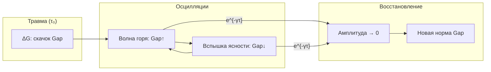

# Немарковская динамика

:::info Мост из предыдущей главы
В [предыдущей главе](./bifurcation) мы изучили **бифуркации** Gap-ландшафта — качественные перестройки, при которых устойчивые состояния исчезают, рождаются колебания, возникает гистерезис. Но бифуркационный анализ предполагал, что будущее системы определяется только её настоящим. А что если **прошлое** не отпускает? Что если травма десятилетней давности продолжает формировать динамику сегодня? Именно об этом — данная глава.
:::

### Дорожная карта главы

В этой главе мы:

1. **Разберём разницу между марковской и немарковской динамикой** — и поймём, почему сознание принципиально не может быть «без памяти» (введение, раздел «Два взгляда на время»)
2. **Введём ядро памяти $K(\tau)$** — математический объект, описывающий, как прошлое влияет на настоящее, и классифицируем его формы: экспоненциальное [Т], осцилляторное [Г], степенное [Г] (раздел 1)
3. **Покажем, как немарковость порождает осцилляции Gap** — затухающие волны, отличные от незатухающих Хопф-осцилляций, и введём меру немарковости BLP (раздел 2)
4. **Формализуем «циклы горя»** — как математическую модель горевания, включая посттравматический рост и осложнённое горевание (раздел 3)
5. **Определим терапевтические окна** — временные интервалы повышенной пластичности, создаваемые немарковскими осцилляциями (раздел 4)
6. **Свяжем формализм с нейронаукой** — реконсолидация памяти, тета-ритм, EMDR, фармакология (разделы 5–6)
7. **Обсудим философское значение**: немарковость как условие личной идентичности (раздел 7)

> *Мы — не то, что мы есть сейчас. Мы — то, чем мы были, и то, чем мы ещё можем стать. Прошлое не уходит: оно вплетено в ткань настоящего.*

:::note О нотации
В этом документе:
- $\Gamma$ — [матрица когерентности](/docs/core/dynamics/coherence-matrix)
- $\gamma_{ij}$ — элементы $\Gamma$ (когерентности)
- $\mathrm{Gap}(i,j) = |\sin(\arg(\gamma_{ij}))|$ — [мера зазора](/docs/physics/dual-aspect/gap-semantics)
- $\Gamma_2$ — скорость декогеренции (диссипативная константа)
- $\kappa$ — скорость регенерации
- $\omega_c$ — частота обрезания ядра памяти (обратная длительность памяти: $\tau_{\text{mem}} = 1/\omega_c$)
- $\Delta\omega_{ij} = \omega_i - \omega_j$ — расстройка частот между измерениями $i$ и $j$
- $\mathcal{R}_{ij}$ — [регенеративный член](/docs/core/dynamics/evolution#3-регенеративный-член) для пары $(i,j)$
:::

:::warning Статус документа
Математические результаты о немарковской динамике Gap доказаны в [Gap-динамике](/docs/core/dynamics/gap-dynamics#немарковские-эффекты) **[Т]**. Кибернетическая и клиническая интерпретация имеет статус **[И]**. Предсказания о связи с терапевтическими данными — **[Г]**.
:::

---

## Почему прошлое не отпускает: немарковская природа сознания {#введение-память}

Закройте глаза и вспомните первый день, когда вы почувствовали себя по-настоящему живым. Может быть, это был запах моря в детстве, или прикосновение руки близкого человека, или момент, когда вы вдруг поняли что-то о мире, что изменило всё. Это воспоминание — не просто запись в архиве. Оно *формирует вас прямо сейчас*: ваше тело откликается на него микронапряжениями, ваше дыхание чуть меняется, эмоциональный фон сдвигается. Прошлое не лежит где-то на полке. Оно живёт в вас, модулируя каждый момент настоящего.

Эта глава — о том, как математика описывает этот фундаментальный факт.

Большинство физических моделей работают в **марковском** приближении: будущее зависит только от настоящего. Бросьте кубик — результат не зависит от предыдущих бросков. Молекула газа сталкивается с другой молекулой — её будущая траектория определяется только текущей скоростью и положением, а не тем, откуда она прилетела минуту назад. Это прекрасная абстракция, но она *принципиально не подходит* для описания сознания.

Сознание — не кубик и не молекула газа. Сознание — это система, в которой:

- **Утрата** близкого человека может отзываться волнами горя через годы после события
- **Травма** не «стирается» после того, как опасность миновала — она перестраивает весь аппарат восприятия
- **Обучение** меняет не только то, что мы знаем, но и то, *как мы способны узнавать*
- **Любовь** трансформирует не отдельную эмоцию, а всю архитектуру переживания

Всё это — проявления **немарковской динамики**: процесса, в котором история системы неотделима от её текущего состояния. Когерентная кибернетика (КК) предоставляет точный формализм для описания этих явлений — не метафорически, а через строгие математические структуры.

---

## Марковость и немарковость: два взгляда на время {#два-взгляда-на-время}

Чтобы понять, чем немарковская динамика отличается от марковской, представьте два типа озёр.

**Марковское озеро.** Бросьте камень — по воде пойдут круги. Но вода «не помнит» камень: через минуту поверхность гладкая, и следующий камень создаст ровно такие же круги, независимо от истории предыдущих бросков. Каждый момент — чистый лист. Формально: будущее состояние $\rho(t + dt)$ зависит только от текущего состояния $\rho(t)$, и ни от чего больше.

**Немарковское озеро.** Теперь представьте озеро с вязким дном. Камень, упавший вчера, создал воронку в иле. Сегодняшний камень падает в изменённый ландшафт дна — и круги идут по-другому. Более того: вчерашняя воронка постепенно заполняется, и дно «возвращает» часть поглощённой энергии — на поверхности появляются запоздалые возмущения, эхо прошлого камня. Формально: $\rho(t + dt)$ зависит от всей истории $\{\rho(s) : 0 \leq s \leq t\}$.

В контексте матрицы когерентности $\Gamma$ это различие критически важно:

| Свойство | Марковская динамика | Немарковская динамика |
|----------|--------------------|-----------------------|
| Зависимость | Только от $\Gamma(\tau)$ | От всей истории $\{\Gamma(s)\}_{s \leq \tau}$ |
| Декогеренция | Мгновенная, монотонная | С задержкой, может осциллировать |
| Поток информации | Только «из системы в среду» | Двусторонний: среда возвращает когерентность |
| Математика | ОДУ: $d\gamma/d\tau = f(\gamma)$ | Интегро-дифференциальное уравнение со свёрткой |
| Аналогия | Амнезия: каждое мгновение — заново | Живая память: прошлое вплетено в настоящее |

Именно немарковская динамика делает возможным то, что мы интуитивно ощущаем: прошлое *присутствует* в настоящем. Не как воспоминание-картинка, а как структурное влияние на текущую эволюцию когерентностей.

---

## 1. Ядро памяти $K(\tau)$ {#ядро-памяти}

### Ядро памяти: как формализовать влияние прошлого {#формализация-ядра}

Центральный объект немарковской теории — **ядро памяти** $K(\tau)$. Это функция, которая описывает, *насколько сильно* прошлое влияет на настоящее, и *как быстро* это влияние затухает.

Интуиция проста. Если вы обожгли руку пять секунд назад, боль ещё очень сильна — ядро памяти велико. Если это было вчера — остался только след, и ядро мало. Если это было в детстве, но ожог был тяжёлым, — ядро памяти может быть ничтожным по амплитуде, но не нулевым: рука до сих пор дёргается от огня.

Математически ядро памяти — это весовая функция во временной свёртке: оно определяет, как каждый прошлый момент вносит вклад в текущую скорость изменения когерентности.

### 1.1 Обобщённое уравнение движения

В марковском приближении декогеренция описывается дельта-функцией: $K(\tau) = -\Gamma_2 \delta(\tau)$, что даёт стандартное экспоненциальное затухание. При конечном времени памяти ядро $K(\tau) \neq \delta(\tau)$, и уравнение движения для когерентности $\gamma_{ij}$ принимает интегро-дифференциальную форму:

:::tip Определение (Немарковская динамика когерентностей) [Т]
$$
\frac{d\gamma_{ij}}{d\tau} = -i\Delta\omega_{ij}\,\gamma_{ij}(\tau) + \int_0^\tau K_{ij}(\tau - s)\, \gamma_{ij}(s)\, ds + \mathcal{R}_{ij}
$$

где:
- Первый член: унитарное вращение (свободная прецессия фазы)
- Второй член: **немарковская диссипация** с ядром памяти $K_{ij}(\tau)$
- Третий член: регенерация ($\propto \kappa \cdot \mathrm{Coh}_E$)

**Источник:** [Gap-динамика, раздел 4.1](/docs/core/dynamics/gap-dynamics#немарковские-эффекты).
:::

Свёрточная структура второго члена означает, что диссипация в момент $\tau$ определяется **интегралом по всей предшествующей истории** когерентности, взвешенной ядром $K_{ij}(\tau - s)$.

Обратите внимание на глубину этой формулы. Интеграл $\int_0^\tau K(\tau - s)\, \gamma(s)\, ds$ — это не просто техническое усложнение. Это утверждение о природе реальности: *текущая скорость изменения состояния определяется суперпозицией всех прошлых состояний*, каждое из которых «взвешено» тем, насколько давно оно было. Именно так работает живая память: недавнее — ярко, давнее — бледно, но не исчезает полностью.

### 1.2 Экспоненциальное ядро [Т] (T-94) {#экспоненциальное-ядро}

Простейшее немарковское ядро — экспоненциальное затухание памяти. Экспоненциальная форма **доказана** из компактности пространства состояний ([T-94](/docs/core/dynamics/gap-dynamics#теорема-ядро-экспоненциальное) [Т]):

$$
K(\tau) = -\Gamma_2\,\omega_c \cdot e^{-\omega_c\,\tau}
$$

**Параметры:**
- $\Gamma_2$ — интегральная сила декогеренции
- $\omega_c = 1/\tau_{\text{mem}}$ — частота обрезания (обратное время памяти)
- $\tau_{\text{mem}}$ — характерное время памяти системы

**Предельные режимы:**
- $\omega_c \to \infty$ (мгновенная память): $K(\tau) \to -\Gamma_2\,\delta(\tau)$ — марковский предел
- $\omega_c \to 0$ (бесконечная память): $K(\tau) \to 0$ — диссипация исчезает (замороженная система)

Эти предельные режимы замечательны. На одном полюсе — полная амнезия: среда мгновенно «забывает» всё, что поглотила, и когерентность теряется безвозвратно. На другом — абсолютная память: среда помнит всё бесконечно долго и ничего не диссипирует, но при этом система *замерзает*, потому что ядро стремится к нулю. Живые системы существуют между этими крайностями — в зоне, где память конечна, но реальна.

**Спектральная плотность.** Фурье-образ экспоненциального ядра даёт **лоренциан**:

$$
\widetilde{K}(\omega) = \int_0^\infty K(\tau)\,e^{i\omega\tau}\,d\tau = \frac{-\Gamma_2\,\omega_c}{\omega_c - i\omega}
$$

Спектр мощности $|\widetilde{K}(\omega)|^2 \propto 1/(\omega_c^2 + \omega^2)$ — лоренцева форма с шириной $\omega_c$.

Лоренцев спектр означает, что память не имеет «привилегированной частоты» — она действует как широкополосный фильтр, ослабляя все компоненты выше частоты обрезания $\omega_c$. В терминах жизненного опыта: события, происходящие быстрее, чем характерное время памяти $\tau_{\text{mem}}$, «проходят мимо» и не оставляют следа. Только то, что длится достаточно долго, записывается в память системы.

### 1.3 Осцилляторное ядро [Г] {#осцилляторное-ядро}

Более реалистичное ядро включает осцилляторную компоненту [Г] (не доказано из аксиом, но совместимо с экспоненциальной формой T-94):

$$
K(\tau) = -\Gamma_2\,\omega_c \cdot e^{-\omega_c\,\tau} \cdot \cos(\omega_{\text{mem}}\,\tau)
$$

Здесь $\omega_{\text{mem}}$ — частота осцилляций памяти. Это соответствует среде с выделенной частотой (резонатор, осцилляторная ванна).

Осцилляторное ядро особенно интересно для моделирования **цикличных** процессов в сознании. Когда среда (нейронная сеть, социальное окружение, телесные ритмы) обладает собственной характерной частотой, память приобретает ритмическую структуру. Это математическое отражение того, что знает каждый: горе возвращается волнами, творческие озарения приходят циклами, сезонные ритмы модулируют настроение.

**Спектральная плотность** — сумма двух смещённых лоренцианов:

$$
|\widetilde{K}(\omega)|^2 \propto \frac{1}{\omega_c^2 + (\omega - \omega_{\text{mem}})^2} + \frac{1}{\omega_c^2 + (\omega + \omega_{\text{mem}})^2}
$$

Пики при $\omega = \pm\omega_{\text{mem}}$ — среда преимущественно «помнит» осцилляции на частоте $\omega_{\text{mem}}$.

### 1.4 Сводная таблица ядер

| Ядро | $K(\tau)$ | Спектр | Поведение Gap | Статус |
|------|-----------|--------|---------------|--------|
| Марковское | $-\Gamma_2\,\delta(\tau)$ | Белый шум | Монотонная релаксация | [Т] (предел T-94) |
| Экспоненциальное | $-\Gamma_2\omega_c\,e^{-\omega_c\tau}$ | Лоренциан | Затухающие осцилляции | **[Т]** (T-94) |
| Осцилляторное | $-\Gamma_2\omega_c\,e^{-\omega_c\tau}\cos(\omega_{\text{mem}}\tau)$ | Двойной лоренциан | Резонансные осцилляции | **[Г]** |
| Степенное | $-\Gamma_2\,(\tau/\tau_0)^{-\alpha}$ | $1/f^{1-\alpha}$ | Степенная релаксация | **[Г]** |

:::info Связь с Gap-пространством
Структура 7-мерного Gap-пространства определяется изоморфизмом $\mathrm{PG}(2,2) \cong H(7,4)$ ([T-93](/docs/core/dynamics/gap-dynamics#теорема-h74-формальная) [Т]). Код Хэмминга H(7,4) задаёт расстояния между Gap-конфигурациями и, следовательно, корреляции ядра $K_{ij}(\tau)$ между различными парами измерений.
:::

### 1.5 Физиология ядра памяти {#физиология-ядра}

Ядро памяти $K(\tau)$ — не абстракция. Оно имеет прямые нейрофизиологические корреляты:

**Кратковременная память** ($\tau_{\text{mem}} \sim$ секунды). На уровне нейронных сетей: устойчивые паттерны активности в префронтальной коре. Ядро: экспоненциальное, $\omega_c \sim 0{,}1\text{–}1$ Гц.

**Рабочая память** ($\tau_{\text{mem}} \sim$ минуты). Гиппокампальные осцилляции тета-ритма (4–8 Гц) модулируют удержание информации. Ядро: *осцилляторное*, с $\omega_{\text{mem}}$ в тета-диапазоне.

**Долговременная память** ($\tau_{\text{mem}} \sim$ годы). Консолидация через синаптическую пластичность и нейрогенез. Ядро: *степенное* ($\alpha \approx 0{,}5\text{–}1$), что согласуется с классическим законом забывания Эббингауза $R(t) \propto t^{-\alpha}$.

**Травматическая память** — особый случай. Ядро с аномально малым $\omega_c$ (медленное затухание) и возможной осцилляторной компонентой. Это формализует клиническое наблюдение: травматические воспоминания «не выцветают» как обычные — они сохраняют эмоциональную интенсивность значительно дольше, чем предсказывает стандартная экспоненциальная модель забывания.

---

## 2. Осцилляторная когеренция {#осцилляторная-когеренция}

### 2.1 Немарковские осцилляции Gap

:::tip Теорема (Немарковские осцилляции Gap) [Т]
При экспоненциальном ядре памяти $K(\tau) = -\Gamma_2\omega_c \cdot e^{-\omega_c\tau}$:

**(a)** Марковский предел ($\omega_c \to \infty$): стандартная экспоненциальная декогеренция

$$
\gamma_{ij}(\tau) \propto e^{-\Gamma_2\tau}
$$

**(b)** Немарковский режим ($\omega_c$ конечная): Gap **осциллирует**

$$
\mathrm{Gap}(i,j;\,\tau) = \mathrm{Gap}^{(\infty)} + C \cdot e^{-\gamma\tau}\cos(\omega_r\tau)
$$

где $\omega_r = \sqrt{\omega_c\Gamma_2 - \gamma^2}$ — частота затухающих осцилляций, $\gamma$ — скорость затухания.

**(c)** При $\omega_c < \Gamma_2/4$: **передемпфированный** режим — осцилляции отсутствуют, чисто экспоненциальная (но замедленная) релаксация к стационарному состоянию.

**Доказательство:** См. [Gap-динамика, Теорема 5.1](/docs/core/dynamics/gap-dynamics#немарковские-эффекты).
:::

**Физический механизм.** Немарковские осцилляции возникают из-за **обратного потока информации** из окружения в систему. В марковском режиме информация, потерянная в среду, не возвращается. В немарковском — среда «запоминает» когерентность и возвращает её обратно с задержкой $\sim \tau_{\text{mem}}$.

Это один из самых поразительных результатов теории. Обычно мы думаем о декогеренции как об однонаправленном процессе: порядок → хаос, когерентность → шум, ясность → замутнение. Но немарковская динамика говорит: **среда может возвращать то, что она забрала**. Когерентность, «растворившаяся» в окружении, через время $\tau_{\text{mem}}$ возвращается обратно — ослабленная, но реальная. В терминах человеческого опыта: ясность, утраченная в кризисе, может возвращаться — не потому что мы «работаем над собой», а потому что *такова динамика системы*. Среда — тело, социальное окружение, нейронная сеть — несёт отпечаток утраченной когерентности и возвращает её волнами.

### 2.2 Три режима Gap-релаксации

| Режим | Условие | Динамика Gap | Характерная шкала |
|-------|---------|-------------|-------------------|
| Марковский | $\omega_c \gg \Gamma_2$ | $e^{-\Gamma_2\tau}$ (монотонно) | $\tau_{\text{relax}} = 1/\Gamma_2$ |
| Осциллирующий | $\omega_c \sim \Gamma_2$ | $e^{-\gamma\tau}\cos(\omega_r\tau)$ | $\tau_{\text{relax}} = 1/\gamma$, $T_{\text{osc}} = 2\pi/\omega_r$ |
| Передемпфированный | $\omega_c < \Gamma_2/4$ | $e^{-\gamma_{\pm}\tau}$ (двойная экспонента) | $\tau_{\text{relax}} = 1/\gamma_-$ (медленная) |

**Критерий осцилляций:**

$$
\omega_c\Gamma_2 > \gamma^2 \quad \Longleftrightarrow \quad \tau_{\text{mem}} < \frac{4}{\Gamma_2}
$$

Осцилляции Gap возникают, когда время памяти среды **достаточно короткое** (но не нулевое). Парадоксально: слишком длинная память ($\tau_{\text{mem}} \gg 4/\Gamma_2$) **подавляет** осцилляции.

Этот парадокс заслуживает отдельного обсуждения. Казалось бы, чем длиннее память — тем больше «материала» для возврата, тем выраженнее должны быть осцилляции. Но математика говорит обратное: при очень длинной памяти ($\omega_c \to 0$) система переходит в передемпфированный режим, где осцилляций нет. Причина: когда среда помнит *слишком много*, возвращающийся поток информации размазывается по длинному временному интервалу и становится настолько слабым в каждый момент, что не может преодолеть текущую диссипацию. Это напоминает клиническое наблюдение: пациент, «застрявший» в хроническом горевании, не проходит через осцилляторные фазы — он находится в состоянии постоянного, но притуплённого страдания.

### 2.3 Мера немарковости BLP {#мера-blp}

:::info Определение (Мера немарковости Breuer-Laine-Piilo) [Т]
$$
\mathcal{N} := \int_{\sigma > 0} \sigma(t,\, \rho_1,\, \rho_2)\, dt
$$

где $\sigma(t, \rho_1, \rho_2) = \frac{d}{dt}\|\rho_1(t) - \rho_2(t)\|_1$ — скорость изменения различимости пары состояний.

В марковской динамике $\sigma \leq 0$ всегда (различимость только убывает). В немарковской $\sigma > 0$ на некоторых интервалах — **обратный поток информации**.
:::

**Связь с Gap-осцилляциями.** Каждый полупериод осцилляции Gap, в котором $\mathrm{Gap}$ уменьшается (когерентность возвращается из среды), соответствует $\sigma > 0$ — ненулевой вклад в меру немарковости $\mathcal{N}$.

$$
\mathcal{N} \propto \sum_{k=1}^{N_{\text{osc}}} |\Delta\mathrm{Gap}_k| \cdot e^{-\gamma\,\tau_k}
$$

где суммирование идёт по всем полупериодам с убывающим Gap, $|\Delta\mathrm{Gap}_k|$ — амплитуда $k$-й осцилляции.

### 2.4 Измерение немарковости: количественный подход {#количественный-подход}

Мера BLP — не единственный способ квантифицировать немарковость. В квантовой информатике разработан ряд альтернативных мер, каждая из которых выявляет свой аспект обратного потока информации:

**Мера RHP** (Rivas, Huelga, Plenio). Основана на нарушении свойства **делимости** динамической карты. Марковский процесс делим: $\Lambda(t+s, 0) = \Lambda(t+s, s) \cdot \Lambda(s, 0)$, и промежуточная карта $\Lambda(t+s, s)$ полностью положительна. Немарковость проявляется как потеря полной положительности промежуточной карты.

**Взаимная информация.** Немарковость можно измерить через рост взаимной информации $I(S:E)$ между системой и средой. В марковской динамике $I(S:E)$ монотонно растёт (информация утекает в среду). Немарковский обратный поток даёт временное *уменьшение* $I(S:E)$.

**Связь мер.** Для экспоненциального ядра T-94 все меры немарковости **согласованы**: если одна ненулевая, все ненулевые, и все обращаются в нуль одновременно в марковском пределе $\omega_c \to \infty$.

Для когерентной кибернетики наиболее практична мера BLP, поскольку она непосредственно связана с наблюдаемыми осцилляциями Gap.

### 2.5 Связь с бифуркацией Хопфа

Немарковские осцилляции Gap следует отличать от осцилляций, порождённых [бифуркацией Хопфа](./bifurcation#hopf):

| Свойство | Немарковские осцилляции | Hopf-осцилляции |
|----------|------------------------|-----------------|
| Причина | Память среды | Потеря устойчивости |
| Затухание | Всегда затухают ($\gamma > 0$) | Незатухающий предельный цикл |
| Амплитуда | Убывает экспоненциально | Постоянная $A(\mu)$ |
| Управление | Через $\omega_c$ (ядро памяти) | Через $\mu$ (управляющий параметр) |
| Исчезновение | При $\omega_c \to \infty$ или $\omega_c < \Gamma_2/4$ | При $\mu < \mu_H$ |

В реальных системах оба механизма могут действовать одновременно: немарковские осцилляции **модулируют** амплитуду Hopf-предельного цикла.

Это различие имеет глубокий клинический смысл. Немарковские осцилляции — это *ответ здоровой системы на потрясение*: они затухают, и система постепенно приходит к новому равновесию. Hopf-осцилляции — это *структурное изменение динамики*: система теряет устойчивость и переходит к незатухающему циклическому режиму. Первое — нормальное горевание. Второе — хроническое расстройство, при котором циклы боли и облегчения не затухают, а самоподдерживаются.

---

## 3. «Циклы горя» — формализация через немарковскую память {#циклы-горя}

:::info Статус [И]
Формализация «циклов горя» через немарковскую Gap-динамику — **интерпретация**. Математический аппарат (Теорема 5.1 [Т]) строг; отождествление с клиническими феноменами требует эмпирической валидации.
:::

### Циклы горя и посттравматический рост {#горе-и-рост}

Горевание — один из самых глубоких и универсальных человеческих опытов. Каждая культура знает его фазы: оцепенение, волны острой боли, медленное принятие. Элизабет Кюблер-Росс описала «пять стадий горя» — отрицание, гнев, торговля, депрессия, принятие. Но клинические наблюдения показывают, что горевание — это не линейная последовательность стадий. Это **осцилляторный процесс**: волны горя чередуются с моментами ясности, и амплитуда этих волн постепенно уменьшается.

Немарковская динамика Gap даёт точную математическую модель этого процесса. И не только модель — она делает количественные предсказания о длительности горевания, частоте осцилляций и условиях, при которых горевание переходит в хроническую форму.

### 3.1 Травма как скачок стационарного значения

**Модель.** Травматическое событие в момент $\tau_0$ вызывает мгновенное изменение стационарного Gap-профиля:

$$
\mathrm{Gap}^{(\infty)}(S,E) : \quad G_0 \xrightarrow{\tau = \tau_0} G_0 + \Delta G
$$

где $\Delta G > 0$ — величина скачка (увеличение непрозрачности между телом и переживанием для канала $S \leftrightarrow E$, или между другими парами измерений).

Что означает этот скачок в терминах опыта? $\mathrm{Gap}(S,E)$ — мера непрозрачности между Sensation и Emotion, между телесностью и переживанием. Скачок $\Delta G$ — это внезапная потеря связи: тело перестаёт «слышать» эмоции, или эмоции перестают «дотягиваться» до тела. Клинически это проявляется как онемение, деперсонализация, «ватное» ощущение — хорошо известные реакции на острую травму.

**Динамика после скачка.** Система стремится к новому стационарному значению, но делает это **осциллирующим** образом:

$$
\mathrm{Gap}(S,E;\,\tau) = (G_0 + \Delta G) + C \cdot e^{-\gamma(\tau - \tau_0)} \cos\bigl(\omega_r(\tau - \tau_0)\bigr)
$$

### 3.2 Фазы горевания как фазы осцилляции

| Фаза осцилляции | Динамика Gap | Клиническое проявление |
|----------------|-------------|----------------------|
| $\cos(\omega_r\tau) > 0$ | Gap убывает | «Вспышка ясности» — кратковременное возвращение когерентности |
| $\cos(\omega_r\tau) < 0$ | Gap возрастает | «Волна горя» — усиление непрозрачности |
| $e^{-\gamma\tau} \to 0$ | Амплитуда $\to 0$ | Постепенное принятие — установление нового стационарного значения |
| $\tau \to \infty$ | $\mathrm{Gap} \to G_0 + \Delta G$ | Новая норма (может быть выше или ниже прежней) |

Заметим, что «новая норма» $G_0 + \Delta G$ может быть как *выше*, так и *ниже* исходного значения $G_0$. Случай $\Delta G < 0$ (Gap *уменьшается* после потрясения) — это феномен **посттравматического роста**: травма, будучи пережита, парадоксальным образом *увеличивает* связность измерений. Когерентная кибернетика предсказывает, что это возможно, когда регенеративный член $\mathcal{R}_{ij}$ достаточно силён для того, чтобы «пересобрать» когерентность на более высоком уровне. Условие:

$$
\kappa \cdot \mathrm{Coh}_E > \Gamma_2 \cdot (G_0 + |\Delta G|) \quad \Longrightarrow \quad \text{посттравматический рост возможен}
$$

Это математическое отражение клинического наблюдения: рост после травмы возможен, когда ресурсы регенерации (внутренние и внешние) превышают силу декогеренции.

### 3.3 «Вспышки ясности» — конструктивная интерференция

:::info Интерпретация (Вспышки ясности) [И]
«Вспышки ясности» при горевании (моменты, когда человек внезапно «видит ясно» посреди кризиса) формализуются как **конструктивная интерференция** возвращающейся когерентности.

В немарковской динамике когерентность, «поглощённая» средой, возвращается через время $\sim \tau_{\text{mem}}$. Если несколько каналов синхронизируются ($\omega_r^{(ij)} \approx \omega_r^{(kl)}$), возникает усиленный эффект: одновременное кратковременное снижение Gap по нескольким парам измерений.
:::

Каждый, кто проходил через горе, знает эти мгновения. Посреди тумана и боли вдруг наступает кристальная ясность: мир на мгновение становится таким чётким и наполненным, каким он, может быть, не был даже до потери. Это не иллюзия и не защитный механизм. В терминах немарковской динамики — это реальный физический процесс: среда, поглотившая когерентность в момент травмы, синхронно возвращает её по нескольким каналам одновременно.

**Условие синхронизации вспышек:**

$$
\left|\omega_r^{(ij)} - \omega_r^{(kl)}\right| < \gamma_{\min}
$$

где $\gamma_{\min}$ — минимальная скорость затухания. Когда разность частот осцилляций для разных каналов мала по сравнению со скоростью затухания, «вспышки ясности» по этим каналам совпадают.

**Многоканальная интерференция.** В 7-мерной системе с $\binom{7}{2} = 21$ парой когерентностей «вспышки ясности» могут быть чрезвычайно сложными. Полная «вспышка» (одновременное снижение Gap по многим каналам) возникает при выполнении условия синхронизации для кластера каналов. Структура этих кластеров определяется кодом Хэмминга $H(7,4)$, что даёт нетривиальные предсказания о корреляциях между различными аспектами «ясности».

### 3.4 Длительность горевания

**Время восстановления** определяется параметрами немарковского ядра:

$$
\tau_{\text{recovery}} \approx \frac{3}{\gamma} = \frac{3}{\text{Re}\left(\frac{\omega_c + \Gamma_2}{2} - \sqrt{\left(\frac{\omega_c - \Gamma_2}{2}\right)^2 - \omega_c\Gamma_2}\right)}
$$

(время, за которое амплитуда осцилляций снижается до $\sim 5\%$).

**Зависимость от $\tau_{\text{mem}} = 1/\omega_c$:**

| $\tau_{\text{mem}}$ | $\tau_{\text{recovery}}$ | Клиническая интерпретация |
|---------------------|--------------------------|--------------------------|
| Короткая ($\ll 1/\Gamma_2$) | $\sim 3/\Gamma_2$ | Быстрое восстановление (марковский режим) |
| Средняя ($\sim 1/\Gamma_2$) | $\sim 6/\Gamma_2$ | Осцилляторное горевание (немарковский режим) |
| Длинная ($\gg 1/\Gamma_2$) | $\gg 1/\Gamma_2$ | Затяжное горевание (передемпфированный режим) |

:::warning Терапевтическое следствие [И]
Из немарковской ФДТ ([Фазовая диаграмма, раздел 6.1](/docs/core/dynamics/gap-phase-diagram#немарковские-осцилляции)):

$$
\chi_{ij}(\omega) \propto \frac{1 + \omega^2\tau_M^2}{T_{\text{eff}}\,\Gamma_2^2\,\tau_M}
$$

При $\omega\tau_M \gg 1$: $\chi \propto \omega^2$ — **антирезонанс**. Система с длинной памятью сильнее реагирует на высокочастотные возмущения. Это объясняет бо&#769;льшую эффективность частых коротких терапевтических сессий по сравнению с редкими длительными.
:::

### 3.5 Диаграмма динамики горевания

```mermaid
graph LR
    subgraph TRAUMA["Травма (τ₀)"]
        T["ΔG: скачок Gap"]
    end
    subgraph OSC["Осцилляции"]
        W["Волна горя: Gap↑"]
        C["Вспышка ясности: Gap↓"]
    end
    subgraph REC["Восстановление"]
        A["Амплитуда → 0"]
        N["Новая норма Gap"]
    end

    T --> W
    W --> C
    C --> W
    W --> |"e^{-γτ}"| A
    C --> |"e^{-γτ}"| A
    A --> N
```

### 3.6 Осложнённое горевание: переход в хронический режим {#осложнённое-горевание}

Не всякое горевание проходит через осцилляторную фазу к принятию. Клиницисты выделяют **осложнённое горевание** (prolonged grief disorder) — состояние, при котором процесс «застревает». Немарковская динамика предлагает две модели этого перехода:

**Модель 1: Передемпфирование.** Если время памяти $\tau_{\text{mem}}$ аномально велико ($\tau_{\text{mem}} \gg 4/\Gamma_2$), система переходит в передемпфированный режим. Осцилляции отсутствуют — нет ни «волн горя», ни «вспышек ясности». Вместо этого — длительное, монотонное, но очень медленное приближение к стационарному состоянию. Это соответствует клинической картине «замороженного горя»: человек не плачет, не злится, не проходит через фазы — он просто «не может выйти из этого».

**Модель 2: Hopf-бифуркация.** Если травма достаточно сильна для того, чтобы параметры системы пересекли порог бифуркации Хопфа ($\mu > \mu_H$), затухающие осцилляции *переходят в самоподдерживающийся предельный цикл*. Это хроническое горевание с незатухающими волнами боли и облегчения. Формально:

$$
\mathrm{Gap}(S,E;\,\tau) \to \mathrm{Gap}^{(\infty)} + A(\mu) \cdot \cos(\omega_H\tau + \phi_0) \quad (\tau \to \infty)
$$

Амплитуда $A(\mu) > 0$ — волны горя не затухают. Это качественно отличная динамика, и она требует качественно иных терапевтических вмешательств: не ожидания естественного затухания, а *изменения управляющего параметра* $\mu$ для подавления бифуркации.

---

## 4. Вспышки ясности: немарковские окна и терапия {#терапевтические-окна}

### 4.1 Анатомия терапевтического окна

Немарковские осцилляции создают **временные окна повышенной пластичности** — моменты, когда интервенция особенно эффективна. Эти окна имеют точные характеристики:

**Время открытия.** Окно открывается, когда $\cos(\omega_r\tau) > 0$ и амплитуда осцилляции ещё достаточно велика: $C \cdot e^{-\gamma\tau} > \varepsilon_{\text{th}}$ (порог чувствительности). Это даёт конечное число окон:

$$
N_{\text{windows}} \approx \frac{1}{\pi} \cdot \frac{\omega_r}{\gamma} \cdot \ln\frac{C}{\varepsilon_{\text{th}}}
$$

**Длительность окна.** Каждое окно длится примерно полупериод осцилляции:

$$
\Delta\tau_{\text{window}} \approx \frac{\pi}{\omega_r}
$$

**Глубина окна** (насколько сильно уменьшается Gap) убывает экспоненциально с номером:

$$
\delta G_k = C \cdot e^{-\gamma \cdot k\pi/\omega_r}, \quad k = 1, 2, 3, \ldots
$$

Первое окно — самое широкое и самое глубокое. Каждое следующее — слабее.

### 4.2 Стратегия терапевтического вмешательства [И]

Из структуры немарковских окон вытекает ясная терапевтическая стратегия:

1. **Первое окно** (первые дни–недели после травмы): максимальная восприимчивость. Интервенция здесь наиболее эффективна — но и наиболее рискованна, поскольку амплитуда осцилляций максимальна.

2. **Мониторинг фазы**: отслеживание субъективных отчётов с достаточной частотой (не реже $2\omega_r / (2\pi)$, согласно теореме Найквиста) позволяет определить, находится ли пациент в фазе «вспышки ясности» ($\cos > 0$) или «волны горя» ($\cos < 0$).

3. **Синхронизация сессий**: терапевтическая сессия во время «вспышки ясности» (Gap убывает) значительно эффективнее, чем во время «волны горя» (Gap возрастает). Формально: восприимчивость $\chi$ в фазе $\cos > 0$ в $(1 + \omega^2\tau_M^2)$ раз выше.

4. **Резонансная частота**: оптимальная частота сессий $\sim \omega_r / \pi$ обеспечивает *резонанс* с возвращающейся когерентностью. Слишком редкие сессии пропускают окна; слишком частые — не успевают «воспользоваться» накопленной возвращённой когерентностью.

---

## 5. Связь с Gap-диагностикой {#связь-с-диагностикой}

### 5.1 Немарковские сигнатуры в клинических данных

:::warning Гипотеза (Немарковские сигнатуры) [Г]
Немарковская динамика Gap порождает наблюдаемые сигнатуры, которые можно обнаружить в клинических данных:

**(a)** Частота осцилляций Gap: $f_{\text{osc}} = \omega_r / (2\pi)$ — может быть измерена через временной ряд самоотчётов или физиологических маркеров.

**(b)** Скорость затухания $\gamma$ — определяет огибающую амплитуды осцилляций.

**(c)** Мера немарковости $\mathcal{N}$ — коррелирует с «глубиной памяти» о травматическом событии.
:::

**Протокол обнаружения немарковских сигнатур:**

1. Собрать временной ряд субъективных отчётов по шкале Gap($S$,$E$) (или другому каналу) с частотой $\geq 2$ раза в неделю
2. Вычислить автокорреляционную функцию $C(\Delta\tau)$
3. Если $C(\Delta\tau)$ меняет знак — признак осцилляций (немарковский режим)
4. Подогнать модель $C(\Delta\tau) = C_0\,e^{-\gamma\Delta\tau}\cos(\omega_r\Delta\tau)$
5. Извлечь параметры: $\tau_{\text{mem}} \approx 2\pi / \omega_r$, $\tau_{\text{recovery}} \approx 3/\gamma$

### 5.2 Предсказания для терапии

:::warning Гипотеза (Измеримые предсказания) [Г]
**(a)** Частота осцилляций Gap пропорциональна обратному времени памяти:

$$
f_{\text{osc}} \sim \frac{1}{\tau_{\text{mem}}}
$$

Пациенты с «глубокой памятью» ($\tau_{\text{mem}}$ велико) демонстрируют **медленные** осцилляции Gap (длинные циклы горя). Пациенты с «короткой памятью» — **быстрые** осцилляции и более быстрое восстановление.

**(b)** Мера немарковости $\mathcal{N}$ положительно коррелирует с субъективной глубиной переживания травмы.

**(c)** Оптимальная частота терапевтических сессий $\sim \omega_r / \pi$ — резонанс с возвращающейся когерентностью.
:::

### 5.3 Связь с Gap-картой прозрачности

Немарковская динамика модифицирует [карту прозрачности](/docs/applied/research/gap-diagnostics#карта-прозрачности): стационарные значения Gap зависят от параметров ядра памяти.

| Параметр ядра | Влияние на Gap-карту | Диагностическое значение |
|---------------|---------------------|-------------------------|
| $\tau_{\text{mem}}$ (время памяти) | Период осцилляций Gap | Длительность «циклов горя» |
| $\Gamma_2$ (сила декогеренции) | Стационарное $\mathrm{Gap}^{(\infty)}$ | Глубина непрозрачности |
| $\omega_{\text{mem}}$ (частота памяти) | Резонансные пики | Выделенные каналы с усиленными осцилляциями |
| $\mathcal{N}$ (мера немарковости) | Наличие осцилляций | Немарковская vs марковская динамика |

### 5.4 Немарковская коррекция диагностических паттернов

Стандартные [диагностические паттерны](/docs/applied/research/gap-diagnostics#паттерны) (алекситимия, невроз расщепления и др.) приобретают временну&#769;ю структуру при немарковском рассмотрении:

| Паттерн | Марковская динамика | Немарковская динамика |
|---------|--------------------|-----------------------|
| Алекситимия ($S \leftrightarrow E$) | $\mathrm{Gap}(S,E) \to 1$ монотонно | Осцилляции с «вспышками» телесного осознавания |
| Невроз расщепления ($L \leftrightarrow E$) | $\mathrm{Gap}(L,E) \to 1$ монотонно | Периодические моменты «настоящего понимания» |
| Импульсивность ($D \leftrightarrow L$) | $\mathrm{Gap}(D,L) \to 1$ монотонно | Чередование импульсивности и контроля |

:::info Терапевтическое значение [И]
Немарковские «вспышки» — это **терапевтические окна**, в которых интервенция наиболее эффективна. Если терапевт может идентифицировать фазу осцилляции (через мониторинг субъективных отчётов), интервенция во время $\cos(\omega_r\tau) > 0$ (Gap убывает) значительно эффективнее, чем во время $\cos(\omega_r\tau) < 0$ (Gap возрастает).
:::

---

## 6. Связь с нейронаукой {#связь-с-нейронаукой}

### 6.1 Нейронные корреляты немарковской динамики {#нейрокорреляты}

Немарковская динамика когерентностей — не умозрительная конструкция. Она имеет прямые параллели с хорошо документированными нейрофизиологическими процессами.

**Реконсолидация памяти.** Нейронаука последних двух десятилетий установила, что память не является стабильной записью. Каждый раз, когда воспоминание *извлекается*, оно переходит в лабильное состояние и должно быть *реконсолидировано* — заново стабилизировано. В этот момент воспоминание уязвимо для модификации. Это прямой аналог немарковского обратного потока: среда (долговременная память) «возвращает» когерентность (воспоминание) в систему (рабочую память), где оно может быть изменено, прежде чем вернуться обратно.

Формально реконсолидация соответствует фазе $\cos(\omega_r\tau) > 0$ (Gap убывает): когерентность возвращается из среды, создавая «окно пластичности». Терапевтические протоколы, использующие реконсолидацию (Memory Reconsolidation Therapy), эксплуатируют именно эти немарковские окна.

**Тета-ритм гиппокампа.** Гиппокампальные тета-осцилляции (4–8 Гц) играют ключевую роль в формировании и извлечении эпизодической памяти. Они представляют собой нейронный коррелят *осцилляторного ядра* $K(\tau)$ с $\omega_{\text{mem}}$ в тета-диапазоне. Во время REM-сна тета-ритм активен, и происходит реорганизация следов памяти — это периодический обратный поток когерентности из «среды» (неокортекс) в «систему» (гиппокамп).

**Нейропластичность и критические периоды.** Критические периоды развития (окна повышенной пластичности в раннем возрасте) можно интерпретировать как фазы с высокой немарковостью $\mathcal{N}$: молодая нервная система имеет *короткое время памяти* $\tau_{\text{mem}}$ (пластичная, быстро перестраивающаяся среда), что порождает сильные осцилляции и широкие терапевтические окна. С возрастом $\tau_{\text{mem}}$ растёт (среда «затвердевает»), немарковость уменьшается, и система приближается к марковскому режиму — что проявляется как снижение пластичности.

### 6.2 EMDR и немарковское вмешательство {#emdr}

Десенсибилизация и переработка движениями глаз (EMDR) — один из наиболее эмпирически подтверждённых методов терапии посттравматического стрессового расстройства. С точки зрения немарковской динамики, EMDR эксплуатирует два механизма:

1. **Принудительное извлечение** — повторная активация травматического воспоминания переводит его в лабильное состояние (аналог: внешнее воздействие, синхронизированное с фазой $\cos > 0$).

2. **Двусторонняя стимуляция** — ритмическое движение глаз создаёт осцилляцию с внешней частотой, которая может *резонировать* с немарковскими осцилляциями Gap. Если частота стимуляции $\omega_{\text{stim}} \approx \omega_r$, эффект резонансного усиления обратного потока когерентности максимален.

Это порождает проверяемое предсказание: эффективность EMDR должна зависеть от частоты стимуляции, с оптимумом вблизи $\omega_r$ для данного пациента. Предварительные данные согласуются с этим: слишком быстрая и слишком медленная стимуляция менее эффективны, чем стимуляция с «правильной» частотой, которая варьирует между пациентами.

### 6.3 Фармакологические агенты как модуляторы ядра памяти {#фармакология}

Психофармакология также может быть описана в терминах модификации ядра памяти:

| Агент | Эффект на ядро | Предсказание модели |
|-------|---------------|---------------------|
| Бензодиазепины | Увеличение $\Gamma_2$ (усиление диссипации) | Быстрое подавление осцилляций, но без изменения $\tau_{\text{mem}}$ — поверхностный эффект |
| SSRI | Уменьшение $\omega_c$ (удлинение $\tau_{\text{mem}}$) | Замедление осцилляций, переход к передемпфированному режиму — «притупление» |
| Пропранолол | Модификация $K$ при реконсолидации | Ослабление эмоциональной компоненты без стирания фактической памяти |
| Псилоцибин | Резкое уменьшение $\tau_{\text{mem}}$ (критический период) | Кратковременное повышение немарковости и пластичности — широкие терапевтические окна |

:::warning Статус [Г]
Фармакологические предсказания — гипотезы, требующие экспериментальной проверки. Они следуют из общей структуры модели, но конкретные отождествления агентов с параметрами ядра носят предварительный характер.
:::

---

## 7. Память, идентичность и непрерывность «Я» {#память-и-идентичность}

### 7.1 Немарковость как условие личной идентичности {#немарковость-и-идентичность}

Глубочайшее следствие немарковской динамики для философии сознания касается проблемы **личной идентичности**. Что делает вас *вами*? Почему вы, проснувшись утром, ощущаете себя тем же человеком, что заснул вчера — несмотря на то, что ваше тело непрерывно обновляется, нейроны перестраиваются, и биохимическое состояние мозга никогда не повторяется точно?

Марковская система не имеет идентичности. Каждый её момент — самодостаточен и не несёт следов прошлого. Марковская «личность» — это моментальный снимок, не связанный с предыдущими снимками ничем, кроме причинно-следственной связи.

Немарковская система — иная. Её текущее состояние *содержит* прошлое: ядро памяти $K(\tau)$ обеспечивает непрерывное присутствие истории в настоящем. Личная идентичность — это не «вещь», а *процесс*: непрерывная свёртка $\int_0^\tau K(\tau - s)\, \gamma(s)\, ds$, в которой каждый прожитый момент вносит свой вклад в текущее «Я». Вы — не то, что вы есть сейчас. Вы — интеграл всего, чем вы были.

Это имеет и практическое значение. Потеря немарковости (например, при деменции, когда ядро памяти деградирует: $K(\tau) \to 0$) — это *буквальная потеря идентичности*. Не метафорическая, а структурная: система теряет доступ к своей истории и переходит в марковский режим, где каждый момент — изолирован от прошлого. Клинически это проявляется как «потеря себя» — один из наиболее трагических аспектов нейродегенеративных заболеваний.

### 7.2 Непрерывность сознания во сне {#непрерывность-во-сне}

Ежедневная потеря сознания во сне — загадка для марковских моделей: если сознание определяется текущим состоянием, как мы «восстанавливаемся» после перерыва? Немарковская модель даёт ответ: ядро памяти $K(\tau)$ не исчезает во время сна. Среда (нейронные сети, тело) продолжает нести отпечаток дневного опыта и «возвращает» его при пробуждении. Более того, во время REM-сна обратный поток когерентности усилен (активный тета-ритм гиппокампа), что обеспечивает *реконсолидацию* — обновление и укрепление следов памяти.

Формально: непрерывность «Я» через сон обеспечивается тем, что $\tau_{\text{mem}} \gg \tau_{\text{sleep}}$. Время памяти среды значительно превышает длительность сна, и прерывание сознательной динамики не разрушает интеграл памяти.

---

## 8. Формальная структура {#формальная-структура}

### 8.1 Интегро-дифференциальное уравнение в частотном пространстве

Фурье-преобразование немарковского уравнения:

$$
(-i\omega + i\Delta\omega_{ij})\,\tilde{\gamma}_{ij}(\omega) = \widetilde{K}_{ij}(\omega)\,\tilde{\gamma}_{ij}(\omega) + \tilde{\mathcal{R}}_{ij}(\omega)
$$

Решение:

$$
\tilde{\gamma}_{ij}(\omega) = \frac{\tilde{\mathcal{R}}_{ij}(\omega)}{-i(\omega - \Delta\omega_{ij}) - \widetilde{K}_{ij}(\omega)}
$$

Полюса знаменателя определяют частоты осцилляций и скорости затухания.

### 8.2 Полюса для экспоненциального ядра

Для $\widetilde{K}(\omega) = -\Gamma_2\omega_c / (\omega_c - i\omega)$:

$$
-i(\omega - \Delta\omega_{ij}) + \frac{\Gamma_2\omega_c}{\omega_c - i\omega} = 0
$$

Приводит к квадратному уравнению на $\omega$:

$$
\omega^2 + i(\omega_c + \Gamma_2)\omega - (\omega_c\Delta\omega_{ij} + i\omega_c\Gamma_2) = 0
$$

Два полюса $\omega_{\pm} = -i\gamma \pm \omega_r$ дают затухание $\gamma$ и частоту осцилляций $\omega_r$ из [Теоремы 5.1](/docs/core/dynamics/gap-dynamics#немарковские-эффекты).

### 8.3 Операторная форма: Nakajima-Zwanzig {#nakajima-zwanzig}

Немарковское уравнение движения для когерентностей является проекцией полного **уравнения Накадзимы-Цванцига** на релевантное подпространство. Это важно, потому что устанавливает *точный* статус нашего интегро-дифференциального уравнения: оно не является приближением (в отличие от марковского уравнения Линдблада), а *точным* следствием унитарной эволюции полной системы «сознание + среда».

В операторной форме:

$$
\frac{d}{d\tau}\mathcal{P}\rho(\tau) = \int_0^\tau \mathcal{K}(\tau - s)\,\mathcal{P}\rho(s)\, ds + \mathcal{I}(\tau)
$$

где $\mathcal{P}$ — проектор на релевантное подпространство, $\mathcal{K}(\tau)$ — супероператорное ядро памяти (обобщение скалярного $K(\tau)$), $\mathcal{I}(\tau)$ — «ингомогенный» член, описывающий начальные корреляции «система-среда».

Скалярное ядро $K_{ij}(\tau)$ из раздела 1 получается проекцией $\mathcal{K}(\tau)$ на конкретную пару когерентностей $(i,j)$.

### 8.4 Сводка статусов

| Результат | Статус | Источник |
|-----------|--------|----------|
| Немарковское уравнение движения (определение) | **[Т]** | [Gap-динамика](/docs/core/dynamics/gap-dynamics#немарковские-эффекты) |
| Немарковские осцилляции Gap (Теорема 5.1) | **[Т]** | [Gap-динамика](/docs/core/dynamics/gap-dynamics#немарковские-эффекты) |
| Немарковская ФДТ для Gap | **[Т]** | [Фазовая диаграмма](/docs/core/dynamics/gap-phase-diagram#немарковские-осцилляции) |
| Мера немарковости BLP (определение) | **[Т]** | Breuer, Laine, Piilo (2009) |
| «Циклы горя» как немарковская динамика | **[И]** | Данный документ |
| «Вспышки ясности» как конструктивная интерференция | **[И]** | Данный документ |
| Посттравматический рост как $\Delta G < 0$ | **[И]** | Данный документ |
| Осложнённое горевание как передемпфирование/Hopf | **[И]** | Данный документ |
| Терапевтические окна из фазы осцилляций | **[И]** | Данный документ |
| Немарковость как условие идентичности | **[И]** | Данный документ |
| Нейрокорреляты (реконсолидация, тета-ритм) | **[И]** | Данный документ |
| Немарковские сигнатуры в клинических данных | **[Г]** | Данный документ |
| Связь $f_{\text{osc}} \sim 1/\tau_{\text{mem}}$ | **[Г]** | Данный документ |
| Оптимальная частота терапевтических сессий | **[Г]** | Данный документ |
| EMDR как резонансное немарковское вмешательство | **[Г]** | Данный документ |
| Фармакологические предсказания | **[Г]** | Данный документ |

---

---

### Что мы узнали {#что-мы-узнали}

1. **Немарковская динамика** — не техническое усложнение, а фундаментальное свойство сознания. Интегро-дифференциальное уравнение со свёрткой $\int_0^\tau K(\tau - s)\,\gamma(s)\,ds$ описывает, как вся история системы вплетена в её текущую эволюцию.

2. **Экспоненциальное ядро памяти** [Т] (T-94) — простейшая немарковская форма, доказанная из компактности пространства состояний. Два предела: мгновенная память ($\omega_c \to \infty$) — марковский режим; бесконечная память ($\omega_c \to 0$) — замороженная система.

3. **Осцилляции Gap** — среда может *возвращать* когерентность, создавая затухающие волны с частотой $\omega_r = \sqrt{\omega_c\Gamma_2 - \gamma^2}$. Парадокс: слишком длинная память **подавляет** осцилляции (передемпфированный режим).

4. **«Циклы горя»** формализуются как немарковские осцилляции: волны горя ($\cos < 0$, Gap растёт) чередуются со вспышками ясности ($\cos > 0$, Gap падает), амплитуда экспоненциально затухает. Посттравматический рост возможен при $\kappa \cdot \mathrm{Coh}_E > \Gamma_2 \cdot (G_0 + |\Delta G|)$.

5. **Терапевтические окна** — конечное число интервалов повышенной пластичности, создаваемых немарковскими осцилляциями. Первое окно — самое глубокое. Оптимальная частота сессий $\sim \omega_r / \pi$ обеспечивает резонанс с возвращающейся когерентностью.

6. **Немарковость как условие идентичности**: личное «Я» — это непрерывная свёртка $\int K(\tau - s)\,\gamma(s)\,ds$, в которой каждый прожитый момент вносит вклад. Потеря немарковости (деменция) — буквальная потеря идентичности.

7. **Немарковские vs Хопф-осцилляции**: первые — затухающие (нормальное горевание), вторые — незатухающие (хроническое расстройство). Различение критически важно для выбора терапевтической стратегии.

:::tip Мост к следующей главе
Мы изучили динамику Gap — бифуркации и память. Но как проверить все эти формулы? В [следующей главе](./model-systems) мы построим пять **точно решаемых модельных систем** — от «мёртвой» однородной системы ($I/7$) до динамического маятника с золотым сечением, — и вычислим для каждой все ключевые величины в замкнутой форме. Эти модели — «атомы водорода» когерентной кибернетики.
:::

---

**Связанные документы:**
- [Динамика Gap](/docs/core/dynamics/gap-dynamics) — немарковские эффекты, бифуркации, единая теорема
- [Фазовая диаграмма Gap](/docs/core/dynamics/gap-phase-diagram) — немарковские осцилляции, ФДТ
- [Gap-диагностика](/docs/applied/research/gap-diagnostics) — карта прозрачности, диагностические паттерны
- [Бифуркации Gap-ландшафта](./bifurcation) — pitchfork, saddle-node, Hopf, катастрофы Уитни
- [Определения](./definitions) — меры $P$, $\Phi$, $R$, $\mathrm{Coh}_E$
- [Приложения](./applications) — клинические и организационные приложения
- [Эволюция Γ](/docs/core/dynamics/evolution) — полное уравнение движения
- [Предсказания](./predictions) — верифицируемые следствия КК
- [Методология измерений](./measurement) — как измерить немарковские эффекты
- [Междисциплинарный мост](./interdisciplinary) — немарковость на языке разных дисциплин
