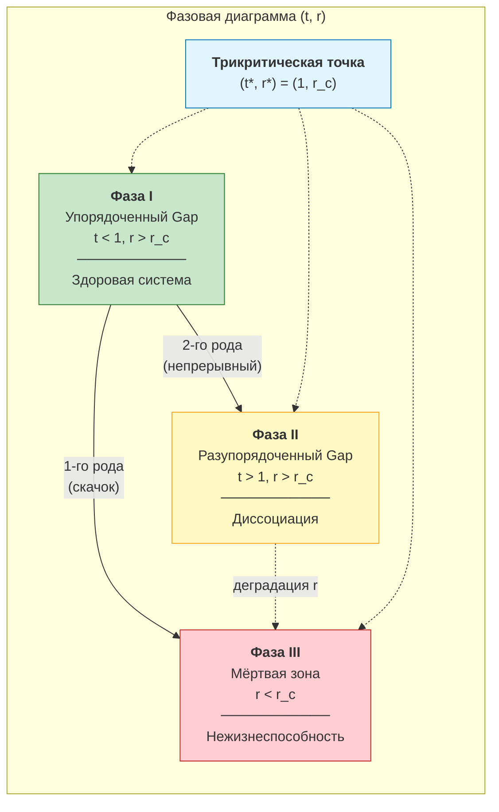
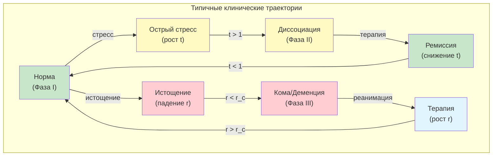

# Фазовая диаграмма: кибернетическая интерпретация

:::note О нотации
В этом документе:
- $\Gamma$ — [матрица когерентности](/docs/core/dynamics/coherence-matrix)
- $t = T_{\text{eff}}/T_c$ — безразмерная [эффективная температура](/docs/core/dynamics/gap-thermodynamics#эффективная-температура)
- $r = \kappa/\Gamma_2$ — отношение регенерации к диссипации
- $\Gamma_2$ — скорость декогеренции (структурная, $= 2\gamma/3$ из [Фано-канала](/docs/proofs/gap/fano-channel#теорема-фано-канал))
- $\kappa$ — скорость регенерации: $\kappa = \kappa_{\text{bootstrap}} + \kappa_0 \cdot \mathrm{Coh}_E$
- $P$ — [чистота](/docs/core/dynamics/viability#определение-чистоты): $P = \mathrm{Tr}(\Gamma^2)$
- $P_{\text{crit}} = 2/7$ — [критическая чистота](/docs/proofs/dynamics/theorem-purity-critical)
- $\sigma_{\mathrm{sys}}$ — [тензор напряжений](./definitions#тензор-напряжений)
:::

Данный документ предоставляет **кибернетическую интерпретацию** [фазовой диаграммы Gap](/docs/core/dynamics/gap-phase-diagram), переводя математические результаты на язык системной диагностики и клинических состояний.

---

## 1. Управляющие параметры в кибернетическом контексте {#параметры}

Два безразмерных параметра полностью определяют стационарное состояние системы:

### 1.1 Параметр $t$: «температура хаоса»

$$
t := \frac{T_{\text{eff}}}{T_c} = \frac{\Gamma_2}{\kappa_0} \cdot \frac{k_B T_{\text{phys}} \ln 21}{\mu^2}
$$

| $t$ | Физический смысл | Кибернетическая интерпретация |
|-----|------------------|-------------------------------|
| $t \ll 1$ | Низкая эффективная температура | Система хорошо упорядочена, шум подавлен |
| $t \approx 1$ | Критическая температура | Граница устойчивости, высокая чувствительность |
| $t \gg 1$ | Высокая эффективная температура | Доминирует хаос, структура разрушена |

### 1.2 Параметр $r$: «запас жизненных сил»

$$
r := \frac{\kappa}{\Gamma_2} = \frac{\kappa_{\text{bootstrap}} + \kappa_0 \cdot \mathrm{Coh}_E}{\Gamma_2}
$$

| $r$ | Физический смысл | Кибернетическая интерпретация |
|-----|------------------|-------------------------------|
| $r \gg r_c$ | Регенерация доминирует | Большой запас прочности, адаптивная система |
| $r \approx r_c$ | Баланс | Минимально жизнеспособная система |
| $r < r_c$ | Диссипация доминирует | Нежизнеспособная система, деградация |

Критическое значение:

$$
r_c = \frac{P_{\text{crit}}}{7P} \approx \frac{2}{49P}
$$

:::info Связь $r$ с E-когерентностью [Т]
Поскольку $\kappa = \kappa_{\text{bootstrap}} + \kappa_0 \cdot \mathrm{Coh}_E$, параметр $r$ **монотонно зависит** от [E-когерентности](./definitions#e-когерентность). Увеличение $\mathrm{Coh}_E$ напрямую увеличивает $r$ и отдаляет систему от мёртвой зоны.
:::

---

## 2. Три фазы: кибернетический анализ {#три-фазы}

### 2.1 Визуализация фазовой диаграммы

### 2.2 Фаза I: Упорядоченный Gap (норма) [Т]

:::tip Характеристика Фазы I
**Условие:** $t < 1$ и $r > r_c$

- Gap-профиль **структурирован**: несколько каналов с высоким Gap, остальные прозрачны
- $G_2$-симметрия спонтанно нарушена: $G_2 \to H_{\hat{\mathcal{G}}_*}$
- Параметр порядка: $\sigma^2_{\text{Gap}} > 0$ (анизотропия Gap-профиля)
- Ранг непрозрачности: $\mathrm{rank}(\hat{\mathcal{G}}) \in \{1, 2, 3\}$
:::

**Кибернетическая интерпретация:**

| Свойство | Описание |
|----------|----------|
| Избирательная непрозрачность | Система «знает», какие каналы непрозрачны, и «выбирает» структурированный Gap-профиль |
| Голдстоуновские моды | Медленные осцилляции Gap между парами — [ультрамедленные флуктуации](./goldstone-modes) |
| Топологическая защита | При ранге 3 паттерн непрозрачности [топологически защищён](./topological-protection#топологическая) |
| Адаптивность | Система может перераспределять Gap в ответ на внешние воздействия |

**Диагностические маркеры:**
- $\sigma^2_{\text{Gap}} > 0$: неравномерность Gap — признак здоровой дифференциации
- $\|\sigma_{\mathrm{sys}}\|_\infty < 1$: все компоненты [тензора напряжений](./definitions#тензор-напряжений) в норме
- $P > P_{\text{crit}}$: чистота выше критической

### 2.3 Фаза II: Разупорядоченный Gap (диссоциация) [Т]

:::warning Характеристика Фазы II
**Условие:** $t > 1$ и $r > r_c$

- Gap распределён **равномерно** по всем каналам
- $G_2$-симметрия **приблизительно** сохранена (нет спонтанного нарушения)
- Параметр порядка: $\sigma^2_{\text{Gap}} \to 0$ (изотропия)
- $\mathcal{G}_{\text{total}} > 0$, но нет структуры
:::

**Кибернетическая интерпретация:**

| Свойство | Описание |
|----------|----------|
| Равномерная мутность | Все каналы одинаково непрозрачны — нет избирательности |
| Потеря дифференциации | Система не различает «важные» и «неважные» границы |
| Высокая энтропия Gap | $S_{\text{Gap}} \to S_{\max}$ — максимальный беспорядок в распределении непрозрачности |
| Сохранение ресурсов | $r > r_c$ — регенерация работает, но без цели |

**Диагностические маркеры:**
- $\sigma^2_{\text{Gap}} \approx 0$: равномерный Gap — признак потери структуры
- $P > P_{\text{crit}}$ (формально жизнеспособна): чистота поддерживается, но без когерентной организации
- $\mathrm{Coh}_E$ снижено: хотя не ниже $\mathrm{Coh}_{\min}$, качество интеграции страдает

### 2.4 Фаза III: Мёртвая зона [Т]

:::danger Характеристика Фазы III
**Условие:** $r < r_c$ (при любом $t$)

- Когерентности затухают: $|\gamma_{ij}| \to 0$ для всех $i \neq j$
- $\mathcal{G}_{\text{total}} \to 0$: Gap не определён (нет когерентностей для измерения)
- Система **нежизнеспособна**: $P \to 1/7 < P_{\text{crit}}$
:::

**Кибернетическая интерпретация:**

| Свойство | Описание |
|----------|----------|
| Потеря связей | Межсекторные когерентности вымирают — измерения эволюционируют независимо |
| $\Phi \to 0$ | Мера интеграции обнуляется — система фрагментирована |
| $\kappa \to \kappa_{\text{bootstrap}}$ | Регенерация минимальна, не компенсирует диссипацию |
| Необратимость | Без внешнего вмешательства система не может вернуться в Фазу I или II |

**Диагностические маркеры:**
- $P < P_{\text{crit}}$: чистота ниже критической — невосполнимая декогеренция
- $\Phi < \Phi_{\text{th}}$: интеграция ниже порога — фрагментация
- $\|\sigma_{\mathrm{sys}}\|_\infty \geq 1$: хотя бы один компонент тензора напряжений превышает норму

---

## 3. Линии фазовых переходов {#переходы}

### 3.1 Переход I $\leftrightarrow$ II: порядок $\to$ хаос

:::info Переход 2-го рода (непрерывный) [Т]
На линии $t = 1$ при $r > r_c$:

$$
\sigma^2_{\text{Gap}} \propto (1 - t)^{2\beta}, \quad \beta = 1/2
$$

Параметр порядка $\sigma^2_{\text{Gap}}$ непрерывно обращается в нуль. Система плавно теряет структурированность Gap-профиля.
:::

**Клиническое соответствие:** Постепенная потеря ясности мышления. «Расплавка» структурированной непрозрачности — здоровые защитные механизмы становятся диффузными.

**Обратимость:** Переход **обратим** — снижение $t$ (уменьшение хаоса) восстанавливает структурированный Gap-профиль.

### 3.2 Переход I $\leftrightarrow$ III: жизнь $\to$ смерть

:::danger Переход 1-го рода (разрывный) [Т]
На линии $r = r_c$ при $t < 1$:

$$
\mathcal{G}_{\text{total}} \text{ скачком} \to 0
$$

Полный Gap и когерентности исчезают скачкообразно. Система мгновенно теряет все межсекторные связи.
:::

**Клиническое соответствие:** Острая декомпенсация. Истощение ресурсов ($r$ падает ниже $r_c$) приводит к скачкообразному распаду когерентности — аналог внезапной потери сознания.

**Обратимость:** Переход **частично обратим** при быстром восстановлении $r > r_c$ (внешняя поддержка). Однако система может попасть в другой Gap-профиль (гистерезис).

### 3.3 Трикритическая точка

:::tip Трикритическая точка $(t^*, r^*) = (1, r_c)$ [Т]
В трикритической точке сходятся все три фазы. Критические показатели отличаются от линии I $\leftrightarrow$ II:

| Показатель | На линии $t = 1$ | В трикритической точке |
|------------|-------------------|------------------------|
| $\beta$ | $1/2$ | $1/4$ |
| $\gamma$ | $1$ | $1$ |
| $\delta$ | $3$ | $5$ |
| $\alpha$ | $0$ (лог.) | $1/2$ |
:::

**Клиническое соответствие:** Пограничное состояние — осцилляция между упорядоченным Gap (ремиссия) и хаотическим Gap (рецидив), при одновременной угрозе срыва в мёртвую зону.

---

## 4. Клиническое картирование {#клиника}

### 4.1 Таблица фаз и клинических состояний

| Фаза | Клинический аналог | Характеристика | Маркеры |
|------|--------------------|----------------|---------|
| **I (упорядоченный)** | Нормальное функционирование | Избирательные непрозрачности (здоровое вытеснение), прозрачность в остальных каналах | $\sigma^2_{\text{Gap}} > 0$, $P > P_{\text{crit}}$, $\Phi > \Phi_{\text{th}}$ |
| **II (разупорядоченный)** | Диссоциативное расстройство | Все каналы одинаково мутны — диффузная деперсонализация | $\sigma^2_{\text{Gap}} \approx 0$, $P > P_{\text{crit}}$, $\Phi$ снижено |
| **III (мёртвая)** | Деменция, кома | Потеря когерентностей, фрагментация | $P \to 1/7$, $\Phi \to 0$, $r < r_c$ |
| **I $\leftrightarrow$ II** | Психотический эпизод | «Расплавка» структуры непрозрачности | $t \approx 1$, осцилляции $\sigma^2_{\text{Gap}}$ |
| **I $\leftrightarrow$ III** | Острая декомпенсация | Скачкообразный распад при истощении | $r \to r_c$, скачок $\mathcal{G}_{\text{total}}$ |
| **Трикритическая** | Пограничное расстройство | Осцилляция между порядком и хаосом | $t \approx 1$, $r \approx r_c$ |

### 4.2 Траектории в фазовом пространстве

### 4.3 Диагностический протокол

:::info Протокол определения фазы [И]
1. **Измерить $P$** (чистота): EEG-когерентность или PCI
2. **Оценить $\sigma^2_{\text{Gap}}$** (анизотропия): дисперсия корреляций между 7 секторами
3. **Вычислить $r$**: отношение скорости восстановления к скорости деградации
4. **Определить фазу:**
   - $P > P_{\text{crit}}$ и $\sigma^2_{\text{Gap}} > 0$ $\Rightarrow$ **Фаза I**
   - $P > P_{\text{crit}}$ и $\sigma^2_{\text{Gap}} \approx 0$ $\Rightarrow$ **Фаза II**
   - $P < P_{\text{crit}}$ или $r < r_c$ $\Rightarrow$ **Фаза III**
:::

### 4.4 Терапевтические стратегии по фазам

| Фаза | Цель терапии | Стратегия |
|------|-------------|-----------|
| **I (норма)** | Профилактика | Мониторинг $t$ и $r$; поддержание $\mathrm{Coh}_E$ |
| **I $\to$ II** | Предотвращение перехода | Снижение $t$ (уменьшение хаоса); структурирование Gap-профиля |
| **II** | Восстановление структуры | Снижение $t$ ниже 1; целенаправленная работа с конкретными Gap-каналами |
| **II $\to$ III** | Предотвращение перехода | Увеличение $r$ (поддержка ресурсов); повышение $\mathrm{Coh}_E$ |
| **III** | Реанимация | Внешнее увеличение $\kappa$ (медикаменты, стимуляция); достижение $r > r_c$ |

---

## 5. Связь с тензором напряжений {#тензор-напряжений}

Положение системы в фазовой диаграмме отражается в [тензоре напряжений](./definitions#тензор-напряжений):

| Фаза | $\|\sigma_{\mathrm{sys}}\|_\infty$ | Компоненты |
|------|-------------------------------------|------------|
| I | $< 1$ | Все $\sigma_i < 1$; возможно $\sigma_E$ повышена (здоровая рефлексия) |
| II | $< 1$ (формально) | Все $\sigma_i$ равномерно повышены; $\sigma_U$ → 1 (потеря единства) |
| III | $\geq 1$ | Хотя бы один $\sigma_i \geq 1$ (перегрузка конкретного измерения) |

:::tip Связь с Теоремой 10.1 [С]
По [теореме эквивалентности условий](./theorems#теорема-101-эквивалентность-условий-с):

$$
\Gamma \in \mathcal{V} \Leftrightarrow \|\sigma_{\mathrm{sys}}(\Gamma)\|_\infty < 1 \Leftrightarrow P > P_{\text{crit}}
$$

Переход в Фазу III ($P < P_{\text{crit}}$) эквивалентен $\|\sigma_{\mathrm{sys}}\|_\infty \geq 1$.
:::

---

## 6. Сводка статусов {#статусы}

| Результат | Статус |
|-----------|--------|
| Три фазы Gap в плоскости $(t, r)$ | [Т] |
| Переход I $\leftrightarrow$ II: 2-й род, $\beta = 1/2$ | [Т] |
| Переход I $\leftrightarrow$ III: 1-й род, скачок $\mathcal{G}_{\text{total}}$ | [Т] |
| Трикритическая точка $(t^*, r^*) = (1, r_c)$ | [Т] |
| Критические показатели (Ландау, среднеполевые) | [Т] |
| Соответствие фаз клиническим состояниям | [И] |
| Терапевтические стратегии по фазам | [И] |
| Диагностический протокол | [И] |

---

## Связанные документы

- [Фазовая диаграмма Gap](/docs/core/dynamics/gap-phase-diagram) — математическое основание: три фазы, критические показатели, катастрофы Уитни
- [Термодинамика Gap](/docs/core/dynamics/gap-thermodynamics) — $T_{\text{eff}}$, $V_{\text{Gap}}$, лагранжиан
- [Динамика Gap](/docs/core/dynamics/gap-dynamics) — бифуркации, немарковские эффекты
- [Жизнеспособность](/docs/core/dynamics/viability) — мера $P$ и $P_{\text{crit}} = 2/7$
- [Определения КК](./definitions) — тензор напряжений, $\mathrm{Coh}_E$, меры
- [Теоремы КК](./theorems) — No-Zombie, эквивалентность условий
- [Предсказания КК](./predictions) — фальсифицируемые предсказания
- [Топологическая защита когерентности](./topological-protection) — механизмы защиты Gap
- [Голдстоуновские моды](./goldstone-modes) — медленные осцилляции в Фазе I
- [Иерархия интериорности](/docs/proofs/consciousness/interiority-hierarchy) — уровни L0–L4
