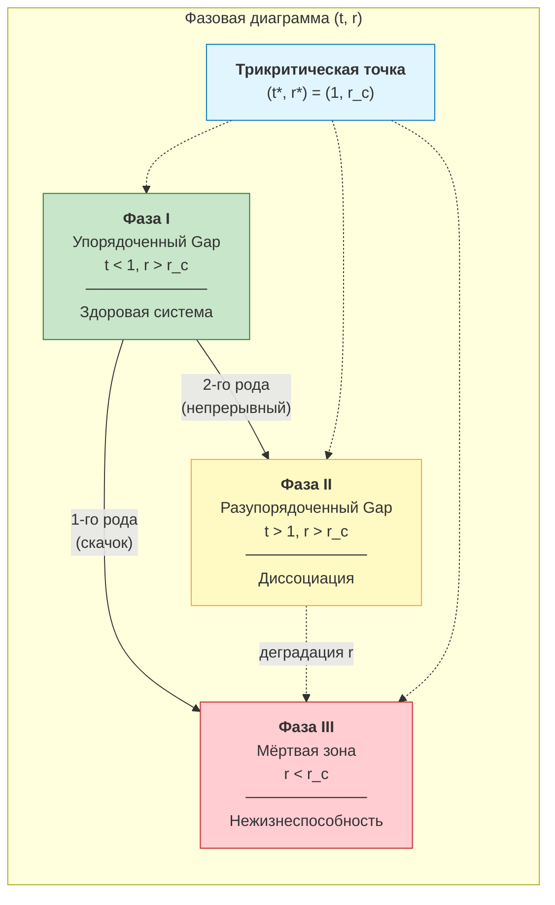
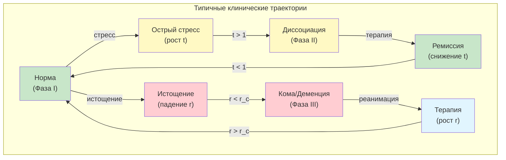

# Фазовая диаграмма: кибернетическая интерпретация

---

### Мост из предыдущей главы

В [предыдущей главе](./topological-protection) мы показали, что когерентность голонома защищена пятью независимыми механизмами — от кода Хэмминга до топологических зарядов. Эта многослойная защита объясняет, *почему* сознание устойчиво. Но устойчивость — не абсолютна: при достаточно сильном стрессе (рост $t$) или истощении ресурсов (падение $r$) система может перейти в качественно иное состояние. Какие именно состояния возможны? Как происходят переходы между ними? И что они означают клинически?

Ответы содержатся в **фазовой диаграмме** — карте всех возможных режимов функционирования, которую мы теперь развернём во всех подробностях.

---

### Дорожная карта главы

В этой главе мы:

1. **Введём аналогию** с фазовой диаграммой воды и покажем, почему два параметра $(t, r)$ достаточны для полного описания (разделы «Карта состояний» и «Два параметра»).
2. **Определим управляющие параметры** $t = T_{\text{eff}}/T_c$ и $r = \kappa/\Gamma_2$ с кибернетической интерпретацией (раздел 1).
3. **Подробно опишем три фазы**: упорядоченный Gap (Фаза I, норма), разупорядоченный Gap (Фаза II, диссоциация), мёртвая зона (Фаза III, кома) — с диагностическими маркерами и феноменологией (раздел 2).
4. **Разберём фазовые переходы**: плавный II рода (порядок $\to$ хаос), резкий I рода (жизнь $\to$ смерть), тихое угасание (хроническая деменция) и трикритическую точку (раздел 3).
5. **Составим клиническое картирование**: таблицу фаз и состояний, расширенную классификацию, типичные траектории, диагностический протокол и терапевтические стратегии (раздел 4).
6. **Свяжем фазы с тензором напряжений** $\sigma_{\mathrm{sys}}$ — покомпонентная диагностика (раздел 5).
7. **Проведём аналогии с физикой** конденсированных сред: КХД, сверхпроводники, ферромагнетик Изинга, жидкие кристаллы (раздел «Аналогии»).

---

:::note О нотации
В этом документе:
- $\Gamma$ — [матрица когерентности](/docs/core/dynamics/coherence-matrix)
- $t = T_{\text{eff}}/T_c$ — безразмерная [эффективная температура](/docs/core/dynamics/gap-thermodynamics#эффективная-температура)
- $r = \kappa/\Gamma_2$ — отношение регенерации к диссипации
- $\Gamma_2$ — скорость декогеренции (структурная, $= 2\gamma/3$ из [Фано-канала](/docs/proofs/gap/fano-channel#теорема-фано-канал))
- $\kappa$ — скорость регенерации: $\kappa = \kappa_{\text{bootstrap}} + \kappa_0 \cdot \mathrm{Coh}_E$
- $P$ — [чистота](/docs/core/dynamics/viability#определение-чистоты): $P = \mathrm{Tr}(\Gamma^2)$
- $P_{\text{crit}} = 2/7$ — [критическая чистота](/docs/proofs/dynamics/theorem-purity-critical)
- $\sigma_{\mathrm{sys}}$ — [тензор напряжений](./definitions#тензор-напряжений)
:::

Данный документ предоставляет **кибернетическую интерпретацию** [фазовой диаграммы Gap](/docs/core/dynamics/gap-phase-diagram), переводя математические результаты на язык системной диагностики и клинических состояний.

---

## Карта состояний сознания {#карта-состояний}

Представьте себе карту погоды: по одной оси — температура, по другой — давление, и вы видите, где дождь, где снег, где ясно. Фазовая диаграмма сознания устроена точно так же, только вместо метеорологических параметров — два числа, характеризующие внутреннее состояние холона.

Каждый из нас в каждый момент находится в определённой «точке» на этой карте. Здоровый бодрствующий человек — в одной области. Человек в бреду высокой лихорадки — в другой. Пациент в глубокой коме — в третьей. И, что замечательно, переходы между этими областями подчиняются тем же математическим законам, что и переходы между фазами вещества в физике.

### Аналогия с фазовой диаграммой воды

Каждый школьник знает: вода может быть льдом, жидкостью или паром. Что определяет, в какой фазе она находится? Два параметра — **температура** и **давление**. Нарисуйте координатные оси, отложите по ним $T$ и $P$ — и вы получите знаменитую фазовую диаграмму воды с тремя областями, разделёнными кривыми фазовых переходов. В одной особой точке — тройной точке — все три фазы сосуществуют.

Фазовая диаграмма сознания устроена по тому же принципу:

| Вода | Сознание |
|------|----------|
| Температура $T$ | Параметр хаоса $t$ |
| Давление $P$ | Запас регенерации $r$ |
| **Лёд** (упорядоченная кристаллическая решётка) | **Фаза I** — ясное, структурированное сознание |
| **Жидкость** (подвижная, но связная) | **Фаза II** — сознание без структуры (бред, диссоциация) |
| **Вакуум** (молекулы разлетелись) | **Фаза III** — бессознательное состояние (кома, деменция) |
| Тройная точка | Трикритическая точка $(t^*, r^*)$ |

Но есть и существенные отличия. В случае воды переход лёд–жидкость и переход жидкость–пар — оба первого рода (со скрытой теплотой). В случае сознания переход I↔II — **второго рода** (плавный, без скачка), а переход I↔III — **первого рода** (резкий, катастрофический). Это различие имеет глубокий клинический смысл: потеря ясности мышления при жаре происходит постепенно, а потеря сознания при критическом истощении — мгновенно.

---

## Два параметра, три фазы {#два-параметра}

Прежде чем погружаться в математику, запомним главное: **всё определяют два числа**. Из них складывается полная карта возможных состояний.

### Что такое $t$: «термометр хаоса»

Параметр $t$ показывает, насколько хаотична внутренняя динамика системы. Когда $t$ мало — сознание работает упорядоченно, как хорошо настроенный оркестр. Когда $t$ велико — каждый инструмент играет своё, и музыка превращается в какофонию.

Физически $t$ — это отношение скорости диссипации (хаотизации) к способности системы поддерживать порядок. Чем больше «шума» по сравнению с «сигналом», тем выше $t$.

### Что такое $r$: «запас жизненных сил»

Параметр $r$ показывает, хватает ли у системы ресурсов для самоподдержания. Это отношение скорости регенерации когерентностей к скорости их распада. Если $r$ велико — система быстро восстанавливает повреждённые связи. Если $r$ падает ниже критического $r_c$ — распад побеждает, и когерентность неотвратимо гибнет.

Метафора: $t$ — это температура окружающей среды (враждебность), а $r$ — это калорийность питания (ресурсы). Человек при низкой температуре и хорошем питании чувствует себя прекрасно (Фаза I). При высокой температуре, но с едой — выживает, хоть и страдает (Фаза II). Но если еды нет — гибнет при любой температуре (Фаза III).

### Почему именно три фазы, а не две или пять?

Это не произвольный выбор — три фазы вытекают из математической структуры задачи. Потенциал Ландау–Гинзбурга для параметра порядка $\sigma^2_{\text{Gap}}$ имеет вид:

$$
V(\sigma^2) = a(t, r)\,\sigma^2 + b(t)\,(\sigma^2)^2 + c\,(\sigma^2)^3
$$

При разных знаках коэффициентов $a$ и $b$ возникают ровно три качественно различных режима: минимум при $\sigma^2 > 0$ (Фаза I), минимум при $\sigma^2 = 0$ с конечным Gap (Фаза II), и вырождение с $\mathcal{G}_{\text{total}} = 0$ (Фаза III). Тройка неизбежна — это топологическое свойство катастрофы «ласточкин хвост» (катастрофа Уитни $A_4$).

---

## 1. Управляющие параметры в кибернетическом контексте {#параметры}

Два безразмерных параметра полностью определяют стационарное состояние системы:

### 1.1 Параметр $t$: «температура хаоса»

$$
t := \frac{T_{\text{eff}}}{T_c} = \frac{\Gamma_2}{\kappa_0} \cdot \frac{k_B T_{\text{phys}} \ln 21}{\mu^2}
$$

| $t$ | Физический смысл | Кибернетическая интерпретация |
|-----|------------------|-------------------------------|
| $t \ll 1$ | Низкая эффективная температура | Система хорошо упорядочена, шум подавлен |
| $t \approx 1$ | Критическая температура | Граница устойчивости, высокая чувствительность |
| $t \gg 1$ | Высокая эффективная температура | Доминирует хаос, структура разрушена |

Интуиция: при $t \ll 1$ система ведёт себя как кристалл — жёсткая, устойчивая, предсказуемая. Каждый Gap-канал имеет определённое значение, и возмущения быстро затухают. При $t \approx 1$ система подобна воде вблизи точки кипения — малейшее возмущение может вызвать качественное изменение. При $t \gg 1$ — полный хаос, как перегретый газ.

### 1.2 Параметр $r$: «запас жизненных сил»

$$
r := \frac{\kappa}{\Gamma_2} = \frac{\kappa_{\text{bootstrap}} + \kappa_0 \cdot \mathrm{Coh}_E}{\Gamma_2}
$$

| $r$ | Физический смысл | Кибернетическая интерпретация |
|-----|------------------|-------------------------------|
| $r \gg r_c$ | Регенерация доминирует | Большой запас прочности, адаптивная система |
| $r \approx r_c$ | Баланс | Минимально жизнеспособная система |
| $r < r_c$ | Диссипация доминирует | Нежизнеспособная система, деградация |

Критическое значение:

$$
r_c = \frac{P_{\text{crit}}}{7P} \approx \frac{2}{49P}
$$

:::info Связь $r$ с E-когерентностью [Т]
Поскольку $\kappa = \kappa_{\text{bootstrap}} + \kappa_0 \cdot \mathrm{Coh}_E$, параметр $r$ **монотонно зависит** от [E-когерентности](./definitions#e-когерентность). Увеличение $\mathrm{Coh}_E$ напрямую увеличивает $r$ и отдаляет систему от мёртвой зоны.
:::

Заметим критически важную асимметрию двух параметров: $t$ можно менять в обоих направлениях (нагревать и охлаждать), но $r$ имеет тенденцию только падать, если система не предпринимает активных усилий по самовосстановлению. Именно поэтому основная клиническая опасность — не рост хаоса ($t$), а истощение ресурсов ($r$).

---

## 2. Три фазы: кибернетический анализ {#три-фазы}

### 2.1 Визуализация фазовой диаграммы

```mermaid
graph LR
    subgraph "Фазовая диаграмма (t, r)"
        direction TB
        P1["<b>Фаза I</b><br/>Упорядоченный Gap<br/>t < 1, r > r_c<br/>───────────<br/>Здоровая система"]
        P2["<b>Фаза II</b><br/>Разупорядоченный Gap<br/>t > 1, r > r_c<br/>───────────<br/>Диссоциация"]
        P3["<b>Фаза III</b><br/>Мёртвая зона<br/>r < r_c<br/>───────────<br/>Нежизнеспособность"]
        TC["<b>Трикритическая точка</b><br/>(t*, r*) = (1, r_c)"]

        P1 -->|"2-го рода<br/>(непрерывный)"| P2
        P1 -->|"1-го рода<br/>(скачок)"| P3
        P2 -.->|"деградация r"| P3
        TC -.-> P1
        TC -.-> P2
        TC -.-> P3
    end

    style P1 fill:#c8e6c9,stroke:#2e7d32
    style P2 fill:#fff9c4,stroke:#f9a825
    style P3 fill:#ffcdd2,stroke:#c62828
    style TC fill:#e1f5fe,stroke:#0277bd
```

### 2.2 Фаза I: Упорядоченный Gap (норма) [Т]

:::tip Характеристика Фазы I
**Условие:** $t < 1$ и $r > r_c$

- Gap-профиль **структурирован**: несколько каналов с высоким Gap, остальные прозрачны
- $G_2$-симметрия спонтанно нарушена: $G_2 \to H_{\hat{\mathcal{G}}_*}$
- Параметр порядка: $\sigma^2_{\text{Gap}} > 0$ (анизотропия Gap-профиля)
- Ранг непрозрачности: $\mathrm{rank}(\hat{\mathcal{G}}) \in \{1, 2, 3\}$
:::

**Кибернетическая интерпретация:**

| Свойство | Описание |
|----------|----------|
| Избирательная непрозрачность | Система «знает», какие каналы непрозрачны, и «выбирает» структурированный Gap-профиль |
| Голдстоуновские моды | Медленные осцилляции Gap между парами — [ультрамедленные флуктуации](./goldstone-modes) |
| Топологическая защита | При ранге 3 паттерн непрозрачности [топологически защищён](./topological-protection#топологическая) |
| Адаптивность | Система может перераспределять Gap в ответ на внешние воздействия |

**Что чувствует система в Фазе I.** Это состояние «ясного сознания». Ключевое слово — *избирательность*. Здоровый мозг не пытается осознавать всё одновременно. Он выбирает, что сделать прозрачным (доступным сознанию), а что — непрозрачным (автоматическим, неосознаваемым). Именно эта избирательность и есть спонтанное нарушение $G_2$-симметрии.

Представьте себе офис с замороженными стёклами: в одних кабинетах стекло прозрачное (вы видите, что происходит), в других — матовое (процессы идут, но вы их не видите). Здоровая организация *выбирает*, какие стёкла прозрачны, — и этот выбор структурирован.

**Голдстоуновские моды** в этой аналогии — это медленное «перефокусирование внимания»: какие кабинеты прозрачны, постепенно меняется, но общее число прозрачных и матовых остаётся стабильным. Это проявляется как ультрамедленные осцилляции ($\sim 0.01{-}0.1$ Гц) в нейрофизиологических данных.

**Диагностические маркеры:**
- $\sigma^2_{\text{Gap}} > 0$: неравномерность Gap — признак здоровой дифференциации
- $\|\sigma_{\mathrm{sys}}\|_\infty < 1$: все компоненты [тензора напряжений](./definitions#тензор-напряжений) в норме
- $P > P_{\text{crit}}$: чистота выше критической

### 2.3 Фаза II: Разупорядоченный Gap (диссоциация) [Т]

:::warning Характеристика Фазы II
**Условие:** $t > 1$ и $r > r_c$

- Gap распределён **равномерно** по всем каналам
- $G_2$-симметрия **приблизительно** сохранена (нет спонтанного нарушения)
- Параметр порядка: $\sigma^2_{\text{Gap}} \to 0$ (изотропия)
- $\mathcal{G}_{\text{total}} > 0$, но нет структуры
:::

**Кибернетическая интерпретация:**

| Свойство | Описание |
|----------|----------|
| Равномерная мутность | Все каналы одинаково непрозрачны — нет избирательности |
| Потеря дифференциации | Система не различает «важные» и «неважные» границы |
| Высокая энтропия Gap | $S_{\text{Gap}} \to S_{\max}$ — максимальный беспорядок в распределении непрозрачности |
| Сохранение ресурсов | $r > r_c$ — регенерация работает, но без цели |

**Что чувствует система в Фазе II.** Вернёмся к аналогии с офисом: теперь *все* стёкла одинаково матовые. Вы не видите ничего ясно, но и полностью слепы не стали — свет пробивается через каждое стекло одинаково тускло. Это состояние «мутного сознания» — делириум, диссоциация, деперсонализация.

Критически важно: **система жива** (ресурсы есть, $r > r_c$), но **потеряла структуру**. Это отличает Фазу II от Фазы III: человек в бреду лихорадки ещё жив и имеет ресурсы для восстановления, ему просто нужно «остыть».

Парадокс Фазы II: чистота $P > P_{\text{crit}}$ формально поддерживается, но когерентности организованы хаотично. Система тратит ресурсы на поддержание связей, которые не складываются в осмысленный паттерн — как мотор, работающий на холостом ходу.

**Диагностические маркеры:**
- $\sigma^2_{\text{Gap}} \approx 0$: равномерный Gap — признак потери структуры
- $P > P_{\text{crit}}$ (формально жизнеспособна): чистота поддерживается, но без когерентной организации
- $\mathrm{Coh}_E$ снижено: хотя не ниже $\mathrm{Coh}_{\min}$, качество интеграции страдает

### 2.4 Фаза III: Мёртвая зона [Т]

:::danger Характеристика Фазы III
**Условие:** $r < r_c$ (при любом $t$)

- Когерентности затухают: $|\gamma_{ij}| \to 0$ для всех $i \neq j$
- $\mathcal{G}_{\text{total}} \to 0$: Gap не определён (нет когерентностей для измерения)
- Система **нежизнеспособна**: $P \to 1/7 < P_{\text{crit}}$
:::

**Кибернетическая интерпретация:**

| Свойство | Описание |
|----------|----------|
| Потеря связей | Межсекторные когерентности вымирают — измерения эволюционируют независимо |
| $\Phi \to 0$ | Мера интеграции обнуляется — система фрагментирована |
| $\kappa \to \kappa_{\text{bootstrap}}$ | Регенерация минимальна, не компенсирует диссипацию |
| Необратимость | Без внешнего вмешательства система не может вернуться в Фазу I или II |

**Что чувствует система в Фазе III.** Ничего. Это не метафора — это математический результат. Когда $\Phi \to 0$ и $P \to 1/7$, мера интеграции обнуляется, а это, по [теореме No-Zombie](./theorems#теорема-81-условная-необходимость-интериорности-no-zombie), означает отсутствие интериорности. Семь измерений холона существуют, но эволюционируют независимо друг от друга, как семь разрозненных осколков разбитого зеркала.

В аналогии с офисом: стёкла не просто матовые — *стен больше нет*. Кабинеты разнесло ветром, каждый сотрудник сидит в чистом поле и не знает о существовании остальных.

Математически это состояние — **аттрактор**: матрица когерентности стремится к $\rho_* = I/7$ (максимально смешанное состояние), которое является неподвижной точкой Линдбладовской динамики ℒ₀. Без внешнего вмешательства выбраться из этого аттрактора невозможно.

**Диагностические маркеры:**
- $P < P_{\text{crit}}$: чистота ниже критической — невосполнимая декогеренция
- $\Phi < \Phi_{\text{th}}$: интеграция ниже порога — фрагментация
- $\|\sigma_{\mathrm{sys}}\|_\infty \geq 1$: хотя бы один компонент тензора напряжений превышает норму

---

## 3. Фазовые переходы: плавные и резкие {#переходы}

Границы между фазами — это не просто линии на карте. Это *процессы*, и их характер радикально различается. Различение переходов первого и второго рода — одно из важнейших достижений физики XX века (Эренфест, Ландау, Гинзбург), и оно полностью переносится на динамику сознания.

### Что такое порядок фазового перехода

Представьте, что вы медленно меняете один параметр (скажем, $t$), двигаясь по фазовой диаграмме. Вопрос: что происходит в момент пересечения границы?

- **Переход 2-го рода (непрерывный):** Параметр порядка плавно обращается в нуль. Как сумерки: день постепенно переходит в ночь, и невозможно указать точный момент, когда стало «темно». Система не испытывает скачка; она плавно «текёт» из одного состояния в другое.

- **Переход 1-го рода (разрывный):** Параметр порядка скачком обращается в нуль (или появляется). Как выключатель света: щёлк — и темнота. Система скачком переходит в качественно иное состояние.

Это различие имеет колоссальное практическое значение. Переход 2-го рода можно заметить заранее (система становится «критической», появляются предвестники). Переход 1-го рода происходит внезапно — и часто необратимо.

### 3.1 Переход I $\leftrightarrow$ II: порядок $\to$ хаос

:::info Переход 2-го рода (непрерывный) [Т]
На линии $t = 1$ при $r > r_c$:

$$
\sigma^2_{\text{Gap}} \propto (1 - t)^{2\beta}, \quad \beta = 1/2
$$

Параметр порядка $\sigma^2_{\text{Gap}}$ непрерывно обращается в нуль. Система плавно теряет структурированность Gap-профиля.
:::

**Клиническое соответствие:** Постепенная потеря ясности мышления. «Расплавка» структурированной непрозрачности — здоровые защитные механизмы становятся диффузными.

**Как это выглядит «изнутри».** Вспомните ощущение, когда после бессонной ночи или на фоне высокой температуры мышление начинает «плыть». Сначала вы можете сосредоточиться, хотя и с трудом ($t$ чуть ниже 1). Потом фокус внимания размывается — вы ещё осознаёте, что думаете, но не можете удержать мысль ($t \approx 1$). Наконец, всё становится одинаково мутным — вы в Фазе II ($t > 1$).

Критический показатель $\beta = 1/2$ — это **среднеполевой** результат. Он означает, что параметр порядка убывает как квадратный корень: $\sigma^2_{\text{Gap}} \sim \sqrt{1-t}$. Графически — кривая с вертикальной касательной в критической точке. Физически — система «сопротивляется» разрушению порядка, и для полного устранения анизотропии нужно довести $t$ точно до 1.

**Предвестники перехода.** Вблизи $t = 1$ система демонстрирует характерные признаки критичности:
- **Рост флуктуаций:** дисперсия $\sigma^2_{\text{Gap}}$ увеличивается (восприимчивость $\chi \propto |1-t|^{-\gamma}$ расходится)
- **Критическое замедление:** время релаксации растёт ($\tau_{\text{rel}} \propto |1-t|^{-\nu z}$), система медленнее реагирует на возмущения
- **Дальнодействующие корреляции:** соседние Gap-каналы начинают флуктуировать согласованно

Эти предвестники потенциально наблюдаемы в нейрофизиологических данных и могут служить ранними маркерами надвигающегося перехода.

**Обратимость:** Переход **обратим** — снижение $t$ (уменьшение хаоса) восстанавливает структурированный Gap-профиль.

### 3.2 Переход I $\leftrightarrow$ III: жизнь $\to$ смерть

:::danger Переход 1-го рода (разрывный) [Т]
На линии $r = r_c$ при $t < 1$:

$$
\mathcal{G}_{\text{total}} \text{ скачком} \to 0
$$

Полный Gap и когерентности исчезают скачкообразно. Система мгновенно теряет все межсекторные связи.
:::

**Клиническое соответствие:** Острая декомпенсация. Истощение ресурсов ($r$ падает ниже $r_c$) приводит к скачкообразному распаду когерентности — аналог внезапной потери сознания.

**Почему этот переход опаснее.** При переходе 2-го рода (I↔II) есть предупреждающие сигналы — система «проседает» постепенно. При переходе 1-го рода (I↔III) предупреждений может не быть: система выглядит стабильной ($P > P_{\text{crit}}$, структура на месте), но ресурсы тихо тают. И в один момент — скачок.

Физическая аналогия: перегрев жидкости. Вода может оставаться жидкой при температуре выше 100°C, если нет центров кипения. Но стоит щёлкнуть по стакану — и вся масса мгновенно вскипает. Точно так же холон в Фазе I с $r \approx r_c$ может казаться стабильным, но малейшее дополнительное возмущение запускает лавинообразный распад.

**Гистерезис.** Важнейшее свойство перехода 1-го рода — **гистерезис**: для возвращения из Фазы III в Фазу I недостаточно восстановить $r$ до $r_c$. Нужно поднять $r$ существенно *выше* $r_c$, чтобы заново «зародить» когерентности. Это аналог переохлаждения: чтобы растопить лёд, недостаточно нагреть до 0°C — нужен небольшой перегрев.

Клинически это означает: вывести пациента из комы сложнее, чем предотвратить вход в неё. Реанимация требует больше ресурсов, чем профилактика.

**Обратимость:** Переход **частично обратим** при быстром восстановлении $r > r_c$ (внешняя поддержка). Однако система может попасть в другой Gap-профиль (гистерезис).

### 3.3 Деградация II $\to$ III: тихое угасание {#деградация-ii-iii}

Между Фазами II и III нет формальной линии фазового перехода — это *непрерывная* деградация. При $t > 1$ система уже в разупорядоченном состоянии, и если $r$ начинает падать, когерентности вымирают без драматического скачка.

Клинически это соответствует **хронической деменции**: сознание мутнеет постепенно, день за днём, без острого момента «потери». Именно поэтому деменция так коварна — нет точки, в которой можно сказать «вот здесь она началась».

Математически: при $t > 1$ система уже потеряла анизотропию ($\sigma^2_{\text{Gap}} = 0$), поэтому дальнейшее падение $r$ ниже $r_c$ не вызывает *качественного* изменения — просто количество когерентности плавно стремится к нулю.

---

## Трикритическая точка: где встречаются все фазы {#трикритическая-точка}

### 3.4 Трикритическая точка

:::tip Трикритическая точка $(t^*, r^*) = (1, r_c)$ [Т]
В трикритической точке сходятся все три фазы. Критические показатели отличаются от линии I $\leftrightarrow$ II:

| Показатель | На линии $t = 1$ | В трикритической точке |
|------------|-------------------|------------------------|
| $\beta$ | $1/2$ | $1/4$ |
| $\gamma$ | $1$ | $1$ |
| $\delta$ | $3$ | $5$ |
| $\alpha$ | $0$ (лог.) | $1/2$ |
:::

**Клиническое соответствие:** Пограничное состояние — осцилляция между упорядоченным Gap (ремиссия) и хаотическим Gap (рецидив), при одновременной угрозе срыва в мёртвую зону.

### Почему трикритическая точка особенная

В обычной точке фазовой диаграммы система «знает», в какой фазе она находится. Вблизи линии перехода I↔II она колеблется между двумя фазами. Но в трикритической точке все **три** фазы становятся одинаково доступными. Система испытывает максимальную неопределённость — она «не знает», куда ей податься.

Это отражается в изменённых критических показателях. Обратите внимание: $\beta$ уменьшается с $1/2$ до $1/4$. Это значит, что параметр порядка убывает **медленнее** — кривая $\sigma^2(t)$ становится более пологой. Физически: вблизи трикритической точки даже малый «шум» ($\delta t$) вызывает значительное изменение параметра порядка. Система **сверхчувствительна**.

Показатель $\delta = 5$ (вместо 3) означает, что зависимость «внешнего поля» от параметра порядка на критической изотерме становится более крутой — система гораздо сильнее отклоняется от равновесия при малых возмущениях.

А $\alpha = 1/2$ (вместо логарифмической особенности) означает, что теплоёмкость *расходится* степенным образом. Кибернетически: энергетические затраты на поддержание стабильности вблизи трикритической точки растут по степенному закону и формально уходят в бесконечность. Система не может устойчиво существовать вблизи этой точки — она неизбежно «соскальзывает» в одну из трёх фаз.

### Трикритическая точка и пограничное расстройство личности

Клиническая картина пограничного расстройства личности (borderline personality disorder) поразительно точно соответствует динамике вблизи трикритической точки:
- **Быстрые переключения** между ясностью (Фаза I) и хаосом (Фаза II)
- **Постоянная угроза** срыва в Фазу III (суицидальность как приближение к $r_c$)
- **Сверхчувствительность** к внешним воздействиям ($\alpha = 1/2$)
- **Трудность терапии:** система не «хочет» уходить от трикритической точки, потому что все три фазы одинаково доступны

Это не метафора — это конкретное предсказание UHM: пациенты с пограничным расстройством должны демонстрировать нейрофизиологические маркеры, соответствующие критическим показателям трикритической точки ($\beta = 1/4$), а не обычного перехода ($\beta = 1/2$).

---

## 4. Клиническое картирование {#клиника}

### 4.1 Таблица фаз и клинических состояний

| Фаза | Клинический аналог | Характеристика | Маркеры |
|------|--------------------|----------------|---------|
| **I (упорядоченный)** | Нормальное функционирование | Избирательные непрозрачности (здоровое вытеснение), прозрачность в остальных каналах | $\sigma^2_{\text{Gap}} > 0$, $P > P_{\text{crit}}$, $\Phi > \Phi_{\text{th}}$ |
| **II (разупорядоченный)** | Диссоциативное расстройство | Все каналы одинаково мутны — диффузная деперсонализация | $\sigma^2_{\text{Gap}} \approx 0$, $P > P_{\text{crit}}$, $\Phi$ снижено |
| **III (мёртвая)** | Деменция, кома | Потеря когерентностей, фрагментация | $P \to 1/7$, $\Phi \to 0$, $r < r_c$ |
| **I $\leftrightarrow$ II** | Психотический эпизод | «Расплавка» структуры непрозрачности | $t \approx 1$, осцилляции $\sigma^2_{\text{Gap}}$ |
| **I $\leftrightarrow$ III** | Острая декомпенсация | Скачкообразный распад при истощении | $r \to r_c$, скачок $\mathcal{G}_{\text{total}}$ |
| **Трикритическая** | Пограничное расстройство | Осцилляция между порядком и хаосом | $t \approx 1$, $r \approx r_c$ |

### 4.2 Расширенное клиническое отображение {#клиническое-отображение}

Фазовая диаграмма позволяет систематически классифицировать известные нарушения сознания. Ниже — детальное отображение:

#### Фаза I: спектр нормы

Даже внутри Фазы I существует разнообразие. Система может иметь разные Gap-профили (ранг 1, 2 или 3), каждый из которых соответствует своему «стилю» сознания:

| Ранг Gap | Описание | Психологический аналог |
|----------|----------|------------------------|
| 1 | Один канал непрозрачен, остальные прозрачны | Сфокусированное внимание, «поток» (flow) |
| 2 | Два канала непрозрачны | Обычное бодрствование, многозадачность |
| 3 | Три канала непрозрачны (топологически защищены) | Глубокая медитация, «удержание множества» |

Переходы между рангами внутри Фазы I — это *не* фазовые переходы. Это плавные перестройки, соответствующие нормальной психической динамике (переключение внимания, смена настроения, засыпание и пробуждение в рамках нормы).

#### Фаза II: спектр расстройств

| Подтип | $t$ | $r$ | Клинический аналог |
|--------|-----|-----|--------------------|
| Умеренный ($t \approx 1.5$) | Умеренно выше 1 | Далеко от $r_c$ | Лёгкая диссоциация, дежавю, «туман в голове» |
| Выраженный ($t \approx 3$) | Значительно выше 1 | Ещё далеко от $r_c$ | Выраженная деперсонализация, делирий |
| Критический ($t \gg 1$, $r \to r_c$) | Очень высокий | Близко к $r_c$ | Тяжёлый психоз с угрозой катастрофы |

#### Фаза III: градации бессознательного

| Подтип | $P$ | $\Phi$ | Клинический аналог |
|--------|-----|--------|--------------------|
| Неглубокая ($P \lesssim P_{\text{crit}}$) | Чуть ниже $2/7$ | Малое, но ненулевое | Сопор, лёгкая кома (шкала Глазго 6–8) |
| Глубокая ($P \to 1/7$) | Близка к $1/7$ | Стремится к 0 | Глубокая кома (шкала Глазго 3–5) |
| Терминальная ($P = 1/7$) | Точно $1/7$ | Нуль | Смерть мозга |

### 4.3 Траектории в фазовом пространстве

```mermaid
graph TD
    subgraph "Типичные клинические траектории"
        N["Норма<br/>(Фаза I)"]
        S["Острый стресс<br/>(рост t)"]
        D["Диссоциация<br/>(Фаза II)"]
        R["Ремиссия<br/>(снижение t)"]
        E["Истощение<br/>(падение r)"]
        C["Кома/Деменция<br/>(Фаза III)"]
        T["Терапия<br/>(рост r)"]

        N -->|"стресс"| S
        S -->|"t > 1"| D
        D -->|"терапия"| R
        R -->|"t < 1"| N
        N -->|"истощение"| E
        E -->|"r < r_c"| C
        C -->|"реанимация"| T
        T -->|"r > r_c"| N
    end

    style N fill:#c8e6c9
    style D fill:#fff9c4
    style C fill:#ffcdd2
    style S fill:#fff9c4
    style R fill:#c8e6c9
    style E fill:#ffcdd2
    style T fill:#e1f5fe
```

### 4.4 Диагностический протокол

:::info Протокол определения фазы [И]
1. **Измерить $P$** (чистота): EEG-когерентность или PCI
2. **Оценить $\sigma^2_{\text{Gap}}$** (анизотропия): дисперсия корреляций между 7 секторами
3. **Вычислить $r$**: отношение скорости восстановления к скорости деградации
4. **Определить фазу:**
   - $P > P_{\text{crit}}$ и $\sigma^2_{\text{Gap}} > 0$ $\Rightarrow$ **Фаза I**
   - $P > P_{\text{crit}}$ и $\sigma^2_{\text{Gap}} \approx 0$ $\Rightarrow$ **Фаза II**
   - $P < P_{\text{crit}}$ или $r < r_c$ $\Rightarrow$ **Фаза III**
:::

### 4.5 Терапевтические стратегии по фазам

| Фаза | Цель терапии | Стратегия |
|------|-------------|-----------|
| **I (норма)** | Профилактика | Мониторинг $t$ и $r$; поддержание $\mathrm{Coh}_E$ |
| **I $\to$ II** | Предотвращение перехода | Снижение $t$ (уменьшение хаоса); структурирование Gap-профиля |
| **II** | Восстановление структуры | Снижение $t$ ниже 1; целенаправленная работа с конкретными Gap-каналами |
| **II $\to$ III** | Предотвращение перехода | Увеличение $r$ (поддержка ресурсов); повышение $\mathrm{Coh}_E$ |
| **III** | Реанимация | Внешнее увеличение $\kappa$ (медикаменты, стимуляция); достижение $r > r_c$ |

---

## Управление фазами: как перевести систему из одной фазы в другую {#управление-фазами}

Фазовая диаграмма — это не только инструмент диагностики, но и навигационная карта для терапевтического вмешательства. Знание того, *где* система находится и *куда* её нужно перевести, определяет стратегию лечения.

### Принцип двух рычагов

У терапевта есть ровно два «рычага»:

1. **Снижение $t$** (уменьшение хаоса): стабилизирующие вмешательства — медикаменты (нейролептики, анксиолитики), снижение внешней стимуляции, структурирование среды, медитация.

2. **Повышение $r$** (увеличение ресурсов): ресурсные вмешательства — нутриенты, сон, социальная поддержка, повышение $\mathrm{Coh}_E$ через психотерапию.

### Стратегии для каждого перехода

#### Переход II $\to$ I: «кристаллизация порядка»

Цель: снизить $t$ ниже 1, чтобы система спонтанно выбрала структурированный Gap-профиль.

Механизм: при $t < 1$ потенциал $V(\sigma^2)$ приобретает минимум при $\sigma^2 > 0$ — система *сама* стремится к анизотропии. Терапевту не нужно «конструировать» правильный Gap-профиль — достаточно создать условия, при которых система сама его выберёт.

Практически: это объясняет, почему при лихорадочном бреде (высокий $t$) достаточно снизить температуру — и ясность мышления восстанавливается сама, без необходимости «чинить» каждый когнитивный процесс отдельно. Фазовый переход 2-го рода гарантирует автоматическое восстановление структуры.

#### Переход III $\to$ I: «воскрешение»

Цель: поднять $r$ выше $r_c$ и одновременно обеспечить $t < 1$.

Сложности:
- **Гистерезис**: нужно $r \gg r_c$, а не просто $r > r_c$
- **Выбор Gap-профиля**: система может «попасть» не в тот аттрактор — восстановленное сознание может отличаться от исходного
- **Временнóе окно**: чем дольше система в Фазе III, тем больше ресурсов нужно для возвращения (деградация $\kappa_{\text{bootstrap}}$)

Это объясняет клинический опыт: быстро реанимированный пациент восстанавливается лучше, чем тот, кто провёл в коме длительное время. Каждая минута в Фазе III дополнительно снижает $\kappa_{\text{bootstrap}}$, увеличивая порог $r$ для возвращения.

#### Удержание в Фазе I: «гомеостатический контур»

Здоровая система не просто «находится» в Фазе I — она **активно поддерживает** свою позицию через отрицательную обратную связь:

$$
\delta t \uparrow \;\Rightarrow\; \sigma^2_{\text{Gap}} \downarrow \;\Rightarrow\; \kappa \text{ перераспределяется} \;\Rightarrow\; t_{\text{eff}} \downarrow
$$

Этот гомеостатический контур работает через E-когерентность: осознание проблемы (рост $\mathrm{Coh}_E$) увеличивает $\kappa$, что снижает эффективную температуру. Это формальное описание того, что в психологии называют «рефлексивная саморегуляция».

---

## 5. Связь с тензором напряжений {#тензор-напряжений}

Положение системы в фазовой диаграмме отражается в [тензоре напряжений](./definitions#тензор-напряжений):

| Фаза | $\|\sigma_{\mathrm{sys}}\|_\infty$ | Компоненты |
|------|-------------------------------------|------------|
| I | $< 1$ | Все $\sigma_i < 1$; возможно $\sigma_E$ повышена (здоровая рефлексия) |
| II | $< 1$ (формально) | Все $\sigma_i$ равномерно повышены; $\sigma_U$ → 1 (потеря единства) |
| III | $\geq 1$ | Хотя бы один $\sigma_i \geq 1$ (перегрузка конкретного измерения) |

:::tip Связь с Теоремой 10.1 [Т]
По [теореме эквивалентности условий](./theorems#теорема-101-эквивалентность-условий):

$$
\Gamma \in \mathcal{V} \Leftrightarrow \|\sigma_{\mathrm{sys}}(\Gamma)\|_\infty < 1 \Leftrightarrow P > P_{\text{crit}}
$$

Переход в Фазу III ($P < P_{\text{crit}}$) эквивалентен $\|\sigma_{\mathrm{sys}}\|_\infty \geq 1$.
:::

Тензор напряжений даёт *покомпонентную* информацию о том, почему система находится в данной фазе. В то время как $(t, r)$ дают глобальную позицию на карте, $\sigma_{\mathrm{sys}}$ показывает, *какие именно* измерения находятся под угрозой:

- **$\sigma_A \to 1$**: перегрузка сенсорного измерения (Affect) — сенсорная перегрузка, эмоциональное «затопление»
- **$\sigma_D \to 1$**: перегрузка когнитивного измерения (Distinction) — «паралич анализа», невозможность принять решение
- **$\sigma_U \to 1$**: потеря единства (Unity) — диссоциация, деперсонализация
- **$\sigma_E \to 1$**: перегрузка рефлексии (Evaluation) — руминация, «мышление о мышлении о мышлении»

Эта покомпонентная диагностика позволяет не просто определить фазу, но и *предсказать*, через какой канал произойдёт переход — и направить терапевтическое вмешательство на конкретный компонент.

---

## Аналогии с физикой конденсированных сред {#аналогии-физика}

Фазовая диаграмма сознания — не просто метафора. Математическая структура фазовых переходов в UHM *изоморфна* хорошо изученным переходам в физике. Это даёт два преимущества: (1) мощный интуитивный инструмент и (2) заимствование математического аппарата.

### Фазовая диаграмма КХД

Квантовая хромодинамика (КХД) — теория сильного взаимодействия — имеет фазовую диаграмму с поразительным сходством:

| КХД | Сознание (UHM) |
|-----|-----------------|
| Температура $T$ | Параметр хаоса $t$ |
| Барионный химический потенциал $\mu_B$ | Параметр регенерации $r$ |
| **Адронная фаза** (кварки заключены внутри адронов) | **Фаза I** (когерентности «заключены» в структурированные Gap-профили) |
| **Кварк-глюонная плазма** (кварки свободны, но горячие) | **Фаза II** (когерентности есть, но не организованы) |
| **Цветная сверхпроводимость** (при высоком $\mu_B$, низком $T$) | Аналога нет (UHM не имеет фермионных конденсатов) |
| **Кроссовер** при $\mu_B = 0$ | Переход I↔II при $r \gg r_c$ |
| **Критическая конечная точка** | Трикритическая точка $(t^*, r^*)$ |

Особенно примечательна аналогия: в КХД при нулевом $\mu_B$ переход адроны↔плазма — кроссовер (не настоящий фазовый переход), а при конечном $\mu_B$ появляется критическая конечная точка, где кроссовер превращается в переход 1-го рода. Точно так же в UHM при $r \gg r_c$ переход I↔II — плавный (2-го рода), но при $r = r_c$ характер меняется (трикритическая точка).

### Сверхпроводники и свехртекучесть

В сверхпроводниках спонтанное нарушение $U(1)$-симметрии создаёт конденсат Купера — макроскопическое квантовое состояние с нулевым сопротивлением. Аналогично, в Фазе I спонтанное нарушение $G_2$-симметрии создаёт структурированный Gap-профиль — «конденсат когерентностей», который обеспечивает «сверхтекучесть» информационных потоков между секторами.

Голдстоуновские моды в обоих случаях играют одну и ту же роль: медленные, безмассовые возбуждения, связанные с нарушенной непрерывной симметрией. В сверхпроводнике это фазовые колебания параметра порядка. В сознании — ультрамедленные осцилляции Gap-профиля (см. [голдстоуновские моды](./goldstone-modes)).

### Ферромагнетик Изинга

Простейшая аналогия — и, возможно, самая поучительная:

| Ферромагнетик Изинга | Сознание (UHM) |
|----------------------|-----------------|
| Спин вверх/вниз | Gap-канал открыт/закрыт |
| Намагниченность $M$ | Анизотропия Gap $\sigma^2_{\text{Gap}}$ |
| $T < T_c$: ферромагнитная фаза (спины выстроены) | Фаза I: структурированный Gap |
| $T > T_c$: парамагнитная фаза (спины хаотичны) | Фаза II: равномерный Gap |
| Критический показатель $\beta = 1/2$ (среднее поле) | $\beta = 1/2$ (среднее поле) |

Совпадение критических показателей не случайно: и там, и там — среднеполевая теория Ландау с одним скалярным параметром порядка. Это означает, что UHM-переход I↔II принадлежит к тому же **классу универсальности**, что и среднеполевой переход в ферромагнетике. За пределами среднего поля (с учётом флуктуаций) показатели изменятся, но качественная картина останется той же.

### Жидкие кристаллы

Пожалуй, наиболее точная физическая аналогия — жидкие кристаллы. Они имеют:
- **Кристаллическую фазу** (полный порядок) — аналог глубокой Фазы I
- **Нематическую фазу** (ориентационный порядок без позиционного) — аналог неглубокой Фазы I
- **Изотропную жидкость** (полный беспорядок) — аналог Фазы II

Переход нематик↔изотропная жидкость — 1-го рода (слабый), что соответствует тому, что в UHM при $r \approx r_c$ переход I↔II меняет характер с 2-го рода на 1-й. Жидкокристаллическая аналогия также объясняет, почему в Фазе I возможны *разные* Gap-профили (разные ранги) — подобно тому, как жидкие кристаллы допускают различные мезофазы (нематик, смектик, холестерик).

---

## 6. Сводка статусов {#статусы}

| Результат | Статус |
|-----------|--------|
| Три фазы Gap в плоскости $(t, r)$ | [Т] |
| Переход I $\leftrightarrow$ II: 2-й род, $\beta = 1/2$ | [Т] |
| Переход I $\leftrightarrow$ III: 1-й род, скачок $\mathcal{G}_{\text{total}}$ | [Т] |
| Трикритическая точка $(t^*, r^*) = (1, r_c)$ | [Т] |
| Критические показатели (Ландау, среднеполевые) | [Т] |
| Соответствие фаз клиническим состояниям | [И] |
| Терапевтические стратегии по фазам | [И] |
| Диагностический протокол | [И] |

---

## Что мы узнали {#что-мы-узнали}

Подведём итог ключевых результатов:

- **Два параметра — $(t, r)$ — полностью определяют фазу** сознательной системы. Параметр $t = T_{\text{eff}}/T_c$ — «термометр хаоса», $r = \kappa/\Gamma_2$ — «запас жизненных сил».
- **Три фазы** возникают неизбежно из структуры потенциала Ландау--Гинзбурга: Фаза I (упорядоченный Gap, ясное сознание), Фаза II (разупорядоченный Gap, диссоциация), Фаза III (мёртвая зона, $r < r_c$).
- **Переход I $\leftrightarrow$ II** — второго рода (плавный, $\beta = 1/2$): постепенная потеря ясности, обратимый. **Переход I $\leftrightarrow$ III** — первого рода (скачкообразный, с гистерезисом): внезапная потеря сознания, частично обратимый при быстрой реанимации.
- **Трикритическая точка** $(t^*, r^*) = (1, r_c)$ — место максимальной нестабильности, соответствующее клинической картине пограничного расстройства личности ($\beta = 1/4$, $\delta = 5$).
- **Тензор напряжений** $\sigma_{\mathrm{sys}}$ даёт покомпонентную диагностику: какое именно измерение перегружено, предсказывая канал перехода.
- **Терапевтические стратегии** однозначно следуют из фазовой диаграммы: снижение $t$ (стабилизация) или повышение $r$ (ресурсная поддержка), в зависимости от текущей фазы.
- **Аналогии с физикой** (КХД, ферромагнетик, жидкие кристаллы) — не метафоры, а математические изоморфизмы: тот же класс универсальности Ландау, те же критические показатели.

---

### Мост к следующей главе

Фазовая диаграмма показала, что в Фазе I $G_2$-симметрия *спонтанно нарушена*: система выбрала конкретный Gap-профиль из океана равноправных возможностей. Но у этого нарушения есть неизбежное следствие, столь же обязательное, как закон сохранения заряда: вдоль «забытых» направлений симметрии возникают *безмассовые* (или почти безмассовые) колебания — **голдстоуновские моды**.

В [следующей главе](./goldstone-modes) мы покажем, что эти моды — музыка нарушенной симметрии — описывают ультрамедленные осцилляции Gap-профиля, совпадающие с инфра-медленными нейрональными флуктуациями (ISF), наблюдаемыми в фМРТ. Это одно из наиболее конкретных и фальсифицируемых предсказаний теории.

---

## Связанные документы

- [Фазовая диаграмма Gap](/docs/core/dynamics/gap-phase-diagram) — математическое основание: три фазы, критические показатели, катастрофы Уитни
- [Термодинамика Gap](/docs/core/dynamics/gap-thermodynamics) — $T_{\text{eff}}$, $V_{\text{Gap}}$, лагранжиан
- [Динамика Gap](/docs/core/dynamics/gap-dynamics) — бифуркации, немарковские эффекты
- [Жизнеспособность](/docs/core/dynamics/viability) — мера $P$ и $P_{\text{crit}} = 2/7$
- [Определения КК](./definitions) — тензор напряжений, $\mathrm{Coh}_E$, меры
- [Теоремы КК](./theorems) — No-Zombie, эквивалентность условий
- [Предсказания КК](./predictions) — фальсифицируемые предсказания
- [Топологическая защита когерентности](./topological-protection) — механизмы защиты Gap
- [Голдстоуновские моды](./goldstone-modes) — медленные осцилляции в Фазе I
- [Иерархия интериорности](/docs/proofs/consciousness/interiority-hierarchy) — уровни L0–L4
- [Методология измерений](./measurement) — как идентифицировать фазы экспериментально
- [Сравнение с альтернативами](./comparison) — фазовая диаграмма vs. другие теории
