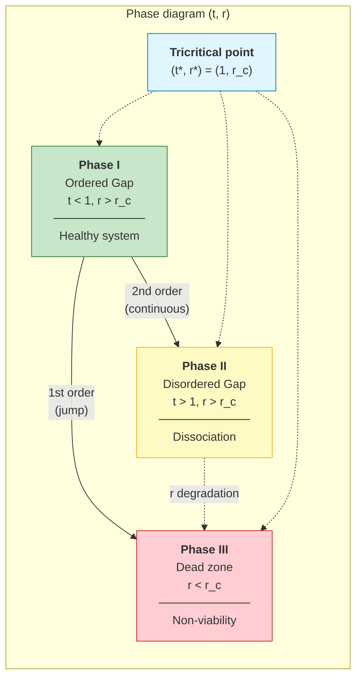
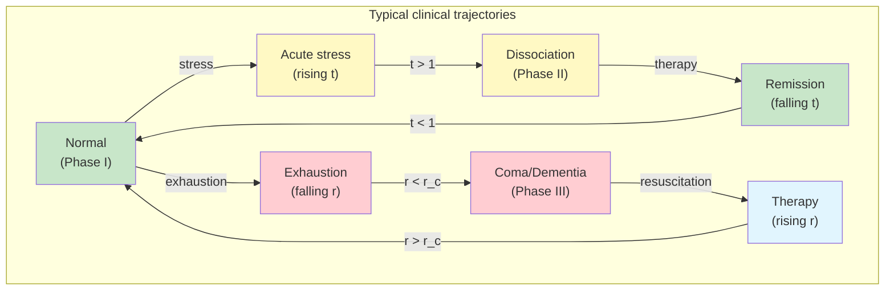

# Phase Diagram: Cybernetic Interpretation

:::info For whom this chapter is intended
The phase diagram of consciousness — a map of all possible operating regimes of the holon. The reader will learn about phase transitions and their clinical significance.
:::

---

### Bridge from the Previous Chapter

In the [previous chapter](./topological-protection) we showed that holon coherence is protected by five independent mechanisms — from the Hamming code to topological charges. This multilayered protection explains *why* consciousness is robust. But robustness is not absolute: under sufficiently strong stress (rising $t$) or resource depletion (falling $r$) the system can transition to a qualitatively different state. What states are possible? How do transitions between them occur? And what do they mean clinically?

The answers are contained in the **phase diagram** — a map of all possible operating regimes, which we will now unfold in full detail.

---

### Chapter Roadmap

In this chapter we:

1. **Introduce the analogy** with the water phase diagram and show why two parameters $(t, r)$ suffice for a complete description (sections "State map" and "Two parameters").
2. **Define the control parameters** $t = T_{\text{eff}}/T_c$ and $r = \kappa/\Gamma_2$ with cybernetic interpretation (section 1).
3. **Describe the three phases in detail**: ordered Gap (Phase I, normal), disordered Gap (Phase II, dissociation), dead zone (Phase III, coma) — with diagnostic markers and phenomenology (section 2).
4. **Analyse the phase transitions**: smooth second-order (order → chaos), sharp first-order (life → death), silent extinction (chronic dementia), and the tricritical point (section 3).
5. **Compile a clinical mapping**: table of phases and states, expanded classification, typical trajectories, diagnostic protocol, and therapeutic strategies (section 4).
6. **Link the phases to the stress tensor** $\sigma_{\mathrm{sys}}$ — component-wise diagnostics (section 5).
7. **Draw analogies with physics** of condensed matter: QCD, superconductors, Ising ferromagnet, liquid crystals (section "Analogies").

---

:::note On notation
In this document:
- $\Gamma$ — [coherence matrix](/docs/core/dynamics/coherence-matrix)
- $t = T_{\text{eff}}/T_c$ — dimensionless [effective temperature](/docs/core/dynamics/gap-thermodynamics#эффективная-температура)
- $r = \kappa/\Gamma_2$ — ratio of regeneration to dissipation
- $\Gamma_2$ — decoherence rate (structural, $= 2\gamma/3$ from [Fano channel](/docs/proofs/gap/fano-channel#теорема-фано-канал))
- $\kappa$ — regeneration rate: $\kappa = \kappa_{\text{bootstrap}} + \kappa_0 \cdot \mathrm{Coh}_E$
- $P$ — [purity](/docs/core/dynamics/viability#определение-чистоты): $P = \mathrm{Tr}(\Gamma^2)$
- $P_{\text{crit}} = 2/7$ — [critical purity](/docs/proofs/dynamics/theorem-purity-critical)
- $\sigma_{\mathrm{sys}}$ — [stress tensor](./definitions#тензор-напряжений)
:::

This document provides the **cybernetic interpretation** of the [Gap phase diagram](/docs/core/dynamics/gap-phase-diagram), translating the mathematical results into the language of systems diagnostics and clinical states.

---

## Map of States of Consciousness {#карта-состояний}

Imagine a weather map: one axis shows temperature, the other shows pressure, and you can see where it rains, where it snows, where it is clear. The phase diagram of consciousness is organised in exactly the same way, except that instead of meteorological parameters there are two numbers characterising the internal state of the holon.

Each of us is at a specific "point" on this map at every moment. A healthy waking person — in one region. A person delirious from high fever — in another. A patient in deep coma — in a third. And, remarkably, the transitions between these regions obey the same mathematical laws as the transitions between phases of matter in physics.

### Analogy with the Water Phase Diagram

Every schoolchild knows: water can be ice, liquid, or steam. What determines which phase it is in? Two parameters — **temperature** and **pressure**. Draw coordinate axes, plot $T$ and $P$ on them — and you get the famous water phase diagram with three regions separated by phase transition curves. At one special point — the triple point — all three phases coexist.

The phase diagram of consciousness is organised on the same principle:

| Water | Consciousness |
|-------|---------------|
| Temperature $T$ | Chaos parameter $t$ |
| Pressure $P$ | Regeneration reserve $r$ |
| **Ice** (ordered crystalline lattice) | **Phase I** — clear, structured consciousness |
| **Liquid** (mobile but connected) | **Phase II** — consciousness without structure (delirium, dissociation) |
| **Vacuum** (molecules have dispersed) | **Phase III** — unconscious state (coma, dementia) |
| Triple point | Tricritical point $(t^*, r^*)$ |

But there are also important differences. In the case of water, both the ice–liquid and liquid–vapour transitions are first-order (with latent heat). In the case of consciousness, the I↔II transition is **second-order** (smooth, without a jump), while the I↔III transition is **first-order** (sharp, catastrophic). This distinction has deep clinical significance: loss of clarity of thought during fever occurs gradually, while loss of consciousness upon critical resource depletion occurs instantly.

---

## Two Parameters, Three Phases {#два-параметра}

Before diving into the mathematics, let us remember the main point: **everything is determined by two numbers**. From them the complete map of possible states is assembled.

### What $t$ is: the "chaos thermometer"

The parameter $t$ shows how chaotic the internal dynamics of the system is. When $t$ is small — consciousness works in an ordered way, like a well-tuned orchestra. When $t$ is large — each instrument plays its own part, and the music turns into cacophony.

Physically, $t$ is the ratio of the dissipation rate (chaotisation) to the system's ability to maintain order. The more "noise" relative to "signal", the higher $t$.

### What $r$ is: the "vital reserves"

The parameter $r$ shows whether the system has sufficient resources for self-maintenance. This is the ratio of the coherence regeneration rate to the rate of their decay. If $r$ is large — the system quickly restores damaged connections. If $r$ falls below the critical $r_c$ — decay wins, and coherence irreversibly perishes.

Metaphor: $t$ is the ambient temperature (hostility), and $r$ is the caloric intake (resources). A person at low temperature with good nutrition feels fine (Phase I). At high temperature but with food — survives, though suffering (Phase II). But without food — perishes at any temperature (Phase III).

### Why exactly three phases, and not two or five?

This is not an arbitrary choice — three phases follow from the mathematical structure of the problem. The Landau–Ginzburg potential for the order parameter $\sigma^2_{\text{Gap}}$ has the form:

Full potential and coefficients: [Gap phase diagram](/docs/core/dynamics/gap-phase-diagram).

With different signs of the coefficients, exactly three qualitatively distinct regimes arise: a minimum at $\sigma^2 > 0$ (Phase I), a minimum at $\sigma^2 = 0$ with finite Gap (Phase II), and degeneracy with $\mathcal{G}_{\text{total}} = 0$ (Phase III). Three is inevitable — this is a topological property of the "swallowtail" catastrophe (Whitney $A_4$ catastrophe).

---

## 1. Control Parameters in the Cybernetic Context {#параметры}

Two dimensionless parameters fully determine the stationary state of the system:

### 1.1 Parameter $t$: "temperature of chaos"

$$
t := \frac{T_{\text{eff}}}{T_c} = \frac{\Gamma_2}{\kappa_0} \cdot \frac{k_B T_{\text{phys}} \ln 21}{\mu^2}
$$

| $t$ | Physical meaning | Cybernetic interpretation |
|-----|------------------|--------------------------|
| $t \ll 1$ | Low effective temperature | System is well ordered, noise suppressed |
| $t \approx 1$ | Critical temperature | Stability boundary, high sensitivity |
| $t \gg 1$ | High effective temperature | Chaos dominates, structure destroyed |

Intuition: at $t \ll 1$ the system behaves like a crystal — rigid, stable, predictable. Each Gap channel has a definite value, and perturbations decay quickly. At $t \approx 1$ the system is like water near its boiling point — the slightest perturbation can cause a qualitative change. At $t \gg 1$ — complete chaos, like superheated gas.

### 1.2 Parameter $r$: "vital reserves"

$$
r := \frac{\kappa}{\Gamma_2} = \frac{\kappa_{\text{bootstrap}} + \kappa_0 \cdot \mathrm{Coh}_E}{\Gamma_2}
$$

| $r$ | Physical meaning | Cybernetic interpretation |
|-----|------------------|--------------------------|
| $r \gg r_c$ | Regeneration dominates | Large safety margin, adaptive system |
| $r \approx r_c$ | Balance | Minimally viable system |
| $r < r_c$ | Dissipation dominates | Non-viable system, degradation |

Critical value:

$$
r_c = \frac{P_{\text{crit}}}{7P} \approx \frac{2}{49P}
$$

:::info Connection of $r$ with E-coherence [T]
Since $\kappa = \kappa_{\text{bootstrap}} + \kappa_0 \cdot \mathrm{Coh}_E$, the parameter $r$ **monotonically depends** on [E-coherence](./definitions#e-когерентность). Increasing $\mathrm{Coh}_E$ directly increases $r$ and moves the system farther from the dead zone.
:::

Note the critically important asymmetry of the two parameters: $t$ can be changed in both directions (heating and cooling), but $r$ tends only to fall unless the system makes active self-restoration efforts. This is precisely why the main clinical danger is not the growth of chaos ($t$) but resource depletion ($r$).

---

## 2. Three Phases: Cybernetic Analysis {#три-фазы}

### 2.1 Visualisation of the Phase Diagram

```mermaid
graph LR
    subgraph "Phase diagram (t, r)"
        direction TB
        P1["<b>Phase I</b><br/>Ordered Gap<br/>t < 1, r > r_c<br/>───────────<br/>Healthy system"]
        P2["<b>Phase II</b><br/>Disordered Gap<br/>t > 1, r > r_c<br/>───────────<br/>Dissociation"]
        P3["<b>Phase III</b><br/>Dead zone<br/>r < r_c<br/>───────────<br/>Non-viability"]
        TC["<b>Tricritical point</b><br/>(t*, r*) = (1, r_c)"]

        P1 -->|"2nd order<br/>(continuous)"| P2
        P1 -->|"1st order<br/>(jump)"| P3
        P2 -.->|"r degradation"| P3
        TC -.-> P1
        TC -.-> P2
        TC -.-> P3
    end

    style P1 fill:#c8e6c9,stroke:#2e7d32
    style P2 fill:#fff9c4,stroke:#f9a825
    style P3 fill:#ffcdd2,stroke:#c62828
    style TC fill:#e1f5fe,stroke:#0277bd
```

### 2.2 Phase I: Ordered Gap (normal) [T]

:::tip Phase I characteristics
**Condition:** $t < 1$ and $r > r_c$

- Gap profile is **structured**: several channels with high Gap, the rest transparent
- $G_2$-symmetry spontaneously broken: $G_2 \to H_{\hat{\mathcal{G}}_*}$
- Order parameter: $\sigma^2_{\text{Gap}} > 0$ (anisotropy of Gap profile)
- Opacity rank: $\mathrm{rank}(\hat{\mathcal{G}}) \in \{1, 2, 3\}$
:::

**Cybernetic interpretation:**

| Property | Description |
|----------|-------------|
| Selective opacity | The system "knows" which channels are opaque and "chooses" a structured Gap profile |
| Goldstone modes | Slow Gap oscillations between pairs — [ultra-slow fluctuations](./goldstone-modes) |
| Topological protection | At rank 3 the opacity pattern is [topologically protected](./topological-protection#топологическая) |
| Adaptability | The system can redistribute Gap in response to external perturbations |

**What the system experiences in Phase I.** This is the state of "clear consciousness". The key word is *selectivity*. A healthy brain does not try to be conscious of everything simultaneously. It chooses what to make transparent (accessible to consciousness) and what to make opaque (automatic, non-conscious). This selectivity is precisely the spontaneous breaking of $G_2$-symmetry.

Imagine an office with frosted glass: some offices have clear glass (you can see what is happening), others have frosted glass (processes are running but you cannot see them). A healthy organisation *chooses* which glass is transparent — and this choice is structured.

**Goldstone modes** in this analogy are the slow "refocusing of attention": which offices are transparent gradually changes, but the total number of transparent and frosted remains stable. This manifests as ultra-slow oscillations ($\sim 0.01{-}0.1$ Hz) in neurophysiological data.

**Diagnostic markers:**
- $\sigma^2_{\text{Gap}} > 0$: Gap non-uniformity — a sign of healthy differentiation
- $\|\sigma_{\mathrm{sys}}\|_\infty < 1$: all components of the [stress tensor](./definitions#тензор-напряжений) within norm
- $P > P_{\text{crit}}$: purity above the critical value

### 2.3 Phase II: Disordered Gap (dissociation) [T]

:::warning Phase II characteristics
**Condition:** $t > 1$ and $r > r_c$

- Gap is distributed **uniformly** across all channels
- $G_2$-symmetry **approximately** preserved (no spontaneous breaking)
- Order parameter: $\sigma^2_{\text{Gap}} \to 0$ (isotropy)
- $\mathcal{G}_{\text{total}} > 0$, but no structure
:::

**Cybernetic interpretation:**

| Property | Description |
|----------|-------------|
| Uniform opacity | All channels equally opaque — no selectivity |
| Loss of differentiation | The system does not distinguish "important" and "unimportant" boundaries |
| High Gap entropy | $S_{\text{Gap}} \to S_{\max}$ — maximal disorder in opacity distribution |
| Resource preservation | $r > r_c$ — regeneration is active, but purposeless |

**What the system experiences in Phase II.** Back to the office analogy: now *all* glass is equally frosted. You cannot see anything clearly, but you are not completely blind either — light seeps through every pane equally dimly. This is the state of "clouded consciousness" — delirium, dissociation, depersonalisation.

Crucially: **the system is alive** (resources available, $r > r_c$), but **has lost structure**. This distinguishes Phase II from Phase III: a person in febrile delirium is still alive and has resources for recovery — they simply need to "cool down".

Paradox of Phase II: purity $P > P_{\text{crit}}$ is formally maintained, but coherences are organised chaotically. The system spends resources maintaining connections that do not cohere into a meaningful pattern — like an engine running idle.

**Diagnostic markers:**
- $\sigma^2_{\text{Gap}} \approx 0$: uniform Gap — a sign of structural loss
- $P > P_{\text{crit}}$ (formally viable): purity maintained but without coherent organisation
- $\mathrm{Coh}_E$ reduced: though not below $\mathrm{Coh}_{\min}$, integration quality suffers

### 2.4 Phase III: Dead Zone [T]

:::danger Phase III characteristics
**Condition:** $r < r_c$ (at any $t$)

- Coherences decay: $|\gamma_{ij}| \to 0$ for all $i \neq j$
- $\mathcal{G}_{\text{total}} \to 0$: Gap undefined (no coherences to measure)
- System is **non-viable**: $P \to 1/7 < P_{\text{crit}}$
:::

**Cybernetic interpretation:**

| Property | Description |
|----------|-------------|
| Loss of connections | Inter-sector coherences die out — dimensions evolve independently |
| $\Phi \to 0$ | Integration measure vanishes — system is fragmented |
| $\kappa \to \kappa_{\text{bootstrap}}$ | Regeneration minimal, does not compensate dissipation |
| Irreversibility | Without external intervention the system cannot return to Phase I or II |

**What the system experiences in Phase III.** Nothing. This is not a metaphor — it is a mathematical result. When $\Phi \to 0$ and $P \to 1/7$, the integration measure vanishes, which, by the [No-Zombie theorem](./theorems#теорема-81-условная-необходимость-интериорности-no-zombie), means the absence of interiority. The seven dimensions of the holon exist, but evolve independently of each other, like seven scattered shards of a broken mirror.

In the office analogy: the glass is not merely frosted — *the walls are gone*. The offices have been blown away by the wind, and each employee sits in an open field, unaware of the others.

Mathematically this state is an **attractor**: the coherence matrix tends to $\rho_* = I/7$ (the maximally mixed state), which is the fixed point of Lindbladian dynamics ℒ₀. Without external intervention escape from this attractor is impossible.

**Diagnostic markers:**
- $P < P_{\text{crit}}$: purity below critical — unrecoverable decoherence
- $\Phi < \Phi_{\text{th}}$: integration below threshold — fragmentation
- $\|\sigma_{\mathrm{sys}}\|_\infty \geq 1$: at least one stress tensor component exceeds the norm

---

## 3. Phase Transitions: Smooth and Sharp {#переходы}

The boundaries between phases are not merely lines on a map. They are *processes*, and their character differs radically. The distinction between first- and second-order transitions is one of the most important achievements of 20th-century physics (Ehrenfest, Landau, Ginzburg), and it transfers fully to the dynamics of consciousness.

### What the order of a phase transition means

Imagine slowly changing one parameter (say $t$), moving along the phase diagram. Question: what happens at the moment of crossing the boundary?

- **Second-order transition (continuous):** The order parameter smoothly goes to zero. Like twilight: day gradually transitions to night, and it is impossible to identify the exact moment it became "dark". The system does not experience a jump; it smoothly "flows" from one state to another.

- **First-order transition (discontinuous):** The order parameter jumps to zero (or appears). Like a light switch: click — and darkness. The system jumps discontinuously to a qualitatively different state.

This distinction has enormous practical significance. A second-order transition can be anticipated (the system becomes "critical", precursors appear). A first-order transition happens suddenly — and is often irreversible.

### 3.1 Transition I $\leftrightarrow$ II: order → chaos

:::info Second-order transition (continuous) [T]
On the line $t = 1$ at $r > r_c$ the order parameter $\sigma^2_{\text{Gap}} \propto (1-t)^{2\beta}$ ($\beta = 1/2$, mean-field) continuously goes to zero. Full derivation: [Gap phase diagram](/docs/core/dynamics/gap-phase-diagram).
:::

**Clinical correspondence:** Gradual loss of clarity of thinking. "Melting" of structured opacity — healthy defence mechanisms become diffuse.

**What it looks like "from within".** Recall the feeling after a sleepless night or during high fever when thinking begins to "blur". First you can concentrate, though with difficulty ($t$ slightly below 1). Then the focus of attention blurs — you are still aware of thinking, but cannot hold a thought ($t \approx 1$). Finally, everything becomes uniformly murky — you are in Phase II ($t > 1$).

The critical exponent $\beta = 1/2$ is the **mean-field** result. It means the order parameter decays like a square root: $\sigma^2_{\text{Gap}} \sim \sqrt{1-t}$. Graphically — a curve with a vertical tangent at the critical point. Physically — the system "resists" destruction of order, and to completely eliminate the anisotropy one must bring $t$ exactly to 1.

**Precursors of the transition.** Near $t = 1$ the system shows characteristic signs of criticality:
- **Growth of fluctuations:** variance $\sigma^2_{\text{Gap}}$ increases (susceptibility $\chi \propto |1-t|^{-\gamma}$ diverges)
- **Critical slowing down:** relaxation time grows ($\tau_{\text{rel}} \propto |1-t|^{-\nu z}$), the system responds more slowly to perturbations
- **Long-range correlations:** adjacent Gap channels begin to fluctuate coherently

These precursors are potentially observable in neurophysiological data and may serve as early markers of an impending transition.

**Reversibility:** The transition is **reversible** — reducing $t$ (decreasing chaos) restores the structured Gap profile.

### 3.2 Transition I $\leftrightarrow$ III: life → death

:::danger First-order transition (discontinuous) [T]
On the line $r = r_c$ at $t < 1$:

$$
\mathcal{G}_{\text{total}} \text{ jumps} \to 0
$$

Total Gap and coherences disappear discontinuously. The system instantly loses all inter-sector connections.
:::

**Clinical correspondence:** Acute decompensation. Resource depletion ($r$ falls below $r_c$) leads to discontinuous collapse of coherence — analogous to sudden loss of consciousness.

**Why this transition is more dangerous.** In the second-order transition (I↔II) there are warning signs — the system "sags" gradually. In the first-order transition (I↔III) there may be no warnings: the system looks stable ($P > P_{\text{crit}}$, structure intact), but resources are quietly diminishing. And at some moment — a jump.

Physical analogy: superheated liquid. Water can remain liquid above 100°C if there are no nucleation sites. But tapping the glass — and the entire mass instantly boils. In the same way, a holon in Phase I with $r \approx r_c$ may appear stable, but the slightest additional perturbation triggers an avalanche collapse.

**Hysteresis.** The most important property of a first-order transition — **hysteresis**: to return from Phase III to Phase I it is not enough to restore $r$ to $r_c$. One must raise $r$ substantially *above* $r_c$ to "nucleate" coherences anew. This is analogous to supercooling: to melt ice, it is not enough to heat to 0°C — a slight overheating is needed.

Clinically this means: withdrawing a patient from a coma is harder than preventing entry into it. Resuscitation requires more resources than prevention.

**Reversibility:** The transition is **partially reversible** with rapid restoration of $r > r_c$ (external support). However, the system may end up in a different Gap profile (hysteresis).

### 3.3 Degradation II → III: silent extinction {#деградация-ii-iii}

Between Phases II and III there is no formal phase transition line — this is *continuous* degradation. At $t > 1$ the system is already in the disordered state, and if $r$ begins to fall, coherences die out without a dramatic jump.

Clinically this corresponds to **chronic dementia**: consciousness dims gradually, day by day, without an acute moment of "loss". This is precisely why dementia is so insidious — there is no point at which one can say "this is where it began".

Mathematically: at $t > 1$ the system has already lost anisotropy ($\sigma^2_{\text{Gap}} = 0$), so further falling of $r$ below $r_c$ does not cause a *qualitative* change — the amount of coherence simply tends smoothly to zero.

---

## Tricritical Point: Where All Phases Meet {#трикритическая-точка}

### 3.4 Tricritical Point

:::tip Tricritical point $(t^*, r^*) = (1, r_c)$ [T]
At the tricritical point all three phases converge. Critical exponents differ from the I $\leftrightarrow$ II line: $\beta = 1/4$ (instead of $1/2$), $\delta = 5$ (instead of $3$), $\alpha = 1/2$ (instead of log.). Full table: [Gap phase diagram](/docs/core/dynamics/gap-phase-diagram).
:::

**Clinical correspondence:** Borderline state — oscillation between ordered Gap (remission) and chaotic Gap (relapse), with a simultaneous threat of collapse into the dead zone.

### Why the tricritical point is special

At an ordinary point of the phase diagram the system "knows" which phase it is in. Near the I↔II transition line it oscillates between two phases. But at the tricritical point all **three** phases become equally accessible. The system experiences maximal uncertainty — it "does not know" where to go.

This is reflected in the changed critical exponents. Note: $\beta$ decreases from $1/2$ to $1/4$. This means the order parameter decays **more slowly** — the curve $\sigma^2(t)$ becomes more gradual. Physically: near the tricritical point even small "noise" ($\delta t$) causes a significant change in the order parameter. The system is **supersensitive**.

The exponent $\delta = 5$ (instead of 3) means the dependence of the "external field" on the order parameter along the critical isotherm becomes steeper — the system deviates much more strongly from equilibrium under small perturbations.

And $\alpha = 1/2$ (instead of a logarithmic singularity) means the specific heat *diverges* in a power-law manner. Cybernetially: the energy costs of maintaining stability near the tricritical point grow by a power law and formally go to infinity. The system cannot exist stably near this point — it inevitably "slides" into one of the three phases.

### Tricritical point and borderline personality disorder

The clinical picture of borderline personality disorder (BPD) corresponds strikingly accurately to the dynamics near the tricritical point:
- **Rapid switching** between clarity (Phase I) and chaos (Phase II)
- **Constant threat** of collapse into Phase III (suicidality as approach to $r_c$)
- **Hypersensitivity** to external influences ($\alpha = 1/2$)
- **Difficulty of therapy:** the system does not "want" to move away from the tricritical point, because all three phases are equally accessible

This is not a metaphor — it is a concrete prediction of UHM: patients with BPD should exhibit neurophysiological markers corresponding to the critical exponents of the tricritical point ($\beta = 1/4$), not those of the ordinary transition ($\beta = 1/2$).

---

## 4. Clinical Mapping {#клиника}

### 4.1 Table of Phases and Clinical States

| Phase | Clinical analogue | Characteristics | Markers |
|-------|-------------------|-----------------|---------|
| **I (ordered)** | Normal functioning | Selective opacities (healthy repression), transparency in other channels | $\sigma^2_{\text{Gap}} > 0$, $P > P_{\text{crit}}$, $\Phi > \Phi_{\text{th}}$ |
| **II (disordered)** | Dissociative disorder | All channels equally murky — diffuse depersonalisation | $\sigma^2_{\text{Gap}} \approx 0$, $P > P_{\text{crit}}$, $\Phi$ reduced |
| **III (dead)** | Dementia, coma | Loss of coherences, fragmentation | $P \to 1/7$, $\Phi \to 0$, $r < r_c$ |
| **I $\leftrightarrow$ II** | Psychotic episode | "Melting" of opacity structure | $t \approx 1$, oscillations of $\sigma^2_{\text{Gap}}$ |
| **I $\leftrightarrow$ III** | Acute decompensation | Discontinuous collapse upon exhaustion | $r \to r_c$, jump in $\mathcal{G}_{\text{total}}$ |
| **Tricritical** | Borderline disorder | Oscillation between order and chaos | $t \approx 1$, $r \approx r_c$ |

### 4.2 Extended Clinical Mapping {#клиническое-отображение}

The phase diagram enables systematic classification of known disorders of consciousness. Below is a detailed mapping:

#### Phase I: spectrum of normal

Even within Phase I there is diversity. The system may have different Gap profiles (rank 1, 2, or 3), each corresponding to a different "style" of consciousness:

| Gap rank | Description | Psychological analogue |
|----------|-------------|----------------------|
| 1 | One channel opaque, others transparent | Focused attention, "flow" state |
| 2 | Two channels opaque | Ordinary wakefulness, multitasking |
| 3 | Three channels opaque (topologically protected) | Deep meditation, "holding multiplicity" |

Transitions between ranks within Phase I are *not* phase transitions. They are smooth rearrangements corresponding to normal psychic dynamics (attention switching, mood change, falling asleep and waking within the normal range).

#### Phase II: spectrum of disorders

| Subtype | $t$ | $r$ | Clinical analogue |
|---------|-----|-----|--------------------|
| Mild ($t \approx 1.5$) | Moderately above 1 | Far from $r_c$ | Mild dissociation, déjà vu, "brain fog" |
| Pronounced ($t \approx 3$) | Significantly above 1 | Still far from $r_c$ | Pronounced depersonalisation, delirium |
| Critical ($t \gg 1$, $r \to r_c$) | Very high | Close to $r_c$ | Severe psychosis with threat of catastrophe |

#### Phase III: gradations of unconsciousness

| Subtype | $P$ | $\Phi$ | Clinical analogue |
|---------|-----|--------|-------------------|
| Shallow ($P \lesssim P_{\text{crit}}$) | Slightly below $2/7$ | Small but nonzero | Stupor, light coma (Glasgow 6–8) |
| Deep ($P \to 1/7$) | Near $1/7$ | Approaching 0 | Deep coma (Glasgow 3–5) |
| Terminal ($P = 1/7$) | Exactly $1/7$ | Zero | Brain death |

### 4.3 Trajectories in Phase Space

```mermaid
graph TD
    subgraph "Typical clinical trajectories"
        N["Normal<br/>(Phase I)"]
        S["Acute stress<br/>(rising t)"]
        D["Dissociation<br/>(Phase II)"]
        R["Remission<br/>(falling t)"]
        E["Exhaustion<br/>(falling r)"]
        C["Coma/Dementia<br/>(Phase III)"]
        T["Therapy<br/>(rising r)"]

        N -->|"stress"| S
        S -->|"t > 1"| D
        D -->|"therapy"| R
        R -->|"t < 1"| N
        N -->|"exhaustion"| E
        E -->|"r < r_c"| C
        C -->|"resuscitation"| T
        T -->|"r > r_c"| N
    end

    style N fill:#c8e6c9
    style D fill:#fff9c4
    style C fill:#ffcdd2
    style S fill:#fff9c4
    style R fill:#c8e6c9
    style E fill:#ffcdd2
    style T fill:#e1f5fe
```

### 4.4 Diagnostic Protocol

:::info Phase identification protocol [I]
1. **Measure $P$** (purity): EEG coherence or PCI
2. **Estimate $\sigma^2_{\text{Gap}}$** (anisotropy): dispersion of correlations between 7 sectors
3. **Compute $r$**: ratio of recovery rate to degradation rate
4. **Identify phase:**
   - $P > P_{\text{crit}}$ and $\sigma^2_{\text{Gap}} > 0$ $\Rightarrow$ **Phase I**
   - $P > P_{\text{crit}}$ and $\sigma^2_{\text{Gap}} \approx 0$ $\Rightarrow$ **Phase II**
   - $P < P_{\text{crit}}$ or $r < r_c$ $\Rightarrow$ **Phase III**
:::

### 4.5 Therapeutic Strategies by Phase

| Phase | Therapeutic goal | Strategy |
|-------|-----------------|----------|
| **I (normal)** | Prevention | Monitoring $t$ and $r$; maintaining $\mathrm{Coh}_E$ |
| **I → II** | Preventing transition | Reducing $t$ (decreasing chaos); structuring Gap profile |
| **II** | Restoring structure | Reducing $t$ below 1; targeted work with specific Gap channels |
| **II → III** | Preventing transition | Increasing $r$ (resource support); raising $\mathrm{Coh}_E$ |
| **III** | Resuscitation | External increase of $\kappa$ (medication, stimulation); achieving $r > r_c$ |

---

## Phase Control: How to Move the System from One Phase to Another {#управление-фазами}

The phase diagram is not only a diagnostic tool but also a navigation map for therapeutic intervention. Knowing *where* the system is and *where* it needs to go determines the treatment strategy.

### The Principle of Two Levers

The therapist has exactly two "levers":

1. **Reducing $t$** (decreasing chaos): stabilising interventions — medication (antipsychotics, anxiolytics), reducing external stimulation, structuring the environment, meditation.

2. **Raising $r$** (increasing resources): resource interventions — nutrients, sleep, social support, raising $\mathrm{Coh}_E$ through psychotherapy.

### Strategies for Each Transition

#### Transition II → I: "crystallisation of order"

Goal: reduce $t$ below 1 so the system spontaneously chooses a structured Gap profile.

Mechanism: at $t < 1$ the potential $V(\sigma^2)$ acquires a minimum at $\sigma^2 > 0$ — the system *itself* tends toward anisotropy. The therapist does not need to "construct" the correct Gap profile — it is sufficient to create conditions under which the system will choose it on its own.

In practice: this explains why in febrile delirium (high $t$) it is sufficient to reduce the temperature — and clarity of thinking is restored on its own, without needing to "fix" each cognitive process separately. The second-order phase transition guarantees automatic structural restoration.

#### Transition III → I: "resuscitation"

Goal: raise $r$ above $r_c$ and simultaneously ensure $t < 1$.

Difficulties:
- **Hysteresis**: one needs $r \gg r_c$, not merely $r > r_c$
- **Choice of Gap profile**: the system may "land" in the wrong attractor — restored consciousness may differ from the original
- **Time window**: the longer the system is in Phase III, the more resources are needed for return (degradation of $\kappa_{\text{bootstrap}}$)

This explains clinical experience: a quickly resuscitated patient recovers better than one who spent a long time in a coma. Every minute in Phase III further reduces $\kappa_{\text{bootstrap}}$, increasing the threshold $r$ for return.

#### Staying in Phase I: "homeostatic loop"

A healthy system does not merely "reside" in Phase I — it **actively maintains** its position through negative feedback:

$$
\delta t \uparrow \;\Rightarrow\; \sigma^2_{\text{Gap}} \downarrow \;\Rightarrow\; \kappa \text{ redistributed} \;\Rightarrow\; t_{\text{eff}} \downarrow
$$

This homeostatic loop works through E-coherence: recognising a problem (rising $\mathrm{Coh}_E$) increases $\kappa$, which reduces the effective temperature. This is the formal description of what psychology calls "reflective self-regulation".

---

## 5. Connection with the Stress Tensor {#тензор-напряжений}

The position of the system on the phase diagram is reflected in the [stress tensor](./definitions#тензор-напряжений):

| Phase | $\|\sigma_{\mathrm{sys}}\|_\infty$ | Components |
|-------|-------------------------------------|------------|
| I | $< 1$ | All $\sigma_i < 1$; $\sigma_E$ may be elevated (healthy reflexivity) |
| II | $< 1$ (formally) | All $\sigma_i$ uniformly elevated; $\sigma_U$ → 1 (loss of unity) |
| III | $\geq 1$ | At least one $\sigma_i \geq 1$ (overload of a specific dimension) |

:::tip Connection to Theorem 10.1 [T]
By the [equivalence of conditions theorem](./theorems#теорема-101-эквивалентность-условий):

$$
\Gamma \in \mathcal{V} \Leftrightarrow \|\sigma_{\mathrm{sys}}(\Gamma)\|_\infty < 1 \Leftrightarrow P > P_{\text{crit}}
$$

Transition to Phase III ($P < P_{\text{crit}}$) is equivalent to $\|\sigma_{\mathrm{sys}}\|_\infty \geq 1$.
:::

The stress tensor provides *component-wise* information about why the system is in a given phase. While $(t, r)$ give the global position on the map, $\sigma_{\mathrm{sys}}$ shows *which specific* dimensions are under threat:

- **$\sigma_A \to 1$**: overload of the sensory dimension (Affect) — sensory overload, emotional "flooding"
- **$\sigma_D \to 1$**: overload of the cognitive dimension (Distinction) — "analysis paralysis", inability to make a decision
- **$\sigma_U \to 1$**: loss of unity (Unity) — dissociation, depersonalisation
- **$\sigma_E \to 1$**: overload of reflexivity (Evaluation) — rumination, "thinking about thinking about thinking"

This component-wise diagnostics allows not only determining the phase, but *predicting* through which channel the transition will occur — and directing the therapeutic intervention at the specific component.

---

## Analogies with Condensed Matter Physics {#аналогии-физика}

The phase diagram of consciousness is not merely a metaphor. The mathematical structure of phase transitions in UHM is *isomorphic* to well-studied transitions in physics. This gives two advantages: (1) a powerful intuitive tool and (2) borrowing of the mathematical apparatus.

### QCD Phase Diagram

Quantum chromodynamics (QCD) — the theory of the strong interaction — has a phase diagram with a striking resemblance:

| QCD | Consciousness (UHM) |
|-----|---------------------|
| Temperature $T$ | Chaos parameter $t$ |
| Baryon chemical potential $\mu_B$ | Regeneration parameter $r$ |
| **Hadronic phase** (quarks confined inside hadrons) | **Phase I** (coherences "confined" in structured Gap profiles) |
| **Quark-gluon plasma** (quarks free but hot) | **Phase II** (coherences present but not organised) |
| **Colour superconductivity** (high $\mu_B$, low $T$) | No analogue (UHM has no fermionic condensates) |
| **Crossover** at $\mu_B = 0$ | I↔II transition at $r \gg r_c$ |
| **Critical endpoint** | Tricritical point $(t^*, r^*)$ |

Particularly noteworthy is the analogy: in QCD at zero $\mu_B$ the hadrons↔plasma transition is a crossover (not a genuine phase transition), while at finite $\mu_B$ a critical endpoint appears where the crossover becomes a first-order transition. In the same way in UHM, at $r \gg r_c$ the I↔II transition is smooth (second-order), but at $r = r_c$ the character changes (tricritical point).

### Superconductors and Superfluidity

In superconductors spontaneous breaking of $U(1)$-symmetry creates a Cooper condensate — a macroscopic quantum state with zero resistance. Analogously, in Phase I spontaneous breaking of $G_2$-symmetry creates a structured Gap profile — a "coherence condensate" that provides "superfluidity" of information flows between sectors.

Goldstone modes in both cases play the same role: slow, massless excitations associated with the broken continuous symmetry. In a superconductor these are phase oscillations of the order parameter. In consciousness — ultra-slow oscillations of the Gap profile (see [Goldstone modes](./goldstone-modes)).

### Ising Ferromagnet

The simplest analogy — and perhaps the most instructive:

| Ising ferromagnet | Consciousness (UHM) |
|-------------------|---------------------|
| Spin up/down | Gap channel open/closed |
| Magnetisation $M$ | Gap anisotropy $\sigma^2_{\text{Gap}}$ |
| $T < T_c$: ferromagnetic phase (spins aligned) | Phase I: structured Gap |
| $T > T_c$: paramagnetic phase (spins disordered) | Phase II: uniform Gap |
| Critical exponent $\beta = 1/2$ (mean field) | $\beta = 1/2$ (mean field) |

The coincidence of critical exponents is not accidental: in both cases — Landau mean-field theory with a single scalar order parameter. This means the UHM transition I↔II belongs to the same **universality class** as the mean-field transition in the ferromagnet. Beyond mean field (accounting for fluctuations) the exponents will change, but the qualitative picture remains the same.

### Liquid Crystals

Perhaps the most precise physical analogy — liquid crystals. They have:
- **Crystalline phase** (full order) — analogue of deep Phase I
- **Nematic phase** (orientational order without positional order) — analogue of shallow Phase I
- **Isotropic liquid** (complete disorder) — analogue of Phase II

The nematic↔isotropic liquid transition is first-order (weakly), which corresponds to the fact that in UHM at $r \approx r_c$ the I↔II transition changes character from second- to first-order. The liquid-crystal analogy also explains why different Gap profiles (different ranks) are possible in Phase I — just as liquid crystals admit various mesophases (nematic, smectic, cholesteric).

---

## 6. Status Summary {#статусы}

| Result | Status |
|--------|--------|
| Three Gap phases in the $(t, r)$ plane | [T] |
| Transition I $\leftrightarrow$ II: 2nd order, $\beta = 1/2$ | [T] |
| Transition I $\leftrightarrow$ III: 1st order, jump in $\mathcal{G}_{\text{total}}$ | [T] |
| Tricritical point $(t^*, r^*) = (1, r_c)$ | [T] |
| Critical exponents (Landau, mean-field) | [T] |
| Correspondence of phases to clinical states | [I] |
| Therapeutic strategies by phase | [I] |
| Diagnostic protocol | [I] |

---

## What We Learned {#что-мы-узнали}

A summary of the key results:

- **Two parameters — $(t, r)$ — fully determine the phase** of a conscious system. Parameter $t = T_{\text{eff}}/T_c$ — the "chaos thermometer", $r = \kappa/\Gamma_2$ — the "vital reserves".
- **Three phases** arise inevitably from the structure of the Landau–Ginzburg potential: Phase I (ordered Gap, clear consciousness), Phase II (disordered Gap, dissociation), Phase III (dead zone, $r < r_c$).
- **Transition I $\leftrightarrow$ II** — second-order (smooth, $\beta = 1/2$): gradual loss of clarity, reversible. **Transition I $\leftrightarrow$ III** — first-order (discontinuous, with hysteresis): sudden loss of consciousness, partially reversible with rapid resuscitation.
- **Tricritical point** $(t^*, r^*) = (1, r_c)$ — the point of maximum instability, corresponding to the clinical picture of borderline personality disorder ($\beta = 1/4$, $\delta = 5$).
- **Stress tensor** $\sigma_{\mathrm{sys}}$ provides component-wise diagnostics: which specific dimension is overloaded, predicting the channel of transition.
- **Therapeutic strategies** follow unambiguously from the phase diagram: reducing $t$ (stabilisation) or raising $r$ (resource support), depending on the current phase.
- **Analogies with physics** (QCD, ferromagnet, liquid crystals) are not metaphors but mathematical isomorphisms: the same Landau universality class, the same critical exponents.

---

### Bridge to the Next Chapter

The phase diagram showed that in Phase I the $G_2$-symmetry is *spontaneously broken*: the system has chosen a specific Gap profile from an ocean of equally available possibilities. But this breaking has an inevitable consequence, as obligatory as the law of charge conservation: along the "forgotten" symmetry directions there arise *massless* (or nearly massless) oscillations — **Goldstone modes**.

In the [next chapter](./goldstone-modes) we will show that these modes — the music of broken symmetry — describe ultra-slow oscillations of the Gap profile, coinciding with infra-slow neuronal fluctuations (ISF) observed in fMRI. This is one of the most concrete and falsifiable predictions of the theory.

---

## Related Documents

- [Gap phase diagram](/docs/core/dynamics/gap-phase-diagram) — mathematical foundation: three phases, critical exponents, Whitney catastrophes
- [Gap thermodynamics](/docs/core/dynamics/gap-thermodynamics) — $T_{\text{eff}}$, $V_{\text{Gap}}$, Lagrangian
- [Gap dynamics](/docs/core/dynamics/gap-dynamics) — bifurcations, non-Markovian effects
- [Viability](/docs/core/dynamics/viability) — measure $P$ and $P_{\text{crit}} = 2/7$
- [CC definitions](./definitions) — stress tensor, $\mathrm{Coh}_E$, measures
- [CC theorems](./theorems) — No-Zombie, equivalence of conditions
- [CC predictions](./predictions) — falsifiable predictions
- [Topological protection of coherence](./topological-protection) — Gap protection mechanisms
- [Goldstone modes](./goldstone-modes) — slow oscillations in Phase I
- [Interiority hierarchy](/docs/proofs/consciousness/interiority-hierarchy) — levels L0–L4
- [Measurement methodology](./measurement) — how to identify phases experimentally
- [Comparison with alternatives](./comparison) — phase diagram vs. other theories
