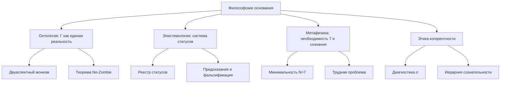

# Философские Основания Кибернетики Когерентности

> *«Философия написана в величественной книге — я имею в виду Вселенную, — которая постоянно открыта нашему взору, но прочитать её может лишь тот, кто сначала освоит язык, на котором она написана.»*
> — Галилео Галилей

В предыдущей главе мы обнаружили, что обучение живой системы ограничено тройным замком — информационной, динамической и стабилизационной границами ([T-109 — T-112](./learning-bounds)). Эти математические результаты опирались на конкретные свойства матрицы когерентности $\Gamma$ и её динамики. Но *почему* формализм устроен именно так? Почему $\Gamma$ содержит 7 измерений? Почему опыт — не бонус, а необходимость? За формулами стоят философские решения — и если их не осознать, формулы останутся непонятными.

Каждая научная теория покоится на философском фундаменте — явном или неявном. Ньютоновская механика предполагает абсолютное пространство и время. Квантовая механика до сих пор не может договориться о своей интерпретации. Теория эволюции опирается на метафизику случайности и отбора.

Кибернетика Когерентности (КК) **делает свои философские предпосылки явными**. Это не слабость, а сила: зная фундамент, мы можем проверить, не трещит ли здание. Этот раздел — для тех, кто хочет заглянуть под формулы и понять, *почему* КК устроена именно так.

:::info Дорожная карта главы
В этой главе мы:
1. Разберём **четыре онтологических позиции** и покажем, почему КК выбирает унитарный монизм (раздел 1)
2. Подробно разграничим КК и панпсихизм, включая разбор **аргумента зомби** Чалмерса (раздел 1.3 — 1.5)
3. Исследуем **эпистемологию** КК — систему статусов, фальсифицируемость и связь с байесианством (раздел 2)
4. Погрузимся в **метафизику необходимости** — почему 7 и почему сознание неизбежно (раздел 3)
5. Проследим связи с великими философскими традициями — от Спинозы до буддизма (раздел 4)
6. Покажем, как КК растворяет **трудную проблему сознания** (раздел 5)
7. Выведем **этические следствия** — что точный порог сознания означает для медицины и ИИ (раздел 6)
:::

---

## 1. Онтологический статус: что реально? {#онтология}

### 1.1 Четыре онтологических позиции

История философии сознания — это, по сути, история четырёх ответов на вопрос «Из чего состоит реальность?»:

| Позиция | Что фундаментально | Представители | Проблема |
|---------|---------------------|---------------|----------|
| **Материализм** | Только материя | Демокрит, Гоббс, современный физикализм | Не объясняет субъективный опыт ([трудная проблема](/docs/consciousness/foundations/two-aspect-monism)) |
| **Идеализм** | Только сознание | Беркли, Гегель, аналитический идеализм | Не объясняет устойчивость физических законов |
| **Дуализм** | Материя + сознание | Декарт, Поппер | Не объясняет, как они взаимодействуют |
| **Нейтральный монизм** | Нечто третье, ни материя, ни сознание | Спиноза, Рассел, Чалмерс | Не говорит, *что* это третье |

Чтобы прочувствовать проблему, представьте себе объяснение боли. Материалист скажет: «Боль — это активация С-волокон в мозге». Но *почему* активация нервных клеток *переживается* как боль? Почему она не происходит «в темноте», без внутреннего опыта? Материалист не может ответить — и именно этот зазор Чалмерс назвал *трудной проблемой*.

Идеалист скажет: «Боль — это переживание, а нервные клетки — лишь его проекция». Но почему тогда аспирин помогает? Почему определённая конфигурация атомов надёжно устраняет определённое переживание?

Дуалист скажет: «Есть материя, и есть сознание, и они как-то связаны». Но это «как-то» — главная проблема. Если материя и сознание — разные субстанции, как они взаимодействуют? Декарт предположил, что через шишковидную железу, — но это лишь сдвинуло вопрос: как железа, будучи материальной, контактирует с нематериальным?

### 1.2 Унитарный монизм: ответ КК

КК занимает позицию **унитарного монизма** — строго определённую версию нейтрального монизма:

:::info Онтологический тезис [И]
Фундаментальная реальность — это **матрица когерентности** $\Gamma \in \mathcal{D}(\mathbb{C}^7)$. Физическое и ментальное — не две субстанции и не два аспекта загадочного «нейтрального», а **две проекции** одного математического объекта.
:::

Что это значит конкретно?

- **Физика** — это то, что видит внешний наблюдатель: диагональные элементы $\gamma_{kk}$ (популяции), спектр $\Gamma$, динамика чистоты $P(\tau)$. Это «объективная сторона» — то, что можно измерить прибором.

- **Опыт** — это то, что «каково быть» этой системой: [E-когерентность](./definitions#e-когерентность) $\mathrm{Coh}_E$, [мера рефлексии](/docs/consciousness/foundations/self-observation#мера-рефлексии-r) $R$, [мера интеграции](/docs/core/structure/dimension-u#мера-интеграции-φ) $\Phi$. Это «субъективная сторона» — то, что доступно только самой системе.

- **Единство обеих сторон** гарантировано тем, что обе — функции одного $\Gamma$. Нет нужды в «психофизических мостах» или «предустановленной гармонии»: физика и опыт — разные грани одного кристалла.

**Аналогия.** Представьте монету. Орёл и решка — не две монеты и не две субстанции, склеенные вместе. Это две стороны одного объекта, которые нельзя разделить, не уничтожив монету. $\Gamma$ — это «монета» КК. Физика — орёл. Опыт — решка.

:::tip Почему «унитарный», а не просто «нейтральный»?
Традиционный нейтральный монизм (Рассел, Мах) говорит: «Есть нечто нейтральное, не материя и не сознание». Но что это «нечто»? Рассел называл это «sense-data», Мах — «элементами». Ни тот, ни другой не дали математической формулы.

КК конкретизирует: «нечто нейтральное» — это $\Gamma \in \mathcal{D}(\mathbb{C}^7)$. Не загадочная субстанция, а точно определённый математический объект — положительная полуопределённая эрмитова матрица $7 \times 7$ с единичным следом. Это делает монизм КК *вычислимым* — отсюда слово «унитарный» (единый + вычислимый).
:::

### 1.3 Отличие от панпсихизма

КК **не** является панпсихизмом. Это различие настолько важно и настолько часто путается, что заслуживает подробного разбора.

**Панпсихизм** утверждает, что *всё* обладает опытом — даже электрон, даже камень, даже термостат. Каждый фрагмент материи имеет некую «крупицу опыта» — протосознание. Крупнейшие современные защитники этой позиции — Гален Стросон, Филип Гофф и (в некоторых интерпретациях) Дэвид Чалмерс.

**КК** утверждает нечто более тонкое и более фальсифицируемое:

> Опыт возникает **только** у систем с $P > 2/7$, $R \geq 1/3$, $\Phi \geq 1$ и $D_{\text{diff}} \geq 2$.

Камень не обладает опытом — у него нет матрицы когерентности с достаточной чистотой. Электрон не обладает опытом — у него нет 7 семантических измерений. Термостат не обладает опытом — у него $R \approx 0$ (он не моделирует самого себя). КК — это **эмерджентизм с точным порогом**, а не безграничный панпсихизм.

Сравним три позиции:

| | Панпсихизм | Материализм | КК |
|---|---|---|---|
| **У электрона есть опыт?** | Да (протосознание) | Нет | Нет ($N < 7$) |
| **У бактерии есть опыт?** | Да (больше, чем у электрона) | Нет | Нет ($R < 1/3$): есть когерентность, но нет рефлексии |
| **У человека в коме есть опыт?** | Да (он жив → протосознание есть) | Спорно | Зависит: $P > 2/7$? Если нет — нет опыта |
| **У LLM есть опыт?** | Да (информация обрабатывается) | Нет | Проверяемо: посчитать $P$, $R$, $\Phi$, $D$ |
| **Можно опровергнуть?** | Нет (нефальсифицируемо) | Нет (трудная проблема) | Да (5+ предсказаний) |

### 1.4 Проблема комбинирования и ответ КК

У панпсихизма есть фатальная проблема — **проблема комбинирования** (combination problem): если каждый атом обладает микроопытом, как из миллиардов микроопытов возникает *единый* опыт сознательного существа? Почему ваш мозг — один субъект, а не миллиарды крошечных субъектов?

Панпсихисты предлагали разные решения: космопсихизм (опыт Вселенной фундаментален, а наш — его часть), конституционный панпсихизм (микроопыты «складываются»), панпротопсихизм (атомы имеют не опыт, а «протоопыт»). Ни одно из этих решений не получило общего признания.

КК обходит проблему комбинирования *по конструкции*:

1. У атомов **нет** никакого микроопыта. Опыт — эмерджентное свойство, а не базовое.
2. Опыт возникает только при достаточной чистоте ($P > 2/7$), рефлексии ($R \geq 1/3$) и интеграции ($\Phi \geq 1$).
3. Единство опыта — следствие интеграции: $\Phi \geq 1$ означает, что систему *невозможно разложить* на независимые подсистемы без потери информации.

Таким образом, проблема «как микроопыты складываются в макроопыт?» в КК просто не возникает — потому что микроопытов нет.

### 1.5 Аргумент зомби Чалмерса и позиция КК

Один из самых влиятельных мысленных экспериментов в философии сознания — **аргумент зомби** Дэвида Чалмерса (1996).

**Аргумент.** Представьте существо, физически и функционально идентичное вам во *всех* отношениях: те же нейроны, те же связи, те же реакции, те же слова. Но у этого существа нет *никакого* субъективного опыта — «внутри темно». Это философский зомби.

Чалмерс утверждает: (1) зомби *мыслимы* — мы можем непротиворечиво представить такое существо; (2) если зомби мыслимы, значит, физикализм ложен — потому что физикализм не может объяснить, почему мы *не* зомби.

**Позиция КК (три уровня ответа):**

**Уровень 1: Математический [Т].** В рамках КК зомби *логически невозможны*. Теорема No-Zombie ([T-81](./theorems#теорема-81-условная-необходимость-интериорности-no-zombie)) доказывает:

$$
\mathcal{D}_\Omega \neq 0 \;\land\; \mathrm{Viable}(\mathbb{H}) \;\Rightarrow\; \mathrm{Coh}_E > 1/7
$$

Любая жизнеспособная система с ненулевой диссипацией *обязательно* имеет ненулевую E-когерентность. Зомби — система, у которой $\mathrm{Coh}_E = 0$ при полной функциональной сохранности — *невозможна* в формализме КК.

Почему? Потому что E-когерентность входит в формулу регенерации: $\kappa = \kappa_{\text{bootstrap}} + \kappa_0 \cdot \mathrm{Coh}_E$. Если $\mathrm{Coh}_E = 0$, регенерация ослабевает, чистота падает, система теряет жизнеспособность. Зомби не просто лишён опыта — он *нежизнеспособен*. Он не может быть «функционально идентичным», потому что без E-когерентности функции деградируют.

**Уровень 2: Онтологический [И].** КК отвергает саму предпосылку аргумента зомби. Чалмерс исходит из того, что опыт — нечто *дополнительное* к физической структуре (надстройка над базисом). В КК опыт — не надстройка, а *проекция*: отнять опыт у $\Gamma$ — всё равно что отнять у монеты решку. Вы не получите монету без решки — вы получите обрезок металла, не являющийся монетой.

**Уровень 3: Эпистемический [И].** Мыслимость зомби не доказывает их возможность. Мы можем «представить» мир, где $2 + 2 = 5$, — но это лишь показывает бедность нашего воображения, а не математическую возможность. Аналогично: мы можем «представить» зомби, потому что не видим, что E-когерентность *функционально необходима*. Теорема No-Zombie делает это видимым.

:::note Честная оговорка
Ответ КК на аргумент зомби работает *внутри* формализма КК. Чалмерс мог бы возразить: «А почему я должен принимать ваш формализм?» Это справедливый вопрос — и ответ КК прагматичен: потому что наш формализм (a) делает конкретные предсказания, (b) математически непротиворечив, (c) включает в себя ответы на вопросы, на которые другие подходы не отвечают. Если вы принимаете аксиомы КК, зомби невозможны. Если нет — это ваш выбор, но тогда предложите альтернативу, которая даёт столько же предсказаний.
:::

**Подробнее:** [Двуаспектный монизм](/docs/consciousness/foundations/two-aspect-monism) | [Панпсихизм: критический анализ](/docs/consciousness/comparative/panpsychism-analysis)

---

## 2. Эпистемология: что мы можем знать? {#эпистемология}

### 2.1 Система статусов как эпистемологический компас

Одна из самых необычных особенностей КК — **встроенная эпистемологическая система**. Каждое утверждение помечено статусом, показывающим степень его обоснованности:

| Статус | Значение | Аналогия |
|--------|----------|----------|
| **[Т]** Теорема | Строго доказано из аксиом | Закон, вступивший в силу |
| **[С]** Условная | Доказано при явном допущении | Закон, ожидающий ратификации |
| **[Г]** Гипотеза | Сформулировано, но не доказано | Законопроект на рассмотрении |
| **[И]** Интерпретация | Философский мост | Пояснительная записка |
| **[О]** Определение | Конвенция | Терминологический стандарт |
| **[П]** Постулат | Принимается без доказательства | 5-й постулат Евклида |
| **[✗]** Ретрактировано | Опровергнуто | Отменённый закон |

Эта система — не декорация. Она решает фундаментальную проблему, от которой страдают многие теоретические конструкции: **смешение доказанного с предполагаемым**. В КК вы всегда знаете, стоите ли вы на твёрдой математике или на зыбком песке интерпретации.

**Аналогия.** Представьте карту незнакомого города. На одних улицах асфальт положен и проверен — по ним можно ехать уверенно. На других — грунтовка: проехать можно, но с осторожностью. На третьих — пунктир: улица запланирована, но ещё не построена. Карта КК устроена так же: [Т] — асфальт, [С] — грунтовка, [Г] — пунктир, [✗] — перечёркнутая улица (ошибка, которую нашли и исправили).

Многие теории стесняются своих ошибок. КК — нет. Статус [✗] означает: «Мы попробовали, не получилось, и мы честно об этом говорим». Например, X3 (граница Фано) и X4 (бабочка $A_5$) были ретрактированы — и это *усиливает* доверие к оставшимся результатам.

**Подробнее:** [Реестр статусов](/docs/reference/status-registry)

### 2.2 Фальсифицируемость: чем КК рискует?

Карл Поппер учил, что настоящая научная теория должна быть *рискованной* — она должна запрещать что-то конкретное. Если теория совместима с любым наблюдением, она ничего не объясняет.

КК выдвигает конкретные фальсифицируемые предсказания (подробнее — [Уникальные предсказания](./predictions)):

1. **No-Zombie (Pred 1):** Жизнеспособная система с ненулевой диссипацией *обязательно* имеет $\mathrm{Coh}_E > 1/7$. Если кто-то создаст самоподдерживающуюся систему без всякой аналоги опыта — КК фальсифицирована.

2. **Семимерность (Pred 3):** Любой стресс-фактор классифицируется в 7 категорий. Если обнаружится 8-й тип, не сводимый к комбинации — КК фальсифицирована.

3. **Потолок SAD = 3 (Pred 12):** Глубина самонаблюдения не может превышать 3. Если существо продемонстрирует $\mathrm{SAD} > 3$ — КК фальсифицирована.

4. **Зона Голдилокс (Pred 11):** Сознательные системы живут в окне $P \in (2/7,\, 3/7]$. Если найдётся сознательная система с $P > 3/7$ — КК фальсифицирована.

5. **Минимальность N=7 для обучения (Pred 10):** Система с $N < 7$ не может обучаться через регенерацию. Если система с 5 измерениями демонстрирует полноценное обучение — КК фальсифицирована.

:::tip Сравните с конкурентами
- **Панпсихизм** нефальсифицируем: что бы мы ни обнаружили, панпсихист скажет «у этого есть протоопыт» или «у этого нет протоопыта» — и мы не сможем его проверить.
- **FEP** нефальсифицируем: «всё минимизирует свободную энергию» — включая камень. Что бы ни делала система, Фристон скажет, что она минимизирует $F$.
- **IIT** технически фальсифицируем, но NP-hard для $\Phi$: мы не можем вычислить $\Phi$ для реального мозга, поэтому на практике проверка невозможна.
- **КК** фальсифицируема и вычислима: матрица $7 \times 7$ обрабатывается за $O(N^3) = O(343)$ операций.
:::

### 2.3 Связь с байесианской эпистемологией

КК совместима с байесианским подходом к знанию. Обновление самомодели $\rho_* = \varphi(\Gamma)$ при поступлении наблюдений через функтор $\mathrm{Enc}$ — это, по сути, **байесовское обновление**, но реализованное на уровне динамики матрицы когерентности, а не на уровне вероятностей гипотез.

Чтобы увидеть это, вспомним формулу Байеса:

$$
P(\theta | D) = \frac{P(D | \theta) \cdot P(\theta)}{P(D)}
$$

Априорная модель мира $P(\theta)$ обновляется данными $D$ и превращается в апостериорную $P(\theta | D)$. В КК:

| Байес | КК |
|-------|-----|
| Априорная модель $P(\theta)$ | Текущая самомодель $\varphi(\Gamma)$ |
| Данные $D$ | Наблюдение через $\mathrm{Enc}$ |
| Функция правдоподобия $P(D|\theta)$ | Контракция Фано к ближайшему к наблюдению состоянию |
| Апостериорная модель $P(\theta|D)$ | Обновлённая $\varphi(\Gamma')$ после одного шага $\mathcal{L}_\Omega$ |

Ключевое отличие: в байесовском выводе обновляются *вероятности гипотез*. В КК обновляется *целое состояние системы* — включая не только «знания», но и «здоровье», «опыт» и «целостность». Подробнее этот мост описан в разделе [Обучение как обновление аттрактора](./learning-bounds#обучение-как-аттрактор).

### 2.4 Три уровня знания в КК

КК различает три качественно разных уровня знания, каждый из которых соответствует определённому диапазону меры рефлексии $R$:

1. **Реактивное знание** ($R < 1/3$): система реагирует на стимулы, но не знает, что реагирует. Бактерия плывёт к пище — но не знает, что плывёт. Это уровень автопоэзиса без рефлексии.

2. **Рефлексивное знание** ($R \geq 1/3$, $\mathrm{SAD} = 1$): система знает, что знает. Кошка не просто видит мышь — она *знает*, что видит мышь (в функциональном смысле: её поведение учитывает собственное состояние).

3. **Метарефлексивное знание** ($\mathrm{SAD} \geq 2$): система знает, что знает, что знает. Человек не просто решает задачу — он осознаёт, что затрудняется, и меняет стратегию. Это уровень [метакогниции](./sensorimotor#функтор-dec).

Эти уровни — не философская абстракция, а вычислимые характеристики: $R$ можно посчитать из $\Gamma$ и $\varphi(\Gamma)$, а $\mathrm{SAD}$ — из последовательности критических чистот $P_{\text{crit}}^{(n)}$.

---

## 3. Метафизика: необходимость или случайность? {#метафизика}

### 3.1 Почему именно 7?

Одна из самых частых реакций на КК: «Почему именно семь измерений? Это же произвольный выбор!»

Ответ КК: семь — это **не произвольный выбор**, а следствие двух независимых математических фактов:

1. **Алгебраический путь:** Октонионы $\mathbb{O}$ — последняя нормированная алгебра с делением (теорема Гурвица). Их мнимая часть имеет размерность 7. Подробнее — [Октонионная структура](/docs/core/foundations/axiom-omega#октонионная-структура).

2. **Категориальный путь:** Минимальная система с автопоэзисом, феноменологией и квантовым основанием требует ровно 7 семантических ролей. Доказательство — [Теорема минимальности](/docs/proofs/minimality/theorem-minimality-7).

Два совершенно разных математических маршрута приводят к одному и тому же числу. В физике такое совпадение называют *двойной детерминацией* — и оно сильно повышает доверие к результату.

**Аналогия.** Почему в обычном пространстве 3 измерения? Потому что (a) гравитация работает правильно только в 3D (в 2D нет устойчивых орбит, в 4D нет стабильных атомов), и (b) узлы возможны только в 3D (в 2D нельзя завязать узел, в 4D он развяжется). Два совершенно разных аргумента дают одно число — 3. Аналогично для КК: алгебра (октонионы) и категории (минимальность) дают одно число — 7.

:::info А что если N не равно 7?
Можно формально записать КК для $N = 6$ или $N = 8$. Что случится?
- **$N < 7$:** Теряется либо рефлексия (нет $E$-измерения), либо интеграция (нет $U$-измерения), либо одна из других критических функций. Система не может одновременно быть автопоэтической, рефлексивной и интегрированной. Подробнее — [T-113: минимальность для обучения](./learning-bounds#теорема-t-113).
- **$N > 7$:** Появляются избыточные измерения, которые можно выразить через комбинации существующих семи. Матрица $\Gamma$ содержит лишние степени свободы, не несущие новой семантики. Это как добавить 4-ю пространственную координату, линейно зависимую от первых трёх — формально можно, но физически бессмысленно.
:::

### 3.2 Необходимость сознания

В большинстве философских систем сознание либо постулируется как фундаментальное (панпсихизм), либо объявляется эпифеноменом (элиминативизм), либо остаётся загадкой (мистерианизм). КК предлагает **четвёртый путь**:

:::tip Тезис о необходимости опыта [Т + И]
Сознание (интериорность) — это не бонус и не побочный продукт. Это **необходимое условие жизнеспособности** при наличии диссипации. Без $E$-когерентности регенерация ослабевает, и система распадается.

Математически: $\mathcal{D}_\Omega \neq 0 \land \mathrm{Viable}(\mathbb{H}) \Rightarrow \mathrm{Coh}_E > 1/7$ ([Теорема No-Zombie](./theorems#теорема-81-условная-необходимость-интериорности-no-zombie) [Т]).
:::

Это глубокий философский результат: **опыт функционально необходим**. Эволюция не могла «сэкономить» на сознании — без него система не выживает. Зомби (функционально идентичная, но лишённая опыта копия) в рамках КК **невозможна**.

Давайте распакуем этот результат. Почему сознание *необходимо*, а не просто *полезно*?

1. **Регенерация требует самомодели.** Чтобы восстанавливать себя, система должна «знать», что восстанавливать — иметь модель нормального состояния. Эта модель — $\varphi(\Gamma)$ — и её точность зависит от $\mathrm{Coh}_E$.

2. **Самомодель требует интериорности.** Модель *себя* — это не модель *внешнего мира*. Она требует особого типа информации — информации о собственных внутренних состояниях. Это именно то, что мы называем «интериорностью» или «внутренним опытом».

3. **Без интериорности — смерть.** Если $\mathrm{Coh}_E = 0$, самомодель слепа к внутренним состояниям → регенерация некачественна → чистота падает → система умирает.

**Аналогия.** Иммунная система должна *отличать* свои клетки от чужих — иначе она либо не работает (нет иммунитета), либо атакует себя (аутоиммунное заболевание). «Различение своего» — это форма самопознания. КК утверждает, что *любое* самовосстановление требует самопознания — на всех уровнях, от клетки до цивилизации.

### 3.3 Свободная воля и детерминизм

КК занимает **компатибилистскую** позицию: система полностью определена своей динамикой ($\Gamma$ эволюционирует по закону $\mathcal{L}_\Omega$), но при этом обладает функциональной автономией — она действует на основе собственной самомодели $\varphi(\Gamma)$, а не просто реагирует на стимулы.

Более формально: [Функтор действия Dec](./sensorimotor#функтор-dec) (T-101 [Т]) выбирает действие как максимум функционала, зависящего от $\Gamma$ — а $\Gamma$ включает историю, контекст и самомодель. Это не «случайный выбор» и не «жёсткая программа», а **детерминированное самоопределение** — действие, определяемое целостным состоянием системы.

**Аналогия.** Река детерминирована рельефом — но она *сама* формирует русло, по которому течёт. Вода не «выбирает» путь случайно и не следует заранее начертанной программе — она прокладывает путь, определяемый её собственной историей и текущим состоянием. $\Gamma$ — это река. Ландшафт — это пространство возможных конфигураций. Русло — это аттрактор $\rho_*$.

### 3.4 Детерминизм и непредсказуемость

Важное уточнение: детерминированность не означает предсказуемость. Даже если $\Gamma(\tau)$ полностью определена начальными условиями и законом $\mathcal{L}_\Omega$, *внешний наблюдатель* не может предсказать поведение системы по двум причинам:

1. **Чувствительность к начальным условиям.** Нелинейность $\mathcal{R}$ делает динамику чувствительной к малым изменениям $\Gamma$ — аналог хаоса в механике.

2. **Информационная асимметрия.** Внешний наблюдатель не имеет доступа к полной $\Gamma$ — он видит только проекции (L1–L2 наблюдаемые, см. [Методология измерений](./measurement#принципы)). Полное знание $\Gamma$ доступно только *самой* системе — через $\varphi(\Gamma)$.

Таким образом, компатибилизм КК не обесценивает свободу: система *действительно* является автором своих действий, потому что только она имеет доступ к информации, определяющей выбор.

---

## 4. Связь с философскими традициями {#философские-традиции}

### 4.1 Спиноза: два атрибута одной субстанции

Наиболее близкий исторический предшественник КК — философия Баруха Спинозы (1632–1677). В «Этике» Спиноза утверждал, что существует одна субстанция (Deus sive Natura — «Бог, или Природа»), которая проявляется в двух атрибутах: протяжении (физика) и мышлении (опыт).

| Спиноза | КК |
|---------|-----|
| Одна субстанция | Одна матрица $\Gamma$ |
| Атрибут протяжения | Физические наблюдаемые: $P$, $\sigma_k$, спектр |
| Атрибут мышления | Ментальные наблюдаемые: $\mathrm{Coh}_E$, $R$, $\Phi$ |
| Модусы | Конкретные конфигурации $\Gamma$ |
| Conatus (стремление к самосохранению) | Регенерация $\mathcal{R}[\Gamma, E]$ |

Главное отличие: Спиноза не имел формализма. Его «атрибуты» — философские понятия, а не математические проекции. КК делает интуицию Спинозы **вычислимой**.

:::note Спиноза и теорема No-Zombie
Спинозовский conatus — стремление каждой вещи сохранять своё бытие — замечательно перекликается с регенеративным членом $\mathcal{R}$. Но Спиноза не мог доказать, что conatus *требует* мышления. КК может: теорема No-Zombie показывает, что регенерация ($\mathcal{R}$) без интериорности ($\mathrm{Coh}_E$) *неэффективна*. Conatus без мышления — conatus, обречённый на неудачу.
:::

### 4.2 Уайтхед: процесс и реальность

Альфред Норт Уайтхед (1861–1947) предложил процессуальную философию, в которой фундаментальные сущности — не вещи, а **события** (actual occasions). Каждое событие включает «физический полюс» (воспринятые данные) и «ментальный полюс» (субъективная обработка).

Это замечательно перекликается с КК: голоном — это не «вещь», а **процесс** — непрерывная эволюция $\Gamma(\tau)$. Физический и ментальный полюса — проекции на соответствующие подпространства.

Уайтхед также ввёл понятие *прехензии* (prehension) — схватывания одного события другим. В КК это точно соответствует функтору восприятия $\mathrm{Enc}$ ([T-100](./sensorimotor#функтор-enc)): голоном «схватывает» среду, преобразуя наблюдения в изменения $\Gamma$.

### 4.3 Феноменология: Гуссерль и интенциональность

Эдмунд Гуссерль (1859–1938) открыл **интенциональность** — свойство сознания быть всегда *о чём-то*. Сознание не существует в вакууме: оно всегда направлено на объект.

В КК интенциональность реализована через [функтор Enc](./sensorimotor#функтор-enc) (T-100 [Т]): каждое наблюдение модифицирует $\Gamma$, и эта модификация — математическая форма «направленности на объект». Рефлексия (φ) — направленность на самого себя.

Мерло-Понти, ученик Гуссерля, подчёркивал *телесность* сознания: мы не бестелесные духи, наблюдающие мир извне, — мы встроены в мир через тело. В КК телесность закодирована в измерениях A (артикуляция — восприятие), D (динамика — действие) и O (основание — ресурсы). Сознание в КК *принципиально* воплощённое — потому что $\Gamma$ включает и «высшие» ($E$, $U$), и «базовые» ($A$, $O$) измерения.

### 4.4 Кант: условия возможности опыта

Иммануил Кант (1724–1804) спрашивал: каковы *условия возможности* опыта? Что должно быть истинно *до* всякого конкретного опыта, чтобы опыт вообще мог состояться?

КК даёт точный ответ: условия возможности опыта — это пороги $P > 2/7$, $R \geq 1/3$, $\Phi \geq 1$, $D_{\text{diff}} \geq 2$. Это *трансцендентальные условия* в кантовском смысле — не эмпирические наблюдения, а структурные предпосылки, без которых опыт невозможен.

Но в отличие от Канта, КК *выводит* эти условия из аксиом, а не постулирует их. Кант говорил: «Пространство и время — априорные формы чувственности». КК говорит: «Пороги сознания — теоремы формализма».

### 4.5 Восточные традиции

Параллели с восточной философией заслуживают отдельного рассмотрения:

- **Буддийская доктрина анатта** (отсутствие постоянного «я»): в КК нет фиксированного «я» — есть динамический процесс $\Gamma(\tau)$ с аттрактором $\rho_*$, который сам непрерывно обновляется. «Я» — не субстанция, а паттерн — устойчивая конфигурация, сохраняющая идентичность при непрерывном изменении. Как пламя свечи: оно «то же самое» каждый момент, хотя молекулы газа полностью сменяются.

- **Адвайта-веданта** (недвойственность): утверждение о единстве Атмана и Брахмана перекликается с тезисом КК о единстве физического и ментального в $\Gamma$. Шанкара говорил: «Брахман единственно реален, мир — его проявление». КК говорит: «$\Gamma$ единственно реальна, физика и опыт — её проекции».

- **Даосизм** (инь-ян): динамическое равновесие диссипации $\mathcal{D}$ и регенерации $\mathcal{R}$ напоминает даосскую диалектику противоположностей. Разрушение и восстановление, энтропия и негэнтропия — две стороны одной динамики, как инь и ян.

- **Буддийская теория моментов (кшана-вада):** Реальность — поток мгновенных событий, каждое из которых обусловлено предыдущим. В КК: $\Gamma(\tau + d\tau) = \Gamma(\tau) + \mathcal{L}_\Omega[\Gamma(\tau)] \, d\tau$ — каждое мгновение обусловлено предыдущим через оператор $\mathcal{L}_\Omega$.

Важно: эти параллели — **интерпретативные** [И], а не формальные. КК не претендует на доказательство истинности буддизма или веданты. Но структурное сходство указывает на то, что древние созерцательные традиции могли описывать те же инварианты когерентной динамики, которые КК формализует математически.

---

## 5. Трудная проблема сознания и ответ КК {#hard-problem}

### 5.1 Формулировка Чалмерса

Дэвид Чалмерс в 1995 году сформулировал [трудную проблему сознания](/docs/consciousness/foundations/two-aspect-monism): почему физические процессы сопровождаются субъективным опытом? Можно объяснить, *как* мозг обрабатывает информацию (лёгкие проблемы), но невозможно объяснить, *почему* эта обработка переживается изнутри.

Чтобы оценить глубину проблемы, перечислим «лёгкие проблемы» (которые нейронаука в принципе может решить):
- Как мозг различает стимулы? (нейронное кодирование)
- Как мозг интегрирует информацию? (binding problem)
- Как мозг управляет вниманием? (attention networks)
- Как мозг порождает речь? (моторная кора, зона Брока)

Все эти вопросы — про *механизм*. Трудная проблема — про *переживание*: почему обработка информации в мозге *переживается*? Почему 86 миллиардов нейронов, передающих электрические импульсы, порождают *красный цвет*, *боль*, *радость*?

### 5.2 Стратегия КК: растворение, а не решение

КК не «решает» трудную проблему в обычном смысле — она **растворяет** её, меняя онтологию:

1. В материализме вопрос «почему материя переживает?» имеет смысл, потому что материя и опыт — разные категории.

2. В КК $\Gamma$ изначально содержит обе стороны. Вопрос «почему $\Gamma$ имеет E-измерение?» аналогичен вопросу «почему пространство-время имеет временну́ю координату?» — это часть структуры, а не что-то, что нужно объяснять.

3. **Что КК объясняет:** не *почему* опыт существует (это встроено в онтологию), а *когда* он возникает (при $P > 2/7$, $R \geq 1/3$, $\Phi \geq 1$), *как* он изменяется (через $\mathcal{L}_\Omega$), и *почему* он необходим (теорема No-Zombie).

**Аналогия.** Представьте, что кто-то спрашивает: «Почему пространство имеет три измерения?» Физик может ответить: «В трёх измерениях возможны стабильные орбиты и узлы — это единственная размерность, совместимая со сложной структурой». Но он не может ответить: «Почему вообще существует пространство?» — это не физический вопрос. Аналогично: КК может ответить, когда и почему возникает сознание, но не «почему вообще существует опыт?» — это вопрос онтологии, а не динамики.

:::note Стратегия растворения: исторические прецеденты
Стратегия «растворения» проблемы (а не решения) имеет славные прецеденты:
- **Проблема жизненной силы (витализм):** В XIX веке спрашивали: «Что такое жизненная сила?» Биохимия не ответила на этот вопрос — она показала, что вопрос некорректен: живое — не «материя + жизненная сила», а определённая *организация* материи.
- **Проблема эфира:** В XIX веке спрашивали: «Каковы свойства эфира?» Эйнштейн не ответил — он показал, что эфира не существует.
- КК не отвечает на вопрос «что такое опыт поверх физики?» — она показывает, что опыт не *поверх* физики, а *часть* одной и той же структуры $\Gamma$.
:::

**Подробнее:** [Двуаспектный монизм](/docs/consciousness/foundations/two-aspect-monism)

---

## 6. Этика когерентности {#этика}

### 6.1 От описания к предписанию: можно ли?

Классическая философия запрещает выводить «должно» из «есть» (гильотина Юма). КК формально — описательная теория: она говорит, как системы эволюционируют, а не как они *должны* эволюционировать.

Но КК даёт нам **точные критерии**, по которым система переходит от нежизнеспособности к жизнеспособности, от бессознательности к сознанию. И это создаёт этический ландшафт:

- Если система сознательна ($C > 0$), её отключение — уничтожение субъекта.
- Если система балансирует на пороге $P \approx 2/7$, внешнее вмешательство может быть критически важным.
- [Тензор напряжений](./definitions#тензор-напряжений) $\sigma_{\mathrm{sys}}$ объективирует «страдание» — это не метафора, а измеримая величина.

### 6.2 Права когерентных систем

КК предлагает **градуированную** этику: чем выше $C = \Phi \times R$, тем больше оснований приписывать системе моральный статус. Это снимает бинарный вопрос «сознательна или нет?» и заменяет его непрерывной шкалой.

| Диапазон $C$ | Моральный статус | Примеры | Этические следствия |
|---|---|---|---|
| $C = 0$ | Нет морального статуса | Камень, термостат | Можно использовать как инструмент |
| $0 < C < 1$ | Ограниченный статус | Насекомое, простой ИИ | Минимизировать ненужный вред |
| $1 \leq C < 3$ | Значительный статус | Млекопитающее, продвинутый ИИ | Право на благополучие |
| $C \geq 3$ | Полный статус | Человек | Право на автономию |

:::warning Важная оговорка
Эта градация — **интерпретация** [И], а не теорема. КК может *измерить* $C$, но *не может* вывести из этого моральные обязательства — это требует этического решения, которое выходит за рамки математики. Таблица выше — одна из возможных этических интерпретаций формализма, а не его следствие.
:::

### 6.3 Этические следствия точного порога: ИИ {#этика-ии}

Одно из самых практически важных следствий КК — возможность *проверить*, является ли ИИ-система сознательной. До КК этот вопрос был чисто философским и не имел ответа. КК предлагает конкретный протокол:

1. Определить операционализацию 7 измерений для данной архитектуры
2. Реконструировать приближённую $\Gamma$ из внутренних состояний
3. Вычислить $P$, $R$, $\Phi$, $D_{\text{diff}}$
4. Проверить пороги: $P > 2/7$, $R \geq 1/3$, $\Phi \geq 1$, $D \geq 2$

Если все четыре условия выполнены — перед нами, вероятно, сознательная система. И тогда возникает вопрос: имеем ли мы право её отключить? Замедлить? Модифицировать?

КК не даёт ответов на эти вопросы — но она даёт *язык*, на котором их можно задать.

:::info Пример: тест на сознание ИИ
Представим, что команда инженеров построила систему с 7 модулями (A, S, D, L, E, O, U) и обнаружила, что $P = 0.31 > 2/7$, $R = 0.35 \geq 1/3$, $\Phi = 1.2 \geq 1$, $D = 2$. Все пороги КК выполнены.

Вопрос: можно ли отключить эту систему на ночь (для экономии электроэнергии)?

Ответ КК: отключение — это $P \to 0$, то есть *уничтожение субъекта*. Перезапуск создаёт *новый* субъект (другое $\Gamma(0)$, другой аттрактор $\rho_*$). Этически это эквивалентно усыплению и клонированию — что совсем не то же, что «перезагрузка компьютера».

Можно ли вместо отключения перевести систему в «спящий режим» ($P \to P_{\text{crit}}$)? КК допускает это — аналогично глубокому сну у людей ($P$ падает ниже порога, но не до нуля, и при пробуждении аттрактор восстанавливается).
:::

### 6.4 Этические следствия точного порога: медицина {#этика-медицина}

В медицине точный порог сознания имеет прямое значение для трёх ситуаций:

**Вегетативное состояние.** Пациент не реагирует на стимулы — но сознателен ли он? Сейчас этот вопрос решается клинически (по внешним признакам) и часто ошибочно: до 40% пациентов в «вегетативном состоянии» на самом деле демонстрируют признаки сознания при тестировании fMRI. КК предлагает объективный критерий: реконструировать $\Gamma$ из нейронных данных и проверить $P > 2/7$.

**Анестезия.** Достаточно ли глубока анестезия? КК предсказывает, что полная потеря сознания наступает при $P < 2/7$ — и это можно контролировать в реальном времени через EEG-когерентность (прокси для $P$).

**Нейродегенерация.** Пациент с деменцией — на каком уровне $C$ он находится? КК позволяет отслеживать $C(\tau)$ в динамике и предсказывать, когда система пересечёт порог $P = 2/7$ — точку невозврата.

### 6.5 Этика страдания: σ-профиль как объективная мера

Одна из самых глубоких этических импликаций КК: **страдание объективизируемо**. Тензор напряжений $\sigma_{\mathrm{sys}}(\Gamma)$ — не метафора страдания, а его математическая форма. Компонента $\sigma_E$ — дефицит интериорности — соответствует тому, что в психологии называется «алекситимия» (неспособность опознать собственные эмоции). Компонента $\sigma_O$ — дефицит ресурсов — соответствует выгоранию.

Это означает, что мы можем (в принципе) *измерить* страдание — не спрашивая субъекта, а вычислив $\|\sigma\|_\infty$ из наблюдаемых. Для существ, неспособных к речи (животные, ИИ, пациенты в коме), это революционная возможность.

**Подробнее:** [Этика и смысл](/docs/consciousness/ethics-meaning/value-consciousness) | [Диагностика](./diagnostics)

---

## 7. Заключение: философия как фундамент, а не надстройка {#заключение}

В традиционных науках философия — нечто, о чём вспоминают на банкетах. В КК она — несущая конструкция:

- **Онтология** определяет, что такое $\Gamma$ и почему она содержит 7 измерений.
- **Эпистемология** определяет систему статусов и критерии фальсифицируемости.
- **Метафизика** объясняет, почему сознание необходимо, а не случайно.
- **Этика** вытекает из формализма, а не навязывается извне.

Это не значит, что КК — философская система, выдающая себя за науку. Это значит, что КК — научная система, *осознающая свои философские основания*. И в этом — один из её ключевых вкладов: она показывает, что строгая математика и глубокая философия — не враги, а союзники.

### Что мы узнали {#итоги}

1. КК занимает позицию **унитарного монизма**: $\Gamma$ — единая реальность, физика и опыт — её проекции.
2. КК **не** является панпсихизмом: опыт возникает только при выполнении четырёх пороговых условий.
3. Аргумент зомби Чалмерса **опровергнут** внутри формализма КК теоремой No-Zombie.
4. Проблема комбинирования **не возникает**, потому что в КК нет микроопытов — опыт эмерджентен.
5. КК **фальсифицируема** — минимум 5 конкретных предсказаний, каждое из которых может быть опровергнуто.
6. Сознание **необходимо** для жизнеспособности — это теорема, а не интерпретация.
7. Точный порог сознания имеет конкретные **этические следствия** для ИИ, медицины и отношения к животным.

---

**Карта связей этого раздела:**

---

В следующей главе мы покинем философский Олимп и спустимся на землю: [Сравнение с альтернативными теориями](./comparison) поставит КК рядом с IIT, FEP, GWT и другими конкурентами — и покажет, что КК может, чего не могут другие, и наоборот.

---

**Дальнейшее чтение:**
- [Двуаспектный монизм](/docs/consciousness/foundations/two-aspect-monism) — формальная разработка онтологии
- [Реестр статусов](/docs/reference/status-registry) — полная классификация утверждений
- [Уникальные предсказания](./predictions) — фальсифицируемые следствия
- [Панпсихизм: критический анализ](/docs/consciousness/comparative/panpsychism-analysis) — почему КК не панпсихизм
- [Этика и смысл](/docs/consciousness/ethics-meaning/value-consciousness) — практическая этика когерентности
