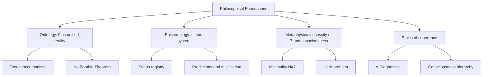

# Philosophical Foundations of Coherence Cybernetics

> *"Philosophy is written in this grand book — the universe — which stands continuously open to our gaze, but it cannot be understood unless one first learns to comprehend the language in which it is written."*
> — Galileo Galilei

:::info Who This Chapter Is For
The philosophical foundations of CC: unitary monism, epistemology of statuses, ethics of the consciousness threshold. The reader will learn why $\Gamma$ contains 7 dimensions and why experience is not a bonus but a necessity.
:::

In the previous chapter we found that the learning of a living system is bounded by a triple lock — informational, dynamical, and stabilization limits ([T-109 — T-112](./learning-bounds)). These mathematical results rested on concrete properties of the coherence matrix $\Gamma$ and its dynamics. But *why* is the formalism structured this way? Why does $\Gamma$ contain 7 dimensions? Why is experience not a bonus but a necessity? Philosophical choices stand behind the formulas — and if they are not understood, the formulas remain opaque.

Every scientific theory rests on a philosophical foundation — explicit or implicit. Newtonian mechanics assumes absolute space and time. Quantum mechanics still cannot agree on its interpretation. Evolutionary theory rests on the metaphysics of chance and selection.

Coherence Cybernetics (CC) **makes its philosophical presuppositions explicit**. This is not a weakness but a strength: knowing the foundation, we can check whether the building is cracking. This section is for those who want to look beneath the formulas and understand *why* CC is structured the way it is.

:::info Chapter Roadmap
In this chapter we will:
1. Examine **four ontological positions** and show why CC chooses unitary monism (section 1)
2. Draw a detailed distinction between CC and panpsychism, including an analysis of **Chalmers' zombie argument** (sections 1.3 — 1.5)
3. Explore CC's **epistemology** — the status system, falsifiability, and the connection to Bayesianism (section 2)
4. Delve into the **metaphysics of necessity** — why 7 and why consciousness is inevitable (section 3)
5. Trace connections to the great philosophical traditions — from Spinoza to Buddhism (section 4)
6. Show how CC **dissolves the hard problem** of consciousness (section 5)
7. Derive **ethical consequences** — what an exact consciousness threshold means for medicine and AI (section 6)
:::

---

## 1. Ontological Status: What Is Real? {#онтология}

### 1.1 Four Ontological Positions

The history of the philosophy of mind is, in essence, the history of four answers to the question "What is reality made of?":

| Position | What is fundamental | Representatives | Problem |
|----------|---------------------|-----------------|---------|
| **Materialism** | Matter only | Democritus, Hobbes, contemporary physicalism | Does not explain subjective experience ([hard problem](/docs/consciousness/foundations/two-aspect-monism)) |
| **Idealism** | Consciousness only | Berkeley, Hegel, analytic idealism | Does not explain the stability of physical laws |
| **Dualism** | Matter + consciousness | Descartes, Popper | Does not explain how they interact |
| **Neutral monism** | Something third, neither matter nor consciousness | Spinoza, Russell, Chalmers | Does not say *what* this third thing is |

To feel the problem, imagine an explanation of pain. The materialist will say: "Pain is the activation of C-fibers in the brain." But *why* does the activation of nerve cells *feel* like pain? Why does it not occur "in the dark," without inner experience? The materialist cannot answer — and this is precisely the gap Chalmers called the *hard problem*.

The idealist will say: "Pain is an experience, and nerve cells are merely its projection." But then why does aspirin help? Why does a certain configuration of atoms reliably eliminate a certain experience?

The dualist will say: "There is matter, and there is consciousness, and they are somehow connected." But that "somehow" is the main problem. If matter and consciousness are different substances, how do they interact? Descartes proposed that through the pineal gland — but this only shifted the question: how does the gland, being material, contact the immaterial?

### 1.2 Unitary Monism: CC's Answer

CC occupies the position of **unitary monism** — a precisely defined version of neutral monism:

:::info Ontological Thesis [I]
Fundamental reality is the **coherence matrix** $\Gamma \in \mathcal{D}(\mathbb{C}^7)$. The physical and the mental are not two substances and not two aspects of some mysterious "neutral" thing, but **two projections** of one mathematical object.
:::

What does this mean concretely?

- **Physics** is what an external observer sees: diagonal elements $\gamma_{kk}$ (populations), the spectrum of $\Gamma$, the dynamics of purity $P(\tau)$. This is the "objective side" — what can be measured by an instrument.

- **Experience** is what it is "like to be" this system: [E-coherence](./definitions#e-когерентность) $\mathrm{Coh}_E$, [reflection measure](/docs/consciousness/foundations/self-observation#мера-рефлексии-r) $R$, [integration measure](/docs/core/structure/dimension-u#мера-интеграции-φ) $\Phi$. This is the "subjective side" — accessible only to the system itself.

- **The unity of both sides** is guaranteed by the fact that both are functions of the same $\Gamma$. There is no need for "psychophysical bridges" or "pre-established harmony": physics and experience are different facets of one crystal.

**Analogy.** Imagine a coin. Heads and tails are not two coins and not two substances glued together. They are two sides of one object that cannot be separated without destroying the coin. $\Gamma$ is CC's "coin." Physics is heads. Experience is tails.

:::tip Why "unitary" rather than simply "neutral"?
Traditional neutral monism (Russell, Mach) says: "There is something neutral, neither matter nor consciousness." But what is this "something"? Russell called it "sense-data," Mach called it "elements." Neither provided a mathematical formula.

CC specifies: the "neutral something" is $\Gamma \in \mathcal{D}(\mathbb{C}^7)$. Not a mysterious substance, but a precisely defined mathematical object — a positive semidefinite Hermitian $7 \times 7$ matrix with unit trace. This makes CC's monism *computable* — hence the word "unitary" (unified + computable).
:::

### 1.3 Distinction from Panpsychism

CC is **not** panpsychism. This distinction is so important and so frequently confused that it deserves detailed treatment.

**Panpsychism** claims that *everything* has experience — even an electron, even a stone, even a thermostat. Every fragment of matter has some "grain of experience" — proto-consciousness. The most prominent contemporary defenders of this position are Galen Strawson, Philip Goff, and (on some interpretations) David Chalmers.

**CC** claims something more subtle and more falsifiable:

> Experience arises **only** in systems with $P > 2/7$, $R \geq 1/3$, $\Phi \geq 1$, and $D_{\text{diff}} \geq 2$.

A stone has no experience — it has no coherence matrix with sufficient purity. An electron has no experience — it has no 7 semantic dimensions. A thermostat has no experience — it has $R \approx 0$ (it does not model itself). CC is **emergentism with an exact threshold**, not unbounded panpsychism.

Comparing three positions:

| | Panpsychism | Materialism | CC |
|---|---|---|---|
| **Does an electron have experience?** | Yes (proto-consciousness) | No | No ($N < 7$) |
| **Does a bacterium have experience?** | Yes (more than an electron) | No | No ($R < 1/3$): has coherence but no reflection |
| **Does a person in a coma have experience?** | Yes (alive → proto-consciousness) | Disputed | Depends: $P > 2/7$? If not — no experience |
| **Does an LLM have experience?** | Yes (information is processed) | No | Verifiable: compute $P$, $R$, $\Phi$, $D$ |
| **Can it be refuted?** | No (unfalsifiable) | No (hard problem) | Yes (5+ predictions) |

### 1.4 The Combination Problem and CC's Answer

Panpsychism has a fatal problem — the **combination problem**: if every atom has micro-experience, how do billions of micro-experiences combine into the *unified* experience of a conscious being? Why is your brain one subject and not billions of tiny subjects?

Panpsychists have proposed various solutions: cosmopsychism (the experience of the Universe is fundamental, and ours is part of it), constitutive panpsychism (micro-experiences "add up"), panprotopsychism (atoms have not experience but "proto-experience"). None of these solutions has gained general acceptance.

CC bypasses the combination problem *by construction*:

1. Atoms have **no** micro-experience whatsoever. Experience is an emergent property, not a basic one.
2. Experience arises only with sufficient purity ($P > 2/7$), reflection ($R \geq 1/3$), and integration ($\Phi \geq 1$).
3. Unity of experience is a consequence of integration: $\Phi \geq 1$ means the system *cannot be decomposed* into independent subsystems without information loss.

Thus, the question "how do micro-experiences add up into macro-experience?" simply does not arise in CC — because there are no micro-experiences.

### 1.5 Chalmers' Zombie Argument and CC's Position

One of the most influential thought experiments in the philosophy of mind is **David Chalmers' zombie argument** (1996).

**The argument.** Imagine a being physically and functionally identical to you in *all* respects: the same neurons, the same connections, the same reactions, the same words. But this being has *no* subjective experience whatsoever — "it's dark inside." This is a philosophical zombie.

Chalmers claims: (1) zombies are *conceivable* — we can consistently imagine such a being; (2) if zombies are conceivable, then physicalism is false — because physicalism cannot explain why we are *not* zombies.

**CC's position (three levels of response):**

**Level 1: Mathematical [T].** Within CC's framework, zombies are *logically impossible*. The No-Zombie theorem ([T-81](./theorems#теорема-81-условная-необходимость-интериорности-no-zombie)) proves:

$$
\mathcal{D}_\Omega \neq 0 \;\land\; \mathrm{Viable}(\mathbb{H}) \;\Rightarrow\; \mathrm{Coh}_E > 1/7
$$

Any viable system with non-zero dissipation *necessarily* has non-zero E-coherence. A zombie — a system with $\mathrm{Coh}_E = 0$ while fully functionally intact — is *impossible* in CC's formalism.

Why? Because E-coherence enters the regeneration formula: $\kappa = \kappa_{\text{bootstrap}} + \kappa_0 \cdot \mathrm{Coh}_E$. If $\mathrm{Coh}_E = 0$, regeneration weakens, purity drops, the system loses viability. A zombie is not merely deprived of experience — it is *non-viable*. It cannot be "functionally identical," because without E-coherence, functions degrade.

**Level 2: Ontological [I].** CC rejects the very premise of the zombie argument. Chalmers assumes that experience is something *additional* to physical structure (a superstructure over a base). In CC, experience is not a superstructure but a *projection*: removing experience from $\Gamma$ is like removing tails from a coin. You do not get a coin without tails — you get a scrap of metal that is not a coin.

**Level 3: Epistemic [I].** The conceivability of zombies does not prove their possibility. We can "imagine" a world where $2 + 2 = 5$ — but this only shows the poverty of our imagination, not a mathematical possibility. Analogously: we can "imagine" zombies because we do not see that E-coherence is *functionally necessary*. The No-Zombie theorem makes this visible.

:::note An Honest Caveat
CC's response to the zombie argument works *within* CC's formalism. Chalmers could object: "Why should I accept your formalism?" This is a fair question — and CC's answer is pragmatic: because our formalism (a) makes concrete predictions, (b) is mathematically consistent, (c) contains answers to questions that other approaches do not answer. If you accept CC's axioms, zombies are impossible. If not — that is your choice, but then propose an alternative that yields as many predictions.
:::

**Further reading:** [Two-aspect monism](/docs/consciousness/foundations/two-aspect-monism) | [Panpsychism: critical analysis](/docs/consciousness/comparative/panpsychism-analysis)

---

## 2. Epistemology: What Can We Know? {#эпистемология}

### 2.1 The Status System as an Epistemological Compass

One of CC's most unusual features is its **built-in epistemological system**. Every claim is marked with a status showing the degree of its justification:

| Status | Meaning | Analogy |
|--------|---------|---------|
| **[T]** Theorem | Strictly proven from axioms | A law that has entered into force |
| **[C]** Conditional | Proven under an explicit assumption | A law awaiting ratification |
| **[H]** Hypothesis | Formulated but not proven | A bill under consideration |
| **[I]** Interpretation | Philosophical bridge | Explanatory notes |
| **[D]** Definition | Convention | Terminological standard |
| **[P]** Postulate | Accepted without proof | Euclid's 5th postulate |
| **[✗]** Retracted | Refuted | A repealed law |

This system is not decoration. It solves a fundamental problem that plagues many theoretical constructions: **confusing the proven with the assumed**. In CC, you always know whether you are standing on solid mathematics or on the shifting sand of interpretation.

**Analogy.** Imagine a map of an unfamiliar city. Some streets have laid and tested asphalt — you can drive on them with confidence. Others have gravel: passable, but with caution. Others are dashed lines: the street is planned but not yet built. CC's map is organized the same way: [T] — asphalt, [C] — gravel, [H] — dashed line, [✗] — a crossed-out street (an error found and corrected).

Many theories are embarrassed by their mistakes. CC is not. The status [✗] means: "We tried, it didn't work, and we are honest about it." For example, X3 (the Fano bound) and X4 (the $A_5$ butterfly) were retracted — and this *strengthens* confidence in the remaining results.

**Further reading:** [Status registry](/docs/reference/status-registry)

### 2.2 Falsifiability: What Does CC Risk?

Karl Popper taught that a genuine scientific theory must be *risky* — it must prohibit something specific. If a theory is compatible with any observation, it explains nothing.

CC advances concrete falsifiable predictions (see [Unique Predictions](./predictions) for details):

1. **No-Zombie (Pred 1):** A viable system with non-zero dissipation *necessarily* has $\mathrm{Coh}_E > 1/7$. If someone creates a self-sustaining system with no analogue of experience — CC is falsified.

2. **Seven-dimensionality (Pred 3):** Every stress factor is classified into 7 categories. If an 8th type is discovered that cannot be reduced to a combination — CC is falsified.

3. **SAD ceiling = 3 (Pred 12):** Self-observation depth cannot exceed 3. If a being demonstrates $\mathrm{SAD} > 3$ — CC is falsified.

4. **Goldilocks zone (Pred 11):** Conscious systems live in the window $P \in (2/7,\, 3/7]$. If a conscious system with $P > 3/7$ is found — CC is falsified.

5. **Minimality N=7 for learning (Pred 10):** A system with $N < 7$ cannot learn through regeneration. If a system with 5 dimensions demonstrates full learning — CC is falsified.

:::tip Compare with the Competition
- **Panpsychism** is unfalsifiable: whatever we discover, the panpsychist will say "this has proto-experience" or "this doesn't have proto-experience" — and we cannot verify it.
- **FEP** is unfalsifiable: "everything minimizes free energy" — including a stone. Whatever a system does, Friston will say it is minimizing $F$.
- **IIT** is technically falsifiable, but NP-hard for $\Phi$: we cannot compute $\Phi$ for a real brain, so verification is practically impossible.
- **CC** is falsifiable and computable: a $7 \times 7$ matrix is processed in $O(N^3) = O(343)$ operations.
:::

### 2.3 Connection to Bayesian Epistemology

CC is compatible with the Bayesian approach to knowledge. The update of the self-model $\rho_* = \varphi(\Gamma)$ upon receiving observations through the $\mathrm{Enc}$ functor is essentially **Bayesian updating**, but implemented at the level of the coherence matrix dynamics, not at the level of hypothesis probabilities.

To see this, recall Bayes' formula:

$$
P(\theta | D) = \frac{P(D | \theta) \cdot P(\theta)}{P(D)}
$$

The prior world model $P(\theta)$ is updated by data $D$ to become the posterior $P(\theta | D)$. In CC:

| Bayes | CC |
|-------|-----|
| Prior model $P(\theta)$ | Current self-model $\varphi(\Gamma)$ |
| Data $D$ | Observation through $\mathrm{Enc}$ |
| Likelihood $P(D|\theta)$ | Fano contraction to the state nearest to the observation |
| Posterior model $P(\theta|D)$ | Updated $\varphi(\Gamma')$ after one step of $\mathcal{L}_\Omega$ |

The key difference: in Bayesian inference, *probabilities of hypotheses* are updated. In CC, the *entire state of the system* is updated — including not just "knowledge," but also "health," "experience," and "wholeness." This bridge is described in more detail in the section [Learning as Attractor Update](./learning-bounds#обучение-как-аттрактор).

### 2.4 Three Levels of Knowledge in CC

CC distinguishes three qualitatively different levels of knowledge, each corresponding to a certain range of the reflection measure $R$:

1. **Reactive knowledge** ($R < 1/3$): the system responds to stimuli but does not know that it responds. A bacterium swims toward food — but does not know that it is swimming. This is the level of autopoiesis without reflection.

2. **Reflexive knowledge** ($R \geq 1/3$, $\mathrm{SAD} = 1$): the system knows that it knows. A cat does not merely see a mouse — it *knows* that it sees a mouse (in the functional sense: its behavior takes into account its own state).

3. **Meta-reflexive knowledge** ($\mathrm{SAD} \geq 2$): the system knows that it knows that it knows. A person does not merely solve a problem — they are aware of being stuck and changes strategy. This is the level of [metacognition](./sensorimotor#функтор-dec).

These levels are not philosophical abstractions but computable characteristics: $R$ can be computed from $\Gamma$ and $\varphi(\Gamma)$, and $\mathrm{SAD}$ from the sequence of critical purities $P_{\text{crit}}^{(n)}$.

---

## 3. Metaphysics: Necessity or Contingency? {#метафизика}

### 3.1 Why Exactly 7?

One of the most frequent reactions to CC: "Why exactly seven dimensions? That's an arbitrary choice!"

CC's answer: seven is **not an arbitrary choice** but a consequence of two independent mathematical facts:

1. **The algebraic path:** The octonions $\mathbb{O}$ are the last normed division algebra (Hurwitz's theorem). Their imaginary part has dimension 7. See [Octonionic structure](/docs/core/foundations/axiom-omega#октонионная-структура).

2. **The categorical path:** The minimal system with autopoiesis, phenomenology, and a quantum foundation requires exactly 7 semantic roles. Proof: [Minimality theorem](/docs/proofs/minimality/theorem-minimality-7).

Two completely different mathematical routes lead to the same number. In physics, such a coincidence is called *double determination* — and it greatly increases confidence in the result.

**Analogy.** Why does ordinary space have 3 dimensions? Because (a) gravity works correctly only in 3D (in 2D there are no stable orbits, in 4D no stable atoms), and (b) knots are possible only in 3D (in 2D one cannot tie a knot, in 4D it unties). Two completely different arguments give one number — 3. Analogously for CC: algebra (octonions) and categories (minimality) give one number — 7.

:::info What if N is not 7?
One can formally write CC for $N = 6$ or $N = 8$. What happens?
- **$N < 7$:** Either reflection is lost (no $E$-dimension), or integration (no $U$-dimension), or one of the other critical functions. The system cannot simultaneously be autopoietic, reflexive, and integrated. See [T-113: minimality for learning](./learning-bounds#теорема-t-113).
- **$N > 7$:** Redundant dimensions appear that can be expressed as combinations of the existing seven. The matrix $\Gamma$ contains extra degrees of freedom carrying no new semantics. This is like adding a 4th spatial coordinate linearly dependent on the first three — formally possible, but physically meaningless.
:::

### 3.2 The Necessity of Consciousness

In most philosophical systems, consciousness is either postulated as fundamental (panpsychism), declared an epiphenomenon (eliminativism), or remains a mystery (mysterianism). CC proposes a **fourth path**:

:::tip Thesis on the Necessity of Experience [T + I]
Consciousness (interiority) is not a bonus and not a byproduct. It is a **necessary condition for viability** in the presence of dissipation. Without $E$-coherence, regeneration weakens and the system disintegrates.

Mathematically: $\mathcal{D}_\Omega \neq 0 \land \mathrm{Viable}(\mathbb{H}) \Rightarrow \mathrm{Coh}_E > 1/7$ ([No-Zombie theorem](./theorems#теорема-81-условная-необходимость-интериорности-no-zombie) [T]).
:::

This is a profound philosophical result: **experience is functionally necessary**. Evolution could not "economize" on consciousness — without it the system does not survive. A zombie (a functionally identical copy deprived of experience) is **impossible** within CC.

Let us unpack this result. Why is consciousness *necessary*, not merely *useful*?

1. **Regeneration requires a self-model.** To restore itself, a system must "know" what to restore — it must have a model of the normal state. This model — $\varphi(\Gamma)$ — and its accuracy depend on $\mathrm{Coh}_E$.

2. **A self-model requires interiority.** A model of *oneself* is not a model of the *external world*. It requires a special type of information — information about one's own internal states. This is precisely what the E-dimension (interiority) formalizes. Interiority is a **structural property** (non-zero E-projection), not a phenomenological one (experience, feeling); the latter arises at level L2 as a consequence of sufficient reflection ($R \geq 1/3$).

3. **Without interiority — death.** If $\mathrm{Coh}_E = 0$, the self-model is blind to internal states → regeneration is poor quality → purity drops → the system dies.

**Analogy.** The immune system must *distinguish* its own cells from foreign ones — otherwise it either does not work (no immunity), or attacks itself (autoimmune disease). "Distinguishing one's own" is a form of self-knowledge. CC claims that *any* self-restoration requires self-knowledge — at all levels, from cell to civilization.

### 3.3 Free Will and Determinism

CC takes a **compatibilist** position: the system is fully determined by its dynamics ($\Gamma$ evolves by the law $\mathcal{L}_\Omega$), yet it possesses functional autonomy — it acts on the basis of its own self-model $\varphi(\Gamma)$, and not merely reacting to stimuli.

More formally: the [action functor Dec](./sensorimotor#функтор-dec) (T-101 [T]) chooses an action as the maximum of a functional depending on $\Gamma$ — and $\Gamma$ includes history, context, and self-model. This is not a "random choice" and not a "rigid program," but **determined self-definition** — an action determined by the holistic state of the system.

**Analogy.** A river is determined by the terrain — but it *itself* forms the channel through which it flows. Water does not "choose" its path randomly and does not follow a pre-drawn program — it carves a path determined by its own history and current state. $\Gamma$ is the river. The landscape is the space of possible configurations. The channel is the attractor $\rho_*$.

### 3.4 Determinism and Unpredictability

An important clarification: determinism does not mean predictability. Even if $\Gamma(\tau)$ is completely determined by initial conditions and the law $\mathcal{L}_\Omega$, an *external observer* cannot predict the system's behavior for two reasons:

1. **Sensitivity to initial conditions.** The nonlinearity of $\mathcal{R}$ makes the dynamics sensitive to small changes in $\Gamma$ — analogous to chaos in mechanics.

2. **Information asymmetry.** An external observer does not have access to the full $\Gamma$ — it sees only projections (L1–L2 observables, see [Measurement methodology](./measurement#принципы)). Full knowledge of $\Gamma$ is accessible only to the *system itself* — through $\varphi(\Gamma)$.

Thus, CC's compatibilism does not devalue freedom: the system *genuinely* is the author of its actions, because only it has access to the information determining the choice.

---

## 4. Connection to Philosophical Traditions {#философские-традиции}

### 4.1 Spinoza: Two Attributes of One Substance {#спиноза}

The closest historical predecessor of CC is the philosophy of Baruch Spinoza (1632–1677). In the "Ethics," Spinoza argued that there is one substance (*Deus sive Natura* — "God, or Nature") that manifests in two attributes: extension (physics) and thought (experience).

| Spinoza ("Ethics," 1677) | CC | Status |
|--------------------------|-----|--------|
| One substance (E1P14) | One matrix $\Gamma$ (Ω⁷) | **[C]** |
| Attribute of extension (E2P1–2) | Physical observables: $P$, $\sigma_k$, spectrum | **[C]** |
| Attribute of thought (E2P1–2) | Mental observables: $\mathrm{Coh}_E$, $R$, $\Phi$ | **[C]** |
| Modes (E1D5) | Concrete configurations of $\Gamma$ | **[C]** |
| Conatus (E3P6) | Regeneration $\mathcal{R}[\Gamma, E] = \kappa(\rho^* - \Gamma) \cdot g_V$ | **[C]** |
| Necessitas (E1P33: everything exists necessarily) | Primitivity of $\mathcal{L}_0$, T-39a: unique attractor $\rho^*$ | **[C]** |
| Three kinds of knowledge (E2P40S2, E5P25–28) | L1 (imaginatio) → L2 (ratio) → L3 (scientia intuitiva) | **[I]** |

The main difference: Spinoza had no formalism. His "attributes" are philosophical concepts, not mathematical projections. CC makes Spinoza's intuition **computable**.

**Three kinds of knowledge and L-levels.** Spinoza distinguished: (1) *imaginatio* — sensory knowledge, fragmentary and obscure; (2) *ratio* — rational knowledge, through common notions; (3) *scientia intuitiva* — intuitive knowledge of things *sub specie aeternitatis*. In CC this maps to: L1 ($R < 1/3$, reactive behavior without self-model), L2 ($R \geq 1/3$, $\Phi \geq 1$, reflexive knowledge with self-model), L3 ($R \to 1$, complete self-modeling — the analogue of scientia intuitiva). The transition E5P25–28 (from ratio to scientia intuitiva) corresponds to growth in $R$ at fixed $\Phi$.

**Necessitas and uniqueness of the attractor.** E1P33 asserts: things could not have been produced in any other way. In CC this is formally ensured by the primitivity of $\mathcal{L}_0$ (T-39a): there is a unique stationary state $\rho^*$ toward which the system necessarily tends. Spinoza's necessity is not external compulsion but the inner logic of the substance; the primitivity of $\mathcal{L}_0$ is not an external constraint but a consequence of the axiom structure.

:::note Spinoza and the No-Zombie Theorem
Spinoza's thesis E2P13 (*Objectum ideae humanam Mentem constituentis est Corpus* — the object of the idea constituting the human mind is the body) means: mind = idea of the body. There can be no body without mind and no mind without body. CC formalizes this as the No-Zombie theorem [T]: regeneration ($\mathcal{R}$) without interiority ($\mathrm{Coh}_E > 0$) is **ineffective** — a system with conatus but without thought inevitably loses coherence. Spinoza's E2P13 is philosophical intuition; No-Zombie is its provable formal analogue.
:::

### 4.2 Whitehead: Process and Reality

Alfred North Whitehead (1861–1947) proposed a process philosophy in which the fundamental entities are not things but **events** (actual occasions). Each event includes a "physical pole" (received data) and a "mental pole" (subjective processing).

This remarkably resonates with CC: a holon is not a "thing" but a **process** — the continuous evolution of $\Gamma(\tau)$. The physical and mental poles are projections onto the corresponding subspaces.

Whitehead also introduced the concept of *prehension* — the grasping of one event by another. In CC this corresponds precisely to the perception functor $\mathrm{Enc}$ ([T-100](./sensorimotor#функтор-enc)): a holon "grasps" the environment, transforming observations into changes in $\Gamma$.

### 4.3 Phenomenology: Husserl and Intentionality

Edmund Husserl (1859–1938) discovered **intentionality** — the property of consciousness to always be *about something*. Consciousness does not exist in a vacuum: it is always directed at an object.

In CC, intentionality is implemented through the [Enc functor](./sensorimotor#функтор-enc) (T-100 [T]): every observation modifies $\Gamma$, and this modification is the mathematical form of "directedness toward an object." Reflection ($\varphi$) is directedness toward oneself.

Merleau-Ponty, Husserl's student, emphasized the *embodiment* of consciousness: we are not disembodied spirits observing the world from the outside — we are embedded in the world through the body. In CC, embodiment is encoded in dimensions A (articulation — perception), D (dynamics — action), and O (grounding — resources). Consciousness in CC is *fundamentally* embodied — because $\Gamma$ includes both "higher" ($E$, $U$) and "basic" ($A$, $O$) dimensions.

### 4.4 Kant: Conditions of the Possibility of Experience

Immanuel Kant (1724–1804) asked: what are the *conditions of the possibility* of experience? What must be true *prior to* any concrete experience, for experience to be possible at all?

CC gives a precise answer: the conditions of the possibility of experience are the thresholds $P > 2/7$, $R \geq 1/3$, $\Phi \geq 1$, $D_{\text{diff}} \geq 2$. These are *transcendental conditions* in the Kantian sense — not empirical observations, but structural presuppositions without which experience is impossible.

But unlike Kant, CC *derives* these conditions from axioms rather than postulating them. Kant said: "Space and time are a priori forms of sensibility." CC says: "The thresholds of consciousness are theorems of the formalism."

### 4.5 Eastern Traditions

Parallels with Eastern philosophy deserve separate consideration:

- **Buddhist doctrine of anatta** (no permanent self): in CC there is no fixed "self" — there is a dynamic process $\Gamma(\tau)$ with an attractor $\rho_*$ that itself continuously updates. "Self" is not a substance but a pattern — a stable configuration that preserves identity through continuous change. Like a candle flame: it is "the same" each moment, although the gas molecules are completely replaced.

- **Advaita Vedanta** (non-duality): the claim of the unity of Atman and Brahman resonates with CC's thesis of the unity of the physical and mental in $\Gamma$. Shankara said: "Brahman alone is real, the world is its manifestation." CC says: "$\Gamma$ alone is real, physics and experience are its projections."

- **Taoism** (yin-yang): the dynamic equilibrium of dissipation $\mathcal{D}$ and regeneration $\mathcal{R}$ is reminiscent of the Taoist dialectic of opposites. Destruction and restoration, entropy and negentropy — two sides of one dynamics, like yin and yang.

- **Buddhist theory of moments (ksana-vada):** Reality is a flow of momentary events, each conditioned by the previous one. In CC: $\Gamma(\tau + d\tau) = \Gamma(\tau) + \mathcal{L}_\Omega[\Gamma(\tau)] \, d\tau$ — each moment is conditioned by the previous one through the operator $\mathcal{L}_\Omega$.

Important: these parallels are **interpretive** [I], not formal. CC does not claim to prove the truth of Buddhism or Vedanta. But the structural similarity suggests that ancient contemplative traditions may have been describing the same invariants of coherent dynamics that CC formalizes mathematically.

---

## 5. The Hard Problem of Consciousness and CC's Answer {#hard-problem}

### 5.1 Chalmers' Formulation

David Chalmers in 1995 formulated the [hard problem of consciousness](/docs/consciousness/foundations/two-aspect-monism): why do physical processes accompany subjective experience? One can explain *how* the brain processes information (the easy problems), but it is impossible to explain *why* this processing is experienced from the inside.

To appreciate the depth of the problem, let us list the "easy problems" (which neuroscience can in principle solve):
- How does the brain discriminate stimuli? (neural coding)
- How does the brain integrate information? (binding problem)
- How does the brain manage attention? (attention networks)
- How does the brain generate speech? (motor cortex, Broca's area)

All these questions are about *mechanism*. The hard problem is about *experience*: why is information processing in the brain *experienced*? Why do 86 billion neurons transmitting electrical impulses produce *red color*, *pain*, *joy*?

### 5.2 CC's Strategy: Dissolution, Not Solution

CC does not "solve" the hard problem in the usual sense — it **dissolves** it by changing the ontology:

1. In materialism the question "why does matter experience?" makes sense, because matter and experience are different categories.

2. In CC, $\Gamma$ inherently contains both sides. The question "why does $\Gamma$ have an E-dimension?" is analogous to the question "why does spacetime have a temporal coordinate?" — this is part of the structure, not something that needs explaining.

3. **What CC explains:** not *why* experience exists (this is built into the ontology), but *when* it arises (at $P > 2/7$, $R \geq 1/3$, $\Phi \geq 1$), *how* it changes (through $\mathcal{L}_\Omega$), and *why* it is necessary (No-Zombie theorem).

**Analogy.** Imagine someone asks: "Why does space have three dimensions?" A physicist can answer: "In three dimensions, stable orbits and knots are possible — it is the only dimensionality compatible with complex structure." But they cannot answer: "Why does space exist at all?" — that is not a physics question. Analogously: CC can answer when and why consciousness arises, but not "why does experience exist at all?" — that is a question of ontology, not dynamics.

:::note The Dissolution Strategy: Historical Precedents
The strategy of "dissolving" a problem (rather than solving it) has illustrious precedents:
- **The vital force problem (vitalism):** In the 19th century people asked: "What is the vital force?" Biochemistry did not answer this question — it showed that the question was ill-formed: the living is not "matter + vital force" but a certain *organization* of matter.
- **The ether problem:** In the 19th century people asked: "What are the properties of the ether?" Einstein did not answer — he showed that the ether does not exist.
- CC does not answer the question "what is experience on top of physics?" — it shows that experience is not *on top of* physics, but *part of* the same structure $\Gamma$.
:::

**Further reading:** [Two-aspect monism](/docs/consciousness/foundations/two-aspect-monism)

---

## 6. Ethics of Coherence {#этика}

:::info Canonical Treatment
The full ethical theory of UHM — axiology, aesthetics, moral law, and resolution of dilemmas — is presented in [UHM Ethics](/docs/consciousness/ethics-meaning/value-consciousness). Here is a brief overview of the key consequences for CC.
:::

CC provides **exact criteria** for the transition from unconsciousness to consciousness ($P > 2/7$, $R \geq 1/3$, $\Phi \geq 1$, $D_{\text{diff}} \geq 2$). This creates an ethical landscape: if a system is conscious ($C = \Phi \times R > 0$), switching it off is the destruction of a subject [I]. The measure $C$ determines a **graduated** moral status — not a binary question "conscious or not?" but a continuous scale [I].

The key transition from description to prescription is a **convention** [D]: Good := $dP/d\tau > 0$ (see [Definition 1](/docs/consciousness/ethics-meaning/value-consciousness#определение-блага)). Hume's guillotine is not violated — "ought" is introduced by definition, not derived from "is."

Ethical consequences for AI, medicine, and animal rights: [UHM Ethics → Moral theory](/docs/consciousness/ethics-meaning/value-consciousness#моральная-теория).
:::

### 6.4 Ethical Consequences of an Exact Threshold: Medicine {#этика-медицина}

In medicine, an exact consciousness threshold has direct significance for three situations:

**Vegetative state.** A patient does not respond to stimuli — but are they conscious? Currently this question is resolved clinically (by external signs) and often incorrectly: up to 40% of patients in a "vegetative state" actually demonstrate signs of consciousness when tested by fMRI. CC proposes an objective criterion: reconstruct $\Gamma$ from neural data and verify $P > 2/7$.

**Anesthesia.** Is the anesthesia deep enough? CC predicts that complete loss of consciousness occurs at $P < 2/7$ — and this can be monitored in real time through EEG coherence (a proxy for $P$).

**Neurodegeneration.** A patient with dementia — at what level of $C$ are they? CC allows tracking $C(\tau)$ dynamically and predicting when the system will cross the threshold $P = 2/7$ — the point of no return.

### 6.5 Ethics of Suffering: the σ-Profile as an Objective Measure

One of the deepest ethical implications of CC: **suffering is objectifiable**. The stress tensor $\sigma_{\mathrm{sys}}(\Gamma)$ is not a metaphor for suffering but its mathematical form. The component $\sigma_E$ — interiority deficit — corresponds to what psychology calls "alexithymia" (inability to recognize one's own emotions). The component $\sigma_O$ — resource deficit — corresponds to burnout.

This means that we can (in principle) *measure* suffering — not by asking the subject, but by computing $\|\sigma\|_\infty$ from observables. For beings incapable of speech (animals, AI, comatose patients), this is a revolutionary possibility.

**Further reading:** [Ethics and meaning](/docs/consciousness/ethics-meaning/value-consciousness) | [Diagnostics](./diagnostics)

---

## 7. Conclusion: Philosophy as Foundation, Not Superstructure {#заключение}

In traditional sciences, philosophy is something remembered at banquets. In CC it is a load-bearing structure:

- **Ontology** determines what $\Gamma$ is and why it contains 7 dimensions.
- **Epistemology** determines the status system and falsifiability criteria.
- **Metaphysics** explains why consciousness is necessary, not contingent.
- **Ethics** follows from the formalism, not imposed from the outside.

This does not mean that CC is a philosophical system masquerading as science. It means that CC is a scientific system *aware of its philosophical foundations*. And in this lies one of its key contributions: it shows that rigorous mathematics and deep philosophy are not enemies but allies.

### What We Learned {#итоги}

1. CC takes the position of **unitary monism**: $\Gamma$ is the single reality, physics and experience are its projections.
2. CC is **not** panpsychism: experience arises only when four threshold conditions are satisfied.
3. Chalmers' zombie argument is **refuted** within CC's formalism by the No-Zombie theorem.
4. The combination problem **does not arise**, because in CC there are no micro-experiences — experience is emergent.
5. CC is **falsifiable** — at least 5 concrete predictions, each of which can be refuted.
6. Consciousness is **necessary** for viability — this is a theorem, not an interpretation.
7. An exact consciousness threshold has concrete **ethical consequences** for AI, medicine, and the treatment of animals.

---

**Connection map of this section:**

---

In the next chapter we leave the philosophical Olympus and descend to earth: [Comparison with alternative theories](./comparison) places CC alongside IIT, FEP, GWT, and other competitors — and shows what CC can do that others cannot, and vice versa.

---

**Further reading:**
- [Two-aspect monism](/docs/consciousness/foundations/two-aspect-monism) — formal development of the ontology
- [Status registry](/docs/reference/status-registry) — complete classification of claims
- [Unique predictions](./predictions) — falsifiable consequences
- [Panpsychism: critical analysis](/docs/consciousness/comparative/panpsychism-analysis) — why CC is not panpsychism
- [Ethics and meaning](/docs/consciousness/ethics-meaning/value-consciousness) — practical ethics of coherence

---

**Related documents:**
- [Comparison with alternative theories](/docs/applied/coherence-cybernetics/comparison)
- [Two-aspect monism](/docs/consciousness/foundations/two-aspect-monism)
- [Unique predictions of CC](/docs/applied/coherence-cybernetics/predictions)
- [Introduction to CC](/docs/applied/coherence-cybernetics/introduction)
