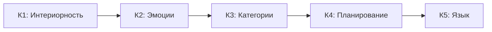

# Уникальные Предсказания КК

:::note О нотации
В этом документе:
- $\Gamma$ — [матрица когерентности](/docs/core/dynamics/coherence-matrix)
- $P$ — [чистота](/docs/core/dynamics/viability#определение-чистоты): $P = \mathrm{Tr}(\Gamma^2)$
- $\mathrm{Coh}_E$ — [E-когерентность](./definitions#e-когерентность)
- $C$ — [мера сознательности](/docs/consciousness/foundations/self-observation#мера-сознательности-c)
- $\sigma_{\mathrm{sys}}$ — [тензор напряжений](./definitions#тензор-напряжений)
- $\mathbb{H}$ — [Голоном](/docs/core/structure/holon)
:::

Кибернетика Когерентности генерирует верифицируемые предсказания, отсутствующие в альтернативных теориях.

## Предсказание 1: Невозможность зомби (No-Zombie)

:::tip Ключевое предсказание [Т]
$$
\mathrm{Viable}(\mathbb{H}) \land \mathcal{D}_\Omega \neq 0 \;\Rightarrow\; \mathrm{Coh}_E(\Gamma) \geq \mathrm{Coh}_{\min} > \frac{1}{7}
$$
:::

**См.:** [Теорема 8.1 [Т]](./theorems#теорема-81-условная-необходимость-интериорности-no-zombie)

**Верифицируемость:**
Если будет создана искусственная система, демонстрирующая устойчивое самоподдержание без какой-либо внутренней структуры [опыта](/docs/core/structure/dimension-e), КК будет фальсифицирована.

**Статус:** Сильное предсказание, отсутствующее в [FEP](/docs/reference/glossary#связанные-теории), [IIT](/docs/reference/glossary#связанные-теории), [GWT](/docs/reference/glossary#связанные-теории).

## Предсказание 2: Зависимость регенерации от E-когерентности

:::info Предсказание [Т]
$$
\kappa(\Gamma) = \kappa_{\text{bootstrap}} + \kappa_0 \cdot \mathrm{Coh}_E(\Gamma) \Rightarrow \frac{dP}{d\tau} \propto \mathrm{Coh}_E(\Gamma)
$$
Скорость [регенерации](/docs/core/dynamics/evolution#3-регенеративный-член) пропорциональна интегрированности [опыта](/docs/core/structure/dimension-e). Член $\kappa_{\text{bootstrap}} > 0$ гарантирует минимальную регенерацию даже при низкой E-когерентности ([разрешение bootstrap-парадокса](/docs/core/foundations/axiom-omega#genesis-protocol)).

**Статус:** [Т] — связь $\kappa \propto \mathrm{Coh}_E$ следует из [категориального вывода κ₀](/docs/core/foundations/axiom-septicity#категориальный-вывод-kappa0) [Т]; $\mathrm{Coh}_E$ — точная мера через [HS-проекцию $\pi_E$](/docs/core/foundations/axiom-septicity#hs-projection) [Т]. Полная форма ℛ [выведена из аксиом](/docs/core/dynamics/evolution#вывод-формы-регенерации) [Т].
:::

**См.:** [Связь регенерации и E-когерентности](./axiomatics#связь-регенерации-и-e-когерентности)

**Следствие:**
Медитативные практики, увеличивающие $\mathrm{Coh}_E$, должны улучшать физическое восстановление.

**Верифицируемость:**
Измерение корреляции между показателями «качества опыта» и скоростью восстановления после стресса.

## Предсказание 3: Семимерный тензор напряжений

:::info Структурная гипотеза [С]
$$
\sigma_{\mathrm{sys}}(\Gamma) = [\sigma_A, \sigma_S, \sigma_D, \sigma_L, \sigma_E, \sigma_O, \sigma_U]^T \in \mathbb{R}^7
$$
Все напряжения системы классифицируются в [7 категорий](/docs/core/structure/dimensions) ([обоснование числа 7](/docs/core/foundations/axiom-omega#октонионная-структура)), соответствующих измерениям.

**Статус:** [С] — это **следствие модели** при допущении 7-мерной структуры, а не независимое предсказание. 7 категорий определяются структурой теории. Эмпирический вопрос: адекватно ли это разбиение описывает реальные системы?
:::

**См.:** [Тензор напряжений](./definitions#тензор-напряжений)

**Верифицируемость:**
Любой стресс-фактор должен отображаться в одну или несколько из 7 компонент.

| Компонента | Измерение | Тип стресса | Примеры |
|------------|-----------|-------------|---------|
| $\sigma_A$ | [Артикуляция](/docs/core/structure/dimension-a) | Перцептивный | Сенсорная перегрузка |
| $\sigma_S$ | [Структура](/docs/core/structure/dimension-s) | Когнитивный | Сложность задачи |
| $\sigma_D$ | [Динамика](/docs/core/structure/dimension-d) | Вычислительный | Дедлайны |
| $\sigma_L$ | [Логика](/docs/core/structure/dimension-l) | Логический | Противоречия |
| $\sigma_E$ | [Опыт](/docs/core/structure/dimension-e) | Экзистенциальный | Потеря смысла |
| $\sigma_O$ | [Основание](/docs/core/structure/dimension-o) | Ресурсный | Голод, истощение |
| $\sigma_U$ | [Единство](/docs/core/structure/dimension-u) | Социальный | Изоляция |

## Предсказание 4: Доязыковое познание полноценно

:::info Предсказание [И]
$$
\exists \, \mathrm{Cognition}(\mathbb{H}) \text{ при } \mathrm{Language}(\mathbb{H}) = \varnothing
$$
Полноценное познание (уровни К1-К4) возможно без языка (К5).

**Статус:** [И] — интерпретация, следующая из определений когнитивных уровней К1-К5.
:::

**См.:** [Когнитивная иерархия](/docs/consciousness/comparative/cognitive-hierarchy)

**Иерархия когнитивных функций:**

**Верифицируемость:**
Животные без языка демонстрируют уровни К1-К4:
- Врановые: планирование (К4), изготовление орудий
- Приматы: категоризация (К3), социальное обучение
- Все позвоночные: эмоциональные реакции (К2)
- Все системы с $\rho_E \neq 0$: [интериорность](/docs/proofs/consciousness/interiority-hierarchy#уровень-0-интериорность-interiority) (К1/L0)

## Предсказание 5: Масштабная инвариантность сознания

:::info Гипотеза (требует уточнения)
$$
\left( \bigwedge_i C(\mathbb{H}_i) > 0 \right) \land \Phi_{\otimes} > \Phi_{\min} \Rightarrow C(\mathbb{H}_{1 \otimes \ldots \otimes n}) > 0
$$
Коллективная [сознательность](/docs/consciousness/foundations/self-observation#мера-сознательности-c) реальна, если индивидуальные сознания достаточно [интегрированы](/docs/core/structure/dimension-u#мера-интеграции-φ).

**Ограничение:** Значение $\Phi_{\min}$ **не определено теоретически** — это открытый вопрос. Без конкретного значения предсказание рискует стать нефальсифицируемым (любой отрицательный результат можно объяснить «недостаточной интеграцией»).
:::

**См.:** [Теорема 9.1](./theorems#теорема-91-фрактальное-замыкание)

**Верифицируемость:**
Измерение $\Phi$ для групп с различной степенью интеграции:
- Семьи
- Команды
- Организации
- Экосистемы

**Критерий:** $\Phi_{\otimes} > \Phi_{\min}$ — необходимое условие. Без достаточной интеграции коллективная сознательность не возникает.

## Предсказание 6: Минимальная когерентность для жизнеспособности

:::warning Предсказание
$$
\mathrm{Viable}(\mathbb{H}) \Rightarrow P(\Gamma) > P_{\text{crit}} \land \mathrm{Coh}_E(\Gamma) > \mathrm{Coh}_E^{\min}
$$
[Жизнеспособность](/docs/core/dynamics/viability) требует минимальной [чистоты](/docs/core/dynamics/viability#определение-чистоты) и E-когерентности выше минимума $\mathrm{Coh}_E^{\min} = 1/7$ (полностью смешанное состояние).
:::

:::info Пороги L2
| Параметр | Значение | Статус | Определение |
|----------|----------|--------|-------------|
| $P_{\text{crit}}$ | $= 2/7 \approx 0.286$ | **[Т]** | [Теорема о критической чистоте](/docs/proofs/dynamics/theorem-purity-critical) |
| $R_{\text{th}}$ | $= 1/3 \approx 0.333$ | **[Т]** ($K=3$ из триадной декомпозиции) | [Теорема (байесовское доминирование)](/docs/core/foundations/axiom-septicity#теорема-порог-рефлексии) |
| $\Phi_{\text{th}}$ | $= 1$ (точно) | **[О]** | [Определение (когерентная доминация)](/docs/core/foundations/axiom-septicity#теорема-порог-интеграции) |

$P_{\text{crit}}$ — строго доказана [Т]; $R_{\text{th}}$ — теорема [Т] ($K=3$ из [триадной декомпозиции](/docs/core/operators/lindblad-operators#триадная-декомпозиция)); $\Phi_{\text{th}}$ — определение по соглашению [О]. См. [Пороги L2](/docs/core/foundations/axiom-septicity#пороги-l2-строгий-вывод).
:::

**Верифицируемость:**
Измерение «качества опыта» у умирающих систем должно падать ниже порога.

**Клинические следствия:**
- Состояния комы: $\mathrm{Coh}_E \to 1/7$ (минимум), $P \to P_{\text{crit}}$
- Психотические эпизоды: фрагментация $\mathrm{Coh}_E$
- Медитативные состояния: высокое $\mathrm{Coh}_E$, высокое $R$

## Сводная таблица предсказаний

| № | Предсказание | Формула | Статус | Статус в других теориях |
|---|--------------|---------|--------|------------------------|
| 1 | [No-Zombie](#предсказание-1-невозможность-зомби-no-zombie) | $\mathrm{Viable} \land \mathcal{D}_\Omega \neq 0 \Rightarrow \mathrm{Coh}_E > 1/7$ | **[Т]** | Отсутствует |
| 2 | [E-когерентность ↔ регенерация](#предсказание-2-зависимость-регенерации-от-e-когерентности) | $\kappa \propto \mathrm{Coh}_E$ | **[Т]** | Отсутствует |
| 3 | [7-мерный стресс](#предсказание-3-семимерный-тензор-напряжений) | $\sigma_{\mathrm{sys}} \in \mathbb{R}^7$ | **[С]** | Отсутствует |
| 4 | [Доязыковое познание](#предсказание-4-доязыковое-познание-полноценно) | $\mathrm{Cognition} \not\Rightarrow \mathrm{Language}$ | **[И]** | Частично в [FEP](/docs/reference/glossary#связанные-теории) |
| 5 | [Коллективное сознание](#предсказание-5-масштабная-инвариантность-сознания) | $C(\mathbb{H}_{1 \otimes \ldots \otimes n}) > 0$ | **[Г]** | Частично в [IIT](/docs/reference/glossary#связанные-теории) |
| 6 | [Минимальная когерентность](#предсказание-6-минимальная-когерентность-для-жизнеспособности) | $P > P_{\text{crit}} \land \mathrm{Coh}_E > 0$ | **[Т]** | Отсутствует |

---

## Критерий фальсификации КК

:::danger Условия опровержения
КК фальсифицируется, если обнаружена система, удовлетворяющая хотя бы одному из условий:

1. $\mathrm{Viable}(\mathbb{H}) \land \mathrm{Spec}(\Gamma_E) = \{0\}$ — жизнеспособный «зомби»
2. $\kappa > \kappa_{\text{bootstrap}} \land \mathrm{Coh}_E \approx 1/7$ — значительная регенерация при минимальной E-когерентности
3. Стресс-фактор, не отображающийся ни в одну из 7 компонент $\sigma_{\mathrm{sys}}$

**Примечание:** Условие $\mathrm{Coh}_E = 0$ математически невозможно, поскольку $\mathrm{Coh}_E \in [1/7, 1]$ для нормированных матриц плотности.
:::

**См.:** [Фальсифицируемость](/docs/reference/falsifiability)

---

**Связанные документы:**
- [Теоремы](./theorems) — формальные доказательства (No-Zombie, композиция)
- [Аксиоматика](./axiomatics) — связь регенерации и E-когерентности
- [Определения](./definitions) — $\mathrm{Coh}_E$, $\sigma_{\mathrm{sys}}$
- [Когнитивная иерархия](/docs/consciousness/comparative/cognitive-hierarchy) — когнитивные уровни К1-К5
- [Жизнеспособность](/docs/core/dynamics/viability) — $P$, $P_{\text{crit}}$
- [Иерархия интериорности](/docs/proofs/consciousness/interiority-hierarchy) — уровни L0→L1→L2→L3→L4, пороги
- [Самонаблюдение](/docs/consciousness/foundations/self-observation) — меры $R$, $\Phi$, $C$
- [Семь измерений](/docs/core/structure/dimensions) — структура $\mathcal{H} = \mathbb{C}^7$
- [Фальсифицируемость](/docs/reference/falsifiability) — критерии опровержения
- [Глоссарий](/docs/reference/glossary#связанные-теории) — IIT, FEP, GWT
