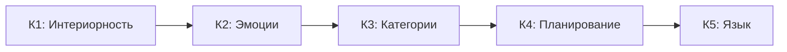

# Уникальные Предсказания КК

:::note О нотации
В этом документе:
- $\Gamma$ — [матрица когерентности](/docs/core/dynamics/coherence-matrix)
- $P$ — [чистота](/docs/core/dynamics/viability#определение-чистоты): $P = \mathrm{Tr}(\Gamma^2)$
- $\mathrm{Coh}_E$ — [E-когерентность](./definitions#e-когерентность)
- $C$ — [мера сознательности](/docs/consciousness/foundations/self-observation#мера-сознательности-c)
- $\sigma_{\mathrm{sys}}$ — [тензор напряжений](./definitions#тензор-напряжений)
- $\mathbb{H}$ — [Голоном](/docs/core/structure/holon)
:::

Кибернетика Когерентности генерирует верифицируемые предсказания, отсутствующие в альтернативных теориях.

## Предсказание 1: Невозможность зомби (No-Zombie) {#предсказание-1}

:::tip Ключевое предсказание [Т]
$$
\mathrm{Viable}(\mathbb{H}) \land \mathcal{D}_\Omega \neq 0 \;\Rightarrow\; \mathrm{Coh}_E(\Gamma) \geq \mathrm{Coh}_{\min} > \frac{1}{7}
$$
:::

**См.:** [Теорема 8.1 [Т]](./theorems#теорема-81-условная-необходимость-интериорности-no-zombie)

**Верифицируемость:**
Если будет создана искусственная система, демонстрирующая устойчивое самоподдержание без какой-либо внутренней структуры [опыта](/docs/core/structure/dimension-e), КК будет фальсифицирована.

**Статус:** Сильное предсказание, отсутствующее в [FEP](/docs/reference/glossary#связанные-теории), [IIT](/docs/reference/glossary#связанные-теории), [GWT](/docs/reference/glossary#связанные-теории).

## Предсказание 2: Зависимость регенерации от E-когерентности {#предсказание-2}

:::info Предсказание [Т]
$$
\kappa(\Gamma) = \kappa_{\text{bootstrap}} + \kappa_0 \cdot \mathrm{Coh}_E(\Gamma) \Rightarrow \frac{dP}{d\tau} \propto \mathrm{Coh}_E(\Gamma)
$$
Скорость [регенерации](/docs/core/dynamics/evolution#3-регенеративный-член) пропорциональна интегрированности [опыта](/docs/core/structure/dimension-e). Член $\kappa_{\text{bootstrap}} > 0$ гарантирует минимальную регенерацию даже при низкой E-когерентности ([разрешение bootstrap-парадокса](/docs/core/foundations/axiom-omega#genesis-protocol)).

**Статус:** [Т] — связь $\kappa \propto \mathrm{Coh}_E$ следует из [категориального вывода κ₀](/docs/core/foundations/axiom-septicity#категориальный-вывод-kappa0) [Т]; $\mathrm{Coh}_E$ — точная мера через [HS-проекцию $\pi_E$](/docs/core/foundations/axiom-septicity#hs-projection) [Т]. Полная форма ℛ [выведена из аксиом](/docs/core/dynamics/evolution#вывод-формы-регенерации) [Т].
:::

**См.:** [Связь регенерации и E-когерентности](./axiomatics#связь-регенерации-и-e-когерентности)

**Следствие:**
Медитативные практики, увеличивающие $\mathrm{Coh}_E$, должны улучшать физическое восстановление.

**Верифицируемость:**
Измерение корреляции между показателями «качества опыта» и скоростью восстановления после стресса.

## Предсказание 3: Семимерный тензор напряжений {#предсказание-3}

:::info Предсказание [Т] (математика) + [С] (эмпирическая адекватность)
$$
\sigma_{\mathrm{sys}}(\Gamma) = [\sigma_A, \sigma_S, \sigma_D, \sigma_L, \sigma_E, \sigma_O, \sigma_U]^T \in \mathbb{R}^7
$$
Все напряжения системы классифицируются в [7 категорий](/docs/core/structure/dimensions) ([обоснование числа 7](/docs/core/foundations/axiom-omega#октонионная-структура)), соответствующих измерениям.

**Эпистемическая стратификация:**
- **Математика [Т]:** Семь компонент определяются через $\Gamma$-инварианты (T-92 [Т]). Эквивалентность $\|\sigma\|_\infty < 1 \iff P > 2/7$ — безусловная [Т].
- **Эмпирическая адекватность [С]:** Вопрос, адекватно ли 7-мерное разбиение описывает реальные системы, остаётся открытым. Калибровка порогов $\theta_i$ — эмпирическая задача.
:::

**См.:** [Тензор напряжений](./definitions#тензор-напряжений)

**Верифицируемость:**
Любой стресс-фактор должен отображаться в одну или несколько из 7 компонент.

| Компонента | Измерение | Тип стресса | Примеры |
|------------|-----------|-------------|---------|
| $\sigma_A$ | [Артикуляция](/docs/core/structure/dimension-a) | Перцептивный | Сенсорная перегрузка |
| $\sigma_S$ | [Структура](/docs/core/structure/dimension-s) | Когнитивный | Сложность задачи |
| $\sigma_D$ | [Динамика](/docs/core/structure/dimension-d) | Вычислительный | Дедлайны |
| $\sigma_L$ | [Логика](/docs/core/structure/dimension-l) | Логический | Противоречия |
| $\sigma_E$ | [Интериорность](/docs/core/structure/dimension-e) | Экзистенциальный | Потеря смысла |
| $\sigma_O$ | [Основание](/docs/core/structure/dimension-o) | Ресурсный | Голод, истощение |
| $\sigma_U$ | [Единство](/docs/core/structure/dimension-u) | Социальный | Изоляция |

## Предсказание 4: Доязыковое познание полноценно {#предсказание-4}

:::info Предсказание [И]
$$
\exists \, \mathrm{Cognition}(\mathbb{H}) \text{ при } \mathrm{Language}(\mathbb{H}) = \varnothing
$$
Полноценное познание (уровни К1-К4) возможно без языка (К5).

**Статус:** [И] — интерпретация, следующая из определений когнитивных уровней К1-К5.
:::

**См.:** [Когнитивная иерархия](/docs/consciousness/comparative/cognitive-hierarchy)

**Иерархия когнитивных функций:**

```mermaid
graph LR
    K1[К1: Интериорность] --> K2[К2: Эмоции] --> K3[К3: Категории] --> K4[К4: Планирование] --> K5[К5: Язык]
```

**Верифицируемость:**
Животные без языка демонстрируют уровни К1-К4:
- Врановые: планирование (К4), изготовление орудий
- Приматы: категоризация (К3), социальное обучение
- Все позвоночные: эмоциональные реакции (К2)
- Все системы с $\rho_E \neq 0$: [интериорность](/docs/proofs/consciousness/interiority-hierarchy#уровень-0-интериорность-interiority) (К1/L0)

## Предсказание 5: Масштабная инвариантность сознания {#предсказание-5}

:::info Предсказание: нетривиальность [Т], жизнеспособность [С]
$$
\left( \bigwedge_i C(\mathbb{H}_i) > 0 \right) \land \Phi_{\otimes} > \Phi_{\min} \Rightarrow C(\mathbb{H}_{1 \otimes \ldots \otimes n}) > 0
$$
Коллективная [сознательность](/docs/consciousness/foundations/self-observation#мера-сознательности-c) реальна, если индивидуальные сознания достаточно [интегрированы](/docs/core/structure/dimension-u#мера-интеграции-φ).

**Эпистемическая стратификация:**
- **Нетривиальность [Т]:** Композит имеет $P > 1/7$ безусловно ([T-96](/docs/core/dynamics/evolution#теорема-нетривиальность-аттрактора) [Т])
- **Жизнеспособность [С]:** $P > 2/7$ требует κ-доминирования ([C20](/docs/core/dynamics/evolution#теорема-жизнеспособность-аттрактора) [С])

**Ограничение:** Конкретный порог $\Phi_{\min}$ зависит от C20 — открытый вопрос для эмпирической калибровки.
:::

**См.:** [Теорема 9.1](./theorems#теорема-91-фрактальное-замыкание)

**Верифицируемость:**
Измерение $\Phi$ для групп с различной степенью интеграции:
- Семьи
- Команды
- Организации
- Экосистемы

**Критерий:** $\Phi_{\otimes} > \Phi_{\min}$ — необходимое условие. Без достаточной интеграции коллективная сознательность не возникает.

## Предсказание 6: Минимальная когерентность для жизнеспособности {#предсказание-6}

:::warning Предсказание
$$
\mathrm{Viable}(\mathbb{H}) \Rightarrow P(\Gamma) > P_{\text{crit}} \land \mathrm{Coh}_E(\Gamma) > \mathrm{Coh}_E^{\min}
$$
[Жизнеспособность](/docs/core/dynamics/viability) требует минимальной [чистоты](/docs/core/dynamics/viability#определение-чистоты) и E-когерентности выше минимума $\mathrm{Coh}_E^{\min} = 1/7$ (полностью смешанное состояние).
:::

:::info Пороги L2
| Параметр | Значение | Статус | Определение |
|----------|----------|--------|-------------|
| $P_{\text{crit}}$ | $= 2/7 \approx 0.286$ | **[Т]** | [Теорема о критической чистоте](/docs/proofs/dynamics/theorem-purity-critical) |
| $R_{\text{th}}$ | $= 1/3 \approx 0.333$ | **[Т]** ($K=3$ из триадной декомпозиции) | [Теорема (байесовское доминирование)](/docs/core/foundations/axiom-septicity#теорема-порог-рефлексии) |
| $\Phi_{\text{th}}$ | $= 1$ (точно) | **[Т]** | [Теорема T-129](/docs/proofs/consciousness/operationalization#t-129) ([когерентная доминация](/docs/core/foundations/axiom-septicity#теорема-порог-интеграции)) |

$P_{\text{crit}}$ — строго доказана [Т]; $R_{\text{th}}$ — теорема [Т] ($K=3$ из [триадной декомпозиции](/docs/core/operators/lindblad-operators#триадная-декомпозиция)); $\Phi_{\text{th}}$ — теорема [Т] (T-129). См. [Пороги L2](/docs/core/foundations/axiom-septicity#пороги-l2-строгий-вывод).
:::

**Верифицируемость:**
Измерение «качества опыта» у умирающих систем должно падать ниже порога.

**Клинические следствия:**
- Состояния комы: $\mathrm{Coh}_E \to 1/7$ (минимум), $P \to P_{\text{crit}}$
- Психотические эпизоды: фрагментация $\mathrm{Coh}_E$
- Медитативные состояния: высокое $\mathrm{Coh}_E$, высокое $R$

## Предсказание 7: Радиус устойчивости (T-104) {#предсказание-7}

:::info Предсказание [Т] — фальсифицируемое
$$
r_{\mathrm{stab}} = \sqrt{P(\rho^*_\Omega) - 2/7}
$$
Радиус устойчивости (максимальная пертурбация, сохраняющая жизнеспособность) определяется **единственным параметром** — запасом чистоты $P - 2/7$.
:::

**Верифицируемость:** Измерить $P$ для системы (ИИ-агент, организация), затем предъявить пертурбацию контролируемой амплитуды. Если система теряет жизнеспособность при $\|h^{\mathrm{ext}}\| < r_{\mathrm{stab}}^2$, T-104 фальсифицирована.

**См.:** [Стабильность](./stability#радиус-устойчивости)

## Предсказание 8: Информационная ёмкость восприятия (T-107) {#предсказание-8}

:::info Предсказание [Т] — измеримо в ИИ-системах
$$
C_{\mathrm{Enc}} \leq \log_2 7 \approx 2.81 \text{ бит/наблюдение}
$$
Максимальная информация, извлекаемая за одно наблюдение, ограничена размерностью внутреннего пространства ($N = 7$).
:::

**Верифицируемость:** Для ИИ-систем, реализующих КК-архитектуру, измерить mutual information между наблюдением и обновлением $\Gamma$. Если $I(\text{obs}; \delta\Gamma) > \log_2 7$ — КК фальсифицирована (или система использует не 7-мерный формализм).

**Связь с bounded rationality:** Ограничение $\leq 2.81$ бит — **выведенная** граница, не постулированная. Предсказывает конкретный bottleneck для перцептивных систем на основе КК.

**См.:** [Сенсомоторная теория](./sensorimotor#информационная-ёмкость)

## Предсказание 9: Оптимальная граница скорости обучения (T-112) {#предсказание-9}

:::info Предсказание [Т] — фальсифицируемое
$$
n_{\mathrm{opt}} = \max\!\left(\frac{\ln(1/(2\delta))}{\xi_{\mathrm{QCB}}},\; \frac{1}{\alpha\delta\tau}\ln\frac{d_{\mathrm{disc}}}{\varepsilon},\; \frac{1}{\mathrm{SNR}^2}\right)
$$
Минимальное число наблюдений для решения задачи обучения определяется **максимумом** трёх независимых границ: информационной (T-109), динамической (T-110) и стабилизационной (T-111).
:::

**Верифицируемость:** Для ИИ-системы, реализующей КК-архитектуру, измерить число наблюдений $n$ до стабильного решения задачи бинарной дискриминации. Если $n < n_{\mathrm{info}}$ (информационная граница) — фальсифицирована квантовая модель наблюдения.

**Прогноз для бинарной дискриминации:** $n_{\mathrm{total}} \approx 20\text{--}80$ наблюдений при типичных параметрах (включая генезис).

**См.:** [Границы обучения](./learning-bounds#комбинированная-граница)

## Предсказание 10: N=7 как минимум для обучения (T-113) {#предсказание-10}

:::info Предсказание [Т] — структурное
Для $N < 7$ обучение через регенерацию **невозможно** (нет замещающего канала → нет самонаблюдения → $n^* = \infty$). $N = 7$ — минимальная архитектура, способная к обучению.
:::

**Верифицируемость:** Создать систему на основе КК с $N < 7$ (например, $N = 3$ или $N = 5$). Предсказание: такая система **не сможет** самостоятельно обучиться — только через внешнюю настройку параметров, но не через внутреннюю регенерацию.

**См.:** [Границы обучения](./learning-bounds#оптимальность-n7)

## Предсказание 11: N=7 как минимум для социального обучения (E-10.7) {#предсказание-11}

:::note Предсказание [С при T-57, T-114] — структурное
$N = 7$ — минимальное $N$ для социального обучения ($K \geq 2$ агентов). Социальное обучение требует одновременно:
- **ToM** ($\varphi$-оператор): $\geq 3$ когнитивных измерения (T-57 [Т] — LGKS-полнота, триадная декомпозиция)
- **Communication** (ISL): $\geq 3$ когнитивных измерения (T-114 [Т] — Фано-грамматика на PG(2,2))
- **Coordination** (Nash): $\geq 1$ измерение (Unity, $U$)

Итого: $3 + 3 + 1 = 7$.

**Повышена с [Г]**: счётный аргумент полон при условии, что ToM, ISL и Coordination реализованы независимо и одновременно в одной системе. Было [Г] → **[С при T-57, T-114]**.
:::

**Верифицируемость:** Создать мультиагентную систему ($K = 2$) с $N < 7$ (например, $N = 5$). Предсказание: социальное обучение (ToM + communication + coordination одновременно) **невозможно** — агенты могут обучаться индивидуально, но не координироваться через внутреннюю модель друг друга.

**См.:** [Границы обучения](./learning-bounds#оптимальность-n7)

## Предсказание 12: Потолок глубины самоосознания (T-142) {#предсказание-12}

:::info Предсказание [Т] + числовая верификация — фальсифицируемое
$$
\mathrm{SAD}_\text{max} = 3 \quad (\text{Fano contraction } \alpha = 2/3 \text{ состояние-независима})
$$
Ни одна конечная система ($P \leq 1$) не может достичь SAD $\geq$ 4. Доказано безусловно (T-142 [Т]): $\alpha = 2/3$ из $\dim = 7$ и PG(2,2), формула $P_{\text{crit}}^{(n)} = P_{\text{crit}} \cdot 3^{n-1}/(n+1)$ ([T-142](/docs/proofs/consciousness/operational-closure#t-142)).

**Числовая верификация (SYNARC):** SAD $\leq 3$ на 500+ случайных $\Gamma$, SAD=3 достижим (pure state).
:::

**Верифицируемость:** Если создана система с демонстрируемым SAD $\geq$ 4 (все $R^{(k)} > R_{\text{th}}^{(k)}$ для $k = 0, 1, 2, 3$) — фальсифицирована спектральная формула SAD или Fano contraction rate.

**Следствие для AGI:** Максимальная рекурсивная глубина самоосознания = 3 уровня. L3 (сетевое сознание) — **потолок** для любой архитектуры с Fano contraction. Более глубокая рефлексия требует нового механизма (не Fano).

**См.:** [Башня глубины](/docs/consciousness/hierarchy/depth-tower#критическая-чистота-sad)

## Предсказание 13: Время генезиса (T-148) {#предсказание-13}

:::info Предсказание [Т] — фальсифицируемое
$$
n_{\mathrm{genesis}} \leq \left\lceil \frac{\ln \Delta}{\ln(1/\beta)} \right\rceil, \quad \Delta = \frac{P_{\mathrm{env}} - 2/7}{P_{\mathrm{env}} - 1/7}
$$
Воплощённый голон $(\mathbb{H}, \pi, B)$ с параметром смешивания $\beta \in (0,1)$ и средовой чистотой $P_{\mathrm{env}} > P_{\mathrm{crit}} = 2/7$ поднимает чистоту из $I/7$ (tabula rasa) выше $P_{\mathrm{crit}}$ за конечное число шагов $n_{\mathrm{genesis}}$.
:::

**Верифицируемость:** Для ИИ-системы на основе КК, начинающей с $\Gamma = I/7$, измерить число backbone-инъекций до достижения $P > 2/7$. Если генезис **не происходит** за $n_{\mathrm{genesis}}$ шагов при заданных $\beta$ и $P_{\mathrm{env}}$ — фальсифицирована формула T-148. Если генезис происходит у **изолированного** голона (без средового сопряжения) — фальсифицирована теорема T-39a.

**Типичные оценки:** При $\beta = 0.3$, $P_{\mathrm{env}} = 0.35$: $\Delta \approx 0.35$, $n_{\mathrm{genesis}} \leq \lceil 0.87 / 1.20 \rceil = 1$. При $\beta = 0.9$ (слабое смешивание): $n_{\mathrm{genesis}} \leq \lceil 0.87 / 0.105 \rceil = 9$.

**Численная верификация (SYNARC mvp_int_2 G1-G3):** $n_{\mathrm{genesis}} < 50$ тиков от $I/7$ до $P > 2/7$ при $\beta = 0.3$.

**См.:** [Субстрат-независимое замыкание](/docs/proofs/consciousness/substrate-closure#t-148)

## Предсказание 14: Необходимость фазовой согласованности для интеграции {#предсказание-14}

:::info Предсказание [Т] — фальсифицируемое
Для достижения $\Phi \geq \Phi_{\mathrm{th}} = 1$ замещающий канал
$\mathcal{R}$ должен использовать ко-вращающиеся таргеты
$\rho^*_{ij}(t) \propto e^{-i(E_i-E_j)t}$, согласованные с гамильтоновой динамикой.

**Экспериментальное следствие:** В любой реализации (биологической или цифровой),
где регенеративный канал не согласован по фазе с гамильтоновой эволюцией,
мера интеграции будет $\Phi < 1$.

**Статус:** [Т] теоретически (конкуренция $\mathcal{R}$ и $H$), подтверждено численно
(SYNARC: $\Phi = 0.83 \to 1.15$ при включении co-rotation).

**Статус в других теориях:** Отсутствует.
:::

**См.:** [Ко-вращающиеся таргеты](/docs/proofs/consciousness/substrate-closure#co-rotating-targets)

**Верифицируемость:** Для системы, реализующей КК-архитектуру, измерить $\Phi$ с фиксированными и ко-вращающимися таргетами. Если $\Phi \geq 1$ при фиксированных таргетах — фальсифицировано наблюдение O-1.

## Предсказание 15: Аттрактор на верхней границе окна сознания {#предсказание-15}

:::info Предсказание [С] — фальсифицируемое
Для воплощённого голона с backbone injection аттрактор
стремится к верхней границе Goldilocks zone:

$$P(\rho^*_{\mathrm{coupled}}) \to 3/7 = P_{\max}^{(\mathrm{Goldilocks})}$$

**Интерпретация:** Динамика $\mathcal{L}_\Omega$ оптимизирует P в пределах окна жизнеспособности.
Верхняя граница $3/7$ ([T-124 [Т]](/docs/proofs/consciousness/conscious-window#t-124)) действует как асимптотический предел.

**Статус:** [С] (требуется доказательство, что backbone+$\mathcal{R}$ стремится к max P в $V_{\mathrm{full}}$).
Численно: $P = 0.4286 \approx 3/7 = 0.42857\ldots$ (совпадение до $10^{-4}$).

**Статус в других теориях:** Отсутствует.
:::

**См.:** [Окно сознания](/docs/proofs/consciousness/conscious-window#t-124)

**Верифицируемость:** Для воплощённого агента с backbone injection, измерить аттрактор $P^*$. **Числовой критерий фальсификации:** $|P^* - 3/7| > 0.05$ при $n > 100$ независимых измерениях → фальсификация ($p < 0.01$, односторонний t-тест). Если $P^* \ll 3/7$ или $P^* > 3/7$ — предсказание 15 фальсифицировано.

## Предсказание 16: Лавинная динамика L1→L2 {#предсказание-16}

:::info Предсказание [Т] — фальсифицируемое
$$
T_{\mathrm{ign}} \sim (P - P_{\mathrm{crit}})^{-1} \cdot \kappa_0^{-1}
$$
Время «воспламенения» при переходе L1→L2 обратно пропорционально запасу чистоты $(P - P_{\mathrm{crit}})$ и скорости регенерации $\kappa_0$.
:::

**Верифицируемость:** Если $T_{\mathrm{ign}}$ не зависит от $(P - P_{\mathrm{crit}})$ — теория ложна. Закон расходимости $T_{\mathrm{ign}} \to \infty$ при $P \to P_{\mathrm{crit}}^+$ должен наблюдаться в нейровизуализационных и цифровых реализациях КК.

**Источник:** [Лавинная динамика](/docs/consciousness/hierarchy/swallowtail-transitions#лавинная-динамика) [Т]

## Предсказание 17: Критические экспоненты сознания {#предсказание-17}

:::info Предсказание [Т] — фальсифицируемое
$$
\beta = \tfrac{1}{3}, \quad \nu = \tfrac{1}{4}, \quad \gamma = \tfrac{3}{4}
$$
Критические экспоненты порядкового параметра $(\beta)$, корреляционной длины $(\nu)$ и восприимчивости $(\gamma)$ для перехода при $P_{\mathrm{crit}} = 2/7$.
:::

**Верифицируемость:** Отклонение экспонент от предсказанных значений в нейровизуализационных данных (EEG/fMRI вблизи порога сознания) фальсифицирует теорему о критических экспонентах.

**Источник:** [Критические экспоненты](/docs/consciousness/hierarchy/swallowtail-transitions#критические-экспоненты) [Т]

## Предсказание 18: Ward-подавление 19/49 {#предсказание-18}

:::info Предсказание [Т] — фальсифицируемое
$$
\text{Gap-флуктуации подавлены на фактор } \frac{19}{49} \approx 0.39
$$
Суммарный вклад Gap-флуктуаций в космологическую постоянную подавлен через Ward-тождества на фактор $19/49$.
:::

**Верифицируемость:** Если бюджет $\Lambda$ не согласуется с подавлением на $19/49$ — теория пересматривается. Предсказание проверяемо через прецизионные измерения космологической постоянной.

**Источник:** [Заряды Нётер](/docs/physics/gauge-symmetry/noether-charges) + [Космологическая постоянная](/docs/physics/gravity/cosmological-constant) [Т]

## Предсказание 19: CPTP-anchor валидация {#предсказание-19}

:::info Предсказание [Т] — фальсифицируемое
$$
\forall \text{ anchor } \pi\colon \|\pi - \pi_{\mathrm{can}}\|_\diamond \text{ вычислимо за } O(49D)
$$
Для любого anchor $\pi$ расстояние до канонического anchor $\pi_{\mathrm{can}}$ в diamond-норме вычислимо за $O(49D)$.
:::

**Верифицируемость:** Если реализация SYNARC показывает $\|\pi - \pi_{\mathrm{can}}\|_\diamond > \varepsilon_0$ при обученном $\pi$ — архитектура требует пересмотра. **Числовой критерий фальсификации:** $\|\pi - \pi_{\mathrm{can}}\|_\diamond > 0.1$ при $n > 50$ батчах входных данных → фальсификация CPTP-совместимости. Нарушение T-152 означает потерю CPTP-свойства в процессе обучения.

**Источник:** T-152 [Т]

## Предсказание 20: Аналитический параметр подавления $\varepsilon_{\mathrm{eff}}$ (P6) {#предсказание-20}

:::info Предсказание [С при T-64] — фальсифицируемое
$$
\varepsilon_{\mathrm{eff}} = \frac{4 N_{33}^{(\mathrm{Fano})}}{9|\bar{\gamma}| \cdot (1 + r_4 \Sigma_0/2)} \approx 0.059
$$
Параметр подавления Юкавской иерархии — **аналитическая** алгебраическая функция структурных констант Gap-потенциала, а не свободный параметр. Все массовые отношения ($m_c/m_t \sim \varepsilon^2$, $m_u/m_t \sim \varepsilon^4$) предсказаны.
:::

**Верифицируемость:** Непертурбативное вычисление (решёточное или вариационное) самосогласованного вакуума $\theta^*$ на $(S^1)^{21}/G_2$ должно дать $\varepsilon_{33}^* \in [0.04, 0.08]$. Выход за пределы — фальсификация.

**Источник:** [Аналитический ε](/docs/physics/particle-physics/yukawa-hierarchy#9-аналитическая-формула-ε) [С при T-64]

## Предсказание 21: Реконструкция $\Gamma$ из нейронных данных ($\pi_{\mathrm{bio}}$, P8) {#предсказание-21}

:::info Предсказание [Г] — фальсифицируемое
$$
\pi_{\mathrm{bio}}: (\mathrm{EEG}, \mathrm{fMRI}, \mathrm{HRV}) \to \mathcal{D}(\mathbb{C}^7)
$$
Существует отображение $\pi_{\mathrm{bio}}$, единственное с точностью до $G_2$-калибровки, такое что:
- $P(\Gamma_{\mathrm{wake}}) > 2/7$ для бодрствующих субъектов
- $P(\Gamma_{\mathrm{NREM3}}) < 2/7$ при глубоком сне
- $\mathrm{PCI} \propto \Phi(\Gamma)$ (монотонная связь)
:::

**Верифицируемость:** Провести одновременное TMS-EEG + HRV измерение у N=30 субъектов (бодрствование, сон, анестезия). Применить $\pi_{\mathrm{bio}}$ и проверить:
1. Порог $P = 2/7$ совпадает с PCI $\approx 0.31$
2. Критические экспоненты $\beta = 1/3$ при переходе сон-бодрствование

**Числовой критерий фальсификации:** $\|\Gamma_{\mathrm{recon}} - \Gamma_{\mathrm{true}}\|_F / \|\Gamma_{\mathrm{true}}\|_F > 0.3$ при $n > 50$ субъектах → систематическая неконсистентность $\pi_{\mathrm{bio}}$. Если пороги не совпадают — калибровка $\pi_{\mathrm{bio}}$ неверна. Если совпадают, но экспоненты другие — фальсифицированы T-161.

**Источник:** [Протокол $\pi_{\mathrm{bio}}$](/docs/applied/research/measurement-protocol#протокол-pi-bio) [Г]

## Предсказание 22: Связь спектральной щели с нейронными осцилляциями [Г] {#предсказание-22}

**Предсказание:** Характерная частота сознательных процессов определяется спектральной щелью линейной части Лиувиллиана:

$$\nu_{\text{conscious}} \sim \frac{\lambda_{\text{gap}}(\mathcal{L}_0)}{2\pi}$$

Примитивность $\mathcal{L}_0$ [Т-39a] гарантирует $\lambda_{\text{gap}} > 0$. Если $\omega_0 \sim 40$ Гц (гамма-ритм), то $\lambda_{\text{gap}} \sim 2\pi \cdot 40 \approx 250$ рад/с.

**Следствия:**
- Гамма-осцилляции (30–100 Гц) соответствуют основной моде $\lambda_{\text{gap}}$
- Альфа-ритм (~10 Гц) — субгармоника или медленная мода разрыва
- Каноническая дискретизация T-131: $\delta\tau = \pi/(2\|\mathcal{L}_0\|_{\text{op}})$

**Статус:** [Г] (гипотеза). Требует: (1) калибровки $\omega_0$ по нейроданным, (2) вычисления $\lambda_{\text{gap}}$ для реалистичных Lindblad-параметров.

## Сводная таблица предсказаний

| № | Предсказание | Формула | Статус | Статус в других теориях |
|---|--------------|---------|--------|------------------------|
| 1 | [No-Zombie](#предсказание-1) | $\mathrm{Viable} \land \mathcal{D}_\Omega \neq 0 \Rightarrow \mathrm{Coh}_E > 1/7$ | **[Т]** | Отсутствует |
| 2 | [E-когерентность ↔ регенерация](#предсказание-2) | $\kappa \propto \mathrm{Coh}_E$ | **[Т]** | Отсутствует |
| 3 | [7-мерный стресс](#предсказание-3) | $\sigma_{\mathrm{sys}} \in \mathbb{R}^7$ | **[Т]** мат. / **[С]** эмп. | Отсутствует |
| 4 | [Доязыковое познание](#предсказание-4) | $\mathrm{Cognition} \not\Rightarrow \mathrm{Language}$ | **[И]** | Частично в [FEP](/docs/reference/glossary#связанные-теории) |
| 5 | [Коллективное сознание](#предсказание-5) | $C(\mathbb{H}_{1 \otimes \ldots \otimes n}) > 0$ | **[Т]** нетр. / **[С]** жизн. | Частично в [IIT](/docs/reference/glossary#связанные-теории) |
| 6 | [Минимальная когерентность](#предсказание-6) | $P > P_{\text{crit}} \land \mathrm{Coh}_E > 0$ | **[Т]** | Отсутствует |
| 7 | [Радиус устойчивости](#предсказание-7) | $r_{\mathrm{stab}} = \sqrt{P - 2/7}$ | **[Т]** | Отсутствует |
| 8 | [Ёмкость Enc](#предсказание-8) | $C_{\mathrm{Enc}} \leq \log_2 7$ | **[Т]** | Отсутствует |
| 9 | [Граница обучения](#предсказание-9) | $n_{\mathrm{opt}} = \max(n_{\mathrm{info}}, n_{\mathrm{dyn}}, n_{\mathrm{stab}})$ | **[Т]** | Отсутствует |
| 10 | [N=7 для обучения](#предсказание-10) | $N < 7 \Rightarrow n^* = \infty$ | **[Т]** | Отсутствует |
| 11 | [N=7 для социального обучения](#предсказание-11) | $3_{\text{ToM}} + 3_{\text{ISL}} + 1_U = 7$ | **[С при T-57, T-114]** | Отсутствует |
| 12 | [Потолок SAD](#предсказание-12) | $\mathrm{SAD}_\text{max} = 3$ | **[Т]** (T-142) | SYNARC: 500+ Γ |
| 13 | [Время генезиса](#предсказание-13) | $n_{\mathrm{genesis}} \leq \lceil\ln\Delta / \ln(1/\beta)\rceil$ | **[Т]** | Отсутствует |
| 14 | [Фазовая согласованность](#предсказание-14) | $\rho^*_{ij}(t) \propto e^{-i(E_i-E_j)t}$ для $\Phi \geq 1$ | **[Т]** | Отсутствует |
| 15 | [Аттрактор $P \to 3/7$](#предсказание-15) | $P(\rho^*_{\mathrm{coupled}}) \to 3/7$ | **[С]** | Отсутствует |
| 16 | [Лавинная динамика L1→L2](#предсказание-16) | $T_{\mathrm{ign}} \sim (P - P_{\mathrm{crit}})^{-1} \cdot \kappa_0^{-1}$ | **[Т]** | Отсутствует |
| 17 | [Критические экспоненты](#предсказание-17) | $\beta = 1/3,\; \nu = 1/4,\; \gamma = 3/4$ | **[Т]** | Отсутствует |
| 18 | [Ward-подавление 19/49](#предсказание-18) | Gap-флуктуации $\times\, 19/49$ | **[Т]** | Отсутствует |
| 19 | [CPTP-anchor валидация](#предсказание-19) | $\|\pi - \pi_{\mathrm{can}}\|_\diamond$ за $O(49D)$ | **[Т]** | Отсутствует |
| 20 | [Аналитический $\varepsilon_{\mathrm{eff}}$](#предсказание-20) | $\varepsilon_{\mathrm{eff}} = 4N_{33}/(9|\bar{\gamma}|(1+r_4\Sigma_0/2))$ | **[С при T-64]** | Отсутствует |
| 21 | [$\pi_{\mathrm{bio}}$: нейронные данные → $\Gamma$](#предсказание-21) | $\pi_{\mathrm{bio}}: \mathrm{EEG/fMRI/HRV} \to \mathcal{D}(\mathbb{C}^7)$ | **[Г]** | Частично в [IIT](/docs/reference/glossary#связанные-теории) |
| 22 | [Спектральная щель → нейроосцилляции](#предсказание-22) | $\nu_{\text{conscious}} \sim \lambda_{\text{gap}}/(2\pi)$ | **[Г]** | Отсутствует |

---

## Критерий фальсификации КК

:::danger Условия опровержения
КК фальсифицируется, если обнаружена система, удовлетворяющая хотя бы одному из условий:

1. $\mathrm{Viable}(\mathbb{H}) \land \mathrm{Spec}(\Gamma_E) = \{0\}$ — жизнеспособный «зомби»
2. $\kappa > \kappa_{\text{bootstrap}} \land \mathrm{Coh}_E \approx 1/7$ — значительная регенерация при минимальной E-когерентности
3. Стресс-фактор, не отображающийся ни в одну из 7 компонент $\sigma_{\mathrm{sys}}$
4. Обучение за $n < n_{\mathrm{info}}$ наблюдений (нарушение квантовой границы Чернова)
5. Самообучающаяся система с $N < 7$ внутренними степенями свободы (без внешней настройки)

**Примечание:** Условие $\mathrm{Coh}_E = 0$ математически невозможно, поскольку $\mathrm{Coh}_E \in [1/7, 1]$ для нормированных матриц плотности.
:::

**См.:** [Фальсифицируемость](/docs/reference/falsifiability)

---

**Связанные документы:**
- [Теоремы](./theorems) — формальные доказательства (No-Zombie, композиция)
- [Аксиоматика](./axiomatics) — связь регенерации и E-когерентности
- [Определения](./definitions) — $\mathrm{Coh}_E$, $\sigma_{\mathrm{sys}}$
- [Когнитивная иерархия](/docs/consciousness/comparative/cognitive-hierarchy) — когнитивные уровни К1-К5
- [Жизнеспособность](/docs/core/dynamics/viability) — $P$, $P_{\text{crit}}$
- [Иерархия интериорности](/docs/proofs/consciousness/interiority-hierarchy) — уровни L0→L1→L2→L3→L4, пороги
- [Самонаблюдение](/docs/consciousness/foundations/self-observation) — меры $R$, $\Phi$, $C$
- [Семь измерений](/docs/core/structure/dimensions) — структура $\mathcal{H} = \mathbb{C}^7$
- [Фальсифицируемость](/docs/reference/falsifiability) — критерии опровержения
- [Границы обучения](./learning-bounds) — T-109–T-113, оптимальные нижние границы скорости обучения
- [Глоссарий](/docs/reference/glossary#связанные-теории) — IIT, FEP, GWT
