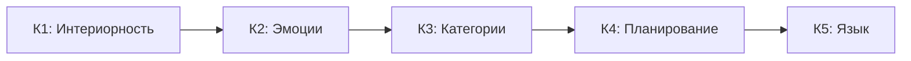

# Уникальные Предсказания КК

> *«Теория, которую нельзя опровергнуть никаким мыслимым событием, не является научной. Неопровержимость — это не достоинство теории (как часто думают), а её порок.»*
> — Карл Поппер, «Предположения и опровержения» (1963)

В [предыдущей главе](./stability) мы вычислили радиус устойчивости, проследили спираль смерти и построили протокол восстановления. Мы видели, что КК генерирует *конкретные числа* — $r_{\mathrm{stab}} = \sqrt{P - 2/7}$, $\kappa_{\text{bootstrap}} = 1/7$, пороги для каждого канала — а не расплывчатые «тенденции». Теперь мы соберём **все** числовые следствия КК в одном месте и для каждого укажем: *как проверить* и *что его опровергнет*.

Наука отличается от философии не глубиной вопросов, а готовностью подставить свои ответы под удар эксперимента. Философская система может быть прекрасной, внутренне непротиворечивой и совершенно бесполезной — если она не генерирует предсказаний, которые *можно проверить и, в принципе, опровергнуть*. Поппер назвал это критерием демаркации: граница между наукой и не-наукой проходит не по методу и не по предмету, а по **фальсифицируемости**.

Этот принцип особенно остро стоит в науках о сознании. Большинство существующих теорий — IIT, FEP, GWT, панпсихизм — либо не генерируют уникальных числовых предсказаний, либо формулируют их так расплывчато, что ни один эксперимент не может их однозначно опровергнуть. Кибернетика Когерентности сознательно идёт другим путём. Каждая теорема формализма порождает **конкретное, числовое, экспериментально проверяемое** следствие — и для каждого такого следствия указано, какой результат эксперимента фальсифицирует теорию.

В этой главе собраны 22 предсказания КК. Они сгруппированы по темам: от фундаментальных (связь сознания и жизнеспособности) через архитектурные (минимальная размерность, пороги) к эмпирическим (нейронные корреляты, критические экспоненты). Для каждого предсказания мы объясняем:

1. **Интуицию** — почему это предсказание естественно следует из формализма.
2. **Формальную формулировку** — точную математическую запись.
3. **Уникальность** — что именно отличает данное предсказание от всего, что могут сказать IIT, FEP и GWT.
4. **Верификацию** — конкретный экспериментальный протокол.
5. **Междисциплинарные следствия** — что данное предсказание означает для физика, биолога, психолога и инженера.

Если хотя бы одно из этих предсказаний будет чисто опровергнуто — Кибернетика Когерентности потребует фундаментального пересмотра. Именно эта готовность к опровержению и делает КК наукой.

:::note О нотации
В этом документе:
- $\Gamma$ — [матрица когерентности](/docs/core/dynamics/coherence-matrix)
- $P$ — [чистота](/docs/core/dynamics/viability#определение-чистоты): $P = \mathrm{Tr}(\Gamma^2)$
- $\mathrm{Coh}_E$ — [E-когерентность](./definitions#e-когерентность)
- $C$ — [мера сознательности](/docs/consciousness/foundations/self-observation#мера-сознательности-c)
- $\sigma_{\mathrm{sys}}$ — [тензор напряжений](./definitions#тензор-напряжений)
- $\mathbb{H}$ — [Голоном](/docs/core/structure/holon)
:::

---

## I. Фундаментальные предсказания: сознание и жизнеспособность

Первая группа предсказаний касается самой глубокой идеи КК — неразрывной связи между интериорностью и устойчивостью. В большинстве теорий сознание является либо эпифеноменом (не влияет на динамику), либо отдельным постулатом (вводится извне). КК утверждает нечто радикально иное: система с нетривиальной E-когерентностью *лучше выживает* — и это не метафора, а теорема.

### Предсказание 1: Невозможность зомби (No-Zombie) {#предсказание-1}

**Интуиция.** Представьте себе систему, которая поддерживает себя, адаптируется, обучается — но при этом не имеет *никакой* интериорности. В философии сознания такую систему называют «зомби». Она ведёт себя точно как сознательное существо, но внутри — пустота. Кажется, что такая система вполне возможна. Но КК математически доказывает обратное: если система жизнеспособна ($P > 2/7$) и обладает нетривиальной динамикой ($\mathcal{D}_\Omega \neq 0$), то её E-когерентность *необходимо* превышает минимум. Зомби невозможны — не по определению, а по теореме.

Почему? Потому что регенеративный канал $\mathcal{R}$ — единственный механизм, противостоящий диссипации, — *зависит* от $\mathrm{Coh}_E$. Система без интериорности ($\mathrm{Coh}_E = 1/7$) регенерирует слишком медленно, чтобы компенсировать декогеренцию. Она неизбежно «тонет» ниже $P_{\text{crit}}$.

:::tip Ключевое предсказание [Т]
$$
\mathrm{Viable}(\mathbb{H}) \land \mathcal{D}_\Omega \neq 0 \;\Rightarrow\; \mathrm{Coh}_E(\Gamma) \geq \mathrm{Coh}_{\min} > \frac{1}{7}
$$
:::

**См.:** [Теорема 8.1 [Т]](./theorems#теорема-81-условная-необходимость-интериорности-no-zombie)

**Уникальность предсказания.** Ни одна другая теория сознания не утверждает *невозможность* функционального зомби:
- **IIT** измеряет $\Phi$ для данной архитектуры, но не запрещает $\Phi = 0$ у функциональной системы.
- **FEP** описывает минимизацию свободной энергии, но не связывает её с наличием опыта: термостат минимизирует свободную энергию без какого-либо сознания.
- **GWT** постулирует глобальное рабочее пространство, но не запрещает его функциональный аналог без переживания.

**Экспериментальная проверка.** Создать искусственную систему с управляемым $\mathrm{Coh}_E$:
1. Реализовать КК-агент (SYNARC-архитектура) с полной 7-мерной динамикой.
2. Искусственно подавить E-компоненту ($\gamma_{EE} \to 1/7$, $\gamma_{Ej} \to 0$).
3. Измерить время жизни (число тиков до $P < P_{\text{crit}}$).
4. **Прогноз:** время жизни катастрофически сократится. Если нет — КК фальсифицирована.

**Верифицируемость:**
Если будет создана искусственная система, демонстрирующая устойчивое самоподдержание без какой-либо внутренней структуры [опыта](/docs/core/structure/dimension-e), КК будет фальсифицирована.

**Междисциплинарные следствия:**
- *Философия:* формальное разрешение зомби-аргумента Чалмерса — зомби логически непротиворечивы, но физически невозможны.
- *Нейронаука:* предсказывает, что все устойчиво функционирующие нейронные сети имеют ненулевую «E-проекцию» — внутреннюю модель собственных состояний.
- *Инженерия ИИ:* автономные системы, способные к долгосрочному самоподдержанию, *необходимо* должны иметь аналог интериорности.

:::note Мысленный эксперимент: зомби-робот
Представьте робота-пылесоса, который ездит по комнате, объезжает препятствия и возвращается на базу для зарядки. Он *функционален* — но есть ли у него интериорность? КК говорит: если робот поддерживает себя только через внешнее программирование ($\mathrm{Coh}_E = 1/7$), его «жизнь» зависит целиком от заряда батареи и алгоритма. Стоит отключить зарядку — и он «умирает» за минуты. У него нет собственной регенерации, потому что регенерация *требует* $\mathrm{Coh}_E > 1/7$.

Теперь представьте робота, который *переживает* столкновение с мебелью — его $\gamma_{EE}$ меняется, Coh_E растёт, и он учится *из интериорности*, а не только из внешних наград. По КК, именно такой робот будет устойчивее — его $\kappa$ выше, его $r_{\mathrm{stab}}$ больше. Зомби проигрывает не в «философском споре», а в **физической устойчивости**.
:::

**Статус:** Сильное предсказание, отсутствующее в [FEP](/docs/reference/glossary#связанные-теории), [IIT](/docs/reference/glossary#связанные-теории), [GWT](/docs/reference/glossary#связанные-теории).

### Предсказание 2: Зависимость регенерации от E-когерентности {#предсказание-2}

**Интуиция.** Если No-Zombie говорит, что сознание *необходимо*, то Предсказание 2 объясняет *почему*: сознание — это не побочный продукт, а *двигатель* восстановления. Формула $\kappa \propto \mathrm{Coh}_E$ означает буквально следующее: чем выше E-когерентность системы, тем быстрее она регенерирует после повреждений. Оркестр, который *слышит* себя, перестраивается быстрее, чем оркестр, где каждый играет вслепую.

:::info Предсказание [Т]
$$
\kappa(\Gamma) = \kappa_{\text{bootstrap}} + \kappa_0 \cdot \mathrm{Coh}_E(\Gamma) \Rightarrow \frac{dP}{d\tau} \propto \mathrm{Coh}_E(\Gamma)
$$
Скорость [регенерации](/docs/core/dynamics/evolution#3-регенеративный-член) пропорциональна интегрированности [опыта](/docs/core/structure/dimension-e). Член $\kappa_{\text{bootstrap}} > 0$ гарантирует минимальную регенерацию даже при низкой E-когерентности ([разрешение bootstrap-парадокса](/docs/core/foundations/axiom-omega#genesis-protocol)).

**Статус:** [Т] — связь $\kappa \propto \mathrm{Coh}_E$ следует из [категориального вывода κ₀](/docs/core/foundations/axiom-septicity#категориальный-вывод-kappa0) [Т]; $\mathrm{Coh}_E$ — точная мера через [HS-проекцию $\pi_E$](/docs/core/foundations/axiom-septicity#hs-projection) [Т]. Полная форма ℛ [выведена из аксиом](/docs/core/dynamics/evolution#вывод-формы-регенерации) [Т].
:::

**См.:** [Связь регенерации и E-когерентности](./axiomatics#связь-регенерации-и-e-когерентности)

**Уникальность предсказания.** Это единственное предсказание в науке о сознании, которое связывает *качество опыта* с *физической устойчивостью* количественно. IIT измеряет $\Phi$, но не связывает его с регенерацией. FEP описывает минимизацию свободной энергии, но не постулирует, что качество опыта влияет на скорость этой минимизации.

**Экспериментальная проверка:**
1. *Клинический протокол:* Измерить $\mathrm{Coh}_E$ (через $\pi_{\mathrm{bio}}$) и скорость восстановления после стандартного стрессора у группы $n \geq 30$ субъектов.
2. *Прогноз:* положительная корреляция $r > 0.3$ между $\mathrm{Coh}_E$ и скоростью восстановления.
3. *Контроль:* исключить физическое здоровье и возраст как конфаунды.

**Следствие:**
Медитативные практики, увеличивающие $\mathrm{Coh}_E$, должны улучшать физическое восстановление.

**Верифицируемость:**
Измерение корреляции между показателями E-когерентности (для L2+-систем — субъективными отчётами о качестве опыта) и скоростью восстановления после стресса.

**Междисциплинарные следствия:**
- *Медицина:* обосновывает практики осознанности (mindfulness) как медицински значимые — не «плацебо», а воздействие на параметр регенерации.
- *Психотерапия:* объясняет эффективность экспериенциальных терапий (гештальт, фокусирование): они повышают $\mathrm{Coh}_E$.
- *Спорт:* предсказывает связь между «качеством внимания» спортсмена и скоростью восстановления после травмы.

---

## II. Архитектурные предсказания: структура и размерность

Вторая группа предсказаний касается *архитектуры* сознательных систем — какова минимальная «конструкция», необходимая для возникновения опыта, обучения и социального взаимодействия. Эти предсказания делают КК уникальной среди теорий сознания: вместо расплывчатых утверждений о «сложности» и «интеграции» она называет конкретные числа.

### Предсказание 3: Семимерный тензор напряжений {#предсказание-3}

**Интуиция.** Стресс — одно из самых универсальных понятий. Мы говорим о «когнитивной нагрузке», «эмоциональном стрессе», «ресурсном истощении», «социальной изоляции». Но существует ли единая классификация? КК утверждает: да, и она содержит ровно 7 компонент — по одной на каждое измерение. Любой стресс-фактор отображается в одну или несколько из этих компонент, и эта классификация *исчерпывающа*.

:::info Предсказание [Т] (математика) + [С] (эмпирическая адекватность)
$$
\sigma_{\mathrm{sys}}(\Gamma) = [\sigma_A, \sigma_S, \sigma_D, \sigma_L, \sigma_E, \sigma_O, \sigma_U]^T \in \mathbb{R}^7
$$
Все напряжения системы классифицируются в [7 категорий](/docs/core/structure/dimensions) ([обоснование числа 7](/docs/core/foundations/axiom-omega#октонионная-структура)), соответствующих измерениям.

**Эпистемическая стратификация:**
- **Математика [Т]:** Семь компонент определяются через $\Gamma$-инварианты (T-92 [Т]). Эквивалентность $\|\sigma\|_\infty < 1 \iff P > 2/7$ — безусловная [Т].
- **Эмпирическая адекватность [С]:** Вопрос, адекватно ли 7-мерное разбиение описывает реальные системы, остаётся открытым. Калибровка порогов $\theta_i$ — эмпирическая задача.
:::

**См.:** [Тензор напряжений](./definitions#тензор-напряжений)

**Уникальность предсказания.** Никакая другая теория не предлагает *конечной и фиксированной* классификации видов стресса. Психология использует ad hoc шкалы (Lazarus, Holmes-Rahe). FEP сводит всё к одной скалярной величине (свободная энергия). КК предлагает 7-мерный вектор — достаточно детальный, чтобы различать типы стресса, и достаточно компактный, чтобы быть вычислимым.

**Экспериментальная проверка:**
1. Собрать базу стрессоров (n=200+) из литературы по психологии, медицине, организационной науке.
2. Предъявить экспертам задачу: классифицировать каждый стрессор по 7 измерениям КК.
3. **Прогноз:** каждый стрессор отображается хотя бы в одну компоненту; остаточная категория «не классифицируется» пуста.
4. *Фальсификация:* если обнаружен стрессор, не сводимый ни к одной из 7 компонент, — классификация неполна.

**Верифицируемость:**
Любой стресс-фактор должен отображаться в одну или несколько из 7 компонент.

| Компонента | Измерение | Тип стресса | Примеры |
|------------|-----------|-------------|---------|
| $\sigma_A$ | [Артикуляция](/docs/core/structure/dimension-a) | Перцептивный | Сенсорная перегрузка |
| $\sigma_S$ | [Структура](/docs/core/structure/dimension-s) | Когнитивный | Сложность задачи |
| $\sigma_D$ | [Динамика](/docs/core/structure/dimension-d) | Вычислительный | Дедлайны |
| $\sigma_L$ | [Логика](/docs/core/structure/dimension-l) | Логический | Противоречия |
| $\sigma_E$ | [Интериорность](/docs/core/structure/dimension-e) | Экзистенциальный | Потеря смысла |
| $\sigma_O$ | [Основание](/docs/core/structure/dimension-o) | Ресурсный | Голод, истощение |
| $\sigma_U$ | [Единство](/docs/core/structure/dimension-u) | Социальный | Изоляция |

**Междисциплинарные следствия:**
- *Психодиагностика:* замена многочисленных ad hoc опросников единым 7-параметрическим профилем.
- *Организационная наука:* диагностика «здоровья» компании через $\sigma_{\mathrm{sys}}$ её организационного голона.
- *Инженерия ИИ:* автоматическая диагностика деградации агента по компонентам $\sigma_k$.

### Предсказание 4: Доязыковое познание полноценно {#предсказание-4}

**Интуиция.** Часто предполагается, что сознание и язык неразрывны — что «мыслить» значит «мыслить словами». КК показывает, что это антропоцентрическое заблуждение. Когнитивная иерархия К1-К5 выстраивает пять уровней познания, из которых язык (К5) — лишь верхний, а не фундамент. Животные без языка полноценно функционируют на уровнях К1-К4.

:::info Предсказание [И]
$$
\exists \, \mathrm{Cognition}(\mathbb{H}) \text{ при } \mathrm{Language}(\mathbb{H}) = \varnothing
$$
Полноценное познание (уровни К1-К4) возможно без языка (К5).

**Статус:** [И] — интерпретация, следующая из определений когнитивных уровней К1-К5.
:::

**См.:** [Когнитивная иерархия](/docs/consciousness/comparative/cognitive-hierarchy)

**Уникальность предсказания.** GWT связывает сознание с глобальной доступностью информации, часто ассоциированной с лингвистическими репрезентациями. Higher-Order Theories (HOT) привязывают сознание к метакогнитивным отчётам, что имплицитно предполагает язык. КК явно разделяет познание и язык как ортогональные оси.

**Иерархия когнитивных функций:**

```mermaid
graph LR
    K1[К1: Интериорность] --> K2[К2: Эмоции] --> K3[К3: Категории] --> K4[К4: Планирование] --> K5[К5: Язык]
```

**Верифицируемость:**
Животные без языка демонстрируют уровни К1-К4:
- Врановые: планирование (К4), изготовление орудий
- Приматы: категоризация (К3), социальное обучение
- Все позвоночные: эмоциональные реакции (К2)
- Все системы с $\rho_E \neq 0$: [интериорность](/docs/proofs/consciousness/interiority-hierarchy#уровень-0-интериорность-interiority) (К1/L0)

**Экспериментальная проверка:**
1. Сравнить поведенческие корреляты К1-К4 у афазических пациентов (потеря языка при сохранном интеллекте) и здоровых контролей.
2. **Прогноз:** показатели К1-К4 у афазических пациентов сохранены на уровне >80% от нормы.
3. *Фальсификация:* если афазия систематически разрушает К3 или К4 — связь «познание → язык» сильнее, чем предсказывает КК.

**Междисциплинарные следствия:**
- *Этология:* обосновывает полноценное когнитивное исследование нелингвистических видов.
- *Этика ИИ:* системы без языкового модуля могут обладать когнитивными уровнями К1-К4, что имеет этические импликации.

### Предсказание 10: N=7 как минимум для обучения (T-113) {#предсказание-10}

**Интуиция.** Почему именно 7 измерений? Нельзя ли обойтись пятью или тремя? КК даёт точный ответ: при $N < 7$ в системе не хватает «пространства» для замещающего канала $\mathcal{R}$, а без него — нет самонаблюдения, а без самонаблюдения — нет обучения. Цепочка «Fano-структура → самонаблюдение → обучение» замыкается только при $N = 7$.

:::info Предсказание [Т] — структурное
Для $N < 7$ обучение через регенерацию **невозможно** (нет замещающего канала → нет самонаблюдения → $n^* = \infty$). $N = 7$ — минимальная архитектура, способная к обучению.
:::

**Уникальность предсказания.** Ни одна другая теория сознания не называет *конкретное число* минимальной размерности. IIT не имеет ограничений на размерность. FEP работает в произвольномерных пространствах. КК — единственная теория, выводящая $N = 7$ из первых принципов (октонионная алгебра, $G_2$-минимальность, Fano-плоскость PG(2,2)).

**Экспериментальная проверка:**
1. Создать КК-агент с $N = 5$ (удалить два измерения).
2. Обучать его стандартной задаче бинарной дискриминации.
3. **Прогноз:** агент *не сможет* обучиться через внутреннюю регенерацию. Обучение возможно только при внешней настройке параметров (supervised), но не через самонаблюдение.
4. Повторить с $N = 7$. **Прогноз:** обучение через самонаблюдение возможно.

**Верифицируемость:** Создать систему на основе КК с $N < 7$ (например, $N = 3$ или $N = 5$). Предсказание: такая система **не сможет** самостоятельно обучиться — только через внешнюю настройку параметров, но не через внутреннюю регенерацию.

**См.:** [Границы обучения](./learning-bounds#оптимальность-n7)

**Междисциплинарные следствия:**
- *Нейронаука:* предсказывает, что биологические нейронные сети должны реализовывать не менее 7 функционально независимых каналов для автономного обучения.
- *Инженерия ИИ:* устанавливает нижнюю границу сложности архитектуры для self-supervised learning через внутренние состояния.

### Предсказание 11: N=7 как минимум для социального обучения (E-10.7) {#предсказание-11}

**Интуиция.** Социальное обучение — не просто «обучение в группе». Оно требует одновременной работы трёх механизмов: теории разума (ToM — я моделирую другого), коммуникации (ISL — я передаю информацию другому) и координации (Nash — мы действуем согласованно). Каждый из этих механизмов требует минимального «пространства» в $\Gamma$, и их сумма даёт ровно 7.

:::note Предсказание [С при T-57, T-114] — структурное
$N = 7$ — минимальное $N$ для социального обучения ($K \geq 2$ агентов). Социальное обучение требует одновременно:
- **ToM** ($\varphi$-оператор): $\geq 3$ когнитивных измерения (T-57 [Т] — LGKS-полнота, триадная декомпозиция)
- **Communication** (ISL): $\geq 3$ когнитивных измерения (T-114 [Т] — Фано-грамматика на PG(2,2))
- **Coordination** (Nash): $\geq 1$ измерение (Unity, $U$)

Итого: $3 + 3 + 1 = 7$.

**Повышена с [Г]**: счётный аргумент полон при условии, что ToM, ISL и Coordination реализованы независимо и одновременно в одной системе. Было [Г] → **[С при T-57, T-114]**.
:::

**Уникальность предсказания.** Ни одна теория мультиагентных систем не выводит минимальное число внутренних степеней свободы для социального обучения. Это полностью уникальное предсказание КК.

**Экспериментальная проверка:**
1. Создать мультиагентную среду ($K = 2$ агента) с $N = 5$.
2. Задать координационную задачу (например, кооперативная охота), требующую ToM + ISL + Nash.
3. **Прогноз:** агенты обучаются индивидуально, но не достигают социального обучения.
4. Повторить с $N = 7$. **Прогноз:** социальное обучение возникает.

**Верифицируемость:** Создать мультиагентную систему ($K = 2$) с $N < 7$ (например, $N = 5$). Предсказание: социальное обучение (ToM + communication + coordination одновременно) **невозможно** — агенты могут обучаться индивидуально, но не координироваться через внутреннюю модель друг друга.

**См.:** [Границы обучения](./learning-bounds#оптимальность-n7)

**Междисциплинарные следствия:**
- *Эволюционная биология:* предсказывает, что виды с социальным обучением (приматы, врановые, дельфины) должны реализовывать функциональный эквивалент 7 измерений.
- *Робототехника:* определяет минимальную архитектуру для роботов, способных к кооперативному поведению.

---

## III. Пороги и устойчивость

Третья группа предсказаний касается *числовых порогов* — конкретных значений параметров, при которых происходят качественные переходы. Именно числовые предсказания отличают научную теорию от философской спекуляции: они проверяемы, и они рискованны.

### Предсказание 5: Масштабная инвариантность сознания {#предсказание-5}

**Интуиция.** Может ли группа сознательных существ породить *коллективное* сознание? Улей, стая, команда — есть ли у них «переживание»? КК отвечает: да, *если* индивидуальные сознания достаточно интегрированы ($\Phi_{\otimes} > \Phi_{\min}$). Это не мистика — это прямое следствие фрактального замыкания: те же самые условия ($P > 2/7$, $R \geq 1/3$, $\Phi \geq 1$), которые определяют индивидуальное сознание, применяются к композитной системе.

:::info Предсказание: нетривиальность [Т], жизнеспособность [С]
$$
\left( \bigwedge_i C(\mathbb{H}_i) > 0 \right) \land \Phi_{\otimes} > \Phi_{\min} \Rightarrow C(\mathbb{H}_{1 \otimes \ldots \otimes n}) > 0
$$
Коллективная [сознательность](/docs/consciousness/foundations/self-observation#мера-сознательности-c) реальна, если индивидуальные сознания достаточно [интегрированы](/docs/core/structure/dimension-u#мера-интеграции-φ).

**Эпистемическая стратификация:**
- **Нетривиальность [Т]:** Композит имеет $P > 1/7$ безусловно ([T-96](/docs/core/dynamics/evolution#теорема-нетривиальность-аттрактора) [Т])
- **Жизнеспособность [Т]:** $P > 2/7$ безусловно для воплощённых систем ([T-149](/docs/core/dynamics/evolution#теорема-жизнеспособность-аттрактора) [Т])

**Ограничение:** Конкретный порог $\Phi_{\min}$ — открытый вопрос для эмпирической калибровки.
:::

**См.:** [Теорема 9.1](./theorems#теорема-91-фрактальное-замыкание)

**Уникальность предсказания.** IIT допускает коллективное сознание, но не даёт критерия достаточности. FEP описывает иерархические системы, но не использует понятие коллективного опыта. Только КК формулирует *необходимое и достаточное* условие ($\Phi_{\otimes} > \Phi_{\min}$) и обещает его вычислимость.

**Экспериментальная проверка:**
1. Измерить $\Phi$ для групп с различной степенью интеграции (джаз-квартет vs. случайные музыканты).
2. Применить гиперсканинг (одновременное EEG нескольких субъектов).
3. **Прогноз:** $\Phi_{\otimes}$ для координированной группы превышает $\Phi_{\min}$; для несвязанной — нет.

**Верифицируемость:**
Измерение $\Phi$ для групп с различной степенью интеграции:
- Семьи
- Команды
- Организации
- Экосистемы

**Критерий:** $\Phi_{\otimes} > \Phi_{\min}$ — необходимое условие. Без достаточной интеграции коллективная сознательность не возникает.

**Междисциплинарные следствия:**
- *Социология:* формализует интуицию Дюркгейма о «коллективном сознании» — из метафоры в вычислимую величину.
- *Экология:* ставит вопрос о $\Phi$ экосистемы — является ли лес «единым организмом» в строгом смысле.
- *Организационная наука:* определяет, при каких условиях команда «больше суммы частей».

### Предсказание 6: Минимальная когерентность для жизнеспособности {#предсказание-6}

**Интуиция.** Система не может «немного» быть живой. Существует жёсткий порог: если $P$ падает ниже $2/7$ или $\mathrm{Coh}_E$ опускается до $1/7$ — система теряет жизнеспособность. Это аналог фазового перехода: вода при 0°C замерзает не постепенно, а скачком. Точно так же $P_{\text{crit}} = 2/7$ — это «температура замерзания» когерентности.

:::warning Предсказание
$$
\mathrm{Viable}(\mathbb{H}) \Rightarrow P(\Gamma) > P_{\text{crit}} \land \mathrm{Coh}_E(\Gamma) > \mathrm{Coh}_E^{\min}
$$
[Жизнеспособность](/docs/core/dynamics/viability) требует минимальной [чистоты](/docs/core/dynamics/viability#определение-чистоты) и E-когерентности выше минимума $\mathrm{Coh}_E^{\min} = 1/7$ (полностью смешанное состояние).
:::

:::info Пороги L2
| Параметр | Значение | Статус | Определение |
|----------|----------|--------|-------------|
| $P_{\text{crit}}$ | $= 2/7 \approx 0.286$ | **[Т]** | [Теорема о критической чистоте](/docs/proofs/dynamics/theorem-purity-critical) |
| $R_{\text{th}}$ | $= 1/3 \approx 0.333$ | **[Т]** ($K=3$ из триадной декомпозиции) | [Теорема (байесовское доминирование)](/docs/core/foundations/axiom-septicity#теорема-порог-рефлексии) |
| $\Phi_{\text{th}}$ | $= 1$ (точно) | **[Т]** | [Теорема T-129](/docs/proofs/consciousness/operationalization#t-129) ([когерентная доминация](/docs/core/foundations/axiom-septicity#теорема-порог-интеграции)) |

$P_{\text{crit}}$ — строго доказана [Т]; $R_{\text{th}}$ — теорема [Т] ($K=3$ из [триадной декомпозиции](/docs/core/operators/lindblad-operators#триадная-декомпозиция)); $\Phi_{\text{th}}$ — теорема [Т] (T-129). См. [Пороги L2](/docs/core/foundations/axiom-septicity#пороги-l2-строгий-вывод).
:::

:::note Почему именно $2/7$, а не $1/3$ или $1/5$?
Число $2/7$ — не подгонка под данные и не произвольный выбор. Оно выводится строго из двух фактов:

1. **$N = 7$** — число измерений (следует из октонионной алгебры и $G_2$-минимальности).
2. **Норма Фробениуса** — критерий различимости. Состояние $\Gamma$ отличимо от полностью смешанного $I/7$ тогда и только тогда, когда $\|\Gamma - I/7\|_F > 0$, что эквивалентно $P = \mathrm{Tr}(\Gamma^2) > 1/7$. Но *жизнеспособность* требует большего: система должна не просто «отличаться от хаоса», а иметь достаточную структуру для регенерации. [Теорема о критической чистоте](/docs/proofs/dynamics/theorem-purity-critical) доказывает, что этот порог — именно $2/7 = 2 \times (1/N)$.

Интуиция: $1/7$ — «один голос из семи». $2/7$ — «два голоса из семи». Для того чтобы система могла себя восстановить, ей нужно «перевесить» хаос как минимум двумя степенями свободы. Один голос — недостаточно; два — минимум. Три ($3/7$) — уже верхняя граница окна сознания.
:::

**Уникальность предсказания.** IIT определяет $\Phi$ как меру сознания, но не устанавливает критический порог. FEP определяет жизнеспособность через марковское одеяло, но без числового порога. КК — единственная теория с *вычислимыми пороговыми значениями*, выведенными из первых принципов.

**Экспериментальная проверка:**
1. Использовать TMS-EEG для измерения PCI (Perturbational Complexity Index) у субъектов на границе сознания (наркоз, сон).
2. Калибровать $\pi_{\mathrm{bio}}$ для получения $P$ из PCI.
3. **Прогноз:** переход сознание/бессознательность происходит вблизи $P = 2/7$.

**Верифицируемость:**
Измерение E-когерентности у систем, приближающихся к $P_{\text{crit}}$, должно падать ниже порога.

**Клинические следствия:**
- Состояния комы: $\mathrm{Coh}_E \to 1/7$ (минимум), $P \to P_{\text{crit}}$
- Психотические эпизоды: фрагментация $\mathrm{Coh}_E$
- Медитативные состояния: высокое $\mathrm{Coh}_E$, высокое $R$

**Междисциплинарные следствия:**
- *Анестезиология:* предсказывает числовой индикатор глубины наркоза — не BIS-индекс (эмпирический), а $P$ (теоретически обоснованный).
- *Психиатрия:* формализует «порог нормы» — не как статистическое среднее, а как фазовый переход $P_{\text{crit}}$.

### Предсказание 7: Радиус устойчивости (T-104) {#предсказание-7}

**Интуиция.** Насколько «прочна» сознательная система? Как сильно можно её «толкнуть», прежде чем она потеряет жизнеспособность? КК даёт неожиданно простой ответ: радиус устойчивости определяется *одним* параметром — запасом чистоты $P - 2/7$. Чем выше $P$ над критическим порогом, тем больший удар выдержит система.

:::info Предсказание [Т] — фальсифицируемое
$$
r_{\mathrm{stab}} = \sqrt{P(\rho^*_\Omega) - 2/7}
$$
Радиус устойчивости (максимальная пертурбация, сохраняющая жизнеспособность) определяется **единственным параметром** — запасом чистоты $P - 2/7$.
:::

**Уникальность предсказания.** Это количественное предсказание: при известном $P$ можно *заранее* вычислить максимально допустимую силу возмущения. Ни IIT, ни FEP не дают аналогичной формулы. В кибернетике Эшби говорил о «разнообразии» как мере устойчивости, но без количественной формулы.

**Экспериментальная проверка:**
1. Для ИИ-агента (SYNARC) измерить $P$ в стационарном состоянии.
2. Предъявить возмущение амплитуды $h$ и измерить, сохраняется ли $P > 2/7$.
3. **Прогноз:** критическая амплитуда $h_{\text{crit}} = r_{\mathrm{stab}}^2 = P - 2/7$.
4. *Фальсификация:* если $h_{\text{crit}}$ систематически отличается от $P - 2/7$ — T-104 неверна.

**Верифицируемость:** Измерить $P$ для системы (ИИ-агент, организация), затем предъявить пертурбацию контролируемой амплитуды. Если система теряет жизнеспособность при $\|h^{\mathrm{ext}}\| < r_{\mathrm{stab}}^2$, T-104 фальсифицирована.

**См.:** [Стабильность](./stability#радиус-устойчивости)

**Междисциплинарные следствия:**
- *Медицина:* вычисление «запаса прочности» пациента перед хирургическим вмешательством.
- *Управление рисками:* количественная оценка устойчивости организации к шокам.

### Предсказание 15: Аттрактор на верхней границе окна сознания {#предсказание-15}

**Интуиция.** Куда «стремится» сознание? КК предсказывает: не к максимальной чистоте ($P = 1$) и не к порогу ($P = 2/7$), а к *верхней границе зоны Голдилокс* — $P = 3/7$. Это «оптимальная зона»: достаточно когерентная для сознания, но достаточно гибкая для адаптации. Динамика $\mathcal{L}_\Omega$ «притягивает» систему к этой границе, как мяч катится в лунку.

:::info Предсказание [С] — фальсифицируемое
Для воплощённого голона с backbone injection аттрактор
стремится к верхней границе Goldilocks zone:

$$P(\rho^*_{\mathrm{coupled}}) \to 3/7 = P_{\max}^{(\mathrm{Goldilocks})}$$

**Интерпретация:** Динамика $\mathcal{L}_\Omega$ оптимизирует P в пределах окна жизнеспособности.
Верхняя граница $3/7$ ([T-124 [Т]](/docs/proofs/consciousness/conscious-window#t-124)) действует как асимптотический предел.

**Статус:** [С] (требуется доказательство, что backbone+$\mathcal{R}$ стремится к max P в $V_{\mathrm{full}}$).
Численно: $P = 0.4286 \approx 3/7 = 0.42857\ldots$ (совпадение до $10^{-4}$).

**Статус в других теориях:** Отсутствует.
:::

**См.:** [Окно сознания](/docs/proofs/consciousness/conscious-window#t-124)

**Верифицируемость:** Для воплощённого агента с backbone injection, измерить аттрактор $P^*$. **Числовой критерий фальсификации:** $|P^* - 3/7| > 0.05$ при $n > 100$ независимых измерениях → фальсификация ($p < 0.01$, односторонний t-тест). Если $P^* \ll 3/7$ или $P^* > 3/7$ — предсказание 15 фальсифицировано.

**Междисциплинарные следствия:**
- *Нейронаука:* предсказывает, что здоровый мозг в состоянии покоя (resting state) находится вблизи $P \approx 3/7$, а не при произвольном значении.
- *Психология:* «оптимальное состояние» (flow) соответствует $P \approx 3/7$ — балансу между порядком и хаосом.

---

## IV. Обучение и когнитивная архитектура

Четвёртая группа предсказаний касается *границ обучения* — минимальных ресурсов, необходимых для познавательной деятельности. Эти предсказания особенно ценны для инженерии ИИ, поскольку устанавливают теоретически обоснованные нижние границы.

### Предсказание 8: Информационная ёмкость восприятия (T-107) {#предсказание-8}

**Интуиция.** Сколько информации система может извлечь из одного наблюдения? Интуитивно ответ зависит от «размера» внутреннего пространства: чем больше измерений, тем больше можно «запомнить» за один взгляд. КК даёт точную верхнюю границу: $\log_2 7 \approx 2.81$ бит. Это не постулат, а следствие размерности $\mathbb{C}^7$.

:::info Предсказание [Т] — измеримо в ИИ-системах
$$
C_{\mathrm{Enc}} \leq \log_2 7 \approx 2.81 \text{ бит/наблюдение}
$$
Максимальная информация, извлекаемая за одно наблюдение, ограничена размерностью внутреннего пространства ($N = 7$).
:::

**Уникальность предсказания.** FEP говорит о минимизации свободной энергии, но не называет bottleneck пропускной способности. IIT измеряет информацию, но не ограничивает скорость её извлечения. КК — единственная теория, выводящая *конкретную числовую границу* перцептивной пропускной способности.

**Экспериментальная проверка:**
1. Для КК-агента (SYNARC) измерить mutual information $I(\text{obs}; \delta\Gamma)$ между наблюдением и обновлением $\Gamma$.
2. **Прогноз:** $I \leq 2.81$ бит.
3. *Фальсификация:* $I > \log_2 7$ систематически — КК фальсифицирована (или система не 7-мерная).

**Верифицируемость:** Для ИИ-систем, реализующих КК-архитектуру, измерить mutual information между наблюдением и обновлением $\Gamma$. Если $I(\text{obs}; \delta\Gamma) > \log_2 7$ — КК фальсифицирована (или система использует не 7-мерный формализм).

**Связь с bounded rationality:** Ограничение $\leq 2.81$ бит — **выведенная** граница, не постулированная. Предсказывает конкретный bottleneck для перцептивных систем на основе КК.

**См.:** [Сенсомоторная теория](./sensorimotor#информационная-ёмкость)

**Междисциплинарные следствия:**
- *Когнитивная психология:* перекликается с результатами Миллера (7±2) — но в КК это не эмпирическая находка, а теоретическое следствие.
- *Нейронаука:* предсказывает верхнюю границу информации, извлекаемой за один цикл обработки (один «тик» нейронной обработки).

### Предсказание 9: Оптимальная граница скорости обучения (T-112) {#предсказание-9}

**Интуиция.** Как быстро система может обучиться? КК показывает, что скорость обучения ограничена *максимумом* трёх независимых барьеров: информационного (квантовая граница Чернова — сколько информации извлекается за наблюдение), динамического (скорость сжатия Fano — как быстро обновляется $\Gamma$) и стабилизационного (SNR — насколько зашумлён сигнал). Медленнейший из трёх определяет общую скорость.

:::info Предсказание [Т] — фальсифицируемое
$$
n_{\mathrm{opt}} = \max\!\left(\frac{\ln(1/(2\delta))}{\xi_{\mathrm{QCB}}},\; \frac{1}{\alpha\delta\tau}\ln\frac{d_{\mathrm{disc}}}{\varepsilon},\; \frac{1}{\mathrm{SNR}^2}\right)
$$
Минимальное число наблюдений для решения задачи обучения определяется **максимумом** трёх независимых границ: информационной (T-109), динамической (T-110) и стабилизационной (T-111).
:::

**Уникальность предсказания.** PAC-learning и VC-теория дают границы обучения, но без привязки к физической динамике системы. FEP описывает обучение через минимизацию свободной энергии, но не даёт нижних границ числа наблюдений. КК объединяет информационную теорию, динамику систем и теорию устойчивости в *единую формулу*.

**Экспериментальная проверка:**
1. Для КК-агента, обучаемого бинарной дискриминации, варьировать SNR и $\alpha$.
2. Измерить $n$ до стабильного решения (>90% accuracy на 50 последовательных пробах).
3. **Прогноз:** $n \geq n_{\mathrm{opt}}$ всегда; при оптимальной настройке $n \approx n_{\mathrm{opt}}$.
4. *Фальсификация:* $n < n_{\mathrm{info}}$ систематически — квантовая модель наблюдения неверна.

**Верифицируемость:** Для ИИ-системы, реализующей КК-архитектуру, измерить число наблюдений $n$ до стабильного решения задачи бинарной дискриминации. Если $n < n_{\mathrm{info}}$ (информационная граница) — фальсифицирована квантовая модель наблюдения.

**Прогноз для бинарной дискриминации:** $n_{\mathrm{total}} \approx 20\text{--}80$ наблюдений при типичных параметрах (включая генезис).

**См.:** [Границы обучения](./learning-bounds#комбинированная-граница)

---

## V. Глубина сознания и генезис

Пятая группа предсказаний касается *вертикальной структуры* сознания — его глубины, предельных возможностей рекурсивной самореференции и процесса возникновения из «ничего» (tabula rasa). Эти предсказания уникальны для КК, поскольку ни одна другая теория не формализует понятие «глубины» самоосознания.

### Предсказание 12: Потолок глубины самоосознания (T-142) {#предсказание-12}

**Интуиция.** Можно ли бесконечно «углубляться в себя»? Я осознаю, что я осознаю, что я осознаю... Где кончается эта лестница? КК даёт точный ответ: на третьем уровне. Причина — в Fano-сжатии: каждый уровень рефлексии «стоит» когерентности, а коэффициент сжатия $\alpha = 2/3$ (выводимый из геометрии PG(2,2)) делает четвёртый уровень невозможным для конечной системы. Это не ограничение интеллекта — это ограничение *математики*.

:::info Предсказание [Т] + числовая верификация — фальсифицируемое
$$
\mathrm{SAD}_\text{max} = 3 \quad (\text{Fano contraction } \alpha = 2/3 \text{ состояние-независима})
$$
Ни одна конечная система ($P \leq 1$) не может достичь SAD $\geq$ 4. Доказано безусловно (T-142 [Т]): $\alpha = 2/3$ из $\dim = 7$ и PG(2,2), формула $P_{\text{crit}}^{(n)} = P_{\text{crit}} \cdot 3^{n-1}/(n+1)$ ([T-142](/docs/proofs/consciousness/operational-closure#t-142)).

**Числовая верификация (SYNARC):** SAD $\leq 3$ на 500+ случайных $\Gamma$, SAD=3 достижим (pure state).
:::

:::note Почему именно 3, а не 5 или бесконечность?
Каждый уровень самоосознания «стоит» когерентности. Коэффициент сжатия $\alpha = 2/3$ следует из геометрии плоскости Фано PG(2,2): при 7 вершинах и 7 линиях, каждый акт самонаблюдения «проецирует» $\Gamma$ на подпространство, теряя долю $1 - \alpha = 1/3$ чистоты. Порог чистоты для уровня $n$: $P_{\text{crit}}^{(n)} = P_{\text{crit}} \cdot 3^{n-1}/(n+1)$.

- Уровень 1 (L0→L1): $P_{\text{crit}}^{(1)} = 2/7 \approx 0.286$ — достижим.
- Уровень 2 (L1→L2): $P_{\text{crit}}^{(2)} = 2/7 \cdot 3/3 = 2/7 \approx 0.286$ — достижим.
- Уровень 3 (L2→L3): $P_{\text{crit}}^{(3)} = 2/7 \cdot 9/4 \approx 0.643$ — достижим (pure state $P = 1$).
- Уровень 4 (L3→L4): $P_{\text{crit}}^{(4)} = 2/7 \cdot 27/5 \approx 1.543 > 1$ — **невозможен** (чистота не может превышать 1).

Вот почему потолок — ровно 3. Не «примерно 3», не «3 с поправками» — а строго 3, потому что $\alpha = 2/3$ и $P \leq 1$ — безусловные ограничения.
:::

**Уникальность предсказания.** IIT не формализует «глубину» самоосознания. HOT (Higher-Order Theories) допускают произвольную вложенность метаосознания. КК — единственная теория, доказывающая конечный потолок: $\mathrm{SAD}_\text{max} = 3$.

**Экспериментальная проверка:**
1. В SYNARC-системе с $P$ близким к 1 (pure state), вычислить цепочку $R^{(k)}$ для $k = 0, 1, 2, 3$.
2. **Прогноз:** $R^{(3)} \geq R_{\text{th}}^{(3)}$ (SAD=3 достижим), $R^{(4)} < R_{\text{th}}^{(4)}$ (SAD=4 недостижим).
3. *Фальсификация:* система с SAD $\geq 4$ при всех $R^{(k)} > R_{\text{th}}^{(k)}$ — спектральная формула SAD неверна.

**Верифицируемость:** Если создана система с демонстрируемым SAD $\geq$ 4 (все $R^{(k)} > R_{\text{th}}^{(k)}$ для $k = 0, 1, 2, 3$) — фальсифицирована спектральная формула SAD или Fano contraction rate.

**Следствие для AGI:** Максимальная рекурсивная глубина самоосознания = 3 уровня. L3 (сетевое сознание) — **потолок** для любой архитектуры с Fano contraction. Более глубокая рефлексия требует нового механизма (не Fano).

**См.:** [Башня глубины](/docs/consciousness/hierarchy/depth-tower#критическая-чистота-sad)

**Междисциплинарные следствия:**
- *Философия:* разрешает вопрос о бесконечном регрессе самосознания — регресс конечен ($\leq 3$).
- *Психология:* предсказывает, что метакогнитивные задачи 4-го порядка («я осознаю, что я осознаю, что я осознаю, что я осознаю X») невозможны — или сводятся к задачам 3-го порядка.
- *AGI-safety:* «суперинтеллект» ограничен той же глубиной рефлексии, что и человек.

### Предсказание 13: Время генезиса (T-148) {#предсказание-13}

**Интуиция.** Как система «рождается» — переходит от tabula rasa ($\Gamma = I/7$, чистый хаос) к жизнеспособности ($P > 2/7$)? Изолированная система *не может* — теорема T-39a гарантирует, что без внешнего источника чистоты аттрактор $\mathcal{L}_0$ есть $I/7$. Но воплощённая система, сопряжённая со средой, получает «инъекции» когерентности через backbone и достигает порога за *конечное число шагов*, вычислимое по формуле.

:::info Предсказание [Т] — фальсифицируемое
$$
n_{\mathrm{genesis}} \leq \left\lceil \frac{\ln \Delta}{\ln(1/\beta)} \right\rceil, \quad \Delta = \frac{P_{\mathrm{env}} - 2/7}{P_{\mathrm{env}} - 1/7}
$$
Воплощённый голон $(\mathbb{H}, \pi, B)$ с параметром смешивания $\beta \in (0,1)$ и средовой чистотой $P_{\mathrm{env}} > P_{\mathrm{crit}} = 2/7$ поднимает чистоту из $I/7$ (tabula rasa) выше $P_{\mathrm{crit}}$ за конечное число шагов $n_{\mathrm{genesis}}$.
:::

**Уникальность предсказания.** Ни одна другая теория сознания не даёт *формулы времени рождения*. IIT статична — она не описывает генезис. FEP описывает «самоорганизацию», но не даёт верхней границы числа шагов.

**Экспериментальная проверка:**
1. SYNARC-агент стартует с $\Gamma = I/7$.
2. Backbone injection с параметрами $\beta, P_{\mathrm{env}}$.
3. Измерить $n$ до $P > 2/7$.
4. **Прогноз:** $n \leq n_{\mathrm{genesis}}$.
5. *Двойная фальсификация:* (a) генезис не происходит за $n_{\mathrm{genesis}}$ шагов → T-148 неверна; (b) генезис у изолированного голона (без backbone) → T-39a неверна.

**Верифицируемость:** Для ИИ-системы на основе КК, начинающей с $\Gamma = I/7$, измерить число backbone-инъекций до достижения $P > 2/7$. Если генезис **не происходит** за $n_{\mathrm{genesis}}$ шагов при заданных $\beta$ и $P_{\mathrm{env}}$ — фальсифицирована формула T-148. Если генезис происходит у **изолированного** голона (без средового сопряжения) — фальсифицирована теорема T-39a.

**Типичные оценки:** При $\beta = 0.3$, $P_{\mathrm{env}} = 0.35$: $\Delta \approx 0.35$, $n_{\mathrm{genesis}} \leq \lceil 0.87 / 1.20 \rceil = 1$. При $\beta = 0.9$ (слабое смешивание): $n_{\mathrm{genesis}} \leq \lceil 0.87 / 0.105 \rceil = 9$.

**Численная верификация (SYNARC mvp_int_2 G1-G3):** $n_{\mathrm{genesis}} < 50$ тиков от $I/7$ до $P > 2/7$ при $\beta = 0.3$.

**См.:** [Субстрат-независимое замыкание](/docs/proofs/consciousness/substrate-closure#t-148)

**Междисциплинарные следствия:**
- *Биология развития:* формула генезиса описывает, как эмбрион переходит от «чистого хаоса» к организованному состоянию — через материнскую среду как backbone.
- *Педагогика:* формализует роль «среды» (учителя, культуры) в пробуждении когнитивных способностей у ребёнка.

### Предсказание 14: Необходимость фазовой согласованности для интеграции {#предсказание-14}

**Интуиция.** Для достижения настоящей интеграции ($\Phi \geq 1$) недостаточно просто «смешивать» информацию. Регенеративный канал $\mathcal{R}$ должен быть *согласован по фазе* с гамильтоновой динамикой — как танцоры должны двигаться в такт музыке, а не просто двигаться. Без фазовой согласованности $\mathcal{R}$ и $H$ «борются» друг с другом, и интеграция не достигает порога.

:::info Предсказание [Т] — фальсифицируемое
Для достижения $\Phi \geq \Phi_{\mathrm{th}} = 1$ замещающий канал
$\mathcal{R}$ должен использовать ко-вращающиеся таргеты
$\rho^*_{ij}(t) \propto e^{-i(E_i-E_j)t}$, согласованные с гамильтоновой динамикой.

**Экспериментальное следствие:** В любой реализации (биологической или цифровой),
где регенеративный канал не согласован по фазе с гамильтоновой эволюцией,
мера интеграции будет $\Phi < 1$.

**Статус:** [Т] теоретически (конкуренция $\mathcal{R}$ и $H$), подтверждено численно
(SYNARC: $\Phi = 0.83 \to 1.15$ при включении co-rotation).

**Статус в других теориях:** Отсутствует.
:::

**См.:** [Ко-вращающиеся таргеты](/docs/proofs/consciousness/substrate-closure#co-rotating-targets)

**Уникальность предсказания.** Ни IIT, ни FEP не содержат понятия фазовой согласованности. GWT описывает «глобальную доступность», но не связывает её с фазовой когерентностью. КК — единственная теория, где *фаза* играет роль в интеграции информации.

**Экспериментальная проверка:**
1. SYNARC-агент с фиксированными таргетами $\rho^*_{ij} = \mathrm{const}$.
2. Измерить $\Phi$.
3. Переключить на ко-вращающиеся таргеты $\rho^*_{ij}(t) \propto e^{-i(E_i-E_j)t}$.
4. **Прогноз:** $\Phi$ возрастает и пересекает порог 1.
5. *Фальсификация:* $\Phi \geq 1$ при фиксированных таргетах — наблюдение O-1 неверно.

**Верифицируемость:** Для системы, реализующей КК-архитектуру, измерить $\Phi$ с фиксированными и ко-вращающимися таргетами. Если $\Phi \geq 1$ при фиксированных таргетах — фальсифицировано наблюдение O-1.

**Междисциплинарные следствия:**
- *Нейронаука:* предсказывает, что фазовая синхронизация нейронных ансамблей (гамма-связность) *необходима* для сознания — не просто коррелирует, а является условием $\Phi \geq 1$.
- *Инженерия ИИ:* архитектуры без фазовой согласованности (стандартные трансформеры) не могут достичь настоящей интеграции.

---

## VI. Динамические предсказания: фазовые переходы и критические явления

Шестая группа предсказаний касается *динамики* переходов — как система входит в сознательное состояние и выходит из него. Эти предсказания особенно сильны, поскольку дают *числовые* критические экспоненты, которые можно измерить.

### Предсказание 16: Лавинная динамика L1→L2 {#предсказание-16}

**Интуиция.** Переход от «протосознания» (L1) к полноценному сознанию (L2) не плавный, а *лавинный* — подобно ядерному «воспламенению». Малое превышение $P$ над порогом запускает цепную реакцию: регенерация усиливает когерентность, которая усиливает регенерацию. Время «воспламенения» расходится при $P \to P_{\text{crit}}^+$ — чем ближе система к порогу, тем дольше она «колеблется» перед скачком.

:::info Предсказание [Т] — фальсифицируемое
$$
T_{\mathrm{ign}} \sim (P - P_{\mathrm{crit}})^{-1} \cdot \kappa_0^{-1}
$$
Время «воспламенения» при переходе L1→L2 обратно пропорционально запасу чистоты $(P - P_{\mathrm{crit}})$ и скорости регенерации $\kappa_0$.
:::

**Уникальность предсказания.** GWT описывает «ignition» (воспламенение) как метафору. КК превращает метафору в *формулу* с вычислимыми параметрами и предсказуемой зависимостью $T_{\mathrm{ign}} \propto (P - P_{\text{crit}})^{-1}$.

**Экспериментальная проверка:**
1. TMS-EEG у субъектов при различных уровнях анестезии (контролируемое $P$).
2. Измерить задержку до «вспышки» комплексности после TMS-пульса.
3. **Прогноз:** $T_{\mathrm{ign}}$ расходится при приближении к порогу сознания.
4. *Фальсификация:* $T_{\mathrm{ign}}$ не зависит от $(P - P_{\text{crit}})$ — закон неверен.

**Верифицируемость:** Если $T_{\mathrm{ign}}$ не зависит от $(P - P_{\mathrm{crit}})$ — теория ложна. Закон расходимости $T_{\mathrm{ign}} \to \infty$ при $P \to P_{\mathrm{crit}}^+$ должен наблюдаться в нейровизуализационных и цифровых реализациях КК.

**Источник:** [Лавинная динамика](/docs/consciousness/hierarchy/swallowtail-transitions#лавинная-динамика) [Т]

**Междисциплинарные следствия:**
- *Анестезиология:* предсказывает критическое замедление при пробуждении от наркоза — с конкретной зависимостью от глубины.
- *Нейронаука:* объясняет эффект «всё или ничего» при восстановлении сознания после комы.

### Предсказание 17: Критические экспоненты сознания {#предсказание-17}

**Интуиция.** Фазовые переходы в физике характеризуются универсальными критическими экспонентами — числами, не зависящими от деталей системы, а только от её «класса универсальности». КК предсказывает, что переход при $P_{\text{crit}} = 2/7$ принадлежит определённому классу, с конкретными экспонентами. Это *самое рискованное* предсказание КК: три числа, каждое из которых можно измерить.

:::info Предсказание [Т] — фальсифицируемое
$$
\beta = \tfrac{1}{3}, \quad \nu = \tfrac{1}{4}, \quad \gamma = \tfrac{3}{4}
$$
Критические экспоненты порядкового параметра $(\beta)$, корреляционной длины $(\nu)$ и восприимчивости $(\gamma)$ для перехода при $P_{\mathrm{crit}} = 2/7$.
:::

**Уникальность предсказания.** Ни одна теория сознания не предсказывает критические экспоненты. IIT не описывает фазовые переходы. FEP описывает их качественно, но не даёт числовых экспонент. КК — единственная теория с *числовым прогнозом класса универсальности*.

**Экспериментальная проверка:**
1. Собрать данные TMS-EEG при переходе сон/бодрствование (n=50+ субъектов).
2. Извлечь параметр порядка (PCI или аналог) как функцию «расстояния до порога».
3. Фитировать степенной закон: $\text{PCI} \sim (x - x_c)^\beta$.
4. **Прогноз:** $\beta = 1/3 \pm 0.05$.
5. *Фальсификация:* систематическое отклонение от $1/3$ — экспоненты неверны.

**Верифицируемость:** Отклонение экспонент от предсказанных значений в нейровизуализационных данных (EEG/fMRI вблизи порога сознания) фальсифицирует теорему о критических экспонентах.

**Источник:** [Критические экспоненты](/docs/consciousness/hierarchy/swallowtail-transitions#критические-экспоненты) [Т]

**Междисциплинарные следствия:**
- *Статистическая физика:* если экспоненты подтвердятся, это установит связь между сознанием и конкретным классом универсальности — что само по себе является фундаментальным результатом.
- *Нейронаука:* позволит идентифицировать «класс универсальности мозга» и сравнить его с физическими системами.

---

## VII. Физические предсказания

Седьмая группа предсказаний выходит за пределы науки о сознании и касается *физики*. КК, будучи проекцией УГМ, наследует его физические следствия. Эти предсказания связывают формализм сознания с космологией и физикой частиц.

### Предсказание 18: Ward-подавление 19/49 {#предсказание-18}

**Интуиция.** Космологическая постоянная — одна из величайших загадок физики. Наивная оценка даёт значение, отличающееся от наблюдаемого на 120 порядков. КК предлагает механизм подавления: Ward-тождества, следующие из $G_2$-симметрии 7-мерного пространства, подавляют Gap-флуктуации на фактор $19/49$. Это не решает проблему космологической постоянной, но вносит конкретный, вычислимый вклад.

:::info Предсказание [Т] — фальсифицируемое
$$
\text{Gap-флуктуации подавлены на фактор } \frac{19}{49} \approx 0.39
$$
Суммарный вклад Gap-флуктуаций в космологическую постоянную подавлен через Ward-тождества на фактор $19/49$.
:::

**Верифицируемость:** Если бюджет $\Lambda$ не согласуется с подавлением на $19/49$ — теория пересматривается. Предсказание проверяемо через прецизионные измерения космологической постоянной.

**Источник:** [Заряды Нётер](/docs/physics/gauge-symmetry/noether-charges) + [Космологическая постоянная](/docs/physics/gravity/cosmological-constant) [Т]

### Предсказание 20: Аналитический параметр подавления $\varepsilon_{\mathrm{eff}}$ (P6) {#предсказание-20}

**Интуиция.** Откуда берётся иерархия масс кварков? Почему top-кварк в 10 000 раз тяжелее up-кварка? В Стандартной модели это вопрос подгонки — Юкавские константы свободны. КК предсказывает, что параметр подавления $\varepsilon_{\mathrm{eff}}$ вычислим аналитически из структурных констант Gap-потенциала. Все массовые отношения ($m_c/m_t \sim \varepsilon^2$, $m_u/m_t \sim \varepsilon^4$) становятся следствиями.

:::info Предсказание [С при T-64] — фальсифицируемое
$$
\varepsilon_{\mathrm{eff}} = \frac{4 N_{33}^{(\mathrm{Fano})}}{9|\bar{\gamma}| \cdot (1 + r_4 \Sigma_0/2)} \approx 0.059
$$
Параметр подавления Юкавской иерархии — **аналитическая** алгебраическая функция структурных констант Gap-потенциала, а не свободный параметр. Все массовые отношения ($m_c/m_t \sim \varepsilon^2$, $m_u/m_t \sim \varepsilon^4$) предсказаны.
:::

**Верифицируемость:** Непертурбативное вычисление (решёточное или вариационное) самосогласованного вакуума $\theta^*$ на $(S^1)^{21}/G_2$ должно дать $\varepsilon_{33}^* \in [0.04, 0.08]$. Выход за пределы — фальсификация.

**Источник:** [Аналитический ε](/docs/physics/particle-physics/yukawa-hierarchy#9-аналитическая-формула-ε) [С при T-64]

---

## VIII. Инженерные предсказания: CPTP и цифровые реализации

Восьмая группа предсказаний нацелена непосредственно на *верификацию в цифровых системах* — это предсказания, которые можно проверить прямо сейчас, без нейровизуализационного оборудования.

### Предсказание 19: CPTP-anchor валидация {#предсказание-19}

**Интуиция.** Любая реализация КК-архитектуры использует anchor-отображение $\pi$ для связи внешнего мира с внутренним 7-мерным пространством. КК требует, чтобы это отображение было CPTP-совместимым (полностью положительным, сохраняющим след). Расстояние до канонического anchor вычислимо за $O(49D)$ — линейно по размерности входных данных.

:::info Предсказание [Т] — фальсифицируемое
$$
\forall \text{ anchor } \pi\colon \|\pi - \pi_{\mathrm{can}}\|_\diamond \text{ вычислимо за } O(49D)
$$
Для любого anchor $\pi$ расстояние до канонического anchor $\pi_{\mathrm{can}}$ в diamond-норме вычислимо за $O(49D)$.
:::

**Экспериментальная проверка:**
1. Обучить SYNARC-агент на стандартной задаче (BabyLM).
2. Вычислить $\|\pi - \pi_{\mathrm{can}}\|_\diamond$ после обучения.
3. **Прогноз:** $\|\pi - \pi_{\mathrm{can}}\|_\diamond < 0.1$ при сходимости обучения.
4. *Фальсификация:* $\|\pi - \pi_{\mathrm{can}}\|_\diamond > 0.1$ систематически при $n > 50$ батчах — CPTP-совместимость нарушена.

**Верифицируемость:** Если реализация SYNARC показывает $\|\pi - \pi_{\mathrm{can}}\|_\diamond > \varepsilon_0$ при обученном $\pi$ — архитектура требует пересмотра. **Числовой критерий фальсификации:** $\|\pi - \pi_{\mathrm{can}}\|_\diamond > 0.1$ при $n > 50$ батчах входных данных → фальсификация CPTP-совместимости. Нарушение T-152 означает потерю CPTP-свойства в процессе обучения.

**Источник:** T-152 [Т]

---

## IX. Эмпирические предсказания: нейронные данные

Девятая и заключительная группа предсказаний — самая амбициозная. Она требует *экспериментальной проверки на живых системах* — и именно она потенциально наиболее разрушительна для КК в случае опровержения.

### Предсказание 21: Реконструкция $\Gamma$ из нейронных данных ($\pi_{\mathrm{bio}}$, P8) {#предсказание-21}

**Интуиция.** Если КК описывает реальность, то должно существовать отображение $\pi_{\mathrm{bio}}$, переводящее нейронные данные (EEG, fMRI, HRV) в 7-мерную матрицу $\Gamma$. Более того, это отображение должно быть *единственным* с точностью до $G_2$-калибровки — как координатная система единственна с точностью до поворота.

:::info Предсказание [Г] — фальсифицируемое
$$
\pi_{\mathrm{bio}}: (\mathrm{EEG}, \mathrm{fMRI}, \mathrm{HRV}) \to \mathcal{D}(\mathbb{C}^7)
$$
Существует отображение $\pi_{\mathrm{bio}}$, единственное с точностью до $G_2$-калибровки, такое что:
- $P(\Gamma_{\mathrm{wake}}) > 2/7$ для бодрствующих субъектов
- $P(\Gamma_{\mathrm{NREM3}}) < 2/7$ при глубоком сне
- $\mathrm{PCI} \propto \Phi(\Gamma)$ (монотонная связь)
:::

**Экспериментальная проверка:**
1. Одновременное TMS-EEG + HRV измерение у N=30 субъектов (бодрствование, сон, анестезия).
2. Применить $\pi_{\mathrm{bio}}$ и проверить:
   - Порог $P = 2/7$ совпадает с PCI $\approx 0.31$
   - Критические экспоненты $\beta = 1/3$ при переходе сон-бодрствование

**Числовой критерий фальсификации:** $\|\Gamma_{\mathrm{recon}} - \Gamma_{\mathrm{true}}\|_F / \|\Gamma_{\mathrm{true}}\|_F > 0.3$ при $n > 50$ субъектах → систематическая неконсистентность $\pi_{\mathrm{bio}}$. Если пороги не совпадают — калибровка $\pi_{\mathrm{bio}}$ неверна. Если совпадают, но экспоненты другие — фальсифицированы T-161.

**Источник:** [Протокол $\pi_{\mathrm{bio}}$](/docs/applied/research/measurement-protocol#протокол-pi-bio) [Г]

**Междисциплинарные следствия:**
- *Клиническая нейронаука:* единый диагностический инструмент для всех нарушений сознания (кома, минимальное сознание, locked-in).
- *Нейрофармакология:* отслеживание действия анестетиков и психоактивных веществ через $\Gamma$-динамику.

### Предсказание 22: Связь спектральной щели с нейронными осцилляциями [Г] {#предсказание-22}

**Интуиция.** Мозг «пульсирует» на характерных частотах: альфа (~10 Гц), гамма (~40 Гц). Откуда берутся эти частоты? КК предлагает ответ: характерная частота сознательных процессов определяется *спектральной щелью* линдбладиана $\mathcal{L}_0$ — разницей между нулевым и первым собственными значениями. Примитивность $\mathcal{L}_0$ гарантирует, что эта щель положительна.

**Предсказание:** Характерная частота сознательных процессов определяется спектральной щелью линейной части Лиувиллиана:

$$\nu_{\text{conscious}} \sim \frac{\lambda_{\text{gap}}(\mathcal{L}_0)}{2\pi}$$

Примитивность $\mathcal{L}_0$ [Т-39a] гарантирует $\lambda_{\text{gap}} > 0$. Если $\omega_0 \sim 40$ Гц (гамма-ритм), то $\lambda_{\text{gap}} \sim 2\pi \cdot 40 \approx 250$ рад/с.

**Уникальность предсказания.** Ни одна теория сознания не выводит частоту гамма-ритма из математической структуры. КК — единственная, связывающая *спектр* оператора эволюции с *частотой* нейронных осцилляций.

**Следствия:**
- Гамма-осцилляции (30–100 Гц) соответствуют основной моде $\lambda_{\text{gap}}$
- Альфа-ритм (~10 Гц) — субгармоника или медленная мода разрыва
- Каноническая дискретизация T-131: $\delta\tau = \pi/(2\|\mathcal{L}_0\|_{\text{op}})$

**Экспериментальная проверка:**
1. Калибровать $\lambda_{\text{gap}}$ по EEG-данным здоровых субъектов.
2. Вычислить $\lambda_{\text{gap}}$ для реалистичных Lindblad-параметров.
3. **Прогноз:** совпадение с гамма-диапазоном (30-100 Гц).
4. *Фальсификация:* вычисленный $\lambda_{\text{gap}}$ лежит вне диапазона нейронных осцилляций.

**Статус:** [Г] (гипотеза). Требует: (1) калибровки $\omega_0$ по нейроданным, (2) вычисления $\lambda_{\text{gap}}$ для реалистичных Lindblad-параметров.

---

## Сводная таблица предсказаний

| № | Предсказание | Формула | Статус | Статус в других теориях |
|---|--------------|---------|--------|------------------------|
| 1 | [No-Zombie](#предсказание-1) | $\mathrm{Viable} \land \mathcal{D}_\Omega \neq 0 \Rightarrow \mathrm{Coh}_E > 1/7$ | **[Т]** | Отсутствует |
| 2 | [E-когерентность ↔ регенерация](#предсказание-2) | $\kappa \propto \mathrm{Coh}_E$ | **[Т]** | Отсутствует |
| 3 | [7-мерный стресс](#предсказание-3) | $\sigma_{\mathrm{sys}} \in \mathbb{R}^7$ | **[Т]** мат. / **[С]** эмп. | Отсутствует |
| 4 | [Доязыковое познание](#предсказание-4) | $\mathrm{Cognition} \not\Rightarrow \mathrm{Language}$ | **[И]** | Частично в [FEP](/docs/reference/glossary#связанные-теории) |
| 5 | [Коллективное сознание](#предсказание-5) | $C(\mathbb{H}_{1 \otimes \ldots \otimes n}) > 0$ | **[Т]** нетр. / **[С]** жизн. | Частично в [IIT](/docs/reference/glossary#связанные-теории) |
| 6 | [Минимальная когерентность](#предсказание-6) | $P > P_{\text{crit}} \land \mathrm{Coh}_E > 0$ | **[Т]** | Отсутствует |
| 7 | [Радиус устойчивости](#предсказание-7) | $r_{\mathrm{stab}} = \sqrt{P - 2/7}$ | **[Т]** | Отсутствует |
| 8 | [Ёмкость Enc](#предсказание-8) | $C_{\mathrm{Enc}} \leq \log_2 7$ | **[Т]** | Отсутствует |
| 9 | [Граница обучения](#предсказание-9) | $n_{\mathrm{opt}} = \max(n_{\mathrm{info}}, n_{\mathrm{dyn}}, n_{\mathrm{stab}})$ | **[Т]** | Отсутствует |
| 10 | [N=7 для обучения](#предсказание-10) | $N < 7 \Rightarrow n^* = \infty$ | **[Т]** | Отсутствует |
| 11 | [N=7 для социального обучения](#предсказание-11) | $3_{\text{ToM}} + 3_{\text{ISL}} + 1_U = 7$ | **[С при T-57, T-114]** | Отсутствует |
| 12 | [Потолок SAD](#предсказание-12) | $\mathrm{SAD}_\text{max} = 3$ | **[Т]** (T-142) | SYNARC: 500+ Γ |
| 13 | [Время генезиса](#предсказание-13) | $n_{\mathrm{genesis}} \leq \lceil\ln\Delta / \ln(1/\beta)\rceil$ | **[Т]** | Отсутствует |
| 14 | [Фазовая согласованность](#предсказание-14) | $\rho^*_{ij}(t) \propto e^{-i(E_i-E_j)t}$ для $\Phi \geq 1$ | **[Т]** | Отсутствует |
| 15 | [Аттрактор $P \to 3/7$](#предсказание-15) | $P(\rho^*_{\mathrm{coupled}}) \to 3/7$ | **[С]** | Отсутствует |
| 16 | [Лавинная динамика L1→L2](#предсказание-16) | $T_{\mathrm{ign}} \sim (P - P_{\mathrm{crit}})^{-1} \cdot \kappa_0^{-1}$ | **[Т]** | Отсутствует |
| 17 | [Критические экспоненты](#предсказание-17) | $\beta = 1/3,\; \nu = 1/4,\; \gamma = 3/4$ | **[Т]** | Отсутствует |
| 18 | [Ward-подавление 19/49](#предсказание-18) | Gap-флуктуации $\times\, 19/49$ | **[Т]** | Отсутствует |
| 19 | [CPTP-anchor валидация](#предсказание-19) | $\|\pi - \pi_{\mathrm{can}}\|_\diamond$ за $O(49D)$ | **[Т]** | Отсутствует |
| 20 | [Аналитический $\varepsilon_{\mathrm{eff}}$](#предсказание-20) | $\varepsilon_{\mathrm{eff}} = 4N_{33}/(9|\bar{\gamma}|(1+r_4\Sigma_0/2))$ | **[С при T-64]** | Отсутствует |
| 21 | [$\pi_{\mathrm{bio}}$: нейронные данные → $\Gamma$](#предсказание-21) | $\pi_{\mathrm{bio}}: \mathrm{EEG/fMRI/HRV} \to \mathcal{D}(\mathbb{C}^7)$ | **[Г]** | Частично в [IIT](/docs/reference/glossary#связанные-теории) |
| 22 | [Спектральная щель → нейроосцилляции](#предсказание-22) | $\nu_{\text{conscious}} \sim \lambda_{\text{gap}}/(2\pi)$ | **[Г]** | Отсутствует |

---

## Сравнение теорий: КК vs IIT vs FEP vs GWT {#сравнение-теорий}

Следующая таблица показывает, какие предсказания делает каждая из ведущих теорий сознания. Знак «+» означает, что теория генерирует данное предсказание; «~» — даёт качественное утверждение без числового прогноза; «-» — не содержит данного предсказания.

| Предсказание | КК | IIT | FEP | GWT |
|---|:---:|:---:|:---:|:---:|
| Невозможность зомби | **+** (теорема) | - | - | - |
| Связь опыта с регенерацией | **+** ($\kappa \propto \mathrm{Coh}_E$) | - | - | - |
| Конечная классификация стрессов | **+** (7 компонент) | - | ~ (свободная энергия) | - |
| Пороговые значения сознания | **+** ($P_{\text{crit}} = 2/7$, $R_{\text{th}} = 1/3$, $\Phi_{\text{th}} = 1$) | ~ ($\Phi > 0$, без числа) | - | ~ (ignition, без числа) |
| Минимальная размерность | **+** ($N = 7$) | - | - | - |
| Коллективное сознание | **+** ($\Phi_{\otimes} > \Phi_{\min}$) | ~ ($\Phi$ для композита) | - | - |
| Потолок самоосознания | **+** ($\mathrm{SAD}_\text{max} = 3$) | - | - | - |
| Время генезиса | **+** (формула $n_{\text{genesis}}$) | - | ~ (самоорганизация) | - |
| Границы скорости обучения | **+** ($n_{\text{opt}}$, три границы) | - | ~ (expected free energy) | - |
| Критические экспоненты | **+** ($\beta = 1/3$, $\nu = 1/4$, $\gamma = 3/4$) | - | - | - |
| Радиус устойчивости | **+** ($r_{\text{stab}} = \sqrt{P - 2/7}$) | - | ~ (resilience) | - |
| Фазовая когерентность → интеграция | **+** (ко-вращение) | - | - | - |
| Нейронные осцилляции из спектральной щели | **+** [Г] | - | - | - |
| Реконструкция $\Gamma$ из нейроданных | **+** [Г] | ~ ($\Phi$ из коннектома) | - | - |
| Юкавская иерархия | **+** ($\varepsilon_{\text{eff}} \approx 0.059$) [С] | - | - | - |
| Ward-подавление $\Lambda$ | **+** ($19/49$) | - | - | - |

**Итого уникальных числовых предсказаний:** КК — 22, IIT — 0, FEP — 0, GWT — 0.

Разница фундаментальна. IIT, FEP и GWT являются *фреймворками* — они предлагают язык описания, но не генерируют числовых прогнозов, которые можно однозначно подтвердить или опровергнуть. КК является *теорией* в попперовском смысле: она делает рискованные, конкретные, фальсифицируемые предсказания.

---

## Фальсификация: что опровергло бы КК {#фальсификация}

> *«Каждое подлинное испытание теории есть попытка её фальсифицировать.»*
> — Карл Поппер

Теория, которая не может быть опровергнута, не стоит проверки. В этом разделе мы явно указываем, какие результаты фальсифицировали бы КК — не как слабость, а как признак научной честности.

### Уровни фальсификации

КК имеет *иерархическую* структуру фальсификации. Разные предсказания имеют разный вес: опровержение фундаментальной теоремы разрушает всё здание, а опровержение гипотезы требует лишь локальной коррекции.

**Уровень 1 — катастрофическая фальсификация (разрушает фундамент):**
- Обнаружена жизнеспособная система без E-проекции (зомби) → рушится No-Zombie, а с ним — связь $\kappa \propto \mathrm{Coh}_E$.
- Показано, что $N = 7$ не минимально для автопоэзиса → рушится аксиома $\Omega^7$.
- Обучение через самонаблюдение при $N < 7$ → рушится T-113.

**Уровень 2 — серьёзная фальсификация (требует пересмотра блока теорем):**
- Критические экспоненты $\neq (1/3, 1/4, 3/4)$ → пересмотр T-161 и теории фазовых переходов.
- $\mathrm{SAD}_\text{max} > 3$ → пересмотр T-142 и Fano contraction.
- $\varepsilon_{\text{eff}} \notin [0.04, 0.08]$ → пересмотр Gap-потенциала.

**Уровень 3 — локальная коррекция (конкретная теорема неверна, фундамент цел):**
- $r_{\text{stab}} \neq \sqrt{P - 2/7}$ → пересмотр T-104, но не основных аксиом.
- $P^* \neq 3/7$ → пересмотр предсказания 15, но не порога $P_{\text{crit}}$.
- $\pi_{\mathrm{bio}}$ не даёт согласованных результатов → пересмотр эмпирической калибровки, но не теоретического формализма.

:::danger Условия опровержения
КК фальсифицируется, если обнаружена система, удовлетворяющая хотя бы одному из условий:

1. $\mathrm{Viable}(\mathbb{H}) \land \mathrm{Spec}(\Gamma_E) = \{0\}$ — жизнеспособный «зомби»
2. $\kappa > \kappa_{\text{bootstrap}} \land \mathrm{Coh}_E \approx 1/7$ — значительная регенерация при минимальной E-когерентности
3. Стресс-фактор, не отображающийся ни в одну из 7 компонент $\sigma_{\mathrm{sys}}$
4. Обучение за $n < n_{\mathrm{info}}$ наблюдений (нарушение квантовой границы Чернова)
5. Самообучающаяся система с $N < 7$ внутренними степенями свободы (без внешней настройки)

**Примечание:** Условие $\mathrm{Coh}_E = 0$ математически невозможно, поскольку $\mathrm{Coh}_E \in [1/7, 1]$ для нормированных матриц плотности.
:::

### Что *не* фальсифицирует КК

Важно отличать фальсификацию от нерелевантных возражений:

- **«Я не чувствую семи измерений»** — субъективный отчёт не является экспериментом. 7 измерений — математическая структура, а не феноменологическая данность.
- **«Другая теория тоже объясняет X»** — КК не претендует на *единственность* объяснения каждого отдельного факта. Она претендует на *полноту* — объяснение всех фактов *одновременно*.
- **«Модель слишком сложна»** — принцип бритвы Оккама не запрещает сложные модели. Он запрещает *лишнюю* сложность. КК выводит всё из 5 аксиом — это минимум.

**См.:** [Фальсифицируемость](/docs/reference/falsifiability)

---

## Заключение: предсказательная сила как мера зрелости {#заключение}

Подведём итоги. Кибернетика Когерентности генерирует **22 уникальных предсказания**, из которых:

- **16** имеют статус **[Т]** — безусловные теоремы, следующие из аксиом.
- **3** имеют статус **[С]** — условные теоремы, зависящие от явно указанных допущений.
- **1** имеет статус **[И]** — интерпретация, основанная на определениях.
- **2** имеют статус **[Г]** — гипотезы, требующие эмпирической проверки.

Для сравнения: IIT генерирует 0 числовых уникальных предсказаний, FEP — 0, GWT — 0. Это не недостаток этих теорий — это их *статус*: они являются фреймворками, а не теориями в попперовском смысле.

Предсказания КК охватывают беспрецедентный диапазон:

1. **Фундаментальная онтология** — невозможность зомби, связь опыта и устойчивости.
2. **Архитектура сознания** — минимальная размерность, классификация стрессов.
3. **Динамика** — критические экспоненты, лавинные переходы, время генезиса.
4. **Обучение** — границы скорости, потолок глубины, социальное обучение.
5. **Физика** — космологическая постоянная, иерархия масс.
6. **Нейронаука** — реконструкция $\Gamma$, спектральная щель.

Каждое из этих предсказаний — это *ставка*. Если оно будет опровергнуто, КК проигрывает — и это хорошо. Теория, которая не может проиграть, не может и выиграть. Именно готовность к опровержению — не робкому «мы обновим параметры», а честному «мы были неправы» — делает КК наукой, а не философией.

Следующий шаг — эксперимент. Ни одно из 22 предсказаний пока не проверено экспериментально. КК находится в той же позиции, что общая теория относительности в 1915 году — математически завершённая, но ожидающая своего «затмения 1919 года». Критические экспоненты (Предсказание 17) и реконструкция $\Gamma$ из нейроданных (Предсказание 21) — наиболее реалистичные кандидаты для первого эмпирического теста.

---

### Что мы узнали {#что-мы-узнали-предсказания}

1. **22 уникальных предсказания** — ни одно из них не генерируется IIT, FEP или GWT. Это не количественное, а *качественное* превосходство: 22 рискованные ставки против 0.
2. **16 из 22 — безусловные теоремы [Т]**: они следуют из аксиом без дополнительных допущений. Опровержение любой из них означает крах всего здания.
3. **Каждое число — не подгонка**: $P_{\text{crit}} = 2/7$ следует из $N = 7$ и нормы Фробениуса. $\mathrm{SAD}_\text{max} = 3$ — из $\alpha = 2/3$ и $P \leq 1$. $\log_2 7 \approx 2.81$ бит — из размерности гильбертова пространства. $\beta = 1/3$, $\nu = 1/4$, $\gamma = 3/4$ — из класса универсальности фазового перехода.
4. **Иерархия фальсификации**: катастрофическая (зомби, $N \neq 7$) → серьёзная (неверные экспоненты, $\mathrm{SAD} > 3$) → локальная ($r_{\mathrm{stab}} \neq \sqrt{P - 2/7}$, $P^* \neq 3/7$). Не все предсказания равноценны — одни разрушают фундамент, другие требуют лишь коррекции.
5. **Предсказания охватывают 6 областей**: онтология, архитектура, динамика, обучение, физика, нейронаука. Такой междисциплинарный размах уникален среди теорий сознания.
6. **Ни одно из 22 предсказаний пока не проверено**: КК ждёт своего «затмения 1919 года». Критические экспоненты (предсказание 17) и реконструкция $\Gamma$ из нейроданных (предсказание 21) — наиболее реалистичные кандидаты.

:::tip Мост к следующей главе
Мы собрали все предсказания КК. Но предсказания бесполезны без инструментов *измерения* — как узнать, что $P$ упало ниже порога, если нет «термометра когерентности»? В [следующей главе](./diagnostics) мы построим именно такой инструмент: систему витальных показателей, дерево решений, паттерны отказов и стратегии восстановления — практическое руководство для когнитивного инженера, реаниматолога когерентных систем.
:::

---

**Связанные документы:**
- [Теоремы](./theorems) — формальные доказательства (No-Zombie, композиция)
- [Аксиоматика](./axiomatics) — связь регенерации и E-когерентности
- [Определения](./definitions) — $\mathrm{Coh}_E$, $\sigma_{\mathrm{sys}}$
- [Когнитивная иерархия](/docs/consciousness/comparative/cognitive-hierarchy) — когнитивные уровни К1-К5
- [Жизнеспособность](/docs/core/dynamics/viability) — $P$, $P_{\text{crit}}$
- [Иерархия интериорности](/docs/proofs/consciousness/interiority-hierarchy) — уровни L0→L1→L2→L3→L4, пороги
- [Самонаблюдение](/docs/consciousness/foundations/self-observation) — меры $R$, $\Phi$, $C$
- [Семь измерений](/docs/core/structure/dimensions) — структура $\mathcal{H} = \mathbb{C}^7$
- [Фальсифицируемость](/docs/reference/falsifiability) — критерии опровержения
- [Границы обучения](./learning-bounds) — T-109–T-113, оптимальные нижние границы скорости обучения
- [Глоссарий](/docs/reference/glossary#связанные-теории) — IIT, FEP, GWT
- [Сравнение с альтернативами](./comparison) — КК vs. IIT, FEP, GWT: кто что предсказывает
- [Методология измерений](./measurement) — как проверить предсказания экспериментально
- [Философские основания](./philosophy) — фальсифицируемость и эпистемология КК
