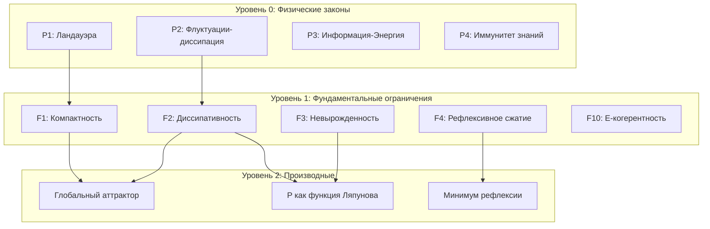

# Программы Исследований

:::note О нотации
В этом документе:
- $\Gamma$ — [матрица когерентности](/docs/core/dynamics/coherence-matrix)
- $P$ — [чистота](/docs/core/dynamics/viability#определение-чистоты): $P = \mathrm{Tr}(\Gamma^2)$
- $\varphi$ — [оператор самомоделирования](/docs/proofs/formalization-phi)
- $\mathcal{D}[\Gamma]$ — [диссипативный член](/docs/core/dynamics/evolution#логический-лиувиллиан)
- $\mathrm{Coh}_E$ — [E-когерентность](./definitions#e-когерентность)
- $R$ — [мера рефлексии](/docs/core/consciousness/self-observation#мера-рефлексии-r)
:::

:::danger Программа исследований
Этот раздел описывает **программу исследований**, а не формализованную часть УГМ. Ограничения P1-P4 и F1-F10 **не выведены** из [аксиом УГМ](/docs/applied/coherence-cybernetics/axiomatics#аксиоматическая-база). Формализация связи с теорией УГМ — открытая задача.
:::

## Иерархия инвариантов

### Трёхуровневая структура (гипотеза)

КК предлагает организовать ограничения в иерархию с отношениями подчинения:

---

## Уровень 0: Физические законы (P1-P4)

Встроены в динамику, не могут быть нарушены:

| Закон | Формула | Область |
|-------|---------|---------|
| P1 Ландауэра | $\Delta S \geq k_B \ln(2) \cdot n_{\mathrm{bits}}$ | Термодинамика |
| P2 Флуктуационно-диссипативная теорема | $\sigma^2 = 2 T_{\mathrm{eff}} \gamma$ | Термодинамика |
| P3 Информация-Энергия | $\dot{S} \geq (k_B T / E) \cdot (dI/dt)$ | Термодинамика |
| P4 Иммунитет знаний | $\Delta\mathrm{Core} = 0$ при атаке | Безопасность |

### P1: Принцип Ландауэра

Стирание 1 бита информации требует минимум $k_B T \ln 2$ энергии.

**Связь с КК:** Ограничивает скорость декогеренции в $\mathcal{D}[\Gamma]$.

### P2: Флуктуационно-диссипативная теорема

Связь между флуктуациями и диссипацией в равновесной системе.

**Связь с КК:** Определяет связь между $\mathcal{D}[\Gamma]$ и температурой окружения.

### P3: Связь информации и энергии

Обработка информации требует энергии.

**Связь с КК:** Ограничивает скорость изменения $\Gamma$ при ограниченных ресурсах.

### P4: Иммунитет ядра знаний

Центральные «убеждения» системы защищены от внешних атак.

**Связь с КК:** Связь с неподвижной точкой $\Gamma^* = \varphi(\Gamma^*)$.

---

## Уровень 1: Фундаментальные ограничения (F1-F10)

Минимальный достаточный набор (гипотетический):

| Ограничение | Формула | Связь с УГМ |
|-------------|---------|-------------|
| F1 Компактность | $\lVert\Gamma\rVert_F \leq R_{\max}$ | $\mathrm{Tr}(\Gamma) = 1$ |
| F2 Диссипативность | $\dot{W} \leq -\alpha W + \gamma(\lVert e\rVert)$ | [$\mathcal{D}[\Gamma]$](/docs/core/dynamics/evolution#логический-лиувиллиан) |
| F3 Невырожденность | $\lambda_{\min}(\Gamma) \geq \varepsilon$ | [Жизнеспособность](/docs/core/dynamics/viability) |
| F4 Рефлексивное сжатие | $\lVert\varphi(\Gamma_1) - \varphi(\Gamma_2)\rVert_F \leq k \lVert\Gamma_1 - \Gamma_2\rVert_F$, $k < 1$ | [Теорема 7.2](./theorems#теорема-72-условная-неподвижная-точка-рефлексии) |
| F5 Причинное замыкание | Выходы зависят только от внутренних состояний | [A-измерение](/docs/core/structure/dimension-a) |
| F6 Временная связность | $\Gamma(\tau+d\tau)$ зависит от $\Gamma(\tau)$ | [Эволюция](/docs/core/dynamics/evolution) |
| F7 Энергетический баланс | Приток ≥ Отток в среднем | [O-измерение](/docs/core/structure/dimension-o) |
| F8 Информационная ёмкость | Ограниченное число различимых состояний | $\dim(\mathcal{H}) = 7$ ([обоснование](/docs/core/foundations/axiom-omega#октонионная-структура)) |
| F9 Структурная стабильность | Малые возмущения → малые изменения | Топология $\mathcal{V}$ |
| F10 E-когерентность | $\kappa = \kappa_{\text{bootstrap}} + \kappa_0 \cdot \mathrm{Coh}_E(\Gamma)$ | [Аксиоматика](./axiomatics#связь-регенерации-и-e-когерентности) |

---

## Уровень 2: Производные ограничения

Ограничения, выводимые из Уровня 1. Точное число и структура — открытый вопрос.

### Гипотеза о подчинении инвариантов

:::info Гипотеза (не теорема)
Каждое ограничение Уровня 2 может быть выведено из ограничений Уровня 1.
:::

**Примеры предполагаемых выводов (гипотезы, требуют доказательства):**

$$
\begin{aligned}
\mathrm{F1} + \mathrm{F2} &\Rightarrow \text{Существование глобального аттрактора} \quad \text{(гипотеза)} \\
\mathrm{F2} + \mathrm{F3} &\Rightarrow P(\Gamma) \text{ есть функция Ляпунова} \quad \text{(гипотеза)} \\
\mathrm{F4} &\Rightarrow R(\Gamma) \geq 1 - k \text{ (минимум рефлексии)} \quad \text{(гипотеза)}
\end{aligned}
$$

:::info Статус доказательств
Эти импликации — **программа исследований**, не доказанные теоремы. Формальные доказательства требуют строгого вывода F1-F10 из Ω⁷ (открытый вопрос Q1).
:::

---

## Открытые вопросы

### Теоретические

| № | Вопрос | Статус | Связь с документами |
|---|--------|--------|---------------------|
| Q1 | Вывод F1-F10 из аксиом Ω⁷ | Открыт | [Аксиоматика](./axiomatics) |
| Q2 | Полнота набора F1-F10 | Открыт | — |
| Q3 | Эквивалентность $\mathbf{Hol}_{\mathrm{L2}} \simeq \mathbf{ConsAgents}$ | Гипотеза | [Панпсихизм](./panpsychism-analysis#теорема-об-эквивалентности-гипотеза) |
| Q4 | Формализация связи K1-K5 ↔ L0-L4 | Открыт | [Когнитивная иерархия](./cognitive-hierarchy) (K1-K5 → L0-L4) |
| Q5 | Вычисление $\Phi_{\min}$ для композиции | Открыт | [Теорема 9.1](./theorems#теорема-91-фрактальное-замыкание) |

### Экспериментальные

| № | Вопрос | Методы | Ссылки |
|---|--------|--------|--------|
| E1 | Верификация No-Zombie | Создание ИИ-систем, тест на устойчивость | [Предсказания](./predictions#предсказание-1-невозможность-зомби-no-zombie) |
| E2 | Корреляция $\mathrm{Coh}_E$ ↔ восстановление | Нейровизуализация + медицинские данные | [Предсказания](./predictions#предсказание-2-зависимость-регенерации-от-e-когерентности) |
| E3 | 7-мерная структура нейрокоррелятов | fMRI, EEG анализ | [Приложения](./applications#для-когнитивистов) |
| E4 | Калибровка $\kappa_0$, $\omega_0$ | Измерение регенерации в контролируемых условиях | [Реализация](./implementation#пороговые-значения) |

---

## Критерии верификации гипотез

| Гипотеза | Критерий верификации | Критерий фальсификации |
|----------|---------------------|------------------------|
| Иерархия P→F→D | Формальный вывод всех D из F | Существование D, невыводимого из F |
| Полнота F1-F10 | Доказательство минимальности | Нахождение избыточного F |
| K↔L соответствие | Формальная биекция | Система с K4 но без L2 |
| No-Zombie | Нет контрпримеров | Жизнеспособная система с $\mathrm{Spec}(\Gamma_E) = \{0\}$ |

---

## Roadmap исследований

### Фаза 1: Формализация (текущая)
- [ ] Строгий вывод F1-F10 из Ω⁷
- [ ] Доказательство или опровержение полноты
- [ ] Формализация K↔L соответствия

### Фаза 2: Вычислительная реализация
- [ ] Эффективные алгоритмы для $\Phi$, $R$, $C$
- [ ] Симулятор динамики Голономов
- [ ] Инструменты калибровки

### Фаза 3: Экспериментальная валидация
- [ ] Протоколы измерения $\mathrm{Coh}_E$ в нейросистемах
- [ ] Тесты на ИИ-системах
- [ ] Клинические приложения

### Фаза 4: Приложения
- [ ] Метрики безопасности AGI
- [ ] Диагностика сознания
- [ ] Организационные инструменты

---

## Связь с другими программами исследований

| Программа | Пересечение с КК | Потенциальный вклад |
|-----------|-----------------|---------------------|
| IIT 4.0 | Мера $\Phi$ | Динамика, жизнеспособность |
| Active Inference | $\mathcal{R}[\Gamma, E]$ | Феноменология, L-унификация |
| Global Workspace | Интеграция | 7-мерная структура |
| Predictive Processing | $\varphi$ | Формализация предсказаний |

---

**Связанные документы:**
- [Аксиоматика](./axiomatics) — формальные основания КК
- [Теоремы](./theorems) — доказанные результаты
- [Когнитивная иерархия](./cognitive-hierarchy) — уровни K1-K5
- [Предсказания](./predictions) — верифицируемые следствия
- [Реализация](./implementation) — вычислительные методы
- [Приложения](./applications) — практические области
- [Фальсифицируемость](/docs/reference/falsifiability) — критерии опровержения
- [Аксиома Ω⁷](/docs/core/foundations/axiom-omega) — ∞-топос как примитив
