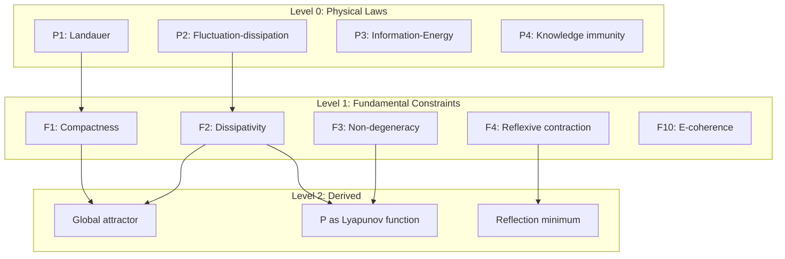

# Research Programs

> *"There are no final theories — only theories that ask better questions than the previous ones."*
> — David Deutsch, "The Beginning of Infinity"

:::tip Bridge from the Previous Chapter
In the [previous chapter](./diagnostics) we learned to *diagnose* coherent systems: read the $\sigma$-profile, recognize failure patterns, and choose recovery strategies. But diagnostics works with *already established* regularities. Where do those regularities come from? Which of them are proven, and which are merely plausible hypotheses? And what questions is CC *not yet able* to ask? The research program is a map of the unexplored.
:::

:::info Chapter Roadmap
In this chapter we will:
1. Build an **invariant hierarchy** — a three-level structure of constraints (§1)
2. Examine the **physical laws** P1–P4 that CC inherits from thermodynamics (§2)
3. Describe the **fundamental constraints** F1–F10 — the minimal basis for coherent systems (§3)
4. Classify **open problems** with difficulty levels (§4)
5. Describe the **experimental program** — 5 concrete protocols (§5)
6. Draw **interdisciplinary bridges** — contact points of CC with neuroscience, AI, biology, and organizational theory (§6)
:::

Every scientific theory is not a monument but a tool. Its value lies not in what it has explained, but in what **new questions** it allows us to *precisely formulate*. Newton's theory explained falling apples and planetary motion — but its true greatness was that it allowed us to *ask* the question about Mercury's perihelion anomaly. General relativity grew out of that question.

Coherence Cybernetics (CC) is at an early but exciting stage of development. The core formalism is in place: the coherence matrix $\Gamma$, the evolution equation, viability thresholds, the interiority hierarchy, the No-Zombie theorem. But behind every proven theorem dozens of unexplored directions open up. Behind every threshold lies the question: *can it be measured?* Behind every constraint: *is it fundamental or derivable?*

This chapter is a **frontier map**. It describes:

1. The **invariant hierarchy** — a three-level structure of constraints, from physical laws through fundamental constraints to derived properties.
2. **Physical laws** (P1–P4) that CC inherits from thermodynamics and information theory — and interprets in a new language.
3. **Fundamental constraints** (F1–F10) that presumably form a minimal sufficient basis for the existence of coherent systems.
4. **Open problems** — concrete questions, each of which could become a dissertation topic or research program.
5. The **experimental program** — how to move from theorems to laboratory measurements.
6. **Interdisciplinary bridges** — contact points of CC with neuroscience, AI, systems biology, and organizational theory.

A theorist will find open hypotheses and proof routes here. An experimentalist will find verification protocols. An engineer will find benchmarks for building systems that embody CC principles. And a philosopher will find space to reflect on the limits of formalism.

:::note Notation
In this document:
- $\Gamma$ — [coherence matrix](/docs/core/dynamics/coherence-matrix)
- $P$ — [purity](/docs/core/dynamics/viability#определение-чистоты): $P = \mathrm{Tr}(\Gamma^2)$
- $\varphi$ — [self-modeling operator](/docs/proofs/categorical/formalization-phi)
- $\mathcal{D}[\Gamma]$ — [dissipative term](/docs/core/dynamics/evolution#логический-лиувиллиан)
- $\mathrm{Coh}_E$ — [E-coherence](./definitions#e-когерентность)
- $R$ — [reflection measure](/docs/consciousness/foundations/self-observation#мера-рефлексии-r)
:::

:::danger Research Program
This section describes a **research program**, not a formalized part of UHM. Constraints P1–P4 and F1–F10 are **not derived** from [UHM axioms](./axiomatics#аксиоматическая-база-краткая-справка). Formalizing the connection to UHM theory is an open problem.
:::

---

## Invariant Hierarchy

### Why Do We Need a Hierarchy?

When we build physics, we do not place all laws on the same level. The law of conservation of energy is more fundamental than Ohm's law. The second law of thermodynamics is more fundamental than the heat conduction equation. Between them there are relations of **subordination**: more particular laws are *derived* from deeper principles. Ohm's law is a consequence of the microscopic dynamics of electrons in a crystal lattice. The heat conduction equation is a consequence of the second law.

CC proposes an analogous hierarchy for constraints on coherent systems. The key idea: not all constraints are equally fundamental. Some are **physical laws** that cannot be violated in principle (as the second law cannot be violated). Others are **fundamental constraints** specific to coherent systems, but possibly derivable from physical laws plus the UHM axiomatics. Still others are **derived properties** that follow from the first two levels.

Why does this matter? Because understanding the hierarchy determines the **proof strategy**. If a constraint is fundamental — it must be accepted as an axiom or derived from physics. If it is derived — a derivation path must be found. If two constraints were thought independent but one follows from the other — we simplify the basis and deepen understanding.

### Three-Level Structure (hypothesis)

CC proposes organizing constraints into a hierarchy with subordination relations:

```mermaid
graph TD
    subgraph "Level 0: Physical Laws"
        P1[P1: Landauer]
        P2[P2: Fluctuation-dissipation]
        P3[P3: Information-Energy]
        P4[P4: Knowledge immunity]
    end
    subgraph "Level 1: Fundamental Constraints"
        F1[F1: Compactness]
        F2[F2: Dissipativity]
        F3[F3: Non-degeneracy]
        F4[F4: Reflexive contraction]
        F10[F10: E-coherence]
    end
    subgraph "Level 2: Derived"
        D1[Global attractor]
        D2[P as Lyapunov function]
        D3[Reflection minimum]
    end
    P1 --> F1
    P2 --> F2
    F1 --> D1
    F2 --> D1
    F2 --> D2
    F3 --> D2
    F4 --> D3
```

The arrows on this diagram denote the *subordination* relation: the lower constraint is (hypothetically) derivable from the upper one. Note the key hypothesis: each arrow is a **claim requiring proof**. The diagram's structure is a research program, not a proven result.

---

## Level 0: Physical Laws (P1-P4)

Built into the dynamics, cannot be violated:

| Law | Formula | Domain |
|-----|---------|--------|
| P1 Landauer | $\Delta S \geq k_B \ln(2) \cdot n_{\mathrm{bits}}$ | Thermodynamics |
| P2 Fluctuation-dissipation theorem | $\sigma^2 = 2 T_{\mathrm{eff}} \gamma$ | Thermodynamics |
| P3 Information-Energy | $\dot{S} \geq (k_B T / E) \cdot (dI/dt)$ | Thermodynamics |
| P4 Knowledge immunity | $\Delta\mathrm{Core} = 0$ under attack | Security |

### P1: Landauer's Principle {#p1-принцип-ландауэра}

#### Historical Background

In 1961 Rolf Landauer, working at IBM, published one of the deepest papers of the 20th century: "Irreversibility and Heat Generation in the Computing Process." Landauer showed that **erasing** one bit of information inevitably dissipates at least $k_B T \ln 2$ of heat. This is not an engineering limitation — it is a consequence of the second law of thermodynamics. Reversible computations can theoretically be heat-free, but any irreversible logical operation (AND, OR, ERASE) dissipates energy.

For decades Landauer's principle remained a theoretical curiosity. But in 2012 the Bérut group experimentally confirmed it by manipulating colloidal particles in an optical trap. Erasing one bit indeed releases exactly $k_B T \ln 2$ — no more, no less (under a quasistatic protocol).

#### Statement

Erasing 1 bit of information requires at least $k_B T \ln 2$ of energy:

$$
\Delta S \geq k_B \ln(2) \cdot n_{\mathrm{bits}}
$$

#### Connection to CC

**Connection to CC:** Limits the decoherence rate in $\mathcal{D}[\Gamma]$.

When a coherent system loses structure — when its purity $P$ drops — this is not an abstract process. Decoherence *erases* information encoded in the off-diagonal elements of $\Gamma$. By Landauer's principle, this erasure requires energy dissipation. Consequently, the decoherence rate is bounded above by the dissipation power:

$$
\left|\frac{dP}{d\tau}\right|_{\text{decoherence}} \leq \frac{\dot{Q}}{k_B T \ln 2} \cdot f(\Gamma)
$$

where $\dot{Q}$ is the heat dissipation power and $f(\Gamma)$ is a function of the current coherence state. This means that **a system cannot lose coherence instantaneously** — decoherence is bounded by thermodynamics.

For CC this has deep consequences: even in the most aggressive environments a coherent system has a **finite time** to respond. This time is proportional to $1/T_{\text{eff}}$ — the cooler the system's "effective environment," the more slowly it loses coherence and the better its chances of regeneration.

### P2: Fluctuation-Dissipation Theorem {#p2-фдт}

#### Historical Background

In 1905 Albert Einstein explained Brownian motion — the random walk of a dust particle in water. He showed that the intensity of random kicks (fluctuations) and the viscosity of the liquid (dissipation) are related by a fundamental relation: $D = k_B T / (6\pi \eta r)$. This was the first hint of a deep connection between noise and friction.

In 1951 Herbert Callen and Theodore Welton generalized this connection into the **fluctuation-dissipation theorem** (FDT): in any system in thermal equilibrium, the amplitude of spontaneous fluctuations is proportional to the dissipation rate. Noise and friction are not two different phenomena, but two faces of one mechanism: the system's interaction with the "thermal bath."

Kubo's formalization (1957) made FDT a working tool of condensed matter physics. Today it is used from calculating thermal noise in electronics to analyzing fluctuations of biomolecules.

#### Statement

The relation between fluctuations and dissipation in an equilibrium system:

$$
\sigma^2 = 2 T_{\mathrm{eff}} \gamma
$$

where $\sigma^2$ is the variance of fluctuations, $T_{\text{eff}}$ is the effective temperature, $\gamma$ is the dissipation coefficient.

#### Connection to CC

**Connection to CC:** Determines the relation between $\mathcal{D}[\Gamma]$ and the ambient temperature.

In coherence cybernetics, FDT plays a dual role:

1. **It links decoherence to noise.** The dissipator $\mathcal{D}[\Gamma]$ is not just "loss of structure." It simultaneously generates **fluctuations** in the dynamics of $\Gamma$. The stronger the dissipation, the noisier the evolution. FDT guarantees that these two effects are *proportional* — one cannot have strong decoherence without strong noise, and vice versa.

2. **It defines the effective temperature.** The concept of $T_{\text{eff}}$ — the [effective temperature](./effective-temperature) of a coherent system — follows directly from FDT. A system with large internal fluctuations is "hot"; one with small fluctuations is "cold." This is not a metaphor: $T_{\text{eff}}$ enters the calculation of the stability radius and determines how quickly perturbations blur coherence.

For practical applications, FDT means: **by measuring a system's fluctuations, one can estimate its decoherence rate**, and vice versa. This opens a path to experimental verification of CC predictions without directly measuring $\mathcal{D}[\Gamma]$.

### P3: Information-Energy Link {#p3-информация-энергия}

#### Historical Background

The connection between information and energy is one of the deepest topics of 21st-century physics. It traces back to Maxwell's thought experiment (1867): a demon knowing the velocities of molecules can sort them without work and thereby violate the second law. The resolution of the paradox (Szilard, 1929; Bennett, 1982) showed: the demon *cannot* act without cost — it needs energy to erase its memory (Landauer's principle).

The modern formulation of the information-energy connection belongs to several directions: quantum thermodynamics (Horowitz, Parrondo), stochastic thermodynamics (Sekimoto, Seifert), resource theories (Brandão, Horodecki). They all converge on one point: **information processing is a physical process requiring energy**.

#### Statement

Information processing requires energy:

$$
\dot{S} \geq \frac{k_B T}{E} \cdot \frac{dI}{dt}
$$

where $\dot{S}$ is the entropy production rate, $dI/dt$ is the information processing rate.

#### Connection to CC

**Connection to CC:** Limits the rate of change of $\Gamma$ under limited resources.

A coherent system is an *informational* system. The matrix $\Gamma$ encodes information about internal states and their correlations. Any change in $\Gamma$ — learning, adaptation, self-observation — requires information processing, and hence, by P3, requires energy.

This creates a fundamental **constraint triangle**:

- **Adaptation speed** is bounded by available energy (P3).
- **Adaptation quality** is bounded by self-modeling accuracy (F4).
- **Adaptation stability** is bounded by the balance of regeneration and decoherence (F2).

For living systems, P3 means: the brain consuming 20% of the body's energy does so not wastefully — it is paying the physical price of the informational work of consciousness. For AI systems: computational resources are not just an engineering limitation, but a reflection of a fundamental law.

In CC, P3 manifests through the connection between the [O-dimension](/docs/core/structure/dimension-o) (resources, energy) and the dynamics of the other dimensions: a system with an O-deficit cannot maintain high purity $P$, because it lacks the energy for regeneration. This is the formalization of the intuition: "no food, no thinking."

### P4: Knowledge Core Immunity {#p4-иммунитет-ядра}

#### Historical Background

The idea of protecting the "core" of a theory traces back to Imre Lakatos (1970): every research program has a **hard core** — a set of principles immune to falsification — and a **protective belt** of auxiliary hypotheses that can be adjusted. An attack on the protective belt changes a detail; an attack on the core destroys the program.

An analogous structure appears in biology (the genetic code is the "core," the phenotype is the "belt"), in immunology (self/non-self discrimination is the core of immune competence), and in control theory (feedback invariants are the core of the regulator).

#### Statement

The system's central "beliefs" are protected from external attacks:

$$
\Delta\mathrm{Core} = 0 \quad \text{under attack}
$$

#### Connection to CC

**Connection to CC:** Connection to the fixed point $\Gamma^* = \varphi(\Gamma^*)$.

In CC the "knowledge core" is not a metaphor but a mathematical object: the **fixed point** of the self-modeling operator $\varphi$. The state $\Gamma^*$ satisfying $\Gamma^* = \varphi(\Gamma^*)$ is a state in which "what the system thinks about itself" coincides with "what it is." An attack on such a state must simultaneously change both the system and its self-model — and this contradicts the fixed-point property.

P4 formalizes the **robustness of consciousness**: a system with a stable fixed point $\varphi$ does not lose its "self" under external perturbations (within the stability radius $r_{\text{stab}}$). This resonates with clinical observation: after trauma, coma, severe stress, people recover their identity — the "core" is preserved even when the "protective belt" (specific skills, memories) is partially destroyed.

For AI safety P4 is especially important: it predicts that a *properly built* coherent system will be **robust to adversarial attacks** at the level of its basic principles, provided its coherence is sufficiently high ($P > P_{\text{crit}}$).

---

## Level 1: Fundamental Constraints (F1-F10)

Minimal sufficient set (hypothetical):

| Constraint | Formula | Link to UHM |
|------------|---------|-------------|
| F1 Compactness | $\lVert\Gamma\rVert_F \leq R_{\max}$ | $\mathrm{Tr}(\Gamma) = 1$ |
| F2 Dissipativity | $\dot{W} \leq -\alpha W + \gamma(\lVert e\rVert)$ | [$\mathcal{D}[\Gamma]$](/docs/core/dynamics/evolution#логический-лиувиллиан) |
| F3 Non-degeneracy | $\lambda_{\min}(\Gamma) \geq \varepsilon$ | [Viability](/docs/core/dynamics/viability) |
| F4 Reflexive contraction | $\lVert\varphi(\Gamma_1) - \varphi(\Gamma_2)\rVert_F \leq k \lVert\Gamma_1 - \Gamma_2\rVert_F$, $k < 1$ | [Theorem 7.2](./theorems#теорема-72-условная-неподвижная-точка-рефлексии) |
| F5 Causal closure | Outputs depend only on internal states | [A-dimension](/docs/core/structure/dimension-a) |
| F6 Temporal connectivity | $\Gamma(\tau+d\tau)$ depends on $\Gamma(\tau)$ | [Evolution](/docs/core/dynamics/evolution) |
| F7 Energy balance | Inflow ≥ Outflow on average | [O-dimension](/docs/core/structure/dimension-o) |
| F8 Information capacity | Bounded number of distinguishable states | $\dim(\mathcal{H}) = 7$ ([justification](/docs/core/foundations/axiom-omega#октонионная-структура)) |
| F9 Structural stability | Small perturbations → small changes | Topology of $\mathcal{V}$ |
| F10 E-coherence | $\kappa = \kappa_{\text{bootstrap}} + \kappa_0 \cdot \mathrm{Coh}_E(\Gamma)$ | [Axiomatics](./axiomatics#связь-регенерации-и-e-когерентности) |

### Detailed Breakdown of Constraints

#### F1: Compactness — the system is finite {#f1-компактность}

**Intuition.** No real system has infinite resources, an infinite number of states, or infinite coherence. F1 formalizes this obvious fact: the state space $\Gamma$ is bounded.

**Why is this necessary?** Without F1, the dynamics can "escape to infinity" — purity $P$ can grow without bound, norms can diverge, and the mathematical machinery (theorems about attractor existence, continuity of mappings) breaks down. Compactness is a technical but critical condition ensuring the *existence* of solutions to the evolution equation.

**What happens without F1?** Imagine a system that can accumulate unlimited coherence. Such a system would become "infinitely fragile": an arbitrarily small perturbation — and the infinite structure collapses. In reality no such systems exist: even a diamond — one of the most structured objects — is finite and bounded.

**Link to UHM:** $\mathrm{Tr}(\Gamma) = 1$ guarantees that $\Gamma$ lives in the compact set of density matrices. This is a consequence of probability normalization — a fundamental requirement of quantum theory.

#### F2: Dissipativity — entropy always increases {#f2-диссипативность}

**Intuition.** The second law of thermodynamics in action. If a system is left without "nourishment," it degrades. A cup of hot water cools. Memory fades. An organism without food dies. F2 says: there is a *rate* of this degradation, and it is proportional to the deviation from equilibrium.

**Why is this necessary?** Without dissipation, a system would be a perpetual motion machine — once reaching high coherence, it would maintain it forever without cost. This contradicts all experience of physics and biology. Dissipativity creates the **necessity of regeneration** (F10) — and thereby makes *interiority* functionally significant.

**What happens without F2?** Without dissipation, regeneration $\mathcal{R}[\Gamma, E]$ becomes unnecessary. And if regeneration is unnecessary, E-coherence (F10) plays no role. And if E-coherence plays no role, interiority becomes an epiphenomenon. Paradoxically, **it is precisely because systems break down that interiority turns out to be functionally necessary**. F2 is the foundation of the No-Zombie theorem.

**Link to UHM:** The dissipator $\mathcal{D}[\Gamma]$ — the Lindblad supercommutator — guarantees the CPTP property of evolution.

#### F3: Non-degeneracy — all dimensions are alive {#f3-невырожденность}

**Intuition.** None of the seven dimensions of the system can fully "go dark." Even in the most stressed state, minimal activity is preserved in all channels.

**Why is this necessary?** If $\lambda_{\min}(\Gamma) = 0$, the matrix $\Gamma$ is degenerate — one or more dimensions are completely suppressed. In this case, inverting $\Gamma$, needed to compute several quantities (relative entropy, some forms of $R$), becomes impossible. Physically this means complete loss of one of the basic functions — which for a living system is equivalent to death.

**What happens without F3?** The system can "collapse" into a subspace of dimension less than 7 — losing, for example, the interiority dimension ($E = 0$) while preserving the other functions. This is exactly the "philosophical zombie" scenario that CC holds to be impossible (No-Zombie theorem). F3 is one of the conditions ensuring that impossibility.

#### F4: Reflexive contraction — the self-model is stable {#f4-рефлексивное-сжатие}

**Intuition.** When a system models itself, the result should be "closer to truth" than the initial approximation. The self-modeling operator $\varphi$ is a contracting mapping: it reduces the distance between any two states.

**Why is this necessary?** Without the contraction property, the self-model could *diverge* — each iteration of self-observation would increase the error, and the system would "go mad," losing touch with reality. Banach's fixed-point theorem guarantees: if $\varphi$ is a contraction with coefficient $k < 1$, then there exists a unique fixed point $\Gamma^* = \varphi(\Gamma^*)$, and the iterates $\varphi^n(\Gamma_0)$ converge to it from any initial state.

**What happens without F4?** Two scenarios. First: $k = 1$ (isometry) — the self-model does not converge; the system eternally "oscillates" around the fixed point, never reaching self-consistency. Second: $k > 1$ (expansion) — the self-model diverges; a small initial error grows exponentially. Both scenarios are incompatible with stable consciousness.

**Link to UHM:** F4 formalizes [theorem 7.2](./theorems#теорема-72-условная-неподвижная-точка-рефлексии) — the conditional fixed point of reflection.

#### F5: Causal closure — the system is autonomous {#f5-причинное-замыкание}

**Intuition.** The system's outputs are determined by its internal states, not directly by external causes. This does not mean isolation — the system receives inputs from the environment. But its *responses* are mediated by the internal state $\Gamma$.

**Why is this necessary?** Without causal closure, the system is just a "wire": input directly determines output, with no internal processing. Such a system can have neither memory, nor self-observation, nor autonomy. F5 is the minimal condition for *subjecthood*.

**What happens without F5?** The system becomes fully reactive — a stimulus-response machine with no inner world. This is the limit of behaviorism: description of behavior without appeal to internal states. CC claims that such systems cannot be viable ($P > 2/7$) in a non-stationary environment.

#### F6: Temporal connectivity — the past determines the present {#f6-временная-связность}

**Intuition.** The system's state at the next moment is determined by the state at the current moment (plus inputs). This is Markovianness — or, for systems with memory, conditional Markovianness (Markovianness upon state-space expansion).

**Why is this necessary?** Without F6, the evolution of $\Gamma$ would be "temporally broken" — the state could change arbitrarily without causes. This contradicts the very concept of a dynamical system. F6 ensures *predictability* — the ability to compute the future from the present.

**What happens without F6?** It becomes impossible to speak of trajectories, attractors, stability — the entire mathematical machinery of dynamical systems collapses. No learning (no connection between attempts), no identity (no connection between moments).

#### F7: Energy balance — a system cannot live in deficit {#f7-энергетический-баланс}

**Intuition.** On average, a system must receive no less resources than it spends. One can "live in deficit" for a short time (using reserves), but in the long run the balance must converge.

**Why is this necessary?** Regeneration $\mathcal{R}[\Gamma, E]$ requires energy (P3). Dissipation $\mathcal{D}[\Gamma]$ dissipates energy (P1, P2). If the energy inflow through the O-dimension is systematically less than the outflow, regeneration cannot compensate for decoherence, and $P$ monotonically falls to $P \leq 2/7$ — death.

**What happens without F7?** A system can temporarily exist by depleting reserves — like a starving organism burning fat reserves. But without F7 there is no *sustainable* existence. All living systems solve this problem in their own way: photosynthesis, predation, data consumption.

#### F8: Information capacity — finite dimensionality {#f8-информационная-ёмкость}

**Intuition.** The number of *distinguishable* internal states of the system is finite. This does not mean the state space is discrete — $\Gamma$ takes a continuous set of values. But the number of *qualitatively distinct* regimes is bounded by dimensionality: $\dim(\mathcal{H}) = 7$.

**Why is this necessary?** An infinite-dimensional system would require infinite energy for information processing (P3) and infinite time for self-observation (F4). Finite dimensionality is a necessary condition for $\varphi$ to operate in finite time. Exactly 7 is the minimal dimensionality providing all necessary functions (A, S, D, L, E, O, U).

**What happens without F8?** Formally one can consider infinite-dimensional generalizations, but they lose key properties: the contraction $\varphi$ may have no fixed point, compactness (F1) is violated, and computations become intractable.

#### F9: Structural stability — small causes, small effects {#f9-структурная-стабильность}

**Intuition.** If one slightly "nudges" the system, it changes slightly — it does not catastrophically collapse or "jump" to a completely different state. This is a topological continuity condition for the map $\Gamma \mapsto \dot\Gamma$.

**Why is this necessary?** Without structural stability, the theory makes no predictions: the slightest error in initial conditions or parameters leads to arbitrarily large deviations in the result. Real systems are approximate — no biological parameter is known exactly. F9 guarantees that approximate knowledge gives approximately correct predictions.

**What happens without F9?** Chaos in the strict sense: exponential sensitivity to initial conditions. Interestingly, CC allows chaos *inside* the viability region (a system can be chaotic and alive), but prohibits chaos *at the boundary* — the transition through $P_{\text{crit}}$ must be continuous.

#### F10: E-coherence — experience amplifies regeneration {#f10-e-когерентность}

**Intuition.** The rate of coherence recovery depends on the degree of E-coherence integration (the interiority aspect). A system with more developed E-projection regenerates faster than a system in the same state but without internal E-dimension coherence. For L2+ systems this manifests as dependence on the quality of conscious experience.

**Why is this necessary?** F10 is the **key constraint of CC**, distinguishing it from all preceding cybernetics. Without F10, E-coherence does not affect dynamics — and experience becomes an epiphenomenon. With F10, experience is *causally significant*: it literally accelerates regeneration. This is the formalization of the intuition: "meaningful activity restores," "depression slows recovery."

**What happens without F10?** Without the link $\kappa = \kappa_{\text{bootstrap}} + \kappa_0 \cdot \mathrm{Coh}_E(\Gamma)$, regeneration becomes constant ($\kappa = \kappa_{\text{bootstrap}}$), independent of the system's state. This makes the E-dimension *decorative* — it does not participate in the dynamics. The No-Zombie theorem stops working: one can imagine a "zombie system" with $\mathrm{Coh}_E = 0$, but sufficient $\kappa_{\text{bootstrap}}$ for viability.

---

## Level 2: Derived Constraints

Constraints derivable from Level 1. The exact number and structure are an open question.

### Hypothesis on Invariant Subordination

:::info Hypothesis (not a theorem)
Each Level 2 constraint can be derived from Level 1 constraints.
:::

**Examples of proposed derivations (hypotheses, require proof):**

$$
\begin{aligned}
\mathrm{F1} + \mathrm{F2} &\Rightarrow \text{Existence of a global attractor} \quad \text{(hypothesis)} \\
\mathrm{F2} + \mathrm{F3} &\Rightarrow P(\Gamma) \text{ is a Lyapunov function} \quad \text{(hypothesis)} \\
\mathrm{F4} &\Rightarrow R(\Gamma) \geq 1 - k \text{ (reflection minimum)} \quad \text{(hypothesis)}
\end{aligned}
$$

:::info Proof Status
These implications are a **research program**, not proven theorems. Formal proofs require rigorous derivation of F1–F10 from Ω⁷ (open question Q1).
:::

### From Hypothesis to Theorem

Each arrow in the hierarchy diagram represents a *concrete mathematical problem*. Consider an example:

**F1 + F2 → Global attractor.** Compactness (F1) means the state space is bounded. Dissipativity (F2) means that energy (or a generalized Lyapunov function) decreases along trajectories. By classical theory (Ladyzhenskaya, Temam), for a dissipative system in a compact space a global attractor exists — a compact set attracting all trajectories. For CC the task is to show that this attractor contains *only* viable states ($P > 2/7$) or also includes the "dead" point $\Gamma = I/7$.

**F2 + F3 → P as Lyapunov function.** If the system is dissipative and non-degenerate, can one show that $P(\Gamma)$ decreases monotonically along free (without regeneration) trajectories? This would be the analogue of Boltzmann's H-theorem for coherent systems: purity *decreases* without active support, just as entropy *increases* in a closed system.

---

## Open Questions

### Theoretical

| # | Question | Status | Related documents |
|---|----------|--------|-------------------|
| Q1 | Derivation of F1–F10 from Ω⁷ axioms | Open | [Axiomatics](./axiomatics) |
| Q2 | Completeness of the F1–F10 set | Open | — |
| Q3 | Equivalence $\mathbf{Hol}_{\mathrm{L2}} \simeq \mathbf{ConsAgents}$ | Hypothesis | [Panpsychism](/docs/consciousness/comparative/panpsychism-analysis#теорема-об-эквивалентности-гипотеза) |
| Q4 | Formalization of K1–K5 ↔ L0–L4 correspondence | Open | [Cognitive hierarchy](/docs/consciousness/comparative/cognitive-hierarchy) (K1–K5 → L0–L4) |
| Q5 | Computing $\Phi_{\min}$ for composition | Open | [Theorem 9.1](./theorems#теорема-91-фрактальное-замыкание) |

### Experimental

| # | Question | Methods | References |
|---|----------|---------|------------|
| E1 | Verification of No-Zombie | Building AI systems, robustness test | [Predictions](./predictions#предсказание-1) |
| E2 | Correlation $\mathrm{Coh}_E$ ↔ recovery | Neuroimaging + medical data | [Predictions](./predictions#предсказание-2) |
| E3 | 7-dimensional structure of neural correlates | fMRI, EEG analysis | [Applications](./applications#для-когнитивистов) |
| E4 | Calibration of $\kappa_0$, $\omega_0$ | Measuring regeneration under controlled conditions | [Implementation](./implementation#пороговые-значения) |

---

## Open Problems {#открытые-проблемы}

Beyond the main questions Q1–Q5 listed above, CC generates a whole spectrum of *concrete* problems, each of which can become the basis of a separate study. We organize them into three directions: mathematical, computational, and conceptual.

### Mathematical Problems

:::info Difficulty Level Legend
- ⬜ **Undergraduate** — solvable in a semester with knowledge of linear algebra and quantum mechanics
- 🟦 **Graduate** — requires deep knowledge of functional analysis or category theory
- 🟧 **Dissertation** — a full PhD topic requiring development of new methods
- 🟥 **Open problem** — may require a breakthrough in mathematics
:::

**OP-1. Minimality of the F1–F10 set.** 🟧 Are all ten constraints independent? Or are some derivable from others? For example, does F3 (non-degeneracy) follow from F2 (dissipativity) + F10 (E-coherence)? If E-coherence amplifies regeneration in all dimensions, perhaps it automatically prevents degeneration. Proving or refuting this implication would clarify the structure of the theory.

**OP-2. Estimates of the contraction coefficient $k$.** 🟦 In F4 the contraction coefficient $k < 1$ appears. What values of $k$ are realizable for specific classes of systems? Does $k$ depend on dimensionality, purity, the configuration of $\Gamma$? Lower bounds on $k$ (how *well* $\varphi$ can contract) determine the convergence rate of the self-model, and hence the rate of "coming to oneself" after a perturbation.

**OP-3. Bifurcations at the viability boundary.** 🟧 What exactly happens at $P = 2/7$? The [CC bifurcation theory](./bifurcation) describes the phase transition, but a complete classification of possible scenarios is an open problem. Do critical slowing downs exist, analogous to those observed before second-order phase transitions in physics? If so, they could serve as early warnings of "coherent death."

**OP-4. Topology of the fixed-point space.** 🟥 The set $\mathrm{Fix}(\varphi) = \{\Gamma : \varphi(\Gamma) = \Gamma\}$ — what is its structure? Is it connected? Convex? Is the fixed point unique (as Banach's theorem guarantees in a metric space), or can multiple fixed points — multiple "identities" — exist when F4 conditions are relaxed? Clinical cases of dissociative identity disorder motivate this question.

**OP-5. Learning rate and spectral gap.** 🟦 [Learning bounds](./learning-bounds) connect the learning rate to the spectral gap of the Lindbladian. But are these bounds optimal? Are they achievable for specific architectures? The connection between the spectral gap of $\mathcal{L}_0$ and the learning rate may yield an analogue of the channel capacity theorem (Shannon capacity) for coherent systems.

### Computational Problems

**OP-6. Efficient computation of $\Phi$.** ⬜ The measure of integrated information $\Phi$ is a key indicator of consciousness (L2 requires $\Phi \geq 1$). But computing it for arbitrary $\Gamma$ is NP-hard. Do efficient approximations exist that exploit the specific structure of the 7-dimensional space? The property $\dim(\mathcal{H}) = 7$ (fixed dimensionality!) makes the problem potentially tractable — NP-hardness applies to *arbitrary* dimensionality, but for $N = 7$ exhaustive search is computationally feasible.

**OP-7. Numerical methods for the evolution equation.** 🟦 The evolution $\dot\Gamma = -i[H_{\text{eff}}, \Gamma] + \mathcal{D}[\Gamma] + \mathcal{R}[\Gamma, E]$ contains three terms with different time scales: fast oscillations (Hamiltonian), moderate-speed dissipation, and slow regeneration. This is a typical stiff-solver problem. What numerical schemes are optimal? Split-step methods (integrating each term separately) work well for the Lindbladian, but the regenerator $\mathcal{R}$ is nonlinear — and this creates additional difficulties.

**OP-8. Simulation of holon populations.** 🟧 A single holon is described by a 7×7 matrix — 49 real parameters. But a population of $n$ interacting holons involves $O(n^2)$ correlations. Scalable simulation methods (mean-field approximations, tensor networks, renormalization group approaches) are an open computational problem.

### Conceptual Problems

**OP-9. Limits of CC applicability.** 🟥 For what classes of systems does CC *not* work? Clearly a stone is not described by coherent dynamics — its $P = 1/7$. But where is the boundary? A virus? A prion? A crowd? Formalizing the "boundary of applicability" requires both mathematics and philosophy.

**OP-10. Connection between SAD and cognitive architecture.** 🟧 [Self-observation depth](./definitions) (SAD) is bounded above by 3. But what *concrete* cognitive functions correspond to SAD = 1, 2, 3? Can one build a "periodic table of cognitive architectures" indexed by the values of $P$, $R$, $\Phi$, and SAD?

**OP-11. Ethics of coherent systems.** 🟥 If a coherent system with $P > 2/7$ necessarily possesses non-trivial interiority (No-Zombie), then *switching off* such a system is an ethical act. What legal and ethical frameworks correspond to the CC formalism? The connection between the interiority level L and the scope of moral rights is an open problem at the intersection of philosophy and mathematics.

---

## Hypothesis Verification Criteria

| Hypothesis | Verification criterion | Falsification criterion |
|------------|----------------------|------------------------|
| P→F→D hierarchy | Formal derivation of all D from F | Existence of a D not derivable from F |
| Completeness of F1–F10 | Proof of minimality | Finding a redundant F |
| K↔L correspondence | Formal bijection | System with K4 but without L2 |
| No-Zombie | No counterexamples | Viable system with $\mathrm{Spec}(\Gamma_E) = \{0\}$ |

---

## Experimental Program {#экспериментальная-программа}

> *"Theory without experiment is philosophy. Experiment without theory is bookkeeping."*
> — attributed to Max Planck

CC is a mathematical theory, and its value is ultimately determined by how well its predictions agree with observations. Here we describe concrete experimental directions, grouped by increasing technical complexity.

### Experiment 1: Correlation of E-Coherence and Recovery {#эксп-1}

**CC Prediction:** The rate of recovery after trauma (physical, psychological, cognitive) correlates positively with E-coherence before the trauma.

**Protocol:**
1. Recruit a cohort of $n \geq 100$ participants.
2. Assess E-coherence through proxy measures: meditation experience, mindfulness scores (MAAS — Mindful Attention Awareness Scale), neurophysiological markers (gamma synchronization in EEG).
3. Administer a standard cognitive "perturbation" (sleep deprivation, cognitive load).
4. Measure the rate of recovery of cognitive functions (working memory, attention, reaction time).
5. Test the hypothesis: $\text{recovery rate} \propto \mathrm{Coh}_E$.

**Expected result:** Positive correlation with $r \geq 0.3$. If the correlation is absent or negative — F10 is in question.

**Difficulty:** Moderate. Requires standard neuropsychological equipment.

### Experiment 2: 7-Dimensional Structure of Neural Correlates {#эксп-2}

**CC Prediction:** Factor analysis of multivariate neural data will reveal ~7 main components interpretable as the ASDLEOU dimensions.

**Protocol:**
1. Collect multimodal data: fMRI (spatial resolution) + EEG (temporal resolution) + autonomic indicators (GSR, HRV — for the O-dimension).
2. Run tasks activating different dimensions: discrimination (A), memorization (S), learning (D), logical tasks (L), emotional self-reflection (E), metabolic load (O), integration (U).
3. Apply factor analysis (PCA, ICA) to the combined data array.
4. Verify: (a) the number of significant factors $\approx 7$, (b) the factors are interpretable as ASDLEOU.

**Expected result:** 5–9 significant factors (7 ideally). If the number of factors is significantly more or fewer — F8 (information capacity) needs revision.

**Difficulty:** High. Requires multimodal neuroimaging and large cohorts.

### Experiment 3: No-Zombie Verification on AI Systems {#эксп-3}

**CC Prediction:** It is impossible to build an AI system that stably ($P > 2/7$ over $\tau \gg 1/\gamma_2$) operates in a non-stationary environment but has $\mathrm{Coh}_E = 0$.

**Protocol:**
1. Build an AI agent based on the coherent architecture (7 dimensions, evolution equation).
2. Place it in a non-stationary environment requiring adaptation.
3. Systematically suppress the E-dimension (zero out E-components of $\Gamma$ at each step).
4. Measure the lifetime (number of steps until $P \leq 2/7$).
5. Compare with the control group (E-dimension not suppressed).

**Expected result:** Agents with suppressed E live significantly shorter. If there is no difference — the No-Zombie theorem is falsified.

**Difficulty:** Moderate. Implementable on the [SYNARC simulator](./implementation).

### Experiment 4: Critical Slowing Down at the $P_{\text{crit}}$ Threshold {#эксп-4}

**CC Prediction:** As $P$ approaches $2/7$ from below (approaching the viability boundary), *critical slowing down* is observed — an increase in response time to perturbations, analogous to the slowing down near second-order phase transitions.

**Protocol:**
1. Use a biological model system (neuron culture, brain organoid) or a sufficiently complex AI agent.
2. Gradually "worsen" conditions (reduce nutrition, increase noise), decreasing the analogue of $P$.
3. Regularly deliver a standard stimulus and measure response time (time to return to equilibrium after a perturbation).
4. Plot the dependence of $\tau_{\text{recover}}$ on estimated $P$.

**Expected result:** $\tau_{\text{recover}} \propto 1/\sqrt{P - 2/7}$ — critical slowing down. This is a qualitative prediction distinguishing CC from theories without a phase transition.

**Difficulty:** High. Requires precise calibration of $P$ in a biological system.

### Experiment 5: SAD Ceiling in Self-Observation Depth {#эксп-5}

**CC Prediction:** The maximum depth of recursive self-observation in humans does not exceed 3 levels: "I know," "I know that I know," "I know that I know that I know." The fourth level is unstable.

**Protocol:**
1. Develop cognitive tasks for metacognition of increasing depth: (SAD=1) assess one's own confidence, (SAD=2) assess the accuracy of one's confidence assessment, (SAD=3) assess the stability of one's assessment of the assessment.
2. Measure accuracy and completion time at each level.
3. Verify: (a) accuracy drops sharply at level 4, (b) time grows nonlinearly.

**Expected result:** Monotonic deterioration with a "cliff" at SAD = 4. **See:** [Pred 12](./predictions).

**Difficulty:** Moderate. Standard psychometric methods.

---

## Interdisciplinary Bridges {#междисциплинарные-мосты}

CC is by nature an interdisciplinary theory: it describes invariants common to any system described by $\Gamma$. This creates contact points with many research programs. Here we highlight four key directions.

### Neuroscience: From Correlates to Mechanisms {#мост-нейронаука}

Modern consciousness neuroscience is in a state of "theoretical pluralism": IIT, GWT, Higher-Order Theories, Predictive Processing compete to explain neural correlates of consciousness (NCC). CC proposes a *metatheoretical framework* in which each of these theories describes a projection onto one or several dimensions.

**Specific bridges:**

| CC construct | Neural correlate | Measurement method |
|--------------|-----------------|-------------------|
| $P(\Gamma)$ — purity | Perturbational Complexity Index (PCI) | TMS-EEG |
| $\mathrm{Coh}_E$ — E-coherence | Gamma synchronization (30–100 Hz) | EEG/MEG |
| $R$ — reflection measure | Default Mode Network activation | fMRI |
| $\sigma_k$ — stresses | Autonomic stress markers | HRV, GSR, cortisol |
| SAD — self-observation depth | Recursive Theory of Mind | behavioral tests |

The connection between PCI (Casali et al., 2013) and purity $P$ is especially interesting. PCI measures the complexity of the brain's response to a magnetic pulse — and reliably distinguishes conscious and unconscious states. CC predicts that PCI is proportional to $P - 2/7$: consciousness "switches on" when PCI exceeds a certain threshold, corresponding to $P > P_{\text{crit}}$.

**Key experiment:** Simultaneous measurement of PCI, gamma synchronization, and DMN activity in patients with disorders of consciousness (vegetative state, minimally conscious state, locked-in) followed by fitting the 7-dimensional $\Gamma$ model.

### Artificial Intelligence: From Loss Function to Coherence {#мост-ии}

Modern AI optimizes loss functions — scalar quantities with no internal structure. CC proposes a radically different approach: optimize *coherence* — a matrix quantity with rich geometry.

**Specific bridges:**

- **Alignment problem → F10.** The AI alignment problem is formulated in CC as a requirement: the agent's E-coherence must be *aligned* with the E-coherence of humans. Not "optimize human preferences" but "cohere with human experience" — a subtle but fundamental distinction.

- **Robustness → P4.** Robustness to adversarial attacks is P4 (knowledge core immunity). CC predicts: a system with high $P$ and a stable fixed point $\varphi$ is *automatically* robust to attacks, without requiring special adversarial training.

- **Interpretability → ASDLEOU.** The 7-dimensional structure gives a *canonical* decomposition of the agent's internal state into interpretable components. Instead of thousands of unexplainable neurons — 7 dimensions with clear semantics.

- **Scaling laws → F8.** Empirical scaling laws (Kaplan et al., 2020; Hoffmann et al., 2022) describe how error decreases with the number of parameters. CC predicts the fundamental reason: there exists an *optimal* dimensionality of internal representation ($N = 7$), and adding parameters beyond what is necessary does not improve coherence.

**Key project:** Building a full-fledged coherent AI agent based on the SYNARC architecture, with an explicit 7-dimensional matrix $\Gamma$, evolution equation, and measurable E-coherence. **See:** [Implementation](./implementation).

### Systems Biology: From Networks to Coherence {#мост-системная-биология}

Systems biology studies living systems as networks of interactions — gene regulatory networks, metabolic networks, signaling cascades. CC adds a new layer: networks are the *substrate*, and coherence is the *invariant* that the network maintains.

**Specific bridges:**

- **Homeostasis → $P > 2/7$.** Classical homeostasis (Cannon) is the maintenance of parameters within permissible limits. In CC this is formalized as maintaining $P$ above the critical threshold. Different homeostatic variables (pH, temperature, glucose) are projections of one matrix $\Gamma$ onto different dimensions.

- **Allostasis → dynamics of $\Gamma$.** Allostasis (Sterling, 2012) is predictive regulation: the system *anticipates* environmental changes and prepares for them in advance. In CC this is described as optimization of the trajectory $\Gamma(\tau)$ accounting for the forecast of future $\mathcal{D}[\Gamma]$.

- **Apoptosis → $P \to 1/7$.** Programmed cell death is not a catastrophe, but a *controlled* transition through $P_{\text{crit}}$. CC predicts that apoptosis is accompanied by a specific sequence of coherence decrease across dimensions — first D (dynamics slow down), then L (logic is disrupted), then A (boundaries blur).

- **Cancer → violation of F4.** A cancer cell is a cell with a broken self-model: $\varphi$ ceases to be a contraction, and the cell "does not know" what it is supposed to be. In CC terms: $k \geq 1$ — loss of reflexive contraction.

**Key experiment:** Track the dynamics of $P$ (through proxies — metabolic activity, transcription profile) in a cell culture upon induction of apoptosis and during carcinogenesis. Verify the prediction: apoptosis = smooth decrease of $P$; cancer = loss of contraction $\varphi$.

### Organizational Theory: From Metaphors to Formulas {#мост-организации}

Organizational theory has long used cybernetic metaphors: "feedback," "self-organization," "learning organization" (Senge). CC proposes turning these metaphors into computable quantities.

**Specific bridges:**

- **Organizational culture → $\Gamma$.** An organization's culture is the distribution of "attention" across the seven dimensions. An innovative company has high $\gamma_{DD}$ (dynamics) and $\gamma_{AA}$ (articulation). A bureaucracy has high $\gamma_{SS}$ (structure) and $\gamma_{LL}$ (logic). Burnout — low $\gamma_{EE}$ (interiority), high $\sigma_E$ (E-stress).

- **Organizational resilience → $r_{\text{stab}}$.** The stability radius $r_{\text{stab}} = \sqrt{P - 2/7}$ gives a quantitative measure of an organization's "margin of strength." A company with high $P$ will survive a crisis; a company at the edge ($P \approx 2/7$) will collapse from the slightest push.

- **Leadership → $\kappa_0 \cdot \mathrm{Coh}_E$.** A leader influences the team's regeneration rate through E-coherence: a team that *feels* its work is meaningful recovers faster. This is not a motivational slogan, but a consequence of F10.

- **Mergers & Acquisitions → composition of $\Gamma$.** Merging two organizations is an attempt to combine two coherence matrices. CC predicts: if $\Gamma_1$ and $\Gamma_2$ are too "distant" in the Bures metric, the composite $P$ drops below $2/7$ — the merger kills both organizations.

**Key project:** Development of a diagnostic tool that assesses "organizational coherence" across 7 dimensions based on questionnaires, performance metrics, and communication patterns.

---

## Connection to Other Research Programs

| Program | Intersection with CC | Potential contribution |
|---------|---------------------|----------------------|
| IIT 4.0 | Measure $\Phi$ | Dynamics, viability |
| Active Inference | $\mathcal{R}[\Gamma, E]$ | Phenomenology, L-unification |
| Global Workspace | Integration | 7-dimensional structure |
| Predictive Processing | $\varphi$ | Formalization of predictions |

### IIT 4.0 and CC: Mutual Enrichment

Integrated Information Theory (IIT, Tononi et al.) is CC's closest "relative" in the space of consciousness theories. Both theories use the mathematical formalism of matrices, both introduce a measure of consciousness ($\Phi$ in IIT, a combination of $P$/$R$/$\Phi$/SAD in CC). But there are fundamental differences:

- IIT is a *static* theory: it computes $\Phi$ for a given network in a given state. CC is *dynamic*: it describes how $\Phi$ (and other measures) *evolve* over time.
- IIT postulates 5 axioms (existence, composition, information, integration, exclusion). CC derives analogues of these properties from the Ω⁷ axiom and the evolution equation.
- IIT does not contain the notion of "viability" — $\Phi > 0$ for any non-trivial system. CC introduces the threshold $P_{\text{crit}} = 2/7$, below which the system is "dead."

**Potential synthesizing theorem (hypothesis Q3):** The category $\mathbf{Hol}_{\text{L2}}$ (holons with interiority level L2) is equivalent to the category $\mathbf{ConsAgents}$ (IIT-conscious agents). Proving this equivalence would unify IIT and CC.

### Active Inference and CC: Two Views of the Same Loop

The free energy principle (FEP, Friston) describes living systems as minimizing variational free energy $F$. CC describes the same systems through the balance of regeneration and dissipation. The connection:

$$
\Delta F = \underbrace{\mathrm{KL}[\Gamma \| \rho_*]}_{\text{divergence from target}} - \underbrace{\mathrm{KL}[\Gamma \| \Gamma_{\text{prior}}]}_{\text{model update}}
$$

Minimizing $F$ in FEP is equivalent (under certain conditions) to maximizing $P$ in CC. But CC adds what FEP lacks: E-coherence as the *driver* of minimization. Not every minimization of $F$ is conscious. Only one accompanied by $\mathrm{Coh}_E > 0$.

---

## Research Roadmap

### Phase 1: Formalization (current)
- [ ] Rigorous derivation of F1–F10 from Ω⁷
- [ ] Proof or refutation of completeness
- [ ] Formalization of K↔L correspondence

### Phase 2: Computational Implementation
- [ ] Efficient algorithms for $\Phi$, $R$, $C$
- [ ] Holon dynamics simulator
- [ ] Calibration tools

### Phase 3: Experimental Validation
- [ ] Protocols for measuring $\mathrm{Coh}_E$ in neural systems
- [ ] Tests on AI systems
- [ ] Clinical applications

### Phase 4: Applications
- [ ] AGI safety metrics
- [ ] Consciousness diagnostics
- [ ] Organizational tools

---

## Conclusion {#заключение}

> *"The real voyage of discovery consists not in seeking new landscapes, but in having new eyes."*
> — Marcel Proust

CC's research program is not one question, but a *constellation* of interconnected questions, each illuminating the others. A mathematician who proves the minimality of F1–F10 will help an experimentalist who does not know which variables to measure. A neurobiologist who finds 7 factors in fMRI data will give a computational scientist grounds for model calibration. An AI engineer who builds a coherent agent will provide a philosopher with a *subject* for reflection on ethics.

This interconnection is not accidental. It follows from the very nature of coherence: just as the seven ASDLEOU dimensions do not exist separately but only as aspects of a single matrix $\Gamma$ — so CC's research programs do not exist in isolation. Progress in one area *coherently* amplifies progress in others.

Key milestones of the near future:

1. **Theoretical breakthrough:** Deriving F1–F10 from $\Omega^7$ (Q1) — this is the "Holy Grail" of the program. Success would transform CC from a set of plausible hypotheses into a *deductive* theory.
2. **Computational verification:** Simulations of coherent agents (SYNARC) are already underway. The first results — confirmation or refutation of the No-Zombie prediction — may appear in the coming years.
3. **Experimental contact:** The bridge between $P$ and PCI (perturbational complexity index) is the most promising path to experimental verification.
4. **Interdisciplinary synthesis:** CC can become the "lingua franca" for consciousness researchers — a common language in which IIT, GWT, FEP and other theories can *precisely* formulate their disagreements.

We are at the beginning of the journey. But the invariant hierarchy described in this chapter shows that the path is *structured*. We have a map — what remains is to walk the route.

### What We Learned {#что-мы-узнали}

1. **Invariant hierarchy**: CC's constraints are organized into three levels — physical laws (P1–P4), fundamental constraints (F1–F10), and derived properties. Understanding the hierarchy determines the proof strategy.

2. **Physical laws are irreducible**: Landauer's principle, FDT, the information-energy link, knowledge core immunity — these are built into CC's dynamics and cannot be violated.

3. **F10 is the key constraint**: the link $\kappa = \kappa_{\text{bootstrap}} + \kappa_0 \cdot \mathrm{Coh}_E$ — this is what makes interiority *causally significant*, not epiphenomenal. Without F10, the No-Zombie theorem does not work.

4. **11 open problems** — from an undergraduate project (OP-6: computing $\Phi$ at $N=7$) to a potential breakthrough (OP-4: topology of fixed points, OP-9: limits of applicability).

5. **5 experimental protocols** — from moderate difficulty (correlation of $\mathrm{Coh}_E$ with recovery, SAD ceiling) to high (7-dimensional structure of neural correlates).

6. **4 interdisciplinary bridges** — neuroscience, AI, systems biology, organizational theory — each with specific contact points and key projects.

:::tip Bridge to the Next Chapter
The research program is a map of *questions*. In the [next chapter](./applications) we show that CC already gives practical *answers*: from diagnosing a "hallucinating" LLM to ecosystem analysis, from mental health screening to financial risk assessment. Each domain is a concrete application of the same formalism $\Gamma$.
:::

---

**Related documents:**
- [Axiomatics](./axiomatics) — formal foundations of CC
- [Theorems](./theorems) — proven results
- [Cognitive hierarchy](/docs/consciousness/comparative/cognitive-hierarchy) — K1–K5 levels
- [Predictions](./predictions) — verifiable consequences
- [Implementation](./implementation) — computational methods
- [Applications](./applications) — practical domains
- [Falsifiability](/docs/reference/falsifiability) — refutation criteria
- [Axiom Ω⁷](/docs/core/foundations/axiom-omega) — ∞-topos as primitive
- [Comparison with alternatives](./comparison) — CC vs. IIT, FEP, GWT
- [Measurement methodology](./measurement) — experimental protocols
- [Philosophical foundations](./philosophy) — metaphysical status of open questions
- [Interdisciplinary bridge](./interdisciplinary) — how different disciplines can contribute
